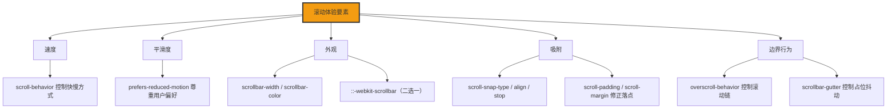

+++
title = "第26章 滚动属性"
weight = 260
date = "2026-03-27T16:53:00+08:00"
type = "docs"
description = ""
isCJKLanguage = true
draft = false
+++

# 第二十六章：滚动相关属性

> 想象一下，你在网上阅读一篇长文章，滚动鼠标滚轮时，页面像蜗牛一样卡顿，你会不会直接关掉网页？滚动体验直接影响用户的浏览感受。这一章我们就来学习如何让页面滚动丝滑如德芙巧克力！

## 26.1 平滑滚动

### 26.1.1 scroll-behavior: smooth——让锚点跳转和 scrollIntoView 方法平滑滚动

`scroll-behavior` 是 CSS 滚动体验的第一步。当你点击一个锚点链接时，页面是瞬间跳过去的，还是"滑"过去的？smooth 就是让滚动像坐滑梯一样平滑。

**什么是平滑滚动？**

想象你坐滑梯，顶部直接跳到地面（instant）和坐滑梯滑下去（smooth），你更喜欢哪个体验？smooth 就是 CSS 给你的"滑梯"。

```css
/* 平滑滚动基础 */

/* 1. 全局启用平滑滚动 */
html {
  scroll-behavior: smooth;
  /* 当你点击锚点链接时，页面会平滑滚动到目标位置 */
}

/* 2. 在特定容器上启用 */
.scroll-container {
  scroll-behavior: smooth;
  overflow-y: auto;
}

/* 3. 禁用平滑滚动（特殊情况）*/
.no-smooth-scroll {
  scroll-behavior: auto;
}
```

```html
<!DOCTYPE html>
<html>
<head>
  <style>
    html {
      scroll-behavior: smooth;  /* 全站启用平滑滚动 */
    }
  </style>
</head>
<body>
  <!-- 点击这个链接，页面会平滑滚动到目标位置 -->
  <a href="#section2">跳到第二部分</a>

  <section id="section1">
    <h2>第一部分</h2>
    <p>滚动鼠标滚轮，页面会平滑滚动</p>
  </section>

  <section id="section2">
    <h2>第二部分</h2>
    <p>看，页面是不是像滑梯一样平滑地滑下来了？</p>
  </section>
</body>
</html>
```

**scroll-behavior 的应用场景：**

```css
/* 1. 单页应用（SPA）的锚点跳转 */
html {
  scroll-behavior: smooth;
}

/* 2. 回到顶部按钮 */
/* 注意：scroll-behavior 要加在"滚动容器"上才生效。
   视口这个滚动容器对应的是根元素（html），
   所以回到顶部按钮自己写 scroll-behavior 是没用的——按钮又不滚。 */
.back-to-top {
  position: fixed;
  bottom: 30px;
  right: 30px;
  /* ❌ 在这里写 scroll-behavior: smooth; 是无效的
     ✅ 正确做法是把 smooth 设在 html 上，或用 JS 传 behavior: 'smooth' */
}

/* 3. Tab 切换内容区 */
.tab-content {
  scroll-behavior: smooth;
  overflow-y: auto;
}
```

> 📌 **四条必须知道的规则**（都来自规范原文）：
>
> 1. **它只管"非用户发起"的滚动**：锚点跳转、`scrollIntoView()` / `scrollTo()` 等滚动 API、以及自动的吸附修正会变平滑；**你手动滚鼠标滚轮、手指滑动不受影响**。
> 2. **它是给"滚动容器"用的**：写在 `html` 上会应用到视口；写在某个 `overflow: auto` 的盒子上，只影响那个盒子。
> 3. **它不会从 `<body>` 传播到视口**（这一点和 `overflow` 不一样）。所以想全局平滑就写在 `html` 上，写在 `body` 上不保证生效。
> 4. **`scroll-behavior` 不会被子元素继承**，每个滚动容器各管各的。

**无障碍提醒：一定要照顾"晕动症"用户。** 平滑滚动、大幅度视差动画会让部分用户眩晕，规范也明确允许浏览器忽略这个属性。标准做法是用 `prefers-reduced-motion` 让用户在系统里关掉动画时自动退回"瞬间跳转"：

```css
/* 默认平滑；用户系统开启"减弱动态效果"时自动关闭 */
@media (prefers-reduced-motion: no-preference) {
  html {
    scroll-behavior: smooth;
  }
}

/* 或者反过来写：先给 smooth，再用媒体查询关掉 */
@media (prefers-reduced-motion: reduce) {
  html {
    scroll-behavior: auto;
  }
}
```

**浏览器支持：** Chrome / Edge 61+、Firefox 36+、Safari 15.4+。Safari 在 15.4 之前完全不认这个属性，写上去也不会报错，只是"没效果"。

### 26.1.2 scrollIntoView()——JavaScript 方法，element.scrollIntoView({ behavior: 'smooth' })

`scrollIntoView` 是一个 JavaScript 方法，可以编程控制滚动到指定元素。配合 `behavior: 'smooth'` 参数就能实现平滑滚动。

```javascript
// JavaScript 中使用平滑滚动

// 获取要滚动到的元素
const targetElement = document.getElementById('section2');

// 方法1：默认（behavior 默认是 'auto'）
targetElement.scrollIntoView();
// 注意：'auto' 不是"一定瞬间跳转"！如果这个元素（或其滚动容器的计算值）
// 上有 scroll-behavior: smooth，'auto' 也会变成平滑滚动。

// 方法1.5：传布尔值 —— false 等同于"对齐到元素底部"
targetElement.scrollIntoView(false);  // block: 'end'，元素底边贴住容器底边

// 方法2：平滑滚动
targetElement.scrollIntoView({
  behavior: 'smooth'
});

// 方法3：滚动到元素顶部
targetElement.scrollIntoView({
  behavior: 'smooth',
  block: 'start'  // 'start'/'center'/'end'/'nearest'
});

// 方法4：滚动到元素并水平对齐
targetElement.scrollIntoView({
  behavior: 'smooth',
  inline: 'start'  // 'start'/'center'/'end'/'nearest'
});

// 方法5：完整API
targetElement.scrollIntoView({
  behavior: 'auto',          // 'auto' | 'instant' | 'smooth'
  block: 'start',            // 'start' | 'center' | 'end' | 'nearest'（默认 'start'）
  inline: 'nearest'          // 'start' | 'center' | 'end' | 'nearest'（默认 'nearest'）
});

// 方法6：强制"瞬间"跳转
// 即使 CSS 里写了 scroll-behavior: smooth，'instant' 也会无视它直接跳过去，
// 适合"页面加载时先瞬间定位到锚点，之后再平滑"这类需求。
document.getElementById('section2').scrollIntoView({ behavior: 'instant' });
```

> 📋 **参数默认值速查**（来自 CSSOM View 规范）：
>
> | 参数 | 默认值 | 可选值 |
> |------|--------|--------|
> | `behavior` | `'auto'` | `'auto'` / `'instant'` / `'smooth'` |
> | `block` | `'start'` | `'start'` / `'center'` / `'end'` / `'nearest'` |
> | `inline` | `'nearest'` | 同上 |
>
> `behavior: 'auto'` 的真正含义是"**看 CSS 怎么说**"：目标元素的计算 `scroll-behavior` 是 `smooth` 就平滑，否则瞬间；而 `'instant'` 是"**不管 CSS 说什么，都给我瞬间到位**"。

```javascript
// 实际应用：回到顶部按钮
const backToTopBtn = document.getElementById('backToTop');

backToTopBtn.addEventListener('click', () => {
  window.scrollTo({
    top: 0,
    behavior: 'smooth'  // 平滑滚动回顶部（推荐写法）
  });
});

// 另一种写法：把根元素滚进视野
backToTopBtn.addEventListener('click', () => {
  // ✅ 用 documentElement（标准模式下真正的滚动元素）
  document.documentElement.scrollIntoView({
    behavior: 'smooth',
    block: 'start'
  });

  // ❌ 不建议用 document.body.scrollIntoView()：
  //    body 有 margin 时可能滚不到真正的最顶部，
  //    某些情况下视口的滚动元素是 html 而不是 body。
  //    想要"绝对顶部"就用上面的 window.scrollTo({ top: 0 })，
  //    想拿滚动元素本身可以用 document.scrollingElement。
});
```

**scrollIntoView 的兼容性写法：**

```javascript
// 兼容性写法
function smoothScrollTo(element) {
  if ('scrollBehavior' in document.documentElement.style) {
    // 浏览器支持 smooth，直接用
    element.scrollIntoView({ behavior: 'smooth' });
  } else {
    // 降级方案：使用 setTimeout 模拟平滑
    const targetY = element.offsetTop;
    const startY = window.scrollY;   // window.pageYOffset 是旧的别名，已不推荐
    const duration = 500;  // 500ms
    const startTime = performance.now();

    function step(currentTime) {
      const elapsed = currentTime - startTime;
      const progress = Math.min(elapsed / duration, 1);
      const easeProgress = progress * (2 - progress);  // 缓动函数

      window.scrollTo(0, startY + (targetY - startY) * easeProgress);

      if (progress < 1) {
        requestAnimationFrame(step);
      }
    }

    requestAnimationFrame(step);
  }
}
```

## 26.2 自定义滚动条

### 26.2.1 ::-webkit-scrollbar——webkit 内核浏览器的滚动条整体样式

自定义滚动条是提升网页质感的重要细节。默认的滚动条又粗又丑，在某些设计风格下显得格格不入（比如精致的暗色主题），`::-webkit-scrollbar` 让你可以把它打扮得漂漂亮亮——换色、圆角、缩放，一个都不落下。

**什么是 ::-webkit-scrollbar？**

滚动条由几部分组成：`::-webkit-scrollbar` 是整体样式，`::-webkit-scrollbar-track` 是轨道（背景），`::-webkit-scrollbar-thumb` 是滑块（可以拖动的部分）。

```css
/* 自定义滚动条基础样式 */

/* 整体样式（宽高、圆角）*/
.custom-scrollbar {
  /* ⚠️ 先别急着抄这两个标准属性，看下面的"二选一"提醒 */
  scrollbar-width: thin;           /* 标准属性：auto | thin | none */
  scrollbar-color: #888 #f1f1f1;   /* 标准属性：滑块色 轨道色 */
}

.custom-scrollbar::-webkit-scrollbar {
  width: 8px;   /* 滚动条宽度 */
  height: 8px;  /* 滚动条高度 */
}

/* 轨道（背景）*/
.custom-scrollbar::-webkit-scrollbar-track {
  background: #f1f1f1;  /* 轨道背景色 */
  border-radius: 4px;   /* 圆角 */
}

/* 滑块（可拖动部分）*/
.custom-scrollbar::-webkit-scrollbar-thumb {
  background: #888;   /* 滑块颜色 */
  border-radius: 4px;  /* 圆角 */
  transition: background 0.2s;  /* hover 效果 */
}

/* hover 状态 */
.custom-scrollbar::-webkit-scrollbar-thumb:hover {
  background: #555;  /* 鼠标悬停时滑块变深 */
}
```

```html
<div class="custom-scrollbar" style="height: 300px; overflow-y: auto;">
  <p>滚动我！</p>
  <p>你会发现滚动条变好看了！</p>
  <p>这是一个自定义滚动条的演示区域</p>
  <p>内容足够多才会出现滚动条</p>
  <p>内容1</p>
  <p>内容2</p>
  <p>内容3</p>
  <p>内容4</p>
  <p>内容5</p>
  <p>内容6</p>
</div>
```

**`::-webkit-scrollbar` 的三个实用须知：**

| 须知 | 说明 |
|------|------|
| 只在 WebKit / Blink 生效 | Chrome、Edge、Safari、各类国产套壳浏览器可以；**Firefox 完全不认**，写了也没用 |
| 一旦给 `::-webkit-scrollbar` 设了宽高 | macOS 上原本"悬浮半透明"的滚动条会**变成常驻的经典滚动条**（占位置、不自动隐藏）。改动滚动条样式经常顺带改变了"什么时候出现"，设计时要注意 |
| 和标准属性冲突 | 前面的 `scrollbar-width` / `scrollbar-color` 一旦写了非 `auto` 值，Chromium / Safari 就会忽略 `::-webkit-scrollbar` |

**同一家族的其他伪元素**（都可以用，但支持同样只在 WebKit / Blink）：

```css
/* 滚动条的组成部分（不常用，但有时需要）*/
.full-scrollbar::-webkit-scrollbar-button {
  /* 两端的箭头按钮（很多平台上没有这个部件）*/
  display: none;
}

.full-scrollbar::-webkit-scrollbar-track-piece {
  /* 轨道里"没有被滑块盖住"的那部分 */
  background: #fafafa;
}

.full-scrollbar::-webkit-scrollbar-corner {
  /* 横竖滚动条交汇处的那个小方块 */
  background: #eee;
}
```

> 🧠 **一个冷知识**：CSS 工作组和 WebKit 团队都公开表示，当年把 `::-webkit-scrollbar` 这组私有伪元素暴露给 Web 是个"错误"（规范原文写的是 "considered a mistake by both the CSS Working Group and Webkit"）。原因正是上面那条——滚动条的内部结构由操作系统决定，各平台差异太大，暴露细节必然导致"在某些平台上好看、在另一些平台上崩"。所以才有了后来的标准属性 `scrollbar-width` / `scrollbar-color`。

### 26.2.2 ::-webkit-scrollbar-track——滚动条轨道（背景）

轨道是滚动条的"滑道"，滑块在上面滑动。

```css
/* 轨道样式 */

/* 基础轨道 */
.styled-track::-webkit-scrollbar-track {
  background: #f0f0f0;  /* 轨道背景 */
}

/* 有内边距的轨道 */
.padded-track::-webkit-scrollbar-track {
  background: #f9f9f9;
  padding: 2px;  /* 轨道内边距 */
}

/* 渐变轨道 */
.gradient-track::-webkit-scrollbar-track {
  background: linear-gradient(to right, #f0f0f0, #e0e0e0);
}

/* 有圆角的轨道 */
.rounded-track::-webkit-scrollbar-track {
  background: #f1f1f1;
  border-radius: 10px;
}
```

### 26.2.3 ::-webkit-scrollbar-thumb——滚动条滑块（可拖动部分）

滑块是用户可以拖动来控制滚动位置的"把手"。

```css
/* 滑块样式 */

/* 基础滑块 */
.styled-thumb::-webkit-scrollbar-thumb {
  background: #888;
  border-radius: 4px;
}

/* hover 效果 */
.hover-thumb::-webkit-scrollbar-thumb:hover {
  background: #555;
}

/* 更粗的滑块 */
.thick-thumb::-webkit-scrollbar-thumb {
  background: #666;
  border-radius: 8px;
}

/* 渐变滑块 */
.gradient-thumb::-webkit-scrollbar-thumb {
  background: linear-gradient(180deg, #3498db, #2980b9);
  border-radius: 4px;
}

/* 滑块悬停效果 */
.interactive-thumb::-webkit-scrollbar-thumb {
  background: #3498db;
  transition: background 0.2s;
}

.interactive-thumb::-webkit-scrollbar-thumb:hover {
  background: #2980b9;
}
```

### 26.2.4 scrollbar-width——滚动条宽度（标准属性）

Firefox 一直不支持 `::-webkit-scrollbar`，所以它和 Chromium 一起推动了标准属性 `scrollbar-width` / `scrollbar-color`。这两个属性**现在已经是通用写法**，不再是"Firefox 专属"：

| 属性 | Chrome / Edge | Firefox | Safari |
|------|---------------|---------|--------|
| `scrollbar-width` | 121+ | 64+ | 18.2+ |
| `scrollbar-color` | 121+ | 64+ | 26.2+ |

```css
/* 标准属性写法（推荐优先用这套） */

/* scrollbar-width: auto | thin | none */
.thin-scrollbar {
  scrollbar-width: thin;           /* 更细的滚动条 */
  scrollbar-color: #888 #f1f1f1;   /* 滑块色 轨道色 */
}

/* none：滚动条"不可见"，但仍然可以滚动
   （⚠️ 只是看不见，内容依然能滚；这也是很多教程里"隐藏滚动条但保留滚动"的写法）*/
.hidden-scrollbar {
  scrollbar-width: none;
}
```

> ⚠️ **最重要的一条：`scrollbar-width` / `scrollbar-color` 与 `::-webkit-scrollbar` 是"二选一"关系。**
>
> 在 Chrome 121+ / Safari 18.2+ 里，只要 `scrollbar-width` 或 `scrollbar-color` 取了**非 `auto`** 的值，浏览器就会**忽略 `::-webkit-scrollbar` 系列的样式**，改用标准属性去画滚动条。反过来，如果只写 `::-webkit-scrollbar`，在 Firefox 里则完全没效果。
>
> 所以"两套都写"不是叠加，而是**互相打架**——旧版教程里常见的下面这种写法，在 Chrome 121+ 上会以 `scrollbar-width` 为准：
>
> ```css
> /* ⚠️ 结果不确定：新旧两套同时生效时，Chromium 优先用标准属性 */
> .conflict {
>   scrollbar-width: thin;         /* 这行会让下面的 ::-webkit-scrollbar 失效 */
>   scrollbar-color: red yellow;   /* 这行也会 */
> }
>
> .conflict::-webkit-scrollbar {
>   width: 12px;                   /* 在旧 Chromium 上生效，在新版上可能被忽略 */
> }
> ```
>
> **实践建议**：
>
> - 只需要"细一点 / 换个颜色"→ 只用 `scrollbar-width` + `scrollbar-color`，简单、跨浏览器；
> - 需要"圆角、渐变、hover 变色"这类精细控制 → 只用 `::-webkit-scrollbar`（接受 Firefox 里是默认样式）。

**`scrollbar-width: none` 与"隐藏滚动条"的正确姿势：**

```css
/* 隐藏滚动条，但内容仍然可以滚动（移动端常见的横向滚动列表）*/
/* 注意：滚动条没了会削弱"这里可以滚"的提示，无障碍上要谨慎 */
.hide-scrollbar {
  scrollbar-width: none;          /* Firefox / 新版 Chromium */
}

.hide-scrollbar::-webkit-scrollbar {
  display: none;                  /* 旧版 Chromium / WebKit */
}
```

### 26.2.5 scrollbar-color——scrollbar-color: thumb-color track-color

`scrollbar-color` 的语法就是"滑块颜色 轨道颜色"，顺序不能反。它的初始值是 `auto`（跟随系统/UA），也可以只指定滑块颜色、轨道写 `auto`。

```css
/* scrollbar-color 语法 */

/* 滑块颜色 轨道颜色 */
.colored-scrollbar {
  scrollbar-color: #3498db #f1f1f1;
  /* 滑块是蓝色，轨道是浅灰色 */
}

/* ⚠️ scrollbar-color 的值只有两种：auto，或者"两个颜色"
   想只改滑块颜色是做不到的，必须把轨道颜色也一起给出 */
/* .thumb-only { scrollbar-color: #3498db auto; }  ❌ 这是无效值 */

/* 恢复默认 */
.default-scrollbar {
  scrollbar-color: auto;
}

/* 常见颜色组合 */
.blue-scrollbar {
  scrollbar-color: #3498db #e8f4fc;
}

.green-scrollbar {
  scrollbar-color: #2ecc71 #e8f8f5;
}

.purple-scrollbar {
  scrollbar-color: #9b59b6 #f4ecf7;
}

/* 深色主题滚动条 */
.dark-scrollbar {
  scrollbar-color: #555 #2c2c2c;
  /* 滑块深灰，轨道更深灰 */
}
```

> 📌 **两个容易忽略的细节：**
>
> 1. **`scrollbar-color` 是"继承属性"**（`scrollbar-width` 不是）。所以写在容器上，内部滚动区域也会跟着变色；而 `scrollbar-width` 必须逐个滚动容器写。
> 2. **写在根元素上时会应用到视口**，但和 `overflow` 不同：写在 `<body>` 上的 `scrollbar-color` **不会**传播到视口。
>
> 另外，规范还顺带提了一句心态问题：滚动条是操作系统级的交互控件，`scrollbar-width` 的定位是"给紧凑的小区域用细滚动条"，而不是"让每个网站都长出自己风格的滚动条"——用户可以在系统设置里覆盖它，浏览器也可以直接忽略。**所以别把自定义滚动条当成"必须生效"的设计细节。**

## 26.3 滚动快照

### 26.3.1 scroll-snap-type——x（水平吸附）/ y（垂直吸附）/ block / inline / both / mandatory（强制吸附）/ proximity（接近才吸附）

滚动快照（Scroll Snap）是一种"强制的优雅"。当用户滚动停止时，页面会自动吸附到某个"快照点"，让滚动有一个明确的停止位置，而不是随意停在任何地方。

**什么是滚动快照？**

想象你翻杂志，翻一页是一整页，不会停在半页中间——那太难受了对吧？滚动快照就是这个效果——页面滚动时会自动"翻页"到完整的内容区块。用户松手后，CSS 帮你决定停在哪，不用担心停在尴尬的位置。

```css
/* 滚动快照容器 */
.scroll-snap-container {
  /* ① 容器必须"能滚"（是个滚动容器），否则吸附无从谈起 */
  overflow-y: auto;
  height: 300px;             /* 有确定高度，内容才会溢出、才会出现滚动 */

  /* ② 语法：scroll-snap-type: <轴向> <严格程度> */
  scroll-snap-type: y mandatory;
  /*   轴向：none（关闭）| x | y | block | inline | both
     严格程度：mandatory（必须停在吸附点）| proximity（接近时才吸附，默认值）*/
}
```

```html
<div class="scroll-snap-container">
  <section class="snap-item">第1页</section>
  <section class="snap-item">第2页</section>
  <section class="snap-item">第3页</section>
</div>
```

**一个能直接跑起来的完整例子（横向幻灯片）：**

```css
/* 横向滚动的幻灯片/轮播 */
.carousel {
  display: flex;
  overflow-x: auto;
  height: 200px;
  scroll-snap-type: x mandatory;   /* 水平方向，强制吸附 */
  scroll-behavior: smooth;          /* 让"上一张/下一张"这类程序滚动也平滑 */
}

.carousel > .slide {
  flex: 0 0 100%;                   /* 每张幻灯片占满容器宽度 */
  scroll-snap-align: start;         /* 停靠时把它的左边缘对齐容器左边缘 */
  scroll-snap-stop: always;         /* 一次只能翻一张，不能"甩过头" */
}
```

```html
<div class="carousel">
  <section class="slide">第 1 张</section>
  <section class="slide">第 2 张</section>
  <section class="slide">第 3 张</section>
</div>
```

> ⚠️ **`mandatory` 的经典翻车点：内容会变得"滚不到"。** 规范里有两条相关说明：
>
> 1. **吸附项比容器大时**（比如一张图比视口还高），规范要求"只要这个吸附区域还盖满整个滚动视口，任意滚动位置都算有效吸附位置"——所以现代浏览器允许你在这一项内部自由滚动，不会死锁。
> 2. **真正危险的是"吸附点稀疏"的情况**：如果吸附区域之间隔着很大的空隙，中间的内容就可能永远滚不出来。规范举的例子特别典型——把 `mandatory` 加在每一节的**标题**上（而不是整节），结果第一节和最后一节的一部分内容就**再也看不到了**。规范原话是："这就是为什么不该把强制吸附点放在可能相距很远、彼此不挨着的元素上。"
>
> **实践判断标准**：只有当**每个吸附项都能完整展示**、且吸附项彼此相邻时，才用 `mandatory`；内容长度不可控（比如文章正文）时请用 `proximity`，或者干脆不吸附。这也是很多"全屏滚动页面在手机上滚不动"的根源。
>
> 💡 **两个补充**：
>
> - 吸附只认"带 `scroll-snap-align` 的后代盒子"，不要求是直接子元素，但通常写成直接子元素最直观；
> - `scroll-snap-type` 与 `scroll-behavior: smooth` 是"黄金搭档"：吸附负责"停在哪"，平滑负责"怎么过去"。

### 26.3.2 scroll-snap-align——start（吸附到起点）/ end（吸附到终点）/ center（吸附到中心）

`scroll-snap-align` 决定内容在吸附时的对齐方式。

```css
/* 每个快照项的吸附对齐 */

/* 默认：不参与吸附 */
.snap-none {
  scroll-snap-align: none;  /* 初始值，等价于"这个元素不提供吸附点" */
}

/* 吸附到起始边（左侧或顶部）*/
.snap-start {
  scroll-snap-align: start;
}

/* 吸附到结束边（右侧或底部）*/
.snap-end {
  scroll-snap-align: end;
}

/* 吸附到中心 */
.snap-center {
  scroll-snap-align: center;
}

/* 两个值：分别指定"块轴"和"行内轴"的对齐
   语法：scroll-snap-align: <块轴> <行内轴>?，只写一个时两轴相同 */
.snap-both-axes {
  scroll-snap-align: start center;
  /* 垂直滚动容器里：块轴 = 竖直方向 → start（顶边对齐）
     同时横向滚过来时：行内轴 = 水平方向 → center（水平居中）
     常见于"横向图片画廊，垂直方向也要顶部对齐"的场景 */
}
```

> 💡 **三个取值怎么选？**
>
> - `start`：最常用。卡片/幻灯片从左上角开始对齐，符合"从头读"的直觉；
> - `center`：适合图片画廊，让图片居中、左右两侧露出邻居的一小条，暗示"还能继续滑"；
> - `end`：让内容**末尾**对齐容器末尾，常见于"从右往左"的布局或最后一个项目要贴边的情况。

### 26.3.3 scroll-snap-stop——normal（默认，可跳过吸附点）/ always（必须停在每个吸附点）

`scroll-snap-stop` 控制"一次滑动/滚轮能不能越过多个吸附点"。

```css
/* 强制停在每个快照点 */
.must-stop {
  scroll-snap-align: start;
  scroll-snap-stop: always;
  /* 即使一次擦动很快、惯性很大，也必须在下一个吸附点停下，
     不能"一路滑过"三四张幻灯片 */
}

/* 可以跳过快照点（默认）*/
.can-skip {
  scroll-snap-align: start;
  scroll-snap-stop: normal;  /* 初始值：允许一次滑过多个吸附点 */
}
```

> 📌 **细节补充：**
>
> - `always` 挡的是"一次手势内越过多个吸附点"，**不会**让锚点跳转、`scrollIntoView` 之类的一次性定位被拦住；
> - 支持情况：Chrome / Edge 75+、Firefox 103+、Safari 15+。在此之前 Safari 只认 `normal` 的效果（写 `always` 会被忽略），所以 "必须一张一张翻" 的需求要有兜底意识（比如用 JS 处理滚动按钮）。

## 26.4 滚动内边距与外边距

### 26.4.1 scroll-padding——滚动容器的内边距，影响 scroll-snap 的吸附位置

`scroll-padding` 让你可以在滚动容器内部留出一块"缓冲区"，这样吸附点就不会紧贴容器边缘。

```css
/* scroll-padding 示例 */

/* 滚动容器内边距 */
.snap-container {
  overflow-x: auto;
  scroll-snap-type: x mandatory;
  /* 吸附位置距离边缘留出空间 */
  scroll-padding: 20px;
}

/* 只设置某一边 */
.one-side-padding {
  scroll-padding-top: 40px;   /* 顶部留40px空间 */
  scroll-padding-bottom: 20px;  /* 底部留20px空间 */
}
```

> ⚠️ **`scroll-padding` 不是 `padding`。** 它不改内容布局、不把内容往里挤，而是调整"滚动的参照框（snapport）"——也就是告诉浏览器："判断'滚到位了没有'的时候，把容器上下左右各削掉这么多"。所以它既能修正吸附位置，也能修正 `scrollIntoView()` 和锚点跳转的落点。
>
> 💡 **它最出名的用途：配合 `position: sticky` 的固定头部。** 有吸顶导航时，点锚点跳过去，标题往往被导航盖住——`scroll-padding-top` 就是官方解法，不需要再给每个标题加 `scroll-margin`：
>
> ```css
> :root {
>   --header-height: 64px;
> }
>
> html {
>   scroll-padding-top: var(--header-height);  /* 锚点跳转时不钻到吸顶导航下面 */
>   scroll-behavior: smooth;
> }
>
> header {
>   position: sticky;
>   top: 0;
>   height: var(--header-height);
> }
> ```

**`scroll-padding` 的完整长属性：**

| 长属性 | 说明 |
|--------|------|
| `scroll-padding-top` / `right` / `bottom` / `left` | 物理方向 |
| `scroll-padding-block` / `scroll-padding-inline` | 逻辑方向（跟随书写模式） |
| `scroll-padding-block-start` 等 | 更细的逻辑方向长属性 |

> 📌 **浏览器支持**：Chrome / Edge 69+、Firefox 68+、Safari 14.1+。Safari 11~14 之间存在一个坑（WebKit bug 179379）：`scroll-padding` 对"跳到锚点"和 `scrollIntoView()` **不生效**，只对吸附生效。如果需要兼容这批老 Safari，可以改用给目标元素加 `scroll-margin`，或者用 JS 手动偏移。

### 26.4.2 scroll-margin——滚动项目的外部边距，同样影响吸附计算

`scroll-margin` 是在滚动项目本身上设置的，影响吸附位置的计算。

```css
/* scroll-margin 示例 */

/* 每个滚动项目的外边距 */
.snap-item {
  scroll-snap-align: start;
  scroll-margin: 10px;  /* 吸附位置会考虑这个边距 */
}

/* 只设置某一边 */
.first-item {
  scroll-margin-left: 30px;  /* 左边距30px */
}
```

> 💡 **`scroll-margin` 和 `scroll-padding` 的区别，一句话就够：**
>
> | | 写在哪 | 类比 | 适合 |
> |---|---|---|---|
> | `scroll-padding` | **滚动容器**上 | 给容器"内缩一圈" | 吸顶导航、统一给所有锚点留白 |
> | `scroll-margin` | **滚动的目标元素**上 | 给元素"外扩一圈" | 只给某几个元素留白、表单聚焦时留出轮廓空间 |
>
> 两者效果类似（都会改变最终滚动位置），同时使用时**相加**。`scroll-margin` 还有两个实用场景：
>
> 1. **表单聚焦**：`input:focus` 用 `element.focus()` 滚进视野时，配合 `scroll-margin-top` 可以避免输入框贴着视口边缘；
> 2. **焦点轮廓**：`scroll-margin` 给 `:focus-visible` 的光圈留出空间，避免轮廓线被容器裁掉。
>
> 它同样有物理/逻辑长属性（`scroll-margin-top`、`scroll-margin-block-start` 等），浏览器支持与 `scroll-padding` 相同（Safari 14.1 之前叫 `scroll-snap-margin`，且同样不作用于锚点跳转）。

## 26.5 scrollbar-gutter

### 26.5.1 scrollbar-gutter——让"滚动条占的位置"变得可预测

经典滚动条会**占宽度**。于是就有了那个经典现象：从"内容少、没滚动条"的页面点进"内容多、有滚动条"的页面时，整个页面的内容会突然向左挪几像素，像抖了一下。这类因滚动条出现/消失造成的"布局抖动（layout shift）"，正是 `scrollbar-gutter` 要解决的问题。

它的完整取值只有三档：

| 取值 | 含义 |
|------|------|
| `auto` | 初始值。滚动条出现时才占位置（`overflow: auto` 溢出时；`overflow: scroll` 则始终占位） |
| `stable` | 只要 `overflow` 是 `hidden` / `scroll` / `auto`，**不管内容是否溢出都预留**那一块空间 |
| `stable both-edges` | 同上，并且**两侧对称预留**（居中布局不会因为滚动条跑到一边而偏斜） |

```css
/* scrollbar-gutter 解决布局抖动 */

/* ① 默认行为：没滚动条就不留空 */
.default-gutter {
  scrollbar-gutter: auto;
  overflow-y: auto;
}

/* ② stable：即使内容没溢出，也把滚动条的位置留出来 */
/*    场景：站点里有的页面长、有的页面短，靠它保证各页面内容宽度一致 */
.stable-layout {
  scrollbar-gutter: stable;
  overflow-y: auto;   /* 必须声明 overflow，否则这个盒子根本不是滚动容器 */
}

/* ③ stable both-edges：两侧各留一半，视觉上保持居中 */
.centered-layout {
  scrollbar-gutter: stable both-edges;
  overflow-y: auto;
}
```

> 📌 **五条关键细节：**
>
> 1. **只对"滚动容器"生效**（规范：Applies to: scroll containers），普通 `display: block` 的盒子写了也没用；
> 2. **它只管"留不留位置"，不管"滚动条显不显示"**——`stable` 不会让滚动条常驻，只是把它的坑位留下；
> 3. **写在根元素上会应用到视口**（和 `overflow` 一样），但**和 `overflow` 不同的是：它不会从 `<body>` 传播到视口**，所以全局设置要写在 `html` 上；
> 4. **对"覆盖式滚动条"（overlay scrollbars）没有效果。** macOS / iOS 默认的悬浮滚动条不占空间，所以规范规定此时**不存在滚动条沟槽**——你在 Mac 上用 Safari 试这个属性，很可能"看不到任何变化"，但换成 Windows 或把系统设置改成"始终显示滚动条"就能看到；
> 5. **别再用 `overflow-y: scroll` 硬凑了。** 老办法是靠"永远显示滚动条"来消除抖动，代价是没内容时也常驻一条空滚动条；`scrollbar-gutter: stable` 才是为这个需求设计的解法。
>
> **浏览器支持：** Chrome / Edge 94+、Firefox 97+、Safari 18.2+。Safari 的支持来得比较晚，这也是它相对"冷门"的原因之一。

## 26.6 overscroll-behavior

### 26.6.1 滚动链控制：auto（默认）/ contain（禁止滚动链）/ none（连"弹性/回弹"也一并禁掉）

滚动链（Scroll Chaining）是一个"爱管闲事"的行为——当一个滚动区域滚到底了，继续滚动竟然还会带动外部父容器一起滚。听起来很贴心，但在嵌套滚动场景下，这种"贴心"往往让人崩溃。

```css
/* overscroll-behavior 示例 */

/* 禁止滚动链：子容器滚到底不带动父容器 */
.no-chain {
  overflow-y: auto;              /* ⚠️ 必须是滚动容器才有意义 */
  overscroll-behavior-y: contain;
  /* 滚到底后不再带动父容器滚动，
     但保留"本地回弹/发光"这类 overscroll 反馈效果 */
}

/* 默认行为：允许滚动链，也允许本地反馈效果 */
.with-chain {
  overscroll-behavior: auto;
}

/* contain + 连本地反馈效果一起禁掉（iOS 橡皮筋、下拉刷新、滑动返回都可能被抑制）*/
.no-bounce {
  overscroll-behavior: none;
}
```

**三个取值到底差在哪？**（依据规范原文）

| 取值 | 阻止"滚动链"（把滚动传给父容器） | 阻止"本地 overscroll 反馈"（回弹、发光、下拉刷新等） |
|------|-------------------------------|--------------------------------------------------|
| `auto`（初始值） | ✗ 不阻止 | ✗ 不阻止 |
| `contain` | ✓ 阻止 | ✗ **不阻止** |
| `none` | ✓ 阻止 | ✓ 阻止 |

> 所以 `none` = `contain` 的效果 **再叠加**"连弹性反馈也不要"。想只解决"外层页面跟着乱滚"就用 `contain`；想做无限滚动（滚到底自己加载更多，不希望触发下拉刷新）才用 `none`。
>
> ⚠️ **必须是滚动容器。** 规范明确写着：不是滚动容器的元素会"接受但忽略"这个属性的值。另外，较早的浏览器实现（Chrome 144 之前、Firefox 150 之前）还要求这个容器**真的有可滚动的内容**，否则属性无效——所以给一个"内容没溢出的盒子"加 `overscroll-behavior` 是白费力。
>
> 💡 **浏览器支持：** Chrome / Edge 63+、Firefox 59+、Safari 16+。

### 26.6.2 overscroll-behavior-x / overscroll-behavior-y——分别控制水平和垂直方向

```css
/* 分别控制两个方向 */

/* 禁止水平滚动链 */
.no-x-chain {
  overscroll-behavior-x: contain;
}

/* 允许垂直滚动链 */
.allow-y-chain {
  overscroll-behavior-y: auto;
}
```

`overscroll-behavior` 是上面两个长属性的缩写，规则和 `overflow` 一样：**写一个值表示横竖都用，写两个值按"先 x 后 y"的顺序分别指定。**

```css
/* 缩写：只写一个值 = 两个方向都是 contain */
.both-contain {
  overscroll-behavior: contain;
}

/* 缩写：两个值 = 横轴 contain、纵轴 none */
.mixed {
  overscroll-behavior: contain none;
}

/* 逻辑方向版本（跟随书写模式，横排中文/英文下与物理方向一致）*/
.logical {
  overscroll-behavior-inline: contain;  /* 行内方向（横排 ≈ 水平）*/
  overscroll-behavior-block: none;      /* 块级方向（横排 ≈ 垂直）*/
}
```

> 💡 **最经典的两个实战场景：**
>
> ```css
> /* 场景 1：弹窗/抽屉打开时，背景页面不要跟着滚 */
> body.modal-open {
>   overflow: hidden;
> }
>
> .modal-scroll-area {
>   overflow-y: auto;
>   overscroll-behavior: contain;  /* 弹窗内容滚到底，别把背景页面带走 */
> }
>
> /* 场景 2：手机上的"无限滚动"列表，防止下拉刷新打断浏览 */
> .infinite-list {
>   overflow-y: auto;
>   overscroll-behavior-y: none;   /* 既不让父容器滚，也不触发下拉刷新 */
> }
> ```

---

## 本章小结

### 核心知识点

| 属性 | 说明 |
|------|------|
| scroll-behavior | 平滑滚动（只影响锚点/API 滚动，要照顾 `prefers-reduced-motion`） |
| scrollIntoView() / scrollTo() | JavaScript 滚动 API，`behavior: 'auto' / 'instant' / 'smooth'` |
| ::-webkit-scrollbar | 自定义滚动条（仅 WebKit / Blink） |
| scrollbar-width / scrollbar-color | 自定义滚动条（标准属性，与上面二选一） |
| scroll-snap-type | 滚动吸附的轴向与严格度 |
| scroll-snap-align | 吸附项的对齐方式 |
| scroll-snap-stop | 能否"一次滑过多张" |
| scroll-padding | 滚动容器内的"参照框内缩"，锚点跳转与吸附都受益 |
| scroll-margin | 目标元素的外扩边距，与 scroll-padding 互补 |
| scrollbar-gutter | 滚动条沟槽占位，避免布局抖动 |
| overscroll-behavior | 滚动链与回弹效果控制 |

### 滚动体验要素


```mermaid
graph TD
    A["滚动体验要素"] --> B["速度"]
    A --> C["平滑度"]
    A --> D["外观"]
    A --> E["吸附"]
    A --> F["边界行为"]

    B --> B1["scroll-behavior 控制快慢方式"]
    C --> C1["prefers-reduced-motion 尊重用户偏好"]
    D --> D1["scrollbar-width / scrollbar-color"]
    D --> D2["::-webkit-scrollbar（二选一）"]
    E --> E1["scroll-snap-type / align / stop"]
    E --> E2["scroll-padding / scroll-margin 修正落点"]
    F --> F1["overscroll-behavior 控制滚动链"]
    F --> F2["scrollbar-gutter 控制占位抖动"]

    style A fill:#f39c12,stroke:#333,stroke-width:3px
```

### 本章易错点速查

| 容易写错的地方 | 正确认识 |
|----------------|----------|
| 给按钮元素写 `scroll-behavior: smooth` 就能平滑 | 它只对**滚动容器**生效（视口对应根元素 `html`），写在按钮上无效 |
| `scroll-behavior` 能让鼠标滚轮变平滑 | 不对。它只管锚点跳转、滚动 API、自动吸附修正；**用户手动滚动不受影响** |
| 写在 `<body>` 上就能全局生效 | 它**不会**从 `body` 传播到视口（`overflow` 才会），请写在 `html` 上 |
| 平滑滚动越多越好 | 忽视 `prefers-reduced-motion` 会让晕动症用户体验很差，规范也允许浏览器直接忽略该属性 |
| `scrollIntoView({ behavior: 'auto' })` 一定是瞬间跳 | `auto` 是"听 CSS 的"：CSS 里是 `smooth` 就平滑。要强制瞬间要用 `'instant'` |
| `window.pageYOffset` 是新写法 | 它是 `window.scrollY` 的旧别名，已不推荐使用 |
| 用 `document.body.scrollIntoView()` 回到顶部 | 标准模式下滚动元素是 `html`，应该用 `document.documentElement` 或直接 `window.scrollTo({top: 0})` |
| Firefox 不支持自定义滚动条 | 现在 `scrollbar-width` / `scrollbar-color` 已是通用标准属性（Chrome 121+ / Safari 18.2+） |
| 新旧两套滚动条样式可以叠加使用 | 一旦 `scrollbar-width` / `scrollbar-color` 取了非 `auto` 值，Chromium / Safari 会**忽略** `::-webkit-scrollbar` |
| `scrollbar-color` 可以只写滑块颜色 | 它的合法值只有 `auto` 或"两个颜色"，只写一个是无效值 |
| `scrollbar-width: none` 会让内容滚不动 | 只是滚动条不可见，滚动依旧可用（但会削弱"此处可滚"的提示） |
| 吸附项的高度超过容器就会卡死 | 规范要求"吸附区域盖满视口时任意位置都是有效吸附位置"，所以内部仍可滚；真正会出事的是**吸附点过于稀疏**，会造成部分内容不可达 |
| 不写严格度也能强制吸附 | `proximity` 是默认值，要强制吸附必须显式写 `mandatory` |
| `scroll-snap-type` 写在元素上就生效 | 容器必须先是个**滚动容器**（有 `overflow` + 溢出内容），否则没有任何吸附 |
| `scroll-padding` 相当于给容器加 `padding` | 它不改内容布局，只调整滚动定位的参照框；写长属性时要用 `scroll-padding-top` 这类名字 |
| `scrollbar-gutter: stable` 只有 Firefox 支持 | 现在 Chrome 94+ / Firefox 97+ / Safari 18.2+ 都支持；但**对 macOS 的覆盖式滚动条无效** |
| 用 `overflow-y: scroll` 消除抖动 | 那会让滚动条常驻（没内容时也占一条）。应使用 `scrollbar-gutter: stable` |
| `overscroll-behavior: contain` 和 `none` 一样 | `contain` 只挡滚动链；`none` 还会同时禁掉回弹、下拉刷新等本地反馈 |
| `overscroll-behavior` 写哪儿都生效 | 只对**滚动容器**有效；早期实现还要求它确有可滚动内容 |
| `scroll-snap-stop: always` 在哪些浏览器都生效 | Chrome 75+ / Firefox 103+ / Safari 15+ 才支持，老 Safari 会忽略它 |

### 下章预告

下一章我们将学习逻辑属性与书写模式，支持全球化的 CSS！
