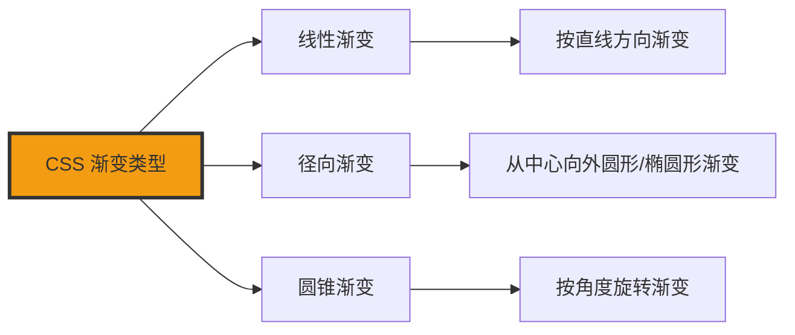

+++
title = "第28章 CSS渐变"
weight = 280
date = "2026-03-27T16:53:00+08:00"
type = "docs"
description = ""
isCJKLanguage = true
draft = false
+++

# 第二十八章：CSS 渐变

> 想象一下，你有一支画笔，但这支画笔可以自动从一种颜色渐变到另一种颜色——渐变就是 CSS 给你的"魔法画笔"。渐变可以替代图片，减小文件体积；渐变可以创造纯色无法实现的视觉效果。学会渐变，你的网页设计水平直接提升一个档次！从此告别"甲方说这个蓝不够蓝"的噩梦！

## 28.1 线性渐变

### 28.1.1 基本语法——linear-gradient(direction, color-stop1, color-stop2)

线性渐变是最常用的渐变类型。想象一下彩虹🌈，就是一种从一种颜色过渡到另一种颜色的效果。

**什么是线性渐变？**

想象你用喷漆罐喷墙，从左边喷红色，往右慢慢变成蓝色。线性渐变就是这种"颜色从一端渐变到另一端"的效果。

```css
/* 线性渐变基础语法 */

/* 最简单的两色渐变 */
.simple-gradient {
  background: linear-gradient(red, blue);
  /* 从红色渐变到蓝色，默认方向是从上到下 */
}

/* 带方向的三色渐变 */
.directional-gradient {
  background: linear-gradient(to right, red, green, blue);
  /* 从左到右：红 → 绿 → 蓝 */
}

/* 颜色后面加百分比控制渐变位置 */
.positioned-gradient {
  background: linear-gradient(to right, red 0%, blue 100%);
  /* 红色从0%开始，蓝色到100%结束 */
}
```

```html
<div class="simple-gradient" style="height: 200px;">
  从上到下的红蓝渐变
</div>

<div class="directional-gradient" style="height: 200px;">
  从左到右的红绿蓝渐变
</div>
```

**渐变角度的计算：**

```css
/* 角度与方向对照 */

/* 0deg = to top（向上）*/
.deg0 {
  background: linear-gradient(0deg, red, blue);
}

/* 90deg = to right（向右）*/
.deg90 {
  background: linear-gradient(90deg, red, blue);
}

/* 180deg = to bottom（向下）*/
.deg180 {
  background: linear-gradient(180deg, red, blue);
}

/* 270deg = to left（向左）*/
.deg270 {
  background: linear-gradient(270deg, red, blue);
}
```

### 28.1.2 方向写法——to bottom, to right, to top, to left, 角度

线性渐变的方向可以用关键字（to top/bottom/left/right）或角度（45deg、90deg）来指定。

```css
/* 关键字方向写法 */

/* to top：从下到上 */
.to-top {
  background: linear-gradient(to top, red, blue);
}

/* to bottom：从上到下（默认）*/
.to-bottom {
  background: linear-gradient(to bottom, red, blue);
}

/* to left：从右到左 */
.to-left {
  background: linear-gradient(to left, red, blue);
}

/* to right：从左到右 */
.to-right {
  background: linear-gradient(to right, red, blue);
}

/* 对角线方向 */
.to-top-right {
  background: linear-gradient(to top right, red, blue);
}

.to-bottom-left {
  background: linear-gradient(to bottom left, red, blue);
}

/* 角度写法（更精确）*/
.degree45 {
  background: linear-gradient(45deg, red, blue);
}

.degree135 {
  background: linear-gradient(135deg, red, blue);
}

.degree225 {
  background: linear-gradient(225deg, red, blue);
}
```

```
角度与方向对照图：

                         0deg (to top)
                              ↑
                              │
                              │
                     315deg  ←  ────┼───  →  45deg
                              │
                              │
                              ↓
                        270deg (to left)

                         180deg (to bottom)
```

### 28.1.3 多色渐变

渐变不限于两种颜色，你可以添加任意多种颜色。

```css
/* 三色渐变 */
.three-colors {
  background: linear-gradient(to right, red, yellow, green);
  /* 红 → 黄 → 绿 */
}

/* 四色渐变 */
.four-colors {
  background: linear-gradient(to right, red, orange, yellow, green);
  /* 彩虹效果的基础 */
}

/* 五色渐变：完整的彩虹 */
.rainbow {
  background: linear-gradient(
    to right,
    red 0%,
    orange 20%,
    yellow 40%,
    green 60%,
    blue 80%,
    purple 100%
  );
}

/* 彩虹渐变（简化版）*/
.rainbow-simple {
  background: linear-gradient(
    to right,
    red 0%,
    orange 17%,
    yellow 33%,
    green 50%,
    blue 67%,
    indigo 84%,
    violet 100%
  );
}
```

```html
<div class="rainbow" style="height: 100px;">
  彩虹渐变条
</div>

<div class="three-colors" style="height: 150px;">
  三色渐变
</div>
```

### 28.1.4 渐变色停止点

颜色后面可以加百分比来控制颜色在渐变中的位置。

```css
/* 自定义色停位置 */

/* 颜色停在指定位置 */
.custom-stops {
  background: linear-gradient(
    to right,
    red 0%,
    blue 30%,       /* 30%位置变成蓝色 */
    green 70%,      /* 70%位置变成绿色 */
    yellow 100%
  );
}

/* 中间色带（硬边）*/
.hard-stops {
  background: linear-gradient(
    to right,
    red 0%,
    red 25%,       /* 0%-25%之间都是红色 */
    blue 25%,       /* 25%位置开始变蓝 */
    blue 50%,       /* 50%位置过渡到绿色（硬边界）*/
    green 50%,      /* 50%开始是绿色 */
    green 100%
  );
}

/* 重复渐变图案 */
.repeating {
  background: repeating-linear-gradient(
    to right,
    red 0px,
    red 20px,
    blue 20px,
    blue 40px
  );
}
```

## 28.2 径向渐变

### 28.2.1 radial-gradient——圆形或椭圆渐变，从一点向四周扩散

径向渐变是从一个中心点向外扩散的渐变，想象一下石头掉进水里产生的涟漪。

**什么是径向渐变？**

想象你往水里滴了一滴墨水，墨水会从中心点向四周扩散，越远越淡。径向渐变就是这种效果。

```css
/* 径向渐变基础 */

/* 圆形渐变（从中心向四周）*/
.radial-circle {
  background: radial-gradient(circle, red, blue);
  /* 从红色圆心渐变到蓝色边缘 */
}

/* 椭圆渐变（默认）*/
.radial-ellipse {
  background: radial-gradient(ellipse, red, blue);
  /* 椭圆形的渐变 */
}

/* 指定颜色位置 */
.radial-positioned {
  background: radial-gradient(
    circle at center,  /* 圆心在中心 */
    red 0%,
    blue 100%
  );
}
```

### 28.2.2 at 位置——at center（圆心在中心，默认）、at top left、at 50% 50%

渐变从哪里开始（圆心位置）可以用 `at` 关键字指定。

```css
/* 圆心位置 */

/* at center：圆心在正中间（默认）*/
.at-center {
  background: radial-gradient(circle at center, red, blue);
}

/* at top：圆心在顶部 */
.at-top {
  background: radial-gradient(circle at top, red, blue);
}

/* at bottom：圆心在底部 */
.at-bottom {
  background: radial-gradient(circle at bottom, red, blue);
}

/* at top left：圆心在左上角 */
.at-corner {
  background: radial-gradient(circle at top left, red, blue);
}

/* at 百分比位置：圆心在 30% 70% 位置 */
.at-percentage {
  background: radial-gradient(circle at 30% 70%, red, blue);
}
```

### 28.2.3 颜色过渡方式——closest-side、farthest-side、closest-corner、farthest-corner

径向渐变的形状由"closest-side"（最近的边）和"farthest-corner"（最远的角）控制。

```css
/* closest-side：渐变延伸至最近的边 */
.closest-side {
  background: radial-gradient(
    circle closest-side at center,
    red, blue
  );
  /* 渐变在碰到最近的边时停止 */
}

/* farthest-corner：渐变延伸至最远的角（默认）*/
.farthest-corner {
  background: radial-gradient(
    circle farthest-corner at center,
    red, blue
  );
  /* 渐变延伸至最远的角 */
}

/* closest-corner：渐变延伸至最近的角 */
.closest-corner {
  background: radial-gradient(
    circle closest-corner at center,
    red, blue
  );
}

/* farthest-side：渐变延伸至最远的边 */
.farthest-side {
  background: radial-gradient(
    circle farthest-side at center,
    red, blue
  );
}
```

## 28.3 圆锥渐变

### 28.3.1 conic-gradient——从圆心向外按角度渐变，用于饼图、雷达图

圆锥渐变是从圆心向外按角度旋转的渐变，想象一下雷达扫描的效果。

**什么是圆锥渐变？**

想象一下雷达扫描——从圆心向外发射射线，随着角度变化颜色也跟着变化。

```css
/* 圆锥渐变基础 */

/* 基本圆锥渐变 */
.conic-basic {
  background: conic-gradient(red, yellow, green, blue, red);
  /* 从红色开始，按角度旋转经过黄、绿、蓝，最后回到红色 */
}

/* 带起点的圆锥渐变 */
.conic-from {
  background: conic-gradient(from 0deg at center, red, blue);
  /* 从0度（右边）开始 */
}

/* 饼图效果（正确的百分比含义：每个%对应360°的该比例位置）*/
.pie-chart {
  background: conic-gradient(
    red 0deg,        /* 红色：0°（0%） */
    red 90deg,       /* 红色结束于 90°（25%） */
    yellow 90deg,    /* 黄色：90°（25%） */
    yellow 180deg,   /* 黄色结束于 180°（50%） */
    green 180deg,   /* 绿色：180°（50%） */
    green 270deg,    /* 绿色结束于 270°（75%） */
    blue 270deg,     /* 蓝色：270°（75%） */
    blue 360deg      /* 蓝色结束于 360°（100%） */
  );
  border-radius: 50%;  /* 变成圆形就是饼图 */
}
```

### 28.3.2 圆锥渐变的 from 角度

`from` 关键字可以指定渐变从哪个角度开始。

```css
/* 从不同角度开始的圆锥渐变 */

/* 从0度（右边）开始 */
.from-0deg {
  background: conic-gradient(from 0deg at center, red, blue);
}

/* 从90度（底部）开始 */
.from-90deg {
  background: conic-gradient(from 90deg at center, red, blue);
}

/* 从180度（左边）开始 */
.from-180deg {
  background: conic-gradient(from 180deg at center, red, blue);
}

/* 从270度（顶部）开始 */
.from-270deg {
  background: conic-gradient(from 270deg at center, red, blue);
}
```

## 28.4 重复渐变

### 28.4.1 repeating-linear-gradient——重复线性渐变，创建条纹效果

重复渐变是将渐变效果重复平铺。

```css
/* 重复线性渐变 */

/* 条纹效果 */
.stripes {
  background: repeating-linear-gradient(
    45deg,              /* 45度角 */
    red 0px,             /* 红色从0px开始 */
    red 20px,            /* 红色到20px */
    blue 20px,           /* 蓝色从20px开始 */
    blue 40px            /* 蓝色到40px，完成一个循环 */
  );
  /* 重复：0-20px红，20-40px蓝，40-60px红... */
}

/* 斑马条纹 */
.zebra-stripes {
  background: repeating-linear-gradient(
    to bottom,
    #f5f5f5 0px,
    #f5f5f5 10px,
    #333 10px,
    #333 20px
  );
}
```

### 28.4.2 repeating-radial-gradient——重复径向渐变

```css
/* 重复径向渐变 */

/* 圆点图案 */
.polka-dot {
  background: repeating-radial-gradient(
    circle at 50% 50%,  /* 圆心在中心 */
    #3498db 0px,        /* 蓝色从0px开始 */
    #3498db 10px,       /* 蓝色到10px */
    transparent 10px,     /* 透明到10px */
    transparent 20px      /* 透明到20px，完成循环 */
  );
}
```

## 28.5 常用场景

### 28.5.1 渐变背景替代纯色

```css
/* 现代渐变背景 */

/* 优雅的渐变背景 */
.elegant-gradient {
  background: linear-gradient(
    135deg,
    #667eea 0%,     /* 起始颜色 */
    #764ba2 100%    /* 结束颜色 */
  );
}

/* 柔和渐变 */
.soft-gradient {
  background: linear-gradient(
    120deg,
    #a8edea 0%,
    #fed6e3 100%
  );
}

/* 深色渐变 */
.dark-gradient {
  background: linear-gradient(
    to bottom,
    #2c3e50 0%,
    #4ca1af 100%
  );
}
```

### 28.5.2 条纹背景

```css
/* 条纹背景图案 */

/* 斜条纹 */
.diagonal-stripes {
  background: repeating-linear-gradient(
    45deg,
    #f0f0f0,
    #f0f0f0 10px,
    #e0e0e0 10px,
    #e0e0e0 20px
  );
}

/* 横条纹 */
.horizontal-stripes {
  background: repeating-linear-gradient(
    to bottom,
    #f0f0f0 0px,
    #f0f0f0 20px,
    #e0e0e0 20px,
    #e0e0e0 40px
  );
}
```

### 28.5.3 渐变文字

```css
/* 渐变文字效果 */
.gradient-text {
  background: linear-gradient(to right, #667eea, #764ba2);
  -webkit-background-clip: text;  /* Safari/WebKit 必需 */
  background-clip: text;          /* 标准属性 */
  -webkit-text-fill-color: transparent;
  font-size: 48px;
  font-weight: bold;
  /* 注意：background-clip: text 需要浏览器支持 */
}
```

---

## 本章小结

### 核心知识点

| 渐变类型 | 说明 |
|-----------|------|
| linear-gradient | 线性渐变 |
| radial-gradient | 径向渐变 |
| conic-gradient | 圆锥渐变 |
| repeating-linear-gradient | 重复线性渐变 |
| repeating-radial-gradient | 重复径向渐变 |

### 渐变类型图解



### 下章预告

下一章我们将学习 transform 变换，让元素动起来！

