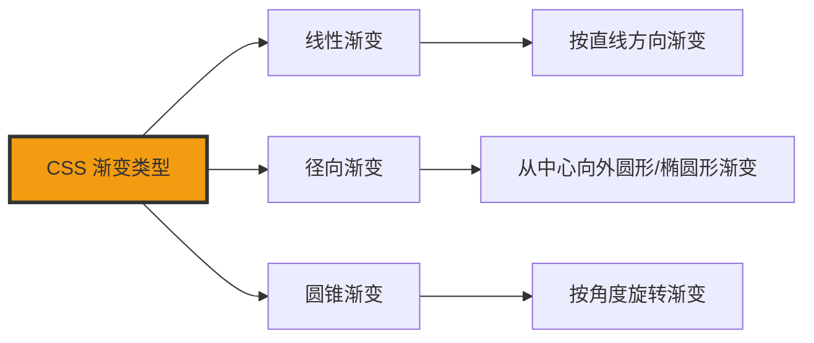

+++
title = "第28章 CSS渐变"
weight = 280
date = "2026-03-27T16:53:00+08:00"
type = "docs"
description = ""
isCJKLanguage = true
draft = false
+++

# 第二十八章：CSS 渐变

> 想象一下，你有一支画笔，但这支画笔可以自动从一种颜色渐变到另一种颜色——渐变就是 CSS 给你的"魔法画笔"。渐变可以替代图片，减小文件体积；渐变可以创造纯色无法实现的视觉效果。学会渐变，你的网页设计水平直接提升一个档次！从此告别"甲方说这个蓝不够蓝"的噩梦！

## 28.1 线性渐变

### 28.1.1 基本语法——linear-gradient(direction, color-stop1, color-stop2)

线性渐变是最常用的渐变类型。想象一下彩虹🌈，就是一种从一种颜色过渡到另一种颜色的效果。

**什么是线性渐变？**

想象你用喷漆罐喷墙，从左边喷红色，往右慢慢变成蓝色。线性渐变就是这种"颜色从一端渐变到另一端"的效果。

```css
/* 线性渐变基础语法 */

/* 最简单的两色渐变 */
.simple-gradient {
  background: linear-gradient(red, blue);
  /* 从红色渐变到蓝色，默认方向是从上到下 */
}

/* 带方向的三色渐变 */
.directional-gradient {
  background: linear-gradient(to right, red, green, blue);
  /* 从左到右：红 → 绿 → 蓝 */
}

/* 颜色后面加百分比控制渐变位置 */
.positioned-gradient {
  background: linear-gradient(to right, red 0%, blue 100%);
  /* 红色从0%开始，蓝色到100%结束 */
}
```

```html
<div class="simple-gradient" style="height: 200px;">
  从上到下的红蓝渐变
</div>

<div class="directional-gradient" style="height: 200px;">
  从左到右的红绿蓝渐变
</div>
```

**先记语法，再看效果。** 线性渐变的完整骨架是：

```
linear-gradient( [ <角度> | to <方向> ]? , <颜色1> [<位置1>]? , <颜色2> [<位置2>]? , ... )
```

三点说明：

1. **方向可以省略**，省略时等价于 `to bottom`（从上到下）；
2. 方向**必须写最前面**，写在颜色中间会直接失效；
3. 至少要给**两个**颜色停止点，只有一个颜色时整条声明无效（不会自动变成纯色背景）。

> ⚠️ **注意 `background` 是缩写属性。** 上面写成 `background: linear-gradient(...)` 时，`background-color`、`background-image`、`background-position`、`background-size`、`background-repeat` 等都会被重置成初始值。如果只想"叠一层渐变"而保留其它背景设置，请用 `background-image: linear-gradient(...)`。

**进阶：指定颜色插值的色彩空间（现代写法）。** 默认情况下渐变在 sRGB 里插值，红→绿会经过一个发灰的中间色。CSS Color 4 允许指定插值空间，2023 年起主流浏览器都已支持：

```css
/* 在 oklab 空间插值：中间过渡更亮、更"干净" */
.oklab-gradient {
  background: linear-gradient(in oklab, red, green);
}

/* 在 hsl 空间插值，并且选择"长弧"路径
   → 红到蓝会经过绿（而不是经过紫），适合做彩虹 */
.hue-gradient {
  background: linear-gradient(in hsl longer hue, red, blue);
}

/* 极坐标空间还支持 shorter / longer / increasing / decreasing 四种色相路径 */
.hue-options {
  background: linear-gradient(in hsl increasing hue, red, blue);
}
```

**渐变角度的计算：**

```css
/* 角度与方向对照 */

/* 0deg = to top（向上）*/
.deg0 {
  background: linear-gradient(0deg, red, blue);
}

/* 90deg = to right（向右）*/
.deg90 {
  background: linear-gradient(90deg, red, blue);
}

/* 180deg = to bottom（向下）*/
.deg180 {
  background: linear-gradient(180deg, red, blue);
}

/* 270deg = to left（向左）*/
.deg270 {
  background: linear-gradient(270deg, red, blue);
}
```

### 28.1.2 方向写法——to bottom, to right, to top, to left, 角度

线性渐变的方向可以用关键字（to top/bottom/left/right）或角度（45deg、90deg）来指定。

```css
/* 关键字方向写法 */

/* to top：从下到上 */
.to-top {
  background: linear-gradient(to top, red, blue);
}

/* to bottom：从上到下（默认）*/
.to-bottom {
  background: linear-gradient(to bottom, red, blue);
}

/* to left：从右到左 */
.to-left {
  background: linear-gradient(to left, red, blue);
}

/* to right：从左到右 */
.to-right {
  background: linear-gradient(to right, red, blue);
}

/* 对角线方向 */
.to-top-right {
  background: linear-gradient(to top right, red, blue);
}

.to-bottom-left {
  background: linear-gradient(to bottom left, red, blue);
}

/* 角度写法（更精确）*/
.degree45 {
  background: linear-gradient(45deg, red, blue);
}

.degree135 {
  background: linear-gradient(135deg, red, blue);
}

.degree225 {
  background: linear-gradient(225deg, red, blue);
}
```

```
角度与方向对照图：

线性渐变的角度以"0deg 指向正上方"为基准，顺时针增大：

                              0deg（to top）
                                   ↑
                                   │
                  270deg ←─────────┼─────────→  90deg
                （to left）        │            （to right）
                                   │
                                   ↓
                             180deg（to bottom）

        45deg 指向"右上"的方向，315deg 指向"左上"，以此类推。
```

> 💡 **角度单位不只是 `deg`。** 还有 `grad`（400grad = 一整圈）、`rad`（2π rad = 一整圈）、`turn`（1turn = 一整圈）。写 `linear-gradient(0.5turn, red, blue)` 和 `180deg` 完全等价，用 `turn` 表示"转半圈"更直观。
>
> ⚠️ **`to top right` 和 `45deg` 不是一回事。** 角度是"绝对方向"，而 `to top right` 是"指向右上角"——**非正方形元素**里，为了让渐变线垂直于对角线，浏览器用的角度会随宽高比变化（可能远不是 45deg）。想要跨尺寸稳定的效果，用角度；想要"永远对准某个角"，用关键字。
>
> 📌 **小知识：渐变线会被自动"拉长"。** 用角关键字（如 `to top right`）时，渐变线的方向会取成**垂直于该对角线**，起点/终点则取在"过相应角点作垂线"的交点上。效果是：**那两个角上的颜色恰好就是 0% 和 100% 的纯色**，不会在角落里出现"半截过渡色"。
>
> 顺带一提：`in oklab` 这类插值空间参数**可以写在方向前面，也可以写在方向后面**（`linear-gradient(in oklab, red, blue)` 和 `linear-gradient(to right in oklab, red, blue)` 都合法）。

### 28.1.3 多色渐变

渐变不限于两种颜色，你可以添加任意多种颜色。

```css
/* 三色渐变 */
.three-colors {
  background: linear-gradient(to right, red, yellow, green);
  /* 红 → 黄 → 绿 */
}

/* 四色渐变 */
.four-colors {
  background: linear-gradient(to right, red, orange, yellow, green);
  /* 彩虹效果的基础 */
}

/* 六色渐变：完整的彩虹（红橙黄绿蓝紫）*/
.rainbow {
  background: linear-gradient(
    to right,
    red 0%,
    orange 20%,
    yellow 40%,
    green 60%,
    blue 80%,
    purple 100%
  );
}

/* 彩虹渐变（简化版）*/
.rainbow-simple {
  background: linear-gradient(
    to right,
    red 0%,
    orange 17%,
    yellow 33%,
    green 50%,
    blue 67%,
    indigo 84%,
    violet 100%
  );
}
```

```html
<div class="rainbow" style="height: 100px;">
  彩虹渐变条
</div>

<div class="three-colors" style="height: 150px;">
  三色渐变
</div>
```

### 28.1.4 渐变色停止点

颜色后面可以加百分比来控制颜色在渐变中的位置。

```css
/* 自定义色停位置 */

/* 颜色停在指定位置（<颜色> <位置> 是一组，位置写百分数或长度都行）*/
.custom-stops {
  background: linear-gradient(
    to right,
    red 0%,
    blue 30%,       /* 30%位置变成蓝色 */
    green 70%,      /* 70%位置变成绿色 */
    yellow 100%
  );
}

/* 两组颜色共用同一个位置 = 硬边界（不是"渐变到绿色"，而是"红线蓝线直接切换"）*/
.hard-stops {
  background: linear-gradient(
    to right,
    red 0%,
    red 25%,        /* 0% ~ 25% 是纯红 */
    blue 25%,       /* 25% 处颜色瞬间跳到蓝 */
    blue 50%,       /* 25% ~ 50% 是纯蓝 */
    green 50%,      /* 50% 处再跳一次，变成纯绿 */
    green 100%
  );
}

/* 更省事的硬边界写法：同一个位置也可以写成"两步"形式的一部分 */
.hard-stops-short {
  background: linear-gradient(
    to right,
    red 25%,     /* 省略 0%，浏览器会自动把红延伸到 0% */
    blue 25% 50%,
    green 50%
  );
  /* 0%~25% 红、25%~50% 蓝、50%~100% 绿，共三条硬边色带 */
}

/* 颜色提示点（transition hint）：告诉浏览器"颜色在哪个位置过渡到一半" */
.color-hint {
  background: linear-gradient(
    to right,
    red,
    30%,      /* 单独一个百分比是"提示点"：红在 30% 处才过渡到一半 */
    blue
  );
  /* 提示点越靠近红色，红色占的比例越大；不加提示点时默认在两个色停的正中 */
}

/* 位置可以超出 0%~100%：虽然超出部分不直接显示，
   但会影响边界处的颜色（用来做"只看到渐变一小段"的效果）*/
.overflow-stops {
  background: linear-gradient(to right, red -50%, blue 150%);
  /* 相当于"截取"了整条渐变中间的一段，两端不会有纯色 */
}

/* 重复渐变图案 */
.repeating {
  background: repeating-linear-gradient(
    to right,
    red 0px,
    red 20px,
    blue 20px,
    blue 40px
  );
}
```

**色停的"自动修正"规则**（写错顺序时浏览器不会报错，而是悄悄改）：

| 情况 | 浏览器的处理 |
|------|--------------|
| 第一个色停没写位置 | 视为 `0%`（长度场景视为 `0`） |
| 最后一个色停没写位置 | 视为 `100%` |
| 某个色停的位置**比前一个还小**（比如 `red 60%, green 30%`） | 被"夹"到前一个的位置（变成 `green 60%`），从而形成硬边 |

> ⚠️ **`transparent` 的经典坑。** `transparent` 其实是"透明黑"（`rgb(0 0 0 / 0)`），不是"某某颜色的透明版"。现代浏览器在做渐变插值时使用**预乘 alpha（premultiplied alpha）**，所以 `linear-gradient(red, transparent)` 不会再像老浏览器那样在中段"发灰发脏"。**但如果显式指定了插值色彩空间**（比如 `in oklab` / `in hsl longer hue`），色相信息就会参与插值，透明的黑会带来明显偏差。稳妥写法是和起始色**同色但全透明**：

```css
/* ❌ 有风险：从红渐隐到"透明黑" */
.risky-fade {
  background: linear-gradient(in oklab, red, transparent);
}

/* ✅ 推荐：用同一个颜色、alpha 变 0（#RRGGBBAA 写法，末尾 00 表示 alpha = 0）*/
.safe-fade {
  background: linear-gradient(in oklab, #ff0000, #ff000000);
  /* 等价写法：linear-gradient(in oklab, rgb(255 0 0), rgb(255 0 0 / 0)) */
}
```

## 28.2 径向渐变

### 28.2.1 radial-gradient——圆形或椭圆渐变，从一点向四周扩散

径向渐变是从一个中心点向外扩散的渐变，想象一下石头掉进水里产生的涟漪。

**什么是径向渐变？**

想象你往水里滴了一滴墨水，墨水会从中心点向四周扩散，越远越淡。径向渐变就是这种效果。

```css
/* 径向渐变基础 */

/* 圆形渐变（从中心向四周）*/
.radial-circle {
  background: radial-gradient(circle, red, blue);
  /* 从红色圆心渐变到蓝色边缘；半径默认是 farthest-corner */
}

/* 椭圆渐变（不写形状时的默认值）*/
.radial-ellipse {
  background: radial-gradient(ellipse, red, blue);
  /* 注意：写 radial-gradient(red, blue) 与写 ellipse 完全等价，
     默认就是"椭圆 + farthest-corner" */
}

/* 指定颜色位置 */
.radial-positioned {
  background: radial-gradient(
    circle at center,  /* 圆心在中心 */
    red 0%,
    blue 100%
  );
}
```

**`radial-gradient()` 的完整骨架：**

```
radial-gradient( [ <形状> || <尺寸> ]? [ at <位置> ]? , <颜色1> [<位置1>]? , <颜色2> ... )
```

各段都是可选的，省略时的默认值是 **`ellipse farthest-corner at center`**：

| 片段 | 可选值 | 省略时 |
|------|--------|--------|
| `<形状>` | `circle`（圆）/ `ellipse`（椭圆） | `ellipse` |
| `<尺寸>` | `closest-side` / `farthest-side` / `closest-corner` / `farthest-corner`，或具体尺寸（圆写一个值，椭圆写两个值） | `farthest-corner` |
| `at <位置>` | 同 `background-position`（`center`、`top left`、`30% 70%`…） | `center` |

```css
/* 尺寸也可以直接写长度：圆形写一个值，椭圆写两个值 */
.fixed-radius {
  background: radial-gradient(circle 80px at center, red, blue);
}

.fixed-ellipse {
  background: radial-gradient(ellipse 120px 60px at 50% 50%, red, blue);
}

/* 椭圆尺寸：两个值分别是"横向半径、纵向半径"，百分比按宽/高计算 */
.percentage-size {
  background: radial-gradient(ellipse 30% 20% at center, red, blue);
}

/* ⚠️ 圆形半径写百分比要小心：
   CSS Images Level 3 只允许长度（circle 30% 会被判为无效值）；
   Level 4 新增"圆的百分比"，按缩放对角线 sqrt(w²+h²)/√2 计算，
   但浏览器支持并不统一。要稳妥，圆就用长度写 */
.circle-length {
  background: radial-gradient(circle 80px at center, red, blue);  /* ✅ 处处可用 */
}
```

### 28.2.2 at 位置——at center（圆心在中心，默认）、at top left、at 50% 50%

渐变从哪里开始（圆心位置）可以用 `at` 关键字指定。

```css
/* 圆心位置 */

/* at center：圆心在正中间（默认）*/
.at-center {
  background: radial-gradient(circle at center, red, blue);
}

/* at top：圆心在顶部 */
.at-top {
  background: radial-gradient(circle at top, red, blue);
}

/* at bottom：圆心在底部 */
.at-bottom {
  background: radial-gradient(circle at bottom, red, blue);
}

/* at top left：圆心在左上角 */
.at-corner {
  background: radial-gradient(circle at top left, red, blue);
}

/* at 百分比位置：圆心在 30% 70% 位置 */
.at-percentage {
  background: radial-gradient(circle at 30% 70%, red, blue);
}
```

### 28.2.3 渐变尺寸——closest-side、farthest-side、closest-corner、farthest-corner

先纠正一个容易混淆的地方：**形状由 `circle` / `ellipse` 决定，这四个关键字决定的是"渐变射程有多大"**（也就是 100% 的那个色停落在哪）。

| 关键字 | 100% 色停的位置 |
|--------|-----------------|
| `closest-side`（最近边）| 刚好碰到离圆心最近的那条边（圆用最近的边，椭圆分别用横向和纵向最近的边）|
| `farthest-side`（最远边）| 刚好碰到离圆心最远的那条边 |
| `closest-corner`（最近角）| 刚好碰到离圆心最近的角 |
| `farthest-corner`（最远角，**默认值**）| 刚好碰到离圆心最远的角（渐变铺满整个盒子）|

```css
/* closest-side：渐变延伸至最近的边 */
.closest-side {
  background: radial-gradient(
    circle closest-side at center,
    red, blue
  );
  /* 渐变在碰到最近的边时停止 */
}

/* farthest-corner：渐变延伸至最远的角（默认）*/
.farthest-corner {
  background: radial-gradient(
    circle farthest-corner at center,
    red, blue
  );
  /* 渐变延伸至最远的角 */
}

/* closest-corner：渐变延伸至最近的角 */
.closest-corner {
  background: radial-gradient(
    circle closest-corner at center,
    red, blue
  );
}

/* farthest-side：渐变延伸至最远的边 */
.farthest-side {
  background: radial-gradient(
    circle farthest-side at center,
    red, blue
  );
}
```

## 28.3 圆锥渐变

### 28.3.1 conic-gradient——从圆心向外按角度渐变，用于饼图、雷达图

圆锥渐变是从圆心向外按角度旋转的渐变，想象一下雷达扫描的效果。

**什么是圆锥渐变？**

想象一下雷达扫描——从圆心向外发射射线，随着角度变化颜色也跟着变化。

> ⚠️ **先记住角度基准，这是圆锥渐变最容易搞错的地方：`0deg` 指向正上方（12 点方向），角度顺时针增大。** 也就是说 0deg = 上、90deg = 右、180deg = 下、270deg = 左。`from 90deg` 表示"整个渐变顺时针转 90°"，起点就落在右侧。这一点和线性渐变一致（都从正上方起算、顺时针），但和很多人"从右边开始"的直觉相反。

```css
/* 圆锥渐变基础 */

/* 基本圆锥渐变 */
.conic-basic {
  background: conic-gradient(red, yellow, green, blue, red);
  /* 从红色开始，按角度旋转经过黄、绿、蓝，最后回到红色 */
}

/* 带起点的圆锥渐变 */
.conic-from {
  background: conic-gradient(from 0deg at center, red, blue);
  /* 0deg = 正上方（12 点方向），红色从这里开始，顺时针过渡到蓝色 */
}

/* 饼图效果。角度基准：0deg 在正上方，顺时针增大；
   90deg = 正右、180deg = 正下、270deg = 正左、360deg 回到顶部 */
.pie-chart {
  background: conic-gradient(
    red 0deg,        /* 红色从顶部（0°，即 0%）开始 */
    red 90deg,       /* 红色占到 90°（25%）：右上那一块 */
    yellow 90deg,    /* 从正右方 90° 开始换黄色 */
    yellow 180deg,   /* 黄色占到 180°（50%）：右下那一块 */
    green 180deg,    /* 从正下方 180° 开始换绿色 */
    green 270deg,    /* 绿色占到 270°（75%）：左下那一块 */
    blue 270deg,     /* 从正左方 270° 开始换蓝色 */
    blue 360deg      /* 蓝色结束于 360°（100%） */
  );
  border-radius: 50%;  /* 变成圆形就是饼图 */
}
```

**角度也可以写成 `turn` 或百分比**，可读性更好：

```css
/* 用 turn：1turn = 360°，0.25turn = 90° —— 写"四分之一块"最直观 */
.pie-easy {
  background: conic-gradient(
    #e74c3c 0turn 0.25turn,   /* 0% ~ 25% */
    #f1c40f 0.25turn 0.5turn, /* 25% ~ 50% */
    #2ecc71 0.5turn 0.75turn, /* 50% ~ 75% */
    #3498db 0.75turn 1turn    /* 75% ~ 100% */
  );
  border-radius: 50%;
}

/* 色停也可以直接写百分比（按整圈折算成角度）*/
.pie-percent {
  background: conic-gradient(red 0% 40%, blue 40% 100%);
  border-radius: 50%;
}
```

> 💡 **为什么饼图样式总要把一个颜色写两遍？** 因为 0° 和 360° 指向的是同一条射线。只写 `red, yellow, green, blue` 的话，颜色会在整圈里**均匀过渡**；想要"硬边界色块"，就必须让前一块的终点和后一块的起点重合。另外首尾颜色不一致时，顶部 0° 处会出现一道突兀的接缝——规范也专门点出了这个现象。

### 28.3.2 圆锥渐变的 from 角度

`from` 关键字可以指定渐变从哪个角度开始。

```css
/* 从不同角度开始的圆锥渐变 */

/* 从0度（正上方，12 点方向）开始 */
.from-0deg {
  background: conic-gradient(from 0deg at center, red, blue);
}

/* 从90度开始 —— 因为角度顺时针，90deg 落在"正右方" */
.from-90deg {
  background: conic-gradient(from 90deg at center, red, blue);
}

/* 从180度开始 —— 落在"正下方" */
.from-180deg {
  background: conic-gradient(from 180deg at center, red, blue);
}

/* 从270度开始 —— 落在"正左方" */
.from-270deg {
  background: conic-gradient(from 270deg at center, red, blue);
}

/* 常用写法：让第一块颜色正好从 12 点开始往上走，
   又想让"3 点钟方向"是分界线时，用 turn 更直观 */
.from-turn {
  background: conic-gradient(from 0.25turn at center, red, blue);
  /* = from 90deg，起点在正右方 */
}
```

## 28.4 重复渐变

### 28.4.1 repeating-linear-gradient——重复线性渐变，创建条纹效果

重复渐变是将渐变效果重复平铺。

```css
/* 重复线性渐变 */

/* 条纹效果 */
.stripes {
  background: repeating-linear-gradient(
    45deg,              /* 45度角 */
    red 0px,             /* 红色从0px开始 */
    red 20px,            /* 红色到20px */
    blue 20px,           /* 蓝色从20px开始 */
    blue 40px            /* 蓝色到40px，完成一个循环 */
  );
  /* 重复：0-20px红，20-40px蓝，40-60px红... */
}

/* 斑马条纹 */
.zebra-stripes {
  background: repeating-linear-gradient(
    to bottom,
    #f5f5f5 0px,
    #f5f5f5 10px,
    #333 10px,
    #333 20px
  );
}
```

### 28.4.2 repeating-radial-gradient——重复径向渐变

```css
/* 重复径向渐变 */

/* 圆点图案 */
.polka-dot {
  background: repeating-radial-gradient(
    circle at 50% 50%,  /* 圆心在中心 */
    #3498db 0px,        /* 蓝色从0px开始 */
    #3498db 10px,       /* 蓝色到10px */
    transparent 10px,   /* 10px 处开始变透明（硬边界）*/
    transparent 20px    /* 到20px，完成一个循环 */
  );
  /* ⚠️ 这里用的是 transparent（透明黑）。现代浏览器按预乘 alpha 插值，
     不会出现"发灰"的过渡；但如果加上 in oklab 之类的插值空间，
     建议改成同色透明（#3498db00）更保险 */
}
```

### 28.4.3 repeating-conic-gradient——重复圆锥渐变

很容易被忽略的一个：**圆锥渐变也有重复版本**，做棋盘格、轮盘刻度、进度环特别顺手。

```css
/* 重复圆锥渐变 */

/* 四象限方块：每 180° 重复一次，得到"对角两块同色"的方块 */
.checkerboard {
  background: repeating-conic-gradient(
    #eee 0deg 90deg,
    #ccc 90deg 180deg
  );
  /* 每 180° 重复一次，横向再配合 background-size 就能得到规整棋盘 */
  background-size: 80px 80px;
}

/* 经典的棋盘格做法：靠两个 0% 起点 + background-size 平铺 */
.checkerboard-45 {
  background: repeating-conic-gradient(
    #fff 0% 25%,
    #333 0% 50%
  );
  background-position: 50% 50%;   /* 平移半格，让黑白交错成棋盘 */
  background-size: 40px 40px;
  /* 第二个色停写的是 0% 50%，但"位置比前一个还小"会被自动修正为 25%，
     于是变成 #fff 0~25%、#333 25~50%，周期是 50%（180°）。
     这正是 CSS 里做棋盘格的经典技巧。 */
}

/* 轮盘/仪表盘的刻度线 */
.dial {
  background: repeating-conic-gradient(
    #333 0deg 2deg,       /* 每 2° 画一条刻度 */
    transparent 2deg 30deg /* 中间空 30°，也就是每 30° 一根刻度 */
  );
  border-radius: 50%;
}
```

> 📌 **重复渐变的通用规则：** `repeating-*` 系列的"一个循环长度"由**第一个色停和最后一个色停之间的距离**决定。所以上面刻度例子里 0deg→30deg 是一个周期，整圈会有 12 根刻度。如果最后一段色停没写位置，循环长度就退化成"最后一个明确位置"，图案可能不是你想要的样子——**写重复渐变时，把首尾位置都写清楚**是最稳的习惯。

## 28.5 常用场景

### 28.5.1 渐变背景替代纯色

```css
/* 现代渐变背景 */

/* 优雅的渐变背景 */
.elegant-gradient {
  background: linear-gradient(
    135deg,
    #667eea 0%,     /* 起始颜色 */
    #764ba2 100%    /* 结束颜色 */
  );
}

/* 柔和渐变 */
.soft-gradient {
  background: linear-gradient(
    120deg,
    #a8edea 0%,
    #fed6e3 100%
  );
}

/* 深色渐变 */
.dark-gradient {
  background: linear-gradient(
    to bottom,
    #2c3e50 0%,
    #4ca1af 100%
  );
}
```

### 28.5.2 条纹背景

```css
/* 条纹背景图案 */

/* 斜条纹 */
.diagonal-stripes {
  background: repeating-linear-gradient(
    45deg,
    #f0f0f0,
    #f0f0f0 10px,
    #e0e0e0 10px,
    #e0e0e0 20px
  );
}

/* 横条纹 */
.horizontal-stripes {
  background: repeating-linear-gradient(
    to bottom,
    #f0f0f0 0px,
    #f0f0f0 20px,
    #e0e0e0 20px,
    #e0e0e0 40px
  );
}
```

### 28.5.3 渐变文字

```css
/* 渐变文字效果 */
.gradient-text {
  background: linear-gradient(to right, #667eea, #764ba2);
  -webkit-background-clip: text;  /* Safari/WebKit 必需 */
  background-clip: text;          /* 标准属性 */
  -webkit-text-fill-color: transparent;
  color: transparent;             /* 非 WebKit 引擎的兜底 */
  font-size: 48px;
  font-weight: bold;
  /* ⚠️ 顺序很重要：background 是缩写，会把 background-clip 重置为 border-box，
     所以 background-clip: text 必须写在 background 之后 */
}
```

> ⚠️ **三个必须注意的坑：**
>
> 1. **顺序**：`background` 缩写写在 `background-clip: text` 前面（或者干脆用 `background-image: linear-gradient(...)`，就不会重置 `background-clip`）；
> 2. **文字可能"消失"**：文字颜色被设成透明，一旦浏览器不支持 `background-clip: text`，用户看到的就是一片空白。用 `@supports` 做保护更稳：
>
> ```css
> .gradient-text {
>   color: #667eea;   /* 默认：普通单色文字，保证可读 */
> }
>
> @supports (background-clip: text) or (-webkit-background-clip: text) {
>   .gradient-text {
>     background-image: linear-gradient(to right, #667eea, #764ba2);
>     -webkit-background-clip: text;
>     background-clip: text;
>     color: transparent;
>   }
> }
> ```
>
> 3. **对比度**：渐变两端的颜色都要和背景有足够对比（WCAG 建议正文至少 4.5:1）。深色渐变里挑一个很浅的紫色，文字可能直接"糊"掉——**渐变文字看着好玩，但正文标题别用它**。

### 28.5.4 渐变还能这么用

```css
/* 1. 叠加多层渐变：用 background-image 逗号分隔，前面的盖住后面的 */
.layered {
  background-image:
    linear-gradient(to right, rgba(52, 152, 219, 0.8), transparent),  /* 左侧蓝色渐隐 */
    repeating-linear-gradient(45deg, #fff 0 10px, #f6f6f6 10px 20px), /* 斜条纹底 */
    radial-gradient(circle, #fff 0%, #ddd 100%);
  /* 注意：可以用逗号写多条，但最上面那张图会遮住下面的 */
}

/* 2. 用渐变当"分隔线"（不用额外元素）*/
.divider {
  height: 2px;
  background: linear-gradient(to right, transparent, #999, transparent);
  /* 两端渐隐的分隔线 */
}

/* 3. 用 conic-gradient 做进度环 */
.progress-ring {
  width: 120px;
  height: 120px;
  border-radius: 50%;
  background: conic-gradient(#3498db 0 65%, #e0e0e0 65% 100%);
  /* 65% 处硬边界 → 看起来就是一个 65% 的进度环。
     想要"中间挖空"的环形，再叠一层 radial-gradient 或加 mask */
}

/* 4. 光晕/高光效果 */
.card-highlight {
  background:
    radial-gradient(circle at 20% 0%, rgba(255, 255, 255, 0.6), transparent 60%),
    linear-gradient(160deg, #4facfe, #00f2fe);
  /* 左上角一抹高光 + 蓝色渐变底，卡片立刻有"玻璃质感" */
}

/* 5. 骨架屏（loading 占位）的流光动画 */
.skeleton {
  background: linear-gradient(90deg, #eee 25%, #f5f5f5 37%, #eee 63%);
  background-size: 400% 100%;   /* 让渐变比元素宽 4 倍，才有"扫过"的空间 */
  animation: skeleton-loading 1.4s ease infinite;
}

@keyframes skeleton-loading {
  from { background-position: 100% 50%; }
  to   { background-position: 0 50%; }
}
```

> 💡 **性能提醒：** 渐变的绘制成本很低（纯色 + 插值，不需要下载图片），但**带动画的渐变**（比如上面的骨架屏流光）会触发重绘。它影响的是 `background-position`，不会引起重排（layout），所以比"动 `width`/`left`"要便宜得多；不过在低端设备上大面积使用仍要节制。

---

## 本章小结

### 核心知识点

| 渐变类型 | 说明 |
|-----------|------|
| linear-gradient | 线性渐变 |
| radial-gradient | 径向渐变 |
| conic-gradient | 圆锥渐变 |
| repeating-linear-gradient | 重复线性渐变 |
| repeating-radial-gradient | 重复径向渐变 |
| repeating-conic-gradient | 重复圆锥渐变（棋盘格、刻度线） |
| `in <色彩空间>` | 指定插值空间（`in oklab`、`in hsl longer hue`…） |
| 色停位置 / 颜色提示点 | 控制颜色变化的位置与过渡节奏 |

### 渐变类型图解


```mermaid
graph LR
    A["CSS 渐变类型"] --> B["线性渐变"]
    A --> C["径向渐变"]
    A --> D["圆锥渐变"]

    B --> B1["按直线方向渐变"]
    C --> C1["从中心向外圆形/椭圆形渐变"]
    D --> D1["按角度旋转渐变"]

    style A fill:#f39c12,stroke:#333,stroke-width:3px
```

### 本章易错点速查

| 容易写错的地方 | 正确认识 |
|----------------|----------|
| `linear-gradient(red)` 会变成纯红背景 | 只有一个色停时整条声明**无效**，背景会退回 `background-color` |
| 方向写在颜色后面（`linear-gradient(red, blue, to right)`）| 方向必须在最前面，写在后面会导致整条无效 |
| 用 `background: linear-gradient(...)` 加一层渐变 | 它是缩写，会重置 `background-color` / `-size` / `-position` / `-repeat` 等；只想叠图请用 `background-image` |
| `45deg` 和 `to top right` 效果一样 | 只在正方形里恰好接近；`to top right` 的角度会随宽高比变化 |
| 以为角度从右边起算 | 线性渐变与圆锥渐变的 `0deg` 都指向**正上方**，顺时针增大（90deg = 右、180deg = 下、270deg = 左） |
| `conic-gradient(from 90deg, ...)` 从左边开始 | 90deg 是**正右方**；180deg 才是正下方，270deg 才是正左方 |
| 饼图里 `red 0deg, red 90deg, yellow 90deg…` 是把颜色"抄错了" | 这是刻意的"硬边界"写法：0° 与 360° 是同一条射线，重合色停才能切出纯色扇形 |
| 径向渐变的形状由 `closest-side` 等关键字决定 | 形状是 `circle` / `ellipse`；那四个关键字决定的是**射程（尺寸）**，默认是 `ellipse farthest-corner` |
| `radial-gradient(red, blue)` 是正圆 | 默认是**椭圆**，要正圆必须写 `circle` |
| 圆形半径可以写百分比 | Level 3 只允许长度；Level 4 才允许百分比（按缩放对角线算），支持不统一，稳妥用长度 |
| `transparent` 是"当前颜色的透明版" | 它是**透明黑**，会参与插值；显式指定插值空间时建议改成同色透明（如 `#ff000000`） |
| 色停位置写小了会报错 | 不会报错，浏览器会把它"夹"到前一个色停的位置（正好被用来做硬边） |
| 色停只能写 0%~100% | 可以写到范围外（如 `red -50%, blue 150%`），虽不直接显示但会影响边界颜色 |
| 一个颜色只能配一个位置 | 支持 `blue 25% 50%` 这种"两位置"写法，表示 25% 处开始、50% 处结束的纯色带 |
| 忘了还有 `repeating-conic-gradient` | 圆锥渐变也有重复版本，棋盘格、轮盘刻度都用它 |
| 渐变文字用 `color: transparent` 就够了 | 需要 `background-clip: text`（旧 WebKit 还要 `-webkit-` 前缀），而且顺序不能反——缩写会重置 `background-clip` |
| 渐变文字在所有浏览器都好好的 | 不支持时会看到"空白文字"，用 `@supports` 兜底，并注意两端的对比度 |

### 下章预告

下一章我们将学习 transform 变换，让元素动起来！
