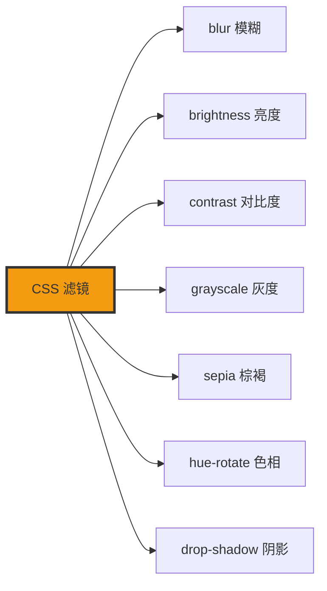

+++
title = "第31章 滤镜与混合模式"
weight = 310
date = "2026-03-27T16:53:00+08:00"
type = "docs"
description = ""
isCJKLanguage = true
draft = false
+++

# 第三十一章：滤镜与混合模式

> 滤镜就像是给你的网页加了一层"美颜滤镜"——可以让图片变模糊、变亮、变暗、加阴影。混合模式则是让两层元素叠加时产生各种神奇的化学反应。学会这些，你的网页设计水平直接提升一个档次！从此不用开 PS，直接用 CSS "美颜"！

## 31.1 滤镜 filter

滤镜（Filter）是CSS给元素的"美颜相机"。它可以让你不需要Photoshop就能给元素加上各种视觉效果——模糊、亮度调整、对比度、灰度、棕褐色...应有尽有！

### 31.1.1 blur()——高斯模糊

`blur()` 滤镜会创建一个高斯模糊效果，让元素变得模糊。值越大越模糊。

**什么是blur滤镜？**

想象一下你戴上了一副度数很高的眼镜——看什么都模糊一片。`blur()` 就是CSS给你的这副"模糊眼镜"。

```css
/* blur() 滤镜的基本用法 */

/* 轻微模糊：1px */
.blur-light {
  filter: blur(1px);
  /* 几乎看不出模糊，但有一点朦胧感 */
}

/* 中度模糊：5px */
.blur-medium {
  filter: blur(5px);
  /* 明显模糊 */
}

/* 重度模糊：10px */
.blur-heavy {
  filter: blur(10px);
  /* 像雾一样模糊 */
}
```

```html
<!-- 对比展示 -->


```

**blur() 的实际应用场景：**

```css
/* 1. 背景模糊，内容清晰 */
.glass-effect {
  position: relative;
}

.glass-effect::before {
  content: "";
  position: absolute;
  inset: 0;
  background: url("bg.jpg") center/cover;
  filter: blur(10px);  /* 背景模糊 */
  z-index: -1;
}

.glass-effect-content {
  position: relative;
  z-index: 1;
  /* 内容清晰 */
}

/* 2. 加载中的占位图 */
.loading-placeholder {
  filter: blur(5px);
  /* 让加载占位图有一种"正在加载"的朦胧感 */
}

/* 3. hover 时取消模糊 */
.blur-on-hover {
  filter: blur(5px);
  transition: filter 0.3s;
}

.blur-on-hover:hover {
  filter: blur(0);  /* hover 时变清晰 */
}
```

### 31.1.2 brightness()——亮度调整

`brightness()` 滤镜调整元素的亮度。1 是原始亮度，大于1变亮，小于1变暗。

**什么是brightness滤镜？**

想象一下调节屏幕亮度——调高屏幕就变亮，调低屏幕就变暗。`brightness()` 就是CSS的屏幕亮度调节器。

```css
/* brightness() 滤镜的基本用法 */

/* 变亮 */
.brightness-high {
  filter: brightness(1.5);   /* 150% 亮度 */
  filter: brightness(2);      /* 200% 亮度，翻倍 */
}

/* 变暗 */
.brightness-low {
  filter: brightness(0.5);  /* 50% 亮度，半亮 */
  filter: brightness(0);      /* 0% 亮度，完全变黑 */
}

/* 恢复正常 */
.brightness-normal {
  filter: brightness(1);    /* 100% 亮度，默认值 */
}
```

```html
<!-- 亮度调整效果 -->


```

**brightness() 的实际应用场景：**

```css
/* 1. 图片 hover 变亮效果 */
.brighten-on-hover {
  transition: filter 0.3s;
}

.brighten-on-hover:hover {
  filter: brightness(1.1);  /* 稍微提亮 */
}

/* 2. 禁用状态的暗淡效果 */
.disabled-state {
  filter: brightness(0.7);  /* 暗淡显示禁用状态 */
}

/* 3. 深色模式的亮度补偿 */
@media (prefers-color-scheme: dark) {
  img:not([src*=".svg"]) {
    filter: brightness(1.1);  /* 暗色模式下图片稍微提亮 */
  }
}
```

### 31.1.3 contrast()——对比度调整

`contrast()` 滤镜调整元素的对比度。

**什么是contrast滤镜？**

对比度就是明暗之间的差异。对比度高，明暗差异大，图像更锐利；对比度低，明暗差异小，图像更柔和。

```css
/* contrast() 滤镜的基本用法 */

/* 提高对比度 */
.contrast-high {
  filter: contrast(150%);   /* 150% 对比度 */
  filter: contrast(2);       /* 2倍对比度 */
}

/* 降低对比度 */
.contrast-low {
  filter: contrast(50%);    /* 50% 对比度 */
  filter: contrast(0.5);    /* 0.5倍对比度 */
}

/* 完全无对比度（所有颜色变成同一种中间灰）*/
.contrast-zero {
  filter: contrast(0);  /* 注意：不是灰度，而是所有颜色都被压成同一级灰 */
}
```

### 31.1.4 grayscale()——灰度（黑白效果）

`grayscale()` 滤镜将元素转换为灰度（黑白）。

**什么是grayscale滤镜？**

想象一下冲洗胶卷时跳过了彩色药水——照片直接出来就是黑白灰。`grayscale()` 就是CSS的"黑白打印机"，无论你的图片多绚丽，它一律给你打印成灰阶。

```css
/* grayscale() 滤镜的基本用法 */

/* 完全灰度 */
.gray-full {
  filter: grayscale(100%);  /* 完全变成黑白 */
  filter: grayscale(1);      /* 100% 同义写法 */
}

/* 部分灰度 */
.gray-partial {
  filter: grayscale(50%);  /* 半灰度，半彩色 */
}

/* 恢复正常 */
.gray-normal {
  filter: grayscale(0);  /* 恢复彩色 */
}
```

```html
<!-- 灰度效果对比 -->


```

**grayscale() 的实际应用场景：**

```css
/* 1. 灰度 hover 变彩色效果 */
.gray-to-color {
  filter: grayscale(100%);
  transition: filter 0.5s;
}

.gray-to-color:hover {
  filter: grayscale(0);  /* hover 时变彩色 */
}

/* 2. 黑白海报效果 */
.poster-art {
  filter: grayscale(100%) contrast(1.2);
  /* 灰度 + 稍高对比度 = 艺术海报效果 */
}

/* 3. 禁用状态的灰度处理 */
.disabled-state-gray {
  filter: grayscale(100%);
  opacity: 0.5;
}
```

### 31.1.5 sepia()——棕褐色（复古效果）

`sepia()` 滤镜给元素添加一种棕褐色的复古色调，就像老照片一样。

**什么是sepia滤镜？**

想象一下泛黄的老照片，那种温暖的棕褐色调。`sepia()` 就是CSS的"做旧滤镜"，让你的网页穿越回过去，满满的复古味。

```css
/* sepia() 滤镜的基本用法 */

/* 完全棕褐色 */
.sepia-full {
  filter: sepia(100%);  /* 完全复古棕褐 */
  filter: sepia(1);      /* 100% 同义写法 */
}

/* 部分棕褐 */
.sepia-partial {
  filter: sepia(50%);  /* 半复古半彩色 */
}

/* 恢复正常 */
.sepia-normal {
  filter: sepia(0);  /* 恢复原色 */
}
```

```html
<!-- 棕褐色效果 -->


```

**sepia() 的实际应用场景：**

```css
/* 1. hover 时从灰度变棕褐 */
.aging-effect {
  filter: grayscale(100%);
  transition: filter 0.5s;
}

.aging-effect:hover {
  filter: sepia(100%);
}

/* 2. 暖色调效果 */
.warm-tone {
  filter: sepia(30%);  /* 30% 棕褐，保留彩色感但有暖调 */
}
```

### 31.1.6 hue-rotate()——色相旋转

`hue-rotate()` 滤镜让颜色"转动"，把红色变成绿色，绿色变成蓝色...

**什么是hue-rotate滤镜？**

想象一下调色轮，转动角度颜色就变了。`hue-rotate()` 就是CSS的"调色轮"。

```css
/* hue-rotate() 滤镜的基本用法 */

/* 旋转90度 */
.rotate-90 {
  filter: hue-rotate(90deg);  /* 红→绿，绿→青 */
}

/* 旋转180度 */
.rotate-180 {
  filter: hue-rotate(180deg);  /* 红→青，绿→品红 */
}

/* 旋转270度 */
.rotate-270 {
  filter: hue-rotate(270deg);  /* 红→蓝，蓝→红 */
}

/* 旋转360度（回到原色）*/
.rotate-360 {
  filter: hue-rotate(360deg);  /* 等于原色 */
}
```

```html
<!-- 色相旋转效果 -->


```

**hue-rotate() 的实际应用场景：**

```css
/* 1. 多彩主题切换 */
.color-theme {
  filter: hue-rotate(0deg);  /* 主题色A */
}

.color-theme.theme-b {
  filter: hue-rotate(120deg);  /* 主题色B */
}

.color-theme.theme-c {
  filter: hue-rotate(240deg);  /* 主题色C */
}

/* 2. 动画效果 */
@keyframes rainbow {
  0% { filter: hue-rotate(0deg); }
  100% { filter: hue-rotate(360deg); }
}

.rainbow {
  animation: rainbow 5s linear infinite;
}
```

### 31.1.7 drop-shadow()——滤镜阴影

`drop-shadow()` 滤镜给元素添加阴影，但它会考虑元素的透明度（不同于 `box-shadow`）。

**drop-shadow vs box-shadow：**

```css
/* box-shadow：只看元素的边框盒，不考虑透明度 */
.box-shadow {
  box-shadow: 5px 5px 10px rgba(0, 0, 0, 0.3);
}

/* drop-shadow：会"挖空"透明部分 */
.drop-shadow {
  filter: drop-shadow(5px 5px 10px rgba(0, 0, 0, 0.3));
}
```

```html
<!-- box-shadow vs drop-shadow 对比 -->

<!-- 一个有透明PNG的情况 -->


<div class="box-shadow">box-shadow只会给矩形加阴影</div>
<div class="drop-shadow">drop-shadow会给图标形状加阴影</div>
```

**drop-shadow() 的实际应用场景：**

```css
/* 1. PNG图标阴影 */
.icon-with-shadow {
  filter: drop-shadow(2px 4px 6px rgba(0, 0, 0, 0.2));
}

/* 2. 文字阴影效果 */
.text-glow {
  filter: drop-shadow(0 0 10px rgba(52, 152, 219, 0.5));
}

/* 3. 多层阴影 */
.multi-shadow {
  filter: drop-shadow(3px 3px 5px rgba(0, 0, 0, 0.2)) drop-shadow(0 0 20px rgba(52, 152, 219, 0.5));
}
```

## 31.2 backdrop-filter 背景滤镜

### 31.2.1 backdrop-filter: blur()——毛玻璃效果

`backdrop-filter` 是给**元素背后**的区域加滤镜。和 `filter` 不同，`filter` 是给元素本身加滤镜，`backdrop-filter` 是给元素背后的东西（父容器的内容）加滤镜。

**什么是backdrop-filter？**

想象一下毛玻璃——透过毛玻璃看后面的东西都是模糊的。`backdrop-filter` 就是CSS的"毛玻璃"。

```css
/* backdrop-filter: blur() 的基本用法 */

/* 毛玻璃效果 */
.glass-effect {
  backdrop-filter: blur(10px);
  /* 背景模糊10px */
  background: rgba(255, 255, 255, 0.3);  /* 半透明背景 */
}

/* 更强的模糊 */
.glass-heavy {
  backdrop-filter: blur(20px);
}

/* 轻微模糊 */
.glass-light {
  backdrop-filter: blur(5px);
}
```

```html
<!-- 毛玻璃效果示例 -->
<div class="glass-effect" style="position: relative; min-height: 200px;">
  <div style="position: absolute; inset: 0; background: url('bg.jpg'); background-size: cover;">
    <!-- 背景图片 -->
  </div>
  <div style="position: relative; z-index: 1; padding: 20px;">
    <h2>毛玻璃效果</h2>
    <p>我是毛玻璃上的文字，背景是模糊的图片</p>
  </div>
</div>
```

**backdrop-filter 的实际应用场景：**

```css
/* 1. iOS风格的毛玻璃导航栏 */
.glass-navbar {
  position: fixed;
  top: 0;
  left: 0;
  right: 0;
  height: 60px;
  backdrop-filter: blur(20px);
  background: rgba(255, 255, 255, 0.8);
  -webkit-backdrop-filter: blur(20px);  /* Safari兼容前缀 */
  z-index: 1000;
}

/* 2. 模态框背景模糊 */
.modal-backdrop {
  position: fixed;
  inset: 0;
  background: rgba(0, 0, 0, 0.5);
  backdrop-filter: blur(5px);
}

/* 3. 浮层卡片效果 */
.floating-card {
  backdrop-filter: blur(10px);
  background: rgba(255, 255, 255, 0.7);
  border: 1px solid rgba(255, 255, 255, 0.3);
  border-radius: 16px;
}
```

## 31.3 混合模式

### 31.3.1 mix-blend-mode——元素颜色与下层元素的混合方式

混合模式（Blend Mode）决定了当前元素和下层元素（背景）的颜色如何混合。

**什么是混合模式？**

想象一下画家调色——用不同的方式混合颜料会产生不同的效果。CSS的混合模式就是让两层颜色以不同方式"混合"在一起。

```css
/* mix-blend-mode 的基本用法 */

/* normal：正常显示（默认）*/
.blend-normal {
  mix-blend-mode: normal;
}

/* multiply：正片叠底 */
.blend-multiply {
  mix-blend-mode: multiply;
  /* 黑色永远变黑，白色保持原色 */
}

/* screen：滤色 */
.blend-screen {
  mix-blend-mode: screen;
  /* 白色永远变白，黑色保持原色 */
}

/* overlay：叠加 */
.blend-overlay {
  mix-blend-mode: overlay;
}

/* darken：变暗 */
.blend-darken {
  mix-blend-mode: darken;
}

/* lighten：变亮 */
.blend-lighten {
  mix-blend-mode: lighten;
}

/* color-dodge：颜色减淡 */
.blend-color-dodge {
  mix-blend-mode: color-dodge;
}

/* color-burn：颜色加深 */
.blend-color-burn {
  mix-blend-mode: color-burn;
}

/* difference：差值 */
.blend-difference {
  mix-blend-mode: difference;
}

/* exclusion：排除 */
.blend-exclusion {
  mix-blend-mode: exclusion;
}

/* hue：色相 */
.blend-hue {
  mix-blend-mode: hue;
}

/* saturation：饱和度 */
.blend-saturation {
  mix-blend-mode: saturation;
}

/* color：颜色 */
.blend-color {
  mix-blend-mode: color;
}

/* luminosity：亮度 */
.blend-luminosity {
  mix-blend-mode: luminosity;
}
```

```html
<!-- 混合模式示例 -->
<div style="background: url('bg.jpg'); position: relative;">
  <div class="blend-multiply" style="background: blue; padding: 20px; color: white;">
    正片叠底效果
  </div>
</div>
```

### 31.3.2 background-blend-mode——多个背景图片或背景色之间的混合

`background-blend-mode` 控制同一个元素的多个背景图片/颜色之间的混合。

```css
/* background-blend-mode 的用法 */

.multi-bg {
  background-image: url("pattern.png"), url("gradient.jpg");
  background-color: #3498db;
  background-blend-mode: multiply, screen;
  /* 第一层用multiply，第二层用screen */
}
```

---

## 本章小结

### 核心知识点

| 滤镜 | 说明 |
|------|------|
| blur() | 高斯模糊 |
| brightness() | 亮度调整 |
| contrast() | 对比度调整 |
| grayscale() | 灰度（黑白）|
| sepia() | 棕褐色（复古）|
| hue-rotate() | 色相旋转 |
| drop-shadow() | 滤镜阴影（考虑透明度）|
| backdrop-filter | 背景模糊（毛玻璃效果）|
| mix-blend-mode | 混合模式 |

### 滤镜效果图解



### 实战建议

1. **毛玻璃效果**：使用 `backdrop-filter: blur()`
2. **PNG图标阴影**：使用 `filter: drop-shadow()`
3. **hover 效果**：滤镜配合 transition 使用
4. **复古风格**：使用 `sepia()` 和 `grayscale()`
5. **性能注意**：滤镜较耗性能，谨慎使用

### 下章预告

下一章我们将学习 clip-path 裁剪，让元素裁剪出任意形状！

