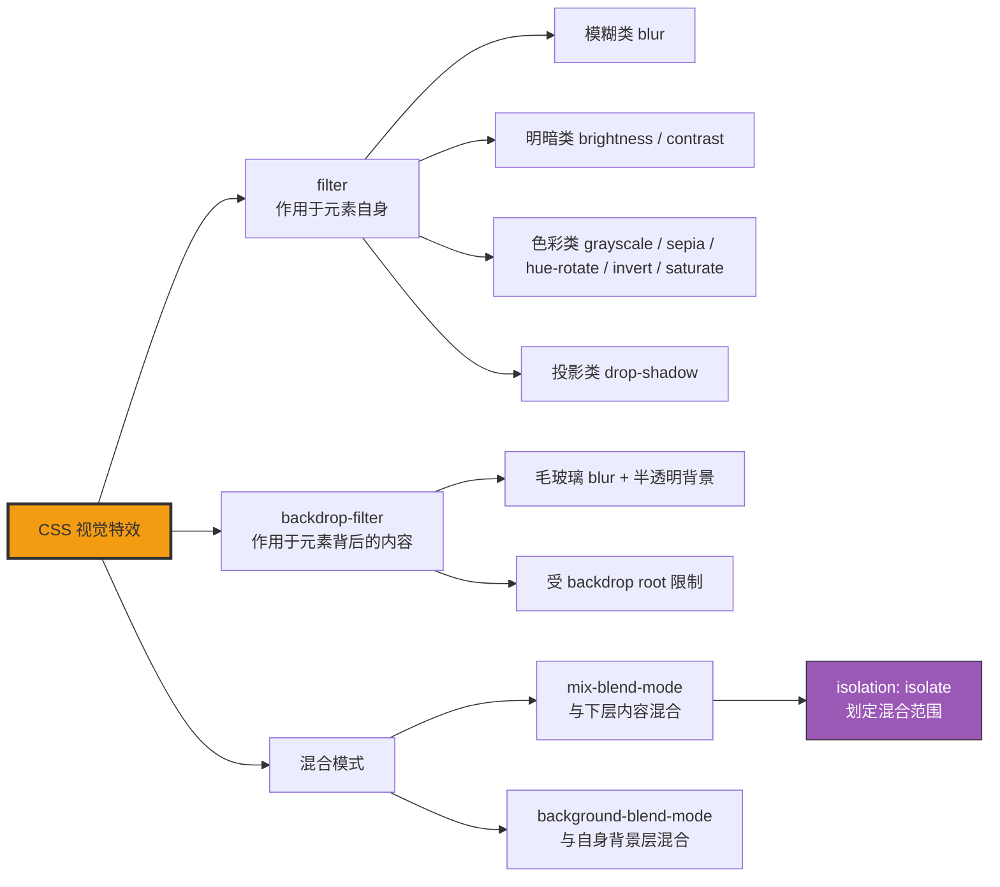

+++
title = "第31章 滤镜与混合模式"
weight = 310
date = "2026-03-27T16:53:00+08:00"
type = "docs"
description = ""
isCJKLanguage = true
draft = false
+++

# 第三十一章：滤镜与混合模式

> 滤镜就像是给你的网页加了一层"美颜滤镜"——可以让图片变模糊、变亮、变暗、加阴影。混合模式则是让两层元素叠加时产生各种神奇的化学反应。学会这些，你的网页设计水平直接提升一个档次！从此不用开 PS，直接用 CSS "美颜"！

## 31.1 滤镜 filter

滤镜（Filter）是 CSS 给元素的"美颜相机"，它把元素（连同它的背景、边框、文字和所有后代）先渲染成一张图片，再对这张图片做像素级处理——模糊、调亮度、调对比度、转灰度、加阴影等。这一切都不需要 Photoshop，而且**不改变元素在页面中的尺寸和位置**。

先记住 `filter` 的完整语法骨架：

```css
/* 关键字：不施加任何滤镜（初始值） */
filter: none;

/* 单个滤镜函数 */
filter: blur(5px);

/* 多个滤镜函数：用空格分隔，按书写顺序从左到右依次作用 */
filter: contrast(175%) brightness(120%);

/* 引用 SVG <filter> 中定义的滤镜 */
filter: url("filters.svg#my-filter");
```

也就是说 `filter` 的值是一条"滤镜链"：`<filter-value-list> = [ <filter-function> | <url> ]+`。官方定义的滤镜函数一共 **10 个**：

| 函数 | 作用 | 可用的值类型 | 省略参数时 |
|------|------|--------------|-----------|
| `blur()` | 高斯模糊 | `<length>`（百分比、角度都不行） | `0px` |
| `brightness()` | 亮度 | `<number>` 或 `<percentage>` | `1`（=100%） |
| `contrast()` | 对比度 | `<number>` 或 `<percentage>` | `1` |
| `grayscale()` | 灰度 | `<number>` 或 `<percentage>` | `1` |
| `sepia()` | 棕褐色 | `<number>` 或 `<percentage>` | `1` |
| `hue-rotate()` | 色相旋转 | `<angle>`（**只能是角度**） | `0deg` |
| `drop-shadow()` | 投影 | 颜色 + 2~3 个 `<length>` | 偏移全为 0，颜色取 `currentColor` |
| `invert()` | 反色 | `<number>` 或 `<percentage>` | `1` |
| `opacity()` | 透明度 | `<number>` 或 `<percentage>` | `1` |
| `saturate()` | 饱和度 | `<number>` 或 `<percentage>` | `1` |

> 规范冷知识：省略参数时，`grayscale()`、`sepia()`、`invert()` 按 `1`（即 100% 效果）处理，因为作者写 `grayscale()` 的本意几乎都是"要完全灰度"；但它们做动画插值时的初始值却是 `0`。这是规范里少数"默认值故意不一致"的地方。

三个必须先知道的坑：

1. **`filter` 会创建层叠上下文（stacking context），也会为绝对/固定定位的后代创建包含块**（除非它作用在文档根元素上）。也就是说哪怕写一句 `filter: blur(0.001px)`，内部的 `position: fixed` 元素也会"失效"——它不再相对视口定位，而是相对这个元素定位。排查"fixed 导航栏突然不 fixed 了"时，先回头找祖先里的 `filter`、`transform`、`backdrop-filter`、`will-change`。
2. **`filter` 作用的是整棵子树**：元素本身、背景、边框、文字、后代全部一起被处理。它没有"只处理背景、放过文字"的开关，要单独模糊背景得用伪元素，或者改用 `backdrop-filter`。
3. **一个规则里只能写一句 `filter`**：同一规则里写两行 `filter`，后面那行会完全覆盖前面那行，而不是叠加。想叠加必须写在同一句里、用空格分隔多个函数。

### 31.1.1 blur()——高斯模糊

`blur()` 滤镜会创建一个高斯模糊效果，让元素变得模糊。值越大越模糊。

**什么是blur滤镜？**

想象一下你戴上了一副度数很高的眼镜——看什么都模糊一片。`blur()` 就是CSS给你的这副"模糊眼镜"。

语法是 `blur( <length>? )`，参数是**高斯函数的标准差**。几个容易搞错的细节：

- 只能写长度（`px`、`rem` 等），**不接受百分比**，也不接受负值；
- 省略参数等价于 `blur(0)`，也就是没有任何效果；
- 规范特意提醒：这个值对应高斯函数的**标准差**，和 `box-shadow` 的"模糊半径"**不是同一回事**（`box-shadow` 的模糊半径大致相当于 2 倍标准差），所以 `box-shadow: 0 0 10px` 和 `filter: blur(10px)` 的模糊程度差别很大；
- 出于性能考虑，浏览器实际多用"三次盒式模糊"近似高斯，因此半径很大时结果和高斯并非逐像素一致。

```css
/* blur() 滤镜的基本用法 */

/* 轻微模糊：1px */
.blur-light {
  filter: blur(1px);
  /* 几乎看不出模糊，但有一点朦胧感 */
}

/* 中度模糊：5px */
.blur-medium {
  filter: blur(5px);
  /* 明显模糊 */
}

/* 重度模糊：10px */
.blur-heavy {
  filter: blur(10px);
  /* 像雾一样模糊 */
}
```

```html
<!-- 对比展示 -->


```

**blur() 的实际应用场景：**

```css
/* 1. 背景模糊，内容清晰 */
.blur-bg {
  position: relative;
  isolation: isolate;   /* 让子级的 z-index 在内部比较，-1 不会跑到更外层背景后面 */
  overflow: hidden;     /* 配合下面的放大，裁掉模糊后溢出的边缘 */
}

.blur-bg::before {
  content: "";
  position: absolute;
  inset: 0;
  background: url("bg.jpg") center/cover;
  filter: blur(10px);  /* 背景模糊 */
  transform: scale(1.1);  /* 放大一点，避免模糊后四周出现"透明发虚"的亮边 */
  z-index: -1;
}

.blur-bg-content {
  position: relative;
  z-index: 1;
  /* 内容清晰 */
}

/* 2. 加载中的占位图 */
.loading-placeholder {
  filter: blur(5px);
  /* 让加载占位图有一种"正在加载"的朦胧感 */
}

/* 3. hover 时取消模糊 */
.blur-on-hover {
  filter: blur(5px);
  transition: filter 0.3s;
}

.blur-on-hover:hover {
  filter: blur(0);  /* hover 时变清晰 */
}
```

**两个很常见、却极少被提到的坑：**

1. **模糊会让边缘"透光"**：`blur()` 是用周围的像素加权平均，元素边缘采样到元素外的透明区域，于是四边出现发虚、变淡的亮边。经典解法就是像上面那样"先放大一点点（`transform: scale(1.1)`），再用 `overflow: hidden` 裁掉多出来的部分"。
2. **`z-index: -1` 不是万能的**：伪元素写 `z-index: -1` 想藏到父元素背景之后，前提是父元素自己建立了层叠上下文，否则它会跑到更外层祖先的背景后面而"整块消失"。给父元素加 `isolation: isolate`（或 `position: relative; z-index: 0`）是最省事的写法。

另外注意：`.blur-on-hover` 的例子只在 `:hover` 时将 `blur(5px)` 变成 `blur(0)`，由于过渡的是整个滤镜链的插值，浏览器能平滑地补间——但**滤镜动画是"重绘级"操作，比 `transform`/`opacity` 动画贵得多**，大面积元素上频繁过渡模糊容易掉帧，能用别的手段就优先用别的。

### 31.1.2 brightness()——亮度调整

`brightness()` 滤镜调整元素的亮度。1 是原始亮度，大于1变亮，小于1变暗。

**什么是brightness滤镜？**

想象一下调节屏幕亮度——调高屏幕就变亮，调低屏幕就变暗。`brightness()` 就是CSS的屏幕亮度调节器。

语法是 `brightness( <number-percentage>? )`，即数字和百分比都收：`brightness(1.5)` 与 `brightness(150%)` 完全等价，`brightness(1)` 与 `brightness(100%)` 也是。它的本质是给每个颜色通道**乘一个系数**：

- `0` / `0%`：整张图变成纯黑（不是"看不见"，而是所有像素变成黑色）；
- `1` / `100%`：不改变（初始值）；
- 大于 `1`：整体变亮，**允许超过 100%**，但如果原本已经很亮的像素乘完超过上限，会被"截断"成纯白，导致亮部细节丢失（过曝）；
- 负值不合法，百分比也不能是负的。

```css
/* brightness() 滤镜的基本用法 */

/* 变亮 */
.brightness-150 {
  filter: brightness(1.5);   /* 数字写法：150% 亮度，两种写法等价 */
}

.brightness-200 {
  filter: brightness(200%);  /* 百分比写法：翻倍 */
}

/* 变暗 */
.brightness-50 {
  filter: brightness(0.5);   /* 50% 亮度，半亮 */
}

.brightness-0 {
  filter: brightness(0);     /* 0% 亮度，完全变黑 */
}

/* 恢复正常 */
.brightness-normal {
  filter: brightness(1);     /* 100% 亮度，等于初始值 */
}
```

注意上面把"变亮"和"变暗"拆成了不同的规则：**同一个选择器里写两句 `filter`，后者会覆盖前者，不会叠加**。很多初学者写

```css
/* 错误示范：只有最后一句生效，等于 filter: brightness(2) */
.wrong {
  filter: brightness(1.5);
  filter: brightness(2);
}
```

以为能"越写越亮"，实际只是被覆盖。真正的叠加要写在一句里：`filter: brightness(1.5) brightness(2);`

```html
<!-- 亮度调整效果 -->


```

**brightness() 的实际应用场景：**

```css
/* 1. 图片 hover 变亮效果 */
.brighten-on-hover {
  transition: filter 0.3s;
}

.brighten-on-hover:hover {
  filter: brightness(1.1);  /* 稍微提亮 */
}

/* 2. 禁用状态的暗淡效果 */
.disabled-state {
  filter: brightness(0.7);  /* 暗淡显示禁用状态 */
}

/* 3. 深色模式的亮度补偿 */
@media (prefers-color-scheme: dark) {
  img:not([src*=".svg"]) {
    filter: brightness(1.1);  /* 暗色模式下图片稍微提亮 */
  }
}
```

### 31.1.3 contrast()——对比度调整

`contrast()` 滤镜调整元素的对比度。

**什么是contrast滤镜？**

对比度就是明暗之间的差异。对比度高，明暗差异大，图像更锐利；对比度低，明暗差异小，图像更柔和。

语法是 `contrast( <number-percentage>? )`，同样是数字与百分比等价。它做的运算是"把每个颜色通道拉远或拉近中间灰"，可以粗略理解为 `结果 = (原值 - 0.5) × 系数 + 0.5`：

- `0` / `0%`：所有颜色都被拉到同一级，得到一张**纯中间灰**的图（规范原文说的是 "completely gray"）——注意这是"灰成一片"，不是"灰度照片"；
- `1` / `100%`：不改变（初始值）；
- `2` / `200%`：明暗差异翻倍，暗的更暗、亮的更亮；
- 大于 100% 允许，但超出上下限的通道值同样会被截断，暗部/亮部会"糊成一片黑"或"糊成一片白"。

```css
/* contrast() 滤镜的基本用法 */

/* 提高对比度 */
.contrast-150 {
  filter: contrast(150%);   /* 百分比写法 */
}

.contrast-2 {
  filter: contrast(2);      /* 数字写法，与 200% 等价 */
}

/* 降低对比度 */
.contrast-50 {
  filter: contrast(50%);
}

.contrast-05 {
  filter: contrast(0.5);    /* 与 50% 等价 */
}

/* 完全无对比度（所有颜色变成同一种中间灰）*/
.contrast-zero {
  filter: contrast(0);  /* 注意：不是灰度，而是所有颜色都被压成同一级灰 */
}
```

`contrast()` 最实用的场景是**给"深色模式下的图片降调"**——纯白背景的图片放进深色页面里非常刺眼，压一点亮度和对比度就舒服多了：

```css
@media (prefers-color-scheme: dark) {
  .img-soften {
    /* 左到右依次作用：先压亮度，再压对比度 */
    filter: brightness(0.85) contrast(0.9);
  }
}
```

### 31.1.4 grayscale()——灰度（黑白效果）

`grayscale()` 滤镜将元素转换为灰度（黑白）。

**什么是grayscale滤镜？**

想象一下冲洗胶卷时跳过了彩色药水——照片直接出来就是黑白灰。`grayscale()` 就是CSS的"黑白打印机"，无论你的图片多绚丽，它一律给你打印成灰阶。

语法是 `grayscale( <number-percentage>? )`：`grayscale(1)` = `grayscale(100%)` 完全灰度，`grayscale(0)` = 不变，`0` 到 `1` 之间按比例在"原色"和"灰度版"之间做线性插值。负值不合法，超过 `1` 的值会被钳制为 `1`。

```css
/* grayscale() 滤镜的基本用法 */

/* 完全灰度 */
.gray-full {
  filter: grayscale(100%);  /* 完全变成黑白 */
}

/* 与上面完全等价：数字 1 就是百分比 100% */
.gray-full-alt {
  filter: grayscale(1);
}

/* 部分灰度 */
.gray-partial {
  filter: grayscale(50%);  /* 半灰度，半彩色 */
}

/* 恢复正常 */
.gray-normal {
  filter: grayscale(0);  /* 恢复彩色 */
}
```

这里有个很值得知道、但几乎没人提的细节：**灰度不是简单地"红绿蓝取平均"**，而是按人眼对三原色的敏感度加权——绿色权重最高、蓝色最低（线性光下约为 R 0.2126、G 0.7152、B 0.0722）。所以：

- 纯红色转灰度后是**很深的灰**（约 21% 亮度），不是中等灰；
- 纯蓝色转灰度后几乎是黑的（约 7% 亮度）；
- 换成"整数平均"（各 33%）的算法，红色就会被算成中等灰，那是错的。

也正因为红、绿转成灰度后的明暗差可能很大，**不要只靠"变灰"来表达"禁用"或"选中"状态**——色盲用户本来就难以分辨颜色，灰度化之后所有色相差异都会消失，得配合图标、文字或形状来传达信息。

```html
<!-- 灰度效果对比 -->


```

**grayscale() 的实际应用场景：**

```css
/* 1. 灰度 hover 变彩色效果 */
.gray-to-color {
  filter: grayscale(100%);
  transition: filter 0.5s;
}

.gray-to-color:hover {
  filter: grayscale(0);  /* hover 时变彩色 */
}

/* 2. 黑白海报效果 */
.poster-art {
  filter: grayscale(100%) contrast(1.2);
  /* 灰度 + 稍高对比度 = 艺术海报效果 */
}

/* 3. 禁用状态的灰度处理 */
.disabled-state-gray {
  filter: grayscale(100%);
  opacity: 0.5;
}
```

### 31.1.5 sepia()——棕褐色（复古效果）

`sepia()` 滤镜给元素添加一种棕褐色的复古色调，就像老照片一样。

**什么是sepia滤镜？**

想象一下泛黄的老照片，那种温暖的棕褐色调。`sepia()` 就是CSS的"做旧滤镜"，让你的网页穿越回过去，满满的复古味。

语法是 `sepia( <number-percentage>? )`：`1` 和 `100%` 等价，都是完全棕褐；`0` 是不变；中间的数值在"原色"和"完全棕褐"之间线性插值。负值非法，超过 `1` 的值会被钳制为 `1`。

它的内部实现是一组固定的颜色矩阵（规范给出的系数大致是 R 通道取 `0.393R + 0.769G + 0.189B`，G、B 通道同理），所以 `sepia()` **不是"给图片叠一层黄"**——它重新计算了每个像素的 RGB 通道，暗部也会跟着偏暖，因此比半透明黄色蒙层自然得多。

```css
/* sepia() 滤镜的基本用法 */

/* 完全棕褐色 */
.sepia-full {
  filter: sepia(100%);  /* 完全复古棕褐 */
}

/* 与上面完全等价（数字 1 = 百分比 100%） */
.sepia-full-alt {
  filter: sepia(1);
}

/* 部分棕褐 */
.sepia-partial {
  filter: sepia(50%);  /* 半复古半彩色 */
}

/* 恢复正常 */
.sepia-normal {
  filter: sepia(0);  /* 恢复原色 */
}
```

```html
<!-- 棕褐色效果 -->


```

**sepia() 的实际应用场景：**

```css
/* 1. hover 时从灰度变棕褐 */
.aging-effect {
  filter: grayscale(100%);
  transition: filter 0.5s;
}

.aging-effect:hover {
  filter: sepia(100%);
}

/* 2. 暖色调效果 */
.warm-tone {
  filter: sepia(30%);  /* 30% 棕褐，保留彩色感但有暖调 */
}
```

### 31.1.6 hue-rotate()——色相旋转

`hue-rotate()` 滤镜让颜色沿着色相环"转动"一个角度，整体换一个色系。

**什么是hue-rotate滤镜？**

想象一下调色轮，转动角度颜色就变了。`hue-rotate()` 就是CSS的"调色轮"。

语法是 `hue-rotate( [ <angle> | <zero> ]? )`——**只能写角度**，不能写数字或百分比（`hue-rotate(0.5)` 是无效的）。角度单位可以是 `deg`、`grad`、`rad`、`turn`：`0.5turn` 就是 `180deg`。只有值为 0 时可以省略单位。

规范里还有一条为动画服务的说明：**实现不得把这个角度"归一化"到 0~360 度**，这样才能让 `hue-rotate(0deg) → hue-rotate(360deg)` 的动画平滑地转一整圈。

但有个非常重要的认知：**它并不是在 HSB/HSL 色相环上老老实实地"转表针"**。规范给出的等价实现是一组由余弦、正弦构成的线性颜色矩阵，并且默认在线性光（linearRGB）空间里运算。这意味着：

- 说"90 度就是把红变绿"是**不准确**的：它不会把某个色相精确映射到"原色相 + 90°"，对高饱和颜色而言偏移幅度和直觉差别很大；
- 旋转过程中**饱和度和亮度并不守恒**，超出色域的结果会被截断，亮色可能"糊掉"或出现色带；
- 因此想用 `hue-rotate()` 做"精确换主题色"并不可靠，它更适合做"整体氛围变化"或动画。要精确改色，应该用 SVG 滤镜、`@property` 配合计算好的滤镜链，或者直接准备两套配色的资源。

```css
/* hue-rotate() 滤镜的基本用法 */

/* 旋转90度 */
.rotate-90 {
  filter: hue-rotate(90deg);  /* 整体色相偏移，别指望某个颜色刚好变成指定色 */
}

/* 旋转180度 */
.rotate-180 {
  filter: hue-rotate(180deg);  /* 最常用的"整体反差"角度 */
}

/* 旋转270度 */
.rotate-270 {
  filter: hue-rotate(270deg);
}

/* 旋转360度（回到原色）*/
.rotate-360 {
  filter: hue-rotate(360deg);  /* 矩阵绕回原点，视觉上等于原色 */
}

/* 其他角度单位：0.5 圈 = 180 度，200grad = 180 度，π rad ≈ 180 度 */
.rotate-half-turn {
  filter: hue-rotate(0.5turn);
}
```

```html
<!-- 色相旋转效果 -->


```

**hue-rotate() 的实际应用场景：**

```css
/* 1. 同一套图标资源换主题色系（近似效果，不是精确匹配） */
.icon-theme-a {
  filter: hue-rotate(0deg);    /* 原始色系 */
}

.icon-theme-b {
  filter: hue-rotate(120deg);  /* 整体偏到另一个色系 */
}

.icon-theme-c {
  filter: hue-rotate(240deg);
}

/* 2. 彩虹循环动画 */
@keyframes rainbow {
  0% { filter: hue-rotate(0deg); }
  100% { filter: hue-rotate(360deg); }
}

.rainbow {
  animation: rainbow 5s linear infinite;
}

/* 3. 尊重"减少动态效果"偏好——无障碍上很重要 */
@media (prefers-reduced-motion: reduce) {
  .rainbow {
    animation: none;
  }
}
```

第 1 个例子要特别注意：**`hue-rotate()` 只能"整体偏移"，不能"指定目标色"**。它不会把红色图标变成品牌蓝，只会把所有颜色一起推向某个方向，白色、灰色完全不变（因为无彩色没有色相可转）。所以"用一套图标配多个主题色"这种做法只适合做近似，真要精确，得用 SVG 的 `fill: currentColor` 或准备多套资源。

另外，`filter` 动画会让元素每帧重新处理像素，属于比较贵的一类动画；`infinite` 的滤镜动画在低端设备上很容易导致滚动掉帧，能用 `transform`/`opacity` 表达的动效就不要用滤镜来转。

### 31.1.7 drop-shadow()——滤镜阴影

`drop-shadow()` 滤镜给元素添加阴影，但它**沿着元素的 alpha 通道（实际可见形状）画阴影**，而不是像 `box-shadow` 那样只认元素的外框。

完整语法是 `drop-shadow( <color>? && <length>{2,3} )`，逐项拆开看：

| 部分 | 含义 |
|--------|------|
| 第 1 个 `<length>` | 水平偏移 `offset-x`（正数向右） |
| 第 2 个 `<length>` | 垂直偏移 `offset-y`（正数**向下**） |
| 第 3 个 `<length>`（可选） | 模糊的**标准差**（不是 `box-shadow` 那种模糊半径） |
| `<color>`（可选） | 阴影颜色，省略时取 `currentColor` |

几个必须记住的点：

- **颜色可以写在长度前面，也可以写在后面**（语法里的 `&&` 表示"两侧都要出现，但顺序随意"）。这一点和很多人的印象相反，但 `drop-shadow(red 5px 5px)` 与 `drop-shadow(5px 5px red)` 都是合法的；
- **不接受 `inset`，也不接受扩展半径（spread）**：`drop-shadow(5px 5px 2px 3px red)` 会被整个忽略；
- **一个 `drop-shadow()` 只能画一层阴影**，想要多层要写多个函数，用空格隔开；
- 第 3 个长度是**标准差**，和 `blur()` 一样，与 `box-shadow` 的模糊半径不是一个量纲；
- 阴影不会撑大布局（不影响元素几何），但会被算进可视溢出范围。

**drop-shadow vs box-shadow：**

```css
/* box-shadow：沿元素的边框盒画阴影，边框盒内透明的像素照样被当成"实心" */
.box-shadow {
  box-shadow: 5px 5px 10px rgba(0, 0, 0, 0.3);
}

/* drop-shadow：沿元素的实际可见形状（alpha 通道）画阴影 */
.drop-shadow {
  filter: drop-shadow(5px 5px 10px rgba(0, 0, 0, 0.3));
}
```

```html
<!-- box-shadow vs drop-shadow 对比 -->

<!-- 一个有透明PNG的情况 -->


<div class="box-shadow">box-shadow 会得到一个矩形影子</div>
<div class="drop-shadow">drop-shadow 会贴合图标轮廓</div>
```

上面两张同一个透明 PNG 图标的对比最能说明问题：`box-shadow` 会忽略图标内部的透明区域，画出一个完整的矩形影子；`drop-shadow` 会沿着图标的可见轮廓描边，透明处没有影子。顺便说一句，如果元素本身是**纯矩形且不透明**，两者视觉差异很小，这时用 `box-shadow` 就好——它更便宜。

**drop-shadow() 的实际应用场景：**

```css
/* 1. PNG图标阴影 */
.icon-with-shadow {
  filter: drop-shadow(2px 4px 6px rgba(0, 0, 0, 0.2));
}

/* 2. 文字外发光（滤镜作用在整棵子树上，适合单行小标题，不适合大段文字） */
.text-glow {
  filter: drop-shadow(0 0 10px rgba(52, 152, 219, 0.5));
}

/* 3. 多层阴影：多个 drop-shadow() 用空格分隔，注意是同一条 filter 声明 */
.multi-shadow {
  filter: drop-shadow(3px 3px 5px rgba(0, 0, 0, 0.2)) drop-shadow(0 0 20px rgba(52, 152, 219, 0.5));
}

/* 4. 让黑色 SVG 图标变成白色并带阴影（图标"反色 + 发光"的常见写法） */
.icon-invert {
  filter: invert(1) drop-shadow(0 2px 4px rgba(0, 0, 0, 0.4));
}
```

> 如果只是给**文字**加阴影，优先用 `text-shadow`：它是文字渲染的原生能力，比"把整棵子树渲染成图片再做滤镜"轻量得多。`filter: drop-shadow()` 适合"必须跟随非矩形轮廓"的场景，比如透明 PNG、SVG 图标、用 `clip-path` 裁过的元素。

### 31.1.8 剩下三个常用滤镜：invert()、saturate()、opacity()

前面七个函数覆盖了大多数场景，但滤镜家族还有三个成员经常出镜，尤其是 `invert()`。它们的值类型和 `brightness()` 一样，都是 `<number-percentage>`（数字 1 = 百分比 100%），负值非法，超过 1 的部分会被钳制。

```css
/* invert()：反色（"照片底片"效果）——深色模式下最实用的一招 */
.icon-invert-dark {
  /* 原本是黑色描边的图标，在深色背景里反成白色 */
  filter: invert(1);
}

.img-invert-partial {
  filter: invert(70%);   /* 只反色 70%，得到偏灰的"负片"感 */
}

/* saturate()：饱和度 */
.saturate-0 {
  filter: saturate(0);      /* 完全去饱和 = 等价于 grayscale(100%) */
}

.saturate-3 {
  filter: saturate(3);      /* 300% 高饱和，适合做强调/故障风 */
}

/* opacity()：只是"滤镜版透明度"，和 opacity 属性有重要区别 */
.filter-opacity {
  filter: opacity(50%);
}
```

这里有个**极易踩坑的区别**：`filter: opacity(50%)` 和 `opacity: 0.5` 看上去一样，但含义不同。

- `opacity: 0.5` 是**绘制阶段的属性**：元素（连同滤镜结果）作为一个整体在最后一步统一降低不透明度；
- `filter: opacity(50%)` 是**滤镜链中的一步**，它的位置会影响后续函数的输入。比如 `filter: opacity(50%) blur(4px)` 是"先变半透明，再模糊"，模糊会采样到大量透明像素，边缘更"虚"；换成 `filter: blur(4px) opacity(50%)` 则是"先模糊，再整体降低不透明度"。

规范原文还专门提醒：`opacity()` 滤镜**不是 `opacity` 属性的简写**。元素的 `opacity` 属性始终作用在滤镜结果之上，所以两者会**相乘**：`opacity: 0.5` 搭配 `filter: opacity(50%)`，最终的不透明度是 25%，比单独用其中一个更透明。只想整体变淡，就用 `opacity`；想调整滤镜链中间某一步的透明度，才用 `opacity()`。

此外还有一个"接口"式的滤镜：`filter: url("filters.svg#my-filter")`，它引用 SVG `<filter>` 元素里预先定义好的滤镜链。这是做"自定义像素级效果"（比如噪声、位移、光照、纸张纹理）的入口，能力远超上面 10 个函数，代价是复杂度和性能开销也更高。

### 31.1.9 多个滤镜的组合顺序与性能

多个滤镜函数之间用**空格**分隔，作用顺序就是**书写顺序**，从左到右像流水线一样依次处理：前一个的输出是后一个的输入。

```css
/* 顺序不同，结果不同 */
.order-a {
  /* 先模糊，再提高对比度（模糊出来的灰过渡被拉开，看起来更"硬"） */
  filter: blur(4px) contrast(2);
}

.order-b {
  /* 先提高对比度，再模糊（细节先被压掉，再糊） */
  filter: contrast(2) blur(4px);
}
```

用逗号分隔是**语法错误**：`filter: blur(2px), contrast(2);` 整条声明会失效，元素退回"没有滤镜"的状态。这一点和 `background`、`transition` 那种"多个值用逗号分隔"的属性不一样，是经常写错的地方。

关于性能，记住三条经验：

1. **滤镜是"重绘级"操作**：每帧都要把元素重新光栅化。大面积的 `blur()`、`backdrop-filter` 比 `transform`/`opacity` 贵很多；
2. **动画滤镜要谨慎**：优先动画 `transform`、`opacity`；必须动画滤镜时，控制受影响的区域大小，并尽量让元素有独立的合成层（如 `will-change: filter`，用完记得撤掉）；
3. **`filter` 会让子元素无法"逃出"这个元素**：它建立了包含块，所以内部 `position: fixed` 的悬浮层（弹窗、下拉菜单）会被"困住"。如果你发现某个弹窗的定位突然不对了，往上翻找祖先里的 `filter`。

## 31.2 backdrop-filter 背景滤镜

### 31.2.1 backdrop-filter: blur()——毛玻璃效果

`backdrop-filter` 是给**元素背后的区域**加滤镜。它和 `filter` 的区别可以用一句话记住：

| 属性 | 处理对象 | 典型用途 |
|------|----------|----------|
| `filter` | 元素**自己**（含背景、边框、文字、后代） | 图片变灰、图标变色、给形状加阴影 |
| `backdrop-filter` | 元素**背后已经画好的内容** | 毛玻璃导航栏、半透明浮层、模态遮罩 |

**什么是backdrop-filter？**

想象一下毛玻璃——透过毛玻璃看后面的东西都是模糊的。`backdrop-filter` 就是CSS的"毛玻璃"。

取值和 `filter` 完全一样（同一套滤镜函数，空格分隔的滤镜链），只是作用对象换成了"背后"。

**最重要的一条前提：元素（或其背景）必须是半透明的。** 如果你给一个 `background: #fff` 的实心白色盒子加 `backdrop-filter: blur(10px)`，模糊出的内容会被自己的白色背景完全挡住，看起来"滤镜没生效"。这是初学者最常见的两个困惑之一——另一个是下面要讲的"backdrop root"。

```css
/* backdrop-filter: blur() 的基本用法 */

/* 毛玻璃效果 */
.glass-effect {
  backdrop-filter: blur(10px);
  /* 背后内容模糊 10px */
  background: rgba(255, 255, 255, 0.3);  /* 关键是"半透明"，不然看不到滤镜效果 */
  border: 1px solid rgba(255, 255, 255, 0.4);  /* 加一层高光描边更像玻璃 */
}

/* 更强的模糊 */
.glass-heavy {
  backdrop-filter: blur(20px);
  background: rgba(255, 255, 255, 0.25);
}

/* 轻微模糊 */
.glass-light {
  backdrop-filter: blur(5px);
  background: rgba(255, 255, 255, 0.35);
}
```

背景越不透明，透过来的模糊越不明显；玻璃质感通常落在 `0.1 ~ 0.35` 这个区间。如果你希望内容既模糊又保持一定的可读性，可以再叠一层轻微的颜色（比如 `rgba(0, 0, 0, 0.2)` 或品牌色）。

```html
<!-- 毛玻璃效果示例 -->
<div class="glass-effect" style="position: relative; min-height: 200px;">
  <div style="position: absolute; inset: 0; background: url('bg.jpg'); background-size: cover;">
    <!-- 背景图片 -->
  </div>
  <div style="position: relative; z-index: 1; padding: 20px;">
    <h2>毛玻璃效果</h2>
    <p>我是毛玻璃上的文字，背景是模糊的图片</p>
  </div>
</div>
```

### 31.2.2 backdrop root：为什么有时"滤镜没效果"

`backdrop-filter` 并非总能看到"页面所有背后的内容"，它只能处理**从元素向上回溯、直到遇到第一个 backdrop root 为止**的那部分内容。以下元素会创建一个 backdrop root：

- 根元素 `html`；
- 自身有 `filter`（非 `none`）的元素；
- 自身 `opacity` 小于 `1` 的元素；
- 自身有 `mask` / `mask-image` / `clip-path`（非 `none`）的元素；
- 自身有 `backdrop-filter`（非 `none`）的元素；
- 自身有 `mix-blend-mode`（非 `normal`）的元素；
- `will-change` 里写了上述任一属性的元素。

这意味着：**如果某个祖先有 `opacity: 0.9`，它就成了 backdrop root，子元素的 `backdrop-filter` 只会模糊"这个祖先内部、子元素之下"的内容，而不会模糊祖先背后的页面背景。** 这经常表现为"我明明写了 backdrop-filter，却什么也看不到"。

```css
/* 反面教材：父级 opacity 小于 1，成了 backdrop root，模糊范围被截断 */
.parent-with-opacity {
  opacity: 0.95;              /* ← 罪魁祸首：这一句让子元素的模糊"失效" */
  background: url("bg.jpg");
}

.child-glass {
  backdrop-filter: blur(12px);   /* 只能模糊 parent 内部、child 之下的内容 */
  background: rgba(255, 255, 255, 0.3);
}

/* 想要"模糊整个页面背景"，就不要在祖先上加这些属性，
   或者把毛玻璃层放到这些祖先之外（比如直接作为 body 的子元素并用 position: fixed） */
```

另外还有一条值得知道的规则：**`backdrop-filter` 和 `filter` 一样，会创建层叠上下文，也会为绝对/固定定位的后代创建包含块。** 所以把毛玻璃层作为弹窗容器时，内部的悬浮元素依然能正常定位到容器内部，但如果它们本来想"相对视口 fixed"，就会改成相对这个容器定位。

**backdrop-filter 的实际应用场景：**

```css
/* 1. iOS风格的毛玻璃导航栏 */
.glass-navbar {
  position: fixed;
  top: 0;
  left: 0;
  right: 0;
  height: 60px;
  -webkit-backdrop-filter: blur(20px);   /* Safari 9~17 需要带前缀 */
  backdrop-filter: blur(20px);           /* 标准写法，放后面 */
  background: rgba(255, 255, 255, 0.55); /* 不要太实，否则模糊看不出来 */
  border-bottom: 1px solid rgba(0, 0, 0, 0.08);
  z-index: 1000;
}

/* 2. 模态框背景模糊 */
.modal-backdrop {
  position: fixed;
  inset: 0;
  background: rgba(0, 0, 0, 0.5);
  backdrop-filter: blur(5px);
}

/* 3. 浮层卡片效果 */
.floating-card {
  backdrop-filter: blur(10px);
  background: rgba(255, 255, 255, 0.7);
  border: 1px solid rgba(255, 255, 255, 0.3);
  border-radius: 16px;
}
```

### 31.2.3 兼容性、降级与性能

浏览器支持情况（截至 2026 年）：

| 浏览器 | 无前缀 `backdrop-filter` | 带前缀 `-webkit-backdrop-filter` |
|--------|--------------------------|----------------------------------|
| Chrome | 76+ | 不需要 |
| Edge | 79+ | 17~78 用前缀版（旧 EdgeHTML / 早期 Edge） |
| Firefox | 103+ | 不需要 |
| Safari / iOS Safari | 18+ | 9+（旧版本唯一可用的形式） |

要点：

1. **同时写前缀版和标准版**，把标准版放后面（旧 Safari 只认前缀版，新浏览器认标准版）。如果项目用打包工具，Autoprefixer / Lightning CSS 会自动补，不用手写；
2. **一定要给不支持的浏览器准备降级**：最简单的是给一个足够不透明的背景色，让元素在"没有毛玻璃"时也能保证文字可读；
3. **性能上比 `filter` 更贵**：它需要读取并重新处理"背后已经渲染好的像素"，滚动时会带来持续的合成开销。整屏毛玻璃导航栏 + 滚动，是低端手机上掉帧的经典组合，建议模糊半径控制在 10~20px，并避免滚动中同时改变半径；
4. **无障碍上留一手**：毛玻璃会降低背景与文字的对比度，如果正文压在毛玻璃上，记得实测对比度（WCAG AA 要求正文至少 4.5:1），必要时加一层更实的颜色底。

```css
/* 用 @supports 做渐进增强的写法 */
.glass-safe {
  background: rgba(255, 255, 255, 0.92);  /* 默认：足够不透明的兜底背景 */
}

@supports (backdrop-filter: blur(1px)) or (-webkit-backdrop-filter: blur(1px)) {
  .glass-safe {
    -webkit-backdrop-filter: blur(16px) saturate(160%);
    backdrop-filter: blur(16px) saturate(160%);
    background: rgba(255, 255, 255, 0.35);  /* 支持时才换成半透明 */
  }
}
```

## 31.3 混合模式

### 31.3.1 mix-blend-mode——元素颜色与下层元素的混合方式

`mix-blend-mode` 决定当前元素的**内容如何与它背后的内容（backdrop）混合**。这里的"背后"指的是：在**同一个层叠上下文**里，已经绘制在这个元素之下的所有内容——可能是父元素的背景、兄弟元素、也可能是一张图片。

**什么是混合模式？**

想象一下画家调色——用不同的方式混合颜料会产生不同的效果。CSS的混合模式就是让两层颜色以不同方式"混合"在一起。

#### 取值一览

标准的 16 个混合模式（来自 CSS Compositing and Blending Level 1）：

| 分组 | 取值 | 直觉理解 |
|------|------|----------|
| 基础 | `normal` | 不混合，直接盖上去（初始值） |
| 变暗 | `multiply`、`darken`、`color-burn` | 整体压暗；`multiply` 最常用 |
| 变亮 | `screen`、`lighten`、`color-dodge` | 整体提亮；`screen` 常用来"去掉黑色背景" |
| 对比 | `overlay`、`hard-light`、`soft-light` | 增强或柔化明暗对比 |
| 差值 | `difference`、`exclusion` | 反相 / 反转，做故障风、霓虹感 |
| 非可分离 | `hue`、`saturation`、`color`、`luminosity` | 从一层取色相/饱和度，从另一层取亮度 |

另外还有两个较新的取值：

- `plus-lighter`：把两层颜色相加，是"光晕叠加""交叉淡入淡出"的利器，Chrome 100+、Firefox 99+、Safari 9.1+ 已支持；
- `plus-darker`：目前**只有 Safari 支持**，其他浏览器会把它当无效值，所以不要用于正式项目。

所谓"非可分离"（non-separable）指的是：`hue`、`saturation`、`color`、`luminosity` 这四个不是简单地逐通道做算术，而是把颜色拆成"色相 + 饱和度 + 亮度"再重新组合。可以这么记：

- `hue` = 取当前元素的**色相**，套到底层的亮度和饱和度上（给灰度图"上色"）；
- `saturation` = 只取当前元素的**饱和度**；
- `color` = 取当前元素的**色相 + 饱和度**（相当于给底层重新上色，保留底层的明暗层次）；
- `luminosity` = 只取当前元素的**亮度**，色相饱和度来自底层。

```css
/* mix-blend-mode 的基本用法 */

/* normal：正常显示（默认）*/
.blend-normal {
  mix-blend-mode: normal;
}

/* multiply：正片叠底 */
.blend-multiply {
  mix-blend-mode: multiply;
  /* 乘算：结果永远不会比两层都亮。白 = 不改变，黑 = 全黑 */
}

/* screen：滤色 */
.blend-screen {
  mix-blend-mode: screen;
  /* 反相的乘算：结果永远不会比两层都暗。黑 = 不改变，白 = 全白 */
}

/* overlay：叠加 */
.blend-overlay {
  mix-blend-mode: overlay;
}

/* darken：变暗 */
.blend-darken {
  mix-blend-mode: darken;
}

/* lighten：变亮 */
.blend-lighten {
  mix-blend-mode: lighten;
}

/* color-dodge：颜色减淡 */
.blend-color-dodge {
  mix-blend-mode: color-dodge;
}

/* color-burn：颜色加深 */
.blend-color-burn {
  mix-blend-mode: color-burn;
}

/* difference：差值 */
.blend-difference {
  mix-blend-mode: difference;
}

/* exclusion：排除 */
.blend-exclusion {
  mix-blend-mode: exclusion;
}

/* hue：色相 */
.blend-hue {
  mix-blend-mode: hue;
}

/* saturation：饱和度 */
.blend-saturation {
  mix-blend-mode: saturation;
}

/* color：颜色 */
.blend-color {
  mix-blend-mode: color;
}

/* luminosity：亮度 */
.blend-luminosity {
  mix-blend-mode: luminosity;
}

/* plus-lighter：相加，做光晕/交叉淡化（Safari 也支持，较新） */
.blend-plus-lighter {
  mix-blend-mode: plus-lighter;
}
```

```html
<!-- 混合模式示例 -->
<div style="background: url('bg.jpg') center/cover; position: relative; isolation: isolate;">
  <div class="blend-multiply" style="background: #3498db; padding: 20px; color: white;">
    正片叠底效果：蓝色叠在图片上，图片的明暗会透出来
  </div>
</div>
```

#### 关键概念：混合的"舞台"是层叠上下文

混合模式只能和**当前层叠上下文内部、位于自己下方的内容**混合。这条规则带来两个非常重要的后果：

1. **任何"创建层叠上下文"的属性都会限制混合范围**：`position` 配合 `z-index`、`opacity < 1`、`transform`、`filter`、`backdrop-filter`、`will-change`……一旦祖先里出现这些，混合的基准就可能从"页面背景"变成"某个局部的白底/透明底"，效果看起来就"不对了"；
2. **`isolation: isolate` 可以主动建立这个舞台**：它唯一的作用就是"在这里创建一个新的层叠上下文"，用来把混合隔离在内部，不让它影响到外面的内容。

```css
/* 典型需求：卡片里的图片和卡片背景混合，但不希望混到页面背景上 */
.card {
  isolation: isolate;   /* 创建一个隔离的混合舞台 */
  background: #fff;
  overflow: hidden;
}

.card .photo {
  mix-blend-mode: multiply;  /* 只会和 .card 的背景混合 */
}
```

反过来，**如果没写 `isolation`、而祖先里恰好有一个 `opacity: 0.99` 或 `transform: translateZ(0)`，混合的结果可能就会不一样**——这是"本机看起来正常，上线后不一样"的经典来源。要复现问题时，先用 DevTools 的层叠上下文（Layers / 3D 视图）确认混合的舞台在哪一层。

#### 实用套路与常见坑

```css
/* 套路 1：给灰度/单色 logo 上色——灰度层提供亮度，纯色层提供色相 */
.logo-tinted {
  background-color: #e63946;
  background-image: url("logo.png");   /* logo 是有透明通道的灰度图 */
  background-blend-mode: multiply;     /* 只用同一个元素的两个背景层混合，不需要 isolation */
}

/* 套路 2：让白色背景的图片"融进"背景（白底消失） */
.white-bg-removed {
  mix-blend-mode: multiply;   /* 白底乘任何颜色都等于那个颜色，于是白底"看不见了" */
}

/* 套路 3：让黑底素材自然叠加 */
.black-bg-removed {
  mix-blend-mode: screen;     /* 黑底加任何颜色都等于那个颜色 */
}

/* 套路 4：图片上的艺术标题——文字与图片互相影响，适合做视觉冲击，
   不适合需要稳定可读性的正文（同一行文字在图片的明暗区会呈现不同深浅） */
.hero-title {
  mix-blend-mode: overlay;
  color: #fff;
  font-weight: 900;
}
```

最常见的三个坑：

1. **文字跟着一起混合了**：`mix-blend-mode` 作用在元素整体上（包括它的文字）。想让"背景图混合、文字保持清晰"，就把文字放进单独的层级（`position: relative; z-index: 1`），并把混合写在背景元素上；
2. **"白底消失"不是万能的**：`multiply` 会让白色变透明，但也会让所有浅色整体变暗、变脏。深色背景上要改用 `screen`；
3. **对比度会悄悄下降**：混合之后的文字/图标颜色取决于底下是什么，可能在某些区域变得不可读。凡是"混合后还要保证可读性"的地方，都要在背景的明暗两端各测一次对比度。

性能上还有一点：混合模式会让浏览器无法做某些图层级的优化，大面积使用会带来额外的合成开销；滚动视口内的大块混合区域要留意帧率。

### 31.3.2 background-blend-mode——多个背景图片或背景色之间的混合

`background-blend-mode` 混合的是**同一个元素自己的多个背景层**——也就是 `background-image` 里的多张图，以及最底下的 `background-color`。它不会和元素外面的任何东西混合，因此不需要考虑 `isolation`。

```css
/* background-blend-mode 的用法 */

.multi-bg {
  /* 注意背景层的顺序：靠前的是"上面"那一层 */
  background-image: url("pattern.png"), url("gradient.jpg");
  background-color: #3498db;      /* 颜色永远是最底层 */
  background-blend-mode: multiply, screen;
  /* 第一个值对应第一层（pattern.png），从它开始向下混合；
     第二个值对应第二层（gradient.jpg），再与背景色混合 */
}
```

配对规则值得单独记牢：**`background-blend-mode` 的取值列表与背景层一一对应，第一个值作用于最上面那层，把它与其下方的内容（下一张图 / 最终是背景色）混合，然后再轮到第二个值作用在下一层上。** 所以：

- 写一个值：所有层都用这个模式；
- 值的个数少于层数：**整份列表从头重复**，直到够用为止（规范原文："repeating the list of values until there are enough"）。比如两层背景写 `background-blend-mode: multiply, screen;` 是两个值配对两层；如果只写 `multiply`，则两层都用 `multiply`；而写成 `multiply, screen` 却有 3 层时，第三层会回到列表开头的 `multiply`；
- 如果某层是纯色（`linear-gradient()` 这类也算"图片层"），它同样参与混合。

```css
/* 常见组合：图案纹理 + 品牌色，用 multiply 让纹理"浸"进颜色里 */
.textured-brand {
  background-image: url("noise.png");
  background-color: #0f766e;
  background-blend-mode: multiply;
}

/* 常见组合：渐变叠加在照片上做"调色" */
.photo-tinted {
  background-image: url("photo.jpg"), linear-gradient(120deg, #6d28d9, #db2777);
  background-size: cover;
  background-blend-mode: soft-light;   /* 只写一个值，两层都用它 */
}
```

还有一个小细节：`background-blend-mode` 和 `mix-blend-mode` 可以同时使用——前者处理内部的背景层，后者再决定"整个元素的最终结果"如何和外部混合。

---

## 本章小结

### 核心知识点

| 知识点 | 说明 |
|--------|------|
| `filter` | 给元素自身及其子树加滤镜链，空格分隔、按序生效；会创建层叠上下文与包含块 |
| `blur()` | 高斯模糊，参数是标准差，只能用长度 |
| `brightness()` / `contrast()` | 亮度 / 对比度，数字与百分比等价 |
| `grayscale()` / `sepia()` / `saturate()` | 去色 / 复古 / 饱和度，`0~1` 线性插值 |
| `hue-rotate()` | 色相旋转，只能用角度，是矩阵近似而非 HSL 转盘 |
| `drop-shadow()` | 沿 alpha 通道的投影，颜色可前可后，无 spread |
| `invert()` / `opacity()` | 反色 / 滤镜版透明度（`opacity()` ≠ `opacity` 属性） |
| `url()` | 引用 SVG 滤镜，能力最强、代价也最高 |
| `backdrop-filter` | 给元素背后的内容加滤镜；受 backdrop root 限制，需要半透明背景 |
| `mix-blend-mode` | 元素与所在层叠上下文下方内容的混合方式 |
| `background-blend-mode` | 同一元素内部多个背景层之间的混合 |
| `isolation: isolate` | 创建层叠上下文，用来隔离混合范围 |

### 滤镜效果图解


```mermaid
graph LR
    A["CSS 视觉特效"] --> B["filter<br/>作用于元素自身"]
    A --> C["backdrop-filter<br/>作用于元素背后的内容"]
    A --> D["混合模式"]

    B --> B1["模糊类 blur"]
    B --> B2["明暗类 brightness / contrast"]
    B --> B3["色彩类 grayscale / sepia / hue-rotate / invert / saturate"]
    B --> B4["投影类 drop-shadow"]

    C --> C1["毛玻璃 blur + 半透明背景"]
    C --> C2["受 backdrop root 限制"]

    D --> D1["mix-blend-mode<br/>与下层内容混合"]
    D --> D2["background-blend-mode<br/>与自身背景层混合"]
    D1 --> D3["isolation: isolate<br/>划定混合范围"]

    style A fill:#f39c12,stroke:#333,stroke-width:3px
    style D3 fill:#9b59b6,stroke:#333,color:#fff
```

### 本章易错点速查

| 容易写错的地方 | 正确认识 |
|----------------|----------|
| 同一规则里写多行 `filter` 想"叠加" | 后者覆盖前者；叠加必须写在同一句里，用空格分隔 |
| `filter: blur(2px), contrast(2)` | 逗号在 `filter` 里是**语法错误**，整条声明作废；应该用空格 |
| `filter: blur(50%)` | `blur()` 只收长度，百分比无效 |
| `hue-rotate(0.5)` 或 `hue-rotate(50%)` | 只接受角度；数字/百分比无效 |
| `drop-shadow` 的颜色必须写在最后 | 颜色可前可后；但不支持 `inset` 与 spread，且一层函数只能画一层影子 |
| 用 `hue-rotate()` 精确换主题色 | 它只是矩阵近似，饱和度与亮度不守恒，做不到精确映射 |
| 给实心背景的元素加 `backdrop-filter` | 看不到效果；必须让元素或背景半透明 |
| 祖先有 `opacity < 1` 时 `backdrop-filter` 失效 | 该祖先成了 backdrop root，模糊范围被截断 |
| 用 `filter` 的祖先里的 `position: fixed` | 会被"关"在这个祖先里定位，因为 `filter` 建立了包含块 |
| `filter: opacity(50%)` 当 `opacity: 0.5` 用 | 作用阶段不同；只想整体变淡就用 `opacity` 属性 |
| `mix-blend-mode` 结果"时对时不对" | 混合舞台是最靠近的层叠上下文；`transform`/`opacity`/`filter` 都会改变它，可用 `isolation: isolate` 固定 |
| `background-blend-mode` 值比层数少 | 整份列表从头重复，而不是"剩下的都用最后一个值" |
| 混合/毛玻璃导致文字看不清 | 混合与模糊都会降低对比度，必须在最亮和最暗的背景下各测一次 |

### 实战建议

1. **毛玻璃效果**：`backdrop-filter: blur()` + 半透明背景 + `@supports` 兜底，别在祖先上加 `opacity`；
2. **透明 PNG / SVG 图标阴影**：`filter: drop-shadow()`；纯矩形元素用更便宜的 `box-shadow`；
3. **hover 效果**：`transition: filter .3s` 可以平滑补间，但要注意滤镜动画比 `transform`/`opacity` 贵；
4. **深色模式下的图片与图标**：`brightness()` + `contrast()` 降调，黑白图标用 `invert(1)` 反成白色；
5. **去色与渐变**：`grayscale()` 用真实亮度权重，不能用"三通道平均"来理解；
6. **混合模式**：`multiply` 去白底、`screen` 去黑底；配合 `isolation: isolate` 锁定混合范围；
7. **性能与无障碍**：大面积滤镜、`backdrop-filter`、混合模式都很耗合成资源；同时必须在最不利的背景下实测文字对比度。

### 下章预告

下一章我们将学习 clip-path 裁剪，让元素裁剪出任意形状！
