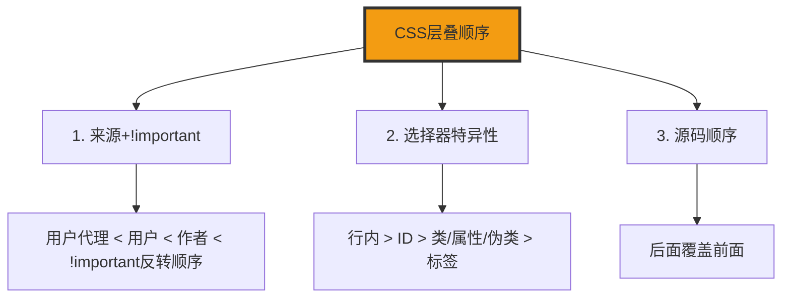

+++
title = "第33章 层叠与继承"
weight = 330
date = "2026-03-27T16:53:00+08:00"
type = "docs"
description = ""
isCJKLanguage = true
draft = false
+++

# 第三十三章：层叠与继承

> 当多个CSS规则冲突时，谁说了算？层叠规则就是CSS的"宫廷内斗"大戏！学会层叠，你就是那个笑到最后的宫斗冠军——妈妈再也不用担心你被 `!important` 这个bug级队友坑了！CSS：我全都要.jpg

## 33.1 CSS 层叠规则

### 33.1.1 三个步骤

当多个CSS规则冲突时，浏览器按这四步决定最终样式。

**第一步：收集所有冲突声明**

浏览器会收集所有应用到当前元素的所有CSS声明。

```css
/* 浏览器会收集这些冲突声明 */
h1 { color: red; }
h1 { color: blue; } /* 和上面冲突 */
h1 { color: green !important; }
```

**第二步：按来源和重要性排序**

不同来源的样式有不同的优先级（从低到高）：
用户代理样式 < 用户样式 < 作者样式。

```css
/* 作者样式（我们写的）> 用户代理样式（浏览器默认）*/
```

但有个例外——`!important`会翻转这个顺序：

```css
/* !important 让用户样式优先级高于作者样式 */
p { color: red !important; } /* 作者的普通样式 */
html p { color: blue; }      /* 用户的 !important 样式，胜出！ */
```

**第三步：按选择器优先级（特异性）排序**

同一来源的样式，按选择器的精确度排序：行内样式 > ID > 类/属性/伪类 > 标签。

```css
/* 选择器优先级示例 */
#header { color: red; }      /* ID选择器，优先级最高 */
.title { color: blue; }      /* 类选择器，次之 */
h1 { color: green; }         /* 标签选择器，优先级最低 */
```

**第四步：按源码顺序决定**

当优先级相同时，后出现的规则覆盖先出现的规则。

```css
/* 后面覆盖前面 */
p { color: red; }
p { color: blue; } /* 这个生效 */
```

### 33.1.2 来源优先级

不同来源的CSS有不同的默认优先级。

```css
/* 1. 用户代理样式（浏览器默认）*/
/* 2. 用户样式（浏览器设置）*/
/* 3. 作者样式（我们写的）优先级最高 */
```

## 33.2 CSS 继承

### 33.2.1 默认继承的属性

有些CSS属性会自动从父元素继承到子元素。

```css
/* 文字相关属性通常可继承 */
.parent {
  color: #3498db; /* 会继承给子元素 */
  font-size: 16px;  /* 会继承给子元素 */
  font-family: sans-serif; /* 会继承给子元素 */
}

.child {
  /* 自动继承父元素的样式 */
}
```

### 33.2.2 强制继承——inherit / initial / unset

CSS提供了四个强制控制继承行为的关键字。

```css
/* inherit：强制继承父元素的值 */
.force-inherit {
  color: inherit;
  /* 强制继承父元素的color */
}

/* initial：强制重置为CSS规范定义的初始值 */
.force-initial {
  color: initial;
  /* 强制使用默认值（通常是黑色）*/
}

/* unset：重置属性 */
/* 可继承属性 → 继承父元素值；不可继承属性 → 使用初始值 */
.force-unset {
  color: unset;
  /* 如果color可继承，则继承父元素值；否则使用初始值 */
}

/* revert：重置为用户代理样式 */
.force-revert {
  color: revert;
  /* 回退到浏览器默认样式 */
}
```

## 33.3 CSS 自定义属性（变量）

### 33.3.1 定义——--variable-name: value;

CSS变量（自定义属性）以`--`开头，可以在:root中定义全局变量。

```css
/* 定义全局变量 */
:root {
  /* 颜色变量 */
  --primary-color: #3498db;
  --secondary-color: #2ecc71;
  --text-color: #333;
  --bg-color: #ffffff;

  /* 尺寸变量 */
  --spacing-sm: 8px;
  --spacing-md: 16px;
  --spacing-lg: 24px;
  --spacing-xl: 32px;

  /* 圆角变量 */
  --radius-sm: 4px;
  --radius-md: 8px;
  --radius-lg: 16px;

  /* 阴影变量 */
  --shadow-sm: 0 2px 4px rgba(0, 0, 0, 0.1);
  --shadow-md: 0 4px 12px rgba(0, 0, 0, 0.15);
  --shadow-lg: 0 8px 24px rgba(0, 0, 0, 0.2);
}
```

### 33.3.2 使用——var(--variable-name)

使用`var()`函数调用变量。

```css
/* 使用变量 */
.button {
  background: var(--primary-color);
  color: white;
  padding: var(--spacing-md);
  border-radius: var(--radius-md);
  box-shadow: var(--shadow-sm);
}

.card {
  background: var(--bg-color);
  color: var(--text-color);
  padding: var(--spacing-lg);
  border-radius: var(--radius-lg);
}
```

### 33.3.3 备用值

`var()`函数可以提供备用值。

```css
/* 备用值语法 */
.with-fallback {
  color: var(--undefined-color, #333);
  /* 如果--undefined-color未定义，使用#333 */
  background: var(--brand-color, #3498db);
  /* 如果--brand-color未定义，使用#3498db */
}

/* 多级备用值 */
.multi-fallback {
  color: var(--color-1, var(--color-2, #333));
  /* 先尝试--color-1，再尝试--color-2，最后用#333 */
}
```

### 33.3.4 作用域

CSS变量有作用域，当前元素及其子孙元素可用。

```css
/* 全局作用域 */
:root {
  --global-var: blue;
}

/* 组件作用域 */
.component {
  --component-color: green; /* 仅在.component及其子元素中可用 */
}

/* 多次定义，后面的覆盖前面的 */
.layered {
  --size: 10px;
  background: var(--size); /* 10px */
}

.layered .inner {
  --size: 20px; /* 覆盖外部的--size */
  background: var(--size); /* 20px */
}
```

### 33.3.5 JavaScript读写

CSS变量可以通过JavaScript动态读写。

```javascript
// 读取变量值
const root = document.documentElement;
const styles = getComputedStyle(root);
const color = styles.getPropertyValue('--primary-color').trim();
console.log(color); // #3498db

// 写入变量
root.style.setProperty('--primary-color', '#e74c3c');

// 删除变量
root.style.removeProperty('--primary-color');
```

### 33.3.6 主题切换

CSS变量可以实现主题切换。

```css
/* 亮色主题 */
:root {
  --bg: #ffffff;
  --text: #333333;
}

[data-theme="dark"] {
  --bg: #1a1a1a;
  --text: #ffffff;
}

body {
  background: var(--bg);
  color: var(--text);
}
```

```javascript
// 切换主题
document.documentElement.setAttribute('data-theme', 'dark');
```

---

## 本章小结

### 核心知识点

| 概念 | 说明 |
|-------|------|
| 层叠规则 | 来源/重要性 > 特异性 > 顺序 |
| inherit | 强制继承父元素值 |
| initial | 使用CSS初始值 |
| unset | 可继承则继承，否则初始值 |
| revert | 回退到用户代理默认值 |
| CSS变量 | --variable定义，var()使用 |

### 层叠顺序图解



### 下章预告

下一章我们将学习渲染性能优化！

