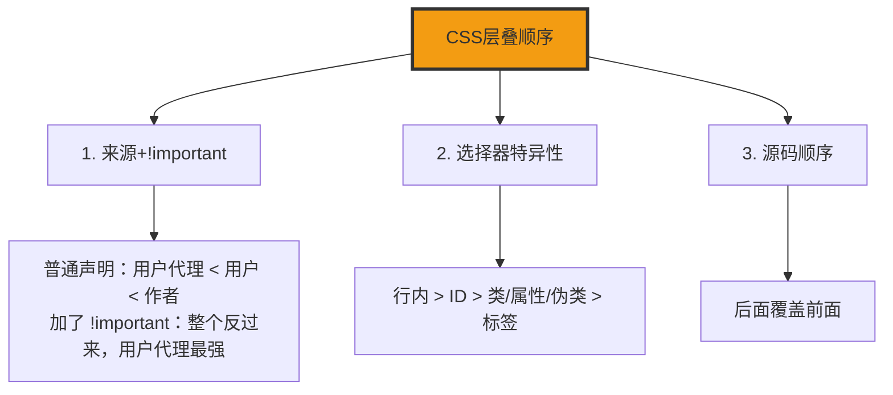

+++
title = "第33章 层叠与继承"
weight = 330
date = "2026-03-27T16:53:00+08:00"
type = "docs"
description = ""
isCJKLanguage = true
draft = false
+++

# 第三十三章：层叠与继承

> 当多个CSS规则冲突时，谁说了算？层叠规则就是CSS的"宫廷内斗"大戏！学会层叠，你就是那个笑到最后的宫斗冠军——妈妈再也不用担心你被 `!important` 这个bug级队友坑了！CSS：我全都要.jpg

## 33.1 CSS 层叠规则

### 33.1.1 三个步骤

当多个CSS规则冲突时，浏览器按下面这四步决定最终样式（所以标题其实该叫"四步"，少一步都会算错）。

**第一步：收集所有冲突声明**

浏览器会收集所有应用到当前元素的所有CSS声明。

```css
/* 浏览器会收集这些冲突声明 */
h1 { color: red; }
h1 { color: blue; } /* 和上面冲突 */
h1 { color: green !important; }
```

**第二步：按来源和重要性排序**

不同来源的样式有不同的优先级（从低到高）：
用户代理样式 < 用户样式 < 作者样式。

```css
/* 作者样式（我们写的）> 用户代理样式（浏览器默认）*/
```

但有个例外——`!important`会翻转这个顺序：

```css
/* 作者样式表里写的 !important */
p { color: red !important; }

/* 用户在浏览器"外观设置"里也写了一条 !important 的用户样式：
   在"重要声明"这一档里，用户 > 作者，所以最终是蓝色，不是红色。
   用户样式表（概念示意）：p { color: blue !important; } */
```

> 📊 **完整的层叠优先级表（从弱到强）**——记住这张表就不用再猜了：
>
> | 顺序 | 来源 | 说明 |
> |------|------|------|
> | 1（最弱） | 用户代理 普通 | 浏览器默认样式 |
> | 2 | 用户 普通 | 用户在浏览器设置里写的 |
> | 3 | 作者 普通 | **我们写的普通 CSS**（绝大多数情况） |
> | 4 | CSS 动画 @keyframes | 动画期间的值会盖住普通声明 |
> | 5 | 作者 `!important` | 我们的 `!important` |
> | 6 | 用户 `!important` | 用户的 `!important` |
> | 7 | 用户代理 `!important` | 浏览器自己的 `!important` |
> | 8（最强） | CSS 过渡 transition | 正在过渡的值压过一切 |
>
> 规律很好记：**普通声明是"作者最大"，一加 `!important` 就整个反过来变成"浏览器最大"**——
> 这是规范留给用户和无障碍工具的"后门"，让网页作者没法用 `!important` 强行锁死用户的偏好。

**第三步：按选择器优先级（特异性）排序**

同一来源的样式，按选择器的精确度排序：行内样式 > ID > 类/属性/伪类 > 标签。
（严格说行内样式不算"特异性"，它是层叠里单列的一档，但效果上就是比任何选择器都强。）

```css
/* 选择器优先级示例 */
#header { color: red; }      /* ID选择器，优先级最高 */
.title { color: blue; }      /* 类选择器，次之 */
h1 { color: green; }         /* 标签选择器，优先级最低 */
```

> 🧮 **特异性怎么数？** 把它想成三个计数器，从小到大写成一个"三位数"：
> `(ID 个数, 类/属性/伪类个数, 标签/伪元素个数)`。
> `#nav .item:hover a` → `(1, 2, 1)`；`ul li a` → `(0, 0, 3)`。前者赢，因为先比第一位。
> 两个选择器是**逐位比较、不会进位**——11 个类也永远赢不过 1 个 ID。
>
> | 写法 | 特异性 |
> |------|--------|
> | `*`、组合符（`>` `+` `~` 和空格） | `(0,0,0)` |
> | `:where(...)` | `(0,0,0)`，恒为 0，专门用来降权 |
> | `:is(...)`、`:not(...)`、`:has(...)` | 取括号内**最强那个**的特异性 |
> | `:nth-child(2)` | `(0,1,0)`；写 `:nth-child(2 of .x)` 时 `.x` 也要算进去 |
> | 行内 `style` 属性 | 单独一档，强过所有选择器，只输给 `!important` |

**第四步：按源码顺序决定**

当优先级相同时，后出现的规则覆盖先出现的规则。

```css
/* 后面覆盖前面 */
p { color: red; }
p { color: blue; } /* 这个生效 */
```

### 33.1.2 来源优先级

不同来源的CSS有不同的默认优先级。

```css
/* 1. 用户代理样式（浏览器默认）*/
/* 2. 用户样式（浏览器设置）*/
/* 3. 作者样式（我们写的）优先级最高 */
```

## 33.2 CSS 继承

### 33.2.1 默认继承的属性

有些CSS属性会自动从父元素继承到子元素。

```css
/* 文字相关属性通常可继承 */
.parent {
  color: #3498db; /* 会继承给子元素 */
  font-size: 16px;  /* 会继承给子元素 */
  font-family: sans-serif; /* 会继承给子元素 */
}

.child {
  /* 自动继承父元素的样式 */
}
```

### 33.2.2 强制继承——inherit / initial / unset

CSS提供了四个强制控制继承行为的关键字。

```css
/* inherit：强制继承父元素的值 */
.force-inherit {
  color: inherit;
  /* 强制继承父元素的color */
}

/* initial：强制重置为CSS规范定义的初始值 */
.force-initial {
  color: initial;
  /* 强制使用默认值（通常是黑色）*/
}

/* unset：重置属性 */
/* 可继承属性 → 继承父元素值；不可继承属性 → 使用初始值 */
.force-unset {
  color: unset;
  /* 如果color可继承，则继承父元素值；否则使用初始值 */
}

/* revert：重置为用户代理样式 */
.force-revert {
  color: revert;
  /* 回退到浏览器默认样式 */
}
```

> ⚠️ **`initial` 最容易被误解的一点：它给的是"属性的初始值"，不是"这个元素平时长什么样"。**
> 比如 `div { display: initial; }` 会让 div 变成 `inline`——因为 `display` 的初始值是 `inline`，
> 而 div 默认是 `block` 靠的是**用户代理样式**，不是初始值。想"变回浏览器默认"要用 `revert`。
>
> 四个关键字速查：
>
> | 关键字 | 可继承属性（如 color） | 不可继承属性（如 display） |
> |--------|----------------------|--------------------------|
> | `inherit` | 取父元素的值 | 取父元素的值 |
> | `initial` | 取规范初始值 | 取规范初始值 |
> | `unset` | 取父元素的值（≈inherit） | 取规范初始值（≈initial） |
> | `revert` | 回退到 UA/用户样式里的值 | 回退到 UA/用户样式里的值 |
> | `revert-layer` | 回退到上一个 `@layer` 的值 | 同上 |

## 33.3 CSS 自定义属性（变量）

### 33.3.1 定义——--variable-name: value;

CSS变量（自定义属性）以`--`开头，可以在:root中定义全局变量。

```css
/* 定义全局变量 */
:root {
  /* 颜色变量 */
  --primary-color: #3498db;
  --secondary-color: #2ecc71;
  --text-color: #333;
  --bg-color: #ffffff;

  /* 尺寸变量 */
  --spacing-sm: 8px;
  --spacing-md: 16px;
  --spacing-lg: 24px;
  --spacing-xl: 32px;

  /* 圆角变量 */
  --radius-sm: 4px;
  --radius-md: 8px;
  --radius-lg: 16px;

  /* 阴影变量 */
  --shadow-sm: 0 2px 4px rgba(0, 0, 0, 0.1);
  --shadow-md: 0 4px 12px rgba(0, 0, 0, 0.15);
  --shadow-lg: 0 8px 24px rgba(0, 0, 0, 0.2);
}
```

### 33.3.2 使用——var(--variable-name)

使用`var()`函数调用变量。

```css
/* 使用变量 */
.button {
  background: var(--primary-color);
  color: white;
  padding: var(--spacing-md);
  border-radius: var(--radius-md);
  box-shadow: var(--shadow-sm);
}

.card {
  background: var(--bg-color);
  color: var(--text-color);
  padding: var(--spacing-lg);
  border-radius: var(--radius-lg);
}
```

### 33.3.3 备用值

`var()`函数可以提供备用值。

```css
/* 备用值语法 */
.with-fallback {
  color: var(--undefined-color, #333);
  /* 如果--undefined-color未定义，使用#333 */
  background: var(--brand-color, #3498db);
  /* 如果--brand-color未定义，使用#3498db */
}

/* 多级备用值 */
.multi-fallback {
  color: var(--color-1, var(--color-2, #333));
  /* 先尝试--color-1，再尝试--color-2，最后用#333 */
}
```

### 33.3.4 作用域

CSS变量有作用域，当前元素及其子孙元素可用。

```css
/* 全局作用域 */
:root {
  --global-var: blue;
}

/* 组件作用域 */
.component {
  --component-color: green; /* 仅在.component及其子元素中可用 */
}

/* 多次定义，后面的覆盖前面的 */
.layered {
  --size: 10px;
  background: var(--size); /* 10px */
}

.layered .inner {
  --size: 20px; /* 覆盖外部的--size */
  background: var(--size); /* 20px */
}
```

### 33.3.5 JavaScript读写

CSS变量可以通过JavaScript动态读写。

```javascript
// 读取变量值
const root = document.documentElement;
const styles = getComputedStyle(root);
const color = styles.getPropertyValue('--primary-color').trim();
console.log(color); // #3498db

// 写入变量
root.style.setProperty('--primary-color', '#e74c3c');

// 删除变量
root.style.removeProperty('--primary-color');
```

### 33.3.6 主题切换

CSS变量可以实现主题切换。

```css
/* 亮色主题 */
:root {
  --bg: #ffffff;
  --text: #333333;
}

[data-theme="dark"] {
  --bg: #1a1a1a;
  --text: #ffffff;
}

body {
  background: var(--bg);
  color: var(--text);
}
```

```javascript
// 切换主题
document.documentElement.setAttribute('data-theme', 'dark');
```

### 33.3.7 五个必须知道的细节

```css
/* ① 变量名区分大小写！--Primary 和 --primary 是两个完全不同的变量。
      （普通 CSS 属性名不区分大小写，这是自定义属性的特殊之处。） */
:root {
  --Primary: #3498db;
  --primary: #e74c3c;
}

/* ② 自定义属性默认是"可继承"的，所以定义在 :root 上就等于全局变量，
      定义在 .card 上就只在 .card 及其子孙里可见。 */

/* ③ 值是"声明时原样保存、用时才替换"的，所以可以先引用后定义。 */
/*
.late-use { color: var(--later); }   ← 这里引用
.late-use { --later: blue; }          ← 后面才赋值，一样生效
*/

/* ④ 备用值只在"变量压根不存在"时才兜底。 */
.fallback-ok {
  color: var(--not-defined, #333);   /* 变量没定义 → 用 #333 ✅ */
}

/* ⑤ 如果变量存在、但替换后对目标属性来说是非法的，整条声明会变成
      "计算值阶段无效"（invalid at computed-value time）：该属性直接按 unset 处理，
      **既不会用备用值，也不会回退到前面那条声明**。这是最难查的一类坑。 */
:root { --oops: 20px; }              /* 20px 对 color 来说不合法 */
.broken {
  color: red;                        /* 以为这条能兜底？并不会 */
  color: var(--oops);                /* → color 变成 unset（继承父元素色），不是红色 */
}
```

> 💡 **进阶：`@property` 给变量加类型。** 默认的自定义属性是"未定型"的字符串，
> 浏览器不知道怎么在动画里插值。用 `@property` 注册类型后，变量不仅能被平滑动画，
> 还能声明默认值和继承行为：
>
> ```css
> @property --angle {
>   syntax: '<angle>';        /* 声明这是角度类型 */
>   initial-value: 0deg;      /* 必须有初始值（除非 syntax 是 '*'）*/
>   inherits: false;          /* 不继承 */
> }
>
> .spinner {
>   --angle: 0deg;
>   transition: --angle 1s;   /* 现在这个自定义属性可以过渡了 */
> }
> .spinner:hover { --angle: 360deg; }
> ```

> 🚫 **一个限制：** `var()` 不能用在媒体查询、容器查询的条件里，也不能用来拼选择器。
> `@media (min-width: var(--bp))` 是无效的——媒体查询在"变量计算"之前就要解析完。
> 这类需求请改用容器查询、或由构建工具生成具体数值。

---

## 本章小结

### 核心知识点

| 概念 | 说明 |
|-------|------|
| 层叠规则 | 来源/重要性 > 特异性 > 顺序 |
| inherit | 强制继承父元素值 |
| initial | 使用CSS初始值 |
| unset | 可继承则继承，否则初始值 |
| revert | 回退到用户代理默认值 |
| CSS变量 | --variable定义，var()使用 |

### 层叠顺序图解


```mermaid
graph TD
    A["CSS层叠顺序"] --> B["1. 来源+!important"]
    A --> C["2. 选择器特异性"]
    A --> D["3. 源码顺序"]

    B --> B1["普通声明：用户代理 &lt; 用户 &lt; 作者<br/>加了 !important：整个反过来，用户代理最强"]
    C --> C1["行内 > ID > 类/属性/伪类 > 标签"]
    D --> D1["后面覆盖前面"]

    style A fill:#f39c12,stroke:#333,stroke-width:3px
```

### 下章预告

下一章我们将学习渲染性能优化！
