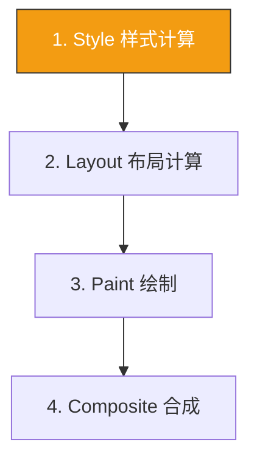

+++
title = "第34章 渲染性能"
weight = 340
date = "2026-03-27T16:53:00+08:00"
type = "docs"
description = ""
isCJKLanguage = true
draft = false
+++

# 第三十四章：渲染性能

> 性能就是体验！卡顿的网页让人想砸键盘，这一章我们学习让CSS跑得更快的技巧。记住：卡顿是用户离开的最佳理由，别让你的网页成为"浏览器坟墓"！

## 34.1 浏览器渲染流水线

### 34.1.1 四个阶段

浏览器渲染页面要经过以下四个阶段。

**浏览器渲染流程：**

当浏览器显示一个页面时，它需要经过以下步骤：



**Style（样式计算）**

浏览器遍历DOM树，计算每个元素的CSS规则。

```css
/* Style阶段消耗资源的情况 */
.complex-selectors {
  /* 复杂的选择器需要更多计算 */
  .container > .sidebar .nav .menu li a:hover { color: red; }
}
```

**Layout（布局计算）**

当元素的尺寸或位置变化时，浏览器需要重新计算所有相关元素的位置。

```css
/* 触发Layout的操作 */
.trigger-layout {
  width: 200px; /* 改变宽度 */
  height: 100px; /* 改变高度 */
  margin: 20px; /* 改变外边距 */
  padding: 10px; /* 改变内边距 */
  position: absolute; /* 改变定位方式 */
}
```

**Paint（绘制）**

浏览器将每个盒子的可视化信息绘制到像素图层中。

```css
/* 触发Paint的操作 */
.trigger-paint {
  color: red;                         /* 改变颜色 → 触发Paint */
  background-color: blue;             /* 改变背景 → 触发Paint */
  box-shadow: 0 2px 4px rgba(0,0,0,.3); /* 阴影变化 → 触发Paint */
  display: none;                      /* 完全消失 → 触发Layout+Paint（跳过Composite）*/
}
```

> ⚠️ 注意：`visibility: hidden` 仍然会触发 Layout 和 Paint！只是看不见而已，
> 浏览器照画不误。真正"不画"的是 `display: none`，它连 Layout 都跳过了。

**Composite（合成）**

浏览器将多个图层合成为最终图像。

```css
/* 仅触发Composite的操作（最快）*/
.only-composite {
  transform: translateX(100px); /* 不触发Layout和Paint */
  opacity: 0.5; /* 不触发Layout和Paint */
}
```

## 34.2 性能优化建议

### 34.2.1 只动画transform和opacity

transform和opacity不会触发Layout和Paint，性能最好。

```css
/* GPU加速的属性（推荐动画）*/
/* 每个transform写在自己的类里，组合使用用空格连接！*/
.good-for-animation-1 { transform: translateX(100px);   /* ✅ 仅触发Composite */ }
.good-for-animation-2 { transform: scale(1.2);           /* ✅ 仅触发Composite */ }
.good-for-animation-3 { transform: rotate(45deg);        /* ✅ 仅触发Composite */ }
.good-for-animation-4 { opacity: 0.5;                    /* ✅ 仅触发Composite */ }

/* 组合transform的正确写法（用空格连接，一次性应用多个变换）*/
.combo-transform {
  transform: translateX(100px) scale(1.2) rotate(45deg);
}

/* ❌ 触发Layout的操作（性能差）*/
.bad-for-animation {
  width: 200px;      /* ❌ 触发Layout */
  height: 100px;     /* ❌ 触发Layout */
  left: 100px;       /* ❌ 触发Layout+Paint */
  top: 50px;         /* ❌ 触发Layout+Paint */
  margin: 20px;      /* ❌ 触发Layout */
  padding: 10px;     /* ❌ 触发Layout（可能影响周边元素）*/
}
```

```html
<!-- 动画效果对比 -->
<div class="good-animation" style="transform: translateX(100px);">
  ✅ transform动画很流畅
</div>

<div class="bad-animation" style="left: 100px;">
  ❌ left动画很卡顿
</div>
```

### 34.2.2 批量读写DOM

读写DOM交替会导致多次Layout。

```javascript
// ❌ 错误：读写交替导致多次Layout（每读一次，浏览器就得立刻算一次）
element.style.width = '100px';           // 写
console.log(element.offsetWidth);         // 读 → 触发Layout
element.style.height = '200px';           // 写
console.log(element.offsetHeight);        // 读 → 又触发Layout

// ✅ 正确：批量读完后批量写（只触发1次Layout）
const w = element.offsetWidth;            // 先全部读完
const h = element.offsetHeight;
element.style.width = '100px';            // 再一口气写
element.style.height = '200px';

// ✅ 进阶：用 requestAnimationFrame 分离读写时机
// 读放到上一帧，写放到下一帧，彻底避免同步Layout
requestAnimationFrame(() => {
  const w = element.offsetWidth;          // 读（当前帧）
  requestAnimationFrame(() => {
    element.style.width = w + 10 + 'px';   // 写（下一帧）
  });
});
```

## 34.3 contain 属性

### 34.3.1 contain:layout

`contain` 属性告诉浏览器："这个元素的内部折腾，别影响到外面的DOM树。"

```css
/* contain:layout 限制布局影响范围 */
.contained {
  contain: layout;
  /* 元素的布局变化不会影响外部的任何人 */
}
```

### 34.3.2 contain: strict（更彻底）

`contain: strict` = `contain: layout paint style size`，隔离得最彻底：

```css
/* 彻底封印，性能更强 */
.fully-contained {
  contain: strict;
  /* layout、paint、style、size 全部隔离，外部不受影响 */
}
```

> 💡 适合：页面中独立运行的Widget、长列表中的复杂卡片、第三方嵌入iframe的替代方案。

## 34.4 content-visibility

### 34.4.1 content-visibility:auto

content-visibility: auto跳过离屏内容的渲染。

```css
/* 长列表优化 */
.long-list-item {
  content-visibility: auto;
  /* 屏幕外的元素跳过渲染 */
  contain-intrinsic-size: 0 100px; /* 预估高度 */
}
```

## 34.5 will-change

### 34.5.1 will-change:transform

提前告知浏览器即将变化的属性，让它提前创建图层（俗称"GPU加速"）。

```css
/* 预告知浏览器即将动画 */
.will-animate {
  will-change: transform;
  /* 浏览器提前创建图层 → 动画更流畅 */
}
```

> ⚠️ 别滥用！每个图层都是内存黑洞。
> 常见错误：给一堆元素都加 `will-change: transform`，结果内存爆炸，卡得更厉害。
> 原则：**只在真正要动画之前加，动画结束后移除（或直接用完就删掉这行）。**

---

## 本章小结

### 性能优化原则

| 优化项 | 说明 |
|--------|------|
| transform / opacity | 仅触发Composite，性能最好 |
| contain:layout | 限制布局影响范围 |
| contain:strict | 全面隔离（layout + paint + style + size）|
| content-visibility | 跳过离屏渲染 |
| will-change | 预创建图层（⚠️ 勿滥用）|
| 批量读写DOM | 读完全部再写，防止多次同步Layout |
| requestAnimationFrame | 分离读写时机，性能翻倍 |

### 下章预告

下一章我们将学习CSS架构与预处理器！

