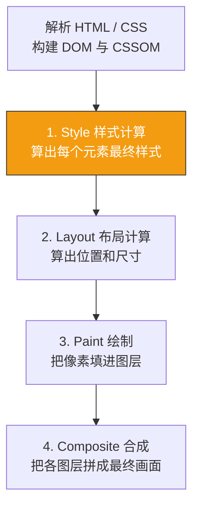

+++
title = "第34章 渲染性能"
weight = 340
date = "2026-03-27T16:53:00+08:00"
type = "docs"
description = ""
isCJKLanguage = true
draft = false
+++

# 第三十四章：渲染性能

> 性能就是体验！卡顿的网页让人想砸键盘，这一章我们学习让CSS跑得更快的技巧。记住：卡顿是用户离开的最佳理由，别让你的网页成为"浏览器坟墓"！

## 34.1 浏览器渲染流水线

### 34.1.1 四个阶段

浏览器渲染页面要经过以下四个阶段。

**浏览器渲染流程：**

当浏览器显示一个页面时，它需要经过以下步骤：


```mermaid
graph TD
    A["解析 HTML / CSS<br/>构建 DOM 与 CSSOM"] --> B["1. Style 样式计算<br/>算出每个元素最终样式"]
    B --> C["2. Layout 布局计算<br/>算出位置和尺寸"]
    C --> D["3. Paint 绘制<br/>把像素填进图层"]
    D --> E["4. Composite 合成<br/>把各图层拼成最终画面"]

    style B fill:#f39c12, stroke:#333, color:#fff
```

优化的思路就一句话：**尽量让变化发生在链条的末端**。改 `transform` 只需要重新合成；改 `width` 却要从布局重新算一遍。

**Style（样式计算）**

浏览器遍历DOM树，计算每个元素的CSS规则。

```css
/* Style阶段消耗资源的情况 */
.complex-selectors {
  /* 复杂的选择器需要更多计算 */
  .container > .sidebar .nav .menu li a:hover { color: red; }
}
```

> 📌 顺带纠正一个流传甚广的说法："选择器写复杂了会拖慢页面"。现代浏览器按"从右往左"匹配，并且有样式失效缓存，选择器本身的开销通常比你想象的**小得多**——真正贵的是布局和绘制。所以选择器的"层级别套太深"主要还是为了**可维护性和复用性**，把它当成首要性能问题去优化，属于把力气花错了地方。

**Layout（布局计算）**

当元素的尺寸或位置变化时，浏览器需要重新计算所有相关元素的位置。

```css
/* 触发Layout的操作 */
.trigger-layout {
  width: 200px; /* 改变宽度 */
  height: 100px; /* 改变高度 */
  margin: 20px; /* 改变外边距 */
  padding: 10px; /* 改变内边距 */
  position: absolute; /* 改变定位方式 */
}
```

**Paint（绘制）**

浏览器将每个盒子的可视化信息绘制到像素图层中。

```css
/* 触发Paint的操作 */
.trigger-paint {
  color: red;                         /* 改变颜色 → 触发Paint */
  background-color: blue;             /* 改变背景 → 触发Paint */
  box-shadow: 0 2px 4px rgba(0,0,0,.3); /* 阴影变化 → 触发Paint */
  visibility: hidden;                 /* 不改变几何 → 只影响Paint/Composite */
}
```

> ⚠️ 这里有两个特别容易说反的点：
>
> - **`visibility: hidden` 不会触发 Layout**。它不改变任何元素的尺寸和位置，只让元素在绘制阶段"不画出来"，所以仍然占着原来的空间——这是它和 `display: none` 最本质的区别。
> - **`display: none` 才真正把元素从布局里拿掉**，因此会触发 **Layout + Paint**：元素自己不画了，但它空出来的位置要让兄弟元素重新排布。它不是"跳过"了某个阶段，而是变化的影响面更大。
>
> 一句话记：**`visibility` 是"看不见但还在"（不重排），`display: none` 是"压根不存在"（要重排）。**

**Composite（合成）**

浏览器将多个图层合成为最终图像。

```css
/* 仅触发Composite的操作（最快）*/
.only-composite {
  transform: translateX(100px); /* 不触发Layout和Paint */
  opacity: 0.5; /* 不触发Layout和Paint */
}
```

### 34.1.2 速查：改哪些属性会打翻哪些环节

| 属性（举例） | Style | Layout | Paint | Composite | 结论 |
|------|:---:|:---:|:---:|:---:|------|
| `transform`、`opacity`、`filter` | 是 | 否 | 否 | 是 | 最便宜，优先用于动画 |
| `color`、`background-color`、`visibility`、`box-shadow`、`border-color` | 是 | 否 | 是 | 是 | 中等，别在每一帧里改 |
| `width`、`height`、`margin`、`padding`、`font-size`、`line-height`、`top`/`left`（非 fixed 定位） | 是 | 是 | 是 | 是 | 最贵，动画里尽量避开 |
| 增删节点、改文本内容、`display: none` | 是 | 是 | 是 | 是 | 会连带影响周边元素 |

> 注意这是"典型行为"，不是铁律：浏览器会做很多优化（比如把某个元素单独提升为图层后，改 `opacity` 就只剩合成开销）。所以**一切都以 DevTools 实测为准**，别背表格下结论。

## 34.2 性能优化建议

### 34.2.1 只动画transform和opacity

transform和opacity不会触发Layout和Paint，性能最好。

```css
/* GPU加速的属性（推荐动画）*/
/* 每个transform写在自己的类里，组合使用用空格连接！*/
.good-for-animation-1 { transform: translateX(100px);   /* ✅ 仅触发Composite */ }
.good-for-animation-2 { transform: scale(1.2);           /* ✅ 仅触发Composite */ }
.good-for-animation-3 { transform: rotate(45deg);        /* ✅ 仅触发Composite */ }
.good-for-animation-4 { opacity: 0.5;                    /* ✅ 仅触发Composite */ }

/* 组合transform的正确写法（用空格连接，一次性应用多个变换）*/
.combo-transform {
  transform: translateX(100px) scale(1.2) rotate(45deg);
}

/* ❌ 触发Layout的操作（性能差）*/
.bad-for-animation {
  width: 200px;      /* ❌ 触发Layout */
  height: 100px;     /* ❌ 触发Layout */
  left: 100px;       /* ❌ 触发Layout+Paint */
  top: 50px;         /* ❌ 触发Layout+Paint */
  margin: 20px;      /* ❌ 触发Layout */
  padding: 10px;     /* ❌ 触发Layout（可能影响周边元素）*/
}
```

```html
<!-- 动画效果对比 -->
<div class="good-animation" style="transform: translateX(100px);">
  ✅ transform动画很流畅
</div>

<div class="bad-animation" style="left: 100px;">
  ❌ left动画很卡顿
</div>
```

### 34.2.2 批量读写DOM

读写DOM交替会导致多次Layout。

```javascript
// ❌ 错误：读写交替导致多次Layout（每读一次，浏览器就得立刻算一次）
element.style.width = '100px';           // 写
console.log(element.offsetWidth);         // 读 → 触发Layout
element.style.height = '200px';           // 写
console.log(element.offsetHeight);        // 读 → 又触发Layout

// ✅ 正确：批量读完后批量写（只触发1次Layout）
const w = element.offsetWidth;            // 先全部读完
const h = element.offsetHeight;
element.style.width = '100px';            // 再一口气写
element.style.height = '200px';

// ✅ 进阶：用 requestAnimationFrame 分离读写时机
// 读放到上一帧，写放到下一帧，彻底避免同步Layout
requestAnimationFrame(() => {
  const w = element.offsetWidth;          // 读（当前帧）
  requestAnimationFrame(() => {
    element.style.width = w + 10 + 'px';   // 写（下一帧）
  });
});
```

## 34.3 contain 属性

### 34.3.1 contain:layout

`contain` 属性告诉浏览器："这个元素的内部折腾，别影响到外面的DOM树。"

```css
/* contain:layout 限制布局影响范围 */
.contained {
  contain: layout;
  /* 元素的布局变化不会影响外部的任何人 */
}
```

### 34.3.2 contain: strict（更彻底）

`contain: strict` = `contain: layout paint style size`，隔离得最彻底：

```css
/* 彻底封印，性能更强 */
.fully-contained {
  contain: strict;
  /* layout、paint、style、size 全部隔离，外部不受影响 */
}
```

> 💡 适合：页面中独立运行的Widget、长列表中的复杂卡片、第三方嵌入iframe的替代方案。

## 34.4 content-visibility

### 34.4.1 content-visibility:auto

content-visibility: auto跳过离屏内容的渲染。

```css
/* 长列表优化 */
.long-list-item {
  content-visibility: auto;
  /* 屏幕外的元素跳过渲染 */
  /* 预估尺寸：告诉浏览器"这些离屏元素大概多高"，
     否则滚动条会跳动、锚点定位也会不准 */
  contain-intrinsic-size: auto 300px;
}
```

> ⚠️ **`contain-intrinsic-size` 不是可选项，是必需品。** 如果只写 `content-visibility: auto` 而不给预估尺寸，浏览器会把离屏元素当成 0 高度，页面总高度会在滚动过程中不断变化——滚动条乱跳、滚动位置丢失、`tabindex` 焦点跳来跳去，体验比不做优化还糟。
>
> `auto 300px` 里的 `auto` 表示"元素一旦真正渲染过，就记住它上次的真实高度"（浏览器会把它缓存下来），这样后续滚动就越来越准。

## 34.5 will-change

### 34.5.1 will-change:transform

提前告知浏览器即将变化的属性，让它提前创建图层（俗称"GPU加速"）。

```css
/* 预告知浏览器即将动画 */
.will-animate {
  will-change: transform;
  /* 浏览器提前创建图层 → 动画更流畅 */
}
```

> ⚠️ 别滥用！每个图层都是内存黑洞。
> 常见错误：给一堆元素都加 `will-change: transform`，结果内存爆炸，卡得更厉害。
> 原则：**只在真正要动画之前加，动画结束后移除（或直接用完就删掉这行）。**

正确的用法是"临近动画时加、结束后删"：

```css
/* ❌ 常驻：几十个元素各自一个图层，显存和内存一起爆 */
.card { will-change: transform; }

/* ✅ 在真正要动的前一刻加上，动完就撤掉 */
.card {
  transition: transform 0.3s;
}
.card:hover { transform: translateY(-4px); }
```

```javascript
// ✅ 用 JS 精确控制生命周期：进场时提示，动画结束就撤销
card.addEventListener('mouseenter', () => {
  card.style.willChange = 'transform';
});
card.addEventListener('transitionend', () => {
  card.style.willChange = 'auto';   // 撤销提示，释放图层
});
```

> 💡 另外提醒：`transform: translateZ(0)` 这个"祖传 GPU 加速 hack"今天已经**不需要**了。它会强制创建图层，但同样会带来内存和合成成本。想要流畅动画就老老实实动画 `transform` 和 `opacity`，需要提示时才用 `will-change`。

---

## 34.6 怎么知道自己的页面到底慢在哪

性能优化最忌讳"凭感觉猜"。打开浏览器 DevTools 的三个面板，比读十篇文章都管用：

### 34.6.1 Performance 面板（性能分析）

点录制 → 操作页面 → 停止，你能看到一条时间线，上面清楚标出每一帧里 Style / Layout / Paint / Composite 各花了多久。几个典型信号：

- **紫色块（Layout）很长**：说明在反复触发重排，检查是不是在循环里读写 DOM、或者动画里用了 `width`/`top`
- **绿色块（Paint）很大**：绘制区域太大，考虑用 `transform` 代替 `left`，或者用 `contain` 收窄影响范围
- **出现 "Forced reflow" 警告**：经典的强制同步布局（见 34.2.2）

### 34.6.2 Rendering 面板（实时可视化）

勾上这几个开关，页面上的性能问题会直接"画"给你看：

- **Paint flashing**：所有被重新绘制的区域会闪绿。动画时如果满屏闪绿，说明重绘范围太大
- **Layer borders**：显示合成层边界。层太多（密密麻麻的框）往往意味着 `will-change` 或 `translateZ(0)` 用滥了
- **Layout Shift Regions**：高亮布局偏移区域，排查 CLS（累积布局偏移）

### 34.6.3 别忘了"动画要有开关"

```css
/* 尊重系统的"减弱动态效果"设置 */
@media (prefers-reduced-motion: reduce) {
  *,
  *::before,
  *::after {
    animation-duration: 0.01ms !important;
    animation-iteration-count: 1 !important;
    transition-duration: 0.01ms !important;
    scroll-behavior: auto !important;
  }
}
```

> 有些用户因为前庭功能障碍，会对视差、抖动、大位移动画产生眩晕甚至不适。系统里打开"减少动态效果"后，你的页面应该安静下来——这既是无障碍要求，也顺带省了性能。

---

## 本章小结

### 性能优化原则

| 优化项 | 说明 |
|--------|------|
| transform / opacity | 仅触发Composite，性能最好 |
| contain:layout | 限制布局影响范围 |
| contain:strict | 全面隔离（layout + paint + style + size）|
| content-visibility | 跳过离屏渲染 |
| will-change | 预创建图层（⚠️ 勿滥用）|
| 批量读写DOM | 读完全部再写，防止多次同步Layout |
| requestAnimationFrame | 分离读写时机，性能翻倍 |
| DevTools 三大面板 | Performance 看时间线，Rendering 看重绘/图层，Layout Shift 看抖动 |
| prefers-reduced-motion | 尊重用户的"减少动态效果"设置 |

### 下章预告

下一章我们将学习CSS架构与预处理器！
