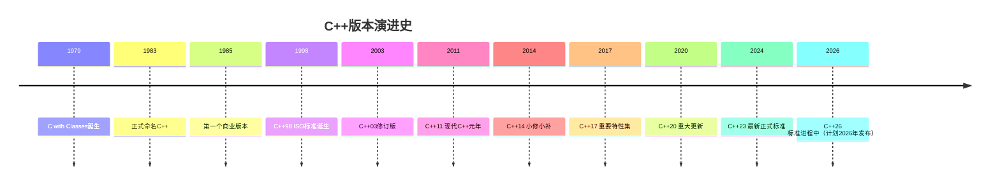
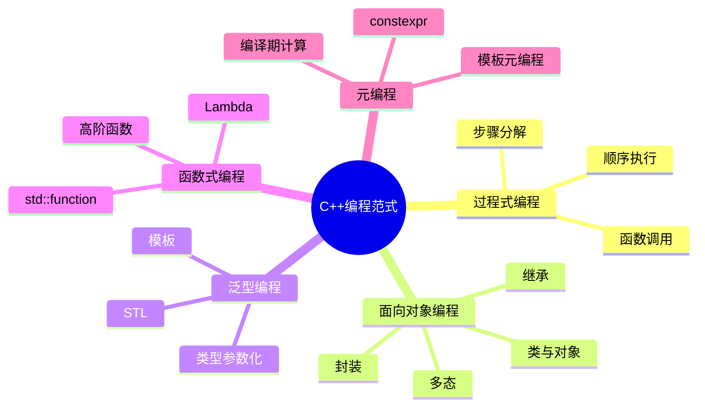

+++
title = "第1章 C++概述与历史演进"
weight = 10
date = "2026-03-29T21:43:08+08:00"
type = "docs"
description = ""
isCJKLanguage = true
draft = false
+++

# 第1章 C++概述与历史演进

## 1.1 C++的诞生与发展历程

话说1979年，在贝尔实验室（Bell Labs）的一间办公室里，一位来自丹麦的计算机科学家Bjarne Stroustrup正在思考一个问题：**"如果能让C语言支持面向对象，那该多好啊！"** 彼时的他大概没想到，这个念头会让他成为编程语言界的"C++之父"，并且让无数程序员在深夜对着模板错误信息发出绝望的呐喊。

### Bjarne Stroustrup：那个改变了一切的男人

Bjarne Stroustrup（比雅尼·斯特劳斯特鲁普），1950年出生于丹麦。他在剑桥大学获得博士学位后，加入了贝尔实验室，开始了他的"造梦"之旅。

> 有趣的是，Bjarne本人曾说过："我设计C++是为了让我的同事们不用那么频繁地来烦我。" 原来，懒，是推动科技进步的第一生产力！

### 1979年：一切的开始——"C with Classes"

1979年，Bjarne开始了一个名为"**C with Classes**"的项目。想象一下当时的场景：

- 同事A："Bjarne，C语言好是好，但不能封装啊！"
- Bjarne："别急，我来给它加点料。"
- 于是，C with Classes诞生了——这是C++的雏形，包含了类（Classes）、派生类（Derived Classes）、公有/私有访问控制（Public/Private Access Control）等特性。

这个项目最初的目的很简单：**让C语言也能玩转面向对象编程**。毕竟，C语言在当时已经称霸江湖，但它的"面向过程"思维让大型项目的维护变得像在金字塔里找一只特定的蚂蚁——难度极大。

### 1983年：C++诞生！名字的由来

1983年，"C with Classes"正式更名为**C++**。这个名字的由来堪称一绝：

- `++` 在C语言里是**递增运算符**（就是"加一"的意思）
- 所以 C++ = C + 1 = "比C更进一步"
- 同时也暗含了"C语言的超集"这层意思

> 当然，还有人调侃说：`++` 在前面就是"**先加再赋值**"（`++a`：a先变成2，表达式用2），在后面就是"**先赋值再加**"（`a++`：表达式先用a的旧值1，然后再把a变成2）。所以 C++ 的命名体现了"后置++"的哲学——**先让你用着，以后再慢慢进化**。这大概也是为什么C++的标准一直在"后置++"吧……

### C++的哲学：不给你任何借口写烂代码

C++有一条核心理念：**程序员的控制权和性能由程序员自己负责**。它不会像某些语言那样"体贴"地帮你做各种运行时检查（虽然也有assert之类的），它把刀递给你，告诉你：**"这是工具，怎么用是你的事，但别怪我没提醒你。"**

Bjarne Stroustrup本人曾强调：

> "C++的设计原则是：你不为你不使用的东西付出代价（zero-overhead）。同时，它让你能够表达高层抽象而不失去底层效率。"

用人话来说就是：**"给你足够多的工具，但不强塞给你，你爱怎么组合怎么组合，只要你能驾驭得了。"**

```cpp
// C++哲学示例：让你控制一切，但代价是你得懂自己在做什么
#include <iostream>
#include <memory>  // 智能指针，用了才付出代价，不用就没开销

int main() {
    // 裸指针：完全控制，但出了作用域没人帮你回收
    int* raw = new int(42);
    std::cout << "裸指针指向: " << *raw << std::endl;  // 输出: 裸指针指向: 42
    delete raw;  // 手动释放，不然内存泄漏等着你

    // 智能指针：自动管理，只要你用，就付出一点点代价
    auto smart = std::make_unique<int>(42);
    std::cout << "智能指针指向: " << *smart << std::endl;  // 输出: 智能指针指向: 42
    // 出了作用域自动释放，无需手动delete
    // 这就是C++哲学：你选择控制，编译器选择在你需要时帮你兜底
}
```

---

## 1.2 C++与C语言的关系与区别

### C++是更好的C

在编程语言的世界里，C++和C的关系就像**榴莲和菠萝蜜**——长得像，但味道完全不同；又像**兄弟**，一个喜欢"面向过程"，一个喜欢"面向对象"，但骨子里流着相同的血。

#### C++几乎兼容C语言

C++的设计者做了一个非常"亲民"的决定：**尽可能兼容C**。这意味着你可以在C++代码里写C风格的代码，反过来却不一定成立。

```cpp
// 恭喜你，这段代码在C和C++里都能编译通过
#include <stdio.h>  // C风格头文件，C++也能认

int main() {
    printf("Hello from C!\n");  // C风格的printf，C++照单全收
    return 0;
}
```

> 不过，"能编译"不代表"这是好代码"。就好比你带着中文去法国餐厅点菜——服务员能看懂菜单，但总觉得哪里不对。

#### C++增加了面向对象、泛型等特性

如果说C是一个**功能齐全的单人公寓**，那C++就是**一栋可以无限扩建的摩天大楼**：

| 特性 | C | C++ |
|------|-----|-----|
| 面向对象 | ❌ | ✅ 类、继承、多态 |
| 泛型编程 | ❌ | ✅ 模板 |
| 异常处理 | ❌ | ✅ try/catch |
| 命名空间 | ❌ | ✅ namespace |
| 运算符重载 | ❌ | ✅ |
| 函数重载 | ❌ | ✅ |

```cpp
// C++独门绝技展示
#include <iostream>
#include <vector>  // STL容器，C没有
#include <algorithm>  // STL算法，C没有

// 函数重载：C没有这回事
void print(int x) {
    std::cout << "整数: " << x << std::endl;
}

void print(double x) {
    std::cout << "浮点数: " << x << std::endl;
}

// 运算符重载：自定义+号的行为
class Vector2D {
public:
    int x, y;
    Vector2D(int x, int y) : x(x), y(y) {}
    
    // 重载+运算符，让两个向量能相加
    Vector2D operator+(const Vector2D& other) const {
        return Vector2D(x + other.x, y + other.y);
    }
};

int main() {
    // 函数重载
    print(42);       // 输出: 整数: 42
    print(3.14);      // 输出: 浮点数: 3.14
    
    // 运算符重载
    Vector2D v1(1, 2);
    Vector2D v2(3, 4);
    Vector2D v3 = v1 + v2;  // 就像内置类型一样自然
    std::cout << "向量相加: (" << v3.x << ", " << v3.y << ")" << std::endl;  // 输出: 向量相加: (4, 6)
    
    // STL和泛型：C的奢侈品
    std::vector<int> nums = {3, 1, 4, 1, 5, 9};
    std::sort(nums.begin(), nums.end());  // 一行代码排序
    for (int n : nums) {
        std::cout << n << " ";  // 输出: 1 1 3 4 5 9
    }
}
```

#### 但"兼容"不意味着"相同"

**敲黑板！这是重点！** C和C++的兼容性是有边界的，就像你以为和初恋复合了很开心，结果发现对方已经换了个"人设"。

### C与C++的兼容性：不是100%

#### 兼容性边界：不是100%

C++虽然在语法上兼容大部分C代码，但在**语义**和**标准库**上存在显著差异。以下情况会让你的C代码在C++中"水土不服"：

1. **关键字差异**：C++有一些额外关键字（如`class`、`public`、`virtual`、`template`等），这些在C里是合法的标识符，但在C++里是保留字。

2. **编译模式**：C++默认进行更严格的类型检查，很多在C里"睁一只眼闭一只眼"的问题在C++里会被编译器"热情地"报出来。

3. **标准库**：C的标准库和C++的标准库是两套体系，虽然C++尽量兼容，但混用时可能遇到奇怪的问题。

#### 某些C代码在C++中行为不同

这里有个经典的"坑"——**隐式函数声明**。

#### 示例：隐式函数声明

在C语言中，如果你调用一个未声明的函数，编译器会"好心"地**隐式声明**它为返回`int`类型的函数：

```c
/* C语言版本：编译器会隐式声明 foo() 为 int foo(void) */
/* 编译居然能通过！ */
int main() {
    int result = foo();  // foo没声明，但C编译器说"没事，我帮你声明了"
    return 0;
}
```

但在C++中，编译器**不会**做这种好事：

```cpp
/* C++版本：编译直接报错！ */
int main() {
    int result = foo();  // 错误：foo未被声明
    return 0;
}
```

> 为什么会这样？因为C++是**强类型语言**（怎么又是你？），它不允许"可能出错"的事情蒙混过关。在C++看来："你连foo是啥都不知道，就敢调？门都没有！"

这其实是好事一桩——**编译器帮你提前发现问题，而不是等到运行时才发现"咦，怎么程序崩溃了？"**

### 从C迁移到C++的注意事项

如果你是一个C程序员，想要"升级"到C++，以下几点必须牢记：

#### 警惕malloc/free的隐式转换

在C中，`malloc`返回`void*`，可以隐式转换为任何指针类型。C++也支持这个转换（为了兼容），但这可能导致**类型安全问题**：

```cpp
// C++中malloc的陷阱
#include <cstdlib>
#include <iostream>

struct Point {
    int x;
    int y;
    Point() : x(0), y(0) {}  // C++中构造函数很重要！
};

int main() {
    // C风格：malloc返回void*，C++允许隐式转换
    struct Point* p1 = (struct Point*)malloc(sizeof(struct Point));
    
    // C++风格：new操作符
    Point* p2 = new Point();
    
    // 问题来了：malloc不会调用构造函数！
    // p1的x和y是未初始化的垃圾值
    // p2的x和y是0
    
    std::cout << "malloc分配的Point: (" << p1->x << ", " << p1->y << ")" << std::endl;
    // 输出（垃圾值，每次运行可能不同）: malloc分配的Point: (未定义, 未定义)
    
    std::cout << "new分配的Point: (" << p2->x << ", " << p2->y << ")" << std::endl;
    // 输出: new分配的Point: (0, 0)
    
    free(p1);  // C风格释放
    delete p2; // C++风格释放
    
    // 记住：混用malloc和delete，或new和free，后果自负！
}
```

> **血的教训**：`malloc`不会调用构造函数，`free`不会调用析构函数。在C++里，除非你有特别的需求，否则**老老实实用new/delete**。

#### new/delete比malloc/free更安全

| 特性 | malloc/free | new/delete |
|------|-------------|------------|
| 调用构造函数/析构函数 | ❌ | ✅ |
| 类型安全 | ❌ 返回void* | ✅ 返回正确类型 |
| 可重载 | ❌ | ✅ |
| 与异常集成 | ❌ | ✅ |
| 数组处理 | malloc(sizeof(T) * n) | new T[n] |

```cpp
#include <iostream>
#include <cstdlib>

struct Widget {
    int id;
    Widget(int i) : id(i) {
        std::cout << "Widget " << id << " 构造函数被调用" << std::endl;
    }
    ~Widget() {
        std::cout << "Widget " << id << " 析构函数被调用" << std::endl;
    }
};

int main() {
    std::cout << "--- 使用malloc ---" << std::endl;
    Widget* w1 = (Widget*)malloc(sizeof(Widget));  // 不调用构造函数！
    // w1->id是垃圾值，危险！
    
    std::cout << "\n--- 使用new ---" << std::endl;
    Widget* w2 = new Widget(2);  // 调用构造函数，id=2
    
    std::cout << "\n--- 释放内存 ---" << std::endl;
    free(w1);   // 不调用析构函数！且malloc的内存用free释放是合法的（但id是垃圾值）
    delete w2;  // 调用析构函数！Widget 2 的析构函数被调用！
    
    // 输出:
    // --- 使用malloc ---
    // 
    // --- 使用new ---
    // Widget 2 构造函数被调用
    // 
    // --- 释放内存 ---
    // Widget 2 析构函数被调用
    //
    // 注意：如果用malloc分配的内存有非平凡析构函数，free不会调用它！
    // 这是未定义行为！正确做法：malloc + placement new，或者直接用new/delete
}
```

#### 头文件不必再加.h（C++风格）

C语言风格：
```c
#include <stdio.h>
#include <stdlib.h>
#include <string.h>
```

C++风格（推荐）：
```cpp
#include <cstdio>   // 对应 stdio.h
#include <cstdlib>  // 对应 stdlib.h
#include <cstring>  // 对应 string.h
```

> `xxx.h`版本把名字放在**全局命名空间**里，而`cxxx`版本把名字放在`std::`命名空间里。C++代码建议用**后者**，避免污染全局命名空间。

```cpp
#include <iostream>   // C++标准输入输出
#include <cstring>    // C字符串操作，C++版本

int main() {
    // C风格：全局命名空间
    using namespace std;  // 方便起见，把std的东西引入全局
    
    const char* s1 = "Hello";
    const char* s2 = "World";
    
    // strcmp在<cstring>里同时存在于std和全局
    if (strcmp(s1, s2) != 0) {  // C风格调用
        std::cout << "两个字符串不相等" << std::endl;  // 输出: 两个字符串不相等
    }
    
    // C++风格：std::string（更安全、更方便）
    std::string a = "Hello";
    std::string b = "World";
    if (a != b) {
        std::cout << "std::string比较也显示不相等" << std::endl;  // 输出: std::string比较也显示不相等
    }
}
```

---

## 1.3 C++版本演进时间线

C++的历史就像一部**大型电视连续剧**，每隔几年就推出新一季，而程序员们永远在追剧的路上。以下是这部连续剧的"剧情概要"：



### C++98/03：标准化基础

**1998年**，C++迎来了它的第一个**ISO国际标准**——`ISO/IEC 14882:1998`，业界称之为**C++98**。这就像是C++终于"长大成人"，领到了身份证。

#### 第一个ISO标准

在C++98之前，C++虽然已经流行，但"方言"众多，各个编译器厂商各玩各的。标准的出现让C++有了**统一的语法规范和行为定义**：

- 所有的编译器都要遵循这个标准
- 代码的可移植性大大提高
- "我的代码在你这里怎么编译不过？"这种争论终于有了裁判

#### STL正式加入

C++98最重要的贡献之一就是**STL（Standard Template Library，标准模板库）**的标准化。STL是一套强大的数据结构和算法库，包括：

- **容器**：`vector`、`list`、`map`、`set`等
- **算法**：`sort`、`find`、`copy`等
- **迭代器**：遍历容器的通用方式

```cpp
#include <iostream>
#include <vector>
#include <algorithm>

int main() {
    // STL容器：比C数组好用一百倍
    std::vector<int> nums = {5, 2, 8, 1, 9};
    
    // STL算法：sort排序，一行代码
    std::sort(nums.begin(), nums.end());
    
    std::cout << "排序后: ";
    for (int n : nums) {
        std::cout << n << " ";  // 输出: 排序后: 1 2 5 8 9
    }
    std::cout << std::endl;
}
```

> 毫不夸张地说，STL让C++程序员的开发效率直接起飞。以前要花三天写的排序算法，现在五分钟就搞定了——虽然面试时还是会被要求手写快排。

#### 泛型编程时代开启

C++98引入的**模板（Templates）**机制让泛型编程成为可能。所谓泛型，就是"**写一次代码，适用于多种类型**"：

```cpp
#include <iostream>

// 泛型函数：T可以是int、double、string，甚至是你自定义的类
template<typename T>
T max(T a, T b) {
    return (a > b) ? a : b;
}

int main() {
    std::cout << "最大值(3, 5) = " << max(3, 5) << std::endl;          // int版本
    // 输出: 最大值(3, 5) = 5
    std::cout << "最大值(3.14, 2.72) = " << max(3.14, 2.72) << std::endl;  // double版本
    // 输出: 最大值(3.14, 2.72) = 3.14
    std::cout << "最大值('a', 'z') = " << max('a', 'z') << std::endl;      // char版本
    // 输出: 最大值('a', 'z') = z
}
```

> 这个例子虽然简单，但它展示了模板的威力：**一段代码，无数种用法**。当然，模板的错误信息也是出了名的"天书"，等你遇到"instantiated from here"连续刷屏的时候就懂了……

### C++11：现代C++开端（重大变革）

如果说C++98是"成年礼"，那**C++11**就是**"文艺复兴"**——它彻底改变了C++的面貌，让这门"古老"的语言焕发新生。

#### 被称为"C++的文艺复兴"

2011年，C++11标准发布，这是C++历史上**最重要的一次更新**。它几乎改变了人们编写C++代码的方式，以至于很多人把C++11之前的C++叫做"**旧C++**"，之后的叫做"**现代C++**"。

#### 移动语义、智能指针、Lambda、auto

C++11引入了一系列重量级特性：

**1. 移动语义（Move Semantics）**

想象你要搬家，有两种方式：
- **复制**：把所有家具原样复制一份放到新家，旧的还在——费时费力还占空间
- **移动**：直接把家具搬到新家，旧的不要了——高效！

```cpp
#include <iostream>
#include <vector>

int main() {
    std::vector<int> v1 = {1, 2, 3, 4, 5};
    
    // 复制：两份数据，占用双倍内存
    std::vector<int> v2 = v1;
    std::cout << "v1地址: " << &v1 << ", v2地址: " << &v2 << std::endl;
    
    // 移动：不复制，直接把v1的资源"抢"过来
    std::vector<int> v3 = std::move(v1);
    std::cout << "移动后v3内容: ";
    for (int x : v3) {
        std::cout << x << " ";  // 输出: 移动后v3内容: 1 2 3 4 5
    }
    // 注意：移动后v1变成"空壳"，不能再使用
}
```

**2. 智能指针（Smart Pointers）**

再也不用担心内存泄漏了！

```cpp
#include <iostream>
#include <memory>

int main() {
    // unique_ptr：独占所有权，离开作用域自动释放
    auto sp1 = std::make_unique<int>(42);
    std::cout << "unique_ptr值: " << *sp1 << std::endl;  // 输出: unique_ptr值: 42
    // 出了作用域，自动delete，不用手动free
    
    // shared_ptr：共享所有权，引用计数为0时释放
    auto sp2 = std::make_shared<int>(100);
    std::cout << "shared_ptr值: " << *sp2 << std::endl;  // 输出: shared_ptr值: 100
}
```

**3. Lambda表达式**

匿名函数，随时定义随时用：

```cpp
#include <iostream>
#include <vector>
#include <algorithm>

int main() {
    std::vector<int> nums = {1, 2, 3, 4, 5};
    
    // 传统方式：写个函数对象（ functor）
    struct IsEven {
        bool operator()(int n) const { return n % 2 == 0; }
    };
    auto it = std::find_if(nums.begin(), nums.end(), IsEven());
    
    // Lambda方式：一行搞定
    auto it2 = std::find_if(nums.begin(), nums.end(), [](int n) { return n % 2 == 0; });
    if (it2 != nums.end()) {
        std::cout << "第一个偶数: " << *it2 << std::endl;  // 输出: 第一个偶数: 2
    }
    
    // Lambda配合for_each
    std::cout << "所有数加10: ";
    std::for_each(nums.begin(), nums.end(), [](int& n) { n += 10; });
    for (int n : nums) {
        std::cout << n << " ";  // 输出: 所有数加10: 11 12 13 14 15
    }
}
```

**4. auto关键字**

让编译器帮你推断类型，懒人福音：

```cpp
#include <iostream>
#include <vector>
#include <map>

int main() {
    // 不用auto：写类型写到手抽筋
    std::map<std::string, std::vector<std::pair<int, double>>>::const_iterator it;
    
    // 用auto：编译器帮你猜
    auto it2 = it;
    
    // 普通变量也能用
    auto x = 42;           // int
    auto y = 3.14;         // double
    auto s = "hello";      // const char*
    
    std::cout << "x=" << x << ", y=" << y << ", s=" << s << std::endl;
    // 输出: x=42, y=3.14, s=hello
}
```

#### nullptr、范围for、初始化列表

**nullptr**：终于有了"空指针"的专属类型！

```cpp
#include <iostream>

void func(int* p) {
    std::cout << "int* 版本被调用" << std::endl;
}

void func(double* p) {
    std::cout << "double* 版本被调用" << std::endl;
}

int main() {
    // NULL的历史遗留问题：它其实是0，不是真正的空指针！
    func(nullptr);  // 调用int*版本，nullptr类型是std::nullptr_t
    // 输出: int* 版本被调用
}
```

**范围for循环**：

```cpp
#include <iostream>

int main() {
    int arr[] = {1, 2, 3, 4, 5};
    
    // 传统for
    for (int i = 0; i < 5; i++) {
        std::cout << arr[i] << " ";
    }
    std::cout << std::endl;
    
    // 范围for（更简洁）
    for (int x : arr) {
        std::cout << x << " ";  // 输出: 1 2 3 4 5
    }
}
```

**初始化列表**：统一的初始化语法

```cpp
#include <iostream>
#include <vector>

int main() {
    // 统一初始化语法
    int x{42};           // int
    double y{3.14};      // double
    std::vector<int> v{1, 2, 3, 4, 5};  // vector
    
    // 这种初始化方式还能防止" narrowing conversion "（窄化转换）
    // int z{3.14};  // 编译错误！3.14不是int！
    
    std::cout << "x=" << x << ", y=" << y << std::endl;
    // 输出: x=42, y=3.14
    
    for (int n : v) {
        std::cout << n << " ";  // 输出: 1 2 3 4 5
    }
}
```

### C++14：小修小补

2014年发布的C++14是一个**增量更新**，主要是**完善C++11的功能**，修复一些"还没来得及做好"的地方。业界戏称它为"**C++11.5**"。

#### 泛型Lambda、变量模板

**泛型Lambda**：Lambda的参数类型也可以用auto了！

```cpp
#include <iostream>

int main() {
    // C++11的Lambda：参数必须是具体类型
    auto add1 = [](int a, int b) { return a + b; };
    
    // C++14的泛型Lambda：参数类型auto，编译器帮你推断
    auto add2 = [](auto a, auto b) { return a + b; };
    
    std::cout << "add2(1, 2) = " << add2(1, 2) << std::endl;          // int
    // 输出: add2(1, 2) = 3
    std::cout << "add2(3.0, 4.5) = " << add2(3.0, 4.5) << std::endl;  // double
    // 输出: add2(3.0, 4.5) = 7.5
    std::cout << "add2(\"Hello, \", \"World!\") = " << add2("Hello, ", "World!") << std::endl;  // const char*
    // 输出: add2("Hello, ", "World!") = Hello, World!
}
```

#### 二进制字面量、数字分隔符

**二进制字面量**：写二进制数更方便了！

```cpp
#include <iostream>

int main() {
    // C++14之前：只能写十进制或十六进制
    int a = 42;      // 十进制
    int b = 0x2A;    // 十六进制
    
    // C++14：二进制字面量
    int c = 0b101010;  // 二进制，值为42
    int d = 0B101010;  // 大写B也行
    
    std::cout << "a=" << a << ", b=" << b << ", c=" << c << ", d=" << d << std::endl;
    // 输出: a=42, b=42, c=42, d=42
}
```

**数字分隔符**：长数字不再眼花缭乱！

```cpp
#include <iostream>

int main() {
    // 以前：数零数到手抽筋
    int big = 1000000000;
    
    // 现在：可以用单引号分隔，更清晰
    int big2 = 1'000'000'000;        // 十进制
    int hex = 0xFF'FF'FF;            // 十六进制
    int bin = 0b1010'0010'1101;      // 二进制
    
    std::cout << "big2=" << big2 << ", hex=" << hex << ", bin=" << bin << std::endl;
    // 输出: big2=1000000000, hex=16777215, bin=2605
}
```

### C++17：重要特性集

2017年发布的C++17带来了许多**实用特性**，让代码更简洁、更安全。

#### 结构化绑定、if初始化

**结构化绑定**：一次声明多个变量，还能"拆包"！

```cpp
#include <iostream>
#include <map>
#include <tuple>

int main() {
    // 拆tuple
    std::tuple<int, double, std::string> t = {42, 3.14, "hello"};
    auto [id, value, name] = t;  // 一次性拆成三个变量
    std::cout << "id=" << id << ", value=" << value << ", name=" << name << std::endl;
    // 输出: id=42, value=3.14, name=hello
    
    // 拆数组
    int arr[3] = {1, 2, 3};
    auto [x, y, z] = arr;
    std::cout << "x=" << x << ", y=" << y << ", z=" << z << std::endl;
    // 输出: x=1, y=2, z=3
    
    // 拆map
    std::map<std::string, int> m = {{"apple", 1}, {"banana", 2}};
    for (const auto& [key, val] : m) {
        std::cout << key << " -> " << val << std::endl;
        // 输出: (顺序不确定，取决于map内部实现)
        //       可能是 apple -> 1
        //       也可能是 banana -> 2
    }
}
```

**if初始化**：在if语句里先初始化变量！

```cpp
#include <iostream>
#include <map>

int main() {
    std::map<std::string, int> m = {{"apple", 1}, {"banana", 2}};
    
    // 传统写法：先在外面定义
    auto it = m.find("apple");
    if (it != m.end()) {
        std::cout << "找到: " << it->first << " = " << it->second << std::endl;
    }
    
    // C++17写法：直接在if里初始化，作用域仅限于if内部
    if (auto it2 = m.find("banana"); it2 != m.end()) {
        std::cout << "找到: " << it2->first << " = " << it2->second << std::endl;
        // 输出: 找到: banana = 2
    }
    // it2在这里已经不存在了，避免命名污染！
}
```

#### inline变量、constexpr if

**inline变量**：终于可以在头文件里定义全局变量了！

```cpp
// header.hpp
#ifndef HEADER_HPP
#define HEADER_HPP

struct Config {
    std::string name = "default";
    int version = 1;
};

// C++17之前：头文件里不能直接定义变量，会导致链接错误（重复定义）
// extern Config global_config;  // 只能在.cpp里定义

// C++17：inline变量，头文件里直接定义！
inline Config global_config{"MyApp", 2024};

#endif
```

**constexpr if**：编译期条件分支！

```cpp
#include <iostream>
#include <type_traits>

template<typename T>
auto get_value(T t) {
    if constexpr (std::is_integral<T>::value) {
        // 只有T是整数类型时，这段代码才会被编译
        return t * 2;
    } else {
        // 只有T不是整数类型时，这段代码才会被编译
        return t * 2.0;
    }
}

int main() {
    std::cout << "int: " << get_value(42) << std::endl;        // int版本
    // 输出: int: 84
    std::cout << "double: " << get_value(3.14) << std::endl;  // double版本
    // 输出: double: 6.28
}
```

#### std::optional、std::variant、std::string_view

**std::optional**：表示"可能有值，也可能没有值"！

```cpp
#include <iostream>
#include <optional>

std::optional<int> find_user_id(const std::string& name) {
    if (name == "Alice") return 1;
    if (name == "Bob") return 2;
    return std::nullopt;  // 找不到
}

int main() {
    auto id = find_user_id("Alice");
    if (id) {  // has_value()
        std::cout << "Alice的ID是: " << *id << std::endl;
        // 输出: Alice的ID是: 1
    }
    
    auto id2 = find_user_id("Charlie");
    if (!id2) {
        std::cout << "Charlie不存在" << std::endl;
        // 输出: Charlie不存在
    }
}
```

**std::variant**：类型安全的"联合体"！

```cpp
#include <iostream>
#include <variant>
#include <string>

int main() {
    // variant可以存多种类型，但同一时刻只能存一个
    std::variant<int, double, std::string> v = 42;
    
    // 访问方式1：std::get
    std::cout << "v是int: " << std::get<int>(v) << std::endl;
    // 输出: v是int: 42
    
    // 访问方式2：std::visit（类型安全的" visitor模式"）
    std::visit([](auto&& arg) {
        using T = std::decay_t<decltype(arg)>;
        if constexpr (std::is_same_v<T, int>) {
            std::cout << "int: " << arg << std::endl;
        } else if constexpr (std::is_same_v<T, double>) {
            std::cout << "double: " << arg << std::endl;
        } else if constexpr (std::is_same_v<T, std::string>) {
            std::cout << "string: " << arg << std::endl;
        }
    }, v);
    
    v = 3.14;
    std::visit([](auto&& arg) {
        std::cout << "现在v是: " << arg << std::endl;
    }, v);
    // 输出: 现在v是: 3.14
}
```

**std::string_view**：只读的字符串"视图"，零拷贝！

```cpp
#include <iostream>
#include <string>
#include <string_view>

void print_name(std::string_view sv) {
    // string_view不拥有数据，只是一个"视图"
    std::cout << "名字: " << sv << ", 长度: " << sv.length() << std::endl;
}

int main() {
    std::string s = "Hello, World!";
    
    // 以前：传string会拷贝，传const string&需要额外存储
    // 现在：传string_view，零拷贝！
    print_name(s);          // 从string创建
    print_name("literal");  // 从字符串字面量创建
    print_name(s.substr(0, 5));  // 从string的子串创建
    
    // string_view的修改操作（不会影响原字符串）
    std::string_view sv = "Hello, World!";
    sv.remove_prefix(7);  // 去掉前缀
    sv.remove_suffix(1);  // 去掉后缀
    std::cout << "处理后: " << sv << std::endl;
    // 输出: 处理后: World
}
```

### C++20：重大更新（模块、协程、概念、范围）

2020年发布的C++20是自C++11以来**最大的一次更新**，引入了许多革命性的特性。

#### 概念（Concepts）约束模板

**概念（Concepts）**：让模板错误信息不再像"天书"！

```cpp
#include <iostream>
#include <concepts>
#include <type_traits>  // std::is_integral_v 在此头文件中

// 定义一个"概念"：必须是整数类型
template<typename T>
concept Integer = std::is_integral_v<T>;

// 用concept约束模板参数
template<Integer T>
T add(T a, T b) {
    return a + b;
}

int main() {
    // 合法的调用
    std::cout << "add(1, 2) = " << add(1, 2) << std::endl;
    // 输出: add(1, 2) = 3
    
    // 非法的调用：编译器会给出清晰的错误信息
    // std::cout << "add(1.0, 2.0) = " << add(1.0, 2.0) << std::endl;
    // 错误信息：error: template constraint failed for 'add'
    // 而不是以前那种"instantiated from here... deduced conflicting types"
}
```

#### 协程（Coroutines）异步编程

**协程（Coroutines）**：轻量级的"线程"，让异步编程更简单！

```cpp
#include <iostream>
#include <coroutine>

// C++20协程的返回类型需要定义promise_type，比较繁琐
// 这里展示核心概念，实际使用请参考专业教程

struct Task {
    struct promise_type {
        Task get_return_object() { return {}; }
        std::suspend_never initial_suspend() { return {}; }
        std::suspend_never final_suspend() noexcept { return {}; }
        void return_void() {}
        void unhandled_exception() {}
    };
};

// 协程函数：co_await挂起，co_return返回值
Task async_task() {
    std::cout << "协程开始执行..." << std::endl;
    co_await std::suspend_never{};  // 立即继续执行
    std::cout << "协程恢复执行..." << std::endl;
    co_return;  // 协程结束
}

int main() {
    auto task = async_task();
    std::cout << "main继续执行..." << std::endl;
    // 协程自动清理
    // 输出:
    // 协程开始执行...
    // main继续执行...
    // 协程恢复执行...
}
```

> 注意：协程是C++20最复杂的特性之一，完整的协程需要定义 `promise_type`、处理生命周期等。实际项目中推荐使用现成的协程库（如Boost.Coroutine2、libco等），或者等待标准库提供更易用的封装。

#### Ranges范围库

**Ranges**：让算法更组合、更声明式！

```cpp
#include <iostream>
#include <vector>
#include <algorithm>
#include <ranges>

int main() {
    std::vector<int> v = {1, 2, 3, 4, 5, 6, 7, 8, 9, 10};
    
    // 传统C++：需要写很多中间变量
    std::vector<int> result;
    std::copy_if(v.begin(), v.end(), std::back_inserter(result),
        [](int x) { return x % 2 == 0; });
    std::transform(result.begin(), result.end(), result.begin(),
        [](int x) { return x * 2; });
    
    // C++20 Ranges：管道式写法，一气呵成！
    auto view = v 
        | std::views::filter([](int x) { return x % 2 == 0; })  // 过滤偶数
        | std::views::transform([](int x) { return x * 2; })    // 每个乘2
        | std::views::reverse;                                   // 反转
    
    std::cout << "Ranges管道结果: ";
    for (int x : view) {
        std::cout << x << " ";  // 输出: Ranges管道结果: 20 16 12 8 4 (偶数2,4,6,8,10乘2后反转)
    }
    std::cout << std::endl;
    
    // 还能组合更多操作
    auto result2 = v
        | std::views::filter([](int x) { return x > 5; })
        | std::views::take(3)  // 取前3个
        | std::views::drop(1); // 去掉第一个
    
    std::cout << "take(3) + drop(1): ";
    for (int x : result2) {
        std::cout << x << " ";  // 输出: take(3) + drop(1): 7 8
    }
}
```

#### 模块（Modules）替代头文件

**模块（Modules）**：头文件的"终结者"！

```cpp
// module.ixx (模块接口文件)
export module my_module;  // 导出这个模块

export int add(int a, int b) {
    return a + b;
}

int multiply(int a, int b) {
    return a * b;  // 不导出，模块内部使用
}

// main.cpp
// import my_module;  // 导入模块，不再需要#include

int main() {
    // std::cout << "3 + 4 = " << add(3, 4) << std::endl;  // 输出: 3 + 4 = 7
}
```

模块的优势：
- **编译速度大幅提升**：不需要重复解析头文件
- **避免宏污染**：模块不会导出宏
- **更好的封装**：模块的接口更清晰

### C++23：最新正式标准

2024年发布的C++23是目前的最新标准，带来了更多现代化改进。

#### std::expected、std::generator

**std::expected**：处理"可能失败"的返回值，类型安全！

```cpp
#include <iostream>
#include <expected>
#include <string>

std::expected<int, std::string> parse_int(const std::string& s) {
    try {
        return std::stoi(s);
    } catch (...) {
        return std::unexpected("无法解析为整数: " + s);
    }
}

int main() {
    auto r1 = parse_int("42");
    if (r1) {
        std::cout << "解析成功: " << *r1 << std::endl;
        // 输出: 解析成功: 42
    }
    
    auto r2 = parse_int("hello");
    if (!r2) {
        std::cout << "解析失败: " << r2.error() << std::endl;
        // 输出: 解析失败: 无法解析为整数: hello
    }
}
```

#### std::generator

**std::generator**：协程式的生成器！

```cpp
#include <iostream>
#include <generator>

// 这是一个生成器函数，返回一个generator
std::generator<int> range(int start, int end) {
    for (int i = start; i < end; ++i) {
        co_yield i;  // yield和return类似，但会记住状态
    }
}

int main() {
    for (int x : range(1, 6)) {
        std::cout << x << " ";  // 输出: 1 2 3 4 5
    }
}
```

#### constexpr扩展、if consteval

**constexpr扩展**：更多操作可以在编译期执行！

```cpp
#include <iostream>

// C++14：constexpr函数已经相当强大
// C++17：constexpr lambda登场
// C++20：constexpr virtual函数、try-catch等
// C++23：更强大！

// 编译期计算斐波那契数列
constexpr int fibonacci(int n) {
    if (n <= 1) return n;
    return fibonacci(n - 1) + fibonacci(n - 2);
}

// C++23：constexpr变量模板
template<size_t N>
constexpr auto fib = fibonacci(N);

int main() {
    // 编译期就算好了
    std::cout << "fib<10> = " << fib<10> << std::endl;
    // 输出: fib<10> = 55
}
```

**if consteval**：编译期分支判断！

```cpp
#include <iostream>

consteval int square(int x) {
    return x * x;
}

int main() {
    int n = 5;
    // 编译期常量：直接计算
    std::cout << "square(5) = " << square(5) << std::endl;  // 输出: square(5) = 25
    
    // 如果consteval函数接收变量，编译错误
    // std::cout << "square(n) = " << square(n) << std::endl;  // 错误！
}
```

#### 显式对象参数

```cpp
#include <iostream>

struct Point {
    int x, y;
    
    // C++23显式对象参数：用this作为第一个参数
    void print(this const Point& self) const {
        std::cout << "(" << self.x << ", " << self.y << ")" << std::endl;
    }
    
    // 显式对象参数也可以重载
    void format(this const Point& self, std::string& out) const {
        out = "(" + std::to_string(self.x) + ", " + std::to_string(self.y) + ")";
    }
};

int main() {
    Point p{3, 4};
    
    // 两种调用方式都可以
    p.print();        // 输出: (3, 4) —— this被隐式传递
    Point::print(p);  // 像静态方法一样调用 —— 显式传递this
}
```

### C++26：进行中（草案阶段）

C++26正在紧锣密鼓地制定中，以下是一些值得期待的特性：

#### 反射（Reflection）

**反射（Reflection）**：在运行时查询类型信息！

```cpp
// 草案中的反射语法大概是：
// #include <experimental/reflection>
//
// struct Point { int x; int y; };
//
// constexpr auto info = reflexpr(Point);
// constexpr auto members = get_members(info);
// for (auto member : members) {
//     std::cout << get_name(member) << std::endl;
// }
```

> 反射的价值：**在运行时获取类型信息**，从而实现更通用的序列化、依赖注入等框架。目前C++26的反射还处于草案阶段，具体语法可能会有变化。

#### 契约（Contracts）

**契约（Contracts）**：更规范的断言机制！

```cpp
#include <cassert>

// 草案中的契约大概是：
// int divide(int a, int b) [[ assert: b != 0 ]] {
//     return a / b;
// }
//
// // 前置条件、后置条件
// [[ pre: n > 0 ]]
// [[ post r: r >= 0 ]]

int main() {
    // assert仍然是目前的方式
    int x = 42;
    assert(x > 0 && "x必须是正数");  // 如果false，程序终止
}
```

> 契约是对`assert`的增强，提供了**前置条件（precondition）**、**后置条件（postcondition）**等更丰富的语义。

#### 模式匹配（Pattern Matching）

**模式匹配（Pattern Matching）**：让`if-else`和`switch`退休！

```cpp
#include <iostream>
#include <variant>

// 草案中的模式匹配大概是：
// std::variant<int, double, std::string> v = 42;
// 
// match (v) {
//     (int i)    => std::cout << "int: " << i << std::endl;
//     (double d) => std::cout << "double: " << d << std::endl;
//     (auto x)   => std::cout << "other: " << x << std::endl;
// }

int main() {
    // 目前只能用std::visit代替
    std::variant<int, double, std::string> v = 42;
    std::visit([](const auto& x) {
        using T = std::decay_t<decltype(x)>;
        if constexpr (std::is_same_v<T, int>) {
            std::cout << "int: " << x << std::endl;
        } else if constexpr (std::is_same_v<T, double>) {
            std::cout << "double: " << x << std::endl;
        } else {
            std::cout << "string: " << x << std::endl;
        }
    }, v);
    // 输出: int: 42
}
```

---

## 1.4 为什么选择C++：优势与应用领域

### 性能：最接近硬件的高级语言

C++被称作**"高性能计算的首选语言"**可不是浪得虚名。它能接近硬件的原因在于：

1. **没有运行时开销**：不像Java有JVM、C#有CLR，C++代码直接编译成机器码
2. **零抽象成本**：抽象是"免费"的（zero-overhead abstractions）
3. **内存布局可控**：你可以决定对象的内存排列方式

```cpp
#include <iostream>
#include <chrono>

int main() {
    // 性能对比测试
    const int N = 100000000;
    
    auto start = std::chrono::high_resolution_clock::now();
    long long sum = 0;
    for (int i = 0; i < N; i++) {
        sum += i;
    }
    auto end = std::chrono::high_resolution_clock::now();
    
    std::cout << "循环累加 " << N << " 次" << std::endl;
    std::cout << "结果: " << sum << std::endl;
    std::cout << "耗时: " << std::chrono::duration<double>(end - start).count() << " 秒" << std::endl;
    // 输出: 循环累加 100000000 次
    //       结果: 4999999950000000
    //       耗时: xxx 秒（取决于硬件）
}
```

### 控制：内存布局、运行模型全在你手中

C++给你**"上帝视角"**——你可以看到内存里的每一个字节，可以决定对象的生命周期，可以优化每一个细节。

```cpp
#include <iostream>
#include <vector>

// 你甚至可以手动控制内存布局
struct Packet {
    char header[4];   // 4字节的包头
    int payload;       // 4字节的数据
    char checksum;     // 1字节的校验和
    
    // C++11引入了alignas关键字来控制内存对齐，
    // 也可以用编译器的扩展：__attribute__((packed)) (GCC/Clang)
    // 或 #pragma pack(push, 1) (MSVC)
};

int main() {
    std::cout << "Packet大小: " << sizeof(Packet) << " 字节" << std::endl;
    // 注意：由于对齐规则，实际大小可能是12或16字节
    
    // 你可以手动拼装二进制数据
    Packet p;
    p.header[0] = 0xAA;
    p.header[1] = 0xBB;
    p.header[2] = 0xCC;
    p.header[3] = 0xDD;
    p.payload = 12345;
    p.checksum = 0xFF;
    
    // 直接把结构体二进制写入文件
    // FILE* f = fopen("packet.bin", "wb");
    // fwrite(&p, sizeof(p), 1, f);
    // fclose(f);
}
```

### 应用领域：游戏开发、操作系统、嵌入式、编译器、高频交易

C++的应用领域之广，堪称"万金油"：

| 领域 | 代表项目/公司 | C++为何受青睐 |
|------|--------------|--------------|
| **游戏开发** | Unreal Engine, Unity(核心), 3A大作 | 极致性能、实时渲染、内存控制 |
| **操作系统** | Windows, Linux内核部分, macOS核心 | 硬件访问、性能关键组件 |
| **嵌入式** | STM32, Arduino(部分), 汽车ECU | 资源受限环境下的高性能 |
| **编译器** | LLVM, GCC, Clang | 本身就是用C++写的…… |
| **高频交易** | 各大交易所的量化系统 | 微秒级延迟、极致性能 |
| **金融建模** | 投行衍生品定价系统 | 复杂数学运算、速度为王 |
| **图形图像** | Photoshop, Maya, Blender | 大量矩阵运算、实时渲染 |

```cpp
// C++在各领域的"日常"代码示例

// 游戏开发：对象池管理
class GameObject {
public:
    bool active;
    float x, y, z;
    // ...其他游戏逻辑
};

// 嵌入式：裸机编程，没有标准库也能跑
// extern "C" void reset_handler() {
//     // 硬件复位
//     while(1) {
//         // 主循环
//     }
// }

// 高频交易：低延迟队列
// template<typename T>
// class LockFreeQueue {
//     // 无锁队列，极致性能
// };
```

### 挑战：学习曲线陡峭，但一旦掌握，所向披靡

C++的**学习曲线**大概是这样的：

```
预期难度
    ^                              ****
    |                         *****
    |                    ****
    |               ****
    |          ****
    |     ****
    |****
    +-----------------------------------> 学习时间
```

> **"入门容易，精通难"** —— C++的语法看起来像C，但进阶内容（模板元编程、内存模型、并发等）可能让很多人"怀疑人生"。

**但是！** 一旦你真正掌握了C++：

- 你对程序运行有**深刻的理解**
- 你能写出**高性能、高可靠的代码**
- 你能轻松切换到其他语言（因为C++锻炼了你的底层思维）

> C++不是一门用来"快速开发"的语言，而是一门用来"写好代码"的语言。

---

## 1.5 C++编程哲学

### 零开销原则（Zero-overhead Principle）

**零开销原则**是C++的核心信条之一。它包含两层含义：

1. **你不用的东西，你不为此付出代价** —— 如果你不用某个特性，编译器不会让它的运行时开销存在
2. **抽象的代价应该是零** —— 高级抽象在编译后应该和手写的底层代码一样高效

#### 例子：inline、模板、RAII

**inline内联**

```cpp
#include <iostream>

// 普通函数：有调用开销
int add_normal(int a, int b) {
    return a + b;
}

// inline函数：建议编译器内联，没有调用开销
inline int add_inline(int a, int b) {
    return a + b;
}

int main() {
    int x = 1, y = 2;
    
    // 编译器可能会内联inline函数，消除调用开销
    int r1 = add_normal(x, y);
    int r2 = add_inline(x, y);
    
    std::cout << "r1=" << r1 << ", r2=" << r2 << std::endl;
    // 输出: r1=3, r2=3
}
```

**模板**

```cpp
#include <iostream>

// 模板：类型参数化，但零开销
// 编译时根据不同类型生成不同代码，没有运行时多态的开销
template<typename T>
T max(T a, T b) {
    return (a > b) ? a : b;
}

int main() {
    // 编译器为int和double各生成一份代码
    // 运行时行为和手写两份函数完全一样
    std::cout << "max(1, 2) = " << max(1, 2) << std::endl;        // int版本
    // 输出: max(1, 2) = 2
    std::cout << "max(1.0, 2.0) = " << max(1.0, 2.0) << std::endl;  // double版本
    // 输出: max(1.0, 2.0) = 2
}
```

**RAII（Resource Acquisition Is Initialization）**

```cpp
#include <iostream>
#include <fstream>

// RAII：资源获取即初始化
// 原理：对象的构造函数申请资源，析构函数释放资源
// 当对象离开作用域时，析构函数自动被调用
class FileWrapper {
    std::fstream f;
public:
    FileWrapper(const std::string& name) {
        f.open(name, std::ios::out);
        std::cout << "文件打开: " << name << std::endl;
    }
    ~FileWrapper() {
        if (f.is_open()) {
            f.close();
            std::cout << "文件自动关闭（析构函数）" << std::endl;
        }
    }
    void write(const std::string& s) {
        f << s;
    }
};

int main() {
    // RAII让资源管理自动化
    {
        FileWrapper fw("test.txt");
        fw.write("Hello, RAII!");
        // 出了作用域，fw的析构函数自动调用
    }
    
    std::cout << "出了作用域，一切资源已清理完毕" << std::endl;
    // 输出:
    // 文件打开: test.txt
    // 文件自动关闭（析构函数）
    // 出了作用域，一切资源已清理完毕
}
```

### 静态类型安全

**静态类型安全**是C++的另一个核心哲学 —— **把错误留到编译期，而不是运行期**。

#### 类型检查发生在编译期

在C++中，**类型错误在编译时就会被发现**，而不是等到程序运行后"砰"的一声崩溃。

```cpp
#include <iostream>

int main() {
    // C++是强类型语言，类型不匹配？编译不通过！
    // 下面的代码编译错误：
    // std::string s = 42;  // 错误：不能把int隐式转换成string
    
    // 但C++也提供了一些"安全带"
    auto x = 42;        // auto推断为int
    auto y = 3.14;      // auto推断为double
    
    // 如果你真的需要强制转换，C++提供了更安全的转换方式
    std::cout << "安全的隐式转换演示" << std::endl;
    std::cout << "int to double: " << static_cast<double>(x) << std::endl;
    // 输出: int to double: 42
}
```

#### 编译器是你最严格的安全审计员

C++编译器就像一个**偏执的审计员**，它会：

- 检查类型匹配
- 检查空指针访问（通过分析代码流）
- 检查内存安全问题（通过静态分析工具）
- 检查未定义行为

```cpp
#include <iostream>

// 编译器会警告的情况
int main() {
    // 1. 未使用的变量
    int unused = 42;  // 编译器警告: unused variable
    
    // 2. 类型转换可能丢失精度
    double d = 3.14159;
    int i = d;  // 编译器警告: conversion from 'double' to 'int'
    std::cout << "i = " << i << std::endl;  // 输出: i = 3（精度丢失！）
    
    // 3. 未定义的返回值
    // 如果函数声明了返回值，但你没return，编译器可能警告
}
```

### 值语义与引用语义

C++的**值语义（Value Semantics）** vs **引用语义（Reference Semantics）** 是一个核心概念。

#### 值语义：复制，全权掌控

**值语义**意味着当你把一个对象赋值给另一个对象时，会发生**完整的拷贝**。你拥有数据的完全所有权和独立副本。

```cpp
#include <iostream>
#include <vector>

int main() {
    // 值语义：拷贝
    int a = 42;
    int b = a;  // b是a的独立副本
    b = 100;    // 修改b不影响a
    
    std::cout << "a=" << a << ", b=" << b << std::endl;
    // 输出: a=42, b=100
    
    // vector也是值语义
    std::vector<int> v1 = {1, 2, 3};
    std::vector<int> v2 = v1;  // 完整的深拷贝
    v2.push_back(4);           // v1不变
    
    std::cout << "v1: ";
    for (int x : v1) std::cout << x << " ";  // 输出: v1: 1 2 3
    std::cout << "\nv2: ";
    for (int x : v2) std::cout << x << " ";  // 输出: v2: 1 2 3 4
}
```

#### 引用语义：共享，小心翼翼

**引用语义**意味着多个变量指向同一个对象，**修改会影响所有引用者**。

```cpp
#include <iostream>
#include <memory>
#include <vector>

int main() {
    // 指针/引用语义：共享
    int a = 42;
    int* p = &a;    // p指向a
    int& r = a;     // r是a的引用
    
    *p = 100;       // 通过指针修改，a也变
    r = 200;        // 通过引用修改，a也变
    
    std::cout << "a=" << a << std::endl;  // 输出: a=200
    
    // shared_ptr：引用计数，共享所有权
    auto s1 = std::make_shared<std::vector<int>>(std::vector<int>{1, 2, 3});
    auto s2 = s1;   // 引用计数+1
    s2->push_back(4);
    
    std::cout << "s1大小: " << s1->size() << std::endl;  // 输出: s1大小: 4
    std::cout << "s2大小: " << s2->size() << std::endl;  // 输出: s2大小: 4
}
```

#### C++默认使用值语义

C++默认是**值语义**，这是有意为之的设计：

- **更安全**：每个对象独立，不会有意外的共享修改
- **更简单**：不需要担心谁拥有数据、谁来释放
- **更符合直觉**：大多数情况下，我们想要的就是"复制一份"

```cpp
#include <iostream>

struct Point {
    int x, y;
    Point(int x, int y) : x(x), y(y) {}
    
    // 拷贝构造函数（值语义）
    Point(const Point& other) : x(other.x), y(other.y) {
        std::cout << "拷贝构造: (" << x << ", " << y << ")" << std::endl;
    }
};

int main() {
    Point p1(1, 2);
    Point p2 = p1;  // 调用拷贝构造函数，p2是p1的独立副本
    
    p2.x = 100;      // 修改p2不影响p1
    
    std::cout << "p1: (" << p1.x << ", " << p1.y << ")" << std::endl;  // 输出: p1: (1, 2)
    std::cout << "p2: (" << p2.x << ", " << p2.y << ")" << std::endl;  // 输出: p2: (100, 2)
}
```

---

## 1.6 C++支持的编程范式

C++是一门**多范式（multi-paradigm）**语言，它支持多种编程思想，并且允许你**在同一段代码中混用**它们。



### 过程式编程：像C一样，一步一步来

**过程式编程**是最"复古"的范式 —— 写代码就像写菜谱：**"先做这个，再做那个，最后做那个"**。

```cpp
#include <iostream>

// 过程式风格：一步一步来
int main() {
    int arr[] = {64, 25, 12, 22, 11};
    int n = 5;
    
    // 冒泡排序（经典过程式）
    for (int i = 0; i < n - 1; i++) {
        for (int j = 0; j < n - i - 1; j++) {
            if (arr[j] > arr[j + 1]) {
                // 交换
                int temp = arr[j];
                arr[j] = arr[j + 1];
                arr[j + 1] = temp;
            }
        }
    }
    
    std::cout << "排序后: ";
    for (int i = 0; i < n; i++) {
        std::cout << arr[i] << " ";  // 输出: 排序后: 11 12 22 25 64
    }
    std::cout << std::endl;
}
```

### 面向对象编程：类和对象，封装继承多态

**面向对象编程（OOP）** 是C++的核心能力。它有三大支柱：**封装、继承、多态**。

```cpp
#include <iostream>
#include <memory>
#include <vector>

// 封装：把数据和操作打包在一起
class Animal {
protected:  // protected：子类能访问，外部不能访问
    std::string name;
    int age;
    
public:
    Animal(const std::string& n, int a) : name(n), age(a) {}
    
    // 虚函数：多态的基础
    virtual void speak() const = 0;  // 纯虚函数，Animal是抽象类
    
    virtual ~Animal() = default;  // 虚析构函数，确保多态删除正确
};

// 继承：子类复用父类的代码
class Dog : public Animal {
private:
    std::string breed;
    
public:
    Dog(const std::string& n, int a, const std::string& b) 
        : Animal(n, a), breed(b) {}
    
    // 重写父类的speak方法
    void speak() const override {
        std::cout << name << "说: 汪汪汪!" << std::endl;
    }
};

class Cat : public Animal {
public:
    Cat(const std::string& n, int a) : Animal(n, a) {}
    
    void speak() const override {
        std::cout << name << "说: 喵喵喵!" << std::endl;
    }
};

int main() {
    // 多态：同一个接口，不同的实现
    std::vector<std::unique_ptr<Animal>> animals;
    animals.push_back(std::make_unique<Dog>("旺财", 3, "金毛"));
    animals.push_back(std::make_unique<Cat>("小白", 2));
    
    for (const auto& animal : animals) {
        animal->speak();  // 运行时决定调用哪个版本
    }
    
    // 输出:
    // 旺财说: 汪汪汪!
    // 小白说: 喵喵喵!
}
```

### 泛型编程：模板，写一次，到处用

**泛型编程**让你能够写出**与类型无关**的代码。

```cpp
#include <iostream>
#include <vector>
#include <list>

// 泛型容器：任何类型都能用
template<typename T>
class Stack {
    std::vector<T> data;
    
public:
    void push(const T& item) {
        data.push_back(item);
    }
    
    T pop() {
        T item = data.back();
        data.pop_back();
        return item;
    }
    
    bool empty() const {
        return data.empty();
    }
};

int main() {
    // int类型的栈
    Stack<int> int_stack;
    int_stack.push(1);
    int_stack.push(2);
    int_stack.push(3);
    
    std::cout << "int栈: ";
    while (!int_stack.empty()) {
        std::cout << int_stack.pop() << " ";  // 输出: int栈: 3 2 1
    }
    std::cout << std::endl;
    
    // double类型的栈
    Stack<double> double_stack;
    double_stack.push(3.14);
    double_stack.push(2.72);
    
    std::cout << "double栈: ";
    while (!double_stack.empty()) {
        std::cout << double_stack.pop() << " ";  // 输出: double栈: 2.72 3.14
    }
    std::cout << std::endl;
    
    // 甚至是string
    Stack<std::string> string_stack;
    string_stack.push("Hello");
    string_stack.push("World");
    
    std::cout << "string栈: ";
    while (!string_stack.empty()) {
        std::cout << string_stack.pop() << " ";  // 输出: string栈: World Hello
    }
}
```

### 函数式编程：Lambda、std::function、高阶函数

**函数式编程**把**函数当作一等公民**——函数可以像变量一样传递、返回、组合。

```cpp
#include <iostream>
#include <vector>
#include <algorithm>
#include <functional>

// 高阶函数：接受函数作为参数
int apply(int x, std::function<int(int)> f) {
    return f(x);
}

// 函数组合
std::function<int(int)> compose(
    std::function<int(int)> f, 
    std::function<int(int)> g) {
    return [f, g](int x) { return f(g(x)); };
}

int main() {
    // Lambda：匿名函数
    auto square = [](int x) { return x * x; };
    auto cube = [](int x) { return x * x * x; };
    auto double_it = [](int x) { return x * 2; };
    
    std::cout << "square(5) = " << square(5) << std::endl;    // 输出: square(5) = 25
    std::cout << "cube(3) = " << cube(3) << std::endl;        // 输出: cube(3) = 27
    
    // 高阶函数
    std::cout << "apply(5, square) = " << apply(5, square) << std::endl;  // 输出: apply(5, square) = 25
    
    // 函数组合：先cube再square
    auto square_of_cube = compose(square, cube);
    std::cout << "square(cube(2)) = " << square_of_cube(2) << std::endl;  // 输出: square(cube(2)) = 64
    
    // STL算法配合Lambda
    std::vector<int> nums = {1, 2, 3, 4, 5, 6, 7, 8, 9, 10};
    
    // 过滤出偶数
    auto is_even = [](int x) { return x % 2 == 0; };
    std::vector<int> evens;
    std::copy_if(nums.begin(), nums.end(), std::back_inserter(evens), is_even);
    
    // 转换成字符串
    std::cout << "偶数: ";
    std::for_each(evens.begin(), evens.end(), [](int x) { std::cout << x << " "; });
    // 输出: 偶数: 2 4 6 8 10
}
```

### 元编程：模板元编程，编译期计算

**元编程（Metaprogramming）** 是C++的"黑魔法" —— 让编译器在**编译时**帮你写代码。

```cpp
#include <iostream>

// 模板元编程：编译期计算阶乘
template<int N>
struct Factorial {
    static const int value = N * Factorial<N - 1>::value;
};

// 特化版本：递归终止条件
template<>
struct Factorial<0> {
    static const int value = 1;
};

int main() {
    // 编译期就算好了！
    std::cout << "5! = " << Factorial<5>::value << std::endl;  // 输出: 5! = 120
    std::cout << "10! = " << Factorial<10>::value << std::endl;  // 输出: 10! = 3628800
    std::cout << "20! = " << Factorial<20>::value << std::endl;  // 输出: 20! = 2432902008176640000
    
    // 这是编译期计算的结果，运行时代码只是一条打印语句
    // 如果你改成 Factorial<30>::value，编译器会报错（溢出）！
}
```

---

## 本章小结

本章我们走过了C++的**前世今生**，从1979年Bjarne Stroustrup在贝尔实验室的灵光一闪，到今天C++26草案的火热讨论。C++不仅仅是一门编程语言，更是一种**编程哲学**的体现。

### 核心要点回顾

1. **C++的诞生**：1979年"C with Classes"项目启动，1983年正式命名为C++，至今已走过40多个年头。

2. **C与C++的关系**：C++兼容C，但不是100%兼容。隐式函数声明、malloc/free的行为差异是需要特别注意的"坑"。

3. **版本演进**：
   - C++98：STL标准化，泛型编程时代开启
   - C++11：**现代C++元年**，移动语义、智能指针、Lambda、auto
   - C++14：泛型Lambda、数字分隔符
   - C++17：结构化绑定、if初始化、`std::optional`、`std::variant`
   - C++20：概念、协程、Ranges、模块
   - C++23：`std::expected`、constexpr扩展
   - C++26：反射、契约、模式匹配（草案中）

4. **为什么选C++**：极致性能、精细控制，广泛应用于游戏、操作系统、嵌入式、编译器、高频交易等领域。

5. **C++编程哲学**：
   - **零开销原则**：不为不使用的东西付出代价
   - **静态类型安全**：把错误留在编译期
   - **值语义优先**：安全、简单、符合直觉

6. **多范式支持**：过程式、面向对象、泛型、函数式、元编程 —— C++是一门真正的"全能选手"。

> **最后的忠告**：C++是一门**学无止境**的语言，它的复杂度让它成为了一个"活到老学到老"的典范。但正是因为这种深度和广度，让掌握C++的程序员具备了**独特的思维方式和解决问题的能力**。欢迎来到C++的世界，愿你在模板的海洋里畅游，在编译错误的迷雾中找到方向！
