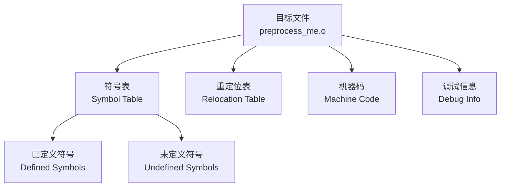
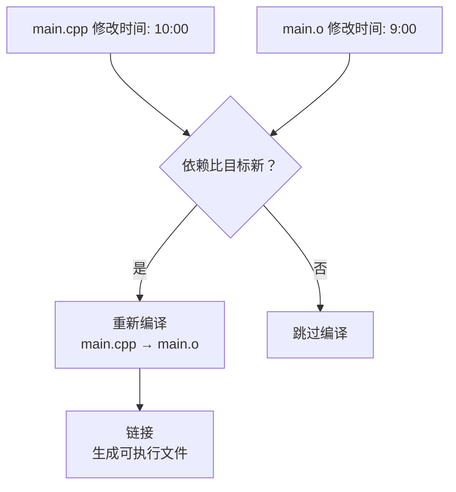
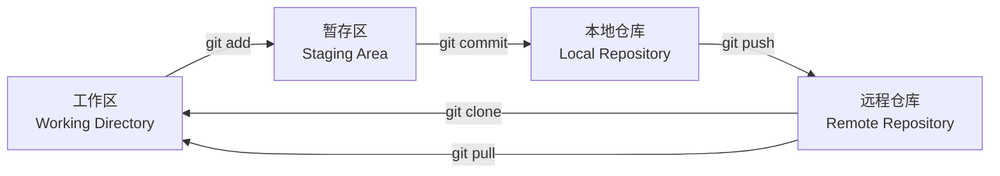

+++
title = "第2章 开发环境搭建与工具链"
weight = 20
date = "2026-03-29T21:03:00+08:00"
type = "docs"
description = ""
isCJKLanguage = true
draft = false
+++
# 第2章 开发环境搭建与工具链

> 古人云："工欲善其事，必先利其器。"在C++的江湖里，没有一套趁手的开发环境，你连写代码的勇气都没有。本章将带你穿越Windows、Linux、macOS三大操作系统，亲手打造一个能让代码飞起来的开发环境。我们还会深入剖析C++代码是如何从一堆字符变成可执行程序的整个过程。准备好了吗？Let's Rock!

## 2.1 Windows平台开发环境配置

Windows是全球使用最广泛的操作系统（别跟我提市场份额，市场份额高的原因之一就是很多人在用但不知道怎么配开发环境）。好在微软这些年越来越重视开发者体验，在C++开发环境方面已经做得相当友好。接下来让我们逐一安装这些神器。

### Visual Studio安装与配置

**Visual Studio（简称VS）** 是微软亲生的IDE（集成开发环境），功能强大到可以开发从Hello World到火星登陆器的各种程序。它是目前Windows平台上最完整的C++开发工具，没有之一。

**下载地址：** https://visualstudio.microsoft.com/downloads/

**安装步骤（超详细，怕你迷路版）：**

1. 下载安装器（大概就1MB，别嫌弃它小，它只是引路人）
2. 运行安装器，你会看到一个"可供选择的工作负载"列表
3. 找到**"使用C++的桌面开发"**（Desktop development with C++），勾选它！就是这个！
4. 右侧细节窗口会显示要安装的组件，别慌，默认的就够用
5. 点击"安装"，然后去泡杯咖啡——这大概是3-5GB的下载和安装

> 如果你看到"安装正在进行中，已花费X小时"，别慌，这是正常的。VS的安装包包含的东西堪比一套精装房——编译器、调试器、静态分析工具、性能分析器……应有尽有。

**编译器：** VS自带**MSVC**（Microsoft Visual C++ Compiler），这是微软的C++编译器，专门针对Windows优化。MSVC对C++标准的支持非常积极，**VS2022已经支持C++20的大部分特性和C++23的部分特性**。什么概念呢？C++20引入了协程（coroutine）、概念（concept）、范围库（ranges）等革命性特性，VS2022都能搞定。

**版本对应关系（仅供参考，别纠结）：**

| Visual Studio版本 | MSVC工具链版本 | C++标准支持 |
|-------------------|----------------|-------------|
| VS2019 (16.x) | MSVC 14.2x | C++17全部、C++20部分 |
| VS2022 (17.x) | MSVC 14.3x | C++20大部分、C++23部分 |
| VS2022 17.5+ | MSVC 14.36 | C++20概念、协程等 |

**配置建议：**

- 安装完成后，首次启动会让你登录微软账号——可以跳过，不影响使用
- 选择你喜欢的配色主题（Dark Theme适合熬夜党，Light Theme适合护眼党）
- 在"工具"→"选项"→"C/C++"里可以微调各种编译选项

```cpp
// 用MSVC编译的第一个程序长这样
#include <iostream>

int main() {
    // std::cout 的 std 是 "standard" 的缩写
    // :: 是作用域运算符，相当于在说"我要用std命名空间里的cout"
    std::cout << "MSVC编译成功！" << std::endl;
    return 0;
}
```

编译命令（如果你用命令行而非IDE）：
```bash
cl /EHsc /std:c++20 your_file.cpp
```
其中`cl`是MSVC的编译器前端，`/EHsc`是异常处理选项，`/std:c++20`指定C++标准。

### MinGW-w64安装

**MinGW**的全称是"Minimalist GNU for Windows"——Windows上的极简GNU工具集。它是一套 GCC（GNU Compiler Collection，GNU编译器套件）工具链的Windows移植版，让你可以在Windows上用GCC编译器。

**MinGW-w64**是MinGW的升级版，64位原生支持，再也不用羡慕Linux用户了。

**下载地址：** https://www.mingw-w64.org/

**安装方式选择：**

**方式一：在线安装器（推荐给小白）**

1. 访问 https://www.mingw-w64.org/ 或 SourceForge
2. 下载 `mingw-get-setup.exe`
3. 运行安装器，选择安装路径（建议 `C:\mingw64`，路径别有中文和空格）
4. 在包管理器里勾选 `mingw32-gcc-bin`、`mingw32-gcc-g++-bin` 等
5. 点击"应用更改"→"安装"

**方式二：LLVM-MinGW（推荐给极客）**

来自LLVM项目的Windows版MinGW-w64，地址：https://github.com/llvm/llvm-mingw

**配置PATH环境变量（必须！）：**

安装完成后，必须把MinGW的bin目录加到系统PATH里，否则命令行找不到 `g++` 命令。

```powershell
# 打开PowerShell，输入以下命令（假设你装在C:\mingw64）
# 临时生效（只对当前终端窗口有效）
$env:Path = "C:\mingw64\bin;" + $env:Path

# 永久生效（修改用户环境变量）
[Environment]::SetEnvironmentVariable(
    "Path",
    [Environment]::GetEnvironmentVariable("Path", "User") + ";C:\mingw64\bin",
    "User"
)
```

验证安装是否成功：

```powershell
# 在命令行里输入
g++ --version

# 如果看到类似下面的输出，说明安装成功！
# g++ (x86_64-posix-seh, Built by MinGW-W64 project) 13.2.0
# Copyright (C) 2023 Free Software Foundation, Inc.
```

> 恭喜你！现在你的Windows系统上有了一个地道的GCC编译器。可以开始用 `g++` 命令编译C++程序了，风格和Linux一模一样！

### MSYS2环境配置

**MSYS2**（Minimal System 2）是一个软件分发器和构建平台，比MinGW更现代化。它使用 **pacman** 作为包管理器（对，就是Arch Linux那个），让你在Windows上也能享受Linux般的软件安装体验。

MSYS2最大的优点是软件包非常齐全，GCC、Clang、CMake、GDB、 Ninja……要什么有什么，而且版本通常都比较新。

**下载地址：** https://www.msys2.org/

**安装步骤：**

1. 下载 `msys2-x86_64-xxx.exe`
2. 运行安装器，一路Next，路径建议 `C:\msys64`
3. 安装完成后，会自动打开MSYS2终端（一个很酷的界面）

**核心命令（pacman三板斧）：**

```bash
# 更新包数据库（装软件前必做！）
pacman -Syu

# 安装软件包
pacman -S 包名

# 搜索软件包
pacman -Ss 关键词
```

**常用开发工具安装：**

```bash
# 安装GCC编译器套件
pacman -S mingw-w64-x86_64-gcc

# 安装Clang编译器
pacman -S mingw-w64-x86_64-clang

# 安装CMake
pacman -S mingw-w64-x86_64-cmake

# 安装GDB调试器
pacman -S mingw-w64-x86_64-gdb

# 安装Ninja构建工具
pacman -S mingw-w64-x86_64-ninja

# 安装make
pacman -S mingw-w64-x86_64-make
```

> 小技巧：MSYS2有多个运行环境（MinGW64、MSYS、CLANG64等），每个环境的工具不能混用。建议日常开发使用 **MinGW64** 环境，图标是紫色的那个。

**环境切换：** 安装完MSYS2后，你会在开始菜单看到多个终端：
- MSYS2 MSYS（POSIX兼容环境）
- MSYS2 MinGW64（64位原生环境，推荐！）
- MSYS2 CLANG64（Clang环境）
- MSYS2 CLANGARM64（ARM平台）

建议把 **MinGW64** 的快捷方式固定到任务栏，这是你最常用的开发环境。

## 2.2 Linux/macOS平台开发环境配置

Linux和macOS都是Unix-like系统（macOS是BSD血统，Linux是GNU血统，但精神上是一家人），它们的命令行工具链非常相似。C++程序员在这两个平台上如鱼得水，因为大多数服务器跑的都是Linux，而macOS本身就是程序员的梦想机器。

### GCC编译器安装

**GCC**（GNU Compiler Collection，GNU编译器套件）是C/C++编程的事实标准编译器。Linux用户有福了——大多数发行版都预装了GCC！macOS用户……emmm，你懂的。

**Linux各发行版安装：**

```bash
# Ubuntu / Debian / Linux Mint / WSL2 (Ubuntu)
sudo apt update
sudo apt install build-essential

# build-essential 包含：
# - gcc     (C编译器)
# - g++     (C++编译器)
# - make    (构建工具)
# - dpkg-dev (包管理工具)

# 验证安装
gcc --version
g++ --version
```

```bash
# CentOS / RHEL / Rocky Linux / AlmaLinux
sudo yum groupinstall "Development Tools"

# 或者用dnf（Fedora、新版RHEL）
sudo dnf groupinstall "Development Tools"
```

```bash
# Arch Linux / Manjaro
sudo pacman -S base-devel

# 一步到位，包含gcc、make、cmake等全套工具
```

**macOS安装（苹果用户请注意）：**

macOS不自带GCC，你需要先装 **Xcode命令行工具**：

```bash
# 在终端输入这个命令，会弹出图形界面安装程序
xcode-select --install

# 或者完整安装Xcode（App Store免费）
# 然后在Xcode偏好设置里勾选"Command Line Tools"
```

> 等等！macOS用的是Clang不是GCC！别慌，Clang是GCC的完美替代品，语法完全兼容，而且错误提示更友好。苹果官方推荐的。

验证安装：

```bash
# Linux
gcc --version
# 输出类似：
# gcc (Ubuntu 11.4.0-1ubuntu1~22.04) 11.4.0

g++ --version
# 输出类似：
# g++ (Ubuntu 11.4.0-1ubuntu1~22.04) 11.4.0

# macOS (Clang)
clang --version
# Apple clang version 15.0.0
# Target: arm64-apple-darwin23.0.0
```

### Clang编译器安装

**Clang** 是 LLVM 项目的一部分，是一个C/C++/Objective-C编译器前端，以出色的诊断信息（错误提示）闻名。如果你被GCC的错误信息折磨过，Clang会让你感动到流泪。

**Clang vs GCC 简单对比：**

| 特性 | Clang | GCC |
|------|-------|-----|
| 错误提示 | 友好、彩色、带代码高亮 | 简洁、有些晦涩 |
| 编译速度 | 通常更快 | 稍慢 |
| C++标准支持 | 跟进快 | 也很快 |
| 平台支持 | 全平台 | 全平台 |
| 许可证 | Apache 2.0 (更宽松) | GPL 3 (传染) |

**Linux安装Clang：**

```bash
# Ubuntu / Debian
sudo apt install clang

# 指定版本（如果需要特定版本）
sudo apt install clang-15   # 安装Clang 15
sudo update-alternatives --install /usr/bin/clang clang /usr/bin/clang-15 100

# CentOS / RHEL
sudo yum install clang
```

**macOS安装Clang：**

```bash
# 方法1：装Xcode命令行工具就有Clang了
xcode-select --install

# 方法2：用Homebrew装最新版
brew install llvm

# 手动添加到PATH（Homebrew版）
echo 'export PATH="/usr/local/opt/llvm/bin:$PATH"' >> ~/.zshrc
source ~/.zshrc
```

**验证Clang安装：**

```bash
clang --version

# 输出示例（Linux）：
# clang version 16.0.0
# Target: x86_64-pc-linux-gnu

# 输出示例（macOS）：
# Apple clang version 15.0.0 (clang-1500.0.40.1)
# Target: arm64-apple-darwin23.0.0
```

**用Clang编译C++程序：**

```bash
# 基本编译命令
clang++ -std=c++20 -o hello hello.cpp

# 常用选项
# -std=c++17 或 c++20，指定C++标准
# -Wall 开启所有警告
# -Weverything 开启所有警告（包括那些过于严格的）
# -O2 或 -O3 优化级别
# -g 生成调试信息
```

```cpp
// hello_clang.cpp
// 用Clang编译的Hello World
#include <iostream>

int main() {
    std::cout << "Clang真好用！错误提示超友好！" << std::endl;
    return 0;
}
```

编译运行：

```bash
clang++ -std=c++20 -Wall -o hello_clang hello_clang.cpp
./hello_clang
// 输出: Clang真好用！错误提示超友好！
```

## 2.3 第一个C++程序：Hello World详解

终于到了激动人心的时刻！让我们来写第一个C++程序。这段代码是编程世界的"Hello World"，几乎每个程序员都以它开始自己的C++之旅。

```cpp
// hello_world.cpp
// 我的第一个C++程序！

// 这是单行注释，以 // 开头
// 编译器会忽略所有 // 后面的内容，直到本行结束

/*
 * 这是多行注释
 * 以 /* 开头，以 */ 结尾
 * 中间的所有内容都会被忽略
 */

// 第1行：引入输入输出头文件
#include <iostream>
// #include 是预处理指令
// <iostream> 是一个头文件，包含了输入输出的各种工具
// iostream = input/output stream（输入输出流）

// 第2行：主函数定义
int main() {
    // main() 是程序入口，操作系统通过调用main来启动程序
    // int 表示main函数返回一个整数（返回给操作系统）
    // 括号 () 里可以放命令行参数，先留空
    
    // 第3行：输出语句
    std::cout << "Hello, World!" << std::endl;
    // std::cout 是标准输出流
    // std 是 "standard" 的缩写，表示"标准"命名空间
    // :: 是作用域运算符，相当于"我要用std里面的..."
    // cout 发音 see-out，是 "character output" 的缩写
    // << 是流插入运算符，把右边的数据"流入"左边的流
    // "Hello, World!" 是要输出的字符串（文本）
    // std::endl 发音 end-line，是 "end line" 的缩写，表示换行
    
    // 第4行：返回语句
    return 0;
    // 告诉操作系统：程序正常退出了
    // 0 表示成功，非0表示出错了
    // return 是关键字
}
```

**逐行解析（超级详细版）：**

| 代码 | 含义 | 记忆技巧 |
|------|------|---------|
| `#include <iostream>` | 把iostream文件的内容复制到这一行 | 相当于"复制粘贴"头文件内容 |
| `int main()` | 主函数，程序入口 | main是"主要"的意思 |
| `std::cout` | 标准输出（屏幕） | cout = character output |
| `<<` | 流插入运算符 | 数据"流"进cout这个管道里 |
| `"Hello, World!"` | 字符串常量 | 双引号包起来的就是字符串 |
| `std::endl` | 换行符 | endl = end of line |
| `return 0` | 正常退出 | 0=OK，记住这个约定 |

**命名空间（namespace）解释：**

`std`是C++标准库使用的命名空间。就像一个大家庭，std这个"房间"里住着各种常用的工具：cout、cin、endl、vector、string等。

```cpp
// 为什么要用std::？
// 因为标准库里可能有和别人同名的工具
// std::确保你用的是标准库的cout，不是隔壁老王写的cout

// 完整写法（推荐新手）
std::cout << "Hello!" << std::endl;

// 偷懒写法（需要using声明）
using std::cout;
using std::endl;
cout << "Hello!" << endl;  // 不用写std::了

// 全局偷懒（不推荐，污染命名空间）
using namespace std;
cout << "Hello!" << endl;  // 短了，但可能有冲突
```

**如何编译运行：**

```bash
# Linux/macOS 用 g++ 或 clang++
g++ -o hello_world hello_world.cpp
./hello_world
// 输出: Hello, World!

# Windows (MinGW/MSYS2)
g++ -o hello_world.exe hello_world.cpp
./hello_world.exe
// 输出: Hello, World!

# Windows (VS)
# 打开 x64 Native Tools Command Prompt for VS 2022
cl /EHsc hello_world.cpp
hello_world.exe
// 输出: Hello, World!
```

> 恭喜你完成了第一个C++程序！现在你已经是C++程序员了（虽然只会打印一句话）。不要小看这一步——你的程序已经包含了C++的核心要素：预处理、函数、输入输出、返回值。这就是"Hello World"的魔力！

## 2.4 编译过程解析

C++代码变成可执行文件要经历四个阶段：预处理、编译、汇编、链接。就像做一道菜：买菜（预处理）→ 切菜（编译）→ 炒菜（汇编）→ 装盘（链接）。


### 预处理（Preprocessing）

**预处理**是编译的第一阶段，负责处理以 `#` 开头的预处理指令。预处理器就像一个超级复印机，会把所有 `#include` 的文件内容"粘贴"进来，还会展开所有 `#define` 宏。

**主要工作：**

1. **处理 `#include`**：把头文件内容插入到当前文件
2. **处理 `#define`**：进行文本替换（传说中的宏替换）
3. **处理条件编译**：`#ifdef`、`#ifndef`、`#endif`等，决定哪些代码要编译
4. **删除注释**：是的，你写的 `// 注释` 会被删掉
5. **添加行号和文件名标识**：方便编译器报错时告诉你第几行

**示例：**

```cpp
// preprocess_me.cpp
#include <iostream>    // 预处理器会把iostream的全部内容复制到这里
#define PI 3.14159      // 宏定义，之后所有PI都会被替换成3.14159
#define MAX(a, b) ((a) > (b) ? (a) : (b))  // 带参数的宏

int main() {
    std::cout << "圆周率是：" << PI << std::endl;  // PI会被替换成3.14159
    std::cout << "最大值是：" << MAX(10, 20) << std::endl;  // 宏展开
    return 0;
}
```

预处理后（简化版，真实输出有几千行）：

```cpp
// 预处理器把iostream的内容塞进来（这里只是示意）
// ... iostream的几千行代码 ...
int main() {
    std::cout << "圆周率是：" << 3.14159 << std::endl;
    std::cout << "最大值是：" ((10) > (20) ? (10) : (20)) << std::endl;
    return 0;
}
```

**编译命令：**

```bash
# 只进行预处理，输出到 .i 文件
g++ -E preprocess_me.cpp -o preprocess_me.i

# 或者只输出到标准输出（很长！）
g++ -E preprocess_me.cpp

# MSVC版
cl /E /Fo:preprocess_me.i preprocess_me.cpp
```

> `-E` 是 "End" 的意思吗？不是！它是 "stop after preprocessing" 的意思。记住：预处理完了就停，别继续了。

### 编译（Compilation）

**编译**是第二阶段，负责把C++代码（经过预处理后）翻译成**汇编语言**。这是整个编译过程中最复杂的部分，涉及语法分析、语义分析、类型检查、代码优化等。

**主要工作：**

1. **词法分析**：把代码字符流分解成一个个" token"（标记），比如关键字、标识符、运算符、数字等
2. **语法分析**：把token组装成语法树，检查语法是否正确（括号匹配吗？分号漏了吗？）
3. **语义分析**：检查类型是否匹配、变量是否声明了等
4. **代码优化**：删除无用代码、常量折叠、循环优化等
5. **生成汇编代码**：输出对应架构的汇编指令

**编译错误示例（故意写错）：**

```cpp
// compile_error.cpp
#include <iostream>

int main() {
    int x = 42;        // OK
    std::cout << x;    // 少了一个 <<
    return 0;
}
```

编译时会报错：

```bash
g++ -S compile_error.cpp -o compile_error.s

# 报错信息：
# compile_error.cpp: In function 'int main()':
# compile_error.cpp:5:26: error: expected expression
#      5 |     std::cout << x;
#                           ^
#                           |
#                           少了点什么？对的，<< 后面要接东西！
```

**编译命令：**

```bash
# 预处理 + 编译，输出汇编文件 (.s)
g++ -S preprocess_me.i -o preprocess_me.s

# 或者一条命令完成预处理+编译（不生成.i文件）
g++ -S preprocess_me.cpp -o preprocess_me.s

# 查看生成的汇编文件（部分）
cat preprocess_me.s
```

生成的汇编代码（简化）：

```asm
# main函数对应的汇编
    .file   "preprocess_me.cpp"
    .text
    .def    __cxx_global_var_init; .scl    2; .type   32; .endef
    .globl  main
    .def    main; .scl    2; .type   32; .endef
    .seh_proc   main
main:
    pushq   %rbp
    .seh_pushreg    %rbp
    movq    %rsp, %rbp
    .seh_setframe   %rbp, 0
    subq    $32, %rsp
    .seh_stackalloc 32
    .seh_endprologue
    # 这里是函数体编译出来的汇编指令
    ret
```

> 什么？看不懂汇编？正常！能看懂的你已经是大佬了。汇编语言是CPU的"方言"，每种CPU架构有不同的汇编语言。这段是x86-64的"普通话"。

### 汇编（Assembly）

**汇编**是第三阶段，负责把汇编语言翻译成**机器指令**（0和1），生成**目标文件**（.o 或 .obj）。

**主要工作：**

1. 把每条汇编指令翻译成对应的机器码
2. 生成目标文件，包含了机器指令和数据
3. 目标文件是"半成品"，还不能直接运行（因为可能引用了其他文件的函数）

**目标文件格式：**

- **Linux/macOS**：`.o` 文件，使用 **ELF**（Executable and Linkable Format）格式
- **Windows**：`.obj` 文件，使用 **COFF**（Common Object File Format）格式

```bash
# 汇编命令：生成目标文件
g++ -c preprocess_me.s -o preprocess_me.o

# 或者一条命令搞定预处理+编译+汇编
g++ -c preprocess_me.cpp -o preprocess_me.o

# 查看目标文件（十六进制，你会看到一堆乱码）
hexdump -C preprocess_me.o | head -20
```

**目标文件里有什么？**



### 链接（Linking）

**链接**是最后一个阶段，负责把多个目标文件（和库文件）合并成**可执行文件**。解析符号引用就是在这个时候完成的。

**主要工作：**

1. **符号解析**：把函数调用、全局变量引用和它们的定义匹配起来
2. **地址重定位**：把符号的相对地址计算成最终地址
3. **库链接**：把用到的库函数代码加进来
4. **生成可执行文件**：输出最终可以运行的文件

**链接错误示例：**

```cpp
// utils.h
int add(int a, int b);  // 声明了add函数

// main.cpp
#include <iostream>
#include "utils.h"

int main() {
    int result = add(1, 2);  // 使用add函数
    std::cout << "结果：" << result << std::endl;
    return 0;
}

// 编译（只编译不链接）—— 成功！
g++ -c main.cpp -o main.o

// 链接 —— 失败！
g++ main.o -o program

# 报错：
# /usr/bin/ld: main.o: in function `main':
# main.cpp:(.text+0x10): undefined reference to `add'
# collect2: error: ld returned 1 exit status
# 
# 翻译成人话：你说要用add函数，但它到底在哪？？？
```

**正确做法：提供add函数的定义！**

```cpp
// utils.cpp
int add(int a, int b) {
    return a + b;
}
```

```bash
# 编译两个源文件
g++ -c main.cpp -o main.o
g++ -c utils.cpp -o utils.o

# 链接两个目标文件
g++ main.o utils.o -o program

# 运行！
./program
// 输出: 结果：3
```

**链接命令：**

```bash
# 基本链接
g++ source1.o source2.o -o program

# 链接库（数学库）
g++ main.o -lm -o program
# -l 表示链接某个库，m 是 libm.so 的简写（数学库）

# 静态链接 vs 动态链接
# 静态链接：把库代码直接拷贝进可执行文件，文件大但独立
g++ -static main.o -o program  # 静态链接

# 动态链接：只记录用什么库，运行时候再加载，文件小但依赖环境
g++ main.o -o program  # 默认是动态链接
```

**完整编译流程（一条命令搞定）：**

```bash
# 从源代码直接生成可执行文件（gcc/g++会自动完成4个阶段）
g++ hello.cpp -o hello

# 分步执行（学习用）
g++ -E hello.cpp -o hello.i    # 预处理
g++ -S hello.i -o hello.s      # 编译
g++ -c hello.s -o hello.o      # 汇编
g++ hello.o -o hello           # 链接
```

> 链接器（ld）是最容易被忽视但最容易出错的环节之一。"undefined reference to xxx" 是经典错误，意思是你用了某个函数但没提供它的实现。检查是否漏了 `.cpp` 文件或者忘了链接库！

## 2.5 IDE选择与配置建议

IDE（Integrated Development Environment，集成开发环境）就是写代码的"工作室"。一个好的IDE能让编程效率翻倍，不好的IDE能让你怀疑人生。

### Visual Studio

**Visual Studio** 是微软的旗舰IDE，被称为"宇宙最强IDE"。在Windows平台，它是C++开发的首选，没有之一。

**优点（多到数不清）：**

- **智能感知（IntelliSense）**：代码补全、语法高亮、悬停查看定义，AI辅助般的体验
- **世界级调试器**：断点、条件断点、监视窗口、调用堆栈，应有尽有
- **单元测试集成**：内置Microsoft Test Explorer，支持Google Test、Catch2等
- **CMake支持**：原生支持CMake项目，无需额外配置
- **性能分析器**：找出代码哪里慢得像蜗牛
- **代码重构**：一键重命名变量、提取函数、智能格式化

**下载安装：** https://visualstudio.microsoft.com/downloads/

选择 **"使用C++的桌面开发"** 工作负载，勾选以下组件：
- MSVC v143 - VS 2022 C++ x64/x86 生成工具
- Windows 11 SDK（或Windows 10 SDK）
- CMake可选组件

**新建项目：**

```bash
# 方法1：GUI操作
# 文件 → 新建 → 项目 → 选择 "空项目" 或 "CMake项目"

# 方法2：命令行创建CMake项目
# 在任意目录创建以下文件：
```

**项目结构：**

```bash
MyAwesomeProject/
├── CMakeLists.txt          # CMake配置文件
├── main.cpp                # 主程序
├── utils.cpp               # 工具函数
└── utils.h                 # 工具头文件
```

**CMakeLists.txt内容：**

```cmake
cmake_minimum_required(VERSION 3.16)
project(MyAwesomeProject VERSION 1.0.0 LANGUAGES CXX)

set(CMAKE_CXX_STANDARD 20)
set(CMAKE_CXX_STANDARD_REQUIRED ON)

add_executable(MyAwesomeProject main.cpp utils.cpp)
```

**配置说明：**

> 初次使用建议选择 **Debug** 配置进行开发调试，发布时切换到 **Release** 配置获得更高性能。配置切换在工具栏的下拉菜单里。

### VS Code + 插件

**VS Code**（Visual Studio Code）是微软的"轻量级"代码编辑器，"轻量"是假的，功能齐全是真的。它不是完整的IDE，但通过插件扩展，可以变成任何你想要的工具。

**优点：**

- 启动飞快（比VS快10倍不是梦）
- 界面清爽，主题丰富
- 插件生态超级丰富
- 跨平台（Windows、Linux、macOS）
- Git集成、终端集成、开箱即用

**缺点：**

- 需要手动配置（小白可能觉得麻烦）
- 不是完整IDE（没有内置的测试框架等，但插件可以补）

**必装插件：**

| 插件名 | 功能 | 下载量 |
|--------|------|--------|
| C/C++ (Microsoft) | 语法高亮、智能感知、调试 | 千万级 |
| C++ IntelliSense | 增强的智能感知 | 百万级 |
| CMake | CMake语法支持、项目管理 | 百万级 |
| CMake Tools | 一键构建CMake项目 | 百万级 |
| Code Runner | 一键运行代码 | 千万级 |

**安装插件步骤：**

1. 按 `Ctrl+Shift+X` 打开扩展商店
2. 搜索 "C++"
3. 点击"安装"
4. 重启VS Code

**tasks.json配置（编译任务）：**

```json
{
    "version": "2.0.0",
    "tasks": [
        {
            "type": "cppbuild",
            "label": "C/C++: g++ build active file",
            "command": "g++",
            "args": [
                "-fdiagnostics-color=always",  // 彩色错误信息
                "-g",                           // 生成调试信息
                "-std=c++20",                   // C++20标准
                "${file}",                      // 当前文件
                "-o",                           // 指定输出
                "${fileDirname}/${fileBasenameNoExtension}"  // 输出文件名
            ],
            "options": {
                "cwd": "${workspaceFolder}"
            },
            "problemMatcher": ["$gcc"],
            "group": {
                "kind": "build",
                "isDefault": true
            },
            "detail": "编译器: /usr/bin/g++"
        }
    ]
}
```

**launch.json配置（调试）：**

```json
{
    "version": "0.2.0",
    "configurations": [
        {
            "name": "C++ Launch (GDB)",
            "type": "cppdbg",
            "request": "launch",
            "program": "${workspaceFolder}/a.out",  // 或 .exe
            "args": [],
            "stopAtEntry": false,
            "cwd": "${workspaceFolder}",
            "environment": [],
            "externalConsole": false,
            "MIMode": "gdb",
            "setupCommands": [
                {
                    "description": "Enable pretty-printing for gdb",
                    "text": "-enable-pretty-printing",
                    "ignoreFailures": true
                }
            ],
            "preLaunchTask": "C/C++: g++ build active file",
            "miDebuggerPath": "/usr/bin/gdb"
        }
    ]
}
```

> 小技巧：按 `F5` 启动调试，按 `Ctrl+Shift+B` 编译，按 `Ctrl+Alt+N` 运行当前文件（需要Code Runner插件）！

### CLion

**CLion** 是 JetBrains 公司出品的C/C++ IDE，JetBrains 以生产高质量开发工具闻名（IntelliJ IDEA就是他们家的）。

**优点：**

- **跨平台**：Windows、Linux、macOS全支持
- **深度CMake集成**：开箱即用，无需配置
- **智能代码补全**：基于语义的智能提示
- **强大的重构功能**：重命名、提取函数、内联等，一气呵成
- **优雅的界面**：JetBrains家祖传的深色主题
- **VCS集成**：Git、SVN无缝集成

**缺点：**

- 收费（虽然有30天试用和教育免费）
- 相对吃内存

**下载地址：** https://www.jetbrains.com/clion/download/

**项目创建：**

```bash
# File → New Project → 选择 C++ Executable
# CLion会自动生成CMakeLists.txt
```

**开箱即用的CMakeLists.txt：**

```cmake
cmake_minimum_required(VERSION 3.26)
project(untitled)  # 项目名

set(CMAKE_CXX_STANDARD 20)

add_executable(untitled main.cpp)
```

**配置编译器：**

> CLion会自动检测系统上的编译器。如果检测不到：
> File → Settings → Build, Execution, Deployment → Toolchains → 添加

### Qt Creator

**Qt Creator** 是 Qt 框架的官方IDE，但绝不仅仅能开发Qt应用！它也是一款优秀的通用C++ IDE。

**优点：**

- **跨平台**：Windows、Linux、macOS全支持
- **轻量级**：比VS和CLion都轻
- **界面友好**：适合初学者
- **内置QtDesigner**：可视化设计界面
- **CMake/QMake双支持**：构建系统灵活

**下载地址：** https://www.qt.io/download-qt-installer

**适用场景：**

- Qt应用开发（桌面、移动、嵌入式）
- 跨平台GUI应用
- 不想折腾配置的懒人（Qt Creator开箱即用）

**新建非Qt项目：**

```bash
# 文件 → 新建文件或项目 → 纯C++项目
# 选择 "Plain Application" 或 "Console Application"
```

> 如果你只是想安静地写C++代码，不打算用Qt框架，Qt Creator的体验可能不如CLion或VS Code那么丝滑。但如果你想学习Qt（一个超棒的C++ GUI框架），Qt Creator是必选项。

## 2.6 构建系统基础

当你的项目有几十个源文件、依赖几个库、手动敲命令已经疯掉的时候，构建系统就是你的救星。

### 手动编译

**手动编译**适合小型项目（几个文件），简单直接，不依赖任何工具。

```bash
# 单文件编译
g++ -o hello hello.cpp

# 带标准指定和警告
g++ -std=c++20 -Wall -Wextra -o hello hello.cpp

# 多文件编译
g++ -o program main.cpp utils.cpp helper.cpp

# 指定优化级别
g++ -O2 -o program main.cpp utils.cpp  # -O0是调试（无优化），-O2是发布（优化），-O3是极致优化
```

```bash
# 编译并运行（一条龙）
g++ -o hello hello.cpp && ./hello

# Windows版
g++ -o hello.exe hello.cpp && .\hello.exe
```

> 适合学习、刷题、快速验证想法。但超过3个文件，手动编译就是噩梦——想象一下改了一个头文件，要重新编译所有包含它的源文件！

### Makefile基础

**Make** 是Unix/Linux标配的自动化构建工具，Makefile是它的配置文件。想象一下一个尽职的管家，帮你记住哪些文件需要重新编译、哪些不需要。

**Makefile基本结构：**

```makefile
# 这是注释，以 # 开头

# ============================================
# 变量定义（类似编程语言里的变量）
# ============================================
CXX = g++                    # 编译器
CXXFLAGS = -Wall -std=c++17  # 编译选项
TARGET = hello               # 最终可执行文件名
SOURCES = main.cpp utils.cpp # 源文件列表
OBJECTS = $(SOURCES:.cpp=.o) # 目标文件列表（自动从.cpp换成.o）

# ============================================
# 目标（target）：你想生成什么
# ============================================
# 默认目标：生成可执行文件
all: $(TARGET)
    @echo "构建完成！可执行文件: $(TARGET)"

# 可执行文件依赖这些目标文件
$(TARGET): $(OBJECTS)
    $(CXX) $(OBJECTS) -o $(TARGET)
    @echo "链接完成！"

# 目标文件依赖源文件和头文件
# 自动变量说明：
# $@ = 目标文件名 (如 main.o)
# $< = 第一个依赖文件名 (如 main.cpp)
# $^ = 所有依赖文件 (如 main.cpp utils.h)
main.o: main.cpp
    $(CXX) $(CXXFLAGS) -c $< -o $@

utils.o: utils.cpp utils.h
    $(CXX) $(CXXFLAGS) -c $< -o $@

# ============================================
# 伪目标：用 .PHONY 声明
# ============================================
.PHONY: clean rebuild install test

# 清理构建产物
clean:
    rm -f $(OBJECTS) $(TARGET)
    @echo "清理完成！"

# 重新构建（先清理再构建）
rebuild: clean all

# 测试
test: $(TARGET)
    ./$(TARGET)
    @echo "测试通过！"
```

**Makefile变量和自动变量详解：**

| 变量 | 含义 | 示例 |
|------|------|------|
| `$(CC)` | C编译器，默认cc | `cc` |
| `$(CXX)` | C++编译器 | `g++` |
| `$(CXXFLAGS)` | C++编译选项 | `-Wall -std=c++17` |
| `$(TARGET)` | 目标名（自定义） | `hello` |
| `$@` | 目标文件名 | `main.o` |
| `$<` | 第一个依赖文件 | `main.cpp` |
| `$^` | 所有依赖文件 | `main.cpp utils.h` |
| `$?` | 比目标新的依赖 | (新文件列表) |

**使用示例：**

```bash
# 默认构建
make

# 清理
make clean

# 重新构建
make rebuild

# 指定目标
make clean all

# 指定Makefile（如果不用默认名）
make -f MyMakefile
```

**工作原理：**

> Make会检查目标文件和依赖文件的时间戳。如果依赖文件比目标文件新（被修改过），就重新执行规则里的命令；否则跳过。"时间就是金钱，浪费可耻"——这是Make的信条。



### CMake基础与项目构建

**CMake** 不是构建工具，而是构建"生成器"（Generator）。你写声明式的 CMakeLists.txt，CMake会生成对应平台的原生构建文件（Unix Makefile、Visual Studio项目、Ninja构建文件等）。

**核心概念：**

- **CMakeLists.txt**：CMake的配置文件，声明式（告诉它要什么，不告诉它怎么做）
- **out-of-source build**：源码目录和构建目录分开，保持源码整洁
- **target**：构建目标（可执行文件、库文件）

**最小CMake项目：**

```cmake
# CMakeLists.txt
# 放在项目根目录

# 第1步：声明CMake最低版本（必须！）
cmake_minimum_required(VERSION 3.16)

# 第2步：声明项目信息
project(MyFirstCMake VERSION 1.0.0 LANGUAGES CXX)

# 第3步：设置C++标准
set(CMAKE_CXX_STANDARD 17)
set(CMAKE_CXX_STANDARD_REQUIRED ON)  # 必须使用这个标准，没得商量

# 第4步：添加可执行文件
add_executable(hello main.cpp utils.cpp)
```

**项目结构：**

```bash
MyProject/
├── CMakeLists.txt
├── src/
│   ├── main.cpp
│   └── utils.cpp
├── include/
│   └── utils.h
└── build/           # 构建目录（不要放源码里！）
    └── ...          # CMake会在这里生成构建文件
```

**构建步骤（重要！）：**

```bash
# 1. 创建构建目录（保持源码目录干净）
mkdir build
cd build

# 2. 运行CMake配置（生成构建文件）
cmake ..   # .. 表示上级目录（源码目录）

# 3. 构建
cmake --build .
# 或者直接用 make（如果用的是Unix Makefile生成器）
make

# 4. 运行
./hello
```

> 常见错误："Out of source build is recommended" —— 这是CMake的友情提醒，让你用构建目录！不要在源码目录里直接 `cmake .`，那会搞乱你的项目。

**CMake常用命令详解：**

```cmake
# 设置项目名和版本
project(MyApp VERSION 2.0.0 LANGUAGES CXX)

# 设置变量
set(SOURCES "main.cpp" "utils.cpp")
set(CMAKE_CXX_STANDARD 20)

# 添加可执行文件
add_executable(myapp ${SOURCES})

# 添加库文件（静态库）
add_library(mylib STATIC utils.cpp)

# 添加库文件（动态库）
add_library(mylib SHARED utils.cpp)

# 链接库到目标
target_link_libraries(myapp PRIVATE mylib)

# 添加头文件目录（相当于 -I 选项）
target_include_directories(myapp PUBLIC ${CMAKE_SOURCE_DIR}/include)

# 添加编译选项
target_compile_options(myapp PRIVATE -Wall -Wextra)

# 添加宏定义（相当于 -D 选项）
target_compile_definitions(myapp PRIVATE DEBUG_MODE=1)

# 查找包（找已安装的库）
find_package(GTest REQUIRED)
find_package(OpenCV REQUIRED)
```

**条件配置示例：**

```cmake
cmake_minimum_required(VERSION 3.16)
project(MyConditionalApp LANGUAGES CXX)

# 检查操作系统
if(WIN32)
    message(STATUS "Windows系统！")
    set(PLATFORM_LIBS ws2_32)
elseif(UNIX AND NOT APPLE)
    message(STATUS "Linux系统！")
    set(PLATFORM_LIBS pthread)
elseif(APPLE)
    message(STATUS "macOS系统！")
    set(PLATFORM_LIBS "-framework Cocoa")
endif()

# 检查编译器
if(MSVC)
    add_compile_options(/W4)      # MSVC的警告级别
    add_compile_definitions(_CRT_SECURE_NO_WARNINGS)  # 禁用某些警告
else()
    add_compile_options(-Wall -Wextra -pedantic)  # GCC/Clang的警告
endif()

# 检查C++特性
include(CheckCXXSymbolExists)
check_cxx_symbol_exists(std::make_unique memory "make_unique")

# 打印配置信息
message(STATUS "构建类型: ${CMAKE_BUILD_TYPE}")
message(STATUS "C++编译器: ${CMAKE_CXX_COMPILER}")
message(STATUS "C++标准: ${CMAKE_CXX_STANDARD}")
```

### 现代CMake实践

现代CMake（CMake 3.1+）推崇使用 **target_* 命令**，避免使用全局变量和命令式写法。

**新旧写法对比：**

```cmake
# ❌ 旧式写法（CMake 2.8风格，不推荐）
include_directories(${CMAKE_SOURCE_DIR}/include)
link_directories(${CMAKE_SOURCE_DIR}/lib)
add_definitions(-DDEBUG)
link_libraries(math)

add_executable(app main.cpp)  # 全局生效，难以复用

# ✅ 新式写法（CMake 3.1+风格，推荐）
add_executable(app main.cpp)

# target_* 命令只影响指定的目标，不会污染全局
target_include_directories(app PRIVATE ${CMAKE_SOURCE_DIR}/include)
target_link_libraries(app PRIVATE math)
target_compile_definitions(app PRIVATE DEBUG=1)
target_compile_options(app PRIVATE -Wall)
```

**完整项目示例：**

```cmake
# CMakeLists.txt - 完整现代CMake示例

cmake_minimum_required(VERSION 3.16)
project(MyAwesomeApp VERSION 1.0.0 LANGUAGES CXX)

# ============================================
# 基本配置
# ============================================
set(CMAKE_CXX_STANDARD 20)
set(CMAKE_CXX_STANDARD_REQUIRED ON)

# 输出目录（所有平台统一）
set(CMAKE_RUNTIME_OUTPUT_DIRECTORY ${CMAKE_BINARY_DIR}/bin)
set(CMAKE_LIBRARY_OUTPUT_DIRECTORY ${CMAKE_BINARY_DIR}/lib)
set(CMAKE_ARCHIVE_OUTPUT_DIRECTORY ${CMAKE_BINARY_DIR}/obj)

# ============================================
# 编译选项
# ============================================
# 如果用户没有指定构建类型，默认设为 Debug
if(NOT CMAKE_BUILD_TYPE)
    set(CMAKE_BUILD_TYPE "Debug" CACHE STRING "构建类型：Debug 或 Release" FORCE)
endif()

if(MSVC)
    # MSVC编译器选项
    add_compile_options(/W4)                    # 警告级别4
    add_compile_options(/permissive-)            # 强制遵循标准
    if(CMAKE_BUILD_TYPE STREQUAL "Debug")
        add_compile_options(/Od /Zi)            # 调试：禁用优化，生成调试信息
    else()
        add_compile_options(/O2 /GL)            # 发布：优化， Whole Program Optimization
    endif()
else()
    # GCC/Clang编译器选项
    add_compile_options(-Wall -Wextra -pedantic)
    if(CMAKE_BUILD_TYPE STREQUAL "Debug")
        add_compile_options(-g -O0)             # 调试
    else()
        add_compile_options(-O3)                # 发布
    endif()
endif()

# ============================================
# 查找依赖
# ============================================
find_package(GTest REQUIRED)      # Google Test
find_package(Threads REQUIRED)    # 线程库

# ============================================
# 添加可执行文件
# ============================================
add_executable(myapp
    src/main.cpp
    src/utils.cpp
    src/math.cpp
)

# 配置目标属性
target_include_directories(myapp
    PRIVATE
        ${CMAKE_SOURCE_DIR}/include
)

target_link_libraries(myapp
    PRIVATE
        GTest::GTest
        Threads::Threads
)

# ============================================
# 测试
# ============================================
enable_testing()

add_executable(test_math
    tests/test_math.cpp
    src/math.cpp
)

target_link_libraries(test_math
    PRIVATE
        GTest::GTest
)

include(GoogleTest)
gtest_discover_tests(test_math)

# ============================================
# 安装规则（可选）
# ============================================
install(TARGETS myapp
    RUNTIME DESTINATION bin
)

install(DIRECTORY include/
    DESTINATION include/myapp
)
```

**CMake常用变量速查表：**

| 变量 | 含义 |
|------|------|
| `CMAKE_SOURCE_DIR` | 顶层CMakeLists.txt所在目录 |
| `CMAKE_BINARY_DIR` | 构建目录（执行cmake的目录） |
| `CMAKE_CURRENT_SOURCE_DIR` | 当前处理的CMakeLists.txt所在目录 |
| `CMAKE_CURRENT_BINARY_DIR` | 当前处理的构建目录 |
| `CMAKE_BUILD_TYPE` | 构建类型：Debug、Release、RelWithDebInfo、MinSizeRel |
| `CMAKE_CXX_COMPILER` | C++编译器路径 |
| `CMAKE_CXX_STANDARD` | C++标准版本 |
| `PROJECT_NAME` | project()命令的项目名 |

> 记住：现代CMake的核心思想是"每个target都是独立的"。用target_*命令把配置应用到具体目标，而不是污染全局环境。

## 2.7 开发工具链

好的开发工具链能让效率提升10倍不止。除了编译器和IDE，还有一些工具能让你效率飞升、代码质量飙升。

### 版本控制（Git）

**Git** 是目前最流行的分布式版本控制系统。简单来说，它能记录你代码的"历史快照"，让你随时回到任何一个版本，多人协作也不再是噩梦。

**核心概念：**

- **仓库（Repository）**：代码的"存档点"集合
- **工作区（Working Directory）**：你正在编辑的文件夹
- **暂存区（Staging Area）**：准备提交的文件列表
- **提交（Commit）**：一个"存档点"，记录了特定时刻的所有文件状态



**基础命令（必须掌握）：**

```bash
# 初始化仓库（在一个文件夹里执行）
git init

# 查看当前状态
git status

# 添加文件到暂存区
git add filename.cpp      # 添加单个文件
git add .                 # 添加所有文件（谨慎使用！）
git add *.cpp             # 添加所有.cpp文件

# 提交（创建快照）
git commit -m "提交说明：这次改了什么"
# 好的提交说明格式：[类型] 简短描述
# 示例：[Fix] 修复登录页面崩溃问题
# 示例：[Feature] 添加用户头像上传功能

# 查看提交历史
git log
git log --oneline        # 简洁模式

# 分支操作
git branch               # 查看分支
git branch feature-x     # 创建新分支
git checkout feature-x   # 切换分支
git checkout -b fix-y    # 创建并切换
git merge feature-x      # 合并分支到当前分支
git branch -d feature-x  # 删除分支

# 远程操作
git remote -v            # 查看远程仓库
git push origin main     # 推送到远程
git pull origin main     # 拉取并合并
git clone url            # 克隆远程仓库
```

**典型工作流程：**

```bash
# 1. 创建新分支开发功能
git checkout -b feature/user-login

# 2. 写代码，改文件...

# 3. 提交更改
git add .
git commit -m "[Feature] 实现用户登录功能"

# 4. 推送到远程
git push -u origin feature/user-login
# -u 的意思是记住这个分支和远程的对应关系，以后直接 git push

# 5. 在GitHub/GitLab上创建Pull Request（PR）
# 6. 代码审核通过后，合并到主分支

# 7. 切回主分支，更新代码
git checkout main
git pull origin main
```

**忽略文件（.gitignore）：**

```gitignore
# Git忽略的文件模板（适合C++项目）

# 编译产物
*.o
*.obj
*.exe
*.dll
*.so
*.a
*.dylib

# 可执行文件
program
app
myproject

# 构建目录
build/
cmake-build-*/
out/

# IDE配置文件（可选忽略）
.vscode/
.idea/
*.suo
*.user

# 依赖目录
third_party/
dependencies/

# 日志文件
*.log
```

> Git是21世纪程序员必须掌握的技能之一。如果你是Git新手，建议先学习基本操作，不要被分支管理搞晕。记住：`git commit` 之前三思，`git push` 之前double check。

### 代码格式化（clang-format）

**clang-format** 是LLVM项目提供的代码格式化工具，能自动把你的C++代码整理成统一的风格。告别"我的代码风格和别人不一样"的烦恼！

**安装：**

```bash
# Linux
sudo apt install clang-format

# macOS
brew install clang-format

# Windows (via LLVM)
# 下载LLVM安装包：https://llvm.org/builds/
# 或者用MSYS2
pacman -S mingw-w64-x86_64-clang
```

**基本用法：**

```bash
# 格式化单个文件
clang-format -i main.cpp
# -i 表示 in-place，直接修改文件

# 格式化并输出到标准输出
clang-format main.cpp

# 指定格式化风格
clang-format -style=llvm main.cpp   # LLVM风格
clang-format -style=google main.cpp # Google风格
clang-format -style=webkit main.cpp  # WebKit风格
```

**配置文件（.clang-format）：**

```yaml
# .clang-format 配置文件
# 放在项目根目录，clang-format会自动读取

BasedOnStyle: Google          # 基础风格，在Google基础上自定义
Language: Cpp                 # 语言是C++

# 缩进
IndentWidth: 4                # 缩进宽度为4
UseTab: Never                # 不用Tab，用空格
IndentCaseLabels: true       # case标签单独缩进

# 行长度
ColumnLimit: 100             # 每行最多100字符

# 大括号位置
BreakBeforeBraces: Attach     # 大括号跟在前面（if { 这样）

# 其他选项
AllowShortFunctions: Empty    # 允许空函数写在一行
AllowShortIfStatements: Never # 不允许短if写在一行
AllowShortLoopsOnOneLine: false # 不允许短循环写在一行
PointerAlignment: Left        # 指针类型左对齐 (int* a)
SpaceAfterCStyleCast: true   # C风格类型转换后加空格
```

**集成到构建系统：**

```cmake
# CMakeLists.txt 中启用 clang-format
find_program(CLANG_FORMAT clang-format)
if(CLANG_FORMAT)
    # 为每个源文件添加格式化目标
    file(GLOB_RECURSE ALL_CXX_SOURCES "${CMAKE_SOURCE_DIR}/src/*.cpp")
    foreach(src ${ALL_CXX_SOURCES})
        get_filename_component(src_file ${src} NAME)
        add_custom_target(
            format-${src_file}
            COMMAND ${CLANG_FORMAT} -i ${src}
            COMMENT "Formatting ${src_file}"
        )
    endforeach()
endif()
```

**在Git Hook中自动格式化：**

```bash
# 创建 pre-commit hook
cat > .git/hooks/pre-commit << 'EOF'
#!/bin/sh
# 自动格式化暂存区的.cpp文件
clang-format -i $(git diff --cached --name-only --diff-filter=ACM '*.cpp' '*.h')
git add $(git diff --cached --name-only --diff-filter=ACM '*.cpp' '*.h')
EOF
chmod +x .git/hooks/pre-commit
```

> 代码格式化是团队协作的基石！想象一下：10个人写代码，每人风格都不一样，代码review时候光争论大括号放哪里就能吵三天。有了clang-format，一键格式化，世界和平。

### 静态分析工具配置

**静态分析**是在不运行程序的情况下分析代码，找出潜在的bug、代码异味（code smell）和不符合最佳实践的地方。就像一个严格的老师，在你交作业之前帮你检查一遍。

**Clang-Tidy** 是LLVM项目的C++静态分析工具，能检查几百种代码问题。

**安装：**

```bash
# Linux
sudo apt install clang-tidy

# macOS
brew install llvm

# Windows
# 使用MSYS2
pacman -S mingw-w64-x86_64-clang-tools-extra
```

**基本用法：**

```bash
# 分析单个文件
clang-tidy main.cpp

# 只运行特定检查
clang-tidy main.cpp -checks="readability-*,modernize-*"

# 自动修复（部分问题可以自动修复）
clang-tidy main.cpp -fix

# 修复并备份原文件
clang-tidy main.cpp -fix-errors -fix-notes
```

**常用检查项：**

```bash
# 性能相关
clang-tidy main.cpp -checks="performance-*,performance-move-const-arg"

# 现代化写法（推荐C++11/14/17/20写法）
clang-tidy main.cpp -checks="modernize-*"

# 可读性
clang-tidy main.cpp -checks="readability-*"

# 危险函数（推荐用更安全的替代品）
clang-tidy main.cpp -checks="clang-analyzer-*,hicpp-*"
```

**示例代码（有问题的代码）：**

```cpp
// bad_code.cpp
#include <iostream>
#include <vector>
#include <memory>

class User {
public:
    std::string name;
    int* age;  // 裸指针，不推荐
};

void processUser(const User& user) {
    // 复制了整个对象，效率低
    std::cout << user.name << std::endl;
}

int main() {
    std::vector<int> v;
    v.push_back(1);
    v.push_back(2);
    
    // 应该用范围for
    for (size_t i = 0; i < v.size(); ++i) {
        std::cout << v[i] << std::endl;
    }
    
    // 使用auto*而不是裸指针
    int* ptr = new int(42);
    delete ptr;  // 容易忘记delete，导致内存泄漏
    
    // 建议用智能指针
    auto smart_ptr = std::make_unique<int>(42);
    
    return 0;
}
```

**Clang-Tidy分析结果（示例）：**

```bash
$ clang-tidy bad_code.cpp

bad_code.cpp:9:9: warning: 'age' is a raw pointer member; consider
    [cppcoreguidelines-special-member-functions]
    int* age;
    ^

bad_code.cpp:12:26: warning: parameter 'user' could be declared const
    [readability-const-correctness]
    void processUser(const User& user) {
                        ^

bad_code.cpp:23:9: warning: loop binding is const; consider using range-based
    [performance-for-range-copy]
    for (size_t i = 0; i < v.size(); ++i) {
    ^

bad_code.cpp:28:9: warning: use nullptr
    [modernize-use-nullptr]
    int* ptr = new int(42);
    ^

bad_code.cpp:29:9: warning: delete called on pointer 'ptr' that is not
    [clang-analyzer-cplusplus.NewDelete]
    delete ptr;
    ^
```

**集成到CMake：**

```cmake
# CMakeLists.txt 中集成 Clang-Tidy
find_program(CLANG_TIDY clang-tidy)
if(CLANG_TIDY)
    # 开启 clang-tidy 检查
    set(CMAKE_CXX_CLANG_TIDY ${CLANG_TIDY})
    # 或者只开启部分检查
    # set(CMAKE_CXX_CLANG_TIDY ${CLANG_TIDY} -checks="-*,readability-*,modernize-*")
endif()
```

**常用Clang-Tidy检查规则速查：**

| 检查项 | 含义 |
|--------|------|
| `bugprone-*` | 潜在bug（空指针解引用、内存泄漏等） |
| `readability-*` | 可读性问题（变量命名、注释等） |
| `modernize-*` | 现代化C++写法（智能指针、auto等） |
| `performance-*` | 性能问题（不必要的拷贝等） |
| `cppcoreguidelines-*` | C++核心指南（C++CoreGuidelines） |
| `clang-analyzer-*` | Clang静态分析器检查 |

> Clang-Tidy是代码质量的守护者！每周跑一次，能帮你发现很多隐藏的问题。但别指望它找出所有bug——有些bug只有运行起来才会暴露。

**其他静态分析工具：**

| 工具 | 特点 |
|------|------|
| **Cppcheck** | 专注于内存泄漏和未定义行为 |
| **SonarQube** | 团队代码质量管理平台 |
| **PVS-Studio** | 商业静态分析器（Windows友好） |
| **CodeQL** | GitHub官方，支持自定义查询 |

## 本章小结

本章我们完成了C++开发环境的全面搭建，涵盖了Windows、Linux、macOS三大平台。回顾一下我们的旅程：

**2.1 Windows平台开发环境配置**
- Visual Studio是目前最完整的Windows C++ IDE，选择"使用C++的桌面开发"工作负载即可一键安装MSVC编译器
- MinGW-w64是Windows上的GCC移植版，适合喜欢Linux风格的开发者
- MSYS2是更现代化的软件分发平台，pacman包管理器让软件安装变得轻松愉快

**2.2 Linux/macOS平台开发环境配置**
- Linux通常预装GCC，Ubuntu用`apt install build-essential`即可获得全套工具
- macOS使用Clang（LLVM项目），通过`xcode-select --install`安装命令行工具
- Clang以友好的错误提示著称，是GCC的有力替代者

**2.3 第一个C++程序**
- `main()`是程序入口，返回int表示运行状态
- `#include <iostream>`引入输入输出工具
- `std::cout`是标准输出流，`<<`是流插入运算符
- `return 0`告诉操作系统"一切正常"

**2.4 编译过程解析**
- 预处理：处理`#include`和`#define`，"复制粘贴"头文件内容
- 编译：把C++翻译成汇编，进行语法和语义分析
- 汇编：把汇编转成机器指令，生成`.o`目标文件
- 链接：合并目标文件和库，生成可执行文件

**2.5 IDE选择**
- Visual Studio：宇宙最强IDE，Windows开发首选
- VS Code + 插件：轻量灵活，需要手动配置
- CLion：跨平台，CMake支持极好，JetBrains品质
- Qt Creator：Qt开发神器，也适合普通C++

**2.6 构建系统**
- 手动编译适合小型项目
- Makefile自动化构建，节省时间
- CMake是跨平台构建生成器，声明式配置更现代
- 现代CMake使用`target_*`命令，避免全局变量

**2.7 开发工具链**
- Git是版本控制的必备技能，commit前要三思
- clang-format统一代码风格，让团队协作更和谐
- Clang-Tidy静态分析工具，帮你发现潜在bug

> 恭喜你完成了第2章的学习！现在你已经拥有了完整的C++开发环境，可以开始真正编写C++代码了。下一章我们将深入C++语法，从变量、数据类型开始，一步步构建你的C++知识大厦。

**工欲善其事，必先利其器。器已备好，代码还会远吗？**