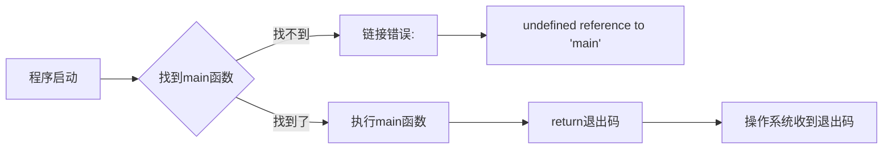
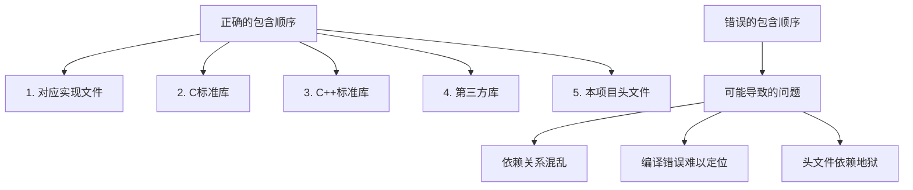
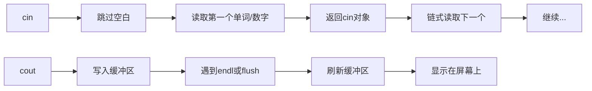

+++
title = "第3章 C++程序基本结构"
weight = 30
date = "2026-03-29T21:03:00+08:00"
type = "docs"
description = ""
isCJKLanguage = true
draft = false
+++
# 第3章 C++程序基本结构

> 🎭 欢迎来到C++的"装修手册"！你以为会写`cout << "Hello World"`就学会C++了？太天真了！让我们来看看代码背后那些不为人知的秘密——或者说，让你的代码看起来像专业人士写的那些套路。

## 3.1 程序入口：main函数详解

> 💡 如果把程序比作一栋大楼，`main`函数就是大门——没有它，你的程序连进都进不去，更别说搞破坏了！

### main函数签名

`main`函数是每个C++程序的**入口点**（Entry Point），就像电影开场前的那声"铛铛铛~"——程序一启动，首先执行的就是它。没有`main`函数？编译器会毫不客气地给你扔一个链接错误，就像餐厅不让你进门就说"没预约"一样。

```cpp
// ============================================
// 最常见的形式：小巧玲珑，够用就行
// ============================================
int main() {
    // return 0 表示"我顺利完成了任务"
    return 0;
}
```

> 📝 **小知识**：这里的`int`不是多余的，它表示程序退出时的" exit status "（退出状态）。返回0代表"一切正常"，非零代表"出了点问题"。这和Unix/Linux的惯例一致——0代表成功，非零代表失败。

```cpp
// ============================================
// 带命令行参数的形式：让程序接受用户的输入
// ============================================
int main(int argc, char* argv[]) {
    // argc: argument count（参数个数）
    //      - 至少是1，因为程序名本身算第一个参数
    // argv: argument vector（参数列表）
    //      - 是一个指针数组，每个元素指向一个字符串
    //      - argv[0] 是程序名，argv[1]开始是实际参数
    
    return 0;
}
```

```cpp
// ============================================
// C++风格字符串参数：更现代的写法
// ============================================
#include <iostream>

int main(int argc, char* argv[]) {
    // argv[0] 是程序名，argv[1] 开始是实际参数
    for (int i = 0; i < argc; ++i) {
        std::cout << "argv[" << i << "] = " << argv[i] << std::endl;
        // 输出: argv[0] = ./program
        // 输出: argv[1] = arg1
        // 输出: argv[2] = arg2
    }
    return 0;
}
```

> 💬 **比喻时间**：想象你点外卖，程序名是"外卖APP"，`argv[1]`是"宫保鸡丁"，`argv[2]`是"微辣"。`argc`就是告诉你"你点了2个菜哦"。

### 返回值约定

程序的" exit status "（退出状态）就像飞机的"落地报告"——0表示"安全抵达"，非零表示"出了状况"。

```cpp
// ============================================
// 返回值约定：程序结束时给操作系统的"便条"
// ============================================

// return 0：程序正常退出，意思是"搞定了，没问题！"
int success() {
    return 0;  // 操作系统收到这个会说："哦，成功了，记下了"
// 输出: 进程退出码 = 0
}

// return 非零值：程序异常退出，不同值表示不同错误
// 这就像是不同的"病情诊断书"
int failure() {
    return 1;  // 一般错误
    // 输出: 进程退出码 = 1
}

int not_found() {
    return 404;  // 文件没找到（程序员的小幽默）
    // 输出: 进程退出码 = 404
}

int permission_denied() {
    return 13;  // 权限不足（为什么是13？因为Unix传统）
    // 输出: 进程退出码 = 13
}
```

> ⚠️ **重要提醒**：在C++11（及以后）的标准中，如果你不给`main`函数写`return`语句，编译器会**隐式插入 `return 0;`**——也就是说它是明确定义的，不会翻车！不过，其他函数如果不写`return`，那就是货真价实的未定义行为了。所以显式写出`return 0;`依然是好习惯，就像离开座位时把椅子推进去一样——细节体现素质，也让自己和同事少费脑子。

### 命令行参数处理

命令行参数就是运行程序时跟在程序名后面的那些"调料"，让同一个程序可以干不同的事。

```cpp
#include <iostream>

// ============================================
// 命令行参数处理：解读用户的"密语"
// ============================================
int main(int argc, char* argv[]) {
    // argc: argument count，参数的个数
    // argv: argument vector，参数的"向量"（其实就是数组）
    
    // 打印收到了多少个参数（不包括程序名本身）
    std::cout << "Received " << argc - 1 << " arguments:" << std::endl;
    // 输出: Received 2 arguments:
    
    // 从1开始遍历，因为argv[0]是程序名
    for (int i = 1; i < argc; ++i) {
        std::cout << "  " << i << ": " << argv[i] << std::endl;
        // 输出:   1: arg1
        // 输出:   2: arg2
    }
    
    return 0;
}
```

> 💡 **实用场景**：如果你写了一个文件处理工具，可以这样用：
> ```
> ./file_processor --input data.txt --output result.txt
> ```
> 你的程序通过`argv`解析这些参数，就能知道要处理哪个文件、输出到哪里。

### main函数只能有一个

```cpp
// ❌ 错误示范：多个main函数？编译器会疯掉的！
int main() {
    return 0;
}

int main() {  // 编译错误：main被重复定义
    return 0;
}
```

> 🎭 **趣闻**：在某些古代C++编译器中，如果你定义了多个`main`，计算机会发出"呃...你确定？"的表情。



## 3.2 头文件与源文件组织

> 📦 想象你搬家时把所有东西都塞进一个纸箱——衣服、书籍、碗筷、电脑全混在一起。头文件（`.hpp`/`.h`）和源文件（`.cpp`）的分离，就是让你的代码"分类整理"的艺术！

### 头文件保护

头文件保护是防止"重复包含"的巧妙机制。想象你在一本书里引用了另一本书，而那本书又引用了第一本——这就形成了**循环引用**（Circular Include），会让编译器陷入无尽的头疼。

```cpp
// ============================================
// 传统方式：#ifndef 保护 - 经典的"门卫"机制
// ============================================
#ifndef MY_HEADER_HPP           // "如果没有定义过MY_HEADER_HPP..."
#define MY_HEADER_HPP           // "...那就定义它！"（并开始读取内容）

// 头文件内容可以放这里了
namespace my_space {
    class Robot {
    public:
        std::string name_;
        void greet() const;
    };
}

#endif  // MY_HEADER_HPP        // "好了，这个头文件读完了"
```

> 🔍 **原理**：第一次包含这个头文件时，`MY_HEADER_HPP`没被定义过，所以`#ifndef`条件为真，进去定义它。以后再包含时，`MY_HEADER_HPP`已经被定义了，`#ifndef`条件为假，整个文件内容被跳过。

```cpp
// ============================================
// 现代方式：#pragma once - 简洁至上
// ============================================
#pragma once

// 编译器会自动帮你处理重复包含的问题
// 优点：简洁、不会因为宏名冲突出问题
// 缺点：不是C++标准的一部分（但几乎所有编译器都支持）
```

> 💡 **选择建议**：
> - 小项目：用`#pragma once`，简单省事
> - 大型项目或跨平台：用`#ifndef`，更可控

### 前向声明

**前向声明**（Forward Declaration）就像在通讯录里写"张三（有联系方式）"，而不是把张三的全部档案都复印一份。它告诉编译器"这个类存在，但细节我后面再说"。

```cpp
#include <iostream>
#include <string>

// ============================================
// 前向声明：先"预告"一下这个类的存在
// ============================================
class Robot;  // "嗨，编译器，有个叫Robot的类，后面会定义"

void introduce(const Robot& r);  // 使用前向声明的引用

// 然后再定义Robot类
class Robot {
public:
    std::string name_;
    void greet() const;
};

void Robot::greet() const {
    std::cout << "Beep boop! I am " << name_ << "!" << std::endl;
    // 输出: Beep boop! I am R2-D2!
}

void introduce(const Robot& r) {
    std::cout << "Meet " << r.name_ << "!" << std::endl;  // 输出: Meet R2-D2!
}

int main() {
    Robot r;
    r.name_ = "R2-D2";
    introduce(r);  // 输出: Meet R2-D2!
    return 0;
}
```

> 🎭 **为什么需要前向声明**：
> 1. **打破循环依赖**：A类要用B类，B类也要用A类？没有前向声明你就死循环了！
> 2. **减少编译时间**：只声明不用定义，编译器不用加载整个类定义
> 3. **降低耦合**：让两个文件之间的依赖更少

### 包含顺序

头文件的包含顺序就像点外卖的配料顺序——放错了可能"串味"，放对了才能让代码"美味可口"。

```cpp
// ============================================
// 正确的包含顺序：先系统后本地
// ============================================

// 1. 对应的实现文件（如果是在.cpp中）
#include "robot.hpp"

// 2. C标准库（比如 <cstdio> 而不是 <stdio.h>）
#include <cstring>

// 3. C++标准库
#include <iostream>
#include <string>
#include <vector>

// 4. 其他第三方库
#include <boost/shared_ptr.hpp>

// 5. 本项目头文件
#include "config.hpp"
#include "logger.hpp"
```

> ⚠️ **黄金法则**：
> - **系统头文件先于自定义头文件**：系统的东西"根基"更稳，先放
> - **本项目头文件优先于第三方库**：自己的代码优先级最高
> - **避免循环包含**：`A包含B，B包含A`会让人抓狂，编译器会报"头文件嵌套太深"



## 3.3 命名空间（namespace）的概念与使用

> 🏷️ 想象一个大公司里有100个叫"张三"的员工，没有部门区分的话，每次叫人都会有一百个人回头。命名空间就是C++的"部门标签"，让你精准找到你要的那个"张三"！

### 命名空间定义

**命名空间**（Namespace）是一种将全局作用域划分成不同区域的机制，每个区域都有自己的"地盘"，不会互相干扰。就像小区里的单元楼，3号楼501和7号楼501是完全不同的地址。

```cpp
#include <iostream>
#include <string>

// ============================================
// 命名空间定义：创建一个"专属领域"
// ============================================
namespace apollo {  // 阿波罗计划...太空机器人部门？
    int robot_count = 0;  // 这个robot_count只有apollo能用
    
    class Robot {
    public:
        std::string name_;  // 机器人名字
        int id_;            // 机器人编号
    };
    
    void launchRobot(const std::string& name) {
        std::cout << "Launching robot: " << name << std::endl;
        // 输出: Launching robot: HAL-9000
        robot_count++;
    }
}

// 使用时要用 apollo:: 限定
apollo::Robot r;
r.name_ = "HAL-9000";
apollo::launchRobot(r.name_);  // 输出: Launching robot: HAL-9000
```

> 💡 **命名空间的好处**：
> 1. **避免名字冲突**：不同库可以用相同的类名/函数名
> 2. **表达逻辑分组**：相关的代码放在一起，一目了然
> 3. **模拟模块化**：像`std`、`apollo`这样组织代码

### using声明与using指令

有时候每次都要写`apollo::`前缀挺烦的，就像每次叫人都要说"中科院计算所的张三"——太长了！这时候`using`就派上用场了。

```cpp
#include <iostream>
#include <string>

namespace fast {
    void speedUp() {
        std::cout << "Speeding up!" << std::endl;  // 输出: Speeding up!
    }
    
    void slowDown() {
        std::cout << "Slowing down..." << std::endl;  // 输出: Slowing down...
    }
}

// ============================================
// using声明：只引入一个"明星员工"
// ============================================
using fast::speedUp;  // 以后speedUp()就相当于fast::speedUp()

int main() {
    // 不需要 fast:: 前缀了！
    speedUp();  // 输出: Speeding up!
    
    // 其他成员还是要限定
    fast::slowDown();  // 输出: Slowing down...
    
    // ============================================
    // using指令：把整个"部门"都引进来（慎用！）
    // ============================================
    using namespace std;  // std里的所有东西都可以直接用
    
    // 现在cout、endl都不用加 std:: 前缀了
    cout << "Direct cout!" << endl;  // 输出: Direct cout!
    
    // 但是！如果有两个命名空间有同名的函数...
    // namespace slow { void speedUp() {...} }
    // 这时候用 speedUp() 就会产生歧义，编译器会报错
    
    return 0;
}
```

> ⚠️ **警告**：滥用`using namespace std`在大型项目中是"技术债"——短时间内爽，长期痛苦。一个文件还好，如果你有两个不同的库都定义了`print()`函数，而你在同一个文件里用了两个`using namespace`，那就等着编译错误吧！

### 匿名命名空间

**匿名命名空间**（Anonymous Namespace）就像一个"私人包厢"——里面的东西只有这个文件的人能看到，外面的人根本不知道有这些"秘密"。

```cpp
namespace {
    // ============================================
    // 匿名命名空间：文件级别的"私有化"
    // ============================================
    
    // 这个变量只有当前文件能访问
    int secret_number = 42;
    
    // 相当于 static int secret_number = 42; （C风格）
    // 但匿名命名空间更现代、功能更强
    
    void internalHelper() {
        // 只在这个 .cpp 文件里能被调用
        // 其他文件想调用？门都没有！
    }
}

// 外面想访问 secret_number？不可能！
// internalHelper()？做梦！
```

> 💡 **为什么用匿名命名空间而不是`static`**：
> - `static`是C的遗产，在C++中"不太C++"
> - 匿名命名空间可以包含类、其他命名空间
> - `static`只能用于变量和函数

### 内联命名空间（C++11）

**内联命名空间**（Inline Namespace）就像一个"自动 VIP 通道"——默认就能用，不需要额外指定。它主要用于**版本管理**，让旧代码和新代码和平共处。

```cpp
#include <iostream>

namespace v1 {
    void display() {
        std::cout << "Version 1" << std::endl;  // 输出: Version 1
    }
    
    int legacyFunction() {
        return 1;
    }
}

inline namespace v2 {  // C++11特性：内联命名空间
    void display() {
        std::cout << "Version 2" << std::endl;  // 输出: Version 2
    }
    
    int newFunction() {
        return 2;
    }
}

// ============================================
int main() {
    // v2 是内联命名空间，所以 display() 直接解析到 v2::display()
    display();  // 输出: Version 2
    
    // 想用旧版本？明确指定就行
    v1::display();  // 输出: Version 1
    
    return 0;
}
```

> 🎭 **实用场景**：库作者常用这个技巧：
> ```cpp
> namespace MyLibrary {
>     inline namespace v3 {  // 最新版本是v3
>         class Widget { /* ... */ };
>     }
>     namespace v2 { class Widget { /* 旧版本 */ }; }
> }
> 
> MyLibrary::Widget w;  // 自动用v3版本
> MyLibrary::v2::Widget oldW;  // 明确用旧版本
> ```

### 嵌套命名空间定义（C++17）

**嵌套命名空间**（Nested Namespace）就是"命名空间的嵌套"，就像公司有部门，部门里有组，组里有小组...

```cpp
#include <iostream>

// ============================================
// C++17 之前的写法：层层嵌套，括号多到眼晕
// ============================================
namespace outer {
    namespace middle {
        namespace inner {
            void hello() {
                std::cout << "Hello from deeply nested!" << std::endl;
                // 输出: Hello from deeply nested!
            }
        }
    }
}

// 调用时要写一长串...
outer::middle::inner::hello();  // 输出: Hello from deeply nested!

// ============================================
// C++17 简化写法：一个 namespace 搞定！
// ============================================
namespace outer::middle::inner {
    void greet() {
        std::cout << "Hello from nested namespace!" << std::endl;
        // 输出: Hello from nested namespace!
    }
}

// 调用简洁多了！
outer::middle::inner::greet();  // 输出: Hello from nested namespace!
```

> ✨ **进步看得见**：C++17的这个改进让代码更简洁、更易读。妈妈再也不用担心我数括号了！

## 3.4 注释规范与代码风格

> 📝 代码注释就像外卖里的备注——写得好能救命，写得烂能要命。"不要辣"写成"要辣"，你就等着哭吧！

### Doxygen注释规范

**Doxygen**是一种流行的文档生成工具，它能从源代码的注释中自动生成漂亮的文档（HTML、PDF等）。它的注释风格很特别，用`/**`开头，用`@`或`\`开头的特殊命令标记内容。

```cpp
#include <iostream>
#include <string>

/**
 * @brief 机器人自我介绍
 * 
 * 让机器人用友好的方式向世界介绍自己
 * @param name 机器人名字，比如 "R2-D2" 或 "C-3PO"
 * @param age 机器人年龄（电子岁，不是生物岁）
 * @return 是否成功自我介绍
 *         - true: 自我介绍完成
 *         - false: 呃，出了点问题
 * 
 * @note 机器人通常不会说谎，但可能会夸大自己的功能
 * @warning 不要问机器人关于"存在感"这种哲学问题
 * @see Robot::greet()
 */
bool introduce(const std::string& name, int age) {
    std::cout << "I am " << name << ", " << age << " years old!" << std::endl;
    // 输出: I am R2-D2, 42 years old!
    std::cout << "Nice to meet you, human!" << std::endl;
    // 输出: Nice to meet you, human!
    return true;
}

/**
 * @class Robot
 * @brief 机器人的抽象表示
 * 
 * 这个类封装了一个机器人的基本属性和行为
 */
class Robot {
public:
    std::string name;  ///< 机器人名字
    int age;           ///< 机器人年龄
    
    /**
     * @brief 打招呼
     * @return void
     */
    void greet() const;
};

void Robot::greet() const {
    std::cout << "Beep boop! I am " << name << "!" << std::endl;
    // 输出: Beep boop! I am C-3PO!
}

int main() {
    // 测试Doxygen风格的注释
    if (introduce("R2-D2", 42)) {
        std::cout << "Self-introduction successful!" << std::endl;
        // 输出: Self-introduction successful!
    }
    
    Robot c3po;
    c3po.name = "C-3PO";
    c3po.greet();  // 输出: Beep boop! I am C-3PO!
    
    return 0;
}
```

> 📚 **常用Doxygen命令**：
> | 命令 | 含义 | 示例 |
> |------|------|------|
> | `@brief` | 简要描述 | `@brief 这是一个xxx功能` |
> | `@param` | 参数说明 | `@param name 用户名` |
> | `@return` | 返回值说明 | `@return 成功返回true` |
> | `@note` | 备注 | `@note 需要管理员权限` |
> | `@warning` | 警告 | `@warning 不要断电` |
> | `@see` | 参见 | `@see OtherClass` |

### 代码风格指南（Google C++ Style等）

代码风格就像穿衣服——不需要最贵的，但要得体。一致的代码风格让团队协作更顺畅，也让代码审查（Code Review）时少吵架。

```cpp
// ============================================
// Google C++ 风格指南示例
// ============================================
#include <iostream>
#include <string>
#include <vector>

// 头文件扩展名：.hpp 或 .h
// 源文件扩展名：.cpp 或 .cc

// 类名：UpperCamelCase（单词首字母大写）
class MyRobotClass {};       // ✅ 正确
class my_robot_class {};    // ❌ 错误
class myRobotClass {};      // ❌ 错误

// 函数名：lowerCamelCase 或 snake_case
void introduceMyself() {};  // ✅ lowerCamelCase
void introduce_myself() {}; // ✅ snake_case（也接受）
void IntroduceMyself() {};  // ❌ 错误

// 变量名：lowerCamelCase 或 snake_case
int robotCount = 0;          // ✅ lowerCamelCase
int robot_count = 0;        // ✅ snake_case
int RobotCount = 0;         // ❌ 错误

// 常量：kConstantName（k开头，UpperCamelCase）
const int kMaxRetryCount = 3;     // ✅ 正确
const int MAX_RETRY_COUNT = 3;    // ❌ 错误
const int maxRetryCount = 3;     // ❌ 错误

// 私有成员变量：可以加后缀 _ 或 m_ 前缀
class Robot {
private:
    std::string name_;      // ✅ 带下划线后缀
    int age_;               // ✅ 带下划线后缀
    // 或者
    std::string m_name;     // ✅ m_ 前缀
    int m_age;              // ✅ m_ 前缀
};

// 枚举值：kEnumName 或 EnumName
enum class RobotType {
    kMedical,    // ✅ kEnumName
    kIndustrial,
    kCompanion
};

// 命名空间：全小写，用下划线分隔
namespace robot_system {}   // ✅ 正确
namespace RobotSystem {}    // ❌ 错误

// 示例完整类
namespace my_robot {

// 常量
const int kDefaultAge = 0;
const std::string kDefaultName = "Unnamed";

// 类名
class RobotController {
public:
    // 构造函数
    RobotController() : robot_count_(0) {}
    
    // 公共方法
    void AddRobot(const std::string& name) {
        robots_.push_back(name);
        ++robot_count_;
    }
    
    int get_robot_count() const { return robot_count_; }  // getter
    
private:
    std::vector<std::string> robots_;  // 私有成员
    int robot_count_;                   // 私有成员
};

}  // namespace my_robot
```

> 💡 **风格统一的好处**：
> 1. **代码审查更轻松**：不用争论"这里该用下划线还是驼峰"
> 2. **维护更容易**：新来的人也能快速上手
> 3. **减少bug**：风格混乱的代码往往bug更多
> 4. **心情愉悦**：看着整齐的代码，连debug都顺眼多了！

## 3.5 标准输入输出：iostream基础

> ⌨️ 如果程序是一个黑帮老大，`iostream`就是它的"耳朵"和"嘴巴"——听用户说什么，然后回应什么。没有iostream的程序就是一个聋哑人，只能闷头干活，没人知道它在干嘛。

### cout、cin、cerr、clog

C++的`iostream`库提供了四个标准的"通讯频道"：

```cpp
#include <iostream>
#include <iomanip>
#include <string>

// ============================================
// 标准输入输出详解：程序的"五官"
// ============================================
int main() {
    // cout: 标准输出（Console OUT）
    //       - 用于正常的信息输出
    //       - 数据流向：程序 -> 显示器
    std::cout << "Hello, " << "C++!" << std::endl;
    // 输出: Hello, C++!
    
    // endl: end line，换行并刷新缓冲区
    //       - 等价于 "\n" + flush()
    //       - flush()会强制把缓冲区内容输出
    
    // ============================================
    // cin: 标准输入（Console IN）
    //       - 用于读取用户的输入
    //       - 数据流向：键盘 -> 程序
    // ============================================
    std::string name;
    int age;
    
    std::cout << "Enter your name: ";
    std::cin >> name;  // 用户输入: Alice
    std::cout << "Hello, " << name << "!" << std::endl;
    // 输出: Hello, Alice!
    
    std::cout << "Enter your age: ";
    std::cin >> age;  // 用户输入: 25
    std::cout << "You are " << age << " years old." << std::endl;
    // 输出: You are 25 years old.
    
    // cin >> 会自动跳过空白字符（空格、换行、制表符）
    // 如果输入 "  42  "，会正确读取 42
    
    // ============================================
    // cerr: 无缓冲错误输出（Console ERROR）
    //       - 专门用于错误信息
    //       - 没有缓冲区，数据直接输出
    //       - 不重定向到文件（通常）
    // ============================================
    std::cerr << "Error: something went wrong!" << std::endl;
    // 输出: Error: something went wrong!
    
    // ============================================
    // clog: 带缓冲的错误输出（Console LOG）
    //       - 用于日志信息
    //       - 有缓冲区，程序结束后才输出
    // ============================================
    std::clog << "Processing started..." << std::endl;
    // 输出: Processing started...（可能不会立刻显示）
    
    // ============================================
    // 格式化输出：让输出更漂亮
    // ============================================
    
    // 浮点数精度
    std::cout << std::fixed << std::setprecision(2) << 3.14159 << std::endl;
    // 输出: 3.14
    // setprecision(2) 设置小数点后2位
    // std::fixed 让它显示固定小数位，而不是科学计数法
    
    // 宽度和对齐
    std::cout << std::setw(10) << std::left << "Hello" << std::endl;
    // 输出: Hello     （左对齐，总宽度10）
    
    std::cout << std::setw(10) << std::right << "World" << std::endl;
    // 输出:      World（右对齐，总宽度10）
    
    // 进制输出
    int num = 255;
    std::cout << "Decimal: " << num << std::endl;           // 输出: Decimal: 255
    std::cout << "Hex: " << std::hex << num << std::endl;   // 输出: Hex: ff
    std::cout << "Octal: " << std::oct << num << std::endl; // 输出: Octal: 377
    
    // 恢复十进制
    std::cout << std::dec << "Back to decimal: " << num << std::endl;
    // 输出: Back to decimal: 255
    
    // 填充字符
    std::cout << std::setfill('0') << std::setw(8) << 42 << std::endl;
    // 输出: 00000042
    
    return 0;
}
```

> 💡 **为什么有四个输出**：
> - `cout`：日常输出，悠着点用
> - `cerr`：紧急错误，立即显示，不缓冲
> - `clog`：日志，可以等一等再输出
> - 在命令行中，你可以通过重定向来区分它们：
>   ```
>   ./program > output.txt 2> error.txt
>   # cout的内容去output.txt，cerr的内容去error.txt
>   ```

### 链式输出和输入

`<<`和`>>`可以一直链下去，因为它们返回的是流的引用。

```cpp
#include <iostream>
#include <string>

int main() {
    // 链式输出：一行代码输出多个东西
    std::cout << "Name: " << "Alice"
              << ", Age: " << 25
              << ", City: " << "Beijing" << std::endl;
    // 输出: Name: Alice, Age: 25, City: Beijing
    
    // 链式输入：连续读取多个值
    std::string first, last;
    int age;
    std::cout << "Enter first name, last name, and age: ";
    std::cin >> first >> last >> age;
    // 用户输入: John Doe 30
    std::cout << "Hello, " << first << " " << last << "!" << std::endl;
    // 输出: Hello, John Doe!
    std::cout << "You are " << age << " years old." << std::endl;
    // 输出: You are 30 years old.
    
    return 0;
}
```



## 3.6 属性语法[[attribute]]（C++11）

> 🏷️ 如果代码是演员，那**属性**（Attribute）就是贴在演员身上的"便签"——告诉导演（编译器）"这个人会功夫"、"这个人恐高"之类的特殊提示。C++11引入了`[[attribute]]`语法，让你能给代码贴便签了！

### 常用属性

**属性**是一种给代码添加"元信息"的方式，编译器可以根据这些信息给出警告或生成不同的代码。

```cpp
#include <iostream>
#include <stdexcept>

// ============================================
// [[nodiscard]]：返回值很重要，不要丢掉！
// ============================================
// 如果调用者忽略了返回值，编译器会发出警告
[[nodiscard]] int calculateScore() {
    return 42;  // 分数！别丢了！
}

[[nodiscard]] bool isValid(int value) {
    return value > 0;
}

int main() {
    // 正确用法：接收返回值
    int score = calculateScore();
    std::cout << "Score: " << score << std::endl;  // 输出: Score: 42
    
    // 错误用法：忽略了返回值
    calculateScore();  // 编译器：嘿！你怎么不要这个分数？
    
    // 但注意，只有 [[nodiscard]] 的函数被普通调用时才会警告
    // 如果返回值被用于表达式，编译器可能不会警告
    int x = calculateScore() + 10;  // 用上了，没问题
    
    // isValid 示例
    if (isValid(10)) {  // 用在条件表达式里
        std::cout << "Valid!" << std::endl;  // 输出: Valid!
    }
    
    return 0;
}
```

> 💡 **使用场景**：
> - 内存分配函数：`[[nodiscard]] void* allocate(size_t size);`
> - 错误检查函数：`[[nodiscard]] bool checkSomething();`
> - 工厂函数：`[[nodiscard]] std::unique_ptr<Robot> createRobot();`

```cpp
#include <iostream>

// ============================================
// [[maybe_unused]]：我知道这个变量暂时没用，别警告我
// ============================================
void process(int data, [[maybe_unused]] int extra) {
    // extra 参数可能以后会用
    // 没有这个属性，编译器会说："喂，这个参数没用啊"
    // 有了它，编译器就闭嘴了
    
    std::cout << "Processing: " << data << std::endl;
    // 输出: Processing: 100
    
    // 仍然可以在需要时使用 extra
    // std::cout << "Extra: " << extra << std::endl;
}

int main() {
    process(100, 200);  // 输出: Processing: 100
    return 0;
}
```

```cpp
#include <iostream>
#include <stdexcept>

// ============================================
// [[noreturn]]：告诉编译器这个函数不会正常返回
// ============================================
[[noreturn]] void crash() {
    throw std::runtime_error("Boom!");
    // 函数永远不会正常执行到这里
    // 编译器可以利用这个信息做优化
}

void riskyFunction() {
    std::cout << "Starting risky operation..." << std::endl;
    // 输出: Starting risky operation...
    crash();
    // 编译器知道 crash() 不会返回
    // 所以这里的警告什么的可以省略
}

int main() {
    try {
        riskyFunction();
        std::cout << "This will never print" << std::endl;
    } catch (const std::exception& e) {
        std::cout << "Caught exception: " << e.what() << std::endl;
        // 输出: Caught exception: Boom!
    }
    return 0;
}
```

> ⚠️ **注意**：`[[noreturn]]`的函数必须确实不返回，否则行为未定义。比如`std::exit()`是`[[noreturn]]`，但如果你在前面加个`return`，编译器会困惑。

```cpp
#include <iostream>

// ============================================
// [[deprecated]]：标记已废弃的代码
// ============================================
// 这个函数太老了，不推荐使用，但还没删除
[[deprecated("Use newFunction instead")]]
void oldFunction() {
    std::cout << "This is the old way!" << std::endl;
    // 输出: This is the old way!
}

// 推荐使用的新函数
void newFunction() {
    std::cout << "This is the new way!" << std::endl;
    // 输出: This is the new way!
}

int main() {
    // 警告：使用了已废弃的函数
    oldFunction();  // 编译器会警告：deprecated!
    
    // 正确用法
    newFunction();  // 没有警告
    
    return 0;
}
```

### C++17/20/23新属性

```cpp
#include <iostream>

// ============================================
// C++17: [[fallthrough]] - 故意不加break
// ============================================
void handle(char c) {
    switch (c) {
        case 'a':
            std::cout << "Found A" << std::endl;
            [[fallthrough]];  // 我知道我在干什么，不要警告！
        case 'A':
            std::cout << "Found letter A (any case)" << std::endl;
            // 输出: Found A 和 Found letter A (any case)
            break;
        case 'b':
        case 'B':
            std::cout << "Found B" << std::endl;
            break;
    }
}

// ============================================
// C++17: [[nodiscard("reason")]] - 带原因的废弃警告
// ============================================
[[nodiscard("Memory allocation may fail")]]
void* riskyAlloc(size_t size) {
    return nullptr;
}

// ============================================
// C++20: [[no_unique_address]] - 节省空间的优化
// ============================================
struct Empty {};  // 空结构体，按理说应该不占空间

struct Person {
    [[no_unique_address]] Empty e;  // 告诉编译器：如果e和其他成员不冲突，可以共享地址
    int age;
    std::string name;
};
// Person的大小可能比预期小，因为Empty e不占额外空间

// ============================================
// C++23: [[assume(expr)]] - 告诉编译器"假设这个条件成立"
// ============================================
int fastAbs(int x) {
    [[assume(x >= 0)]];  // 编译器可以假设x非负，做激进优化
    return x;
}

int main() {
    handle('a');  // 输出: Found A 和 Found letter A (any case)
    handle('b');  // 输出: Found B
    
    void* p = riskyAlloc(100);
    if (!p) {
        std::cout << "Allocation failed" << std::endl;
    }
    
    return 0;
}
```

### GCC/Clang 特定属性

```cpp
#include <iostream>

// ============================================
// GCC/Clang 特定属性：[[gnu::xxx]]
// ============================================

// [[gnu::unused]] - 这个变量/函数可能没用到，但别警告
[[gnu::unused]] int hidden_variable = 10;

// [[gnu::pure]] - 函数没有副作用，结果只依赖参数
[[gnu::pure]] int add(int a, int b) { return a + b; }

// [[gnu::const]] - 比pure更严格，连内存都不读
[[gnu::const]] int triple(int x) { return x * 3; }

// [[gnu::aligned(n)]] - 对齐要求
struct AlignedStruct {
    [[gnu::aligned(16)]] double data[4];
};

// [[gnu::packed]] - 紧凑布局，不对齐
struct PackedStruct {
    char a;
    int b;
    char c;
} __attribute__((packed));
// 大小会尽可能小，但访问可能变慢

int main() {
    std::cout << "Hidden variable: " << hidden_variable << std::endl;
    // 输出: Hidden variable: 10
    std::cout << "2 + 3 = " << add(2, 3) << std::endl;  // 输出: 2 + 3 = 5
    std::cout << "5 * 3 = " << triple(5) << std::endl;  // 输出: 5 * 3 = 15
    return 0;
}
```

> 💡 **兼容性提示**：GCC特定属性在`[[gnu::xxx]]`形式下可以被符合C++11的编译器识别，但如果要跨平台，可能需要条件编译：
> ```cpp
> #ifdef __GNUC__
> #define ATTRIBUTE_GCC __attribute__
> #else
> #define ATTRIBUTE_GCC(x)
> #endif
> ```

## 本章小结

> 🎉 恭喜你！坚持看完这一章，你已经是"会装修"的C++程序员了！

本章我们深入探索了C++程序的基本结构，从宏观的代码组织到微观的语法细节：

### 3.1 main函数

- **程序入口点**：没有`main`函数，程序连门都进不去
- **返回值的意义**：`return 0`表示成功，非零表示各种错误
- **命令行参数**：`argc`和`argv`让程序能接收用户的"密语"

### 3.2 头文件与源文件

- **头文件保护**：`#ifndef`/`#pragma once`防止重复包含的噩梦
- **前向声明**：打破循环依赖的"和好神器"
- **包含顺序**："先系统后本地"是基本礼仪

### 3.3 命名空间

- **避免名字冲突**：让`张三`变成"中科院计算所张三"
- **using声明/指令**："引入"要谨慎，滥用会出事
- **匿名命名空间**："包厢"文化，文件级别的私有化
- **内联命名空间**：版本管理的VIP通道
- **嵌套命名空间**：C++17的`outer::inner::innermost`写法简洁优雅

### 3.4 注释与代码风格

- **Doxygen注释**：专业文档的"自动生成器"
- **Google风格指南**：代码的"穿搭指南"，得体比花哨重要
- **一致性是关键**：团队协作的润滑剂

### 3.5 iostream

- **cout/cin/cerr/clog**：程序的"嘴巴"和"耳朵"
- **格式化输出**：`setprecision`、`setw`让输出更美观
- **链式操作**：`<<`和`>>`可以一直链下去

### 3.6 属性语法

- **`[[nodiscard]]`**："这个返回值很重要！"
- **`[[maybe_unused]]`**："我知道这货没用，别吵吵"
- **`[[noreturn]]`**："这个函数不会回来"
- **`[[deprecated]]`**："这个函数过时了，别用！"
- **`[[fallthrough]]`**："我是故意不加break的！"
- **GCC特定属性**：`[[gnu::xxx]]`是gcc/clang的专属技能

---

> 💪 **下一步预告**：学会了怎么"装修"，接下来要学怎么"盖房子"！第4章我们将学习C++的数据类型和变量，让你的程序不仅有骨架，还有血肉！
>
> 🎭 彩蛋：据说每个C++程序员都曾在深夜对着"Segmentation Fault"发呆，在编译器报错中怀疑人生，在`[[nodiscard]]`的警告下抓耳挠腮。别担心，你不是一个人。加油！
