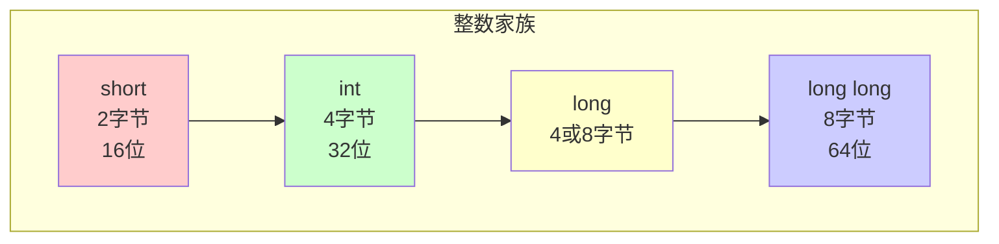
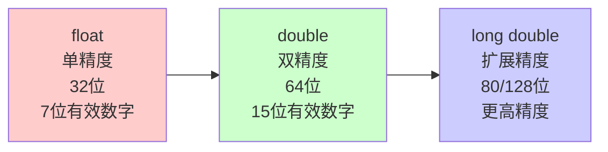
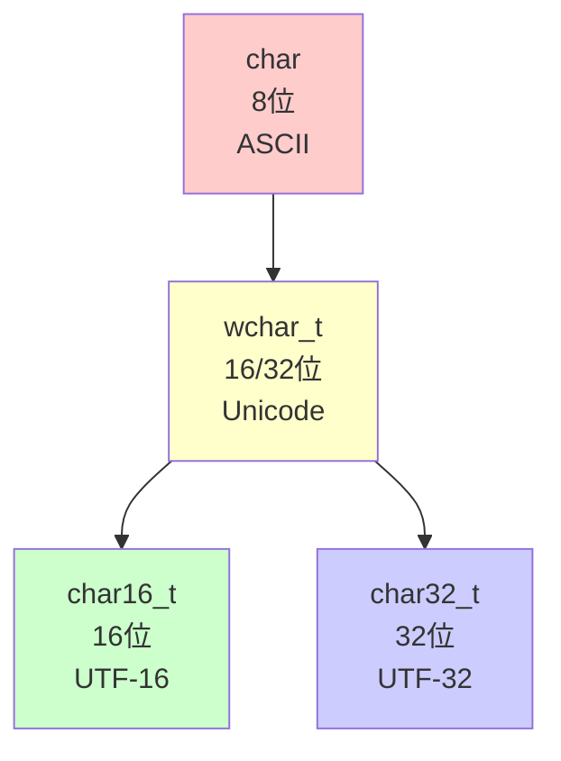
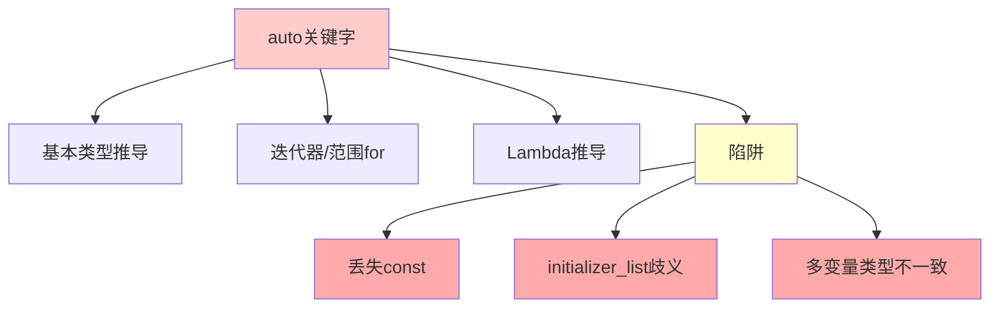
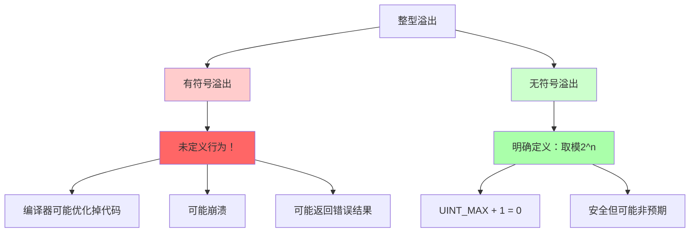

+++
title = "第4章 基本数据类型与变量"
weight = 40
date = "2026-03-29T21:03:00+08:00"
type = "docs"
description = ""
isCJKLanguage = true
draft = false
+++
# 第4章 基本数据类型与变量

## 4.1 内置数据类型

C++的内置类型就像是厨房里的基本食材——简单但能组合出无数美味！

想象一下，你走进一家神奇的C++超市，货架上摆满了各种"数据类型"。有的只能装整数，像一个专门存放整数的冰箱；有的能装小数，像一个魔法锅；有的只能装字符，像一个字母盒子。选对食材，才能做出好菜！

> 💡 **小贴士**：C++是一门静态类型语言，这意味着每个变量在编译时就要确定它的"类型"。就像你不能把水果放进冰箱的蔬菜层一样，C++也不允许你把错误类型的数据塞进变量里。

### 整型：short、int、long、long long

整型就是用来存储整数的类型。想象你是一个仓库管理员，整数就是不带小数点的商品——可以是人、苹果、或者你欠前女友的次数。

```cpp
#include <iostream>
#include <climits>  // 包含整型极限信息

int main() {
    // short: 通常16位，存储小数字
    // 适合存储较小范围的整数，比如你今天吃的包子数量
    short small_num = 32767;
    std::cout << "short: " << sizeof(short) << " bytes, range: [" 
              << SHRT_MIN << ", " << SHRT_MAX << "]" << std::endl;
    // 输出: short: 2 bytes, range: [-32768, 32767]
    
    // int: 通常32位，日常使用最频繁
    // int就是那个"万金油"，什么时候都可以用
    int normal_num = 2147483647;
    std::cout << "int: " << sizeof(int) << " bytes, range: [" 
              << INT_MIN << ", " << INT_MAX << "]" << std::endl;
    // 输出: int: 4 bytes, range: [-2147483648, 2147483647]
    
    // long: Windows上32位，Linux上64位（看平台脸色）
    // long就像一个善变的家伙，在不同操作系统上身材不一样
    long long_num = 2147483647L;
    std::cout << "long: " << sizeof(long) << " bytes" << std::endl;
    // 输出: long: 4 bytes (Windows) 或 8 bytes (Linux)
    
    // long long: 至少64位，存储大数字
    // 当int不够用时，long long就是你的超级英雄！
    long long huge_num = 9223372036854775807LL;
    std::cout << "long long: " << sizeof(long long) << " bytes, range: [" 
              << LLONG_MIN << ", " << LLONG_MAX << "]" << std::endl;
    // 输出: long long: 8 bytes, range: [-9223372036854775808, 9223372036854775807]
    
    return 0;
}
```

> ⚠️ **平台差异警告**：如果你在Windows上写程序，`long`是32位的；但跑到Linux上，`long`突然就变成64位的了！这就像你去不同国家发现自己的身高单位变了——厘米变英寸。为了可移植性，C++11引入了固定宽度的类型（如`int32_t`、`int64_t`），妈妈再也不用担心我的程序在不同平台上跳疯了。



### 浮点型：float、double、long double

浮点型就是用来存储小数的类型。为什么叫"浮点"呢？因为小数点可以"浮动"——就像水面上漂浮的鸭子，可以出现在任何位置。

想象你要计算圆周率、黄金比例、或者你上个月工资的精确到分的数值，这些时候就需要浮点类型了。

```cpp
#include <iostream>
#include <iomanip>

int main() {
    // float: 单精度浮点，32位，约7位有效数字
    // float就像一个粗心的会计，只能记住7位有效数字
    float pi = 3.14159f;  // f后缀表示float，否则3.14159是double
    std::cout << std::fixed << std::setprecision(6);
    std::cout << "float pi = " << pi << std::endl;  // 输出: float pi = 3.141590
    
    // double: 双精度浮点，64位，约15位有效数字（最常用！）
    // double就是那个细心又靠谱的会计，能记住15位！
    double e = 2.718281828459;
    std::cout << "double e = " << e << std::endl;  // 输出: double e = 2.718282
    
    // long double: 扩展精度，80位或128位（平台相关）
    // long double是那个强迫症会计，精确到令人发指
    long double golden = 1.6180339887498948482L;  // L后缀
    std::cout << std::setprecision(18);
    std::cout << "long double golden = " << golden << std::endl;
    // 输出: long double golden = 1.61803398874989485
    
    return 0;
}
```

> 🎭 **浮点型的表演规则**：浮点数在计算机里是用科学计数法存储的。就像你用"6.02乘以10的23次方"来表示阿伏加德罗常数一样，计算机用类似的方式存储浮点数。`float`有24位尾数（相当于7位十进制有效数字），`double`有53位尾数（相当于15位有效数字），`long double`则更多。

> 🚨 **精度陷阱**：浮点数看起来很美，但有一个著名的陷阱——精度丢失。试试`0.1 + 0.2`，你会得到`0.30000000000000004`而不是`0.3`！这是因为0.1在二进制里是一个无限循环小数，计算机只能截断它。所以如果你在写金融软件，绝对不要用浮点数来存储金额——用整数存储"分"或者使用专门的十进制库！



### 字符型：char、wchar_t、char16_t、char32_t（C++11）

字符型就是用来存储单个字符的类型。想象你有一个魔法盒子，每个盒子里只能放一个字母、数字或符号。

```cpp
#include <iostream>
#include <string>

int main() {
    // char: 最基本的字符类型，8位，存储ASCII码
    // char就像一个只认识英文的小盒子
    char grade = 'A';
    char code = 65;  // ASCII码65就是'A'——计算机其实只认识数字！
    std::cout << "grade = " << grade << ", code = " << code << std::endl;
    // 输出: grade = A, code = A
    
    // wchar_t: 宽字符，支持Unicode（Windows上是16位，Unix上是32位）
    // wchar_t就是认识中文的大盒子，但盒子大小各地不同
    wchar_t chinese = L'中';  // L前缀表示宽字符
    // std::wcout << L"宽字符: " << chinese << std::endl;  // 输出: 宽字符: 中
    
    // char16_t: UTF-16字符（C++11）
    // 专门为Unicode设计的16位字符类型
    char16_t utf16_char = u'\u4E2D';  // Unicode码点 U+4E2D = '中'
    // std::u16string s1 = u"中文";  // UTF-16字符串
    
    // char32_t: UTF-32字符（C++11）
    // 宇宙无敌全能字符类型，每个字符都是32位
    char32_t utf32_char = U'\U00004E2D';  // Unicode码点 U+4E2D
    // std::u32string s2 = U"中文";  // UTF-32字符串
    
    std::cout << "char16_t (U+4E2D): " << std::hex << static_cast<int>(utf16_char) << std::dec << std::endl;
    // 输出: char16_t (U+4E2D): 4e2d
    
    return 0;
}
```

> 📚 **ASCII码表速记**：ASCII码用0-127表示128个字符。比如'A'是65，'a'是97，'0'是48。记住这几个magic numbers，下次你看到ASCII艺术就知道怎么回事了！

> 🌏 **Unicode的故事**：英文只有26个字母，用ASCII就够用了。但中文有几万个字，日文、韩文...于是Unicode诞生了！Unicode为每个字符分配了一个唯一的码点（Code Point），比如"中"的码点是U+4E2D。现在你可以愉快地编写支持世界所有语言的程序了！



### 布尔型：bool

布尔型是最简单又最哲学的类型——它只有两个值：`true`（真）或`false`（假）。就像薛定谔的猫，不是死的就是活的（别问我打开盒子之前是什么状态）。

```cpp
#include <iostream>

int main() {
    // bool: 真或假，非零即真，零为假
    // bool就像一个回答问题只看Yes或No的固执家伙
    bool is_cpp_awesome = true;
    bool is_java_better = false;
    
    std::cout << "C++ awesome? " << is_cpp_awesome << std::endl;  // 输出: C++ awesome? 1
    std::cout << "Java better? " << is_java_better << std::endl;  // 输出: Java better? 0
    
    // 任意非零值都转为true，零转为false
    // 42是真的，0是假的——简单粗暴！
    bool from_int = static_cast<bool>(42);
    bool from_zero = static_cast<bool>(0);
    std::cout << "bool(42) = " << from_int << ", bool(0) = " << from_zero << std::endl;
    // 输出: bool(42) = 1, bool(0) = 0
    
    return 0;
}
```

> 🤔 **布尔型的输出**：当你用`std::cout`输出bool时，它会打印`1`（代表true）或`0`（代表false）。如果你想像人类一样看到`true`或`false`，可以用`std::boolalpha`：
> ```cpp
> std::cout << std::boolalpha << true << std::endl;  // 输出: true
> std::cout << std::noboolalpha << true << std::endl; // 输出: 1
> ```

## 4.2 类型修饰符：signed/unsigned、short/long

类型修饰符就像是给数据类型穿上的魔法斗篷，可以让它们的性质发生变化。`signed`告诉你"可以有负数"，`unsigned`告诉你"只能是非负数"，`short`说"我要减肥变瘦"，`long`说"我要长高"。

```cpp
#include <iostream>
#include <climits>

int main() {
    // signed: 有符号，可以表示负数（默认）
    // signed就是普通版，可以表示-10、0、10
    signed int pos = 10;
    signed int neg = -10;
    std::cout << "signed: " << pos << ", " << neg << std::endl;  // 输出: signed: 10, -10
    
    // unsigned: 无符号，只能表示非负数，但正数范围翻倍
    // unsigned就像只有正半轴的数轴，负数那边被砍掉了
    unsigned int u_num = 100;
    unsigned int u_neg = static_cast<unsigned int>(-1);  // 变成最大值！
    std::cout << "unsigned: " << u_num << ", (unsigned)-1 = " << u_neg << std::endl;
    // 输出: unsigned: 100, (unsigned)-1 = 4294967295
    
    // short/long 修饰符
    std::cout << "short: " << sizeof(short) << " bytes" << std::endl;  // 输出: short: 2 bytes
    std::cout << "long: " << sizeof(long) << " bytes" << std::endl;    // 输出: long: 4 or 8 bytes
    std::cout << "long long: " << sizeof(long long) << " bytes" << std::endl;  // 输出: long long: 8 bytes
    
    // long double 浮点
    std::cout << "long double: " << sizeof(long double) << " bytes" << std::endl;
    // 输出: long double: 16 bytes (通常)
    
    return 0;
}
```

> 📊 **signed vs unsigned的数学课**：假设都是32位：
> - `signed int`：范围是-2,147,483,648 到 2,147,483,647（正负各半）
> - `unsigned int`：范围是0 到 4,294,967,295（全是正的）
>
> 所以unsigned类型的正数范围正好是signed的2倍！但代价是你永远得不到负数——就像你买了一个只能往上爬的电梯。

> ⚠️ **signed陷阱**：当你把一个负数赋值给unsigned变量时，C++不会报错，而是会默默地把它转换成那个负数对2^n的模。比如`-1`变成`4294967295`（32位）。这就是为什么`unsigned(-1)`等于`UINT_MAX`——它不会报错，但可能会让你的程序出现奇怪的行为！

## 4.3 变量声明、定义与初始化

### 声明与定义的区别

在C++的世界里，"声明"和"定义"是两码事！声明就像是在电话里告诉朋友"我认识一个叫小明的人"，而定义则是真的把小明带到朋友面前。声明只是告诉编译器"这个变量存在"，但并不分配内存；定义才是真正创建变量、分配内存的那个动作。

```cpp
// 声明：告诉编译器"这个变量存在"
extern int external_var;  // 声明，不分配内存——只是打了个招呼

// 定义：实际创建变量，分配内存
int my_var = 10;  // 定义，可同时初始化——真正把变量创造出来

// 函数声明 vs 定义
void declaredOnly();      // 声明：我有这个函数，但我还没实现
void declaredAndDefined() {  // 定义：函数体在这里，我实现好了
    std::cout << "I'm defined!" << std::endl;  // 输出: I'm defined!
}
```

> 🎭 **为什么要区分声明和定义？** 想象你写一个大型项目，有多个源文件。文件A需要用到文件B里定义的变量。如果只有定义没有声明，编译器就会抓瞎——它怎么知道这个变量存在？通过`extern`声明，你可以在文件A里告诉编译器"这个变量在别的地方，等链接的时候再找"。

### 初始化方式

C++提供了六种初始化方式，就像餐厅有六种点菜方法。每种方法各有优劣，用错场合可能会让你吃尽苦头！

```cpp
#include <iostream>

int main() {
    // 1. 拷贝初始化（Copy Initialization）
    // 就像从别人的盘子里夹菜：int a = 10;
    int a = 10;
    std::cout << "a = " << a << std::endl;  // 输出: a = 10
    
    // 2. 直接初始化（Direct Initialization）
    // 就像直接从菜单上点菜：int b(20);
    int b(20);
    std::cout << "b = " << b << std::endl;  // 输出: b = 20
    
    // 3. 大括号初始化（Brace Initialization / List Initialization）C++11
    // 就像吃自助餐，用大括号{}把东西装起来
    int c{30};
    std::cout << "c = " << c << std::endl;  // 输出: c = 30
    
    // 4. 拷贝列表初始化
    // 有点奇怪，但确实合法
    int d = {40};
    std::cout << "d = " << d << std::endl;  // 输出: d = 40
    
    // 大括号初始化的好处：防止窄化转换（Narrowing Conversion）
    // 如果你用大括号初始化，编译器会自动检查是否会丢失数据！
    // int e{3.14};  // 编译错误！3.14是double，会被"窄化"成int 3
    int e{static_cast<int>(3.14)};  // 必须显式转换，强迫你三思而后行
    std::cout << "e = " << e << std::endl;  // 输出: e = 3
    
    // 5. 默认初始化（内建类型未初始化，值是随机的！）
    // 就像开盲盒，你永远不知道里面是什么
    int f;  // 未初始化，值是未定义的（垃圾值）
    // std::cout << "f = " << f << std::endl;  // 危险！可能是任意值
    
    // 6. 值初始化（C++11）
    // 用空的大括号，变量会被初始化为零
    int g{};  // 值初始化为零
    std::cout << "g (value-initialized) = " << g << std::endl;  // 输出: g (value-initialized) = 0
    
    return 0;
}
```

> 🛡️ **大括号初始化的安全网**：C++11引入的大括号初始化有一个神奇的特性——**防止窄化转换（Narrowing Conversion）**。如果你写`int x{3.14};`，编译器会直接报错！但如果你写`int x = 3.14;`，编译器只会警告，程序会默默地把小数截断成整数。所以，为了安全起见，**能用大括号就用大括号**！

> ⚠️ **默认初始化的坑**：对于内建类型（如int、float），如果你只声明不初始化（如`int x;`），变量的值是**未定义的（Undefined Behavior）**！它可能是0，可能是任何奇怪的数字。这就像你不洗碗就把它借给别人——谁知道里面有没有上次的剩饭呢？

### 初始化列表（C++11）

初始化列表是一种优雅的初始化方式，特别适合初始化容器和数组。它用一对大括号`{}`包含一系列值，用逗号分隔。

```cpp
#include <iostream>
#include <vector>
#include <initializer_list>

int main() {
    // 使用初始化列表初始化容器
    std::vector<int> numbers = {1, 2, 3, 4, 5};  // 一行代码创建并初始化vector
    std::cout << "Vector size: " << numbers.size() << std::endl;  // 输出: Vector size: 5
    
    // 打印vector内容
    for (int n : numbers) {
        std::cout << n << " ";  // 输出: 1 2 3 4 5
    }
    std::cout << std::endl;
    
    // 字符串列表初始化
    // 注意：字符串的列表初始化不太常见，这里仅作演示
    std::string greeting = {"Hello, C++"};
    std::cout << greeting << std::endl;  // 输出: Hello, C++
    
    return 0;
}
```

> 🌟 **初始化列表的魔法**：`std::initializer_list`是C++11引入的一种特殊类型。当你写`{1, 2, 3, 4, 5}`时，编译器会创建一个包含这些值的`initializer_list`，然后把它传递给构造函数。这就是为什么你不能用列表初始化一个普通的int变量——int没有接受initializer_list的构造函数。

## 4.4 常量与字面量

### 整型字面量

字面量（Literal）就是源代码里直接写出来的值——比如`42`、`3.14`、`'A'`。它们就像原材料，直接从C++超市的货架上拿下来用。

```cpp
#include <iostream>

int main() {
    // 十进制（默认）
    // 人类最常用的进制，逢10进1
    int dec = 42;
    std::cout << "decimal: " << dec << std::endl;  // 输出: decimal: 42
    
    // 八进制（前缀0）
    // 程序员喜欢的进制（因为8=2^3，每个八进制位正好对应3个二进制位）
    int oct = 052;  // 8进制52 = 10进制42
    std::cout << "octal: " << oct << std::endl;  // 输出: octal: 42
    
    // 十六进制（前缀0x）
    // 又是程序员的最爱（因为16=2^4，每个十六进制位对应4个二进制位）
    int hex = 0x2A;  // 16进制2A = 10进制42
    std::cout << "hexadecimal: " << hex << std::endl;  // 输出: hexadecimal: 42
    
    // 二进制（C++14，前缀0b）
    // 终于！C++14开始支持二进制字面量了！
    int bin = 0b101010;  // 二进制101010 = 10进制42
    std::cout << "binary: " << bin << std::endl;  // 输出: binary: 42
    
    // 后缀：L（long）、LL（long long）、U（unsigned）
    // 用来指定字面量的具体类型
    long big = 42L;           // 42是long类型
    unsigned positive = 42U;  // 42是unsigned类型
    long long huge = 42LL;    // 42是long long类型
    
    return 0;
}
```

> 🎨 **进制的艺术**：
> - 二进制只有0和1，像DNA的双螺旋
> - 八进制用0-7表示，像七个小矮人加一个隐形人
> - 十进制是人类的手指数量（可能吧）
> - 十六进制用0-9和A-F表示，像把十六进制位编成了一个颜色调色盘

> 💡 **记忆技巧**：十六进制的A=10、B=11...F=15。可以这样记——A是第一个字母所以等于10，F是"Fail"的F所以等于15（开玩笑的）。

### 浮点字面量

浮点字面量就是带小数点或科学计数法的数字。计算机存储它们时默认是`double`类型，除非你加后缀。

```cpp
#include <iostream>
#include <iomanip>

int main() {
    // 默认double
    // 如果没有后缀，浮点字面量默认是double类型
    double pi = 3.14159;
    std::cout << std::setprecision(15);
    std::cout << "pi = " << pi << std::endl;  // 输出: pi = 3.14159
    
    // float需要f/F后缀
    // 如果你不加f，3.14159是double类型，赋值给float会丢失精度
    float pi_f = 3.14159f;
    std::cout << "pi_f = " << pi_f << std::endl;  // 输出: pi_f = 3.14159012
    
    // 科学计数法
    // 6.022e23意思是6.022乘以10的23次方
    double avogadro = 6.022e23;
    std::cout << "Avogadro: " << avogadro << std::endl;  // 输出: Avogadro: 6.022e+23
    
    // long double需要L后缀
    // 注意！是L不是l（l容易和数字1混淆）
    long double big_math = 3.14159265358979323846L;
    std::cout << std::setprecision(20);
    std::cout << "long double pi = " << big_math << std::endl;
    
    return 0;
}
```

> ⚠️ **后缀的重要性**：如果你写`float x = 3.14;`，编译器会警告你"从double转换到float可能丢失精度"。这是因为`3.14`是double类型的字面量，而double比float精度高。解决方法：加`f`后缀变成`float x = 3.14f;`。

### 字符与字符串字面量

字符用单引号`' '`包裹，字符串用双引号`" "`包裹。它们在内存里的表现完全不同——字符是一个字节，字符串是一串字符加一个终止符`\0`。

```cpp
#include <iostream>
#include <string>

int main() {
    // 字符字面量：单引号
    // 一个字符，一个字节
    char a = 'A';
    char newline = '\n';    // 转义字符：换行符
    char tab = '\t';        // 转义字符：制表符
    char hex_escape = '\x41';  // 十六进制转义：ASCII 0x41 = 'A'
    
    std::cout << a << hex_escape << std::endl;  // 输出: AA
    
    // 字符串字面量：双引号（本质是const char[]）
    // 字符串在末尾有一个隐含的'\0'，所以"Hello"实际占6个字节
    const char* hello = "Hello";
    std::cout << hello << std::endl;  // 输出: Hello
    
    // 转义序列
    // \n换行、\t制表、\\反斜杠、\"双引号、\'单引号
    std::cout << "Line1\nLine2\tTabbed" << std::endl;
    // 输出:
    // Line1
    // Line2	Tabbed
    
    return 0;
}
```

> 📚 **常见转义序列**：
> - `\n` - 换行（New Line）
> - `\t` - 制表符（Tab）
> - `\\` - 反斜杠本身
> - `\"` - 双引号（在字符串内部）
> - `\'` - 单引号（在字符内部）
> - `\0` - 空字符（字符串结束标志）

### 原始字符串字面量（C++11）

原始字符串是C++11的救命稻草！它让你写正则表达式或Windows路径时不用双重转义——里面的字符是"原始"的，不做任何转义。

```cpp
#include <iostream>
#include <string>

int main() {
    // 原始字符串：R"(...)"，里面的字符不做转义
    // 以前你要写"\\\\d+\\\\.\\\\d{2}"来表示正则"\d+\.\d{2}"，现在不用了！
    const char* regex = R"(\d+\.\d{2})";  // 正则表达式不用双重转义
    std::cout << "Regex: " << regex << std::endl;  // 输出: Regex: \d+\.\d{2}
    
    // Windows路径用原始字符串超方便！
    // 以前你要写"C:\\Users\\Name\\Documents\\file.txt"，现在清爽多了
    const char* windows_path = R"(C:\Users\Name\Documents\file.txt)";
    std::cout << "Path: " << windows_path << std::endl;  // 输出: Path: C:\Users\Name\Documents\file.txt
    
    // 多行原始字符串
    // 可以轻松写多行文本，不用\n到处飞
    const char* multiline = R"(
        第一行
        第二行
        第三行
    )";
    std::cout << "Multiline:" << multiline << std::endl;
    
    // 自定义分隔符：R"delim(...)delim"
    // 当字符串内容包含括号时，用这个避免歧义
    const char* custom = R"==(No parentheses inside! (yay))==";
    std::cout << "Custom: " << custom << std::endl;  // 输出: Custom: No parentheses inside! (yay)
    
    return 0;
}
```

> 🎉 **正则表达式和Windows路径的救星**：如果你写过正则表达式或处理过Windows文件路径，一定被双重转义折磨过。`R"(...)"`原始字符串就是来拯救你的！它让代码可读性大幅提升。

### 二进制字面量（C++14）

C++14开始支持二进制字面量了！终于可以直接写`0b1010`而不是`10`了。

```cpp
#include <iostream>

int main() {
    // C++14开始支持二进制字面量
    // 0b前缀表示二进制，就像0x表示十六进制一样
    int bin1 = 0b1010;       // 二进制1010 = 十进制10
    int bin2 = 0b11111111;   // 二进制255 = 十进制255
    
    std::cout << "0b1010 = " << bin1 << std::endl;  // 输出: 0b1010 = 10
    std::cout << "0b11111111 = " << bin2 << std::endl;  // 输出: 0b11111111 = 255
    
    // 数字分隔符（C++14）让长数字更易读
    // 单引号'可以放在数字中间，就像我们用逗号分隔千位一样
    int million = 1'000'000;         // 一目了然：100万
    long long big_num = 9'223'372'036'854'775'807LL;  // long long最大值
    int hex_with_sep = 0xFFFF'FFFF;  // 32位全1
    
    std::cout << "million = " << million << std::endl;  // 输出: million = 1000000
    std::cout << "big_num = " << big_num << std::endl;  // 输出: big_num = 9223372036854775807
    
    return 0;
}
```

> 🎯 **数字分隔符的由来**：以前写`int million = 1000000;`，数零数到眼瞎。C++14引入的`'`分隔符让你可以写`1'000'000`，清晰多了！这个特性在写常量、IP地址、银行卡号时特别有用。

### 数字分隔符（C++14）

见上方示例，数字分隔符单引号让长数字更易读。

```cpp
#include <iostream>

int main() {
    // 数字分隔符让大数字一目了然
    // 以前：int card = 1234567890123456;  // 多少位？鬼知道
    // 现在：
    int card = 1234'5678'9012'3456;  // 一眼看出是16位！
    
    // IP地址也很清晰
    int ip = 192'168'1'1;  // 192.168.1.1
    
    // 二进制也可以用分隔符
    int mask = 0b1111'1111'1111'1111;  // 16位掩码
    
    std::cout << "card = " << card << std::endl;  // 输出: card = 1234567890123456
    std::cout << "ip = " << ip << std::endl;      // 输出: ip = 19216811
    std::cout << "mask = " << std::hex << mask << std::dec << std::endl;  // 输出: mask = ffff
    
    return 0;
}
```

### 后缀'Z'/'z'用于size_t字面量（C++23）

C++23引入了一个小但有用的特性：`z`后缀用于`size_t`类型的字面量。

```cpp
#include <iostream>
#include <cstddef>  // size_t

int main() {
    // C++23: size_t 字面量后缀 z
    // size_t是无符号整数类型，用于表示大小和索引
    size_t s1 = 100z;  // size_t(100)，明确指定类型
    
    // C++23后，auto也能正确推导
    // auto s2 = 100z;  // 在C++23中，100z自动推导为size_t
    
    std::cout << "size_t literal: " << s1 << std::endl;  // 输出: size_t literal: 100
    std::cout << "sizeof(size_t): " << sizeof(size_t) << " bytes" << std::endl;
    // 输出: sizeof(size_t): 8 bytes (64位系统)
    
    return 0;
}
```

> 📚 **size_t是什么？** `size_t`是一个无符号整数类型，用于表示内存中的大小、索引和偏移量。它的实际类型取决于平台——在32位系统上是32位的，在64位系统上是64位的。使用`size_t`可以让代码更具可移植性，因为它是标准库和操作系统API中使用的"标准"整数类型。

## 4.5 类型推导：auto关键字（C++11）

`auto`关键字是C++11引入的类型推导机制。它让编译器自动推断变量的类型，就像一个聪明的助手能根据上下文猜到你的意思。

> 🎭 **auto不是"动态类型"！** C++是静态类型语言，即使你用`auto`，类型也是在编译时确定的，而不是运行时。`auto`只是让编译器帮你写类型名，运行时没有任何开销。

### auto使用场景

```cpp
#include <iostream>
#include <vector>
#include <typeinfo>

int main() {
    // 推导基本类型
    // 编译器会根据右边的值推断类型
    auto a = 42;        // int
    auto b = 3.14;      // double
    auto c = 'X';       // char
    auto d = true;      // bool
    auto e = "hello";   // const char*（字符串字面量是const char数组）
    
    std::cout << "a=" << a << ", b=" << b << ", c=" << c << std::endl;
    // 输出: a=42, b=3.14, c=X
    
    // 推导迭代器类型（懒人必备！）
    // 你还在写 std::vector<int>::iterator 吗？auto帮你搞定！
    std::vector<int> nums = {1, 2, 3, 4, 5};
    for (auto it = nums.begin(); it != nums.end(); ++it) {
        std::cout << *it << " ";  // 输出: 1 2 3 4 5
    }
    std::cout << std::endl;
    
    // 用于范围for循环（Range-based for loop）
    // 这是C++11最酷的特性之一！
    for (auto n : nums) {
        std::cout << n << " ";  // 输出: 1 2 3 4 5
    }
    std::cout << std::endl;
    
    // 推导lambda表达式的类型
    // lambda是一种匿名函数，auto能推导出它的类型
    auto lambda = [](int x) { return x * 2; };
    std::cout << "lambda(21) = " << lambda(21) << std::endl;  // 输出: lambda(21) = 42
    
    return 0;
}
```

> 🌟 **auto的正确打开方式**：`auto`最擅长的场景是：
> 1. 迭代器类型：`for (auto it = container.begin(); ...)`
> 2. 范围for循环：`for (auto element : container)`
> 3. lambda表达式：`auto f = [](...) {...};`
> 4. 冗长的类型名：`auto smart_ptr = std::make_unique<int>(42);`

### auto陷阱与注意事项

`auto`虽好，但也不是万能的。用不好会掉进各种坑里！

```cpp
#include <iostream>
#include <vector>

int main() {
    // 陷阱1：auto会丢弃const和引用
    const int ci = 10;
    auto a1 = ci;      // int！const被丢弃了！
    auto& a2 = ci;    // const int&，用&保留引用和const
    
    // 陷阱2：auto在列表初始化时的诡异行为
    // C++11和C++17规则不同！（注意：这里的坑专门指直接列表初始化 auto x{...}，带=的 auto x = {...} 始终是initializer_list）
    auto x1{10};       // C++17起：int（单元素直接列表初始化）
    // C++11中：居然是int，不是 initializer_list！——等等，让我查查标准...
    // 实际上在C++11/14/17中，auto x{10} 都推导出 int（单元素不会生成 initializer_list）
    // 真正有区别的是下面这种写法：
    // auto x2 = {10};  // 始终是 std::initializer_list<int>，C++11到C++23都一样！
    // ⚠️ 也就是说：有没有"="，结果完全不同！
    
    // 陷阱3：auto不能用于多个变量的类型推导
    // 除非它们类型一致
    // auto i = 0, f = 3.14f;  // 编译错误！int和float类型不同
    auto j = 0, k = 1;      // OK，都是int
    
    // 建议：不确定类型时加后缀，明确告诉编译器你想要什么
    auto speed = 100LL;     // 明确是long long
    auto ratio = 3.14f;     // 明确是float
    auto name = "John";     // const char*
    
    // 小心auto和const char*的组合
    // auto s = "hello"; // const char*，不是std::string！
    
    return 0;
}
```

> ⚠️ **auto避坑指南**：
> 1. **const和引用**：如果你需要保留const或引用，加上`&`或`const`：`auto& x = const_var;`
> 2. **大括号初始化**：有没有`=`符号，**结果完全不同**！`auto x{10}` → `int`；`auto x = {10}` → `initializer_list<int>`。这种歧义从C++11就存在，C++17并未改变它（只是把单元素直接列表初始化从"模糊地带"明确成了`int`）。建议：**不要用`auto x{...};`这种形式**，要么写`auto x = {...};`（想要initializer_list），要么写`auto x{10};`配`=`（C++17起是int）。
> 3. **多变量声明**：`auto a = 1, b = 2;`OK；`auto a = 1, b = 2.0;`错误



## 4.6 decltype类型推导（C++11）

`decltype`是C++11引入的另一个类型推导关键字。与`auto`不同，`decltype`可以从表达式推断类型，而不是从初始化值推断。

```cpp
#include <iostream>
#include <typeinfo>

int main() {
    int x = 10;
    const int cx = 20;
    int& rx = x;  // rx是x的引用
    
    // decltype：获取表达式的类型（注意：decltype(x)对于变量x返回它的声明类型，
    // 而不是"去掉引用"的类型！这里x是int，decltype(x)就是int）
    decltype(x) y = 5;          // y是int
    decltype(cx) z = 15;        // z是const int（const被保留！）
    decltype(rx) ry = x;        // ry是int&（引用被保留！）
    
    // decltype的三条规则（记住就好）：
    // 1. 如果expr是纯右值（prvalue） -> T
    // 2. 如果expr是左值（lvalue） -> T&
    // 3. 如果expr是将亡值（xvalue） -> T&&
    
    // 将亡值示例
    int&& rval = 10;  // 右值引用
    decltype(rval) rval2 = 20;  // rval2是int&&
    
    // decltype在泛型编程中特别有用
    // 它能推导出函数返回值的正确类型
    auto plus = [](auto a, auto b) -> decltype(a + b) {
        return a + b;
    };
    
    std::cout << "plus(1, 2) = " << plus(1, 2) << std::endl;  // 输出: plus(1, 2) = 3
    std::cout << "plus(1.5, 2.5) = " << plus(1.5, 2.5) << std::endl;  // 输出: plus(1.5, 2.5) = 4
    
    return 0;
}
```

> 🔮 **auto vs decltype**：
> - `auto x = expr;` — 用expr初始化x，自动推断类型
> - `decltype(expr) x;` — 不实际计算expr，只获取它的类型
>
> 简单记忆：`auto`是"用值推类型"，`decltype`是"看表达式推类型"。

> 💡 **decltype的典型用法**：
> 1. 推导函数模板的返回类型
> 2. 在模板元编程中获取表达式的类型
> 3. 保留引用和const限定符

## 4.7 类型别名：typedef与using（C++11）

类型别名就是给类型起别名。就像"老板"和"CEO"可以是同一个人，类型别名让你可以用更短或更清晰的名字来表示一个类型。

```cpp
#include <iostream>
#include <vector>
#include <map>
#include <string>

// 传统方式：typedef
// typedef 旧名字 新名字;
typedef unsigned int uint;           // 给unsigned int起个小名
typedef std::vector<int> IntVec;    // 给模板类起别名
typedef int (*FuncPtr)(int, int);   // 函数指针类型，写起来很复杂

// 现代方式：using（更清晰，C++11推荐）
// using 新名字 = 旧名字;
using uint_t = unsigned int;
using String = std::string;
using IntVector = std::vector<int>;
using StringMap = std::map<std::string, std::string>;

// 模板别名：using的专利，typedef做不到！
template <typename T>
using Vec = std::vector<T>;

// 函数指针别名：using比typedef清晰多了
using CompareFunc = bool(*)(int, int);

int main() {
    // 使用类型别名，代码更简洁
    uint_t age = 25;              // 不用写unsigned int了
    String name = "Alice";         // 比std::string短
    IntVector numbers = {1, 2, 3};
    Vec<double> doubles = {1.1, 2.2, 3.3};  // 模板别名很强大！
    StringMap dict;
    
    dict["hello"] = "world";
    
    std::cout << "Name: " << name << ", Age: " << age << std::endl;
    // 输出: Name: Alice, Age: 25
    
    for (auto d : doubles) {
        std::cout << d << " ";  // 输出: 1.1 2.2 3.3
    }
    std::cout << std::endl;
    
    std::cout << "dict[hello] = " << dict["hello"] << std::endl;
    // 输出: dict[hello] = world
    
    return 0;
}
```

> 📚 **typedef vs using**：
> - `typedef`是C语言留下的遗产，语法有点反人类：`typedef int (*FP)(int, int);`
> - `using`是C++11的新语法，语义更清晰：`using FP = int(*)(int, int);`
> - **最重要的区别**：模板别名只能用`using`，不能用`typedef`！
>
> 现代C++编码规范（C++CoreGuidelines）建议优先使用`using`，因为它更易读。

## 4.8 类型转换与整型提升

### 隐式转换陷阱

C++会在某些情况下自动进行类型转换，这很方便，但也很危险！隐式转换就像一个热心但不太靠谱的助手，帮你做了决定但可能不是你想要的。

```cpp
#include <iostream>

int main() {
    // 陷阱1：bool隐式转换
    // 非零都是true，零是false
    bool flag = 42;        // 42变成true
    bool flag2 = 0;        // 0变成false
    std::cout << "bool(42)=" << flag << ", bool(0)=" << flag2 << std::endl;
    // 输出: bool(42)=1, bool(0)=0
    
    // 陷阱2：浮点转整数丢失小数部分
    // 小数部分直接截断，不四舍五入！
    int i = 3.14;          // 3.14变成3，不是3.2！
    std::cout << "int from 3.14 = " << i << std::endl;  // 输出: int from 3.14 = 3
    
    // 陷阱3：较大整型转较小整型溢出
    // char只能存-128到127，300存不下的
    int big = 300;
    char small = big;      // 溢出！300 % 256 = 44
    std::cout << "char from 300 = " << static_cast<int>(small) << std::endl;
    // 输出: char from 300 = 44
    
    // 陷阱4：符号与无符号混用（最危险的陷阱！）
    // 当有符号和无符号混合运算时，有符号会转成无符号
    unsigned int u = 10;
    int n = -5;
    // if (n < u) ... n会转成unsigned，变成一个巨大的正数！
    std::cout << "unsigned(-5) = " << static_cast<unsigned>(n) << std::endl;
    // 输出: unsigned(-5) = 4294967291 (在32位系统上)
    
    return 0;
}
```

> 🚨 **隐式转换的四大陷阱**：
> 1. **bool陷阱**：任何非零值都变成true，别用它做条件判断（虽然合法但容易混淆）
> 2. **浮点截断**：3.14变3，不是3.2
> 3. **整数溢出**：300变44（因为char只有256个值）
> 4. **符号混用**：-5变成4294967291，导致比较逻辑出错

> 💡 **如何避免陷阱**：
> - 使用显式转换（`static_cast`）而不是依赖隐式转换
> - 避免有符号和无符号混用
> - 开启编译器警告（GCC/Clang用`-Wconversion`）

### 整型溢出

整型溢出是一个严肃的话题。它在C和C++中的行为是不同的，而且对于有符号整数，溢出是**未定义行为**！

```cpp
#include <iostream>
#include <climits>

int main() {
    // 整型溢出是未定义行为（Undefined Behavior！）
    // 对于有符号整数，overflow不是"回绕"，而是完全未定义！
    // 编译器可以优化掉你的代码，甚至让程序崩溃！
    
    int big = INT_MAX;
    std::cout << "INT_MAX = " << INT_MAX << std::endl;  // 输出: INT_MAX = 2147483647
    // int overflow = big + 1;  // 未定义行为！不要尝试！
    
    // unsigned溢出是明确定义的：取模2^n
    // 所以unsigned overflow是安全的，但有符号overflow是危险的！
    unsigned int u = UINT_MAX;
    std::cout << "UINT_MAX = " << UINT_MAX << std::endl;  // 输出: UINT_MAX = 4294967295
    unsigned int u_overflow = u + 1;  // 定义：wrap around到0
    std::cout << "UINT_MAX + 1 = " << u_overflow << std::endl;  // 输出: UINT_MAX + 1 = 0
    
    // 安全做法：使用更宽的整数类型或检查
    long long safe = static_cast<long long>(big) + 1;  // 用更大的类型避免溢出
    
    return 0;
}
```

> ⚠️ **有符号溢出 = 未定义行为**：
> C++标准规定，有符号整数溢出是**未定义行为（Undefined Behavior）**。这意味着：
> - 程序可能崩溃
> - 编译器可能"优化"掉你的代码
> - 编译器可能生成完全错误的代码
>
> 所以**永远不要依赖有符号溢出的"wrap around"行为**！

> 🛡️ **防御性编程**：
> 1. 在运算前检查是否会溢出
> 2. 使用更宽的类型（如用`long long`而不是`int`）
> 3. 使用标准库的`<limits>`检查边界
> 4. 考虑使用语言扩展的溢出检查（如GCC的`-fsanitize=undefined`）



## 本章小结

本章我们深入探索了C++的基本数据类型世界。从"厨房食材"一样的内置类型，到防止窄化转换的大括号初始化，从二进制字面量到类型推导的auto和decltype，从字面量到类型别名——C++提供了丰富而强大的类型系统。

### 核心要点回顾

1. **内置类型是基础**：`short`、`int`、`long`、`long long`存储整数；`float`、`double`、`long double`存储小数；`char`存储字符；`bool`存储真假。

2. **类型修饰符改变范围**：`signed`允许负数，`unsigned`翻倍正数范围，`short`减肥，`long`增肥。

3. **初始化方式大比拼**：
   - 拷贝初始化 `int a = 10;`
   - 直接初始化 `int b(20);`
   - 大括号初始化 `int c{30};` — **防窄化转换的首选！**

4. **字面量多种进制**：十进制默认，八进制前缀`0`，十六进制前缀`0x`，二进制前缀`0b`（C++14）。

5. **原始字符串拯救正则**：使用`R"(...)"`让转义字符不再痛苦。

6. **auto是懒人神器**：迭代器、范围for循环、lambda表达式，auto无处不在。但注意const和引用会丢失！

7. **decltype看表达式说话**：与auto不同，decltype保留const和引用。

8. **类型别名using更清晰**：模板别名只能用using。

9. **隐式转换有陷阱**：bool陷阱、浮点截断、整数溢出、符号混用，每一个都可能让你debug到天亮。

10. **有符号溢出是未定义行为**：不要依赖wrap around，使用更宽的类型或显式检查。

> 📚 **继续学习**：下一章我们将探索C++的运算符和表达式，这是将数据类型组合成计算逻辑的关键！
