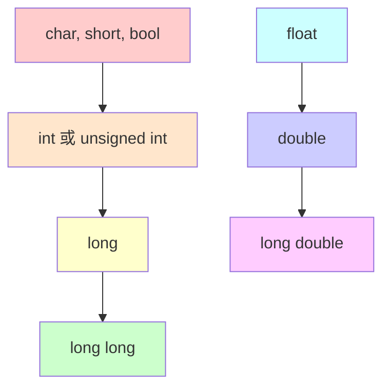
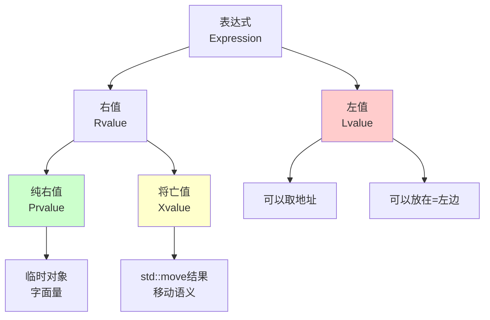

+++
title = "第5章 运算符与表达式"
weight = 50
date = "2026-03-29T21:03:00+08:00"
type = "docs"
description = ""
isCJKLanguage = true
draft = false
+++
# 第5章 运算符与表达式

欢迎来到C++的"菜市场"！在这一章里，我们将学习如何对数据施展各种"魔法"——加减乘除、位运算、条件判断……学会了这些，你就能像大厨一样，把各种原料（数据）做成美味佳肴（程序）了！

## 5.1 算术运算符

算术运算符就是用来做数学计算的，可以说是C++里的"四大天王"——加(+)、减(-)、乘(*)、除(/)，外加一个经常被忽略但超实用的取模(%)。

### 加减乘除：数学课上学过的那些

```cpp
#include <iostream>

int main() {
    // 基本算术运算符
    int a = 10, b = 3;
    
    std::cout << "a + b = " << (a + b) << std::endl;  // 输出: a + b = 13
    std::cout << "a - b = " << (a - b) << std::endl;  // 输出: a - b = 7
    std::cout << "a * b = " << (a * b) << std::endl;  // 输出: a * b = 30
    std::cout << "a / b = " << (a / b) << std::endl;  // 输出: a / b = 3 (整数除法)
    std::cout << "a % b = " << (a % b) << std::endl;  // 输出: a % b = 1 (取模/取余)
    
    // 浮点数除法
    double x = 10.0, y = 3.0;
    std::cout << "x / y = " << (x / y) << std::endl;  // 输出: x / y = 3.333333
    
    // 负数取模：C++11规定结果与被除数同号
    std::cout << "-10 % 3 = " << (-10 % 3) << std::endl;  // 输出: -10 % 3 = -1
    std::cout << "10 % -3 = " << (10 % -3) << std::endl;  // 输出: 10 % -3 = 1
    
    return 0;
}
```

### 整数除法 vs 浮点数除法：门不当户不对

这里有个超级重要的知识点！当两个整数相除时，C++使用的是**整数除法**——结果直接砍掉小数部分，不会四舍五入！

> 小明有10个苹果，要分给3个小伙伴，每个小朋友能分到几个苹果？答案是3个，剩下1个苹果在小明口袋里（别问我为什么小明要自己留一个）。`10 / 3 = 3`，`10 % 3 = 1`。

而当除数或被除数中有浮点数时，结果就是真正的数学除法了：`10.0 / 3.0 = 3.333333...`。

```cpp
// 整数除法： truncation（截断）而非 rounding（四舍五入）
int result1 = 7 / 2;    // result1 = 3，不是3.5！
int result2 = 7 % 2;    // result2 = 1（余数）

// 浮点数除法：真正的数学除法
double result3 = 7.0 / 2.0;  // result3 = 3.5
```

### 取模运算符：除法剩余的那些事儿

**取模运算符 `%`** 返回除法运算后的余数。这个运算符在编程中用处可大了去了！

- 判断奇偶性：`n % 2` —— 结果是0就是偶数，1就是奇数
- 循环数组索引：`arr[i % arr.size()]`
- 判断是否整除：`year % 4 == 0`（闰年判断的第一步）

```cpp
// 经典应用：判断一个数是奇数还是偶数
int num = 42;
if (num % 2 == 0) {
    std::cout << num << " 是偶数" << std::endl;  // 输出: 42 是偶数
} else {
    std::cout << num << " 是奇数" << std::endl;
}

// 另一个例子：时钟的12小时制
int hour = 15;  // 下午3点
int hour12 = hour % 12;  // 15 % 12 = 3
std::cout << "12小时制: " << hour12 << "点" << std::endl;  // 输出: 12小时制: 3点
```

### 负数取模：一场关于符号的哲学讨论

C++11规定，负数取模的结果**与被除数（同号）保持一致**！这听起来很哲学，但其实挺合理的：

- `-10 % 3 = -1` —— 被除数是-10（负），结果也是负的
- `10 % -3 = 1` —— 被除数是10（正），结果也是正的

> 想象你欠别人10块钱（-10），要分给3个人（除以3），每人欠你3块多，你还欠别人1块（-1）。大概就是这么个意思……好吧，我承认这个比喻也很牵强。

```cpp
std::cout << "(-10) / 3 = " << (-10 / 3) << std::endl;  // 输出: (-10) / 3 = -3
std::cout << "(-10) % 3 = " << (-10 % 3) << std::endl;  // 输出: (-10) % 3 = -1
std::cout << "10 / (-3) = " << (10 / -3) << std::endl;  // 输出: 10 / (-3) = -3
std::cout << "10 % (-3) = " << (10 % -3) << std::endl;  // 输出: 10 % (-3) = 1
```

## 5.2 关系运算符与逻辑运算符

如果说算术运算符是"数学家"，那关系运算符和逻辑运算符就是"侦探"——它们专门负责调查和推理！

### 关系运算符：六大门派

**关系运算符**用于比较两个值的大小关系，返回一个布尔值（`true`或`false`，在C++中打印出来是1和0）。

```cpp
#include <iostream>

int main() {
    // 关系运算符：返回bool
    int a = 5, b = 10;
    
    std::cout << "(a < b) = " << (a < b) << std::endl;   // 输出: (a < b) = 1
    std::cout << "(a > b) = " << (a > b) << std::endl;   // 输出: (a > b) = 0
    std::cout << "(a <= 5) = " << (a <= 5) << std::endl; // 输出: (a <= 5) = 1
    std::cout << "(b >= 10) = " << (b >= 10) << std::endl; // 输出: (b >= 10) = 1
    std::cout << "(a == 5) = " << (a == 5) << std::endl; // 输出: (a == 5) = 1
    std::cout << "(a != 5) = " << (a != 5) << std::endl; // 输出: (a != 5) = 0
    
    return 0;
}
```

六大关系运算符一览：

| 运算符 | 含义 | 例子 | 结果 |
|--------|------|------|------|
| `<` | 小于 | `5 < 10` | true |
| `>` | 大于 | `5 > 10` | false |
| `<=` | 小于等于 | `5 <= 5` | true |
| `>=` | 大于等于 | `10 >= 5` | true |
| `==` | 等于 | `5 == 5` | true |
| `!=` | 不等于 | `5 != 5` | false |

> **警告！** `==`（两个等号）和 `=`（一个等号）完全是两码事！`==`是判断是否相等，`=`是赋值。写错了轻则逻辑错误，重则通宵debug。新手常犯的错误之一！

```cpp
int x = 5;

// 错误写法：把赋值当作比较（很多编译器会给警告）
// if (x = 10) { ... }  // 这会让x变成10，然后条件永远为true！

// 正确写法：判断x是否等于10
if (x == 10) { ... }
```

### 逻辑运算符：侦探联盟

**逻辑运算符**用于组合多个条件，就像把多个侦探的结论综合起来一样。

```cpp
#include <iostream>

int main() {
    // 逻辑运算符：短路求值
    bool p = true, q = false;
    
    std::cout << "p && q = " << (p && q) << std::endl;  // 逻辑与：输出: p && q = 0
    std::cout << "p || q = " << (p || q) << std::endl;  // 逻辑或：输出: p || q = 1
    std::cout << "!p = " << (!p) << std::endl;          // 逻辑非：输出: !p = 0
    
    // 短路求值演示
    int x = 0;
    bool demo = (x != 0) && (10 / x > 1);  // 第二个条件不执行！避免除零
    std::cout << "Short-circuit: " << demo << std::endl;  // 输出: Short-circuit: 0
    
    return 0;
}
```

三大逻辑运算符：

| 运算符 | 名称 | 描述 | 真值表 |
|--------|------|------|--------|
| `&&` | 逻辑与 | **两边都为true才为true** | true && true = true, 其他都是false |
| `\|\|` | 逻辑或 | **至少一边为true就为true** | false \|\| false = false, 其他都是true |
| `!` | 逻辑非 | **取反** | !true = false, !false = true |

### 短路求值：聪明的偷懒策略

逻辑运算符有一个超级聪明的特性——**短路求值（Short-circuit evaluation）**：

- 对于 `&&`（与）：如果左边是`false`，右边根本不会执行！因为`false && 任何东西`肯定是`false`。
- 对于 `||`（或）：如果左边是`true`，右边根本不会执行！因为`true || 任何东西`肯定是`true`。

这个特性可不是为了偷懒（好吧，确实是），而是为了**安全**！

```cpp
int x = 0;

// 这里不会发生除零错误！
// 因为 x != 0 为 false，所以 (10 / x > 1) 根本不会执行
bool safe = (x != 0) && (10 / x > 1);  // 安全通过
std::cout << "safe = " << safe << std::endl;  // 输出: safe = 0

// 如果没有短路求值，这行代码会崩溃（除零错误）：
// bool unsafe = (x != 0) & (10 / x > 1);  // 崩溃！
```

### 逻辑运算符的优先级

在C++中，逻辑非 `!` 的优先级最高，然后是 `&&`，最后是 `||`。

```cpp
bool result = !true && false;  // 等价于 (!true) && false
// 计算：!true = false, false && false = false

bool result2 = true || false && false;  // &&优先级更高
// 计算：false && false = false, true || false = true
```

> 建议：如果你不确定优先级，加括号！`(!true) && false` 比 `!true && false` 清晰多了。代码是写给人看的，别为难自己。

### 双重否定与德摩根定律

逻辑运算有两个重要的定律，记住它们可以让你少走弯路：

- `!(a && b)` 等价于 `!a || !b`
- `!(a || b)` 等价于 `!a && !b`

```cpp
// 德摩根定律示例
bool a = true, b = false;

// 左边：!(a && b) = !(true && false) = !false = true
// 右边：!a || !b = !true || !false = false || true = true
bool left = !(a && b);
bool right = !a || !b;
std::cout << "!(a && b) = " << left << ", !a || !b = " << right << std::endl;
// 输出: !(a && b) = 1, !a || !b = 1
```

## 5.3 位运算符

终于到了"黑客最喜欢的运算符"环节了！**位运算符**直接操作数字的二进制位，是C++里最接近"机器底层"的运算符。

### 二进制基础：程序的DNA

在深入位运算符之前，让我们先复习一下二进制。计算机里的所有数据都是用二进制（0和1）存储的。

```cpp
// 十进制        二进制          十六进制
//    0     ->   0b0000      ->   0x0
//    1     ->   0b0001      ->   0x1
//    5     ->   0b0101      ->   0x5
//   10     ->   0b1010      ->   0xA
//   15     ->   0b1111      ->   0xF
//   16     -> 0b10000       ->  0x10
```

> 你知道吗？程序员数数的方式是这样的：0、1、10、11、100、101、110、111、1000……普通人：零、一、二、三、四、五、六、七、八、九、十、十一、十二……

### 六大位运算符

```cpp
#include <iostream>

int main() {
    // 位运算符直接操作二进制位
    unsigned int a = 0b1100;  // 12
    unsigned int b = 0b1010;  // 10
    
    std::cout << "a = " << std::hex << a << " (0b1100)" << std::endl;
    std::cout << std::dec;  // 切回十进制
    std::cout << "b = " << b << " (0b1010)" << std::endl;
    
    // 按位与 &: 两位都是1才得1
    std::cout << "a & b = " << (a & b) << " (0b1000 = 8)" << std::endl;
    // 输出: a & b = 8 (0b1000)
    
    // 按位或 |: 任一为1就得1
    std::cout << "a | b = " << (a | b) << " (0b1110 = 14)" << std::endl;
    // 输出: a | b = 14 (0b1110)
    
    // 按位异或 ^: 不同为1，相同为0
    std::cout << "a ^ b = " << (a ^ b) << " (0b0110 = 6)" << std::endl;
    // 输出: a ^ b = 6 (0b0110)
    
    // 按位取反 ~: 0变1，1变0
    std::cout << "~a = " << (~a) << std::endl;
    // 输出: ~a = 4294967283 (32位全1 - 12)
    
    // 左移 <<: 乘以2^n
    std::cout << "a << 1 = " << (a << 1) << " (0b11000 = 24)" << std::endl;
    // 输出: a << 1 = 24 (0b11000)
    
    // 右移 >>: 除以2^n（整数除法，向下取整）
    std::cout << "a >> 1 = " << (a >> 1) << " (0b0110 = 6)" << std::endl;
    // 输出: a >> 1 = 6 (0b0110)
    
    // 常见用法：判断某位是否为1
    unsigned int flags = 0b10110;  // 第1、2、4位为1
    bool bit1_is_set = flags & (1 << 1);  // 检查第1位
    std::cout << "Bit 1 is " << (bit1_is_set ? "SET" : "NOT SET") << std::endl;
    // 输出: Bit 1 is SET
    
    // 设置某位
    flags |= (1 << 3);  // 设置第3位
    std::cout << "After setting bit 3: " << flags << std::endl;  // 输出: After setting bit 3: 30
    
    return 0;
}
```

位运算符详解：

| 运算符 | 名称 | 描述 | 示例 (a=12=0b1100, b=10=0b1010) |
|--------|------|------|-------------------------------|
| `&` | 按位与 | 两位都是1才得1 | `a & b = 0b1000 = 8` |
| `\|` | 按位或 | 任一为1就得1 | `a \| b = 0b1110 = 14` |
| `^` | 按位异或 | 不同为1，相同为0 | `a ^ b = 0b0110 = 6` |
| `~` | 按位取反 | 0变1，1变0 | `~a = 0b...0100`（补码） |
| `<<` | 左移 | 二进制位左移n位 | `a << 1 = 0b11000 = 24` |
| `>>` | 右移 | 二进制位右移n位 | `a >> 1 = 0b0110 = 6` |

### 按位与(&)：精准打击

按位与就像一个"精准的筛子"，只有两个位都是1时结果才是1。

**典型应用：掩码操作（Masking）**

```cpp
// 判断某个位是否为1
unsigned int packet = 0b11010110;  // 假设这是一个网络数据包
unsigned int bit3 = (packet >> 3) & 1;  // 提取移位后的最低位（即原数据的第3位）
std::cout << "Bit 3 is: " << bit3 << std::endl;

// 或者用更直观的方式：
bool bit3_is_set = packet & (1 << 3);  // 检查第3位是否为1
std::cout << "Bit 3 is " << (bit3_is_set ? "SET" : "CLEAR") << std::endl;
```

### 按位或(|)：来者不拒

按位或只要任一位是1结果就是1，就像一个"来者不拒"的收集器。

**典型应用：设置某些位**

```cpp
unsigned int flags = 0b1100;  // 二进制：1100

// 设置第0位和第1位为1
flags |= 0b0011;  // 结果：1111 (15)
std::cout << "After setting bits 0,1: " << flags << std::endl;  // 输出: After setting bits 0,1: 15

// 另一种写法（更直观）
flags |= (1 << 0) | (1 << 1);  // 设置第0位和第1位
```

### 按位异或(^)：独生子俱乐部

按位异或是编程中最有趣的运算符之一！它的规则是"不同为1，相同为0"。

**异或的神奇特性：**

```cpp
// 特性1：任何数和0异或等于它自己
int x = 5;
int y = x ^ 0;  // y = 5

// 特性2：任何数和它自己异或等于0
int z = x ^ x;  // z = 0

// 特性3：异或满足交换律和结合律
// a ^ b ^ c = a ^ c ^ b = b ^ a ^ c = ...

// 特性4：交换两个变量（不需要临时变量！）
int a = 3, b = 5;
a = a ^ b;  // a = 3 ^ 5 = 6
b = b ^ a;  // b = 5 ^ 6 = 3
a = a ^ b;  // a = 6 ^ 3 = 5
// 现在 a = 5, b = 3，交换完成！
std::cout << "a = " << a << ", b = " << b << std::endl;  // 输出: a = 5, b = 3
```

> **警告**：虽然异或交换变量看起来很酷，但在现代编译器优化下，这种写法可能和直接用临时变量一样高效。而且对于复杂类型，这种写法可能导致未定义行为。所以……还是用临时变量吧，除非你在面试中被问到。

### 左移和右移：二进制世界的乘除法

**左移 `<<`**：相当于乘以2的n次方（n是左移的位数）
**右移 `>>`**：相当于除以2的n次方（向下取整）

```cpp
int num = 8;

std::cout << "num << 1 = " << (num << 1) << std::endl;  // 输出: num << 1 = 16 (8 * 2)
std::cout << "num << 2 = " << (num << 2) << std::endl;  // 输出: num << 2 = 32 (8 * 4)
std::cout << "num << 3 = " << (num << 3) << std::endl;  // 输出: num << 3 = 64 (8 * 8)

std::cout << "num >> 1 = " << (num >> 1) << std::endl;  // 输出: num >> 1 = 4 (8 / 2)
std::cout << "num >> 2 = " << (num >> 2) << std::endl;  // 输出: num >> 2 = 2 (8 / 4)
std::cout << "num >> 3 = " << (num >> 3) << std::endl;  // 输出: num >> 3 = 1 (8 / 8)
```

> **注意**：左移和右移的效率通常比乘除法高，因为CPU可以直接执行位移指令。但现代编译器会自动优化，所以别为了"性能"手动位移，除非你真的在写底层代码。

### 位运算符的实际应用

位运算符在底层编程、游戏开发、图形处理等领域用得非常多：

```cpp
// 应用1：RGBA颜色处理
unsigned int rgba = 0xFF8040C0;  // 假设这是一个RGBA颜色值
// R=0xFF, G=0x80, B=0x40, A=0xC0
unsigned char r = (rgba >> 24) & 0xFF;  // 提取红色分量
unsigned char g = (rgba >> 16) & 0xFF;  // 提取绿色分量
unsigned char b = (rgba >> 8) & 0xFF;   // 提取蓝色分量
unsigned char a = rgba & 0xFF;          // 提取Alpha分量
std::cout << "R=" << (int)r << " G=" << (int)g << " B=" << (int)b << " A=" << (int)a << std::endl;
// 输出: R=255 G=128 B=64 A=192

// 应用2：权限系统（Unix风格）
const int READ = 1;      // 0b001
const int WRITE = 2;     // 0b010
const int EXECUTE = 4;   // 0b100

int user_perms = READ | WRITE;  // 用户有读和写权限：0b011
bool can_read = user_perms & READ;  // true
bool can_execute = user_perms & EXECUTE;  // false

// 添加执行权限
user_perms |= EXECUTE;  // 现在是 0b111
```

## 5.4 赋值运算符与复合赋值

如果说普通赋值运算符(`=`)是一个"老实人"，那复合赋值运算符就是它的"升级版"——既能干活又能顺手把其他事也做了！

### 基本赋值运算符

赋值运算符 `=` 是C++中最基本、最重要的运算符之一，它的作用是将右侧的值赋给左侧的变量。

```cpp
#include <iostream>

int main() {
    int x = 10;
    
    // 基本赋值
    x = 20;
    std::cout << "x = " << x << std::endl;  // 输出: x = 20
    
    // 复合赋值：算术运算 + 赋值
    x += 5;   // 等价于 x = x + 5
    std::cout << "x += 5 -> " << x << std::endl;  // 输出: x += 5 -> 25
    
    x -= 3;   // 等价于 x = x - 3
    std::cout << "x -= 3 -> " << x << std::endl;  // 输出: x -= 3 -> 22
    
    x *= 2;   // 等价于 x = x * 2
    std::cout << "x *= 2 -> " << x << std::endl;  // 输出: x *= 2 -> 44
    
    x /= 4;   // 等价于 x = x / 4
    std::cout << "x /= 4 -> " << x << std::endl;  // 输出: x /= 4 -> 11
    
    x %= 3;   // 等价于 x = x % 3
    std::cout << "x %= 3 -> " << x << std::endl;  // 输出: x %= 3 -> 2
    
    // 位运算复合赋值
    unsigned int flags = 0b1100;
    flags &= 0b1010;  // 清除某些位
    std::cout << "flags &= 0b1010 -> " << flags << std::endl;  // 输出: flags &= 0b1010 -> 8
    
    flags |= 0b0011;   // 设置某些位
    std::cout << "flags |= 0b0011 -> " << flags << std::endl;  // 输出: flags |= 0b0011 -> 11
    
    flags ^= 0b1111;   // 翻转某些位
    std::cout << "flags ^= 0b1111 -> " << flags << std::endl;  // 输出: flags ^= 0b1111 -> 4
    
    return 0;
}
```

### 复合赋值运算符家族

| 运算符 | 示例 | 等价于 |
|--------|------|--------|
| `+=` | `x += 5` | `x = x + 5` |
| `-=` | `x -= 5` | `x = x - 5` |
| `*=` | `x *= 5` | `x = x * 5` |
| `/=` | `x /= 5` | `x = x / 5` |
| `%=` | `x %= 5` | `x = x % 5` |
| `&=` | `x &= 0b1010` | `x = x & 0b1010` |
| `\|=` | `x \|= 0b1010` | `x = x \| 0b1010` |
| `^=` | `x ^= 0b1010` | `x = x ^ 0b1010` |
| `<<=` | `x <<= 2` | `x = x << 2` |
| `>>=` | `x >>= 2` | `x = x >> 2` |

### 为什么使用复合赋值？

有人可能会问：`x += 5` 和 `x = x + 5` 看起来一样啊，为什么要用复合赋值？

```cpp
// 表面上看，这两者完全等价：
x += 5;   // 复合赋值
x = x + 5;  // 普通赋值

// 但实际上，复合赋值更高效（对于复杂表达式）
// 例如：
arr[index++] += 10;  // 正确！只计算一次index++

// 如果写成：
arr[index++] = arr[index++] + 10;  // 危险！index++会被计算两次，结果不可预测！
```

> **重要提醒**：对于基本类型，`x += y`和`x = x + y`在语义上几乎完全等价。但对于用户自定义类型（比如重载了运算符的类），行为可能不同！

### 赋值运算符的返回值

赋值运算符有一个特殊之处：它**返回赋值后的值**。这使得链式赋值成为可能：

```cpp
int a, b, c;
a = b = c = 100;  // 链式赋值：c=100, b=100, a=100
std::cout << "a=" << a << " b=" << b << " " << "c=" << c << std::endl;
// 输出: a=100 b=100 c=100

// 这个特性来自右结合性：a = (b = (c = 100))
```

### 位运算复合赋值的妙用

```cpp
#include <bitset>
unsigned int flags = 0b10111010;

// 清除（归零）某些位：用 & 加上取反的掩码
flags &= ~0b00001111;  // 清除低4位
std::cout << "After clearing low bits: " << std::bitset<8>(flags) << std::endl;
// 输出: After clearing low bits: 10110000

// 设置（置一）某些位：用 | 加上掩码
flags |= 0b00001111;   // 设置低4位
std::cout << "After setting low bits: " << std::bitset<8>(flags) << std::endl;
// 输出: After setting low bits: 10111111

// 翻转某些位：用 ^ 加上掩码
flags ^= 0b11110000;   // 翻转高4位
std::cout << "After toggling high bits: " << std::bitset<8>(flags) << std::endl;
// 输出: After toggling high bits: 01001111
```

## 5.5 自增自减运算符

自增(`++`)和自减(`--`)运算符是程序员的最爱——既能加1又能少打几个字！但别被它们的简单外表骗了，里面藏着大坑！

### 前置与后置的区别

```cpp
#include <iostream>

int main() {
    int a = 5, b = 5;
    
    // 前置++：先递增，再返回
    std::cout << "a = " << a << std::endl;          // 输出: a = 5
    std::cout << "++a = " << ++a << std::endl;      // 输出: ++a = 6 (先+1再返回)
    std::cout << "a after ++a = " << a << std::endl; // 输出: a after ++a = 6
    
    std::cout << "---" << std::endl;
    
    // 后置++：先返回副本，再递增
    std::cout << "b = " << b << std::endl;          // 输出: b = 5
    std::cout << "b++ = " << b++ << std::endl;      // 输出: b++ = 5 (返回原值，之后+1)
    std::cout << "b after b++ = " << b << std::endl; // 输出: b after b++ = 6
    
    return 0;
}
```

前置(`++a`)和后置(`a++`)的核心区别：

```cpp
// 前置++：先让变量自增，然后返回变量本身（引用）
// 等价于：a = a + 1; return a;

int a = 5;
int x = ++a;  // a变成6，x也等于6
// std::cout << "a = " << a << ", x = " << x << std::endl;  // 输出: a = 6, x = 6

// 后置++：先创建一个副本（记录旧值），然后变量自增，最后返回副本（值）
// 等价于：int temp = a; a = a + 1; return temp;

int b = 5;
int y = b++;  // b变成6，但y等于5（b的旧值）
// std::cout << "b = " << b << ", y = " << y << std::endl;  // 输出: b = 6, y = 5
```

> **记忆小技巧**：看运算符的位置！"++在前面"就是"先加再拿"，"++在后面"就是"先拿再加"。

### 使用陷阱

```cpp
#include <iostream>

int main() {
    // 陷阱1：在同一个表达式中修改变量多次（未定义行为！）
    int i = 1;
    // i = i++;  // 未定义！不要写这样的代码！
    
    // 陷阱2：把后置++的结果赋值给同一变量
    int j = 1;
    // j = j++;  // 未定义！
    
    // 陷阱3：在函数参数中多次使用后置++
    int k = 1;
    // std::cout << k++ << k++ << k++;  // 未定义行为！求值顺序不确定！
    
    // 安全做法：分开写
    std::cout << "Safe usage:" << std::endl;
    std::cout << "k = " << k << std::endl;  // 输出: k = 1
    std::cout << "k++ = " << k++ << ", now k = " << k << std::endl;  // 输出: k++ = 1, now k = 2
    std::cout << "++k = " << ++k << ", now k = " << k << std::endl;  // 输出: ++k = 3, now k = 3
    
    // 建议：能用前置++就用前置++（省一个临时变量）
    for (std::vector<int>::iterator it = /*...*/; /*...*/; ++it) {
        // 前置更高效
    }
    
    return 0;
}
```

### 未定义行为：程序员的噩梦

C++标准对某些表达式的求值顺序没有明确规定，这导致了**未定义行为（Undefined Behavior）**。自增自减运算符是重灾区！

```cpp
// 危险代码！不要这样写！
int i = 1;
// i = i++;  // 未定义！编译器可能理解为 i = i 或 i = ++i，看心情！

// 更复杂的陷阱：
int arr[3] = {1, 2, 3};
int index = 0;
arr[index++] = ++index + 1;  // 未定义！谁先谁后？
// 可能是 arr[0] = 3（正确？）
// 也可能是 arr[1] = 3（错误？）
// 甚至可能程序崩溃！
```

### 何时使用前置++，何时使用后置++？

```cpp
// 建议：能用前置++就用前置++（对所有迭代器也适用）
std::vector<int> vec = {1, 2, 3, 4, 5};

// 好习惯：使用前置++
for (auto it = vec.begin(); it != vec.end(); ++it) {
    // 前置++不会产生临时对象，更高效（理论上）
}

// 如果只是单纯让变量+1，前置后置都行：
int count = 0;
count++;  // 单独一行，无所谓
++count;  // 单独一行，无所谓

// 但在表达式中要小心：
int x = 5;
int y = ++x;  // y = 6, x = 6
int z = 5;
int w = z++;  // w = 5, z = 6（如果你想要原值，用后置）
```

> **性能提示**：对于基本类型，前置和后置的性能差异可以忽略不计。但对于迭代器（iterator）等复杂类型，**后置++会创建一个临时副本**，而前置++直接自增。所以养成好习惯，用 `++it` 而不是 `it++`！

## 5.6 条件运算符（三目运算符）

条件运算符 `?:` 是C++中唯一的三元运算符，也是最接近"如果…那么…否则…"自然语言的运算符！

### 基本用法

```cpp
#include <iostream>
#include <algorithm>

int main() {
    // 基本用法：condition ? value_if_true : value_if_false
    int a = 10, b = 20;
    int max = (a > b) ? a : b;
    std::cout << "max = " << max << std::endl;  // 输出: max = 20
    
    // 嵌套使用（但别嵌套太多层，会变成"埃及金字塔"）
    int score = 85;
    char grade = (score >= 90) ? 'A' :
                 (score >= 80) ? 'B' :
                 (score >= 70) ? 'C' :
                 (score >= 60) ? 'D' : 'F';
    std::cout << "Grade: " << grade << std::endl;  // 输出: Grade: B
    
    // 替代if，但要注意可读性
    std::cout << (a % 2 == 0 ? "even" : "odd") << std::endl;  // 输出: even
    
    // 三目运算符可以返回引用（合法）
    int arr[] = {1, 2, 3, 4, 5};
    int& ref = (a > b) ? arr[0] : arr[1];
    ref = 100;
    std::cout << "arr[0] = " << arr[0] << std::endl;  // 输出: arr[0] = 100
    
    return 0;
}
```

### 条件运算符 vs if-else

```cpp
// 两种写法可以达到相同效果：

// 写法1：使用 if-else
int max;
if (a > b) {
    max = a;
} else {
    max = b;
}

// 写法2：使用条件运算符
int max = (a > b) ? a : b;  // 一行搞定！
```

### 什么时候用三目运算符？

**适合使用三目运算符的场景：**

```cpp
// 场景1：简单的二选一赋值
int abs_val = (x >= 0) ? x : -x;

// 场景2：返回值
return (score >= 60) ? "PASS" : "FAIL";

// 场景3：宏定义（条件编译）
// #define MAX(a, b) ((a) > (b) ? (a) : (b))

// 场景4：输出时的简单选择
std::cout << (age >= 18 ? "成年人" : "未成年") << std::endl;
```

**不适合使用三目运算符的场景：**

```cpp
// 场景1：复杂逻辑（可读性差）
// int result = (a > b) ? (a > c ? a : c) : (b > c ? b : c);  // 哦不！

// 场景2：需要执行多条语句
// (x > 0) ? do_something() : do_other_thing();  // 语法上可以，但不推荐

// 场景3：嵌套超过2-3层
// 太长更难读，建议用if-else重构
```

### 条件运算符的优先级陷阱

```cpp
// 陷阱：条件运算符的优先级非常低！
// 下面的代码可能会让你大跌眼镜

int a = 5, b = 10;

// 错误理解：x = (a > b) ? a : (b = 100)
// 正确理解：(x = a > b) ? a : b;  // x先被赋值为true/false！

// 正确写法应该是：
int x = 0;
x = (a > b) ? a : b;  // 加括号！
x = a > b ? a : (b = 100);  // 或者这样
```

## 5.7 运算符优先级与结合性

运算符优先级和结合性是C++里的"交通规则"——决定了在表达式中有多个运算符时，谁先"过马路"。

```cpp
#include <iostream>

int main() {
    // C++运算符优先级表（从高到低）
    // 括号 > 后置++ -- > 前置++ -- > 逻辑非 > 乘除模 > 加减 > 移位 > 关系 > 按位与 > 按位异或 > 按位或 > 逻辑与 > 逻辑或 > 条件 > 赋值 > 逗号
    
    int result = 2 + 3 * 4;  // 先乘除后加减
    std::cout << "2 + 3 * 4 = " << result << std::endl;  // 输出: 2 + 3 * 4 = 14
    
    result = (2 + 3) * 4;  // 括号优先级最高
    std::cout << "(2 + 3) * 4 = " << result << std::endl;  // 输出: (2 + 3) * 4 = 20
    
    // 结合性：同优先级从左到右或从右到左
    int left_right = 10 - 5 - 3;     // (10 - 5) - 3 = 2（从左到右）
    int right_left = 2 ^ 3 ^ 4;     // 位运算^是左结合
    
    std::cout << "10 - 5 - 3 = " << left_right << std::endl;  // 输出: 10 - 5 - 3 = 2
    
    // 赋值运算符是右结合
    int x, y, z;
    x = y = z = 10;  // 等价于 x = (y = (z = 10))
    std::cout << "x=" << x << ", y=" << y << ", z=" << z << std::endl;
    // 输出: x=10, y=10, z=10
    
    // 建议：记不住就用括号！括号不要钱！
    
    return 0;
}
```

### 优先级表（从高到低）

| 优先级 | 运算符 | 描述 | 结合性 |
|--------|--------|------|--------|
| 1 | `()` | 括号 | - |
| 2 | `[]` `()` `.` `->` `++` `--` | 后置运算 | 左到右 |
| 3 | `++` `--` `+` `-` `!` `~` `*` `&` `sizeof` `typeid` | 前置运算/单目 | 右到左 |
| 4 | `*` `/` `%` | 乘除取模 | 左到右 |
| 5 | `+` `-` | 加减 | 左到右 |
| 6 | `<<` `>>` | 位移 | 左到右 |
| 7 | `<` `<=` `>` `>=` | 关系 | 左到右 |
| 8 | `==` `!=` | 相等性 | 左到右 |
| 9 | `&` | 按位与 | 左到右 |
| 10 | `^` | 按位异或 | 左到右 |
| 11 | `\|` | 按位或 | 左到右 |
| 12 | `&&` | 逻辑与 | 左到右 |
| 13 | `\|\|` | 逻辑或 | 左到右 |
| 14 | `?:` | 条件 | 右到左 |
| 15 | `=` `+=` `-=` `*=` `/=` `%=` `&=` `\|=` `^=` `<<=` `>>=` | 赋值 | 右到左 |
| 16 | `,` | 逗号 | 左到右 |

### 结合性：同一层的兄弟们怎么站队？

**左结合（从左到右）**：大多数运算符是左结合的
```cpp
int result = 10 - 5 - 3;
// 等价于 (10 - 5) - 3 = 5 - 3 = 2
// 不是 10 - (5 - 3) = 10 - 2 = 8！
```

**右结合（从右到左）**：赋值运算符和条件运算符是右结合的
```cpp
int x, y, z, w;
x = y = z = w = 10;
// 等价于 x = (y = (z = (w = 10))))
// 所有变量最终都是10
```

### 实际例子：小心陷阱！

```cpp
// 陷阱1：逻辑运算符优先级搞混
bool a = true, b = false, c = true;
bool result = a && b || c;  // 等价于 (a && b) || c，不是 a && (b || c)！

// 陷阱2：位运算和比较运算搞混
int x = 1, y = 2;
// if (x & y == 1)  // 错！==优先级更高，先算 y == 1
if ((x & y) == 1)  // 对！加括号

// 陷阱3：链式赋值
// int* p, q;  // 错！这只声明了一个指针p和一个int变量q
// int* p = &x, q = y;  // 正确写法需要分别加*
```

### 建议：括号不要钱！

> 记住优先级固然好，但更重要的是**代码清晰可读**。如果你写了一个需要查表才能理解的表达式，请加括号！

```cpp
// 清晰的代码：
if ((a > 0 && b > 0) || (c > 0 && d > 0)) {
    // ...
}

// 迷惑的代码：
if (a > 0 && b > 0 || c > 0 && d > 0) {
    // ...这是对还是错？
}
```

## 5.8 类型转换

C++是强类型语言，但"强"不代表死板。有时候我们需要把一种类型"变身"成另一种类型——这就是类型转换，也叫**类型造型（Type Casting）**。

### 隐式转换

**隐式转换（Implicit Conversion）** 是编译器自动完成的类型转换，不需要程序员显式写出。

```cpp
#include <iostream>

int main() {
    // 整型提升：小整型自动转成int
    char c = 'A';
    int i = c + 1;  // char自动提升为int
    std::cout << "char + int = " << i << " (ASCII of B)" << std::endl;
    // 输出: char + int = 66 (ASCII of B)
    
    // 浮点提升：float转double
    float f = 3.14f;
    double d = f + 2.71;  // float转double
    
    // 有符号转无符号
    int neg = -5;
    unsigned int u = neg;  // 变成很大的正数！
    std::cout << "unsigned(-5) = " << u << std::endl;  // 输出: unsigned(-5) = 4294967291
    
    // 数组转指针
    int arr[] = {1, 2, 3};
    int* p = arr;  // 数组名退化为指针
    
    return 0;
}
```

### 隐式转换的常见场景

```cpp
// 场景1：算术运算中的整型提升
char c1 = 100, c2 = 100;
int i = c1 + c2;  // char -> int，结果是200，不是-56

// 场景2：赋值时类型转换（可能丢失精度）
double pi = 3.14159;
int truncated_pi = pi;  // 3.14159 -> 3，小数部分被截断
std::cout << "truncated_pi = " << truncated_pi << std::endl;  // 输出: truncated_pi = 3

// 场景3：函数调用时的类型提升
void printInt(int x) { std::cout << x << std::endl; }
printInt('A');  // char 'A' 自动转为 int 65

// 场景4：条件判断中的转换
bool b = 42;  // int 42 -> bool true
bool empty = "";  // nullptr/0 -> false，其他 -> true
```

### 隐式转换的危害：别让编译器偷偷改了你的数据！

```cpp
// 有符号转无符号的陷阱
int negative = -1;
unsigned int positive = negative;  // 变成 4294967295 (32位系统)
std::cout << "negative = " << negative << std::endl;  // 输出: negative = -1
std::cout << "positive = " << positive << std::endl;  // 输出: positive = 4294967295

// 在比较中尤其危险：
// if (negative < positive)  // negative被转成unsigned，结果为false！
// for (int i = n; i >= 0; --i)  // 当 i 是 unsigned 时会死循环！
```

### 显式转换

**显式转换（Explicit Conversion）** 是程序员主动要求的类型转换。C++提供了四种"新式"类型转换，各有专长：

```cpp
#include <iostream>

int main() {
    // C风格转换（不推荐）
    double pi = 3.14159;
    int truncated = (int)pi;
    std::cout << "(int)pi = " << truncated << std::endl;  // 输出: (int)pi = 3
    
    // 四种C++类型转换（更安全、更精确）
    // 1. static_cast: 编译期可检查的转换
    int i = 65;
    char c = static_cast<char>(i);
    std::cout << "static_cast<char>(65) = " << c << std::endl;  // 输出: static_cast<char>(65) = A
    
    // 2. const_cast: 移除或添加const
    const int ci = 100;
    int* pci = const_cast<int*>(&ci);  // 去掉const
    *pci = 200;  // 危险！但能编译
    
    // 3. reinterpret_cast: 重新解释位模式（底层操作）
    int addr = 0x1234;
    int* ip = reinterpret_cast<int*>(addr);
    
    // 4. dynamic_cast: 运行时类型检查（需要多态）
    // Base* b = new Derived();
    // Derived* d = dynamic_cast<Derived*>(b);
    
    return 0;
}
```

### 整型提升

**整型提升（Integral Promotion）** 是隐式转换的一种，小的整数类型（如`char`、`short`）会被提升为`int`或`unsigned int`。

```cpp
#include <iostream>

int main() {
    // 整型提升：小类型自动提升到int或unsigned int
    char c1 = 100, c2 = 100;
    int i = c1 + c2;  // char提升为int再相加
    std::cout << "char + char = " << i << std::endl;  // 输出: char + char = 200
    
    // 超过char范围的相加
    char c3 = 127, c4 = 1;
    int i2 = c3 + c4;  // 结果是128，不是-128
    std::cout << "127 + 1 (as int) = " << i2 << std::endl;  // 输出: 127 + 1 (as int) = 128
    
    // bool提升为int
    bool flag = true;
    int ib = flag + 10;  // true = 1
    std::cout << "true + 10 = " << ib << std::endl;  // 输出: true + 10 = 11
    
    return 0;
}
```

### 算术转换

**算术转换（Arithmetic Conversion）** 是二元运算符（如 `+`、`-`、`*`、`/`）的两个操作数被提升为共同类型的过程。

```cpp
#include <iostream>

int main() {
    // 算术转换：二元运算符的两个操作数提升为共同类型
    // 规则：较小的整型提升，浮点型取较宽的那个
    
    int i = 10;
    double d = 3.14;
    auto result = i + d;  // i提升为double
    std::cout << "int + double = " << result << std::endl;  // 输出: int + double = 13.14
    
    // 整型提升路径：char/short -> int/unsigned int -> long -> long long
    char c = 'A';  // char
    int x = c + 1;  // char -> int
    std::cout << "'A' + 1 = " << x << std::endl;  // 输出: 'A' + 1 = 66
    
    // 浮点型转换：float -> double -> long double
    float f = 3.14f;
    long double ld = f + 2.71L;  // float -> long double
    
    return 0;
}
```

### 整型提升和算术转换的规则图



## 5.9 新式类型转换

C++引入了四种"新型"类型转换操作符，它们比C风格的`(type)value`更安全、更精确、更"有针对性"。

### static_cast

**static_cast** 是最常用的类型转换，用于编译期可检查的转换。

```cpp
#include <iostream>

int main() {
    // static_cast: 最常用的转换，编译期检查
    double d = 3.99;
    int i = static_cast<int>(d);  // 截断小数
    std::cout << "static_cast<int>(3.99) = " << i << std::endl;  // 输出: static_cast<int>(3.99) = 3
    
    // void* 转其他指针
    void* vp = &d;
    double* dp = static_cast<double*>(vp);
    std::cout << "*dp = " << *dp << std::endl;  // 输出: *dp = 3.99
    
    // 枚举转整型
    enum Color { RED, GREEN, BLUE };
    Color c = GREEN;
    int color_val = static_cast<int>(c);
    std::cout << "GREEN = " << color_val << std::endl;  // 输出: GREEN = 1
    
    // 整型转枚举（需要显式转换）
    Color my_color = static_cast<Color>(2);
    
    return 0;
}
```

**static_cast的典型应用：**

```cpp
// 应用1：数值类型之间的转换（截断）
double pi = 3.14159;
int pi_int = static_cast<int>(pi);  // 3

// 应用2：void* 转具体指针
void* generic = new std::string("hello");
std::string* str = static_cast<std::string*>(generic);

// 应用3：枚举和整数的互相转换
enum TrafficLight { Red, Yellow, Green };
int val = static_cast<int>(Green);  // 2
TrafficLight light = static_cast<TrafficLight>(1);  // Yellow

// 应用4：基类和派生类之间的转换（向下转型，但不用dynamic_cast）
class Base {};
class Derived : public Base {};
Base* b = new Derived();
Derived* d = static_cast<Derived*>(b);  // 安全，但不如dynamic_cast
```

### dynamic_cast

**dynamic_cast** 是唯一一个在运行时进行类型检查的转换，专门用于多态类型（包含虚函数的类）的安全向下转型。

```cpp
#include <iostream>

class Base {
public:
    virtual ~Base() {}  // 必须有virtual函数才能dynamic_cast
};

class Derived : public Base {
public:
    void specificMethod() {
        std::cout << "Derived specific method!" << std::endl;  // 输出: Derived specific method!
    }
};

int main() {
    // 基类指针指向派生类对象
    Base* basePtr = new Derived();
    
    // 向下转型：用dynamic_cast更安全
    Derived* derivedPtr = dynamic_cast<Derived*>(basePtr);
    if (derivedPtr) {
        derivedPtr->specificMethod();
    }
    
    // 失败情况：类型不匹配
    Base* anotherBase = new Base();
    Derived* badPtr = dynamic_cast<Derived*>(anotherBase);
    if (badPtr == nullptr) {
        std::cout << "Cast failed! Got nullptr" << std::endl;  // 输出: Cast failed! Got nullptr
    }
    
    delete basePtr;
    delete anotherBase;
    
    return 0;
}
```

**dynamic_cast的特点：**

```cpp
// dynamic_cast返回nullptr表示转换失败（对于指针）
Base* b = new Base();
Derived* d = dynamic_cast<Derived*>(b);  // d == nullptr

// dynamic_cast对于引用会抛出异常（对于引用）
// Derived& d = dynamic_cast<Derived&>(*b);  // std::bad_cast异常

// 用途：安全地检查对象类型
void processObject(Base* obj) {
    if (Derived* d = dynamic_cast<Derived*>(obj)) {
        d->derivedMethod();  // 只有确实是Derived类型才会执行
    } else {
        // 处理其他类型
    }
}
```

### const_cast

**const_cast** 是专门用来添加或移除`const`限定符的转换。

```cpp
#include <iostream>

void modifyValue(int* ptr) {
    *ptr = 100;  // 修改了原本应该是const的值！
}

int main() {
    const int constVal = 42;
    
    // const_cast移除const
    modifyValue(const_cast<int*>(&constVal));  // 危险！但能编译
    
    std::cout << "constVal = " << constVal << std::endl;  // 输出: constVal = 100 (或42，行为未定义)
    
    // 另一个用途：添加const（虽然很少用）
    int normal = 10;
    const int* ptr1 = &normal;  // 隐式转const
    // int* ptr2 = ptr1;         // 错误！不能隐式去const
    int* ptr2 = const_cast<int*>(ptr1);  // 显式去const（合法但危险）
    
    return 0;
}
```

> **警告**：使用const_cast移除const然后修改const对象是**未定义行为**！如果你看到某个API需要const_cast，很可能是设计有问题。

**const_cast的合理用途：**

```cpp
// 合理用途：调用一个没有声明const的函数，但你知道它不会修改对象
class Buffer {
public:
    char* getData() { return data; }  // 故意没有返回const char*
private:
    char data[100];
};

const Buffer buf;
// char* p = buf.getData();  // 错误！
const char* p = const_cast<Buffer&>(buf).getData();  // 勉强可行（但不推荐）

// 更好的设计：让getData返回const char*，或者提供两个版本
```

### reinterpret_cast

**reinterpret_cast** 是最"底层"的类型转换，它重新解释数据的位模式，不做任何实际转换。

```cpp
#include <iostream>

int main() {
    // reinterpret_cast: 重新解释位模式，不做任何转换
    // 用途：将指针转成整数、将整数转成指针、改变类型解释
    
    int num = 65;
    
    // 把int重新解释为char
    char c = reinterpret_cast<char&>(num);
    std::cout << "reinterpret_cast<char&>(65) = '" << c << "'" << std::endl;
    // 输出: reinterpret_cast<char&>(65) = 'A'
    
    // 把指针转成整数（存地址）
    long addr = reinterpret_cast<long>(&num);
    std::cout << "Address as number: " << addr << std::endl;
    
    // 整数转回指针
    int* recovered = reinterpret_cast<int*>(addr);
    std::cout << "*recovered = " << *recovered << std::endl;  // 输出: *recovered = 65
    
    // 底层操作：把double的位模式当long long看
    double d = 3.14;
    long long bits = reinterpret_cast<long long&>(d);
    std::cout << "double 3.14 as bits: " << std::hex << bits << std::endl;
    
    return 0;
}
```

**reinterpret_cast的典型用途：**

```cpp
// 用途1：处理底层细节，比如网络协议
struct Packet {
    unsigned int header;
    unsigned int data;
};

unsigned char bytes[sizeof(Packet)];
Packet* pkt = reinterpret_cast<Packet*>(bytes);

// 用途2：打印变量的二进制表示
int n = 42;
std::cout << "Binary: ";
for (int i = sizeof(int) * 8 - 1; i >= 0; --i) {
    std::cout << ((n >> i) & 1);
}
std::cout << std::endl;  // 输出: Binary: 00000000000000000000000000101010

// 用途3：函数指针类型转换（不推荐，但有时必要）
typedef void (*FuncPtr)();
FuncPtr fp = reinterpret_cast<FuncPtr>(some_address);
```

### 使用场景与陷阱

```cpp
#include <iostream>
#include <vector>

int main() {
    // 陷阱1：滥用reinterpret_cast
    // int* p = reinterpret_cast<int*>(0x1234);  // 解引用危险地址！
    
    // 陷阱2：static_cast不是万能的
    // const char* str = "hello";
    // std::string s = static_cast<std::string>(str);  // 错误！
    // 应该是 std::string s(str); 或 std::string s(str); 
    
    // 正确用法：
    double pi = 3.14159;
    int truncated = static_cast<int>(pi);  // 截断
    std::cout << "Pi truncated: " << truncated << std::endl;  // 输出: Pi truncated: 3
    
    // 基类转派生类前先用dynamic_cast检查
    // if (Derived* d = dynamic_cast<Derived*>(basePtr)) {
    //     d->derivedMethod();
    // }
    
    return 0;
}
```

### 四种类型转换对比

| 转换 | 用途 | 安全性 | 检查时机 |
|------|------|--------|----------|
| `static_cast` | 普通类型转换、数值类型转换 | 中等 | 编译期 |
| `dynamic_cast` | 多态类型的安全向下转型 | 高 | 运行时 |
| `const_cast` | 添加或移除const | 低（危险） | 编译期 |
| `reinterpret_cast` | 重新解释位模式 | 低（最底层） | 编译期 |

> **建议**：尽量使用`static_cast`和`dynamic_cast`，远离`const_cast`和`reinterpret_cast`。如果必须使用后两者，请仔细检查代码，确保没有未定义行为。

## 5.10 值类别（Value Categories）

值类别是C++中一个容易被忽视但非常重要的概念。它决定了表达式可以怎么使用——能不能取地址、能不能赋值、能不能移动……

### 左值（Lvalue）

**左值（Lvalue）** 是"locator value"的缩写，可以理解为"有位置的value"。左值可以取地址，也可以出现在赋值运算符的左边。

```cpp
#include <iostream>

int main() {
    // 左值：可以取地址、可以放在赋值左边
    int x = 10;
    int* ptr = &x;  // x是左值，可以取地址
    
    std::cout << "x = " << x << std::endl;  // 输出: x = 10
    std::cout << "&x = " << ptr << std::endl;
    
    // 左值可以被赋值
    x = 20;
    std::cout << "x after assignment = " << x << std::endl;  // 输出: x after assignment = 20
    
    // 左值可以有多个引用
    int& r1 = x;
    const int& r2 = x;
    
    return 0;
}
```

**左值的特征：**
- 可以通过 `&` 运算符取地址
- 可以出现在赋值运算符的左边
- 可以用引用（reference）绑定
- 通常有持久的存储（相对于临时对象）

**左值的例子：**
```cpp
int x = 10;    // x是左值
x = 20;        // 赋值给左值
&x;            // 取地址
int& ref = x;  // 绑定引用

std::string s;  // s是左值
s = "hello";   // 赋值

// 函数返回引用也产生左值
int& getElement(std::vector<int>& v, int i) {
    return v[i];  // 返回引用，左值
}
```

### 右值（Rvalue）

**右值（Rvalue）** 是相对于左值的概念，指那些"不是左值"的值，包括字面量、临时对象、表达式结果等。

```cpp
#include <iostream>

int main() {
    // 右值：不能取地址、不能放在赋值左边（临时对象、字面量）
    int y = 10 + 20;  // 10 + 20的结果是右值
    
    // 42是右值，不能取地址
    // int* p = &42;  // 编译错误！
    
    // 函数返回的临时对象是右值
    auto getValue = []() { return 100; };
    int val = getValue();  // getValue()返回的临时对象是右值
    
    std::cout << "val = " << val << std::endl;  // 输出: val = 100
    
    // 右值不能出现在赋值左边
    // (10 + 20) = y;  // 编译错误！
    
    return 0;
}
```

**右值的特征：**
- 不能通过 `&` 运算符取地址
- 不能出现在赋值运算符的左边（除非重载了运算符）
- 往往是临时的，即将消亡

**右值的例子：**
```cpp
42;          // 字面量是右值
3.14;        // 字面量是右值
true;        // 字面量是右值
x + y;       // 算术表达式结果是右值
getValue();  // 函数返回值（如果没有返回引用）是右值
```

### 纯右值（Prvalue）

**纯右值（Prvalue, Pure Rvalue）** 是右值的一种，指的是"纯粹的右值"——不包括那些"即将消亡但还有资源可以偷"的将亡值。

```cpp
#include <iostream>

int main() {
    // 纯右值（Pure Rvalue / Prvalue）：不是左值就是纯右值
    // 包括：临时对象、字面量（除了字符串字面量）、返回临时对象的表达式
    
    // 字面量
    int a = 42;      // 42是纯右值
    double b = 3.14;  // 3.14是纯右值
    bool c = true;   // true是纯右值
    
    // 算术表达式结果
    int d = a + b;   // (a + b)是纯右值
    
    // 比较表达式结果
    bool result = (a > b);  // (a > b)是纯右值
    
    std::cout << "result = " << result << std::endl;  // 输出: result = 1
    
    return 0;
}
```

**纯右值包括：**
- 字面量（除了字符串字面量）
- 返回非引用类型的函数调用
- 算术、逻辑、比较等表达式结果
- `this`指针
- 枚举值
- lambda表达式（C++11新增）

### 将亡值（Xvalue）（C++11）

**将亡值（Xvalue, Expiring Value）** 是C++11引入的概念，指"即将消亡但其资源可以被移动"的值。它是介于左值和纯右值之间的存在。

```cpp
#include <iostream>
#include <vector>

int main() {
    // 将亡值（Expiring Value / Xvalue）：
    // 即将被销毁但可以"偷走"资源的对象
    // 主要出现在：移动操作、static_cast<T&&>
    
    // std::move将左值转为将亡值
    std::vector<int> v1 = {1, 2, 3, 4, 5};
    std::vector<int> v2 = std::move(v1);  // v1变成"空容器"，资源被v2偷走
    
    std::cout << "v2 size: " << v2.size() << std::endl;  // 输出: v2 size: 5
    std::cout << "v1 size after move: " << v1.size() << std::endl;  // 输出: v1 size after move: 0
    
    // 函数返回局部变量（NRVO优化后是xvalue）
    std::vector<int> createVector() {
        std::vector<int> v = {1, 2, 3};
        return v;  // 编译器可能会省略复制，直接移动
    }
    
    auto v3 = createVector();
    std::cout << "v3 size: " << v3.size() << std::endl;  // 输出: v3 size: 3
    
    return 0;
}
```

**将亡值的来源：**

```cpp
// 1. std::move将左值转为将亡值
std::string s1 = "hello";
std::string s2 = std::move(s1);  // s1变成将亡值

// 2. 返回右值引用的函数
int&& getTemp() {
    return 42;  // 返回右值引用，类型是int&&
}

// 3. 强制转换为右值引用
T&& ptr = static_cast<T&&>(obj);

// 4. 移动语义中
// std::vector的移动构造函数接收 T&& 参数
```

### 值类别关系图



### 左值引用 vs 右值引用

```cpp
// 左值引用 &：只能绑定左值
int x = 10;
int& ref1 = x;    // OK
// int& ref2 = 10;  // 错误！10是右值

// 常量左值引用 const &：可以绑定左值和右值
const int& ref3 = x;  // OK
const int& ref4 = 10;  // OK（常量引用让临时对象"续命"）

// 右值引用 &&：只能绑定右值（和将亡值）
int&& ref5 = 10;   // OK！10是纯右值
// int&& ref6 = x;  // 错误！x是左值

// 右值引用的用途：移动语义
std::string s1 = "hello";
std::string s2 = std::move(s1);  // s1变成将亡值，s2"偷"走s1的资源
```

## 5.11 求值顺序与序列点

求值顺序是C++中最"玄学"的话题之一——有些表达式在不同编译器下可能有不同结果，有些甚至会让我们精心设计的程序莫名其妙地崩溃。

### 未定义行为

**未定义行为（Undefined Behavior, UB）** 是指C++标准没有明确规定的行为。编译器可以随心所欲地处理这类代码——也许是正常运行，也许是崩溃，也许是生成奇怪的结果。

```cpp
#include <iostream>

int main() {
    // 未定义行为（Undefined Behavior）：C++标准没有规定的行为
    
    // 例1：修改同一变量两次且没有序列点
    int i = 1;
    // i = ++i;  // 未定义！修改并读取i，但没有序列点分隔
    
    // 例2：参数求值顺序不确定
    int j = 1;
    // printf("%d %d\n", ++j, ++j);  // 未定义！求值顺序不确定
    
    // 例3：访问越界
    // int arr[3]; arr[3] = 10;  // 数组越界，未定义！
    
    // 例4：访问已释放内存
    // int* ptr = new int(10);
    // delete ptr;
    // int x = *ptr;  // 使用已释放内存，未定义！
    
    // 安全写法
    i = 1;
    i = i + 1;  // 明确定义：先算右边的i+1，再赋值给左边的i
    std::cout << "i = " << i << std::endl;  // 输出: i = 2
    
    return 0;
}
```

### 常见的未定义行为

```cpp
// 1. 访问空指针
// int* p = nullptr;
// int x = *p;  // 崩溃！

// 2. 数组越界访问
// int arr[5];
// arr[5] = 10;  // 越界！可能是随机值或崩溃

// 3. 有符号整数溢出
// int n = INT_MAX;
// n = n + 1;  // 未定义！可能是-INT_MAX或崩溃

// 4. 除以零
// int x = 10 / 0;  // 未定义！通常是崩溃

// 5. 解引用野指针
// int* p = reinterpret_cast<int*>(0x1234);
// int x = *p;  // 谁知道会发生什么

// 6. 返回局部对象的引用
// int& func() {
//     int x = 10;
//     return x;  // 危险！x即将被销毁
// }
```

### 序列点规则

**序列点（Sequence Point）** 是程序执行过程中的一个" checkpoint"，保证在此之前的所有副作用（side effects）都已经完成。

```cpp
#include <iostream>

int main() {
    // 序列点（Sequence Point）：保证所有副作用在序列点之前完成
    // C++中的序列点包括：
    // 1. ; (分号)
    // 2. && || , (逻辑运算符、逗号运算符)
    // 3. ?: (条件运算符的第一个操作数求值后)
    
    int a = 0;
    a = (a++, ++a);  // 逗号是序列点
    std::cout << "a = " << a << std::endl;  // 输出: a = 2
    
    // && 短路求值：短路处是序列点
    int x = 0;
    bool result = (x != 0) && (++x > 0);  // 第一个条件为false，第二个不执行
    std::cout << "x = " << x << ", result = " << result << std::endl;  // 输出: x = 0, result = 0
    
    // 建议：表达式要清晰，不要写让人困惑的代码
    int y = 1;
    y = y + 1;  // 清晰！定义良好！
    std::cout << "y = " << y << std::endl;  // 输出: y = 2
    
    return 0;
}
```

### C++中的序列点

根据C++标准，以下位置是序列点：

```cpp
// 1. 分号 ;
int x = 10;  // 这里的;是序列点

// 2. 逻辑与 && 和逻辑或 || 的短路求值点
// 对于 a && b：如果a为false，b不会被求值，此时;之前的所有副作用完成
// 对于 a || b：如果a为true，b不会被求值

// 3. 条件运算符 ?: 的第一个操作数求值后
// a ? b : c 中，a的求值和副作用在b或c之前完成

// 4. 逗号运算符 ,（注意：不是函数参数的分隔符）
// a, b 中，a的副作用在b之前完成

// 5. 完整表达式的末尾
```

### 求值顺序 vs 序列点

**求值顺序（Order of Evaluation）** 指的是操作数的值什么时候被计算出来。**序列点（Sequence Point）** 指的是在某个点之前，所有副作用都必须完成。

```cpp
// 危险例子：
int i = 1;
// i = ++i;  // 未定义！
// 分析：=运算符的两边没有序列点，++i同时修改和读取i

// 安全例子：
int i = 1;
i = i + 1;  // 定义良好！
// 分析：i + 1先计算（读取i），结果保存在临时对象中，然后赋值给i

// 另一个危险例子：
std::vector<int> v = {1, 2, 3};
int arr[3];
// arr[0] = v[++i];  // 如果i在此之前没有定义，是未定义行为！

// 安全写法：
int i = 0;
arr[0] = v[++i];  // 先i+1，再访问v[i]
```

### 实用建议：写出清晰代码的法则

```cpp
// 法则1：不要在同一个表达式中多次修改同一个变量
int i = 0;
// arr[i++] = ++i;  // 未定义！

// 法则2：分开写
i = 0;
arr[i] = ++i;  // 第一个i是旧值0，++i后i变成1
// 结果：arr[0] = 1，i = 1（如果编译器这样理解的话）

// 更好的写法：
i = 0;
++i;
arr[i] = i;  // arr[1] = 1

// 法则3：函数参数的求值顺序是不确定的！
// std::cout << func() << func() << func();  // 未定义！

// 如果需要特定顺序：
int a = func();  // 先调用第一个
int b = func();  // 再调用第二个
int c = func();  // 最后调用第三个
std::cout << a << b << c;  // 按顺序输出
```

> **终极建议**：如果你的代码看起来"可能有问题"，它很可能就有问题。写清晰、直观、无歧义的代码，比耍杂技式的"一行代码搞定一切"更靠谱！

## 本章小结

本章我们深入探索了C++的运算符与表达式世界。现在，让我们回顾一下本章的核心知识点：

### 算术运算符

- **加减乘除**：`+`, `-`, `*`, `/`，注意整数除法会截断小数
- **取模**：`%` 返回除法的余数，C++11规定结果与被除数同号
- 浮点数除法和整数除法是两码事！

### 关系与逻辑运算符

- **关系运算符**：`<`, `>`, `<=`, `>=`, `==`, `!=`，返回布尔值
- **逻辑运算符**：`&&`（与）、`||`（或）、`!`（非）
- **短路求值**：逻辑运算会在结果确定时跳过后续计算
- `==` 和 `=` 是完全不同的东西！

### 位运算符

- **按位与或异或取反**：`&`, `|`, `^`, `~`
- **移位运算符**：`<<`（左移，相当于乘以2^n）、`>>`（右移，相当于除以2^n）
- 位运算符是底层编程、游戏开发、图形处理的利器

### 赋值运算符

- **复合赋值**：`+=`, `-=`, `*=`, `/=`, `%=`, `&=`, `|=`, `^=`, `<<=`, `>>=`
- 复合赋值比 `a = a + b` 更安全

### 自增自减

- **前置** `++a`：先自增，再返回值
- **后置** `a++`：先返回副本，再自增
- 不要在同一个表达式中多次修改同一变量！

### 条件运算符

- `condition ? value_if_true : value_if_false`
- 可以嵌套，但别嵌套太多层（代码可读性）
- 优先级低，加括号！

### 运算符优先级与结合性

- 记不住就用括号！括号不要钱！
- 左结合：从左到右计算
- 右结合：赋值运算符、条件运算符

### 类型转换

- **隐式转换**：编译器自动完成，可能丢失精度
- **显式转换**：
  - `static_cast`：最常用，编译期检查
  - `dynamic_cast`：运行时安全检查（需要多态）
  - `const_cast`：添加/移除const
  - `reinterpret_cast`：重新解释位模式

### 值类别

- **左值**：可以取地址，可以放在赋值左边
- **纯右值**：临时对象、字面量
- **将亡值**：可以被"移动"的资源（如`std::move`结果）
- 右值引用 `&&` 用于移动语义

### 求值顺序与序列点

- **未定义行为**：C++标准没有规定的行为，结果不可预测
- **序列点**：保证副作用已完成，如 `;`, `&&`, `||`, `?:`, `,`
- 同一个表达式中不要多次修改同一变量

---

> **温馨提示**：运算符是程序的"积木"，掌握了它们，你就能搭建出各种神奇的程序。但别忘了——能力越大，责任越大！写出清晰、可读、安全的代码，比写出"炫技"的代码更重要。
