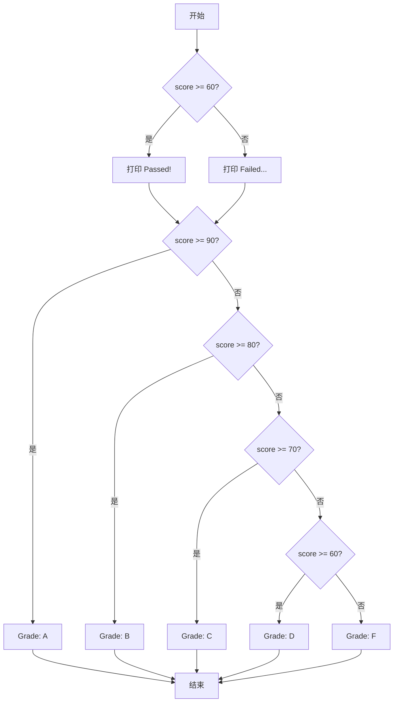
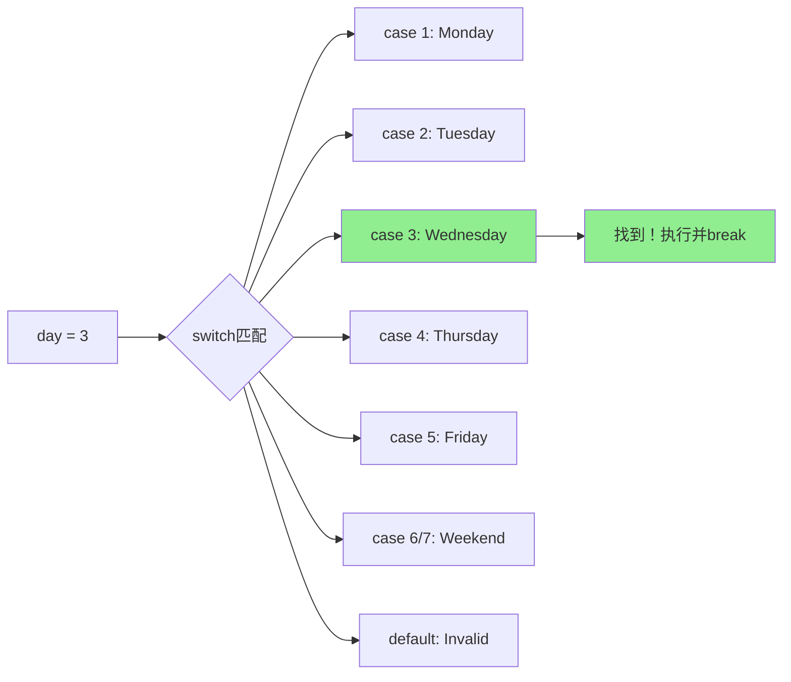
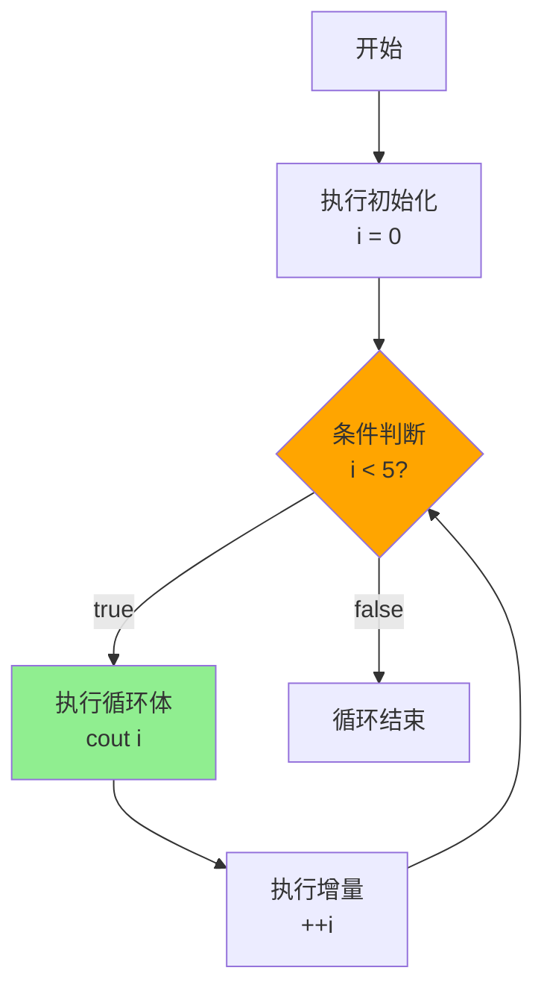
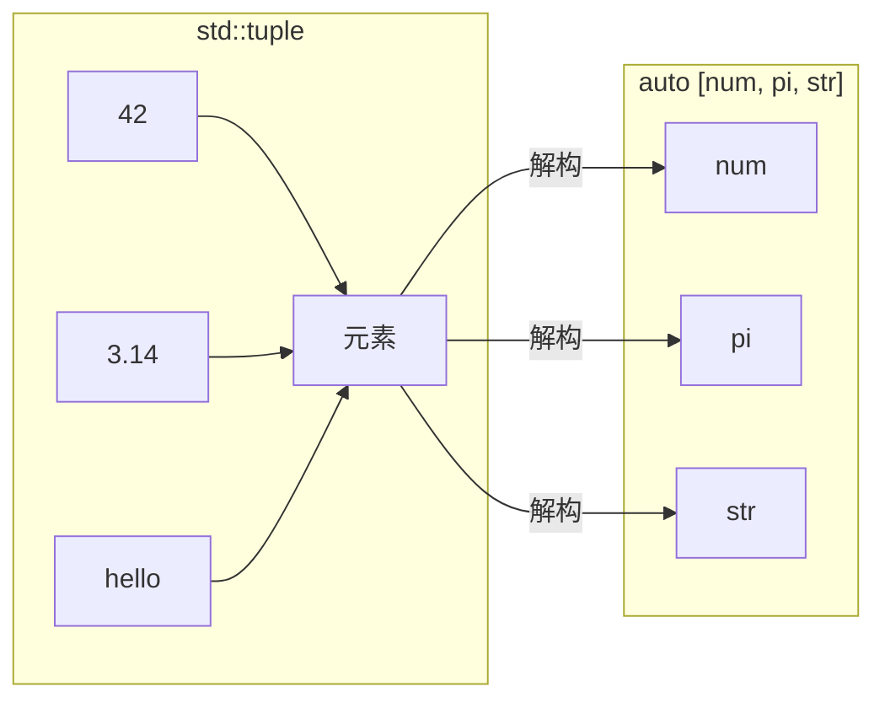

+++
title = "第6章 流程控制"
weight = 60
date = "2026-03-29T21:03:00+08:00"
type = "docs"
description = ""
isCJKLanguage = true
draft = false
+++
# 第6章 流程控制

> 📚 流程控制，听起来像是"控制水流"的科学术语，但在编程世界里，它是控制程序执行顺序的神秘力量。没有流程控制，你的程序就像一杯白开水——按顺序流过每一条语句，平淡无奇。有了它，你的程序就能像苏打水一样：跳跃、选择、循环，精彩纷呈！

想象一下，如果人生也有流程控制语句，我们就可以这样：

```cpp
if (has_money) {
    buy_ice_cream();
} else {
    eat_air();  // 闻闻也是极好的
}
```

好，让我们正式开始这场"控制欲"的冒险！

## 6.1 条件语句

> 💡 条件语句是程序的"十字路口"，让程序学会"看情况办事"。就像你妈说的："如果你考100分，就买玩具；否则……我们聊聊人生。"

### if-else语句

`if`语句是C++中最基础的条件判断结构。它的名字来源于英文单词"if"（如果），简直直白到不能再直白了。编译器内心OS："你直接告诉我什么时候干什么不就好了？"

**语法长这样：**

```cpp
if (条件表达式) {
    // 条件为true时执行的代码
}
// 或者搭配else
if (条件) {
    // 做这个
} else {
    // 否则做这个
}
// 更可以链式调用
if (条件1) {
} else if (条件2) {
} else {
}
```

**代码示例：**

```cpp
#include <iostream>

int main() {
    int score = 85;  // 假设这是考试成绩，满分100
    
    // 基础if：单挑一个条件
    if (score >= 60) {
        std::cout << "Passed!" << std::endl;  // 输出: Passed!
    }
    
    // if-else：二元选择，非此即彼
    if (score >= 90) {
        std::cout << "Grade: A" << std::endl;
    } else {
        std::cout << "Grade: Not A" << std::endl;  // 输出: Grade: Not A
    }
    
    // if-else if-else链：多选题来了
    if (score >= 90) {
        std::cout << "Grade: A" << std::endl;
    } else if (score >= 80) {
        std::cout << "Grade: B" << std::endl;  // 输出: Grade: B (85分在这里!)
    } else if (score >= 70) {
        std::cout << "Grade: C" << std::endl;
    } else if (score >= 60) {
        std::cout << "Grade: D" << std::endl;
    } else {
        std::cout << "Grade: F" << std::endl;  // 啊哦，不及格
    }
    
    // 嵌套if：条件里面还有条件，像套娃一样
    int age = 25;
    bool has_ticket = true;
    
    if (age >= 18) {  // 第一层：年龄够吗？
        if (has_ticket) {  // 第二层：有票吗？
            std::cout << "Welcome to the concert!" << std::endl;
            // 输出: Welcome to the concert!（双重喜悦）
        } else {
            std::cout << "You need a ticket." << std::endl;  // 票呢？
        }
    } else {
        std::cout << "You must be 18+." << std::endl;  // 太年轻，等等吧
    }
    
    return 0;
}
```

**运行结果：**

```
Passed!
Grade: Not A
Grade: B
Welcome to the concert!
```

> 🔍 **小贴士**：if语句的小括号里放的是**布尔表达式**，也就是结果只有`true`或`false`的表达式。别在里面放个`int`就说"我判断了"——编译器会报错的，它可不是那么好糊弄的。

**流程图助理解：**



### switch-case语句

当你的if-else链长得像方便面一样，一节又一节没完没了的时候，`switch`语句就是你的救星！它专门用来处理**离散值**的比较，就像根据星期几安排不同的菜单。

**什么是离散值？** 就是那些"非此即彼"的值，比如：整数、字符、枚举。浮点数？抱歉，我们不约。

**语法：**

```cpp
switch (表达式) {
    case 常量1:
        // 代码块1
        break;  // 别忘了break，否则会"贯穿"下去
    case 常量2:
        // 代码块2
        break;
    // ... 更多case
    default:
        // 上面都没匹配？走这里
        break;
}
```

> ⚠️ **重要警告**：每个case结尾如果没有`break`，代码会"穿越"到下一个case继续执行，这叫**贯穿（fall-through）**。有时候这是故意为之（比如周末两天做同样的事），但大多数时候，你会因此debug到怀疑人生。

**代码示例：**

```cpp
#include <iostream>

int main() {
    int day = 3;  // 假设3代表星期三
    
    switch (day) {
        case 1:
            std::cout << "Monday" << std::endl;
            break;
        case 2:
            std::cout << "Tuesday" << std::endl;
            break;
        case 3:
            std::cout << "Wednesday" << std::endl;  // 输出: Wednesday
            break;
        case 4:
            std::cout << "Thursday" << std::endl;
            break;
        case 5:
            std::cout << "Friday" << std::endl;
            break;
        case 6:
        case 7:  // 哇哦，周末两天干同样的事！
            std::cout << "Weekend!" << std::endl;  // case 6和7共用代码
            break;
        default:
            std::cout << "Invalid day" << std::endl;  // 非法日期
            break;
    }
    
    // switch与枚举配合（经典用法）
    enum Color { RED = 1, GREEN, BLUE };  // 枚举，从1开始（RED=1），GREEN=2, BLUE=3
    Color c = GREEN;  // 当前颜色是绿色
    
    switch (c) {
        case RED:
            std::cout << "Color is Red" << std::endl;
            break;
        case GREEN:
            std::cout << "Color is Green" << std::endl;  // 输出: Color is Green
            break;
        case BLUE:
            std::cout << "Color is Blue" << std::endl;
            break;
    }
    
    return 0;
}
```

**运行结果：**

```
Wednesday
Color is Green
```

> 💡 **枚举和switch是绝配**：枚举类型的值是有限的、确定的，非常适合switch-case的结构。编译器甚至可以检查你是否覆盖了所有枚举值（如果有遗漏会警告你）。

**switch工作原理图解：**



### if初始化语句（C++17）

终于！C++17带来了一个革命性的功能——**if语句的初始化**。这简直是**作用域控制**的终极武器！

**痛点在哪？** 想象一下这个场景：

```cpp
// 传统写法：变量在if外面定义
std::map<std::string, int>::iterator it = mymap.find(key);
if (it != mymap.end()) {
    // 使用it...
}
// 问题来了：it还活着！作用域太大，可能被误用
```

**C++17的解决方案：**

```cpp
// C++17写法：变量作用域被限制在if内
if (auto it = mymap.find(key); it != mymap.end()) {
    // it只在这里存在，安全！
}
// 出了if，it就"死"了，想误用？没门！
```

**代码示例：**

```cpp
#include <iostream>
#include <optional>  // C++17引入的可空类型

int main() {
    // C++17: if语句可以带初始化
    // 传统写法：变量在if外面定义，作用域太大
    // std::map<std::string, int>::iterator it = mymap.find(key);
    // if (it != mymap.end()) { ... }
    
    // C++17写法：变量作用域被限制在if内
    std::optional<int> opt = 42;  // optional就像一个"可能存在"的盒子
    
    // 语法：if (初始化; 条件)
    if (auto ptr = opt; ptr.has_value()) {  // ptr在if内部定义，作用域限于此处
        std::cout << "Value: " << *ptr << std::endl;  // 输出: Value: 42
    }
    
    // 更实际例子：从map中查找
    // std::map<std::string, int> scores = {{"Alice", 90}, {"Bob", 85}};
    // if (auto it = scores.find("Alice"); it != scores.end()) {
    //     std::cout << "Alice's score: " << it->second << std::endl;
    // }
    
    // if-else with init (C++17)
    // 先初始化x=10，然后判断x>5
    if (int x = 10; x > 5) {
        std::cout << "x = " << x << " (x initialized in if)" << std::endl;
        // 输出: x = 10 (x initialized in if)
    }
    // 出了这个if，x就不存在了！
    
    return 0;
}
```

> 🎯 **为什么要用if初始化？**
> 1. **作用域隔离**：变量不会泄露到if外面，避免命名污染
> 2. **代码更紧凑**：相关操作（初始化+判断）放在一起，逻辑更清晰
> 3. **配合optional/pair使用**：从函数返回状态和值，一次性提取+判断

### switch初始化语句（C++17）

既然if可以初始化，那switch凭什么不行？C++17一视同仁！

**代码示例：**

```cpp
#include <iostream>

int main() {
    // C++17: switch也支持初始化
    // 语法：switch (初始化; 表达式)
    // auto [type, value] = getSomeValue();
    // switch (type) { ... }
    
    // 典型场景：基于某个变量执行操作，但变量作用域要限制
    // lambda表达式：定义一个返回pair的函数
    auto getState = []() -> std::pair<int, int> {
        return {1, 100};  // 返回type=1, value=100
    };
    
    // 语法：switch (auto [变量...] = 初始化表达式; 表达式)
    switch (auto [type, value] = getState(); type) {
        case 1:
            std::cout << "State 1 with value: " << value << std::endl;
            // 输出: State 1 with value: 100
            break;
        case 2:
            std::cout << "State 2" << std::endl;
            break;
        default:
            std::cout << "Unknown state" << std::endl;
            break;
    }
    // type和value的作用域被限制在switch内！
    
    return 0;
}
```

> 📝 **注意**：`switch`的初始化语法和`if`一样，都是`switch (初始化; 表达式)`。这样可以确保中间变量的作用域仅限于switch内部，不会污染外层作用域。

## 6.2 循环语句

> 🔄 循环是编程的灵魂——它让你对重复性工作说"退下，让我来"。想象一下要你写1000次`std::cout << "Hello"`——没有循环的话，你的手指会先于电脑崩溃。

### for循环

`for`循环是C++中最常用的循环结构，特别适合**已知迭代次数**的场景。它的三个部分（初始化、条件、增量）像一首完美的三段式诗歌。

**语法：**

```cpp
for (初始化; 条件判断; 增量) {
    // 循环体
}
```

**三个部分的分工：**
- **初始化**：只在循环开始时执行一次，通常用于定义循环变量
- **条件判断**：每次迭代前都要检查，为true才执行循环体
- **增量**：每次循环体执行完后执行，通常用于更新循环变量

**代码示例：**

```cpp
#include <iostream>

int main() {
    // 传统for循环：init; condition; increment
    // 这大概是C++中使用频率最高的代码模式了
    for (int i = 0; i < 5; ++i) {
        std::cout << "i = " << i << std::endl;
        // 输出: i = 0, i = 1, i = 2, i = 3, i = 4
    }
    
    // for循环的三个部分都可以省略（但分号不能省）
    // 这其实就是while循环的另一种写法
    int count = 0;
    for (; count < 3;) {  // 没有init，没有increment
        std::cout << "count = " << count << std::endl;  // 输出: count = 0, 1, 2
        ++count;  // 手动在循环体里递增
    }
    
    // 多变量循环：同时控制两个变量
    for (int i = 0, j = 10; i < j; ++i, --j) {  // i从0往上涨，j从10往下降
        std::cout << "i=" << i << ", j=" << j << std::endl;
        // 输出: i=0, j=10; i=1, j=9; i=2, j=8; i=3, j=7; i=4, j=6
    }
    
    // 循环变量类型推导（C++11）
    // auto让编译器自动推断类型，这里推断为int
    for (auto i = 0; i < 3; ++i) {
        std::cout << "auto i = " << i << std::endl;  // 输出: auto i = 0, 1, 2
    }
    
    return 0;
}
```

**for循环执行流程图：**



> 🐛 **常见bug**：如果你不小心把`i < 5`写成了`i <= 5`，恭喜你，你的循环会多执行一次，i会从0到5共6次。差一个等号，天壤之别！

### while循环

`while`循环是**先判断后执行**的循环，就像"先看看有没有钱，再决定买不买"。如果条件一开始就不满足，循环体可能一次都不执行。

**语法：**

```cpp
while (条件) {
    // 循环体
    // 记得在某个地方修改条件相关的变量，否则就是死循环！
}
```

**代码示例：**

```cpp
#include <iostream>

int main() {
    // while循环：先判断条件再执行
    int i = 0;
    while (i < 5) {  // 先问：i小于5吗？
        std::cout << "while: i = " << i << std::endl;  // 输出: while: i = 0, 1, 2, 3, 4
        ++i;  // 每次循环把i加1
    }
    
    // 典型用法：直到满足某个条件才停止
    // 比如：验证密码
    int password;
    password = 12345;  // 假设这是用户输入
    while (password != 0) {  // 假设0是退出码
        // 模拟用户输入检查
        if (password == 12345) {
            std::cout << "Correct password!" << std::endl;  // 输出: Correct password!
            break;  // 密码对了，跳出循环
        }
        break;  // 防止无限循环（实际场景中会重新输入）
    }
    
    // 无限循环的两种写法（配合break使用）
    // while (true) { ... }
    // for (;;) { ... }
    
    // 使用break和continue控制循环
    int n = 0;
    while (n < 10) {
        ++n;  // 先递增
        if (n == 3 || n == 6) {
            continue;  // 跳过3和6，不打印
        }
        std::cout << "n = " << n << std::endl;
        // 输出: n = 1, n = 2, n = 4, n = 5, n = 7, n = 8, n = 9, n = 10 (跳过3和6)
        if (n >= 10) break;  // 大于等于10就退出
    }
    
    return 0;
}
```

> ⚠️ **死循环警告**：如果循环体里没有修改判断条件相关的变量，循环会永远继续下去。这就是著名的**死循环**或**无限循环**。有时候无限循环是故意的（比如服务器程序），但大多数时候，它是你debug清单上的常客。

### do-while循环

`do-while`是while的表亲，但性格迥异——它是**先斩后奏**的类型，先执行一次循环体，再判断条件。这确保了循环体**至少执行一次**。

**什么时候用？** 当你需要"不管怎样先干一次再说"的场景，比如：
- 显示菜单（至少显示一次）
- 获取用户输入（至少获取一次）
- 游戏主循环（至少运行一次）

**语法：**

```cpp
do {
    // 循环体（至少执行一次）
} while (条件);  // 别忘了分号！
```

**代码示例：**

```cpp
#include <iostream>

int main() {
    // do-while：先执行一次再判断条件
    // 保证循环体至少执行一次！
    
    int guess = 0;
    int secret = 42;  // 神秘的数字
    
    do {
        std::cout << "Enter your guess (0 to quit): ";
        guess = 41;  // 模拟用户输入（故意猜错一次）
        if (guess == 0) {
            std::cout << "Quitting..." << std::endl;
            break;  // 退出程序
        }
        if (guess == secret) {
            std::cout << "You got it!" << std::endl;  // 输出: You got it!
            break;  // 猜对了！
        }
        std::cout << "Try again!" << std::endl;  // 猜错了，再来
    } while (guess != 0 && guess != secret);  // 条件判断在这里
    
    // 典型场景：用户菜单
    char choice;
    do {
        std::cout << "\nMenu: (a)dd, (s)ubtract, (q)uit: ";
        choice = 'a';  // 模拟输入
        switch (choice) {
            case 'a':
                std::cout << "Addition selected" << std::endl;  // 输出: Addition selected
                break;
            case 's':
                std::cout << "Subtraction selected" << std::endl;
                break;
            case 'q':
                std::cout << "Quit" << std::endl;  // 输出: Quit
                break;
        }
    } while (choice != 'q');  // 用户选择q才退出
    
    return 0;
}
```

> 💡 **小技巧**：注意do-while结尾的分号`while(条件);`——这是新手最容易忘记的！忘记了编译器会报一个莫名其妙的错误。

### 范围for循环（C++11）

范围for（range-based for）是C++11引入的语法糖，专门用来遍历容器或数组。它让"遍历所有元素"这件事变得异常简洁。

**基本语法：**

```cpp
for (元素变量 : 容器) {
    // 使用元素
}
```

**四种变体：**
1. `for (T v : container)` — 拷贝遍历，不修改原元素
2. `for (T& v : container)` — 引用遍历，可以修改原元素
3. `for (const T& v : container)` — 常量引用，只读访问
4. `for (auto v : container)` — 自动类型推导，拷贝遍历

**代码示例：**

```cpp
#include <iostream>
#include <vector>
#include <array>
#include <map>

int main() {
    // 范围for：遍历容器或数组最简洁的方式
    std::vector<int> nums = {1, 2, 3, 4, 5};  // vector就像一个动态数组
    
    // 基础用法：逐个取出元素
    for (int n : nums) {
        std::cout << n << " ";  // 输出: 1 2 3 4 5
    }
    std::cout << std::endl;
    
    // 使用auto（C++11推荐）——让编译器自动推断类型
    for (auto n : nums) {
        std::cout << n << " ";  // 输出: 1 2 3 4 5
    }
    std::cout << std::endl;
    
    // 使用auto&修改元素（引用）——这样可以改原始数据
    for (auto& n : nums) {
        n *= 2;  // 每个元素翻倍
    }
    // 现在nums变成了{2, 4, 6, 8, 10}
    for (auto n : nums) {
        std::cout << n << " ";  // 输出: 2 4 6 8 10
    }
    std::cout << std::endl;
    
    // 使用const auto&只读访问——效率最高，不拷贝
    for (const auto& n : nums) {
        std::cout << n << " ";  // 输出: 2 4 6 8 10
    }
    std::cout << std::endl;
    
    // 遍历数组（C风格数组也可以）
    int arr[] = {10, 20, 30, 40, 50};
    for (auto element : arr) {
        std::cout << element << " ";  // 输出: 10 20 30 40 50
    }
    std::cout << std::endl;
    
    // 遍历初始化列表（C++11）——直接用花括号的值
    for (auto x : {1, 2, 3, 4, 5}) {
        std::cout << x << " ";  // 输出: 1 2 3 4 5
    }
    std::cout << std::endl;
    
    // 遍历map（键值对）
    std::map<std::string, int> scores = {{"Alice", 90}, {"Bob", 85}};
    for (const auto& [name, score] : scores) {  // 结构化绑定 C++17
        std::cout << name << ": " << score << std::endl;
        // 输出: Alice: 90
        //       Bob: 85
    }
    
    return 0;
}
```

> 🚀 **性能提示**：如果只是读取元素，用`const auto&`；如果要修改，用`auto&`；只有极少数情况才用`auto`（拷贝）。这样可以避免不必要的拷贝，提升性能。

### 范围for初始化器生命周期扩展（C++23）

C++23让范围for也支持初始化了！之前如果你想在for循环内部初始化一个临时容器，必须借助一些奇技淫巧。现在，直接在for里写就行了！

**代码示例：**

```cpp
#include <iostream>
#include <vector>

int main() {
    // C++23: 范围for可以带初始化
    // 之前需要在for外面定义变量
    
    // 模拟一个返回vector的函数
    std::vector<int> getData() {
        return {1, 2, 3, 4, 5};
    }
    
    // C++23写法：变量在for内部初始化，作用域被限制
    for (auto vec = getData(); auto& v : vec) {
        std::cout << v << " ";  // 输出: 1 2 3 4 5
    }
    std::cout << std::endl;
    
    // 好处：vec的作用域被限制在for内，不会污染外层作用域
    // for循环结束后，vec就被销毁了，不占用额外内存
    // 这是RAII（资源获取即初始化）理念的延续
    
    return 0;
}
```

> 💡 **作用域控制**：C++23的范围for初始化器和C++17的if/switch初始化器是同一个思路——把变量的生命周期限制在最小范围内，需要用的时候才创建，用完就销毁。

## 6.3 跳转语句

> 🏃‍♂️ 跳转语句是程序世界的"瞬移术"，让你的代码可以从一个地方突然跳到另一个地方。它们是控制流程的"快捷键"，但使用不当也会成为debug的噩梦。

### break

`break`意为"中断"，在循环或switch中用于**立即跳出**最近的包围层。想象一下你在循环里找东西，找到了就别再继续找了，用break！

**代码示例：**

```cpp
#include <iostream>

int main() {
    // break：跳出最近的循环或switch
    
    // 在for循环中：找到目标就退出
    for (int i = 0; i < 10; ++i) {
        if (i == 5) {  // 找到5就停止
            std::cout << "Breaking at i=5" << std::endl;  // 输出: Breaking at i=5
            break;  // 跳出循环，不再继续
        }
        std::cout << "i = " << i << std::endl;  // 输出: i = 0, 1, 2, 3, 4
    }
    
    std::cout << "After for loop" << std::endl;  // 输出: After for loop
    
    // 在while循环中：配合无限循环实现"直到..."
    int count = 0;
    while (true) {  // 无限循环，靠break退出
        ++count;
        if (count > 5) {
            std::cout << "count exceeded 5" << std::endl;  // 输出: count exceeded 5
            break;  // 条件满足，跳出
        }
    }
    
    // 在嵌套循环中：break只跳出**内层**循环
    // 外层循环继续执行
    for (int i = 0; i < 3; ++i) {
        for (int j = 0; j < 5; ++j) {
            if (j == 2) {
                break;  // 只跳出内层for j，外层i继续
            }
            std::cout << "(" << i << "," << j << ") ";
        }
        std::cout << std::endl;
        // 输出:
        // (0,0) (0,1)
        // (1,0) (1,1)
        // (2,0) (2,1)
    }
    
    return 0;
}
```

> 🔑 **关键点**：break只跳出一层循环。如果你在双层嵌套中想让break同时跳出两层，需要用`goto`或者其他控制结构。

### continue

`continue`意为"继续"，用于跳过本次循环剩余部分，直接进入下一次迭代。和break不同，continue不会退出循环，只是"这次就这样吧，下一个"。

**适用场景：**
- 跳过某些特定值
- 过滤数据
- "我不想要这个，继续找下一个"

**代码示例：**

```cpp
#include <iostream>

int main() {
    // continue：跳过本次循环剩余部分，继续下一次迭代
    
    // 跳过所有偶数，只打印奇数
    for (int i = 0; i < 10; ++i) {
        if (i % 2 == 0) {  // i是偶数？
            continue;  // 跳过，不打印
        }
        std::cout << i << " ";  // 输出: 1 3 5 7 9
    }
    std::cout << std::endl;
    
    // 跳过列表中的特定值
    // 比如：计算平均分，但跳过缺考（成绩为0的）
    int scores[] = {95, 0, 88, 0, 92, 100};
    int sum = 0, count = 0;
    
    for (int s : scores) {
        if (s == 0) {
            continue;  // 跳过缺考，不计入平均分
        }
        sum += s;
        ++count;
    }
    
    std::cout << "Average: " << (sum / count) << std::endl;  // 输出: Average: 93
    
    // 在while中的应用
    int n = 0;
    while (n < 10) {
        ++n;
        if (n == 3) {
            continue;  // 跳过3，但不退出循环
        }
        if (n > 7) {
            break;  // 大于7就真的退出了
        }
        std::cout << "n = " << n << std::endl;
        // 输出: n = 1, n = 2, n = 4, n = 5, n = 6, n = 7
    }
    
    return 0;
}
```

> ⚠️ **小心陷阱**：在while循环中使用continue要注意！如果continue在递增计数器之后，可能没问题；但如果在递增之前，可能会导致跳过了递增，造成死循环。

### return

`return`语句用于**从函数返回**。如果当前函数是`main`，return就是**结束程序**。它是跳转语句中最"彻底"的一个——直接结束整个函数，不留一丝情面。

**代码示例：**

```cpp
#include <iostream>

// 函数：返回两个数中的较大值
int max(int a, int b) {
    return (a > b) ? a : b;  // 返回较大值
}

// 函数：判断是否正数
bool isPositive(int x) {
    return x > 0;  // 返回bool类型
}

// 函数：打印并返回（void表示无返回值）
void printAndReturn(int x) {
    std::cout << "x = " << x << std::endl;  // 输出: x = 42
    return;  // 无返回值可以省略return，但这里写出来也没问题
}

int main() {
    int m = max(10, 20);
    std::cout << "max(10, 20) = " << m << std::endl;  // 输出: max(10, 20) = 20
    
    bool pos = isPositive(5);
    std::cout << "isPositive(5) = " << pos << std::endl;  // 输出: isPositive(5) = 1
    
    printAndReturn(42);  // 输出: x = 42
    
    // 提前返回：从main函数退出
    for (int i = 0; i < 10; ++i) {
        if (i == 7) {
            std::cout << "Found 7, returning from main!" << std::endl;
            return 0;  // 退出程序，返回0表示正常结束
        }
    }
    
    return 0;  // 这行永远不会执行到，因为上面的return会先执行
}
```

> 💡 **main函数的return值**：返回0表示程序正常结束，非0表示异常结束。这是给操作系统看的，不是给你自己看的。在C++98中，如果main末尾没有return，编译器会自动加上`return 0;`。

### goto

`goto`是最古老也最有争议的跳转语句。它可以跳转到**同一个函数内**的任何标签位置。因为太"自由"了，容易导致"意大利面条式代码"，所以名声不太好。

**但goto也有合法的用途：**
1. **跳出多层嵌套循环**：break只能跳出一层，goto可以直接跳到最外层
2. **统一的错误处理入口**：多个错误路径统一跳到清理代码

**代码示例：**

```cpp
#include <iostream>

int main() {
    // goto：跳转到标签位置（不推荐，但有些场景有用）
    // 现代C++中几乎可以用更好的结构替代
    
    int i = 0;
    
    loop_start:  // 定义标签（后面跟冒号）
    if (i < 5) {
        std::cout << "i = " << i << std::endl;  // 输出: i = 0, 1, 2, 3, 4
        ++i;
        goto loop_start;  // 跳转到loop_start标签
    }
    
    std::cout << "goto loop ended" << std::endl;  // 输出: goto loop ended
    
    // goto的合法用途：跳出多层嵌套循环
    for (int i = 0; i < 3; ++i) {
        for (int j = 0; j < 3; ++j) {
            if (i == 1 && j == 1) {
                std::cout << "Breaking out from double loop!" << std::endl;
                // 输出: Breaking out from double loop!
                goto exit_loops;  // goto是跳出多层循环的唯一直接方式
            }
        }
    }
    
    exit_loops:  // 标签定义
    std::cout << "Exited both loops" << std::endl;  // 输出: Exited both loops
    
    // 另一个合法用途：错误处理（资源清理）
    // 想象场景：分配了内存，然后多个地方可能出错
    // int* ptr = nullptr;
    // goto cleanup;  // 从多个错误路径统一跳到清理代码
    // ...
    // cleanup:
    // delete ptr;  // 统一清理
    
    return 0;
}
```

> 📖 **历史趣闻**：`goto`语句在1968年就被Edsger Dijkstra大牛喷过，他的论文"Go To Statement Considered Harmful"直接导致大家谈goto色变。但在某些特定场景下（如跳出多层循环），它确实是最简洁的解决方案。保守派可以用标志变量替代，但代码会繁琐一些。

### 复合语句末尾的标签（C++23）

C++23带来了一个看似奇怪但实则有道理的特性：**可以在复合语句（代码块）的末尾放置标签**。这主要是为了代码可读性，让goto的跳转目标更清晰。

**代码示例：**

```cpp
#include <iostream>

int main() {
    // C++23: 可以在复合语句（代码块）末尾放置标签
    // 用于增强代码可读性，特别是在处理错误或清理时
    
    // 旧写法（有点怪）：
    // cleanup:
    // {
    //     // 清理代码
    // }
    
    // C++23写法（更自然）：
    {
        int* data = new int[100];  // 分配内存
        bool error = false;
        
        if (error) {
            // 跳到块的末尾清理
            goto block_end;  // C++23可以在复合语句末尾放标签
        }
        
        // 正常使用数据...
        
    block_end:  // C++23: 标签在复合语句末尾，看起来更自然
        delete[] data;  // 释放内存
        std::cout << "Cleanup done" << std::endl;  // 输出: Cleanup done
    }
    
    return 0;
}
```

> 💡 **为什么有用？**：当你使用goto做错误处理时，跳转目标通常是"清理代码"。旧写法中标签在清理代码前面，C++23允许把标签放在清理代码所在的代码块末尾，逻辑上更顺畅。

## 6.4 结构化绑定（C++17）

> 🎁 结构化绑定是C++17最受欢迎的特性之一！它让你可以用一个语句同时解构多个变量，就像拆快递一样——一个包裹里有多个宝贝，一次性全拿出来！

### 结构化绑定基础

结构化绑定（Structured Bindings）让你用`auto [a, b, c] = expression`的形式，同时绑定多个变量。绑定的对象可以是：
- **数组**
- **`std::pair`**
- **`std::tuple`**
- **结构体**

**代码示例：**

```cpp
#include <iostream>
#include <vector>
#include <map>
#include <tuple>

int main() {
    // 结构化绑定：让你用多个变量同时绑定到组合值
    
    // 绑定数组
    int arr[] = {1, 2, 3};
    auto [a, b, c] = arr;  // C++17特性，一次解构三个元素
    std::cout << "a=" << a << ", b=" << b << ", c=" << c << std::endl;
    // 输出: a=1, b=2, c=3
    
    // 绑定std::pair
    std::pair<std::string, int> person = {"Alice", 25};
    auto [name, age] = person;  // pair有两个元素，正好对应两个变量
    std::cout << name << " is " << age << " years old" << std::endl;
    // 输出: Alice is 25 years old
    
    // 绑定std::tuple
    std::tuple<int, double, std::string> data = {42, 3.14, "hello"};
    auto [num, pi, str] = data;  // tuple有三个元素，对应三个变量
    std::cout << num << " " << pi << " " << str << std::endl;
    // 输出: 42 3.14 hello
    
    // 绑定结构体
    struct Point {
        double x;
        double y;
    };
    Point pt = {3.0, 4.0};
    auto [px, py] = pt;  // 结构体的成员对应各个绑定变量
    std::cout << "Distance from origin: " << (px*px + py*py) << std::endl;
    // 输出: Distance from origin: 25
    
    return 0;
}
```

> 🎯 **使用场景**：
> - 函数返回多个值时
> - 遍历map的键值对
> - 解析复杂的组合数据
> - 让代码更清晰，避免"first.second"这种嵌套访问

**结构化绑定原理图：**



### 结构化绑定属性（C++26）

C++26正在讨论为结构化绑定添加属性的支持。这个提案允许你在绑定的变量上添加属性，比如`[[deprecated]]`。

**代码示例：**

```cpp
#include <iostream>
#include <vector>

int main() {
    // C++26: 结构化绑定可以有属性
    // [[struct bind attrs...]] auto [vars...] = expression;
    
    // 之前：属性只能写在auto前面
    // [[deprecated]] auto [a, b] = pair;
    
    // C++26草案（可能）：在特定绑定上添加属性
    // auto [start [[deprecated]], end] = range;  // 标记start为废弃
    
    std::pair<int, int> range = {1, 10};
    
    // 演示现有C++17功能（目前属性只能放auto前面）
    [[maybe_unused]] auto [low, high] = range;  // 告诉编译器可能不用这个变量
    std::cout << "Range: [" << low << ", " << high << "]" << std::endl;
    // 输出: Range: [1, 10]
    
    // 注意：这个特性是C++26草案中的，具体语法可能变化
    // 正式标准发布前，请以最终规范为准
    
    return 0;
}
```

> 📚 **背景知识**：C++属性是一种标准化的注解机制，使用`[[...]]`语法。常见属性包括`[[nodiscard]]`、`[[maybe_unused]]`、`[[deprecated]]`等。C++26计划让属性可以更精细地应用到结构化绑定的各个变量上。

### 结构化绑定作为条件（C++26）

C++26草案还提出了一个有趣的特性：**让结构化绑定可以作为if或while的条件**。这样可以让"绑定+判断"一步到位。

**代码示例：**

```cpp
#include <iostream>
#include <optional>
#include <map>

int main() {
    // C++26: 结构化绑定可以作为if或while的条件
    // 之前需要在if外部先定义变量
    
    std::optional<int> opt = 42;  // optional可能有值，也可能没有
    
    // C++26之前：需要先绑定，再判断
    if (auto val = opt) {
        (void)val;  // 抑制未使用警告
    }
    
    // C++26（草案）：直接在if条件中结构化绑定
    // if (auto [val] = opt; val.has_value()) {  // 一行搞定绑定和判断
    //     std::cout << *val << std::endl;
    // }
    
    // 模拟map查找场景
    std::map<int, std::string> m = {{1, "one"}, {2, "two"}};
    
    // C++26可能支持的语法：
    // if (auto [it, success] = m.insert({3, "three"}); success) {
    //     std::cout << "Inserted" << std::endl;
    // }
    
    // 目前只能用传统方式
    auto result = m.insert({3, "three"});
    if (result.second) {
        std::cout << "Insert succeeded" << std::endl;  // 输出: Insert succeeded
    }
    
    return 0;
}
```

> 💡 **语法解释**：`if (auto [变量...] = 初始值表达式; 条件)`这种语法允许你在if的初始化部分进行结构化绑定，然后在条件判断中使用绑定的变量。这是C++17 if初始化语法的自然扩展。

### 结构化绑定引入包（C++26）

C++26草案还提出了"引入包（Introducing Packages）"的概念，允许将多个值组成一个"包"用于后续处理。这听起来有点抽象，但它可以解决一些现有结构化绑定的限制。

**代码示例：**

```cpp
#include <iostream>
#include <tuple>

int main() {
    // C++26（草案）: 结构化绑定可以引入"包"（package）
    // 允许将多个值绑定为一个"包"用于后续处理
    
    auto tuple = std::make_tuple(1, 2, 3, 4, 5);
    
    // 传统C++17：必须解构所有元素
    auto [a, b, c, d, e] = tuple;
    std::cout << a << b << c << d << e << std::endl;  // 输出: 12345
    
    // C++26草案可能支持（语法待定）：
    // auto pack = ...;  // 把多个值组成包
    // auto [...vars] = pack;  // 从包中提取
    // 这种语法允许更灵活地处理不定数量的元素
    
    // 目前这只是草案，具体语法可能变化
    // 以下是现有C++17/20的功能演示
    
    // 使用std::ignore丢弃不需要的元素
    // 当你只关心部分元素时，ignore是你的好帮手
    auto [first, second] = std::make_pair(100, 200);
    std::cout << "first=" << first << ", second=" << second << std::endl;
    // 输出: first=100, second=200
    
    return 0;
}
```

> 📖 **std::ignore**：在结构化绑定中，如果你不想接收某个位置的值，可以用`std::ignore`。比如`auto [a, std::ignore, c] = tuple;`会忽略第二个元素。

## 本章小结

> 🎉 恭喜你完成了流程控制的学习！让我们来回顾一下今天学到的"控制术"：

### 条件语句：程序的十字路口

| 语句 | 特点 | 使用场景 |
|------|------|----------|
| `if` | 基础条件判断 | 单个条件判断 |
| `if-else` | 二选一 | 两个互斥分支 |
| `if-else if-else` | 多选一 | 多个条件分支 |
| `switch` | 离散值匹配 | 枚举、整数、字符 |
| `if/switch + 初始化` | 作用域限制 | C++17起，限制变量生命周期 |

### 循环语句：重复的艺术

| 语句 | 特点 | 使用场景 |
|------|------|----------|
| `for` | 已知迭代次数 | 计数器循环 |
| `while` | 先判断后执行 | 未知迭代次数 |
| `do-while` | 先执行后判断 | 至少执行一次 |
| `范围for` | 遍历容器 | 数组、vector、map等 |
| `范围for + 初始化` | C++23新特性 | 限制临时对象作用域 |

### 跳转语句：程序界的瞬移

| 语句 | 作用 | 注意事项 |
|------|------|----------|
| `break` | 跳出当前循环/switch | 只跳出一层 |
| `continue` | 跳过本次迭代 | 继续下一次循环 |
| `return` | 结束函数 | main中结束程序 |
| `goto` | 任意跳转 | 慎用，可用于跳出多层循环 |

### 结构化绑定：打包解包的艺术（C++17）

结构化绑定让你用一个语句同时解构数组、pair、tuple或结构体：

```cpp
auto [a, b, c] = tuple;        // 解构tuple
auto [key, value] = mapPair;   // 解构pair
auto [x, y] = point;          // 解构结构体
```

### 黄金法则

> 📌 **能不用goto就不用goto** — 大多数情况下，更好的结构（函数提取、标志变量）可以替代它。
> 
> 📌 **break和continue要慎用** — 过多的跳转会让代码逻辑变得混乱，难以理解。
> 
> 📌 **优先使用范围for** — 遍历容器时，范围for更简洁、更安全。
> 
> 📌 **利用C++17的if/switch初始化** — 控制变量作用域是写出清晰代码的关键。

---

**课后思考题：**

1. 为什么`do-while`至少会执行一次，但`while`可能一次都不执行？
2. `break`和`continue`在嵌套循环中的行为有什么区别？
3. 结构化绑定和普通的逐个声明变量相比，有什么优势？
4. 如果要同时跳出三层嵌套的循环，有哪些方法？

> 🚀 下一章我们将学习**函数**，那是C++编程的真正核心！准备好继续冒险了吗？
