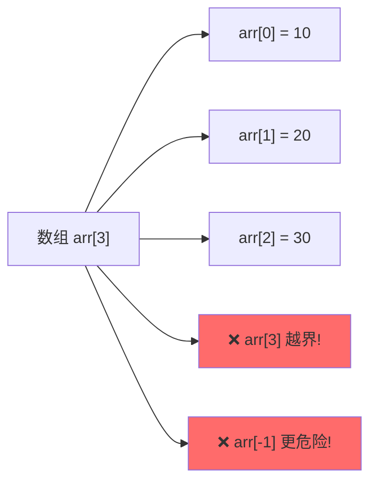
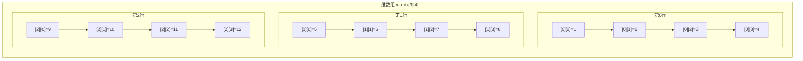

+++
title = "第7章 数组与字符串"
weight = 70
date = "2026-03-29T21:43:08+08:00"
type = "docs"
description = ""
isCJKLanguage = true
draft = false
+++

# 第7章 数组与字符串

想象一下，你是一名仓库管理员，现在有100个一模一样的盒子要装货。你会怎么管理？如果每个盒子都起个名字——"盒子一"、"盒子二"、"盒子三"...恭喜你，你已经理解了数组的精髓！只不过在编程世界里，我们叫它们"数组元素"，而你从1开始数，我们要从0开始数（别问为什么，问就是C语言的传统）。

## 7.1 一维数组的定义与使用

**数组**（Array）是一种**线性数据结构**，用于存储一组相同类型（Type）的元素，这些元素在内存中是**连续存储**的。想象成一排紧紧挨着的储物柜，每个柜子大小相同，按顺序编号。

```cpp
#include <iostream>

int main() {
    // 数组：一组相同类型元素的连续存储
    // 定义方式：type name[size];
    
    // 方式1：指定大小
    int scores[5];  // 未初始化，元素值是未定义的（垃圾值）
    int ages[5] = {18, 20, 22, 19, 21};  // 完全初始化
    int grades[5] = {90, 85};  // 部分初始化：{90, 85, 0, 0, 0}
    int values[] = {1, 2, 3, 4, 5};  // 编译器自动计算大小
    
    // 访问元素：下标从0开始！
    std::cout << "First score: " << ages[0] << std::endl;  // 输出: First score: 18
    std::cout << "Second score: " << ages[1] << std::endl;  // 输出: Second score: 20
    
    // 遍历数组
    std::cout << "All ages: ";
    for (int i = 0; i < 5; ++i) {
        std::cout << ages[i] << " ";  // 输出: 18 20 22 19 21
    }
    std::cout << std::endl;
    
    // 修改元素
    ages[2] = 23;
    std::cout << "Updated age[2] = " << ages[2] << std::endl;  // 输出: Updated age[2] = 23
    
    // 数组大小计算
    int count = sizeof(ages) / sizeof(ages[0]);
    std::cout << "Array size: " << count << std::endl;  // 输出: Array size: 5
    
    // C++11: 使用std::array（更安全）
    // std::array<int, 5> safer = {1, 2, 3, 4, 5};
    
    return 0;
}
```

> **小明的踩坑日记**：记得刚学数组时，小明兴冲冲地写了 `int arr[5] = {1,2,3,4,5};`，然后问："为什么 `arr[5]` 不能用啊？我明明定义了5个元素！"——老师笑而不语，在黑板上写下"0,1,2,3,4"。小明恍然大悟，原来自己的手指头是从1数到5，但程序员是从0数到5的另类物种。

### 数组越界问题

**数组越界**（Out of Bounds）是指访问数组时下标超出了有效范围 `[0, size)`。这是C/C++中最危险的操作之一，因为编译器通常**不会**检查越界，它只会默默地让你访问那块内存，然后你的程序可能会：
- 输出一堆乱码（正好读到别人的数据）
- 突然崩溃（踩到了受保护的内存）
- 莫名其妙地"改变"了其他变量的值（蝴蝶效应）

```cpp
#include <iostream>

int main() {
    int arr[3] = {10, 20, 30};
    
    // 数组下标越界：未定义行为！可能导致各种奇怪结果
    // std::cout << arr[3] << std::endl;  // 危险！访问了不属于数组的内存！
    // std::cout << arr[-1] << std::endl;  // 更危险！负索引！
    
    // 编译器通常不会检查数组越界
    // 必须自己保证下标在有效范围内 [0, size)
    
    // 安全做法：始终检查下标
    int index = 2;
    if (index >= 0 && index < 3) {
        std::cout << "arr[" << index << "] = " << arr[index] << std::endl;
        // 输出: arr[2] = 30
    } else {
        std::cout << "Invalid index!" << std::endl;
    }
    
    // 常见错误：使用<=而不是<
    // for (int i = 0; i <= 3; ++i) { ... }  // 错误！应该是 i < 3
    
    return 0;
}
```

> **经典段子**：程序员的卧室灯开关——"我家的灯有10种状态：0是关，1-9分别代表不同的亮度。哦对了，访问 `灯[10]` 的时候会发生什么？不知道，反正不是第11种亮度。"



### 数组退化

**数组退化**（Array Decay）是指数组名在大多数情况下会**隐式转换**为指向其第一个元素的**指针**（Pointer）。这意味着你以为是数组，实际上编译器把它当指针用了。这可是C/C++里让无数新手头疼的"隐形陷阱"！

```cpp
#include <iostream>

void printArray(int arr[], int size) {
    // 注意：数组作为函数参数时会"退化"成指针
    // int arr[] 等价于 int* arr
    // sizeof(arr) 在函数内得到的是指针大小，不是数组大小！
    std::cout << "Inside function - sizeof(arr) = " << sizeof(arr) << std::endl;
    // 输出: Inside function - sizeof(arr) = 8 (64位指针大小)
    
    for (int i = 0; i < size; ++i) {
        std::cout << arr[i] << " ";  // 输出: 10 20 30
    }
    std::cout << std::endl;
}

int main() {
    int arr[] = {10, 20, 30};
    int size = sizeof(arr) / sizeof(arr[0]);
    
    std::cout << "In main - sizeof(arr) = " << sizeof(arr) << std::endl;
    // 输出: In main - sizeof(arr) = 12 (3 * 4 bytes)
    
    printArray(arr, size);
    
    // 数组名arr退化为指针，指向第一个元素
    int* ptr = arr;
    std::cout << "arr[0] = " << arr[0] << ", ptr[0] = " << ptr[0] << std::endl;
    // 输出: arr[0] = 10, ptr[0] = 10
    
    std::cout << "*(arr+1) = " << *(arr+1) << ", *(ptr+1) = " << *(ptr+1) << std::endl;
    // 输出: *(arr+1) = 20, *(ptr+1) = 20
    
    return 0;
}
```

> **比喻时间**：数组退化就像把你的"整栋公寓"交给物业，物业却只给你一把"101室的钥匙"——他们假装整栋楼不存在，只记得第一间。这就是为什么 `sizeof(数组名)` 在函数里失效的原因。

## 7.2 多维数组

**多维数组**（Multidimensional Array）是数组的数组——对，你没看错，就是"数组里面有数组"。最常用的是二维数组，可以把它想象成**表格**或**矩阵**（Matrix）。

```cpp
#include <iostream>

int main() {
    // 多维数组：数组的数组
    // 定义：type name[d1][d2]...[dn];
    
    // 2D数组：矩阵
    int matrix[3][4] = {
        {1, 2, 3, 4},
        {5, 6, 7, 8},
        {9, 10, 11, 12}
    };
    
    // 访问元素
    std::cout << "matrix[1][2] = " << matrix[1][2] << std::endl;  // 第1行(0-based)第2列(0-based)的元素 = 7
    
    // 遍历2D数组
    std::cout << "Matrix:" << std::endl;
    for (int i = 0; i < 3; ++i) {
        for (int j = 0; j < 4; ++j) {
            std::cout << matrix[i][j] << "\t";
        }
        std::cout << std::endl;
        // 输出:
        // 1	2	3	4
        // 5	6	7	8
        // 9	10	11	12
    }
    
    // 部分初始化
    int sparse[3][3] = {{1}, {0, 2}, {0, 0, 3}};
    std::cout << "Sparse matrix[2][2] = " << sparse[2][2] << std::endl;  // 输出: Sparse matrix[2][2] = 3
    
    // 3D数组
    int cube[2][3][4];  // 2层，每层3行4列
    
    // C++11: 使用std::array更安全
    // std::array<std::array<int, 4>, 3> modernMatrix = {{...}};
    
    return 0;
}
```



> **生活类比**：多维数组就像Excel表格。`matrix[3][4]` 就是一个3行4列的表格。`matrix[1][2]` 就是第2行第3列的那个格子。记住了，**行在前，列在后**，别搞反了，不然你就从"表格达人"变成"表格大冤种"了。

## 7.3 数组与指针的关系

C/C++中，**指针**（Pointer）和**数组**（Array）的关系剪不断理还乱。数组名可以退化成指针，指针可以像数组一样用下标访问。它们的关系，大概就是"虽然不是同一个东西，但长得一模一样"。

```cpp
#include <iostream>

int main() {
    int arr[] = {10, 20, 30, 40, 50};
    int* ptr = arr;  // 数组名退化为指针，指向第一个元素
    
    // 指针算术
    std::cout << "*ptr = " << *ptr << std::endl;  // 输出: *ptr = 10
    std::cout << "*(ptr + 1) = " << *(ptr + 1) << std::endl;  // 输出: *(ptr + 1) = 20
    
    // 数组下标与指针运算等价
    std::cout << "ptr[2] = " << ptr[2] << std::endl;  // 输出: ptr[2] = 30
    std::cout << "*(arr + 2) = " << *(arr + 2) << std::endl;  // 输出: *(arr + 2) = 30
    
    // 指针间距
    int* p1 = &arr[0];
    int* p2 = &arr[3];
    std::cout << "p2 - p1 = " << (p2 - p1) << std::endl;  // 输出: p2 - p1 = 3
    
    // 遍历数组的两种方式
    std::cout << "Method 1 (index): ";
    for (int i = 0; i < 5; ++i) {
        std::cout << arr[i] << " ";  // 输出: 10 20 30 40 50
    }
    std::cout << std::endl;
    
    std::cout << "Method 2 (pointer): ";
    for (int* p = arr; p < arr + 5; ++p) {
        std::cout << *p << " ";  // 输出: 10 20 30 40 50
    }
    std::cout << std::endl;
    
    // 指针数组 vs 数组指针
    int* ptrArr[3];  // 指针数组：3个int*组成的数组
    int (*arrPtr)[5] = &arr;  // 数组指针：指向包含5个int的数组的指针
    
    // 数组指针的价值：用指针遍历整个数组
    std::cout << "Via arrPtr: ";
    for (int i = 0; i < 5; ++i) {
        std::cout << (*arrPtr)[i] << " ";  // 等价于 arr[i]
    }
    std::cout << std::endl;
    // 输出: Via arrPtr: 10 20 30 40 50
    
    // 注意：arrPtr 和 ptr（普通指针）值不同
    std::cout << "arrPtr = " << arrPtr << ", *arrPtr = " << *arrPtr << std::endl;
    // arrPtr 是指向整个数组的指针，*arrPtr 是数组本身（参与运算时退化为指向首元素的指针）
    
    return 0;
}
```

> **记忆口诀**：`int* ptr[3]` —— `ptr` 先跟 `[3]` 在一起，所以是"数组"，数组里装的是 `int*`（指针），所以是**指针数组**。
>
> `int (*ptr)[5]` —— `ptr` 先跟 `*` 在一起，然后再跟 `[5]` 在一起，所以是"指针"，指针指向的是 `[5]` 个 `int` 的数组，所以是**数组指针**。
>
> 括号的位置决定了一切！这就像"我（爱）吃苹果"和"我爱（吃苹果）"的区别一样微妙。

### 现代替代：`std::span`（C++20）

如果说数组退化是历史遗留问题，那 `std::span`（C++20）就是来解决这个问题的。它是一个轻量级**非拥有型**视图，可以看作"带边界的指针"——既有指针的灵活，又有数组的大小信息。

```cpp
#include <iostream>
#include <span>

void printSpan(std::span<int> data) {
    // span 知道自己的大小，不会退化！
    std::cout << "span size: " << data.size() << std::endl;
    for (int i = 0; i < data.size(); ++i) {
        std::cout << data[i] << " ";
    }
    std::cout << std::endl;
}

int main() {
    int arr[] = {10, 20, 30, 40, 50};
    
    // 传入数组，自动推断大小
    printSpan(arr);  // 输出: span size: 5, 10 20 30 40 50
    
    // 也可以传入 std::array 或 std::vector
    std::cout << "First: " << std::span(arr).first(3)[0] << std::endl;  // 10
    std::cout << "Last: " << std::span(arr).last(2)[1] << std::endl;   // 50
    
    return 0;
}
```

> **要点总结**：优先使用 `std::span` 代替在函数参数中使用数组类型 `T arr[]`——前者不会退化，后者会变成指针丢失大小信息。当然，`std::span` 也不拥有数据，记得确保数据生命周期。

## 7.4 C风格字符串（字符数组）

**C风格字符串**（C-style String）是C语言留下的"祖传手艺"——本质上就是以**空字符** `'\0'` 结尾的**字符数组**（Character Array）。这个名字听起来很古典，用起来也很古典，bug也很古典。

### 字符串操作陷阱

```cpp
#include <iostream>
#include <cstring>  // strlen, strcpy, strcmp

int main() {
    // C风格字符串：以'\0'（空字符）结尾的char数组
    
    // 定义方式
    const char* s1 = "Hello";  // 字符串常量，指针形式
    char s2[] = {'H', 'e', 'l', 'l', 'o', '\0'};  // 字符数组形式
    char s3[] = "World";  // 简写形式，自动加'\0'
    
    std::cout << "s1 = " << s1 << std::endl;  // 输出: s1 = Hello
    std::cout << "s2 = " << s2 << std::endl;  // 输出: s2 = Hello
    std::cout << "s3 = " << s3 << std::endl;  // 输出: s3 = World
    
    // 字符串长度
    std::cout << "strlen(s1) = " << strlen(s1) << std::endl;  // 输出: strlen(s1) = 5
    
    // 字符串复制：strcpy 不安全，可能缓冲区溢出！
    // 正确做法：使用 strncpy 或 C++ string
    char dest[20];
    strncpy(dest, s1, sizeof(dest) - 1);
    dest[sizeof(dest) - 1] = '\0';  // 确保以'\0'结尾
    std::cout << "dest = " << dest << std::endl;  // 输出: dest = Hello
    
    // 字符串连接
    char greeting[50] = "Hello";
    strncat(greeting, ", World!", sizeof(greeting) - strlen(greeting) - 1);
    std::cout << "greeting = " << greeting << std::endl;  // 输出: greeting = Hello, World!
    
    // 字符串比较
    const char* a = "apple";
    const char* b = "banana";
    std::cout << "strcmp(a, b) = " << strcmp(a, b) << std::endl;  // 输出: 负数（a < b）
    std::cout << "strcmp(a, a) = " << strcmp(a, a) << std::endl;  // 输出: 0（相等）
    
    return 0;
}
```

> **安全警示**：`strcpy` 就像给你一把没有锁的万能钥匙——你确实能打开任何门，但别人也能闯进来。`strncpy` 则像是给你的钥匙加了个长度限制——"对不起，这把钥匙最多只能开5米深的门"。

### 缓冲区溢出

**缓冲区溢出**（Buffer Overflow）是指向缓冲区写入的数据超过了其容量。这可是C语言的"经典名著"，无数黑客利用它攻破了无数系统。

```cpp
#include <iostream>
#include <cstring>

int main() {
    // 缓冲区溢出：写入超过数组大小的数据
    
    char buffer[5];
    
    // 危险！字符串长度是6（Hello）+1('\0') = 7
    // 但buffer只有5个字节！溢出！
    // strcpy(buffer, "Hello");  // 这会导致缓冲区溢出！
    
    // 安全替代：strncpy
    strncpy(buffer, "Hello", sizeof(buffer) - 1);
    buffer[sizeof(buffer) - 1] = '\0';
    std::cout << "buffer = " << buffer << std::endl;
    // 输出: buffer = Hell（只有前4个字符）
    
    // 或者使用 snprintf（C++17可用）
    char safe[5];
    snprintf(safe, sizeof(safe), "%s", "Hello World");
    std::cout << "safe = " << safe << std::endl;  // 输出: safe = Hell
    
    // 最佳实践：使用 std::string，避免手动内存管理
    std::string modern = "Hello World";  // 自动管理内存
    std::cout << "modern = " << modern << std::endl;  // 输出: modern = Hello World
    
    return 0;
}
```

> **经典案例**：2014年的Heartbleed漏洞就是一个缓冲区溢出的经典案例——程序读取数据时，多读了一点内存，结果就把用户的密码、信用卡信息等敏感数据泄露了出去。所以啊，别小看这个"多读一点"或"多写一点"，它可能价值几百万美元的用户数据！

## 7.5 C++标准字符串：std::string

如果说C风格字符串是"功能机"（只能打电话，还容易摔坏），那 `std::string` 就是"智能手机"——功能强大，使用安全，还能自拍（各种成员函数随便调用）。

**std::string** 是C++标准库提供的**字符串类**（String Class），封装在 `<string>` 头文件中。它自动管理内存，让你告别手动分配和释放的烦恼。

```cpp
#include <iostream>
#include <string>

int main() {
    // std::string：更安全、更方便的字符串类型
    // 头文件：<string>
    
    // 构造方式
    std::string s1;  // 空字符串
    std::string s2 = "Hello";
    std::string s3("World");
    std::string s4(5, 'A');  // "AAAAA"
    std::string s5(s2, 1, 3);  // 从s2的索引1开始，取3个字符 -> "ell"
    
    std::cout << "s2 = " << s2 << std::endl;  // 输出: s2 = Hello
    std::cout << "s4 = " << s4 << std::endl;  // 输出: s4 = AAAAA
    std::cout << "s5 = " << s5 << std::endl;  // 输出: s5 = ell
    
    // 连接
    std::string name = "Alice";
    std::string greeting = "Hello, " + name + "!";
    std::cout << greeting << std::endl;  // 输出: Hello, Alice!
    
    // 追加
    std::string part1 = "C++";
    part1 += " is ";
    part1 += "awesome!";
    std::cout << part1 << std::endl;  // 输出: C++ is awesome!
    
    // 长度和容量
    std::cout << "greeting.length() = " << greeting.length() << std::endl;  // 输出: greeting.length() = 12
    std::cout << "greeting.size() = " << greeting.size() << std::endl;  // 输出: greeting.size() = 12
    std::cout << "greeting.capacity() = " << greeting.capacity() << std::endl;  // 输出: greeting.capacity() = 15
    
    // 访问字符
    std::cout << "greeting[0] = " << greeting[0] << std::endl;  // 输出: greeting[0] = H
    std::cout << "greeting.at(7) = " << greeting.at(7) << std::endl;  // 输出: greeting.at(7) = A（带边界检查）
    
    // 子串
    std::string url = "https://example.com";
    std::string protocol = url.substr(0, 5);
    std::string domain = url.substr(8);
    std::cout << "protocol = " << protocol << std::endl;  // 输出: protocol = https
    std::cout << "domain = " << domain << std::endl;  // 输出: domain = example.com
    
    // 查找
    std::string text = "The quick brown fox";
    size_t pos = text.find("quick");
    if (pos != std::string::npos) {
        std::cout << "Found at position " << pos << std::endl;  // 输出: Found at position 4
    }
    
    // 替换
    std::string sentence = "I like cats";
    sentence.replace(3, 4, "love");
    std::cout << sentence << std::endl;  // 输出: I love cats
    
    return 0;
}
```

### 小字符串优化（SSO）

**小字符串优化**（Small String Optimization，简称SSO）是一种偷跑技术。当字符串比较短时（通常少于15或22个字符，具体取决于实现），`std::string` 会把字符串直接存在对象内部，而不是像普通情况那样在堆上分配内存。

这就相当于——如果你的行李箱装得下，你就不会再去租一个仓库放行李了。

```cpp
#include <iostream>
#include <string>

int main() {
    // SSO（Small String Optimization）：
    // 短的字符串直接存储在string对象内部，不在堆上分配内存
    
    // 不同的lib实现SSO阈值不同，通常是15或22个字符
    std::string shortStr = "Hello";  // 短字符串，存储在对象内部
    std::string longStr = "This is a very long string that exceeds SSO threshold";  // 长字符串，堆上分配
    
    std::cout << "shortStr capacity: " << shortStr.capacity() << std::endl;
    std::cout << "shortStr size: " << shortStr.size() << std::endl;
    std::cout << "longStr capacity: " << longStr.capacity() << std::endl;
    std::cout << "longStr size: " << longStr.size() << std::endl;
    
    // 验证SSO：短字符串修改不影响其地址
    std::string s = "12345";
    const char* addr1 = s.c_str();
    s += "6";  // 还在SSO范围内吗？
    const char* addr2 = s.c_str();
    std::cout << "Same address after append? " << (addr1 == addr2) << std::endl;
    
    return 0;
}
```

### 与C字符串的转换

虽然 `std::string` 很好用，但有时候你不得不和C风格字符串打交道——比如调用那些"古老"的C函数。下面就是两者的互相转换技巧。

```cpp
#include <iostream>
#include <string>
#include <cstring>

int main() {
    // std::string 转 C字符串
    std::string cppStr = "Hello";
    const char* cStr = cppStr.c_str();  // 返回const char*，不能修改
    const char* cStrData = cppStr.data();  // C++17返回char*（非const）
    
    std::cout << "cStr = " << cStr << std::endl;  // 输出: cStr = Hello
    
    // 需要修改时，先复制（注意初始化为零，确保安全）
    char modifiable[100] = {};
    strncpy(modifiable, cppStr.c_str(), sizeof(modifiable) - 1);
    modifiable[sizeof(modifiable) - 1] = '\0';  // 显式保证以'\0'结尾
    
    // C字符串 转 std::string
    const char* raw = "World";
    std::string fromC(raw);  // 方式1：构造函数
    std::string fromC2 = raw;  // 方式2：隐式转换
    std::string fromC3 = std::string(raw) + "!";  // 方式3：直接拼接
    
    std::cout << "fromC = " << fromC << std::endl;  // 输出: fromC = World
    std::cout << "fromC3 = " << fromC3 << std::endl;  // 输出: fromC3 = World!
    
    // printf家族可以用.c_str()
    printf("Print via printf: %s\n", cppStr.c_str());  // 输出: Print via printf: Hello
    
    return 0;
}
```

## 7.6 std::string_view（C++17）

`std::string_view` 是C++17引入的"轻量级字符串观察员"。它**不拥有**（Non-owning）任何字符串数据，只是提供一个"窗口"让你观看现有的字符串。相当于给你一副望远镜——你不拥有那颗星星，但你可以看。

**零拷贝、零分配**是它的最大卖点。创建视图不需要复制任何数据，指针指过去就行了。

```cpp
#include <iostream>
#include <string>
#include <string_view>

int main() {
    // std::string_view：轻量级、非拥有型字符串视图
    // 不拥有数据，只是"观察"现有字符串
    // 优点：零拷贝、零分配，性能极佳
    
    // 从std::string创建
    std::string s = "Hello, World!";
    std::string_view sv1(s);  // 从string创建
    std::string_view sv2("Direct C-string");  // 从C字符串创建
    
    std::cout << "sv1 = " << sv1 << std::endl;  // 输出: sv1 = Hello, World!
    std::cout << "sv2 = " << sv2 << std::endl;  // 输出: sv2 = Direct C-string
    
    // 子视图：零拷贝
    std::string_view hello = sv1.substr(0, 5);  // "Hello"
    std::string_view world = sv1.substr(7, 5);  // "World"
    std::cout << "hello = " << hello << std::endl;  // 输出: hello = Hello
    std::cout << "world = " << world << std::endl;  // 输出: world = World
    
    // 修改视图边界（前移或后移指针）
    std::string_view view = sv1;
    view.remove_prefix(7);  // 移除前7个字符
    view.remove_suffix(1);  // 移除最后1个字符
    std::cout << "After trimming: " << view << std::endl;  // 输出: After trimming: World
    
    // 比较
    std::string_view sv3 = "apple";
    std::string_view sv4 = "banana";
    std::cout << "sv3 < sv4: " << (sv3 < sv4) << std::endl;  // 输出: 1 (true)
    
    // 查找
    std::string_view text = "The quick brown fox";
    auto pos = text.find("quick");
    if (pos != std::string_view::npos) {
        std::cout << "Found 'quick' at " << pos << std::endl;  // 输出: Found 'quick' at 4
    }
    
    return 0;
}
```

> **使用场景**：假设你有一个函数 `void process(std::string_view data)`，它只需要读取字符串而不需要修改。传入 `std::string`、`const char*`、还是字符串字面量都可以——`string_view` 统统接受，真正的"万能接口"。

### 生命周期陷阱

`std::string_view` 虽好，但有一个致命的"弱点"——它**不拥有**数据。这意味着，如果它指向的数据被销毁了，你还继续使用这个视图，就会发生**悬空指针**（Dangling Pointer），轻则读出乱码，重则程序崩溃。

```cpp
#include <iostream>
#include <string>
#include <string_view>

// 危险！string_view不拥有数据，原始字符串销毁后视图就悬空了
const char* getTempString() {
    return "Temporary";  // 字符串常量，OK
    // 但如果是：
    // return std::string("Temporary").c_str();  // 危险！临时string已销毁
}

void process(std::string_view sv) {
    std::cout << "Processing: " << sv << std::endl;
}

int main() {
    // 正确用法：string_view指向的数据必须比view本身寿命长
    std::string owned = "I own my data";
    std::string_view view(owned);
    process(view);  // 安全：owned还在
    
    // C字符串
    const char* cstr = "I live forever";
    std::string_view view2(cstr);  // 安全：字符串常量在静态存储区
    process(view2);  // OK
    
    // 危险示例（注释掉以避免实际执行）
    // std::string_view bad;
    // {
    //     std::string temp = "I will disappear";
    //     bad = std::string_view(temp);
    // }  // temp在这里销毁
    // std::cout << bad << std::endl;  // 危险！use-after-free！
    
    // 安全模式：用std::string替代
    std::string safe = std::string(view2);
    std::cout << "safe copy: " << safe << std::endl;  // 输出: safe copy: I live forever
    
    return 0;
}
```

> **血的教训**：把 `std::string_view` 想象成"租来的房子"——你可以住，但房子（数据）要是被拆了（销毁），你还站在原地，就会变成"幽灵访客"。

## 7.7 原始字符串字面量（R"..."）（C++11）

你有没有被转义字符（Escape Character）折磨过？写个Windows路径 `"C:\\Users\\Admin"`，写个正则表达式 `"\\d+\\.\\d{2}"` ——反斜杠多到让人怀疑人生。

**原始字符串字面量**（Raw String Literal）就是来拯救你的！使用 `R"(...)"` 语法，里面的内容"所见即所得"，不需要转义（除了极少数例外）。

```cpp
#include <iostream>

int main() {
    // 原始字符串字面量：R"(...)"
    // 里面的转义字符不再需要双重转义
    
    // 正则表达式（特别有用！）
    const char* regex1 = "\\d+\\.\\d{2}";  // 传统方式：需要双重转义
    const char* regex2 = R"(\d+\.\d{2})";   // 原始字符串：所见即所得
    
    std::cout << "regex1 = " << regex1 << std::endl;  // 输出: regex1 = \d+\.\d{2}
    std::cout << "regex2 = " << regex2 << std::endl;  // 输出: regex2 = \d+\.\d{2}
    
    // Windows路径
    const char* winPath = "C:\\Users\\Admin\\Documents\\file.txt";  // 传统
    const char* winPathRaw = R"(C:\Users\Admin\Documents\file.txt)";  // 原始
    
    std::cout << "Windows path: " << winPathRaw << std::endl;
    // 输出: Windows path: C:\Users\Admin\Documents\file.txt
    
    // 多行字符串
    const char* multiline = R"(
        Line 1
        Line 2
        "Quoted text"
        (Parentheses)
    )";
    std::cout << "Multiline:" << multiline << std::endl;
    
    // 自定义定界符：R"delim(...)delim"
    // 当字符串内容包含 )" 时有用
    const char* customDelim = R"==(Contains )" in the middle)==";
    std::cout << "Custom: " << customDelim << std::endl;  // 输出: Custom: Contains )" in the middle
    
    // UTF-8原始字符串
    const char* utf8Raw = u8R"(中文测试 中文字符)";
    std::cout << "UTF-8 raw: " << utf8Raw << std::endl;  // 输出: UTF-8 raw: 中文测试 中文字符
    
    return 0;
}
```

> **编程趣事**：某程序员写了一段代码：
> ```cpp
> const char* path = "C:\\Users\\Admin\\Desktop\\test.txt";
> ```
> 后来他听说了原始字符串，改成了：
> ```cpp
> const char* path = R"(C:\Users\Admin\Desktop\test.txt)";
> ```
> 他激动地给同事看，同事问："你确定这不是在写正则表达式？"
>
> 程序员："不，这就是Windows路径。"
>
> 同事："......"
>
> 程序员："......"
>
> 两人相视一笑。

## 本章小结

本章我们深入学习了C++中数组和字符串的相关知识：

1. **一维数组**：一组相同类型元素的连续存储空间，下标从0开始，需要注意数组越界和数组退化问题。

2. **多维数组**：可以理解为"数组的数组"，二维数组常用于表示矩阵，三维数组用于表示立体结构等。

3. **数组与指针**：数组名在大多数情况下会退化为指针，但两者有本质区别——数组拥有存储空间，指针只是地址。

4. **C风格字符串**：以 `'\0'` 结尾的字符数组，使用 `strcpy`、`strncpy`、`strcmp` 等函数操作，但存在缓冲区溢出风险。

5. **std::string**：C++标准库提供的字符串类，安全便捷，支持多种构造方式和丰富的成员函数，还包含SSO小字符串优化。

6. **std::string_view**：C++17引入的轻量级非拥有型字符串视图，零拷贝零分配，但需要注意生命周期问题。

7. **原始字符串字面量**：C++11引入的 `R"(...)"` 语法，告别双重转义的烦恼，特别适合正则表达式、Windows路径等场景。
