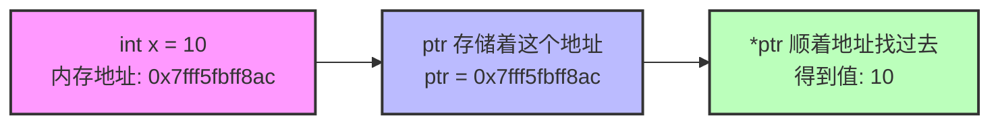
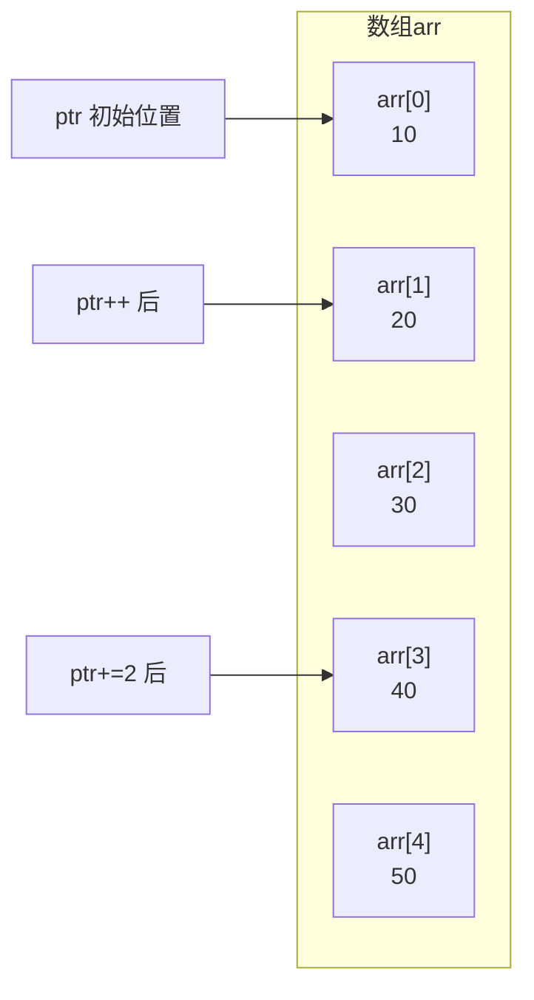
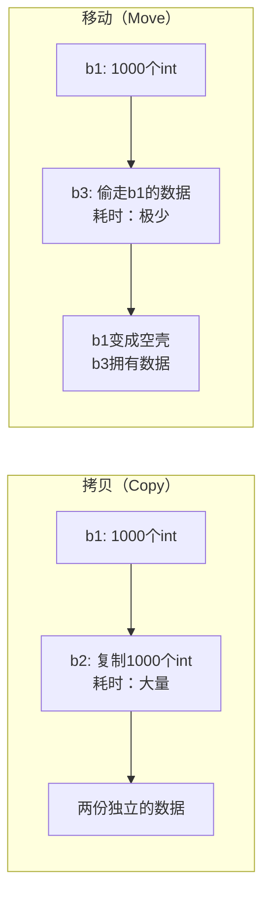
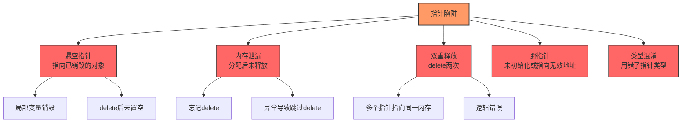

+++
title = "第9章 指针与引用"
weight = 90
date = "2026-03-29T21:03:00+08:00"
type = "docs"
description = ""
isCJKLanguage = true
draft = false
+++
# 第9章 指针与引用

想象一下，你正在经营一家超大型的**快递仓库**。这个仓库里有成千上万个包裹，每个包裹都放在一个特定的**货架位置**上。指针就像是记录这些位置信息的**门牌号**——它本身不是包裹，但它能告诉你去哪里找到那个包裹。

在C/C++的世界里，指针就是这样一个"地址猎人"。它不像普通变量那样直接存储一个数字或字符，而是存储**另一个变量住在哪儿的门牌号**。这听起来有点像特工电影里的联络方式——"目标在第7街区、第3单元、4楼，速来！"指针就是那个记录精确位置的特工。

本章，我们将深入这个既让人爱又让人恨的概念。指针用得好，可以让你的程序像开了挂一样高效；用得不好，分分钟给你表演一个"程序崩溃的一百种姿势"。准备好了吗？让我们一起进入指针的奇妙世界！

## 9.1 指针基础概念

**指针**（Pointer）是C/C++中最强大也最危险的概念。指针本质上是一个**整数**（确切地说，是一个整数类型的值），存储的是另一个对象的**内存地址**。

什么是内存地址？想象一下你家的住址：北京市朝阳区某某路123号。这个"123号"就是门牌号，指向一个具体的房子。内存地址也是类似的道理——计算机会给每一块存储单元分配一个编号，就像给每个房间分配一个门牌号一样。当我们说"某个变量的地址"时，就是指这块内存在计算机中的**门牌号**。

> **小知识**：为什么说指针"危险"？因为它可以指向任何地方——包括你无权访问的区域。如果你不小心踩到了别人的"地盘"，操作系统会毫不犹豫地让你的程序崩溃。这就像你拿着钥匙随便开别人家的门，不被抓才怪！

让我们先看一个最基础的例子：

```cpp
#include <iostream>

int main() {
    // 指针：存储地址的变量
    int x = 10;  // 定义一个普通的int变量，就像在货架上放一个包裹
    
    // &x：获取x的地址（取地址运算符）
    // int*：指向int的指针类型（声明一个"地址猎人"）
    int* ptr = &x;  // 让ptr指向x的地址
    
    std::cout << "x = " << x << std::endl;  // 输出: x = 10
    std::cout << "&x = " << &x << std::endl;  // 输出: &x = 0x7fff5fbff8ac (地址值，每次运行可能不同)
    std::cout << "ptr = " << ptr << std::endl;  // 输出: ptr = 0x7fff5fbff8ac (同地址)
    std::cout << "*ptr = " << *ptr << std::endl;  // 输出: *ptr = 10 (解引用，访问ptr指向的值)
    
    // 指针的大小：取决于平台
    // 32位系统：4字节（因为地址用32位二进制表示）
    // 64位系统：8字节（地址用64位二进制表示）
    std::cout << "sizeof(int*) = " << sizeof(int*) << " bytes" << std::endl;
    // 输出: sizeof(int*) = 8 bytes (64位系统)
    
    // void*：可以指向任意类型的通用指针
    // 想象成一个"万能钥匙"，可以开任何门
    void* vptr = ptr;  // int*隐式转为void*
    std::cout << "void* ptr = " << vptr << std::endl;
    
    return 0;
}
```

运行结果可能像这样：

```
x = 10
&x = 0x7fff5fbff8ac
ptr = 0x7fff5fbff8ac
*ptr = 10
sizeof(int*) = 8 bytes
void* ptr = 0x7fff5fbff8ac
```

> **解引用运算符**：`*` 有两个用途！一个是声明指针时的类型标识（如 `int* ptr`），另一个是解引用运算符（如 `*ptr`），意思是"顺着这个地址找过去，看看里面是什么"。记住：声明时带 `*` 是"我是一个指针"，使用时带 `*` 是"我去访问这个地址里的内容"。

我们可以用一张图来理解指针的工作原理：



### 指针的类型很重要

指针的类型决定了**解引用时你要读取多少字节**。`int*` 指向4字节，`double*` 指向8字节，`char*` 指向1字节。这就像不同的钥匙开不同的锁——你不能拿一把牙刷的开锁器去开保险柜对吧？

```cpp
#include <iostream>

int main() {
    int i = 65;      // int占4字节
    double d = 3.14; // double占8字节
    char c = 'A';    // char占1字节
    
    int* pi = &i;
    double* pd = &d;
    char* pc = &c;
    
    std::cout << "int*  size: " << sizeof(pi) << " bytes" << std::endl;  // 8 bytes (64位)
    std::cout << "double* size: " << sizeof(pd) << " bytes" << std::endl;  // 8 bytes
    std::cout << "char* size: " << sizeof(pc) << " bytes" << std::endl;  // 8 bytes
    
    // 重要：解引用时读取的字节数由指针类型决定！
    std::cout << "*pi reads " << sizeof(int) << " bytes, value = " << *pi << std::endl;  // 4字节
    std::cout << "*pd reads " << sizeof(double) << " bytes, value = " << *pd << std::endl;  // 8字节
    std::cout << "*pc reads " << sizeof(char) << " byte, value = " << *pc << std::endl;  // 1字节
    
    return 0;
}
```

## 9.2 指针的声明、初始化与解引用

学会了基础之后，我们来深入了解指针的声明、初始化，以及那个让人又爱又恨的**空指针**。

### 空指针检查

**空指针**（Null Pointer）是一种特殊的指针，它**不指向任何有效的内存地址**。可以把空指针想象成一个写着"此处无此人"的邮件退回标签——它明确告诉你，这个地址是空的，别白跑一趟了！

在C++11之前，我们用 `NULL` 表示空指针；在C++11及之后，**强烈推荐使用 `nullptr`**！为什么？因为 `nullptr` 是有类型的（`std::nullptr_t`），而 `NULL` 本质上就是字面量 `0`，容易造成歧义。

```cpp
#include <iostream>

// 想象你有这两个函数重载
void func(int x) {
    std::cout << "func(int): " << x << std::endl;
}

void func(char* s) {
    std::cout << "func(char*): " << s << std::endl;
}

int main() {
    // 空指针的三种表示方式
    int* p1 = nullptr;      // C++11推荐！类型安全
    int* p2 = NULL;         // C传统，实际就是0
    int* p3 = 0;            // 直接用0
    
    // nullptr的优势：不会和整数混淆！
    // 看看这个经典问题：
    // func(NULL);   // 在C++中，NULL就是0，会调用int版本！
    // func(nullptr); // 明确调用char*版本
    
    // 推荐写法：始终使用 nullptr
    int x = 10;
    int* ptr = &x;
    
    // 使用指针前的安全检查 - 这是好习惯！
    if (ptr != nullptr) {  // 或者简单地: if (ptr)
        std::cout << "*ptr = " << *ptr << std::endl;  // 输出: *ptr = 10
    }
    
    // 未初始化指针 - 危险行为！
    // int* bad;  // 没有初始化，指向一个随机地址（野指针！）
    // std::cout << *bad << std::endl;  // 危险！野指针解引用，程序可能直接崩溃！
    // 野指针和悬空指针是不同的：野指针是"地址都不确定"，悬空指针是"地址有效但人已经搬走了"
    
    // 正确做法：声明时立即初始化
    int* safe = nullptr;  // 明确指向"无"
    
    // 检查后再使用
    if (safe != nullptr) {
        std::cout << *safe << std::endl;  // 不会执行，因为safe是nullptr
    }
    
    return 0;
}
```

> **重要原则**：使用指针前**务必检查**它是否为 `nullptr`！就像拆快递之前先确认收件人是不是自己一样重要。

### 野指针问题

**野指针**（Wild Pointer）是指向**无效内存地址**的指针，就像一个写错了的电话号码——你拨过去，要么没人接（程序崩溃），要么接的人是骗子（访问到错误的数据）。野指针主要有以下几种成因：

1. **未初始化**：声明指针时没有赋值，它的内容是随机的
2. **返回局部变量地址**：函数结束后，局部变量被销毁，但指针还保留着它的地址
3. **delete后未置空**：指针指向的内存被释放了，但指针还指向那块已经"拆迁"的地方
4. **指向已删除的对象**：同一个内存被多个指针引用，删了一个，其他的就都野了

```cpp
#include <iostream>

// 危险！返回一个局部变量的地址
int* createAndReturn() {
    int local = 42;
    return &local;  // 局部变量在函数结束时被销毁！
}  // local在这里"死亡"，但指针还"活着"

int main() {
    // 原因1：未初始化 - 最常见的野指针来源
    int* uninit;  // 此时uninit的值是随机的，可能是0x00000000，也可能是0xfeeefeee
    // std::cout << *uninit << std::endl;  // 危险！可能崩溃！
    
    // 原因2：返回局部变量地址
    // int* wild = createAndReturn();  // 此时wild指向已经销毁的local
    // std::cout << *wild << std::endl;  // 危险！访问已销毁的对象！
    
    // 原因3：delete后未置空
    int* dynamic = new int(100);  // 分配内存
    delete dynamic;  // 释放内存
    // dynamic = nullptr;  // 错误！忘记置空，dynamic现在是一个悬空指针
    
    // 原因4：指向已删除的对象（悬空指针/野指针）
    int* dangling = new int(200);  // 分配内存
    int* alias = dangling;  // alias和dangling指向同一块内存
    delete dangling;  // 释放内存
    dangling = nullptr;  // dangling置空了
    // alias现在是悬空指针！它还指向那块已经释放的内存！
    // 注意：悬空指针(dangling pointer)是野指针(wild pointer)的一种
    // std::cout << *alias << std::endl;  // 危险！
    
    std::cout << "Safe usage demonstrated" << std::endl;
    
    return 0;
}
```

> **悬空指针**（Dangling Pointer）是野指针的一种，专门指指向已被删除对象的指针。可以理解为"指向坟墓的指针"——地址还在，但住在那里的人已经搬走了。

如何避免野指针？记住三条黄金法则：

1. **声明时初始化**：要么赋值为 `nullptr`，要么立即指向有效地址
2. **delete后立即置空**：`delete p; p = nullptr;`
3. **不要返回局部变量的地址**：使用动态分配或静态变量

## 9.3 指针运算

指针不仅仅是静态的地址存储槽，它还能做**算术运算**！想象指针是一个可以在数组这条街上移动的行人，指针运算就是让这个行人往前走或往后走。

指针的算术运算规则如下：

- **加法**：`ptr + n` 表示向前移动 n 个"步长"，步长 = 指针类型的大小
- **减法**：`ptr - n` 表示向后移动 n 个步长
- **递增/递减**：`ptr++`、`ptr--`
- **指针相减**：两个同类型指针相减，得到**元素个数差距**
- **指针比较**：可以比较大小，判断谁在前谁在后

```cpp
#include <iostream>

int main() {
    int arr[] = {10, 20, 30, 40, 50};
    int* ptr = arr;  // 指向第一个元素，等价于 &arr[0]
    
    // 指针算术：加减整数
    std::cout << "*ptr = " << *ptr << std::endl;  // 输出: *ptr = 10
    ptr++;  // 移动到下一个int（前进4字节）
    std::cout << "*ptr = " << *ptr << std::endl;  // 输出: *ptr = 20
    ptr += 2;  // 再移动2个int（前进8字节）
    std::cout << "*ptr = " << *ptr << std::endl;  // 输出: *ptr = 40
    ptr--;  // 移动回退1个int（后退4字节）
    std::cout << "*ptr = " << *ptr << std::endl;  // 输出: *ptr = 30
    
    // 指针相减：得到元素个数差距
    int* p1 = &arr[1];  // 指向20
    int* p2 = &arr[4];  // 指向50
    std::cout << "p2 - p1 = " << (p2 - p1) << std::endl;  // 输出: p2 - p1 = 3
    // 解释：p2和p1之间隔了3个int（4字节 × 3 = 12字节）
    
    // 指针比较
    int* start = arr;
    int* end = arr + 5;  // 指向"数组末尾之后"的位置
    std::cout << "start < end: " << (start < end) << std::endl;  // 输出: 1 (true)
    
    // 经典用法：遍历数组
    std::cout << "Array elements: ";
    for (int* p = arr; p < arr + 5; ++p) {  // 从头到尾走一遍
        std::cout << *p << " ";  // 输出: Array elements: 10 20 30 40 50
    }
    std::cout << std::endl;
    
    return 0;
}
```

> **注意**：`arr + 5` 指向的是"第5个元素之后的位置"，这是一个有效的地址（常用于表示"结束"标记），但不能对它进行解引用！

指针运算的可视化：



## 9.4 指针与数组

数组和指针的关系，是C/C++中最容易让人"傻傻分不清楚"的知识点之一。让我们来揭开它们的真面目！

**核心概念**：在大多数表达式中，**数组名会退化为指向第一个元素的指针**。这意味着 `arr` 和 `&arr[0]` 在值上是等价的。但它们又不是完全相同的——数组有 `sizeof` 的魔法，指针只有冷冰冰的地址大小。

```cpp
#include <iostream>

int main() {
    int arr[] = {1, 2, 3, 4, 5};
    
    // 数组名在大多数情况下退化为指针
    int* ptr = arr;  // arr等价于&arr[0]
    
    std::cout << "arr[0] = " << arr[0] << ", *ptr = " << *ptr << std::endl;
    // 输出: arr[0] = 1, *ptr = 1
    
    // 指针算术与数组访问等价
    // arr[i] 底层就是 *(arr + i)！
    std::cout << "*(arr+2) = " << *(arr+2) << ", arr[2] = " << arr[2] << std::endl;
    // 输出: *(arr+2) = 3, arr[2] = 3
    
    // 但数组和指针不完全相同！
    std::cout << "sizeof(arr) = " << sizeof(arr) << std::endl;
    // 输出: sizeof(arr) = 20 (5个int × 4字节 = 20)
    std::cout << "sizeof(ptr) = " << sizeof(ptr) << std::endl;
    // 输出: sizeof(ptr) = 8 (64位系统下指针的大小)
    
    // &arr vs arr - 这是一个经典的陷阱！
    std::cout << "arr = " << static_cast<void*>(arr) << std::endl;
    // arr：数组首元素的地址（类型是 int*）
    std::cout << "&arr = " << static_cast<void*>(&arr) << std::endl;
    // &arr：整个数组的地址（类型是 int(*)[5]，指向包含5个int的数组）
    
    // 区别：
    // arr + 1：跳到下一个元素（加4字节），变成 &arr[1]
    // &arr + 1：跳过整个数组（加20字节）！
    
    std::cout << "arr + 1 = " << static_cast<void*>(arr + 1) << std::endl;
    std::cout << "&arr + 1 = " << static_cast<void*>(&arr + 1) << std::endl;
    
    // 验证：地址差值正好是20字节（5个int）
    std::cout << "(&arr + 1) - &arr = " << (&arr + 1) - &arr << " (元素)" << std::endl;
    // 输出: (&arr + 1) - &arr = 1 (跳过了整个数组)
    
    return 0;
}
```

> **记住这个区别**：`arr` 是"数组首元素的地址"，`&arr` 是"数组的地址"。就像"第一排第一座"和"第一排的地址"——前者指向座位，后者指向整排。

指针与数组的对比如下：

| 特性 | 数组 | 指针 |
|------|------|------|
| `sizeof` | 整个数组的大小 | 指针本身的大小（8字节） |
| `&` 运算 | 对数组名取地址得到指向整个数组的指针（如 `int(*)[5]`） | 对指针取地址得到指向指针本身的指针（如 `int**`） |
| `+1` 语义 | 跳过1个元素 | 跳过1个元素 |
| 可赋值性 | 不可修改（常量） | 可以重新赋值 |

## 9.5 指针与函数

指针不仅可以存储数据，还可以作为**函数的"遥控器"**！通过传递指针给函数，函数可以修改外部的变量——这就像是给函数一张"VIP通行证"，让它能够访问外面的世界。

### 通过指针修改外部变量

在C/C++中，函数的参数是按值传递的，也就是说，函数内部的是参数的"副本"。但如果我们传递**指针**，函数就能间接访问和修改外部的变量了！

```cpp
#include <iostream>

// 通过指针修改变量
void increment(int* p) {
    if (p) {  // 安全检查！
        (*p)++;  // 先解引用，再递增
    }
}

// 通过指针交换两个变量
void swap(int* a, int* b) {
    int temp = *a;  // 把a指向的值存到temp
    *a = *b;        // 把b指向的值赋给a指向的位置
    *b = temp;      // 把temp的值赋给b指向的位置
}

// 在数组中查找元素，返回找到的位置
int* findInArray(int* arr, int size, int target) {
    for (int i = 0; i < size; ++i) {
        if (arr[i] == target) {
            return &arr[i];  // 返回找到元素的地址
        }
    }
    return nullptr;  // 没找到，返回空指针
}

int main() {
    // 例1：递增一个数
    int num = 10;
    increment(&num);  // 传入num的地址
    std::cout << "After increment: " << num << std::endl;  // 输出: After increment: 11
    
    // 例2：交换两个数
    int x = 5, y = 10;
    swap(&x, &y);
    std::cout << "After swap: x=" << x << ", y=" << y << std::endl;
    // 输出: After swap: x=10, y=5
    
    // 例3：在数组中查找
    int data[] = {3, 1, 4, 1, 5, 9, 2, 6};
    int* found = findInArray(data, 8, 5);
    if (found) {
        std::cout << "Found 5 at position " << (found - data) << std::endl;
        // 输出: Found 5 at position 4
    }
    
    return 0;
}
```

> **为什么不用全局变量？** 因为全局变量是"共享单车"，谁都能改，容易乱套；而通过参数传递指针是"叫外卖"，精确投喂，职责清晰。

## 9.6 函数指针

如果说普通指针是指向数据的"地址"，那么**函数指针**就是指向**函数**的"地址"。这听起来很抽象，但其实很实用——你可以把函数当作变量一样传来传去！

**函数指针**本质上是一个指针，它存储的不是变量的地址，而是**函数在内存中的入口地址**。就像每个函数都有一个"门牌号"，函数指针就是记录这个门牌号的变量。

```cpp
#include <iostream>
#include <vector>
#include <algorithm>

// 函数指针：指向函数的指针
int add(int a, int b) {
    return a + b;
}

int multiply(int a, int b) {
    return a * b;
}

int main() {
    // 声明函数指针
    // 解释：int (*funcPtr)(int, int)
    // - funcPtr：变量名
    // - (*funcPtr)：是一个指针
    // - (int, int)：指向接受两个int参数的函数
    // - int：指向返回int的函数
    int (*funcPtr)(int, int) = add;  // 指向add函数
    
    // 调用函数指针的两种方式
    std::cout << "(*funcPtr)(3, 4) = " << (*funcPtr)(3, 4) << std::endl;
    // 输出: (*funcPtr)(3, 4) = 7
    std::cout << "funcPtr(3, 4) = " << funcPtr(3, 4) << std::endl;
    // 输出: funcPtr(3, 4) = 7（函数指针可像函数一样调用）
    
    // 切换指向的函数
    funcPtr = multiply;
    std::cout << "funcPtr(3, 4) = " << funcPtr(3, 4) << std::endl;
    // 输出: funcPtr(3, 4) = 12
    
    // typedef简化写法 - 给函数指针类型起个别名
    typedef int (*BinaryOp)(int, int);  // BinaryOp 现在是一个类型名
    using BinaryOp2 = int(*)(int, int);  // C++11 alias declaration，效果相同
    
    BinaryOp op1 = add;
    BinaryOp op2 = multiply;
    
    // 函数指针的经典应用：回调函数
    std::vector<int> nums = {3, 1, 4, 1, 5, 9, 2, 6};
    
    // std::sort 的最后一个参数就是一个函数指针（回调函数）
    std::sort(nums.begin(), nums.end(), [](int a, int b) {
        return a > b;  // 降序排列
    });
    
    std::cout << "Sorted descending: ";
    for (int n : nums) std::cout << n << " ";
    // 输出: Sorted descending: 9 6 5 4 3 2 1 1
    std::cout << std::endl;
    
    return 0;
}
```

> **回调函数**：就是把一个函数当作参数传给另一个函数。就像你点外卖时备注"如果送不到，就打这个电话"——回调函数就是那个"备用电话"，在特定情况下被调用。

函数指针的声明语法确实有点吓人，让我们用一个类比来理解：

```cpp
// 声明一个函数指针，指向返回int、接受(int, int)的函数
int (*funcPtr)(int, int);

// 对比：声明一个普通函数
int func(int, int);

// 对比：声明一个函数指针数组
int (*ops[3])(int, int) = {add, multiply, /* 第三个函数 */};
```

## 9.7 引用的概念与使用

如果说指针是一个记录地址的小本本，需要翻开来查；那么**引用**（Reference）就是直接站在那个变量旁边的**代言人**——你跟引用说话，就等于跟原变量说话。

**引用**是C++独有的一种特性（C语言没有），它是变量的**别名**（Alias）。一旦引用和某个变量绑定，就再也分不开了——引用就是那个变量，变量就是那个引用，两者是同一个东西！

### 左值引用

**左值引用**（Lvalue Reference）是最常用的引用类型。"左值"指的是可以放在赋值语句左边的值——简单来说，就是有名字的、可以取地址的对象。

```cpp
#include <iostream>

int main() {
    // 左值引用：绑定到一个对象（必须有名字，可取地址）
    int x = 10;
    int& ref = x;  // ref是x的引用/别名
    
    std::cout << "x = " << x << std::endl;  // 输出: x = 10
    std::cout << "ref = " << ref << std::endl;  // 输出: ref = 10
    
    ref = 20;  // 通过引用修改x
    std::cout << "x = " << x << std::endl;  // 输出: x = 20
    
    // &ref 和 &x 是相同的地址！
    std::cout << "&x = " << &x << std::endl;
    std::cout << "&ref = " << &ref << std::endl;
    // 输出: 两个地址相同！ref就是x的另一个名字
    
    // 引用必须初始化 - 引用不能单独存在
    int y = 30;
    int& ref2 = y;  // OK，绑定到y
    // int& ref3;     // 错误！引用必须初始化！不能先声明后绑定！
    
    // 引用不能重新绑定
    int z = 100;
    int& ref4 = z;  // ref4绑定到z
    int w = 200;
    // ref4 = w;  // 这不是让ref4重新绑定到w！引用一旦绑定就不能改变
    // 实际上是：把w的值赋给z！因为ref4就是z的别名，两者是同一个东西
    
    std::cout << "z = " << z << std::endl;  // 输出: z = 200（被w赋值了）
    // 如果你想让另一个变量也有引用，需要重新定义
    int& ref5 = w;  // 新建一个引用，绑定到w
    
    return 0;
}
```

> **引用的三大规则**：
> 1. 引用在创建时**必须初始化**
> 2. 引用一旦绑定，就**不能重新绑定**
> 3. 引用不是对象，它只是一个**别名**

### 常量引用

**常量引用**（Const Reference）是引用的"只读模式"——你可以通过它读取值，但不能通过它修改值。这就像你有一本书的**阅读权限**（可以看），但没有**编辑权限**（不能改）。

```cpp
#include <iostream>

void printInt(const int& r) {
    // r是常量引用，不能修改它指向的值
    std::cout << "Value: " << r << std::endl;  // 输出: Value: 42
    // r = 100;  // 错误！常量引用不能修改
}

int main() {
    // 常量引用：不能通过它修改对象
    int x = 10;
    const int& cref = x;  // 用常量引用绑定x
    
    std::cout << "cref = " << cref << std::endl;  // 输出: cref = 10
    // cref = 20;  // 错误！常量引用不能修改
    
    x = 30;  // x本身可以修改（权限在x那里）
    std::cout << "cref = " << cref << std::endl;  // 输出: cref = 30（反映了x的变化）
    
    // 常量引用的特殊能力：可以绑定右值（临时对象）
    const int& r1 = 42;  // OK！绑定到一个临时对象
    const int& r2 = x + 5;  // OK！绑定到表达式结果的临时对象
    
    std::cout << "r1 = " << r1 << std::endl;  // 输出: r1 = 42
    std::cout << "r2 = " << r2 << std::endl;  // 输出: r2 = 35
    
    // 关键：C++标准规定，绑定到临时对象的const引用会将该临时对象的
    // 生命周期延长到引用自身的作用域结束。这是一种"安全保护"机制！
    // 也就是说，临时对象"寄生"在const引用身上，直到引用销毁才跟着销毁。
    const int& safeLifetime = x + 100;  // 临时对象被延长生命周期
    std::cout << "safeLifetime = " << safeLifetime << std::endl;  // 输出: safeLifetime = 130
    // 到这里safeLifetime离开作用域，临时对象才被销毁
    
    // 用于函数参数：避免复制开销，又保证不修改原值
    printInt(x);
    
    return 0;
}
```

> **为什么常量引用可以绑右值？** 想象一个临时工（临时对象）来报到，普通引用说"我只认正式工"，所以拒绝了；但常量引用说"临时工也可以，但我会保护你——你的合同（生命周期）我会帮你延长到我不在为止"。C++标准规定，绑定到临时对象的const引用会将该临时对象的生命周期延长到引用自身的作用域结束。这是为了防止你"拿着一个已经被销毁的临时工的信息"而设计的保护机制！

### 引用必须初始化

这是引用与指针最核心的区别之一：**指针可以不初始化（虽然很危险），但引用必须初始化**。

```cpp
#include <iostream>

int main() {
    // 引用必须初始化，且一旦绑定不能改变
    int a = 10, b = 20;
    
    int& ref = a;  // 绑定到a
    std::cout << "ref = " << ref << std::endl;  // 输出: ref = 10
    
    ref = b;  // 把b的值赋给a，不是重新绑定ref到b！
    std::cout << "a = " << a << ", b = " << b << std::endl;
    // 输出: a = 20, b = 20（a被修改了，ref绑的还是a）
    
    // 如果想要引用指向另一个变量，需要重新定义
    int& ref2 = b;  // 新建一个引用，绑定到b
    
    return 0;
}
```

> **重要区分**：`ref = b` 是赋值操作（改变ref指向的对象的值），而不是重新绑定（改变ref指向哪个对象）。这两者有本质区别！

## 9.8 指针与引用的区别

指针和引用都是C/C++中"间接访问"的技术，但它们有着本质的不同。让我用一个生活化的例子来解释：

想象你有一辆车（变量）。
- **指针**：是车钥匙上的**GPS坐标**。你可以把钥匙给别人，让他们自己去找车。车钥匙可以指向任何一辆车（甚至可以指向没有车的空地——nullptr）。
- **引用**：是车钥匙本身，**你就是那把钥匙**。别人拿着你就能开车，你不能指向别的车（引用不能重新绑定）。

### 核心区别一览

```cpp
#include <iostream>

int main() {
    // 指针 vs 引用：
    // 1. 指针可以为空（nullptr），引用必须绑定到对象
    // 2. 指针可以重新赋值指向其他对象，引用绑定后不能改变
    // 3. 指针有自己独立的地址，引用只是别名
    // 4. 指针需要解引用才能操作对象，引用直接使用
    
    int x = 10;
    int* ptr = &x;   // 指针：存储x的地址
    int& ref = x;     // 引用：x的别名
    
    std::cout << "x address: " << &x << std::endl;
    std::cout << "ptr value (address): " << ptr << std::endl;
    std::cout << "ref address: " << &ref << std::endl;
    // &ref == &x，ref只是x的别名，不占用独立内存（有时会占用，但语义上就是x）
    
    // 指针可以为空
    int* nullPtr = nullptr;  // OK！
    // int& nullRef;          // 错误！引用不能为空！
    
    // 指针可以改变指向
    int y = 20;
    ptr = &y;  // ptr现在指向y
    // ref = y;  // 这不是重新绑定，而是把y的值赋给x！
    
    return 0;
}
```

| 特性 | 指针 | 引用 |
|------|------|------|
| 可以为空 | ✅ `nullptr` | ❌ 必须绑定 |
| 可以重新绑定 | ✅ 可以 | ❌ 只能绑定一次 |
| 占用独立内存 | ✅ 是的 | ❌ 只是别名 |
| 解引用 | ✅ 需要 `*ptr` | ❌ 直接使用 |
| 可作为数组元素 | ✅ 可以 | ❌ 不可以 |

### 使用场景选择

在实际编程中，我们应该根据需求选择使用指针还是引用：

```cpp
#include <iostream>
#include <vector>
#include <string>

// 选择指针的场景：
// 1. 需要表示"没有对象"（nullptr）
// 2. 需要改变被绑定的对象
// 3. C风格API要求使用指针

// 选择引用的场景：
// 1. 总是需要指向某个对象
// 2. 不需要改变绑定（参数/返回值）
// 3. 提高代码可读性（更自然的语法）

class Widget {
public:
    void draw() {
        std::cout << "Widget drawn" << std::endl;
    }
};

// 函数参数：引用更安全（不会为空）
void doSomething(Widget& w) {
    // 保证w一定存在，调用者必须提供一个有效的Widget
    w.draw();
}

// 可选参数：使用指针
void optionalCallback(void (*callback)(int) = nullptr) {
    if (callback) {
        callback(42);
    }
}

// 修改外部变量：引用
void increment(int& x) {
    ++x;  // 直接修改原变量
}

// 返回值：引用用于链式调用
class Stream {
public:
    Stream& operator<<(int val) {
        std::cout << val;
        return *this;  // 返回自身以支持链式调用
    }
    
    Stream& operator<<(const char* s) {
        std::cout << s;
        return *this;
    }
};

int main() {
    // 引用参数示例
    int num = 5;
    increment(num);
    std::cout << "num after increment: " << num << std::endl;  // 输出: num after increment: 6
    
    // 链式调用示例
    Stream s;
    s << 1 << 2 << 3 << '\n';  // 输出: 123
    
    // 指针可选参数示例
    optionalCallback(nullptr);  // 不执行回调
    
    return 0;
}
```

> **经验法则**：
> - 如果"没有对象"是一个合理的选项 → 用指针
> - 如果"没有对象"没有意义 → 用引用
> - 如果需要改变指向 → 用指针
> - 如果绑定后不变 → 用引用
> - 如果追求代码可读性 → 优先用引用

## 9.9 右值引用与移动语义（C++11）

C++11引入了一个"神秘武器"——**右值引用**（Rvalue Reference）。它让程序员可以"偷"走临时对象的资源，而不是傻傻地复制一份。这在处理大型对象（如字符串、容器）时，可以带来巨大的性能提升！

### 移动语义原理

在说移动语义之前，我们先理解两个概念：
- **左值**（Lvalue）：可以放在赋值语句左边的值，有名字，有地址
- **右值**（Rvalue）：只能放在赋值语句右边的值，没名字，通常是临时对象

**移动语义**的核心思想是：对于临时对象（右值），我们不需要复制它的数据，只需要"接管"它的资源，把它的"家当"都搬过来，然后让临时对象变空。这样可以避免昂贵的深拷贝操作！

```cpp
#include <iostream>
#include <vector>

class Buffer {
public:
    int* data;      // 指向堆内存的指针
    size_t size;    // 缓冲区大小
    
    // 构造函数
    Buffer(size_t s) : size(s) {
        data = new int[s];  // 分配内存
        std::cout << "Buffer constructed, size=" << s << std::endl;
    }
    
    // 析构函数
    ~Buffer() {
        if (data) {
            delete[] data;  // 释放内存
            std::cout << "Buffer destructed" << std::endl;
        }
    }
    
    // 拷贝构造函数 - 深拷贝
    Buffer(const Buffer& other) : size(other.size) {
        data = new int[other.size];  // 分配新内存
        for (size_t i = 0; i < size; ++i) {
            data[i] = other.data[i];  // 复制数据
        }
        std::cout << "Buffer copied (deep copy)" << std::endl;
    }
    
    // 移动构造函数 - "偷"资源
    Buffer(Buffer&& other) noexcept : data(other.data), size(other.size) {
        other.data = nullptr;  // 重要！把原对象的指针置空
        other.size = 0;        // 防止析构时delete我们的数据
        std::cout << "Buffer moved (resource stolen!)" << std::endl;
    }
    
    // 移动赋值运算符
    Buffer& operator=(Buffer&& other) noexcept {
        if (this != &other) {
            delete[] data;  // 先释放自己的资源
            data = other.data;  // "偷"别人的
            size = other.size;
            other.data = nullptr;  // 对方清零
            other.size = 0;
        }
        return *this;
    }
};

int main() {
    std::cout << "=== Creating b1 ===" << std::endl;
    Buffer b1(1000);  // 创建一个buffer，分配1000个int的内存
    
    std::cout << "\n=== Copying b1 to b2 ===" << std::endl;
    Buffer b2 = b1;  // 拷贝：深拷贝，分配新内存，复制数据
    
    std::cout << "\n=== Moving b1 to b3 ===" << std::endl;
    Buffer b3 = std::move(b1);  // 移动：不分配新内存，"偷"b1的资源
    
    std::cout << "\n=== End of main ===" << std::endl;
    // b1的资源已经被"移动"到b3，b1现在是空壳
    // b1的析构函数会正确处理（因为data是nullptr）
    
    return 0;
}
```

运行结果可能像这样：

```
=== Creating b1 ===
Buffer constructed, size=1000

=== Copying b1 to b2 ===
Buffer copied (deep copy)

=== Moving b1 to b3 ===
Buffer moved (resource stolen!)

=== End of main ===
Buffer destructed
Buffer destructed
Buffer destructed
```

> **为什么移动构造函数要把原对象的指针置为空？** 因为如果不置空，当原对象析构时，会 `delete[]` 掉那块我们刚刚"偷"来的内存！那就等于把自己的新家给拆了！

移动语义的可视化：



## 9.10 完美转发与std::forward（C++11）

**完美转发**（Perfect Forwarding）是C++11中的一个高级技巧，它的目标是：把参数原封不动地转发给另一个函数，保持它的**值类别**（左值还是右值）不变。

在C++中，`T&&` 有两种含义：
- 对于已知类型，它是**右值引用**
- 对于模板参数，它是**转发引用**（Universal Reference），可以绑定左值或右值

`std::forward<T>` 的作用是"完美转发"：根据 T 的类型，决定把参数当作左值还是右值转发出去。

```cpp
#include <iostream>

void process(int& x) {
    std::cout << "process(int&): " << x << std::endl;  // 处理左值
}

void process(int&& x) {
    std::cout << "process(int&&): " << x << std::endl;  // 处理右值
}

template<typename T>
void wrapper(T&& x) {
    // x是转发引用（universal reference）
    // - 如果传入左值，T推导为 int&，x的类型是 int&
    // - 如果传入右值，T推导为 int，x的类型是 int&&
    
    // 错误示范：直接传递
    // process(x);  // 无论x是什么类型，传递的都是左值！
    
    // 正确做法：使用std::forward保持原始值类别
    process(std::forward<T>(x));  // 完美转发：保持原始值类别
}

int main() {
    int a = 10;
    
    wrapper(a);   // 传入左值，调用int&版本
    wrapper(20);  // 传入右值，调用int&&版本
    
    // 输出:
    // process(int&): 10
    // process(int&&): 20
    
    return 0;
}
```

> **为什么需要完美转发？** 想象你是一个中间人，有人托你带话。如果人家说的是"给我转告他这个苹果"（左值），你得说"他有一个苹果"；如果人家说的是"把这个苹果给他"（右值），你得把苹果带过去。`std::forward` 就是帮你区分这两种情况的关键道具！

## 9.11 引用折叠规则

**引用折叠**（Reference Collapsing）是C++11中模板推导和 `auto` 类型推导的一个规则。它听起来很复杂，但其实很简单：

当引用遇上引用，结果还是引用。具体规则如下：

| 组合 | 结果 |
|------|------|
| `T& &` | `T&` |
| `T& &&` | `T&` |
| `T&& &` | `T&` |
| `T&& &&` | `T&&` |

简单记忆法：**只要有左值引用参与，结果就是左值引用**！只有 `T&& &&` 这种纯右值引用组合，才会折叠成右值引用。

```cpp
#include <iostream>

// 引用折叠规则演示

template<typename T>
void func(T& param) {
    std::cout << "T& version" << std::endl;
}

template<typename T>
void func(T&& param) {
    std::cout << "T&& version" << std::endl;
}

int main() {
    int x = 10;
    int& rx = x;  // rx是x的左值引用
    
    // 传递左值
    func(x);   // x是左值，T = int&，param = int&，调用 T& 版本
    func(rx);  // rx是左值引用，T = int&，param = int&，调用 T& 版本
    
    // 传递右值
    func(10);  // 10是右值，T = int，param = int&&，调用 T&& 版本
    
    return 0;
}
```

输出：

```
T& version
T& version
T&& version
```

> **为什么需要引用折叠？** 因为 `std::forward<T>` 的实现就用到了引用折叠！`std::forward<T>(arg)` 如果 T 是左值引用类型，就转发为左值；否则转发为右值。没有引用折叠规则，这一切都无法实现。

## 9.12 常见指针陷阱

指针是C/C++中最容易出bug的地方。了解常见的陷阱，可以帮助我们写出更安全的代码。

### 悬空指针

**悬空指针**（Dangling Pointer）是指向已经销毁的对象的指针。就像一个地址本上记录了一个已经拆迁的房子地址——你按照地址去找，只能扑个空。

```cpp
#include <iostream>

int main() {
    // 悬空指针：指向已销毁对象的指针
    
    int* ptr = nullptr;  // 正确做法：一开始就初始化为nullptr
    {
        int local = 100;  // local在栈上创建
        ptr = &local;     // ptr指向local
    }  // local在这里被销毁，栈帧弹出
    
    // 此时ptr存储的地址指向的内存已经无效了！ptr现在是一个悬空指针
    // std::cout << *ptr << std::endl;  // 危险！可能读到垃圾值或直接崩溃
    
    // 正确做法：使用nullptr标记无效指针（悬空指针必须手动置空）
    ptr = nullptr;  // 明确标记为空
    
    // 使用前检查
    if (ptr != nullptr) {
        // 只有ptr有效时才访问
        // std::cout << *ptr << std::endl;
    }
    
    return 0;
}
```

> **如何避免悬空指针？**
> 1. 指针用完后立即置为 `nullptr`
> 2. 使用前检查是否为 `nullptr`
> 3. 使用智能指针（C++11）自动管理内存

### 内存泄漏

**内存泄漏**（Memory Leak）是指程序分配了内存，但使用完毕后没有释放，导致这块内存永远无法被再次使用。就像你借了图书馆的书，却从来不还——书还在你手里，但图书馆已经没办法借给别人了。

```cpp
#include <iostream>

int main() {
    // 内存泄漏：申请了内存但忘记释放
    
    // 泄漏示例：分配内存后函数返回，但从未delete
    // （这是一个函数内部的代码片段，演示泄漏最典型的情况）
    int* leak = new int(100);  // 分配了内存
    // 假设这里有一大堆代码...
    // 然后函数要返回了，但忘了delete
    // return;  // 直接返回，leak指向的内存永远无法回收！泄漏了！
    
    // 泄漏的另一种典型情况：异常导致跳过delete
    // try {
    //     int* leaky = new int(200);
    //     throw std::runtime_error("Oops!");
    //     delete leaky;  // 这行永远不会执行！
    // } catch (...) {
    //     // 异常发生时，leaky指向的内存已经泄漏了
    // }
    
    // 正确做法1：手动delete（记得配对）
    {
        int* safe = new int(100);
        // 使用safe...
        delete safe;  // 释放
        safe = nullptr;  // 置空（可选，但推荐）
    }  // 此时safe本身也超出作用域了
    
    // 正确做法2：使用智能指针（C++11+，强烈推荐！）
    // std::unique_ptr<int> smart = std::make_unique<int>(100);
    // 自动释放，无需手动delete
    
    // 正确做法3：使用容器或数组（栈上分配）
    // std::vector<int> vec(100);  // 自动管理内存
    // int arr[100];  // 栈上分配，函数结束自动释放
    
    std::cout << "Memory leak demo complete" << std::endl;
    
    return 0;
}
```

> **内存泄漏的长期后果**：如果你的程序运行很长时间且不断泄漏内存，最终会导致系统可用内存耗尽，程序或整个系统变得卡顿甚至崩溃。更有意思的是，泄漏的内存往往连析构函数都不会执行——你可能连"最后清理的机会"都没有！所以养成好习惯：**new 和 delete 要配对，优先使用智能指针或容器**！

### 双重释放

**双重释放**（Double Delete）是指对同一块内存执行了两次 `delete`。这会导致未定义行为，轻则程序崩溃，重则安全漏洞。

```cpp
#include <iostream>

int main() {
    // 双重释放：delete同一个指针两次
    
    int* ptr = new int(100);  // 分配内存
    delete ptr;  // 第一次释放，内存归还系统
    
    // 危险！
    // delete ptr;  // 第二次释放！未定义行为！
    // 可能的后果：
    // 1. 程序崩溃（double free corruption）
    // 2. 安全性问题（如果这块内存被重新分配）
    // 3. 奇怪的行为（内存管理数据结构被破坏）
    
    // 正确做法：释放后立即置空
    ptr = nullptr;  // 置空后可以安全再次delete
    
    delete ptr;  // 对nullptr的delete是安全的，什么也不做
    delete ptr;  // 再来一次，也是安全的
    
    // 使用智能指针可以避免这个问题
    // std::unique_ptr<int> smart = std::make_unique<int>(100);
    // 自动释放，永远不会有double delete
    
    std::cout << "Double delete prevention demo" << std::endl;
    
    return 0;
}
```

> **黄金法则**：`delete` 一个指针后，**立即**把它赋值为 `nullptr`！因为对 `nullptr` 执行 `delete` 是安全的（什么都不做），而对野指针执行 `delete` 是危险的。

### 常见指针陷阱一览



## 本章小结

指针和引用是C/C++中最具特色也最容易出错的两个概念。掌握它们，就像掌握了武林秘籍的"内功心法"——虽然道路坎坷，但一旦融会贯通，你就能写出高效、灵活的代码。

### 核心要点回顾

1. **指针基础**
   - 指针是一个整数，存储另一个变量的内存地址
   - `&` 取地址运算符，`*` 解引用运算符
   - 指针大小在64位系统上是8字节
   - `void*` 是通用指针类型

2. **指针初始化与空指针**
   - 声明时应初始化为 `nullptr` 或有效地址
   - 使用指针前**必须检查**是否为 `nullptr`
   - `nullptr` 比 `NULL` 更安全

3. **野指针与悬空指针**
   - 未初始化、返回局部变量地址、delete后未置空都会产生危险指针
   - delete后**立即置空**，使用前**检查非空**

4. **指针运算**
   - 指针支持加减整数、指针相减、指针比较
   - `ptr + n` 移动 n 个元素单位
   - 指针相减得到元素个数差距

5. **指针与数组**
   - 数组名在大多数表达式中退化为指针
   - `arr[i]` 等价于 `*(arr + i)`
   - `sizeof(数组)` 得到整个数组大小，`sizeof(指针)` 得到指针大小
   - `arr` 和 `&arr` 不同：前者是首元素地址，后者是数组地址

6. **指针与函数**
   - 通过指针可以在函数内部修改外部变量
   - 指针作为函数参数可以实现"输出参数"

7. **函数指针**
   - 函数指针指向函数在内存中的入口地址
   - 可用于回调函数、策略模式等场景
   - typedef 或 using 可以简化函数指针类型声明

8. **引用**
   - 引用是变量的别名，没有独立地址
   - 引用必须在创建时初始化
   - 引用一旦绑定，不能重新绑定
   - 常量引用可以绑定右值

9. **指针vs引用选择**
   - 需要"可能为空" → 指针
   - 不需要重新绑定 → 引用
   - 需要改变指向 → 指针
   - 提高可读性 → 引用

10. **右值引用与移动语义**
    - 移动语义避免不必要的深拷贝
    - `std::move` 将左值转为右值引用
    - 移动构造函数应 noexcept 并置空原对象

11. **完美转发**
    - `std::forward<T>` 保持参数的值类别
    - 转发引用 `T&&` 可以绑定左值或右值

12. **引用折叠**
    - `T& &`、`T& &&`、`T&& &` 都折叠为 `T&`
    - 只有 `T&& &&` 折叠为 `T&&`

13. **常见陷阱**
    - 悬空指针：指向已销毁的对象
    - 内存泄漏：分配后未释放
    - 双重释放：delete同一指针两次

> **最后的忠告**：指针是强大的工具，但也是危险的武器。在现代C++中，如果可以使用智能指针、容器和引用解决的问题，就尽量不要使用裸指针。**安全第一，性能第二**——除非你真的需要那最后一点点的极致性能！
