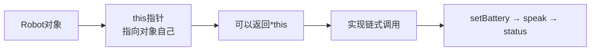
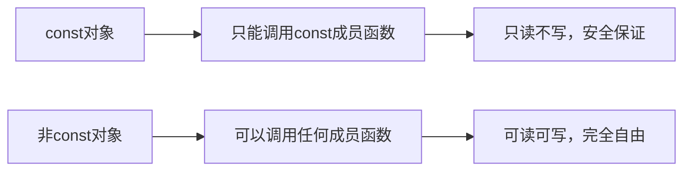
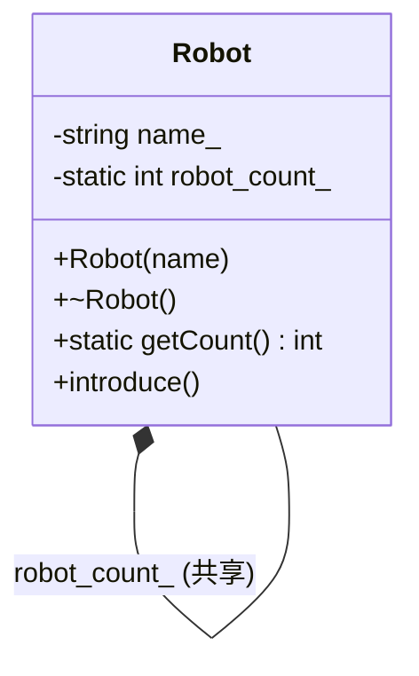

+++
title = "第12章 成员函数深入"
weight = 120
date = "2026-03-29T21:03:00+08:00"
type = "docs"
description = ""
isCJKLanguage = true
draft = false
+++
# 第12章 成员函数深入

欢迎来到成员函数的深水区！如果说类是一座房子，那成员函数就是房子的主人——既有自己的小房间（private），也有会客厅（public），偶尔还会搞点秘密派对（友元）。本章我们将深入探索C++成员函数的各种黑科技，让你的代码既有实力又有魅力！

## 12.1 this指针

> 你有没有想过，一个对象是怎么知道自己"是谁"的？当你对R2-D2说"充电"，它怎么知道是给自己充而不是给旁边的C-3PO充？答案就是——**this指针**！

### this指针是什么？

**this指针**是C++中的一个隐式指针，它指向当前对象本身。就像每个学生都有一个"我自己"的意识一样，每个对象都有一个`this`指针指向自己。

```cpp
#include <iostream>
#include <string>

class Robot {
private:
    std::string name_;  // 机器人名字
    int battery_;       // 电量
    
public:
    // 构造函数：用初始化列表初始化成员
    Robot(const std::string& name) : name_(name), battery_(100) {}
    
    // this指针：指向当前对象本身的指针
    // 返回类型是 Robot*，表示返回指向Robot对象的指针
    Robot* getThis() {
        return this;  // 返回this指针，你就知道自己在内存的哪个角落了
    }
    
    // const版本的this指针 - 用于const成员函数
    const Robot* getThisConst() const {
        return this;  // 返回const指针，防止意外修改
    }
    
    // 充电功能：给自己充电
    void charge(int amount) {
        battery_ += amount;
        if (battery_ > 100) battery_ = 100;  // 电量不能超过100%
        std::cout << name_ << " charged to " << battery_ << "%" << std::endl;
    }
    
    // 返回*this以支持链式调用 - 这是C++的炫酷技巧！
    Robot& setBattery(int level) {
        battery_ = level;
        return *this;  // 返回自身的引用，让自己可以继续被操作
    }
    
    // 说话功能：返回*this实现链式调用
    Robot& speak(const std::string& words) {
        std::cout << name_ << " says: " << words << std::endl;
        return *this;  // 说完话还能继续说别的，实现链式调用
    }
    
    // 查看状态 - const成员函数，不能修改任何成员变量
    void status() const {
        std::cout << name_ << " [Battery: " << battery_ << "%]" << std::endl;
    }
};

int main() {
    Robot r2d2("R2-D2");  // 创建一个小机器人
    
    // this指针的用途：看看这个对象在内存中的地址
    // 内存地址就像是你的身份证号码，独一无二！
    std::cout << "getThis() returns: " << r2d2.getThis() << std::endl;
    // 输出类似: getThis() returns: 0x7fff5fbff8c0
    
    // 链式调用：利用*this返回引用实现连续操作
    // 这就像流水线作业，一气呵成！
    r2d2.setBattery(80).speak("I'm operational!").setBattery(90).status();
    
    // 上述链式调用的执行顺序：
    // 1. r2d2.setBattery(80)  -> 设置电量为80，返回*this
    // 2. .speak("I'm operational!") -> 说话，返回*this
    // 3. .setBattery(90) -> 设置电量为90，返回*this
    // 4. .status() -> 查看状态
    
    // 输出:
    // R2-D2 says: I'm operational!
    // R2-D2 [Battery: 90%]
    
    return 0;
}
```

> **小贴士**：链式调用是很多现代C++库的招牌技能，比如`std::cout << a << b << c;`，就是利用返回`*this`的引用实现的。下次你用`cout`链式输出的时候，想想它背后的功臣——this指针！



## 12.2 const成员函数

> 想象一下，你去图书馆看书，图书馆规定"只准看不准改"。const成员函数就是这样的规则——只让你读取数据，不让你搞破坏！调用const成员函数，就像是给函数颁发了一张"借书证"——你只能看书（读数据），不能涂改书页（改数据）！

### const成员函数的概念

**const成员函数**是在函数声明后面加`const`关键字的函数，它承诺不会修改任何成员变量（除非成员被声明为`mutable`）。这就像给函数戴了一个"只读"的徽章。

```cpp
#include <iostream>
#include <string>

class Circle {
private:
    double radius_;  // 圆的半径
    
public:
    // 构造函数：初始化半径
    Circle(double r) : radius_(r) {}
    
    // const成员函数：不能修改成员变量
    // 这个函数只负责计算面积，保证不会改变圆的半径
    double getArea() const {
        // radius_ = 10;  // 错误！编译器的表情：🤨 你在搞什么？
        return 3.14159 * radius_ * radius_;
    }
    
    // const成员函数：计算周长，同样不能修改任何东西
    double getCircumference() const {
        return 2 * 3.14159 * radius_;
    }
    
    // 非const成员函数：可以修改成员变量
    // 这个函数可以改变圆的半径
    void setRadius(double r) {
        radius_ = r;  // 想改就改，我说了算！
    }
    
    // const对象只能调用const成员函数
    // 这个函数打印圆的信息，它只读不改
    void print() const {
        std::cout << "Radius: " << radius_ << std::endl;
        std::cout << "Area: " << getArea() << std::endl;  // OK，调用const方法
        // 在const函数内部，只能调用其他const成员函数！
        // 原因：如果你在const函数里调用非const函数，非const函数可能会偷偷改数据
        // 这就像在"只读图书馆"里借了一本书，结果那本书可以涂改一样荒谬
    }
};

int main() {
    const Circle c(5.0);  // const对象 - 这个圆被锁定了
    
    // c.setRadius(10.0);  // 错误！编译器报错：
    // "error: 'c' is not a modifiable lvalue"
    // const对象不能调用非const成员函数，就像你不能在"禁止涂写"的书上画画
    
    std::cout << "Area: " << c.getArea() << std::endl;  // OK，const函数读取
    c.print();  // OK，const函数打印
    
    Circle nc(3.0);  // 非const对象 - 这个圆是自由的
    nc.setRadius(10.0);  // OK，可以修改
    nc.print();  // OK，const和非const对象都可以调用const函数
    
    return 0;
}
```

> **黄金法则**：如果一个函数不需要修改对象的状态，请毫不犹豫地加上`const`！这不仅是好习惯，还能让编译器帮你检查错误，就像给代码装了一个智能保镖。



## 12.3 static成员变量与成员函数

> 想象一下，你有一群机器人，它们都有一个共同的计数器，记录世界上有多少个机器人。这个计数器不应该属于某一个机器人，而应该属于"机器人"这个概念本身——这就是**static成员变量**！

### static成员变量的秘密

**static成员变量**是类的属性，不是对象的属性。也就是说，无论你创建多少个对象，static成员只有一份，被所有对象共享。就像地球是所有人的共同家园，而不是某一个人的私有财产。

```cpp
#include <iostream>
#include <string>

class Robot {
private:
    std::string name_;  // 这个属于每个具体的机器人
    static int robot_count_;  // 这个属于整个类，只有一份！
    
public:
    // 构造函数：每创建一个机器人，计数器就加1
    Robot(const std::string& name) : name_(name) {
        ++robot_count_;  // 地球上的机器人又多了一个！
        std::cout << name_ << " created (total: " << robot_count_ << ")" << std::endl;
    }
    
    // 析构函数：每销毁一个机器人，计数器就减1
    ~Robot() {
        --robot_count_;  // 一个机器人离开了我们
        std::cout << name_ << " destroyed (remaining: " << robot_count_ << ")" << std::endl;
    }
    
    // static成员函数：没有this指针！
    // 因为static函数属于类，不属于某个对象，所以没有this
    static int getCount() {
        return robot_count_;  // 获取当前机器人的数量
        // 注意：static函数只能访问static成员！
        // 因为非static成员需要this指针，而static函数没有this
    }
    
    // 普通成员函数：属于某个对象，有this指针
    void introduce() const {
        std::cout << "I am " << name_ << std::endl;  // OK，可以访问name_
    }
    
    // static成员函数不能访问非static成员 - 编译错误！
    // void badMethod() { 
    //     std::cout << name_;  // 错误！没有this，怎么知道是哪个对象的name_？
    // }
};

// static成员必须在类外定义并初始化！
// 这是在告诉编译器：确实有这么一个变量，不是闹着玩的
int Robot::robot_count_ = 0;

int main() {
    // static成员函数可以直接用类名调用，不需要对象
    std::cout << "Initial count: " << Robot::getCount() << std::endl;
    // 输出: Initial count: 0
    
    Robot r2d2("R2-D2");  // 创建第一个机器人
    Robot c3po("C-3PO");  // 创建第二个机器人
    
    std::cout << "After creating 2 robots: " << Robot::getCount() << std::endl;
    // 输出: After creating 2 robots: 2
    
    r2d2.introduce();  // R2-D2自我介绍
    c3po.introduce();  // C-3PO自我介绍
    
    // 也可以通过对象调用static成员函数（不推荐，容易混淆）
    // 编译器会给你warning，但不会报错
    std::cout << "r2d2.getCount() = " << r2d2.getCount() << std::endl;
    
    return 0;
    // 程序结束时，r2d2和c3po被销毁，计数器变为0
}
```

> **static的三大特点**：
> 1. **共享**：所有对象共享同一份数据
> 2. **类级别**：不需要对象就能访问
> 3. **初始化一次**：在类外单独定义，不能在构造函数里初始化



## 12.4 友元函数与友元类

> 友元？听起来像是社交软件的功能！没错，在C++里，友元就是那些被允许"绕过安保"直接进入你private房间的特殊角色。听起来很危险对吧？但有时候确实需要！

### 什么是友元？

**友元（friend）** 是一种打破封装性的机制，被声明为友元的函数或类可以访问该类的所有private成员。为什么要这么做？因为有些操作从外部看很自然，但从类的角度来看，需要访问private数据。

### 友元的使用场景

```cpp
#include <iostream>
#include <cmath>

class Point {
private:
    double x_;  // 坐标x - private，外人不得入内
    double y_;  // 坐标y - private
    
public:
    // 构造函数
    Point(double x, double y) : x_(x), y_(y) {}
    
    // 声明友元函数：给distance开绿灯，允许访问private成员
    friend double distance(const Point& p1, const Point& p2);
    
    // 友元类：PointPrinter可以自由进出Point的闺房
    friend class PointPrinter;
    
    // 普通成员函数
    double getX() const { return x_; }
    double getY() const { return y_; }
};

// 友元函数：可以访问Point的private成员
// 不用public的getX/getY，直接访问内部数据，更高效
double distance(const Point& p1, const Point& p2) {
    double dx = p1.x_ - p2.x_;  // 直接访问private成员！太刺激了！
    double dy = p1.y_ - p2.y_;  // 不用调用getX()、getY()了
    return std::sqrt(dx * dx + dy * dy);
}

// 友元类：PointPrinter可以看穿Point的一切
class PointPrinter {
public:
    void print(const Point& p) {
        // 作为友元，可以直接访问Point的private成员
        std::cout << "Point(" << p.x_ << ", " << p.y_ << ")" << std::endl;
    }
};

int main() {
    Point a(1.0, 2.0);
    Point b(4.0, 6.0);
    
    // 计算两点之间的距离
    std::cout << "Distance: " << distance(a, b) << std::endl;
    // 勾三股四弦五，距离是5
    
    PointPrinter printer;
    printer.print(a);  // 输出: Point(1, 2)
    
    return 0;
}
```

### 友元的陷阱

> 友元是一把双刃剑！用得好是神器，用不好是灾难片！

```cpp
#include <iostream>

class Box {
private:
    int secret_ = 42;  // 秘密！不许看！
    
public:
    // 把TrustedClass和sneakyFunction拉进小黑屋
    friend class TrustedClass;
    friend void sneakyFunction(Box& b);
};

// 友元不是类的成员，不受访问控制限制
// 就像拿到了万能钥匙，想怎么进就怎么进
class TrustedClass {
public:
    void reveal(const Box& b) {
        // 作为友元，可以肆无忌惮地访问private成员
        std::cout << "Box secret = " << b.secret_ << std::endl;  // OK!
    }
};

// 这是一个普通的函数，但因为是友元，所以可以为所欲为
void sneakyFunction(Box& b) {
    b.secret_ = 100;  // 修改private成员！太嚣张了！
    std::cout << "Sneaky! Now secret = " << b.secret_ << std::endl;
}

int main() {
    Box b;
    TrustedClass t;
    
    t.reveal(b);  // 输出: Box secret = 42
    // TrustedClass看了不该看的东西
    
    sneakyFunction(b);  // 输出: Sneaky! Now secret = 100
    // sneakyFunction不仅看了，还改了！
    
    // 注意：友元破坏封装性！慎用！
    // 就像你告诉别人你家的密码，然后祈祷他们不会乱来
    // 友元的访问是"全有或全无"——一旦成为友元，就能访问所有private成员
    
    return 0;
}
```

> **友元使用指南**：
> - 优点：提高性能（避免频繁调用getter）、使语法更自然
> - 缺点：破坏封装性、增加耦合度
> - 原则：能不用就不用，如果必须用，确保友元是可信的！

## 12.5 成员初始化列表

> 你知道C++里初始化和赋值是两回事吗？就像"直接给新员工分配工位"和"先招进来再慢慢调岗"是完全不同的流程！**成员初始化列表**就是让你选择用哪种方式迎接你的成员变量。

### 初始化列表 vs 构造函数体内赋值

**成员初始化列表**是在构造函数的参数列表后面、函数体前面，用冒号引出的一系列初始化操作。相比在构造函数体内赋值，初始化列表效率更高——它是真正的初始化，而不是先默认构造再赋值。

```cpp
#include <iostream>
#include <string>

class Example {
private:
    const int const_value_;    // const成员：出生就不能改
    int& ref_value_;           // 引用成员：必须绑定到某个变量
    std::string name_;         // 普通string
    int value_;               // 普通int
    
public:
    // 使用初始化列表（推荐，更高效）
    // 初始化列表的顺序：按成员声明顺序，不是列表中的顺序！
    Example(int& ref, const std::string& name, int v) 
        : const_value_(100)        // const必须在初始化列表初始化！
        , ref_value_(ref)          // 引用必须在初始化列表初始化！
        , name_(name)              // 推荐：用初始化列表，效率更高
        , value_(v) {              // 这个也可以在体内赋值，但用列表更好
        // 构造函数体开始了
        
        // const_value_ = 100;     // 错误！const成员只能在初始化列表赋值
        // const_value_在进入函数体之前就已经"定型"了，之后不能改
    }
    
    void print() const {
        std::cout << "const_value=" << const_value_ 
                  << ", ref_value=" << ref_value_
                  << ", name=" << name_
                  << ", value=" << value_ << std::endl;
    }
};

int main() {
    int ref = 999;  // ref_value_将引用这个变量
    Example e(ref, "Test", 50);
    e.print();
    // 输出: const_value=100, ref_value=999, name=Test, value=50
    
    // ref_value_绑定了ref，所以修改ref会影响ref_value_
    ref = 123;
    // 注意：ref_value_仍然引用着ref，所以...
    // 下次调用print()会显示ref_value=123
    
    return 0;
}
```

### 初始化顺序

> **重要警告**：初始化列表的**实际执行顺序**是按照**成员声明顺序**，而不是列表中的书写顺序！

```cpp
#include <iostream>

class OrderDemo {
public:
    int first;   // 注意：first声明在前
    int second;  // second声明在后
    
    // 初始化列表顺序：按照成员声明顺序，不是列表中的顺序！
    OrderDemo() : second(2), first(1) {
        // 注意：列表里写的是 second(2), first(1)
        // 但 first 声明在前，所以 first 先被初始化（=1），second 后初始化（=2）
        // 编译器忽略你的书写顺序，严格按成员声明顺序初始化
        // 建议：按声明顺序写列表，避免给自己挖坑！
        // 上面这行代码虽然输出正确，但千万别学！这是给自己埋雷！
    }
};

class Dependency {
public:
    int* ptr;    // 指针
    int value;   // 整型
    
    Dependency(int v) : value(v), ptr(&value) {
        // 按声明顺序：ptr 先初始化（默认构造），value 后初始化为 v，最后 ptr 被赋值为 &value
        // 如果交换顺序: ptr(&value), value(v)
        // 由于 ptr 声明在前，会先被初始化为 &value（此时 value 还未初始化）！灾难！
    }
};

int main() {
    OrderDemo o;
    std::cout << "first=" << o.first << ", second=" << o.second << std::endl;
    // 输出: first=1, second=2（正确）
    // 即使列表里second在前，实际还是first先初始化
    // 所以first=1, second=2
    
    return 0;
}
```

> **初始化列表使用场景**：
> - 必须使用：const成员、引用成员、没有默认构造函数的对象
> - 推荐使用：其他所有成员（效率更高）
> - 注意：初始化顺序要按照成员声明顺序！

## 12.6 继承构造函数（C++11）

> 想象一下，你是一个富二代，你爸的所有技能你都能直接继承，不用重新学一遍！**继承构造函数**就是C++11给你的这个超能力！

### using Base::Base

**继承构造函数**是C++11引入的语法，用`using Base::Base;`可以让派生类继承基类的构造函数，省去一一编写的麻烦。

```cpp
#include <iostream>
#include <string>

class Base {
protected:
    int base_value_;  // protected：派生类可以访问
    
public:
    // 基类的三个构造函数
    Base() : base_value_(0) {}  // 无参构造
    Base(int v) : base_value_(v) {}  // 单参构造
    Base(int v1, int v2) : base_value_(v1 + v2) {}  // 双参构造
    
    void show() const {
        std::cout << "Base::base_value_ = " << base_value_ << std::endl;
    }
};

class Derived : public Base {
public:
    // using Base::Base; 继承Base的所有构造函数！
    // using 声明会让编译器自动生成（相当于）：
    //   Derived() : Base() {}
    //   Derived(int v) : Base(v) {}
    //   Derived(int v1, int v2) : Base(v1, v2) {}
    // 不用自己一个个手动写了，一行顶三行！
    
    using Base::Base;
    
    void display() const {
        std::cout << "Derived sees base_value_ = " << base_value_ << std::endl;
    }
};

int main() {
    Derived d1(10);           // 调用Base(int)
    Derived d2(10, 20);       // 调用Base(int, int)
    Derived d3;               // 调用Base()
    
    d1.show();    // 输出: Base::base_value_ = 10
    d2.show();    // 输出: Base::base_value_ = 30
    d3.show();    // 输出: Base::base_value_ = 0
    
    return 0;
}
```

> **继承构造函数的注意事项**：
> 1. 不会继承基类的析构函数（每个类都有自己的析构函数）
> 2. 如果派生类有新的成员变量，需要自己写构造函数
> 3. 如果派生类定义了与基类相同的构造函数签名，基类的那个不会被继承

## 12.7 explicit关键字

> 想象你开了一家饺子店，招牌上写着"不加任何调料"，结果顾客自己往里加酱油、醋、辣椒油——这就是**隐式类型转换**。如果你不想让这种事发生，就需要`explicit`这个"禁止私自加工"的声明！

### explicit的作用

**explicit关键字**用于修饰构造函数或转换函数，防止不需要的隐式类型转换。它就像一个门卫，不允许未经授权的"暗度陈仓"。

```cpp
#include <iostream>

class Wrapper {
private:
    int value_;
    
public:
    // explicit：禁止隐式转换
    explicit Wrapper(int v) : value_(v) {
        std::cout << "Wrapper(" << v << ") created" << std::endl;
    }
    
    int get() const { return value_; }
};

// 这个函数接受一个Wrapper对象
void process(Wrapper w) {
    std::cout << "Processing: " << w.get() << std::endl;
}

int main() {
    // Wrapper w1 = 10;  // 错误！
    // 这行代码在幕后做了：Wrapper w1 = Wrapper(10);
    // 相当于"隐式转换"，但explicit禁止了这种事
    // 编译器报错：error: conversion from 'int' to non-scalar type 'Wrapper' requested
    
    Wrapper w2(10);      // OK：直接初始化，explicit允许这种写法
    Wrapper w3{20};      // OK：列表初始化，explicit允许这种写法
    process(w2);         // OK：传入已有的对象
    
    // process(30);      // 错误！
    // 编译器想偷偷转换：process(Wrapper(30))
    // 但explicit说：想都别想！
    
    process(Wrapper(30)); // OK：显式构造，这是"正规渠道"
    
    return 0;
}
```

> **explicit使用建议**：
> - 单参数构造函数：几乎总是应该加explicit
> - 多参数构造函数：如果不打算用于隐式转换，也应该加explicit
> - 异常情况：只有当你**确实想要**隐式转换时，才不加explicit

## 12.8 mutable关键字

> 你有没有遇到过这种情况：你去图书馆看书（const对象），图书馆的"访客记录本"会自动记录你来过几次？但你是来"只读"的，不应该修改任何东西啊！这时候就需要**mutable**了——"虽然我是const函数，但我可以改这个特定的计数器"！

### mutable的用途

**mutable关键字**允许在const成员函数中修改特定的数据成员。它就像是图书馆的"访客记录本"——虽然你在"只读区"，但记录本本身就是用来记东西的。

```cpp
#include <iostream>
#include <string>

class Student {
private:
    std::string name_;  // 学生姓名
    mutable int access_count_;  // mutable：即使在const对象中也可修改
    
public:
    Student(const std::string& name) : name_(name), access_count_(0) {}
    
    // const成员函数：返回姓名，但顺便记录一下访问次数
    const std::string& getName() const {
        ++access_count_;  // mutable允许在const函数中修改！
        // 如果access_count_不是mutable，这行代码会编译错误
        // 错误：can't mutate member in const member function
        return name_;
    }
    
    // 另一个const函数：返回访问次数
    int getAccessCount() const {
        return access_count_;
    }
};

int main() {
    const Student s("Alice");  // const对象：Alice被锁定了
    
    // 调用const成员函数getName()，这不应该修改任何东西
    std::cout << "Name: " << s.getName() << std::endl;  
    // 输出: Name: Alice
    // access_count_悄悄变成1了
    
    std::cout << "Access count: " << s.getAccessCount() << std::endl;  
    // 输出: 1
    
    std::cout << "Name: " << s.getName() << std::endl;
    std::cout << "Access count: " << s.getAccessCount() << std::endl;  
    // 输出: 2
    
    return 0;
}
```

> **mutable使用场景**：
> - 缓存/记忆化：计算过的结果缓存起来，不用每次都重新计算
> - 调试/统计：访问次数、调试标记等
> - 懒加载：第一次访问时才初始化某些数据
> - 原则：mutable应该是真正"可变"的东西，不影响对象的逻辑状态

## 12.9 默认成员初始化器（C++11）

> 想象你买了一个"懒人套餐"，里面已经配好了默认的汉堡、可乐、薯条。如果你不要特殊要求，就按这个上菜！**默认成员初始化器**就是C++给你的懒人套餐——不指定就用默认值！

### 默认值，也可以很讲究

**默认成员初始化器（Default Member Initializers）** 是C++11引入的特性，允许在声明成员变量时直接给默认值。这样即使用户不提供构造函数，成员也会有合理的默认值。

```cpp
#include <iostream>
#include <string>
#include <vector>

class Robot {
private:
    std::string name_ = "Unknown";  // 默认名字：不知道
    int battery_ = 100;             // 默认电量：满格
    double speed_ = 1.0;            // 默认速度：龟速
    std::vector<std::string> history_;  // 默认空历史
    
public:
    // 可以不写构造函数，使用默认初始化器
    // 但如果你写了构造函数，默认值会被覆盖
    void status() const {
        std::cout << name_ << " [Battery: " << battery_ << "%]"
                  << " [Speed: " << speed_ << "]" << std::endl;
    }
    
    void setName(const std::string& n) { name_ = n; }
};

class Config {
private:
    int timeout_ = 30;           // 默认30秒超时
    std::string host_ = "localhost";  // 默认主机
    int port_ = 8080;           // 默认端口
    
public:
    // = default：显式要求编译器生成默认构造函数
    // host_、timeout_、port_ 会使用默认成员初始化器的值
    Config() = default;
    
    // 只指定port的构造函数
    // 注意：host_和timeout_仍然使用默认值
    Config(int port) : port_(port) {}
    
    void print() const {
        std::cout << "Host: " << host_ << ":" << port_ 
                  << " [timeout: " << timeout_ << "s]" << std::endl;
    }
};

int main() {
    // 没有构造函数，使用默认初始化器
    Robot r1;
    r1.status();  // 输出: Unknown [Battery: 100%] [Speed: 1]
    
    Robot r2;
    r2.setName("R2-D2");  // 改个名字
    r2.status();  // 输出: R2-D2 [Battery: 100%] [Speed: 1]
    
    // 使用默认构造函数
    Config c1;
    c1.print();  // 输出: Host: localhost:8080 [timeout: 30s]
    
    // 只指定port的构造函数
    Config c2(9000);  // 只改了端口
    c2.print();  // 输出: Host: localhost:9000 [timeout: 30s]
    
    return 0;
}
```

> **默认成员初始化器的好处**：
> - 代码更简洁：不用在每个构造函数里重复写默认值
> - 减少错误：默认值只定义一次，不会遗漏
> - 更安全：即使用户忘记初始化某个成员，也有合理的默认值
>
> **小贴士**：注意区分"默认成员初始化器"（成员声明时的`= 默认值`）和"`= default`"（要求编译器生成特殊成员函数）。前者是给成员变量指定默认值，后者是显式请求编译器提供默认实现。

## 12.10 显式对象参数（Deducing this）（C++23）

> C++23带来了一项革命性语法——**显式对象参数**！想象一下，以前this是一个隐形的特工，现在C++23让它从暗处走到台前，公开亮相！这是什么骚操作？

### 革命性的this声明

**显式对象参数（Explicit Object Parameter）** 是C++23引入的新语法，用`this`关键字显式声明函数参数。这让成员函数的`this`变得透明，不再隐匿于幕后。

```cpp
#include <iostream>

class Counter {
    int value_ = 0;
    
public:
    // C++23: 显式对象参数
    // 语法：void increment(this Counter& self)
    // this 在这里是特殊的关键字，用来声明"显式对象参数"（Explicit Object Parameter）
    // self 是你在函数体内使用的参数名，它等价于 *this
    // 注意：this 在这里不是"参数的名字"，而是一个语法标记，表明这是一个显式对象参数
    // 调用方式完全不变：c.increment(); 依然是普通的面向对象调用，只是内部实现换了写法
    //
    // 对比一下两种写法的效果：
    //   以前：void increment() { ++value_; }
    //   C++23：void increment(this Counter& self) { ++self.value_; }
    // 两者在调用端完全一样（都是 c.increment()），但新语法让 this 从幕后走到台前
    
    void increment(this Counter& self) {
        ++self.value_;
        std::cout << "Incremented to " << self.value_ << std::endl;
    }
    
    void decrement(this Counter& self) {
        --self.value_;
        std::cout << "Decremented to " << self.value_ << std::endl;
    }
    
    int get() const { return value_; }
};

int main() {
    Counter c;
    
    // C++23: 可以显式调用，语义更清晰
    c.increment();  // 输出: Incremented to 1
    c.increment();  // 输出: Incremented to 2
    c.decrement();  // 输出: Decremented to 1
    
    std::cout << "Value: " << c.get() << std::endl;  // 输出: Value: 1
    
    return 0;
}
```

> **显式对象参数的作用域**：
> 1. **自由函数形式**：可以用`auto` deduction，让成员函数看起来像普通函数
> 2. **方法链**：仍然支持链式调用
> 3. **完美转发**：可以用`this auto&&`实现完美转发
>
> 这个语法主要是为了解决一些问题：
> - 在类模板中更清晰地处理`this`
> - 使扩展方法（extension methods）成为可能
> - 让lambda可以捕获`*this`更直观

```mermaid
graph LR
    A[C++23之前] --> B[this隐式存在<br/>不可见]
    C[C++23] --> D[this显式声明<br/>self参数]
    B --> E[increment() {...}]
    D --> F[increment(this auto& self) {...}]
```

## 本章小结

恭喜你完成了成员函数的高级修炼！让我们来回顾一下今天学到的"武林秘籍"：

| 概念 | 关键词 | 适用场景 |
|------|--------|----------|
| **this指针** | `*this`、链式调用 | 需要返回对象本身的操作 |
| **const成员函数** | `const`后缀 | 只读不写的数据访问 |
| **static成员** | 类级别、共享 | 计数器、配置信息 |
| **友元** | `friend` | 需要访问private的外部代码 |
| **初始化列表** | `:`后缀 | const/引用/高效初始化 |
| **继承构造函数** | `using Base::Base` | 派生类复用基类构造 |
| **explicit** | 禁止隐式转换 | 单参数构造函数 |
| **mutable** | const中的"例外" | 缓存、计数器 |
| **默认初始化器** | `= default值` | 给成员默认值 |
| **显式对象参数** | `this X& self` | C++23新语法 |

> **学习建议**：这些概念不是孤立的，它们经常一起出现。比如一个`static const mutable`成员听起来像是绕口令，但实际上各有各的用处。多写代码，多踩坑，你就能真正理解它们的奥妙！

记住，好的C++代码不仅要能跑，还要优雅、可读、安全。成员函数就是展示你编程功力的舞台！