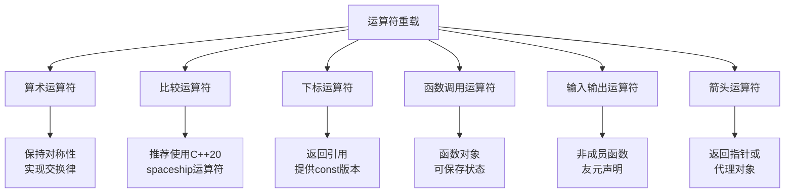

+++
title = "第13章 运算符重载"
weight = 130
date = "2026-03-29T21:03:00+08:00"
type = "docs"
description = ""
isCJKLanguage = true
draft = false
+++
# 第13章 运算符重载

想象一下，如果`+`只能做数字加法，生活该多无聊啊！`"Hello" + "World"`？不行不行，得调函数！`vec1 + vec2`？做梦吧您！幸好C++给了我们**运算符重载**这把魔法棒，让我们可以重新定义运算符的行为。今天就让我们一起来玩转这把魔法棒，看看如何让`+`做加法以外的事情——当然，是做**有意义**的事情！

## 13.1 运算符重载基础

运算符重载（Operator Overloading）是C++的一项超级power功能，它允许我们为自定义类型重新定义运算符的含义。简单来说，就是让`+`、`-`、`<<`这些运算符不仅能处理内置类型（int、double等），还能处理我们自己的类。

> 把运算符重载理解成给运算符发一张"新工作证"——它本来只会做一件事（比如int相加），但现在我们可以训练它做新事情（比如复数相加、向量相加）。但别忘了，**重载不等于乱来**，保持语义一致是关键！

### 可重载运算符列表

C++允许重载的运算符基本上涵盖了所有常用的二元和一元运算符，但有一些"铁饭碗"运算符是坚决不让重载的——它们的重要性太高了，不能随便改写。

```cpp
#include <iostream>

// C++允许重载的运算符：
// 算术：+ - * / % ++ --
// 位运算：& | ^ ~ << >>
// 赋值：= += -= *= /= %= &= |= ^= <<= >>=
// 比较：== != < > <= >=
// 逻辑：&& || !
// 其他：() [] -> ->* new delete new[] delete[]
// 不能重载的：:: . .* ?: sizeof typeid

class Complex {
private:
    double real_, imag_;  // 实部和虚部，这才是复数的灵魂！

public:
    // 构造函数，用初始化列表更高效哦
    Complex(double r = 0, double i = 0) : real_(r), imag_(i) {}

    // 重载+运算符，让复数可以相加
    // 规则：(a+bi) + (c+di) = (a+c) + (b+d)i
    Complex operator+(const Complex& other) const {
        return Complex(real_ + other.real_, imag_ + other.imag_);
    }

    // 打印复数，带点格式化更美观
    void print() const {
        std::cout << real_ << (imag_ >= 0 ? "+" : "") << imag_ << "i" << std::endl;
    }
};

int main() {
    Complex a(3.0, 4.0);  // 3 + 4i，复数界的经典款
    Complex b(1.0, 2.0);  // 1 + 2i

    Complex c = a + b;    // 使用重载的+运算符，就像魔法一样！
    c.print();            // 输出: 4+6i

    return 0;
}
```

这个例子展示了最基本的运算符重载：我们定义了一个`Complex`类（复数类），然后重载了`+`运算符，使得两个复数可以直接用`+`相加，而不用调用一个叫`add()`的函数。优雅，太优雅了！

### 运算符重载原则

重载运算符看起来很酷，但这里有两个黄金法则要牢记：

1. **保持原有语义**：如果`+`表示加法，重载后也要做加法，别搞成减法！
2. **不要创造性地"发明"**：运算符重载是为了让代码更自然，不是为了炫技

```cpp
#include <iostream>
#include <string>

class Number {
private:
    int value_;  // 存一个整数，很简单对吧？

public:
    Number(int v = 0) : value_(v) {}

    // 重载原则1：保持原有语义
    // + 就应该是加法，不是减法！不是乘法！
    Number operator+(const Number& other) const {
        return Number(value_ + other.value_);  // 正确示范！
    }

    // 重载原则2：不要太创造性的"发明"
    // 如果你把operator+实现成减法，你的同事会拿着40米大刀来找你
    // operator+应该做加法，不是减法！

    int getValue() const { return value_; }
};

int main() {
    Number a(10), b(20);
    Number c = a + b;  // 自然语义：10 + 20 = 30

    std::cout << "10 + 20 = " << c.getValue() << std::endl;  // 输出: 10 + 20 = 30

    return 0;
}
```

> 什么时候运算符重载是合理的？当你想要类型的行为"自然而然"的时候。比如，复数应该能相加，日期应该能相减（算天数），矩阵应该能相乘。但如果你试图让`+`表示字符串拼接，虽然技术上可行，但很可能会让未来的维护者一脸问号。

## 13.2 算术运算符重载

算术运算符是最常被重载的一类运算符。想象一下，如果你定义了一个二维向量类`Vec2`，你肯定希望可以直接用`v1 + v2`来计算向量加法，而不是调用`v1.add(v2)`。这不仅仅是懒，这是**追求优雅**！

```cpp
#include <iostream>

class Vec2 {
private:
    double x_, y_;  // 二维向量的x和y坐标

public:
    Vec2(double x = 0, double y = 0) : x_(x), y_(y) {}

    // +运算符：向量加法
    // (x1, y1) + (x2, y2) = (x1+x2, y1+y2)
    Vec2 operator+(const Vec2& other) const {
        return Vec2(x_ + other.x_, y_ + other.y_);
    }

    // -运算符：向量减法
    Vec2 operator-(const Vec2& other) const {
        return Vec2(x_ - other.x_, y_ - other.y_);
    }

    // 一元负运算符：取反
    // (x, y) -> (-x, -y)
    Vec2 operator-() const {
        return Vec2(-x_, -y_);
    }

    // +=运算符（成员）：修改自身并返回引用
    Vec2& operator+=(const Vec2& other) {
        x_ += other.x_;
        y_ += other.y_;
        return *this;  // 返回引用支持链式调用，如 a += b += c
    }

    // *=运算符：标量乘法
    Vec2& operator*=(double scalar) {
        x_ *= scalar;
        y_ *= scalar;
        return *this;
    }

    // 友元声明：让非成员运算符也能访问private成员
    friend Vec2 operator*(const Vec2& v, double scalar);
    friend Vec2 operator*(double scalar, const Vec2& v);

    void print() const {
        std::cout << "(" << x_ << ", " << y_ << ")" << std::endl;
    }
};

// 非成员运算符实现交换律：v * 2 = 2 * v
// 如果只定义成员形式的 v * 2，那 2 * v 就无法编译了！
Vec2 operator*(const Vec2& v, double scalar) {
    return Vec2(v.x_ * scalar, v.y_ * scalar);
}

// 复用上面的实现，保持DRY原则（Don't Repeat Yourself）
// 注意：这里 v * scalar 调用的是成员函数 Vec2::operator*(double)，而非自身，避免无限递归
Vec2 operator*(double scalar, const Vec2& v) {
    return v * scalar;  // 调用成员函数 Vec2::operator*(double)
}

int main() {
    Vec2 v1(1.0, 2.0);
    Vec2 v2(3.0, 4.0);

    Vec2 v3 = v1 + v2;
    std::cout << "v1 + v2 = "; v3.print();  // 输出: (4, 6)

    Vec2 v4 = -v1;  // 一元负运算符
    std::cout << "-v1 = "; v4.print();  // 输出: (-1, -2)

    v1 += v2;  // 记住，+=修改了v1自身！
    std::cout << "v1 += v2: "; v1.print();  // 输出: (4, 6)

    Vec2 v5 = v1 * 2.0;   // Vec2 * double
    Vec2 v6 = 3.0 * v2;   // double * Vec2，都能编译！
    std::cout << "v1 * 2 = "; v5.print();  // 输出: (8, 12)
    std::cout << "3 * v2 = "; v6.print();  // 输出: (9, 12)

    return 0;
}
```

> 小贴士：为什么`operator*`要用非成员函数？因为数学上乘法是**交换的**——`v * 2`应该等于`2 * v`。如果只定义成员函数`Vec2::operator*(double)`，那你只能写`v * 2`，写`2 * v`编译器就会报错："没有匹配的操作符"。

## 13.3 关系运算符重载

关系运算符（`==`、`!=`、`<`、`<=`、`>`、`>=`）的重载在C++中超级重要，因为它们是STL容器（如`std::set`、`std::map`）和算法（如`std::sort`）的基石。没有比较运算符，你的自定义类型就别想放进`std::set`里了！

```cpp
#include <iostream>
#include <string>

class Person {
private:
    std::string name_;  // 姓名
    int age_;            // 年龄

public:
    Person(const std::string& name, int age) : name_(name), age_(age) {}

    // ==运算符：判断两个人是否"完全相同"
    bool operator==(const Person& other) const {
        return name_ == other.name_ && age_ == other.age_;
    }

    // !=运算符：直接取反就好了，偷懒是美德
    bool operator!=(const Person& other) const {
        return !(*this == other);
    }

    // <运算符：用于std::set、std::map等有序容器
    // 字典序比较：先比姓名，姓名相同再比年龄
    bool operator<(const Person& other) const {
        if (name_ != other.name_) return name_ < other.name_;
        return age_ < other.age_;
    }

    // <= > >= 通常基于<和==
    bool operator<=(const Person& other) const {
        return !(other < *this);  // a <= b 等价于 !(b < a)
    }

    bool operator>(const Person& other) const {
        return other < *this;  // a > b 等价于 b < a
    }

    bool operator>=(const Person& other) const {
        return !(*this < other);  // a >= b 等价于 !(a < b)
    }

    void print() const {
        std::cout << name_ << " (" << age_ << ")" << std::endl;
    }
};

int main() {
    Person alice1("Alice", 25);
    Person alice2("Alice", 25);
    Person bob("Bob", 30);

    std::cout << "alice1 == alice2: " << (alice1 == alice2) << std::endl;  // 输出: 1 (true)
    std::cout << "alice1 != bob: " << (alice1 != bob) << std::endl;        // 输出: 1 (true)
    std::cout << "alice1 < bob: " << (alice1 < bob) << std::endl;          // 输出: 1 (Alice < Bob字典序)

    return 0;
}
```

> 重要规则：如果重载了`==`，通常也应该重载`!=`，因为它们逻辑上是配对的。同样，如果你的类型要放入`std::set`或`std::map`，就必须重载`operator<`。C++20引入了`operator<=>`（宇宙飞船运算符），可以一键生成所有比较运算符，后面的章节会详细介绍！

## 13.4 输入输出运算符重载

`<<`和`>>`是我们老朋友`std::ostream`和`std::istream`的成员函数（或者说，是它们的插入/提取运算符）。重载这两个运算符可以让你直接用`cout << obj`来打印对象，用`cin >> obj`来读取输入，简直是调试神器！

```cpp
#include <iostream>
#include <string>

class Point {
private:
    double x_, y_;  // 平面上的一个点

public:
    Point(double x = 0, double y = 0) : x_(x), y_(y) {}

    // 友元声明：允许operator<<访问private成员
    // 必须是非成员函数，因为左操作数是ostream而不是Point
    friend std::ostream& operator<<(std::ostream& os, const Point& p);
    friend std::istream& operator>>(std::istream& is, Point& p);
};

// operator<<必须是友元或非成员函数
// 返回ostream引用是为了支持链式调用：cout << p1 << p2 << endl;
std::ostream& operator<<(std::ostream& os, const Point& p) {
    os << "(" << p.x_ << ", " << p.y_ << ")";
    return os;  // 返回ostream引用以支持链式调用
}

// operator>>：从输入流读取点，格式是 (x, y)
std::istream& operator>>(std::istream& is, Point& p) {
    char ch;  // 用于读取括号和逗号
    is >> ch >> p.x_ >> ch >> p.y_ >> ch;  // 读取格式 (x, y)
    return is;  // 返回istream引用以支持链式调用
}

int main() {
    Point p1(3.14, 2.71);
    Point p2;

    // 使用重载的<<输出，再也不用写print()了！
    std::cout << "p1 = " << p1 << std::endl;  // 输出: p1 = (3.14, 2.71)

    // 使用重载的>>输入
    std::cout << "Enter point (x, y): ";
    std::cin >> p2;
    std::cout << "You entered: " << p2 << std::endl;

    return 0;
}
```

> 为什么`<<`和`>>`必须是友元或非成员函数？因为它们左边的操作数是`std::ostream`或`std::istream`，不是我们的`Point`类型。如果写成成员函数，那调用方式就变成了`p1 << cout`，语义完全反了！

## 13.5 下标运算符重载

`operator[]`是数组的"灵魂伴侣"，重载它可以让你用`arr[i]`的方式访问自定义容器。而且，它可以返回**引用**，这意味着既可以读也可以写！太棒了！

```cpp
#include <iostream>

class SafeArray {
private:
    static const int MAX_SIZE = 100;  // 数组最大容量
    int data_[MAX_SIZE];              // 存储数据的数组
    int size_;                         // 实际大小

public:
    SafeArray(int size) : size_(size) {
        // 初始化，每个元素的值是索引*10
        for (int i = 0; i < size_; ++i) {
            data_[i] = i * 10;
        }
    }

    // 下标运算符（返回引用，可读可写）
    // 关键点：返回int&而不是int，这样 arr[2] = 999 才能工作！
    int& operator[](int index) {
        if (index < 0 || index >= size_) {
            throw std::out_of_range("Index out of bounds! 索引越界啦！");
        }
        return data_[index];
    }

    // const版本：只读访问，用于const对象或const引用
    // 如果不提供const版本，const对象就只能读取普通数组了
    const int& operator[](int index) const {
        if (index < 0 || index >= size_) {
            throw std::out_of_range("Index out of bounds! 索引越界啦！");
        }
        return data_[index];
    }

    int size() const { return size_; }
};

int main() {
    SafeArray arr(5);

    // 读取元素
    std::cout << "arr[2] = " << arr[2] << std::endl;  // 输出: arr[2] = 20

    // 修改元素
    arr[2] = 999;  // 返回的是引用，所以可以赋值！
    std::cout << "After modify, arr[2] = " << arr[2] << std::endl;
    // 输出: After modify, arr[2] = 999

    // const对象只能调用const版本
    const SafeArray& constArr = arr;
    std::cout << "constArr[0] = " << constArr[0] << std::endl;  // 输出: constArr[0] = 0

    // arr[10] = 0;  // 注释掉这句！运行时会抛出异常：Index out of bounds!

    return 0;
}
```

> 划重点：如果你希望对象既可读又可写，一定要同时提供**两个版本**的下标运算符：普通版本返回`int&`，const版本返回`const int&`。否则const对象就只能读不能写了，或者反过来。

### 多维下标运算符

虽然`operator[]`只能接受一个参数，但我们可以使用`operator()`（函数调用运算符）来实现多维下标访问。这种写法比`m[row * 3 + col]`直观多了！

```cpp
#include <iostream>

class Matrix2D {
private:
    int data_[9];  // 3x3 matrix，用一维数组存储

public:
    Matrix2D() {
        // 初始化 0 1 2
        //         3 4 5
        //         6 7 8
        for (int i = 0; i < 9; ++i) data_[i] = i;
    }

    // 使用 operator() 实现多维下标访问
    // 注意是圆括号而不是方括号，这样可以用 m(1, 1) 来访问二维矩阵

    int& operator()(int row, int col) {
        if (row < 0 || row >= 3 || col < 0 || col >= 3) {
            throw std::out_of_range("Matrix index out of range 矩阵索引越界！");
        }
        return data_[row * 3 + col];  // 将二维索引转为一维存储
    }

    const int& operator()(int row, int col) const {
        return data_[row * 3 + col];
    }

    // 打印整个矩阵
    void print() const {
        for (int i = 0; i < 3; ++i) {
            for (int j = 0; j < 3; ++j) {
                std::cout << (*this)(i, j) << " ";
            }
            std::cout << std::endl;
        }
    }
};

int main() {
    Matrix2D m;

    std::cout << "m(1, 1) = " << m(1, 1) << std::endl;  // 输出: m(1, 1) = 4

    m(1, 1) = 100;  // 修改元素
    std::cout << "After modify, m(1, 1) = " << m(1, 1) << std::endl;
    // 输出: After modify, m(1, 1) = 100

    return 0;
}
```

> 小贴士：使用**圆括号**`()`而不是方括号`[]`来实现多维下标访问。`[]`只能接受一个参数，而`()`可以接受任意多个参数。用`m(row, col)`访问二维矩阵，比`m[row * n + col]`直观多了！

### 静态下标运算符

**静态**下标运算符意味着你可以不创建对象就直接调用`ClassName[i]`，就像访问静态数组一样。这在设计"全局注册表"或"配置类"时很有用。

```cpp
#include <iostream>

class Registry {
public:
    // 静态operator[]
    // 可以在不创建对象的情况下调用
    // 就像访问一个全局的注册表一样

    static int data[5];  // 静态数据成员

    static int& operator[](int index) {
        return data[index];
    }
};

// 静态成员定义
int Registry::data[5] = {10, 20, 30, 40, 50};

int main() {
    // 不需要创建Registry对象就能使用
    // 语法：ClassName[index]
    std::cout << "Registry[0] = " << Registry[0] << std::endl;  // 输出: Registry[0] = 10

    Registry[0] = 999;  // 也可以修改
    std::cout << "Registry[0] = " << Registry[0] << std::endl;  // 输出: Registry[0] = 999

    return 0;
}
```

> 静态下标运算符看起来很酷，但使用时要小心语义清晰。`Registry[0]`到底是访问什么东西？如果你的类有多个静态数组，用命名更明确的静态方法可能更清晰。

## 13.6 箭头运算符重载

`operator->`是C++中最独特的运算符之一，它的特别之处在于：**即使返回的是一个指针，你仍然可以继续使用`->`访问成员**。这种"递归"调用机制叫作"指针代理"（Pointer Proxy），是实现智能指针和迭代器的基石。

```cpp
#include <iostream>

class Ptr {
private:
    int* data_;  // 代理一个动态分配的整数

public:
    Ptr(int* p) : data_(p) {}

    // operator-> 必须返回指针（或另一个重载了->的对象）
    // 关键点：即使返回的是int*，调用方仍然可以继续用 ->
    // 编译器会解引用并访问其成员
    int* operator->() const {
        return data_;
    }

    ~Ptr() { delete data_; }
};

class Widget {
public:
    void display() const {
        std::cout << "Widget::display() called!" << std::endl;
    }

    int value = 42;
};

int main() {
    Widget w;
    Ptr p(&w);

    // p-> 返回 int*，但 -> 会继续解引用，所以可以访问 Widget 的成员！
    p->display();           // 输出: Widget::display() called!
    std::cout << "p->value = " << p->value << std::endl;  // 输出: p->value = 42

    return 0;
}
```

> `operator->`的返回类型非常灵活：可以是`T*`（最常见），也可以是另一个重载了`operator->`的对象（形成调用链）。这就是智能指针如`std::unique_ptr`和迭代器如`std::map::iterator`的工作原理！

### 链式箭头运算符

`operator->`的一个重要特性是它可以被链式调用：

```cpp
#include <iostream>

class Inner {
public:
    int x = 100;
};

class Middle {
public:
    Inner inner;
    Inner* operator->() { return &inner; }
};

class Outer {
public:
    Middle middle;
    Middle* operator->() { return &middle; }
};

int main() {
    Outer obj;
    // 链式调用：obj->x 会递归调用 operator->()
    // obj.operator->() 返回 Middle*（指向 middle）
    // 编译器发现返回值还是类类型指针，继续调用 Middle::operator->()，得到 Inner*
    // 最终通过 Inner* 访问 x 成员
    std::cout << "obj->x = " << obj->x << std::endl;  // 输出: obj->x = 100

    return 0;
}
```

> 关键点：`operator->`具有递归特性！当你写`obj->x`时，编译器会递归调用`operator->()`，直到获得一个真正的指针（`Inner*`），然后才执行`->x`访问。这就是智能指针和迭代器的实现原理——每一层代理都可以继续代理下去！

## 13.7 函数调用运算符重载

`operator()`被称为**函数调用运算符**（Functor Operator）。重载它可以让类的对象"假装"是一个函数——可以像函数一样用`()`调用，但同时还能保存状态！这在STL算法中超级有用。

```cpp
#include <iostream>
#include <vector>
#include <algorithm>

class Add {
private:
    int delta_;  // 要加的数值

public:
    Add(int d) : delta_(d) {}

    // 重载函数调用运算符
    int operator()(int x) const {
        return x + delta_;  // 返回 x + delta
    }
};

class MeanValue {
private:
    std::vector<int> data_;  // 存储数据

public:
    MeanValue(const std::vector<int>& d) : data_(d) {}

    // 无参函数调用运算符
    double operator()() const {
        if (data_.empty()) return 0.0;
        long sum = 0;
        for (int v : data_) sum += v;
        return static_cast<double>(sum) / data_.size();
    }
};

int main() {
    // 函数对象（Functor）：可以保存状态的"函数"
    Add add5(5);  // 创建了一个"加5"的计算器
    std::cout << "add5(10) = " << add5(10) << std::endl;   // 输出: add5(10) = 15
    std::cout << "add5(100) = " << add5(100) << std::endl; // 输出: add5(100) = 105

    // 用于STL算法：std::transform
    std::vector<int> nums = {1, 2, 3, 4, 5};

    // 将每个元素加10
    std::transform(nums.begin(), nums.end(), nums.begin(), Add(10));

    std::cout << "After adding 10: ";
    for (int n : nums) std::cout << n << " ";  // 输出: 11 12 13 14 15
    std::cout << std::endl;

    // 计算平均值
    MeanValue mean(nums);
    std::cout << "Mean value: " << mean() << std::endl;  // 输出: Mean value: 13

    return 0;
}
```

> 为什么用函数对象而不是普通函数？因为函数对象可以**保存状态**！`Add(10)`创建了一个"加10"的计算器，这个对象里存着数字10。每次调用`operator()`时，它都知道要加10。而普通函数`addTen(x)`就只是一个函数，无法保存额外信息。

### 静态函数调用运算符

函数调用运算符也可以是**静态**的！这意味着你可以不创建对象就调用`ClassName(args)`，就像调用一个命名空间函数一样。

```cpp
#include <iostream>

class Adder {
public:
    // 静态operator()
    // 可以不用创建对象直接调用
    // Adder(1, 2) 就像调用一个命名空间函数

    static int operator()(int a, int b) {
        return a + b;
    }

    static std::string operator()(const std::string& a, const std::string& b) {
        return a + b;  // 字符串拼接
    }
};

int main() {
    // 不需要创建Adder对象
    std::cout << "Adder(1, 2) = " << Adder(1, 2) << std::endl;  // 输出: Adder(1, 2) = 3

    std::cout << "Adder(\"Hello\", \" World\") = " << Adder("Hello", " World") << std::endl;
    // 输出: Adder("Hello", " World") = Hello World

    return 0;
}
```

> 静态`operator()`的好处是可以把相关的静态方法集中在一个类里。如果你有一组功能相关的纯函数，可以用这种方式"命名空间化"它们，同时语法上还是函数调用。

## 13.8 递增递减运算符重载

`++`和`--`看起来简单，但它们有**前置**和**后置**两个版本。前置返回引用（++后马上用），后置返回值（旧值的拷贝）。这个区别在重载时尤为重要！

### 前置与后置的区别

```cpp
#include <iostream>

class Counter {
private:
    int value_;  // 计数器当前值

public:
    Counter(int v = 0) : value_(v) {}

    // 前置++：先加1，返回引用
    // 语义：++c 表示"先增加，再使用"
    Counter& operator++() {
        ++value_;        // 先增加
        return *this;   // 返回引用，性能更好
    }

    // 后置++：先返回旧值，再加1
    // 关键：用int参数区分前置版本！编译器会传0作为这个参数
    Counter operator++(int) {
        Counter temp(*this);  // 拷贝当前值的副本
        ++value_;              // 增加
        return temp;          // 返回旧值的副本（不是引用！）
    }

    // 前置--：先减1，返回引用
    Counter& operator--() {
        --value_;
        return *this;
    }

    // 后置--：先返回旧值，再减1
    Counter operator--(int) {
        Counter temp(*this);
        --value_;
        return temp;
    }

    int get() const { return value_; }
};

int main() {
    Counter c(5);

    std::cout << "c = " << c.get() << std::endl;  // 输出: c = 5

    Counter c1 = ++c;  // 前置：先加到6，然后赋值给c1
    std::cout << "++c = " << c1.get() << ", c = " << c.get() << std::endl;
    // 输出: ++c = 6, c = 6 (c自己也变成6了)

    Counter c2 = c++;  // 后置：先赋值c2=6，然后c再加1变成7
    std::cout << "c++ = " << c2.get() << ", c = " << c.get() << std::endl;
    // 输出: c++ = 6, c = 7 (c2是旧值，c是新值)

    Counter c3 = --c;  // 前置递减
    std::cout << "--c = " << c3.get() << ", c = " << c.get() << std::endl;
    // 输出: --c = 6, c = 6

    Counter c4 = c--;  // 后置递减
    std::cout << "c-- = " << c4.get() << ", c = " << c.get() << std::endl;
    // 输出: c-- = 6, c = 5

    return 0;
}
```

> 小技巧：如何记住前置和后置的区别？
> - **前置**：`++i` → 先变后用 → 返回引用
> - **后置**：`i++` → 先用后变 → 返回值（副本）
>
> 小孩子才做选择，成年人全都要——但要分清楚场景！如果你不需要返回旧值，用前置更高效（省去了拷贝构造）。

## 13.9 类型转换运算符

类型转换运算符（`operator Type()`）允许类的对象在特定情况下自动或显式转换为其他类型。这在设计API时非常有用，但也要小心隐式转换的陷阱！

```cpp
#include <iostream>
#include <string>

class Fraction {
private:
    int numerator_;    // 分子
    int denominator_;   // 分母

public:
    Fraction(int n, int d) : numerator_(n), denominator_(d) {}

    // 转换为double（显式转换，防止意外）
    // explicit关键字：必须用static_cast才能转换
    explicit operator double() const {
        return static_cast<double>(numerator_) / denominator_;
    }

    // 转换为int（隐式转换，但会截断小数部分）
    operator int() const {
        return numerator_ / denominator_;  // 整数除法，直接截断
    }

    void print() const {
        std::cout << numerator_ << "/" << denominator_ << std::endl;
    }
};

int main() {
    Fraction f(7, 3);  // 7/3 = 2.333...

    f.print();  // 输出: 7/3

    // 显式转换为double：需要static_cast
    double d = static_cast<double>(f);
    std::cout << "As double: " << d << std::endl;  // 输出: As double: 2.33333

    // 隐式转换为int：直接赋值就自动转换了
    int i = f;  // 7/3 = 2（截断）
    std::cout << "As int: " << i << std::endl;  // 输出: As int: 2

    return 0;
}
```

> 什么时候用`explicit`？当你不想让转换悄悄发生时。`explicit operator double()`意味着你必须写`static_cast<double>(f)`才能转换，不能写`double d = f;`。这可以防止一些意外的类型转换。

### 避免隐式转换陷阱

隐式类型转换是双刃剑——用得好是神器，用不好是坑货。来看看如何避免隐式转换的陷阱：

```cpp
#include <iostream>
#include <string>

class String {
private:
    std::string data_;  // 实际存储的字符串

public:
    String(const std::string& s) : data_(s) {}

    // explicit构造函数：不能隐式地从const char*构造String
    explicit String(const char* s) : data_(s) {}

    // 非explicit的转换运算符：可以隐式转换为const char*
    operator const char*() const {
        return data_.c_str();
    }
};

void processString(const std::string& s) {
    std::cout << "Processing: " << s << std::endl;
}

int main() {
    // String s1 = "Hello";  // 编译错误！因为String的构造函数是explicit
    // 不能隐式转换：const char* -> String

    String s2("Hello");            // OK：显式构造
    String s3(std::string("World"));  // OK：显式构造

    // processString(s2);  // 危险！需要隐式转换：String -> const char* -> std::string
    // 可能产生意外行为，不推荐！

    processString(static_cast<std::string>(s2));  // OK：显式转换，明确告诉编译器要什么

    return 0;
}
```

> 黄金法则：如果构造函数只接受一个参数，加上`explicit`关键字可以防止意外的类型转换。除非你**真的希望**这种隐式转换发生。

## 13.10 三向比较运算符 <=>（C++20）

C++20引入了一个革命性的运算符——宇宙飞船运算符`<=>`（Spaceship Operator）！它的名字来源于星际迷航中的宇宙飞船。这个运算符一次比较就能返回三种结果：**小于**、**等于**、**大于**。更棒的是，只要你定义了`<=>`，编译器就能自动生成所有比较运算符！

```cpp
#include <iostream>
#include <compare>

class Version {
private:
    int major_, minor_, patch_;  // 版本号：主版本.次版本.补丁版本

public:
    Version(int m, int n, int p) : major_(m), minor_(n), patch_(p) {}

    // C++20: 三向比较运算符（宇宙飞船运算符）
    // 返回一个可以比较的对象，支持 <, ==, > 等
    auto operator<=>(const Version& other) const {
        // 链式比较：先比major，不相等就返回；相等再比minor...
        if (auto cmp = major_ <=> other.major_; cmp != 0) return cmp;
        if (auto cmp = minor_ <=> other.minor_; cmp != 0) return cmp;
        return patch_ <=> other.patch_;
    }

    // == 运算符自动生成（基于<=>）
    bool operator==(const Version& other) const = default;

    void print() const {
        std::cout << major_ << "." << minor_ << "." << patch_ << std::endl;
    }
};

int main() {
    Version v1(1, 2, 3);
    Version v2(1, 2, 3);
    Version v3(1, 3, 0);

    std::cout << "v1 == v2: " << (v1 == v2) << std::endl;    // 输出: 1 (true)
    std::cout << "v1 < v3: " << (v1 < v3) << std::endl;      // 输出: 1 (true，minor更小)
    std::cout << "v1 > v3: " << (v1 > v3) << std::endl;      // 输出: 0 (false)
    std::cout << "v1 <=> v3 结果: " << ((v1 <=> v3) == 0 ? "等于" : ((v1 <=> v3) < 0 ? "小于" : "大于")) << std::endl;
    // 输出: v1 <=> v3 结果: 小于

    return 0;
}
```

> `<=>`运算符的返回值是一个**比较类别**（comparison category）类型：
> - `std::strong_ordering`：用于没有等价概念的比较（如整数）
> - `std::weak_ordering`：用于有等价概念但不等同的比较（如字符串忽略大小写）
> - `std::partial_ordering`：用于支持"无序"比较的类型（如浮点数）
>
> 定义一次`<=>`，六种比较运算符全搞定！这就是C++20的威力！

## 13.11 默认比较（C++20）

如果你觉得`<=>`还是太复杂，C++20还提供了更简单的语法——`= default`！只要一行代码，编译器就能自动生成所有比较运算符。这简直是懒人福音！

```cpp
#include <iostream>

struct Point {
    int x, y;  // 坐标

    // C++20: = default 自动生成所有比较运算符
    // 编译器会自动生成 operator<=>、operator== 以及所有六个比较运算符
    auto operator<=>(const Point&) const = default;
};

int main() {
    Point p1{1, 2};
    Point p2{1, 2};
    Point p3{3, 4};

    std::cout << "p1 == p2: " << (p1 == p2) << std::endl;  // 输出: 1 (true)
    std::cout << "p1 != p3: " << (p1 != p3) << std::endl;   // 输出: 1 (true)
    std::cout << "p1 < p3: " << (p1 < p3) << std::endl;    // 输出: 1 (true，按字典序比较)
    std::cout << "p1 <= p2: " << (p1 <= p2) << std::endl;   // 输出: 1 (true)

    // spaceship运算符自动推导所有比较
    std::cout << "Default spaceship comparison works!" << std::endl;
    // 输出: Default spaceship comparison works!

    return 0;
}
```

> `= default`的比较运算符使用**成员逐个比较**的字典序（lexicographical ordering）。也就是说，先比较`x`，如果相等再比较`y`。简单粗暴但有效！

## 13.12 运算符重载陷阱

运算符重载虽然强大，但也有雷区。以下是几个经典的"不要这样做"：

### 不要重载&&、||、,

```cpp
#include <iostream>

class Widget {
public:
    // 危险！不要重载 && || ,
    bool operator&&(const Widget&) const {
        std::cout << "Custom && called" << std::endl;
        return true;
    }

    bool operator||(const Widget&) const {
        std::cout << "Custom || called" << std::endl;
        return true;
    }
};

// 原因：短路求值规则会被破坏！
// 原生的&& || 短路求值：第一个条件为false/true时，不计算第二个
// 重载后：两个操作数都会被求值，且求值顺序不确定！

int main() {
    Widget w1, w2;

    // if (w1 && w2) { ... }
    // 危险：编译器可能先算w2再算w1（与预期相反！）
    // 而且由于是函数调用，参数求值顺序完全不确定

    std::cout << "Danger: Don't overload && and ||" << std::endl;
    std::cout << "Reason: Short-circuit evaluation is broken!" << std::endl;

    return 0;
}
```

> 重要的事情说三遍：**不要重载`&&`和`||`！不要重载`&&`和`||`！不要重载`&&`和`||`！**
>
> 原生的`&&`和`||`有**短路求值**特性：如果是`a && b`，当`a`为`false`时，`b`根本不会被执行。如果是重载的`operator&&`，由于它是普通函数，所有参数在调用前都必须被求值，这就破坏了短路语义，可能导致**未定义行为**。

### 对称性问题

对称运算符（如`+`、`-`、`*`、`/`）需要是**非成员函数**，以确保交换律成立。也就是说，`a + b`应该等于`b + a`。

```cpp
#include <iostream>

class Number {
private:
    int value_;  // 存储的值

public:
    Number(int v = 0) : value_(v) {}

    // 如果+是对称的，a+b应该等于b+a
    Number operator+(int rhs) const {
        return Number(value_ + rhs);
    }

    // 问题：这只支持 Number + int，不支持 int + Number！
    // 交换律问题：需要非成员函数来实现

    // friend Number operator+(int lhs, const Number& rhs);  // 友元声明

    int getValue() const { return value_; }
};

// 实现交换律：int + Number 和 Number + int 都支持！
Number operator+(int lhs, const Number& rhs) {
    return Number(lhs + rhs.getValue());
}

int main() {
    Number n(10);

    Number r1 = n + 5;   // OK: n.operator+(5)
    Number r2 = 5 + n;   // OK: operator+(5, n)

    std::cout << "n + 5 = " << r1.getValue() << std::endl;  // 输出: 15
    std::cout << "5 + n = " << r2.getValue() << std::endl;  // 输出: 15

    // 如果没有operator+(int, Number)，5+n会编译失败！
    // 编译器会报错："没有匹配的operator+"

    return 0;
}
```

> 对称性法则：对于数学上对称的运算符（如加法、乘法），一定要同时提供**成员函数版本**和**非成员函数版本**，或者只提供非成员函数版本。这样才能保证`a + b`和`b + a`都能正常工作。

---

## 本章小结

本章我们探索了C++运算符重载的精彩世界，现在让我们来回顾一下学到的要点：

| 运算符类型 | 重载方式 | 注意事项 |
|-----------|---------|---------|
| 算术运算符`+`, `-`, `*`, `/` | 成员或非成员 | 对称运算符用非成员实现交换律 |
| 复合赋值`+=`, `-=`, `*=` | 成员，返回引用 | 修改自身，支持链式调用 |
| 比较运算符`==`, `<`, `>`等 | 成员或非成员 | 推荐用C++20的`<=>`一键生成 |
| `<<`, `>>` | 非成员，友元 | 返回ostream/istream引用 |
| `[]` | 成员，返回引用 | 同时提供const版本 |
| `()` 函数调用 | 成员 | 可保存状态的"函数"，支持静态版本 |
| `->` 箭头运算符 | 成员 | 必须返回指针或另一个重载了->的对象 |
| `++`, `--` | 成员 | 用`int`参数区分后置版本 |
| 类型转换 | 成员 | 谨慎使用，考虑`explicit` |

**核心原则**：
1. **保持语义**：重载运算符应该做它"应该做"的事情
2. **对称性**：数学运算符要考虑交换律
3. **避免陷阱**：不要重载`&&`、`||`、`,`
4. **善用C++20**：`<=>`可以一键生成所有比较运算符

运算符重载是C++最强大的特性之一，用得好可以让代码优雅得像诗，用不好则会变成天书。记住：能力越大，责任越大！



> 最后的最后，记住一句箴言：**运算符重载不是为了炫技，而是为了让代码更自然、更易读。** 如果你发现自己重载的运算符语义很奇怪，那多半是你错了，不是语言错了。

---

恭喜你完成了第13章的学习！继续加油，向C++大师之路迈进！ 🚀
