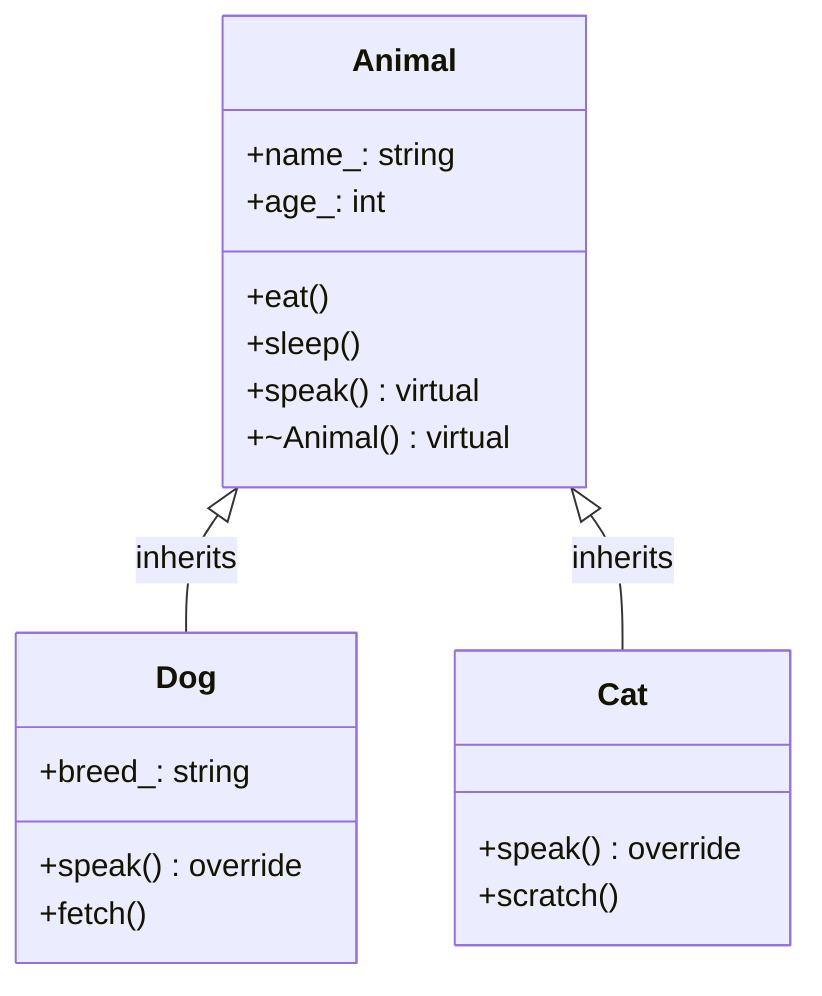
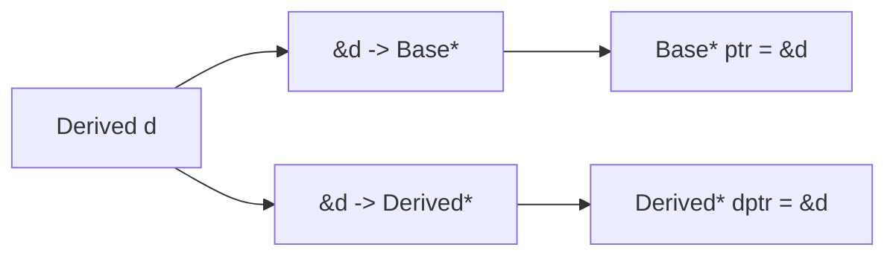
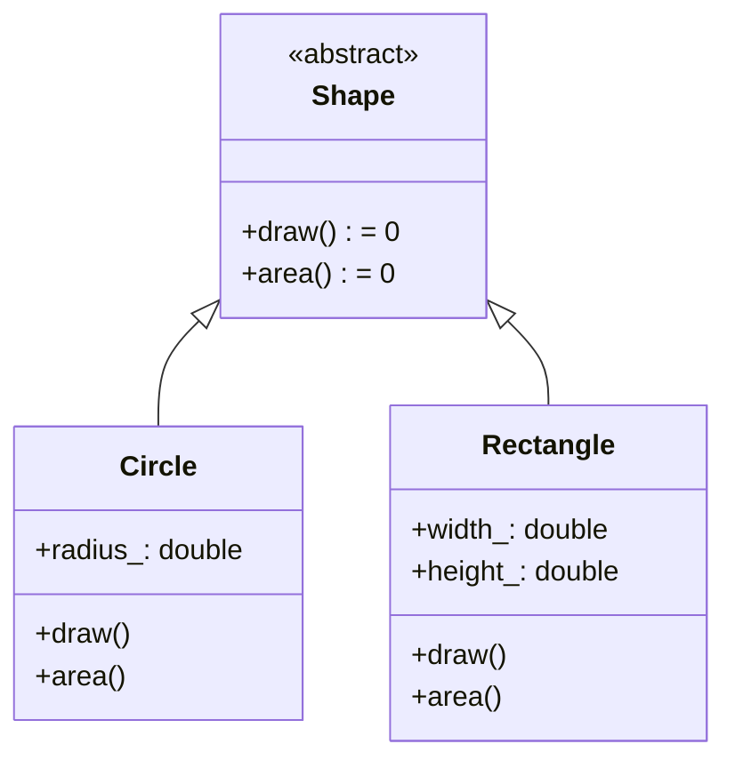
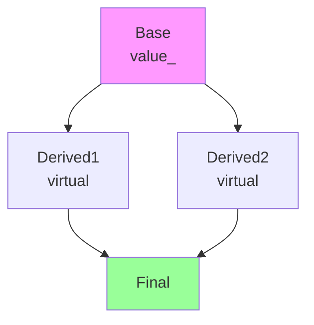

+++
title = "第14章 继承与多态"
weight = 140
date = "2026-03-29T21:03:00+08:00"
type = "docs"
description = ""
isCJKLanguage = true
draft = false
+++
# 第14章 继承与多态

各位看官，如果把C++比作一座金碧辉煌的城堡，那继承和多态就是这座城堡里最让人又爱又恨的两件魔法道具。为啥说"又爱又恨"呢？因为它们太强大了，强大到你可以用它们构建出无比优雅的程序结构；但它们也太复杂了，复杂到有时候你明明觉得自己写对了，程序却像调皮的小精灵一样不听使唤。准备好了吗？让我们戴上程序员的帽子，拿起键盘，开始这场继承与多态的冒险之旅！

## 14.1 继承的概念与语法

### 什么是继承？你家的"传家宝"了解一下！

想象一下，你爸给你留了一套房子，还有你爸的"地中海"发型（别笑，这是遗传）。在C++的世界里，继承就是这个道理——**子类自动获得父类的"财产"（成员变量和成员函数）**。只不过C++里的继承比现实生活公平多了，子类可以选择接受哪些"财产"、重写哪些"家规"，甚至添加自己的"私房钱"（新成员）。

在继承关系中：
- **基类（Base Class）**：也叫父类或超类（Superclass），就像家族中的老祖宗，是一切的开始。
- **派生类（Derived Class）**：也叫子类（Subclass），从基类那里继承"家业"，同时可以发扬光大或者改弦更张。

> 继承的核心思想：**代码复用**。不需要重复造轮子，站在巨人的肩膀上才能看得更远！

### "is-a"关系：狗是动物吗？

公有继承（public inheritance）代表 **"is-a"** 关系——"是一个"的关系。这意味着什么？意味着**Dog is an Animal**（狗是一种动物）。如果这个关系成立，那公有继承就是合适的。如果你说"狗是一个动物"，这没毛病吧？所以Dog公有继承Animal是合理的。

但如果你说"车库是一个汽车"，这就尴尬了——车库不可能公有继承汽车，因为它们之间根本不是"是一个"的关系。记住这个原则：**公有继承意味着"是一个"关系**。

### 代码时间！让我们建一个动物园！

```cpp
#include <iostream>
#include <string>

// 基类（父类）：所有动物的"老祖宗"
class Animal {
protected:  // protected：子类可以访问，外部不能访问
    std::string name_;  // 动物的名字
    int age_;           // 动物的年龄
    
public:
    // 构造函数：创建动物时必须给它起名字和年龄
    Animal(const std::string& name, int age) : name_(name), age_(age) {}
    
    // 吃：所有动物都要吃，这是共性
    void eat() const {
        std::cout << name_ << " is eating." << std::endl;
    }
    
    // 睡：所有动物都要睡觉
    void sleep() const {
        std::cout << name_ << " is sleeping." << std::endl;
    }
    
    // 叫：每个动物叫的方式不一样！设为virtual，让子类重写
    virtual void speak() const {
        std::cout << name_ << " makes a sound." << std::endl;
    }
    
    // 虚析构函数：这个很重要，后面会详细讲
    virtual ~Animal() {}
};

// 派生类：狗
class Dog : public Animal {  // public继承：保持"is-a"关系
private:
    std::string breed_;  // 品种是狗独有的
    
public:
    // 构造函数：需要调用父类的构造函数初始化继承来的成员
    Dog(const std::string& name, int age, const std::string& breed)
        : Animal(name, age), breed_(breed) {}
    
    // 重写（override）父类的speak方法：狗叫的方式自己定
    void speak() const override {
        std::cout << name_ << " barks: Woof! Woof!" << std::endl;
    }
    
    // 狗独有的技能：接飞盘！
    void fetch() const {
        std::cout << name_ << " fetches the ball!" << std::endl;
    }
};

// 派生类：猫
class Cat : public Animal {
public:
    Cat(const std::string& name, int age) : Animal(name, age) {}
    
    // 重写speak：猫叫的方式和狗不一样
    void speak() const override {
        std::cout << name_ << " meows: Meow~" << std::endl;
    }
    
    // 猫的独门绝技：挠沙发！
    void scratch() const {
        std::cout << name_ << " scratches the sofa." << std::endl;
    }
};

int main() {
    // 创建具体的动物对象
    Dog buddy("Buddy", 3, "Golden Retriever");  // 3岁的金毛Buddy
    Cat whiskers("Whiskers", 2);                  // 2岁的猫咪Whiskers
    
    // 用基类指针指向子类对象——这就是多态的入口！
    Animal* animals[] = {&buddy, &whiskers};
    
    std::cout << "=== 多态演示 ===" << std::endl;
    // 重点来了！同一个调用，不同的结果！
    for (auto* animal : animals) {
        animal->speak();  // 多态：调用正确版本
    }
    // 输出:
    // Buddy barks: Woof! Woof!
    // Whiskers meows: Meow~
    
    std::cout << "\n=== 继承演示 ===" << std::endl;
    buddy.eat();      // 继承自Animal的方法：狗也要吃饭
    buddy.fetch();    // Dog自己的方法：接飞盘
    
    whiskers.eat();     // 继承来的
    whiskers.scratch(); // 猫自己的
    
    return 0;
}
```

运行结果：

```
=== 多态演示 ===
Buddy barks: Woof! Woof!
Whiskers meows: Meow~

=== 继承演示 ===
Buddy is eating.
Buddy fetches the ball!
Whiskers is eating.
Whiskers scratches the sofa.
```

**语法解读：**

1. **`: Animal(name, age)`** —— 在子类构造函数中调用父类构造函数初始化继承的成员
2. **`public Animal`** —— 公有继承，保持"is-a"关系
3. **`void speak() const override`** —— `override`关键字（C++11）明确表示要重写父类虚函数
4. **`virtual void speak()`** —— 虚函数，用`virtual`声明，允许子类重写



> 温馨提示：虚函数是实现多态的关键！没有`virtual`，再怎么说"狗是动物"，调用`speak()`时也只能叫出"动物的声音"，而不是"汪汪汪"！

## 14.2 公有继承、保护继承与私有继承

### 继承方式三兄弟：公有的"光明正大"，保护的"内部流通"，私有的"藏着掖着"

C++提供了三种继承方式，它们决定了从父类继承来的成员在子类中的**访问级别**。让我们用一张表来搞清楚这个家族秘方：

| 父类成员原始级别 | 公有继承 → 子类中变成 | 保护继承 → 子类中变成 | 私有继承 → 子类中变成 |
|----------------|---------------------|---------------------|---------------------|
| public | public | protected | private |
| protected | protected | protected | private |
| private | **不可访问** | **不可访问** | **不可访问** |

```cpp
#include <iostream>

class Base {
public:
    int public_;      // 人人皆知的公开信息
protected:
    int protected_;   // 家族内部秘密，外部别想知道
private:
    int private_;     // 最高机密！连家人都不知道（真的不知道，不是不想说）
};

// 公有继承：保持原样，"我是你爹，这是我给你的东西"
class PublicDerived : public Base {
public:
    void access() {
        public_ = 1;      // OK：公开的还是公开的
        protected_ = 2;   // OK：保护的可以内部用
        // private_ = 3;  // 错误！private永远是private，即使我是你儿子
    }
};

// 保护继承：所有成员降一级，"家丑不可外扬"
class ProtectedDerived : protected Base {
public:
    void access() {
        public_ = 1;      // OK：虽然原来是public，但现在是protected了
        protected_ = 2;   // OK：保护的还是保护的
    }
};

// 私有继承：所有成员都变private，"我把爹的遗产全藏起来了"
class PrivateDerived : private Base {
public:
    void access() {
        public_ = 1;      // OK：在子类内部可以用
        protected_ = 2;   // OK：在子类内部可以用
    }
};

int main() {
    PublicDerived pub;
    pub.public_;  // OK：public成员外部可以访问
    // pub.protected_;  // 错误！protected成员外部不能访问
    
    // ProtectedDerived prot;  // 错误！没有任何public成员
    // PrivateDerived priv;    // 错误！没有任何public成员
    
    std::cout << "继承访问模式演示完毕！" << std::endl;
    return 0;
}
```

### 什么时候用什么继承方式？

#### 公有继承（public inheritance）—— 99%的情况

这才是真正的"继承"！表示 **"is-a"** 关系。

```cpp
class Dog : public Animal {
    // Dog是一个Animal，所以公有继承
};
```

#### 私有继承（private inheritance）—— "has-implemented-in-terms-of" 关系

表示"用...来实现"，但不是"是一个"。这种情况更推荐用**组合（composition）**：

```cpp
#include <iostream>

// 组合优于继承的经典例子：
// Car "has an" Engine，而不是 Car "is an" Engine
class Engine {
public:
    void start() { std::cout << "Engine started" << std::endl; }
    void stop() { std::cout << "Engine stopped" << std::endl; }
};

// 私有继承：Car用Engine来实现，但Car不是Engine
// "我拥有一台发动机，但我不"是"一台发动机"
class Car : private Engine {  // private继承，所有成员变private
public:
    void drive() {
        start();  // 可以使用Engine的功能
        std::cout << "Car driving on the road!" << std::endl;
        stop();
    }
};

int main() {
    Car myCar;
    myCar.drive();
    // myCar.start();  // 错误！Engine的接口被私有化了
    
    // 等等，私有继承太"绝"了！如果只是想让Car使用Engine的功能
    // 更好的方式是直接组合：
    
    class BetterCar {
    private:
        Engine engine_;  // 组合：我有一台发动机
    public:
        void drive() {
            engine_.start();
            std::cout << "BetterCar driving!" << std::endl;
            engine_.stop();
        }
    };
    
    BetterCar better;
    better.drive();
    // better.engine_.start();  // 错误！engine_是private成员
    
    return 0;
}
```

#### 保护继承（protected inheritance）—— 很少使用

这种继承方式比较尴尬，一般用于**让继承链中间层的类能够访问基类的成员**，但不向外部暴露。

### 实战建议

> **能组合就别继承！** 这是面向对象设计的一条重要原则。继承的耦合度太高，组合更灵活。
>
> 只有当子类"确实是一个"父类时，才使用公有继承。其他情况，优先考虑组合。

## 14.3 基类与派生类的关系

### 向上转型与向下转型：对象的"变形记"

在C++的多态世界里，对象可以"变身"！这里的"变身"叫做**类型转换**（casting）。

#### 向上转型（Upcasting）：把子类当父类用

```cpp
class Base { /* ... */ };
class Derived : public Base { /* ... */ };

Derived d;
Base* ptr = &d;   // 向上转型：Derived* → Base*
Base& ref = d;    // 向上转型：Derived& → Base&
```

**向上转型是自动的、安全的**，因为"狗肯定是动物"——这是天经地义的事。

#### 向下转型（Downcasting）：把父类当子类用

```cpp
Base* ptr = &d;           // 假设ptr实际指向Derived对象
Derived* dptr = ptr;      // 错误！不能自动向下转型
Derived* safe = dynamic_cast<Derived*>(ptr);  // 安全检查
```

**向下转型需要`dynamic_cast`**，而且**可能失败**（返回`nullptr`）。编译器不傻，它知道"动物可能是狗，也可能是猫"，不能随便就认定是狗。

```cpp
#include <iostream>

class Base {
public:
    void baseMethod() {
        std::cout << "Base::baseMethod()" << std::endl;
    }
    
    virtual void polymorphic() const {
        std::cout << "Base::polymorphic()" << std::endl;
    }
    
    virtual ~Base() {}
};

class Derived : public Base {
public:
    void derivedMethod() {
        std::cout << "Derived::derivedMethod()" << std::endl;
    }
    
    void polymorphic() const override {
        std::cout << "Derived::polymorphic()" << std::endl;
    }
};

int main() {
    Derived d;
    
    // 派生类对象"is a"基类对象——这是真理！
    Base* ptr = &d;   // 派生类指针赋给基类指针：向上转型
    Base& ref = d;     // 派生类引用赋给基类引用：向上转型
    
    ptr->baseMethod();   // OK：基类方法
    ptr->polymorphic();  // 多态！调用Derived版本
    
    // d.derivedMethod();  // 错误！基类根本不知道有这个方法
    
    // 如果真的需要调用Derived的方法，可以：
    d.Base::baseMethod();  // 显式指定作用域：虽然笨，但能用
    
    // 向下转型演示：
    Base* basePtr = &d;  // 指针实际指向Derived
    Derived* derivedPtr = dynamic_cast<Derived*>(basePtr);
    if (derivedPtr) {
        derivedPtr->derivedMethod();  // 安全转型后可以调用
    }
    
    // 如果转型失败（basePtr实际不是Derived）：
    // dynamic_cast返回nullptr，需要检查！
    
    return 0;
}
```

### 派生类指针赋值给基类指针：到底发生了什么？

> 重点记忆：**基类指针可以指向派生类对象，但反过来不行！**
>
> 就像"动物指针"可以指向"狗"，但"狗指针"不能指向"动物"——万一你让狗指针指向一只猫，然后调用`fetch()`，那猫就遭殃了！



## 14.4 虚函数与动态绑定

### 虚函数：让C++变"灵活"的魔法

普通函数调用在**编译时就决定了调用哪个函数**——这叫**静态绑定（Static Binding）**或**早绑定（Early Binding）**。

虚函数则不同，它允许在**运行时**根据对象的实际类型决定调用哪个函数——这叫**动态绑定（Dynamic Binding）**或**晚绑定（Late Binding）**。

```cpp
#include <iostream>
#include <memory>

class Shape {
public:
    // 虚函数：派生类可以重写，运行时多态
    virtual void draw() const {
        std::cout << "Drawing a shape" << std::endl;
    }
    
    // 非虚函数：没有virtual，就是普通函数
    // 这种函数调用是静态绑定，编译时就决定了
    void identify() const {
        std::cout << "I am a Shape" << std::endl;
    }
    
    virtual ~Shape() {}
};

class Circle : public Shape {
public:
    void draw() const override {
        std::cout << "Drawing a circle" << std::endl;
    }
    
    void identify() const {
        std::cout << "I am a Circle" << std::endl;
    }
};

class Rectangle : public Shape {
public:
    void draw() const override {
        std::cout << "Drawing a rectangle" << std::endl;
    }
};

int main() {
    std::cout << "=== 虚函数 vs 普通函数 ===" << std::endl;
    
    Shape* shapes[] = {
        new Circle(),
        new Rectangle()
    };
    
    for (auto* shape : shapes) {
        shape->draw();      // 虚函数：动态绑定！
        // 运行时才知道shape指向的是Circle还是Rectangle
        shape->identify();  // 普通函数：静态绑定！
        // 编译时就决定了调用Shape::identify()
    }
    
    std::cout << "\n=== 智能指针更安全 ===" << std::endl;
    std::unique_ptr<Shape> circle = std::make_unique<Circle>();
    circle->draw();  // 输出: Drawing a circle
    
    // 记得delete！用智能指针自动管理内存
    for (auto* shape : shapes) {
        delete shape;
    }
    
    return 0;
}
```

运行结果：

```
=== 虚函数 vs 普通函数 ===
Drawing a circle
I am a Shape
Drawing a rectangle
I am a Shape

=== 智能指针更安全 ===
Drawing a circle
```

**关键发现**：`identify()`虽然被`Circle`重写了，但因为它**不是虚函数**，所以调用时还是绑定了`Shape::identify()`！

### 虚函数表原理：魔法背后的秘密

虚函数是怎么实现的？答案是：**虚函数表（vtable）**和**虚表指针（vptr）**。

```cpp
#include <iostream>

/*
 * 虚函数表（vtable）原理：
 * 
 * 每个包含虚函数的类都有一个虚函数表（编译器在编译时生成）
 * 每个对象都有一个隐藏的指针（vptr）指向这个虚函数表
 * 
 * 对象内存布局:
 * +----------------+
 * | vptr           | -----> +------------------------+
 * | (隐藏的指针)    |        | [0] Shape::draw        |
 * +----------------+        | [1] Shape::area        |
 * | 其他成员...     |        | [2] ...                |
 * +----------------+        +------------------------+
 * 
 * 当调用虚函数时：
 * 1. 通过vptr找到vtable（虚函数表）
 * 2. 在vtable中查找对应的函数指针
 * 3. 通过函数指针调用函数（间接跳转）
 * 
 * 派生类的vtable：
 * +------------------------+
 * | [0] Circle::draw       |  <-- 重写了draw
 * | [1] Shape::area        |  <-- 继承来的
 * +------------------------+
 */

class Base {
public:
    // 虚函数：会在vtable中创建条目
    virtual void foo() { std::cout << "Base::foo()" << std::endl; }
    virtual void bar() { std::cout << "Base::bar()" << std::endl; }
    virtual ~Base() {}
};

class Derived : public Base {
public:
    // 重写foo，vtable中foo条目指向Derived::foo
    void foo() override { std::cout << "Derived::foo()" << std::endl; }
    // 不重写bar，vtable中bar条目还是Base::bar
    
    // 新增的普通成员函数（注意：不是虚函数！）
    void baz() { std::cout << "Derived::baz()" << std::endl; }
};

int main() {
    std::cout << "=== 虚函数表（vtable）演示 ===" << std::endl;
    
    Base b;
    Derived d;
    
    // vptr占用了对象的一部分空间
    // 64位系统上，vptr通常是8字节
    std::cout << "sizeof(Base) = " << sizeof(b) 
              << " bytes (包含vptr)" << std::endl;
    std::cout << "sizeof(Derived) = " << sizeof(d) 
              << " bytes (同样的vptr)" << std::endl;
    
    // 通过基类指针调用虚函数，验证多态
    Base* ptr = &d;
    ptr->foo();  // 调用Derived::foo()
    ptr->bar();  // 调用Base::bar()
    
    return 0;
}
```

### 虚函数的开销：没有免费的午餐

虚函数很强大，但也有代价：

```cpp
#include <iostream>

class WithoutVirtual {
    int a, b, c;  // 3个int = 12字节（取决于编译器对齐）
};

class WithVirtual {
    virtual void method() {}  // 虚函数！
    int a, b, c;
};

int main() {
    // 虚函数的开销：
    // 1. 每个对象增加一个vptr：64位系统8字节
    // 2. 每个类增加一个vtable（整个类只有一份）
    // 3. 每次虚函数调用增加一次间接跳转
    
    WithoutVirtual wv;
    WithVirtual wv2;
    
    std::cout << "WithoutVirtual size: " << sizeof(wv) << " bytes" << std::endl;
    std::cout << "WithVirtual size: " << sizeof(wv2) << " bytes" << std::endl;
    std::cout << "差异: " << sizeof(wv2) - sizeof(wv) << " bytes (vptr)" << std::endl;
    
    return 0;
}
```

> **性能权衡**：
> - 虚函数调用：多一次内存访问（通过vptr找vtable，再找函数地址）
> - 普通函数调用：直接call，CPU能更好地优化（内联、预测）
>
> **建议**：不要为了"酷"就用虚函数，只有真正需要多态时才用！

## 14.5 纯虚函数与抽象类

### 抽象类：只定义"该做什么"，不定义"怎么做"

有时候，我们需要定义一个"接口"——规定所有子类必须实现哪些函数，但不提供具体实现。这在C++中用**纯虚函数（pure virtual function）**来实现。

```cpp
#include <iostream>
#include <string>
#include <memory>

// 抽象类：包含至少一个纯虚函数的类
// "我不能被实例化，我只是个蓝图"
class Shape {
public:
    // 纯虚函数：= 0 表示"我没有实现，你们子类必须自己实现"
    virtual void draw() const = 0;
    virtual double area() const = 0;
    
    // 抽象类可以有实现的方法！
    void printInfo() const {
        std::cout << "Area: " << area() << std::endl;
    }
    
    virtual ~Shape() {}
};

class Circle : public Shape {
private:
    double radius_;
    
public:
    Circle(double r) : radius_(r) {}
    
    void draw() const override {
        std::cout << "Drawing a circle with radius " << radius_ << std::endl;
    }
    
    double area() const override {
        return 3.14159 * radius_ * radius_;
    }
};

class Rectangle : public Shape {
private:
    double width_, height_;
    
public:
    Rectangle(double w, double h) : width_(w), height_(h) {}
    
    void draw() const override {
        std::cout << "Drawing a rectangle " << width_ << "x" << height_ << std::endl;
    }
    
    double area() const override {
        return width_ * height_;
    }
};

int main() {
    // Shape s;  // 错误！不能实例化抽象类
    // 编译器会说："你是个抽象类，怎么能new一个出来？"
    
    std::cout << "=== 抽象类演示 ===" << std::endl;
    std::unique_ptr<Shape> s1 = std::make_unique<Circle>(5.0);
    std::unique_ptr<Shape> s2 = std::make_unique<Rectangle>(4.0, 3.0);
    
    s1->draw();
    s2->draw();
    
    s1->printInfo();  // 抽象类提供的默认实现
    s2->printInfo();
    
    return 0;
}
```

运行结果：

```
=== 抽象类演示 ===
Drawing a circle with radius 5
Drawing a rectangle 4x3
Area: 78.5397
Area: 12
```

### 抽象类的应用场景

> **接口类（Interface）**：在Java、C#等语言中有专门的`interface`关键字。在C++中，抽象类就是实现接口的方式。
>
> 抽象类就像一份"合同"："我定义了这个方法，你们必须实现，否则就别说自己是我的子类！"



## 14.6 虚析构函数

### 何时需要虚析构函数：一个关于内存泄漏的恐怖故事

想象一下这个场景：你用`new`创建了一个`Derived`对象（它里面`new`了一大堆内存），然后用`Base*`指针指向它，最后`delete`这个指针...

**如果`Base`的析构函数不是虚的会发生什么？**

```cpp
#include <iostream>

class Base {
public:
    Base() { std::cout << "Base constructor" << std::endl; }
    
    // 普通析构函数（非虚）！
    // 当delete Base*指针时，只调用~Base()
    ~Base() {
        std::cout << "Base destructor" << std::endl;
    }
};

class Derived : public Base {
private:
    int* data_;  // 指针，指向堆内存
    
public:
    Derived() {
        data_ = new int[100];  // 分配内存！
        std::cout << "Derived constructor - allocated memory" << std::endl;
    }
    
    ~Derived() override {
        std::cout << "Derived destructor - freeing memory" << std::endl;
        delete[] data_;  // 释放内存！
    }
};

int main() {
    std::cout << "=== 普通析构函数（错误）===" << std::endl;
    Base* wrong = new Derived();
    delete wrong;  // 只调用Base的析构函数！
    // Derived的析构函数没有被调用！
    // data_指向的内存泄漏了！
    
    return 0;
}
```

**正确版本：**

```cpp
#include <iostream>

class Base {
public:
    Base() { std::cout << "Base constructor" << std::endl; }
    
    virtual ~Base() {  // 虚析构函数！
        std::cout << "Base destructor" << std::endl;
    }
};

class Derived : public Base {
private:
    int* data_;
    
public:
    Derived() {
        data_ = new int[100];
        std::cout << "Derived constructor - allocated memory" << std::endl;
    }
    
    ~Derived() override {
        std::cout << "Derived destructor - freeing memory" << std::endl;
        delete[] data_;  // 现在会正确调用了！
    }
};

int main() {
    std::cout << "=== 虚析构函数（正确）===" << std::endl;
    Base* correct = new Derived();
    delete correct;
    // 输出:
    // Base constructor
    // Derived constructor - allocated memory
    // Derived destructor - freeing memory  <-- 现在会调用了！
    // Base destructor
    
    return 0;
}
```

### 虚析构函数原理

虚析构函数之所以有效，是因为它被加入了**虚函数表（vtable）**。当`delete`一个指向派生类对象的基类指针时：

1. 通过vptr找到vtable
2. vtable中存储的是`~Derived`的地址（因为被重写了）
3. 调用`~Derived()`，它会先执行自己的清理代码
4. 然后自动调用`Base::~Base()`

> **黄金法则**：**只要一个类有可能被继承（任何继承），就应该把析构函数设为虚函数！**
>
> 即使你目前没有计划让类被继承，加上virtual也不会有害处，反而避免了未来的潜在bug。

## 14.7 虚函数表与虚表指针原理

见14.4节，已包含。

## 14.8 多重继承

### 多重继承的复杂性：多重身份综合征

C++允许一个类同时继承多个基类，这叫**多重继承（Multiple Inheritance）**。这听起来很美好——一个`DataObject`既可以打印又可以序列化，多方便啊！

```cpp
#include <iostream>
#include <string>

// 两个接口
class Printable {
public:
    virtual void print() const = 0;
    virtual ~Printable() {}
};

class Serializable {
public:
    virtual void serialize() const = 0;
    virtual ~Serializable() {}
};

// DataObject同时继承了这两个接口
class DataObject : public Printable, public Serializable {
private:
    std::string data_;
    
public:
    DataObject(const std::string& d) : data_(d) {}
    
    void print() const override {
        std::cout << "DataObject: " << data_ << std::endl;
    }
    
    void serialize() const override {
        std::cout << "Serialized: " << data_ << std::endl;
    }
};

int main() {
    DataObject obj("Hello");
    
    // 同一个对象，可以转换为不同的"身份"
    Printable* p = &obj;
    Serializable* s = &obj;
    
    p->print();        // 调用DataObject::print
    s->serialize();    // 调用DataObject::serialize
    
    return 0;
}
```

### 虚继承：解决菱形继承问题

多重继承虽然强大，但有一个著名的问题——**菱形继承（Diamond Problem）**。

想象一下这个家族关系：
```
    皇上（Emperor）
    /        \
王子(Prince)  王女(Princess)
    \        /
    皇孙(Heir)
```

如果用普通继承：
```cpp
class Emperor { public: int bloodType_; };
class Prince : public Emperor {};
class Princess : public Emperor {};
class Heir : public Prince, public Princess {};
```

问题来了：`Heir`对象里有**两份**`Emperor`的成员！`bloodType_`到底是Prince的还是Princess的？

**解决方案：虚继承（virtual inheritance）**

```cpp
#include <iostream>

class Base {
public:
    int value_ = 42;
    virtual ~Base() {}
};

// virtual：虚基类，只保留一份Base实例
class Derived1 : virtual public Base {};

// virtual：虚基类，只保留一份Base实例
class Derived2 : virtual public Base {};

// Final只有一个Base！
class Final : public Derived1, public Derived2 {};

int main() {
    Final f;
    
    // 虚继承解决菱形继承问题
    std::cout << "f.value_ = " << f.value_ << std::endl;  // 输出: 42（无二义性）
    
    // 如果没有virtual，这里会编译错误：
    // error: ambiguous access of 'value_'
    // 因为有两个value_，编译器不知道用哪个
    
    return 0;
}
```



### 虚继承的代价

虚继承的对象会有一个**虚基类指针（vbptr）**，指向虚基类表（vbtable）。这增加了对象的内存开销，也使得访问虚基类成员需要间接跳转。

> **实用建议**：
> - 优先使用**单继承 + 接口组合**代替多重继承
> - 如果必须多重继承，确保继承关系是**扁平化**的（不要菱形）
> - 如果出现菱形，使用虚继承，但要注意性能

## 14.9 虚继承与菱形继承问题

见14.8节，已包含。

## 14.10 final与override关键字（C++11）

### override：我是认真的，我真的要重写！

`override`关键字（C++11）告诉编译器："我要重写父类的虚函数，如果父类没有这个虚函数，请报错！"

这有什么用？防止拼写错误！

```cpp
#include <iostream>

class Base {
public:
    virtual void method1() const { std::cout << "Base::method1" << std::endl; }
    virtual void method2() { std::cout << "Base::method2" << std::endl; }
    virtual ~Base() {}
};

class Derived : public Base {
public:
    // 正确拼写，override会正常工作
    void method1() const override { std::cout << "Derived::method1" << std::endl; }
    
    // 如果你写错了，比如：
    // void method2(int x) override { }  // 编译错误！
    // 编译器会立刻报错："父类没有这个函数！"
    
    void method2() override final { 
        std::cout << "Derived::method2" << std::endl; 
    }
};

class Blocked : public Derived {
public:
    // void method2() override { }  // 编译错误！method2是final，不能重写
};
```

### final：此路不通，禁止重写！

`final`关键字告诉编译器："这个虚函数已经是最终版本了，后代们不许再改！"

```cpp
#include <iostream>

class Base {
public:
    virtual void foo() { std::cout << "Base::foo()" << std::endl; }
    virtual ~Base() {}
};

class Derived : public Base {
public:
    void foo() override final {  // foo可以被重写一次，但之后就final了
        std::cout << "Derived::foo()" << std::endl;
    }
};

// class Blocked : public Derived {
// public:
//     void foo() override { }  // 错误！foo已经是final了
// };
```

> **override和final的好处**：
> 1. 文档作用：代码读起来更清晰
> 2. 编译时检查：拼写错误立刻暴露
> 3. 意图明确：避免意外重写

## 14.11 对象切片问题

### 切片：多态的"半身不遂"

**对象切片（Object Slicing）**是C++中一个容易被忽略但非常危险的问题。当把派生类对象赋值给基类对象（而非指针或引用）时，派生类的"扩展部分"会被**切掉**。

```cpp
#include <iostream>

class Base {
public:
    virtual void identify() const {
        std::cout << "I am Base" << std::endl;
    }
    virtual ~Base() {}
};

class Derived : public Base {
public:
    void identify() const override {
        std::cout << "I am Derived" << std::endl;
    }
    
    void derivedOnly() const {
        std::cout << "Derived only method" << std::endl;
    }
};

int main() {
    Derived d;
    
    std::cout << "=== 切片问题 ===" << std::endl;
    Base b = d;  // 切片！Derived部分被切掉了
    b.identify();  // 调用Base::identify()
    // b.derivedOnly();  // 错误！b现在是纯粹的Base对象
    
    std::cout << "\n=== 正确做法：指针 ===" << std::endl;
    Base* ptr = &d;
    ptr->identify();  // 调用Derived::identify()，多态正常工作！
    
    std::cout << "\n=== 正确做法：引用 ===" << std::endl;
    Base& ref = d;
    ref.identify();    // 调用Derived::identify()，多态正常工作！
    
    std::cout << "\n=== 函数参数的切片陷阱 ===" << std::endl;
    // 这个函数有问题！
    void process(Base b);  // 值传递会切片！
    process(d);  // d被切片传入
    
    // 正确做法：
    void processRef(const Base& b);  // 传引用，不会切片
    processRef(d);
    
    return 0;
}
```

**切片过程可视化：**

```
Derived对象内存布局：
+------------------+
| Base部分 (vptr)  |  ← 切片后只留下这部分
| Base部分 (其他)  |
+------------------+
| Derived部分      |  ← 这部分被"切掉"了！
+------------------+

切片后变成：
+------------------+
| Base部分 (vptr)  |  
| Base部分 (其他)  |  
+------------------+
```

> **防止切片的黄金法则**：
> - **传引用**：`void func(Base&)` 
> - **传指针**：`void func(Base*)`
> - **避免值传递**：`void func(Base)` 会切片！

## 14.12 继承构造函数的CTAD（C++23）

### 继承构造函数：using的妙用

C++11引入了**继承构造函数（Inheriting Constructors）**，使用`using Base::Base`就可以让派生类继承父类的构造函数。

```cpp
#include <iostream>
#include <memory>

class Base {
public:
    int x_, y_;
    
    Base(int x, int y) : x_(x), y_(y) {}
};

class Derived : public Base {
public:
    // 继承Base的构造函数
    // 相当于自动生成了: Derived(int x, int y) : Base(x, y) {}
    using Base::Base;
};

int main() {
    std::cout << "=== 继承构造函数 ===" << std::endl;
    
    Derived obj(10, 20);  // 直接调用继承来的构造函数
    std::cout << "Derived(" << obj.x_ << ", " << obj.y_ << ")" << std::endl;
    // 输出: Derived(10, 20)
    
    // C++23增强了继承构造函数的CTAD（类模板参数推导）
    // 未来可能会支持更复杂的场景：
    // template<typename T>
    // class Wrapper : public T {
    //     using T::T;  // 继承构造函数
    // };
    // Wrapper w(1, 2);  // C++23可能支持自动推导T
    
    return 0;
}
```

> **注意**：继承构造函数不会继承父类的默认构造函数、拷贝构造函数、移动构造函数。如果需要，要显式定义或using。

## 14.13 继承陷阱

### 陷阱一：隐藏（Hide）而非重写（Override）

在派生类中定义一个与基类**同名但参数不同**的函数，不会重写基类的函数，而是**隐藏**它！

```cpp
#include <iostream>

class Base {
public:
    // 两个重载的虚函数
    virtual void method(int x) {
        std::cout << "Base::method(int) = " << x << std::endl;
    }
    
    virtual void method(double x) {
        std::cout << "Base::method(double) = " << x << std::endl;
    }
};

class Derived : public Base {
public:
    // 只重写了method(int)，method(double)被隐藏了！
    void method(int x) override {
        std::cout << "Derived::method(int) = " << x * 2 << std::endl;
    }
};

int main() {
    Derived d;
    
    d.method(5);      // 调用Derived::method(int) -> 输出: 10
    d.method(3.14);    // 调用Base::method(double)！
    // 因为Derived::method(double)不存在，所以没有隐藏
    // 输出: Base::method(double) = 3.14
    
    // 如果想重写所有重载版本，必须全部override
    // 或者在Derived中 using Base::method; 来恢复所有重载
    
    return 0;
}
```

**解决方案：**

```cpp
class Derived : public Base {
public:
    using Base::method;  // 把父类的method引入作用域
    void method(int x) override { /* ... */ }
};
```

### 陷阱二：构造函数中的多态——小心"未完成的自己"！

**在构造函数中调用虚函数，不会有多态效果！** 因为在构造函数执行期间，对象的**动态类型还是当前正在构造的类**，不是最终的派生类。

```cpp
#include <iostream>

class Base {
public:
    Base() {
        std::cout << "Base constructor" << std::endl;
        // 警告：在构造函数中调用虚函数不会有多态效果！
        // 此时对象的类型还是Base，不是Derived
        method();  // 调用Base::method()
    }
    
    virtual void method() {
        std::cout << "Base::method()" << std::endl;
    }
    
    virtual ~Base() {}
};

class Derived : public Base {
public:
    Derived() {
        std::cout << "Derived constructor" << std::endl;
    }
    
    void method() override {
        std::cout << "Derived::method()" << std::endl;
    }
};

int main() {
    std::cout << "=== 构造函数中的虚函数 ===" << std::endl;
    std::cout << "Creating Derived object:" << std::endl;
    Derived d;
    
    // 输出:
    // Creating Derived object:
    // Base constructor
    // Base::method()  <-- 没有多态！此时对象还是"半个Base"
    // Derived constructor
    
    return 0;
}
```

### 陷阱三：析构函数中的多态——同样的问题！

和构造函数一样，**在析构函数中调用虚函数，也不会有多态效果**。因为析构是"从外到里"的，父类析构函数执行时，派生类部分已经被销毁了。

```cpp
#include <iostream>

class Base {
public:
    virtual ~Base() {
        std::cout << "Base destructor" << std::endl;
        // 这里调用虚函数不会有派生类的效果
        method();  // 调用的是Base::method()
    }
    
    virtual void method() {
        std::cout << "Base::method()" << std::endl;
    }
};

class Derived : public Base {
public:
    ~Derived() {
        std::cout << "Derived destructor" << std::endl;
    }
    
    void method() override {
        std::cout << "Derived::method()" << std::endl;
    }
};

int main() {
    Derived d;
    // 析构输出:
    // Derived destructor
    // Base destructor
    // Base::method()  <-- 没有多态！
    
    return 0;
}
```

> **总结**：构造函数和析构函数中调用虚函数，**只有当前正在构造/析构的类的版本会被调用**，不会出现多态。这是因为C++要保证对象在构造/析构过程中的一致性。

## 本章小结

本章我们深入探索了C++中继承与多态的奥秘。继承让代码复用成为可能，多态让程序灵活多变。两者配合，就能构建出优雅而强大的类层次结构。

### 核心要点回顾

**1. 继承的三种方式**
- 公有继承（`public`）：表示 **"is-a"** 关系
- 保护继承（`protected`）：成员对外不可见
- 私有继承（`private`）：表示 **"has-implemented-in-terms-of"** 关系（推荐用组合代替）

**2. 虚函数与动态绑定**
- 虚函数通过 vtable 和 vptr 实现运行时多态
- 非虚函数使用静态绑定，编译时决定
- 虚函数有性能开销，但换来了灵活性

**3. 纯虚函数与抽象类**
- `virtual void foo() = 0;` 定义纯虚函数
- 包含纯虚函数的类是抽象类，不能实例化
- 抽象类用于定义接口，子类负责实现

**4. 虚析构函数**
- **只要类可能被继承，就必须把析构函数设为虚函数！**
- 否则通过基类指针 delete 会导致派生类部分内存泄漏

**5. 多重继承与虚继承**
- 多重继承让一个类有多个父类
- 菱形继承需要虚继承（`virtual`）来解决二义性
- 虚继承有额外的内存和时间开销

**6. override 与 final**
- `override`：明确表示要重写虚函数，编译器帮忙检查
- `final`：禁止后续类重写这个虚函数

**7. 对象切片**
- 值传递会导致切片，派生类部分被丢弃
- 用指针或引用可以避免切片

**8. 常见陷阱**
- 函数隐藏而非重写（参数不同要 using）
- 构造函数/析构函数中调用虚函数没有多态效果

> 继承与多态是C++面向对象编程的核心。掌握它们，你就能构建出灵活、可扩展、可维护的大型程序。但也要记住：**组合优于继承**，不要为了用而用，只有真正符合"is-a"关系时才使用公有继承。
