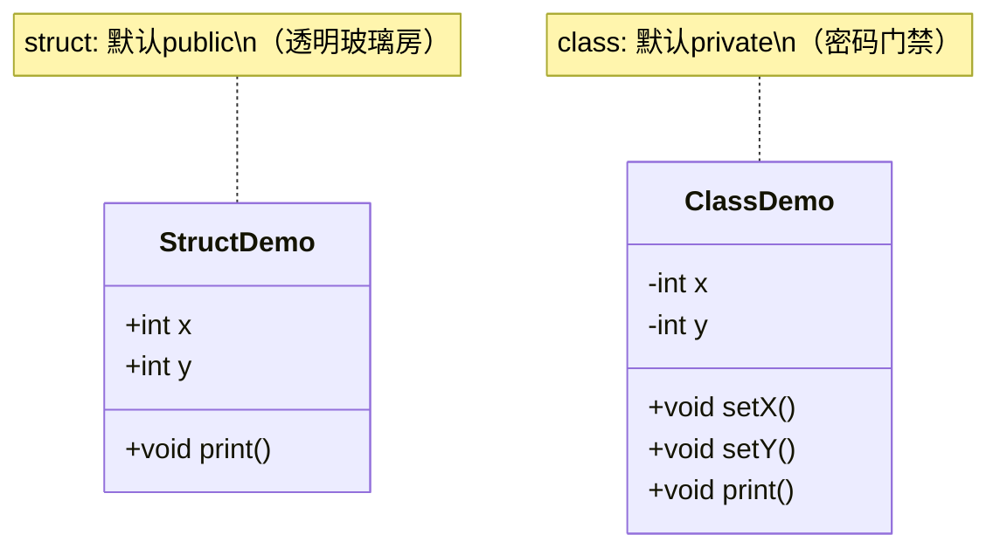
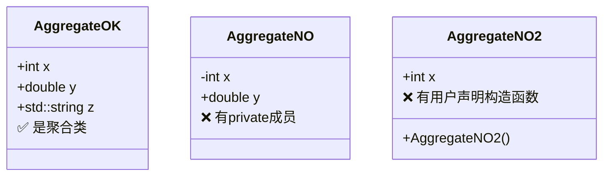
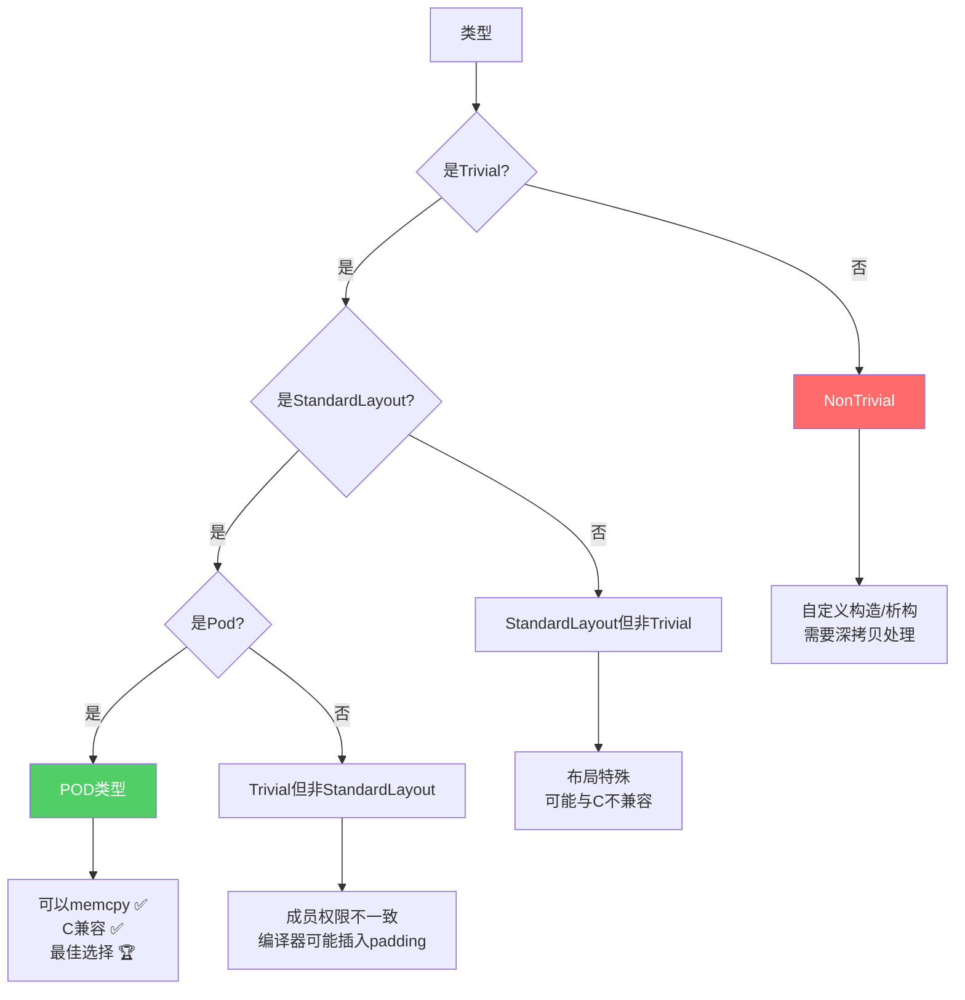

+++
title = "第15章 结构体与类对比"
weight = 150
date = "2026-03-29T21:03:00+08:00"
type = "docs"
description = ""
isCJKLanguage = true
draft = false
+++
# 第15章 结构体与类对比

> 💡 在C++的世界里，struct和class就像双胞胎——长得几乎一模一样，但总有些细微差别让人纠结。本章我们就来扒一扒这对"表兄弟"的底裤，看看它们到底有什么不同，以及什么时候该用谁。

## 15.1 struct与class的区别

想象一下，struct和class是同一栋楼里的两套公寓。它们的**建筑材料**完全相同（都可以有成员变量、成员函数、构造函数等），但它们的**默认门禁权限**不同：

- **struct**：大门敞开，所有成员默认都是`public`（公共的），谁都可以直接进出
- **class**：默认上锁，所有成员默认都是`private`（私有的），想访问必须通过"物业"（public函数）

这就是它们唯一的本质区别！除此之外，它们在其他方面完全相同，简直就像同一个人换了件衣服。

```cpp
#include <iostream>
#include <string>

// struct：默认public访问（大门敞开型）
struct PointStruct {
    int x;      // 默认public，随便访问
    int y;      // 默认public，随便访问
    
    void print() const {  // 默认public，随便调用
        std::cout << "(" << x << ", " << y << ")" << std::endl;
    }
};

// class：默认private访问（门禁森严型）
class PointClass {
    int x;      // 默认private，外人别想直接碰
    int y;      // 默认private，外人别想直接碰
    
public:  // 不得不开放一些public接口
    void setX(int v) { x = v; }   // 通过setter设置
    void setY(int v) { y = v; }   // 通过setter设置
    
    void print() const {
        std::cout << "(" << x << ", " << y << ")" << std::endl;
    }
};

int main() {
    PointStruct ps;
    ps.x = 10;  // OK：默认public，直接访问
    ps.y = 20;  // OK：直接写，爽！
    ps.print(); // OK：直接调用，豪横！
    
    PointClass pc;
    // pc.x = 10;  // 错误！private不能直接访问，编译器的地盘
    // pc.y = 20;  // 错误！想访问？没门！
    pc.setX(10);   // 只能通过public方法
    pc.setY(20);   // 走正规渠道
    pc.print();    // 这个倒是public的
    
    // 唯一区别：默认访问权限
    // 其他方面：完全相同！连sizeof都一样！
    
    return 0;
}
```

> [!NOTE]
> 什么是**访问权限**？想象一下：public是广场舞大妈开的广播，谁都能听到；private是保险柜里的存折，只有你自己能打开。C++的访问控制就是这样——public成员像公共厕所一样谁都能进，private成员像你家的内裤，只有"自己人"能看。

下面用一张图来展示struct和class的访问权限差异：



## 15.2 何时使用struct

struct是C++中的"数据背包"——你往里面塞数据，它就乖乖装着。最佳使用场景是**POD类型**（Plain Old Data，纯老数据），也就是那些只用来打包一堆数据、没有什么复杂逻辑的类型。

简单来说，用struct的场景就是：

1. 纯粹为了把一堆相关数据打包在一起
2. 数据成员之间没有"不变式"约束
3. 基本上不需要成员函数，或者只有几个简单的getter/setter
4. 你的代码不需要对外隐藏什么，大家都坦荡荡

举几个典型例子：RGB颜色、日期、三维坐标、用户信息、矩形几何数据……这些都很适合用struct。

```cpp
#include <iostream>
#include <string>
#include <vector>

// 使用struct的场景：纯数据聚合，没有或很少有方法
// "POD" (Plain Old Data) 风格——就像超市的塑料袋，装啥是啥

struct RGB {
    uint8_t r, g, b;  // 颜色分量，各占一字节（0-255）
};

struct Date {
    int year;   // 年份
    int month;  // 月份（1-12）
    int day;    // 日期（1-31）
};

struct User {
    std::string name;   // 用户名
    int age;            // 年龄
    std::string email;  // 邮箱
};

struct Rectangle {
    double width;   // 宽度
    double height;  // 高度
    
    // 简单的辅助方法也可以接受——毕竟矩形算面积是基本操作
    double area() const { return width * height; }  // 计算面积
};

int main() {
    // C++11列表初始化，想怎么初始化就怎么初始化
    RGB red = {255, 0, 0};      // 红色
    RGB green{0, 255, 0};       // 绿色（可以省略=）
    RGB blue;                   // 先声明
    blue.r = 0;                 // 再赋值
    blue.g = 0;
    blue.b = 255;
    
    Date today = {2024, 3, 15};          // 2024年3月15日
    User user = {"Alice", 25, "alice@example.com"};  // 用户信息
    Rectangle rect = {10.0, 5.0};       // 10x5的矩形
    
    // 打印颜色（uint8_t打印时要强制转换int，否则变成char）
    std::cout << "Color: (" << (int)red.r << "," << (int)red.g << "," << (int)red.b << ")" << std::endl;
    // 输出: Color: (255,0,0)
    
    std::cout << "Date: " << today.year << "-" << today.month << "-" << today.day << std::endl;
    // 输出: Date: 2024-3-15
    
    std::cout << "User: " << user.name << ", " << user.age << std::endl;
    // 输出: User: Alice, 25
    
    std::cout << "Rectangle area: " << rect.area() << std::endl;
    // 输出: Rectangle area: 50
    
    return 0;
}
```

> [!TIP]
> **uint8_t**是什么？这是C++的标准整数类型别名，本质上就是`unsigned char`，一个字节，范围0-255。用它来表示颜色分量最合适不过。

struct的精髓就是**透明**——你看到的是什么样，就能直接访问什么。它不会偷偷校验你设置的值是否合法，也不会在后台搞什么小动作。就像一个透明的塑料袋，你放什么进去，它就装什么。

## 15.3 何时使用class

class是C++的"封装大师"，当你需要**保护数据完整性**、**隐藏实现细节**、**强制不变式**时，class就闪亮登场了。

什么时候该用class？

1. 数据有关联约束（不变式），比如"余额不能为负"
2. 需要控制外部如何访问数据
3. 有复杂的内部逻辑需要封装
4. 需要保护敏感数据不被随意篡改

比如银行账户：余额必须始终等于所有交易的总和，你不能直接改余额，必须通过存钱、取钱操作，而且取钱时还要检查余额够不够。这就需要class来"守卫"这些规则。

```cpp
#include <iostream>
#include <string>
#include <vector>
#include <stdexcept>

// 使用class的场景：封装复杂逻辑，有不变式，需要隐藏实现细节
// 面向对象设计——就像请了个专业管家

class BankAccount {
private:
    std::string account_number_;     // 账户号码（私有，只有自己能访问）
    double balance_;                 // 余额（私有，外人看不见）
    std::vector<double> transactions_;  // 交易记录（私有流水账）
    
    // 不变式：balance_始终等于所有交易之和
    // 也就是说，你不能直接改balance，必须通过交易来改变
    
public:
    // 构造函数：用初始化列表更高效
    BankAccount(const std::string& accNum, double initialBalance)
        : account_number_(accNum), balance_(initialBalance) {
        if (initialBalance > 0) {
            transactions_.push_back(initialBalance);  // 记录初始存款
        }
    }
    
    // 存款：必须验证金额为正
    void deposit(double amount) {
        if (amount <= 0) {
            throw std::invalid_argument("金额必须是正数，想存负数？想得美！");
        }
        balance_ += amount;
        transactions_.push_back(amount);  // 记录交易
    }
    
    // 取款：检查余额是否足够
    bool withdraw(double amount) {
        if (amount <= 0) return false;       // 金额无效
        if (amount > balance_) return false;  // 穷鬼，没钱！
        balance_ -= amount;
        transactions_.push_back(-amount);    // 记录支出（负数）
        return true;
    }
    
    // 余额查询：只能看，不能改
    double getBalance() const { return balance_; }
    
    // 账号查询：只读引用
    const std::string& getAccountNumber() const { return account_number_; }
};

int main() {
    // 创建账户，初始存款1000
    BankAccount account("123456789", 1000.0);
    
    // 正常操作：存款500
    account.deposit(500.0);  // 余额变成1500
    
    // 正常操作：取款200
    bool success = account.withdraw(200.0);  // 余额变成1300
    std::cout << "取款成功？" << (success ? "是" : "否") << std::endl;
    // 输出: 取款成功？是
    
    // 想直接改余额？门都没有！
    // account.balance_ = 999999;  // 编译错误！private！
    
    // 想取超过余额的钱？被拒绝！
    success = account.withdraw(100000.0);  // 余额才1300，想取10万？
    std::cout << "大额取款成功？" << (success ? "是" : "否") << std::endl;
    // 输出: 大额取款成功？否
    
    // 想存负数？异常抛出！
    try {
        account.deposit(-100.0);
    } catch (const std::invalid_argument& e) {
        std::cout << "存款被拒绝：" << e.what() << std::endl;
        // 输出: 存款被拒绝：金额必须是正数，想存负数？想得美！
    }
    
    // 只能通过public接口查询
    std::cout << "账户 " << account.getAccountNumber() 
              << " 余额: $" << account.getBalance() << std::endl;
    // 输出: 账户 123456789 余额: $1300
    
    return 0;
}
```

> [!IMPORTANT]
> **不变式（Invariant）**是什么？就像学校的"校规"——学生必须按时上课、考试不能作弊。不变式是数据结构内部必须始终保持的规则。比如银行账户的规则是："余额必须等于所有交易的总和"。class通过封装来维护这些规则，就像班主任监督学生遵守校规一样。

下面用一张图展示class的封装如何保护数据：

```mermaid
flowchart LR
    A["外部代码<br/>想改余额?"] --> B{"class BankAccount"}
    B -->|直接改?| C["编译错误 🚫"]
    B -->|deposit()| D["校验金额 ✅"]
    B -->|withdraw()| E["检查余额 ✅"]
    D --> F["更新余额和交易"]
    E --> F
    F --> G["余额保护好了！"]
    
    style C fill:#ff6b6b,color:#fff
    style G fill:#51cf66,color:#fff
```

## 15.4 C++ Core Guidelines建议

Bjarne Stroustrup（C++之父）和Herb Sutter（C++大牛）等人编写了[C++ Core Guidelines](https://isocpp.github.io/CppCoreGuidelines/)，这是一份关于如何更好地使用C++的建议清单。其中关于struct和class，有几个关键建议：

- **C.2**：如果类有不变式，使用class；如果只是数据聚合，使用struct
- **C.3**：class和struct只是默认访问权限不同，其他方面完全相同
- **C.9**：最小化暴露成员变量，尽量用private

翻译成人话就是：

1. 只是打包数据？用struct！
2. 需要保护数据和逻辑？用class！
3. 不要纠结——它们本质上是同一个东西！

```cpp
#include <iostream>
#include <stdexcept>

/*
 * C++ Core Guidelines 关于 struct vs class 的建议：
 * 
 * C.2：如果类有不变式，使用class；如果只是数据聚合，使用struct
 * C.3：class和struct只是默认访问权限不同
 * C.9：最小化暴露成员变量（用private）
 * 
 * 简单记忆：数据裸奔用struct，数据穿衣服用class
 */

namespace GoodExamples {

// ✅ 简单数据聚合用struct——就是个透明塑料袋
struct Point {
    double x;  // 坐标，没什么 invariant 需要保护
    double y;
};

// ✅ 有不变式和封装用class——需要穿衣服保护
class Circle {
private:
    double radius_;  // 不变式：radius_ > 0
    
public:
    // 构造函数：确保传入的半径是正数
    explicit Circle(double r) : radius_(r) {
        if (r <= 0) {
            throw std::invalid_argument("半径必须是正数！");
        }
    }
    
    // getter：只读访问
    double radius() const { return radius_; }
    
    // 计算面积
    double area() const { return 3.14159 * radius_ * radius_; }
};

}

int main() {
    // struct的使用——直接访问，简单粗暴
    GoodExamples::Point p{1.0, 2.0};
    p.x = 100.0;  // 想改就改，struct不管你
    std::cout << "Point: (" << p.x << ", " << p.y << ")" << std::endl;
    // 输出: Point: (100, 2)
    
    // class的使用——必须通过接口
    GoodExamples::Circle c(5.0);
    std::cout << "Circle radius: " << c.radius() << std::endl;
    // 输出: Circle radius: 5
    
    std::cout << "Circle area: " << c.area() << std::endl;
    // 输出: Circle area: 78.5397
    
    // 想直接改半径？不行！
    // c.radius_ = 100.0;  // 编译错误！private！
    
    // 想创建负半径的圆？不行！
    try {
        GoodExamples::Circle bad(-5.0);
    } catch (const std::invalid_argument& e) {
        std::cout << "创建失败：" << e.what() << std::endl;
        // 输出: 创建失败：半径必须是正数！
    }
    
    return 0;
}
```

> [!NOTE]
> **explicit关键字**是什么？它告诉编译器："这个构造函数只能显式调用，不能用于隐式类型转换"。比如你有个`Circle(double r)`构造函数，如果不加explicit，`int x = 5; Circle c = x;`这种代码会把int隐式转成Circle。加上explicit后，编译器就会报错，避免你犯迷糊。

## 15.5 聚合类详解

**聚合类（Aggregate Class）**是struct家族中的"特等奖"——它不仅是个struct，还能使用一种特殊的初始化方式，叫做**聚合初始化**。

要成为聚合类，必须满足以下"六不要"原则：

1. **不要**有private或protected的直接成员（所有成员必须是public）
2. **不要**有用户声明的构造函数（包括默认构造函数！）
3. **不要**有virtual函数
4. **不要**有基类
5. **不要**是虚基类
6. **不要**有private或protected的基类

简单来说：所有成员都是public的、没有任何花里胡哨的功能、就是个纯数据容器——这就是聚合类。

聚合初始化有两种形式：

```cpp
Type var = {member1, member2, ...};  // C++98风格
Type var{member1, member2, ...};      // C++11列表初始化
```

到了C++20，还支持**指定初始化器**，可以指定具体给哪个成员赋值：

```cpp
Type var{.member1 = value1, .member2 = value2};
```

```cpp
#include <iostream>
#include <string>

// 聚合类的条件：
// 1. 所有成员public（必须是public！private直接出局）
// 2. 没有用户声明的构造函数（包括默认构造函数也不可以有！）
// 3. 没有virtual函数
// 4. 没有private/protected直接成员
// 5. 没有基类
// 6. 不是虚基类

struct AggregateStruct {
    int x;              // public，OK
    double y;           // public，OK
    std::string name;   // public，OK
};

// 下面这个就不是聚合类（因为有用户声明的构造函数）
class NonAggregate {
public:
    int x;
    int y;
    NonAggregate() {}  // 有用户声明的构造函数 → 不是聚合类
};

// 还有这些情况也不是聚合类：
// class WithPrivate { private: int x; };  // 有private成员
// class WithConstructor { public: int x; WithConstructor(){} };  // 有用户声明构造函数
// class WithVirtual { public: int x; virtual void f(){} };  // 有virtual函数
// class Derived : Base {};  // 有基类

int main() {
    // ========== 聚合初始化 ==========
    
    // 方式1：传统的=初始化
    AggregateStruct a1 = {10, 3.14, "test"};
    
    // 方式2：C++11列表初始化（更现代，推荐）
    AggregateStruct a2{20, 2.71, "hello"};
    
    // 方式3：C++20指定初始化器（最精确，想赋哪个就赋哪个）
    AggregateStruct a3 = {.x = 30, .y = 1.41, .name = "specified"};
    
    // 打印结果
    std::cout << "a1: x=" << a1.x << ", y=" << a1.y << ", name=" << a1.name << std::endl;
    // 输出: a1: x=10, y=3.14, name=test
    
    std::cout << "a2: x=" << a2.x << ", y=" << a2.y << ", name=" << a2.name << std::endl;
    // 输出: a2: x=20, y=2.71, name=hello
    
    std::cout << "a3: x=" << a3.x << ", y=" << a3.y << ", name=" << a3.name << std::endl;
    // 输出: a3: x=30, y=1.41, name=specified
    
    // ========== 指定初始化的好处 ==========
    // 可以只初始化部分成员，其余默认初始化
    AggregateStruct partial = {.x = 100};  // y默认为0.0，name默认为空字符串
    std::cout << "partial: x=" << partial.x << ", y=" << partial.y << std::endl;
    // 输出: partial: x=100, y=0
    
    // ========== 部分初始化注意事项 ==========
    // 聚合初始化必须按顺序连续，不能跳过中间的成员
    // 下面这个是错误的：只初始化x和name，跳过y
    // AggregateStruct invalid = {.x = 1, .name = "test"};  // 编译错误！
    
    return 0;
}
```

> [!TIP]
> **聚合初始化**就像高考填志愿——你可以一次性把所有信息都填好（完全初始化），也可以只填一部分让系统给你默认值的（部分初始化）。但注意，指定初始化器（C++20）可以跳着填，普通初始化必须按顺序填。

下面用图解释聚合类的特点：



## 15.6 POD类型（C++11前）与平凡类型（C++11后）

POD、Trivial、StandardLayout……这些术语听起来像是程序员在念咒。但别怕，让我们来逐一揭开它们的神秘面纱。

### POD（Plain Old Data）

**POD类型**是C++11之前的概念，指的是：

1. **平凡的（Trivial）**：所有特殊成员函数都是编译器自动生成的平凡版本
2. **标准布局的（StandardLayout）**：没有virtual函数、没有虚基类、成员访问权限一致

POD类型就像是C语言里的struct，可以安全地用`memcpy`进行复制不用担心任何问题。

### Trivial（平凡类型）

**Trivial**意味着：

- 有默认构造函数且是平凡的（或没有用户声明的构造函数）
- 有拷贝构造函数且是平凡的
- 有移动构造函数且是平凡的
- 有拷贝赋值运算符且是平凡的
- 有移动赋值运算符且是平凡的
- 析构函数是平凡的

翻译成人话：所有这些特殊成员函数都"平平无奇"，没什么花里胡哨的操作。

### StandardLayout（标准布局）

**StandardLayout**意味着：

- 所有非静态成员都在同一个地方（没有虚基类干扰）
- 没有virtual函数
- 所有非静态成员的访问权限一致（要么都是public，要么都是private）
- 没有虚基类

### 如何使用？

C++11引入了`std::is_trivial`和`std::is_pod`等类型特征（type traits），让你可以在编译时检查类型是否具有某种属性。

```cpp
#include <iostream>
#include <type_traits>
#include <cstring>  // for memcpy

// ========== POD类型 ==========
// 可以安全地用memcpy复制的类型
struct PODStruct {
    int x;
    double y;
    char name[32];
};

// ========== Trivial类型 ==========
// 所有特殊成员函数都是平凡的
class TrivialClass {
    int data_;  // private也不影响trivial
    
public:
    TrivialClass() = default;  // 显式声明平凡默认构造
    
    int get() const { return data_; }
    void set(int v) { data_ = v; }
};

// ========== NonTrivial类型 ==========
// 自定义了构造函数/析构函数/拷贝构造等
class NonTrivial {
    int* data_;  // 动态分配，需要特殊处理
    
public:
    NonTrivial() : data_(new int(0)) {}  // 自定义构造
    ~NonTrivial() { delete data_; }     // 自定义析构
    
    // 自定义拷贝构造（深拷贝）
    NonTrivial(const NonTrivial& other) : data_(new int(*other.data_)) {}
    
    // 自定义拷贝赋值（深拷贝）
    NonTrivial& operator=(const NonTrivial& other) {
        if (this != &other) {
            delete data_;
            data_ = new int(*other.data_);
        }
        return *this;
    }
    
    int get() const { return *data_; }
    void set(int v) { *data_ = v; }
};

int main() {
    std::cout << std::boolalpha;  // 打印true/false而不是1/0
    
    // ========== POD检查 ==========
    std::cout << "========== POD类型检查 ==========" << std::endl;
    std::cout << "PODStruct 是 trivial? " << std::is_trivial<PODStruct>::value << std::endl;
    // 输出: PODStruct 是 trivial? true
    
    std::cout << "PODStruct 是 pod? " << std::is_pod<PODStruct>::value << std::endl;
    // 输出: PODStruct 是 pod? true
    
    std::cout << "PODStruct 是 standard_layout? " 
              << std::is_standard_layout<PODStruct>::value << std::endl;
    // 输出: PODStruct 是 standard_layout? true
    
    // ========== Trivial检查 ==========
    std::cout << "\n========== Trivial类型检查 ==========" << std::endl;
    std::cout << "TrivialClass 是 trivial? " << std::is_trivial<TrivialClass>::value << std::endl;
    // 输出: TrivialClass 是 trivial? true
    
    std::cout << "TrivialClass 是 pod? " << std::is_pod<TrivialClass>::value << std::endl;
    // 输出: TrivialClass 是 pod? true
    
    // ========== NonTrivial检查 ==========
    std::cout << "\n========== NonTrivial类型检查 ==========" << std::endl;
    std::cout << "NonTrivial 是 trivial? " << std::is_trivial<NonTrivial>::value << std::endl;
    // 输出: NonTrivial 是 trivial? false
    
    std::cout << "NonTrivial 是 pod? " << std::is_pod<NonTrivial>::value << std::endl;
    // 输出: NonTrivial 是 pod? false
    
    // ========== memcpy测试 ==========
    std::cout << "\n========== memcpy测试 ==========" << std::endl;
    PODStruct original = {42, 3.14, "hello"};
    PODStruct copy;
    
    // POD类型可以安全地用memcpy复制
    std::memcpy(&copy, &original, sizeof(PODStruct));
    
    std::cout << "Original: x=" << original.x << ", y=" << original.y << std::endl;
    // 输出: Original: x=42, y=3.14
    
    std::cout << "Copy (via memcpy): x=" << copy.x << ", y=" << copy.y << std::endl;
    // 输出: Copy (via memcpy): x=42, y=3.14
    
    // NonTrivial类型用memcpy？危险！可能出问题！
    // 因为它的拷贝构造函数不是平凡的，可能涉及指针深拷贝
    // std::memcpy(&nontrivial_copy, &nontrivial_original, sizeof(NonTrivial));
    // 这会导致两个对象指向同一块内存，析构时double free！
    
    return 0;
}
```

> [!WARNING]
> **为什么要关心这些类型属性？**

> 1. **memcpy安全**：只有POD类型才能安全地用`memcpy`复制
> 2. **二进制兼容**：POD类型在C和C++之间可以自由传递
> 3. **性能优化**：编译器对trivial类型可以做更多优化
> 4. **序列化**：游戏存档、网络传输等场景需要考虑布局



## 本章小结

| 对比项 | struct | class |
|--------|--------|-------|
| **默认访问权限** | public | private |
| **适用场景** | 纯数据聚合、POD类型 | 有不变式、需要封装 |
| **封装** | 不封装，裸奔 | 封装，保护数据 |
| **代码风格** | 透明、简单 | 防御、安全 |

**核心要点回顾：**

1. **唯一区别**：struct和class的唯一区别是默认访问权限，其他完全相同
2. **选择原则**：数据裸奔用struct，数据穿衣服用class
3. **何时用struct**：纯粹打包数据、无复杂逻辑、无不变式约束
4. **何时用class**：需要保护数据、维护不变式、控制访问
5. **聚合类**：所有成员public、无用户声明构造函数、无virtual、无基类
6. **POD vs Trivial**：POD要求trivial+标准布局，trivial只要求特殊成员函数平凡

> 🎓 **课后思考**：为什么C++要保留struct和class两个关键字，而不是统一成一个？想想C语言的struct和C++的struct有什么关系？

> 💡 **小贴士**：在实际项目中，团队通常会约定俗成地使用一种风格。有的团队所有类型都用class，有的团队POD类型用struct。重要的是保持一致性——选择一个约定，然后坚持下去！

---

*恭喜你完成第15章！继续加油，C++的面向对象世界正在向你招手！*
