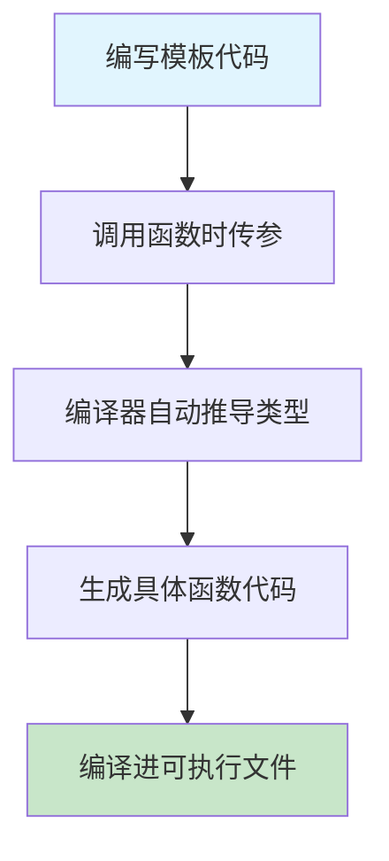
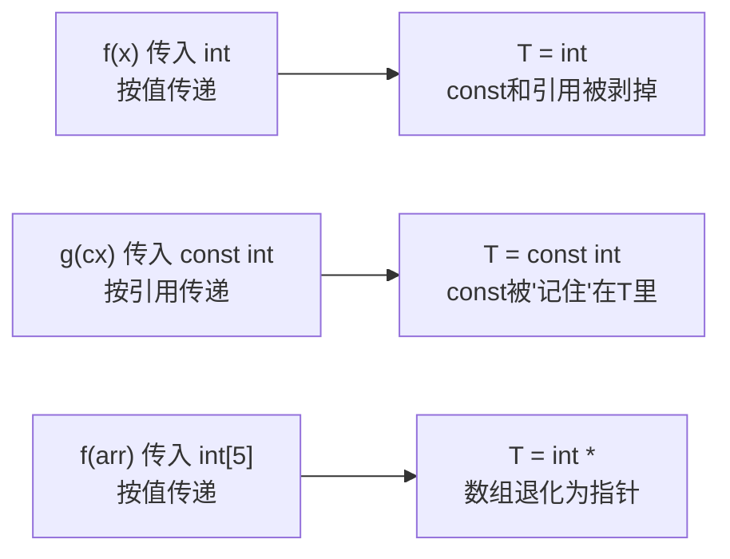
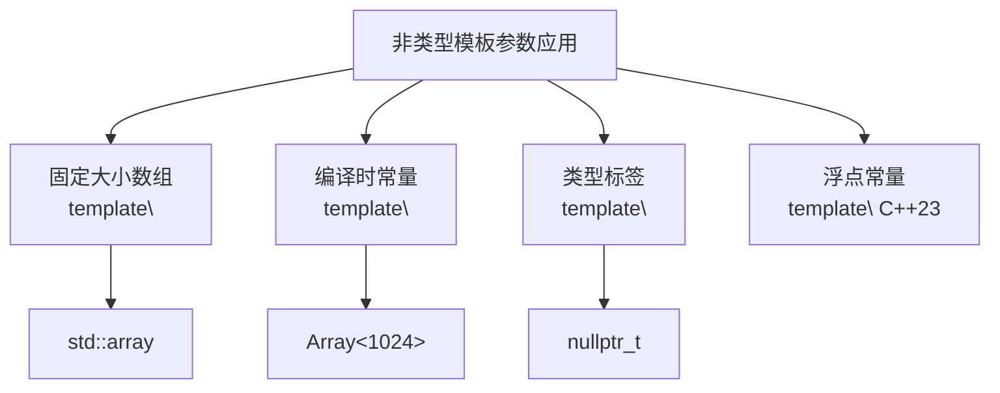
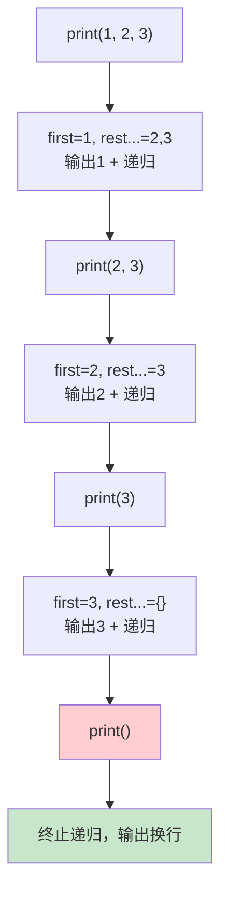
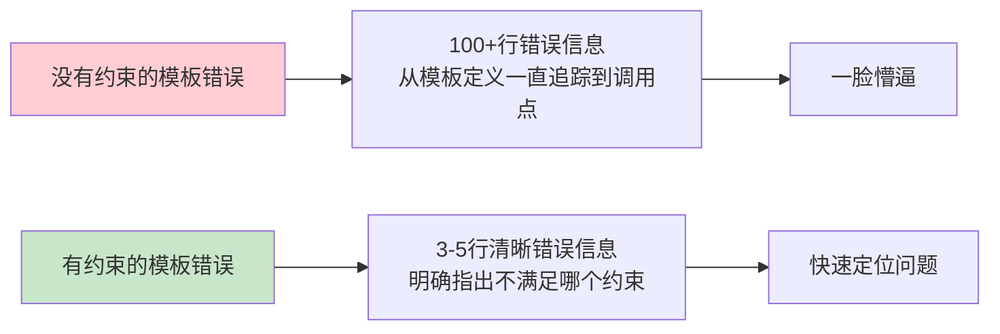

+++
title = "第16章 函数模板"
weight = 160
date = "2026-03-29T21:03:00+08:00"
type = "docs"
description = ""
isCJKLanguage = true
draft = false
+++
# 第16章 函数模板

想象一下，你是餐厅里的主厨。现在顾客点了三道菜：宫保鸡丁、红烧肉、鱼香肉丝。虽然都是"炒菜"，但食材不同、调料不同、火候不同。如果你为每道菜都写一份完整的"炒菜指南"，那得多累啊！

C++中的**函数模板**（Function Template）就像是那个万能的"炒菜公式"——你写一次，编译器帮你根据不同"食材"（类型）自动生成对应的"菜谱"（函数代码）。这样你就可以偷懒啦！

## 16.1 模板的概念与动机

### 痛点：重复代码的噩梦

在没有模板的年代，如果你想写一个比较两个数大小的`max`函数，可能需要这样：

```cpp
#include <iostream>
#include <string>

// 如果要写一个max函数比较int、double、string...
// 传统方式：重载多个函数 —— 代码重复，维护困难！

int maxInt(int a, int b) {
    return (a > b) ? a : b;
}

double maxDouble(double a, double b) {
    return (a > b) ? a : b;
}

std::string maxString(const std::string& a, const std::string& b) {
    return (a > b) ? a : b;
}
```

> 写三个函数只是冰山一角。如果哪天你想加个`long maxLong(long, long)`，或者`char maxChar(char, char)`...恭喜你喜提"代码复制粘贴员"称号！更可怕的是，如果`max`的逻辑要改，你就得改N个地方，改着改着就改错了。

### 救星：模板来啦！

**模板**（Template）是C++提供的一种"泛型编程"机制，让代码可以与具体的数据类型（int、double、string等）脱钩。你只需要写一次"通用公式"，编译器会在编译时根据实际使用的类型自动"套用公式"生成对应的代码。这个过程叫做**模板实例化**（Template Instantiation）。

```cpp
#include <iostream>
#include <string>

// 解决方案：模板
// 模板让代码与类型无关，一次编写，到处使用
// 
// template<typename T> 告诉编译器："这里有个类型参数T"
// 当你调用 maxTemplate(10, 20) 时，T 就会被推导为 int
// 当你调用 maxTemplate(3.14, 2.71) 时，T 就会被推导为 double

template<typename T>  // template关键字 + 类型参数 T（可以用 class 或 typename）
T maxTemplate(T a, T b) {
    return (a > b) ? a : b;  // T 必须支持 > 比较运算，否则编译失败
}

int main() {
    // 编译器根据参数类型自动实例化
    int i1 = maxTemplate(10, 20);        // 实例化 maxTemplate<int>
    double d1 = maxTemplate(3.14, 2.71); // 实例化 maxTemplate<double>
    
    std::cout << "maxTemplate(10, 20) = " << i1 << std::endl;  // 输出: 20
    std::cout << "maxTemplate(3.14, 2.71) = " << d1 << std::endl;  // 输出: 3.14
    
    return 0;
}
```

### 模板的"套路"



> 简单来说：模板就是一张"支票"，你填上金额（类型）就能兑现（生成具体代码）。只不过这张支票是编译器帮你"填写"和"兑现"的。

### 模板参数 vs 模板实参

- **模板参数**（Template Parameter）：定义模板时用的占位符，比如`template<typename T>`中的`T`
- **模板实参**（Template Argument）：实例化时替换进去的具体类型或值，比如`maxTemplate<int>`中的`int`

## 16.2 函数模板的定义与使用

### 基本语法

函数模板的定义语法如下：

```cpp
template<typename T1, typename T2, ...>  // 类型参数列表
返回值类型 函数名(参数列表) {
    // 函数体
}
```

或者也可以用`class`代替`typename`（两者在模板中基本等价）：

```cpp
template<class T>
T add(T a, T b) {
    return a + b;
}
```

> 为什么C++同时支持`typename`和`class`？因为`class`在模板出现之前就存在了，为了兼容性保留了下来。现在习惯上用`typename`，语义更清晰——"这是一个类型，不是类"。

### 常用模板函数示例

让我们写几个常用的模板函数，感受一下"一次编写，到处调用"的快乐：

```cpp
#include <iostream>
#include <string>
#include <vector>

// 加法模板：任何支持 + 运算的类型都能用
template<typename T>
T add(T a, T b) {
    return a + b;
}

// 最大值模板：任何支持 > 运算的类型都能用
template<typename T>
T max(T a, T b) {
    return (a > b) ? a : b;
}

// 交换模板：任何类型都能用（通过复制构造和赋值）
template<typename T>
void swap(T& a, T& b) {
    T temp = a;  // 需要T能默认构造
    a = b;       // 需要T能赋值
    b = temp;
}

// 打印vector模板：打印任意类型的vector
template<typename T>
void printVector(const std::vector<T>& v) {
    for (const auto& item : v) {
        std::cout << item << " ";
    }
    std::cout << std::endl;
}

int main() {
    // 整数相加
    std::cout << "add(1, 2) = " << add(1, 2) << std::endl;  // 输出: add(1, 2) = 3
    
    // 浮点数相加
    std::cout << "add(1.5, 2.5) = " << add(1.5, 2.5) << std::endl;  // 输出: add(1.5, 2.5) = 4
    
    // 字符串相加（拼接）
    std::cout << "add(\"abc\", \"def\") = " << add(std::string("abc"), std::string("def")) << std::endl;
    // 输出: add("abc", "def") = abcdef
    
    // 交换两个整数
    int x = 10, y = 20;
    swap(x, y);
    std::cout << "After swap: x=" << x << ", y=" << y << std::endl;  // 输出: x=20, y=10
    
    // 打印整数vector
    std::vector<int> vi = {1, 2, 3, 4, 5};
    printVector(vi);  // 输出: 1 2 3 4 5
    
    // 打印字符串vector
    std::vector<std::string> vs = {"a", "b", "c"};
    printVector(vs);  // 输出: a b c
    
    return 0;
}
```

### 模板函数的"超能力"

> 同一个模板函数，可以操作完全不同的数据类型，这是普通函数做不到的！想象一下普通函数能做到的事：int的add、double的add、string的add...如果不用模板，你得写三个函数；用模板，一个就搞定。

## 16.3 模板参数推导

### 编译器是如何"猜"类型的？

当你调用`maxTemplate(10, 20)`时，编译器是怎么知道`T`是`int`而不是`double`或`string`呢？它靠的是**模板参数推导**（Template Argument Deduction）机制——从你传入的参数反推类型。

### 推导规则详解

```cpp
#include <iostream>
#include <typeinfo>
#include <vector>

// 规则1：按值传递（Pass by Value）
// param 是 T 的副本，const、引用等属性会被"剥掉"
template<typename T>
void f(T param) {
    std::cout << "T = " << typeid(T).name() << std::endl;
}

// 规则2：按引用传递（Pass by Reference）
// param 是 T&，引用会保留
template<typename T>
void g(T& param) {
    std::cout << "T& = " << typeid(param).name() << std::endl;
}

// 规则3：按const引用传递（Pass by Const Reference）
// const 会被"提取"到 T 的外面
template<typename T>
void h(const T& param) {
    std::cout << "const T&" << std::endl;
}

int main() {
    int x = 10;
    const int cx = 10;      // const int 类型
    int& rx = x;            // int& 类型
    const int& crx = x;    // const int& 类型
    int arr[5] = {1, 2, 3, 4, 5};  // int[5] 类型
    
    // 按值传递：const和引用属性会丢失
    f(x);    // T = int           普通int，副本传递
    f(cx);   // T = const int     const属性被"记在"T头上，但副本传递
    f(rx);   // T = int           引用在传参时"退化"成副本
    f(crx);  // T = const int     同cx
    f(arr);  // T = int[5]        数组传给按值的参数时会退化为指针！
    
    // 按引用传递：保留原始类型
    g(x);    // T = int,       param是int&
    g(cx);   // T = const int, param是const int&
    g(rx);   // T = int,       param是int&（不是int&&！）
    // g(arr);  // 错误！无法从数组引用推导（因为N是数组大小，也需要推导）
    
    // 按const引用传递：const被提到T前面
    h(x);    // T = int        const被提取到外面
    h(cx);   // T = int        const被提取到外面
    h(crx);  // T = int        const被提取到外面
    
    return 0;
}
```

### 类型推导的"剥洋葱"规则

> 你可以把类型推导想象成剥洋葱：按值传递时，编译器会"剥掉"const和引用；按引用传递时，const会被"提取"到T上，但不会被剥掉。



### 推导陷阱（新手必看！）

模板参数推导看起来简单，但有几个"坑"等着你踩：

```cpp
#include <iostream>
#include <type_traits>

// 陷阱1：多个模板参数时，返回值类型无法推导！
// 下面这个函数，返回类型用什么呢？
// template<typename T, typename U>
// ??? add(T a, U b) { return a + b; }  // 编译错误：无法推导返回值类型

// 解决方案1：让编译器自己推断返回值（尾随返回类型）
// C++14之前常用的技巧
template<typename T, typename U>
auto add(T a, U b) -> decltype(a + b) {
    // auto只是占位符，真正的返回类型由 decltype(a + b) 决定
    return a + b;
}

// 解决方案2：C++14之后直接用auto
// template<typename T, typename U>
// auto add(T a, U b) {
//     return a + b;
// }

// 陷阱2：数组按值传递会"退化"成指针！
// 如果想保留数组的大小信息，必须按引用传递
template<typename T, int N>  // 注意：N是 非类型模板参数
void printArray(T (&arr)[N]) {  // 按引用传递，数组不会退化
    for (int i = 0; i < N; ++i) {
        std::cout << arr[i] << " ";
    }
    std::cout << std::endl;
}

// 陷阱3：没有参数就没法推导模板参数！
template<typename T>
void process(T) {}  // 需要至少一个函数参数来推导T

int main() {
    int arr[] = {1, 2, 3, 4, 5};
    printArray(arr);  // 输出: 1 2 3 4 5
    // 编译器推导出：T = int, N = 5
    
    // process();  // 编译错误！没有任何参数，无法推导T
    
    // 变通方法：手动指定模板参数
    process<int>(42);  // 手动指定T = int
    
    return 0;
}
```

### 常见推导场景一览表

| 传入参数 | 推导规则 | 示例 |
|---------|---------|------|
| `int x` | 按值传，`T` = `int` | `f(x)` → `T=int` |
| `const int cx` | 按值传，`T` = `const int` | `f(cx)` → `T=const int` |
| `int& rx` | 按值传，引用"退化"，`T` = `int` | `f(rx)` → `T=int` |
| `int arr[5]` | 按值传，数组退化为指针 | `f(arr)` → `T=int*` |
| `int (&arr)[5]` | 按引用传，保留数组类型 | `g(arr)` → `T=int, N=5` |

## 16.4 显式实例化与特化

### 显式（全）特化：为特殊类型开"小灶"

有时候，模板的通用实现对某些特定类型并不适用。比如通用的`add`函数用`+`运算符，但如果参数是两个 C 风格字符串（`const char*`），通用模板无法直接用`+`拼接，需要自定义拼接逻辑。这时候就需要**显式特化**（Explicit Specialization）。

```cpp
#include <iostream>

// 通用模板：适用于所有类型
template<typename T>
T add(T a, T b) {
    std::cout << "Generic add called" << std::endl;
    return a + b;
}

// 显式特化：针对 const char* 提供特殊实现
// template<> 告诉编译器："这是一个特化版本，不是新模板"
template<>
const char* add(const char* a, const char* b) {
    // 字符串拼接特化版本（手动拼接，不依赖任何库）
    static char result[100];  // static避免返回局部变量问题
    int i = 0;
    while (*a) result[i++] = *a++;  // 复制a
    while (*b) result[i++] = *b++;  // 复制b
    result[i] = '\0';               // 添加字符串结束符
    std::cout << "const char* add called" << std::endl;
    return result;
}

int main() {
    // 整数使用通用版本
    std::cout << "add(1, 2) = " << add(1, 2) << std::endl;
    // 输出:
    // Generic add called
    // add(1, 2) = 3
    
    // 浮点数使用通用版本
    std::cout << "add(1.5, 2.5) = " << add(1.5, 2.5) << std::endl;
    // 输出:
    // Generic add called
    // add(1.5, 2.5) = 4
    
    // 字符串使用特化版本
    const char* s1 = "Hello, ";
    const char* s2 = "World!";
    std::cout << "add(\"Hello, \", \"World!\") = " << add(s1, s2) << std::endl;
    // 输出:
    // const char* add called
    // add("Hello, ", "World!") = Hello, World!
    
    return 0;
}
```

> 简单理解：**特化**就是给某个"特殊顾客"开小灶，不走通用的流水线。比如学校食堂的通用窗口打饭，但如果你是个"VIP"，就给你开个小灶。

### 显式实例化：强迫编译器"现在就做"

**显式实例化**（Explicit Instantiation）跟**特化**完全不同。特化是"为某种类型写特殊代码"，实例化是"告诉编译器现在就生成某类型的代码，不要等延迟了"。

有什么用呢？

1. **加速编译**：如果你在头文件中定义了模板，链接时需要实例化。如果多个.cpp文件都用了同一个模板，会重复实例化（虽然链接器会去重，但编译时间还是浪费了）。显式实例化可以解决这个问题。
2. **控制实例化位置**：把模板的实例化代码放在特定的.cpp文件中，减少头文件膨胀。

```cpp
#include <iostream>

// 普通模板声明
template<typename T>
T add(T a, T b) {
    std::cout << "Generic add called" << std::endl;
    return a + b;
}

// 显式实例化声明：告诉编译器"这个实例在别的文件里定义了"
// extern template int add<int>(int, int);  // 声明
// 在其他编译单元中，会有：template int add<int>(int, int);  // 显式实例化定义

int main() {
    // 正常使用
    std::cout << "add(1, 2) = " << add(1, 2) << std::endl;
    std::cout << "add(1.5, 2.5) = " << add(1.5, 2.5) << std::endl;
    
    return 0;
}
```

### 特化 vs 实例化：傻傻分不清？

| 概念 | 关键字 | 作用 | 什么时候用 |
|-----|-------|------|-----------|
| 特化 (Specialization) | `template<>` | 为特定类型提供**不同的实现** | 当通用实现不适用于某些类型时 |
| 实例化 (Instantiation) | `template Xxx<X>` | 强迫编译器**现在就生成**某类型的代码 | 加速编译、控制实例化位置 |

## 16.5 非类型模板参数

### 什么是非类型模板参数？

之前我们用的都是**类型模板参数**（Type Template Parameter），比如`typename T`。但模板参数还可以是**值**（Value），这就是**非类型模板参数**（Non-Type Template Parameter）。

```cpp
#include <iostream>

// 非类型模板参数：模板参数是"值"，不是"类型"
// 类似于宏 #define ARRAY_SIZE 5，但有类型安全检查
template<int N>  // N 是一个编译期常量，类型是 int
struct Array {
    int data[N];  // 编译时就知道大小了，不像 vector 那样动态分配
    
    constexpr int size() const { return N; }  // constexpr 让编译器算好结果
};

// 打印编译时常量
template<int N>
void printSize(const char* msg) {
    std::cout << msg << " size = " << N << std::endl;
}

// C++17: auto 可以作为非类型模板参数的类型
// 接受任意类型的编译时常量
template<auto N>  // C++17 新语法
struct ValueHolder {
    static constexpr auto value = N;  // auto 自动推导类型
};

// C++23: 浮点终于可以作为非类型模板参数了
// C++20只支持整型和指针，C++23才支持浮点类型
template<double Pi = 3.14159>  // C++23: 默认参数值
double circleArea(double radius) {
    return Pi * radius * radius;
}

int main() {
    // 使用非类型模板参数创建固定大小的数组
    Array<5> arr;  // 创建一个大小为5的数组
    arr.data[0] = 10;
    arr.data[1] = 20;
    std::cout << "Array<5>::size() = " << arr.size() << std::endl;  // 输出: 5
    
    // 不同的N值会生成不同的类型！Array<5> 和 Array<10> 是完全不同的类型
    printSize<10>("Fixed");   // 输出: Fixed size = 10
    printSize<42>("Magic");    // 输出: Magic size = 42
    
    // auto 非类型模板参数
    std::cout << "ValueHolder<42>::value = " << ValueHolder<42>::value << std::endl;
    // 输出: ValueHolder<42>::value = 42
    
    // 调用浮点模板参数的函数
    std::cout << "circleArea(1.0) = " << circleArea(1.0) << std::endl;  // 输出: 3.14159
    
    return 0;
}
```

### 非类型模板参数的"紧箍咒"

非类型模板参数听起来很美好，但有几个限制：

1. **必须是编译时常量**：不能是变量、不能是运行时才知道的值
2. **类型有限制**：C++20之前只能是指针、引用、整数、枚举等；C++20/23逐渐放开了限制

```cpp
// 合法：整数
template<int N> struct A {};

// 合法：指针（空指针常量）
template<int* P> struct B {};

// 合法：枚举
template<enum E> struct C {};

// C++20 合法：支持整数和指针
template<std::size_t N> struct D { char arr[N]; };

// C++23 合法：浮点（终于！）
template<double PI> struct Circle {};
```

### 浮点类型作为非类型模板参数（C++23）

C++23之前，如果你想用`3.14`这样的浮点数作为模板参数，编译器会报错："浮点数不能作为非类型模板参数"。C++23终于解开了这个封印！

```cpp
#include <iostream>

// C++23: 浮点类型可以作为非类型模板参数
// 之前如果写 template<double PI>，编译器会报错
template<double PI = 3.14159265358979323846>  // 默认值可以是超长π
struct Circle {
    double radius;  // 圆的半径
    
    // 计算圆的面积
    double area() const { return PI * radius * radius; }
};

int main() {
    // 使用默认的PI值（超长π，精度更高）
    Circle<> c1{5.0};  // <> 不能省略，因为模板参数列表不能为空
    std::cout << "c1.area() with full PI = " << c1.area() << std::endl;
    // 输出: c1.area() with full PI = 78.5398...
    
    // 使用自定义的PI值（简化的π）
    Circle<3.14> c2{5.0};
    std::cout << "c2.area() with 3.14 = " << c2.area() << std::endl;
    // 输出: c2.area() with 3.14 = 78.5
    
    return 0;
}
```

> 想象一下，如果你在C++17里想用`3.14`作为模板参数，编译器会说："不行不行，浮点数太'任性'了，编译时我算不准！"到了C++23，编译器终于"学乖了"，允许你用浮点数作为模板参数。

### 非类型模板参数的应用场景



## 16.6 默认模板参数

### 函数模板的"默认参数"

C++允许为模板参数提供**默认值**（Default Template Arguments），就像普通函数的默认参数一样。当调用时没有指定模板参数，就使用默认值。

```cpp
#include <iostream>
#include <vector>
#include <memory>

// 默认模板参数：T = int, N = 10
// 类似于函数的默认参数，只不过是模板层面的"默认值"
template<typename T = int, int N = 10>
class FixedArray {
    T data_[N];   // 固定大小的数组
    int size_;    // 当前已使用的元素个数
    
public:
    FixedArray() : size_(0) {}  // 构造函数
    
    // 添加元素（如果还有空间的话）
    void add(const T& value) {
        if (size_ < N) {
            data_[size_++] = value;
        }
    }
    
    int size() const { return size_; }       // 返回当前元素个数
    const T& get(int i) const { return data_[i]; }  // 获取元素
};

// 默认返回类型
template<typename T = int>
T defaultValue() {
    return T{};  // T的默认值构造
}

// 默认参数值（用在函数模板参数上）
template<typename T = double>
T process(T val = T{}) {  // T{} 是T类型的默认值（0对于内置类型）
    return val * 2;
}

int main() {
    // 不指定模板参数，使用默认值（int, 10）
    FixedArray<> intArray;  // FixedArray<int, 10>
    intArray.add(10);
    intArray.add(20);
    std::cout << "intArray[0] = " << intArray.get(0) << std::endl;  // 输出: 10
    
    // 指定部分或全部模板参数
    FixedArray<double, 5> doubleArray;  // 自定义类型和大小
    doubleArray.add(3.14);
    doubleArray.add(2.71);
    std::cout << "doubleArray size = " << doubleArray.size() << std::endl;  // 输出: 2
    
    // 使用默认模板参数
    std::cout << "defaultValue<double>() = " << defaultValue<double>() << std::endl;
    // 输出: defaultValue<double>() = 0
    
    // 使用函数默认参数
    std::cout << "process(5) = " << process(5) << std::endl;  // 输出: 10
    std::cout << "process() = " << process() << std::endl;    // 输出: 0（使用T{}默认值）
    
    return 0;
}
```

### 默认模板参数的规则

1. **默认参数必须从右向左**：如果为某个模板参数提供了默认值，那么它右边的所有模板参数也必须有默认值
2. **类模板的默认参数更常见**：函数模板的默认参数用得相对较少

```cpp
// 合法的：从右向左提供默认值
template<typename T = int, int N = 10>
class A {};

// 不合法：T有默认值但N没有
// template<typename T = int, int N>
// class B {};  // 编译错误！

// 调用时可以省略右侧的默认值
A<> a1;      // T=int, N=10
A<double> a2;  // T=double, N=10
```

### 默认模板参数的实际应用

> 想象你在设计一个通用的容器模板。默认情况下，你希望元素类型是`int`，大小是`100`。但用户也可以自定义。这就是默认模板参数的用武之地。

```cpp
#include <iostream>

// 实际应用中常见的模式：
// 1. 提供合理的默认值，减少用户的代码量
// 2. 同时保留灵活性，让用户可以自定义

// 智能指针的默认删除器
template<typename T, typename Deleter = std::default_delete<T>>
class UniquePtr {
    // ...
};

// 标准库的 pair 总是需要两个类型参数（但可以用默认模板参数）
// std::pair<int, double> 等价于 std::pair<int, double>
// std::vector<int> 等价于 std::vector<int, std::allocator<int>>

int main() {
    // 使用默认删除器
    // std::unique_ptr<int> p1(new int(42));
    
    // 自定义删除器
    // std::unique_ptr<FILE, std::function<void(FILE*)>> 
    //     p2(fopen("test.txt", "r"), fclose);
    
    return 0;
}
```

## 16.7 可变参数模板（C++11）

### 参数包：让函数接受"任意数量"的参数

你有没有想过写一个`print`函数，能打印任意数量、任意类型的参数？普通函数做不到，但**可变参数模板**（Variadic Template）可以！

**参数包**（Parameter Pack）是C++11引入的新概念，允许模板接受"可变数量"的参数。

```cpp
#include <iostream>
#include <utility>

// 可变参数模板：Args 是一个"参数包"，可以包含0个或多个类型
// ... 在模板参数列表中表示"包"
template<typename... Args>  // Args 是类型参数包
void print(Args... args) {  // args 是非类型参数包
    // 递归基例
}

// 递归终止条件：没有参数时调用这个
void print() {
    std::cout << std::endl;
}

// 递归展开参数包
// 当调用 print(1, 2, "hello") 时：
// - first = 1
// - rest... = 2, "hello"
// 然后递归调用 print(rest...)
template<typename T, typename... Args>
void print(T first, Args... rest) {  // rest 是参数包
    std::cout << first << " ";
    print(rest...);  // 递归调用，rest... 展开成 2, "hello"
}

// 折叠表达式（C++17）：更简洁的求和方式
template<typename... Args>
auto sum(Args... args) {
    return (... + args);  // C++17折叠表达式，等价于 ((((1)+2)+3)+4)
}

// sizeof... 获取参数包的大小
template<typename... Args>
void countArgs(Args...) {
    std::cout << "Number of args: " << sizeof...(Args) << std::endl;
}

int main() {
    // 打印任意数量、任意类型的参数
    print(1, 2, 3, "hello", 4.5);  // 输出: 1 2 3 hello 4.5
    
    // 使用折叠表达式求和
    std::cout << "Sum: " << sum(1, 2, 3, 4, 5) << std::endl;  // 输出: Sum: 15
    
    // 统计参数个数
    countArgs(1, 2, 3);  // 输出: Number of args: 3
    countArgs("a", "b", "c", "d");  // 输出: Number of args: 4
    countArgs();  // 输出: Number of args: 0
    
    return 0;
}
```

### 递归展开参数包的原理



> 递归展开的原理就像俄罗斯套娃：拆开一个，里面还有；拆到最后发现是空的，就结束了。

### 参数包的基础操作

```cpp
#include <iostream>

// 1. 获取参数包的第一个元素
template<typename First, typename... Rest>
First first(First f, Rest...) {
    return f;
}

// 2. 获取参数包去掉第一个元素后的结果
// （通过递归，但这里不展开）

// 3. 获取参数包的元素个数
template<typename... Args>
constexpr std::size_t argsCount(Args...) {
    return sizeof...(Args);
}

// 4. 判断是否为空
template<typename... Args>
constexpr bool isEmpty(Args...) {
    return sizeof...(Args) == 0;
}

int main() {
    std::cout << "first element: " << first(1, 2, 3) << std::endl;  // 输出: 1
    std::cout << "args count: " << argsCount(1, 'a', 3.14, "hello") << std::endl;  // 输出: 4
    std::cout << std::boolalpha;  // 启用布尔文字输出（显示true/false而非1/0）
    std::cout << "is empty: " << isEmpty() << std::endl;  // 输出: true
    std::cout << "is empty: " << isEmpty(1) << std::endl;  // 输出: false
    
    return 0;
}
```

## 16.8 折叠表达式（C++17）

### 让可变参数模板更优雅

C++17引入了**折叠表达式**（Fold Expression），让你用更简洁的方式处理参数包。在此之前，你只能通过递归来展开参数包；有了折叠表达式，一行代码就能搞定！

### 四种折叠形式

```cpp
#include <iostream>

// C++17折叠表达式有四种形式：
// 
// 1. 一元右折叠：    (pack op ...)
//    相当于：(((arg1 op arg2) op arg3) op ... op argN)
//    从右边开始折叠
//
// 2. 一元左折叠：    (... op pack)
//    相当于：(arg1 op (arg2 op (arg3 op (... op argN))))
//    从左边开始折叠
//
// 3. 二元右折叠：    (pack op ... op e)
//    相当于：(((arg1 op arg2) op arg3) op ... op argN op e)
//
// 4. 二元左折叠：    (e op ... op pack)
//    相当于：(e op (arg1 op (arg2 op (arg3 op ... op argN))))

// 下面是实际例子：

// 一元左折叠：(1 + 2 + 3 + 4) = ((1+2)+3)+4 = 10
template<typename... Args>
auto addAll(Args... args) {
    return (... + args);  // 一元左折叠
}

// 一元右折叠：(true && true && false) = true && (true && false) = false
// && 的右折叠相当于：arg1 && (arg2 && (arg3 && ...))
template<typename... Args>
bool andAll(Args... args) {
    return (args && ...);  // 一元右折叠
}

// 二元右折叠：(args , ... , first)
// 相当于 (((args[0], args[1]), args[2]), ..., first)
// 逗号表达式依次求值，最终返回 first
template<typename T, typename... Args>
T firstOr(T first, Args... args) {
    return (args, ..., first);
}

// 使用逗号表达式 + 折叠表达式：强制求值所有参数
template<typename... Args>
void evaluate(Args... args) {
    // (args, ...) 的结果是最后一个参数的值
    // 但逗号表达式会依次求值每个参数，常用于触发副作用
    (void)(..., args);  // 强制求值所有参数（抑制警告）
}

int main() {
    std::cout << "sum(1,2,3,4,5) = " << addAll(1, 2, 3, 4, 5) << std::endl;
    // 计算过程：(1+2+3+4+5) = (((1+2)+3)+4)+5 = 15
    // 输出: sum(1,2,3,4,5) = 15
    
    std::cout << "andAll(true, true, false) = " << andAll(true, true, false) << std::endl;
    // 计算过程：true && (true && false) = true && false = false
    // 输出: andAll(true, true, false) = 0（false）
    
    std::cout << "firstOr(42, 100, 200) = " << firstOr(42, 100, 200) << std::endl;
    // 折叠过程：(42, 100, 200) -> ((42, 100), 200) -> first = 42
    // 输出: firstOr(42, 100, 200) = 42
    
    // 逗号折叠：所有参数都会被求值
    evaluate(1, 2, 3);  // 相当于 (void)(1, 2, 3); 结果是3
    
    return 0;
}
```

### 折叠表达式速查表

| 折叠类型 | 表达式 | 等价于 | 适用运算符 |
|---------|--------|--------|-----------|
| 一元右折叠 | `(pack op ...)` | `(((arg1 op arg2) op arg3) ... op argN)` | 所有 |
| 一元左折叠 | `(... op pack)` | `(arg1 op (arg2 op (arg3 op ... op argN)))` | 所有 |
| 二元右折叠 | `(pack op ... op e)` | `(((arg1 op arg2) op arg3) ... op argN op e)` | 需要e的情况 |
| 二元左折叠 | `(e op ... op pack)` | `(e op (arg1 op (arg2 op (arg3 op ... op argN)))` | 需要e的情况 |

> 小技巧：对于`+`、`*`、`&&`、`||`等满足交换律的运算符，左折叠和右折叠结果一样；对于`-`、`/`等不满足交换律的运算符，要小心选择。

## 16.9 包索引（Pack Indexing）（C++26）

### 用索引访问参数包的"指定元素"

参数包（Parameter Pack）虽然能装很多元素，但我们只能通过递归从头访问，不能像数组那样直接用`args[2]`访问第三个元素。C++26将引入**包索引**（Pack Indexing）特性，允许你用中括号`args[N]`直接访问指定位置的参数！

```cpp
#include <iostream>
#include <tuple>

// C++26（草案阶段）: 包索引允许通过索引访问参数包中的元素
// 
// 草案语法示例：
// template<typename... Args>
// void printThird(Args... args) {
//     std::cout << args[2] << std::endl;  // 访问第三个参数（从0开始）
// }
// printThird(1, 2, 3, 4, 5);  // 输出: 3

// 由于C++26还在草案阶段，当前编译器不支持
// 我们可以用 std::tuple + std::get 来模拟类似功能

template<typename... Args>
void accessElements(Args... args) {
    // 用 tuple 存储参数包
    std::tuple<Args...> t{args...};
    
    // 用 std::get<index> 访问指定位置的元素
    std::cout << "First element: " << std::get<0>(t) << std::endl;
    std::cout << "Third element: " << std::get<2>(t) << std::endl;
    
    // 警告：如果索引超出范围，编译失败！
    // std::cout << std::get<100>(t) << std::endl;  // 编译错误！
}

int main() {
    std::cout << "Pack indexing is a C++26 feature (draft)" << std::endl;
    std::cout << "Current workaround: use std::tuple" << std::endl;
    
    // 模拟访问
    accessElements(10, 20, 30, 40, 50);
    // 输出:
    // First element: 10
    // Third element: 30
    
    return 0;
}
```

### 包索引的语法（草案）

```cpp
// C++26 草案中的语法：
template<typename... Args>
void demo(Args... args) {
    // 通过 [index] 访问参数包中的元素
    std::cout << args[0] << std::endl;  // 第一个参数
    std::cout << args[1] << std::endl;  // 第二个参数
    std::cout << args[2] << std::endl;  // 第三个参数
    
    // 负数索引：从后面往前数
    // std::cout << args[-1] << std::endl;  // 最后一个参数
}

// 也可以用于模板参数包
template<auto... values>
void process() {
    // 访问编译时常量包
    // constexpr auto x = values[0];  // 第一个值
}
```

> 包索引让可变参数模板的使用更加直观！想象一下，以前你要写一个递归函数来访问第N个元素，现在直接`args[N]`就可以了，就像访问数组一样。

## 16.10 模板编译错误诊断

### 模板错误的"灾难现场"

用过模板的程序员都知道，模板一旦出错，错误信息就像灾难片一样——几十行甚至上百行的错误信息，看着让人头皮发麻。为什么呢？因为模板是"编译时计算"，错误信息里包含了完整的实例化过程和调用栈。

```cpp
#include <iostream>

// 让我们故意写一个会出错的模板
template<typename T>
void process(T value) {
    // 假设我们只接受整数类型
    // 如果传入非整数，应该报错，但普通模板的错误信息很长...
    static_assert(std::is_integral_v<T>, "T must be an integral type!");
    
    // 正常逻辑
    std::cout << "Processing: " << value << std::endl;
}

// 使用 concept（C++20）限制类型
#include <concepts>

template<std::integral T>
T add(T a, T b) {
    return a + b;
}

int main() {
    // 正常情况
    process(42);  // OK: 42是整数
    
    // 如果你传入3.14：
    // process(3.14);
    // 编译器会报错，但错误信息会包含完整的模板实例化过程
    // 错误信息可能是这样的：
    // error: static assertion failed: "T must be an integral type!"
    // error: ...（长达几十行的调用栈）
    
    // 使用 concept 后，错误信息更清晰
    add(1, 2);  // OK
    
    // 如果你这样调用：
    // add(1.0, 2.0);
    // 错误信息会是：error: template constraint failed for function 'add'
    // 简短多了！
    
    return 0;
}
```

### 改善错误信息的技巧

```cpp
#include <iostream>
#include <type_traits>
#include <concepts>

// 技巧1：使用 static_assert 提供清晰的断言信息
template<typename T>
void checkIntegral(T value) {
    static_assert(
        std::is_integral_v<T>,  // 编译时检查：T必须是整数类型
        "Oops! This function only accepts integral types (int, long, char, etc.).\n"
        "       If you want to use floating-point numbers, please use checkFloat() instead."
    );
    std::cout << value << std::endl;
}

// 技巧2：使用 concept（C++20）限制模板参数
// concept 就像给模板参数加上"准入条件"
template<std::integral T>
T doubleIt(T value) {
    return value * 2;
}

// 更复杂的约束
template<typename T>
    requires std::is_integral_v<T> && (sizeof(T) >= 4)
T safeAdd(T a, T b) {
    return a + b;
}

// 技巧3：使用 std::enable_if 在编译时选择重载
#include <type_traits>

// 如果 T 是整数，返回 double 类型的两倍
// 否则，编译失败
template<typename T>
auto safeDouble(T value) -> std::enable_if_t<std::is_integral_v<T>, double> {
    return static_cast<double>(value) * 2.0;
}

int main() {
    checkIntegral(42);  // OK
    
    // checkIntegral(3.14);  
    // 编译错误（但错误信息很清晰！）：
    // error: static assertion failed: "Oops! This function only accepts 
    //        integral types (int, long, char, etc.)..."
    
    doubleIt(10);  // OK
    // doubleIt(3.14);  
    // 编译错误：
    // error: template constraint failed for function 'doubleIt'
    //        requires std::integral<T>
    
    safeDouble(5);  // OK
    // safeDouble(3.14);  // 编译错误
    
    return 0;
}
```

### 错误信息的"望梅止渴"



> 想象一下：没有约束的模板错误，就像你迷路了但GPS只给你显示"您已偏离路线"；有约束的模板错误，就像GPS告诉你"前方200米请左转，走错了，这是为您专门设计的路线，要求您走高速公路，但您走的是小路"。

### 常用类型约束概念（Concept）

C++20标准库提供了很多有用的 concept，可以直接用：

| Concept | 要求 | 示例 |
|---------|------|------|
| `std::integral` | 整数类型 | `template<integral T>` |
| `std::floating_point` | 浮点类型 | `template<floating_point T>` |
| `std::signed_integral` | 有符号整数 | `template<signed_integral T>` |
| `std::unsigned_integral` | 无符号整数 | `template<unsigned_integral T>` |
| `std::same_as<T, U>` | T和U类型相同 | `template<same_as<int> T>` |
| `std::derived_from<T>` | 继承自T | `template<derived_from<Base> T>` |
| `std::movable` | 可以移动 | `template<movable T>` |
| `std::copyable` | 可以拷贝 | `template<copyable T>` |

## 本章小结

本章我们学习了C++函数模板的核心知识，从基础概念到高级用法，循序渐进。让我们来回顾一下：

### 核心概念

1. **模板**（Template）：让代码与类型脱钩，一次编写、到处使用的泛型机制
2. **模板实例化**（Instantiation）：编译器根据实际类型生成具体代码的过程
3. **模板参数推导**（Argument Deduction）：编译器从函数参数推断模板类型

### 函数模板的基本用法

```cpp
template<typename T>
T max(T a, T b) {
    return (a > b) ? a : b;
}
```

### 模板参数推导规则

- 按值传递：`const`和引用属性会"退化"
- 按引用传递：`const`会被"记住"在类型里
- 数组按值传递会退化为指针

### 高级特性

| 特性 | 说明 | C++版本 |
|------|------|---------|
| 显式特化 | 为特定类型提供特殊实现 | C++98 |
| 非类型模板参数 | 模板参数可以是值 | C++98 |
| 默认模板参数 | 为模板参数提供默认值 | C++11 |
| 可变参数模板 | 接受任意数量的参数 | C++11 |
| 折叠表达式 | 简洁地展开参数包 | C++17 |
| 包索引 | 通过`[]`访问参数包元素 | C++26 |
| Concept约束 | 限制模板参数的类型 | C++20 |

### 实用技巧

1. **模板让代码更通用**：写一次模板，处理多种类型
2. **注意类型推导规则**：引用和const的处理方式不同
3. **善用static_assert**：提供清晰的编译时错误信息
4. **使用concept（C++20）**：让错误信息更友好

### 下章预告

函数模板只是模板世界的"入门课"。下一章我们将学习**类模板**（Class Template），了解如何用模板来创建通用的类，比如`std::vector`、`std::pair`等标准库容器。准备好了吗？
