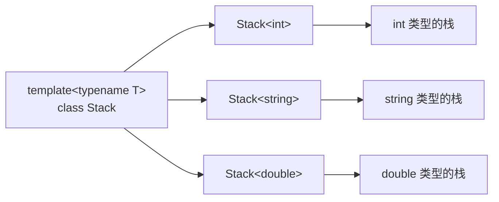
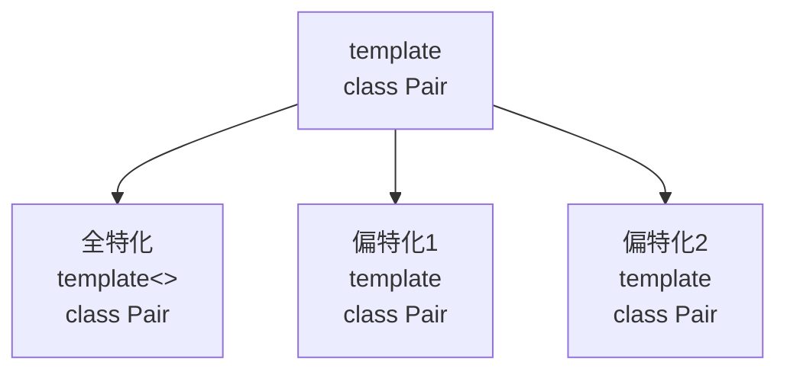
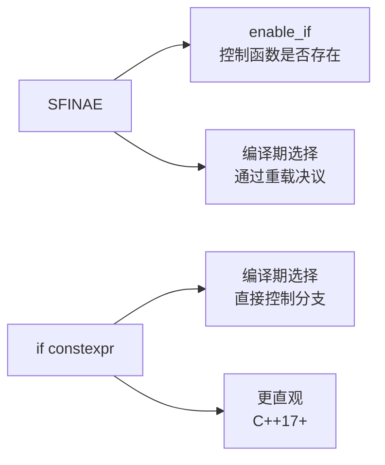

+++
title = "第17章 类模板"
weight = 170
date = "2026-03-29T21:03:00+08:00"
type = "docs"
description = ""
isCJKLanguage = true
draft = false
+++
# 第17章 类模板

想象一下，你是快餐店的点餐员。如果每个顾客来你都要重新设计一套点餐系统——汉堡工程师、薯条工程师、可乐工程师——那这个世界早就乱套了。好在类模板（Class Template）就是程序员的"通用点餐系统"，一份代码，服务所有类型！

## 17.1 类模板的定义与使用

### 什么是类模板？

类模板，简单来说就是**类的蓝图工厂**。普通的类就像是只卖一种汉堡的店，而类模板则是能生产各种口味汉堡的全能厨房。你声明一次，编译器帮你生成int版本、string版本、甚至自定义版本的"汉堡"。

> 类模板允许你编写与类型无关的代码。在声明时使用 `template<typename T>` 或 `template<class T>`，其中的 T 就像是一个占位符，具体类型由使用时指定。

### 为什么需要类模板？

假设你要实现一个栈（Stack）数据结构：
- 用 `int` 时需要一套代码
- 用 `string` 时又需要另一套
- 用自定义类时还得再来一套

这简直是**Ctrl+C/V 程序员的噩梦**！类模板帮你解决这个问题——**一次编写，到处实例化**。

```cpp
#include <iostream>
#include <vector>
#include <stdexcept>

// 类模板：让类与类型参数无关
// template<typename T> 告诉编译器：T是一个类型参数，稍后填充
template<typename T>
class Stack {
private:
    static const int MAX_SIZE = 100;  // 栈的最大容量，防止无限膨胀
    T data_[MAX_SIZE];                // 用类型 T 的数组存储数据
    int top_;                         // 栈顶指针，-1表示空栈

public:
    // 构造函数：初始化空栈
    Stack() : top_(-1) {}

    // push: 把元素压入栈顶
    void push(const T& value) {
        if (top_ >= MAX_SIZE - 1) {
            // 栈满了！就像往已经装满的行李箱里硬塞东西
            throw std::overflow_error("Stack overflow!");
        }
        data_[++top_] = value;  // 先移动指针，再存数据
    }

    // pop: 弹出栈顶元素并返回
    T pop() {
        if (top_ < 0) {
            // 栈空了还要弹？想象从空冰箱里拿牛奶...
            throw std::underflow_error("Stack underflow!");
        }
        return data_[top_--];  // 返回顶部数据，然后指针下移
    }

    // peek: 查看栈顶元素（但不弹出）
    T peek() const {
        if (top_ < 0) {
            throw std::underflow_error("Stack is empty!");
        }
        return data_[top_];
    }

    bool empty() const { return top_ == -1; }   // 判断栈是否为空
    int size() const { return top_ + 1; }     // 返回元素个数
};

int main() {
    // 实例化不同类型的Stack
    // 就像点餐：intStack是巨无霸套餐，stringStack是蔬菜沙拉
    Stack<int> intStack;
    Stack<std::string> stringStack;

    // intStack 的操作
    intStack.push(10);   // 压入10
    intStack.push(20);   // 压入20
    intStack.push(30);   // 压入30，此时栈顶是30

    std::cout << "intStack.pop() = " << intStack.pop() << std::endl;  // 输出: 30
    std::cout << "intStack.peek() = " << intStack.peek() << std::endl;  // 输出: 20

    // stringStack 的操作
    stringStack.push("Hello");
    stringStack.push("World");

    std::cout << "stringStack.pop() = " << stringStack.pop() << std::endl;  // 输出: World

    return 0;
}
```

运行结果：
```
intStack.pop() = 30
intStack.peek() = 20
stringStack.pop() = World
```

> 💡 **小贴士**：类模板本身不是类，它是生成类的"模具"。当你写 `Stack<int>` 时，编译器才会真正生成一个 `Stack` 类。这个过程叫做**实例化**（Instantiation）。

### 类模板的工作原理

Mermaid 图表的魅力在于能让复杂的事情变简单（就像我们的类模板）：



## 17.2 类模板的成员函数

### 成员函数也是模板？

没错！在类模板中，不仅数据成员的类型是 T，连**成员函数也可以是模板**。这就像是汉堡店不仅卖不同口味的汉堡，还卖不同口味的薯条。

### 在类内定义 vs 在类外定义

```cpp
#include <iostream>

template<typename T>
class Wrapper {
private:
    T value_;  // 包装的值

public:
    // 普通成员函数：类内定义
    Wrapper(const T& value) : value_(value) {}

    void print() const {
        std::cout << "Wrapper value: " << value_ << std::endl;
    }

    T get() const { return value_; }      // getter

    void set(const T& value) { value_ = value; }  // setter

    // 模板成员函数：在类外定义
    // 这个函数厉害了——它能把 T 转成任意类型 U！
    template<typename U>
    U convert() const;
};

// 模板成员函数的类外定义语法：
// 必须同时声明两个 template 参数
template<typename T>
template<typename U>
U Wrapper<T>::convert() const {
    // static_cast<U>(value_) 尝试把 value_ 转成 U 类型
    return static_cast<U>(value_);
}

int main() {
    Wrapper<int> w(42);  // 包装了一个 int 类型的 42

    w.print();  // 输出: Wrapper value: 42

    // convert<double>() 会把 int 转成 double
    std::cout << "As double: " << w.convert<double>() << std::endl;  // 输出: 42

    return 0;
}
```

输出：
```
Wrapper value: 42
As double: 42
```

> 🔍 **专业术语解析**：
> - **模板成员函数**：成员函数本身也是模板，可以独立于类模板参数使用
> - **双层模板**：在类外定义模板成员函数时，需要两个 `template<>` 声明

### 为什么需要模板成员函数？

想象这样一个场景：你有一个 `Wrapper<int>`，但你需要把它转成 `double`、`string`（如果支持的话）或者其他任何类型。普通的成员函数做不到，但模板成员函数可以！

## 17.3 类模板的特化

### 全特化

有时候，通用模板对某些特定类型不太适用。比如你想比较两个 `const char*`（C风格字符串），通用版本会比较指针地址，而不是字符串内容。这就像是比较两个房子的地址，而不是房子里的内容！

```cpp
#include <iostream>
#include <cstring>

// 通用版本：适用于大多数类型
template<typename T>
class Comparator {
public:
    static bool equal(const T& a, const T& b) {
        return a == b;  // 直接用 == 比较
    }
};

// 全特化：为 const char* 提供特殊实现
// template<> 告诉编译器：这是个"特例"，不跟你讲道理
template<>
class Comparator<const char*> {
public:
    static bool equal(const char* a, const char* b) {
        // C风格字符串比较地址？那是菜鸟干的事！
        // 正确的做法是用 strcmp 比较内容
        return strcmp(a, b) == 0;
    }
};

int main() {
    // int 类型的比较：使用通用版本
    std::cout << "Comparator<int>::equal(1, 1) = "
              << Comparator<int>::equal(1, 1) << std::endl;  // 输出: 1 (true)
    std::cout << "Comparator<int>::equal(1, 2) = "
              << Comparator<int>::equal(1, 2) << std::endl;  // 输出: 0 (false)

    // const char* 类型的比较：使用全特化版本
    std::cout << "Comparator<const char*>::equal(\"hello\", \"hello\") = "
              << Comparator<const char*>::equal("hello", "hello") << std::endl;  // 输出: 1
    std::cout << "Comparator<const char*>::equal(\"hello\", \"world\") = "
              << Comparator<const char*>::equal("hello", "world") << std::endl;  // 输出: 0

    return 0;
}
```

输出：
```
Comparator<int>::equal(1, 1) = 1
Comparator<int>::equal(1, 2) = 0
Comparator<const char*>::equal("hello", "hello") = 1
Comparator<const char*>::equal("hello", "world") = 0
```

> 📝 **全特化**：当模板参数全部确定时，为特定类型提供特殊实现。就像是通用汉堡配方对"鱼排汉堡"不适用，得专门写个配方。

### 偏特化

偏特化是全特化的"温柔版"。全特化是"这个类型我专门处理"，偏特化是"这类情况我稍微调整一下"。

```cpp
#include <iostream>

// 通用版本：两个模板参数，没有限制
template<typename T, typename U>
class Pair {
public:
    static const char* type() { return "Pair<T, U>"; }
};

// 偏特化1：两个类型相同
// 当 T 和 U 相同时，使用这个版本
template<typename T>
class Pair<T, T> {
public:
    static const char* type() { return "Pair<T, T> (same type)"; }
};

// 偏特化2：第二个类型是 int
// 即使 T 和 U 不同，但 U 是 int 的话...
template<typename T>
class Pair<T, int> {
public:
    static const char* type() { return "Pair<T, int>"; }
};

// 偏特化3：两个都是指针类型
template<typename T>
class Pair<T*, T*> {
public:
    static const char* type() { return "Pair<T*, T*> (both pointers)"; }
};

int main() {
    Pair<double, double> p1;  // 匹配偏特化1：Pair<T, T>
    Pair<double, int> p2;     // 匹配偏特化2：Pair<T, int>
    Pair<int*, int*> p3;      // 匹配偏特化3：Pair<T*, T*>
    Pair<double, char> p4;    // 匹配通用版本：Pair<T, U>

    std::cout << "p1: " << decltype(p1)::type() << std::endl;
    std::cout << "p2: " << decltype(p2)::type() << std::endl;
    std::cout << "p3: " << decltype(p3)::type() << std::endl;
    std::cout << "p4: " << decltype(p4)::type() << std::endl;

    return 0;
}
```

输出：
```
p1: Pair<T, T> (same type)
p2: Pair<T, int>
p3: Pair<T*, T*> (both pointers)
p4: Pair<T, U>
```

> ⚠️ **编译器选老婆的规则**：
> 编译器选择模板版本时，遵循"越具体越好"原则。就像找对象：
> - 通用模板：要求不高，但可能被更具体的版本"截胡"
> - 偏特化：条件更具体，优先匹配
> - 全特化：完全确定，直接"领证"

### 全特化 vs 偏特化



## 17.4 模板嵌套与模板模板参数

### 模板模板参数？嵌套模板？这名字听着就头疼！

别慌！让我们用点餐系统来理解。你走进一家餐厅：
- 普通模板参数：`int`、`string` 是具体的食材
- 模板模板参数：`vector`、`list` 是**装食材的容器类型**本身

```cpp
#include <iostream>
#include <vector>
#include <list>

// 模板模板参数：Container 本身是一个模板
// 语法：template<typename T> class Container
// 表示 Container 接受一个类型参数，并且它本身还是个模板
template<typename T, template<typename> class Container>
class Repository {
private:
    Container<T> data_;  // 用 Container<T> 作为存储结构

public:
    // 添加元素
    void add(const T& value) {
        data_.push_back(value);  // 容器得支持 push_back 才行
    }

    // 打印所有元素
    void print() const {
        for (const auto& item : data_) {
            std::cout << item << " ";
        }
        std::cout << std::endl;
    }
};

int main() {
    // 等等，这样写有问题！
    // std::vector 和 std::list 实际上有两个模板参数：
    // template<typename T, typename Allocator> class vector
    // template<typename T, typename Allocator> class list
    //
    // 所以 template<typename> class Container 匹配不上！

    // 正确写法需要更灵活的模板模板参数：
    // template<typename T, typename...> class Container

    std::cout << "Template template parameters demo" << std::endl;

    return 0;
}
```

> 🔧 **实际问题**：标准库的容器（如 `std::vector`）通常有多个模板参数，第二个参数是分配器（Allocator），默认值是 `std::allocator<T>`。所以直接用 `template<typename> class Container` 是匹配不上的。

### 正确的模板模板参数写法

```cpp
#include <iostream>
#include <vector>
#include <list>
#include <memory>

// 更灵活的版本：允许容器有额外的模板参数（通过 ...）
template<typename T, template<typename, typename...> class Container>
class FlexibleRepository {
private:
    Container<T> data_;  // 现在可以匹配 std::vector, std::list 等

public:
    void add(const T& value) {
        data_.push_back(value);
    }

    void print() const {
        for (const auto& item : data_) {
            std::cout << item << " ";
        }
        std::cout << std::endl;
    }
};

int main() {
    // 现在可以正常工作了！
    FlexibleRepository<int, std::vector> repo1;
    FlexibleRepository<int, std::list> repo2;

    repo1.add(1);
    repo1.add(2);
    repo1.add(3);

    repo2.add(10);
    repo2.add(20);

    std::cout << "Vector repo: ";
    repo1.print();  // 输出: 1 2 3

    std::cout << "List repo: ";
    repo2.print();  // 输出: 10 20

    return 0;
}
```

输出：
```
Vector repo: 1 2 3
List repo: 10 20
```

> 🎯 **模板模板参数的实际应用**：当你希望类模板接受容器类型但不确定容器具体参数时，这个技巧非常有用。比如写一个通用的序列化库、数据库ORM映射等。

## 17.5 类型萃取与SFINAE

### SFINAE：模板界的"备胎"机制

SFINAE 全称是 **Substitution Failure Is Not An Error**——翻译成中文就是"替换失败不算错"。这名字简直是程序员式的绕口令！

想象你写了一个函数，可以计算任何数字的绝对值：
```cpp
template<typename T>
T abs(T value) {
    return value < 0 ? -value : value;
}
```

但如果有人传了 `"hello"` 字符串呢？编译器不会报错，而是会**跳过这个重载，去找其他版本**。就像追求者A说"我不会做饭"，你不会生气（大概吧），而是优雅地转向下一个追求者——这就是 SFINAE 的精髓：**此路不通，另寻他路，编译器绝不崩溃**。

```cpp
#include <iostream>
#include <type_traits>

// SFINAE: Substitution Failure Is Not An Error
// 模板替换失败不算错误，编译器会选择其他重载
// 如果 T 是整数类型，用这个版本
template<typename T>
typename std::enable_if<std::is_integral<T>::value, T>::type
abs(T value) {
    return value < 0 ? -value : value;
}

// 如果 T 是浮点类型，用这个版本
template<typename T>
typename std::enable_if<std::is_floating_point<T>::value, T>::type
abs(T value) {
    return value < 0 ? -value : value;
}

// C++14简化写法：enable_if_t 是 enable_if::type 的别名
template<typename T>
std::enable_if_t<std::is_integral_v<T>, T>
square(T value) {
    return value * value;
}

// C++17: if constexpr 在编译期选择分支
// 这比 SFINAE 直观多了！
template<typename T>
auto describe(T value) {
    if constexpr (std::is_integral_v<T>) {
        return "integer";  // 整数类型
    } else if constexpr (std::is_floating_point_v<T>) {
        return "floating point";  // 浮点类型
    } else {
        return "other";  // 其他类型
    }
}

int main() {
    std::cout << "abs(-5) = " << abs(-5) << std::endl;  // 输出: 5
    std::cout << "abs(-3.14) = " << abs(-3.14) << std::endl;  // 输出: 3.14

    std::cout << "square(7) = " << square(7) << std::endl;  // 输出: 49

    std::cout << "describe(42) = " << describe(42) << std::endl;
    std::cout << "describe(3.14) = " << describe(3.14) << std::endl;
    std::cout << "describe(\"hello\") = " << describe("hello") << std::endl;

    return 0;
}
```

输出：
```
abs(-5) = 5
abs(-3.14) = 3.14
square(7) = 49
describe(42) = integer
describe(3.14) = floating point
describe("hello") = other
```

> 📚 **类型萃取（Type Traits）**：`<type_traits>` 头文件提供了一系列工具，用来在编译期查询和操作类型信息。比如 `std::is_integral<T>` 可以在编译期判断 T 是否是整数类型。

### SFINAE vs if constexpr



> 💡 **实战建议**：
> - C++17 之前：使用 SFINAE + `enable_if`
> - C++17 及之后：`if constexpr` 是更好的选择，代码更清晰

## 17.6 概念与约束（C++20）

### requires子句

C++20 引入了**概念（Concept）**这个重磅特性。如果说 SFINAE 是"暗箱操作"，那概念就是"明码标价"——你可以直接告诉编译器："这个模板参数必须满足这些条件！"

```cpp
#include <iostream>
#include <concepts>

// 概念定义：约束模板参数必须满足的条件
// Numeric 概念：T 必须是整数或浮点数
template<typename T>
concept Numeric = std::integral<T> || std::floating_point<T>;

// 方式1：requires 子句
template<typename T>
    requires Numeric<T>  // T 必须满足 Numeric 概念
T add(T a, T b) {
    return a + b;
}

// 方式2：concept 作为类型约束（更简洁）
template<std::integral T>  // T 必须是整数类型
T multiply(T a, T b) {
    return a * b;
}

// 方式3：requires 表达式（更复杂条件）
// sizeof(T) >= 4 表示 T 至少是 4 字节
template<typename T>
    requires std::is_integral_v<T> && (sizeof(T) >= 4)
T bigMultiply(T a, T b) {
    return a * b;
}

int main() {
    std::cout << "add(1, 2) = " << add(1, 2) << std::endl;  // 输出: 3
    std::cout << "add(1.5, 2.5) = " << add(1.5, 2.5) << std::endl;  // 输出: 4

    std::cout << "multiply(6, 7) = " << multiply(6, 7) << std::endl;  // 输出: 42

    return 0;
}
```

输出：
```
add(1, 2) = 3
add(1.5, 2.5) = 4
multiply(6, 7) = 42
```

> 🎉 **概念的好处**：
> 1. **更清晰的错误信息**：如果传了不满足条件的类型，编译器会直接告诉你缺少什么——而不是扔给你一页天书般的模板错误
> 2. **更易读的代码**：`std::integral<T>` 比 `typename std::enable_if<...>::type` 直观多了，谁看谁知道
> 3. **编译期检查**：错误在编译期就被发现，而不是运行时莫名其妙崩溃，然后你对着 core dump 怀疑人生

### 概念定义

标准库提供了一些内置概念，但你也可以定义自己的概念。定义概念的语法就像写数学公式一样优雅：

```cpp
#include <iostream>
#include <concepts>
#include <string>

// 自定义概念：Addable
// 语法：requires (T a, T b) { 表达式 }
// 如果 a + b 能编译通过，就说明 T 满足 Addable
template<typename T>
concept Addable = requires(T a, T b) {
    a + b;  // T必须支持+运算符
};

// 自定义概念：Printable
// 检查 std::cout << a 能否编译
template<typename T>
concept Printable = requires(T a) {
    std::cout << a;  // T必须能打印
};

// 自定义概念：Hashable
// 检查 std::hash<T>{}(a) 能否编译
template<typename T>
concept Hashable = requires(T a) {
    std::hash<T>{}(a);  // T必须能被哈希
};

// 使用概念作为模板约束
template<Addable T>
T sum(T a, T b) {
    return a + b;
}

template<Printable T>
void print(T value) {
    std::cout << value << std::endl;
}

int main() {
    std::cout << "sum(1, 2) = " << sum(1, 2) << std::endl;  // 输出: 3
    std::cout << "sum(1.5, 2.5) = " << sum(1.5, 2.5) << std::endl;  // 输出: 4

    print("Hello, concepts!");  // 输出: Hello, concepts!
    print(42);  // 输出: 42

    return 0;
}
```

输出：
```
sum(1, 2) = 3
sum(1.5, 2.5) = 4
Hello, concepts!
42
```

> 🔬 **requires 表达式**中的检查项：
> - `a + b`：检查加法是否有效
> - `std::cout << a`：检查是否可输出
> - `std::hash<T>{}(a)`：检查是否可哈希
>
> 这些检查都在**编译期**进行，不会产生任何运行时开销！

### 标准概念库

C++20 的 `<concepts>` 头文件提供了一系列标准概念，比你自己写的更完善、更标准：

```cpp
#include <iostream>
#include <concepts>
#include <vector>
#include <list>

// std::integral：整数类型（char, int, long, short 等）
template<std::integral T>
T factorial(T n) {
    if (n <= 1) return 1;
    return n * factorial(n - 1);
}

// std::floating_point：浮点类型（float, double, long double）
template<std::floating_point T>
T circleArea(T radius) {
    return 3.14159 * radius * radius;
}

// std::movable：可以移动的类型
template<std::movable T>
void takeOwnership(T&& obj) {
    // T必须可以移动
    // 实现了移动构造函数和移动赋值运算符
}

// std::copyable：可以拷贝的类型
template<std::copyable T>
T clone(const T& obj) {
    // T必须可以拷贝
    return obj;
}

// std::regular："正规"类型
// 等价于：default_initializable && copyable && movable
// 是一个"完美"类型该有的样子
template<std::regular T>
class Container {
    // T必须是regular类型：
    // - 默认构造函数
    // - 拷贝构造函数
    // - 移动构造函数
    // - 拷贝赋值运算符
    // - 移动赋值运算符
    // - 相等比较运算符
};

int main() {
    std::cout << "factorial(5) = " << factorial(5) << std::endl;  // 输出: 120
    std::cout << "circleArea(2.0) = " << circleArea(2.0) << std::endl;  // 输出: 12.56636

    // std::vector 满足 std::regular，所以可以实例化 Container
    std::vector<int> v1 = {1, 2, 3};
    std::vector<int> v2 = v1;  // 拷贝操作

    std::cout << "v1.size() = " << v1.size() << ", v2.size() = " << v2.size() << std::endl;
    // 输出: v1.size() = 3, v2.size() = 3

    return 0;
}
```

输出：
```
factorial(5) = 120
circleArea(2.0) = 12.56636
v1.size() = 3, v2.size() = 3
```

> 🏛️ **标准概念一览**：
> | 概念 | 含义 |
> |------|------|
> | `std::integral` | 整数类型 |
> | `std::floating_point` | 浮点类型 |
> | `std::movable` | 可移动 |
> | `std::copyable` | 可拷贝 |
> | `std::default_initializable` | 可默认初始化 |
> | `std::equality_comparable` | 可相等比较 |
> | `std::regular` | "正规"类型 |

## 17.7 类模板参数推导CTAD（C++17）

### 自动推导模板参数

在 C++17 之前，你必须这样写：
```cpp
std::pair<int, double> p(1, 2.5);  // 累死了，还得自己写类型
```

C++17 引入了 **CTAD（Class Template Argument Deduction）**，编译器能自动帮你推导——**懒人福音，类型推断它全包了**：
```cpp
std::pair p(1, 2.5);  // 自动推导为 pair<int, double>！连写两遍的痛苦谁用谁知道
```

```cpp
#include <iostream>

template<typename T, typename U>
struct Pair {
    T first;
    U second;

    // 构造函数帮助推导
    Pair(const T& f, const U& s) : first(f), second(s) {}
};

int main() {
    // C++17: 类模板参数推导（CTAD）
    // 不需要显式指定模板参数
    // 编译器会根据构造函数的参数类型自动推导
    Pair p1(10, 20.5);  // 推导为 Pair<int, double>

    // 推导过程：
    // 构造函数 Pair(const T&, const U&)
    // 参数 10 的类型是 int → T = int
    // 参数 20.5 的类型是 double → U = double

    std::cout << "p1.first = " << p1.first << ", p1.second = " << p1.second << std::endl;
    // 输出: p1.first = 10, p1.second = 20.5

    // 显式指定（当自动推导不满足需求时）
    Pair<int, int> p2(1, 2);

    std::cout << "p2.first = " << p2.first << ", p2.second = " << p2.second << std::endl;
    // 输出: p2.first = 1, p2.second = 2

    return 0;
}
```

输出：
```
p1.first = 10, p1.second = 20.5
p2.first = 1, p2.second = 2
```

> 🚀 **CTAD 的推导规则**：
> 编译器会查看构造函数，根据传入的参数推断模板参数。如果有多个构造函数，通常取共同的超类型（如 int 和 double 会推导为 double）。

### 自定义推导指南

有时候自动推导不能满足你的需求，你可以自定义推导指南（Dedution Guide）：

```cpp
#include <iostream>
#include <vector>

template<typename T>
struct Container {
    std::vector<T> data;

    // 从 initializer_list 构造
    Container(std::initializer_list<T> init) : data(init) {}
};

// 自定义推导指南：
// 从 {1, 2, 3} 推导出 Container<int> 而不是 Container<int>？
Container(std::initializer_list<int>) -> Container<int>;

int main() {
    // 不加推导指南：Container c1 = {1, 2, 3}; 可能报错
    // 加了推导指南后：
    Container c1 = {1, 2, 3};  // 推导出 Container<int>

    std::cout << "c1.data.size() = " << c1.data.size() << std::endl;
    // 输出: c1.data.size() = 3

    return 0;
}
```

## 17.8 概念和变量模板的模板参数（C++26）

### 概念作为模板参数？

C++26 可能会引入一个革命性的特性：**概念可以作为模板参数**！

```cpp
#include <iostream>
#include <concepts>

// C++26（草案）: 概念可以作为模板参数
// 这是未来的特性，目前仅作展望：
// template<template<typename> concept Container>
// struct ContainerTraits { ... };

// 变量模板：编译期的常量
// template<typename T>
// inline constexpr bool is_small = sizeof(T) < 8;
// 判断 T 的大小是否小于 8 字节

template<typename T>
inline constexpr bool is_small = sizeof(T) < 8;

// 变量模板的概念（概念本身就是变量模板的集合）
template<typename T>
inline constexpr bool is_integer = std::is_integral_v<T>;

int main() {
    std::cout << "is_small<int>: " << is_small<int> << std::endl;  // 输出: 1 (true, 4 < 8)
    std::cout << "is_small<double>: " << is_small<double> << std::endl;  // 输出: 0 (false, 8 >= 8)

    std::cout << "is_integer<int>: " << is_integer<int> << std::endl;  // 输出: 1
    std::cout << "is_integer<double>: " << is_integer<double> << std::endl;  // 输出: 0

    // C++26可能允许这样的语法：
    // template<std::integral T, template<T> concept C>
    // struct Test { ... };

    return 0;
}
```

输出：
```
is_small<int>: 1
is_small<double>: 0
is_integer<int>: 1
is_integer<double>: 0
```

> 🔮 **展望 C++26**：
> 未来的 C++ 可能允许：
> - `template<template<typename> concept C> struct X { ... };` — 概念作为模板参数
> - `template<std::integral T, template<T> concept Range> struct Y { ... };` — 更复杂的约束
>
> 这将开启模板元编程的新纪元！

### 变量模板

变量模板是 C++14 引入的特性，让你可以定义**编译期的常量**：

```cpp
#include <iostream>
#include <type_traits>

// 常见的变量模板
template<typename T>
inline constexpr bool is_pointer_v = std::is_pointer_v<T>;

template<typename T>
inline constexpr size_t type_size = sizeof(T);

int main() {
    std::cout << std::boolalpha;  // 打印 true/false 而不是 1/0
    std::cout << "is_pointer_v<int>: " << is_pointer_v<int> << std::endl;  // false
    std::cout << "is_pointer_v<int*>: " << is_pointer_v<int*> << std::endl;  // true

    std::cout << "type_size<char>: " << type_size<char> << std::endl;  // 1
    std::cout << "type_size<long>: " << type_size<long> << std::endl;  // 通常是 4 或 8

    return 0;
}
```

> ⚡ **变量模板的用途**：
> - `std::is_integral_v<T>` 是 `std::is_integral<T>::value` 的简写（少了 `::type` 的烦恼）
> - 提供编译期类型信息查询
> - 替代宏定义的编译期常量（比 `#define` 安全一万倍）

## 本章小结

本章我们深入探索了 C++ 类模板的精彩世界，以下是核心知识点回顾：

### 📌 类模板基础
- **类模板定义**：使用 `template<typename T>` 声明类型参数
- **实例化**：编译器根据具体类型生成对应的类代码
- **应用场景**：数据结构（Stack、Queue）、智能指针、容器等

### 📌 成员函数与特化
- **模板成员函数**：在类外定义时需要双层 `template` 声明
- **全特化**：`template<>` 为特定类型提供完整特殊实现
- **偏特化**：为部分类型参数提供特殊实现

### 📌 模板模板参数
- **概念**：模板参数本身是模板
- **语法**：`template<typename T, template<typename> class Container>`
- **注意**：标准库容器可能有多个模板参数，需要灵活处理

### 📌 SFINAE 与类型萃取
- **SFINAE**：模板替换失败不算错误，编译器自动选择其他重载
- **enable_if**：控制函数是否参与重载决议
- **type_traits**：编译期类型查询（is_integral、is_floating_point 等）
- **if constexpr**：C++17 引入的编译期分支选择

### 📌 概念与约束（C++20）
- **概念**：对模板参数的类型约束，明码标价
- **requires 子句**：将概念应用于模板参数
- **标准概念库**：`std::integral`、`std::floating_point`、`std::movable` 等

### 📌 CTAD（C++17）
- **类模板参数推导**：编译器自动推断模板参数类型
- **推导指南**：自定义推导规则

### 📌 展望 C++26
- **概念作为模板参数**：未来的革命性特性
- **变量模板**：编译期常量定义

> 🎯 **学习建议**：模板是 C++ 最强大的特性之一，也是最难掌握的部分。建议多动手实践，从简单的 Stack 类开始，逐步实现更复杂的模板元编程技巧。记住，编译器是最好的老师——遇到错误时，仔细阅读错误信息，它会告诉你哪里出了问题！

---

*"在 C++ 中，只有两种语言：一种是让人骂娘的语言，另一种是没人用的语言。"* —— 类模板属于前者，但相信我，它是值得的！ 😄
