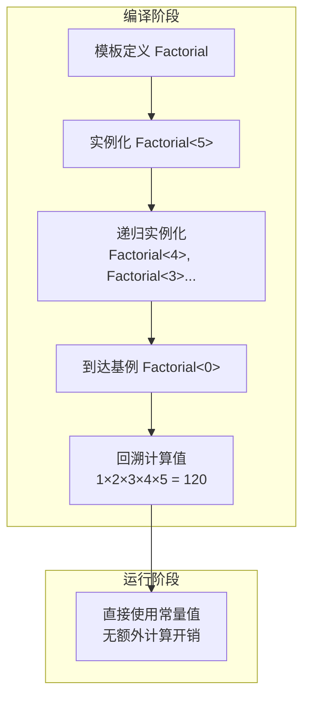
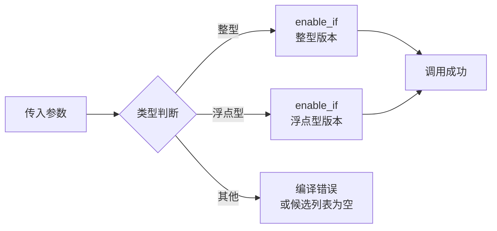
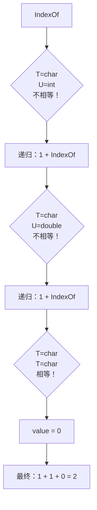
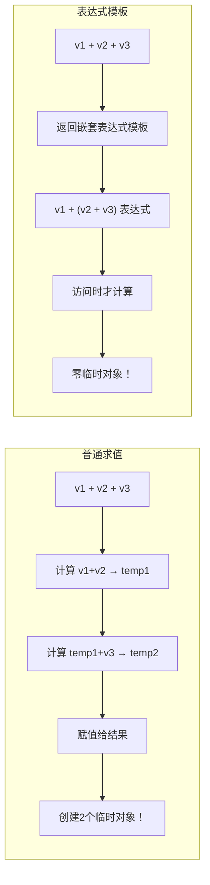
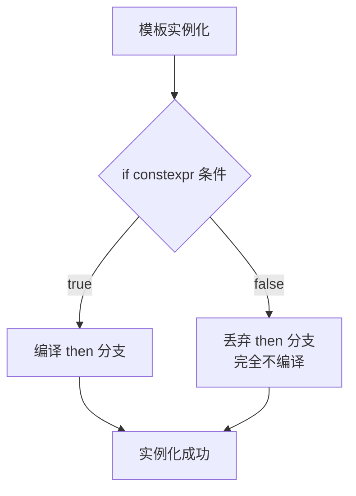
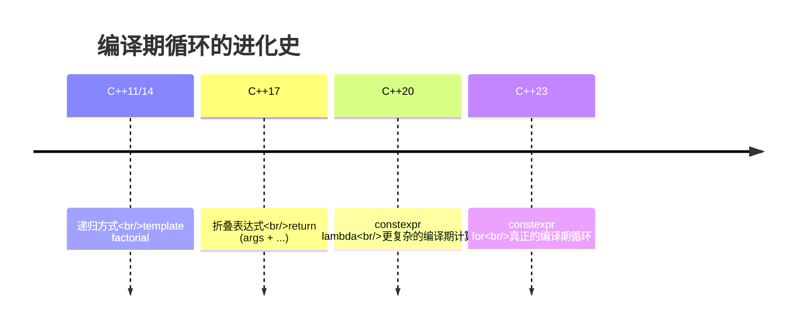
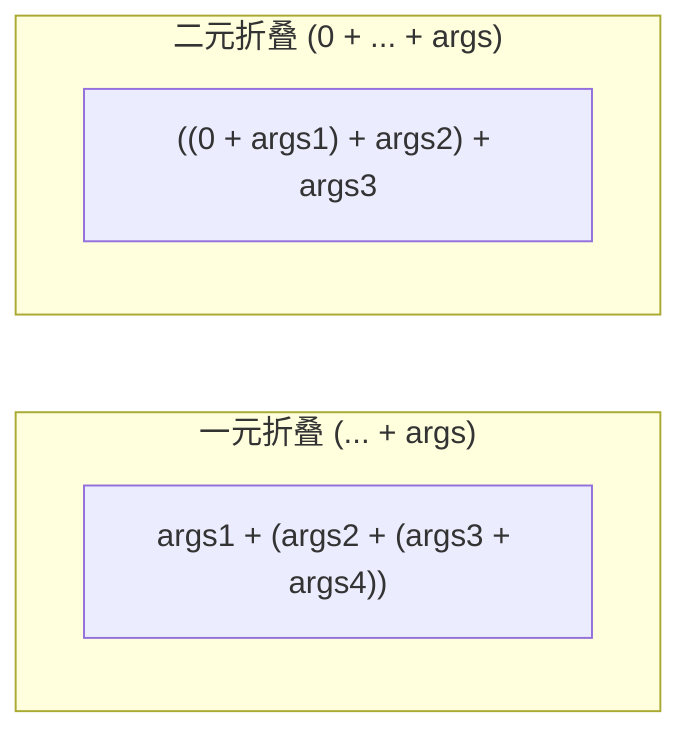

+++
title = "第18章 模板元编程"
weight = 180
date = "2026-03-29T21:03:00+08:00"
type = "docs"
description = ""
isCJKLanguage = true
draft = false
+++
# 第18章 模板元编程

欢迎来到C++最魔幻的领域——模板元编程！如果说普通编程是在运行时"指挥"计算机干活，那模板元编程就是在编译期"贿赂"编译器为你卖命。你的代码还没运行，编译器就已经在疯狂计算了。想象一下：你喝着咖啡等编译，编译器却在后台帮你把脏活累活都干完了——这就是模板元编程的魅力所在！

> 模板元编程（Template Metaprogramming）是一种利用C++模板系统，在**编译期**进行计算和类型操作的技术。它不属于程序运行时的行为，而是编译器在编译代码时生成代码的过程。听起来很美好对吧？但代价是——编译错误信息可能会让你怀疑人生。

## 18.1 编译期计算

编译期计算是模板元编程的"Hello World"。想象一下，你让编译器在你喝咖啡的时候，偷偷帮你把阶乘结果算好了放那儿等你。多么美妙的摸鱼技术！

### 什么是编译期计算？

普通程序是在程序启动后由CPU执行的，而编译期计算则在**编译阶段**就完成了所有运算。这意味着当你运行程序时，结果已经是"常数"了。编译器就像一个任劳任怨的打工人，在你提交代码的那一刻就开始疯狂计算。

### 模板递归实现阶乘

让我们用模板递归来实现一个编译期阶乘计算器：

```cpp
#include <iostream>

// 模板元编程：程序在编译期间执行计算
// 这不是运行时代码，而是编译器生成代码的依据
// 想象一下编译器是个计算器，你告诉它公式，它帮你算出结果

// 编译期计算阶乘 - 通用模板
// 这是一个递归模板：Factorial<5> = 5 * Factorial<4>
// 以此类推，直到 Factorial<0>
template<int N>
struct Factorial {
    // value 是一个编译期常量，由编译器在编译时计算
    static const int value = N * Factorial<N - 1>::value;
};

// 特化基例 - 递归的终点
// 当 N == 0 时，返回 1，终止递归
template<>
struct Factorial<0> {
    static const int value = 1;
};

// C++14: constexpr变量 - 更现代的方式
// constexpr 关键字告诉编译器尽可能在编译期计算
constexpr int factorial(int n) {
    if (n <= 1) return 1;
    return n * factorial(n - 1);
}

int main() {
    // 编译期计算！
    // 编译器在编译时就把 Factorial<5>::value 算出来了
    // 所以运行时直接打印常数，没有额外计算开销
    std::cout << "Factorial<5>::value = " << Factorial<5>::value << std::endl;  // 输出: 120
    std::cout << "Factorial<10>::value = " << Factorial<10>::value << std::endl;  // 输出: 3628800
    
    // C++14 constexpr也可以编译期计算
    // 这里数组大小在编译期就确定了：Factorial<6>::value = 720
    // 这是模板元编程的经典应用：用计算结果作为数组大小
    int arr[Factorial<6>::value];  // 编译期创建大小为720的数组！
    std::cout << "Array size: " << sizeof(arr) / sizeof(arr[0]) << std::endl;  // 输出: 720
    
    return 0;
}
```

> 编译信息显示 `Factorial<10>::value = 3628800`？没错，这不是程序运行时计算的——编译器在编译你的代码时就已经把答案写在输出里了。运行时只是把这个"预制答案"打印出来。

### 编译期计算的神奇应用

编译期计算可以用于：
- **数组大小确定**：如上面的 `int arr[Factorial<6>::value]`
- **静态断言**：`static_assert(Factorial<5>::value == 120)`
- **编译期类型选择**

mermaid 图示编译期计算过程：



## 18.2 类型traits

如果说模板是C++的"橡皮泥"（可以捏成任何形状），那类型traits就是"显微镜"——让你在编译期看清类型的每一个细节。想象一下，你是侦探，类型traits就是你的放大镜和指纹工具。

### 什么是类型traits？

**类型traits**是C++标准库提供的一系列模板，可以在编译期查询类型的属性（如是否整数、是否指针）、进行类型转换（添加/移除const）、选择类型等。所有的 `std::is_xxx` 和 `std::make_xxx` 都属于这个家族。

> `traits` 这个词在英文中是"特征"、"特性"的意思。在编程中，它指的是描述类型特征的元数据。C++的 `<type_traits>` 头文件就是这些特征的集合。

### 查询类型属性

让我们看看类型traits的常见用法：

```cpp
#include <iostream>
#include <type_traits>
#include <vector>

// 类型traits：在编译期查询和转换类型
// 想象 traits 是一套类型检测工具包

int main() {
    // 查询类型属性
    // std::boolalpha 让 bool 值打印为 "true"/"false" 而不是 "1"/"0"
    std::cout << std::boolalpha;
    
    // is_integral: 检查类型是否是整型（int, char, short, long, bool 等）
    // 注意：bool 也是整型！这是C++的历史遗留
    std::cout << "std::is_integral<int>::value = " 
              << std::is_integral<int>::value << std::endl;  // 输出: true
    
    // is_floating_point: 检查是否是浮点类型（float, double, long double）
    std::cout << "std::is_floating_point<double>::value = " 
              << std::is_floating_point<double>::value << std::endl;  // 输出: true
    
    // is_pointer: 检查是否是指针类型
    std::cout << "std::is_pointer<int*>::value = " 
              << std::is_pointer<int*>::value << std::endl;  // 输出: true
    std::cout << "std::is_pointer<int>::value = " 
              << std::is_pointer<int>::value << std::endl;  // 输出: false
    
    // 类型转换traits - remove_const
    // std::remove_const<const int>::type 返回 int（去掉const）
    // std::is_same 用于比较两个类型是否相同
    std::cout << "std::is_same<int, typename std::remove_const<const int>::type>::value = "
              << std::is_same<int, typename std::remove_const<const int>::type>::value << std::endl;
    // 输出: true （因为去掉 const 后的 int 就是 int）
    
    // C++14 简化写法：_v 后缀
    // 不用写 ::value，直接用 _v 版本，更简洁
    std::cout << "std::is_integral_v<int> = " 
              << std::is_integral_v<int> << std::endl;  // 输出: true
    
    // conditional: 在编译期根据条件选择类型
    // 如果 sizeof(int) >= 4 为真，选择 int，否则选择 long
    // 这在编写跨平台代码时非常有用
    using T = std::conditional_t<sizeof(int) >= 4, int, long>;
    std::cout << "conditional_t selects: " << sizeof(T) << " bytes" << std::endl;
    // 输出: 4 bytes（在32位以上系统）
    
    return 0;
}
```

### 常用的类型traits一览

| Traits | 作用 | 示例 |
|--------|------|------|
| `is_integral` | 是否整型 | `is_integral_v<int>` → true |
| `is_floating_point` | 是否浮点 | `is_floating_point_v<double>` → true |
| `is_pointer` | 是否指针 | `is_pointer_v<int*>` → true |
| `is_reference` | 是否引用 | `is_reference_v<int&>` → true |
| `is_array` | 是否数组 | `is_array_v<int[5]>` → true |
| `is_same` | 类型是否相同 | `is_same_v<int, int>` → true |
| `remove_const` | 去掉const | `remove_const_t<const int>` → int |
| `add_const` | 添加const | `add_const_t<int>` → const int |
| `conditional` | 条件选择 | `conditional_t<cond, A, B>` |

## 18.3 条件类型选择

有时候我们希望程序能"见机行事"——根据类型自动选择合适的处理方式。比如一个函数，传入整数返回一个大小，传入浮点数返回另一个大小。这就是**条件类型选择**的用武之地。

### conditional_t：根据条件选择类型

`std::conditional_t<Cond, A, B>` 就像三元运算符 `cond ? A : B` 的类型版本。如果 `Cond` 为真，选择类型 `A`，否则选择类型 `B`。

```cpp
#include <iostream>
#include <type_traits>

// conditional_t：在编译期根据条件选择类型
// 这就像类型版的三元运算符：condition ? TypeA : TypeB

// 案例：根据类型选择"最宽"的数值类型
// 如果是浮点类型，选择 long double（最宽的浮点）
// 如果是整型，选择 long long（最宽的整型）
// 否则，保持原类型
template<typename T>
using Widest = std::conditional_t<std::is_floating_point_v<T>, 
                                   long double,  // 条件为真时选择这个
                                   std::conditional_t<std::is_integral_v<T>,
                                                      long long,  // 内层条件为真
                                                      T>>;         // 内层条件为假

// enable_if: 条件编译模板
// 如果条件不满足，SFINAE（替换失败不是错误）会让这个重载被忽略
// 这是实现"重载根据类型自动选择"的核心技术

// 整数版本的 square 函数
// 只有当 T 是整型时，这个模板才有效
template<typename T>
typename std::enable_if<std::is_integral_v<T>, T>::type
square(T value) {
    return value * value;
}

// 浮点数版本的 square 函数
// 只有当 T 是浮点型时，这个模板才有效
template<typename T>
typename std::enable_if<std::is_floating_point_v<T>, T>::type
square(T value) {
    return value * value;
}

int main() {
    // 测试 Widest 类型选择
    std::cout << "Widest<int> size = " << sizeof(Widest<int>) << std::endl;
    // 输出: 8（long long 的大小）
    
    std::cout << "Widest<double> size = " << sizeof(Widest<double>) << std::endl;
    // 输出: 16（long double 的大小，取决于平台）
    
    std::cout << "Widest<float> size = " << sizeof(Widest<float>) << std::endl;
    // 输出: 16（long double 的大小）
    
    // 测试 square 函数重载选择
    // 编译器自动选择正确的重载：
    // - square(5) 调用整数版本
    // - square(3.14) 调用浮点版本
    std::cout << "square(5) = " << square(5) << std::endl;  // 输出: 25
    std::cout << "square(3.14) = " << square(3.14) << std::endl;  // 输出: 9.8596
    
    return 0;
}
```

> SFINAE（Substitution Failure Is Not An Error，替换失败不是错误）是C++模板的核心理念。简单来说：当编译器尝试实例化一个模板时，如果因为类型不匹配导致替换失败，它不会报错，而是简单地忽略这个重载候选，继续寻找其他匹配的重载。

### 工作原理图解



## 18.4 递归模板实例化

递归模板实例化是模板元编程的"瑞士军刀"。通过递归，我们可以让编译器帮我们遍历类型列表、查找类型位置、检查类型是否存在——所有这些都在编译期完成！

### TypeList：编译期类型列表

想象一下，你有一个类型列表 `TypeList<int, double, char>`，你想知道这个列表有多少个类型、某个类型在哪个位置、某个类型是否在列表中。这些在运行时可能很简单，但在编译期呢？答案就是递归模板实例化！

```cpp
#include <iostream>
#include <type_traits>

// 编译期遍历类型列表
// TypeList 就像一个类型数组，可以存储任意数量的类型
template<typename... Args>
struct TypeList {
    // sizeof...(Args) 是参数包展开操作符
    // 它返回模板参数的数量
    static constexpr size_t size = sizeof...(Args);
};

// 编译期查找类型在列表中的位置
// IndexOf<T, Args...> 返回 T 在 Args... 中的索引
// 如果找不到，返回 static_cast<size_t>(-1)（即最大size_t值，表示未找到）

// 主模板：提供默认实现（基例）
// 如果所有特化都不匹配，就会使用这个主模板
// 注意：实际使用时，类型应该在列表中，否则会触发这个基例
template<typename T, typename U = T, typename... Args>
struct IndexOf {
    static constexpr size_t value = static_cast<size_t>(-1);  // 未找到，返回最大值
};

// 特化：第一个类型（U）就是要找的 T，命中！返回索引 0
template<typename T, typename... Args>
struct IndexOf<T, T, Args...> {
    // 找到了！位置是 0
    static constexpr size_t value = 0;
};

// 特化：第一个类型（U）不是我们要找的 T，递归检查剩余类型
// 模式匹配：IndexOf<T, U, Args...> 意味着 T 是目标类型，U 是列表第一个元素
// 如果 U != T，说明当前位置不对，递归往后续找
template<typename T, typename U, typename... Args>
struct IndexOf<T, U, Args...> {
    // 当前位置不是，索引 +1，继续往后找
    static constexpr size_t value = 1 + IndexOf<T, Args...>::value;
};

// 编译期检查类型是否在列表中
// 返回 true_type 或 false_type（布尔值在类型系统中的表示）
template<typename T, typename... Args>
struct Contains;

// 特化：空列表，不包含任何类型
template<typename T>
struct Contains<T> : std::false_type {};  // 继承自 false_type，value = false

// 特化：第一个类型就是我们要找的
template<typename T, typename... Args>
struct Contains<T, T, Args...> : std::true_type {};  // 继承自 true_type，value = true

// 特化：第一个类型不是，递归检查剩余
template<typename T, typename U, typename... Args>
struct Contains<T, U, Args...> : Contains<T, Args...> {};  // 继承父类的结果

int main() {
    // 定义一个类型列表
    using MyTypes = TypeList<int, double, char, float>;
    
    // 查询列表大小
    std::cout << "TypeList size: " << MyTypes::size << std::endl;  // 输出: 4
    
    // 查找类型位置
    // IndexOf<int, int, double, char>：第一个类型就是 int，位置 0
    std::cout << "IndexOf<int, int, double, char>: " 
              << IndexOf<int, int, double, char>::value << std::endl;  // 输出: 0
    
    // IndexOf<char, int, double, char>：第一个不是，递归找到位置 2
    std::cout << "IndexOf<char, int, double, char>: " 
              << IndexOf<char, int, double, char>::value << std::endl;  // 输出: 2
    
    // 检查类型是否在列表中
    std::cout << "Contains<int, int, double>: " 
              << Contains<int, int, double>::value << std::endl;  // 输出: 1（true）
    std::cout << "Contains<char, int, double>: " 
              << Contains<char, int, double>::value << std::endl;  // 输出: 0（false）
    
    return 0;
}
```

> `true_type` 和 `false_type` 是C++标准库定义的"标签类型"，它们本身不存储值，但通过继承我们可以获得 `value` 成员。这种设计让布尔值可以在类型系统中传递。

### 递归模板工作原理



## 18.5 表达式模板简介

表达式模板是模板元编程的"骚操作"之一。它能让你写出 `v1 + v2 + v3 + v4` 这样的代码，却不会产生任何临时对象！想象一下数学中的惰性求值——表达式模板就是C++中的惰性求值实现。

### 什么是表达式模板？

普通情况下，当你写 `a + b + c` 时，编译器会：
1. 计算 `a + b`，产生一个临时对象 `temp1`
2. 计算 `temp1 + c`，产生另一个临时对象 `temp2`
3. 把 `temp2` 赋值给结果

如果有1000个数相加，你就会有999个临时对象！表达式模板通过返回"计算表达式"而不是"计算结果"来解决这个问题。

> 表达式模板的核心思想是：**不立即计算，延迟到真正需要结果时才计算**。就像数学中的 `f(x) = x^2` 不立即计算 x 的平方，而是等你传入具体的 x 值才开始算。

### 简化版表达式模板实现

```cpp
#include <iostream>
#include <vector>

// 表达式模板：延迟求值，避免临时对象
// 这是一个简化示例，展示表达式模板的核心原理

// 基础 Vec 类：存储数据的向量
template<typename T>
class Vec {
    T data_[3];  // 固定大小数组，简化实现
    
public:
    // 默认构造函数：初始化为 0
    Vec() { data_[0] = data_[1] = data_[2] = T{}; }
    
    // 带参构造函数
    Vec(T x, T y, T z) { data_[0] = x; data_[1] = y; data_[2] = z; }
    
    // const 版本下标访问
    const T& operator[](size_t i) const { return data_[i]; }
    
    // 非 const 版本下标访问
    T& operator[](size_t i) { return data_[i]; }
};

// VecExpr：表达式模板包装器
// 它不存储数据，而是存储一个"表达式"的引用
// 当你访问它的下标时，它会委托给内部的表达式去计算
template<typename Expr>
class VecExpr {
    const Expr& expr_;  // 存储表达式的引用
    
public:
    VecExpr(const Expr& e) : expr_(e) {}
    
    // 下标访问：返回表达式在该位置的结果
    const auto operator[](size_t i) const { return expr_[i]; }
};

// VecSum：表示两个 Vec 相加的表达式
template<typename T>
struct VecSum {
    const Vec<T>& a_;  // 引用，不拷贝
    const Vec<T>& b_;  // 引用，不拷贝
    
    // 重载下标操作符：返回对应位置的和
    T operator[](size_t i) const { return a_[i] + b_[i]; }
};

// 重载 + 操作符：返回表达式模板，而不是计算结果
template<typename T>
VecExpr<VecSum<T>> operator+(const Vec<T>& a, const Vec<T>& b) {
    // 返回一个表达式模板，包含两个 Vec 的引用
    // 此时还没有进行任何计算！
    return VecExpr<VecSum<T>>(VecSum<T>{a, b});
}

int main() {
    Vec<int> v1(1, 2, 3);
    Vec<int> v2(10, 20, 30);
    
    // v1 + v2 不执行加法，而是返回一个 VecExpr<VecSum<int>>
    // 这个表达式模板包含了对 v1 和 v2 的引用
    auto result = v1 + v2;  // 不立即计算，返回表达式模板
    
    // 当我们真正需要值的时候（通过下标访问），
    // 表达式模板才会计算出具体的数值
    std::cout << "result[0] = " << result[0] << std::endl;  // 实际计算时才求值
    std::cout << "result[1] = " << result[1] << std::endl;  // 输出: 22
    std::cout << "result[2] = " << result[2] << std::endl;  // 输出: 33
    
    return 0;
}
```

### 表达式模板 vs 普通求值



> 表达式模板是 Eigen（矩阵运算库）、Blaze 等高性能库的核心技术。通过延迟求值，它们能够进行复杂的数值计算而不会产生大量临时对象，从而大幅提升性能。

## 18.6 constexpr if（C++17）

如果说 `if` 是运行时的"选择大师"，那 `constexpr if` 就是编译期的"时间旅行者"。它能让你在编译期选择代码分支，而且不需要的分支会**直接消失**——不是跳过，而是根本不存在！

### constexpr if 的魔力

`constexpr if` 是 C++17 引入的特性。它的语法很简单：

```cpp
if constexpr (条件) {
    // 条件为 true 时编译这个分支
} else {
    // 条件为 false 时编译这个分支
}
```

但它的行为可不简单：**不满足条件的分支会被完全丢弃**，就像从来没写过一样。这意味着你可以写出"类型安全"的代码，不需要 SFINAE 的复杂技巧。

```cpp
#include <iostream>
#include <type_traits>
#include <vector>

// constexpr if：编译期if，在编译期选择代码分支
// 这个 if 是在编译期求值的，false 的分支会被完全丢弃

// 示例1：根据类型返回不同值
template<typename T>
auto getValue(T value) {
    // 如果 T 是整型，执行第一个分支
    // 否则，执行 else 分支
    if constexpr (std::is_integral_v<T>) {
        return value * 2;  // 只编译这个分支
    } else {
        return value;  // 其他分支被丢弃
    }
    // 编译器保证只有一个分支被编译
}

// 示例2：多重条件判断
template<typename T>
auto describe() {
    if constexpr (std::is_pointer_v<T>) {
        // 如果是指针类型
        return "pointer type";
    } else if constexpr (std::is_reference_v<T>) {
        // 如果是引用类型
        return "reference type";
    } else if constexpr (std::is_array_v<T>) {
        // 如果是数组类型
        return "array type";
    } else {
        // 其他类型
        return "other type";
    }
}

// 示例3：使用 std::is_integral 检查类型是否支持整数运算
// 注意：is_invocable_v<T, int> 检查的是"T本身是否可调用"，而非"T + int"是否有定义
// 这里用 is_integral_v 来演示整数类型的编译期判断
template<typename T>
auto process(T value) {
    // 用 is_integral 检查 T 是否是整数类型
    // 如果是整数类型，返回 value + 1；否则原样返回
    if constexpr (std::is_integral_v<T>) {
        // 如果 T 是整型，执行这个分支
        return value + 1;
    } else {
        return value;
    }
}

int main() {
    // 测试 getValue
    std::cout << "getValue(5) = " << getValue(5) << std::endl;  // 输出: 10
    std::cout << "getValue(3.14) = " << getValue(3.14) << std::endl;  // 输出: 3.14
    
    // 测试 describe
    std::cout << "describe<int*>() = " << describe<int*>() << std::endl;
    std::cout << "describe<int&>() = " << describe<int&>() << std::endl;
    std::cout << "describe<int>() = " << describe<int>() << std::endl;
    
    return 0;
}
```

### constexpr if vs SFINAE

| 特性 | constexpr if | SFINAE |
|------|-------------|--------|
| 代码可读性 | 直观，像普通 if | 需要技巧性的模板技巧 |
| 编译时间 | 较快 | 较慢（需要尝试多个替换） |
| 错误信息 | 更清晰 | 可能很复杂 |
| 灵活性 | 可以处理多个分支 | 需要多个重载 |
| C++版本 | C++17 | C++11 可用 |



## 18.7 if consteval（C++23）

`if consteval` 是 C++23 引入的"特异功能"。它能让你判断当前代码是否在**常量求值上下文**中运行。这就像是程序员的"读心术"——你知道你的代码是被编译器在编译期执行，还是被 CPU 在运行时执行。

### consteval 与 if consteval

**consteval** 是 C++20 引入的关键字，用于声明必须在编译期求值的函数。如果你在运行时调用 consteval 函数，编译器会报错（除非返回值被优化为常量）。

**if consteval** 是 C++23 的新特性，它允许你在 consteval 函数内部判断当前是否处于常量求值上下文。

```cpp
#include <iostream>

// C++23: consteval if
// 用于在consteval函数内部根据编译期/运行时条件选择分支

// consteval 函数：必须编译期求值
consteval int power(int base, int exp) {
    int result = 1;
    for (int i = 0; i < exp; ++i) {
        result *= base;
    }
    return result;
}

int main() {
    // if consteval：判断是否在常量求值上下文中
    
    // 如果这段代码在编译期求值，执行 then 分支
    // 如果在运行时执行，执行 else 分支
    if consteval {
        std::cout << "Running in constant evaluation context" << std::endl;
    } else {
        std::cout << "Running at runtime" << std::endl;
    }
    
    // constexpr 变量：在编译期计算
    constexpr int p2 = power(2, 10);  // 编译期计算
    std::cout << "2^10 = " << p2 << std::endl;  // 输出: 1024
    
    // 注意：如果这样调用：
    // int n = 5;
    // auto runtime_value = power(2, n);
    // 这会报错，因为 n 不是常量，power 必须是 consteval
    
    return 0;
}
```

### if consteval 的实际应用

`if consteval` 在编写需要同时支持编译期和运行时计算的库时非常有用。比如：
- 同时支持 `std::array` 初始化和运行时计算
- 实现"编译期缓存，运行时直接查表"的优化
- 调试和日志系统（区分编译期和运行时代码路径）

## 18.8 编译期for循环（C++23）

在 C++23 之前，编译期循环只有两种方式：**递归**和**折叠表达式**。而现在，C++23 终于允许你在 constexpr 上下文中使用 `for` 循环了！这让编译期循环的代码更像普通代码，更容易理解和维护。

### constexpr for 的新世界

C++23 扩展了 constexpr 的能力，允许在常量求值上下文中使用更完整的语句，包括 `for`、`while`、`do-while` 循环。这意味着你可以写出更像普通函数的编译期计算代码。

```cpp
#include <iostream>
#include <array>

// C++23: constexpr for (compile-time iteration)
// 编译期循环终于可以写成更像普通 for 循环的样子了！

// 使用模板参数包展开创建数组
// C++17 支持参数包展开，可以直接在初始化列表中使用 values...
template<auto... values>
constexpr auto make_array_v1() {
    // 使用初始化列表和参数包展开
    return std::array<int, sizeof...(values)>{values...};
}

// C++17: 使用模板参数包展开创建数组
// 参数包展开 `values...` 将所有传入的值展开为初始化列表
template<auto... values>
constexpr auto make_array() {
    // 将参数包展开为数组字面量
    // 这是 C++17 的标准语法，无需特殊扩展
    return std::array<int, sizeof...(values)>{values...};
}

int main() {
    // C++23 允许在 constexpr 上下文中使用更复杂的语句
    
    // 编译期创建并初始化数组
    constexpr auto arr = make_array<1, 2, 3, 4, 5>();
    
    // 静态断言：编译期验证
    static_assert(arr.size() == 5);
    static_assert(arr[0] == 1);
    static_assert(arr[4] == 5);
    
    // 运行时也可以使用（数组内容在编译期已确定）
    std::cout << "Array size: " << arr.size() << std::endl;  // 输出: 5
    std::cout << "Array elements: ";
    for (auto x : arr) {
        std::cout << x << " ";  // 输出: 1 2 3 4 5
    }
    std::cout << std::endl;
    
    return 0;
}
```

### 编译期循环的演进



## 18.9 变量模板（C++14）

变量模板是 C++14 引入的"语法糖"。它允许你创建"模板化的变量"——就像类模板、函数模板一样，但变量也可以有模板参数。这让很多 `::value` 或 `::type` 的访问变得更加简洁。

### 什么是变量模板？

普通变量是一个具体的值，变量模板则是一个值的"工厂"。你给它一个类型，它就给你一个对应的值。这在你需要为不同类型提供"类型相关常量"时特别有用。

```cpp
#include <iostream>
#include <type_traits>

// 变量模板：模板的变量形式
// 语法：template<typename T> constexpr T var_name = ...;

// 模板化的 is_signed 变量
// 使用时直接写 is_signed_v<int>，不用 is_signed<int>::value
template<typename T>
inline constexpr bool is_signed_v = std::is_signed<T>::value;

// 模板化的 sizeof 变量
// 再也不用写 sizeof(T) 了！
template<typename T>
inline constexpr size_t type_size_v = sizeof(T);

// 模板化的圆周率常量
// 为不同类型提供合适的 pi 值
// 注意：浮点字面量默认是 double，需要强制转换
template<typename T>
inline constexpr T pi = T(3.14159265358979323846);

int main() {
    std::cout << std::boolalpha;
    
    // 使用变量模板
    std::cout << "is_signed_v<int> = " << is_signed_v<int> << std::endl;  // 输出: true
    std::cout << "is_signed_v<unsigned> = " << is_signed_v<unsigned> << std::endl;  // 输出: false
    
    std::cout << "type_size_v<double> = " << type_size_v<double> << std::endl;  // 输出: 8
    
    // 使用 pi 变量模板
    // 自动获得对应类型的 pi 值
    std::cout << "pi<double> = " << pi<double> << std::endl;  // 输出: 3.14159
    std::cout << "pi<float> = " << pi<float> << std::endl;    // 输出: 3.14159
    
    return 0;
}
```

### 标准库的 _v 变量模板

C++14 开始，标准库提供了大量 `_v` 变量模板来简化代码：

| 旧写法 | 新写法（C++14+）|
|--------|----------------|
| `std::is_integral<T>::value` | `std::is_integral_v<T>` |
| `std::is_pointer<T>::value` | `std::is_pointer_v<T>` |
| `std::is_same<T, U>::value` | `std::is_same_v<T, U>` |
| `std::extent<T>::value` | `std::extent_v<T>` |

同样，C++17 提供了 `_t` 变量模板简化 `::type` 访问：

| 旧写法 | 新写法（C++17+） |
|--------|----------------|
| `std::remove_const<T>::type` | `std::remove_const_t<T>` |
| `std::add_pointer<T>::type` | `std::add_pointer_t<T>` |
| `std::make_unsigned<T>::type` | `std::make_unsigned_t<T>` |

## 18.10 折叠表达式（C++17）与 C++26 展望

折叠表达式是 C++17 引入的特性，让处理**参数包**变得前所未有的简单。而 C++26 草案进一步扩展了泛型 lambda 和模板参数包的能力，允许使用 `auto...` 作为非类型模板参数。

### 折叠表达式基础

折叠表达式允许你对参数包（`Args...`）应用一个二元运算符，将它们"折叠"成一个值。语法有四种形式：

```cpp
// 一元折叠
(... op pack)     // 左折叠：(((pack1 op pack2) op pack3) op ... op packN)
(pack op ...)      // 右折叠：(pack1 op (pack2 op (... op packN)))

// 二元折叠
(init op ... op pack)  // 左折叠：(init op pack1 op pack2 op ... op packN)
(pack op ... op init)  // 右折叠：(pack1 op pack2 op ... op packN op init)
```

```cpp
#include <iostream>

// C++26（草案）: 折叠表达式改进
// 包括约束排序等

// 可变参数模板 sum 函数
// 使用一元左折叠：(... + args) 展开为 ((args1 + args2) + args3) ...
template<typename... Args>
auto sum(Args... args) {
    // C++17 一元折叠表达式
    // 编译器自动将 args... 展开为累加表达式
    return (... + args);
}

// 使用二元折叠（带初始值）
template<typename T, typename... Args>
auto sum_with_initial(T init, Args... args) {
    // 二元左折叠：(0 + args1 + args2 + ...)
    return (init + ... + args);
}

// C++26（草案）: 折叠表达式与 variadic auto
// C++26 允许在泛型 lambda 和模板参数中使用 variadic auto
// 以下示例展示使用 variadic auto（非类型模板参数包）的折叠表达式
template<auto... values>
constexpr auto make_sum() {
    // C++26 支持 auto... 作为非类型模板参数包
    // 使用折叠表达式对所有参数求和
    return (... + values);
}

int main() {
    // 测试 sum
    std::cout << "sum(1, 2, 3, 4, 5) = " << sum(1, 2, 3, 4, 5) << std::endl;  // 输出: 15
    
    // 测试带初始值的 sum
    std::cout << "sum_with_initial(100, 1, 2, 3) = " << sum_with_initial(100, 1, 2, 3) << std::endl;
    // 输出: 106
    
    // 折叠表达式的其他应用
    // 打印所有参数：
    // ((std::cout << args) << ... << std::endl);
    
    // 检查所有条件都满足：
    // (true && ... && conditions)
    
    return 0;
}
```

### 常见折叠表达式模式

| 表达式 | 展开结果 | 说明 |
|--------|----------|------|
| `(args + ...)` | `((args1 + args2) + args3) ...` | 左折叠 |
| `(... + args)` | `(args1 + (args2 + args3)) ...` | 右折叠 |
| `(0 + ... + args)` | `(((0 + args1) + args2) + args3) ...` | 带初始值左折叠 |
| `(args + ... + 0)` | `(((args1 + args2) + args3) + 0)` | 带初始值右折叠 |



## 本章小结

本章我们探索了 C++ 模板元编程的神奇世界，从编译期计算到类型traits，从条件类型选择到表达式模板，一路走来，相信你已经感受到了模板元编程的强大与魅力。

### 核心知识点回顾

| 概念 | 关键点 | C++版本 |
|------|--------|---------|
| **编译期计算** | 通过模板递归在编译期计算阶乘等 | C++98/03 |
| **类型traits** | `is_xxx_v<T>` 查询类型，`remove/add_const` 转换类型 | C++11/14 |
| **条件类型选择** | `conditional_t`、`enable_if` 根据条件选择类型或启用函数 | C++11/14 |
| **递归模板实例化** | 通过模板递归遍历类型列表、查找索引 | C++11 |
| **表达式模板** | 延迟求值，避免临时对象，提升性能 | C++11/14 |
| **constexpr if** | 编译期条件分支选择，丢弃不需要的分支 | C++17 |
| **if consteval** | 判断是否在常量求值上下文 | C++23 |
| **编译期 for** | C++23 支持 constexpr 上下文中的循环 | C++23 |
| **变量模板** | `_v` 后缀简化 `::value` 访问 | C++14 |
| **折叠表达式** | `(... op pack)` 简化参数包处理 | C++17 |

### 模板元编程的哲学

> 模板元编程的核心思想是：**让编译器帮你写代码**。你描述"规则"，编译器生成"实现"。这不仅是技术的胜利，更是抽象思维的极致体现。

### 实战建议

1. **从简单开始**：先掌握 `constexpr` 和类型traits，再挑战复杂的模板递归
2. **重视编译错误**：模板错误信息往往很长，学会从中提取关键信息
3. **善用 static_assert**：在模板中加断言，帮助调试
4. **了解 SFINAE 和 constexpr if 的区别**：两者都可以实现条件编译，但 constexpr if 更现代
5. **性能测试**：模板元编程的优势在于运行时性能，记得用性能测试验证优化效果

### 延伸学习

- 深入学习 **Boost.MPL** 和 **Boost.Hana**（类型列表操作库）
- 探索 **Template Metaprogramming for the Modern C++** 相关书籍
- 研究 **Eigen**、**Blaze** 等使用表达式模板的高性能库
- 关注 C++ 标准演进，学习 **C++20 concepts** 和 **C++23 consteval**

模板元编程是 C++ 最强大也最复杂的特性之一。掌握它，你就像获得了"时间暂停术"——让编译器在你喝咖啡的时候帮你把活干完！下一章我们将介绍 C++ 的更多高级特性，敬请期待！
