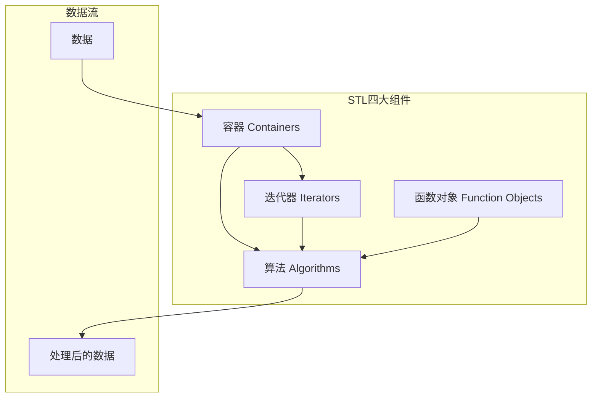

+++
title = "第19章 STL概述与容器"
weight = 190
date = "2026-03-29T21:03:00+08:00"
type = "docs"
description = ""
isCJKLanguage = true
draft = false
+++
# 第19章 STL概述与容器

想象一下，如果你每次存储数据都要自己造轮子――写一个动态数组、写一个排序算法、写一个查找函数――那C++代码可能会比《三体》的厚度还夸张。幸好我们有STL！这个被称为"标准模板库"的家伙，就是C++程序员偷懒...呃，我是说，**高效编程**的秘密武器。

## 19.1 STL架构：容器、算法、迭代器、函数对象

STL，全称Standard Template Library，中文名叫**标准模板库**。它是C++标准库的一部分，提供了常用的数据结构和算法。STL就像一个大型工具箱，里面有四大金刚：

> **四大组件一览：**
> - **容器（Containers）**：数据的"仓库"，帮你存储东西
> - **算法（Algorithms）**：数据的"操作方法"，帮你排序、查找、修改
> - **迭代器（Iterators）**：数据的"遥控器"，帮你遍历容器
> - **函数对象（Function Objects）**：算法的"策略卡片"，决定算法怎么工作

用一个不恰当的比喻：容器像是**厨房的冰箱**，算法像是**各种烹饪手法**（炒、煮、蒸、炸），迭代器像是**你伸手去拿食材的动作**，而函数对象则像是**你选择川菜还是粤菜的味觉偏好**。

```cpp
#include <iostream>
#include <vector>
#include <algorithm>
#include <functional>

/*
 * STL四大组件：厨房里的四大金刚
 * 
 * 1. 容器(Containers)：数据的仓库
 *    - 序列容器：vector(动态数组), deque(双端队列), list(链表), forward_list(单向链表), array(固定数组)
 *    - 关联容器：set(集合), multiset(多值集合), map(映射), multimap(多值映射)
 *    - 无序容器：unordered_set, unordered_multiset, unordered_map, unordered_multimap
 *    （无序就是用哈希表实现，不保证顺序，但查找飞快！）
 * 
 * 2. 算法(Algorithms)：操作数据的函数
 *    - 非修改式：find(找东西), count(数个数), for_each(遍历执行)
 *    - 修改式：copy(复制), transform(变换), remove(删除)
 *    - 排序：sort(排序), stable_sort(稳定排序), partial_sort(部分排序)
 *    - 数值：accumulate(累加), inner_product(内积)
 * 
 * 3. 迭代器(Iterators)：遍历容器的通用接口
 *    就像数组指针，但更通用！
 *    - 输入迭代器：只能读，像键盘输入
 *    - 输出迭代器：只能写，像打印机输出
 *    - 前向迭代器：只能往前走，像单行道
 *    - 双向迭代器：能前后走，像双向车道
 *    - 随机访问迭代器：想跳哪跳哪，像瞬移
 *    - 连续迭代器：内存连续，像数组
 * 
 * 4. 函数对象(Function Objects)：可调用对象
 *    - 函数指针：老派做法
 *    - 函数对象：重载了operator()的类
 *    - Lambda表达式：C++11的现代写法，匿名函数
 * 
 * 它们的关系（灵魂拷问）：
 * 算法通过迭代器操作容器，就像你用遥控器（迭代器）控制电视（容器），
 * 但看什么频道、用什么模式，由你手里的节目单（函数对象）决定！
 */

int main() {
    // 示例：STL组件的完美配合
    std::vector<int> vec = {5, 2, 8, 1, 9};  // 容器：装数据的动态数组
    
    // std::sort：排序算法，通过迭代器操作容器，std::greater<int>()是函数对象（降序排列）
    std::sort(vec.begin(), vec.end(), std::greater<int>());  // 排序算法+函数对象
    
    // 范围for循环内部使用迭代器遍历
    for (int x : vec) {  // 迭代器（range-for底层使用迭代器）
        std::cout << x << " ";  // 输出: 9 8 5 2 1
    }
    std::cout << std::endl;
    
    return 0;
}
```

**STL架构图：**



> **小贴士：** STL的设计理念是**泛型编程**――一种"一个函数/类，多种数据类型都能用"的编程范式。这也是为什么你看到`std::vector<int>`而不是`vector`，因为vector是模板，具体类型由你指定。

## 19.2 序列容器

序列容器，望文生义，就是**元素按照添加顺序排列**的容器。就像排队买奶茶，先来先服务。它们都坐在"序列"这把椅子上，等你来操作。

### std::vector

`std::vector`，中文名叫**向量**（别跟数学里的向量混淆），是STL中最常用的容器，没有之一。它本质上是一个**动态数组**――可以自动增长、收缩的数组。

> **通俗理解：** 想象vector是一个**弹性气球**。你往里面吹气（push_back），它就变大；你放气（pop_back），它就变小。而且它很聪明，会提前预留一些空间，避免每次吹气都要换大气球。

```cpp
#include <iostream>
#include <vector>

int main() {
    // std::vector：动态数组，可自动增长
    // 就像一个会自动扩展的数组，根本不用手动管理内存（new/delete）！
    
    std::vector<int> v;  // 声明一个int类型的vector，初始为空
    
    // push_back: 在尾部添加元素（最常用的操作！）
    for (int i = 0; i < 5; ++i) {
        v.push_back(i * 10);  // 依次添加 0, 10, 20, 30, 40
    }
    
    // 遍历vector
    std::cout << "Vector contents: ";
    for (const auto& val : v) {  // const auto& 避免拷贝，提升性能
        std::cout << val << " ";  // 输出: 0 10 20 30 40
    }
    std::cout << std::endl;
    
    // ========== 元素访问 ==========
    
    // 下标访问：快但不安全，越界不抛异常
    std::cout << "v[0] = " << v[0] << std::endl;  // 输出: 0
    
    // at()访问：带边界检查，越界会抛std::out_of_range异常
    std::cout << "v.at(2) = " << v.at(2) << std::endl;  // 输出: 20（带边界检查）
    
    // front()：访问第一个元素
    std::cout << "v.front() = " << v.front() << std::endl;  // 输出: 0
    
    // back()：访问最后一个元素
    std::cout << "v.back() = " << v.back() << std::endl;  // 输出: 40
    
    // ========== 容量相关 ==========
    
    // size()：当前元素个数
    std::cout << "Size: " << v.size() << std::endl;  // 输出: 5
    
    // capacity()：当前分配的存储空间（比size大，因为会预分配）
    std::cout << "Capacity: " << v.capacity() << std::endl;  // 输出: 8（可能，取决于实现）
    
    // empty()：是否为空
    std::cout << "Empty? " << v.empty() << std::endl;  // 输出: 0（false）
    
    // ========== 迭代器 ==========
    // 迭代器就像指针，可以遍历和访问元素
    
    auto it = v.begin();  // 指向第一个元素的迭代器
    std::cout << "First element: " << *it << std::endl;  // 输出: 0
    
    // ========== 插入和删除 ==========
    
    // insert()：在指定位置插入
    v.insert(v.begin() + 2, 99);  // 在位置2（即第三个元素前）插入99
    // 此时vector变为: 0 10 99 20 30 40
    
    // erase()：删除指定位置元素
    v.erase(v.begin() + 2);  // 删除位置2的元素（即刚插入的99）
    // 此时vector恢复: 0 10 20 30 40
    
    return 0;
}
```

### 动态扩容策略

vector虽好，但它不是无限大的。当元素数量超过当前容量时，它就需要**扩容**。扩容的过程就像换房子――把所有家具（旧数据）搬到新房子（新内存）里去。

> **warning:** 扩容是有代价的！需要拷贝所有元素、释放旧内存。如果在循环中频繁扩容，性能会急剧下降。所以**预分配空间**是个好习惯！

```cpp
#include <iostream>
#include <vector>

int main() {
    std::vector<int> v;  // 初始为空，capacity通常为0
    
    std::cout << "Initial capacity: " << v.capacity() << std::endl;  // 输出: 0
    
    /*
     * vector的扩容策略：
     * 当容量不足时，vector会分配更大的空间。
     * 大多数实现采用"倍增策略"――新容量 = 旧容量 * 2
     * 例如：0 -> 1 -> 2 -> 4 -> 8 -> 16 -> 32 ...
     * 
     * 为什么是倍增而不是固定增量（如每次+10）？
     * 因为倍增策略的均摊时间复杂度是O(1)，而固定增量是O(n)！
     * 想象一下：如果每次只加1，插入n个元素需要 1+2+3+...+n = O(n2)
     * 倍增策略下，总拷贝次数约为 n + n/2 + n/4 + ... < 2n = O(n)
     */
    
    for (int i = 0; i < 20; ++i) {
        v.push_back(i);
        // 只打印关键节点，观察容量变化
        if (i <= 10 || i >= 18) {
            std::cout << "After push " << i << ": size=" << v.size() 
                      << ", capacity=" << v.capacity() << std::endl;
        }
    }
    /*
     * 可能输出：
     * After push 0: size=1, capacity=1
     * After push 1: size=2, capacity=2
     * After push 2: size=3, capacity=4
     * After push 3: size=4, capacity=4
     * After push 4: size=5, capacity=8
     * ... 以此类推
     */
    
    // ========== 预分配空间 ==========
    // reserve()方法可以预先分配足够的空间，避免频繁扩容
    
    std::vector<int> v2;
    v2.reserve(100);  // 预分配100个元素空间
    std::cout << "Reserved capacity: " << v2.capacity() << std::endl;  // 输出: 100
    
    // 现在插入100个元素都不会触发扩容！
    for (int i = 0; i < 100; ++i) {
        v2.push_back(i);
    }
    std::cout << "After 100 inserts: " << v2.capacity() << std::endl;  // 仍然是100
    
    // ========== 释放多余空间 ==========
    // shrink_to_fit()请求释放未使用的容量
    v2.shrink_to_fit();
    std::cout << "After shrink_to_fit: " << v2.capacity() << std::endl;  // 变为100
    
    // ========== clear() vs resize() ==========
    std::vector<int> v3 = {1, 2, 3, 4, 5};
    v3.clear();  // 清空所有元素，但容量不变
    std::cout << "After clear: size=" << v3.size() << ", capacity=" << v3.capacity() << std::endl;
    // 输出: size=0, capacity=5
    
    v3.resize(10);  // 改变大小，如果变大会用默认值填充
    std::cout << "After resize(10): size=" << v3.size() << std::endl;  // 输出: 10
    
    return 0;
}
```

### 迭代器失效

迭代器失效（Iterator Invalidation）是vector使用中最容易踩坑的地方。简单来说，就是**你保存的迭代器可能变得无效**。

> **通俗解释：** 迭代器就像一张写有"门牌号"的纸条。当房东（vector）换了一套更大的房子（扩容）后，原来的门牌号就不管用了。如果不更新纸条，你就会去一个不存在的地方敲门。

```cpp
#include <iostream>
#include <vector>

int main() {
    std::vector<int> v = {1, 2, 3, 4, 5};  // 容量可能为5
    
    // 迭代器在以下情况会失效：
    
    // 情况1：插入/删除元素导致重新分配
    // 如果insert触发扩容，所有现有迭代器都会失效！
    auto it_old = v.begin() + 2;  // 指向元素3
    
    v.insert(v.begin(), 0);  // 插入到开头，可能触发扩容
    // 此时原来的it_old已经失效！使用它会导致未定义行为！
    
    // 情况2：删除操作使被删除元素之后的迭代器失效
    std::vector<int> v2 = {1, 2, 3, 4, 5};
    auto it = v2.begin() + 2;  // 指向3
    
    v2.erase(v2.begin());  // 删除第一个元素
    // 此时it失效，因为它指向的元素3现在在位置1了
    
    // ========== 正确做法 ==========
    
    // erase()会返回下一个有效迭代器，利用这个特性！
    std::vector<int> v3 = {1, 2, 3, 4, 5};
    it = v3.begin() + 1;  // 指向2
    
    it = v3.erase(it);  // 删除2，返回下一个位置的迭代器
    std::cout << "After erase, *it = " << *it << std::endl;  // 输出: 3（原来的3）
    
    // ========== 在循环中安全删除元素 ==========
    
    // 错误做法：范围for循环中删除元素
    // for (auto it4 : nums) {  // 不要这样！
    //     if (*it4 % 2 == 0) {
    //         nums.erase(it4);  // 危险！
    //     }
    // }
    
    // 正确做法：使用普通for循环，手动管理迭代器
    std::vector<int> nums = {1, 2, 3, 4, 5};
    for (auto it4 = nums.begin(); it4 != nums.end(); ) {
        if (*it4 % 2 == 0) {  // 如果是偶数
            it4 = nums.erase(it4);  // 删除并获取下一个迭代器
        } else {
            ++it4;  // 不是偶数才前进
        }
    }
    
    std::cout << "After removing evens: ";
    for (int x : nums) std::cout << x << " ";  // 输出: 1 3 5
    std::cout << std::endl;
    
    // ========== 总结 ==========
    /*
     * 迭代器失效规则（针对vector）：
     * 1. insert/emplace：
     *    - 如果发生扩容：所有迭代器都失效！
     *    - 如果没发生扩容：插入点之前的迭代器仍然有效，之后的失效
     * 2. erase：被删除元素之前的迭代器仍然有效，之后的失效
     * 3. clear()或shrink_to_fit()：所有迭代器都失效
     * 
     * 最佳实践：
     * - 在可能修改容器的循环中，使用erase的返回值更新迭代器
     * - 或者先记录要删除的位置，循环结束后再统一删除
     * - 插入操作后，立即更新可能失效的迭代器
     */
    
    return 0;
}
```

### std::deque

`std::deque`，全称**double-ended queue**（双端队列），是一种前端和后端都可以高效操作的数据结构。

> **通俗理解：** deque就像**地铁站**。你可以在车头上车（push_front），也可以在车尾上车（push_back）。而且它支持随机访问，就像你可以从任意车厢下车一样。但它不是连续的内存块，而是由多个"车厢"组成的。

```cpp
#include <iostream>
#include <deque>

int main() {
    // std::deque：双端队列
    // 支持在两端快速插入/删除，随机访问
    // 但不保证连续内存（不像vector）
    
    std::deque<int> dq;  // 声明一个deque
    
    // 两端操作
    dq.push_back(1);     // 尾部添加：O(1)
    dq.push_front(0);    // 头部添加：O(1)！这是deque的杀手锏！
    dq.push_back(2);
    
    std::cout << "Deque contents: ";
    for (int x : dq) {
        std::cout << x << " ";  // 输出: 0 1 2
    }
    std::cout << std::endl;
    
    // ========== 随机访问 ==========
    // deque支持[]和at()访问，就像vector一样！
    std::cout << "dq[1] = " << dq[1] << std::endl;  // 输出: 1
    std::cout << "dq.at(0) = " << dq.at(0) << std::endl;  // 输出: 0（带边界检查）
    
    // ========== 两端删除 ==========
    dq.pop_front();  // 头部删除：O(1)
    dq.pop_back();   // 尾部删除：O(1)
    std::cout << "After pops, size = " << dq.size() << std::endl;  // 输出: 1
    
    // ========== 访问两端元素 ==========
    std::deque<int> dq2 = {10, 20, 30, 40, 50};
    std::cout << "Front: " << dq2.front() << std::endl;  // 输出: 10
    std::cout << "Back: " << dq2.back() << std::endl;    // 输出: 50
    
    // ========== vector vs deque ==========
    /*
     * vector优点：
     * - 内存连续，缓存友好，访问快
     * - 实现简单
     * 
     * deque优点：
     * - 两端操作都是O(1)
     * - 不需要连续内存，插入头部不会导致所有元素移动
     * 
     * 选择建议：
     * - 默认用vector
     * - 需要频繁在头部插入/删除，用deque
     * - 需要高性能随机访问且频繁操作头部，deque
     * 
     * 迭代器失效规则（针对deque）：
     * - 在deque两端push/pop不会使迭代器失效！
     * - 在deque中间插入/删除：所有迭代器都失效！
     * - erase删除元素：被删除位置之前的迭代器仍有效，之后的失效
     * 
     * 这点和vector不同：deque的迭代器不会因为一端的操作而失效。
     */
    
    return 0;
}
```

### std::list

`std::list`是**双向链表**容器。每个元素都是独立的节点，通过前后指针连接起来。

> **通俗理解：** list就像**寻宝游戏**中的线索卡片。每个卡片上写着"下一张卡片在柜子左边第三个抽屉"。你要一个一个找，不能跳着找。但好处是，插入和删除只需要改改指针就行。

```cpp
#include <iostream>
#include <list>

int main() {
    // std::list：双向链表
    // 插入/删除O(1)，不支持随机访问（没有[]操作符！）
    
    std::list<int> lst = {1, 2, 3, 4, 5};
    
    std::cout << "List contents: ";
    for (int x : lst) {
        std::cout << x << " ";  // 输出: 1 2 3 4 5
    }
    std::cout << std::endl;
    
    // ========== 两端操作 ==========
    lst.push_front(0);  // 头部插入：O(1)
    lst.push_back(6);   // 尾部插入：O(1)
    std::cout << "After push: ";
    for (int x : lst) std::cout << x << " ";  // 输出: 0 1 2 3 4 5 6
    std::cout << std::endl;
    
    // ========== splice：链表专属的搬家技能！ ==========
    // splice可以将另一个链表的元素"剪贴"过来，时间复杂度O(1)！
    
    std::list<int> lst2 = {100, 200};
    auto it = lst.begin();
    ++it;  // 移动到位置1（指向元素1）
    
    // 把lst2的所有元素剪贴到it之前
    lst.splice(it, lst2);  // lst2变为空，lst包含所有元素
    
    std::cout << "After splice: ";
    for (int x : lst) std::cout << x << " ";  // 输出: 0 100 200 1 2 3 4 5 6
    std::cout << std::endl;
    std::cout << "lst2 is now empty? " << lst2.empty() << std::endl;  // 输出: 1（true）
    
    // ========== remove：按值删除 ==========
    lst.remove(100);  // 删除所有值为100的元素
    std::cout << "After remove(100): ";
    for (int x : lst) std::cout << x << " ";  // 输出: 0 200 1 2 3 4 5 6
    std::cout << std::endl;
    
    // ========== remove_if：按条件删除 ==========
    lst.push_back(1);
    lst.push_back(1);
    lst.remove_if([](int x) { return x < 3; });  // 删除所有小于3的元素
    std::cout << "After remove_if(x < 3): ";
    for (int x : lst) std::cout << x << " ";  // 输出: 3 4 5 6
    std::cout << std::endl;
    
    // ========== merge：合并两个有序链表 ==========
    std::list<int> lst3 = {1, 3, 5};
    std::list<int> lst4 = {2, 4, 6};
    lst3.merge(lst4);  // lst4变为空，lst3变为 {1, 2, 3, 4, 5, 6}
    
    // ========== unique：去除连续重复元素 ==========
    std::list<int> lst5 = {1, 1, 2, 2, 2, 3, 1, 1};
    lst5.unique();  // 变为 {1, 2, 3, 1}
    
    // ========== sort：排序 ==========
    lst5.sort();  // 变为 {1, 1, 2, 3}
    
    std::cout << "After unique and sort: ";
    for (int x : lst5) std::cout << x << " ";  // 输出: 1 1 2 3
    std::cout << std::endl;
    
    return 0;
}
```

### std::forward_list（C++11）

`std::forward_list`是**单向链表**，比双向链表更节省内存，因为每个节点只需要一个指针。

> **通俗理解：** forward_list就像**单行道**。你只能往前走，不能掉头。省油（内存），但灵活性差一些。顺嘴一提，它**没有size()方法**，因为链表统计size需要O(n)时间，设计者选择不让你方便地获取它。

```cpp
#include <iostream>
#include <forward_list>

int main() {
    // std::forward_list：单向链表
    // 只支持前向迭代，比list更节省内存
    // 不支持size()、push_back()、pop_back()！
    
    std::forward_list<int> fl = {1, 2, 3, 4, 5};
    
    std::cout << "Forward list contents: ";
    for (int x : fl) {
        std::cout << x << " ";  // 输出: 1 2 3 4 5
    }
    std::cout << std::endl;
    
    // ========== 头部操作 ==========
    fl.push_front(0);  // 头部插入：O(1)
    
    // 注意！单向链表只能在某个元素之后插入！
    // insert_after()：在指定位置之后插入
    auto it = fl.begin();  // 指向第一个元素（1）
    ++it;  // 移动到第二个元素的位置
    
    // 在it之后插入99（相当于在1和2之间插入99）
    fl.insert_after(it, 99);
    
    std::cout << "After insert: ";
    for (int x : fl) std::cout << x << " ";  // 输出: 0 1 99 2 3 4 5
    std::cout << std::endl;
    
    // ========== erase_after：删除指定位置之后的元素 ==========
    auto it2 = fl.begin();  // 指向0
    ++it2;  // 指向1
    fl.erase_after(it2);  // 删除1之后的元素（即99）
    
    std::cout << "After erase_after: ";
    for (int x : fl) std::cout << x << " ";  // 输出: 0 1 2 3 4 5
    std::cout << std::endl;
    
    // ========== remove：按值删除 ==========
    fl.push_front(100);
    fl.push_front(100);
    fl.remove(100);  // 删除所有100
    
    std::cout << "After remove(100): ";
    for (int x : fl) std::cout << x << " ";  // 输出: 0 1 2 3 4 5
    std::cout << std::endl;
    
    // ========== remove_if：按条件删除 ==========
    fl.push_front(7);
    fl.push_front(8);
    fl.push_front(9);
    fl.remove_if([](int x) { return x > 6; });  // 删除所有大于6的
    
    std::cout << "After remove_if(x > 6): ";
    for (int x : fl) std::cout << x << " ";  // 输出: 0 1 2 3 4 5
    std::cout << std::endl;
    
    // ========== 特点总结 ==========
    /*
     * forward_list vs list：
     * - forward_list：单向，省内存，不支持反向遍历
     * - list：双向，内存开销稍大，支持双向遍历
     * 
     * 使用建议：
     * - 只需要从头遍历，不需要反向遍历 → forward_list
     * - 内存敏感场景 → forward_list
     * - 其他情况 → list
     */
    
    return 0;
}
```

### std::array（C++11）

`std::array`是**固定大小的数组**，存储在栈上（也可以在堆上），大小在编译时确定。

> **通俗理解：** array就像**固定大小的鞋盒**。你买的时候是42码就永远是42码，塞不进去多余的鞋子。但它很老实，内存布局和C风格数组一样，可以和C代码无缝对接。

```cpp
#include <iostream>
#include <array>
#include <algorithm>

int main() {
    // std::array：固定大小数组，栈上分配
    // 固定大小，存储在栈上，不像vector在堆上
    // 大小必须是编译时常量！
    
    std::array<int, 5> arr = {5, 2, 8, 1, 9};  // 必须在模板参数中指定大小！
    
    std::cout << "Array contents: ";
    for (int x : arr) {
        std::cout << x << " ";  // 输出: 5 2 8 1 9
    }
    std::cout << std::endl;
    
    // ========== 访问元素 ==========
    std::cout << "arr[0] = " << arr[0] << std::endl;  // 输出: 5
    std::cout << "arr.at(1) = " << arr.at(1) << std::endl;  // 输出: 2（带边界检查）
    
    // ========== front和back ==========
    std::cout << "Front: " << arr.front() << std::endl;  // 输出: 5
    std::cout << "Back: " << arr.back() << std::endl;    // 输出: 9
    
    // ========== size和empty ==========
    std::cout << "Size: " << arr.size() << std::endl;   // 输出: 5
    std::cout << "Empty? " << arr.empty() << std::endl;  // 输出: 0（false）
    
    // ========== 数据指针 ==========
    // data()返回原始数组指针，可以传给C函数
    int* raw_ptr = arr.data();
    std::cout << "First element via data(): " << *raw_ptr << std::endl;  // 输出: 5
    
    // ========== 排序 ==========
    // array可以像vector一样使用STL算法！
    std::sort(arr.begin(), arr.end());  // 升序排序
    std::cout << "Sorted ascending: ";
    for (int x : arr) std::cout << x << " ";  // 输出: 1 2 5 8 9
    std::cout << std::endl;
    
    std::sort(arr.begin(), arr.end(), std::greater<int>());  // 降序排序
    std::cout << "Sorted descending: ";
    for (int x : arr) std::cout << x << " ";  // 输出: 9 8 5 2 1
    std::cout << std::endl;
    
    // ========== std::get<N>：编译期索引访问 ==========
    // 模板参数N必须是编译时常量！
    std::cout << "std::get<0>(arr) = " << std::get<0>(arr) << std::endl;  // 输出: 9（排序后）
    std::cout << "std::get<4>(arr) = " << std::get<4>(arr) << std::endl;  // 输出: 1
    
    // ========== constexpr特性 ==========
    // array的大小可以在编译期使用
    static_assert(arr.size() == 5, "Array size must be 5");  // 编译时断言！
    
    // ========== 初始化特性 ==========
    std::array<int, 3> arr2 = {};  // 所有元素初始化为0
    std::array<int, 3> arr3 = {42}; // arr3[0]=42, arr3[1]=0, arr3[2]=0
    
    // ========== array vs vector vs C数组 ==========
    /*
     * | 特性       | array        | vector         | C数组          |
     * |------------|--------------|----------------|----------------|
     * | 大小        | 固定          | 动态           | 固定           |
     * | 内存位置    | 栈上          | 堆上           | 栈上（通常）   |
     * | 边界检查    | at()支持     | at()支持        | 无             |
     * | STL算法    | 支持          | 支持            | 不直接支持     |
     * | 赋值        | 可以（替换元素）| 可以（替换全部）| 不可           |
     * 
     * 选择建议：
     * - 大小固定且已知 → array
     * - 大小需要变化 → vector
     * - 需要和C代码交互 → 根据情况选择
     */
    
    return 0;
}
```

## 19.3 关联容器

关联容器是一种**自动排序**的容器。它们根据键（key）来组织数据，并且始终保持有序状态。

> **通俗理解：** 关联容器就像**图书馆的索引柜**。书不是随便放的，而是按照字母顺序排列的。你要找一本书，直接翻到对应的字母区域就行，不用从头翻到尾。

### std::set、std::multiset

`std::set`是**集合**，元素唯一且自动排序。`std::multiset`是**多值集合**，允许重复元素。

> **通俗理解：** set就像**每个同学的学号**――全校唯一，没有重复。multiset就像**教室里的座位号**――虽然大多数座位号只对应一个同学，但如果有人坐双胞胎...好吧，这个比喻有点牵强。

```cpp
#include <iostream>
#include <set>

int main() {
    // std::set：有序集合，元素唯一，自动排序（默认升序）
    // std::multiset：有序集合，元素可重复
    
    // ========== std::set ==========
    std::set<int> s = {5, 2, 8, 2, 1, 9, 1};
    // 重复元素只保留一个，按排序后的顺序存储
    // 结果：{1, 2, 5, 8, 9}
    
    std::cout << "Set contents: ";
    for (int x : s) {
        std::cout << x << " ";  // 输出: 1 2 5 8 9（自动排序！）
    }
    std::cout << std::endl;
    
    // ========== 查找操作 ==========
    // find()：查找元素，返回迭代器
    auto it = s.find(5);
    if (it != s.end()) {
        std::cout << "Found element: " << *it << std::endl;  // 输出: Found element: 5
    }
    
    // count()：返回元素出现的次数（set只能是0或1）
    std::cout << "s.count(5) = " << s.count(5) << std::endl;  // 输出: 1
    std::cout << "s.count(100) = " << s.count(100) << std::endl;  // 输出: 0
    
    // ========== 边界操作 ==========
    // lower_bound(k)：返回 >= k 的第一个元素的迭代器
    // upper_bound(k)：返回 > k 的第一个元素的迭代器
    
    auto lb = s.lower_bound(5);  // 指向5
    auto ub = s.upper_bound(5);  // 指向8（下一个）
    
    std::cout << "*lower_bound(5) = " << *lb << std::endl;  // 输出: 5
    std::cout << "*upper_bound(5) = " << *ub << std::endl;  // 输出: 8
    
    // 利用边界获取一个范围
    std::cout << "Elements in range [5, 8): ";
    for (auto it2 = s.lower_bound(5); it2 != s.upper_bound(8); ++it2) {
        std::cout << *it2 << " ";  // 输出: 5
    }
    std::cout << std::endl;
    
    // ========== equal_range ==========
    // 返回一个pair，表示等于k的元素范围
    auto range = s.equal_range(5);
    std::cout << "equal_range(5): ";
    for (auto it3 = range.first; it3 != range.second; ++it3) {
        std::cout << *it3 << " ";  // 输出: 5
    }
    std::cout << std::endl;
    
    // ========== 插入和删除 ==========
    std::set<int> s2;
    
    s2.insert(10);  // 插入单个元素
    s2.insert(20);
    s2.insert(10);  // 重复元素不会插入
    
    std::cout << "s2 after inserts: ";
    for (int x : s2) std::cout << x << " ";  // 输出: 10 20
    std::cout << std::endl;
    
    // erase()：删除元素
    s2.erase(10);  // 删除值为10的元素
    std::cout << "After erase(10): ";
    for (int x : s2) std::cout << x << " ";  // 输出: 20
    std::cout << std::endl;
    
    // ========== std::multiset ==========
    // 允许重复元素的集合
    
    std::multiset<int> ms = {1, 2, 2, 3, 2, 4};
    std::cout << "Multiset contents: ";
    for (int x : ms) {
        std::cout << x << " ";  // 输出: 1 2 2 2 3 4（重复元素都保留）
    }
    std::cout << std::endl;
    
    // count()：返回元素出现的次数
    std::cout << "ms.count(2) = " << ms.count(2) << std::endl;  // 输出: 3
    
    // find()：返回第一个匹配元素的迭代器
    auto it_ms = ms.find(2);
    std::cout << "First 2: " << *it_ms << std::endl;  // 输出: 2
    
    // erase()：删除所有匹配的元素
    ms.erase(2);  // 删除所有值为2的元素！
    std::cout << "After erase(2): ";
    for (int x : ms) std::cout << x << " ";  // 输出: 1 3 4
    std::cout << std::endl;
    
    // ========== 自定义比较函数 ==========
    // 默认使用 std::less（升序）
    // 可以自定义为降序
    
    std::set<int, std::greater<int>> s3 = {5, 2, 8, 1, 9};
    std::cout << "Set (descending): ";
    for (int x : s3) std::cout << x << " ";  // 输出: 9 8 5 2 1
    std::cout << std::endl;
    
    return 0;
}
```

### std::map、std::multimap

`std::map`是**映射**，存储键值对（key-value），键唯一且自动排序。`std::multimap`是**多值映射**，允许重复键。

> **通俗理解：** map就像**字典**，每个字（key）对应一个解释（value）。multimap就像**同义词词典**，一个解释可能对应多个字。std::map不允许一个key有多个value，但std::multimap可以。

```cpp
#include <iostream>
#include <map>
#include <string>

int main() {
    // std::map：有序键值对，键唯一，自动按键排序
    // std::multimap：有序键值对，键可重复
    
    // ========== std::map ==========
    std::map<std::string, int> scores = {
        {"Alice", 90},
        {"Bob", 85},
        {"Charlie", 92}
    };
    
    // ========== 插入操作 ==========
    // 方式1：使用operator[]
    scores["David"] = 88;  // 如果key不存在，插入并赋值
    
    // 方式2：使用insert
    scores.insert({"Eve", 95});
    scores.insert(std::make_pair("Frank", 87));
    
    // 方式3：使用emplace（C++11）
    scores.emplace("Grace", 91);
    
    // 方式4：使用insert_or_assign（C++17）
    scores.insert_or_assign("Alice", 100);  // key存在则更新，不存在则插入
    // 注意：insert_or_assign会覆盖已存在的值！
    
    // insert的返回值是pair<iterator, bool>，bool表示是否插入成功
    auto [iter, inserted] = scores.insert({"Alice", 100});
    if (!inserted) {
        std::cout << "Alice already exists with score: " << iter->second << std::endl;
        // 输出: Alice already exists with score: 90
    }
    
    // ========== 访问操作 ==========
    // 使用operator[]访问，如果key不存在会插入！
    std::cout << "Alice's score: " << scores["Alice"] << std::endl;  // 输出: 90
    
    // 使用at()访问，如果key不存在会抛异常
    try {
        std::cout << scores.at("NonExistent") << std::endl;
    } catch (const std::out_of_range& e) {
        std::cout << "Key not found via at()!" << std::endl;  // 输出这个
    }
    
    // 使用find()查找
    auto it = scores.find("Bob");
    if (it != scores.end()) {
        std::cout << "Found Bob with score: " << it->second << std::endl;  // 输出: Found Bob with score: 85
    }
    
    // ========== 遍历（按键顺序！） ==========
    std::cout << "\nAll scores (sorted by key):" << std::endl;
    for (const auto& [name, score] : scores) {  // 结构化绑定（C++17）
        std::cout << name << ": " << score << std::endl;
    }
    /*
     * 输出（按键排序）：
     * Alice: 90
     * Bob: 85
     * Charlie: 92
     * David: 88
     * Eve: 95
     * Frank: 87
     * Grace: 91
     */
    
    // ========== 删除操作 ==========
    scores.erase("Bob");  // 删除key为"Bob"的元素
    std::cout << "After erase Bob, size = " << scores.size() << std::endl;  // 输出: 6
    
    // ========== 边界操作 ==========
    std::map<char, int> m = {{'a', 1}, {'c', 3}, {'e', 5}};
    
    auto lb = m.lower_bound('c');  // 指向 ('c', 3)
    auto ub = m.upper_bound('c'); // 指向 ('e', 5)
    
    // ========== std::multimap ==========
    // 允许多个相同的key
    
    std::multimap<std::string, int> mm = {
        {"apple", 1},
        {"banana", 2},
        {"apple", 3},  // 允许重复的key！
        {"cherry", 4}
    };
    
    std::cout << "\nMultimap contents:" << std::endl;
    for (const auto& [fruit, num] : mm) {
        std::cout << fruit << ": " << num << std::endl;
    }
    /*
     * 输出：
     * apple: 1
     * banana: 2
     * apple: 3
     * cherry: 4
     */
    
    // count()：某个key出现的次数
    std::cout << "Count of 'apple': " << mm.count("apple") << std::endl;  // 输出: 2
    
    // find()：返回第一个匹配的元素的迭代器
    auto it_mm = mm.find("apple");
    std::cout << "First apple: " << it_mm->second << std::endl;  // 输出: 1
    
    // 遍历某个key的所有值
    std::cout << "All apples: ";
    auto range = mm.equal_range("apple");
    for (auto it2 = range.first; it2 != range.second; ++it2) {
        std::cout << it2->second << " ";  // 输出: 1 3
    }
    std::cout << std::endl;
    
    // ========== 自定义比较函数 ==========
    // 默认按键的 < 比较，可以自定义
    std::map<int, std::string, std::greater<int>> m2 = {
        {3, "three"},
        {1, "one"},
        {2, "two"}
    };
    std::cout << "Map (descending): ";
    for (const auto& [k, v] : m2) std::cout << k << " ";  // 输出: 3 2 1
    std::cout << std::endl;
    
    return 0;
}
```

## 19.4 无序关联容器（C++11）

无序关联容器是**哈希表**实现的容器，不保证元素顺序，但查找、插入操作平均是**O(1)**时间复杂度。

> **通俗理解：** 有序容器（set/map）像**按字母顺序排列的字典**，找"zoo"需要翻很多页。无序容器像**按内容分类的图书馆**（技术区、历史区...），每个区里再按房间号排。理论上，O(1)就是"一步到位"！

### std::unordered_set、std::unordered_multiset

```cpp
#include <iostream>
#include <unordered_set>

int main() {
    // std::unordered_set：哈希集合
    // 平均O(1)查找/插入，不保证顺序
    // 比set的O(log n)在平均情况下更快
    
    std::unordered_set<int> us = {5, 2, 8, 2, 1, 9, 1};
    // 重复元素只保留一个，顺序不确定（取决于哈希表内部实现）
    
    std::cout << "Unordered set contents: ";
    for (int x : us) {
        std::cout << x << " ";  // 顺序不确定！
    }
    std::cout << std::endl;
    
    // ========== 基本操作 ==========
    // insert()：插入元素
    us.insert(10);
    
    // find()：查找元素
    auto it = us.find(5);
    if (it != us.end()) {
        std::cout << "Found: " << *it << std::endl;  // 输出: Found: 5
    }
    
    // count()：返回0或1（unordered_set）
    std::cout << "us.count(5) = " << us.count(5) << std::endl;  // 输出: 1
    std::cout << "us.count(100) = " << us.count(100) << std::endl;  // 输出: 0
    
    // ========== contains（C++20） ==========
    // 检查元素是否存在，返回bool
    std::cout << "Contains 5? " << us.contains(5) << std::endl;  // 输出: 1（true）
    std::cout << "Contains 100? " << us.contains(100) << std::endl;  // 输出: 0（false）
    
    // ========== erase ==========
    us.erase(5);  // 删除元素
    std::cout << "After erase(5): " << us.size() << std::endl;
    
    // ========== 哈希表参数 ==========
    // bucket_count()：返回桶的数量
    std::cout << "Bucket count: " << us.bucket_count() << std::endl;
    
    // load_factor()：返回负载因子（元素数/桶数）
    std::cout << "Load factor: " << us.load_factor() << std::endl;
    
    // max_load_factor()：获取最大负载因子（默认1.0）
    std::cout << "Max load factor: " << us.max_load_factor() << std::endl;
    
    // ========== std::unordered_multiset ==========
    // 允许重复元素的哈希集合
    
    std::unordered_multiset<int> ums = {1, 2, 2, 3, 2, 4};
    std::cout << "\nUnordered multiset: ";
    for (int x : ums) std::cout << x << " ";  // 输出: 1 2 2 2 3 4（顺序不确定）
    std::cout << std::endl;
    
    // count()：返回元素出现的次数
    std::cout << "ums.count(2) = " << ums.count(2) << std::endl;  // 输出: 3
    
    return 0;
}
```

### std::unordered_map、std::unordered_multimap

```cpp
#include <iostream>
#include <unordered_map>
#include <string>

int main() {
    // std::unordered_map：哈希表实现的map
    // O(1)平均查找/插入，不保证顺序
    
    std::unordered_map<std::string, int> dict = {
        {"apple", 1},
        {"banana", 2},
        {"cherry", 3}
    };
    
    // ========== 访问 ==========
    std::cout << "Apple: " << dict["apple"] << std::endl;  // 输出: 1
    
    // operator[]：如果key不存在，会插入一个默认值！
    std::cout << "New key (inserted by []): " << dict["new"] << std::endl;  // 输出: 0
    std::cout << "dict.size() after []: " << dict.size() << std::endl;  // 增加了1！
    
    // at()：如果key不存在，会抛异常
    try {
        std::cout << dict.at("nonexistent") << std::endl;
    } catch (const std::out_of_range&) {
        std::cout << "Key not found via at()!" << std::endl;
    }
    
    // ========== insert的行为 ==========
    // insert不会覆盖已存在的key！
    dict.insert({"apple", 999});  // 不会改变apple的值
    std::cout << "Apple after insert: " << dict["apple"] << std::endl;  // 输出: 1（不变！）
    
    // insert_or_assign（C++17）：如果存在则赋值，不存在则插入
    dict.insert_or_assign("apple", 999);
    std::cout << "Apple after insert_or_assign: " << dict["apple"] << std::endl;  // 输出: 999
    
    // ========== find ==========
    auto it = dict.find("banana");
    if (it != dict.end()) {
        std::cout << "Found: " << it->first << " = " << it->second << std::endl;
        // 输出: Found: banana = 2
    }
    
    // ========== erase ==========
    dict.erase("banana");
    std::cout << "After erase banana: " << dict.size() << std::endl;
    
    // ========== 遍历 ==========
    std::cout << "\nAll entries:" << std::endl;
    for (const auto& [key, value] : dict) {
        std::cout << key << ": " << value << std::endl;
    }
    
    // ========== unordered_multimap ==========
    std::unordered_multimap<std::string, int>umm = {
        {"apple", 1},
        {"apple", 2},
        {"banana", 3}
    };
    
    std::cout << "\nUnordered multimap:" << std::endl;
    for (const auto& [k, v] : umm) {
        std::cout << k << ": " << v << std::endl;
    }
    
    return 0;
}
```

### 自定义哈希函数

对于自定义类型，需要提供哈希函数才能使用unordered容器。

```cpp
#include <iostream>
#include <unordered_set>
#include <string>
#include <functional>

// 定义一个二维点结构
struct Point {
    int x, y;
    
    // 必须重载operator==，因为哈希冲突时需要比较是否相等
    bool operator==(const Point& other) const {
        return x == other.x && y == other.y;
    }
};

// 自定义哈希函数
struct PointHash {
    // 重载operator()，使PointHash成为一个"函数对象"
    size_t operator()(const Point& p) const {
        // 组合x和y的哈希值
        // std::hash<int>是标准库为int提供的哈希函数
        // ^ 是异或运算符，<< 1是左移1位
        return std::hash<int>()(p.x) ^ (std::hash<int>()(p.y) << 1);
    }
};

int main() {
    // 创建一个使用自定义哈希函数的unordered_set
    std::unordered_set<Point, PointHash> points;
    
    points.insert({1, 2});
    points.insert({3, 4});
    points.insert({1, 2});  // 重复，不会插入（因为哈希值相同且Point(1,2)==Point(1,2)）
    
    std::cout << "Point set size: " << points.size() << std::endl;  // 输出: 2
    
    // ========== 更好的哈希函数 ==========
    // 上面的异或组合可能导致很多碰撞，更好的做法是使用boost的哈希组合技巧
    
    struct BetterHash {
        size_t operator()(const Point& p) const {
            size_t h1 = std::hash<int>{}(p.x);
            size_t h2 = std::hash<int>{}(p.y);
            // 哈希组合：h = h1 + h2 * 31
            return h1 ^ (h2 + 0x9e3779b9 + (h1 << 6) + (h1 >> 2));
        }
    };
    
    // ========== 使用lambda作为哈希函数（C++14） ==========
    // 在C++14中，可以用lambda定义哈希函数
    
    // ========== 自定义比较函数 ==========
    // unordered_set/map也支持自定义比较函数（用于哈希冲突时的比较）
    
    return 0;
}
```

### 负载因子与重哈希

**负载因子（load factor）** = 元素数量 / 桶数量。当负载因子超过最大负载因子时，容器会**重哈希（rehash）**――分配更多桶并重新排列元素。

> **通俗理解：** 负载因子就像**食堂的拥挤程度**。如果每个桶是一个打饭窗口，负载因子就是平均每个窗口有多少人排队。当队伍太长（负载因子太高），食堂就会**开更多窗口（重哈希）**，让大家排队更快。

```cpp
#include <iostream>
#include <unordered_set>

int main() {
    std::unordered_set<int> us;
    
    // ========== 基本参数 ==========
    std::cout << "Initial bucket count: " << us.bucket_count() << std::endl;
    std::cout << "Max load factor: " << us.max_load_factor() << std::endl;  // 默认1.0
    
    // ========== 插入并观察 ==========
    for (int i = 0; i < 100; ++i) {
        us.insert(i);
    }
    
    std::cout << "\nAfter 100 inserts:" << std::endl;
    std::cout << "Bucket count: " << us.bucket_count() << std::endl;  // 大于100
    std::cout << "Load factor: " << us.load_factor() << std::endl;    // 小于max_load_factor()
    std::cout << "Size: " << us.size() << std::endl;  // 100
    
    // ========== 手动重哈希 ==========
    // rehash(n)：重新分配至少n个桶
    us.rehash(1000);  // 预分配至少1000个桶
    std::cout << "\nAfter rehash(1000):" << std::endl;
    std::cout << "Bucket count: " << us.bucket_count() << std::endl;  // 至少1000
    
    // reserve(n)：预分配足够的桶以容纳n个元素
    std::unordered_set<int> us2;
    us2.reserve(1000);  // 确保插入1000个元素时不需要重哈希
    for (int i = 0; i < 1000; ++i) {
        us2.insert(i);
    }
    std::cout << "\nAfter reserve(1000) and 1000 inserts:" << std::endl;
    std::cout << "Bucket count: " << us2.bucket_count() << std::endl;
    std::cout << "Load factor: " << us2.load_factor() << std::endl;
    
    // ========== 清除容器 ==========
    us2.clear();  // 清空所有元素
    std::cout << "\nAfter clear, size: " << us2.size() << std::endl;
    // 注意：bucket_count可能不会减少（实现相关）
    
    // ========== 负载因子的影响 ==========
    /*
     * 最大负载因子默认是1.0，意味着：
     * - 元素数量 <= 桶数量 时，性能最好
     * - 当元素数量将要超过桶数量时，会触发rehash
     * 
     * 如果你知道大致会放多少元素，用reserve预分配可以：
     * 1. 避免多次重哈希
     * 2. 控制负载因子
     */
    
    // 设置最大负载因子（调整rehash时机）
    std::unordered_set<int> us3;
    us3.max_load_factor(0.5);  // 降低最大负载因子，更密集但更省内存
    us3.reserve(100);  // 这会根据新的max_load_factor计算桶数
    
    return 0;
}
```

    // ========== 迭代器失效规则（针对unordered_*） ==========
    /*
     * 迭代器失效规则（针对unordered_*）：
     * - insert/emplace/operator[]：所有迭代器失效（因为可能触发rehash）
     * - erase：被删除元素所在的桶中，只有被删除元素的迭代器失效
     * - rehash/reserve：所有迭代器失效！
     * 
     * 重要特点：unordered_*的迭代器失效规则比vector更宽松！
     * 删除一个元素不会影响其他元素的迭代器（只要它们不在同一个桶里）。
     * 但rehash会导致所有迭代器失效。
     */

## 19.5 容器适配器

容器适配器是**封装了现有容器**的接口，提供特定的访问方式。它们不是完整的容器，而是基于某种容器的"变种"。

> **通俗理解：** 容器适配器就像**手机壳**――套在现有容器外面，改变它的"打开方式"。手机还是那个手机（底层容器），但壳子（适配器）决定了你怎么用它。

### std::stack

`std::stack`是**后进先出（LIFO）**的数据结构，就像一叠盘子。

```cpp
#include <iostream>
#include <stack>

int main() {
    // std::stack：后进先出（LIFO）
    // 就像叠盘子，最后放上去的盘子最先被拿走
    
    std::stack<int> s;  // 默认底层容器是deque
    
    // ========== 入栈 ==========
    s.push(1);  // 放入第一个盘子
    s.push(2);  // 放入第二个盘子
    s.push(3);  // 放入第三个盘子
    
    // ========== 访问栈顶 ==========
    std::cout << "Top of stack: " << s.top() << std::endl;  // 输出: 3（最后放进去的）
    
    // ========== 出栈 ==========
    s.pop();  // 拿走最上面的盘子（3）
    std::cout << "Top after pop: " << s.top() << std::endl;  // 输出: 2
    
    // ========== 其他操作 ==========
    std::cout << "Size: " << s.size() << std::endl;  // 输出: 2
    std::cout << "Empty? " << s.empty() << std::endl;  // 输出: 0（false）
    
    // ========== 指定底层容器 ==========
    // 默认使用deque，也可以用vector或list
    std::stack<int, std::vector<int>> s_vec;  // 用vector作为底层容器
    
    // 注意：如果使用vector作为底层，就不能用push_front了
    // 因为vector不支持push_front操作！
    
    // ========== emplace ==========
    // 原地构造一个元素（避免拷贝）
    s.emplace(4);  // 相当于push(4)，但更高效
    
    std::cout << "Top after emplace: " << s.top() << std::endl;  // 输出: 4
    
    return 0;
}
```

### std::queue

`std::queue`是**先进先出（FIFO）**的数据结构，就像排队买奶茶。

```cpp
#include <iostream>
#include <queue>

int main() {
    // std::queue：先进先出（FIFO）
    // 就像奶茶店排队，先来先服务
    
    std::queue<int> q;  // 默认底层容器是deque
    
    // ========== 入队 ==========
    q.push(1);  // 第一个人入队
    q.push(2);  // 第二个人入队
    q.push(3);  // 第三个人入队
    
    // ========== 访问队首和队尾 ==========
    std::cout << "Front: " << q.front() << std::endl;  // 输出: 1（最先入队的）
    std::cout << "Back: " << q.back() << std::endl;    // 输出: 3（最后入队的）
    
    // ========== 出队 ==========
    q.pop();  // 第一个人离开
    std::cout << "Front after pop: " << q.front() << std::endl;  // 输出: 2
    
    // ========== 其他操作 ==========
    std::cout << "Size: " << q.size() << std::endl;  // 输出: 2
    std::cout << "Empty? " << q.empty() << std::endl;  // 输出: 0
    
    // ========== emplace ==========
    q.emplace(4);
    std::cout << "Back after emplace: " << q.back() << std::endl;  // 输出: 4
    
    // ========== 实际应用 ==========
    // 广度优先搜索（BFS）常用queue
    // 打印二叉树层序遍历
    std::queue<std::pair<int, int>> bfs;  // 假设是{节点值, 层数}
    // bfs.push({1, 0});  // 根节点
    // while (!bfs.empty()) {
    //     auto [val, level] = bfs.front();
    //     bfs.pop();
    //     std::cout << "Level " << level << ": " << val << std::endl;
    //     // bfs.push({val*2, level+1});  // 左子节点
    //     // bfs.push({val*2+1, level+1});  // 右子节点
    // }
    
    return 0;
}
```

### std::priority_queue

`std::priority_queue`是**优先级队列**，每次pop出来的是当前最大（或最小）的元素。

> **通俗理解：** priority_queue就像**医院急诊室**。不是按到达顺序看病，而是按病情严重程度。病得最重的先看！

```cpp
#include <iostream>
#include <queue>

int main() {
    // std::priority_queue：优先队列（堆）
    // 默认是最大堆（max heap），最大元素在顶部
    // 底层通常用vector实现，但逻辑上是堆结构
    
    std::priority_queue<int> pq;  // 默认最大堆
    
    // ========== 入队 ==========
    pq.push(30);
    pq.push(10);
    pq.push(50);
    pq.push(20);
    pq.push(40);
    
    // ========== 访问和弹出 ==========
    std::cout << "Priority queue (max heap) order: ";
    while (!pq.empty()) {
        std::cout << pq.top() << " ";  // 输出: 50 40 30 20 10（降序！）
        pq.pop();
    }
    std::cout << std::endl;
    
    // ========== 最小堆 ==========
    // 使用std::greater作为比较函数，变成最小堆
    std::priority_queue<int, std::vector<int>, std::greater<int>> minPq;
    
    minPq.push(30);
    minPq.push(10);
    minPq.push(50);
    minPq.push(20);
    
    std::cout << "Min heap order: ";
    while (!minPq.empty()) {
        std::cout << minPq.top() << " ";  // 输出: 10 20 30 50（升序！）
        minPq.pop();
    }
    std::cout << std::endl;
    
    // ========== 其他操作 ==========
    std::cout << "Size: " << minPq.size() << std::endl;  // 输出: 0（已经空了）
    std::cout << "Empty? " << minPq.empty() << std::endl;  // 输出: 1
    
    // ========== 自定义比较函数 ==========
    // 存储自定义类型
    struct Task {
        std::string name;
        int priority;
    };
    
    // 定义比较：priority大的优先
    auto cmp = [](const Task& a, const Task& b) {
        return a.priority < b.priority;  // 返回true表示a的优先级低于b
    };
    
    std::priority_queue<Task, std::vector<Task>, decltype(cmp)> taskQueue(cmp);
    
    taskQueue.push({"写代码", 90});
    taskQueue.push({"喝咖啡", 30});
    taskQueue.push({"debug", 100});
    
    std::cout << "\nTask priorities:" << std::endl;
    while (!taskQueue.empty()) {
        std::cout << taskQueue.top().name << " (priority: " 
                  << taskQueue.top().priority << ")" << std::endl;
        taskQueue.pop();
    }
    /*
     * 输出：
     * debug (priority: 100)
     * 写代码 (priority: 90)
     * 喝咖啡 (priority: 30)
     */
    
    return 0;
}
```

## 19.6 跨度容器

跨度容器是C++20/23引入的"非拥有型视图"，它们不拥有数据，只是提供一个"窗口"去查看数据。

> **通俗理解：** span就像**窗户**――你可以透过窗户看外面的风景（数据），但你不拥有那块地（内存）。窗户可以变大变小，但风景还是那片风景。

### std::span（C++20）

`std::span`是一个轻量级的视图类型，提供对连续序列的访问。

```cpp
#include <iostream>
#include <span>
#include <vector>
#include <array>

// 一个接受span的函数，可以同时处理多种容器
void printSpan(std::span<int> s) {
    std::cout << "Span size: " << s.size() << ", elements: ";
    for (int x : s) {
        std::cout << x << " ";
    }
    std::cout << std::endl;
}

int main() {
    // std::span：非拥有型视图，指向连续序列
    // 类似于指针+长度，但不拥有数据
    // 用于函数参数，可以接受数组、vector、array等多种容器
    
    std::vector<int> vec = {1, 2, 3, 4, 5};
    std::array<int, 4> arr = {10, 20, 30, 40};
    int raw[] = {100, 200, 300};
    
    // span可以绑定到任何连续序列
    printSpan(vec);   // 输出: Span size: 5, elements: 1 2 3 4 5
    printSpan(arr);  // 输出: Span size: 4, elements: 10 20 30 40
    printSpan(raw);  // 输出: Span size: 3, elements: 100 200 300
    
    // ========== 创建span ==========
    std::span<int> sp1 = vec;  // 从vector创建
    std::span<int> sp2(arr);   // 从array创建
    std::span<int> sp3(raw, 3);  // 从原始指针+长度创建
    
    // ========== 元素访问 ==========
    std::cout << "sp1[0] = " << sp1[0] << std::endl;  // 输出: 1
    std::cout << "sp1.front() = " << sp1.front() << std::endl;  // 输出: 1
    std::cout << "sp1.back() = " << sp1.back() << std::endl;    // 输出: 5
    
    // ========== 子跨度 ==========
    // subspan(offset, count)：获取子跨度
    std::span<int> sub1 = sp1.subspan(1, 3);  // 从位置1开始，取3个元素
    std::cout << "Subspan(1, 3): ";
    for (int x : sub1) std::cout << x << " ";  // 输出: 2 3 4
    std::cout << std::endl;
    
    // 只传offset，默认取到末尾
    std::span<int> sub2 = sp1.subspan(2);
    std::cout << "Subspan(2): ";
    for (int x : sub2) std::cout << x << " ";  // 输出: 3 4 5
    std::cout << std::endl;
    
    // ========== 字节跨度 ==========
    // std::as_bytes：获取只读字节视图
    // std::as_writable_bytes：获取可写字节视图（C++20）
    
    auto bytes = std::as_bytes(sp1);
    std::cout << "Byte span size: " << bytes.size() << std::endl;  // 输出: 20（5个int * 4字节）
    
    // ========== 特点 ==========
    /*
     * span的优势：
     * 1. 统一接口：函数可以接受数组、vector、array等任何连续容器
     * 2. 轻量：只是两个指针（或指针+长度），没有拷贝
     * 3. 安全：可以指定边界，防止越界访问
     * 
     * 注意：
     * - span不拥有数据，原数据消失span就失效
     * - span不能用于存储数据，只能用于查看
     */
    
    return 0;
}
```

### std::mdspan（C++23）

`std::mdspan`是多维跨度容器，用于处理多维数组视图。

```cpp
#include <iostream>

// C++23引入的多维span
// 用于处理多维数组视图，类似numpy的ndarray

int main() {
    // std::mdspan是一个C++23特性，目前只有GCC 14+和MSVC 19.29+支持
    // Clang从16开始支持，但需要-fexperimental-library flag
    
    std::cout << "std::mdspan是C++23标准库特性" << std::endl;
    std::cout << "它提供了N维数组视图的功能" << std::endl;
    std::cout << "类似于Python NumPy的ndarray" << std::endl;
    
    /*
     * 预期用法（等编译器支持后）：
     * 
     * // 创建一个3x4的二维数组
     * std::vector<int> data(12);
     * std::mdspan<int, std::extents<size_t, 3, 4>> matrix(data.data());
     * 
     * // 访问元素
     * matrix[0, 0] = 1;
     * matrix[1, 2] = 5;
     * 
     * // 访问维度
     * size_t rows = matrix.extent(0);  // 3
     * size_t cols = matrix.extent(1);  // 4
     */
    
    return 0;
}
```

## 19.7 扁平容器适配器（C++23）

扁平容器适配器是C++23引入的新型容器，它们将"键"和"值"分别存储在两个底层容器中，比传统容器更节省内存且缓存友好。

> **通俗理解：** 传统map像把衣服和衣架配好对放进衣柜。flat_map像把所有的衣服叠好放一边，所有的衣架串好放另一边。找衣服的时候，衣柜要跳着翻，flat_map可以连着找，更快！

### std::flat_map、std::flat_set

```cpp
#include <iostream>

// std::flat_map是C++23的新特性
// 它将键和值分别存储在两个vector中
// 保持键排序，支持O(log n)查找
// 比std::map更好的缓存局部性（数据连续存储）

int main() {
    // 目前是C++23特性，需要编译器支持
    // 预期用法（等编译器支持后）：
    
    /*
     * #include <flat_map>
     * 
     * std::flat_map<std::string, int> fm = {
     *     {"apple", 1},
     *     {"banana", 2},
     *     {"cherry", 3}
     * };
     * 
     * // 查找
     * auto it = fm.find("banana");
     * if (it != fm.end()) {
     *     std::cout << "Found: " << it->second << std::endl;
     * }
     * 
     * // 插入
     * fm.insert({"date", 4});
     * fm["elderberry"] = 5;
     * 
     * // 注意：键是有序的
     * for (const auto& [key, value] : fm) {
     *     std::cout << key << ": " << value << std::endl;
     * }
     */
    
    std::cout << "std::flat_map是C++23标准库特性" << std::endl;
    std::cout << "它提供了更好的缓存局部性（cache locality）" << std::endl;
    std::cout << "底层使用两个vector存储键和值" << std::endl;
    
    /*
     * std::flat_map vs std::map：
     * 
     * | 特性         | flat_map           | map              |
     * |--------------|--------------------|------------------|
     * | 底层结构      | 两个vector         | 红黑树            |
     * | 内存布局      | 连续（缓存友好）    | 节点+指针（分散）  |
     * | 查找复杂度    | O(log n)           | O(log n)          |
     * | 插入复杂度    | O(n)（可能需要移动）| O(log n)          |
     * | 内存开销      | 更低（无指针）      | 较高（有指针）     |
     * | 迭代器稳定性  | 插入/删除可能失效   | 插入不会失效      |
     * 
     * 选择建议：
     * - 读多写少 → flat_map（缓存友好）
     * - 写多读少 → map（插入O(log n)更稳定）
     * - 需要迭代器长期有效 → map
     */
    
    return 0;
}
```

### std::flat_multimap、std::flat_multiset

```cpp
#include <iostream>

// std::flat_multimap/multiset: 允许重复键的扁平容器

int main() {
    std::cout << "std::flat_multimap是C++23标准库特性" << std::endl;
    std::cout << "它是flat_map的多值版本，允许重复的键" << std::endl;
    std::cout << "std::flat_multiset是flat_set的多值版本" << std::endl;
    
    /*
     * 预期用法（等编译器支持后）：
     * 
     * std::flat_multimap<std::string, int> fmm = {
     *     {"apple", 1},
     *     {"apple", 2},  // 允许重复键
     *     {"banana", 3}
     * };
     * 
     * // 键仍然是有序的
     * for (const auto& [key, value] : fmm) {
     *     std::cout << key << ": " << value << std::endl;
     * }
     * // 输出：
     * // apple: 1
     * // apple: 2
     * // banana: 3
     */
    
    return 0;
}
```

## 19.8 容器选择指南

选择合适的容器是C++编程的基本功。以下是详细对比：

### 时间复杂度对比

```cpp
#include <iostream>
#include <vector>
#include <list>
#include <deque>
#include <set>
#include <unordered_set>

/*
 * 容器时间复杂度总结：
 * 
 * | 容器           | 插入(尾部)   | 插入(头部)   | 随机访问 | 查找        |
 * |----------------|-------------|-------------|---------|-------------|
 * | vector         | O(1) amort  | O(n)        | O(1)    | O(n)        |
 * | deque          | O(1)        | O(1)        | O(1)    | O(n)        |
 * | list           | O(1)        | O(1)        | O(n)    | O(n)        |
 * | forward_list   | O(1)        | O(1)        | O(n)    | O(n)        |
 * | array          | N/A         | N/A         | O(1)    | O(n)        |
 * | set            | O(log n)    | O(log n)    | N/A     | O(log n)    |
 * | multiset       | O(log n)    | O(log n)    | N/A     | O(log n)    |
 * | map            | O(log n)    | O(log n)    | N/A     | O(log n)    |
 * | multimap       | O(log n)    | O(log n)    | N/A     | O(log n)    |
 * | unordered_set  | O(1) avg    | O(1) avg    | N/A     | O(1) avg    |
 * | unordered_map  | O(1) avg    | O(1) avg    | N/A     | O(1) avg    |
 * | stack          | O(1)        | N/A         | N/A     | N/A         |
 * | queue          | O(1)        | O(1)        | N/A     | N/A         |
 * | priority_queue | O(log n)    | N/A         | O(1)    | O(1)        |
 * 
 * 复杂度术语：
 * - O(1)：常数时间，与规模无关
 * - O(log n)：对数时间，规模翻倍只增加常数时间
 * - O(n)：线性时间，规模越大时间越长
 * - O(n log n)：准线性时间，大多数排序算法的级别
 * - amortized：均摊复杂度，偶尔会慢但长期平均是O(1)
 * 
 * "avg"表示平均情况，"worst"可能更差
 */

int main() {
    std::cout << "=== 容器时间复杂度对比 ===" << std::endl;
    std::cout << std::endl;
    
    std::cout << "【序列容器】" << std::endl;
    std::cout << "vector:   尾部插入O(1)均摊, 头部插入O(n), 随机访问O(1)" << std::endl;
    std::cout << "deque:    两端插入O(1), 随机访问O(1)" << std::endl;
    std::cout << "list:     任意位置插入O(1), 随机访问O(n)" << std::endl;
    std::cout << "array:    固定大小, 随机访问O(1)" << std::endl;
    std::cout << std::endl;
    
    std::cout << "【关联容器（有序）】" << std::endl;
    std::cout << "set/map:  插入/查找O(log n)，自动排序" << std::endl;
    std::cout << "multiset/multimap:  同上，但允许重复键" << std::endl;
    std::cout << std::endl;
    
    std::cout << "【关联容器（无序）】" << std::endl;
    std::cout << "unordered_set/map:  插入/查找O(1)平均，不保证顺序" << std::endl;
    std::cout << std::endl;
    
    std::cout << "【容器适配器】" << std::endl;
    std::cout << "stack:    LIFO, push/pop O(1)" << std::endl;
    std::cout << "queue:    FIFO, push/pop O(1)" << std::endl;
    std::cout << "priority_queue:  堆结构, push/pop O(log n), top O(1)" << std::endl;
    
    return 0;
}
```

### 内存布局对比

```cpp
#include <iostream>
#include <vector>
#include <list>
#include <set>

int main() {
    /*
     * 不同容器的内存布局对比：
     * 
     * 1. vector/array：连续内存
     *    ┌────┬────┬────┬────┬────┐
     *    │ 1  │ 2  │ 3  │ 4  │ 5  │
     *    └────┴────┴────┴────┴────┘
     *    - 优点：缓存友好，访问快
     *    - 缺点：插入/删除可能需要移动大量元素
     * 
     * 2. deque：多段连续内存块
     *    ┌────┬────┐    ┌────┬────┬────┐    ┌────┐
     *    │ 1  │ 2  │ -> │ 3  │ 4  │ 5  │ -> │ 6  │
     *    └────┴────┘    └────┴────┴────┘    └────┘
     *    - 用中控器管理多个内存块
     *    - 两端操作O(1)，但跨块访问需要跳转
     * 
     * 3. list：双向链表
     *    ┌────┬───┐   ┌────┬───┐   ┌────┬───┐
     *    │ 1  │ ──┼──?│ 2  │ ──┼──?│ 3  │ ──┼──? null
     *    └──●─┴───┘   └──●─┴───┘   └──●─┴───┘
     *    ?──┼──────┼──────?──
     *    双向指针
     *    - 每个节点独立分配
     *    - 插入/删除O(1)，但访问需要遍历
     *    - 有额外的指针开销
     * 
     * 4. set/map：红黑树
     *    - 自平衡二叉搜索树
     *    - 每个节点有left、right、parent指针
     *    - 插入/查找O(log n)
     *    - 节点不连续存储
     * 
     * 5. unordered_*：哈希表
     *    ┌─────┬─────────┐
     *    │ 桶0 │ nullptr │
     *    ├─────┼─────────┤
     *    │ 桶1 │ Node* ──┼──? [key1, value1] -> [key2, value2]
     *    ├─────┼─────────┤
     *    │ 桶2 │ nullptr │
     *    └─────┴─────────┘
     *    - 数组（桶）+ 链表/红黑树（处理冲突）
     *    - 查找/插入O(1)平均
     */
    
    std::cout << "=== 容器内存布局 ===" << std::endl;
    std::cout << std::endl;
    
    std::cout << "vector/array:" << std::endl;
    std::cout << "  连续内存块，像一排紧挨着的房子" << std::endl;
    std::cout << "  优点：CPU缓存命中率高，访问快" << std::endl;
    std::cout << "  缺点：大小固定(vector除外)，插入可能需要搬家" << std::endl;
    std::cout << std::endl;
    
    std::cout << "deque:" << std::endl;
    std::cout << "  多个连续的内存块，像地铁车厢" << std::endl;
    std::cout << "  优点：两端操作O(1)，不需要连续大内存" << std::endl;
    std::cout << "  缺点：跨块访问需要跳转，不如vector快" << std::endl;
    std::cout << std::endl;
    
    std::cout << "list:" << std::endl;
    std::cout << "  节点+前后指针，像寻宝游戏的线索卡片" << std::endl;
    std::cout << "  优点：插入/删除O(1)，节点可以分散在内存各处" << std::endl;
    std::cout << "  缺点：访问慢（必须从头遍历），指针开销大" << std::endl;
    std::cout << std::endl;
    
    std::cout << "set/map:" << std::endl;
    std::cout << "  红黑树（自平衡二叉搜索树）" << std::endl;
    std::cout << "  优点：自动排序，查找有保证O(log n)" << std::endl;
    std::cout << "  缺点：内存不连续，指针开销，访问比vector慢" << std::endl;
    std::cout << std::endl;
    
    std::cout << "unordered_*:" << std::endl;
    std::cout << "  哈希表，数组+链表/树" << std::endl;
    std::cout << "  优点：平均O(1)查找/插入，不保证顺序" << std::endl;
    std::cout << "  缺点：最坏情况O(n)，迭代顺序不确定" << std::endl;
    
    return 0;
}
```

### 使用场景建议

```cpp
#include <iostream>

/*
 * 容器选择决策树：
 * 
 *                          开始
 *                           │
 *                           ��
 *              ┌───────────────────────────┐
 *              │ 是否需要键值对？           │
 *              └───────────────────────────┘
 *                    │              │
 *                   是              否
 *                    │              │
 *                    ��              ��
 *          ┌─────────────┐   ┌─────────────┐
 *          │ 需要排序吗？ │   │ 需要有序吗？ │
 *          └─────────────┘   └─────────────┘
 *              │   │           │   │
 *             是   否          是   否
 *              │   │           │   │
 *              ��   ��           ��   ��
 *         std::map  unordered  set  需要
 *                  _map         │   频繁
 *                          │   中间
 *                          │   插入？
 *                          │   │
 *                          │   是  否
 *                          │   │   │
 *                          ��   ��   ��
 *                       list vector/
 *                              deque
 */

int main() {
    std::cout << "=== 容器选择指南 ===" << std::endl;
    std::cout << std::endl;
    
    std::cout << "【默认选择】std::vector" << std::endl;
    std::cout << "  理由：大多数场景下vector都是最好的选择！" << std::endl;
    std::cout << "  - 内存连续，缓存友好" << std::endl;
    std::cout << "  - 随机访问O(1)" << std::endl;
    std::cout << "  - 尾部操作O(1)均摊" << std::endl;
    std::cout << "  - 实现简单，bug少" << std::endl;
    std::cout << std::endl;
    
    std::cout << "【需要频繁头部插入/删除】std::deque" << std::endl;
    std::cout << "  场景：队列、任务调度、滑动窗口" << std::endl;
    std::cout << std::endl;
    
    std::cout << "【需要频繁中间插入/删除】std::list" << std::endl;
    std::cout << "  场景：需要大量在中间插入/删除操作" << std::endl;
    std::cout << "  注意：如果主要是遍历和随机访问，vector更快！" << std::endl;
    std::cout << std::endl;
    
    std::cout << "【需要有序数据】std::set / std::map" << std::endl;
    std::cout << "  场景：需要按键排序、需要范围查询" << std::endl;
    std::cout << "  复杂度：O(log n) 插入/查找" << std::endl;
    std::cout << std::endl;
    
    std::cout << "【需要O(1)查找】std::unordered_set / std::unordered_map" << std::endl;
    std::cout << "  场景：字典、缓存、去重" << std::endl;
    std::cout << "  注意：不保证顺序，key需要哈希函数" << std::endl;
    std::cout << std::endl;
    
    std::cout << "【LIFO（后进先出）】std::stack" << std::endl;
    std::cout << "  场景：函数调用栈、撤销操作、括号匹配" << std::endl;
    std::cout << std::endl;
    
    std::cout << "【FIFO（先进先出）】std::queue" << std::endl;
    std::cout << "  场景：BFS遍历、任务队列、消息队列" << std::endl;
    std::cout << std::endl;
    
    std::cout << "【按优先级处理】std::priority_queue" << std::endl;
    std::cout << "  场景：任务调度、Huffman编码、Dijkstra算法" << std::endl;
    std::cout << std::endl;
    
    std::cout << "【固定大小数组】std::array" << std::endl;
    std::cout << "  场景：大小固定的配置、嵌入式开发" << std::endl;
    std::cout << std::endl;
    
    std::cout << "【单向遍历就够】std::forward_list" << std::endl;
    std::cout << "  场景：内存敏感的链表操作" << std::endl;
    std::cout << std::endl;
    
    /*
     * 性能测试建议：
     * 
     * 如果你不确定哪个容器最快，可以：
     * 1. 用vector作为基准
     * 2. 怀疑list在特定场景更快时，做个简单benchmark
     * 3. 考虑数据访问模式（顺序访问 vs 随机访问）
     * 4. 考虑缓存命中率
     * 
     * 经典案例：
     * - 很多新手觉得list的O(1)插入比vector的O(n)插入快
     * - 但实际上，对于少于10000个元素，vector通常更快！
     * - 因为vector的O(n)是内存拷贝（连续访问，缓存友好）
     * - 而list的O(1)需要分配节点（不连续，缓存不友好）
     */
    
    return 0;
}
```

## 本章小结

本章我们深入探索了C++ STL的容器家族，以下是要点回顾：

### 四大组件
- **容器**：存储数据的结构，分序列、关联、无序三类
- **算法**：操作数据的函数模板
- **迭代器**：遍历容器的通用接口
- **函数对象**：可调用的策略对象

### 序列容器
| 容器 | 特点 | 适用场景 |
|------|------|----------|
| `vector` | 动态数组，内存连续 | 默认首选 |
| `deque` | 双端队列，两端O(1) | 需要头部操作 |
| `list` | 双向链表，中间O(1) | 频繁中间插入 |
| `array` | 固定大小数组 | 大小固定 |
| `forward_list` | 单向链表 | 内存敏感 |

### 关联容器
| 容器 | 特点 |
|------|------|
| `set` | 有序集合，元素唯一 |
| `multiset` | 有序集合，元素可重复 |
| `map` | 有序键值对 |
| `multimap` | 有序键值对，键可重复 |

### 无序容器（C++11）
| 容器 | 特点 |
|------|------|
| `unordered_set` | 哈希集合，O(1)平均查找 |
| `unordered_multiset` | 哈希多值集合 |
| `unordered_map` | 哈希映射 |
| `unordered_multimap` | 哈希多值映射 |

### 容器适配器
- `stack`：后进先出（LIFO）
- `queue`：先进先出（FIFO）
- `priority_queue`：优先级队列（堆）

### 跨度容器（C++20/23）
- `std::span`：一维连续序列视图
- `std::mdspan`：多维数组视图

### 扁平容器（C++23）
- `std::flat_map`：键值分离存储，更好的缓存局部性
- `std::flat_set`：集合键值分离存储

### 选择原则
> **"说不清用什么的时候，就用vector。"** ―― C++社区名言

记住：过早优化是万恶之源。先用vector跑起来，发现性能瓶颈再换也不迟！
