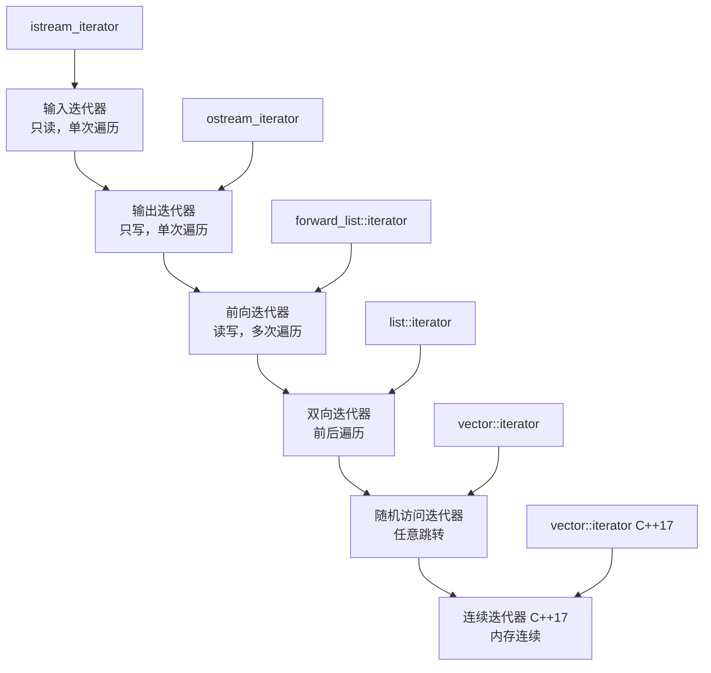
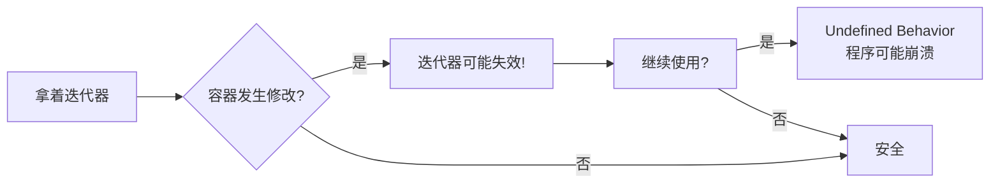
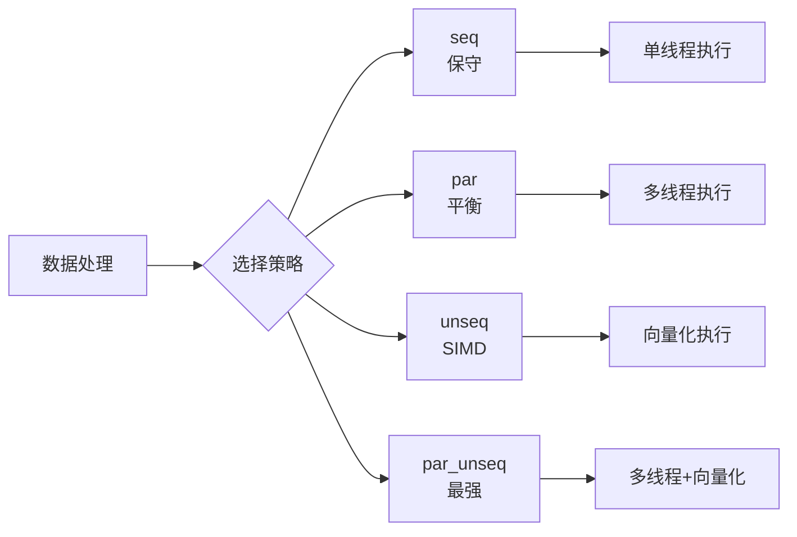

+++
title = "第20章 迭代器与算法"
weight = 200
date = "2026-03-29T21:03:00+08:00"
type = "docs"
description = ""
isCJKLanguage = true
draft = false
+++
# 第20章 迭代器与算法

想象一下，你有一列火车，每节车厢里装着数据。迭代器就是那个勇敢的列车员，能够在车厢之间穿梭、读取货物、甚至还能往车厢里塞点新东西。而算法呢？就是那个掌控全局的调度中心，告诉你该在哪节车厢找宝藏、该怎么重新排列车厢、或者哪些车厢该淘汰出局。

本章我们将深入探索C++标准库中最强大的工具之一——迭代器与算法。准备好了吗？火车要开动啦！🚂

## 20.1 迭代器类别与特性

迭代器是C++标准模板库（STL）的核心概念，它提供了一种统一的方式来访问容器中的元素。你可以把它想象成遥控器上的方向键——不管电视是什么品牌，方向键的操作方式都是一样的。

C++定义了五种迭代器类别，从"只能看"到"随便用"，层次分明：

```cpp
#include <iostream>
#include <iterator>

int main() {
    // 输入迭代器：只能从容器读取，单次遍历
    // 支持：++(前/后), *, ->
    // 用于：istream_iterator
    
    std::istream_iterator<int> it(std::cin);
    std::istream_iterator<int> end;
    
    // 从输入流读取前3个整数
    int count = 0;
    while (it != end && count < 3) {
        std::cout << "Read: " << *it << std::endl;
        ++it;
        ++count;
    }
    
    return 0;
}
```

> **小明的比喻**：输入迭代器就像地铁单程票——你只能往前走，不能回头，而且只能读取数据（刷卡进站），不能写入（不能自己开地铁门）。

### 输出迭代器

输出迭代器和输入迭代器恰好相反——它只能写，不能读。就像快递员往快递柜里投放包裹，他只知道往里塞东西，但不会读取柜子里的内容。

```cpp
#include <iostream>
#include <iterator>
#include <vector>

int main() {
    // 输出迭代器：只能向容器写入，单次遍历
    // 支持：++(前/后), *, =
    // 用于：ostream_iterator, back_inserter
    
    std::ostream_iterator<int> out(std::cout, " ");
    
    std::vector<int> v = {1, 2, 3, 4, 5};
    
    // 复制到输出流
    std::copy(v.begin(), v.end(), out);  // 输出: 1 2 3 4 5
    
    return 0;
}
```

> **敲黑板**：输出迭代器最常见的应用就是`std::ostream_iterator`（往流里写数据）和`std::back_inserter`（往容器尾部插入数据）。记住，它只负责"输出"，也就是"写"这件事！

### 前向迭代器

前向迭代器比输入/输出迭代器更进一步——它既能读又能写，而且可以多次遍历（从begin到end走完一遍后，还能从头再来）。想象成一个可以在走廊里来回走动的服务员，既能端菜出去，也能收碗回来，而且走多少遍都行。

```cpp
#include <iostream>
#include <forward_list>

int main() {
    // 前向迭代器：可读写，可多次遍历
    // 支持：++, *, ->
    // 比输入/输出迭代器更强大
    
    std::forward_list<int> fl = {1, 2, 3, 4, 5};
    
    auto it = fl.begin();  // forward_list提供前向迭代器
    
    // 多次遍历
    std::cout << "First pass: ";
    for (auto i = fl.begin(); i != fl.end(); ++i) {
        std::cout << *i << " ";  // 输出: 1 2 3 4 5
    }
    std::cout << std::endl;
    
    // 可以重新从begin开始
    std::cout << "Second pass: ";
    for (auto i = fl.begin(); i != fl.end(); ++i) {
        std::cout << *i << " ";  // 输出: 1 2 3 4 5
    }
    std::cout << std::endl;
    
    return 0;
}
```

> **为什么用`std::forward_list`？** 这是一个专门提供前向迭代器的容器，就像有些人天生就只能往前走——`forward_list`是单向链表，只支持前向迭代，不支持反向遍历。它比`std::list`更省内存，因为每个节点只需要存储一个指针而不是两个。

### 双向迭代器

双向迭代器是前向迭代器的升级版——它长了两条腿，可以前后自由蹦跶。像企鹅一样，向前走没问题，向后转也没难度。

```cpp
#include <iostream>
#include <list>

int main() {
    // 双向迭代器：可前向/后向遍历
    // 支持：++, --, *, ->
    // 用于：list, set, map等关联容器
    
    std::list<int> lst = {1, 2, 3, 4, 5};
    
    auto it = lst.end();
    --it;  // 指向最后一个元素
    
    std::cout << "Backward: ";
    while (it != lst.begin()) {
        std::cout << *it << " ";  // 输出: 5 4 3 2
        --it;
    }
    std::cout << *it << std::endl;  // 输出: 1
    
    return 0;
}
```

> **企鹅走路法则**：双向迭代器支持`++`和`--`两种操作。就像企鹅在冰面上滑行，向前扑腾一下，再往后蹭一下，全凭心情。`list`、`set`、`map`等容器都提供双向迭代器。

### 随机访问迭代器

随机访问迭代器是迭代器家族中的"全能选手"！它不仅能前后移动，还能想跳哪儿跳哪儿——加减整数、比较大小、直接用下标访问，样样精通。这就像是拥有了瞬间移动的能力，想去哪节车厢眨眼就到。

```cpp
#include <iostream>
#include <vector>

int main() {
    // 随机访问迭代器：支持加减整数、比较、下标
    // 支持：++, --, +, -, [], <, >, <=, >=, -
    // 用于：vector, deque, array, string
    
    std::vector<int> v = {10, 20, 30, 40, 50};
    
    auto it = v.begin();
    
    // 指针算术
    std::cout << "*(it + 2) = " << *(it + 2) << std::endl;  // 输出: 30
    std::cout << "it[3] = " << it[3] << std::endl;  // 输出: 40
    
    // 迭代器距离
    auto it1 = v.begin() + 1;
    auto it2 = v.begin() + 4;
    std::cout << "it2 - it1 = " << (it2 - it1) << std::endl;  // 输出: 3
    
    // 比较
    std::cout << "it1 < it2: " << (it1 < it2) << std::endl;  // 输出: 1
    
    return 0;
}
```

> **超能力展示**：随机访问迭代器是C++中最强大的迭代器类型。你可以用`it + n`或`it - n`直接跳到指定位置，可以用`it[n]`像数组一样访问，可以用`it1 - it2`计算距离，还可以比较谁更靠前谁更靠后。`vector`、`deque`、`array`、`string`的迭代器都是随机访问迭代器。

### 连续迭代器（C++17）

连续迭代器是C++17引入的新概念，它是随机访问迭代器的plus版。如果说随机访问迭代器是能瞬间移动，那连续迭代器就是知道目的地之间有多远——物理意义上的！连续迭代器保证元素的内存地址是连续的，就像一排紧紧挨着的小板凳。

```cpp
#include <iostream>
#include <vector>
#include <iterator>

int main() {
    // C++17: 连续迭代器 (Contiguous Iterator)
    // 概念：连续内存，p和p+1的地址相差1个元素大小
    // vector、array、string的迭代器是连续的
    
    std::vector<int> v = {1, 2, 3, 4, 5};
    
    // C++17: contiguous_iterator概念
    static_assert(std::contiguous_iterator<decltype(v.begin())>);
    
    auto it = v.begin();
    auto it2 = it + 2;
    
    // 连续迭代器保证：
    // &*(it + n) == &*it + n
    std::cout << "&*it = " << &*it << ", &*(it+2) = " << &*(it+2) << std::endl;
    
    return 0;
}
```

> **连续内存的好处**：连续迭代器的关键保证是`&*(it + n) == &*it + n`。这意味着如果你知道第5个元素的地址，不需要一个个遍历，直接计算就能找到第100个元素的位置。这对于缓存友好和SIMD（单指令多数据）优化非常重要！

### 迭代器工具函数

除了直接操作迭代器，还有一些好用的辅助函数，让你的迭代器操作如虎添翼：

```cpp
#include <iostream>
#include <vector>
#include <list>
#include <iterator>

int main() {
    std::vector<int> v = {10, 20, 30, 40, 50};
    
    // std::advance(it, n): 让迭代器前进/后退n步（O(n)，不是O(1)！）
    auto it = v.begin();
    std::advance(it, 3);  // it 现在指向 40
    std::cout << "After advance(3): " << *it << std::endl;  // 输出: 40
    
    // std::next(it, n): 返回前进n步后的新迭代器（原始迭代器不变！）
    it = v.begin();
    auto it2 = std::next(it, 3);  // it2 指向 40，it 仍然是 begin()
    std::cout << "*next(it,3) = " << *it2 << ", *it = " << *it << std::endl;
    
    // std::prev(it, n): 返回后退n步后的新迭代器
    auto it3 = std::prev(v.end(), 2);  // 指向倒数第二个 = 40
    std::cout << "*prev(end,2) = " << *it3 << std::endl;
    
    // std::distance(first, last): 计算两个迭代器之间的距离
    std::cout << "distance(begin, end) = " << std::distance(v.begin(), v.end()) << std::endl;  // 输出: 5
    
    // 注意：distance对于非随机访问迭代器是O(n)！
    std::list<int> lst = {1, 2, 3, 4, 5};
    std::cout << "distance in list = " << std::distance(lst.begin(), lst.end()) << std::endl;
    
    return 0;
}
```

> **`std::advance` vs `std::next`**：
> - `std::advance(it, n)`：**原地**推进迭代器，无返回值
> - `std::next(it, n)`：**返回新的**迭代器，原始迭代器不变（`const`安全）
> - 简单记法：想修改原迭代器用`advance`，想保留原迭代器用`next`

> **`std::distance`的性能坑**：对于前向/双向迭代器（`list`、`forward_list`等），`std::distance`是O(n)的！如果每次循环都要算距离，性能可能很惨。随机访问迭代器的距离运算是O(1)的——这又体现了随机访问的"超能力"！



## 20.2 迭代器适配器

迭代器适配器是"改装厂"——把现有的迭代器改装成不同用途的家伙。标准库提供了几种神奇的改装套件，让你的迭代器秒变各种形态。

```cpp
#include <iostream>
#include <vector>
#include <list>
#include <iterator>
#include <algorithm>

int main() {
    // 反向迭代器适配器
    std::vector<int> v = {1, 2, 3, 4, 5};
    
    std::cout << "Reverse: ";
    for (auto rit = v.rbegin(); rit != v.rend(); ++rit) {
        std::cout << *rit << " ";  // 输出: 5 4 3 2 1
    }
    std::cout << std::endl;
    
    // 插入迭代器
    std::vector<int> v2 = {1, 2, 3};
    // back_inserter返回一个back_insert_iterator，直接丢进算法里用
    std::copy(v.begin(), v.end(), std::back_inserter(v2));
    std::cout << "After back_inserter: ";
    for (int x : v2) std::cout << x << " ";  // 输出: 1 2 3 1 2 3 4 5
    std::cout << std::endl;
    
    // 流迭代器
    std::list<int> lst = {1, 2, 3};
    std::ostream_iterator<int> out(std::cout, ", ");
    std::copy(lst.begin(), lst.end(), out);  // 输出: 1, 2, 3,
    
    return 0;
}
```

> **三大改装神器**：
> - **反向迭代器（`rbegin/rend`）**：把顺序倒过来，就像照镜子。
> - **插入迭代器（`back_inserter/front_inserter/inserter`）**：把"复制"变成"插入"，源数据不会被覆盖。
> - **流迭代器（`ostream_iterator/istream_iterator`）**：让算法直接和流打交道，读写文件就像读写内存一样简单。

## 20.3 迭代器失效

这是C++中最容易踩坑的地方之一！迭代器失效就像是你拿着电影票去找座位，结果发现座位被拆了——你手里的票（迭代器）指向了一个不存在的地方。



### 容器操作后的迭代器失效

不同的容器有不同的"拆座位"规则：

```cpp
#include <iostream>
#include <vector>

int main() {
    // 迭代器失效场景：
    
    // 1. vector/deque: 插入/删除可能导致迭代器失效
    std::vector<int> v = {1, 2, 3, 4, 5};
    auto it = v.begin() + 2;  // 指向3
    
    // v.insert(v.begin(), 0);  // 插入可能使it失效
    // v.erase(it);  // 删除使it失效
    
    // 2. list/set/map: 删除操作会使被删元素的迭代器失效
    // 其他迭代器不受影响
    
    // 3. unordered_*: 重新哈希后所有迭代器失效
    
    std::cout << "Iterator invalidation scenarios demonstrated" << std::endl;
    
    // 安全做法：erase返回新的有效迭代器
    v = {1, 2, 3, 4, 5};
    for (auto it2 = v.begin(); it2 != v.end(); ) {
        if (*it2 % 2 == 0) {
            it2 = v.erase(it2);  // erase返回下一个有效迭代器
        } else {
            ++it2;
        }
    }
    
    std::cout << "After removing evens: ";
    for (int x : v) std::cout << x << " ";  // 输出: 1 3 5
    std::cout << std::endl;
    
    return 0;
}
```

> **安全编程铁律**：删除元素时，一定要用`erase`返回的迭代器继续循环！这就像拆楼的时候工人会告诉你"这堵墙拆完后，下一面墙的入口在哪"——有了这个信息，你才能安全地继续拆下一堵墙。

### 失效场景总结

```cpp
#include <iostream>
#include <vector>
#include <list>

/*
 * 迭代器失效总结：
 *
 * vector:
 * - 插入：所有迭代器可能失效（重新分配）
 * - 插入（不重新分配）：插入点之后的迭代器失效
 * - 删除：删除点之后的迭代器失效
 *
 * deque:
 * - 插入：所有迭代器失效（除front/back插入）
 * - 删除：只有被删元素的迭代器失效
 *
 * list/set/map:
 * - 插入：不影响其他迭代器
 * - 删除：只有被删元素的迭代器失效
 *
 * unordered_* (unordered_set/map/multiset/multimap):
 * - 插入：可能rehash，所有迭代器失效
 * - 删除：只有被删元素失效
 */

int main() {
    std::cout << "Iterator invalidation rules:" << std::endl;
    std::cout << "vector: rehash/all after insert" << std::endl;
    std::cout << "deque: all iterators after insert (except ends)" << std::endl;
    std::cout << "list/set/map: only erased iterator" << std::endl;
    std::cout << "unordered_*: all after rehash" << std::endl;
    
    return 0;
}
```

> **记忆口诀**：
> - `vector`像搬家，插入可能全失效
> - `deque`两头安全，中间一动全遭殃
> - `list/map`最淡定，只管自己不管旁
> - `unordered`爱扩容，一扩容全完蛋

## 20.4 非修改式算法

非修改式算法是"观察员"——它们只看不动，最多统计一下数据、找找东西，但不会改变容器的内容。就像保安在监控室里看监控，只能看、记录、报警，但不能动现场的东西。

```cpp
#include <iostream>
#include <vector>
#include <algorithm>
#include <numeric>

int main() {
    std::vector<int> v = {1, 2, 3, 4, 5, 3, 6, 3};
    
    // find: 查找第一个匹配元素
    auto it = std::find(v.begin(), v.end(), 3);
    if (it != v.end()) {
        std::cout << "Found 3 at position " << (it - v.begin()) << std::endl;
    }
    
    // count: 计算匹配元素个数
    auto cnt = std::count(v.begin(), v.end(), 3);
    std::cout << "Count of 3: " << cnt << std::endl;  // 输出: 3
    
    // count_if: 条件计数
    cnt = std::count_if(v.begin(), v.end(), [](int x) { return x > 3; });
    std::cout << "Count of elements > 3: " << cnt << std::endl;  // 输出: 3
    
    // all_of/any_of/none_of
    std::cout << "All > 0: " << std::all_of(v.begin(), v.end(), [](int x) { return x > 0; }) << std::endl;
    std::cout << "Any > 5: " << std::any_of(v.begin(), v.end(), [](int x) { return x > 5; }) << std::endl;
    std::cout << "None < 0: " << std::none_of(v.begin(), v.end(), [](int x) { return x < 0; }) << std::endl;
    
    // for_each: 对每个元素执行操作
    std::cout << "for_each: ";
    std::for_each(v.begin(), v.end(), [](int x) { std::cout << x << " "; });
    std::cout << std::endl;
    
    // mismatch: 找两个序列第一个不同的位置
    std::vector<int> v2 = {1, 2, 99, 4, 5};
    auto mm = std::mismatch(v.begin(), v.end(), v2.begin());
    if (mm.first != v.end()) {
        std::cout << "First mismatch: " << *mm.first << " vs " << *mm.second;
        std::cout << " at position " << (mm.first - v.begin()) << std::endl;
        // 输出: First mismatch: 3 vs 99 at position 2
    }
    
    // equal: 比较两个序列是否完全相同
    std::vector<int> v3 = {1, 2, 3, 4, 5, 3, 6, 3};
    std::cout << "v == v3: " << std::equal(v.begin(), v.end(), v3.begin()) << std::endl;  // 输出: 1
    
    return 0;
}
```

> **非修改式算法家族**：
> - `find/find_if/find_if_not`：找东西，找到第一个就停
> - `count/count_if`：数数，看看有多少个满足条件
> - `all_of/any_of/none_of`：判断是否全都/存在/没有满足条件的
> - `for_each`：对每个人都执行同样的操作
> - `mismatch`：找两个序列第一个不同的地方
> - `equal`：比较两个序列是否完全相同

## 20.5 修改式算法

修改式算法是"装修队"——它们真的会动手改变容器的内容。不过要注意，有些算法并不是真的删除元素，而是"假装删除"——把要留的元素移到前面，然后返回一个"新终点"。

> **Erase-Remove 惯用法（重要！）**：
> C++ STL中删除元素的标准姿势是"两段式"：
> 1. 用`std::remove`（或`remove_if`）把不需要的元素"移走"，返回新逻辑终点
> 2. 用`erase`擦除`[新终点, 旧终点)`这段"垃圾"
> 这就像整理衣柜：先把要留的衣服叠好放到前面，再把后面乱糟糟的旧衣服扔掉！

```cpp
#include <iostream>
#include <vector>
#include <algorithm>

int main() {
    std::vector<int> v = {1, 2, 3, 4, 5};
    
    // transform: 转换元素
    std::vector<int> v2(v.size());
    std::transform(v.begin(), v.end(), v2.begin(), [](int x) { return x * 2; });
    
    std::cout << "Doubled: ";
    for (int x : v2) std::cout << x << " ";  // 输出: 2 4 6 8 10
    std::cout << std::endl;
    
    // copy: 复制元素
    std::vector<int> v3;
    std::copy(v.begin(), v.end(), std::back_inserter(v3));
    
    // remove: 移除元素（实际是移动）
    std::vector<int> v4 = {1, 2, 3, 2, 4, 2, 5};
    auto newEnd = std::remove(v4.begin(), v4.end(), 2);
    v4.erase(newEnd, v4.end());
    std::cout << "After remove(2): ";
    for (int x : v4) std::cout << x << " ";  // 输出: 1 3 4 5
    std::cout << std::endl;
    
    // replace: 替换元素
    std::vector<int> v5 = {1, 2, 3, 2, 4};
    std::replace(v5.begin(), v5.end(), 2, 99);
    std::cout << "After replace(2->99): ";
    for (int x : v5) std::cout << x << " ";  // 输出: 1 99 3 99 4
    std::cout << std::endl;
    
    // unique: 移除相邻重复元素
    std::vector<int> v6 = {1, 1, 2, 2, 2, 3, 3, 1, 1};
    auto last = std::unique(v6.begin(), v6.end());
    v6.erase(last, v6.end());
    std::cout << "After unique: ";
    for (int x : v6) std::cout << x << " ";  // 输出: 1 2 3 1
    std::cout << std::endl;
    
    // fill: 用指定值填满范围
    std::vector<int> v7(5);
    std::fill(v7.begin(), v7.end(), 42);
    std::cout << "After fill(42): ";
    for (int x : v7) std::cout << x << " ";  // 输出: 42 42 42 42 42
    std::cout << std::endl;
    
    return 0;
}
```

> **重点提醒**：`std::remove`并不会真的删除元素！它只是把所有不等于value的元素移到前面，返回一个指向"新逻辑终点"的迭代器。你需要手动调用`erase`来真正删除尾部的垃圾元素。这就像整理房间时，把要留的东西往前堆，但垃圾还在原地——最后还得扔进垃圾桶。

## 20.6 排序与搜索算法

排序与搜索算法是"图书馆管理员"——帮你把书架整理得井井有条，还能快速找到想要的书。没有它们，你可能得在100万本书里一页页翻找某本书；有它们，分分钟定位！

```cpp
#include <iostream>
#include <vector>
#include <algorithm>
#include <random>

int main() {
    std::vector<int> v = {5, 2, 8, 1, 9, 3, 7, 4, 6};
    
    // sort: O(n log n)排序
    std::sort(v.begin(), v.end());
    std::cout << "Sorted: ";
    for (int x : v) std::cout << x << " ";  // 输出: 1 2 3 4 5 6 7 8 9
    std::cout << std::endl;
    
    // 降序排序
    v = {5, 2, 8, 1, 9};
    std::sort(v.begin(), v.end(), std::greater<int>());
    std::cout << "Sorted desc: ";
    for (int x : v) std::cout << x << " ";  // 输出: 9 8 5 2 1
    std::cout << std::endl;
    
    // stable_sort: 稳定排序，保持相等元素顺序
    // partial_sort: 只排好前K个，其余不保证顺序（适合Top-K问题）
    std::vector<int> vtop = {9, 7, 5, 3, 1, 6, 8, 2, 4};
    std::partial_sort(vtop.begin(), vtop.begin() + 3, vtop.end(), std::greater<int>());
    std::cout << "Top 3 (desc): ";
    for (int i = 0; i < 3; ++i) std::cout << vtop[i] << " ";  // 输出: 9 8 7
    std::cout << std::endl;
    
    // nth_element: 找到第n小的元素，并把比它小的放前面，大的放后面
    vtop = {9, 7, 5, 3, 1, 6, 8, 2, 4};
    auto nth = vtop.begin() + 4;  // 找第5小的（下标4）
    std::nth_element(vtop.begin(), nth, vtop.end());
    std::cout << "5th smallest (0-indexed): " << *nth << std::endl;  // 输出: 5
    
    // binary_search: 二分搜索（必须在已排序容器）
    v = {1, 2, 3, 4, 5, 6, 7, 8, 9};
    std::cout << "Binary search 5: " << std::binary_search(v.begin(), v.end(), 5) << std::endl;  // 输出: 1
    
    // lower_bound/upper_bound
    auto lb = std::lower_bound(v.begin(), v.end(), 5);  // >= 5的第一个
    auto ub = std::upper_bound(v.begin(), v.end(), 5);  // > 5的第一个
    std::cout << "Lower bound at: " << (lb - v.begin()) << std::endl;
    std::cout << "Upper bound at: " << (ub - v.begin()) << std::endl;
    
    // merge: 合并两个已排序序列
    std::vector<int> v1 = {1, 3, 5};
    std::vector<int> v2 = {2, 4, 6};
    std::vector<int> merged(v1.size() + v2.size());
    std::merge(v1.begin(), v1.end(), v2.begin(), v2.end(), merged.begin());
    std::cout << "Merged: ";
    for (int x : merged) std::cout << x << " ";  // 输出: 1 2 3 4 5 6
    std::cout << std::endl;
    
    return 0;
}
```

> **排序算法选择指南**：
> - `std::sort`：通用排序，内部实现会智能选择快排/堆排/插入排，一般用这个就够了
> - `std::stable_sort`：稳定排序，相等元素的相对顺序不会改变
> - `std::partial_sort`：如果你只关心前K个最小/最大元素，用这个更高效
> - `std::nth_element`：如果你只关心第N小的元素，用这个最快（平均线性时间）

> **二分搜索三兄弟**：
> - `binary_search`：只告诉你"有没有"
> - `lower_bound`：找到第一个"大于等于"目标值的位置
> - `upper_bound`：找到第一个"大于"目标值的位置

## 20.7 数值算法

数值算法是"数学课代表"——帮你做各种数学运算，从简单的求和到复杂的内积运算，都不在话下。这些算法都在`<numeric>`头文件里。

```cpp
#include <iostream>
#include <vector>
#include <numeric>
#include <cmath>

int main() {
    std::vector<int> v = {1, 2, 3, 4, 5};
    
    // accumulate: 求和
    int sum = std::accumulate(v.begin(), v.end(), 0);
    std::cout << "Sum: " << sum << std::endl;  // 输出: 15
    
    // accumulate with custom operation
    int product = std::accumulate(v.begin(), v.end(), 1, std::multiplies<int>());
    std::cout << "Product: " << product << std::endl;  // 输出: 120
    
    // inner_product: 内积
    std::vector<int> a = {1, 2, 3};
    std::vector<int> b = {4, 5, 6};
    int inner = std::inner_product(a.begin(), a.end(), b.begin(), 0);
    std::cout << "Inner product: " << inner << std::endl;  // 输出: 1*4 + 2*5 + 3*6 = 32
    
    // iota: 填充递增序列
    std::vector<int> seq(5);
    std::iota(seq.begin(), seq.end(), 10);  // 10, 11, 12, 13, 14
    std::cout << "iota: ";
    for (int x : seq) std::cout << x << " ";  // 输出: 10 11 12 13 14
    std::cout << std::endl;
    
    // adjacent_difference
    std::vector<int> diff(5);
    std::adjacent_difference(seq.begin(), seq.end(), diff.begin());
    std::cout << "adjacent_difference: ";
    for (int x : diff) std::cout << x << " ";  // 输出: 10 1 1 1 1
    std::cout << std::endl;
    
    // partial_sum
    std::vector<int> prefix(5);
    std::partial_sum(seq.begin(), seq.end(), prefix.begin());
    std::cout << "partial_sum: ";
    for (int x : prefix) std::cout << x << " ";  // 输出: 10 21 33 46 60
    std::cout << std::endl;
    
    return 0;
}
```

> **数学全家福**：
> - `accumulate`：求和（默认）或者自定义运算（用它可以实现`product`求积、`concat`字符串拼接等）
> - `inner_product`：两个序列对应元素相乘后求和，就是传说中的点积
> - `iota`：希腊字母iota，专门生成递增序列的（名称来源于数学里的"..."符号）
> - `adjacent_difference`：相邻元素的差值
> - `partial_sum`：前缀和（每个位置是之前所有元素的累计和）

## 20.8 并行算法（C++17）

C++17带来了重磅功能——并行算法！想象一下，原来需要一个厨师慢慢炒10000道菜，现在有8个厨师同时开工，速度直接起飞！

```cpp
#include <iostream>
#include <vector>
#include <algorithm>
#include <execution>

int main() {
    std::vector<int> v(1000000);
    std::iota(v.begin(), v.end(), 1);
    
    // C++17并行策略
    // std::execution::seq - 顺序执行
    // std::execution::par - 并行执行
    // std::execution::par_unseq - 并行+向量化
    // std::execution::unseq - 向量化（不并行）
    
    // sort with parallel execution
    std::sort(std::execution::par, v.begin(), v.end());
    
    // transform with parallel execution
    std::vector<int> result(v.size());
    std::transform(std::execution::par, v.begin(), v.end(), result.begin(),
                   [](int x) { return x * 2; });
    
    std::cout << "First 10 doubled values: ";
    for (int i = 0; i < 10; ++i) {
        std::cout << result[i] << " ";  // 输出: 2000000 1999998 ...
    }
    std::cout << std::endl;
    
    return 0;
}
```

> **并行策略四兄弟**：
> - `seq`（Sequential）：老老实实排队，老式算法行为
> - `par`（Parallel）：多线程并行，线程安全
> - `par_unseq`（Parallel + Unsequenced）：并行+向量化（SIMD），最高效但限制最多
> - `unseq`（Unsequenced）：只向量化不并行



> **使用并行算法的注意事项**：
> 1. 不是所有算法都支持并行，常见的支持并行的有`sort`、`transform`、`reduce`、`find`等
> 2. 你的lambda必须是"纯函数"——不共享状态、不修改外部变量
> 3. 数据量足够大时并行才有意义，处理100个元素开8个线程可能更慢
> 4. 需要`#include <execution>`

## 20.9 范围库（C++20）

C++20引入了ranges（范围）库，这是自STL诞生以来最大的变革！如果说以前的算法是"用勺子喝汤"，那ranges就是"用吸管喝"——更直接、更优雅、更组合式。

### std::ranges

`std::ranges`让算法可以组合使用，就像搭积木一样！管道操作符`|`让代码读起来像自然语言。

```cpp
#include <iostream>
#include <vector>
#include <algorithm>
#include <ranges>

int main() {
    // C++20 ranges: 让算法和迭代器更组合式
    
    std::vector<int> v = {1, 2, 3, 4, 5, 6, 7, 8, 9, 10};
    
    // 组合视图操作
    auto result = v 
        | std::views::filter([](int x) { return x % 2 == 0; })  // 过滤偶数
        | std::views::transform([](int x) { return x * x; })       // 平方
        | std::views::take(3);                                    // 取前3个
    
    std::cout << "Range pipeline: ";
    for (int x : result) {
        std::cout << x << " ";  // 输出: 4 16 36
    }
    std::cout << std::endl;
    
    // 惰性求值：只在迭代时计算
    // filter_view和transform_view不存储结果，节省内存
    
    return 0;
}
```

> **ranges的核心优势**：
> 1. **惰性求值**：只在真正需要的时候才计算，不浪费内存
> 2. **组合式**：用`|`管道操作符串联多个操作，优雅得像写诗
> 3. **更安全**：`ranges::sort`会检查迭代器范围是否有效
> 4. **可组合性强**：视图可以嵌套、可以重复使用

> **想象一下没有ranges的世界**：如果你想过滤偶数再平方，在C++17里你得写三层嵌套或者用`std::copy_if`配合`std::transform`，代码绕来绕去。有了ranges，一行搞定！

### 范围工厂

范围工厂是"发电机"——它们不是从现有容器生成视图，而是凭空创造出序列。

```cpp
#include <iostream>
#include <ranges>

int main() {
    // 范围工厂：生成序列
    
    // iota_view: 无限整数序列
    auto ints = std::views::iota(1) | std::views::take(10);
    std::cout << "iota(1..10): ";
    for (int x : ints) std::cout << x << " ";  // 输出: 1 2 3 4 5 6 7 8 9 10
    std::cout << std::endl;
    
    // empty_view: 空范围
    auto empty = std::views::empty<int>;
    
    // single_view: 单元素范围
    auto single = std::views::single(42);
    
    return 0;
}
```

> **三大工厂**：
> - `std::views::iota(start)`：生成从start开始的无限递增序列，配合`take`限制数量
> - `std::views::empty<T>`：生成一个空的只读范围
> - `std::views::single(value)`：生成只包含一个元素的范围

### 范围适配器

范围适配器是"变形金刚"——把一个范围变成另一种形式的范围。

```cpp
#include <iostream>
#include <vector>
#include <ranges>

int main() {
    std::vector<int> v = {1, 2, 3, 4, 5, 6, 7, 8, 9, 10};
    
    // 常用范围适配器
    // filter: 过滤
    auto evens = v | std::views::filter([](int x) { return x % 2 == 0; });
    
    // transform: 转换
    auto doubled = v | std::views::transform([](int x) { return x * 2; });
    
    // take/drop: 取前几个/跳过前几个
    auto first5 = v | std::views::take(5);
    auto skip5 = v | std::views::drop(5);
    
    // reverse: 反转
    auto reversed = v | std::views::reverse;
    
    // unique: 去重（只处理相邻重复，所以 {1,1,2,2,3,3} → {1,2,3}）
    // 注意：unique_view只能遍历一次！第一次遍历完就空了
    std::vector<int> dup = {1, 1, 2, 2, 3, 3};
    auto uniq = dup | std::views::unique;
    
    std::cout << "First 5: ";
    for (int x : first5) std::cout << x << " ";  // 输出: 1 2 3 4 5
    std::cout << std::endl;
    
    std::cout << "Unique from dup: ";
    for (int x : uniq) std::cout << x << " ";  // 输出: 1 2 3
    std::cout << std::endl;
    
    return 0;
}
```

> **适配器全家福**：
> - `filter(pred)`：保留满足条件的元素
> - `transform(func)`：对每个元素应用函数
> - `take(n)`：取前n个元素
> - `drop(n)`：跳过前n个元素
> - `reverse`：反转顺序
> - `unique`：移除相邻重复元素
> - `common`：把视图转成普通范围

## 20.10 范围适配器新增（C++23）

C++23继续为ranges库添砖加瓦，新增了几个超实用的适配器。不过截至目前（2024-2025），主流编译器对部分C++23 views的支持仍不完全。以下是已知支持较好的特性演示和尚未完全支持的功能简介。

```cpp
#include <iostream>
#include <vector>
#include <ranges>

int main() {
    // C++23: as_const_view - 把视图转成const，防止意外修改
    std::vector<int> v = {1, 2, 3, 4, 5};
    auto const_v = v | std::views::as_const;
    // *const_v.begin() = 99;  // 编译错误！无法修改const引用
    std::cout << "as_const view: ";
    for (int x : const_v) std::cout << x << " ";  // 输出: 1 2 3 4 5
    std::cout << std::endl;
    
    // C++23: drop_view 增强 - drop_while 支持
    auto dropped = v | std::views::drop_while([](int x) { return x < 3; });
    std::cout << "drop_while(x < 3): ";
    for (int x : dropped) std::cout << x << " ";  // 输出: 3 4 5
    std::cout << std::endl;
    
    // 以下是尚未完全支持的功能简介（编译器支持进度不同）：
    // std::views::adjacent<N>          - 生成N元组视图，{1,2,3,4} → {(1,2),(2,3),(3,4)}
    // std::views::adjacent_transform<N> - 类似adjacent，但同时做转换
    // std::views::cartesian_product     - 多范围笛卡尔积，{1,2}×{a,b} → {(1,a),(1,b),(2,a),(2,b)}
    // std::views::chunk_by(pred)        - 按谓词分组，相邻满足条件的元素放同一组
    
    std::cout << "C++23 range adapters include:" << std::endl;
    std::cout << "- std::views::as_const (shown above)" << std::endl;
    std::cout << "- std::views::drop_while (shown above)" << std::endl;
    std::cout << "- std::views::adjacent<N> - tuple pairs" << std::endl;
    std::cout << "- std::views::adjacent_transform<N> - transform tuples" << std::endl;
    std::cout << "- std::views::cartesian_product - cross product" << std::endl;
    std::cout << "- std::views::chunk_by - group by predicate" << std::endl;
    
    return 0;
}
```

> **编译器支持现状（2025年初）**：
> - `as_const`：GCC 14+, Clang 17+, MSVC 19.38+ 基本支持
> - `drop_while`：GCC 13+, Clang 16+, MSVC 19.36+ 基本支持
> - `adjacent`/`cartesian_product`等：部分编译器还在实现中
>
> **建议**：使用前先查 [cppreference.com](https://en.cppreference.com) 确认当前编译器版本的支持情况，或者用 `std::views::filter` + `std::views::transform` 组合来代替部分未支持功能。

> **C++23新成员简介**：
> - `adjacent<N>`：把序列变成N元组的序列（1,2,3,4变成(1,2), (2,3), (3,4)）
> - `adjacent_transform<N>`：类似adjacent，但同时做转换
> - `as_const`：把视图转成const引用，防止意外修改
> - `cartesian_product`：生成多个范围的笛卡尔积
> - `chunk_by(pred)`：按谓词分组，相邻满足条件的元素放同一组

## 20.11 生成器std::generator（C++23）

`std::generator`是C++23最令人兴奋的特性之一——它是一种协程，可以优雅地生成惰性序列。就像会变魔术的兔子，从帽子里一只一只地变出兔子，而不是提前准备好一整窝。

```cpp
#include <iostream>
// #include <generator>  // C++23，仅MSVC和部分GCC/Clang实验性支持

// 注意：以下代码需要支持 C++23协程的编译器（如 MSVC 19.38+ 或 GCC 14+ 附赠 -fcoroutines）
// 如果你的编译器还没跟上，先看注释理解思想，代码跑不起来不丢人！

// 一个生成斐波那契数列的generator
// std::generator<int, int> 表示：值类型int，参数类型int（可以省略）
std::generator<int> fibonacci() {
    co_yield 0;  // 吐出第一个值，暂停在这里
    co_yield 1;  // 下次迭代时从这里恢复，再吐一个值
    
    int a = 0, b = 1;
    while (true) {
        co_yield a + b;  // 不断吐出下一个斐波那契数，理论上是无限的！
        int c = a + b;
        a = b;
        b = c;
    }
}

int main() {
    // generator 可以像范围一样遍历
    // 注意：无限序列必须用 take 限制数量，否则会死循环！
    // auto seq = fibonacci() | std::views::take(10);
    // for (int x : seq) std::cout << x << " ";  // 输出: 0 1 1 2 3 5 8 13 21 34
    
    std::cout << "std::generator is a C++23 coroutine-based lazy sequence" << std::endl;
    std::cout << "It uses co_yield to produce values lazily" << std::endl;
    std::cout << "Supported by: MSVC 19.38+, GCC 14+ (with -fcoroutines)" << std::endl;
    
    return 0;
}
```

> **generator是什么？** 想象你有一个魔法口袋，里面有无限多的东西。你每次伸手进去，就变出一个新的（调用`co_yield`）。你不需要提前把所有东西都装进口袋（内存占用低），也不需要临时去计算（惰性计算）。这就是generator的核心思想！

> **与ranges的区别**：ranges是对已有数据的"视图"，而generator可以生成"无限"或"超大"的序列。斐波那契数列有无数个，你没法用一个vector存储，但你可以用一个generator每次"算"下一个。

> **当前支持情况**：截至目前（2025年初），MSVC对`std::generator`的支持较为完善，GCC和Clang仍需带`-fcoroutines`标志的实验性支持。如果想玩C++23的协程，建议使用最新版的MSVC，或者关注 [llvm.org/coroutines](https://llvm.org/coroutines) 了解Clang的最新进展。

## 本章小结

本章我们深入探索了C++迭代器与算法的精彩世界。回顾一下核心要点：

### 迭代器类别（从弱到强）

| 类别 | 能力 | 支持的操作 | 代表容器 |
|------|------|-----------|----------|
| 输入迭代器 | 只读 | ++, *, -> | istream_iterator |
| 输出迭代器 | 只写 | ++, *, = | ostream_iterator |
| 前向迭代器 | 读写，多次遍历 | ++, *, -> | forward_list |
| 双向迭代器 | 前后遍历 | ++, --, *, -> | list, set, map |
| 随机访问迭代器 | 任意跳转 | ++, --, +, -, [], <, > | vector, deque |
| 连续迭代器 | 连续内存 | 上述全部 + 内存连续保证 | vector(C++17) |

### 迭代器适配器

- **反向迭代器** `rbegin/rend`：顺序反转
- **插入迭代器** `back_inserter/front_inserter`：复制变插入
- **流迭代器** `ostream_iterator/istream_iterator`：算法与流的桥梁

### 迭代器失效——最容易踩的坑

- `vector`：插入可能全部失效，删除后部失效
- `deque`：中间插入全部失效，两端安全
- `list/set/map`：只有被删元素的迭代器失效
- `unordered_*`：rehash后全部失效

> **保命法则**：删除元素时，用`erase`返回的迭代器继续循环！

### STL算法分类

| 类别 | 代表算法 | 特点 |
|------|----------|------|
| 非修改式 | find, count, for_each | 只看不改 |
| 修改式 | transform, remove, replace | 真改数据 |
| 排序与搜索 | sort, binary_search, lower_bound | 效率为王 |
| 数值算法 | accumulate, inner_product | 数学运算 |
| 并行算法 | sort(par), transform(par) | 多核加速 |

### C++20 Ranges新革命

- **视图**：惰性求值，节省内存
- **管道操作符** `|`：组合式调用，优雅可读
- **范围工厂**：`iota`, `empty`, `single`
- **范围适配器**：`filter`, `transform`, `take`, `drop`, `reverse`

### C++23展望

- `adjacent<N>`：相邻N元组
- `cartesian_product`：笛卡尔积
- `std::generator`：协程实现的惰性序列

> **终极感悟**：迭代器是C++的灵魂，算法是C++的力量。掌握它们，你就像拿到了编程世界的万能钥匙——不管遇到什么数据结构，都能用统一的方式高效处理。善用STL，少造轮子，让代码既简洁又高性能！🚀
