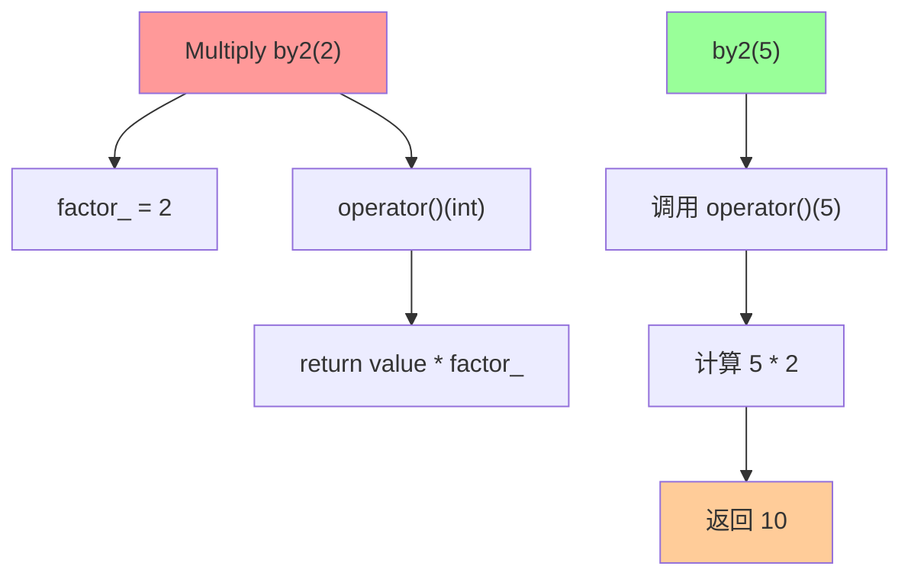
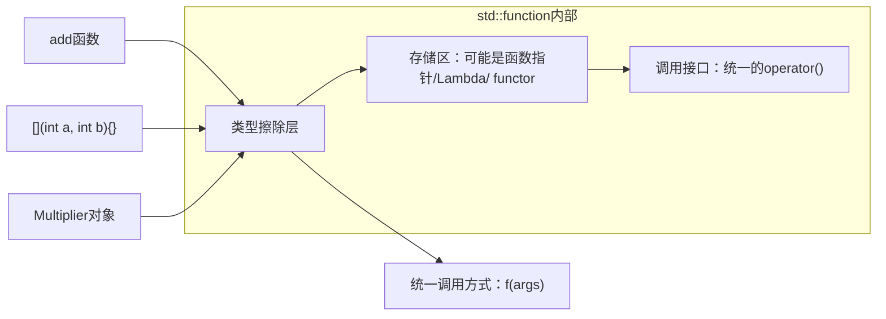
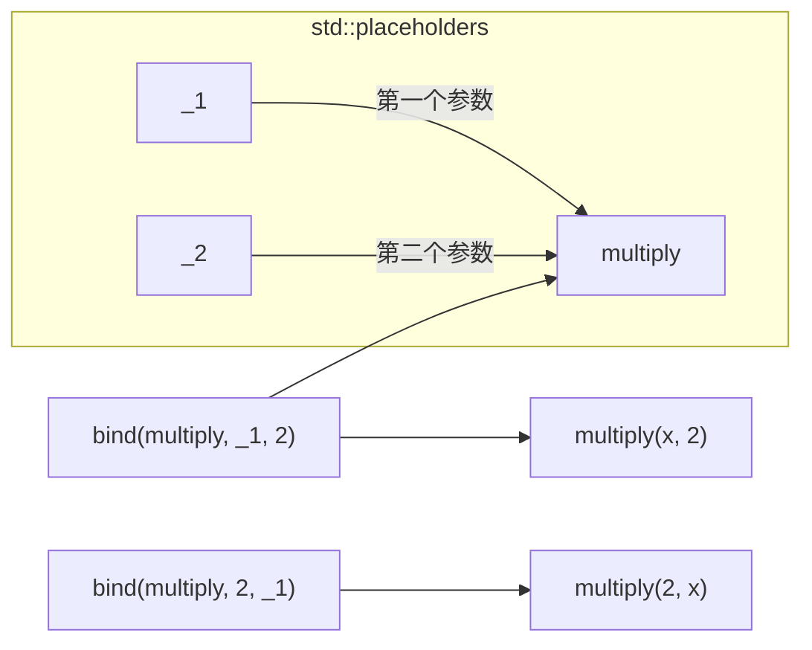
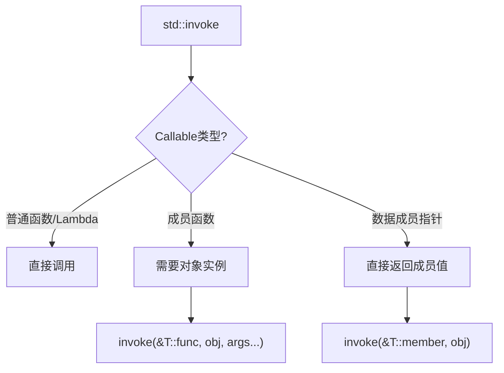

+++
title = "第21章 函数对象与标准函数工具"
weight = 210
date = "2026-03-29T21:03:00+08:00"
type = "docs"
description = ""
isCJKLanguage = true
draft = false
+++
# 第21章 函数对象与标准函数工具

想象一下，你有一个遥控器，不仅能打开电视，还能记住你上次看的是哪个频道，甚至能根据你的心情推荐节目。这就是函数对象的超能力——它不仅仅是"按一下执行"的普通函数，而是一个有记忆、有个性、能干活的智能函数！

本章我们将探索C++中函数对象的奇妙世界，从最基本的Functor到高大上的`std::invoke`，保证让你大呼"原来函数还能这么玩"！

## 21.1 函数对象（Functor）概念

### 什么是函数对象？

**函数对象（Functor）**，听起来像是个高深莫测的术语，其实说白了就是：**一个可以像函数那样被调用的对象**。具体怎么做到的呢？答案就是——重载`operator()`！

普通函数只能"执行一段代码"，但函数对象可以：
- 拥有自己的"记忆"（成员变量）
- 携带"装备"（初始化时的参数）
- 比普通函数更快（可以被内联优化）

这就好比同样是"说话"，普通人说话就是说话，但演员说话是在表演——同一个动作，后者包含了更多的"内涵"和"状态"。

### 初识Functor

```cpp
#include <iostream>

// 函数对象（Functor）：重载了operator()的类
// 可以像函数一样被调用，但可以有状态

class Multiply {
private:
    int factor_;  // 这个"factor_"就是我们的"记忆"——记住要乘以几
    
public:
    // 构造函数，用初始化列表的方式给factor_赋值
    explicit Multiply(int factor) : factor_(factor) {}
    
    // 重载函数调用运算符，这就是Functor的"魔法核心"！
    // 当我们写 by2(5) 时，其实是在调用 operator()(5)
    int operator()(int value) const {
        return value * factor_;
    }
};

int main() {
    // 创建两个函数对象：一个乘以2，一个乘以3
    Multiply by2(2);  // 记忆：我要乘以2
    Multiply by3(3);  // 记忆：我要乘以3
    
    // 像调用函数一样使用——这太神奇了！
    std::cout << "by2(5) = " << by2(5) << std::endl;  // 输出: by2(5) = 10
    std::cout << "by3(5) = " << by3(5) << std::endl;  // 输出: by3(5) = 15
    
    // 函数对象的优势：
    // 1. 可以有状态（factor_）——普通函数可没有"记忆"！
    // 2. 可以有成员函数和成员变量——封装能力MAX
    // 3. 可以内联（比函数指针快）——性能碾压指针！
    
    return 0;
}
```

### Functor vs 普通函数指针

你可能会问：普通函数不也能实现乘法吗？为什么要用Functor？

```cpp
#include <iostream>

// 普通函数版本：固定乘以2，没法改
int multiplyBy2(int value) {
    return value * 2;
}

// 函数指针版本：稍微灵活一点，但...
typedef int (*MultiplyFn)(int, int);
int multiplyGeneric(int a, int b) {
    return a * b;
}

int main() {
    std::cout << "multiplyBy2(5) = " << multiplyBy2(5) << std::endl;  // 输出: 10
    
    // 函数指针的调用方式比较"丑"
    MultiplyFn fn = multiplyGeneric;
    std::cout << "fn(5, 2) = " << fn(5, 2) << std::endl;  // 输出: 10
    
    // 更糟糕的是，函数指针没法携带"状态"
    // 每次调用都是独立的，没有"记忆"
    
    return 0;
}
```

但Functor可以这样玩：

```cpp
#include <iostream>
#include <string>

// 可配置的乘法器——Functor的真正威力！
class ConfigurableMultiplier {
private:
    int factor_;
    std::string name_;  // 还可以加更多"记忆"
    int callCount_ = 0;  // 还能计数调用次数！
    
public:
    ConfigurableMultiplier(int factor, const std::string& name) 
        : factor_(factor), name_(name) {}
    
    int operator()(int value) {
        ++callCount_;  // 记录被调用次数
        return value * factor_;
    }
    
    // 还可以查询状态！
    int getCallCount() const { return callCount_; }
    std::string getName() const { return name_; }
};

int main() {
    ConfigurableMultiplier doubler(2, "doubler");
    ConfigurableMultiplier tripler(3, "tripler");
    
    std::cout << doubler(10) << std::endl;  // 输出: 20
    std::cout << tripler(10) << std::endl;  // 输出: 30
    
    std::cout << "doubler被调用了 " << doubler.getCallCount() << " 次" << std::endl;  // 输出: 1
    std::cout << "它的名字是 " << doubler.getName() << std::endl;  // 输出: doubler
    
    // Functor可以在多次调用间保持状态
    // 普通函数？抱歉，每次调用都是全新的开始
    
    return 0;
}
```

### Functor在STL算法中的妙用

Functor最厉害的应用场景之一就是STL算法。想象你要找出所有大于5的数：

```cpp
#include <iostream>
#include <vector>
#include <algorithm>

// 自定义的"大于比较器"
class GreaterThan {
private:
    int threshold_;
public:
    explicit GreaterThan(int threshold) : threshold_(threshold) {}
    
    // 重载operator()，让它可以"比较"
    bool operator()(int value) const {
        return value > threshold_;
    }
};

int main() {
    std::vector<int> numbers = {1, 6, 3, 8, 2, 9, 4, 7, 5};
    
    // 传统方式：写一个函数
    auto count1 = std::count_if(numbers.begin(), numbers.end(), 
        [](int x) { return x > 5; });  // Lambda版本
    
    // Functor方式：创建一个有状态的对象
    GreaterThan greaterThan5(5);  // 记住：大于5
    auto count2 = std::count_if(numbers.begin(), numbers.end(), greaterThan5);
    
    std::cout << "大于5的数有 " << count1 << " 个" << std::endl;  // 输出: 4
    std::cout << "大于5的数有 " << count2 << " 个" << std::endl;  // 输出: 4
    
    return 0;
}
```

### Lambda表达式：Functor的"快捷方式"

C++11引入了Lambda表达式，让创建Functor变得小菜一碟：

```cpp
#include <iostream>
#include <vector>
#include <algorithm>

int main() {
    std::vector<int> nums = {1, 2, 3, 4, 5};
    
    // 每次见到Lambda都要想："这其实是创建了一个Functor对象"
    
    // 无捕获的Lambda：编译器会生成一个"完美"的Functor
    auto add10 = [](int x) { return x + 10; };
    std::cout << "add10(5) = " << add10(5) << std::endl;  // 输出: 15
    
    // 有捕获的Lambda：捕获外部变量到Functor中
    int bonus = 100;
    auto addBonus = [bonus](int x) { return x + bonus; };
    std::cout << "addBonus(50) = " << addBonus(50) << std::endl;  // 输出: 150
    
    // 捕获引用——小心使用！
    int multiplier = 2;
    auto multiplyByRef = [&multiplier](int x) { return x * multiplier; };
    multiplier = 10;  // 改变了Lambda的行为！
    std::cout << "multiplyByRef(5) = " << multiplyByRef(5) << std::endl;  // 输出: 50
    
    return 0;
}
```

> **冷知识**：Lambda表达式 `[x](){}` 编译后就是一个匿名类（也叫"闭包类"）的实例，这个类重载了`operator()`。所以Lambda本质上就是Functor，只是语法更简洁罢了！

### mermaid图解：Functor的工作原理



## 21.2 标准函数对象

C++标准库为我们准备了一系列开箱即用的函数对象，它们都在`<functional>`头文件中。这些"预制件"让我们不需要重复造轮子，直接拿来主义！

### 算术函数对象

这五个是数学运算的"五虎上将"：

```cpp
#include <iostream>
#include <functional>
#include <vector>
#include <algorithm>

int main() {
    // 标准库提供的函数对象
    std::plus<int> plus;        // 加法：a + b
    std::minus<int> minus;      // 减法：a - b
    std::multiplies<int> multiplies;  // 乘法：a * b
    std::divides<int> divides;  // 除法：a / b（注意除零！）
    std::modulus<int> modulus;  // 取模：a % b
    
    std::cout << "plus(10, 5) = " << plus(10, 5) << std::endl;       // 输出: 15
    std::cout << "minus(10, 5) = " << minus(10, 5) << std::endl;   // 输出: 5
    std::cout << "multiplies(10, 5) = " << multiplies(10, 5) << std::endl;  // 输出: 50
    std::cout << "divides(10, 5) = " << divides(10, 5) << std::endl;  // 输出: 2
    std::cout << "modulus(10, 3) = " << modulus(10, 3) << std::endl;  // 输出: 1
    
    return 0;
}
```

> **趣味比喻**：把这五个函数对象想象成计算器上的五个按键：`+`、`-`、`×`、`÷`、`%`。只不过这些按键是"可编程"的，可以传给算法使用！

### 比较函数对象

比较运算符的"六脉神剑"：

```cpp
#include <iostream>
#include <functional>
#include <vector>
#include <algorithm>

int main() {
    // 比较函数对象
    std::greater<int> greater;           // a > b
    std::greater_equal<int> greater_eq;  // a >= b
    std::less<int> less;                 // a < b
    std::less_equal<int> less_eq;        // a <= b
    std::equal_to<int> equal_to;         // a == b
    std::not_equal_to<int> not_equal;    // a != b
    
    std::cout << "greater(10, 5) = " << greater(10, 5) << std::endl;       // 输出: 1 (true)
    std::cout << "greater_eq(5, 5) = " << greater_eq(5, 5) << std::endl;  // 输出: 1 (true)
    std::cout << "less(10, 5) = " << less(10, 5) << std::endl;           // 输出: 0 (false)
    std::cout << "less_eq(5, 5) = " << less_eq(5, 5) << std::endl;        // 输出: 1 (true)
    std::cout << "equal_to(10, 10) = " << equal_to(10, 10) << std::endl; // 输出: 1 (true)
    std::cout << "not_equal(10, 5) = " << not_equal(10, 5) << std::endl; // 输出: 1 (true)
    
    // STL算法中的经典用法：排序
    std::vector<int> nums = {3, 1, 4, 1, 5, 9, 2, 6};
    
    // 使用std::greater进行降序排序
    std::sort(nums.begin(), nums.end(), std::greater<int>());
    
    std::cout << "降序排序: ";
    for (int n : nums) std::cout << n << " ";  // 输出: 9 6 5 4 3 2 1 1
    std::cout << std::endl;
    
    return 0;
}
```

> **小技巧**：在STL算法中，比较函数对象用得最多的就是`std::greater<T>()`和`std::less<T>()`。特别是`std::sort`默认是升序，如果想降序，只需要传入`std::greater<int>()`即可！

### 逻辑函数对象

布尔运算的"三剑客"：

```cpp
#include <iostream>
#include <functional>

int main() {
    // 逻辑函数对象
    std::logical_and<bool> logical_and;  // a && b
    std::logical_or<bool> logical_or;   // a || b
    std::logical_not<bool> logical_not; // !a
    
    std::cout << "logical_and(true, false) = " << logical_and(true, false) << std::endl;  // 输出: 0
    std::cout << "logical_or(true, false) = " << logical_or(true, false) << std::endl;     // 输出: 1
    std::cout << "logical_not(true) = " << logical_not(true) << std::endl;                 // 输出: 0
    
    // 实际应用中，可以用于条件过滤
    bool a = true, b = false;
    if (logical_and(a, b)) {
        std::cout << "Both true" << std::endl;
    } else {
        std::cout << "Not both true" << std::endl;  // 输出这条
    }
    
    return 0;
}
```

### 位运算函数对象

对二进制位进行操作的"位运算四小龙"：

```cpp
#include <iostream>
#include <functional>
#include <bitset>   // std::bitset需要这个头文件

int main() {
    // 位运算函数对象
    std::bit_and<int> bit_and;  // a & b：按位与（C++14）
    std::bit_or<int> bit_or;   // a | b：按位或（C++14）
    std::bit_xor<int> bit_xor; // a ^ b：按位异或（C++14）
    std::bit_not<int> bit_not; // ~a：按位取反（C++14）
    
    int x = 0b1100;  // 二进制：12
    int y = 0b1010;  // 二进制：10
    
    std::cout << "bit_and(1100, 1010) = " << std::bitset<4>(bit_and(x, y)) << " = " << bit_and(x, y) << std::endl;  // 输出: 1000 = 8
    std::cout << "bit_or(1100, 1010) = " << std::bitset<4>(bit_or(x, y)) << " = " << bit_or(x, y) << std::endl;     // 输出: 1110 = 14
    std::cout << "bit_xor(1100, 1010) = " << std::bitset<4>(bit_xor(x, y)) << " = " << bit_xor(x, y) << std::endl; // 输出: 0110 = 6
    std::cout << "bit_not(1100) = " << std::bitset<8>(~x) << " = " << bit_not(x) << std::endl;                       // 输出: 11110011 = -13 (补码)
    
    return 0;
}
```

### 身份与取反函数对象

```cpp
#include <iostream>
#include <functional>
#include <vector>
#include <algorithm>
#include <map>

int main() {
    // 取反函数对象
    std::negate<int> negate;  // 一元取反：-x
    std::cout << "negate(42) = " << negate(42) << std::endl;       // 输出: -42
    std::cout << "negate(-10) = " << negate(-10) << std::endl;     // 输出: 10
    
    // 身份函数对象（C++20）：返回输入值本身
    // 主要用于算法或范围库中做键提取
    std::identity identity;  
    std::cout << "identity(42) = " << identity(42) << std::endl;  // 输出: 42
    
    // std::identity在范围库中的典型用法：
    // 假设有一个map，我们想提取所有key或所有value
    std::map<int, std::string> m = {{1, "one"}, {2, "two"}, {3, "three"}};
    
    // 身份函数对象的实际用途：传递给需要"提取键"的算法
    // 这里只是演示identity的返回值特性
    for (const auto& [key, value] : m) {
        std::cout << "key=" << identity(key) << ", value=" << value << std::endl;
    }
    // 输出:
    // key=1, value=one
    // key=2, value=two
    // key=3, value=three
    
    // 取反的实用例子：把一组数变成负数
    std::vector<int> nums = {1, 2, 3, 4, 5};
    std::vector<int> negated;
    
    std::transform(nums.begin(), nums.end(), std::back_inserter(negated), std::negate<int>());
    
    std::cout << "原始: ";
    for (int n : nums) std::cout << n << " ";  // 输出: 1 2 3 4 5
    std::cout << std::endl;
    
    std::cout << "取反: ";
    for (int n : negated) std::cout << n << " ";  // 输出: -1 -2 -3 -4 -5
    std::cout << std::endl;
    
    return 0;
}
```

### 标准函数对象在算法中的实际应用

```cpp
#include <iostream>
#include <functional>
#include <vector>
#include <algorithm>
#include <numeric>

int main() {
    std::vector<int> a = {1, 2, 3, 4, 5};
    std::vector<int> b = {10, 20, 30, 40, 50};
    
    // 使用std::plus进行累加
    std::vector<int> sum(a.size());
    std::transform(a.begin(), a.end(), b.begin(), sum.begin(), std::plus<int>());
    
    std::cout << "a + b = ";
    for (int s : sum) std::cout << s << " ";  // 输出: 11 22 33 44 55
    std::cout << std::endl;
    
    // 使用std::multiplies进行累乘
    std::vector<int> product(a.size());
    std::transform(a.begin(), a.end(), b.begin(), product.begin(), std::multiplies<int>());
    
    std::cout << "a * b = ";
    for (int p : product) std::cout << p << " ";  // 输出: 10 40 90 160 250
    std::cout << std::endl;
    
    // 使用std::greater进行过滤
    std::vector<int> greaterThan3;
    std::copy_if(a.begin(), a.end(), std::back_inserter(greaterThan3), 
        std::bind(std::greater<int>(), std::placeholders::_1, 3));
    
    std::cout << "大于3的数: ";
    for (int n : greaterThan3) std::cout << n << " ";  // 输出: 4 5
    std::cout << std::endl;
    
    return 0;
}
```

## 21.3 std::function包装器（C++11）

### 类型擦除原理

想象你开了一家"万能快递公司"，无论客户送来的是自行车、摩托车还是汽车，我们都能收，并且用统一的方式帮你送到目的地。`std::function`就是C++里的"万能快递"——它能存储和调用**任何**可以被调用的东西。

**类型擦除（Type Erasure）** 是啥意思？简单说就是：把你具体的"是什么类型"信息藏起来，只留下"能做什么"的接口。就像快递公司不管你的货物是啥，只管帮你送到。

```cpp
#include <iostream>
#include <functional>

// std::function：类型擦除的包装器
// 可以存储、复制和调用任何可调用对象
// 说白了就是：不管你是函数、Lambda还是Functor，我都能装！

// 普通函数
int add(int a, int b) {
    return a + b;
}

// 函数对象类
class Multiplier {
public:
    int factor;
    Multiplier(int f) : factor(f) {}
    int operator()(int x) const {
        return x * factor;
    }
};

int main() {
    // 存储普通函数
    std::function<int(int, int)> f1 = add;
    std::cout << "f1(3, 4) = " << f1(3, 4) << std::endl;  // 输出: 7
    
    // 存储Lambda（最时髦的写法）
    std::function<int(int, int)> f2 = [](int a, int b) { return a * b; };
    std::cout << "f2(3, 4) = " << f2(3, 4) << std::endl;  // 输出: 12
    
    // 存储函数对象
    Multiplier m(5);
    std::function<int(int)> f3 = m;  // 注意这里只需要一个参数
    std::cout << "f3(7) = " << f3(7) << std::endl;  // 输出: 35
    
    // 存储成员函数（需要一点点技巧）
    struct Calculator {
        int value;
        int add(int x) { return value + x; }
    };
    
    Calculator calc{100};
    // 成员函数指针需要和对象一起存储
    std::function<int(Calculator&, int)> memFn = &Calculator::add;
    std::cout << "memFn(calc, 50) = " << memFn(calc, 50) << std::endl;  // 输出: 150
    
    // 空function测试
    std::function<int()> empty;
    if (!empty) {
        std::cout << "empty function is null (未初始化)" << std::endl;  // 输出这条
    }
    
    // 空function调用会抛出异常！
    try {
        empty();  // std::bad_function_call
    } catch (const std::bad_function_call& e) {
        std::cout << "捕获到异常: " << e.what() << std::endl;  // 输出: bad function call
    }
    
    return 0;
}
```

### std::function的"魔法"原理



> **面试题预警**：`std::function`是如何实现类型擦除的？答案就是它内部使用了一个**类型擦除技术**——通常是通过`void*`存储实际对象，通过函数指针或`unique_ptr`管理生命周期，并通过模板技术提供统一的调用接口。具体的实现细节可以参考《Effective Modern C++》的第7条。

### std::function的签名校准

`std::function`的签名必须**完全匹配**可调用对象的调用签名：

```cpp
#include <iostream>
#include <functional>

int main() {
    // 正确的签名匹配
    std::function<int(int, int)> f1 = [](int a, int b) { return a + b; };
    
    // 签名不匹配的情况——编译错误！
    // std::function<int(int)> f2 = [](int a, int b) { return a + b; }; // 错误！
    // std::function<double(int)> f3 = [](int x) { return x * 1.5; };  // 可以！
    
    // 但是！如果返回类型可以隐式转换...
    std::function<int(int)> f4 = [](double x) { return static_cast<int>(x); };
    std::cout << "f4(3.7) = " << f4(3.7) << std::endl;  // 输出: 3
    
    // 函数指针可以是成员函数
    struct Test {
        int method(int x) { return x * 2; }
    };
    
    std::function<int(Test&, int)> memFn = &Test::method;
    Test t;
    std::cout << "memFn(t, 21) = " << memFn(t, 21) << std::endl;  // 输出: 42
    
    return 0;
}
```

### 性能开销

`std::function`虽然好用，但天下没有免费的午餐——它有性能开销：

```cpp
#include <iostream>
#include <functional>
#include <chrono>

// 普通函数——最直接最快
int rawFunction(int x) { return x * 2; }

// 函数对象——也很高效
struct FastFunctor {
    int operator()(int x) const { return x * 2; }
};

int main() {
    // std::function的性能开销来自三个方面：
    // 1. 间接调用——通过函数指针或虚函数表调用
    // 2. 可能的堆分配——存储大的Lambda或捕获变量
    // 3. 类型安全检查——额外的边界检查
    
    // 包装成std::function
    std::function<int(int)> f1 = rawFunction;  // 包装普通函数
    std::function<int(int)> f2 = FastFunctor{};  // 包装函数对象
    std::function<int(int)> f3 = [](int x) { return x * 2; };  // 包装Lambda（无捕获）
    
    std::cout << "std::function有类型擦除的开销" << std::endl;
    std::cout << "对于性能关键代码，考虑使用auto或模板" << std::endl;
    
    // 简单的性能测试
    volatile int sink = 0;  // volatile防止编译器优化掉
    
    auto start = std::chrono::high_resolution_clock::now();
    for (int i = 0; i < 1000000; ++i) {
        sink = rawFunction(i);  // 直接调用
    }
    auto rawTime = std::chrono::high_resolution_clock::now() - start;
    
    start = std::chrono::high_resolution_clock::now();
    for (int i = 0; i < 1000000; ++i) {
        sink = f1(i);  // 通过std::function调用
    }
    auto funcTime = std::chrono::high_resolution_clock::now() - start;
    
    std::cout << "直接调用耗时: " 
              << std::chrono::duration_cast<std::chrono::milliseconds>(rawTime).count() << "ms" << std::endl;
    std::cout << "std::function调用耗时: " 
              << std::chrono::duration_cast<std::chrono::milliseconds>(funcTime).count() << "ms" << std::endl;
    
    return 0;
}
```

### 何时该用std::function？

```cpp
#include <iostream>
#include <functional>
#include <vector>
#include <algorithm>

// 应该用std::function的场景：
// 1. 需要存储不同类型的可调用对象到同一个容器
// 2. 需要延迟调用（回调函数）
// 3. 需要在运行时决定调用哪个函数

// 不应该用std::function的场景：
// 1. 性能关键的热路径（每毫秒都要调用百万次）
// 2. 只需要一种固定类型的可调用对象（用模板更高效）

class Button {
public:
    // 回调函数类型——这里用std::function很合适
    std::function<void()> onClick;
    
    void click() {
        if (onClick) {
            onClick();  // 调用注册的回调
        }
    }
};

int main() {
    Button btn1, btn2;
    
    // 不同地方注册的回调
    btn1.onClick = []() { std::cout << "按钮1被点击了！" << std::endl; };
    btn2.onClick = []() { std::cout << "按钮2被点击了！" << std::endl; };
    
    btn1.click();  // 输出: 按钮1被点击了！
    btn2.click();  // 输出: 按钮2被点击了！
    
    // 或者换成另一个回调
    btn1.onClick = []() { std::cout << "按钮1又被点击了！" << std::endl; };
    btn1.click();  // 输出: 按钮1又被点击了！
    
    return 0;
}
```

## 21.4 std::bind与参数绑定（C++11）

### 绑定参数的"魔法胶水"

想象你有一台自动售货机，你把可乐放进去设置好，以后每次投币出来的都是可乐——不管你投的是1块还是5块。`std::bind`就是这么一台"参数绑定售货机"，它能把一个函数和某些参数"粘"在一起，生成一个新的函数对象。

```cpp
#include <iostream>
#include <functional>

// 演示用的普通函数
int multiply(int a, int b) {
    return a * b;
}

// 带输出的函数
void printNumber(int value, const std::string& prefix) {
    std::cout << prefix << value << std::endl;
}

// 用于绑定成员函数的类
class Calculator {
public:
    int add(int a, int b) { return a + b; }
    int multiply(int a, int b) { return a * b; }
    int value = 100;
};

int main() {
    // ========== 基本绑定 ==========
    
    // 绑定第一个参数：以后调用时只需要传第二个参数
    auto multiplyBy2 = std::bind(multiply, std::placeholders::_1, 2);
    // multiplyBy2(x) 等价于 multiply(x, 2)
    std::cout << "multiplyBy2(5) = " << multiplyBy2(5) << std::endl;  // 输出: 10
    
    // 绑定第二个参数
    auto multiplyFrom2 = std::bind(multiply, 2, std::placeholders::_1);
    // multiplyFrom2(x) 等价于 multiply(2, x)
    std::cout << "multiplyFrom2(5) = " << multiplyFrom2(5) << std::endl;  // 输出: 10
    
    // ========== 调整参数顺序 ==========
    
    // 把参数顺序反过来！_2变成第一个参数，_1变成第二个
    auto reversed = std::bind(multiply, std::placeholders::_2, std::placeholders::_1);
    // reversed(x, y) 等价于 multiply(y, x)
    std::cout << "reversed(3, 4) = " << reversed(3, 4) << std::endl;  // 输出: 12
    
    // ========== 绑定成员函数 ==========
    
    // 绑定成员函数需要：函数地址 + 对象指针/引用 + 参数
    Calculator calc;
    auto calcMultiply = std::bind(&Calculator::multiply, &calc, 
                                   std::placeholders::_1, std::placeholders::_2);
    // calcMultiply(x, y) 等价于 calc.multiply(x, y)
    std::cout << "calcMultiply(6, 7) = " << calcMultiply(6, 7) << std::endl;  // 输出: 42
    
    // 绑定成员变量
    auto getValue = std::bind(&Calculator::value, std::placeholders::_1);
    std::cout << "calc.value = " << getValue(calc) << std::endl;  // 输出: 100
    
    // ========== 在STL算法中使用 ==========
    
    std::vector<int> numbers = {1, 2, 3, 4, 5};
    
    // 找出所有大于3的数
    int count = std::count_if(numbers.begin(), numbers.end(),
        std::bind(std::greater<int>(), std::placeholders::_1, 3));
    std::cout << "大于3的数有 " << count << " 个" << std::endl;  // 输出: 2
    
    // 或者这样写（更直观）
    int count2 = std::count_if(numbers.begin(), numbers.end(),
        [](int x) { return x > 3; });
    std::cout << "大于3的数有 " << count2 << " 个" << std::endl;  // 输出: 2
    
    // transform中使用bind
    std::vector<int> doubled;
    std::transform(numbers.begin(), numbers.end(), std::back_inserter(doubled),
        std::bind(multiply, std::placeholders::_1, 2));
    
    std::cout << "翻倍: ";
    for (int n : doubled) std::cout << n << " ";  // 输出: 2 4 6 8 10
    std::cout << std::endl;
    
    return 0;
}
```

### std::bind的"占位符"魔法



### bind的常见应用场景

```cpp
#include <iostream>
#include <functional>
#include <vector>
#include <algorithm>

int main() {
    // 场景1：创建"总是第一个参数是某某"的函数
    auto equals10 = std::bind(std::equal_to<int>(), std::placeholders::_1, 10);
    std::cout << "equals10(10) = " << equals10(10) << std::endl;  // 输出: 1
    std::cout << "equals10(5) = " << equals10(5) << std::endl;    // 输出: 0
    
    // 场景2：创建"总是第一个参数大于第二个"的比较器
    auto isGreaterThan3 = std::bind(std::greater<int>(), std::placeholders::_1, 3);
    std::vector<int> nums = {1, 2, 3, 4, 5, 6};
    auto it = std::find_if(nums.begin(), nums.end(), isGreaterThan3);
    if (it != nums.end()) {
        std::cout << "第一个大于3的数是: " << *it << std::endl;  // 输出: 4
    }
    
    // 场景3：绑定成员函数用于回调
    struct Downloader {
        void download(const std::string& url) {
            std::cout << "下载: " << url << std::endl;
        }
    };
    
    Downloader d;
    auto downloadBaidu = std::bind(&Downloader::download, &d, "https://www.baidu.com");
    downloadBaidu();  // 输出: 下载: https://www.baidu.com
    
    return 0;
}
```

### Lambda vs std::bind

> **现代C++推荐**：Lambda表达式比`std::bind`更清晰、更易读、更容易调试。除非有特殊需求（比如需要把绑定器存储为`std::function`），否则优先使用Lambda。

```cpp
#include <iostream>
#include <functional>

int multiply(int a, int b) { return a * b; }

int main() {
    // 用Lambda（推荐）
    auto multiplyBy2_lambda = [](int x) { return multiply(x, 2); };
    
    // 用bind
    auto multiplyBy2_bind = std::bind(multiply, std::placeholders::_1, 2);
    
    std::cout << "Lambda: " << multiplyBy2_lambda(5) << std::endl;  // 输出: 10
    std::cout << "Bind: " << multiplyBy2_bind(5) << std::endl;      // 输出: 10
    
    // 但是bind有一个优势：可以和std::function一起使用
    std::function<int(int)> f = std::bind(multiply, std::placeholders::_1, 2);
    
    return 0;
}
```

## 21.5 std::bind_back（C++23）

### "从后面绑"的艺术

`std::bind_back`是C++23引入的新特性，它是`std::bind`的升级版。区别在于：

- `std::bind`：绑定**前面**的参数
- `std::bind_back`：绑定**后面**的参数

这有啥区别？想象你有一辆车：
- `std::bind`像是把副驾驶的人绑死了（第一个座位固定）
- `std::bind_back`像是把后备箱的东西固定了（最后一个位置固定）

```cpp
#include <iostream>
#include <functional>

int main() {
    // std::bind_back是C++23的新特性
    // 编译需要：g++ -std=c++23 或 cl /std:c++latest
    
    std::cout << "std::bind_back是C++23的新特性" << std::endl;
    std::cout << "用于绑定尾部的参数，而不是前部的参数" << std::endl;
    
    // 对比说明：
    // 假设有一个函数: f(a, b, c)
    
    // std::bind(f, 1, _1, _2)  生成: f(1, x, y)  ——绑定前面的
    // std::bind_back(f, 3, _1, _2) 生成: f(x, y, 3) ——绑定后面的！
    
    // 这个特性让代码更直观，特别是当你想固定"最后一个参数"时
    
    return 0;
}
```

```cpp
// 完整的std::bind_back示例（C++23）
#include <iostream>
#include <functional>

int main() {
    // 注意：这是概念性示例，实际运行需要C++23编译器
    
    // 假设我们有这样一个函数
    auto printAll = [](int a, int b, int c) {
        std::cout << a << ", " << b << ", " << c << std::endl;
    };
    
    // 旧方法：用std::bind绑定前部
    // auto bound = std::bind(printAll, 1, std::placeholders::_1, std::placeholders::_2);
    // bound(2, 3); // 输出: 1, 2, 3
    
    // 新方法：用std::bind_back绑定尾部（更直观！）
    // auto bound = std::bind_back(printAll, 3, std::placeholders::_1, std::placeholders::_2);
    // bound(1, 2); // 输出: 1, 2, 3  —— 语义更清晰：前两个参数，后面那个固定
    
    std::cout << "需要C++23编译器才能运行完整示例" << std::endl;
    
    return 0;
}
```

## 21.6 std::invoke（C++17）

### 统一调用任何可调用对象

`std::invoke`是C++17引入的"万能遥控器"，它可以**统一地**调用任何可调用对象：普通函数、Lambda、函数对象、成员函数、成员变量...通吃！

想象你有一把"万能钥匙"，不管锁是圆的还是方的，都能打开——`std::invoke`就是代码世界的万能钥匙。

```cpp
#include <iostream>
#include <functional>
#include <vector>

struct Widget {
    int value = 42;  // 成员变量
    
    // 成员函数
    int method(int x) {
        return value + x;
    }
    
    // 重载operator()
    int operator()(int x) const {
        return value * x;
    }
};

// 普通函数
int freeFunction(int a, int b, int c) {
    return a + b + c;
}

int main() {
    // ========== std::invoke的基本能力 ==========
    
    Widget w;
    
    // 调用成员函数
    int r1 = std::invoke(&Widget::method, w, 10);
    std::cout << "invoke成员函数: " << r1 << std::endl;  // 输出: 52 (= 42 + 10)
    
    // 调用成员变量（对，就是这么神奇！）
    int r2 = std::invoke(&Widget::value, w);
    std::cout << "invoke成员变量: " << r2 << std::endl;  // 输出: 42
    
    // 调用普通函数
    int r3 = std::invoke(freeFunction, 1, 2, 3);
    std::cout << "invoke普通函数: " << r3 << std::endl;  // 输出: 6
    
    // 调用函数对象
    int r4 = std::invoke(w, 3);
    std::cout << "invoke函数对象: " << r4 << std::endl;  // 输出: 126 (= 42 * 3)
    
    // 调用Lambda
    int r5 = std::invoke([](int x) { return x * x; }, 5);
    std::cout << "invoke Lambda: " << r5 << std::endl;  // 输出: 25
    
    // ========== 统一容器的调用 ==========
    
    // 创建一个"什么都能装"的容器
    std::vector<std::function<int()>> callables;
    
    callables.push_back([] { return 1; });
    callables.push_back([] { return 2; });
    callables.push_back([] { return 3; });
    
    // 用std::invoke统一调用
    int sum = 0;
    for (auto& fn : callables) {
        sum += std::invoke(fn);  // 不管fn是什么，用invoke就对了！
    }
    std::cout << "统一调用求和: " << sum << std::endl;  // 输出: 6
    
    // ========== 实际应用：实现通用for_each ==========
    
    std::vector<int> nums = {1, 2, 3, 4, 5};
    std::cout << "遍历打印: ";
    for (int n : nums) {
        std::invoke([](int x) { std::cout << x << " "; }, n);
    }
    std::cout << std::endl;
    
    return 0;
}
```

### std::invoke的调用规则



### std::invoke的妙用

```cpp
#include <iostream>
#include <functional>
#include <vector>
#include <memory>

struct Button {
    std::function<void()> onClick;
};

struct Label {
    std::string text;
    std::function<void(const std::string&)> onChange;
};

int main() {
    // 场景：实现一个通用的"调用任何成员函数"的机制
    
    auto callMemberFunction = []<typename T, typename MemFn, typename... Args>(
        T& obj, MemFn memFn, Args&&... args) {
        return std::invoke(memFn, obj, std::forward<Args>(args)...);
    };
    
    Widget w;
    std::cout << "通用调用: " << callMemberFunction(w, &Widget::method, 100) << std::endl;  // 输出: 142
    
    // 更实际的例子：实现类似Python的getattr/setattr
    // 这在某些框架中很有用
    
    return 0;
}
```

## 21.7 std::invoke_r（C++23）

### 指定返回类型的invoke

`std::invoke_r`是C++23的新特性，它是`std::invoke`的"严格版本"。区别在于：

- `std::invoke`：自动推断返回类型
- `std::invoke_r<R>`：**强制指定**返回类型为`R`

这有什么用？有时候我们希望确保返回值是特定类型，或者我们想要显式地丢弃（隐式转换）返回值。

```cpp
#include <iostream>
#include <functional>

int main() {
    // std::invoke_r是C++23的新特性
    // 需要编译器支持C++23标准
    
    std::cout << "std::invoke_r是C++23的新特性" << std::endl;
    std::cout << "功能：指定返回类型的invoke" << std::endl;
    
    // 概念说明：
    // std::invoke(fn, args...) -> 自动推断返回类型
    // std::invoke_r<R>(fn, args...) -> 强制返回类型为R
    
    // 使用场景：
    // 1. 确保返回特定类型，避免隐式转换开销
    // 2. 在模板代码中明确指定返回类型
    // 3. 强制转换返回值（比如void）
    
    return 0;
}
```

```cpp
// 完整的std::invoke_r示例（C++23）
#include <iostream>
#include <functional>

int main() {
    // 注意：这是概念性示例，实际运行需要C++23编译器
    
    // std::invoke_r<double> 确保返回double类型
    // auto result = std::invoke_r<double>([]() { return 42; });
    // result 将是 42.0，而不是 42
    
    // 强制返回void
    // std::invoke_r<void>([]() { std::cout << "Hello"; });
    
    std::cout << "需要C++23编译器才能运行完整示例" << std::endl;
    
    return 0;
}
```

## 21.8 std::mem_fn（C++11）

### 生成指向成员函数的"函数包装器"

`std::mem_fn`是C++11引入的工具，它专门用来**生成指向成员函数的函数对象**。说白了，就是把成员函数"摘出来"，变成一个可以独立调用的函数对象。

想象你有一个机器人（对象），`std::mem_fn`就像是给机器人装了一个外部控制面板，让你可以在不直接操作机器人的情况下调用它的方法。

```cpp
#include <iostream>
#include <functional>

struct Widget {
    // 无参成员函数
    void method() { 
        std::cout << "Widget::method() 被调用" << std::endl; 
    }
    
    // 有参成员函数（重载）
    int method(int x) { 
        std::cout << "Widget::method(" << x << ") 被调用" << std::endl; 
        return x; 
    }
    
    // 成员变量
    int value = 10;
};

int main() {
    Widget w;
    
    // ========== std::mem_fn的基本用法 ==========
    
    // 生成成员函数的"包装器"
    auto mem1 = std::mem_fn(&Widget::method);
    
    // 调用无参版本
    mem1(w);  // 输出: Widget::method() 被调用
    
    // 调用有参版本（通过同一个mem1，因为有重载）
    mem1(w, 42);  // 输出: Widget::method(42) 被调用
    
    // ========== 访问成员变量 ==========
    
    auto memValue = std::mem_fn(&Widget::value);
    std::cout << "w.value = " << memValue(w) << std::endl;  // 输出: 10
    
    // 成员变量也可以赋值！
    memValue(w) = 999;
    std::cout << "修改后 w.value = " << w.value << std::endl;  // 输出: 999
    
    // ========== 在STL算法中使用 ==========
    
    std::vector<Widget> widgets(3);
    
    // 对所有Widget调用method()
    for (auto& wgt : widgets) {
        std::mem_fn(&Widget::method)(wgt);  // 调用无参版本
    }
    
    // ========== 对比Lambda和std::mem_fn ==========
    
    // 用Lambda调用成员函数
    auto lambdaCall = [](Widget& w) { w.method(); };
    lambdaCall(w);  // 输出: Widget::method() 被调用
    
    // 用std::mem_fn
    auto memFnCall = std::mem_fn(&Widget::method);
    memFnCall(w);   // 输出: Widget::method() 被调用
    
    // 两者效果一样，但std::mem_fn更"官方"，语义更清晰
    
    return 0;
}
```

### std::mem_fn vs Lambda vs std::bind

| 特性 | `std::mem_fn` | Lambda | `std::bind` |
|------|---------------|--------|-------------|
| 简洁性 | ⭐⭐⭐⭐⭐ | ⭐⭐⭐⭐ | ⭐⭐ |
| 可读性 | 意图明确 | 依赖上下文 | 需要理解占位符 |
| 通用性 | 只限成员函数 | 通用 | 通用 |
| C++版本 | C++11 | C++11 | C++11 |

```cpp
#include <iostream>
#include <functional>

struct Dog {
    void bark() { std::cout << "汪汪！" << std::endl; }
    void bark(int times) { std::cout << "汪汪！" << std::string(times, '~') << std::endl; }
    std::string name = "旺财";
};

int main() {
    Dog d;
    
    // 三种方式调用成员函数
    
    // 方式1：Lambda（现代C++推荐）
    auto lambda1 = [](Dog& dog) { dog.bark(); };
    lambda1(d);
    
    auto lambda2 = [](Dog& dog, int times) { dog.bark(times); };
    lambda2(d, 3);
    
    // 方式2：std::mem_fn（专门为成员函数设计）
    auto memFn1 = std::mem_fn(&Dog::bark);
    memFn1(d);      // 无参
    memFn1(d, 5);   // 有参
    
    auto memName = std::mem_fn(&Dog::name);
    std::cout << "名字: " << memName(d) << std::endl;  // 输出: 名字: 旺财
    
    // 方式3：std::bind（较老的方式）
    auto bind1 = std::bind(&Dog::bark, std::placeholders::_1);
    bind1(d);
    
    auto bind2 = std::bind(&Dog::bark, std::placeholders::_1, std::placeholders::_2);
    bind2(d, 2);
    
    return 0;
}
```

## 21.9 std::move_only_function（C++23）

### 只许移动，不许复制

`std::move_only_function`是C++23引入的新特性，它是`std::function`的"严格表弟"。区别在于：

- `std::function`：可以复制，也可以移动
- `std::move_only_function`：**只能移动，不能复制**

为什么要限制复制？主要有以下考虑：
1. **性能优化**：避免不必要的拷贝，特别是对于大型Lambda或捕获大量数据的场景
2. **语义清晰**：明确表示"这个函数对象只能被移动"，有助于API设计
3. **内存安全**：避免意外拷贝导致的深拷贝开销

```cpp
#include <iostream>
#include <functional>

int main() {
    // std::move_only_function是C++23的新特性
    // 编译需要支持C++23的编译器
    
    std::cout << "std::move_only_function是C++23的新特性" << std::endl;
    std::cout << "特点：只能移动，不能复制" << std::endl;
    
    // 对比：
    // std::function<int(int)> f1 = ...;  // 可以拷贝
    // std::move_only_function<int(int)> f2 = ...;  // 只能移动！
    
    // std::move_only_function的优势：
    // 1. 节省拷贝开销（大型Lambda很有用）
    // 2. 语义更清晰（API明确表示"我会吃掉你的函数"）
    // 3. 避免意外共享状态
    
    return 0;
}
```

```cpp
// 完整的std::move_only_function示例（C++23）
#include <iostream>
#include <functional>

int main() {
    // 注意：这是概念性示例，实际运行需要C++23编译器
    
    // 创建一个move_only_function
    // std::move_only_function<int(int)> f = [](int x) { return x * 2; };
    
    // 可以移动
    // auto f2 = std::move(f);  // OK，f变为空
    
    // 不能复制！
    // auto f3 = f;  // 编译错误！
    // auto f3 = f2; // 编译错误！
    
    // 调用
    // std::cout << f2(21) << std::endl;  // 输出: 42
    
    std::cout << "需要C++23编译器才能运行完整示例" << std::endl;
    
    return 0;
}
```

## 21.10 std::forward_like（C++23）

### 值类别转发神器

`std::forward_like`是C++23引入的一个非常"高大上"的工具函数。它的作用是：**根据参数的值类别（左值/右值），以相同的方式转发另一个参数**。

这听起来有点绕，让我们来解释一下：

- 如果传入的是一个**左值引用**，转发后的类型也是左值引用
- 如果传入的是一个**右值引用**，转发后的类型也是右值引用

```cpp
#include <iostream>
#include <functional>

struct Widget {
    int value = 42;
};

int main() {
    // std::forward_like是C++23的新特性
    
    std::cout << "std::forward_like是C++23的新特性" << std::endl;
    std::cout << "功能：根据参数的值类别转发另一个参数" << std::endl;
    
    // 使用场景：模板元编程中，需要"模仿"某个参数的值类别
    // 
    // 比如：
    // template<typename T>
    // void process(T&& x) {
    //     auto y = std::forward_like<T>(some_member);
    //     // 如果T是左值引用，y也是左值引用
    //     // 如果T是右值引用，y也是右值引用
    // }
    
    return 0;
}
```

```cpp
// std::forward_like的典型应用（C++23）
#include <iostream>
#include <functional>
#include <utility>

struct Widget {
    int data = 100;
    
    // 模拟std::forward_like的行为
    template<typename T>
    auto forward_like(T&& x) -> decltype(auto) {
        // 如果x是左值，data也会变成左值引用
        // 如果x是右值，data也会变成右值引用（实际上是const右值）
        return static_cast<decltype(x)>(data);
    }
};

int main() {
    Widget w;
    
    // 注意：这是概念性示例，实际运行需要C++23编译器
    
    // 左值情况
    // Widget& lv = w;
    // auto result1 = std::forward_like<Widget&>(w.data);  // 返回左值引用
    
    // 右值情况
    // Widget&& rv = std::move(w);
    // auto result2 = std::forward_like<Widget&&>(w.data);  // 返回右值引用
    
    std::cout << "需要C++23编译器才能运行完整示例" << std::endl;
    
    return 0;
}
```

## 本章小结

本章我们深入探索了C++函数对象与标准函数工具的强大世界。让我们来回顾一下学到的"武林秘籍"：

### 核心知识点

| 概念 | 一句话描述 | 关键优势 |
|------|-----------|---------|
| **函数对象（Functor）** | 重载了`operator()`的类 | 有状态、可内联、封装能力强 |
| **标准函数对象** | `<functional>`提供的预制件 | 算术、比较、逻辑、位运算全覆盖 |
| **`std::function`** | 类型擦除的"万能容器" | 统一存储任意可调用对象 |
| **`std::bind`** | 参数绑定的"魔法胶水" | 固定部分参数，创建新函数 |
| **`std::invoke`** | 统一调用接口 | 什么都能调用，语法统一 |
| **`std::mem_fn`** | 成员函数包装器 | 专门处理成员函数/成员变量 |
| **C++23新特性** | `bind_back`、`invoke_r`、`move_only_function`、`forward_like` | 更现代、更安全、更高效 |

### 实战技巧

1. **Lambda优先原则**：现代C++中，Lambda比`std::bind`更清晰、更易读。除非需要把绑定器存为`std::function`，否则用Lambda。

2. **`std::function`慎用**：虽然强大，但有类型擦除的性能开销。性能关键路径用`auto`或模板。

3. **Functor在算法中大放异彩**：STL算法如`std::sort`、`std::count_if`等，用Functor或Lambda比手写循环更简洁、更类型安全。

4. **`std::invoke`统一一切**：不管是函数还是成员函数，用`std::invoke`一视同仁，代码更统一。

5. **C++20/23新特性善用**：如果项目支持新标准，`std::bind_back`让绑定语义更直观，`std::move_only_function`避免不必要的拷贝。

### 幽默总结

- 函数对象就像"有记忆的机器人"，普通函数就像"没有记忆的金鱼"
- `std::function`就像"万能快递柜"，什么都能装，但开箱要收费（性能）
- `std::bind`就像"参数胶水"，把函数和参数黏在一起
- `std::invoke`就像"万能遥控器"，不管什么设备都能控制

记住：**好的C++程序员，不是记住所有API，而是知道什么时候用什么工具！** 下一章我们将学习更多STL工具，敬请期待！
