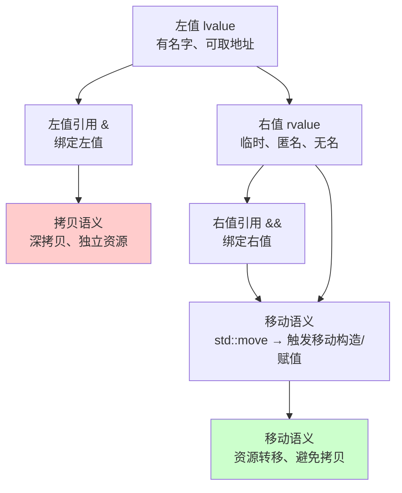
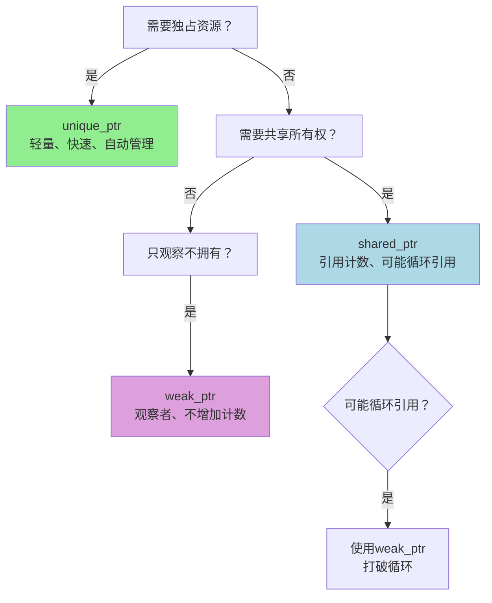
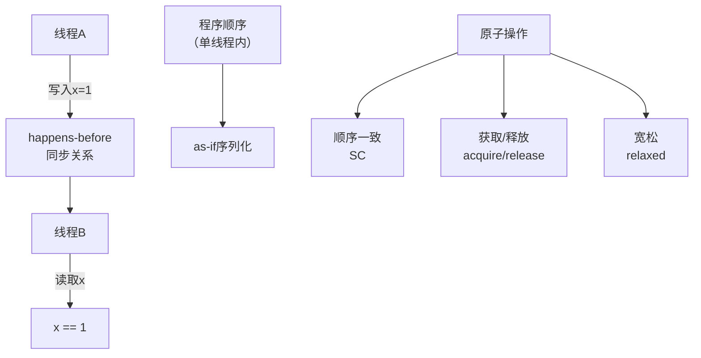

+++
title = "第23章 C++11核心特性"
weight = 230
date = "2026-03-29T21:03:00+08:00"
type = "docs"
description = ""
isCJKLanguage = true
draft = false
+++
# 第23章 C++11核心特性

如果说C++98是那个一手拿着咖啡、一边艰难地手写迭代器的古典派，那么C++11就是那位终于学会了偷懒、开始用微波炉热披萨、偶尔还跟你吐槽工作太累的现代人。它带来了**右值引用**让你搬家更轻松（顺便翻你冰箱），**智能指针**让你不再担心内存泄漏（毕竟有它替你铲屎），**Lambda表达式**让你写代码像写情书一样简洁（虽然更像写辞职信）。总之，C++11是C++家族史上最大的一次版本升级，堪称"文艺复兴"！毫不夸张地说，不懂C++11，你都不好意思跟人说你会C++。

> 本章代码运行环境：支持C++11及以上标准的编译器（GCC 4.8.5+/Clang 3.3+/MSVC 2015+）

## 23.1 右值引用与移动语义

### 23.1.1 左值与右值的恩怨情仇

在C++的世界里，变量分为两种阵营：**左值（lvalue）**和**右值（rvalue）**。

- **左值（lvalue）**：可以放到等号左边，也可以放到右边的值，有名字，有地址，可以被取地址。比如 `int a = 10;` 中的 `a`。
- **右值（rvalue）**：只能出现在等号右边，没有名字，临时对象，生命周期短暂。比如 `int b = 20;` 中的 `20`，或者 `a + 5` 这个表达式。

简单记忆法：**左值"脸皮厚"，赖在内存里不走；右值"随风飘"，用完就消失在历史的长河中**。

### 23.1.2 右值引用是什么？

C++11引入了一种新的引用类型——**右值引用**（rvalue reference），用 `&&` 表示。顾名思义，它就是专门用来绑定右值的引用。

```cpp
int x = 10;
int& lr = x;        // 左值引用，只能绑定左值
int&& rr = 20;      // 右值引用，绑定右值常量20
int&& rr2 = std::move(x);  // 左值需要用std::move()转成右值才能绑定
```

> 等等，**右值引用**听起来就像是在巴结右值？没错，它就是C++11特意为右值准备的VIP通道！

### 23.1.3 移动语义原理

**移动语义**（Move Semantics）是C++11最核心的特性之一，它的核心理念是：**"能偷的资源就绝不拷贝"**。

想象你要搬家，有两种方式：
1. **拷贝**：把所有家具复制一份到新家，原来的家具还在（旧家）。费时费力还费钱。
2. **移动**：直接把家具从旧家搬到新家，旧家的家具"消失"了（或者变成空壳）。省时省力！

在C++中，**移动构造函数**和**移动赋值运算符**就是实现这种"搬家"机制的关键。

```cpp
#include <iostream>
#include <vector>
#include <string>
#include <cstring>  // for memcpy

// 定义一个缓冲区类，用于演示拷贝 vs 移动
class Buffer {
private:
    char* data_;    // 指向堆内存的指针
    size_t size_;   // 缓冲区大小

public:
    // 普通构造函数：从堆分配内存
    Buffer(size_t size) : size_(size) {
        data_ = new char[size_];
        std::cout << "Buffer constructed, size=" << size_ << std::endl;
    }

    // 析构函数：释放堆内存
    ~Buffer() {
        delete[] data_;
        std::cout << "Buffer destructed, size=" << size_ << std::endl;
    }

    // ========== 拷贝构造函数 ==========
    // 功能：用自己的内存，复制一份 other's 的数据
    // 特点：深拷贝，两个Buffer独立，互不影响
    Buffer(const Buffer& other) : size_(other.size_) {
        data_ = new char[size_];                    // 开新内存
        std::memcpy(data_, other.data_, size_);     // 复制数据
        std::cout << "Buffer copied (size=" << size_ << ")" << std::endl;
    }

    // ========== 移动构造函数 ==========
    // 功能："偷走" other's 的资源，不复制数据
    // 特点：原地接管， other's 变成"空壳"
    // noexcept：承诺不抛出异常，让编译器优化
    Buffer(Buffer&& other) noexcept : data_(other.data_), size_(other.size_) {
        other.data_ = nullptr;   // 原对象数据指针置空，防止析构时delete[]
        other.size_ = 0;         // 原对象大小归零
        std::cout << "Buffer moved" << std::endl;
    }

    // ========== 移动赋值运算符 ==========
    // 功能：把自己清空，然后"偷走" other's 的资源
    // 注意：需要先释放自己原有的资源，避免内存泄漏
    Buffer& operator=(Buffer&& other) noexcept {
        if (this != &other) {            // 防止自移动（给自己赋值）
            delete[] data_;              // 先释放自己的堆内存
            data_ = other.data_;         // 偷走别人的数据指针
            size_ = other.size_;         // 偷走别人的大小
            other.data_ = nullptr;       // 对方数据指针置空
            other.size_ = 0;            // 对方大小归零
        }
        std::cout << "Buffer move assigned" << std::endl;
        return *this;
    }
};

int main() {
    std::cout << "=== 创建b1（调用普通构造函数）===" << std::endl;
    Buffer b1(1000);  // 分配1000字节

    std::cout << "\n=== 拷贝b1到b2（调用拷贝构造函数）===" << std::endl;
    Buffer b2 = b1;   // 深拷贝，b2有自己独立的1000字节

    std::cout << "\n=== 移动b1到b3（调用移动构造函数）===" << std::endl;
    Buffer b3 = std::move(b1);  // 移动，b3直接接管b1的内存，b1变空壳

    std::cout << "\n=== 移动赋值：将b2的资源转移给b4 ===" << std::endl;
    Buffer b4(500);
    b4 = std::move(b2);  // 调用移动赋值运算符：b4原有500字节被释放，b4接管b2的1000字节，b2变空壳

    std::cout << "\n=== main函数结束，局部对象开始析构 ===" << std::endl;

    return 0;
}
```

运行结果：

```
=== 创建b1（调用普通构造函数）===
Buffer constructed, size=1000

=== 拷贝b1到b2（调用拷贝构造函数）===
Buffer copied (size=1000)

=== 移动b1到b3（调用移动构造函数）===
Buffer moved

=== 移动赋值：将b2的资源转移给b4 ===
Buffer constructed, size=500
Buffer move assigned         ← 注意：b4原有500字节在移动赋值内部被释放！

=== main函数结束，局部对象开始析构 ===
Buffer destructed, size=500  ← b4原有500字节在移动赋值时已释放
Buffer destructed, size=1000 ← b4此时拥有b2的1000字节
Buffer destructed, size=1000 ← b3拥有b1的1000字节
Buffer destructed, size=0     ← b2已被移动，空壳
Buffer destructed, size=0     ← b1已被移动，空壳
```

> 注意观察：移动后，原对象的 `size_` 变成0，说明资源已经被"掏空"了！同时注意，"Buffer move assigned"之后紧跟"Buffer destructed, size=500"，这是因为移动赋值运算符内部先`delete[]`了自己的旧内存——这一步释放是实打实的析构调用！

### 23.1.4 std::move是何方神圣？

`std::move` 本身并不移动任何东西，它只是一个**类型转换器**。它的作用是把一个左值**强制转换**成右值引用，触发移动构造函数或移动赋值运算符。

```cpp
template<typename T>
typename std::remove_reference<T>::type&& move(T&& arg) {
    return static_cast<typename std::remove_reference<T>::type&&>(arg);
}
```

简单理解：`std::move(x)` 就像是对编译器喊了一句："这个 `x` 我不要了，谁要谁拿去！" 然后编译器就会去调用移动语义。

### 23.1.5 移动语义的应用场景

```cpp
#include <iostream>
#include <vector>
#include <string>

// 模拟一个"重型"对象：拷贝代价高
class HeavyObject {
public:
    std::vector<int> data;  // 假设这个vector存了上百万个元素

    HeavyObject(size_t n) : data(n, 0) {
        std::cout << "HeavyObject constructed with " << n << " elements" << std::endl;
    }

    // 移动构造函数
    HeavyObject(HeavyObject&& other) noexcept : data(std::move(other.data)) {
        std::cout << "HeavyObject moved" << std::endl;
    }

    // 拷贝构造函数
    HeavyObject(const HeavyObject& other) : data(other.data) {
        std::cout << "HeavyObject copied" << std::endl;
    }
};

int main() {
    std::cout << "--- 创建临时对象（匿名对象）---" << std::endl;
    auto createHeavy = []() {
        return HeavyObject(1000000);  // 返回临时对象
    };

    std::cout << "\n--- 用临时对象构造v1（可能触发移动）---" << std::endl;
    std::vector<HeavyObject> v1;
    v1.push_back(createHeavy());  // 优先调用移动构造，避免拷贝

    std::cout << "\n--- 用已存在的对象构造v2（必须拷贝）---" << std::endl;
    HeavyObject obj(1000000);
    v1.push_back(obj);  // obj是左值，只能拷贝

    std::cout << "\n--- 使用std::move手动移动---" << std::endl;
    HeavyObject obj2(1000000);
    HeavyObject obj3 = std::move(obj2);  // 手动移动，不再拷贝

    return 0;
}
```

> 性能提示：在已知对象不再使用时，优先使用 `std::move` 触发移动语义，可以显著提升性能！

### 23.1.6 移动语义与完美转发

**完美转发**（Perfect Forwarding）是C++11的另一个黑科技，它允许你把参数原封不动地转发给另一个函数，同时保持其值类别（左值/右值）。

```cpp
#include <iostream>
#include <utility>

void process(int& x) {
    std::cout << "process(int&): " << x << std::endl;  // 左值重载
}

void process(int&& x) {
    std::cout << "process(int&&): " << x << std::endl;  // 右值重载
}

// 使用std::forward保持原始类型
template<typename T>
void wrapper(T&& x) {
    process(std::forward<T>(x));  // 完美转发
}

int main() {
    int a = 10;
    wrapper(a);           // a是左值，forward后还是左值引用
    wrapper(20);          // 20是右值，forward后还是右值引用

    // 输出:
    // process(int&): 10
    // process(int&&): 20

    return 0;
}
```

下图展示了移动语义的"灵魂"：



> 记住：**拷贝是复制粘贴，移动是剪切粘贴**。能移动就不拷贝，除非你真的需要两份！

---

## 23.2 智能指针：内存泄漏的终结者

### 23.2.1 指针的苦难史

在C++的远古时代（其实也没多远），管理内存就像养猫：你得记得给它喂食（分配内存），还得记得铲屎（释放内存）。忘了？那就等着程序崩溃或者内存泄漏吧。

```cpp
// 那个黑暗年代的代码...
void ancientCode() {
    int* ptr = new int(42);
    doSomething(ptr);
    // 如果doSomething抛异常...
    // delete ptr;  // 这行永远不会执行！
    // 内存泄漏！小猫饿死了！
}
```

C++11带来了**智能指针**（Smart Pointers），它们就像是自动铲屎的猫砂盆——你只管养猫，清理的事它自己搞定。

### 23.2.2 std::unique_ptr：独占所有权的霸道总裁

**unique_ptr** 是最简单也最常用的智能指针，它实行**独占所有权**策略：一个指针只能属于一个主人，其他人都别想碰。

```cpp
#include <iostream>
#include <memory>    // 智能指针的头文件

int main() {
    // ========== 创建unique_ptr ==========
    // 方法1：使用make_unique（C++14引入，比new更安全，避免异常安全问题）
    // 如果编译器不支持C++14，可以用 std::unique_ptr<T>(new T(args...))
    auto up1 = std::make_unique<int>(42);  // C++14：在堆上创建一个int，值为42

    // 方法2：直接用构造函数（C++11方式）
    std::unique_ptr<int> up2(new int(42));

    // ========== 使用unique_ptr ==========
    std::cout << "unique_ptr value: " << *up1 << std::endl;  // 解引用取值
    // 输出: 42

    // ========== 检查是否为空 ==========
    if (up1) {
        std::cout << "up1 is not null" << std::endl;  // 输出这句话
    }

    // ========== 释放所有权（reset） ==========
    up1.reset();  // 释放内存，指针变为空
    std::cout << "up1 after reset: " << (up1 ? "not null" : "null") << std::endl;
    // 输出: null

    // ========== 转移所有权（move） ==========
    auto up2 = std::make_unique<int>(100);
    auto up3 = std::move(up2);  // 所有权从up2转移到up3
    // up2现在为空，up3拥有那个100

    std::cout << "up2 after move: " << (up2 ? "not null" : "null") << std::endl;  // null
    std::cout << "up3 value: " << *up3 << std::endl;  // 100

    // ========== unique_ptr作为函数参数 ==========
    // 传引用可以避免拷贝（unique_ptr不能拷贝！）
    auto printPtr = [](const std::unique_ptr<int>& p) {
        if (p) std::cout << "Value: " << *p << std::endl;
    };
    printPtr(up3);

    // ========== unique_ptr与数组 ==========
    auto upArr = std::make_unique<int[]>(5);  // 管理数组
    for (int i = 0; i < 5; ++i) {
        upArr[i] = i * 10;
    }
    std::cout << "Array elements: ";
    for (int i = 0; i < 5; ++i) {
        std::cout << upArr[i] << " ";  // 0 10 20 30 40
    }
    std::cout << std::endl;

    // 函数结束，up3和upArr自动释放内存
    // 再也不用手动delete！

    return 0;
}
```

> 霸道总裁的使用法则：**独占！不能共享！不能拷贝！** 想要共享？请找 `shared_ptr`！

### 23.2.3 std::shared_ptr：共享所有权的民主制度

**shared_ptr** 实行**引用计数**（Reference Counting）策略：多个指针可以共享同一个对象，最后一个持有者负责删除它。

```cpp
#include <iostream>
#include <memory>

int main() {
    // ========== 创建shared_ptr ==========
    auto sp1 = std::make_shared<int>(100);  // 引用计数 = 1

    // ========== 共享所有权 ==========
    auto sp2 = sp1;  // 复制，引用计数 = 2
    auto sp3 = sp1;  // 再复制，引用计数 = 3

    std::cout << "shared_ptr ref count: " << sp1.use_count() << std::endl;
    // 输出: 3

    // ========== 所有指针指向同一块内存 ==========
    *sp2 = 200;  // 通过sp2修改
    std::cout << "sp1 value: " << *sp1 << std::endl;  // 200，通过sp1读取
    std::cout << "sp3 value: " << *sp3 << std::endl;  // 200，也能读到

    // ========== weak_ptr不参与引用计数 ==========
    std::weak_ptr<int> wp = sp1;  // wp观察sp1，但不增加计数
    std::cout << "weak_ptr expired: " << wp.expired() << std::endl;  // 0（未过期）

    // ========== weak_ptr的使用场景 ==========
    // weak_ptr不能直接使用，必须先lock()获取shared_ptr
    if (auto locked = wp.lock()) {
        std::cout << "weak_ptr locked: " << *locked << std::endl;
        // 输出: 200
    }

    // ========== 引用计数的变化 ==========
    sp1.reset();  // sp1释放，计数从3变成2
    sp3.reset();  // sp3释放，计数从2变成1
    std::cout << "After resets, count: " << sp2.use_count() << std::endl;  // 1

    sp2.reset();  // 最后一个shared_ptr释放，对象被销毁

    // ========== 循环引用问题 ==========
    // shared_ptr的缺点：可能导致循环引用，造成内存泄漏
    // 解决：使用weak_ptr打破循环

    return 0;
}
```

### 23.2.4 std::weak_ptr：打破循环引用的救星

**weak_ptr** 名字听起来很弱，但它其实是`shared_ptr`的**最佳辅助**。它的特点：
- 不参与引用计数
- 不能直接访问对象（需先`lock()`转成`shared_ptr`）
- 专门用来打破`shared_ptr`的循环引用

```cpp
#include <iostream>
#include <memory>

// 演示weak_ptr的使用
int main() {
    // 创建一个shared_ptr
    auto sp = std::make_shared<int>(42);

    // 用weak_ptr观察它
    std::weak_ptr<int> wp = sp;

    std::cout << "1. use_count: " << sp.use_count() << std::endl;  // 1
    std::cout << "2. expired: " << wp.expired() << std::endl;      // false

    // 尝试访问：先lock()转换成shared_ptr
    if (auto locked = wp.lock()) {
        std::cout << "3. locked value: " << *locked << std::endl;  // 42
    }

    // sp销毁后，wp就"过期"了
    sp.reset();

    std::cout << "4. expired after reset: " << wp.expired() << std::endl;  // true

    // 再次lock，返回空shared_ptr
    if (auto locked = wp.lock()) {
        std::cout << "This won't print" << std::endl;
    } else {
        std::cout << "5. wp.lock() returned null" << std::endl;
    }

    return 0;
}
```

### 23.2.5 循环引用：shared_ptr的致命弱点

```cpp
#include <iostream>
#include <memory>

// 循环引用示例：parent和child互相持有对方
struct Node {
    std::shared_ptr<Node> parent;  // 父节点
    std::shared_ptr<Node> child;   // 子节点
    int value;

    Node(int v) : value(v) {
        std::cout << "Node(" << value << ") constructed" << std::endl;
    }

    ~Node() {
        std::cout << "Node(" << value << ") destructed" << std::endl;
    }
};

int main() {
    auto parent = std::make_shared<Node>(1);
    auto child = std::make_shared<Node>(2);

    // 建立循环引用！
    parent->child = child;
    child->parent = parent;

    // 问题：出了作用域，parent和child的引用计数都是1（互相持有）
    // 永远不会被释放！内存泄漏！

    std::cout << "Before leaving scope..." << std::endl;
    // 析构函数不会打印！

    return 0;
    // 正确做法：把parent或child的指针之一改成weak_ptr
}
```

> 循环引用的解决方案：把`parent`改成`std::weak_ptr<Node>`即可！

### 23.2.6 智能指针选型指南



| 指针类型 | 所有权 | 拷贝 | 引用计数 | 典型用途 |
|---------|--------|------|---------|---------|
| `unique_ptr` | 独占 | ❌ | ❌ | 独占资源，无需共享 |
| `shared_ptr` | 共享 | ✅ | ✅ | 需要多个持有者 |
| `weak_ptr` | 无 | ✅ | ❌ | 观察者、打破循环 |

> 金句：**能用 `unique_ptr` 就别用 `shared_ptr`！** 独占比共享更安全、更高效！

---

## 23.3 Lambda表达式：匿名函数的艺术

### 23.3.1 什么是Lambda？

**Lambda表达式**（Lambda Expression）是C++11引入的一种**匿名函数**（Anonymous Function）特性。简单说就是："不用给它起名字，直接写一段代码当函数用"。

想象你走进一家奶茶店：
- **普通函数**：你跟店员说"去找小明，让他做一杯珍珠奶茶"（先定义函数，再调用）
- **Lambda**：你直接说"来一杯珍珠奶茶"（匿名函数，直接使用）

```cpp
// 普通函数
int add(int a, int b) {
    return a + b;
}

// Lambda表达式
auto add = [](int a, int b) { return a + b; };
```

### 23.3.2 Lambda的基本语法

```cpp
[捕获列表](参数列表) -> 返回类型 { 函数体 }
```

- **[捕获列表]**：决定Lambda能访问哪些外部变量
- **(参数列表)**：和普通函数一样
- **-> 返回类型**：可选，编译器可以推导
- **{函数体}**：函数的具体逻辑

```cpp
#include <iostream>
#include <vector>
#include <algorithm>

int main() {
    // ========== 最简单的Lambda：无参数、无返回值 ==========
    auto sayHello = []() {
        std::cout << "Hello, Lambda!" << std::endl;
    };
    sayHello();  // 输出: Hello, Lambda!

    // ========== 带参数的Lambda ==========
    auto add = [](int a, int b) {
        return a + b;
    };
    std::cout << "add(3, 4) = " << add(3, 4) << std::endl;  // 输出: 7

    // ========== 编译器推导返回类型（不需要->） ==========
    auto multiply = [](int a, int b) { return a * b; };
    std::cout << "multiply(3, 4) = " << multiply(3, 4) << std::endl;  // 输出: 12

    // ========== 显式指定返回类型 ==========
    auto divide = [](double a, double b) -> double {
        if (b == 0) return 0;
        return a / b;
    };
    std::cout << "divide(10, 3) = " << divide(10, 3) << std::endl;  // 输出: 3.33333

    return 0;
}
```

### 23.3.3 捕获列表：Lambda的"特异功能"

Lambda最有意思的部分是**捕获列表**，它决定了Lambda能"看见"哪些外部变量。

```cpp
#include <iostream>

int main() {
    int x = 10;
    int y = 20;

    // ========== 捕获方式详解 ==========

    // [x] 按值捕获：复制一份x，Lambda内使用的是副本
    //     修改Lambda内的x不影响外面的x
    auto byValue = [x](int a) { return a + x; };
    std::cout << "byValue(5) = " << byValue(5) << std::endl;  // 15

    // [&y] 按引用捕获：Lambda内用的是y的引用
    //     修改Lambda内的y会影响外面的y（小心！）
    auto byRef = [&y](int a) { return a + y; };
    std::cout << "byRef(5) = " << byRef(5) << std::endl;  // 25

    // [=] 按值捕获所有：自动捕获所有用到的外部变量
    auto captureAll = [=](int a) { return a + x + y; };
    std::cout << "captureAll(1) = " << captureAll(1) << std::endl;  // 31

    // [&] 按引用捕获所有：所有变量都用引用
    auto captureAllRef = [&](int a) { return a + x + y; };
    std::cout << "captureAllRef(1) = " << captureAllRef(1) << std::endl;  // 31

    // [=, &x] 混合模式：x按引用，其他按值
    auto mixed = [=, &x](int a) {
        x = 100;  // 修改外面的x
        return a + x + y;  // x变成100，y还是20
    };
    std::cout << "mixed(1) = " << mixed(1) << std::endl;  // 121
    std::cout << "x after mixed = " << x << std::endl;    // 100（被改了！）

    return 0;
}
```

### 23.3.4 mutable：修改被捕获的变量

默认情况下，Lambda体内不能修改按值捕获的变量（因为它只是const的副本）。如果想修改，需要加`mutable`关键字。

```cpp
#include <iostream>

int main() {
    int count = 0;

    // 不加mutable：编译错误，不能修改捕获的变量
    // auto increment = [count]() { count++; };

    // 加mutable：允许修改捕获的副本（不影响外部的count）
    auto increment = [count]() mutable {
        count++;
        std::cout << "Inside lambda, count = " << count << std::endl;
    };

    increment();  // Inside lambda, count = 1
    increment();  // Inside lambda, count = 2

    std::cout << "Outside lambda, count = " << count << std::endl;  // 0（外部没变）

    return 0;
}
```

### 23.3.5 Lambda与STL：天生一对

Lambda在STL（标准模板库）算法中大放异彩，堪称"完美替代仿函数"：

```cpp
#include <iostream>
#include <vector>
#include <algorithm>
#include <functional>  // for std::function

int main() {
    std::vector<int> nums = {5, 2, 8, 1, 9, 3, 7, 6, 4};

    // ========== for_each：遍历并操作 ==========
    std::cout << "Original: ";
    std::for_each(nums.begin(), nums.end(), [](int n) {
        std::cout << n << " ";
    });
    std::cout << std::endl;
    // 输出: Original: 5 2 8 1 9 3 7 6 4

    // ========== sort：自定义排序规则 ==========
    // 升序排序
    std::sort(nums.begin(), nums.end(), [](int a, int b) {
        return a < b;
    });
    std::cout << "Sorted ascending: ";
    for (int n : nums) std::cout << n << " ";  // 1 2 3 4 5 6 7 8 9
    std::cout << std::endl;

    // 降序排序
    std::sort(nums.begin(), nums.end(), [](int a, int b) {
        return a > b;
    });
    std::cout << "Sorted descending: ";
    for (int n : nums) std::cout << n << " ";  // 9 8 7 6 5 4 3 2 1
    std::cout << std::endl;

    // ========== find_if：查找满足条件的元素 ==========
    auto it = std::find_if(nums.begin(), nums.end(), [](int n) {
        return n > 5;
    });
    if (it != nums.end()) {
        std::cout << "First > 5: " << *it << std::endl;  // 9
    }

    // ========== count_if：统计满足条件的元素个数 ==========
    int evens = std::count_if(nums.begin(), nums.end(), [](int n) {
        return n % 2 == 0;
    });
    std::cout << "Even numbers: " << evens << std::endl;  // 4

    // ========== transform：转换元素 ==========
    std::vector<int> squares(nums.size());
    std::transform(nums.begin(), nums.end(), squares.begin(), [](int n) {
        return n * n;
    });
    std::cout << "Squares: ";
    for (int s : squares) std::cout << s << " ";
    // 81 64 49 36 25 16 9 4 1
    std::cout << std::endl;

    // ========== remove_if：移除元素 ==========
    // 移除所有奇数
    auto newEnd = std::remove_if(nums.begin(), nums.end(), [](int n) {
        return n % 2 == 1;  // 奇数返回true，表示要移除
    });
    nums.erase(newEnd, nums.end());
    std::cout << "Only evens: ";
    for (int n : nums) std::cout << n << " ";  // 8 6 4 2
    std::cout << std::endl;

    return 0;
}
```

### 23.3.6 Lambda作为回调函数

Lambda最酷的用法之一是作为**回调函数**（Callback Function）：

```cpp
#include <iostream>
#include <vector>
#include <functional>

// 模拟事件系统
class Button {
public:
    // onClick接受一个std::function（可调用对象）
    void onClick(std::function<void()> callback) {
        // 模拟点击事件
        std::cout << "Button clicked!" << std::endl;
        callback();  // 执行回调
    }
};

int main() {
    Button btn;

    // 使用Lambda作为回调
    int clickCount = 0;

    btn.onClick([&clickCount]() {
        clickCount++;
        std::cout << "Handler 1: Click count = " << clickCount << std::endl;
    });

    btn.onClick([&clickCount]() {
        clickCount++;
        std::cout << "Handler 2: Click count = " << clickCount << std::endl;
    });

    // 输出:
    // Button clicked!
    // Handler 1: Click count = 1
    // Button clicked!
    // Handler 2: Click count = 2

    return 0;
}
```

### 23.3.7 Lambda的本质：其实是仿函数！

编译器会把Lambda翻译成一个**仿函数类**（Functor Class）：

```cpp
// 你写的Lambda
auto isEven = [](int n) { return n % 2 == 0; };

// 编译器大致把它变成这样
class isEven_class {
public:
    bool operator()(int n) const {
        return n % 2 == 0;
    }
};
// 然后 isEven 就是 isEven_class 的一个实例
```

所以Lambda就是**匿名仿函数**的语法糖！

---

## 23.4 auto与decltype：类型推导双雄

### 23.4.1 auto：让编译器猜类型

**auto** 是C++11引入的关键字，它会根据变量的初始值**自动推导类型**。编译器就像一个聪明的助理，你只需要说"帮我倒杯咖啡"，它就自动知道是拿杯子、加咖啡、递给你。

```cpp
#include <iostream>
#include <typeinfo>  // 用于查看类型信息

int main() {
    // ========== 基本类型推导 ==========
    auto a = 42;                    // int
    auto b = 3.14;                  // double
    auto c = "hello";               // const char*
    auto d = true;                  // bool
    auto e = 'A';                   // char

    std::cout << "a=" << a << ", type: " << typeid(a).name() << std::endl;
    std::cout << "b=" << b << ", type: " << typeid(b).name() << std::endl;
    std::cout << "c=" << c << ", type: " << typeid(c).name() << std::endl;

    // ========== 复杂类型推导 ==========
    auto vec = std::vector<int>{1, 2, 3};  // std::vector<int>
    auto func = std::plus<int>();         // std::plus<int>
    auto lambda = [](int x) { return x; }; // lambda类型（很复杂）

    // ========== 迭代器类型 ==========
    std::vector<std::string> words = {"apple", "banana", "cherry"};
    for (auto it = words.begin(); it != words.end(); ++it) {
        std::cout << *it << " ";  // apple banana cherry
    }
    std::cout << std::endl;

    // ========== 引用和指针 ==========
    int x = 10;
    auto& ref = x;   // int&
    auto* ptr = &x; // int*
    auto copy = x;   // int

    // ========== auto的坑：推导出的类型可能不是你想的 ==========
    auto val1 = 10;        // int
    auto val2 = 10ULL;    // unsigned long long
    auto val3 = 10L;      // long
    auto val4 = 10.0f;    // float
    auto val5 = 10.0;     // double

    std::cout << "\nAuto deductions:" << std::endl;
    std::cout << "10      -> " << typeid(val1).name() << std::endl;
    std::cout << "10ULL   -> " << typeid(val2).name() << std::endl;
    std::cout << "10L     -> " << typeid(val3).name() << std::endl;
    std::cout << "10.0f   -> " << typeid(val4).name() << std::endl;
    std::cout << "10.0    -> " << typeid(val5).name() << std::endl;

    return 0;
}
```

### 23.4.2 auto的限制与注意事项

```cpp
#include <iostream>
#include <vector>

int main() {
    // ========== auto必须初始化 ==========
    // auto n;  // 编译错误！无法推导类型

    // ========== auto会去掉const和引用 ==========
    const int ci = 100;
    auto a = ci;        // int，不是const int！const被"吃掉"了
    a = 200;           // 可以修改

    const auto b = ci; // 恢复const：const int

    int x = 10;
    int& rx = x;
    auto c = rx;        // int，不是int&！引用也被"吃掉"了

    // 如果想保留const和引用：
    const auto& d = x;  // const int&

    // ========== 函数返回值类型推导（C++14）==========
    // 注意：以下代码展示了C++14的返回值类型推导特性
    // C++11使用auto作为返回类型时必须配合->使用（C++11后置返回类型语法）
    // C++14可以直接写 auto add(int a, int b) { return a + b; }
    // auto add(int a, int b) {
    //     return a + b;
    // }

    return 0;
}
```

> 重要提醒：`auto` 会**吃掉**顶层的 `const` 和引用！如果需要保留，用 `const auto&` 或 `auto&&`。

### 23.4.3 decltype：获取表达式的类型

**decltype** 是 "declare type" 的缩写，它的作用是**查询表达式的类型**，但不计算表达式。

```cpp
#include <iostream>
#include <typeinfo>

int main() {
    // ========== 基本用法 ==========
    int x = 10;
    double y = 3.14;

    decltype(x) a = 20;     // a是int，因为x是int
    decltype(y) b = 2.71;   // b是double，因为y是double
    decltype(x + y) c = x + y;  // c是double，x+y是double表达式

    std::cout << "a=" << a << ", type: " << typeid(a).name() << std::endl;
    std::cout << "b=" << b << ", type: " << typeid(b).name() << std::endl;
    std::cout << "c=" << c << ", type: " << typeid(c).name() << std::endl;

    // ========== 保留引用和const ==========
    const int& crx = x;
    decltype(crx) d = x;  // d是const int&，因为crx是const int&

    // ========== decltype与函数 ==========
    int arr[5];
    decltype(arr) arr2;  // arr2是int[5]

    struct S { double d; } s;
    decltype(s.d) dbl = 3.14;  // dbl是double，因为s.d是double

    return 0;
}
```

### 23.4.4 decltype的三种"面孔"

`decltype` 根据表达式的不同，返回的类型也会有所不同：

```cpp
#include <iostream>

int main() {
    int x = 10;
    int& rx = x;
    int* px = &x;

    // ========== 情况1：变量名（不带括号）==========
    // 结果：变量的类型，一模一样
    decltype(x) a = 20;    // int
    decltype(rx) b = x;   // int&（引用必须绑定）
    decltype(px) c = &x;  // int*

    // ========== 情况2：函数调用 ==========
    // 结果：函数的返回值类型
    int& getRef();
    decltype(getRef()) d = x;  // int&

    // ========== 情况3：其他表达式 ===========
    // 结果：根据表达式决定
    decltype(x + 5) e = 100;      // int（x+5是int）
    decltype(++x) f = x;          // int&（++x是左值，返回的是x的引用）
    decltype(x++) g = x;          // int（x++是右值，返回的是副本）
    decltype("hello") h = "hi";   // const char[6]

    // ========== decltype(auto) C++14 ==========
    // 用于函数返回类型，让返回类型自动推导
    // 注意：decltype(auto)是C++14特性，本节代码需要C++14支持
    int val = 10;
    decltype(auto) val2 = val;  // int（保留val的类型）（C++14）

    const int cval = 10;
    decltype(auto) cval2 = cval;  // const int（C++14）

    return 0;
}
```

### 23.4.5 auto与decltype的组合拳

`auto` 和 `decltype` 经常联手使用，特别是在模板编程中：

```cpp
#include <iostream>
#include <vector>

// 使用decltype(auto)推导返回类型（C++14）
template<typename T, typename U>
auto add(T t, U u) -> decltype(t + u) {
    return t + u;
}

// decltype(auto)的妙用：完美转发返回类型（C++14）
template<typename T>
decltype(auto) process(T&& arg) {
    // 保持arg的原始类型（左值/右值、是否const等）
    return std::forward<T>(arg);
}

int main() {
    std::cout << "add(1, 2) = " << add(1, 2) << std::endl;        // 3
    std::cout << "add(1.5, 2.5) = " << add(1.5, 2.5) << std::endl;  // 4

    int x = 10;
    int& ref = x;

    // 使用decltype(auto)保持引用类型（C++14）
    decltype(auto) val = ref;  // int&，而不是int（C++14）
    val = 20;                  // 修改val就是修改x
    std::cout << "x = " << x << std::endl;  // 20

    return 0;
}
```

---

## 23.5 范围for循环：化繁为简的艺术

### 23.5.1 传统for循环的烦恼

在C++11之前，遍历一个容器是这样的：

```cpp
std::vector<int> nums = {1, 2, 3, 4, 5};

// 传统方式：繁琐易错
for (std::vector<int>::iterator it = nums.begin(); it != nums.end(); ++it) {
    std::cout << *it << " ";
}
```

这段代码有以下几个问题：
1. **太长**：类型名占了一大堆
2. **易错**：`iterator` 还是 `const_iterator`？`++it` 还是 `it++`？
3. **不直观**：看代码时要在大脑里"编译"一遍

### 23.5.2 范围for：简洁至上

C++11引入了**范围for循环**（Range-based for loop），让遍历变得像呼吸一样自然：

```cpp
#include <iostream>
#include <vector>

int main() {
    std::vector<int> nums = {1, 2, 3, 4, 5};

    // ========== 基本用法 ==========
    std::cout << "Numbers: ";
    for (int n : nums) {          // for (元素类型 变量名 : 容器)
        std::cout << n << " ";
    }
    std::cout << std::endl;
    // 输出: Numbers: 1 2 3 4 5

    // ========== 使用auto自动推导类型 ==========
    std::cout << "With auto: ";
    for (auto n : nums) {
        std::cout << n << " ";
    }
    std::cout << std::endl;

    // ========== 修改容器内的元素 ==========
    // 方法1：使用引用
    for (auto& n : nums) {
        n *= 2;  // 每个元素乘以2
    }

    std::cout << "Doubled: ";
    for (auto n : nums) {
        std::cout << n << " ";
    }
    std::cout << std::endl;
    // 输出: Doubled: 2 4 6 8 10

    // ========== 只读不写 ==========
    // 方法1：const引用（推荐，避免拷贝）
    std::cout << "Read-only: ";
    for (const auto& n : nums) {
        std::cout << n << " ";
    }
    std::cout << std::endl;

    // 方法2：按值拷贝（会复制每个元素，大容器慎用）
    std::cout << "By value: ";
    for (auto n : nums) {
        std::cout << n << " ";  // n是nums[i]的拷贝
    }
    std::cout << std::endl;

    return 0;
}
```

### 23.5.3 范围for的工作原理

范围for循环其实是下面的**语法糖**：

```cpp
// 你写的
for (auto n : nums) { ... }

// 编译器翻译成
for (auto __begin = nums.begin(), __end = nums.end(); __begin != __end; ++__begin) {
    auto n = *__begin;
    ...
}
```

所以使用范围for需要满足两个条件：
1. 容器有 `begin()` 和 `end()` 方法
2. `begin()` 和 `end()` 返回的是同一种迭代器类型

### 23.5.4 范围for的适用场景

```cpp
#include <iostream>
#include <vector>
#include <map>
#include <array>
#include <string>

int main() {
    // ========== vector ==========
    std::vector<int> vec = {1, 2, 3};
    for (int v : vec) std::cout << v << " ";  // 1 2 3
    std::cout << std::endl;

    // ========== 数组 ==========
    int arr[] = {10, 20, 30};
    for (int a : arr) std::cout << a << " ";  // 10 20 30
    std::cout << std::endl;

    // ========== std::array ==========
    std::array<std::string, 3> names = {"Alice", "Bob", "Charlie"};
    for (const auto& name : names) std::cout << name << " ";  // Alice Bob Charlie
    std::cout << std::endl;

    // ========== std::map ==========
    std::map<char, int> scores = {{'A', 90}, {'B', 85}, {'C', 78}};
    for (const auto& kv : scores) {
        std::cout << kv.first << "->" << kv.second << " ";
    }
    std::cout << std::endl;
    // A->90 B->85 C->78

    // ========== 字符串 ==========
    std::string str = "hello";
    for (char c : str) std::cout << c << "-";  // h-e-l-l-o-
    std::cout << std::endl;

    // ========== initializer_list ==========
    for (int n : {100, 200, 300}) std::cout << n << " ";  // 100 200 300
    std::cout << std::endl;

    return 0;
}
```

### 23.5.5 范围for的注意事项

```cpp
#include <iostream>
#include <vector>

int main() {
    // ========== 不要在遍历时修改容器大小 ==========
    std::vector<int> nums = {1, 2, 3, 4, 5};

    // 危险！删除元素会导致迭代器失效
    // for (int n : nums) {
    //     if (n == 3) nums.erase(nums.begin());  // 危险！
    // }

    // 正确做法：用迭代器手动控制
    for (auto it = nums.begin(); it != nums.end(); ) {
        if (*it == 3) {
            it = nums.erase(it);  // erase返回下一个迭代器
        } else {
            ++it;
        }
    }

    // ========== 值拷贝 vs 引用 ==========
    std::vector<std::vector<int>> matrix = {{1, 2}, {3, 4}};

    // 值拷贝：复制整个内层vector，效率低
    // for (std::vector<int> row : matrix) { ... }

    // 引用：不拷贝，但可以修改
    // for (std::vector<int>& row : matrix) { row[0] = 0; }

    // const引用：只读不拷贝，推荐！
    for (const std::vector<int>& row : matrix) {
        for (int val : row) {
            std::cout << val << " ";
        }
    }
    std::cout << std::endl;

    return 0;
}
```

---

## 23.6 初始化列表与统一初始化

### 23.6.1 C++11之前的初始化乱象

C++11之前，初始化语法简直是一团糟：

```cpp
int a = 10;           // C语言风格
int b(20);            // 构造函数风格
int arr[5] = {1,2,3,4,5};  // 数组初始化
struct Point { int x, y; };
Point p = {10, 20};  // 结构体初始化
```

没有统一的方式，而且对于**容器类**（如`vector`）初始化尤其麻烦。

### 23.6.2 大括号初始化：统一武林

C++11引入了**大括号初始化**（Brace Initialization），用 `{}` 统一了初始化江湖：

```cpp
#include <iostream>
#include <vector>
#include <string>

int main() {
    // ========== 基本类型 ==========
    int a{42};           // 没问题
    double b{3.14};     // 没问题
    char c{'A'};         // 字符
    bool d{true};       // 布尔

    std::cout << "a=" << a << ", b=" << b << std::endl;  // a=42, b=3.14

    // ========== 数组 ==========
    int arr1[5];              // 未初始化
    int arr2[5]{};            // 全零初始化
    int arr3[5]{1, 2, 3};    // 部分初始化 {1, 2, 3, 0, 0}
    int arr4[]{1, 2, 3, 4, 5};  // 自动推断长度

    // ========== 容器 ==========
    std::vector<int> v1;           // 空vector
    std::vector<int> v2(5, 100);   // 5个元素，每个100
    std::vector<int> v3{1, 2, 3};  // 3个元素：1, 2, 3
    std::vector<std::string> v4{"apple", "banana"};

    std::cout << "v3 size: " << v3.size() << std::endl;  // 3
    for (int n : v3) std::cout << n << " ";  // 1 2 3
    std::cout << std::endl;

    // ========== 结构体 ==========
    struct Point { int x; int y; };
    Point p1{10, 20};           // C++11支持
    Point p2 = {30, 40};        // 仍然支持

    std::cout << "p1: (" << p1.x << ", " << p1.y << ")" << std::endl;
    // p1: (10, 20)

    // ========== 类 ==========
    class Rectangle {
    public:
        int width;
        int height;
    };
    Rectangle rect{5, 10};  // 聚合初始化
    std::cout << "Rectangle: " << rect.width << "x" << rect.height << std::endl;
    // Rectangle: 5x10

    return 0;
}
```

### 23.6.3 列表初始化陷阱：initializer_list的优先级

这是C++11最"坑"的地方之一！当你用大括号初始化容器时，**编译器会优先选择接受 `std::initializer_list` 的构造函数**：

```cpp
#include <iostream>
#include <vector>

int main() {
    // ========== 经典的陷阱 ==========

    // std::vector<T>有两个构造函数：
    // 1. vector(size_t count, const T& value) - 创建count个value
    // 2. vector(std::initializer_list<T>) - 用列表初始化

    // 圆括号：调用构造函数1
    std::vector<int> v1(5, 100);   // 5个元素，每个都是100
    // 结果: {100, 100, 100, 100, 100}

    // 大括号：调用构造函数2（initializer_list）
    std::vector<int> v2{5, 100};    // 2个元素：5和100
    // 结果: {5, 100}

    std::cout << "v1 size: " << v1.size() << std::endl;  // 5
    std::cout << "v2 size: " << v2.size() << std::endl;  // 2

    // ========== 更多陷阱 ==========

    // 你以为在创建一个值为100的vector？
    std::vector<int> v3(100);  // 错！这是一个包含100个值为0的元素的vector
    std::cout << "v3 size: " << v3.size() << std::endl;  // 100

    // 你以为在创建包含一个元素100的vector？
    std::vector<int> v4{100};  // 对！这才是一个元素100的vector
    std::cout << "v4 size: " << v4.size() << std::endl;  // 1

    // ========== 空大括号的特殊规则 ==========
    // 空{}调用默认构造函数，不是空initializer_list
    std::vector<int> v5{};   // 默认构造：空vector
    // 注意：std::vector<int> v5(); 会被解析为函数声明！而不是空vector
    std::vector<int> v6{};   // 默认构造：空vector（明确写法）
    std::vector<int> v7;      // 默认构造：空vector（最简洁写法）

    std::cout << "v6 empty: " << v6.empty() << std::endl;  // 1

    return 0;
}
```

> 记忆口诀：**大括号优先匹配 initializer_list！** 想创建指定数量的元素，用圆括号！

### 23.6.4 窄化转换检查：编译器的安全门

**窄化转换**（Narrowing Conversion）是指大类型转小类型可能丢失数据的情况，比如 `double` 转 `int`。C++11的大括号初始化会**禁止窄化转换**：

```cpp
#include <iostream>

int main() {
    // ========== 窄化转换检查 ==========

    double d = 3.14;
    int i1 = d;   // OK！这是传统的隐式转换，不报错（但会丢失小数部分）
    std::cout << "i1 = " << i1 << std::endl;  // 3

    // int i2{d};  // 编译错误！大括号不允许窄化转换
    // error: type 'double' cannot be narrowed to 'int'

    // ========== 安全的转换 ==========
    int i3{static_cast<int>(d)};  // OK，显式转换
    std::cout << "i3 = " << i3 << std::endl;  // 3

    // ========== 窄化转换的例子 ==========
    // 下面这些用大括号都会报错：

    // char c1{300};      // int(300)不能缩窄到char（char范围-128~127）
    // char c2{128};      // 同上
    // unsigned int u1{-1};  // signed不能转unsigned

    // int i4{2.9};       // double不能转int

    // ========== 什么是窄化？ ==========
    // 1. 从浮点型转整数
    // 2. 从较大类型转较小类型（如double→float，当double值不在float范围内）
    // 3. 从整数转浮点（可能丢失精度）
    // 4. 从有符号转无符号

    std::cout << "Brace initialization prevents narrowing conversion!" << std::endl;

    return 0;
}
```

### 23.6.5 自定义类支持列表初始化

只要你的类接受 `std::initializer_list`，就可以用大括号初始化：

```cpp
#include <iostream>
#include <initializer_list>
#include <vector>

// 自定义一个接受initializer_list的类
class IntSet {
private:
    std::vector<int> data_;

public:
    // 接受initializer_list的构造函数
    IntSet(std::initializer_list<int> init) {
        for (int n : init) {
            data_.push_back(n);
        }
        std::cout << "IntSet constructed with " << data_.size() << " elements" << std::endl;
    }

    void print() const {
        for (int n : data_) std::cout << n << " ";
        std::cout << std::endl;
    }
};

int main() {
    // 使用大括号初始化
    IntSet set1{1, 2, 3, 4, 5};  // 调用initializer_list构造函数
    set1.print();  // 1 2 3 4 5

    // 甚至可以这样：
    IntSet set2{};  // 空set
    set2.print();   // (空)

    // ========== std::initializer_list的特殊性 ==========
    // 它的元素类型必须是统一的
    // std::vector<std::string> v{"hello", 123};  // 编译错误！

    return 0;
}
```

---

## 23.7 nullptr关键字：终结NULL的混乱

> 🔍 **nullptr的内心独白**："NULL这家伙，0不像0，指针不像指针，重载的时候还容易认错人... 还是我靠谱！"

### 23.7.1 NULL的历史遗留问题

在C++中，`NULL` 是一个令人头疼的存在。它在C语言中定义是 `0`：

```c
#define NULL ((void*)0)  // C语言风格
```

但在C++中，`0` 是一个**整数**，不是指针！这就导致了著名的**二义性问题**：

```cpp
#include <iostream>

void func(int* p) {
    std::cout << "func(int*) called" << std::endl;
}

void func(double d) {
    std::cout << "func(double) called" << std::endl;
}

int main() {
    // 当传入NULL时，编译器会犯迷糊
    func(NULL);  // C++中NULL是0，是int，调用的是func(double)！

    // 这不是我们想要的！NULL本意是指针，却调用了double版本

    return 0;
}
```

### 23.7.2 nullptr：类型安全的空指针

C++11引入了 `nullptr` 关键字，它是**一种特殊的字面量**，类型是 `std::nullptr_t`，可以隐式转换为**任何指针类型**，但不能转换为整数：

```cpp
#include <iostream>

void func(int* p) {
    std::cout << "func(int*) called" << std::endl;
}

void func(double d) {
    std::cout << "func(double) called" << std::endl;
}

int main() {
    // ========== nullptr vs NULL ==========

    // NULL在C++中就是0
    std::cout << "NULL = " << NULL << std::endl;  // 0

    // nullptr是专门的空指针
    std::cout << "nullptr = " << nullptr << std::endl;  // 0（但类型不同！）

    // ========== 重载决议 ==========
    func(nullptr);  // 调用func(int*)，因为nullptr是指针类型
    // func(NULL);   // 调用func(double)，因为NULL是int类型

    // ========== nullptr的安全用法 ==========

    int* p1 = nullptr;      // OK
    double* p2 = nullptr;  // OK，nullptr可以转换成任何指针
    // int i = nullptr;     // 编译错误！nullptr不能转成int

    // ========== 典型使用场景 ==========

    // 函数返回指针
    int* returnPtr() {
        return nullptr;  // 明确表示返回空指针
    }

    // 检查指针
    int* ptr = returnPtr();
    if (ptr == nullptr) {
        std::cout << "ptr is null" << std::endl;  // 这行会被执行
    }

    // 在模板中使用
    auto test = [](int* p) {
        if (p == nullptr) {
            std::cout << "template null check" << std::endl;
        }
    };
    test(nullptr);

    return 0;
}
```

### 23.7.3 nullptr_t类型

`std::nullptr_t` 是 `nullptr` 的类型。它只有一个值，就是 `nullptr`：

```cpp
#include <iostream>
#include <type_traits>

int main() {
    // nullptr_t类型
    std::nullptr_t n1;
    std::nullptr_t n2 = nullptr;

    // nullptr_t只能赋值为nullptr
    // n1 = 0;  // 编译错误！
    // n1 = NULL;  // 编译错误！

    // nullptr_t的用途：函数重载
    void process(nullptr_t) {
        std::cout << "process(nullptr_t)" << std::endl;
    }

    process(nullptr);  // 调用process(nullptr_t)

    // ========== type_traits检查 ==========
    std::cout << std::boolalpha;
    std::cout << "is_null_pointer<decltype(nullptr)>: "
              << std::is_null_pointer<std::nullptr_t>::value << std::endl;
    // true (C++14)

    return 0;
}
```

> 最佳实践：**永远使用 `nullptr` 而不是 `NULL` 或 `0`**！让你的代码意图更清晰！

---

## 23.8 强类型枚举（enum class）

> 🎭 **enum class：终于不用再担心枚举值满天飞了！**
> 想象一下传统enum是"开放式办公室"——所有人都在同一个空间里大声喊名字；enum class则是"独立办公室"——每个部门都有自己的空间，再也不会喊错人了！

### 23.8.1 传统enum的坑

C++98的枚举（enum）有几个让人头疼的问题：

```cpp
#include <iostream>

// 传统enum
enum Color { Red, Green, Blue };
enum Priority { High, Medium, Low };

int main() {
    // 问题1：枚举值泄漏到全局作用域
    int r = Red;  // OK
    // int r2 = Green;  // 编译错误？不，这个是对的

    // 问题2：不同枚举的值不能直接比较
    // if (Red == High) { }  // 编译错误！不同enum类型不能比较

    // 问题3：枚举值可以隐式转成int
    int val = Red;  // OK，Red变成0
    double d = Green;  // OK，Green变成1

    // 问题4：可能导致名字冲突
    enum Status { Success = 0, Error = 1 };
    // enum Result { Success = 0, Error = 1 };  // 编译错误！重复定义Success和Error

    return 0;
}
```

### 23.8.2 enum class：强类型枚举

C++11引入了**强类型枚举**（Strongly-typed Enumerations），用 `enum class` 或 `enum struct` 声明：

```cpp
#include <iostream>

// 强类型枚举
enum class Color { Red, Green, Blue };
enum class Priority { High, Medium, Low };

int main() {
    // ========== 必须限定作用域 ==========
    Color c = Color::Red;     // OK，必须用Color::
    Priority p = Priority::High;  // OK

    // Color c2 = Red;  // 编译错误！Red不在全局作用域

    // ========== 不能隐式转成int ==========
    // int val = Color::Red;  // 编译错误！
    int val = static_cast<int>(Color::Red);  // OK，显式转换
    std::cout << "Color::Red = " << val << std::endl;  // 0

    // ========== 不同枚举不能直接比较 ==========
    // if (Color::Red == Priority::High) {}  // 编译错误！

    // ========== 可以指定底层类型 ==========
    enum class SmallEnum : unsigned char { A, B, C };

    // ========== 不会有名字冲突 ==========
    enum class Status { Success, Error };
    enum class Result { Success, Error };  // OK！不冲突

    return 0;
}
```

### 23.8.3 enum class vs enum：对比总结

| 特性 | 传统enum | enum class |
|------|---------|------------|
| 作用域 | 泄漏到包围作用域 | 封闭在enum内 |
| 隐式转换 | 转int | 不转 |
| 底层类型 | 隐式确定（默认int） | 隐式确定（默认int），也可显式指定 |
| 名字冲突 | 会冲突 | 不冲突 |

```cpp
#include <iostream>

// 传统enum
enum OldStyle { A = 1, B = 2, C = 3 };

// 强类型枚举
enum class NewStyle { A = 1, B = 2, C = 3 };

int main() {
    // 传统enum：名字泄漏
    OldStyle old = B;  // B在全局作用域
    int oldVal = old;  // 隐式转int

    // 强类型枚举：作用域封闭
    NewStyle ns = NewStyle::B;  // 必须限定作用域
    // int nsVal = ns;  // 编译错误！不能隐式转int
    int nsVal = static_cast<int>(ns);  // OK，显式转换

    // 传统enum可能有名字冲突
    // enum Fruit { Apple };
    // enum Car { Apple };  // 编译错误！

    // enum class不会有冲突
    enum class Fruit { Apple };
    enum class Car { Apple };  // OK

    return 0;
}
```

### 23.8.4 强类型枚举的底层类型

默认情况下，强类型枚举的底层类型是 `int`，但可以显式指定：

```cpp
#include <iostream>
#include <cstdint>

// 指定底层类型
enum class Flags : unsigned int {
    None = 0,
    Read = 1,
    Write = 2,
    Execute = 4
};

// 可以用位运算
Flags operator|(Flags a, Flags b) {
    return static_cast<Flags>(
        static_cast<unsigned int>(a) | static_cast<unsigned int>(b)
    );
}

int main() {
    unsigned int f = static_cast<unsigned int>(Flags::Read) |
                     static_cast<unsigned int>(Flags::Write);
    std::cout << "Flags value: " << f << std::endl;  // 3

    Flags combined = Flags::Read | Flags::Write;
    std::cout << "Combined flags: " << static_cast<int>(combined) << std::endl;

    return 0;
}
```

---

## 23.9 常量表达式constexpr

> 💡 **面试加分项**：说出来让面试官眼前一亮！
> - "你知道吗，C++11之前数组大小必须是编译期常量，但有了constexpr，编译期能算的东西直接起飞！"
> - "const只能保证运行时不动，constexpr让编译器在编译阶段就把结果算出来，效率直接拉满！"

### 23.9.1 const不够用吗？

在C++11之前，`const` 只能保证变量在运行时不可修改，但它无法保证**编译期求值**：

```cpp
#include <iostream>

const int getSize() { return 10; }  // const修饰函数返回值，但这是运行时调用

int main() {
    // int arr[getSize()];  // C++98中这是非法的！因为getSize()是运行时调用

    const int size = 10;  // const变量
    int arr[size];        // OK，C++11前某些编译器支持

    // 但如果是：
    // const int size2 = getSize();
    // int arr2[size2];  // 可能不行，因为size2的值可能来自运行时

    return 0;
}
```

### 23.9.2 constexpr：编译期计算

**constexpr**（Constant Expression）是C++11引入的关键字，它告诉编译器："这个值/函数可以在**编译期**求值"。

```cpp
#include <iostream>

// ========== constexpr变量 ==========
// 编译期就能确定的常量
constexpr int MAX_SIZE = 1000;
constexpr double PI = 3.141592653589793;

int main() {
    // ========== constexpr用于变量 ==========
    // 注意：数组大小必须是整型常量表达式
    int arr2[static_cast<int>(PI * 100)];  // OK，强制转成int
    std::cout << "arr2 size = " << sizeof(arr2) / sizeof(int) << std::endl;
    // 输出: arr2 size = 314

    // ========== constexpr用于函数 ==========

    // constexpr函数：可以在编译期调用
    constexpr int square(int x) {
        return x * x;
    }

    // 编译期调用：用于数组大小
    int compArr[square(5)];  // 编译期计算，数组大小25
    std::cout << "sizeof(compArr) = " << sizeof(compArr) << std::endl;
    // 输出: 100 (25 * 4)

    // 运行时调用：也可以在运行时使用
    int runtimeVal = square(10);  // 100
    std::cout << "runtimeVal = " << runtimeVal << std::endl;

    // ========== constexpr与const的区别 ==========

    const int constVal = 10;      // const变量
    constexpr int constexprVal = 10;  // constexpr变量

    // 两者在简单情况下几乎等价
    int a1[constVal];   // OK
    int a2[constexprVal];  // OK

    return 0;
}
```

### 23.9.3 constexpr函数的要求

constexpr函数不是你想写就能写的，它有严格要求：

```cpp
#include <iostream>

// 合法的constexpr函数
constexpr int add(int a, int b) {
    return a + b;
}

constexpr int multiply(int a, int b) {
    return a * b;
}

// 条件表达式
constexpr int abs(int x) {
    return x >= 0 ? x : -x;
}

// 递归（但要小心栈溢出）
constexpr int factorial(int n) {
    return n <= 1 ? 1 : n * factorial(n - 1);
}

int main() {
    // 编译期调用
    int arr[factorial(5)];  // 120
    std::cout << "factorial(5) = " << factorial(5) << std::endl;
    // 输出: 120

    // 运行时调用
    std::cout << "factorial(10) = " << factorial(10) << std::endl;
    // 输出: 3628800

    return 0;
}
```

### 23.9.4 C++14的constexpr扩展

C++14放宽了constexpr函数的限制，让它更加强大：

```cpp
#include <iostream>

// C++11 constexpr函数只能有一个return语句
// C++14放开了这个限制

constexpr int fibonacci(int n) {
    if (n <= 1) return n;
    int a = 0, b = 1;
    for (int i = 1; i < n; ++i) {
        int temp = a + b;
        a = b;
        b = temp;
    }
    return b;
}

int main() {
    // C++14可以在constexpr函数中使用循环
    constexpr int fib5 = fibonacci(10);  // 55
    std::cout << "fibonacci(10) = " << fib5 << std::endl;

    return 0;
}
```

### 23.9.5 constexpr与类

C++11允许把类标记为constexpr，C++17更是引入了**constexpr static**成员变量：

```cpp
#include <iostream>

class Point {
public:
    int x;
    int y;

    // constexpr构造函数
    constexpr Point(int x_ = 0, int y_ = 0) : x(x_), y(y_) {}

    // constexpr成员函数
    constexpr int getX() const { return x; }
    constexpr int getY() const { return y; }
};

int main() {
    // constexpr对象在编译期构造
    constexpr Point p1(10, 20);
    constexpr int x1 = p1.getX();  // 编译期求值

    std::cout << "p1.x = " << x1 << std::endl;  // 10

    // 也可以在运行时使用
    Point p2(30, 40);
    std::cout << "p2.x = " << p2.getX() << std::endl;  // 30

    return 0;
}
```

---

## 23.10 类型别名using

### 23.10.1 typedef的局限

在C++98时代，我们用 `typedef` 定义类型别名：

```cpp
// typedef的语法比较别扭，特别是函数指针
typedef int* IntPtr;
typedef std::vector<int> IntVector;
typedef void (*Callback)(int, int);  // 这谁看得懂！
```

`typedef` 的问题是：**语法不直观，越复杂的类型越难理解**。

### 23.10.2 using：现代类型别名

C++11引入了 `using` 关键字来定义类型别名，语法更清晰：

```cpp
#include <iostream>
#include <vector>
#include <string>
#include <functional>

// ========== 基本类型别名 ==========
using IntPtr = int*;
using IntVector = std::vector<int>;
using String = std::string;

// ========== 函数指针类型别名 ==========
// typedef版本
typedef void (*OldCallback)(int, int);

// using版本（更清晰！）
using NewCallback = void(*)(int, int);

// ========== 数组类型别名 ==========
using IntArray10 = int[10];
using CharArray100 = char[100];

// ========== 引用类型别名 ==========
using IntRef = int&;
using ConstIntRef = const int&;

// ========== 模板别名（重要特性！） ==========
// typedef不能直接用于模板
// using可以！
template<typename T>
using Vec = std::vector<T>;

template<typename T>
using Ptr = T*;

template<typename T>
using Ref = T&;

// ========== 更复杂的模板别名 ==========
template<typename T>
using MapStringToVec = std::map<std::string, std::vector<T>>;

int main() {
    // 使用别名
    IntPtr p = nullptr;
    Vec<int> v = {1, 2, 3};
    String s = "hello";

    // 函数指针
    NewCallback cb = [](int a, int b) {
        std::cout << "callback: " << a << ", " << b << std::endl;
    };
    cb(10, 20);

    // 数组别名
    IntArray10 arr = {1, 2, 3, 4, 5, 6, 7, 8, 9, 10};
    for (int i = 0; i < 10; ++i) {
        std::cout << arr[i] << " ";
    }
    std::cout << std::endl;

    // 模板别名
    Vec<double> doubles = {1.1, 2.2, 3.3};
    for (double d : doubles) {
        std::cout << d << " ";
    }
    std::cout << std::endl;

    return 0;
}
```

### 23.10.3 using vs typedef：终极对比

```cpp
#include <iostream>
#include <type_traits>

// typedef的写法（传统）
typedef int* IntPtr_T;
typedef void (*Callback_T)(int);

// using的写法（现代）
using IntPtr_U = int*;
using Callback_U = void(*)(int);

int main() {
    // 两者在使用上完全等价
    IntPtr_T p1 = nullptr;
    IntPtr_U p2 = nullptr;

    // using的优势1：语法更接近变量声明
    // using比typedef更像"别名"的含义

    // using的优势2：模板别名（typedef做不到）
    // template<typename T>
    // typedef std::vector<T> Vec_T;  // 语法错误！

    std::cout << "using alias works!" << std::endl;

    return 0;
}
```

### 23.10.4 using的高级用法

```cpp
#include <iostream>
#include <vector>
#include <map>
#include <memory>

// ========== 类型 trait ==========
#include <type_traits>

template<typename T>
using RemoveConst = typename std::remove_const<T>::type;

template<typename T>
using RemoveRef = typename std::remove_reference<T>::type;

template<typename T>
using decay = typename std::decay<T>::type;

// ========== 委托构造函数 ==========
// （using不能直接用于构造函数，但可以简化继承）

int main() {
    // RemoveConst<const int>::type -> int
    static_assert(std::is_same<RemoveConst<const int>, int>::value, "");

    // RemoveRef<int&&>::type -> int
    static_assert(std::is_same<RemoveRef<int&&>, int>::value, "");

    // decay<int[10]>::type -> int*
    static_assert(std::is_same<decay<int[10]>, int*>::value, "");

    std::cout << "Advanced using techniques work!" << std::endl;

    return 0;
}
```

---

## 23.11 变长模板参数

### 23.11.1 模板参数包的诞生

在C++11之前，模板只能接受固定数量的参数。C++11引入了**模板参数包**（Template Parameter Pack），可以接受任意数量的参数：

```cpp
// typename... Args 是一个模板参数包
// 它可以匹配0个或多个类型
template<typename... Args>
void func(Args... args) {
    // args是一个函数参数包
    // 它包含所有传入的参数
}
```

### 23.11.2 递归展开参数包

使用递归展开参数包是C++11的标准做法：

```cpp
#include <iostream>
#include <utility>

// ========== 变长模板参数 ==========

// 递归终止函数（不接受任何参数）
void print() {
    std::cout << std::endl;
}

// 递归展开函数
// Args... args 是参数包
template<typename T, typename... Args>
void print(T first, Args... args) {
    std::cout << first << " ";
    print(args...);  // 递归调用，处理剩余参数
}

int main() {
    std::cout << "=== 基本变长参数 ===" << std::endl;
    print(1, 2, 3, 4, 5);  // 1 2 3 4 5
    print("hello", "world", "!");  // hello world !
    print(1, 2.5, "three", '4');  // 1 2.5 three 4

    return 0;
}
```

### 23.11.3 C++17折叠表达式

C++17引入了**折叠表达式**（Fold Expression），让变长参数的展开变得超级简单：

```cpp
#include <iostream>
#include <utility>

// ========== C++17折叠表达式 ==========

// 一元折叠
template<typename... Args>
void print(Args... args) {
    // (操作符, ...)= 右折叠
    ((std::cout << args << " "), ...);  // 输出: 1 2 3
    std::cout << std::endl;
}

// 二元折叠（更常用）
template<typename... Args>
auto sum(Args... args) {
    return (... + args);  // 相当于 (((args1 + args2) + args3) + ...)
}

template<typename... Args>
auto multiply(Args... args) {
    return (args * ...);  // 相当于 args1 * args2 * args3 * ...
}

template<typename... Args>
bool and_op(Args... args) {
    return (args && ...);  // 相当于 args1 && args2 && args3 && ...
}

int main() {
    // ========== 折叠表达式 ==========
    std::cout << "sum(1,2,3,4,5) = " << sum(1, 2, 3, 4, 5) << std::endl;
    // 输出: 15

    std::cout << "multiply(2,3,4) = " << multiply(2, 3, 4) << std::endl;
    // 输出: 24

    // ========== 字符串拼接 ==========
    print("a", "b", "c", "d");
    // 输出: a b c d

    // ========== 布尔折叠 ==========
    std::cout << std::boolalpha;
    std::cout << "and(true, true, true) = " << and_op(true, true, true) << std::endl;
    std::cout << "and(true, false) = " << and_op(true, false) << std::endl;
    // 输出: true, false

    return 0;
}
```

### 23.11.4 sizeof...：获取参数包大小

```cpp
#include <iostream>

template<typename... Args>
void printCount(Args... args) {
    std::cout << "Parameter count: " << sizeof...(args) << std::endl;
}

int main() {
    printCount(1, 2, 3);          // Parameter count: 3
    printCount("a", "b");         // Parameter count: 2
    printCount();                 // Parameter count: 0

    return 0;
}
```

### 23.11.5 完美转发与变长模板

变长模板经常和 `std::forward` 一起使用，实现**完美转发**：

```cpp
#include <iostream>
#include <utility>

// 完美转发：保持参数的原始值类别（左值/右值）
void process(int& x) { std::cout << "int&: " << x << std::endl; }
void process(int&& x) { std::cout << "int&&: " << x << std::endl; }
void process(const int& x) { std::cout << "const int&: " << x << std::endl; }

template<typename T, typename... Args>
void wrapper(T&& first, Args&&... args) {
    // 转发first，保持其原始类型
    process(std::forward<T>(first));

    // 转发args...，保持每个参数的原始类型
    (process(std::forward<Args>(args)), ...);
}

int main() {
    int x = 10;
    const int cx = 20;

    wrapper(x);           // int&: 10
    wrapper(cx);          // const int&: 20
    wrapper(30);          // int&&: 30
    wrapper(x, 40, cx);   // int&: 10, int&&: 40, const int&: 20

    return 0;
}
```

### 23.11.6 变长模板的实际应用

```cpp
#include <iostream>
#include <vector>
#include <memory>
#include <sstream>

// 应用1：可变参数打印
template<typename... Args>
std::string format(Args... args) {
    std::ostringstream oss;
    (oss << ... << args);  // C++17折叠
    return oss.str();
}

// 应用2：可变参数make_unique
template<typename T, typename... Args>
std::unique_ptr<T> make_unique(Args&&... args) {
    return std::unique_ptr<T>(new T(std::forward<Args>(args)...));
}

// 应用3：可变参数tuple打印
#include <tuple>

template<typename... Args>
void printTuple(const std::tuple<Args...>& t) {
    std::cout << "(";
    std::apply([](const auto&... items) {
        ((std::cout << items << " "), ...);
    }, t);
    std::cout << ")" << std::endl;
}

class Widget {
public:
    Widget(int a, double b, const char* c) {
        std::cout << "Widget(" << a << ", " << b << ", " << c << ")" << std::endl;
    }
};

int main() {
    // format
    std::string s = format("Hello", " ", "World", "!", 123);
    std::cout << "format: " << s << std::endl;

    // make_unique
    auto w = make_unique<Widget>(1, 2.5, "test");

    // tuple
    auto t = std::make_tuple(1, 2.5, "hello", 'c');
    printTuple(t);

    return 0;
}
```

---

## 23.12 用户定义字面量（User-defined literals）

### 23.12.1 字面量是什么？

**字面量**（Literal）是源代码中直接写出的常量值：

```cpp
42      // 整数字面量
3.14    // 浮点字面量
"hello" // 字符串字面量
'x'     // 字符字面量
true    // 布尔字面量
```

C++11允许你**自定义字面量的行为**，这就是**用户定义字面量**（User-defined Literals）。

### 23.12.2 用户定义字面量的语法

```cpp
// 返回类型 operator"" 名称(参数)
long double operator"" _km(long double val) {
    return val * 1000.0;  // 转换为米
}
```

规则：
- 必须以 `_`（下划线）开头（除了标准库预留的几个）
- `operator""` 和名称之间必须有空格

### 23.12.3 整数和浮点数字面量

```cpp
#include <iostream>

// ========== 浮点数字面量 ==========
// 公里转米
long double operator"" _km(long double val) {
    return val * 1000.0;  // 公里 -> 米
}

// 米转厘米
long double operator"" _m(long double val) {
    return val;  // 已经是米
}

// 厘米转米
long double operator"" _cm(long double val) {
    return val / 100.0;  // 厘米 -> 米
}

// ========== 整数字面量 ==========
// 二进制字面量（简化版）
unsigned long long operator"" _b(const char* s) {
    unsigned long long result = 0;
    while (*s) {
        result = result * 2 + (*s - '0');
        ++s;
    }
    return result;
}

int main() {
    // 使用自定义字面量
    long double distance = 5.0_km;  // 5公里
    std::cout << "5.0_km = " << distance << " meters" << std::endl;
    // 输出: 5.0_km = 5000 meters

    long double height = 175.5_cm;  // 175.5厘米
    std::cout << "175.5_cm = " << height << " meters" << std::endl;
    // 输出: 175.5_cm = 1.755 meters

    // 整数二进制字面量
    unsigned int bin = 1010_b;  // 读取二进制1010 = 10
    std::cout << "1010_b = " << bin << std::endl;
    // 输出: 1010_b = 10

    return 0;
}
```

### 23.12.4 字符串字面量

```cpp
#include <iostream>
#include <string>
#include <cstring>

// ========== 字符串字面量 ==========
// 把摄氏度转成华氏度
double operator"" _celsius(const char* s) {
    double c = std::atof(s);
    return c * 9.0 / 5.0 + 32.0;
}

// 字符串转十六进制整数
unsigned int operator"" _hex(const char* s) {
    unsigned int result = 0;
    const char* p = s;

    // 跳过0x前缀
    if (p[0] == '0' && (p[1] == 'x' || p[1] == 'X')) {
        p += 2;
    }

    while (*p) {
        char c = *p;
        int val = 0;

        if (c >= '0' && c <= '9') val = c - '0';
        else if (c >= 'a' && c <= 'f') val = c - 'a' + 10;
        else if (c >= 'A' && c <= 'F') val = c - 'A' + 10;

        result = result * 16 + val;
        ++p;
    }

    return result;
}

int main() {
    // 摄氏度转华氏度
    std::cout << "100_celsius = " << 100.0_celsius << " F" << std::endl;
    // 输出: 100_celsius = 212 F

    std::cout << "0_celsius = " << 0.0_celsius << " F" << std::endl;
    // 输出: 0_celsius = 32 F

    // 十六进制字符串转整数
    std::cout << "0xFF_hex = " << 0xFF_hex << std::endl;
    // 输出: 0xFF_hex = 255

    std::cout << "0x1A_hex = " << 0x1A_hex << std::endl;
    // 输出: 0x1A_hex = 26

    return 0;
}
```

### 23.12.5 字符字面量

```cpp
#include <iostream>

// 字符转ASCII码
int operator"" _asc(char c) {
    return static_cast<int>(c);
}

int main() {
    std::cout << "'A' = " << 'A'_asc << std::endl;  // 65
    std::cout << "'a' = " << 'a'_asc << std::endl;  // 97
    std::cout << "'0' = " << '0'_asc << std::endl;  // 48

    return 0;
}
```

### 23.12.6 标准库预定义字面量

C++14为标准库添加了一些预定义的字面量：

```cpp
#include <iostream>
#include <chrono>
#include <string>

int main() {
    // ========== std::chrono字面量（C++14）==========
    using namespace std::chrono;

    // 1秒
    auto duration = 1s;  // std::chrono::seconds
    std::cout << "1s = " << duration.count() << " seconds" << std::endl;

    // 100毫秒
    auto ms100 = 100ms;
    std::cout << "100ms = " << ms100.count() << " milliseconds" << std::endl;

    // 2分钟
    auto min2 = 2min;
    std::cout << "2min = " << min2.count() << " seconds" << std::endl;
    // 输出: 2min = 120 seconds

    // ========== std::string字面量（C++14）==========
    using namespace std::string_literals;

    auto str = "hello"s;  // std::string
    std::cout << "str = " << str << ", length = " << str.length() << std::endl;
    // 输出: str = hello, length = 5

    // ========== std::complex字面量（C++14）==========
    using namespace std::complex_literals;

    auto c = 3.0 + 4.0i;  // std::complex<double>
    std::cout << "|3+4i| = " << std::abs(c) << std::endl;
    // 输出: |3+4i| = 5

    return 0;
}
```

---

## 23.13 线程支持库

### 23.13.1 你为什么需要线程？

在C++11之前，如果你想写多线程程序，得依赖平台特定的API：
- Windows：`CreateThread`、`WaitForSingleObject`
- POSIX：`pthread_create`

C++11统一了多线程编程，提供了一套**跨平台**的线程库。

### 23.13.2 std::thread：创建线程

```cpp
#include <iostream>
#include <thread>
#include <chrono>

// ========== 线程函数 ==========
void worker(int id, int seconds) {
    std::cout << "Thread " << id << " starting..." << std::endl;

    // 模拟工作
    std::this_thread::sleep_for(std::chrono::seconds(seconds));

    std::cout << "Thread " << id << " done after " << seconds << " seconds!" << std::endl;
}

int main() {
    std::cout << "Main thread starting..." << std::endl;

    // ========== 创建线程 ==========
    // 方式1：直接传入函数
    std::thread t1(worker, 1, 1);  // 参数会传递给worker

    // 方式2：使用Lambda
    std::thread t2([](int id) {
        std::cout << "Lambda thread " << id << " running" << std::endl;
    }, 2);

    std::cout << "Main thread continues..." << std::endl;

    // ========== 等待线程结束 ==========
    // join()会阻塞直到线程结束
    t1.join();  // 等待t1结束
    std::cout << "Thread 1 joined" << std::endl;

    t2.join();  // 等待t2结束
    std::cout << "Thread 2 joined" << std::endl;

    std::cout << "All threads done!" << std::endl;

    return 0;
}
```

### 23.13.3 线程管理：detach和joinable

```cpp
#include <iostream>
#include <thread>
#include <chrono>

void backgroundTask() {
    for (int i = 0; i < 3; ++i) {
        std::cout << "Background task " << i << std::endl;
        std::this_thread::sleep_for(std::chrono::milliseconds(100));
    }
}

int main() {
    // ========== join()：主线程等待子线程 ==========
    std::thread t1(backgroundTask);
    std::cout << "Main: before join" << std::endl;
    t1.join();  // 阻塞直到t1完成
    std::cout << "Main: after join" << std::endl;

    // ========== detach()：分离线程 ==========
    // 分离后，线程会在后台独立运行
    std::thread t2(backgroundTask);
    t2.detach();  // t2变成后台线程，不再受主线程控制

    std::cout << "Main: t2 detached, will run independently" << std::endl;

    // 注意：detach后无法再join
    // t2.join();  // 运行时错误！t2已经不是joinable的了

    // ========== joinable()检查 ==========
    std::thread t3(backgroundTask);
    if (t3.joinable()) {
        t3.join();  // 安全，只有joinable时才能join
    }

    // 睡眠等待后台线程完成（否则程序可能提前退出）
    std::this_thread::sleep_for(std::chrono::milliseconds(500));

    return 0;
}
```

### 23.13.4 this_thread特殊线程

```cpp
#include <iostream>
#include <thread>
#include <chrono>
#include <vector>

int main() {
    // ========== std::this_thread::get_id() ==========
    std::cout << "Main thread ID: " << std::this_thread::get_id() << std::endl;

    // ========== std::this_thread::sleep_for() ==========
    std::cout << "Sleeping for 100ms..." << std::endl;
    std::this_thread::sleep_for(std::chrono::milliseconds(100));
    std::cout << "Wake up!" << std::endl;

    // ========== std::this_thread::sleep_until() ==========
    auto wakeTime = std::chrono::steady_clock::now() + std::chrono::seconds(1);
    std::this_thread::sleep_until(wakeTime);
    std::cout << "Slept until deadline" << std::endl;

    // ========== std::this_thread::yield() ==========
    // 建议调度器切换到其他线程
    std::cout << "Yielding..." << std::endl;
    std::this_thread::yield();
    std::cout << "Yielded" << std::endl;

    return 0;
}
```

### 23.13.5 线程间共享数据的问题

```cpp
#include <iostream>
#include <thread>
#include <vector>

// ========== 数据竞争 ==========
// 多个线程同时访问共享数据，可能导致数据不一致
int counter = 0;  // 共享变量

void incrementManyTimes(int times) {
    for (int i = 0; i < times; ++i) {
        // 这不是原子操作！可能导致数据竞争
        ++counter;  // 实际是：读取 -> 增加 -> 写回
    }
}

int main() {
    // 问题演示：两个线程各增加1000次，理论上应该是2000
    std::vector<std::thread> threads;
    for (int i = 0; i < 10; ++i) {
        threads.emplace_back(incrementManyTimes, 1000);
    }

    for (auto& t : threads) {
        t.join();
    }

    std::cout << "Final counter (with race): " << counter << std::endl;
    // 输出可能不是10000！因为存在数据竞争

    // 解决方案：使用原子操作（下一节）或互斥锁
    return 0;
}
```

---

## 23.14 原子操作与内存模型

> 🏃 **原子操作**：多线程世界里的"单人牢房"——保证某块内存一次只有一个线程能访问，谁也别想插队！

### 23.14.1 为什么需要原子操作？

在多线程程序中，**数据竞争**（Data Race）是一个严重的问题。当多个线程同时读写同一个变量时，可能会出现：

1. **丢失更新**：两个线程同时读取和写入，结果只有一个更新生效
2. **读取到无效值**：读到一半被修改的值
3. **程序崩溃**：未定义行为

C++11引入了**原子操作**（Atomic Operations）来解决这个问题。

### 23.14.2 std::atomic：原子变量

```cpp
#include <iostream>
#include <atomic>
#include <thread>
#include <vector>

// ========== 基本原子类型 ==========
std::atomic<int> counter(0);  // 原子整数，初始值为0

void increment() {
    for (int i = 0; i < 1000; ++i) {
        // fetch_add：原子地增加，返回旧值
        counter.fetch_add(1);
    }
}

int main() {
    std::cout << "Initial counter: " << counter.load() << std::endl;
    // 输出: Initial counter: 0

    // ========== 多线程并发修改 ==========
    std::thread t1(increment);
    std::thread t2(increment);

    t1.join();
    t2.join();

    std::cout << "Final counter: " << counter.load() << std::endl;
    // 输出: Final counter: 2000（如果没有原子操作，可能不是2000）

    // ========== 其他原子操作 ==========
    std::atomic<int> val(10);

    // exchange：原子地交换值
    int old = val.exchange(20);
    std::cout << "old = " << old << ", val = " << val.load() << std::endl;
    // old = 10, val = 20

    // compare_exchange：CAS（Compare-And-Swap）操作
    int expected = 20;
    bool success = val.compare_exchange_strong(expected, 30);
    std::cout << "success = " << success << ", val = " << val.load() << std::endl;
    // success = true, val = 30

    return 0;
}
```

### 23.14.3 常见的原子操作

```cpp
#include <iostream>
#include <atomic>

int main() {
    std::atomic<int> a(0);
    std::atomic<bool> flag(false);
    std::atomic<int*> ptr(nullptr);

    // ========== 整数原子操作 ==========
    a.store(10);                 // 原子写入
    std::cout << "a.load() = " << a.load() << std::endl;  // 10

    a.fetch_add(5);             // 原子加5，返回旧值
    std::cout << "a.load() = " << a.load() << std::endl;  // 15

    a.fetch_sub(3);             // 原子减3
    std::cout << "a.load() = " << a.load() << std::endl;  // 12

    a.fetch_and(0xF0);          // 原子位与
    std::cout << "a.load() = " << a.load() << std::endl;  // 0

    // ========== 布尔原子操作 ==========
    flag.store(true);
    bool expected = false;
    // 如果flag等于expected，就把它改成true
    bool swapped = flag.compare_exchange_strong(expected, false);
    std::cout << "swapped = " << swapped << ", flag = " << flag.load() << std::endl;
    // swapped = true, flag = false

    // ========== 指针原子操作 ==========
    int data = 42;
    ptr.store(&data);
    std::cout << "*ptr.load() = " << *ptr.load() << std::endl;  // 42

    int data2 = 100;
    ptr.exchange(&data2);
    std::cout << "*ptr.load() = " << *ptr.load() << std::endl;  // 100

    return 0;
}
```

### 23.14.4 C++内存模型

C++11定义了**内存模型**（Memory Model），规定了多线程程序的行为：



### 23.14.5 内存序（Memory Order）

`std::atomic` 的操作可以指定**内存序**（Memory Order），控制操作的 reorder 行为：

```cpp
#include <iostream>
#include <atomic>
#include <thread>
#include <vector>

// ========== 六种内存序 ==========

// 1. memory_order_seq_cst（默认）：顺序一致性
//    所有线程看到完全一致的操作顺序

// 2. memory_order_acquire：获取
//    读操作，后续操作不能重排到此读之前

// 3. memory_order_release：释放
//    写操作，此写之前的操作不能重排到此写之后

// 4. memory_order_acq_rel：获取-释放
//    读-改-写操作，同时有acquire和release语义

// 5. memory_order_consume：消费（已废弃）

// 6. memory_order_relaxed：宽松
//    只保证原子性，不保证顺序

std::atomic<int> data(0);
std::atomic<bool> ready(false);

void producer() {
    data.store(42, std::memory_order_seq_cst);  // 顺序一致存储
    ready.store(true, std::memory_order_seq_cst);  // 通知消费者
}

void consumer() {
    // 等待数据就绪
    while (!ready.load(std::memory_order_seq_cst)) {
        // 自旋等待
    }
    // 此时data一定是42
    std::cout << "data = " << data.load(std::memory_order_seq_cst) << std::endl;
}

int main() {
    std::thread t1(producer);
    std::thread t2(consumer);

    t1.join();
    t2.join();

    std::cout << "Memory ordering demonstration complete" << std::endl;

    return 0;
}
```

> 除非你有特殊的性能要求，否则使用默认的 `memory_order_seq_cst` 就好！

---

## 23.15 属性语法[[attribute]]

> 📝 **属性就是编译器的"小纸条"**：写上 [[noreturn]] 告诉编译器"这函数不会回来，别等了"；写上 [[deprecated]] 告诉用户"这玩意儿过时了，别用"——就像在代码上贴便签！

### 23.15.1 属性是什么？

**属性**（Attribute）是C++11引入的标准化语法，用 `[[...]]` 包裹，用于向编译器传递**提示信息**或**指令**。

```cpp
[[nodiscard]] int getValue() { return 42; }
[[deprecated("Use newFunction instead")]] void oldFunction() {}
[[maybe_unused]] int unusedVar = 100;
```

### 23.15.2 [[nodiscard]]：不要忽略返回值

```cpp
#include <iostream>

// 标记返回值不应被忽略
[[nodiscard]] int* allocate() {
    return new int(100);
}

// 如果函数返回错误码，标记为nodiscard提醒调用者检查
[[nodiscard]] bool process() {
    std::cout << "Processing..." << std::endl;
    return false;  // 返回false表示失败
}

int main() {
    // 调用nodiscard函数
    allocate();  // 编译器可能发出警告：返回值被忽略！

    process();  // 可能警告：bool返回值被忽略

    // 正确做法：使用返回值
    bool success = process();
    if (!success) {
        std::cout << "Process failed!" << std::endl;
    }

    return 0;
}
```

### 23.15.3 [[deprecated]]：标记废弃

```cpp
#include <iostream>

// 标记函数已废弃
[[deprecated("Use newAPI instead")]]
void oldAPI() {
    std::cout << "Old API called" << std::endl;
}

// 标记类型已废弃
[[deprecated]]
struct OldStruct {
    int x;
    int y;
};

int main() {
    // 使用已废弃的函数或类型，编译器会发出警告
    // oldAPI();  // 警告：deprecated

    // newAPI是替代品
    auto newAPI = []() { std::cout << "New API called" << std::endl; };
    newAPI();

    return 0;
}
```

### 23.15.4 [[maybe_unused]]：抑制未使用警告

```cpp
#include <iostream>

// 标记可能未使用的变量或函数
[[maybe_unused]] int optionalFeature = 42;

[[maybe_unused]]
void helperFunction() {
    std::cout << "Helper function" << std::endl;
}

int main() {
    // 即使optionalFeature和helperFunction没被使用
    // 也不会产生"未使用"警告

    std::cout << "C++11 attributes demonstration" << std::endl;

    return 0;
}
```

### 23.15.5 [[noreturn]]：函数不会返回

```cpp
#include <iostream>
#include <exception>

// 标记函数不会返回（通常用于总是抛异常或永远循环的函数）
[[noreturn]] void crash() {
    throw std::runtime_error("Boom!");
}

[[noreturn]] void infiniteLoop() {
    while (true) {
        // 永远循环
    }
}

int main() {
    // 编译器知道这些函数不会返回
    // 可以优化代码并消除警告

    std::cout << "This will never print because of noreturn" << std::endl;

    // crash();  // 永远不会返回

    return 0;
}
```

### 23.15.6 C++17/20的更多属性

```cpp
#include <iostream>

// C++20属性：nodiscard可以带消息
[[nodiscard("why?")]]
int newAPI() { return 1; }

// C++17 [[fallthrough]]：暗示switch case会穿透
void process(int x) {
    switch (x) {
        case 1:
            std::cout << "case 1" << std::endl;
            [[fallthrough]];  // 明确要穿透到下一个case
        case 2:
            std::cout << "case 2 (or 1)" << std::endl;
            break;
    }
}

// C++17 [[likely]]/[[unlikely]]：分支预测提示
int branchPrediction(int x) {
    if (x > 0 [[likely]]) {
        return x * 2;
    } else [[unlikely]] {
        return 0;
    }
}

int main() {
    process(1);
    std::cout << "branch result: " << branchPrediction(5) << std::endl;

    return 0;
}
```

---

## 23.16 本章小结

本章我们深入探索了C++11引入的**核心特性**，这些特性让C++焕发了第二春，简直是"中年危机"的完美逆袭！

### 23.16.1 右值引用与移动语义

- **左值**有地址，**右值**是临时对象
- **右值引用**（`T&&`）专门绑定右值
- **移动语义**避免不必要的拷贝，提升性能
- `std::move` 触发移动，`std::forward` 实现完美转发

### 23.16.2 智能指针

| 指针类型 | 特点 | 使用场景 |
|---------|------|---------|
| `unique_ptr` | 独占所有权，轻量高效 | 独占资源，无需共享 |
| `shared_ptr` | 引用计数，共享所有权 | 需要多个持有者 |
| `weak_ptr` | 不计数，观察者 | 打破循环引用、缓存 |

### 23.16.3 Lambda表达式

```cpp
[捕获列表](参数) -> 返回类型 { 函数体 }
```

- 捕获方式：`[=]`按值，`[&]`按引用，`[=, &x]`混合
- Lambda本质是匿名仿函数
- 在STL算法中大放异彩

### 23.16.4 auto与decltype

- `auto`：自动推导类型，会丢失const和引用
- `decltype`：获取表达式类型，保留引用和const
- `decltype(auto)`：完美保持类型

### 23.16.5 范围for循环

```cpp
for (auto& elem : container) { ... }
```

简洁直观，避免迭代器繁琐语法。

### 23.16.6 初始化列表

- 大括号初始化统一了语法
- **警惕**：`vector<int> v{5, 100}`是2个元素，不是5个100！
- 大括号初始化**禁止窄化转换**

### 23.16.7 nullptr

- 替代`NULL`，类型安全
- 解决重载决议的二义性问题
- **永远使用`nullptr`！**

### 23.16.8 强类型枚举（enum class）

- 作用域封闭，不泄漏
- 不隐式转int
- 不会名字冲突

### 23.16.9 constexpr

- 编译期求值
- `constexpr`函数可在编译期或运行期调用
- C++17的constexpr支持更强大

### 23.16.10 类型别名using

```cpp
using IntPtr = int*;           // 比typedef直观
template<typename T>
using Vec = std::vector<T>;     // 模板别名（typedef做不到）
```

### 23.16.11 变长模板参数

- `typename... Args`：参数包
- 递归展开或C++17折叠表达式
- `sizeof...(args)`获取参数个数

### 23.16.12 用户定义字面量

```cpp
long double operator"" _km(long double val) { return val * 1000; }
5.0_km  // = 5000
```

### 23.16.13 线程支持库

- `std::thread`：创建线程
- `join()`/`detach()`：线程管理
- `std::this_thread`：当前线程控制

### 23.16.14 原子操作与内存模型

- `std::atomic`：原子类型，避免数据竞争
- 六种内存序：`seq_cst`、`acquire`、`release`等
- 默认`seq_cst`最安全

### 23.16.15 属性语法

- `[[nodiscard]]`：不要忽略返回值
- `[[deprecated]]`：标记废弃
- `[[maybe_unused]]`：抑制未使用警告
- `[[noreturn]]`：函数不返回

---

> **结语**：C++11是一次革命性的升级，引入了大量现代编程特性。掌握这些核心特性，不仅能让你的代码更安全、更高效，还能让你在面试中"技惊四座"！记住：**学好C++11，走遍天下都不怕！** 🚀