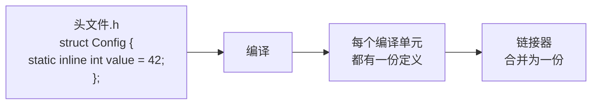
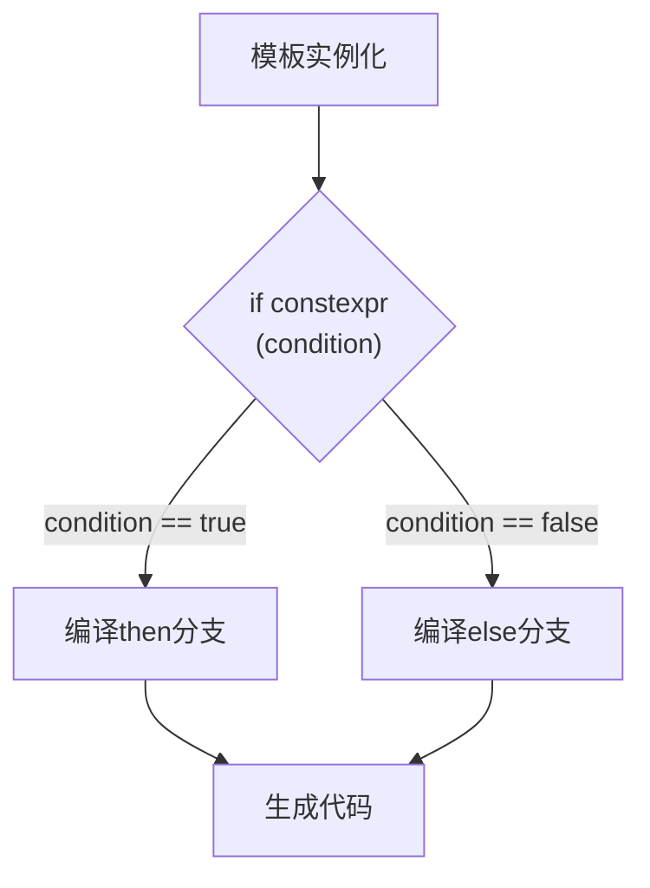
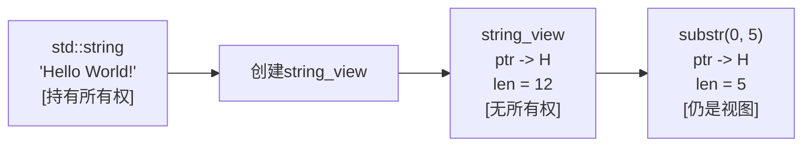
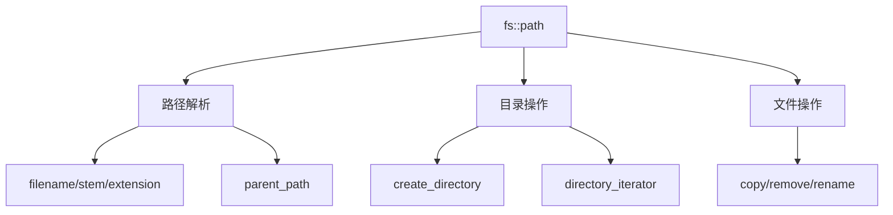

+++
title = "第25章 C++17特性"
weight = 250
date = "2026-03-29T21:03:00+08:00"
type = "docs"
description = ""
isCJKLanguage = true
draft = false
+++
# 第25章 C++17特性

话说2017年，C++标准委员会在佛罗里达召开会议，期间有人提议："要不我们给C++加点料？"于是C++17横空出世，带着一堆让人眼花缭乱的新特性，从此改变了C++程序员的编码生活。

如果说C++11是"文艺复兴"，C++14是"小修小补"，那C++17就是"全面进化"！这一版本的特性多到可以写一本书——好消息是我们这章只讲精华，坏消息是精华还是有点多。

准备好你的咖啡（或者茶，C++程序员不挑），让我们一起探索C++17的奇妙世界！

## 25.1 结构化绑定

### 25.1.1 什么是结构化绑定？

结构化绑定（Structured Bindings）是C++17最闪耀的明星特性之一，它可以让你用一行代码同时声明多个变量，简直是"懒癌晚期"程序员的福音！

想象一下，没有结构化绑定之前，你想从`std::pair`里取出两个值，得这样写：

```cpp
std::pair<int, std::string> p(1, "one");
int key = p.first;
std::string value = p.second;
```

而有了结构化绑定，一行搞定：

```cpp
auto [key, value] = p;  // 优雅，太优雅了！
```

这就像是给变量们举办了一场"集体婚礼"——`key`和`value`喜结连理，从此幸福地生活在一起。

### 25.1.2 工作原理图解

```mermaid
graph TB
    A["std::pair<int, std::string>"] --> B["结构化绑定"]
    B --> C["auto [key, value] = p;"]
    C --> D["key = 1 (int)"]
    C --> E["value = \"one\" (string)"]
```

### 25.1.3 绑定数组

数组也能玩结构化绑定，而且玩法相当任性：

```cpp
#include <iostream>
#include <map>
#include <tuple>

int main() {
    // 结构化绑定：同时声明多个变量
    // C++17最重要的特性之一
    
    // 绑定数组
    int arr[] = {1, 2, 3};
    auto [a, b, c] = arr;  // C++17
    std::cout << "a=" << a << ", b=" << b << ", c=" << c << std::endl;
    // 输出: a=1, b=2, c=3
    
    // 绑定pair
    std::pair<int, std::string> p(1, "one");
    auto [key, value] = p;
    std::cout << "key=" << key << ", value=" << value << std::endl;
    // 输出: key=1, value=one
    
    // 绑定tuple
    std::tuple<int, double, std::string> t(1, 3.14, "hello");
    auto [i, d, s] = t;
    std::cout << "i=" << i << ", d=" << d << ", s=" << s << std::endl;
    // 输出: i=1, d=3.14, s=hello
    
    // 绑定struct
    struct Point { double x, y; };
    Point pt{1.0, 2.0};
    auto [px, py] = pt;
    std::cout << "px=" << px << ", py=" << py << std::endl;
    // 输出: px=1.0, py=2.0
    
    // map遍历
    std::map<std::string, int> m = {{"a", 1}, {"b", 2}};
    for (const auto& [k, v] : m) {
        std::cout << k << " -> " << v << std::endl;
    }
    
    return 0;
}
```

> **小知识**：结构化绑定中的`auto`会自动推导类型，但你也可以使用`const`、`&`、`constexpr`等修饰符，就像使用普通变量一样。

### 25.1.4 绑定pair和tuple

`std::pair`和`std::tuple`是结构化绑定的"最佳拍档"。想象tuple是一个"俄罗斯套娃"，里面装着各种类型的数据。有了结构化绑定，你再也不用`std::get<0>`、`std::get<1>`地疯狂取值了：

```cpp
// 之前：痛苦的回忆
std::tuple<int, double, std::string> t(1, 3.14, "hello");
int i = std::get<0>(t);
double d = std::get<1>(t);
std::string s = std::get<2>(t);

// 现在：优雅如诗
auto [ii, dd, ss] = t;
```

### 25.1.5 绑定struct（自定义类型）

结构化绑定不仅能绑定标准库容器，还能绑定你自定义的结构体！只要你的struct没有私有或受保护的非静态数据成员，就可以使用结构化绑定：

```cpp
struct Point { double x, y; };
Point pt{1.0, 2.0};
auto [px, py] = pt;  // px = 1.0, py = 2.0
```

### 25.1.6 map遍历的神器

如果说前面那些用法只是"有点方便"，那map遍历才是结构化绑定的"真香现场"！

```cpp
std::map<std::string, int> m = {{"apple", 1}, {"banana", 2}};

// 之前：丑陋的迭代器
for (auto it = m.begin(); it != m.end(); ++it) {
    std::cout << it->first << " -> " << it->second << std::endl;
}

// 现在：清爽如初恋
for (const auto& [key, value] : m) {
    std::cout << key << " -> " << value << std::endl;
}
```

这代码，看起来就让人心情愉悦，bug都少了一半！

## 25.2 if/switch初始化语句

### 25.2.1 作用域的革命

C++17之前，`if`语句的条件部分只能是布尔表达式。但有时候我们需要在判断之前先初始化一个变量，然后根据这个变量做判断。这通常意味着你得在`if`外面先声明变量，代码看起来就不那么优雅了。

C++17彻底解决了这个问题！现在你可以在`if`语句的条件前面加一个初始化部分，格式是：

```cpp
if (初始化; 条件) {
    // 代码块
}
```

这就像是给`if`语句配备了一个"私人管家"——先帮你准备好一切，再让你做决定。

### 25.2.2 if with init的实际应用

```cpp
#include <iostream>
#include <optional>
#include <map>

int main() {
    // C++17: if和switch可以有初始化
    // 让变量作用域更清晰
    
    // if with init
    if (auto opt = std::make_optional(42); opt.has_value()) {
        std::cout << "Value: " << *opt << std::endl;
        // 输出: Value: 42
    }
    
    // map find with init
    std::map<int, std::string> m = {{1, "one"}, {2, "two"}};
    if (auto it = m.find(1); it != m.end()) {
        std::cout << "Found: " << it->second << std::endl;
        // 输出: Found: one
    }
    
    // switch with init
    enum Color { Red, Green, Blue };
    Color col = Green;
    
    switch (int val = static_cast<int>(col); val) {
        case Red:   std::cout << "Red" << std::endl; break;
        case Green: std::cout << "Green" << std::endl; break;
        case Blue:  std::cout << "Blue" << std::endl; break;
    }
    
    return 0;
}
```

### 25.2.3 经典场景：map的find

这个用法最经典的场景就是`map`的`find`操作：

```cpp
// 之前：变量作用域泄露到if外面
auto it = m.find(key);
if (it != m.end()) {
    // 使用it
}
// it仍然在作用域内，可能被误用

// C++17：变量作用域被完美封装
if (auto it = m.find(key); it != m.end()) {
    // 使用it，只在这个作用域内有效
}
// it已经不存在了，想误用都没门！
```

> **为什么这很重要？** 限制变量的作用域可以让代码更安全，减少bug的产生。毕竟，一个变量如果只在该出现的地方出现，程序员就不容易在错误的地方使用它。

### 25.2.4 switch with init

`switch`语句也能使用初始化语法，这在与枚举或整数转换配合使用时特别有用：

```cpp
enum Color { Red, Green, Blue };
Color col = Green;

switch (int val = static_cast<int>(col); val) {
    case Red:   std::cout << "Red" << std::endl; break;
    case Green: std::cout << "Green" << std::endl; break;
    case Blue:  std::cout << "Blue" << std::endl; break;
}
```

## 25.3 内联变量

### 25.3.1 头文件里的"孤独患者"

在C++17之前，如果你想在头文件中定义一个静态成员变量，你得在头文件中声明（使用`extern`），然后在某个源文件中定义。这就像是一个"孤独患者"，明明在头文件中声明了，却只能在cpp文件中才能真正"出生"。

```cpp
// Config.h (C++14时代)
struct Config {
    static int value;  // 声明
};

// Config.cpp
int Config::value = 42;  // 定义，否则链接失败
```

这太麻烦了！而且如果你是header-only库（所有代码都在头文件中）的作者，这简直是一场噩梦。

### 25.3.2 inline变量的诞生

C++17带来了`inline`变量，解决了这个长期困扰C++社区的问题：

```cpp
#include <iostream>
#include <string>

// C++17: inline变量
// 可以在头文件中定义，不会产生多个定义错误

struct Config {
    static inline int value = 42;  // inline变量
    static inline std::string name = "Config";
};

inline constexpr int MAX_SIZE = 1000;

int main() {
    std::cout << "Config::value = " << Config::value << std::endl;
    std::cout << "MAX_SIZE = " << MAX_SIZE << std::endl;
    
    return 0;
}
```

### 25.3.3 工作原理



`inline`关键字告诉编译器："这个变量可能会在多个编译单元中出现，别慌，链接器会搞定的，最后只留一份就行。"这和`inline`函数的原理如出一辙——都是解决"多处定义"的问题。

### 25.3.4 constexpr + inline = 完美组合

`inline constexpr`组合是C++17的"黄金搭档"：

```cpp
inline constexpr int MAX_BUFFER_SIZE = 4096;
inline constexpr double PI = 3.14159265358979;
inline constexpr std::array<int, 3> COORDS = {0, 1, 2};
```

这些常量可以在编译期计算，又可以安全地放在头文件中，简直是两全其美！

## 25.4 constexpr if

### 25.4.1 模板的"选择困难症"

在C++17之前，编写模板代码时最头疼的问题之一就是：同一个模板函数，要处理不同类型的参数，但某些代码只对特定类型有效。

比如，你想写一个函数，对整数返回加倍的值，对其他类型原样返回。你可能会这样做：

```cpp
// C++14：使用模板特化或者std::enable_if
template<typename T>
auto process(T value) {
    if (std::is_integral<T>::value) {
        return value * 2;  // 问题：这段代码对浮点数也会编译！
    } else {
        return value;
    }
}
```

但问题是，`value * 2`这一行对浮点数也会编译，如果浮点数类型的`*2`操作不存在，那就悲剧了。

### 25.4.2 constexpr if的魔法

C++17的`constexpr if`彻底解决了这个问题！

```cpp
#include <iostream>
#include <type_traits>

// C++17: constexpr if
// 在编译期根据条件选择代码分支

template<typename T>
auto process(T value) {
    if constexpr (std::is_integral_v<T>) {
        return value * 2;  // 只编译这个分支
    } else {
        return value;  // 丢弃其他分支
    }
}

int main() {
    std::cout << "process(5) = " << process(5) << std::endl;  // 输出: 10
    std::cout << "process(3.14) = " << process(3.14) << std::endl;  // 输出: 3.14
    
    return 0;
}
```

`if constexpr`会在编译时根据条件选择只编译哪个分支，其他分支会被"丢弃"——不是被忽略，而是根本不会编译！

### 25.4.3 原理解析



### 25.4.4 实际应用场景

`constexpr if`在模板元编程中有大量应用，例如实现"类型特征检测"：

```cpp
template<typename T>
auto getSize(T& obj) {
    if constexpr (std::is_array_v<T>) {
        return std::extent_v<T>;  // 数组大小
    } else if constexpr (std::is_pointer_v<T>) {
        return -1;  // 指针无法获取大小
    } else {
        return sizeof(T);  // 其他类型
    }
}
```

## 25.5 折叠表达式

### 25.5.1 可变参数模板的"世纪难题"

可变参数模板（Variadic Templates）是C++11引入的强大特性，但它有一个问题：如果你想对参数包进行运算，比如求和，你得写一个递归的展开方式，写起来相当繁琐。

```cpp
// C++14时代的求和
template<typename T>
T sum(T v) {
    return v;
}

template<typename T, typename... Args>
T sum(T first, Args... args) {
    return first + sum(args...);
}
```

这代码看起来就像是在和编译器玩"躲猫猫"！

### 25.5.2 C++17的折叠表达式救星

C++17引入了折叠表达式，让可变参数模板的使用变得异常简单：

```cpp
#include <iostream>

// C++17: 折叠表达式
// 计算参数包

template<typename... Args>
auto sum(Args... args) {
    return (... + args);  // 一元左折叠
}

template<typename... Args>
void print(Args... args) {
    (std::cout << ... << args) << '\n';  // 一元左折叠
}

template<typename T, typename... Args>
bool allOf(T pred, Args... args) {
    return (pred(args) && ...);  // 二元左折叠
}

int main() {
    std::cout << "sum(1,2,3,4,5) = " << sum(1, 2, 3, 4, 5) << std::endl;
    // 输出: 15
    
    print("Hello", ' ', "World", '!', '\n');
    // 输出: Hello World!
    
    std::cout << std::boolalpha;
    std::cout << "allOf(>0, 1,2,3) = " << allOf([](int x) { return x > 0; }, 1, 2, 3) << std::endl;
    // 输出: true
    
    return 0;
}
```

### 25.5.3 折叠表达式的四种形式

折叠表达式有四种基本形式：

| 形式 | 表达式 | 展开结果 |
|------|--------|----------|
| 一元左折叠 | `( ... op pack )` | `(((pack1 op pack2) op pack3) ... op packN)` |
| 一元右折叠 | `( pack op ... )` | `(pack1 op (pack2 op (pack3 ... op packN)))` |
| 二元左折叠 | `( init op ... op pack )` | `(((init op pack1) op pack2) op ... op packN)` |
| 二元右折叠 | `( pack op ... op init )` | `(pack1 op (pack2 op (... op (packN op init))))` |

```cpp
// 一元左折叠
template<typename... Args>
auto sum(Args... args) {
    return (... + args);  // (((1 + 2) + 3) + 4) + 5 = 15
}

// 一元右折叠
template<typename... Args>
auto sumR(Args... args) {
    return (args + ...);  // 1 + (2 + (3 + (4 + 5))) = 15
}

// 二元左折叠
template<typename... Args>
auto sumInit(int init, Args... args) {
    return (init + ... + args);  // ((0 + 1) + 2) + 3 + 4 + 5 = 15
}

// 二元右折叠
template<typename... Args>
auto concat(Args... args) {
    return ("" + ... + args);  // 二元左折叠: (("" + "a") + "b") + "c" = "abc"
}
```

### 25.5.4 实际应用

```cpp
// 打印所有参数
template<typename... Args>
void printAll(Args... args) {
    ((std::cout << args << ' '), ...);  // 逗号表达式折叠
}

// 检查所有条件是否满足
template<typename... Conds>
bool all(Conds... conds) {
    return (... && conds);
}

// 检查任意条件是否满足
template<typename... Conds>
bool any(Conds... conds) {
    return (... || conds);
}
```

## 25.6 类模板参数推导CTAD

### 25.6.1 告别冗长的模板参数

在C++17之前，创建模板类的实例必须显式指定模板参数：

```cpp
std::pair<int, std::string> p(1, "one");  // 必须写类型
std::vector<int> v{1, 2, 3};  // 必须写类型
```

这在编写泛型代码时特别繁琐。C++17引入了类模板参数推导（Class Template Argument Deduction，简称CTAD），让编译器自动帮你推导类型！

```cpp
#include <iostream>
#include <pair>
#include <vector>

// C++17: 类模板参数推导

int main() {
    // 不需要显式指定模板参数
    std::pair p(1, "one");  // 推导为pair<int, const char*>
    std::cout << "p.first = " << p.first << std::endl;  // 输出: 1
    
    std::vector v{1, 2, 3, 4, 5};  // 推导为vector<int>
    std::cout << "v.size() = " << v.size() << std::endl;  // 输出: 5
    
    // 推导指南（可以自定义）
    // struct Point {
    //     T x, y;
    //     Point(T x, T y) : x(x), y(y) {}
    // };
    // Point p2(1.0, 2.0);  // 推导为Point<double>
    
    return 0;
}
```

### 25.6.2 CTAD推导规则

编译器会根据构造函数的参数推导模板参数：

```cpp
std::pair p(1, "one");
// 推导为 std::pair<int, const char*>
// 因为第一个参数是int，第二个是const char*

std::vector v{1, 2, 3};
// 推导为 std::vector<int>
// 因为初始化列表中的元素都是int

std::array arr{1, 2, 3, 4};
// 推导为 std::array<int, 4>
// 元素类型int，大小4
```

### 25.6.3 自定义推导指南

如果编译器的自动推导不满足你的需求，你可以定义自己的推导指南：

```cpp
struct Point {
    double x, y;
    Point(double x, double y) : x(x), y(y) {}
};

// C++17: CTAD自动推导，不需要显式写推导指南
Point p(1.0, 2.0);  // 编译器自动推导为Point，x=1.0, y=2.0
```

## 25.7 std::string_view

### 25.7.1 零拷贝字符串视图

在C++17之前，如果你有一个函数需要处理字符串，你通常有两个选择：

1. 接收`std::string`（需要拷贝）
2. 接收`const std::string&`（避免了拷贝，但要求调用者必须用`std::string`）

`std::string_view`解决了第三个选择：既不拷贝，又能接受任何字符串类型！

```cpp
#include <iostream>
#include <string_view>

void printFirst(std::string_view sv) {
    if (!sv.empty()) {
        std::cout << "First char: " << sv[0] << std::endl;
    }
}

int main() {
    // C++17: std::string_view
    // 非拥有型字符串视图，零拷贝
    
    std::string_view sv1 = "Hello, World!";
    std::cout << "sv1: " << sv1 << std::endl;
    // 输出: sv1: Hello, World!
    
    // 从string创建
    std::string s = "Hello";
    std::string_view sv2 = s;
    
    // 子字符串视图（零拷贝）
    std::string_view sub = sv1.substr(0, 5);
    std::cout << "sub: " << sub << std::endl;  // 输出: sub: Hello
    
    // 查找
    auto pos = sv1.find("World");
    if (pos != std::string_view::npos) {
        std::cout << "Found 'World' at " << pos << std::endl;
        // 输出: Found 'World' at 7
    }
    
    return 0;
}
```

### 25.7.2 string_view的工作原理

`std::string_view`就像是一个"窗户"，它只包含两个东西：

1. **指向数据的指针**（`const char*`）
2. **数据长度**（`size_t`）



> **重要提醒**：`string_view`不拥有数据！它只是一个"视图"。这意味着如果原字符串被销毁或修改，`string_view`就会变成" dangling pointer"（悬空指针），访问它会导致未定义行为。使用时务必确保原字符串的生命周期覆盖`string_view`的使用周期。

### 25.7.3 性能优化神器

`std::string_view`最适合的场景是函数参数——你写一个函数要处理字符串，但不需要修改它：

```cpp
// 之前：限制了调用方式
void process(const std::string& s);

// C++17：更加通用
void process(std::string_view s);

// 两种调用都可以：
std::string str = "Hello";
process(str);           // OK
process("Hello");       // OK
process(str.data(), 5); // OK
```

## 25.8 std::optional、std::variant、std::any

见第22章详细说明。

## 25.9 文件系统库std::filesystem

### 25.9.1 C++终于有文件系统了！

在C++17之前，如果你想操作文件系统（创建目录、遍历文件夹、判断文件是否存在等），你只能：

1. 使用平台相关的API（Windows的`CreateDirectory`，Linux的`mkdir`）
2. 使用第三方库（如Boost.Filesystem）
3. 自己封装一套跨平台的文件操作

C++17终于带来了标准化的文件系统库——`std::filesystem`！从此妈妈再也不用担心我的跨平台代码了！

```cpp
#include <iostream>
#include <filesystem>

int main() {
    // C++17: std::filesystem
    namespace fs = std::filesystem;
    
    // 当前路径
    std::cout << "Current path: " << fs::current_path() << std::endl;
    
    // 路径操作
    fs::path p = "/home/user/documents/file.txt";
    std::cout << "filename: " << p.filename() << std::endl;  // file.txt
    std::cout << "stem: " << p.stem() << std::endl;  // file
    std::cout << "extension: " << p.extension() << std::endl;  // .txt
    std::cout << "parent: " << p.parent_path() << std::endl;  // /home/user/documents
    
    return 0;
}
```

### 25.9.2 fs::path的常用操作

`fs::path`是文件系统库的核心，它提供了丰富的路径操作：

```cpp
fs::path p = "/home/user/documents/report.pdf";

p.filename();        // "report.pdf" - 文件名
p.stem();            // "report" - 不带扩展名的文件名
p.extension();       // ".pdf" - 扩展名
p.parent_path();     // "/home/user/documents" - 父目录
p.root_name();       // "" (Unix) 或 "C:" (Windows)
p.root_directory();  // "/" (Unix) 或 "\" (Windows)
p.root_path();       // "/" (Unix) 或 "C:\\" (Windows)

// 路径拼接
fs::path full = p.parent_path() / "backup" / "report.pdf";

// 判断
p.is_absolute();     // true
p.is_relative();     // false
```

### 25.9.3 目录操作

```cpp
namespace fs = std::filesystem;

// 创建目录
fs::create_directory("./new_dir");

// 递归创建目录
fs::create_directories("./a/b/c/d/");

// 遍历目录
for (const auto& entry : fs::directory_iterator("./")) {
    std::cout << entry.path() << std::endl;
    std::cout << "is regular file: " << entry.is_regular_file() << std::endl;
}

// 判断文件是否存在
if (fs::exists("file.txt")) {
    // 文件存在
}

// 获取文件大小
if (fs::is_regular_file("file.txt")) {
    auto size = fs::file_size("file.txt");
    std::cout << "File size: " << size << std::endl;
}

// 复制文件
fs::copy_file("source.txt", "dest.txt");

// 删除文件/目录
fs::remove("temp.txt");
```

### 25.9.4 文件系统流程图



## 25.10 并行算法

### 25.10.1 多核时代的C++

在这个"核心数量比程序员头发还多"的时代，如何充分利用多核CPU成了每个C++程序员的必修课。C++17在`<algorithm>`头文件中引入了并行算法的支持，让你能轻松地利用多核进行并行计算！

```cpp
#include <iostream>
#include <vector>
#include <algorithm>
#include <execution>

int main() {
    // C++17: 并行算法
    // 添加<execution>头文件
    
    std::vector<int> v(1000000);
    std::iota(v.begin(), v.end(), 1);
    
    // 并行排序
    std::sort(std::execution::par, v.begin(), v.end());
    
    // 并行transform
    std::vector<int> result(v.size());
    std::transform(std::execution::par, v.begin(), v.end(), result.begin(),
                   [](int x) { return x * 2; });
    
    std::cout << "Parallel algorithms available in C++17" << std::endl;
    std::cout << "First 5 doubled: ";
    for (int i = 0; i < 5; ++i) {
        std::cout << result[i] << " ";  // 输出: 2 4 6 8 10
    }
    std::cout << std::endl;
    
    return 0;
}
```

### 25.10.2 执行策略

`<execution>`头文件定义了三种执行策略：

| 策略 | 说明 |
|------|------|
| `std::execution::seq` | 顺序执行（确定性，但慢） |
| `std::execution::par` | 并行执行（多核加速） |
| `std::execution::par_unseq` | 并行+向量化（最高性能，但需注意线程安全） |

```cpp
// 使用并行策略
std::sort(std::execution::par, v.begin(), v.end());
std::transform(std::execution::par, begin, end, result.begin(), func);
std::reduce(std::execution::par, begin, end);  // 并行归约
std::for_each(std::execution::par, begin, end, func);
```

### 25.10.3 并行算法支持的函数

C++17并行化了许多标准算法：

```cpp
// 排序
std::sort(par, begin, end);
std::stable_sort(par, begin, end);
std::nth_element(par, begin, nth, end);

// 查找
std::find(par, begin, end, value);
std::count(par, begin, end, value);
std::binary_search(par, begin, end, value);

// 变换
std::transform(par, begin, end, result, op);
std::replace(par, begin, end, old_val, new_val);

// 归约
std::reduce(par, begin, end);  // 并行求和
std::accumulate(begin, end, init);  // 顺序求和（更安全）
```

> **性能提示**：并行算法并非总是更快。对于小数据量，线程创建的开销可能反而拖慢速度。一般建议数据量较大（>10000元素）时使用并行策略。

## 25.11 std::byte

### 25.11.1 告别char的歧义

在C++17之前，如果你想表示"原始字节数据"，你通常会用`char`或`unsigned char`。但问题是`char`有歧义——它既可以表示字符，也可以表示字节。

C++17引入了`std::byte`来专门解决这个问题！

```cpp
#include <iostream>
#include <cstddef>

int main() {
    // C++17: std::byte
    // 代替char用于表示原始字节
    
    std::byte b1{0xFF};
    std::byte b2{0x00};
    
    // 位运算
    auto b3 = b1 | b2;
    auto b4 = b1 & b2;
    auto b5 = b1 ^ b2;
    
    std::cout << "std::byte operations work!" << std::endl;
    
    return 0;
}
```

### 25.11.2 std::byte的特点

`std::byte`有以下几个特点：

1. **不是字符类型**：它专门用于表示二进制数据
2. **只支持位运算**：不支持算术运算（加减乘除）
3. **类型安全**：不能隐式转换为整数类型

```cpp
std::byte b{42};  // OK

// 以下都是错误的：
// int x = b;           // 错误！不能隐式转换
// std::cout << b;      // 错误！不能直接输出
// b + 1;               // 错误！不支持算术运算
// ~b;                  // 错误！不支持按位取反
// b << 1;              // 错误！不支持移位运算

// 正确的用法：
int x = std::to_integer<int>(b);  // 显式转换
b | b2;   // OK！支持位或
```

### 25.11.3 为什么需要std::byte？

```cpp
// 之前：用char表示字节
void processData(char* data, size_t size);

// 现在：用std::byte更清晰
void processData(std::byte* data, size_t size);

// 编译器一眼就能看出这是处理原始字节，不是字符串！
```

## 25.12 嵌套命名空间定义

### 25.12.1 命名空间的"套娃"

在C++17之前，如果你想定义嵌套的命名空间，得这样写：

```cpp
namespace A {
    namespace B {
        namespace C {
            int value = 42;
        }
    }
}
```

这简直就是在玩"套娃"游戏！而且每次你想访问最内层的命名空间，就得写一长串的`A::B::C::`。

### 25.12.2 C++17的简洁语法

C++17允许你用`::`直接定义嵌套命名空间：

```cpp
#include <iostream>

// C++17: 嵌套命名空间可以简写
namespace A::B::C {
    int value = 42;
}

// 之前需要这样写：
// namespace A { namespace B { namespace C { ... } } }

int main() {
    std::cout << "A::B::C::value = " << A::B::C::value << std::endl;
    // 输出: 42
    
    return 0;
}
```

### 25.12.3 实际应用

```cpp
// 组织大型项目的命名空间
namespace myapp::database::mysql {
    class Connection { /* ... */ };
}

namespace myapp::database::postgresql {
    class Connection { /* ... */ };
}

namespace myapp::utils::math {
    double pi = 3.14159;
}

// 使用
myapp::database::mysql::Connection conn;
```

> **小贴士**：这种语法不仅简化了定义，也简化了声明。在头文件中，嵌套命名空间的声明也可以用这种方式，让代码更整洁。

## 25.13 本章小结

C++17是C++标准库发展历程中的一座重要里程碑，引入了大量让代码更简洁、更安全、更高效的特性。

### 25.13.1 核心特性回顾

| 特性 | 用途 | 亮点 |
|------|------|------|
| **结构化绑定** | 同时声明多个变量 | 绑定数组、pair、tuple、struct，map遍历神器 |
| **if/switch初始化** | 限制变量作用域 | 让if语句自带"管家"，封装变量 |
| **内联变量** | 头文件中定义变量 | header-only库的救星 |
| **constexpr if** | 编译期条件选择 | 模板元编程的革命性工具 |
| **折叠表达式** | 可变参数模板计算 | 一行代码完成参数包运算 |
| **CTAD** | 类模板参数推导 | 告别冗长的模板参数声明 |
| **std::string_view** | 非拥有型字符串视图 | 零拷贝字符串处理 |
| **std::filesystem** | 标准化文件系统操作 | 跨平台文件操作成为可能 |
| **并行算法** | 多核并行计算 | 一行代码实现并行化 |
| **std::byte** | 专用的字节类型 | 告别char的歧义 |
| **嵌套命名空间** | 简化命名空间定义 | 代码更简洁 |

### 25.13.2 实际建议

1. **结构化绑定**是最常用的特性，在遍历map、分解pair/tuple时强烈推荐使用
2. **if with init**能让代码更安全，建议优先在map.find等场景使用
3. **inline变量**对于header-only库是必备特性
4. **constexpr if**是模板元编程的利器，但要注意编译错误可能变得更隐蔽
5. **string_view**虽然方便，但要注意生命周期，避免悬空指针
6. **并行算法**不是万能的，小数据量可能反而更慢
7. **filesystem**库虽然功能强大，但某些操作可能不如平台API完善，使用前建议测试

### 25.13.3 幽默总结

如果C++17是一个超级英雄电影，那它的角色分工大概是这样的：

- **结构化绑定**是那个被所有人喜欢的超级英雄——出场自带光环
- **if/switch初始化**是那个默默无闻但超级实用的技术宅
- **inline变量**是header-only库的救世主
- **constexpr if**是模板大师的终极武器
- **折叠表达式**是可变参数模板的救星
- **CTAD**是让代码更简洁的清新剂
- **std::string_view**是零拷贝大师
- **std::filesystem**是终于学会文件操作的程序员
- **并行算法**是充分利用多核的发烧友
- **std::byte**是告别歧义的强迫症患者
- **嵌套命名空间**是讨厌写长代码的懒人

C++17让C++变得更现代、更安全、更高效。但记住，工具再好，也得会用才行。继续练习，继续探索，让这些特性在你的代码中发光发热吧！

> **下章预告**：C++20带来了更多激动人心的特性，包括概念（Concepts）、协程（Coroutines）、模块（Modules）等，敬请期待第26章！
