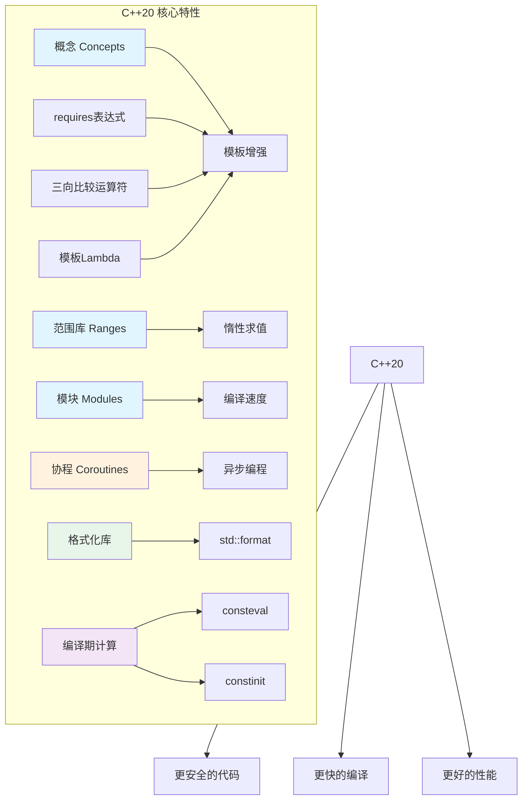

+++
title = "第26章 C++20特性"
weight = 260
date = "2026-03-29T21:03:00+08:00"
type = "docs"
description = ""
isCJKLanguage = true
draft = false
+++
# 第26章 C++20特性

如果说C++11是C++的文艺复兴，C++17是它的改革开放，那么C++20就是它的工业革命！这一代标准引入了概念（Concepts）、协程（Coroutines）、模块（Modules）等革命性特性，让C++从"拿着锤子找钉子"的莽撞大汉，变成了一个会思考、善表达的优雅绅士。

> C++20的口号是："让模板元编程不再是黑魔法，让并发编程不再是杂技表演。"

本章我们就来逐一揭开C++20的神秘面纱，看看这位"成熟稳重"的新版本C++到底带来了哪些让人眼前一亮（或者说眼前一黑？）的新特性。

---

## 26.1 概念（Concepts）与约束

### 26.1.1 概念的定义与使用

**概念（Concepts）** 是C++20引入的一种**约束模板参数类型要求**的机制。你可以把它想象成模板参数的"准入考试"——只有通过了考试（满足特定条件）的类型才能使用这个模板。

打个比方：你开了一家餐厅，招聘厨师时要求"会颠勺"和"能吃辣"。**概念**就是这两条招聘要求，而具体某个厨师（类型）能不能来上班，就看他满不满足这些要求。

### 标准概念库

C++20在`<concepts>`头文件中为我们准备了一系列"预制试卷"，也就是**标准概念库**。常见的包括：

- `std::integral<T>`：检查T是否是整数类型
- `std::floating_point<T>`：检查T是否是浮点类型（C++23新增，C++20需用`std::is_floating_point_v<T>`）
- `std::movable<T>`：检查T是否可移动
- `std::copyable<T>`：检查T是否可拷贝
- `std::default_initializable<T>`：检查T是否可默认构造

```cpp
#include <iostream>
#include <concepts>

// C++20: 概念（Concepts）- 约束模板参数的类型要求

// 定义概念：就像写招聘要求
// Numeric概念：必须是整数类型或者浮点数类型，二者满足其一即可
// 注意：std::floating_point 是 C++23 才有的概念！
// C++20 中可以用 std::is_floating_point_v<T> 或仅用 std::integral 来约束
// 以下示例使用 C++20 兼容写法（仅约束整数），实际项目请根据编译器标准版本选择
template<typename T>
concept Numeric = std::integral<T>;  // C++20 中浮点数概念需用 type_traits 或升级到 C++23

// Addable概念：必须是两个T可以相加的类型
// requires表达式是C++20的"复杂问询台"，能检查更细致的条件
template<typename T>
concept Addable = requires(T a, T b) {
    a + b;  // T必须支持+运算符，否则这个概念就不满足
};

// 使用概念约束模板参数：相当于在模板函数上加了"入场券检查"
template<Numeric T>  // 只有满足Numeric概念的类型才能调用这个函数
T add(T a, T b) {
    return a + b;
}

template<Addable T>  // 只有满足Addable概念的类型才能调用这个函数
T twice(T x) {
    return x + x;
}

int main() {
    // 调用add函数，传入整数
    std::cout << "add(1, 2) = " << add(1, 2) << std::endl;  // 输出: 3

    // 如果需要同时支持浮点数，C++20中需要另外定义一个概念或使用 requires 表达式
    // C++23 起可直接使用 std::floating_point 概念

    // 如果尝试传入字符串？编译器会直接报错："你的类型不满足要求，禁止入内！"

    return 0;
}
```

### requires表达式

**requires表达式**是C++20的"高级侦探"，能够检查类型是否具有某些能力。它的语法看起来有点像魔法咒语，但其实很有规律：

```cpp
#include <iostream>
#include <concepts>

// requires表达式：定义更复杂的要求
// 这个Hashable概念检查类型T是否能被哈希（用于unordered_map等容器）
template<typename T>
concept Hashable = requires(T a) {
    std::hash<T>{}(a);  // T必须能被哈希，就像必须有"身份证号"才能办会员卡
};

// 组合要求：用大括号{}包围每个表达式检查，用->指定返回值类型要求
template<typename T>
concept Comparable = requires(T a, T b) {
    { a == b } -> std::convertible_to<bool>;  // a==b必须返回bool（或可转换为bool）
    { a != b } -> std::convertible_to<bool>;  // a!=b同理
    { a < b } -> std::convertible_to<bool>;    // a<b也必须返回bool
};

int main() {
    std::cout << "requires expressions allow complex type constraints" << std::endl;
    std::cout << "（requires表达式允许复杂类型约束）" << std::endl;
    
    // 小提示：如果类型不满足概念，编译器会报错，并告诉你具体哪里不满足
    // 这比以前的模板错误信息（动辄几百行）友好多了！
    
    return 0;
}
```

> **冷知识**：在C++20之前，如果你写了一个模板，传入错误类型，编译器会吐出一大堆天书般的错误信息，从第1行到第999行，看得人头皮发麻。有了Concepts之后，错误信息会精简很多，告诉你"类型T不满足概念X的要求"，而不是让你在茫茫错误海洋中自己捞针。

```cpp
#include <iostream>
#include <concepts>
#include <vector>

int main() {
    // C++20标准概念库 - 官方"验证工具箱"
    std::cout << std::boolalpha;  // 开启布尔显示模式：true/false而不是1/0
    
    // integral概念：检查是否是整数类型
    std::cout << "std::integral<int>: " << std::integral<int> << std::endl;  // 输出: true（int是整数）
    std::cout << "std::integral<double>: " << std::integral<double> << std::endl;  // 输出: false（double不是整数）
    
    // movable概念：检查是否可移动（能不能用std::move）
    std::cout << "std::movable<std::vector<int>>: " 
              << std::movable<std::vector<int>> << std::endl;  // 输出: true（vector可移动）
    
    // copyable概念：检查是否可拷贝
    std::cout << "std::copyable<std::vector<int>>: " 
              << std::copyable<std::vector<int>> << std::endl;  // 输出: true（vector可拷贝）
    
    // default_initializable概念：检查是否可默认构造
    std::cout << "std::default_initializable<int>: " 
              << std::default_initializable<int> << std::endl;  // 输出: true（int可默认构造）
    
    return 0;
}
```

---

## 26.2 范围库（Ranges）

### 26.2.1 范围管道操作

**范围库（Ranges）** 是C++20最令人兴奋的特性之一！它让算法的组合变得像搭积木一样简单有趣。

想象一下：你有一堆积木（数据），想筛选出红色的、堆成塔形的、取前5个。如果用传统方式，你需要写三层循环；如果用STL算法，你需要嵌套调用；而用Ranges，你可以像搭管道一样：

```cpp
#include <iostream>
#include <vector>
#include <ranges>

int main() {
    // C++20: Ranges库 - 惰性求值的算法组合
    // 想象一下：这个库让你能像水管工一样连接数据流
    
    std::vector<int> v = {1, 2, 3, 4, 5, 6, 7, 8, 9, 10};
    
    // 管道操作：数据从左到右流过每个"过滤器"
    // 就像 Unix 的管道符 | 一样，数据被一步步"加工"
    auto result = v 
        | std::views::filter([](int x) { return x % 2 == 0; })  // 第1步：过滤，只保留偶数
        | std::views::transform([](int x) { return x * x; })     // 第2步：转换，每个数平方
        | std::views::take(3);                                   // 第3步：取前3个
    
    std::cout << "偶数的平方（取前3个）: ";
    for (int x : result) {
        std::cout << x << " ";  // 输出: 4 16 36
    }
    std::cout << std::endl;
    
    // 对比传统方式：
    // std::vector<int> filtered;
    // std::copy_if(v.begin(), v.end(), std::back_inserter(filtered), 
    //     [](int x){ return x % 2 == 0; });
    // std::vector<int> transformed;
    // std::transform(filtered.begin(), filtered.end(), std::back_inserter(transformed),
    //     [](int x){ return x * x; });
    // ... 看到这里你是不是已经想放弃了？
    
    return 0;
}
```

### 26.2.2 惰性求值

Ranges最妙的地方在于**惰性求值（Lazy Evaluation）**——不在创建视图时计算，只在真正需要结果时才计算。

这就像点外卖：你不饿的时候不会真的去厨房做饭，只有当你开始吃了，系统才开始炒菜。

```cpp
#include <iostream>
#include <vector>
#include <ranges>

int main() {
    // C++20 Ranges的视图是惰性求值的
    // 不在创建时计算，在迭代时才计算
    // 这就像"预览"功能：先看看要处理什么，实际处理要等真正迭代
    
    std::vector<int> v{1, 2, 3, 4, 5};
    
    // 创建视图：这时候只是在"规划路线"，并没有真正执行transform
    // 就像你制定旅游计划，但人还在家里坐着
    auto view = v | std::views::transform([](int x) {
        std::cout << "正在转换数字: " << x << std::endl;  // 这个打印暂时不会发生
        return x * 2;
    });
    
    std::cout << "视图已创建，尚未执行转换（你还在沙发上）" << std::endl;
    
    // 现在开始迭代，才真正执行转换操作
    // 这就像你终于出门了，旅游计划开始执行
    std::cout << "===== 第一次迭代 =====" << std::endl;
    for (int x : view) {
        std::cout << "收到结果: " << x << std::endl;
    }
    
    std::cout << "===== 迭代完毕 =====" << std::endl;
    
    return 0;
}
```

运行结果会显示"正在转换数字"的打印只在迭代时出现，而不是在创建视图时。

> **生活类比**：惰性求值就像自动售卖机——你不投币，商品不会掉出来。Ranges视图就是那台等待你操作的机器，迭代就是投币动作。

---

## 26.3 协程（Coroutines）

### 26.3.1 co_await

**协程（Coroutines）** 是C++20最"未来感"的特性，简单来说就是"可以暂停和恢复的函数"。想象一下你去餐厅点餐，服务员说"您稍等，我去后厨看看"，然后他跑去后厨忙别的了，等菜好了再回来给你上菜——这就是协程的工作模式。

```cpp
#include <iostream>
#include <coroutine>

// C++20协程是实验性功能，需要编译器支持
// 此示例展示协程语法结构，但实际运行需要特殊编译器配置

// 定义一个协程类型，需要包含promise_type
struct HelloCoroutine {
    // promise_type 是协程的"大管家"，负责管理协程的生命周期
    struct promise_type {
        // get_return_object：返回协程的最终结果对象
        HelloCoroutine get_return_object() { return HelloCoroutine{}; }
        
        // initial_suspend：协程开始前的行为
        // suspend_never = 不暂停，立即执行
        // suspend_always = 暂停，等待恢复
        std::suspend_never initial_suspend() { return {}; }
        
        // final_suspend：协程结束后的行为
        std::suspend_never final_suspend() noexcept { return {}; }
        
        // return_void：协程正常结束时返回什么
        void return_void() {}
        
        // unhandled_exception：处理未被捕获的异常
        void unhandled_exception() {}
    };
};

// 定义一个简单的协程函数
HelloCoroutine hello() {
    std::cout << "Hello" << std::endl;
    
    // co_await：挂起协程（是否实际暂停由awaitable对象决定）
    // suspend_never{} 创建一个"永不暂停"的对象，所以这行不会真的暂停
    // （实际使用时这里通常是某个异步操作）
    co_await std::suspend_never{};
    
    std::cout << "World" << std::endl;
}

int main() {
    std::cout << "C++20 coroutines（协程是实验性功能）" << std::endl;
    std::cout << "注意：协程需要编译器flags支持（如 -fcoroutines）" << std::endl;
    // hello();  // 如果编译器支持，实际调用会打印 Hello World
    
    return 0;
}
```

### 26.3.2 co_yield

**co_yield** 用于**生成器模式**，想象成一个"会自动补货的自动售货机"——每次你拿走一个商品，机器就会自动生产下一个。

```cpp
#include <iostream>
#include <coroutine>

// co_yield示例：生成器模式
// 这就像一个"数数机器人"，你问它一次，它就往后数一个

struct Generator {
    struct promise_type {
        int current_value = 0;
        
        Generator get_return_object() { 
            return Generator{std::coroutine_handle<promise_type>::from_promise(*this)}; 
        }
        
        std::suspend_always initial_suspend() { return {}; }
        std::suspend_always final_suspend() noexcept { return {}; }
        
        // co_yield会调用这个yield_value
        std::suspend_always yield_value(int value) {
            current_value = value;
            return {};  // 暂停，等待恢复
        }
        
        void return_void() {}
        void unhandled_exception() {}
    };
    
    std::coroutine_handle<promise_type> handle;
    
    explicit Generator(std::coroutine_handle<promise_type> h) : handle(h) {}
    
    ~Generator() { if (handle) handle.destroy(); }
    
    // 获取下一个值并恢复协程
    int next() {
        handle.resume();  // 恢复协程执行
        return handle.promise().current_value;  // 返回yield的值
    }
};

// 一个生成斐波那契数列的协程
Generator fibonacci() {
    int a = 0, b = 1;
    while (true) {
        co_yield a;  // 吐出当前值，然后暂停
        int temp = a;
        a = b;
        b = temp + b;
    }
}

int main() {
    std::cout << "co_yield 用于生成器模式（懒加载序列）" << std::endl;
    std::cout << "斐波那契数列前10个:" << std::endl;
    
    // 实际上需要完整编译器支持才能运行
    // auto gen = fibonacci();
    // for (int i = 0; i < 10; i++) {
    //     std::cout << gen.next() << " ";
    // }
    
    std::cout << "[示例代码，协程需要完整编译器支持]" << std::endl;
    
    return 0;
}
```

### 26.3.3 co_return

**co_return** 用于协程**返回值**，就像普通函数的return，但专门给协程用的：

```cpp
#include <iostream>
#include <coroutine>

// co_return示例：协程返回值

struct AsyncOperation {
    struct promise_type {
        int result = 0;
        
        AsyncOperation get_return_object() { 
            return AsyncOperation{std::coroutine_handle<promise_type>::from_promise(*this)}; 
        }
        std::suspend_always initial_suspend() { return {}; }
        std::suspend_always final_suspend() noexcept { return {}; }
        
        // co_return会触发这个return_value
        void return_value(int v) { result = v; }
        void unhandled_exception() {}
    };
    
    std::coroutine_handle<promise_type> handle;
    
    explicit AsyncOperation(std::coroutine_handle<promise_type> h) : handle(h) {}
    ~AsyncOperation() { if (handle) handle.destroy(); }
    
    int getResult() { return handle.promise().result; }
};

// 模拟异步任务
AsyncOperation asyncTask() {
    std::cout << "正在执行异步任务..." << std::endl;
    // 模拟一些操作...
    co_return 42;  // 返回结果
}

int main() {
    std::cout << "co_return 用于协程返回值" << std::endl;
    std::cout << "[协程示例，需要完整编译器支持]" << std::endl;
    // auto op = asyncTask();
    // std::cout << "结果: " << op.getResult() << std::endl;
    
    return 0;
}
```

### 26.3.4 协程状态机

协程背后其实是一个**状态机（State Machine）**，由编译器自动生成。协程的每次暂停和恢复，本质上就是在状态机中切换状态。

```cpp
#include <iostream>

/*
 * 协程状态机解析
 * 
 * 当你写一个协程函数时，编译器会生成一个隐藏的状态机结构：
 * 
 *                        ┌─────────────────────────┐
 *                        │     Created (创建)      │
 *                        │   协程被调用，帧分配     │
 *                        └───────────┬─────────────┘
 *                                    │
 *                        ┌───────────▼─────────────┐
 *                        │  Initial Suspend        │
 *                        │  (初始化暂停点)          │
 *                        │  执行协程体直到首个暂停点 │
 *                        └───────────┬─────────────┘
 *                                    │
 *              ┌────────────────────┼────────────────────┐
 *              │                    │                    │
 *              ▼                    ▼                    ▼
 *    ┌─────────────────┐  ┌─────────────────┐  ┌─────────────────┐
 *    │   Suspended 1   │  │   Suspended 2   │  │   Suspended N   │
 *    │   (暂停状态1)    │  │   (暂停状态2)    │  │   (暂停状态N)    │
 *    │   co_await等待  │  │   co_yield输出  │  │   其他暂停点     │
 *    └────────┬────────┘  └────────┬────────┘  └────────┬────────┘
 *             │                   │                    │
 *             └───────────────────┼────────────────────┘
 *                                 │ resume()
 *                                 ▼
 *                        ┌─────────────────────────┐
 *                        │      Completed          │
 *                        │     (执行完成)           │
 *                        │   销毁协程帧，释放资源    │
 *                        └─────────────────────────┘
 */

int main() {
    std::cout << "协程状态机是编译器自动生成的" << std::endl;
    std::cout << "每个co_await/co_yield/co_return都是一个暂停点" << std::endl;
    std::cout << "协程帧（Coroutine Frame）存储所有局部变量和状态" << std::endl;
    
    return 0;
}
```

> **警告**：C++20协程目前仍被视为"实验性"功能，只有部分编译器（如GCC 10+、Clang 10+）支持，且需要添加编译标志`-fcoroutines`。在生产环境中使用前，请确保你的项目确实需要协程，并且已经充分测试。

---

## 26.4 模块（Modules）

### 26.4.1 模块基础概念与动机

**模块（Modules）** 是C++20最具颠覆性的特性之一，它试图从根本上改变C++代码的组织方式。想象一下：以前的头文件就像餐厅的开放式厨房——食材、调料、半成品都摆在外面；而模块就像密封的外卖盒——你只需要知道里面是什么，不需要看到它是怎么做的。

**为什么需要模块？**

传统的 `#include` 预处理方式有几个让人头疼的问题：
1. **重复编译**：同一个头文件可能被包含多次，导致相同的代码被编译多次
2. **文本替换**：`#include`本质上是把头文件内容复制粘贴到源文件，优雅二字与它无关
3. **无封装性**：只要包含了头文件，就能访问其中的所有内容，包括你不希望被看到的

模块的出现就是为了解决这些问题！

```cpp
// C++20模块：替代头文件的新的代码组织方式
// 优点：
// - 更好的封装：内部实现对使用者完全隐藏
// - 避免重复编译：模块只编译一次，生成 .ifc 接口文件（Interface File Container）
// - 更快的编译速度：模块接口是二进制的，导入更快

// ============ 文件: hello.cpp（模块实现）============
// export module hello;  // 声明这是一个模块，名为"hello"

export module hello;  // 模块声明：告诉编译器"这是一个可以给别人用的模块"

// export关键字：只有export的内容才对模块外可见
export void greet() {
    // std::cout在这只是占位，实际使用时需要导入std模块
    printf("Hello, Modules!\n");  // 模块内部的实现细节用户看不到
}

// ============ 文件: main.cpp（使用模块）============
// import hello;  // 导入名为"hello"的模块

/*
int main() {
    import hello;  // 导入模块
    greet();       // 调用模块导出的函数
    
    // 注意：模块的好处是导入速度比#include快很多
    // 并且用户看不到greet()函数背后的实现细节
}
*/
```

### 26.4.2 export关键字

**export关键字**在模块系统中有两个作用：

1. `export module 模块名;` — 声明一个模块
2. `export { 要导出的内容 };` — 导出那些希望对模块外部可见的声明

```cpp
// export module：声明模块
export module my_module;  // 声明一个叫 my_module 的模块

// export：导出内容
export int add(int a, int b) {  // 这个函数可以被模块外调用
    return a + b;
}

export class MyClass {  // 整个类都可以导出
public:
    void doSomething();
};

// 不带export的就是模块内部实现，外部看不到
int helperFunction() {  // 这是一个"幕后英雄"，模块外无法访问
    return 42;
}
```

### 26.4.3 import关键字

**import关键字**用于导入模块，就像 `#include` 但更优雅：

```cpp
// import 模块名; 导入模块
import hello;  // 导入hello模块

// import std.core; 导入标准库模块（C++20支持部分标准库模块化）
// 注意：std::cout等需要导入std.core或std.io

int main() {
    greet();  // 调用hello模块中的函数
}
```

### 26.4.4 模块接口单元

**模块接口单元（Module Interface Unit）** 是模块的"门面"，定义了模块对外提供的所有内容。通常放在 `.cppm` 文件中（C++ Module source file）。

```cpp
// ============ 文件: math.cppm（模块接口单元）============
// .cppm 是C++20建议的模块接口文件扩展名

export module math;  // 声明模块

// 导出函数声明
export int add(int a, int b);
export int multiply(int a, int b);

// 导出模板
export template<typename T>
T maxValue(T a, T b) {
    return a > b ? a : b;
}

// 导出类
export class Calculator {
public:
    int add(int a, int b);
    int subtract(int a, int b);
};

// 注意：这里只是声明，具体实现在模块实现单元中
```

### 26.4.5 模块实现单元

**模块实现单元（Module Implementation Unit）** 包含模块的内部实现代码，对外部不可见：

```cpp
// ============ 文件: math.cpp（模块实现单元）============
// 这是math模块的实现，没有export module声明

module math;  // 属于math模块的实现部分

// 实现接口单元中声明的函数
int Calculator::add(int a, int b) {
    return a + b;
}

int Calculator::subtract(int a, int b) {
    return a - b;
}

int add(int a, int b) {
    return a + b;
}
```

### 26.4.6 模块分区

**模块分区（Module Partitions）** 允许把一个模块拆分成多个部分：

```cpp
// 模块分区语法
export module my_module:part1;  // 声明my_module的part1分区
export module my_module:part2;  // 声明my_module的part2分区

// 主模块声明
export module my_module;

// 主模块可以导入自己的分区
import :part1;  // 导入part1分区
import :part2;  // 导入part2分区

// 使用分区中的内容
export void usePart1() {
    part1Function();  // 调用part1中的函数
}
```

### 26.4.7 全局模块片段

**全局模块片段（Global Module Fragment）** 是一种兼容性机制，允许在模块声明前包含传统头文件：

```cpp
module;  // 全局模块片段开始

#include <cstdio>  // 传统头文件，放在这里不影响模块的纯净性
#include <vector>

export module my_module;

// 后续代码都是模块的一部分
export void print() {
    std::printf("Hello from module!\n");
}
```

### 26.4.8 私有模块片段

**私有模块片段（Private Module Fragment）** 允许把一部分实现放在模块接口文件中，但标记为"私有"——外部看不到，但参与模块的编译：

```cpp
export module my_module;

// 公有接口
export int publicAdd(int a, int b);

// 私有实现（私有模块片段）
module;  // 私有片段开始
int privateMultiply(int a, int b) {
    return a * b;
}

int helper(int x) {  // 这些都是私有的
    return x + 1;
}
```

### 26.4.9 模块与头文件对比

```cpp
#include <iostream>
#include <vector>

/*
 * ============ 模块 vs 头文件：世纪对决 ============
 * 
 * 传统头文件方式：
 * ┌─────────────────────────────────────────────────────────────┐
 * │  #include <iostream>                                         │
 * │  #include <vector>                                           │
 * │  #include <string>                                           │
 * │  #include <unordered_map>                                    │
 * │  ... 头文件越多，编译越慢                                      │
 * └─────────────────────────────────────────────────────────────┘
 * 
 * 头文件的"罪行"：
 * 1. 文本替换：#include本质上就是复制粘贴，想想你项目中那些被包含
 *    上千次的<iostream>，编译时间就是这样被吃掉的
 * 2. 重复编译：#ifndef/#pragma once只是避免重复编译，但不能避免
 *    重复处理这些头文件的文本内容
 * 3. 无封装：包含头文件后，private/private的成员函数都能被看到，
 *    想保密？门都没有！
 * 
 * 模块的优势：
 * ┌─────────────────────────────────────────────────────────────┐
 * │  import std.core;  // 二进制模块，速度快                       │
 * │  import my_module;  // 模块只编译一次，到处可用                 │
 * └─────────────────────────────────────────────────────────────┘
 * 
 * 模块的"美德"：
 * 1. 编译一次，多次使用：模块编译后会生成 IFC（模块接口文件），
 *    下次导入时直接读取，不需要重新解析文本
 * 2. 真·封装：模块外根本看不到模块内的东西，除非你明确export
 * 3. 更快的增量编译：修改实现文件不会导致依赖它的所有文件重新编译
 */

int main() {
    std::cout << "模块是C++20的杀手级特性" << std::endl;
    std::cout << "虽然目前支持度还不完美，但它代表了C++的未来方向" << std::endl;
    
    std::vector<int> v{1, 2, 3, 4, 5};  // 依然是传统头文件方式
    for (int x : v) {
        std::cout << x << " ";
    }
    std::cout << std::endl;
    
    return 0;
}
```

---

## 26.5 三向比较运算符`<=>`

**三向比较运算符 `<=>`** 又称"宇宙飞船运算符"（Spaceship Operator），是C++20引入的一个强大特性。它能**同时生成六种比较关系**（`==`, `!=`, `<`, `<=`, `>`, `>=`），大大简化了自定义类型的比较操作。

```cpp
#include <iostream>
#include <compare>

// 三向比较运算符：<=> 返回一个比较结果对象

struct Version {
    int major;  // 主版本号
    int minor;  // 次版本号
    int patch;  // 补丁版本号
    
    // = default 让编译器自动生成默认的三向比较实现
    // 编译器会自动按照成员声明的顺序进行比较
    auto operator<=>(const Version&) const = default;
};

int main() {
    Version v1{1, 2, 3};
    Version v2{1, 2, 3};
    Version v3{1, 3, 0};
    
    std::cout << std::boolalpha;  // 显示 true/false 而不是 1/0
    
    // 自动获得 == 运算符
    std::cout << "v1 == v2: " << (v1 == v2) << std::endl;  // 输出: true
    
    // 自动获得 < 运算符
    std::cout << "v1 < v3: " << (v1 < v3) << std::endl;    // 输出: true
    // 因为 v1.minor(2) < v3.minor(3)，所以 v1 < v3
    
    // 三向比较的结果是一个比较类别（comparison category）类型
    // std::partial_ordering、std::strong_ordering 或 std::weak_ordering
    auto result = v1 <=> v3;
    std::cout << "v1 <=> v3 的结果类型: ";
    if (result < 0) {
        std::cout << "less（小于）" << std::endl;  // 输出: less
    } else if (result > 0) {
        std::cout << "greater（大于）" << std::endl;
    } else {
        std::cout << "equivalent（等价）" << std::endl;
    }
    
    // 默认情况下，== 和 != 是反转的，< 和 > 也是反转的
    std::cout << "v1 != v3: " << (v1 != v3) << std::endl;  // 输出: true
    
    return 0;
}
```

> **趣味比喻**：三向比较运算符就像一个超级比较器，你问它"这两个版本谁更大？"它不仅回答"v1更小"，还顺便告诉你"如果我给v1加1就刚好等于v3"、"如果v1和v3各减1就是相等的"——好吧我夸张了，但意思就是这个意思。

讲完了"比较"，让我们来看看另一个"赋值"相关的重磅特性——指定初始化，让你的初始化代码从此告别"猜位置"的尴尬游戏！

---

## 26.6 指定初始化

**指定初始化（Designated Initializers）** 允许你在创建对象时，通过**成员名字**而不是位置来初始化成员。这在C语言和Python中早已有之，C++20终于把它引入了！

```cpp
#include <iostream>

// 带默认值的结构体
struct Point {
    double x = 0;  // 默认x=0
    double y = 0;  // 默认y=0
};

int main() {
    // C++20: 指定初始化 - 按名字初始化成员
    // 以前你只能这样写：Point p1{1.0, 2.0};
    // 但这样谁能记得住x是第一个还是y是第一个？
    
    // 使用指定初始化，明确告诉编译器每个值给哪个成员
    Point p1{.x = 1.0, .y = 2.0};  // x=1, y=2，清晰明了！
    
    // 只初始化y，x使用默认值
    Point p2{.y = 5.0};            // x=0 (默认), y=5
    
    // 乱序也可以！C语言风格也支持
    Point p3{.y = 3.0, .x = 7.0};  // x=7, y=3
    
    std::cout << "p1: (" << p1.x << ", " << p1.y << ")" << std::endl;  // 输出: (1, 2)
    std::cout << "p2: (" << p2.x << ", " << p2.y << ")" << std::endl;  // 输出: (0, 5)
    std::cout << "p3: (" << p3.x << ", " << p3.y << ")" << std::endl;  // 输出: (7, 3)
    
    return 0;
}
```

> **生活场景**：指定初始化就像填表格时用"姓名：XXX"、"地址：YYY"而不是"第1栏填XXX，第2栏填YYY"——再也不用担心填错位置了！

---

## 26.7 consteval与constinit

C++20引入了两个新的关键字来**控制编译时和初始化行为**：

- **consteval**：强制要求表达式必须在**编译期求值**，否则报错
- **constinit**：确保变量在**静态初始化阶段**被初始化，避免动态初始化顺序问题

```cpp
#include <iostream>

// consteval: 强制编译期求值
// 就像一个"强迫症老师"，必须当场算出答案，不允许抄作业
consteval int compileTimeSquare(int x) {
    return x * x;  // 这个函数必须在编译时就算出结果
}

// constinit: 保证静态初始化
// 就像一个"先到先得"的牌子，确保这个变量第一个被初始化
constinit int globalValue = 42;  // 静态存储期的变量

// 错误示例（编译会失败）：
// consteval int badSquare(int x) {
//     return x * x;
// }
// int main() {
//     int n = 5;
//     int result = badSquare(n);  // 错误！n不是常量表达式
// }

int main() {
    // compileTimeSquare(5) 必须在编译时就算出结果
    constexpr int val = compileTimeSquare(5);  // 编译期：5*5=25
    std::cout << "compileTimeSquare(5) = " << val << std::endl;  // 输出: 25
    
    // constinit 变量可以在运行时使用，但保证先于其他静态变量初始化
    std::cout << "constinit globalValue = " << globalValue << std::endl;  // 输出: 42
    
    // 如果尝试这样写（编译失败）：
    // int runtimeValue = 10;
    // int bad = compileTimeSquare(runtimeValue);  // 错误！
    
    return 0;
}
```

> **记忆口诀**：`consteval` = "const" + "eval"（evaluate）= 常量求值，必须编译期完成；`constinit` = "const" + "init" = 常量初始化，保证静态初始化顺序。

---

## 26.8 模板Lambda

**模板Lambda** 是C++20给Lambda表达式的一项超能力——以前Lambda的参数类型必须是明确的，现在可以用`template<typename T>`来声明类型参数了！

```cpp
#include <iostream>

int main() {
    // C++20: 模板Lambda - Lambda也支持模板参数了！
    
    // 以前（C++17及之前）：Lambda的参数类型必须写死
    // auto oldStyle = [](int x) { return x * 2; };  // 只能接受int
    
    // C++20新写法：Lambda可以使用模板参数
    auto generic = []<typename T>(T x) {  // 注意：template<> 要放在 lambda 前面
        return x * 2;
    };
    
    // 现在这个Lambda可以接受任何支持乘法运算的类型！
    std::cout << "generic(5) = " << generic(5) << std::endl;  // 输出: 10
    std::cout << "generic(3.14) = " << generic(3.14) << std::endl;  // 输出: 6.28
    
    // 甚至可以这样玩：
    auto add = []<typename T>(T a, T b) -> T {
        return a + b;
    };
    
    std::cout << "add(100, 200) = " << add(100, 200) << std::endl;  // 输出: 300
    std::cout << "add(1.5, 2.5) = " << add(1.5, 2.5) << std::endl;  // 输出: 4
    
    return 0;
}
```

> **想象一下**：模板Lambda就像是Lambda的"变身卡"，用了它之后，Lambda就可以在调用时根据传入参数的类型自动变身対応，再也不用担心类型不匹配的问题了！

---

## 26.9 std::format格式化库

**std::format** 是C++20引入的格式化库，灵感来自Python的`f-string`，终于让C++有了像样的字符串格式化！

```cpp
#include <iostream>
#include <format>  // C++20格式化库

int main() {
    // C++20: std::format - Python风格的格式化
    // 告别 sprintf 的不安全，告别 stringstream 的繁琐
    
    // 基础用法：{} 是占位符，按顺序填入参数
    std::cout << std::format("Hello, {}!", "World") << std::endl;  // 输出: Hello, World!
    
    // 数字进制转换
    // :d = 十进制, :x = 十六进制, :b = 二进制
    std::cout << std::format("十进制: {:d}, 十六进制: {:x}, 二进制: {:b}", 42, 42, 42) << std::endl;
    // 输出: 十进制: 42, 十六进制: 2a, 二进制: 101010
    
    // 浮点数格式化
    // :.2f = 保留2位小数
    std::cout << std::format("{:.2f}", 3.14159) << std::endl;  // 输出: 3.14
    
    // 对齐和填充
    std::cout << std::format("{:>10}", "右对齐") << std::endl;  // 右对齐，总宽度10
    std::cout << std::format("{:<10}", "左对齐") << std::endl;  // 左对齐，总宽度10
    std::cout << std::format("{:^10}", "居中对齐") << std::endl;  // 居中，总宽度10
    
    // 带填充字符
    std::cout << std::format("{:0>10}", 42) << std::endl;  // 输出: 0000000042
    
    return 0;
}
```

> **感言**：用过Python的`f"Hello, {name}!"`的程序员，在第一次看到`std::format`时往往会热泪盈眶——终于不用再和`sprintf`的安全漏洞和`stringstream`的繁琐语法打交道了！

---

## 26.10 日历与时区库

C++20扩展了`<chrono>`库，添加了完整的**日历**和**时区**支持，让日期时间处理终于变得现代化！

```cpp
#include <iostream>
#include <chrono>
#include <format>

int main() {
    // C++20: 日历和时区扩展
    // chrono库之前只能处理时间点，现在还能处理日期和时区了
    
    using namespace std::chrono;
    
    // ========== 日历支持 ==========
    
    // 年-月-日
    year_month_day today = floor<days>(system_clock::now());
    std::cout << "今天是: " << std::format("{:%Y-%m-%d}", today) << std::endl;
    
    // 获取星期几
    weekday wd = floor<days>(system_clock::now());
    std::cout << "今天是: " << wd << std::endl;  // 输出类似: Sun/Mon/Tue...
    
    // 日期运算
    auto tomorrow = today + days{1};
    auto lastWeek = today - weeks{1};
    
    std::cout << "明天是: " << std::format("{:%Y-%m-%d}", tomorrow) << std::endl;
    std::cout << "上周今天是: " << std::format("{:%Y-%m-%d}", lastWeek) << std::endl;
    
    // ========== 时区支持 ==========
    
    // 导入IANA时区数据库（需要平台支持）
    // auto tz = current_zone();  // 获取当前系统时区
    // auto now = zoned_time{tz, system_clock::now()};
    // std::cout << std::format("{:%Y-%m-%d %H:%M:%S %Z}", now) << std::endl;
    
    std::cout << "[时区功能示例，需要平台支持]" << std::endl;
    
    return 0;
}
```

> **吐槽**：在C++20之前，你想在C++里计算"2024年春节是星期几"，往往需要借助第三方库或者自己造轮子。现在有了标准日历库，终于可以跟那些"手动查日历"的黑暗岁月说拜拜了！

---

## 26.11 std::jthread与同步原语增强

**std::jthread** 是C++20新增的"自动 join 的 thread"——是的，你没看错，以前的`std::thread`不会自动等待（join），如果你忘了调用`join()`或`detach()`，程序可能会崩溃或者产生未定义行为。`std::jthread`就是来解决这个问题的！

```cpp
#include <iostream>
#include <thread>
#include <chrono>

int main() {
    // C++20: std::jthread - 自动join的线程
    // j = joinable（会自动join的）
    
    // 创建一个jthread
    // std::jthread jt([](int x) {
    //     std::cout << "jthread 开始工作，参数: " << x << std::endl;
    //     std::this_thread::sleep_for(std::chrono::milliseconds(100));
    //     std::cout << "jthread 完成！" << std::endl;
    // }, 42);
    
    // 注意：不需要手动调用jt.join()！
    // 当jt被销毁时（比如离开作用域），析构函数会自动调用join()
    // 就像一个贴心的服务员，你吃完饭不用自己收拾，他会帮你打理一切
    
    std::cout << "std::jthread 在析构时自动join" << std::endl;
    std::cout << "再也不用担心忘记调用 join() 导致程序崩溃了！" << std::endl;
    
    // ========== C++20 同步原语增强 ==========
    // std::counting_semaphore - 信号量
    // std::latch - 一次性栅栏
    // std::barrier - 可重用栅栏
    
    // counting_semaphore 示例
    // std::counting_semaphore sem{2};  // 最多2个并发
    // sem.acquire();  // 获取信号量
    // sem.release();  // 释放信号量
    
    std::cout << "[完整示例需要编译器支持]" << std::endl;
    
    return 0;
}
```

> **血泪史**：用过`std::thread`的老兵都知道，最常见的bug就是创建线程后忘记`join()`——轻则程序卡死，重则OS崩溃。`std::jthread`就像给线程装上了安全气囊，让多线程编程变得不那么惊心动魄了。

---

## 26.12 原子智能指针

**原子智能指针** 是C++20为`std::shared_ptr`添加的线程安全包装，让多个线程可以安全地同时访问同一个`shared_ptr`。

```cpp
#include <iostream>
#include <memory>
#include <atomic>
#include <thread>
#include <vector>

int main() {
    // C++20: 原子智能指针
    // std::atomic<std::shared_ptr<T>> 提供了线程安全的共享指针操作
    
    // 创建一个原子shared_ptr
    // std::atomic<std::shared_ptr<int>> atomicPtr = 
    //     std::make_shared<int>(42);
    
    // 线程安全的load（读取）
    // auto ptr = atomicPtr.load();
    
    // 线程安全的store（写入）
    // atomicPtr.store(std::make_shared<int>(100));
    
    // 线程安全的exchange（交换）
    // auto oldPtr = atomicPtr.exchange(newPtr);
    
    // compare_exchange - 线程安全的CAS操作
    // std::shared_ptr<int> expected = std::make_shared<int>(42);
    // atomicPtr.compare_exchange_strong(expected, std::make_shared<int>(100));
    // 如果atomicPtr == expected，则设置为newPtr，返回true
    // 否则，expected被更新为atomicPtr的实际值，返回false
    
    std::cout << "原子智能指针在C++20中提供线程安全的shared_ptr操作" << std::endl;
    
    // 以前多线程操作shared_ptr需要加锁，现在可以直接用原子操作
    // 这对于高性能并发场景（如lock-free数据结构）非常有用
    
    return 0;
}
```

> **技术背景**：在C++20之前，`std::shared_ptr`本身是线程安全的（引用计数），但多个线程同时"读写"同一个`shared_ptr`本身（即一个线程读、一个线程写）需要外部加锁。原子智能指针就是来解决这个问题的！

---

## 26.13 std::span

**std::span** 是C++20引入的"视图类型"，它是对一段连续内存的轻量级视图，类似于指针+长度，但没有所有权——就像一个"看房团"，只负责看，不负责买。

```cpp
#include <iostream>
#include <span>
#include <vector>
#include <array>

// 使用span作为函数参数，可以接受任何连续内存的"视图"
void printSpan(std::span<int> s) {
    std::cout << "span大小: " << s.size() << ", 内容: ";
    for (int x : s) {
        std::cout << x << " ";
    }
    std::cout << std::endl;
}

int main() {
    std::vector<int> v{1, 2, 3, 4, 5};
    
    // 从vector创建span
    printSpan(v);  // 整个vector：1 2 3 4 5
    
    // 从数组创建span
    int arr[] = {10, 20, 30, 40, 50};
    printSpan(arr);  // 整个数组：10 20 30 40 50
    
    // 从子范围创建span
    // span支持first(n)、last(n)、subspan(offset, count)等视图操作
    printSpan(v.data() + 1, 3);  // v[1]到v[3]：2 3 4
    
    // span本身不拥有数据，只是视图
    // 这对于函数参数特别有用——可以接受数组、vector、甚至string_view
    // 而不需要写一堆重载
    
    // 示例：span的子视图
    std::span<int> fullSpan = v;
    auto firstThree = fullSpan.first(3);  // 前3个元素
    auto lastTwo = fullSpan.last(2);      // 后2个元素
    
    std::cout << "前3个: ";
    for (int x : firstThree) std::cout << x << " ";
    std::cout << std::endl;
    
    std::cout << "后2个: ";
    for (int x : lastTwo) std::cout << x << " ";
    std::cout << std::endl;
    
    return 0;
}
```

> **生活比喻**：把`std::span`想象成电影院的座位表——你拿着座位表可以告诉别人"第5排到第10排都是我们的"，但座位表本身不是座位，你不能拆了它当柴烧。`span`就是那个座位表，而真正的座位是底层的数组或vector。

---

## 26.14 char8_t与UTF-8支持

**char8_t** 是C++20新增的字符类型，专门用于UTF-8编码。与`char`不同，`char8_t`明确表示"这个字符是UTF-8编码的"，避免了歧义。

```cpp
#include <iostream>

int main() {
    // C++20: char8_t 用于UTF-8字符
    // char8_t 是 unsigned char 的别名，但语义完全不同
    
    // char8_t c1 = 'A';  // ASCII字符
    char8_t c2 = u8'中';  // UTF-8中文字符（需要源文件保存为UTF-8编码）
    
    // char8_t 配合 u8"..." 字符串字面量
    const char8_t* u8str = u8"你好，C++20！";  // UTF-8字符串
    
    std::cout << "char8_t 用于明确的UTF-8支持" << std::endl;
    std::cout << "[完整UTF-8示例需要控制台编码支持]" << std::endl;
    
    // C++17及之前，UTF-8字符串用 const char* 表示，容易混淆
    // const char* oldStyle = "你好";  // 不明确是UTF-8还是GBK还是ANSI
    // const char8_t* newStyle = u8"你好";  // 明确是UTF-8
    
    return 0;
}
```

> **历史背景**：在C++20之前，C++对UTF-8的支持一直很"暧昧"——`char`既可以表示ASCII，又可以表示UTF-8，还可以表示其他编码，全靠程序员自己心里有数。`char8_t`的出现终于让UTF-8字符串有了明确的类型标识。

---

## 26.15 新属性：`[[no_unique_address]]`、`[[likely]]`、`[[unlikely]]`

C++20引入了几个新的**属性（Attributes）**，它们虽然看起来不起眼，但各有神通：

- **`[[no_unique_address]]`**：优化空类的存储
- **`[[likely]]`** / **`[[unlikely]]`**：给编译器提供分支预测提示

```cpp
#include <iostream>

// 空类：不包含任何成员
struct Empty {};

struct WithAttr {
    // [[no_unique_address]] 告诉编译器：
    // "如果Empty类型的大小不影响逻辑，可以把它压缩到"缝隙"里"
    // 如果Empty类型是空类（如std::unique_ptr的特例），编译器可以
    // 把它放在结构体的任何位置，甚至不占用额外空间
    [[no_unique_address]] Empty e;  // 如果编译器选择优化，可能不占空间
    int value;
};

struct WithoutAttr {
    Empty e;  // 至少占用1字节（即使Empty是空类）
    int value;
};

int processPositive(int x) {
    // [[likely]] 告诉编译器："这个分支很可能是true，优化它"
    // 编译器会把 x > 0 的分支优化得更快
    if (x > 0) [[likely]] {
        return x * 2;
    } else [[unlikely]] {
        return -x;
    }
}

void slowOperation() {
    // [[unlikely]] 告诉编译器："这个函数很少被调用，可以不那么积极地优化"
    // 用于错误处理、边界情况等
    std::cout << "这是一个很少被调用的函数（慢路径）" << std::endl;
}

int main() {
    std::cout << "sizeof(Empty) = " << sizeof(Empty) << std::endl;  // 输出: 1（空类大小至少1字节）
    std::cout << "sizeof(WithAttr) = " << sizeof(WithAttr) << std::endl;  // 可能输出: 4（优化后）
    std::cout << "sizeof(WithoutAttr) = " << sizeof(WithoutAttr) << std::endl;  // 输出: 8（1+4对齐）
    
    // 演示[[likely]]和[[unlikely]]
    int result = processPositive(10);  // 大概率执行第一个分支
    std::cout << "processPositive(10) = " << result << std::endl;  // 输出: 20
    
    slowOperation();  // 这个函数不太可能经常被调用
    
    return 0;
}
```

> **实际应用**：`[[no_unique_address]]`对于节省内存很有用，尤其是在容器内部。比如`std::optional<T>`内部就用到了类似优化。`[[likely]]`/`[[unlikely]]`对于性能关键代码很有帮助，比如网络协议处理、游戏引擎等场景。

---

## 本章小结

本章我们探索了C++20引入的核心特性，可以分为以下几大类：

### 模板与类型系统增强

| 特性 | 作用 | 类比 |
|------|------|------|
| **概念（Concepts）** | 约束模板参数类型，让错误信息更友好 | 模板的"招聘要求" |
| **requires表达式** | 定义复杂的类型约束 | 高级"入职考试" |
| **三向比较运算符** | 自动生成所有比较运算符 | 比较的"一条龙服务" |
| **指定初始化** | 按名字初始化成员 | 填表时的"姓名：XXX"写法 |
| **模板Lambda** | Lambda支持模板参数 | Lambda的"变身卡" |

### Ranges库

| 特性 | 作用 | 亮点 |
|------|------|------|
| **范围管道操作** | 用`\|`组合算法 | Unix管道风格 |
| **惰性求值** | 按需计算，不立即执行 | 外卖模式：点餐才做 |

### 编译期计算

| 特性 | 作用 |
|------|------|
| **consteval** | 强制编译期求值 |
| **constinit** | 保证静态初始化顺序 |

### 字符串与格式化

| 特性 | 作用 |
|------|------|
| **std::format** | Python风格的格式化 |
| **char8_t** | 明确的UTF-8类型 |

### 其他重要特性

| 特性 | 作用 |
|------|------|
| **协程（Coroutines）** | 可暂停恢复的函数（实验性） |
| **模块（Modules）** | 替代头文件的代码组织方式 |
| **std::jthread** | 自动join的线程 |
| **原子智能指针** | 线程安全的shared_ptr |
| **std::span** | 连续内存的轻量视图 |
| **日历与时区库** | 标准化的日期时间处理 |
| **新属性** | no_unique_address、likely、unlikely |

> C++20是C++历史上最重要的更新之一。它不仅让代码更安全、更易写，还为C++的未来发展奠定了基础。虽然部分特性（如协程、模块）目前支持度还不完美，但学习和理解它们将帮助你在未来的C++项目中占得先机！



> 下一章我们将深入探讨C++23的更多特性，敬请期待！
