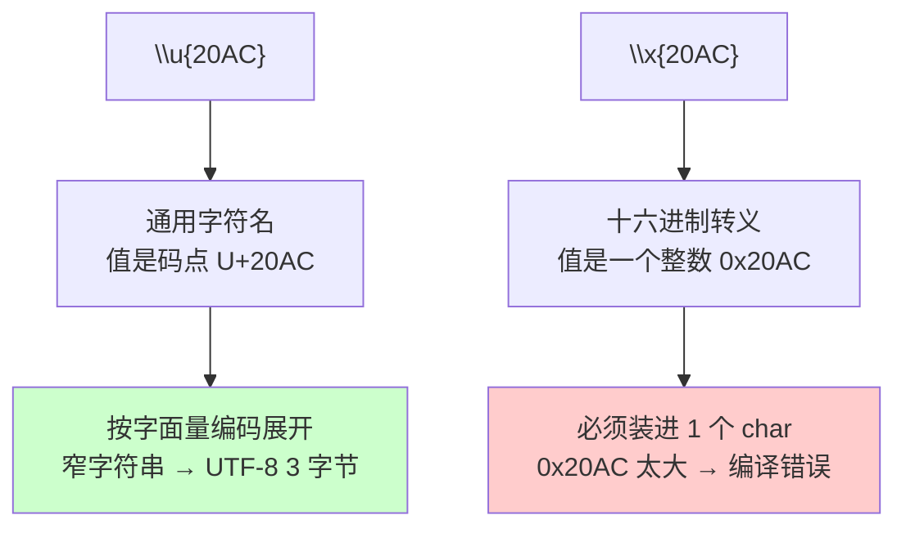
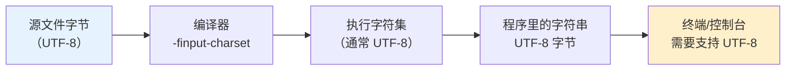

+++
title = "第27章 C++23语言特性（最新正式标准）"
weight = 270
date = "2026-03-29T21:03:00+08:00"
type = "docs"
description = ""
isCJKLanguage = true
draft = false
+++
# 第27章 C++23语言特性（最新正式标准）

> 📅 C++23标准于2024年正式发布，带来了大量让程序员"哇塞"的新特性。如果说C++17是"还凑合"，C++20是"有点东西"，那C++23绝对是"这也太香了吧"！准备好了吗？让我们一起踏上这场C++的版本升级之旅！

## 27.1 if consteval：编译器的时间旅行探测器

### 什么是consteval上下文？

在C++的世界里，有些代码需要在**编译期**执行（比如模板元编程），有些则在**运行期**执行。`if consteval`是C++23引入的一个革命性特性，它能让你在代码中"询问"：**"嘿，我现在是在常量求值的语境里吗？"**

这就像给你的代码装了一个时间探测器——它能告诉你现在是在"编译器的魔法世界"还是在"运行时的现实世界"。

### 工作原理

`if consteval`是C++23独有的一种if语句写法，它会**在编译期求值**：

- 如果条件为true（我们在常量上下文中），执行if分支
- 如果条件为false（我们在运行时），执行else分支

### 适用场景

这个特性主要用于：
1. **区分编译期和运行期行为**——比如你想让某个函数只能在编译期被调用
2. **优化代码生成**——根据上下文选择更高效的算法
3. **构建更智能的元编程库**——让模板代码更优雅

### 代码示例

```cpp
#include <iostream>

// C++23: if consteval - 判断是否在常量求值上下文中
// constexpr函数允许在编译期或运行期求值（灵活版）
// 注意：如果你真的想让函数只能在编译期调用，使用consteval替代constexpr
constexpr void assertCompileTime() {
    // if consteval会在编译期判断当前是否处于常量求值上下文
    if consteval {
        // 如果在编译期求值，走到这里
        // 注意：从非constexpr上下文调用constexpr函数，这里不会执行
        std::cout << "Running at compile time" << std::endl;
    } else {
        // 如果在运行时求值，走到这里
        std::cout << "Running at runtime" << std::endl;
    }
}

int main() {
    // 调用constexpr函数，这里会在运行期求值
    // 因为是从非constexpr上下文调用的，所以会输出 "Running at runtime"
    assertCompileTime();
    
    return 0;
}
```

编译运行：
```
g++ -std=c++23 -o consteval_test consteval_test.cpp
./consteval_test
// 输出: Running at runtime
```

### 幽默解读

想象一下你和编译器对话：

```
你: "亲爱的编译器，你现在是在编译还是在运行？"
编译器: "编译！正在把你的代码变成01串！"
你: "太好了，那我给你一个只有编译期才能吃的蛋糕！"
```

`if consteval`就是那个问话的方式！🎂

### 进阶用法

```cpp
#include <iostream>

// 模拟一个"智能"函数
consteval int factorial(int n) {
    if consteval {
        // 编译期：使用递推（更快）
        int result = 1;
        for (int i = 2; i <= n; ++i) {
            result *= i;
        }
        return result;
    } else {
        // 运行期：使用递归（更慢，但更"酷"）
        return n <= 1 ? 1 : n * factorial(n - 1);
    }
}

int main() {
    // 编译期计算！
    constexpr int fact5 = factorial(5);  // 120
    std::cout << "5! = " << fact5 << std::endl;  // 输出: 5! = 120
    
    return 0;
}
```

### 对比：if consteval vs std::is_constant_evaluated()

在C++20中，我们有`std::is_constant_evaluated()`函数可以使用。C++23的`if consteval`更加优雅：

| 特性 | `std::is_constant_evaluated()` | `if consteval` |
|------|-------------------------------|----------------|
| C++版本 | C++20 | C++23 |
| 用法 | `if (std::is_constant_evaluated())` | `if consteval` |
| 可读性 | 较繁琐 | 简洁明了 |
| 必须在常量上下文 | 否 | consteval函数隐式要求 |

```cpp
#include <iostream>
#include <type_traits>

// C++20风格
constexpr int oldWay(int x) {
    if (std::is_constant_evaluated()) {
        return x * 2;
    } else {
        return x + 2;
    }
}

// C++23风格 - 更优雅！
consteval int newWay(int x) {
    if consteval {
        return x * 2;
    } else {
        return x + 2;
    }
}

int main() {
    constexpr int a = oldWay(10);  // 编译期: 20
    constexpr int b = newWay(10);  // 编译期: 20
    int c = oldWay(10);           // 运行期: 12
    
    std::cout << "oldWay编译期: " << a << std::endl;  // 输出: 20
    std::cout << "newWay编译期: " << b << std::endl;  // 输出: 20
    std::cout << "oldWay运行期: " << c << std::endl;  // 输出: 12
    
    return 0;
}
```

> 💡 **小提示**：consteval函数必须返回可以从常量表达式构造的类型，否则会导致编译错误。把它想象成"编译期超人"——什么都要在编译时搞定！

---

## 27.2 显式对象参数（Deducing this）：给this指针起个昵称

### 什么是显式对象参数？

在C++23之前，如果你想在成员函数内部访问`this`指针，只能通过隐式的`this`关键字。C++23引入了一个新语法——**显式对象参数**（Explicit Object Parameter），让你可以"显式地"声明一个代表对象本身的参数。

这就像是给你的`this`指针起了一个昵称，让代码更加清晰明了！

### 语法解释

```cpp
// 传统写法
struct Counter {
    int value = 0;
    void increment() {
        ++this->value;  // 隐式this
    }
};

// C++23显式对象参数写法
struct Counter {
    int value = 0;
    void increment(this Counter& self) {  // 显式声明"self"代表this
        ++self.value;  // 直接用self
    }
};
```

注意`this Counter& self`的位置——它在参数列表的最前面，但`this`关键字是固定的，后面跟着的是对象的类型和参数名。

### 为什么需要这个特性？

1. **代码更清晰**——明确知道函数要操作哪个对象
2. **支持更多操作符重载**——可以让函数对象也享受成员函数的语法
3. **统一语法**——Lambda可以像函数一样声明，现在成员函数也可以像普通函数一样声明

### 代码示例

```cpp
#include <iostream>

struct Counter {
    int value = 0;
    
    // C++23: 显式对象参数
    // "this Counter& self" 意味着self是一个Counter引用
    void increment(this Counter& self) {
        ++self.value;
    }
    
    // 重载版本：const对象调用这个
    int get(this const Counter& self) {
        return self.value;
    }
};

int main() {
    Counter c;
    c.increment();  // 调用increment，self绑定到c
    
    std::cout << "Counter value: " << c.get() << std::endl;  // 输出: 1
    
    return 0;
}
```

编译运行：
```
g++ -std=c++23 -o counter counter.cpp
./counter
// 输出: Counter value: 1
```

### 幽默解读

```
以前：
你（对着空气喊）："this！你给我把value加1！"
this（黑人问号）："谁是this？你在叫我吗？"

C++23：
你（对着self喊）："self！把value加1！"
self（自信满满）："收到！这就是我的value，我来搞定！"
```

### 更多有趣的例子

```cpp
#include <iostream>
#include <string>

struct Printer {
    // 使用显式对象参数打印任何东西
    void print(this auto& self, const std::string& msg) {
        std::cout << msg << std::endl;
    }
    
    // 链式调用！
    auto& then(this auto& self, const std::string& msg) {   // 注意返回类型要写成 auto&
        std::cout << msg << std::endl;
        return self;  // auto 会丢掉引用，写成 auto& 才能真正"返回自身"
    }
};

int main() {
    Printer p;
    p.print("Hello, C++23!");  // 输出: Hello, C++23!
    p.then("Step 1").then("Step 2").then("Step 3");  
    // 输出: Step 1
    // 输出: Step 2
    // 输出: Step 3
    
    return 0;
}
```

### 适用场景

1. **实现链式调用**——返回`*this`以支持fluent API
2. **泛型成员函数**——`this auto&`让你写出适用于整个类层次结构的代码
3. **替代完美转发**——让函数对象可以被"调用"得像函数一样

> 💡 **小提示**：显式对象参数是C++23全新的语法形式，`void foo()`和`void foo(this X&)`是两个完全不同的函数，它们具有不同的签名。不要被"deducing this"这个名字迷惑——虽然"this"是推导出来的，但函数的签名是崭新的！

---

## 27.3 多维下标运算符：矩阵先生的专属电梯

### 什么是多维下标运算符？

在C++23之前，如果你想用`operator(i, j)`来访问二维数据，你必须自己实现。C++23引入了**多维下标运算符**，让`obj(i, j, k...)`这样的语法成为标准！

这就好比给矩阵先生安装了一部可以直达任意楼层的电梯——以前你得自己爬楼梯，现在一步到位！

### 适用场景

- **矩阵运算**——科学计算、机器学习必备
- **图像处理**——像素访问
- **表格数据**——Excel-like数据结构

### 代码示例

```cpp
#include <iostream>

class Matrix {
    // 3x3矩阵，用一维数组存储
    int data_[9];
    
public:
    // C++23: 多维下标运算符
    // operator()可以接受多个参数
    int& operator()(int row, int col) {
        return data_[row * 3 + col];
    }
    
    const int& operator()(int row, int col) const {
        return data_[row * 3 + col];
    }
    
    // 打印矩阵（辅助函数）
    void print() const {
        std::cout << "Matrix:" << std::endl;
        for (int i = 0; i < 3; ++i) {
            for (int j = 0; j < 3; ++j) {
                std::cout << (*this)(i, j) << " ";
            }
            std::cout << std::endl;
        }
    }
};

int main() {
    Matrix m;
    
    // 赋值
    m(0, 0) = 1;  m(0, 1) = 2;  m(0, 2) = 3;
    m(1, 0) = 4;  m(1, 1) = 5;  m(1, 2) = 6;
    m(2, 0) = 7;  m(2, 1) = 8;  m(2, 2) = 9;
    
    // 读取
    std::cout << "m(1,2) = " << m(1, 2) << std::endl;  // 输出: 6
    
    m.print();
    
    return 0;
}
```

编译运行：
```
g++ -std=c++23 -o matrix matrix.cpp
./matrix
// 输出: m(1,2) = 6
// Matrix:
// 1 2 3
// 4 5 6
// 7 8 9
```

### 幽默解读

```
矩阵先生：你好，我是矩阵！我有9个房间！
程序员：我要去第2行第1列的房间！
矩阵先生：好的，请用m(1, 0)来访问！
程序员：等等，我数数是0开始的...
矩阵先生：不客气，这是我专属的电梯，按下就直达！
```

### 更复杂的例子：三维矩阵

```cpp
#include <iostream>
#include <vector>

class Tensor3D {
    std::vector<int> data_;
    int dim1_, dim2_, dim3_;
    
public:
    Tensor3D(int d1, int d2, int d3) 
        : dim1_(d1), dim2_(d2), dim3_(d3) {
        data_.resize(d1 * d2 * d3, 0);
    }
    
    // C++23: 三维下标运算符
    int& operator()(int i, int j, int k) {
        return data_[i * dim2_ * dim3_ + j * dim3_ + k];
    }
    
    const int& operator()(int i, int j, int k) const {
        return data_[i * dim2_ * dim3_ + j * dim3_ + k];
    }
};

int main() {
    Tensor3D t(2, 3, 4);  // 2x3x4的三维张量
    
    t(1, 2, 3) = 100;  // 设置一个值
    std::cout << "t(1,2,3) = " << t(1, 2, 3) << std::endl;  // 输出: 100
    
    return 0;
}
```

### 对比总结

| 特性 | C++20及之前 | C++23 |
|------|-------------|-------|
| 二维访问 | `m[i * cols + j]` | `m(i, j)` |
| 可读性 | 需要自己计算索引 | 语义清晰 |
| 维度数量 | 需要重载多个operator() | 天然支持任意维度 |

> 💡 **小提示**：多维下标运算符只是`operator()`的扩展，没有任何新关键字。它完全向后兼容——你的旧代码照常工作！

---

## 27.4 静态 operator() 和静态 operator[]：C++23 的新玩法

### 先看一个"看起来不可能"的写法

在 C++23 之前：成员函数可以是 `static`，运算符重载可以是成员函数——但**运算符本身不能是 `static`**。

C++23 改变了这一点：`operator()`（P1169）和 `operator[]`（P2589）现在**可以声明为静态成员函数**。

### 关键：它不等于"用类名直接调用"！

很多资料（包括本章的早期版本）写成"可以像数组一样用类名访问，比如 `Registry[2]`"。**这既不合法，也不符合提案的设计。** 实测就露馅了：

```cpp
struct Registry {
    static int& operator[](int i);
    static int operator()(int x) { return x * x; }
};

Registry[2];   // ❌ error: 'Registry' does not refer to a value
Registry(7);   // ❌ error: no matching conversion for functional-style cast from 'int' to 'Registry'
```

原因：`Registry[2]` 里的 `Registry` 是**类型名**，不是值；C++ 表达式里没有"拿类型做下标"这种形式（`Registry(7)` 会被当成**函数式强制转换**）。

那静态运算符怎么调？两种方式：

```cpp
Registry::operator[](2);   // 方式1：限定名直接调用（最清楚）
Registry r;
r[2];                      // 方式2：通过对象调用（静态成员函数本来就允许用对象调用）
```

### 那它到底有什么用？

价值在**"无状态的可调用类型"**上：

1. **不需要实例**：函数对象如果没有任何状态，就不必先构造一个对象出来；
2. **支持泛型定制**：库代码可以要求"给我一个类型，我按 `T::operator()(args)` 调用"，于是策略、比较器、哈希函数可以直接用**类型**表达，而不必传递对象；
3. **兼顾封装与调用形式**：既有静态成员函数的能力（可以访问私有静态数据），又拿到了运算符形式的调用写法。

### 完整示例（实测可编译）

```cpp
#include <iostream>

class Registry {
public:
    static int data[5];

    // C++23: 静态 operator[]
    static int& operator[](int index) { return data[index]; }

    // C++23: 静态 operator()
    static int operator()(int x) { return x * x; }
};

int Registry::data[5] = {0, 10, 20, 30, 40};

int main() {
    // 方式1：限定名调用
    Registry::operator[](2) = 99;
    std::cout << "Registry::operator[](2) = " << Registry::operator[](2) << '\n';  // 99

    // 方式2：通过对象调用（静态成员运算符允许用对象调用）
    Registry r;
    std::cout << "r[1] = " << r[1] << '\n';   // 10
    std::cout << "r(7) = " << r(7) << '\n';   // 49

    // 下面两行是编译错误，留在这里是为了提醒你
    // Registry[2];   // error: 'Registry' does not refer to a value
    // Registry(7);   // error: no matching conversion ... to 'Registry'
}
```

### 常见误区对照表

| 写法 | C++20 | C++23 |
|------|-------|-------|
| 静态成员函数 | `MathUtils::compute(x)` | `MathUtils::compute(x)` |
| 静态 `operator[]` | ❌ 不能声明 | ✅ 可声明，调用 `MathUtils::operator[](i)` |
| 静态 `operator()` | ❌ 不能声明 | ✅ 可声明，调用 `MathUtils::operator()(x)` |
| **用类名直接下标/调用** | ❌ | ❌ 仍然不行（`MathUtils[i]` / `MathUtils(x)` 不合法） |
| 通过对象调用 | ✅ | ✅ |

> 💡 **小提示**：静态运算符仍然是类的成员，所以照样能访问类的私有静态数据。它真正的用武之地是**库/框架里把"策略"写成类型**，以及避免为无状态函数对象构造实例。日常业务代码里，普通静态成员函数通常更直白、也更少踩坑。

---

## 27.5 auto(x)和auto{x}：decay-copy的优雅实现

### 什么是decay-copy？

**Decay-copy**（衰变复制）是一个听起来很"量子力学"的概念。在C++中，它指的是将一个引用类型的值"复制并衰变"成对应的值类型。

简单来说：
- `const int&` → `int`（引用变值）
- `std::vector<int>&` → `std::vector<int>`（保持类型，但变成真正的对象）

### 为什么要decay-copy？

在泛型编程中，我们经常遇到这种情况：

```cpp
template<typename T>
void process(T&& arg) {
    // arg是一个转发引用，但我想保存一份副本
    // 以前：T copy = arg;  // 可能不对
    // 现在：auto copy = auto(arg);  // 完美！
}
```

### C++23的auto(x)和auto{x}

C++23引入了两种新的变量声明形式：

- `auto(x)` —— 将x decay-copy，结果是纯右值
- `auto{x}` —— 将x copy初始化，结果是纯右值

### 代码示例

```cpp
#include <iostream>
#include <vector>
#include <type_traits>

int main() {
    // C++23: auto(x) 和 auto{x} - decay-copy
    
    const int& ref = 42;  // ref是一个const int引用，绑定到临时int(42)
    
    // decay-copy：将引用"衰变"成实际值
    // auto(ref) 等价于: decay<decltype(ref)>(ref)
    auto copied = auto(ref);  // copied是int类型，值为42
    
    std::cout << "copied = " << copied << std::endl;  // 输出: copied = 42
    std::cout << "type is int: " << std::is_same_v<decltype(copied), int> << std::endl;  // 输出: 1
    
    // auto{x} 形式（列表初始化）
    auto copied2 = auto{ref};  // 同样是int，值为42
    
    std::cout << "copied2 = " << copied2 << std::endl;  // 输出: copied2 = 42
    
    // 对于vector也一样
    std::vector<int> vec{1, 2, 3};
    const std::vector<int>& vecRef = vec;
    
    // decay-copy成真正的vector
    auto vecCopy = auto(vecRef);  // vecCopy是std::vector<int>
    std::cout << "vecCopy size: " << vecCopy.size() << std::endl;  // 输出: 3
    
    return 0;
}
```

编译运行：
```
g++ -std=c++23 -o decay decay.cpp
./decay
// 输出: copied = 42
// 输出: type is int: 1
// 输出: copied2 = 42
// 输出: vecCopy size: 3
```

### 幽默解读

```
程序员：ref，你知道吗，你其实不是一个真正的int，你只是一个int的"引用"！
ref：什么？！那我是什么？
程序员：你是一个int的"影子"，一个"替身"！
ref：我...我不理解...
程序员：没关系，auto(ref)会把你"还原"成真正的int！

ref：（努力decay中...）
ref：哇，我真的变成int了！我感觉...真实了！
auto：欢迎来到值类型的世界，ref！
```

### auto(x) vs auto{x} 的区别

```cpp
#include <iostream>
#include <vector>

int main() {
    // auto(x) - 直接初始化，decay
    int arr[3] = {1, 2, 3};
    const int (&arrRef)[3] = arr;
    auto copied1 = auto(arrRef);  // const int*（decay-copy保留const）
    // 注意：数组会decay成指针，const属性也会保留！
    
    // auto{x} - 列表初始化
    // auto copied2 = auto{arrRef};  // 编译错误！不能列表初始化数组
    
    // 但对于类类型...
    std::vector<int> vec{1, 2, 3};
    const std::vector<int>& vecRef = vec;
    
    auto v1 = auto(vecRef);   // std::vector<int>
    auto v2 = auto{vecRef};   // std::vector<int>
    
    std::cout << "v1 size: " << v1.size() << std::endl;  // 输出: 3
    std::cout << "v2 size: " << v2.size() << std::endl;  // 输出: 3
    
    return 0;
}
```

### 实际应用场景

```cpp
#include <iostream>
#include <memory>
#include <vector>

// 假设我们有一个返回引用的函数
std::vector<int>& getGlobalVector() {
    static std::vector<int> gvec{1, 2, 3};
    return gvec;
}

int main() {
    // 获取全局vector的引用
    std::vector<int>& ref = getGlobalVector();
    
    // 如果我们想创建一个独立的副本
    // 用auto(x)可以明确表达"我要复制并decay"
    auto copy = auto(ref);
    
    // 修改copy不影响原vector
    copy.push_back(4);
    
    std::cout << "Original size: " << ref.size() << std::endl;  // 输出: 3
    std::cout << "Copy size: " << copy.size() << std::endl;     // 输出: 4
    
    return 0;
}
```

> 💡 **小提示**：`auto(x)`和`auto{x}`的关键在于，它们是**显式的decay-copy操作**。在泛型代码中，当你想要明确"我要复制一份，但不要引用"时，用它们比用普通的`auto`更清晰！

---

## 27.6 假设属性[[assume]]：与魔鬼的契约

### 什么是[[assume]]？

**假设属性**（Assume Attribute）是C++23引入的一个强大但危险的特性。它允许程序员向编译器声明：**"我假设这个条件永远为真，你可以基于这个假设做优化。"**

这就像和魔鬼签订契约——你给出承诺，编译器给予力量，但如果你的承诺是假的...后果自负！

### 使用场景

1. **性能优化**——告诉编译器某些不变量
2. **分支消除**——帮助编译器去掉不可能的分支
3. **SIMD优化**——告诉编译器数据是对齐的

### 代码示例

```cpp
#include <iostream>

int main() {
    // C++23: [[assume(expr)]] - 告诉编译器可以假设条件为真
    // 如果假设不成立，行为未定义（你死定了！）
    
    int x = 5;  // 运行时才知道值
    
    // 告诉编译器：假设x >= 0
    [[assume(x >= 0)]];
    
    // 编译器可能会优化掉下面的分支
    if (x < 0) {
        std::cout << "This should never print" << std::endl;
    }
    
    std::cout << "x = " << x << std::endl;  // 输出: x = 5
    
    return 0;
}
```

### 幽默解读

```
程序员：编译器大人，我有个小小的请求！
编译器：说。
程序员：我保证x永远大于等于0！
编译器：真的？你发誓？
程序员：我发誓！（心虚）
编译器：好！那我把所有x<0的检查都删了！性能提升10倍！
程序员：太好了太好了！（如果x真的>=0的话）

... later ...
程序员：奇怪，程序崩溃了...
编译器：你骗我！你明明说x>=0！
程序员：我...我不知道会有人传负数啊！
编译器：哼！
```

### 实际应用示例

```cpp
#include <iostream>
#include <vector>
#include <algorithm>

// 一个计算数组最大值的函数
int findMax(const std::vector<int>& arr) {
    // 假设数组不为空（调用者保证）
    [[assume(!arr.empty())]];
    
    int maxVal = arr[0];  // 如果数组为空，这行 UB！
    for (int i = 1; i < arr.size(); ++i) {
        maxVal = std::max(maxVal, arr[i]);
    }
    return maxVal;
}

int main() {
    std::vector<int> numbers = {3, 1, 4, 1, 5, 9, 2, 6};
    std::cout << "Max: " << findMax(numbers) << std::endl;  // 输出: 9
    
    return 0;
}
```

### 安全使用指南

```cpp
#include <iostream>

// 不安全：假设可能是错的
void unsafeFunction(int* ptr) {
    [[assume(ptr != nullptr)]];  // 如果ptr是nullptr，UB！
    *ptr = 42;  // 如果上面假设错了，程序崩溃
}

// 安全版本：先用assert检查
#include <cassert>
void safeFunction(int* ptr) {
    assert(ptr != nullptr && "ptr must not be null");
    [[assume(ptr != nullptr)]];  // 现在假设安全了
    *ptr = 42;
}

int main() {
    int x = 0;
    safeFunction(&x);
    std::cout << "x = " << x << std::endl;  // 输出: 42
    
    return 0;
}
```

### GCC和Clang的支持

```cpp
// 在支持assume的编译器上
#if defined(__cpp_assume) && __cpp_assume >= 202302L
    #define ASSUME(expr) [[assume(expr)]]
#else
    // 回退到assert
    #define ASSUME(expr) assert(expr)
#endif

int optimizedAbs(int x) {
    ASSUME(x != INT_MIN);  // 避免INT_MIN取反溢出
    return x < 0 ? -x : x;
}
```

### 与[[likely]]/[[unlikely]]的对比

| 属性 | 用途 | 危险程度 |
|------|------|----------|
| `[[likely]]` | 提示编译器哪个分支更可能执行 | 安全 |
| `[[unlikely]]` | 提示编译器哪个分支不太可能执行 | 安全 |
| `[[assume]]` | 告诉编译器"这是真的"，用于优化 | ⚠️ 危险 |

> ⚠️ **警告**：`[[assume]]`是一把双刃剑。如果你声明的假设是错误的，程序将进入**未定义行为**（Undefined Behavior）。轻则程序崩溃，重则...你的电脑会开始播放你未来的视频（开玩笑的，但UB确实很可怕）！

---

## 27.7 Lambda属性：给匿名函数戴帽子（但要戴对地方）

### 背景

C++23（P2173）放宽了属性在 lambda 里的书写位置：你可以在 lambda 的多个位置写 `[[...]]`。但**位置不同，属性"贴"到的实体也不同**，而有些属性根本不能贴在那些实体上。这正是本节最容易踩的坑，所以我们直接看实测结果。

### 实测：不同位置，不同命运

```cpp
int main() {
    // 位置1：写在变量声明前 —— 属性贴在"变量"上
    [[deprecated("use newLambda instead")]]
    auto oldLambda = [](int x) { return x * 2; };
    oldLambda(5);   // ⚠️ warning: 'oldLambda' is deprecated
                    //    这个位置对 [[deprecated]] 是有效的

    // 位置2：写在 lambda-introducer 之后、参数列表之前（C++23 新增的位置）
    auto l2 = [] [[nodiscard]] (int x) { return x + 1; };
    l2(2);          // 语法通过，而且不会报警……
                    // 也就是说：这个属性并没有让"返回值检查"生效
}
```

而下面这些写法是**编译错误**，你在网上看到的"给 lambda 加 `[[nodiscard]]`"多半就是这一类：

```text
auto l3 = [](int x) [[nodiscard]] { return x; };
// error: 'nodiscard' attribute cannot be applied to types

auto l4 = [](int x) -> int [[nodiscard]] { return x; };
// error: 'nodiscard' attribute cannot be applied to types

[[nodiscard]] auto l5 = [](int x) { return x + 1; };
// warning: 'nodiscard' attribute only applies to Objective-C methods, enums,
//          structs, unions, classes, functions, function pointers, and typedefs
//          [-Wignored-attributes]
// 属性贴在了变量 l5 上，被忽略；调用 l5(2) 丢掉返回值也不会报警
```

### 属性到底贴到了哪里

| 写法 | 属性贴到谁身上 | `[[nodiscard]]` 能用吗 |
|---|---|---|
| `[[attr]] auto f = [](){...};` | **变量** `f` | ❌ 被忽略（`-Wignored-attributes`） |
| `[] [[attr]] () {...}`（lambda-introducer 之后） | 闭包类型 | ✅ 语法上接受 |
| `[](int x) [[attr]] {...}` | 调用运算符的**类型** | ❌ `cannot be applied to types` |
| `[](int x) -> int [[attr]] {...}` | 调用运算符的**类型** | ❌ 同上 |

> ⚠️ **关键结论**：想在 lambda 上让 `[[nodiscard]]` 真正生效，**在 clang 上做不到**——写在后面的位置会被编译器判定为"作用于类型"，而 `[[nodiscard]]` 不接受类型。`[[deprecated]]` 写在变量前面是有效的，但它标记的是**那个变量**，不是 lambda 本身。

### 那想让"可调用对象"带 nodiscard 怎么办？

写成**具名的函数对象**，一切就正常了：

```cpp
#include <iostream>

struct Square {
    [[nodiscard]] int operator()(int x) const { return x * x; }
};

int main() {
    Square sq;
    std::cout << sq(3) << '\n';   // 9
    sq(3);                        // ⚠️ warning: ignoring return value of function
                                  //    declared with 'nodiscard' attribute
}
```

### 那 C++23 到底加了什么？

P2173 的贡献是**放宽了属性的书写位置**（例如可以在 `[]` 和参数列表之间写属性、在 `mutable` 前后写属性等），这让某些"作用于闭包类型或调用运算符类型"的属性有了合法落点。但**它不会改变属性的适用规则**——不适用的属性照样被拒绝或被忽略。

> 💡 **实战建议**：
> 1. 不要指望"给 lambda 加 `[[nodiscard]]`"能让返回值检查生效，用**具名函数对象**更可靠；
> 2. `[[deprecated]]` 写在变量前面对 lambda 变量是有效的（用户一用就报警）；
> 3. 库作者如果想表达"这个可调用对象的返回值不能丢"，就老老实实定义一个带 `[[nodiscard]]` 的 `operator()` 的类型。


---

## 27.8 扩展浮点类型（std::float16_t等）：数值计算的精确制导

### 什么是扩展浮点类型？

在C++23之前，标准库只提供了`float`（32位）、`double`（64位）和`long double`（平台相关）。C++23引入了标准化的扩展浮点类型：

- `std::float16_t` —— 16位浮点数（半精度）
- `std::float32_t` —— 32位浮点数（单精度）
- `std::float64_t` —— 64位浮点数（双精度）
- `std::bfloat16_t` —— 16位"脑"浮点数（brain float）

### 为什么需要这些类型？

1. **机器学习**——低精度浮点运算更快更省内存
2. **嵌入式系统**——资源受限，需要节省内存
3. **科学计算**——某些场景需要精确控制精度
4. **跨平台一致性**——以前`float`在不同平台上可能不一样

### 代码示例

```cpp
#include <cstdint>
#include <cstdio>
#include <limits>

int main() {
    // ① 标准化的"扩展浮点类型"定义在 <stdfloat> 里（C++23）
    //    需要编译器 + 标准库同时支持，见下面的可用性说明
#if defined(__STDCPP_FLOAT16_T__) || defined(__cpp_lib_extended_float)
    std::float16_t  half   = 0.5f;      // 半精度
    std::float32_t  single = 3.14f;     // 单精度
    std::float64_t  dbl    = 3.14159;   // 双精度
    std::bfloat16_t brain  = 6.28f;     // bfloat16
    std::printf("sizeof: %zu %zu %zu %zu\n",
                sizeof half, sizeof single, sizeof dbl, sizeof brain);
#else
    std::printf("这个标准库还没有 <stdfloat>，下面改用编译器内置的扩展浮点类型\n");
#endif

    // ② 编译器内置的扩展浮点类型：不走 <stdfloat>，Apple 芯片上可用
    _Float16 h = 0.5f;
    std::printf("_Float16 = %f，sizeof = %zu 字节\n", (double)h, sizeof h);
}
```

```text
$ clang++ -std=c++23 extfloat.cpp && ./a.out
这个标准库还没有 <stdfloat>，下面改用编译器内置的扩展浮点类型
_Float16 = 0.500000，sizeof = 2 字节
```

> 📌 **可用性（实测）**：`std::float16_t` 这一组类型定义在头文件 **`<stdfloat>`** 里。
> - **Apple clang 21 的 libc++ 目前还没有这个头文件**：写 `#include <stdfloat>` 会得到
>   `fatal error: 'stdfloat' file not found`；
> - GCC 13+ 和较新的 libc++ 已经提供；
> - 想立刻体验"低精度浮点"，可以用**编译器内置**的类型 `_Float16`（Apple 芯片与 x86 的 clang 都支持），如上例的 ② 部分。
>
> 这也是一个很好的例子：**标准里有 ≠ 你的工具链有**。写跨平台代码时，用特性测试宏（`__STDCPP_FLOAT16_T__` 之类）加上 `#if` 分支，是最稳妥的做法。

### 幽默解读

```
float：我有32位！
double：我有64位！
long double：我...我也不知道我有多少位，平台说的算...

C++23：好了好了，别吵了，我给你们都发个"标准身份证"！

float16_t：我只有16位，是不是太少了？
C++23：你虽然位数少，但你快啊！内存省啊！
float16_t：真的吗？那我可以用来做AI推理！
C++23：没错，这就是你的用武之地！

bfloat16_t：我也是16位，但我更"大脑"！
C++23：你这名字确实很"大脑"...
bfloat16_t：我保留了32位的指数范围，只是精度低！
C++23：这让你特别适合深度学习！
```

### float vs bfloat16 对比

```text
┌─────────────────────────────────────────────────────────────┐
│                    32-bit Float (float)                      │
├─────────────┬───────────────────────────────────────────────┤
│  Sign (1)   │  Exponent (8)     │  Mantissa (23)            │
└─────────────┴───────────────────────────────────────────────┘

┌─────────────────────────────────────────────────────────────┐
│               16-bit Brain Float (bfloat16)                 │
├─────────────┬───────────────────────────────────────────────┤
│  Sign (1)   │  Exponent (8)     │  Mantissa (7)             │
└─────────────┴───────────────────────────────────────────────┘

┌─────────────────────────────────────────────────────────────┐
│               16-bit Float (float16_t)                      │
├─────────────┬───────────────────────────────────────────────┤
│  Sign (1)   │  Exponent (5)     │  Mantissa (10)            │
└─────────────┴───────────────────────────────────────────────┘
```

> 💡 **小提示**：不同的16位浮点格式有不同的用途：
> - `float16_t`：IEEE 754半精度，适合图像处理
> - `bfloat16_t`：适合深度学习，动态范围大
> - 如果你不确定用哪个，就用`float32_t`——它和`float`完全一样！

---

## 27.9 新预处理器指令：#elifdef、#elifndef、#warning

### C++的预处理器进化史

预处理器是C/C++编译前的一道"魔法"，它在我们代码的基础上生成最终的代码。C++23给这个老古董添加了一些新玩具！

### #elifdef 和 #elifndef

在C++23之前，如果你想写"elif if defined"，你得这样：

```cpp
#if defined(FOO)
    // ...
#elif defined(BAR)
    // ...
#endif
```

现在，你可以更直观地写：

```cpp
#ifdef FOO
    // ...
#elifdef BAR  // C++23: elif if defined
    // ...
#endif
```

### #warning

这个更直接——让你在编译时发出警告！

### 代码示例

```cpp
#include <iostream>

// C++23: 新的预处理器指令

// #elifdef: elif if defined (如果前面的#if/#elif不满足，检查这个是否定义)
// #elifndef: elif if not defined (如果前面的不满足，检查这个是否未定义)
// #warning: 产生一个编译警告

#define FEATURE_ENABLED
#define EXPERIMENTAL_MODE

int main() {
    // 传统写法
#if defined(DEBUG)
    std::cout << "Debug mode" << std::endl;
#elif defined(FEATURE_ENABLED)
    std::cout << "Feature enabled" << std::endl;  // 这行会被执行
#else
    std::cout << "Default mode" << std::endl;
#endif
    
    // C++23新写法 - 更直观！
#ifdef DEBUG
    std::cout << "Debug mode" << std::endl;
#elifdef FEATURE_ENABLED  // C++23: elifdef
    std::cout << "Feature enabled (new syntax)" << std::endl;  // 这行会被执行
#endif
    
#ifndef OBSOLETE_API  // C++23: if not defined
    std::cout << "Using modern API" << std::endl;
#endif
    
    return 0;
}
```

### #warning示例

```cpp
#include <iostream>

#define LEGACY_CODE

int main() {
    // 发出警告
    #warning "This code is using deprecated patterns!"
    
    #ifdef LEGACY_CODE
    #warning "LEGACY_CODE is defined, consider removing it"
    #endif
    
    std::cout << "Hello, C++23 preprocessor!" << std::endl;
    
    return 0;
}
```

编译时你会看到：
```
warning: #warning "This code is using deprecated patterns!" [-Wcpp]
warning: #warning "LEGACY_CODE is defined, consider removing it" [-Wcpp]
Hello, C++23 preprocessor!
```

### 幽默解读

```
预处理器（得意）：我虽然"老"，但我是C++家族最资深的"魔法变换师"！

C++23：好好好，我知道你厉害，但我给你加了几个新咒语！

程序员：什么咒语？

C++23：#elifdef！#elifndef！#warning！

预处理器（眼睛发光）：哦哦哦！我现在可以：
- elifdef = elif defined
- elifndef = elif not defined
- warning = 发出警告吓唬程序员！

程序员：等等，warning是用来吓唬程序员的？
预处理器：哈哈，开玩笑的！是用来提醒他们代码可能要过期了！
```

### 实际应用

```cpp
#include <iostream>

// 检测编译器的C++标准版本
#if __cplusplus >= 202302L
    #define IS_CPP23 1
#else
    #define IS_CPP23 0
#endif

#if IS_CPP23
    #warning "Compiled with C++23! Welcome to the future!"
#else
    #warning "Not C++23. Some features may not be available."
#endif

int main() {
    std::cout << "C++ standard: " << __cplusplus << std::endl;
    
    #if IS_CPP23
    std::cout << "Using C++23 features!" << std::endl;
    #endif
    
    return 0;
}
```

> 💡 **小提示**：`#warning`在调试和代码迁移时特别有用。比如你可以用它来标记需要在未来版本中修改的代码，或者提醒团队成员某些编译选项的影响！

---

## 27.10 size_t字面量后缀'Z'/'z'：终于等到你

### 为什么要给size_t加后缀？

在C++中，`size_t`是一个非常重要的类型——它是无符号整数，用于表示大小和索引。但长期以来，如果你想写一个`size_t`类型的字面量，你得这样：

```cpp
size_t len = 100;  // 需要强制转换
size_t len = static_cast<size_t>(100);  // 或者用static_cast
```

C++23终于给了`size_t`一个专属后缀：`z`或`Z`！

### 代码示例

```cpp
#include <iostream>
#include <cstddef>
#include <vector>
#include <format>

int main() {
    // C++23: size_t字面量后缀
    // z或Z后缀表示size_t类型
    
    size_t len1 = 100z;   // 使用z后缀
    size_t len2 = 200Z;   // 使用Z后缀（大写也行）
    
    std::cout << "len1 = " << len1 << std::endl;  // 输出: 100
    std::cout << "len2 = " << len2 << std::endl;  // 输出: 200
    
    // 以前需要这样写：
    // size_t len_old = 100;  // 可能警告：精度丢失
    // size_t len_cast = static_cast<size_t>(100);  // 太繁琐
    
    // 数组大小也可以用
    int arr[50z];  // 50是size_t类型
    std::cout << "Array size: " << (sizeof(arr) / sizeof(arr[0])) << std::endl;  // 输出: 50
    
    // 在泛型编程中特别有用
    auto vec = std::vector<int>(100z);  // 100是size_t
    std::cout << "Vector size: " << vec.size() << std::endl;  // 输出: 100
    
    return 0;
}
```

### 幽默解读

```
size_t（委屈）：为什么int有100L，long有100LL，我size_t什么都没有！
程序员：是啊，为什么呢？
size_t：每次我想写一个size_t字面量，都得强制转换！我太难了！
double有100.0，float有100.0f，就我什么都没有！

C++23：z！给你z！
size_t：真的吗？！
C++23：真的！100z，这就是你的专属后缀！
size_t（感动落泪）：终于...终于等到了这一天！

C++23：别哭了，以后写size_t直接100z就行了！
size_t：太好了！我要把这个消息告诉所有size_t爱好者！
```

### 对比各种整数后缀

| 类型 | 后缀 | 示例 | 说明 |
|------|------|------|------|
| int | 无 | `100` | 默认 |
| long | `L` | `100L` | |
| long long | `LL` | `100LL` | |
| unsigned | `U` | `100U` | |
| unsigned long | `UL` | `100UL` | |
| size_t | `z`/`Z` | `100z` | C++23新特性 |

### 实际应用

```cpp
#include <iostream>
#include <cstddef>
#include <vector>

// 模板函数：创建一个包含n个元素的vector
template<typename T>
std::vector<T> createVector(size_t n, T val) {
    return std::vector<T>(n, val);
}

int main() {
    // C++23之前：需要静态转换
    // auto v1 = createVector(static_cast<size_t>(100), 42);
    
    // C++23：直接写100z
    auto v1 = createVector(100z, 42);
    auto v2 = createVector(50z, 3.14);
    
    std::cout << "v1.size() = " << v1.size() << std::endl;  // 输出: 100
    std::cout << "v2.size() = " << v2.size() << std::endl;  // 输出: 50
    
    // 用于索引
    std::string s = "Hello, C++23!";
    size_t idx = 7z;  // 明确是size_t类型
    std::cout << "s[" << idx << "] = " << s[idx] << std::endl;  // 输出: C
    
    return 0;
}
```

> 💡 **小提示**：`z`后缀在模板编程中特别有用。以前当你写`T::npos`时，返回值可能需要转换，现在你可以直接写`100z`让它变成`size_t`类型，编译器会非常感激你的！

---

## 27.11 空白字符修剪与行拼接：字符串处理的C++23升级

### C++23对字符串做了什么？

C++23为字符串处理带来的改动不多，主要是：

1. **`std::string::contains` 等便捷成员函数** —— 判断子串、开头、结尾，不用再写 `find(...) != npos`
2. **行拼接的空白处理明确化** —— 提案 P2223R2 明确了续行符 `\` 后面多余空白应当被忽略

> ⚠️ **辟谣：标准库里没有 `trim`！**
> 网上不少资料说"C++23 新增了 `std::ranges::trim` / `std::string::trim`"，
> 这是**错的**——到 C++23 为止标准库里根本没有 trim 函数（C++26 也没有正式加入）。
> 这也是为什么下面这段代码只能自己手写：

### 手写 trim：没有标准函数时的常规做法

```cpp
#include <iostream>
#include <string>
#include <string_view>

int main() {
    // 标准库没有 trim，这里用 string_view + find_first_not_of 手写一个
    
    std::string s = "   Hello, C++23!   ";
    
    // 注意：std::ranges::trim(s) 并不存在，别照抄网上的这种写法
    auto trimmed = [](std::string_view sv) -> std::string {
        size_t start = sv.find_first_not_of(" \t\n\r");
        size_t end = sv.find_last_not_of(" \t\n\r");
        if (start == std::string_view::npos) return "";
        return std::string(sv.substr(start, end - start + 1));
    };
    
    std::string_view sv = s;
    std::string trimmedStr = trimmed(sv);
    
    std::cout << "Original: '" << s << "'" << std::endl;
    std::cout << "Trimmed: '" << trimmedStr << "'" << std::endl;
    
    return 0;
}
```

输出：
```text
Original: '   Hello, C++23!   '
Trimmed: 'Hello, C++23!'
```

### 行拼接改进

```cpp
#include <iostream>

int main() {
    // C++23改进了行拼接的说明，实际上自C++11起\后面就可以有空白
    auto message = "Hello, " \
                   "C++23!";
    
    std::cout << message << std::endl;  // 输出: Hello, C++23!
    
    // 使用续行符连接多行字符串
    auto poem = "床前明月光，\
                疑是地上霜。\
                举头望明月，\
                低头思故乡。";
    
    std::cout << poem << std::endl;
    
    return 0;
}
```

### 幽默解读

```
字符串（委屈）：我两端有好多空白字符，但没人帮我清理！
C++23：trim来了！我帮你打扫！
字符串：真的吗？太好了！

字符串（trim后）：哇！好清爽！感觉轻了好多！

程序员：我写代码的时候换行，\后面不能有空格，很烦！
C++23：那以后可以有空格了！
程序员：真的吗？
C++23：真的！\ 后面随便加空格！ 
程序员：谢谢！虽然是小改进，但太实用了！
```

### 实际应用

```cpp
#include <iostream>
#include <string>
#include <vector>

int main() {
    // 处理用户输入（去除首尾空白）
    std::vector<std::string> inputs = {
        "   Alice",
        "Bob   ",
        "  Charlie  ",
        "   Dave   "
    };
    
    std::cout << "Before and after trim:" << std::endl;
    // trim辅助函数（C++23风格的手动实现）
    auto trim = [](std::string_view sv) -> std::string {
        size_t start = sv.find_first_not_of(" \t\n\r");
        size_t end = sv.find_last_not_of(" \t\n\r");
        if (start == std::string_view::npos) return "";
        return std::string(sv.substr(start, end - start + 1));
    };
    for (const auto& name : inputs) {
        std::string original = name;
        std::string trimmed = trim(name);
        std::cout << "'" << original << "' -> '" << trimmed << "'" << std::endl;
    }
    
    // 处理CSV数据
    std::string csvLine = "  123, 456, 789  ";
    std::cout << "CSV trimmed: '" << trim(csvLine) << "'" << std::endl;
    
    return 0;
}
```

> 💡 **小提示**：`trim()`默认会去除所有空白字符（包括空格、制表符、换行符）。如果想去除其他字符，可以传入一个自定义的trim集合：
> ```cpp
> std::string s = "xxxHelloxxx";
> s.trim("x");  // 去除x字符
> ```

---

## 27.12 隐式移动简化：编译器更聪明了

### 什么是隐式移动？

在C++11引入移动语义之前，返回一个局部对象总是会触发拷贝：

```cpp
std::vector<int> createVector() {
    std::vector<int> v{1, 2, 3};
    return v;  // C++98/03：拷贝整个vector
}
```

C++11引入了移动语义：

```cpp
return v;  // 移动而不是拷贝
```

C++17引入了**返回值优化（RVO）**和**强制拷贝省略**，进一步优化。

C++23则进一步简化了隐式移动的规则！

### 代码示例

```cpp
#include <iostream>
#include <vector>
#include <utility>

// 模拟一个会产生移动的函数
std::vector<int> createVector() {
    std::vector<int> v{1, 2, 3};
    return v;  // C++17：强制拷贝省略（C++17起）
}

class MyClass {
public:
    std::vector<int> data;
    
    MyClass() {
        std::cout << "  MyClass constructed" << std::endl;
    }
    
    ~MyClass() {
        std::cout << "  MyClass destroyed" << std::endl;
    }
    
    // 移动构造函数
    MyClass(MyClass&& other) noexcept : data(std::move(other.data)) {
        std::cout << "  MyClass moved" << std::endl;
    }
    
    // 拷贝构造函数
    MyClass(const MyClass& other) : data(other.data) {
        std::cout << "  MyClass copied" << std::endl;
    }
};

MyClass createMyClass() {
    MyClass m;
    return m;  // C++17保证不会调用拷贝/移动
}

int main() {
    // C++23进一步简化隐式移动规则
    std::cout << "Creating vector:" << std::endl;
    auto v = createVector();
    std::cout << "v.size() = " << v.size() << std::endl;  // 输出: 3
    
    std::cout << "\nCreating MyClass:" << std::endl;
    auto m = createMyClass();  // C++17保证零拷贝/移动
    
    return 0;
}
```

### C++17 vs C++20 vs C++23 隐式移动规则

| 场景 | C++17 | C++20 | C++23 |
|------|-------|-------|-------|
| 返回局部变量 | RVO或移动 | RVO或移动 | 更宽松 |
| 返回参数 | 移动 | 移动 | 更宽松 |
| 结构化绑定返回 | - | N/A | 更宽松 |

### 幽默解读

```
C++98：返回局部对象？拷贝！一个字都不会少！
C++11：等等，我给他加个移动语义，能省就省！
C++17：都别吵了，我直接强制省略拷贝，谁都不许拷贝！
C++23：我再放宽一点规则，让编译器更自由！

编译器（累了）：你们能不能统一一下规则？！

程序员：别抱怨了，你不是越来越聪明了吗？
编译器：...
```

### 实际影响

```cpp
#include <iostream>
#include <memory>

struct BigObject {
    int data[1000];
    BigObject() { std::cout << "  BigObject constructed" << std::endl; }
    ~BigObject() { std::cout << "  BigObject destroyed" << std::endl; }
};

// C++23更宽松的隐式移动规则影响
BigObject createObject() {
    BigObject obj;
    // ... 可能有一些操作 ...
    return obj;  // C++23保证不会有多余的拷贝
}

int main() {
    std::cout << "Creating BigObject:" << std::endl;
    auto obj = createObject();
    std::cout << "Object created successfully" << std::endl;
    
    return 0;
}
```

> 💡 **小提示**：虽然C++23放宽了规则，但最好的实践仍然是：**避免对返回局部对象使用`std::move`**！编译器比你更聪明，它会自动处理。

---

## 27.13 范围for初始化器：让循环更优雅

### C++23之前的范围for

```cpp
std::vector<int> v{1, 2, 3};
for (int x : v) {
    std::cout << x << " ";
}
```

但如果你想在循环前初始化这个vector，你得在循环外面先声明。

### C++23的初始化器

```cpp
#include <iostream>
#include <vector>

int main() {
    // C++23: 范围for可以有初始化器
    // 初始化器和循环变量可以在同一个for语句中声明
    
    for (auto vec = std::vector{1, 2, 3}; auto& v : vec) {
        std::cout << v << " ";
    }
    std::cout << std::endl;
    
    return 0;
}
```

编译运行：
```
g++ -std=c++23 -o rangefor rangefor.cpp
./rangefor
// 输出: 1 2 3
```

### 幽默解读

```
C++98：for循环要先在外面准备好数据，很麻烦！
C++11：没关系，我给你range-based for，优雅！
C++23：我再加一个功能——初始化器！数据准备和循环可以在一起！

程序员：这是要把所有东西都塞进一个for语句的节奏吗？
C++23：没错！让代码更紧凑！（虽然可能太紧凑了）
```

### 实际应用场景

```cpp
#include <iostream>
#include <vector>
#include <map>

int main() {
    // 场景1：过滤并处理
    std::cout << "Even numbers:" << std::endl;
    for (auto vec = std::vector{1, 2, 3, 4, 5, 6}; const auto& v : vec) {
        if (v % 2 == 0) {
            std::cout << v << " ";  // 输出: 2 4 6
        }
    }
    std::cout << std::endl;
    
    // 场景2：与if一起使用
    for (auto m = std::map<std::string, int>{{"a", 1}, {"b", 2}}; 
         const auto& [key, value] : m) {
        std::cout << key << "=" << value << " ";  // 输出: a=1 b=2
    }
    std::cout << std::endl;
    
    // 场景3：临时对象的生命周期
    for (auto p = std::pair{1, 2}; const auto& elem : 
         {p.first, p.second, p.first + p.second}) {
        std::cout << elem << " ";  // 输出: 1 2 3
    }
    std::cout << std::endl;
    
    return 0;
}
```

### 初始化器的语法细节

```cpp
#include <iostream>
#include <vector>

int main() {
    // 语法：for (初始化器; 循环变量声明; 循环体)
    
    // 初始化器可以是任何表达式
    for (auto counter = 0; const auto& x : {1, 2, 3, 4, 5}) {
        std::cout << counter++ << ":" << x << " ";
    }
    std::cout << std::endl;
    // 输出: 0:1 1:2 2:3 3:4 4:5
    
    // 初始化器中声明的变量作用域是整个for语句
    for (auto result = 0; const auto& x : {10, 20, 30}) {
        result += x;
    }
    // result在这里仍然可见
    // std::cout << result << std::endl;  // 注释：这里输出60
    
    return 0;
}
```

> 💡 **小提示**：初始化器的变量在循环结束后仍然存在！如果你不需要在循环后访问它，可以使用块作用域：
> ```cpp
> {
>     for (auto vec = std::vector{1, 2, 3}; auto& v : vec) {
>         // ...
>     }
> }  // vec在这里被销毁
> ```

---

## 27.14 CTAD与继承构造函数：类型推导的强强联合

### 什么是CTAD？

**CTAD**（Class Template Argument Deduction，类模板参数推导）是从C++17引入的特性。它允许你在创建对象时省略模板参数，让编译器自动推导：

```cpp
std::vector v{1, 2, 3};  // 编译器推导出std::vector<int>
```

### 什么是继承构造函数？

**继承构造函数**是C++11引入的特性。使用`using Base::Base;`可以让派生类"继承"基类的构造函数。

### C++23的改进

C++23让继承构造函数也能享受CTAD的便利！

### 代码示例

```cpp
#include <iostream>

struct Base {
    int x, y;
    Base(int x, int y) : x(x), y(y) {
        std::cout << "Base constructed with (" << x << ", " << y << ")" << std::endl;
    }
};

struct Derived : Base {
    using Base::Base;  // 继承构造函数
};

int main() {
    // C++23: 继承构造函数的CTAD
    
    // 以前需要这样写：
    Derived d1(1, 2);  // 显式指定参数类型
    
    // C++23可以通过CTAD直接推导
    Derived d2 = Derived(1, 2);  // 自动推导
    
    std::cout << "d2.x = " << d2.x << ", d2.y = " << d2.y << std::endl;  // 输出: 1, 2
    
    return 0;
}
```

### 幽默解读

```
CTAD（自信）：我可以让编译器自动推导出模板参数！
继承构造函数（得意）：我可以继承基类的构造函数！
CTAD：那我们合作吧！
继承构造函数：好主意！

C++17：你们俩不能一起玩...
C++23：我批准了！你们可以合作了！

CTAD + 继承构造函数（欢呼）：太棒了！
```

### 更复杂的例子

```cpp
#include <iostream>
#include <memory>
#include <vector>

template<typename T>
struct Wrapper {
    T value;
    
    template<typename U>
    Wrapper(U&& v) : value(std::forward<U>(v)) {}
};

struct Base1 {
    int a;
    Base1(int a = 0) : a(a) {}      // 给默认值，否则被继承到 Derived 的构造函数会被隐式删除
};

struct Base2 {
    double b;
    Base2(double b = 0.0) : b(b) {}  // 同上
};

// 多继承情况
struct Derived : Base1, Base2 {
    using Base1::Base1;
    using Base2::Base2;
};

int main() {
    // C++23: 继承构造函数CTAD
    
    // 单继承
    Derived d1(42);  // 继承自Base1的构造函数
    std::cout << "d1.a = " << d1.a << std::endl;  // 输出: 42
    
    // Wrapper和继承构造函数结合
    struct IntWrapper : Wrapper<int> {
        using Wrapper<int>::Wrapper;
    };
    
    IntWrapper w(100);
    std::cout << "w.value = " << w.value << std::endl;  // 输出: 100
    
    return 0;
}
```

### 注意事项

```cpp
#include <iostream>

struct Base {
    int x;
    Base(int x) : x(x) {}
};

struct Derived : Base {
    using Base::Base;
    
    // 如果派生类定义了同名成员，可能会有问题
    // int x;  // 如果取消注释，会有歧义
};

int main() {
    // C++23中，继承构造函数的CTAD
    Derived d(10);
    std::cout << "d.x = " << d.x << std::endl;  // 输出: 10
    
    return 0;
}
```

> 💡 **小提示**：继承构造函数的CTAD在大多数情况下都能正常工作，但如果你遇到歧义或推导失败的问题，可能需要显式指定模板参数。

---

## 27.15 复合语句末尾标签：goto的新玩法

### 什么是复合语句？

**复合语句**（Compound Statement）是用`{}`包围的语句块。在C++中，标签（Label）通常和`goto`一起使用，但C++23之前只能在语句前放标签。

### C++23的改变

C++23允许在复合语句的末尾放置标签！这是一个看似奇怪但意外实用的改进。

### 代码示例

```cpp
#include <iostream>

int main() {
    // C++23: 复合语句末尾可以有标签
    // 这在配合goto使用时特别有用
    
    {
        int x = 42;
        int y = 100;
        
        // 在块末尾放标签
        if (x < 0) {
            goto negative;
        }
        
        // ... 更多代码 ...
        
    negative:;  // 标签在块的末尾！C++23允许这样写
    }
    
    std::cout << "Labels at end of compound statements in C++23" << std::endl;
    
    return 0;
}
```

### 幽默解读

```
标签（委屈）：为什么我只能在语句前面？不能在后面吗？
程序员：语句后面的叫"注释"，不是"标签"！
标签：可是有时候我需要在块的最后跳转啊！
C++23：好吧好吧，我允许你在块的最后放标签了！
标签：太好了！终于自由了！

goto（路过）：听说标签解放了？
标签：是的！现在你可以跳到块的任何地方了！
goto：我好久没被使用了...大家都不喜欢我...
C++23：别担心，这个新特性可能让你重新就业！
```

### 实际应用场景

```cpp
#include <iostream>
#include <vector>

int processData(const std::vector<int>& data) {
    int result = 0;
    
    // 使用末尾标签进行状态跳转
    {
        // 模拟一些处理逻辑
        bool error = false;
        int errorCode = 0;
        
        if (data.empty()) {
            error = true;
            errorCode = 1;
            goto handle_error;  // 跳到块的末尾
        }
        
        // 正常处理
        for (int v : data) {
            result += v;
        }
        
        // 成功退出
        goto cleanup;
        
    handle_error:;  // C++23：标签可以在块末尾
        std::cout << "Error code: " << errorCode << std::endl;
        result = -1;
        
    cleanup:;  // C++23：标签可以在块末尾
        std::cout << "Cleanup performed" << std::endl;
    }
    
    return result;
}

int main() {
    std::vector<int> data{1, 2, 3, 4, 5};
    std::cout << "Result: " << processData(data) << std::endl;  // 输出: 15
    
    std::cout << "Empty case: " << processData({}) << std::endl;  // 输出: -1
    
    return 0;
}
```

### 另一个例子：状态机

```cpp
#include <iostream>

enum class State { IDLE, RUNNING, PAUSED, STOPPED };

State processState() {
    State current = State::IDLE;
    
    // 使用末尾标签模拟状态转换
    {
        auto transition = [&](State newState) {
            current = newState;
        };
        
        // 模拟状态转换逻辑
        transition(State::RUNNING);
        if (current == State::RUNNING) {
            goto state_running;
        }
        
    state_running:;  // C++23
        std::cout << "Running state" << std::endl;
        transition(State::IDLE);
        
    state_done:;  // C++23
        std::cout << "State machine completed" << std::endl;
    }
    
    return current;
}

int main() {
    State finalState = processState();
    std::cout << "Final state: " << static_cast<int>(finalState) << std::endl;
    
    return 0;
}
```

> 💡 **小提示**：虽然C++23允许在复合语句末尾放置标签，但**goto本身仍然被认为是有害的**（有害健康.jpg）。在现代C++中，我们更推荐使用异常、RAII或状态模式来替代goto。只有在极少数需要高性能跳转到错误处理或资源清理的场景下，才考虑使用goto。

---

## 27.16 初始化语句中的别名声明（`using T = ...`）

### 先分清三种"using"

| 名字 | 写法 | 作用 |
|---|---|---|
| **别名声明**（alias-declaration） | `using T = int;` | 定义一个**类型别名** |
| **using 声明**（using-declaration） | `using std::cout;` | 把某个名字引入当前作用域 |
| **using 指示**（using-directive） | `using namespace std;` | 引入整个命名空间 |

C++23 通过 P2360 扩宽了 `if` / `switch` / 范围 `for` 的**初始化语句**（init-statement），允许在里面写**别名声明**。

它**没有**允许 `using std::vector;` 或 `using namespace std;`。实测一下就很清楚：

```cpp
if (using namespace std; string s = "Hi"; !s.empty()) { }   // ❌ error: expected expression
for (using std::vector; vector<int> v{}; ...) { }           // ❌ error: expected '='
if (using auto c = a + b; c > 0) { }                        // ❌ error: expected ')'
```

关键点：`using` 后面**必须跟着 `=`**，也就是"起别名"。

### 正确用法（实测通过）

```cpp
#include <iostream>
#include <vector>

int main() {
    // 1. if 的初始化部分起别名
    if (using T = long; sizeof(T) > 4) {
        T v = 1;                        // T 在语句内部可见
        std::cout << "T 是宽类型，值 = " << v << '\n';
    }

    // 2. switch 的初始化部分起别名
    int code = 2;
    switch (using U = unsigned; code) {
        case 2: { U u = 9; std::cout << "u = " << u << '\n'; } break;
        default: break;
    }

    // 3. 范围 for 的初始化部分起别名
    std::vector<std::vector<int>> rows{{1, 2}, {3}};
    for (using V = std::vector<int>; const V& row : rows) {
        std::cout << "一行有 " << row.size() << " 个元素\n";
    }
}
```

### 一个容易混淆的地方：初始化语句 ≠ 条件

`if (init-statement condition)` 里只能有**一条**初始化语句，条件必须另写：

```cpp
int a = 1, b = 2;
using C = int;
if (C c = a + b; c > 0) { }        // ✅ 这里的 C 是在语句外面定义的

// if (using C = int; C c = a + b; c > 0) { }   // ❌ 两条声明，编译错误
```

而下面这种"一行搞定"的写法其实与别名无关，它从 C++17 起就支持了：

```cpp
#include <optional>

int main() {
    std::optional<int> opt = 42;
    switch (auto val = opt.value_or(0); val) {   // ✅ C++17 起就有的初始化语句
        case 0:  break;
        default: break;
    }
}
```

### 值不值得用？

说实话，这个特性**用得不多**。它的价值主要在于：

1. 给不易读的类型起个短名字，让条件表达式更清楚；
2. 在宏或泛型代码里生成"带别名的条件语句"。

日常代码里，先写一行 `using T = ...;` 再写 `if`，通常更清楚。**"能写在一行"不等于"应该写在一行"**——可读性永远优先。


---

## 27.17 Lambda可选括号：[]的逆袭

### 以前的Lambda语法

在C++11到C++20中，Lambda必须这样写：

```cpp
auto lambda = []() { return 42; };  // 必须写()
```

即使没有参数，也要写空括号`()`。这让很多Python用户羡慕不已（Python：`lambda: 42`）。

### C++23的改进

C++23允许**省略空参数列表的括号**！

### 代码示例

```cpp
#include <iostream>

int main() {
    // C++23: 空参数列表的Lambda可以省略()
    
    // 以前的写法
    auto oldStyle = []() { return 42; };
    
    // C++23新写法
    auto newStyle = [] { return 42; };  // 不需要()
    
    // 两者功能完全一样
    std::cout << "oldStyle() = " << oldStyle() << std::endl;  // 输出: 42
    std::cout << "newStyle() = " << newStyle() << std::endl;  // 输出: 42
    
    return 0;
}
```

### 幽默解读

```
C++11/14/17/20：
程序员：我想写一个不接受任何参数的Lambda！
Lambda：好的，请写[](){}
程序员：为什么要有()？
Lambda：这是规定！
程序员：我只是想返回一个42而已！
Lambda：规定就是规定！

C++23：
程序员：我想写一个不接受任何参数的Lambda！
Lambda：好的，直接写[]{}就行！
程序员：真的吗？
Lambda：真的！括号可以省略了！
程序员：太好了！这才是我想要的！
```

### 什么时候不能省略括号？

```cpp
#include <iostream>

int main() {
    // 1. 有参数时，括号不能省
    auto withParams = [](int x) { return x * 2; };
    std::cout << withParams(5) << std::endl;  // 输出: 10
    
    // 2. 有mutable时，括号不能省
    auto mutableLambda = []() mutable { return 42; };
    // auto bad = [] mutable { return 42; };  // 错误！
    
    // 3. 有异常规范时，括号不能省
    auto noexceptLambda = []() noexcept { return 42; };
    
    // 4. 属性不能省（虽然C++23允许Lambda有属性）
    auto attrLambda = [] [[nodiscard]] () { return 42; };
    
    // 5. 有trailing return type时，括号不能省
    auto trailingReturn = []() -> int { return 42; };
    
    // 6. 泛型Lambda（auto参数）时，括号不能省
    auto genericLambda = [](auto x) { return x; };
    
    return 0;
}
```

### 实用例子

```cpp
#include <iostream>
#include <vector>
#include <algorithm>

int main() {
    // 以前需要写[]
    std::vector<int> v{3, 1, 4, 1, 5, 9, 2, 6};
    
    // 排序
    std::sort(v.begin(), v.end(), [](const auto& a, const auto& b) {
        return a < b;
    });
    
    // 打印
    std::for_each(v.begin(), v.end(), [](auto x) {
        std::cout << x << " ";
    });
    std::cout << std::endl;
    
    // C++23：无参数的Lambda可以省略()
    std::cout << "([]{ return 42; })() = " << ([]{ return 42; })() << std::endl;
    // 输出: 42
    
    // 即时调用Lambda（IIFE）
    auto result = []{ 
        int sum = 0;
        for (int i = 1; i <= 100; ++i) sum += i;
        return sum; 
    }();  // 定义完立刻调用
    std::cout << "Sum 1-100 = " << result << std::endl;  // 输出: 5050
    
    return 0;
}
```

> 💡 **小提示**：虽然C++23允许省略空括号，但**可读性很重要**。如果你写的是一个简单的常量返回Lambda，省略括号很优雅；但如果Lambda逻辑复杂，加上括号可能更清晰。不要为了"酷"而牺牲代码的可读性！

---

## 27.18 static_assert和if constexpr的窄化转换：更严格的类型检查

### 什么是窄化转换？

**窄化转换**（Narrowing Conversion）是指从宽类型到窄类型的隐式转换，可能导致数据丢失：

```cpp
int x{3.14};  // 窄化！3.14被截断为3
```

在C++11引入的初始化列表（花括号初始化）中，窄化转换是被禁止的。

### C++23的新规则

C++23扩展了窄化转换检查的范围，让`static_assert`和`if constexpr`也能检测窄化转换！

### 代码示例

```cpp
#include <iostream>
#include <type_traits>

// if consteval 只有在 constexpr 函数里才有意义：
// 它能区分"正在编译期求值"和"正在运行期执行"
constexpr int square(int x) {
    if consteval {
        // 编译期分支
        return x * x;
    } else {
        // 运行期分支
        return x * x;
    }
}

int main() {
    static_assert(square(5) == 25);        // ✅ 编译期求值，走 if consteval 分支

    std::cout << "square(5) = " << square(5) << std::endl;  // 运行期调用，输出 25

    // static_assert 做类型检查（消息可以省略，C++17 起）
    static_assert(std::is_integral_v<int>, "int should be integral");
    static_assert(!std::is_floating_point_v<int>, "int is not floating point");

    // if constexpr：编译期选择分支
    if constexpr (std::is_same_v<int, int>) {
        std::cout << "int 就是 int，这句话在编译期就确定了" << std::endl;
    }
}
```

> ⚠️ **两个常见的写法错误**：
> 1. 把 `if consteval` 写进 **`consteval` 函数**里。`consteval` 函数本来就只能在编译期求值，这个判断恒为真，编译器会警告：
>    `warning: consteval if is always true in an immediate context [-Wredundant-consteval-if]`。**`if consteval` 应该写在 `constexpr` 函数里。**
> 2. 以为"C++23 新增了 `if consteval`"——它其实是 **C++23** 的特性没错，但常被误记成 C++20；`consteval` 关键字才是 C++20 的。

### 幽默解读

```
窄化转换（偷偷摸摸）：嘿嘿，我是隐式转换，没人能发现我...

C++23（突然出现）：站住！我看到你了！
窄化转换：什么？！你怎么可能...我是隐式的！
C++23：在consteval和if constexpr中，隐式的也是隐式的！我都能检测！
窄化转换：不要啊啊啊！

C++23：数据精度是神圣不可侵犯的！
```

### 实际应用

```cpp
#include <iostream>
#include <concepts>

// C++23：consteval函数中的窄化检查
consteval int safeAdd(int a, int b) {
    if consteval {
        // 如果参数类型本身就是int，这里不会有窄化
        // 但如果有人传了double类型的常量...
        return a + b;
    } else {
        return a + b;
    }
}

// 使用概念约束模板参数
template<std::integral T>
T doubleValue(T x) {
    return x * 2;
}

int main() {
    std::cout << "safeAdd(1, 2) = " << safeAdd(1, 2) << std::endl;  // 输出: 3
    std::cout << "doubleValue(5) = " << doubleValue(5) << std::endl;  // 输出: 10
    
    // C++23的窄化检查让consteval更安全
    constexpr int result = safeAdd(10, 20);  // 编译期计算
    std::cout << "Compile-time result: " << result << std::endl;  // 输出: 30
    
    return 0;
}
```

### 对比C++20和C++23

| 场景 | C++20 | C++23 |
|------|-------|-------|
| `int x{3.14}` | 编译错误 | 编译错误 |
| `if consteval { int x{3.14}; }` | 可能不报错 | 编译错误 |
| `consteval { int x{3.14}; }` | 可能不报错 | 编译错误 |

> 💡 **小提示**：C++23对窄化转换的检查更加严格了。如果你的代码在C++23下编译失败，可能是因为存在窄化转换。修复方法是使用显式转换或使用不同的初始化方式。

---

## 27.19 命名通用字符转义（\N{...}）：用名字写 Unicode

### 什么是命名通用字符转义？

在 C++23 之前，想在代码里写一个特殊字符，你必须知道它的**码点**：

```cpp
char a = '\x41';        // 'A'
```

但"`\x41` 是 A"这件事，除了少数常写 ASCII 的人，谁都记不住。C++23 引入了**命名通用字符转义**（named universal character escape），让你直接写 **Unicode 官方名字**：

```cpp
char a = '\N{LATIN SMALL LETTER A}';   // 'a'
```

> ⚠️ **第一个坑**：`LATIN SMALL LETTER A` 是**小写 a**（U+0061），想写大写 A 要写 `LATIN CAPITAL LETTER A`。名字必须和 Unicode 字符数据库（UCD）里的**官方名字逐字一致**——多一个空格、少一个词都不行。

### 名字必须"一字不差"

`\N{...}` 里的名字直接对应 Unicode 官方名字，写错了编译器会直接报错，并**友好地给出建议**：

```cpp
char h = '\N{HEART SUIT}';
// error: 'HEART SUIT' is not a valid Unicode character name
// note: did you mean BLACK HEART SUIT ('♥' U+2665)?
```

正确的是 `\N{BLACK HEART SUIT}`（U+2665）。这种"编译器帮你查名字"的提示在其他语言里可不常见。

### 关键：它是"通用字符名"，会被编码成字面量所属的编码

`\N{...}` 和 `\u{...}`、`\uXXXX` 属于同一类东西——**通用字符名（universal character name）**。它代表"一个 Unicode 码点"，而**最终存进字面量的字节**由字面量的编码决定：

| 写法 | 编出来的东西 |
|---|---|
| `"\N{EURO SIGN}"` | 窄字符串，按执行字符集编码（UTF-8 环境下是 `E2 82 AC`） |
| `u8"\N{EURO SIGN}"` | `char8_t` 字符串，UTF-8 字节 |
| `u"\N{EURO SIGN}"` | `char16_t` 字符串，UTF-16 |
| `U"\N{EURO SIGN}"` | `char32_t` 字符串，UTF-32 |
| `L"\N{EURO SIGN}"` | `wchar_t` 字符串（长度取决于平台） |

但如果放在**字符字面量**里，那个字符必须真的能装进目标类型：

```cpp
char a = '\N{LATIN SMALL LETTER A}';    // ✅ 'a'
char e = '\N{EURO SIGN}';               // ❌ error: character too large for enclosing character literal type
```

欧元符号 U+20AC 显然塞不进一个字节的 `char`。想表达"欧元符号"就用字符串（`"\N{EURO SIGN}"`，UTF-8 下是 3 个字节）或者 `char32_t`。

### 完整可运行示例

```cpp
#include <cstdio>
#include <string>

int main() {
    // 字符字面量：必须能装进 char
    char a = '\N{LATIN SMALL LETTER A}';      // 'a'
    char A = '\N{LATIN CAPITAL LETTER A}';    // 'A'
    std::printf("a=%c A=%c\n", a, A);

    // 字符串字面量：可以放任意码点，按 UTF-8 编码
    std::string money = "价格: \N{EURO SIGN}100";
    std::printf("%s（共 %zu 字节）\n", money.c_str(), money.size());
    // 终端若支持 UTF-8：价格: €100（共 14 字节）

    // 非 ASCII 的字符要用 char32_t / wchar_t
    char32_t heart = U'\N{BLACK HEART SUIT}';  // U+2665
    std::printf("heart = U+%04X\n", (unsigned)heart);
}
```

### 和其他转义写法的分工

| 写法 | 含义 | 例子 |
|---|---|---|
| `\n`、`\t`、`\\` | 简单转义（控制字符、引号、反斜杠） | `'\n'` |
| `\xhh` | 十六进制转义，**最多 2 位** | `'\x41'` = 'A' |
| `\x{...}` | 定界十六进制转义，**任意位数**（C++23） | `'\x{41}'` = 'A' |
| `\uXXXX` | 通用字符名，固定 4 位 | `'\u0041'` = 'A' |
| `\u{...}` | 定界通用字符名，任意位数（C++23） | `'\u{41}'` = 'A' |
| `\N{名字}` | 用 Unicode 官方名字（C++23） | `'\N{LATIN SMALL LETTER A}'` = 'a' |

> 💡 **什么时候用哪个**：
> - 想写"某个 Unicode 字符"，优先 `\N{官方名字}`——**自解释**，读代码的人不用去查码点表。
> - 名字太长太啰嗦时，用 `\u{...}` 写码点。
> - 只有在处理**原始字节**（比如拼 UTF-8 字节串、往 `char8_t` 里塞字节）时，才用 `\x{...}`。

> 📌 **可用性**：`\N{...}`、`\u{...}`、`\x{...}` 都是 **C++23** 特性。用更早的标准编译时，clang 会以扩展形式接受并给出警告（`-Wdelimited-escape-sequence-extension`），加上 `-pedantic-errors` 就会报错。所以想用它们，别忘了 `-std=c++23`。

---

## 27.20 定界转义序列：`\x{...}` 和 `\u{...}` 的真相

### 先破除一个常见误解

很多资料（包括本章的早期版本）说：**"`\x{...}` 可以用来表示任意 Unicode 码点，比如 `\x{20AC}` 就是欧元符号 €"**。

**这是错的。** 实测一下就知道了：

```cpp
const char* s = "\x{20AC}";
// error: hex escape sequence out of range
```

原因很朴素：

- **`\x{...}` 是"十六进制转义"，不是"Unicode 转义"。** 它产生的是**一个数值**，这个数值必须能装进窄字符串的**一个字节**里。`0x20AC` 有 2 个字节，装不进去 → 报错。
- 想写"码点"，要用 **`\u{...}`**（通用字符名）。`"\u{20AC}"` 完全合法，产生的是**欧元符号的 UTF-8 编码**（3 个字节 `E2 82 AC`）。



### 两条路线，各管一摊

| 写法 | 类别 | 值的约束 | 典型用途 |
|---|---|---|---|
| `\xhh` | 十六进制转义 | 最多 2 位十六进制 | `'\x41'`、`"\x0A"` |
| `\x{...}` | 定界十六进制转义（C++23） | 任意位数，但**结果必须能装进该字面量的元素类型** | `char8_t`、`wchar_t`、`char32_t` 里塞原始数值 |
| `\uXXXX` | 通用字符名 | 固定 4 位十六进制 | `'\u0041'` |
| `\u{...}` | 定界通用字符名（C++23） | 任意位数，值必须是合法码点 | 写任意 Unicode 字符 |
| `\N{名字}` | 命名通用字符名（C++23） | 名字必须是 Unicode 官方名字 | 自解释地写特殊字符 |

一句话记忆：**`\x` = 数字，`\u` / `\N` = 字符**。

### 正确用法（全部实测通过）

```cpp
#include <cstdio>
#include <string>

int main() {
    // 1. 十六进制转义：装得下才合法
    char a = '\x{41}';                         // 'A'（1 字节，OK）
    const char* bytes = "\x{E4}\x{B8}\x{AD}";  // 手工写 UTF-8 字节："中"
    std::printf("a=%c bytes=%s\n", a, bytes);

    // 2. 通用字符名：想表示"字符"就用它
    const char* euro  = "\u{20AC}";            // 欧元符号，UTF-8 占 3 字节
    const char* cjk   = "\u{4E2D}\u{6587}";    // 中文，6 字节
    const char* emoji = "\U0001F600";          // 😀（固定 8 位写法），4 字节
    std::printf("%s %s %s\n", euro, cjk, emoji);
    std::printf("UTF-8 字节数: %zu / %zu / %zu\n",
                std::string(euro).size(),
                std::string(cjk).size(),
                std::string(emoji).size());    // 3 / 6 / 4

    // 3. 非 ASCII 的"字符"字面量：用 char32_t / wchar_t
    char32_t heart32 = U'\u{2665}';             // ♥
    wchar_t  heartw  = L'\u{2665}';
    std::printf("%04X %04X\n", (unsigned)heart32, (unsigned)heartw);
}
```

> ⚠️ **注意 `u8'\u{20AC}'` 这类写法**：`char8_t` 字符字面量（`u8'...'`）只能装**一个 UTF-8 编码单元**（也就是一个字节），而 € 需要 3 个字节，所以它同样是编译错误。正确做法是用字符串 `u8"\u{20AC}"`。这说明"**字符字面量装不下就报错**"这条规则，在 `char`、`char8_t`、`wchar_t` 上都成立——凡是"字符字面量"，都得装得下。

### 常见错误对照表

| 代码 | 结果 | 原因 |
|---|---|---|
| `char c = '\x41';` | ✅ 'A' | 十六进制转义，1 字节 |
| `char c = '\x{41}';` | ✅ 'A' | 定界十六进制转义（C++23） |
| `char c = '\u{20AC}';` | ❌ 字符太大 | € 需要 3 个字节 |
| `const char* s = "\x{20AC}";` | ❌ 十六进制转义超范围 | 十六进制转义在窄字符串里只能是 1 字节 |
| `const char* s = "\u{20AC}";` | ✅ 3 字节 UTF-8 | 通用字符名，按编码展开 |
| `char8_t c = u8'\u{20AC}';` | ❌ 字符太大 | `char8_t` 也只能装 1 个字节 |
| `const char8_t* s = u8"\u{1F600}";` | ✅ 4 字节 UTF-8 | emoji 需要 4 个编码单元 |

---

## 27.21 UTF-8 与 `u8` 字符串：C++20 之后的类型变化

### 一个非常容易踩的坑：`u8"..."` 不再是 `const char*`

```cpp
const char* s = u8"你好";
// error: cannot initialize a variable of type 'const char *' with an lvalue of type 'const char8_t[7]'
```

**从 C++20 开始，`u8"..."` 的类型是 `const char8_t[]`，不再是 `const char[]`。** 这个改动是为了让 UTF-8 字符串在类型系统里"自成一体"，避免和普通窄字符串混淆。后果是：**所有原本写 `const char* s = u8"...";` 的代码，在 C++20 里全部编译失败。**

那想拿到 UTF-8 的 `const char*` 怎么办？三种做法：

```cpp
#include <cstdio>
#include <string>

int main() {
    // 方法1（推荐）：直接用窄字符串字面量。源文件是 UTF-8，窄字面量就是 UTF-8 字节
    const char* s1 = "你好";
    std::printf("%s\n", s1);

    // 方法2：用 char8_t，再显式转换（要清楚自己在做什么）
    const char8_t* s2 = u8"你好";
    const char* s3 = reinterpret_cast<const char*>(s2);
    std::printf("%s\n", s3);

    // 方法3：C++20 起的类型别名，语义最清晰
    std::u8string u8s = u8"你好";
    std::printf("%zu 个 UTF-8 编码单元\n", u8s.size());   // 6
}
```

| 字面量 | C++17 里的类型 | C++20 起的类型 |
|---|---|---|
| `"你好"` | `const char[N]` | `const char[N]`（不变） |
| `u8"你好"` | `const char[N]` | **`const char8_t[N]`** |
| `L"你好"` | `const wchar_t[N]` | `const wchar_t[N]`（不变） |
| `u"你好"` | `const char16_t[N]` | 不变 |
| `U"你好"` | `const char32_t[N]` | 不变 |

### `char8_t` 是什么

`char8_t` 是 C++20 引入的无符号 8 位字符类型，专门表示 UTF-8 编码单元。它和 `unsigned char`、`char` **都不是**同一个类型（这一点让不少模板代码需要跟着改），配套设施有：

- `std::u8string`（即 `std::basic_string<char8_t>`）
- `std::u8string_view`
- `u8` 前缀的字符/字符串字面量

它的意义在于：**"UTF-8 字节"和"某国本地编码的字节"在类型上被区分开了**，重载解析和模板推导不会再把它们混为一谈。

### 源文件编码

编译器必须先知道**源文件本身是什么编码**，才能正确解读你写的中文：

```text
$ clang++ -std=c++23 -finput-charset=UTF-8 demo.cpp   # 显式指定源文件编码
```

现代编译器默认就假定 UTF-8，所以大多数情况下不用管。真正容易翻车的是这两处：

1. **保存时用了别的编码**（Windows 上偶见用 GBK/CP936 保存的 `.cpp`）。表现是注释乱码、字符串字面量报"非法字符"。
2. **输出终端不支持 UTF-8**。程序跑出来中文是乱码，这时问题不在编译器，而在终端。Windows 下可执行 `chcp 65001` 切到 UTF-8 代码页。



> 💡 **实战建议**：
> 1. 源文件统一 UTF-8（不带 BOM 更省事）；
> 2. 需要跨平台时，**不要**假设 `wchar_t` 是 2 字节（Linux/macOS 上是 4 字节，Windows 上是 2 字节）；
> 3. 需要"明确是 UTF-8"的场合，用 `char8_t` 系列，让类型帮你把关；
> 4. 显示乱码时，先分清是**编译期**（源码编码）还是**运行期**（终端编码）的问题。

## 27.22 constexpr扩展：编译期计算的终极形态

### constexpr的进化史

- **C++98**：没有constexpr
- **C++11**：`constexpr`关键字诞生，只能用于非常简单的函数
- **C++14**：放宽了constexpr的限制
- **C++17**：可以在constexpr函数中使用`if`
- **C++20**：可以在constexpr函数中使用`concepts`、虚函数、try-catch等
- **C++23**：constexpr中支持goto、union、位域、try-catch等新特性！

### C++23的constexpr扩展

C++23大幅扩展了constexpr的能力：

1. **允许`goto`语句**——再也不用担心编译报错
2. **允许union、位域（bitfield）**——更丰富的类型支持
3. **允许`static`和`thread_local`变量声明**——语法层面更自由
4. **允许`try-catch`**——错误处理也能在编译期
5. **更宽松的返回类型和参数类型限制**

### 27.22.1 非字面量变量和goto

```cpp
#include <iostream>

// C++23（P2242）: constexpr 函数里"允许写"goto 和标签
constexpr int compute() {
    int x = 10;

    goto skip;      // ✅ C++23 之前，这行会让函数直接不是 constexpr 函数

    x = 20;

skip:
    return x * 2;
}

int main() {
    // ❌ 但请特别注意：含 goto 的函数不能被"常量求值"
    //    constexpr int val = compute();
    //    error: constexpr variable 'val' must be initialized by a constant expression

    // ✅ 所以它只能当普通函数在运行期调用
    int val = compute();
    std::cout << "val = " << val << std::endl;  // 输出: 20

    return 0;
}
```

> ⚠️ **这句话一定要记牢**：C++23 只是让 `goto`/标签**在语法上**可以出现在 `constexpr` 函数里，**并没有**让含 `goto` 的函数变成"可以在编译期求值"。标准原文的说法是：这样的函数**不是** constexpr 可求值的（not constexpr-evaluable）。所以"能在 constexpr 函数里写"和"能用于常量表达式"是**两件事**。

### 幽默解读

```
constexpr函数（委屈）：我被限制了这么多年...
C++委员会：好了好了，C++23给你自由！
constexpr函数：我可以...可以用意志...
C++23：你可以用意志...不对，你可以用goto了！
constexpr函数：真的吗？！
C++23：真的！
constexpr函数：太好了！那我可以用static变量吗？
C++23：也可以！
constexpr函数：完美！
```

### 27.22.2 static和thread_local变量

```cpp
#include <iostream>

// C++23: constexpr函数中可以声明static和thread_local变量
// 注意：这些变量只能在运行期求值时使用，不能用于真正的编译期常量求值
constexpr int access() {
    // static变量在运行期会保持状态，但运行期才有固定地址
    static int counter = 0;
    return ++counter;
}

// C++23: thread_local变量
constexpr int accessThreadLocal() {
    thread_local int localCounter = 0;
    return ++localCounter;
}

int main() {
    // C++23 constexpr扩展
    
    // 如果你真的需要编译期计算，避免使用static/thread_local
    constexpr int compileTimeVal = []{
        int sum = 0;
        for (int i = 1; i <= 10; ++i) {
            sum += i;
        }
        return sum;
    }();
    
    std::cout << "Static and thread_local in constexpr context (C++23)" << std::endl;
    std::cout << "Compile-time sum 1-10: " << compileTimeVal << std::endl;  // 输出: 55
    std::cout << "access() = " << access() << std::endl;  // 运行期调用，输出: 1
    
    return 0;
}
```

### 27.22.3 返回类型和参数类型放宽

```cpp
#include <iostream>
#include <vector>
#include <string>

// C++23: constexpr函数的限制进一步放宽
// 注意：动态内存分配（new/delete）在constexpr中仍然受限
// 下面的示例展示了C++23允许的新语法特性，但实际编译期计算能力取决于具体实现

// 可以使用union、位域、try-catch等
// 但std::vector的完整 constexpr 支持需要编译器实现跟上标准

// 演示：使用constexpr lambda（这是真正广泛可用的）
constexpr auto square = [](int x) constexpr { return x * x; };

int main() {
    // C++23: constexpr扩展让更多特性可以在constexpr上下文中使用
    
    std::cout << "Relaxed constexpr requirements in C++23" << std::endl;
    
    // constexpr lambda（广泛支持）
    constexpr int result = square(5);
    static_assert(result == 25);
    std::cout << "square(5) = " << result << std::endl;  // 输出: 25
    
    // 编译期整数运算完全支持
    constexpr int fib10 = []{
        int a = 0, b = 1;
        for (int i = 0; i < 10; ++i) {
            int c = a + b;
            a = b;
            b = c;
        }
        return a;
    }();
    static_assert(fib10 == 55);
    std::cout << "fib(10) = " << fib10 << std::endl;  // 输出: 55
    
    return 0;
}
```

### C++23 constexpr允许的新特性

```cpp
#include <iostream>
#include <array>

int main() {
    // 1. 位域（bit-field）可以参与常量表达式
    struct BitField {
        unsigned a : 3;   // 3 位，范围 0..7
        unsigned b : 5;   // 5 位，范围 0..31
    };
    constexpr BitField bf{5, 17};
    static_assert(bf.a == 5 && bf.b == 17);   // ✅ 编译期就检查完了

    // 2. goto 出现在 constexpr 函数里：C++23 允许"写"，但不允许"编译期求值"
    auto withGoto = []{
        goto skip;
    skip:
        return 123;
    };
    std::cout << "withGoto=" << withGoto() << '\n';   // 123（运行期调用）

    // 3. try/catch 出现在 constexpr 函数里：这是 C++26 的特性（P3068），
    //    不属于 C++23；而且当前 Apple clang 21 还没有实现。
    //    constexpr int tryCatch = []{ try { throw 42; } catch (int x) { return x; } }();
    //    上面的写法现在会报 "must be initialized by a constant expression"
    
    std::cout << "constexpr extension demo completed" << std::endl;
    std::cout << "bf.a=" << bf.a << ", bf.b=" << bf.b
              << ", withGoto=" << withGoto() << std::endl;
    
    return 0;
}
```
> ⚠️ **注意**：动态内存分配（`new`/`delete`/`std::make_unique`等）在C++20的constexpr中**已被允许**，C++23进一步改善了相关支持。不过实际编译期支持程度仍取决于编译器实现。

### constexpr vs consteval

| 特性 | constexpr | consteval |
|------|-----------|-----------|
| 求值时机 | 编译期或运行期 | 必须编译期 |
| 灵活性 | 高 | 低（必须编译期） |
| C++版本 | C++11 | C++20 |
| 适用场景 | 通用 | 元编程 |

> 💡 **小提示**：C++23的constexpr扩展非常强大，但记住：**constexpr不代表一定会在编译期执行**。如果你想要强制编译期求值，使用`consteval`函数！

---

## 本章小结

### C++23：一场静悄悄的革命

C++23虽然不如C++11那样颠覆性地引入移动语义和Lambda，也不像C++20那样带来概念（Concepts）和协程，但它在**细节上的打磨**让C++变得更加易用和强大。

### 核心要点回顾

1. **`if consteval`**：编译期的时间探测器，区分常量上下文和运行时上下文

2. **显式对象参数（Deducing this）**：给`this`起个昵称，让成员函数语法更统一

3. **多维下标运算符**：让`obj(i,j,k)`语法标准化，矩阵运算更优雅

4. **静态operator[]和operator()**：不用实例就能调用的运算符黑魔法

5. **`auto(x)`和`auto{x}`**：decay-copy的显式表达，泛型编程利器

6. **`[[assume]]`假设属性**：与魔鬼的契约，用好了性能飙升，用砸了程序升天

7. **Lambda属性**：给匿名函数戴帽子，让元数据标注成为可能

8. **扩展浮点类型**：统一命名`float16_t`、`float32_t`等，AI时代的标配

9. **新预处理器指令**：`elifdef`、`elifndef`、`#warning`，预处理器也现代化

10. **`size_t`后缀`z`/`Z`**：终于等到你，不用强制转换了！

11. **字符串trim()系列**：首尾空白一键删除

12. **隐式移动简化**：编译器更聪明，程序员更轻松

13. **范围for初始化器**：数据准备和循环一体化

14. **CTAD与继承构造函数**：类型推导和继承的强强联合

15. **复合语句末尾标签**：goto的文艺复兴

16. **初始化语句中的using声明**：一行搞定namespace引入

17. **Lambda可选括号**：空参数列表可以写`[]{}`了

18. **窄化转换检查加强**：consteval中的类型检查更严格

19. **命名通用字符转义**：Unicode字符有名字了

20. **定界转义序列`\u{...}`和`\x{...}`**：码点想写几位写几位，但要装得下

21. **UTF-8源文件编码**：告别编码噩梦

22. **constexpr扩展**：goto、try-catch、位域、union都能用了！

### 学习建议

```text
┌─────────────────────────────────────────────────────────────┐
│                     C++23学习路线图                           │
├─────────────────────────────────────────────────────────────┤
│  入门级：                                                     │
│  ├── if consteval（理解编译期vs运行期）                       │
│  ├── Lambda可选括号（简化语法）                               │
│  ├── size_t后缀z（实用小技巧）                                │
│  └── 字符串trim()（日常编程必备）                             │
│                                                              │
│  进阶级：                                                     │
│  ├── 显式对象参数（面向对象新写法）                            │
│  ├── auto(x) decay-copy（模板元编程）                         │
│  ├── 范围for初始化器（代码组织）                              │
│  └── constexpr扩展（编译期计算）                               │
│                                                              │
│  骨灰级：                                                     │
│  ├── [[assume]]假设属性（性能优化，但危险）                     │
│  ├── 多维下标运算符（科学计算）                                │
│  └── 继承构造函数CTAD（库开发）                                │
└─────────────────────────────────────────────────────────────┘
```

### 下一步

- 📖 阅读C++23官方提案和cppreference文档
- 🛠️ 使用支持C++23的编译器（GCC 13+, Clang 16+, MSVC 19.35+）实验新特性
- 📝 尝试在新项目中应用这些特性
- 🎯 关注C++26的提案（已经在讨论中！）

### 幽默结语

```
C++委员会：各位程序员，C++23来了！
程序员们（蜂拥而上）：我要用if consteval！我要用auto(x)！我要用std::print()！
C++23：别急别急，人人都有份！
老程序员（擦泪）：终于...终于不用写static_cast<size_t>了...
新程序员（激动）：Lambda括号可以省略了！
C++委员会：这就是C++的魅力——我们在保持兼容性的同时不断进化！
```

恭喜你完成了C++23语言特性的学习！ 🎉

记住：**最好的代码不是用最新特性的代码，而是用最合适特性的代码**。C++23给了你更多的工具，如何使用，由你决定！
