+++
title = "第28章 C++23库特性（最新正式标准）"
weight = 280
date = "2026-03-29T21:03:00+08:00"
type = "docs"
description = ""
isCJKLanguage = true
draft = false
+++
# 第28章 C++23库特性（最新正式标准）

> 📢 咳咳！各位C++爱好者们注意了！C++23已经正式发布，这意味着标准库又双叒叕给我们送温暖了！本章我们将一起探索C++23标准库中最酷炫、最实用、最好玩的新特性。准备好了吗？让我们开启这场库特性的冒险之旅！

## 28.1 std::expected——错误处理的"优雅绅士"

### 28.1.1 什么是std::expected？

在C++23之前，当我们遇到可能失败的操作时，通常会使用以下几种"粗暴"方式：

- **抛出异常**：好家伙，一个异常飞出去，整个程序都要抖三抖
- **返回nullptr**：对于int、bool等类型根本不适用
- **返回错误码**：丑陋、繁琐、容易忽略

`std::expected`（C++23引入）是`std::optional`的"错误处理增强版"，它可以持有两种值：
- **正确值**：用 `value()` 或解引用访问
- **错误值**：用 `error()` 访问

你可以把它想象成一个"精美的礼物盒"——要么装着你期待的东西，要么装着一个解释为什么礼物没送到的便条。

### 28.1.2 代码示例

```cpp
#include <iostream>
#include <expected>
#include <string>

// 定义一个可能失败的解析函数
// 返回 std::expected<int, std::string>
// - 成功时返回 int 类型值
// - 失败时返回 std::string 类型的错误信息
std::expected<int, std::string> parseInt(const std::string& s) {
    try {
        // std::stoi 是标准库函数，将字符串转换为整数
        // 如果转换失败，会抛出 std::invalid_argument 或 std::out_of_range 异常
        return std::stoi(s);
    } catch (...) {
        // 捕获所有异常，并返回一个"意外"结果
        // std::unexpected() 是 C++23 新增的辅助函数
        return std::unexpected("Failed to parse: " + s);
    }
}

int main() {
    // 测试一个合法的数字字符串
    auto r1 = parseInt("42");
    
    // 检查是否成功——std::expected 支持布尔转换
    if (r1) {
        // 解引用获取值
        std::cout << "Parsed: " << *r1 << std::endl;  // 输出: Parsed: 42
    }
    
    // 测试一个非数字字符串
    auto r2 = parseInt("not a number");
    
    // 失败时，!r2 为 true
    if (!r2) {
        // 获取错误信息
        std::cout << "Error: " << r2.error() << std::endl;  // 输出: Error: Failed to parse: not a number
    }
    
    // 还有更多骚操作！
    // r1.value() - 类似解引用，但会在失败时抛出异常
    // r1.value_or(0) - 获取值，失败时返回默认值
    // r1.has_value() - 检查是否有值
    
    return 0;
}
```

### 28.1.3 对比传统方式

```cpp
// 方式一：异常（性能开销大，不适合性能敏感场景）
int parseInt_Exception(const std::string& s) {
    return std::stoi(s);  // 失败就抛异常，catch不到就程序崩溃
}

// 方式二：返回错误码（繁琐）
std::pair<bool, int> parseInt_ErrCode(const std::string& s) {
    try {
        return {true, std::stoi(s)};
    } catch (...) {
        return {false, 0};
    }
}

// 方式三：std::expected（优雅！）
auto parseInt_Expected(const std::string& s) -> std::expected<int, std::string> {
    try {
        return std::stoi(s);
    } catch (...) {
        return std::unexpected("解析失败：" + s);
    }
}
```

> 💡 **小贴士**：`std::expected` 的设计灵感来自于 Haskell 的 `Maybe` 和 Rust 的 `Result`，是函数式编程思想在C++中的完美落地！

### 28.1.4 流程图：std::expected的工作模式

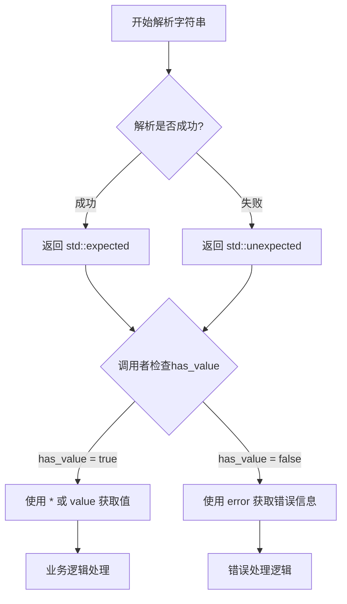

## 28.2 std::move_only_function——"独占型"函数包装器

### 28.2.1 什么是std::move_only_function？

在C++11中，我们获得了 `std::function`，这是一个可以包装任意可调用对象的"万能函数包装器"。它的特点是**可以复制**，也就是说，你可以把同一个function复制多份，存放在不同的地方。

但是，有些可调用对象是**不可复制的**：
- 独占所有权的智能指针（如 `std::unique_ptr`）
- 移动语义设计的对象
- 某些状态只能移动的闭包

`std::move_only_function`（C++23新增）正是为解决这一问题而生！它**只能移动，不能复制**。

### 28.2.2 代码示例

```cpp
#include <iostream>
#include <functional>
#include <memory>

int main() {
    // 创建一个只移动的函数包装器
    // 返回类型是 int，参数是 void
    std::move_only_function<int()> func1 = []{ return 42; };
    
    // 调用它
    int result = func1();  // 调用 operator()
    std::cout << "func1() = " << result << std::endl;  // 输出: func1() = 42
    
    // 移动语义演示
    // func1 被"转移"给 func2，之后 func1 变为空壳
    std::move_only_function<int()> func2 = std::move(func1);
    
    // func1 现在是空的！调用它会抛出 std::bad_function_call 异常
    // int r1 = func1();  // 请不要取消注释！会爆炸！
    
    // func2 仍然有效
    std::cout << "func2() = " << func2() << std::endl;  // 输出: func2() = 42
    
    // 存储不可复制的可调用对象
    auto uptr = std::make_unique<int>(100);
    std::move_only_function<int()> funcWithUnique = [ptr = std::move(uptr)]() mutable {
        return *ptr;  // 独占所有权的智能指针
    };
    
    std::cout << "funcWithUnique() = " << funcWithUnique() << std::endl;  // 输出: funcWithUnique() = 100
    
    return 0;
}
```

### 28.2.3 std::function vs std::move_only_function

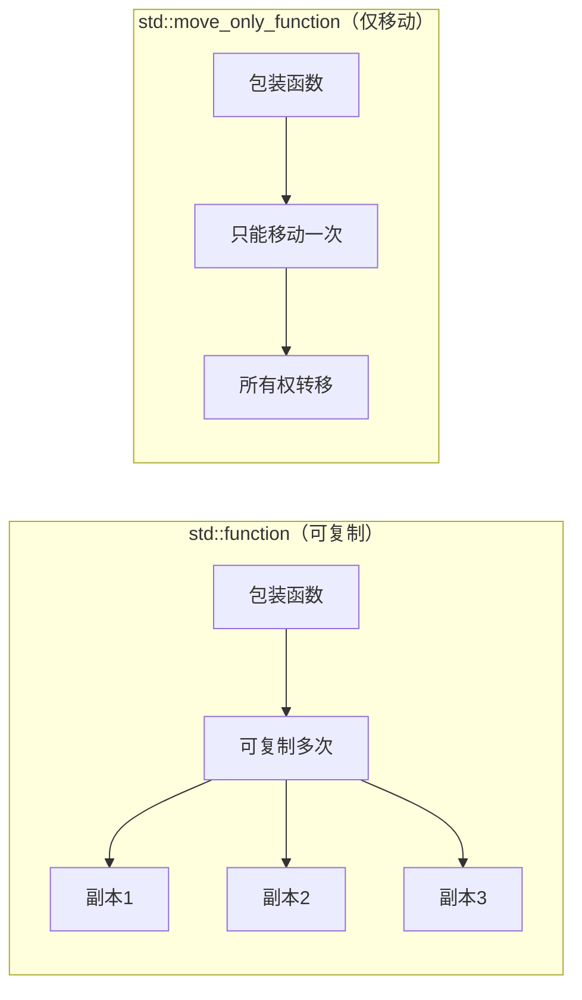

| 特性 | std::function | std::move_only_function |
|------|---------------|------------------------|
| 复制 | ✅ 支持 | ❌ 不支持 |
| 移动 | ✅ 支持 | ✅ 支持 |
| 空状态 | ✅ 可空 | ✅ 可空 |
| 适用场景 | 共享 ownership | 独占 ownership |

> 🎭 **戏剧性比喻**：如果你把可调用对象比作一只活蹦乱跳的兔子，`std::function` 就是"克隆兔子工厂"（可以复制出多只），而 `std::move_only_function` 就是"兔子快递"（只能转移，不能复制）。

## 28.3 std::bind_back——"尾巴绑定术"

### 28.3.1 什么是std::bind_back？

C++11引入了 `std::bind`，可以预先绑定一些参数。但是它有个"反人类"的设计：**从左往右绑定**！

假设你有一个函数 `f(a, b, c)`，你想绑定 `c = 10`，让 `g(a, b)` 等价于 `f(a, b, 10)`。用 `std::bind` 你得写成：

```cpp
auto g = std::bind(f, std::placeholders::_1, std::placeholders::_2, 10);  // 辣眼睛！
```

`std::bind_back`（C++23）解决了这个痛点！它是"反向绑定"——**从参数列表的尾部开始绑定**！

### 28.3.2 代码示例

```cpp
#include <iostream>
#include <functional>

int main() {
    // 定义一个三元函数
    auto f = [](int a, int b, int c) { 
        return a + b + c; 
    };
    
    // std::bind_back: 绑定尾部的参数！
    // 绑定 b=10, c=20，那么调用 g(a) 就等于 f(a, 10, 20)
    auto g = std::bind_back(f, 10, 20);
    
    // 调用 g(5) => f(5, 10, 20) => 35
    std::cout << "g(5) = " << g(5) << std::endl;  // 输出: g(5) = 35
    
    // 绑定更多参数
    auto h = std::bind_back(f, 100);  // 只绑定 c=100
    // 调用 h(1, 2) => f(1, 2, 100) => 103
    std::cout << "h(1, 2) = " << h(1, 2) << std::endl;  // 输出: h(1, 2) = 103
    
    // 完美适配成员函数！
    struct Calculator {
        int add(int x, int y) const { return x + y; }
    };
    
    Calculator calc;
    
    // 绑定成员函数的尾部参数
    // std::bind_back 也适用于成员函数！
    auto boundAdd = std::bind_back(&Calculator::add, &calc, 100);
    // 调用 boundAdd(5) => calc.add(5, 100) => 105
    std::cout << "boundAdd(5) = " << boundAdd(5) << std::endl;  // 输出: boundAdd(5) = 105
    
    return 0;
}
```

### 28.3.3 对比：std::bind vs std::bind_back

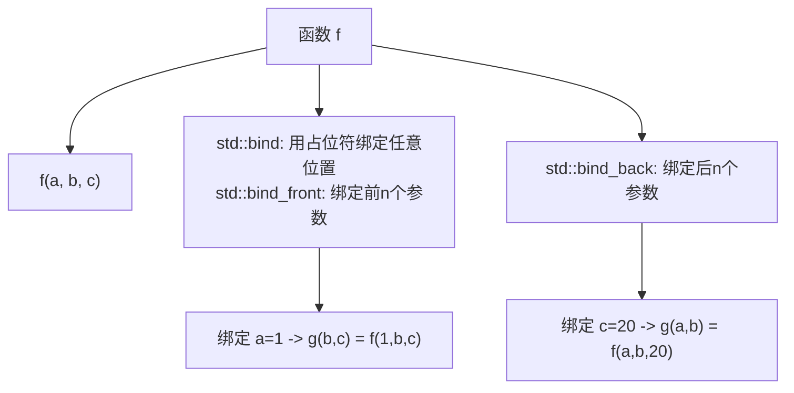

> 🎨 **艺术比喻**：想象你在吃一个汉堡，`std::bind_front` 是从顶部（面包）开始固定食材，`std::bind_back` 是从底部开始固定食材。程序员终于可以"从尾巴开始吃汉堡"了！

## 28.4 std::byteswap——字节序的"左右互搏"

### 28.4.1 什么是字节序？

在计算机的世界里，多字节数据的字节顺序因CPU架构不同而不同：

- **小端序（Little Endian）**：低字节在前，高字节在后。Intel、AMD的CPU都采用这种"低调"方式
- **大端序（Big Endian）**：高字节在前，低字节在后。网络协议、老牌IBM/Motorola CPU采用这种"高调"方式

`std::byteswap`（C++23）可以**反转一个整数类型的字节序**，在跨平台通信时超级有用！

### 28.4.2 代码示例

```cpp
#include <iostream>
#include <bit>
#include <cstdint>

int main() {
    // 一个32位整数
    unsigned int val = 0x12345678;  // 十六进制表示
    
    // std::byteswap: 反转字节顺序！
    // 0x12345678 -> 0x78563412
    auto swapped = std::byteswap(val);
    
    std::cout << "Original: 0x" << std::hex << val << std::endl;      // 输出: Original: 0x12345678
    std::cout << "Swapped:  0x" << swapped << std::endl;               // 输出: Swapped:  0x78563412
    
    // 16位短整数演示
    std::uint16_t short_val = 0x1234;
    auto short_swapped = std::byteswap(short_val);
    std::cout << "Short Original: 0x" << short_val << std::endl;      // 输出: Short Original: 0x1234
    std::cout << "Short Swapped:  0x" << short_swapped << std::endl;  // 输出: Short Swapped:  0x3412
    
    // 64位长整数演示
    std::uint64_t long_val = 0x0123456789ABCDEF;
    auto long_swapped = std::byteswap(long_val);
    std::cout << "Long Original: 0x" << long_val << std::endl;         // 输出: Long Original: 0x123456789abcdef
    std::cout << "Long Swapped:  0x" << long_swapped << std::endl;     // 输出: Long Swapped:  0xefcdab8967452301
    
    return 0;
}
```

### 28.4.3 字节序可视化

```
Original:  0x12345678 (大端序存储)
          Byte3  Byte2  Byte1  Byte0
            12    34    56    78
            
Swapped:   0x78563412 (字节反转)
          Byte3  Byte2  Byte1  Byte0
            78    56    34    12
```

> 🔄 **生活比喻**：想象你有一副扑克牌，`std::byteswap` 就是把牌从左到右完全反转。原来的顺序是"红桃A、红桃2、红桃3、红桃4"，反转后就变成"红桃4、红桃3、红桃2、红桃A"了。

### 28.4.4 使用场景

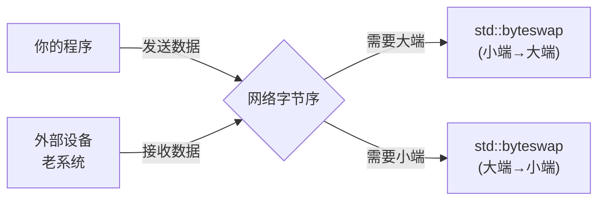

> 💡 **网络编程小贴士**：如果你的程序运行在小端机器（如x86）上，而要发送网络协议数据（大端序），`std::byteswap` 就是你的救星！

## 28.5 std::forward_like——"值类别的镜像舞者"

### 28.5.1 什么是值类别？

在C++中，表达式有两种"值类别"（value categories）：

- **左值（lvalue）**：有持久地址的表达式，可以取地址
- **右值（rvalue）**：临时的、即将销毁的表达式

C++11又引入了更细的划分：
- **lvalue**：可以取地址、有名字
- **xvalue**（eXpiring lvalue）：即将被销毁但可以移动
- **prvalue**（pure rvalue）：纯粹的右值，如临时对象、字面量

`std::forward_like<T>`（C++23）是一个精妙的工具：**保持参数的值类别转发给内部操作**。

### 28.5.2 代码示例

```cpp
#include <iostream>
#include <utility>

struct MyStruct {
    int value = 42;
};

void process(int& x) { std::cout << "Lvalue overload" << std::endl; }
void process(int&& x) { std::cout << "Rvalue overload" << std::endl; }

template<typename T>
void wrapper(T&& arg) {
    // std::forward_like<T> 会根据 T 的值类别
    // 决定返回左值引用还是右值引用
    auto forwarded = std::forward_like<T>(arg);
    
    // 打印 forwarded 的类型信息
    // 如果 T 是 MyStruct&，forwarded 就是 MyStruct&
    // 如果 T 是 MyStruct，forwarded 就是 MyStruct&&
    std::cout << "Type info: ";
    process(std::forward_like<T>(arg));
}

int main() {
    MyStruct obj;
    
    std::cout << "Calling with lvalue: ";
    wrapper(obj);  // T = MyStruct&, 转发为 lvalue
    
    std::cout << "Calling with rvalue: ";
    wrapper(std::move(obj));  // T = MyStruct, 转发为 rvalue
    
    return 0;
}
```

### 28.5.3 原理图解

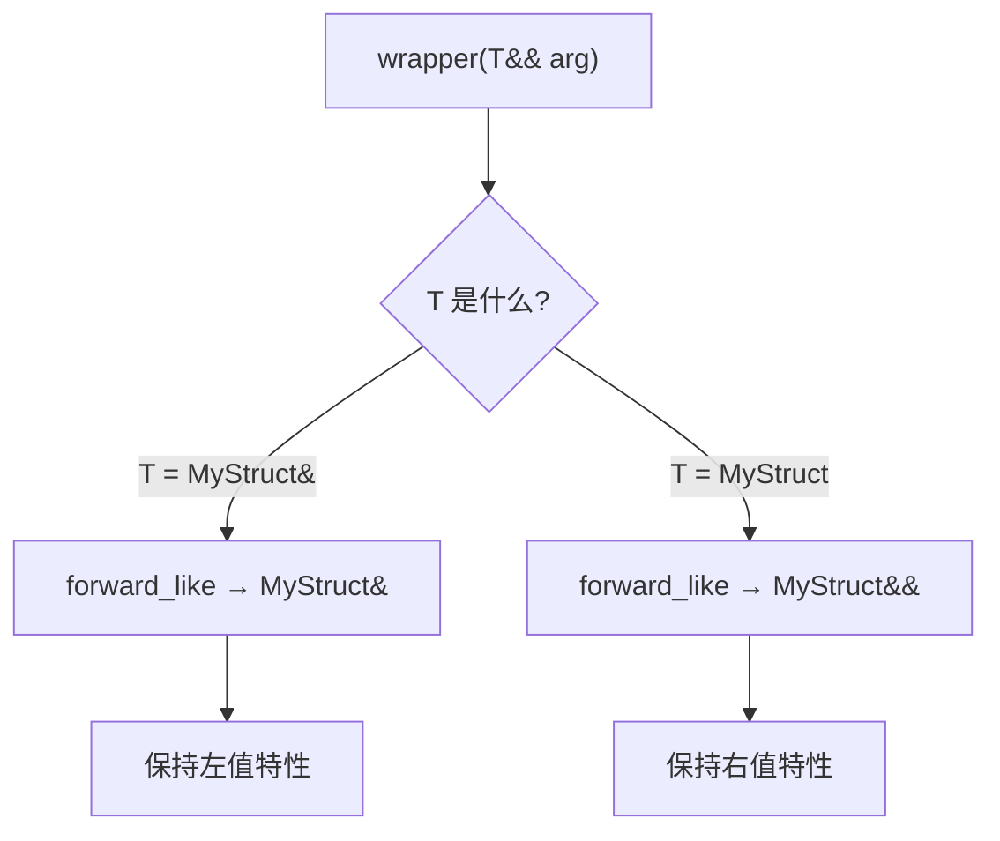

> 🎭 **戏剧性比喻**：`std::forward_like` 就像一面镜子，你给它左值它返回左值，你给它右值它返回右值，而且它还会自动处理 `const` 修饰符——它是一个完美的"值类别模仿者"！

## 28.6 std::invoke_r——"指定返回类型的invoke魔法"

### 28.6.1 什么是std::invoke_r？

`std::invoke` 是C++17引入的工具，它可以**以统一的方式调用任何可调用对象**——普通函数、成员函数、函数对象、Lambda。它会自动处理成员函数的 `this` 指针等复杂情况。

C++23新增的 `std::invoke_r<R>` 允许你**指定返回类型R**，这有什么用呢？

### 28.6.2 代码示例

```cpp
#include <iostream>
#include <functional>
#include <string>

int main() {
    // 普通Lambda
    auto f = []() { return 42; };
    int result = std::invoke_r<int>(f);  // 指定返回 int
    std::cout << "result = " << result << std::endl;  // 输出: result = 42
    
    // 返回类型不匹配时，可以进行转换！
    auto g = []() -> double { return 3.14; };
    int truncated = std::invoke_r<int>(g);  // double -> int，丢失小数部分
    std::cout << "truncated = " << truncated << std::endl;  // 输出: truncated = 3
    
    // void 返回类型
    auto h = []() { std::cout << "Hello from void lambda!" << std::endl; };
    std::invoke_r<void>(h);  // 输出: Hello from void lambda!
    
    // 成员函数调用
    struct S {
        int method() { return 100; }
    };
    S s;
    int method_result = std::invoke_r<int>(&S::method, s);
    std::cout << "method_result = " << method_result << std::endl;  // 输出: method_result = 100
    
    // std::invoke_r vs std::invoke
    // std::invoke 会自动推导返回类型
    // std::invoke_r 强制转换为你指定的类型
    
    return 0;
}
```

### 28.6.3 为什么需要指定返回类型？

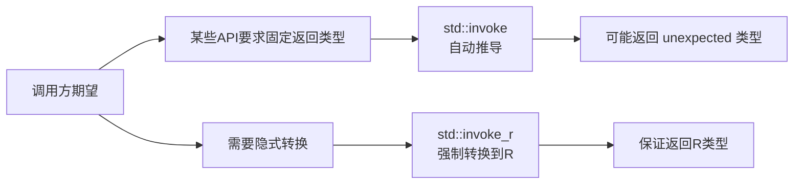

> 💡 **使用场景**：某些泛型库或框架要求回调必须返回特定类型，此时 `std::invoke_r` 就能大显身手！

## 28.7 std::to_underlying——"枚举的透视眼"

### 28.7.1 什么是底层类型？

枚举类（`enum class`）是C++11引入的"强类型枚举"，它不会隐式转换为整数。但有时候，我们确实需要获取枚举的**底层整数值**。

C++23之前，你需要写一些"丑代码"：
```cpp
Color c = Color::Green;
int underlying = static_cast<int>(c);  // 辣眼睛！
```

`std::to_underlying`（C++23）让这一切变得优雅！

### 28.7.2 代码示例

```cpp
#include <iostream>
#include <utility>

// 定义一个强类型枚举，默认底层类型是 int
enum class Color : int { Red = 1, Green = 2, Blue = 3 };

// 也可以显式指定其他底层类型
enum class Status : unsigned char { OK = 0, Error = 1, Pending = 2 };

int main() {
    Color c = Color::Green;
    
    // 使用 std::to_underlying 获取底层值！
    int underlying = std::to_underlying(c);
    std::cout << "underlying = " << underlying << std::endl;  // 输出: underlying = 2
    
    // 处理其他底层类型的枚举
    Status s = Status::Error;
    auto status_val = std::to_underlying(s);
    std::cout << "status_val = " << static_cast<int>(status_val) << std::endl;  // 输出: status_val = 1
    
    // 在switch中使用
    switch (std::to_underlying(c)) {
        case 1: std::cout << "Red" << std::endl; break;
        case 2: std::cout << "Green" << std::endl; break;
        case 3: std::cout << "Blue" << std::endl; break;
    }
    
    return 0;
}
```

> 🎯 **为什么需要它**：`static_cast<int>` 的问题在于它太"泛泛"了——任何枚举都能 cast 成 int，编译器不会检查你是否 cast 错了枚举类型。`std::to_underlying` 是**类型安全的**，它只接受枚举类型。

## 28.8 std::unreachable——"编译器的生死簿"

### 28.8.1 什么是std::unreachable？

`std::unreachable`（C++23）是标准库提供的一个"断言"函数，它告诉编译器：**"这行代码永远不可能被执行到！"**

如果你写了一个 `switch` 语句覆盖了所有枚举值，`default` 分支理论上永远不应该到达。这时你可以写 `std::unreachable()`，如果编译器足够聪明，它会：
1. 优化掉这个分支
2. 如果真的到达了（理论上不可能），程序会 `std::terminate()`（终止）

### 28.8.2 代码示例

```cpp
#include <iostream>
#include <utility>

// 定义一个状态枚举
enum class State { Start, Middle, End };

// 定义一个操作函数
void process(State s) {
    switch (s) {
        case State::Start: 
            std::cout << "Starting..." << std::endl; 
            break;
        case State::Middle: 
            std::cout << "Middle of work" << std::endl; 
            break;
        case State::End: 
            std::cout << "Finished!" << std::endl; 
            break;
        default:
            // 默认分支，告诉编译器这是不可能到达的
            // 如果真的到达了，程序会 std::terminate()（而非 abort！）
            std::unreachable();  // C++23
    }
}

int main() {
    process(State::Start);    // 输出: Starting...
    process(State::Middle);   // 输出: Middle of work
    process(State::End);      // 输出: Finished!
    
    // 如果你尝试 process(static_cast<State>(999));
    // 程序会 std::terminate()
    
    return 0;
}
```

### 28.8.3 编译器优化

```cpp
// 没有 std::unreachable
void process_slow(State s) {
    switch (s) {
        case State::A: return f();
        case State::B: return g();
        case State::C: return h();
        default: return;  // 编译器必须生成处理"未知值"的代码
    }
}

// 有 std::unreachable
void process_fast(State s) {
    switch (s) {
        case State::A: return f();
        case State::B: return g();
        case State::C: return h();
        default: std::unreachable();  // 编译器可以大胆假设永远不会到这里
    }
}
```

> 🐔 **打鸣比喻**：想象公鸡打鸣——太阳升起，公鸡打鸣。但如果你告诉编译器："`default` 分支是永远不会执行的"，编译器就像知道了"太阳永远不会从西边升起"一样，可以做出更激进的优化！

## 28.9 std::optional的单态操作——"链式调用的艺术"

### 28.9.1 什么是单态操作？

`std::optional` 从C++17引入，代表一个"可能存在"的值。它有一个问题：使用起来很繁琐！

```cpp
// C++17 时代的痛苦
std::optional<int> opt = getOptional();
if (opt.has_value()) {
    int val = *opt;
    // 对 val 做点什么...
}
```

C++23给 `std::optional` 增加了一系列**单态操作**（Monadic Operations），支持链式调用，就像 `std::expected` 一样优雅！

### 28.9.2 代码示例

```cpp
#include <iostream>
#include <optional>

int main() {
    std::optional<int> opt = 42;
    
    // 1. and_then: 如果有值，执行函数返回新的 optional
    // 如果是空，直接返回空 optional
    auto result1 = opt.and_then([](int x) {
        return std::optional<int>(x * 2);
    });
    std::cout << "and_then result: " << (result1 ? std::to_string(*result1) : "nullopt") << std::endl;
    // 输出: and_then result: 84
    
    // 2. map: 如果有值，对值做变换，返回新的 optional
    auto result2 = opt.map([](int x) {
        return x * 3;  // 返回非 optional，但会被自动包装
    });
    std::cout << "map result: " << (result2 ? std::to_string(*result2) : "nullopt") << std::endl;
    // 输出: map result: 126
    
    // 3. transform: 和 map 类似，但是用于 void 的情况
    opt.transform([](int x) {
        std::cout << "transforming " << x << std::endl;
    });
    
    // 4. or_else: 如果是空，执行函数返回默认值
    std::optional<int> empty_opt;
    auto result3 = empty_opt.or_else([] {
        return std::optional<int>(-1);
    });
    std::cout << "or_else result: " << *result3 << std::endl;  // 输出: -1
    
    // 链式调用！
    auto final_result = opt
        .and_then([](int x) { return std::optional<int>(x + 1); })
        .map([](int x) { return x * 2; })
        .or_else([] { return std::optional<int>(0); });
    
    std::cout << "Chained result: " << *final_result << std::endl;  // 输出: 86
    
    return 0;
}
```

### 28.9.3 操作图解

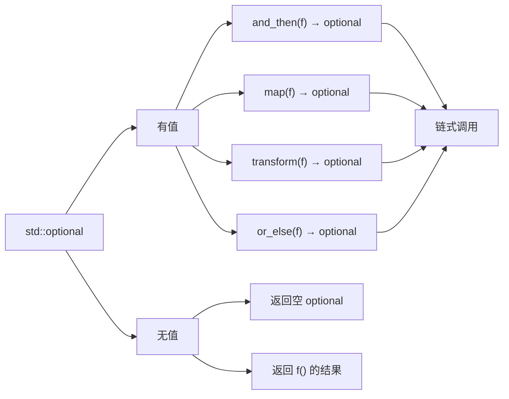

> 🔗 **链条比喻**：单态操作就像乐高积木，每一块都可以连接到下一块。你不需要检查 `optional` 是否有值，链式调用会自动处理——有空就短路，没空就继续！

## 28.10 std::generator——"惰性序列的发电机"

### 28.10.1 什么是std::generator？

`std::generator`（预计纳入C++26）是C++标准库中的**协程（Coroutine）**实现，专门用于创建**惰性序列**（Lazy Sequence）。

> ⚠️ **重要提示**：`std::generator` 原本计划进入C++23，但最终被推迟到C++26（P2502R2）。截至2024年，没有任何编译器完整支持它。本节内容为前瞻性介绍，请勿在实际项目中使用！

**什么是惰性序列？**

想象你要遍历斐波那契数列的前1000个数字：
- ** eager 方式**：先生成所有1000个数字，存到数组里——浪费内存！
- **lazy 方式**：每次需要时计算下一个——`std::generator` 就是干这个的！

### 28.10.2 代码示例

```cpp
#include <iostream>
// #include <generator>  // 实验性支持

// 定义一个生成器：生成斐波那契数列
// std::generator<yield_type, argument_type>
std::generator<int, int> fibonacci(int n) {
    // co_yield 类似于 return，但下次调用时会从这里继续
    co_yield 0;   // 第一个数字
    co_yield 1;   // 第二个数字
    
    int a = 0, b = 1;
    for (int i = 2; i < n; ++i) {
        int next = a + b;
        co_yield next;  // 产出当前值
        a = b;
        b = next;
    }
}

// 生成偶数的生成器
std::generator<int> generateEvens(int start) {
    for (int i = start; ; i += 2) {
        co_yield i;  // 无限序列！
    }
}

int main() {
    std::cout << "std::generator in C++23 (conceptual example)" << std::endl;
    
    // 注意：由于编译器支持有限，这里展示概念而非可编译代码
    /*
    // 使用斐波那契生成器
    for (int fib : fibonacci(10)) {
        std::cout << fib << " ";  // 输出: 0 1 1 2 3 5 8 13 21 34
    }
    std::cout << std::endl;
    
    // 只取前5个
    int count = 0;
    for (int fib : fibonacci(1000)) {
        std::cout << fib << " ";
        if (++count >= 5) break;  // 惰性！只计算了5个
    }
    */
    
    return 0;
}
```

### 28.10.3 协程 vs 迭代器


> ⚡ **电力比喻**：如果你需要一个发电机，`std::generator` 就是那个"随取随用"的发电机——你需要多少电，它就发多少电，而不是一次性发1000度存起来！

## 28.11 std::stacktrace——"代码的时间旅行"

### 28.11.1 什么是stacktrace？

`std::stacktrace`（C++23）允许你在运行时获取**当前线程的调用栈**（Call Stack），就像你在程序崩溃时看到的错误信息一样。

这对于**调试、日志记录、性能分析**都非常有用！

### 28.11.2 代码示例

```cpp
#include <iostream>
#include <stacktrace>
#include <string>

// 辅助函数：打印堆栈跟踪
void printStackTrace(const std::stacktrace& trace = std::stacktrace::current()) {
    std::cout << "=== Stack Trace (" << trace.size() << " frames) ===" << std::endl;
    
    // 遍历每一个栈帧
    for (size_t i = 0; i < trace.size(); ++i) {
        const std::stacktrace_entry& frame = trace[i];
        
        // 获取帧的信息
        std::cout << "Frame " << i << ": " << frame.description() << std::endl;
        // frameNativeHandle() 可以获取原生句柄
        // to_string() 可以获取完整描述
    }
}

// 层级3：最深层的函数
void level3() {
    std::cout << "In level3()" << std::endl;
    auto trace = std::stacktrace::current();
    std::cout << "level3 stacktrace has " << trace.size() << " frames" << std::endl;
}

// 层级2：调用level3
void level2() {
    std::cout << "In level2()" << std::endl;
    level3();
}

// 层级1：调用level2
void level1() {
    std::cout << "In level1()" << std::endl;
    level2();
}

int main() {
    std::cout << "=== Stacktrace Demo ===" << std::endl;
    
    // 获取当前调用栈
    auto trace = std::stacktrace::current();
    std::cout << "Stack trace has " << trace.size() << " frames" << std::endl;
    
    for (const auto& frame : trace) {
        std::cout << frame << std::endl;
    }
    
    std::cout << "\n=== Nested Call Demo ===" << std::endl;
    level1();
    
    return 0;
}
```

### 28.11.3 stacktrace示意图

```
┌─────────────────────────────────────┐
│ main()                              │  ← Frame 0 (最顶层/最外层)
├─────────────────────────────────────┤
│ level1()                            │  ← Frame 1
├─────────────────────────────────────┤
│ level2()                            │  ← Frame 2
├─────────────────────────────────────┤
│ level3() ← std::stacktrace::current() |  ← Frame 3 (最内层/最深)
└─────────────────────────────────────┘
```

> 🔍 **侦探比喻**：如果程序是一个犯罪现场，`std::stacktrace` 就是C++给你的"监控录像"——它能告诉你**程序是怎么一步步走到这里的**，是调试复杂bug的利器！

## 28.12 std::print与std::println——"格式化打印的文艺复兴"

### 28.12.1 为什么需要std::print？

C++的 `printf` 是C的遗产，不类型安全；
`std::cout` 是C++的遗产，格式化能力弱爆了。

`std::print` 和 `std::println`（C++23）借鉴了Python的 `print` 函数风格，提供：
- **类型安全**：编译时检查
- **格式化字符串**：用 `{}` 占位符
- **高性能**：异步I/O支持

### 28.12.2 代码示例

```cpp
#include <iostream>
#include <print>

int main() {
    // 基本打印（类似 cout，但更好用）
    std::print("Hello, World!\n");  // 不自动换行
    std::println("Hello, World!");  // 自动换行
    
    // 格式化字符串！
    std::print("Name: {}, Age: {}\n", "Alice", 30);
    // 输出: Name: Alice, Age: 30
    
    // 位置参数
    std::print("{1} {0} {2}\n", "brown", "fox", "jumps");
    // 输出: fox brown jumps
    
    // 数字格式化
    std::print("Pi: {:.4f}\n", 3.14159265);
    // 输出: Pi: 3.1416
    
    std::print("Hex: {:#x}\n", 255);
    // 输出: Hex: 0xff
    
    std::print("Binary: {:b}\n", 42);
    // 输出: Binary: 101010
    
    // 对齐和填充
    std::print("|{:>10}|\n", "right");    // 右对齐
    std::print("|{:<10}|\n", "left");     // 左对齐
    std::print("|{:^10}|\n", "center");  // 居中
    
    // 输出到文件
    // std::ofstream file("output.txt");
    // std::print(file, "Writing to file: {}\n", 123);
    
    return 0;
}
```

### 28.12.3 格式化符号速查表

| 格式说明符 | 含义 | 示例 |
|-----------|------|------|
| `{}` | 默认格式 | `{}` → `42` |
| `{:d}` | 整数（十进制） | `{:d}` → `42` |
| `{:x}` | 整数（十六进制） | `{:x}` → `2a` |
| `{:b}` | 整数（二进制） | `{:b}` → `101010` |
| `{:f}` | 浮点数 | `{:f}` → `3.140000` |
| `{:.2f}` | 浮点数（2位小数） | `{:.2f}` → `3.14` |
| `{:>10}` | 右对齐（宽度10） | `{:>10}` → `      42` |
| `{:08d}` | 前导零 | `{:08d}` → `00000042` |

> 🎨 **艺术比喻**：`std::cout` 是白纸黑字写标语，`std::print` 是专业的书法家——可以左对齐、右对齐、斜对齐，还能给你画表格写数字！

## 28.13 std::mdspan——"多维数组的透视图"

### 28.13.1 什么是std::mdspan？

`std::mdspan`（C++23）是一个**多维数组视图**（Multi-Dimensional Span），它允许你以**不同的维度视角**查看一维数据。

类比：`std::span` 是一维数组的视图，`std::mdspan` 是多维数组的视图。

### 28.13.2 代码示例

```cpp
#include <iostream>
// #include <mdspan>  // 实验性支持

int main() {
    std::cout << "std::mdspan in C++23 (conceptual example)" << std::endl;
    
    /*
    // 原始数据：一维数组
    int data[] = {1, 2, 3, 4, 5, 6};
    
    // 将 data 视图化为 2x3 的二维数组
    // std::extents<size_t, 2, 3> 指定维度为 2 行 3 列
    std::mdspan<int, std::extents<size_t, 2, 3>> matrix(data);
    
    // 按行列访问
    std::cout << matrix[0, 0] << std::endl;  // 输出: 1 (第0行第0列)
    std::cout << matrix[0, 1] << std::endl;  // 输出: 2 (第0行第1列)
    std::cout << matrix[1, 2] << std::endl;  // 输出: 6 (第1行第2列)
    
    // 获取维度信息
    std::cout << "Rows: " << matrix.extent(0) << std::endl;  // 输出: 2
    std::cout << "Cols: " << matrix.extent(1) << std::endl;  // 输出: 3
    
    // 同一个数据，不同视角！
    // 3x2 的视图
    std::mdspan<int, std::extents<size_t, 3, 2>> transposed(data);
    std::cout << transposed[0, 0] << std::endl;  // 输出: 1
    std::cout << transposed[2, 1] << std::endl;  // 输出: 6
    
    // 动态维度
    std::mdspan<int, std::dextents<size_t, 2>> dynamic_matrix(
        data, 
        std::dextents<size_t, 2>{2, 3}  // 运行时指定维度
    );
    */
    
    return 0;
}
```

### 28.13.3 mdspan视角变换

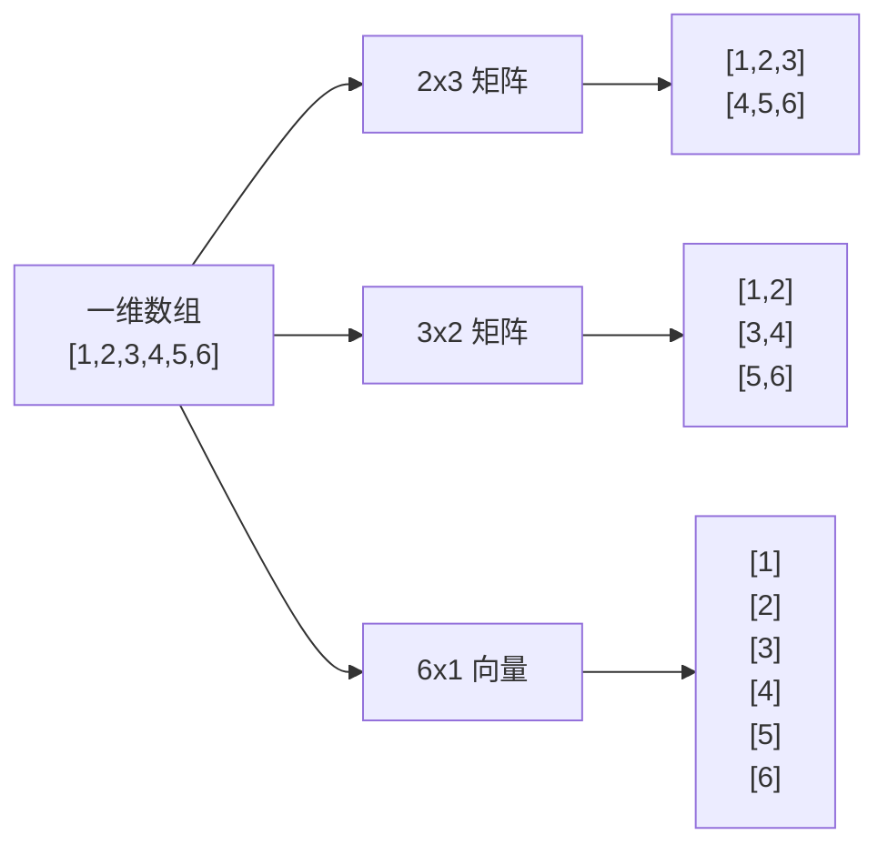

> 🕶️ **透视比喻**：想象你有一副神奇的"多维透视眼镜"——同一堆数据，你可以戴上"2x3滤镜"看，也可以戴上"3x2滤镜"看，`std::mdspan` 就是那副眼镜！

## 28.14 扁平容器——"缓存友好的秘密武器"

### 28.14.1 什么是扁平容器？

`std::flat_map`、`std::flat_set`（C++23）是标准库新增的容器适配器，它们内部使用**连续内存存储**（vector/deque）而不是传统的树结构（红黑树）。

### 28.14.2 为什么需要扁平容器？

传统的 `std::map` 和 `std::set` 使用**红黑树**（一种自平衡二叉搜索树），每个节点单独分配内存，节点之间通过指针连接。这导致：
- **CPU缓存不友好**：访问相邻元素可能触发多次内存跳转
- **内存开销大**：每个节点需要额外的左右指针和颜色标记

扁平容器把所有元素存在**连续的数组**中，类似 `std::vector`，查找时可以用二分法，插入/删除时需要移动元素。

### 28.14.3 代码示例

```cpp
#include <iostream>
// #include <flat_map>
// #include <flat_set>

int main() {
    std::cout << "Flat containers in C++23 (conceptual example)" << std::endl;
    
    /*
    // flat_set 示例
    std::flat_set<int> fs = {5, 2, 8, 1, 9};
    // 内部存储：[1, 2, 5, 8, 9]（有序、连续）
    
    // 查找
    auto it = fs.find(5);
    if (it != fs.end()) {
        std::cout << "Found: " << *it << std::endl;
    }
    
    // flat_map 示例
    std::flat_map<std::string, int> fm = {
        {"apple", 1},
        {"banana", 2},
        {"cherry", 3}
    };
    
    // 插入（可能需要移动元素）
    fm.insert({"date", 4});
    
    // 访问
    std::cout << fm["apple"] << std::endl;  // 输出: 1
    
    // 迭代器是随机访问的！（普通map是双向迭代器）
    // 可以用 fs.begin() + 3 这种骚操作
    
    // 优点：更好的缓存局部性
    // 缺点：插入/删除是 O(n)，而普通 map 是 O(log n)
    */
    
    return 0;
}
```

### 28.14.4 传统容器 vs 扁平容器

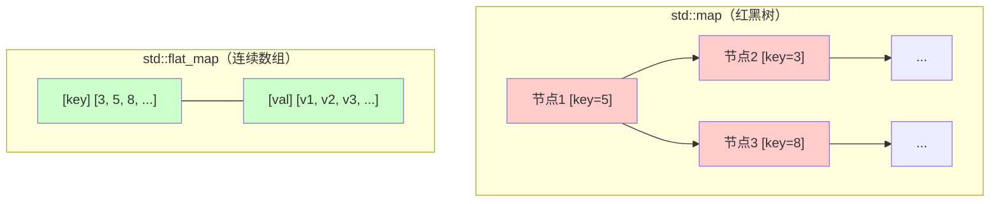

| 特性 | std::map | std::flat_map |
|------|----------|---------------|
| 底层结构 | 红黑树（指针连接） | 两个 vector |
| 内存布局 | 不连续，缓存不友好 | 连续，缓存友好 |
| 查找复杂度 | O(log n) | O(log n)（二分） |
| 插入复杂度 | O(log n) | O(n)（可能需要移动） |
| 迭代器类型 | 双向 | 随机访问 |

> 🏠 **比喻**：想象你在一个图书馆找书。`std::map` 是把书分散放在不同楼层的不同书架上，你得走来走去；`std::flat_map` 是把所有书按字母顺序排在同一个长桌上，找起来更快（如果你知道大概位置）！

## 28.15 新范围适配器——"范围库的工具箱"

### 28.15.1 什么是范围适配器？

C++20引入了**范围库**（Ranges Library），允许你用**管道操作符**（`|`）链式组合"视图"（Views）。

C++23又新增了多个实用的范围适配器！

### 28.15.2 新增适配器一览

| 适配器 | 作用 | 示例 |
|--------|------|------|
| `views::chunk_by` | 按谓词分组 | 相邻满足条件的分一组 |
| `views::cartesian_product` | 生成笛卡尔积 | `[1,2] × [a,b] → [1a,1b,2a,2b]` |
| `views::as_const` | 转为const视图 | 防止修改 |
| `views::as_rvalue` | 转为右值视图 | 用于移动语义 |
| `views::adjacent` | 生成相邻元素对 | `[a,b,c] → [(a,b), (b,c)]` ⚠️ C++26 |
| `views::adjacent_transform` | 对相邻元素对做变换 | 同上，但应用函数 ⚠️ C++26 |

### 28.15.3 代码示例

```cpp
#include <iostream>
#include <ranges>
#include <vector>

int main() {
    std::cout << "New range adaptors in C++23" << std::endl;
    
    std::vector<int> nums = {1, 2, 3, 4, 5, 6};
    
    // views::adjacent - 生成滑动窗口（窗口大小默认2）
    // auto pairs = nums | std::views::adjacent;  // 生成 [(1,2), (2,3), ...]
    
    // views::chunk_by - 按条件分组
    // auto groups = nums | std::views::chunk_by([](int a, int b) { return a + 1 == b; });
    // [1,2,3] 是一组（连续），[4,5,6] 是另一组
    
    // views::cartesian_product - 笛卡尔积
    // std::vector<int> a = {1, 2}, b = {10, 20};
    // auto product = std::views::cartesian_product(a, b);
    // 结果：[(1,10), (1,20), (2,10), (2,20)]
    
    // views::as_const - 防止修改
    // auto const_view = nums | std::views::as_const;
    
    std::cout << "Range adaptors provide lazy, composable transformations!" << std::endl;
    
    return 0;
}
```

### 28.15.4 管道操作符链式调用

```cpp
// 传统方式：循环嵌套循环
for (int i = 0; i < n; ++i) {
    for (int j = 0; j < m; ++j) {
        process(i, j);
    }
}

// 范围方式：优雅的管道链
nums 
    | std::views::filter([](int x) { return x % 2 == 0; })  // 过滤偶数
    | std::views::transform([](int x) { return x * x; })     // 平方
    | std::views::take(5)                                     // 取前5个
    | std::views::reverse;                                    // 反转
```

> 🚰 **管道比喻**：范围适配器就像工厂的流水线——原材料（数据）从左边进去，经过一系列处理工位（适配器），最后出来的是成品。数据是**惰性求值**的，只有你真正需要的时候才会处理！

## 28.16 std::basic_common_reference改进

### 28.16.1 什么是basic_common_reference？

`std::basic_common_reference` 是C++标准库中用于**元编程**的基础设施，它定义了"两个类型之间的公共引用类型"。

这是一个**非常高级的元编程工具**，普通程序员很少直接用到，但却是很多库内部实现的关键。

### 28.16.2 代码示例

```cpp
#include <iostream>

int main() {
    // std::basic_common_reference 是模板元编程的工具
    // 它用于定义"common reference"——两个类型可以互相转换的引用类型
    
    // 简单示例：
    // 对于 T& 和 T&&，common reference 是 T&
    // 对于 T& 和 const T&，common reference 是 const T&
    
    // C++23 对 basic_common_reference 进行了改进
    // 使其更好地支持自定义类型之间的转换
    
    std::cout << "Improvements to basic_common_reference in C++23" << std::endl;
    std::cout << "This is a metaprogramming facility for library authors." << std::endl;
    
    return 0;
}
```

> 📚 **学习建议**：`basic_common_reference` 就像是"汽车引擎的零件"——普通司机不需要知道它是什么，但汽车工程师必须精通。大多数C++程序员不需要直接使用这个功能！

## 28.17 std::tuple与类元组对象兼容——"结构体的元组化改造"

### 28.17.1 什么是类元组对象？

C++17引入了**结构化绑定**（Structured Bindings），允许你这样写：

```cpp
std::pair<int, int> p = {1, 2};
auto [x, y] = p;  // x=1, y=2
```

这意味着 `std::pair` 是"元组兼容"的。但如果你自己定义一个 `struct Point`，能做到吗？

C++23告诉你：**可以！** 只需要给你的结构体加上几个"元组特性"。

### 28.17.2 代码示例

```cpp
#include <iostream>
#include <tuple>

// 定义一个简单的点结构
struct Point {
    int x;
    int y;
    
    // 1. 提供 get<I>() 方法
    // 模板参数 I 是元组索引（0, 1, 2, ...）
    template<size_t I>
    auto get() const {
        if constexpr (I == 0) return x;
        else if constexpr (I == 1) return y;
        else static_assert(I < 2, "Point only has 2 elements!");
    }
};

// 2. 在 std 命名空间中特化 tuple_size 和 tuple_element
namespace std {
    // 告诉 std::tuple_size：Point 有 2 个元素
    template<>
    struct tuple_size<Point> : integral_constant<size_t, 2> {};
    
    // 告诉 std::tuple_element：Point 的第 I 个元素类型是什么
    template<size_t I>
    struct tuple_element<I, Point> {
        using type = int;  // Point 的两个元素都是 int
    };
}

// 现在 Point 可以使用结构化绑定了！
int main() {
    Point p{1, 2};
    
    // 结构化绑定！
    auto [px, py] = p;
    std::cout << "x=" << px << ", y=" << py << std::endl;  // 输出: x=1, y=2
    
    // 还能用于 std::tuple 算法
    std::tuple<Point> tp = std::make_tuple(p);
    
    // 交换两个 Point 的值
    Point p1{10, 20};
    Point p2{30, 40};
    std::swap(p1, p2);  // 现在 swap 也支持了！
    
    std::cout << "After swap: p1=(" << p1.x << "," << p1.y << ")" << std::endl;
    // 输出: After swap: p1=(30,40)
    
    return 0;
}
```

### 28.17.3 特化原理图

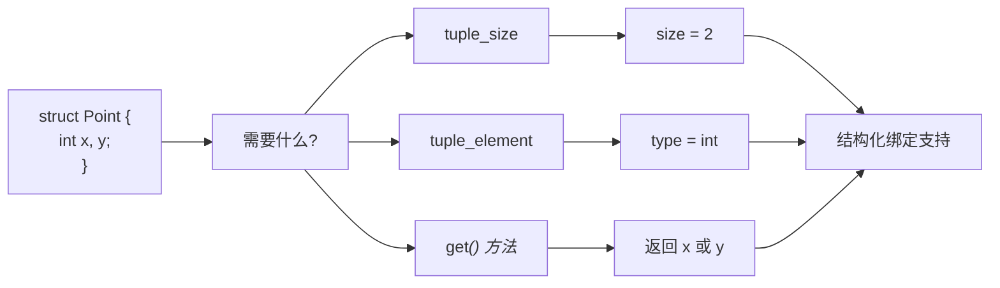

> 🎭 **变装比喻**：给你的 `struct` 加上这些特化，就像是给它一套"戏服"——穿上之后，它就能扮演"元组"这个角色了，可以在任何需要 `tuple` 的地方使用！

## 28.18 std::pair转发构造函数默认参数——"pair的自我修养"

### 28.18.1 问题背景

C++23之前，如果你想创建一个 `pair`，但只想提供第一个元素，第二个元素必须手动指定：

```cpp
std::pair<int, std::string> p1(1, "default");  // 传统方式
std::pair p2(1);  // C++23之前：编译错误！
```

C++23让 `std::pair` 和 `std::tuple` 支持**转发构造函数默认参数**——如果没提供，就使用默认构造！

### 28.18.2 代码示例

```cpp
#include <iostream>
#include <utility>
#include <string>
#include <vector>

int main() {
    // C++23: pair支持不完整的构造
    // 注意：std::string 无法从 int 构造，所以下面的写法是错的！
    // std::pair<int, std::string> p(1);  // ❌ 编译错误！std::string 没有接受 int 的构造函数
    // std::tuple<int, double, std::string> t(10);  // ❌ 同样的问题
    
    // 正确用法：第二个元素的类型必须能从 int 构造，或者有默认构造函数
    std::pair<int, std::vector<int>> p(42);  // int(42) + vector<int>() 默认构造
    std::cout << "p.first = " << p.first << std::endl;       // 输出: 42
    std::cout << "p.second.empty() = " << p.second.empty() << std::endl;  // 输出: 1 (true)
    
    // tuple 也支持类似用法
    std::tuple<int, double, std::vector<int>> t(10, 3.14);  // 前两个用提供的值，vector默认构造
    std::cout << "get<0>(t) = " << std::get<0>(t) << std::endl;  // 输出: 10
    std::cout << "get<1>(t) = " << std::get<1>(t) << std::endl;  // 输出: 3.14
    std::cout << "get<2>(t).empty() = " << std::get<2>(t).empty() << std::endl;  // 输出: 1 (true)
    
    // 甚至可以只提供一个元素，其余默认构造
    std::pair<double, std::string> partial(2.718);
    std::cout << "partial.first = " << partial.first << std::endl;  // 输出: 2.718
    std::cout << "partial.second.empty() = " << partial.second.empty() << std::endl;  // 输出: 1 (true)
    
    return 0;
}
```

> ⚠️ **警告**：使用此特性时，**确保未提供的元素类型有默认构造函数**，且默认构造不会带来性能问题。如果第一个参数类型的构造函数与第二个不兼容，代码将无法编译！

## 28.19 std::ssize——"带符号的大小"

### 28.19.1 什么是std::ssize？

`std::ssize`（C++23）返回容器的**带符号大小**（signed size）。

传统上，`std::size()` 返回 `size_t`（无符号整数），这在循环中会导致一些尴尬的代码：

```cpp
// 传统方式：尴尬的写法
for (size_t i = 0; i < vec.size(); ++i) {  // i 是无符号的
    // 如果你想 i-- 减到负数... 灾难！
}
```

### 28.19.2 代码示例

```cpp
#include <iostream>
#include <vector>
#include <list>
#include <array>

int main() {
    std::vector<int> v{1, 2, 3, 4, 5};
    
    // std::size: 返回 size_t（无符号）
    std::size_t unsigned_size = std::size(v);
    std::cout << "std::size = " << unsigned_size << std::endl;  // 输出: 5
    
    // std::ssize: 返回 ptrdiff_t（带符号！）
    std::ptrdiff_t signed_size = std::ssize(v);
    std::cout << "std::ssize = " << signed_size << std::endl;  // 输出: 5
    
    // 优势1：可以安全地做减法
    std::ptrdiff_t half = std::ssize(v) / 2;
    std::cout << "Half size = " << half << std::endl;  // 输出: 2
    
    // 优势2：可以表示"负数"表示法
    // 比如，从末尾往前遍历
    for (std::ptrdiff_t i = std::ssize(v) - 1; i >= 0; --i) {
        std::cout << v[i] << " ";  // 输出: 5 4 3 2 1
    }
    std::cout << std::endl;
    
    // 支持所有容器
    std::list<double> lst = {1.1, 2.2, 3.3};
    std::cout << "list ssize = " << std::ssize(lst) << std::endl;  // 输出: 3
    
    std::array<char, 4> arr = {'a', 'b', 'c', 'd'};
    std::cout << "array ssize = " << std::ssize(arr) << std::endl;  // 输出: 4
    
    // C风格数组也支持！
    int raw[] = {10, 20, 30};
    std::cout << "raw array ssize = " << std::ssize(raw) << std::endl;  // 输出: 3
    
    return 0;
}
```

### 28.19.3 有符号 vs 无符号

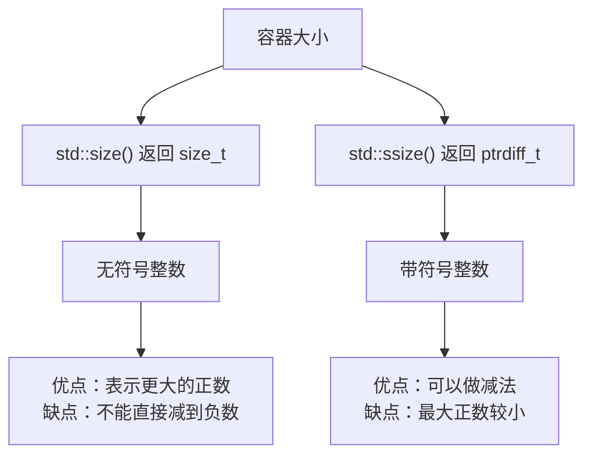

> 🔢 **算盘比喻**：无符号整数就像只能往右拨的算盘，有符号整数就像传统算盘——可以往左拨表示负数。当然，你也可以往右拨更多珠子（无符号能表示更大的数）！

## 28.20 std::to_array——"数组的批量生产工厂"

### 28.20.1 什么是std::to_array？

`std::to_array`（C++20引入，C++23进一步完善）是一个"批量数组工厂"——它可以从**初始化列表**或**数组**创建一个 `std::array`。

> 📝 **冷知识**：`std::to_array` 其实出生于 C++20，不是 C++23！但既然是实用工具，我们不介意在这里再提一遍。

### 28.20.2 代码示例

```cpp
#include <iostream>
#include <array>
#include <string>
#include <vector>

int main() {
    // 从初始化列表创建 array
    auto arr1 = std::to_array({1, 2, 3, 4, 5});
    std::cout << "arr1.size() = " << arr1.size() << std::endl;  // 输出: 5
    std::cout << "arr1[2] = " << arr1[2] << std::endl;           // 输出: 3
    
    // 从字符串数组创建
    auto arr2 = std::to_array({"apple", "banana", "cherry"});
    std::cout << "arr2.size() = " << arr2.size() << std::endl;  // 输出: 3
    std::cout << "arr2[1] = " << arr2[1] << std::endl;           // 输出: banana
    
    // 自动推断元素类型
    auto arr3 = std::to_array({1.1, 2.2, 3.3});
    std::cout << "arr3 element type is double: " 
              << std::is_same_v<decltype(arr3)::value_type, double> << std::endl;
    // 输出: 1 (true)
    
    // 拷贝构造（注意：不是引用！）
    int raw[] = {10, 20, 30};
    auto arr4 = std::to_array(raw);  // 拷贝！
    arr4[0] = 999;  // raw[0] 还是 10
    std::cout << "raw[0] = " << raw[0] << std::endl;  // 输出: 10
    
    // 从 vector 创建（注意：需要显式指定类型）
    std::vector<int> vec = {100, 200, 300};
    // auto arr5 = std::to_array(vec);  // 错误！不能从 vector 直接创建
    // 正确做法：
    std::array<int, 3> arr5 = {vec[0], vec[1], vec[2]};
    
    return 0;
}
```

### 28.20.3 to_array vs 传统方式

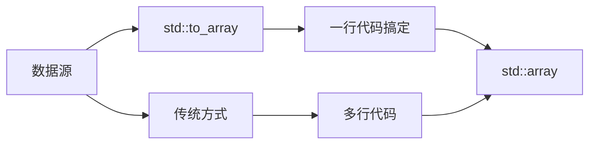

> 🏭 **工厂比喻**：想象你需要一堆规格统一的集装箱（`std::array`）。传统方式是你自己一个个焊接，`std::to_array` 是一个一键生成的自动化工厂——你告诉它原料，它给你成品！

## 28.21 异构查找的无序容器——"万能钥匙"

### 28.21.1 什么是异构查找？

传统的 `std::unordered_map` 要求查找时使用的类型必须和 key 类型完全匹配：

```cpp
std::unordered_map<std::string, int> m;
// m.find("hello");  // OK，const char* 可以转换为 std::string
// m.find(42);  // 编译错误！int 不能转 std::string
```

> 📝 **背景**：有序容器（`std::map`、`std::set`）的异构查找早在 C++14 就通过透明比较器（Transparent Comparator）实现了。但**无序容器**（`std::unordered_map`、`std::unordered_set`）长期缺乏这一能力——直到 C++23！

C++23为**无序容器**引入了**异构查找**（Heterogeneous Lookup），允许你用 `std::string_view`、`const char*` 等类型直接查找，无需构造完整的 `std::string` 对象！

### 28.21.2 代码示例

```cpp
#include <iostream>
#include <unordered_map>
#include <string_view>

int main() {
    // C++23: 使用 std::unordered_map::find 的异构版本
    std::unordered_map<std::string, int> m = {
        {"apple", 1},
        {"banana", 2},
        {"cherry", 3}
    };
    
    // C++23之前：必须构造完整的 std::string
    auto it1 = m.find(std::string("apple"));  // 需要分配内存
    
    // C++23：直接使用 string_view（不需要分配内存！）
    auto it2 = m.find(std::string_view("banana"));
    
    // 查找成功
    if (it1 != m.end()) {
        std::cout << "Found: " << it1->second << std::endl;  // 输出: Found: 1
    }
    if (it2 != m.end()) {
        std::cout << "Found: " << it2->second << std::endl;  // 输出: Found: 2
    }
    
    // operator[] 也支持异构（只在 C++23 unordered_map！）
    // m[std::string_view("date")] = 4;  // 如果不存在，会插入
    
    // 注意：这是通过自定义 allocator 和 key_eq 实现的
    // 需要使用 std::unordered_map 的新构造函数或 empty() + insert()
    
    std::cout << "Heterogeneous lookup in unordered containers (C++23)" << std::endl;
    
    return 0;
}
```

### 28.21.3 异构查找原理

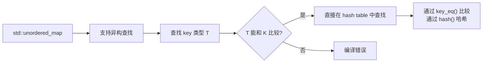

> 🔑 **钥匙比喻**：普通的 `unordered_map` 只认"原装钥匙"（`std::string`），而支持异构查找的版本就像万能钥匙——`const char*`、`std::string_view` 都能用！

## 28.22 std::pmr::polymorphic_allocator增强

### 28.22.1 什么是polymorphic_allocator？

`std::pmr::polymorphic_allocator`（C++17引入）是C++内存管理的一大进步。它允许你在**运行时选择不同的内存分配策略**：

- 分配到堆
- 分配到内存池
- 分配到某个特定区域

C++23对 `polymorphic_allocator` 进行了增强。

### 28.22.2 代码示例

```cpp
#include <iostream>
#include <memory_resource>
#include <vector>
#include <string>

int main() {
    // 使用默认的内存资源
    std::pmr::polymorphic_allocator<> alloc;
    
    // 创建一个使用 polymorphic_allocator 的 vector
    std::pmr::vector<int> vec(alloc);
    vec.push_back(1);
    vec.push_back(2);
    vec.push_back(3);
    
    std::cout << "vector size: " << vec.size() << std::endl;
    
    // 使用内存池资源
    // std::pmr::synchronized_pool_resource pool;
    // std::pmr::polymorphic_allocator<> pool_alloc(&pool);
    
    // C++23 增强：
    // - 新增 std::pmr::memory_resource* std::get_default_resource() 
    // - 新增 std::pmr::set_default_resource()
    // - 新增 pool_resource 的更多选项
    
    std::cout << "Enhancements to polymorphic_allocator in C++23" << std::endl;
    
    return 0;
}
```

> 🎛️ **调音台比喻**：`polymorphic_allocator` 就像是音频调音台上的不同声道——同一个歌手的声音，可以通过不同的声道输出到不同的设备。`polymorphic_allocator` 让你可以用同一个接口，选择不同的内存分配策略！

## 28.23 统一容器擦除——"批量删除的瑞士军刀"

### 28.23.1 什么是统一容器擦除？

C++20引入了 `std::erase` 和 `std::erase_if`，可以**统一地**从容器中删除元素，而不需要像以前那样写冗长的代码。

C++23进一步完善了这个功能。

### 28.23.2 代码示例

```cpp
#include <iostream>
#include <vector>
#include <list>
#include <string>
#include <algorithm>

int main() {
    // 删除所有值为3的元素
    std::vector<int> v{1, 2, 3, 4, 3, 5, 3};
    std::erase(v, 3);  // C++20
    std::cout << "After erase(3): ";
    for (int x : v) std::cout << x << " ";  // 输出: 1 2 4 5
    std::cout << std::endl;
    
    // 删除所有满足条件的元素
    std::vector<int> v2{1, 2, 3, 4, 5, 6, 7, 8, 9, 10};
    std::erase_if(v2, [](int x) { return x % 2 == 0; });  // 删除偶数
    std::cout << "After erase_if(even): ";
    for (int x : v2) std::cout << x << " ";  // 输出: 1 3 5 7 9
    std::cout << std::endl;
    
    // std::erase 也适用于 std::list, std::string 等
    std::string s = "Hello World";
    std::erase(s, 'l');  // 删除所有 'l'
    std::cout << "After erase('l'): " << s << std::endl;  // 输出: Heo Word
    
    // list 也支持 erase
    std::list<int> lst{1, 2, 3, 4, 5};
    std::erase(lst, 3);
    std::cout << "list after erase: ";
    for (int x : lst) std::cout << x << " ";  // 输出: 1 2 4 5
    std::cout << std::endl;
    
    return 0;
}
```

### 28.23.3 传统方式 vs 统一擦除

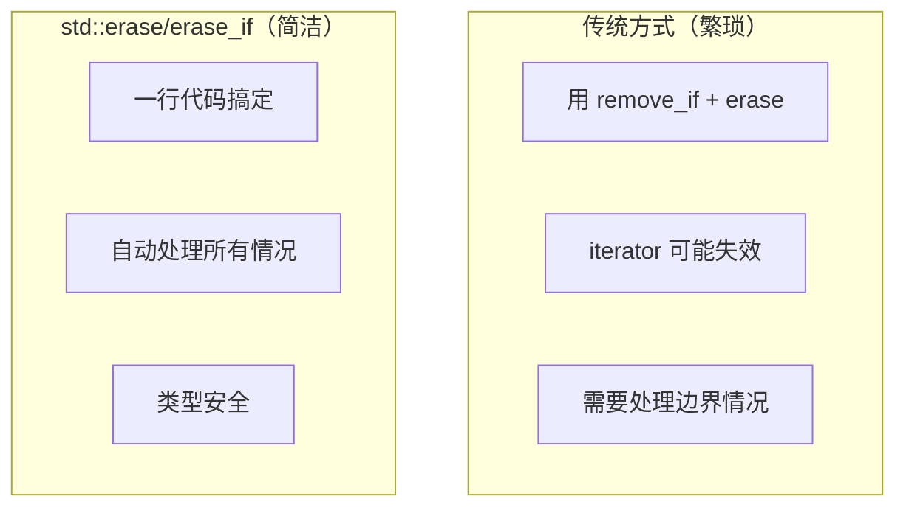

> 🧹 **清洁工比喻**：传统擦除就像你用扫帚、拖把、抹布三种工具打扫三个房间，而 `std::erase` 就像一把万能清洁枪——对着什么喷，什么就消失！

## 28.24 std::midpoint和std::lerp——"数学计算的瑞士军刀"

### 28.24.1 什么是std::midpoint？

`std::midpoint`（C++20）计算两个值的**中点**，对于整数是整数中点，对于浮点数是精确中点。

### 28.24.2 什么是std::lerp？

`std::lerp`（C++20）是**线性插值**（Linear Interpolation）函数：`lerp(a, b, t) = a + t * (b - a)`

当 `t=0` 时返回 `a`，当 `t=1` 时返回 `b`，当 `t=0.5` 时返回中点。

### 28.24.3 代码示例

```cpp
#include <iostream>
#include <numeric>
#include <cmath>

int main() {
    // std::midpoint: 计算中点
    std::cout << "std::midpoint(1, 9) = " << std::midpoint(1, 9) << std::endl;  // 输出: 5
    std::cout << "std::midpoint(0.0, 1.0) = " << std::midpoint(0.0, 1.0) << std::endl;  // 输出: 0.5
    
    // 处理整数溢出
    int a = INT_MAX - 1;
    int b = INT_MAX;
    std::cout << "Safe midpoint of INT_MAX-1 and INT_MAX: " << std::midpoint(a, b) << std::endl;
    // 不会溢出！
    
    // std::lerp: 线性插值
    // lerp(a, b, t) = a + t * (b - a)
    std::cout << "std::lerp(0.0, 100.0, 0.0) = " << std::lerp(0.0, 100.0, 0.0) << std::endl;  // 输出: 0
    std::cout << "std::lerp(0.0, 100.0, 0.5) = " << std::lerp(0.0, 100.0, 0.5) << std::endl;  // 输出: 50
    std::cout << "std::lerp(0.0, 100.0, 1.0) = " << std::lerp(0.0, 100.0, 1.0) << std::endl;  // 输出: 100
    
    // lerp 在 NaN/Infinity 情况下也能正确处理
    std::cout << "std::lerp with NaN: " << std::lerp(0.0, std::nan(""), 0.5) << std::endl;
    
    // 实用例子：颜色渐变
    // 从 RGB(255, 0, 0) 渐变到 RGB(0, 0, 255)，t=0.5 时应该是 (127, 0, 127)
    auto lerp_color = [](int r1, int g1, int b1, int r2, int g2, int b2, float t) {
        return std::lerp(r1, r2, t);
    };
    
    return 0;
}
```

### 28.24.4 lerp图解

```
lerp(a, b, t)
t=0.0:  a + 0.0 * (b-a) = a ████████░░░░░░░░░░░░
t=0.25: a + 0.25 * (b-a) = ████░░░░░░░░░░░░░░░░░░░
t=0.5:  a + 0.5 * (b-a) = ████████░░░░░░░░░░░░ (中点!)
t=0.75: a + 0.75 * (b-a) = ████████████████░░░░░░
t=1.0:  a + 1.0 * (b-a) = b ██████████████████████
```

> 📈 **滑梯比喻**：想象 a=0, b=10，t 就是你在滑梯上的位置（0%到100%）。lerp 就是根据你的位置计算你离地面多高——站在50%位置，你离地5米！

## 28.25 数学常量——"π和e的官方认证"

### 28.25.1 什么是数学常量？

C++20引入了 `<numbers>` 头文件，提供了一系列**编译时常量**：

- `std::numbers::pi` - 圆周率 π
- `std::numbers::e` - 自然常数 e
- `std::numbers::sqrt2` - √2
- `std::numbers::phi` - 黄金比例 φ
- `std::numbers::eg` - log₂e
- 等等...

C++23又增加了一些新常量！

### 28.25.2 代码示例

```cpp
#include <iostream>
#include <numbers>
#include <cmath>

int main() {
    // 经典常量
    std::cout << "pi = " << std::numbers::pi << std::endl;
    // 输出: pi = 3.14159...
    
    std::cout << "e = " << std::numbers::e << std::endl;
    // 输出: e = 2.71828...
    
    std::cout << "sqrt2 = " << std::numbers::sqrt2 << std::endl;
    // 输出: sqrt2 = 1.41421...
    
    std::cout << "phi = " << std::numbers::phi << std::endl;
    // 输出: phi = 1.61803... (黄金比例)
    
    // 三角函数中使用 pi
    double angle = std::numbers::pi / 4;  // 45度
    std::cout << "sin(pi/4) = " << std::sin(angle) << std::endl;
    // 输出: sin(pi/4) = 0.707106...
    
    // e 的幂
    std::cout << "exp(1) = " << std::exp(1.0) << std::endl;
    // 输出: exp(1) = 2.71828... (等于 e)
    
    // log 使用 e 为底
    std::cout << "log(e) = " << std::log(std::numbers::e) << std::endl;
    // 输出: log(e) = 1
    
    // C++23 新增常量（如果有）
    // std::cout << "sqrt3 = " << std::numbers::sqrt3 << std::endl;  // C++23
    // std::cout << "invsqrt3 = " << std::numbers::invsqrt3 << std::endl;  // C++23
    
    // 为什么不用 M_PI？（那是宏，不是类型安全的！）
    // 正确做法：
    constexpr double circle_area = std::numbers::pi * 5 * 5;  // 半径为5的圆面积
    std::cout << "Circle area (r=5): " << circle_area << std::endl;  // 输出: 78.5398...
    
    return 0;
}
```

### 28.25.3 常量一览表

| 常量 | 含义 | 值 |
|------|------|-----|
| `std::numbers::pi` | 圆周率 π | 3.14159... |
| `std::numbers::e` | 自然常数 e | 2.71828... |
| `std::numbers::sqrt2` | √2 | 1.41421... |
| `std::numbers::sqrt3` | √3 | 1.73205... |
| `std::numbers::phi` | 黄金比例 φ | 1.61803... |
| `std::numbers::eg` | log₂e | 1.44269... |
| `std::numbers::ln2` | ln(2) | 0.69314... |
| `std::numbers::ln10` | ln(10) | 2.30258... |

> 🎯 **标准化比喻**：以前每个人都用自己定义的 `PI`，有的3.14，有的3.1415926。C++标准库就像"度量衡局"——现在大家都有了统一的官方标准！

## 28.26 std::endian——"字节序的探测器"

### 28.26.1 什么是std::endian？

`std::endian`（C++20）是一个**枚举类型**，用于表示CPU的字节序：
- `std::endian::little` - 小端序（低字节在前）
- `std::endian::big` - 大端序（高字节在前）
- `std::endian::native` - 当前平台的字节序

### 28.26.2 代码示例

```cpp
#include <iostream>
#include <bit>
#include <cstdint>

int main() {
    // 检测当前平台的字节序
    std::cout << "Current endian: ";
    if constexpr (std::endian::native == std::endian::little) {
        std::cout << "little" << std::endl;
    } else if constexpr (std::endian::native == std::endian::big) {
        std::cout << "big" << std::endl;
    } else {
        std::cout << "mixed (weird!)" << std::endl;
    }
    
    // 在 x86/x64 上通常是 little endian
    // 在网络协议中常用 big endian
    
    // 使用 byteswap 转换字节序
    uint32_t value = 0x12345678;
    uint32_t swapped = std::byteswap(value);
    
    std::cout << "Original: 0x" << std::hex << value << std::endl;
    std::cout << "Swapped: 0x" << swapped << std::endl;
    
    // constexpr 上下文也能用！
    constexpr bool is_little = std::endian::native == std::endian::little;
    static_assert(is_little, "This code assumes little endian!");
    
    return 0;
}
```

### 28.26.3 字节序可视化

```
数值 0x12345678 在内存中的存储（小端）:

高地址 ──────────────────────────────── 低地址
  78     56     34     12
  └──>  └──>  └──>  └──>   (低字节在前)
  
在小端机器上，0x78 存在最低地址

数值 0x12345678 在内存中的存储（大端）:

高地址 ──────────────────────────────── 低地址
  12     34     56     78
  └──>  └──>  └──>  └──>   (高字节在前)
  
在大端机器上，0x12 存在最低地址
```

> 🔍 **书本比喻**：想象一页书，小端序是从**最后一页往前读**（最后一页是封面），大端序是从**第一页往后读**（第一页是封面）。`std::endian` 告诉你这个CPU是"倒着看书"还是"正着看书"的！

## 28.27 std::bit_cast——"类型转换的变形金刚"

### 28.27.1 什么是std::bit_cast？

`std::bit_cast`（C++20）是C++标准库中的一个**位转换**函数，用于在**不改变二进制表示**的情况下，将一个类型的对象重新解释为另一个类型。

这和 `reinterpret_cast` 不同：
- `reinterpret_cast` 是在**编译时**做类型转换的"危险暗示"
- `std::bit_cast` 是**运行时**的安全位转换，要求两个类型大小相同

### 28.27.2 代码示例

```cpp
#include <iostream>
#include <bit>
#include <cstdint>
#include <array>

int main() {
    // 浮点数到整数的位转换
    float f = 3.14f;
    int bits = std::bit_cast<int>(f);
    std::cout << "bit_cast<float->int>: " << bits << std::endl;
    // 输出一个看起来毫无意义的整数，但二进制表示和 f 相同
    
    // 整数到浮点数的位转换
    int int_val = 0x4048F5C3;  // 3.14f 的位表示
    float recovered = std::bit_cast<float>(int_val);
    std::cout << "bit_cast<int->float>: " << recovered << std::endl;
    // 输出: 3.14
    
    // 结构体的位转换
    struct A {
        int x;
        float y;
    };
    
    struct B {
        float y;
        int x;
    };
    
    // 假设我们有 A{42, 3.14f}，想用 B 的视角解读它
    // A 和 B 的大小必须相同！
    static_assert(sizeof(A) == sizeof(B), "Sizes must match!");
    
    A a{42, 3.14f};
    B b = std::bit_cast<B>(a);
    
    std::cout << "B's x = " << b.x << ", B's y = " << b.y << std::endl;
    
    // 检测 NaN
    float nan_val = std::nan("");
    int nan_bits = std::bit_cast<int>(nan_val);
    bool is_nan = (nan_bits & 0x7FFFFFFF) > 0x7F800000;
    std::cout << "Is NaN: " << std::boolalpha << is_nan << std::endl;
    
    return 0;
}
```

### 28.27.3 bit_cast vs reinterpret_cast

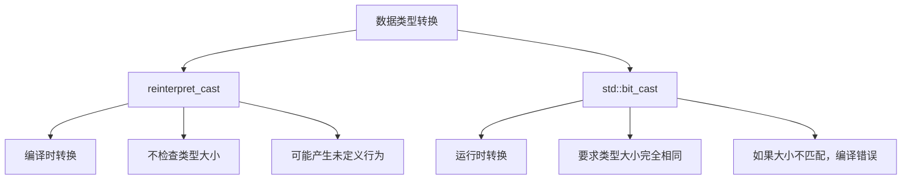

> 🔄 **变形金刚比喻**：`reinterpret_cast` 像是给机器人贴个"我是汽车"的标签，它还是机器人；`std::bit_cast` 像是真的把机器人变成了汽车——内部结构都变了！

## 28.28 新模块std和std.compat——"模块化的文艺复兴"

### 28.28.1 什么是C++模块？

C++20引入了**模块**（Modules）特性，这是对include方式的重大升级：

- **传统方式**（Header Inclusion）：文本替换，编译慢，宏污染
- **新方式**（Modules）：二进制接口，编译快，无宏污染

### 28.28.2 std模块

> ⚠️ **重要提示**：`import std;` 和 `import std.compat;` 原本计划在C++23中引入，但最终被推迟到C++26。目前没有任何编译器正式支持标准化的 `std` 模块。

部分编译器（如MSVC）提供了自己的 `import std` 实验性实现，但这不是标准化的行为。

```cpp
// 传统方式
#include <iostream>
#include <vector>
#include <string>

// 新方式（模块，预计C++26）
// import std;  // 导入整个标准库！
```

### 28.28.3 代码示例

```cpp
#include <iostream>

int main() {
    // C++23: 新模块 std 和 std.compat
    // 注意：编译器支持有限，这里是概念演示
    
    // import std;  // 导入整个标准库（模块方式）
    
    // 使用方式和 #include 一样
    std::cout << "New standard library modules in C++23" << std::endl;
    
    // 优点：
    // 1. 编译速度大幅提升
    // 2. 不会有宏污染（#define max 定义的宏）
    // 3. 更清晰的依赖关系
    
    // import std.compat;  // 包含标准库 + C标准库兼容
    
    // std.compat 提供了：
    // - std::（标准库）
    // - std::strlen, std::malloc 等（C函数包装）
    
    return 0;
}
```

### 28.28.4 include vs import

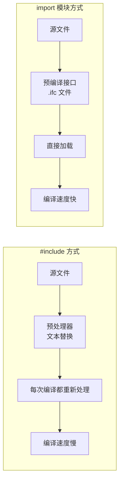

| 特性 | #include | import std |
|------|----------|------------|
| 编译速度 | 慢（每次重新解析头文件） | 快（预编译的接口） |
| 宏污染 | 有（max, min等） | 无 |
| 依赖清晰度 | 模糊 | 明确 |
| 可执行文件大小 | 可能较大 | 可能较小 |

> 📦 **搬家比喻**：`#include` 就像是每次搬家都把**所有家具拆成零件**打包，到了新地方再组装；`import` 模块就像是搬**整箱整箱的原装家具**——你只需要知道箱子里有什么，不用管怎么拆怎么装！

## 本章小结

### 28.29.1 C++23库特性全景图

本章我们一起探索了C++23标准库中的众多新特性，让我们用一张图来总结：

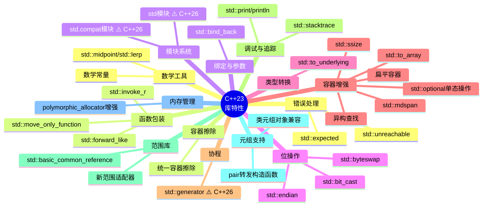

### 28.29.2 核心要点回顾

1. **`std::expected`**：类型安全的错误处理方式，类似于Rust的`Result`，让你的错误处理优雅又直观

2. **`std::move_only_function`**：只能移动的函数包装器，适用于独占所有权的场景

3. **`std::bind_back`**：从尾部绑定参数，比传统的`std::bind`更符合直觉

4. **`std::byteswap`**：字节序转换的利器，跨平台开发必备

5. **`std::print/println`**：Python风格的格式化输出，终于不用再记`printf`的格式符了！

6. **`std::stacktrace`**：运行时调用栈获取，调试神器

7. **`std::generator`**：协程实现的惰性序列，内存友好 ⚠️ C++26（非C++23）

8. **扁平容器**：`std::flat_map`/`std::flat_set`，缓存友好的数据结构

9. **`std::mdspan`**：多维数组视图，让数据以不同维度"裸奔"

10. **新模块系统**：`import std`将改变我们编写C++代码的方式

### 28.29.3 学习建议

> 💡 **学习C++23的小贴士**：
> - 不是所有编译器都完整支持C++23，建议使用最新版本的MSVC、GCC或Clang
> - 许多实验性特性（如`std::generator`）可能需要开启特殊标志
> - 学习新特性时，最好配合cppreference文档和实际代码练习
> - 不要盲目追新，要理解每个特性的适用场景

### 28.29.4 下一步

C++23的库特性就介绍到这里！如果你想继续深入学习，建议：

1. 阅读 cppreference.com 上每个特性的详细文档
2. 尝试在自己的项目中使用这些新特性
3. 关注编译器更新，等待更多特性的完整支持
4. 参与C++社区讨论，了解最佳实践

---

> 🎉 **恭喜你完成了第28章的学习！** C++23的库特性就像一座宝藏，每挖掘一个都能让你的代码更优雅、更高效。继续探索吧，未来的C++大师！
