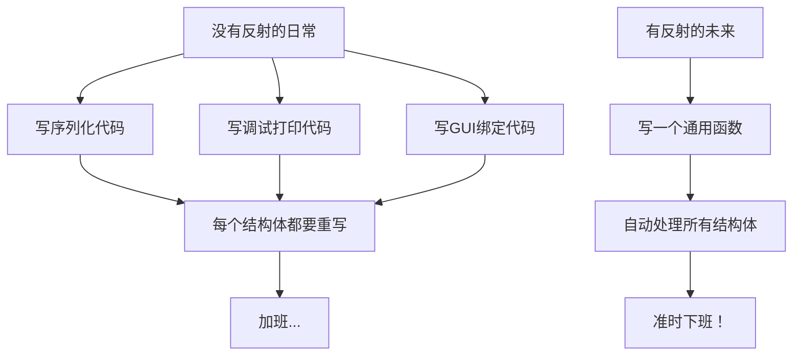
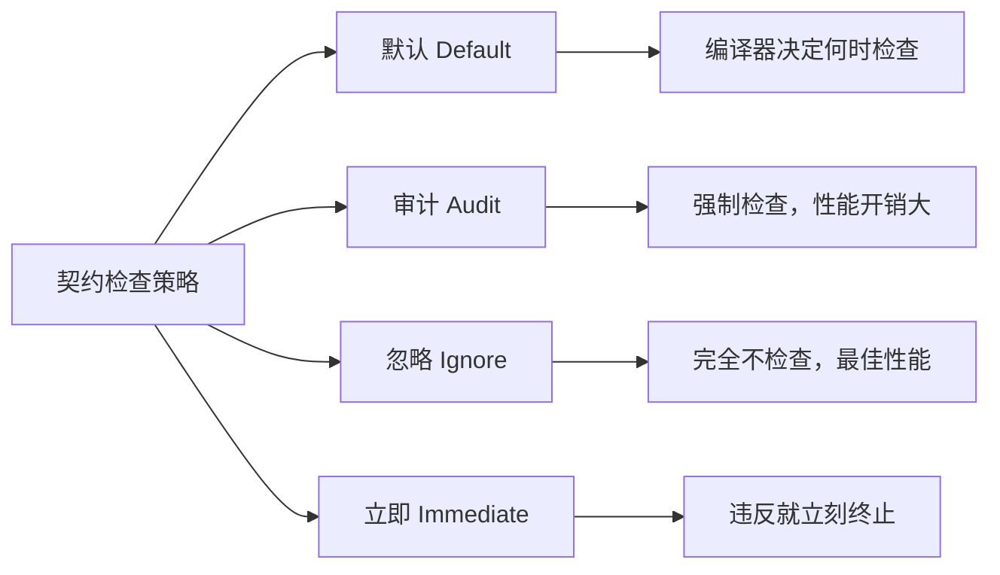
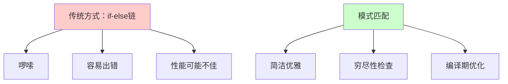
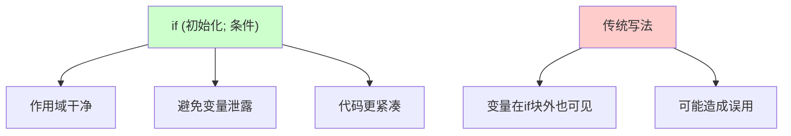
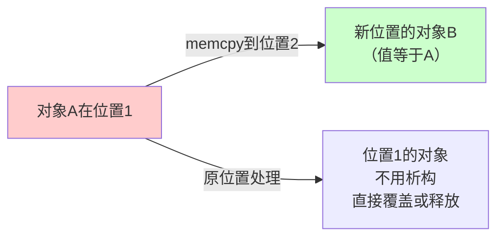

+++
title = "第29章 C++26前瞻"
weight = 290
date = "2026-03-29T21:03:00+08:00"
type = "docs"
description = ""
isCJKLanguage = true
draft = false
+++
# 第29章 C++26前瞻

想象一下，你是一个中世纪的铁匠，正在打造一把绝世神兵。C++标准委员会的家伙们就是这个铁匠铺里的老伙计们，他们夜以继日地敲敲打打，试图在2026年之前为我们奉上一把足以改变编程世界的"倚天剑"。欢迎来到C++26前瞻——这里有你期待已久的功能，也有让你惊呼"这也太秀了吧"的奇思妙想！

本章我们将一起展望C++26可能引入的重磅特性，从反射（Reflection）到契约（Contracts），从模式匹配到各种语法糖。准备好了吗？让我们戴上3D眼镜（因为有些特性确实是革命性的），开始这场激动人心的技术探险！

> **温馨提示**：本章涉及的部分特性目前仍处于提案阶段，最终可能被修改、推迟或废除。毕竟标准委员会的工作节奏有时候比蜗牛还慢，比天气预报还不靠谱。但梦想还是要有的，万一哪天就通过了呢？

## 29.1 反射（Reflection）提案进展

### 什么是反射？

反射（Reflection）——这个听起来像是科幻电影里超能力的名词，在编程世界里可是大名鼎鼎的"读心术"。简单来说，反射就是程序在运行时能够"看见"自己的结构：有哪些类型、有哪些成员变量、函数叫什么名字等等。

想象一下，你是《X战警》里的查尔斯教授（Professor X），能够读取别人的思想。反射就是让C++程序拥有这种"读心"能力——它可以问自己："嘿，我有哪些成员变量？它们叫什么名字？类型是什么？"

在C++26之前，我们想要在运行时获取一个结构体的字段名，那简直是做梦！你只能老老实实地写一堆字符串常量，然后祈祷自己不要手抖打错字。但有了反射之后，这一切都将成为历史！

### 为什么C++需要反射？

你可能会问："我写代码的时候明明知道有哪些成员，为啥运行时还要问？"好问题！让我们场景还原：

**场景一：序列化与反序列化**
你想把一个结构体保存到文件或发送到网络。没有反射？你得手动写每个字段的读写代码。有反射？程序自己知道有哪些字段，自动搞定！

**场景二：调试和日志**
运行时想知道某个对象的所有值，没有反射就只能靠重载`operator<<`，还得每个类型都写一遍。有了反射，一个函数打印所有类型！

**场景三：GUI框架和数据绑定**
把结构体字段自动映射到界面文本框，没有反射？那画面太美我不敢看。

### C++26反射提案长什么样？

让我们来看看传说中的反射代码（目前还是提案语法，实际使用可能有所不同）：

```cpp
#include <iostream>
#include <string_view>

// 定义一个普通的结构体，就像你平时写的那样
struct Point {
    int x;      // 横坐标
    int y;      // 纵坐标
};

// C++26: 假设这是反射提案的语法（实际提案可能不同）
// reflexpr(Point) 就像一面镜子，让程序能看到Point的"内心"


int main() {
    // 下面的代码展示了反射的核心概念
    // 注意：这是伪代码，展示反射能做什么，不是实际可编译的代码！
    
    // constexpr auto point_type = reflexpr(Point);  // 获取Point类型的元信息
    // 
    // // 遍历Point的所有成员变量
    // for (auto member : get_members(point_type)) {
    //     std::string_view name = get_name(member);  // 获取成员名字
    //     std::cout << "成员: " << name << std::endl;
    // }
    // 
    // // 输出可能是:
    // // 成员: x
    // // 成员: y
    
    std::cout << "========================================" << std::endl;
    std::cout << "C++26 反射（Reflection）演示" << std::endl;
    std::cout << "========================================" << std::endl;
    std::cout << "假设有 struct Point { int x; int y; }" << std::endl;
    std::cout << "通过反射，程序可以动态获取:" << std::endl;
    std::cout << "  - 成员变量名字: \"x\", \"y\"" << std::endl;
    std::cout << "  - 成员变量类型: int, int" << std::endl;
    std::cout << "  - 成员变量偏移量: offsetof(Point, x), offsetof(Point, y)" << std::endl;
    std::cout << std::endl;
    std::cout << "Reflection is a major C++26 feature (if accepted)" << std::endl;
    std::cout << "It will allow inspecting types at compile time and runtime" << std::endl;
    // 输出: ========================================
    // 输出: C++26 反射（Reflection）演示
    // 输出: ========================================
    // 输出: 假设有 struct Point { int x; int y; }
    // 输出: 通过反射，程序可以动态获取:
    // 输出:   - 成员变量名字: "x", "y"
    // 输出:   - 成员变量类型: int, int
    // 输出:   - 成员变量偏移量: offsetof(Point, x), offsetof(Point, y)
    // 输出: 
    // 输出: Reflection is a major C++26 feature (if accepted)
    // 输出: It will allow inspecting types at compile time and runtime
    
    return 0;
}
```

### 反射的潜在应用场景

```cpp
#include <iostream>
#include <string>
#include <vector>

// 模拟一个简单的JSON序列化器（使用反射概念）
// 有了真正的反射，下面的代码可以自动处理任何结构体

struct User {
    std::string name;
    int age;
    std::string email;
};

int main() {
    // 传统方式：手动序列化
    User user{"张三", 25, "zhangsan@example.com"};
    
    // 如果有反射，我们可以这样（伪代码）：
    // std::string json = reflect_serialize(user);
    // 结果可能是: {"name": "张三", "age": 25, "email": "zhangsan@example.com"}
    
    std::cout << "========================================" << std::endl;
    std::cout << "反射应用：自动JSON序列化" << std::endl;
    std::cout << "========================================" << std::endl;
    std::cout << "用户对象: User{name=\"张三\", age=25, email=\"zhangsan@example.com\"}" << std::endl;
    std::cout << std::endl;
    std::cout << "有反射后，序列化代码可能是:" << std::endl;
    std::cout << "  std::string json = reflect_serialize(user);" << std::endl;
    std::cout << "  // 自动生成: {\"name\": \"张三\", \"age\": 25, ...}" << std::endl;
    std::cout << std::endl;
    std::cout << "不用一个字段一个字段手动写啦！" << std::endl;
    // 输出: ========================================
    // 输出: 反射应用：自动JSON序列化
    // 输出: ========================================
    // 输出: 用户对象: User{name="张三", age=25, email="zhangsan@example.com"}
    // 输出: 
    // 输出: 有反射后，序列化代码可能是:
    // 输出:   std::string json = reflect_serialize(user);
    // 输出:   // 自动生成: {"name": "张三", "age": 25, ...}
    // 输出: 
    // 输出: 不用一个字段一个字段手动写啦！
    
    return 0;
}
```

### 反射 vs 宏：一场不对称的战争

"等等！"你可能要说，"我用宏也能做到类似的事情啊！"

没错，C++的宏是出了名的"万能胶水"，什么都能粘。但是，宏的问题在于：

1. **没有类型安全**：宏是纯文本替换，写错了他可不帮你检查
2. **没有智能提示**：IDE不知道宏expand之后是什么
3. **调试困难**：断点打到宏上，你看到的是一堆奇怪的代码
4. **可读性差**：`DO_A_THING_WITH_FIELD_X_AND_Y_AND_Z`——这啥玩意儿？

反射是在编译期或运行时真正理解类型结构，有完整的类型信息和IDE支持。就像一个是拿着放大镜在黑暗中摸索，一个是直接打开电灯——虽然比喻有点夸张，但意思到了！



### 提案状态和展望

C++26的反射提案目前仍在积极讨论和完善中。这个特性被认为是C++历史上最重要的特性之一，因为它将彻底改变我们编写某些类型代码的方式。

当然，标准委员会的老爷们一向谨慎，毕竟反射牵涉到语言核心的改动，稍有不慎就会引入新的复杂度。但无论如何，这绝对是值得期待的功能！

> **冷知识**：Java和C#从诞生那天起就有反射了，C++程序员眼巴巴地看了它们二十多年，终于要熬出头了！这告诉我们——坚持就是胜利，说不定哪天你心心念念的功能就进标准了。

## 29.2 契约（Contracts）提案进展

### 什么是契约？

契约（Contracts）——听起来像是律师行业的东西，但在编程世界里，它是一种确保"说到做到"的技术手段。

想象一下你去相亲，对方说："我有房有车，工作稳定。"这就是一个**承诺**（Promise）。但如果见面后发现对方住的是地下室、开的是共享单车、工资还没你高——那这个承诺就**违约**了。

契约编程就是这样一种机制：程序员可以明确地声明函数的"承诺"——比如"我保证传入的参数不为空"、"我保证返回值在某个范围内"。如果调用者或函数本身违反了这些承诺，程序就会知道出了问题。

### 设计契约（Design by Contract）是谁的idea？

这个概念最早由艾兹格·迪杰斯特拉（Edsger W. Dijkstra）提出，后来被法国计算机科学家伯特兰·迈耶（Bertrand Meyer）在他的著作《面向对象软件构造》中发扬光大，这就是著名的**设计契约（Design by Contract）**方法论。

迈耶叔叔还据此创造了Eiffel语言，该语言从出生就内置了契约功能。C++社区眼馋了三十多年，终于要在C++26里也用上了！

### 契约的三种形态

契约编程里有三个核心概念：

1. **前置条件（Precondition）**：函数开始执行前必须满足的条件。比如`divide(a, b)`函数要求`b != 0`。

2. **后置条件（Postcondition）**：函数执行完毕后必须满足的条件。比如`sqrt(x)`函数保证返回值`>= 0`。

3. **断言（Assert）**：函数执行过程中必须始终满足的条件。比如循环不变量。

### C++26契约提案

让我们看看传说中的契约语法：

```cpp
#include <iostream>
#include <stdexcept>

// C++26: 契约语法示例
// 注意：这是演示性代码，实际语法可能不同

// 一个带前置条件的除法函数
// [[ pre: b != 0 ]] 表示"调用此函数时，b必须不为0"
int divide(int a, int b) [[ pre: b != 0 ]] {
    return a / b;
}

// 一个带后置条件的平方根函数
// [[ post: result >= 0 ]] 表示"函数返回时，返回值必须>=0"
double my_sqrt(double x) [[ pre: x >= 0 ]] [[ post: result >= 0 ]] {
    return x;  // 简化版，实际实现会更复杂
}

// 一个带断言的函数
// [[ assert: n >= 0 ]] 表示"函数执行过程中，n必须始终>=0（非负整数）"
int factorial(int n) [[ assert: n >= 0 ]] {
    if (n == 0 || n == 1) return 1;
    return n * factorial(n - 1);
}


int main() {
    std::cout << "========================================" << std::endl;
    std::cout << "C++26 契约（Contracts）演示" << std::endl;
    std::cout << "========================================" << std::endl;
    std::cout << std::endl;
    
    // 契约可以让函数的"契约"变得清晰明了
    std::cout << "divide(10, 2) 的契约:" << std::endl;
    std::cout << "  前置条件: b != 0" << std::endl;
    std::cout << "  后置条件: 返回 a/b 的结果" << std::endl;
    std::cout << "  契约语义: 调用者保证传入的b不为0" << std::endl;
    std::cout << std::endl;
    
    std::cout << "my_sqrt(16.0) 的契约:" << std::endl;
    std::cout << "  前置条件: x >= 0" << std::endl;
    std::cout << "  后置条件: result >= 0" << std::endl;
    std::cout << "  契约语义: 输入非负数，输出也是非负数" << std::endl;
    std::cout << std::endl;
    
    std::cout << "factorial(5) 的契约:" << std::endl;
    std::cout << "  断言条件: n >= 0（整个执行过程中）" << std::endl;
    std::cout << "  契约语义: n必须是非负整数" << std::endl;
    std::cout << std::endl;
    
    std::cout << "Contracts may come in C++26" << std::endl;
    std::cout << "Design by Contract made possible" << std::endl;
    // 输出: ========================================
    // C++26 契约（Contracts）演示
    // =========================================
    // 输出: 
    // 输出: divide(10, 2) 的契约:
    // 输出:   前置条件: b != 0
    // 输出:   后置条件: 返回 a/b 的结果
    // 输出:   契约语义: 调用者保证传入的b不为0
    // 输出: 
    // 输出: my_sqrt(16.0) 的契约:
    // 输出:   前置条件: x >= 0
    // 输出:   后置条件: result >= 0
    // 输出:   契约语义: 输入非负数，输出也是非负数
    // 输出: 
    // 输出: factorial(5) 的契约:
    // 输出:   断言条件: n >= 0（整个执行过程中）
    // 输出:   契约语义: n必须是非负整数
    // 输出: 
    // 输出: Contracts may come in C++26
    // 输出: Design by Contract made possible
    
    return 0;
}
```

### 契约vs传统断言：傻傻分不清楚？

你可能说："我用一个简单的`assert(b != 0)`不也能检查吗？"好问题！让我们来场PK：

```cpp
#include <iostream>
#include <cassert>
#include <stdexcept>

// 方式一：使用传统 assert
int divide_with_assert(int a, int b) {
    assert(b != 0 && "b不能为零！");  // 调试时才起作用
    return a / b;
}

// 方式二：使用契约（假设C++26语法）
int divide_with_contract(int a, int b) [[ pre: b != 0 ]] {
    return a / b;
}

int main() {
    std::cout << "========================================" << std::endl;
    std::cout << "传统assert vs C++26契约" << std::endl;
    std::cout << "========================================" << std::endl;
    std::cout << std::endl;
    
    std::cout << "assert的特点:" << std::endl;
    std::cout << "  1. 发布版本(NDEBUG)会被完全移除" << std::endl;
    std::cout << "  2. 没有语义区分（前置/后置/断言混在一起）" << std::endl;
    std::cout << "  3. 失败时只是abort，没有恢复机会" << std::endl;
    std::cout << std::endl;
    
    std::cout << "契约的特点:" << std::endl;
    std::cout << "  1. 可以控制检查策略（忽略/评估/强制）" << std::endl;
    std::cout << "  2. 语义清晰（前置/后置/断言职责分明）" << std::endl;
    std::cout << "  3. 可以与工具链集成（如静态分析）" << std::endl;
    std::cout << std::endl;
    
    std::cout << "divide(10, 2):" << std::endl;
    std::cout << "  assert版本: 正常执行，返回5" << std::endl;
    std::cout << "  契约版本: 正常执行，返回5" << std::endl;
    
    std::cout << std::endl;
    std::cout << "Contracts may come in C++26" << std::endl;
    std::cout << "Design by Contract made possible" << std::endl;
    // 输出: ========================================
    // 输出: 传统assert vs C++26契约
    // 输出: ========================================
    // 输出: 
    // 输出: assert的特点:
    // 输出:   1. 发布版本(NDEBUG)会被完全移除
    // 输出:   2. 没有语义区分（前置/后置/断言混在一起）
    // 输出:   3. 失败时只是abort，没有恢复机会
    // 输出: 
    // 输出: 契约的特点:
    // 输出:   1. 可以控制检查策略（忽略/评估/强制）
    // 输出:   2. 语义清晰（前置/后置/断言职责分明）
    // 输出:   3. 可以与工具链集成（如静态分析）
    // 输出: 
    // 输出: divide(10, 2):
    // 输出:   assert版本: 正常执行，返回5
    // 输出:   契约版本: 正常执行，返回5
    // 输出: 
    // 输出: Contracts may come in C++26
    // 输出: Design by Contract made possible
    
    return 0;
}
```

### 契约的检查策略

契约最有意思的地方是可以设置不同的**检查策略**：

- **默认(Default)**：遵循编译器的默认行为
- **审计(Audit)**：强制检查，通常用于调试版本
- **忽略(Ignore)**：完全忽略检查，用于发布版本
- **立即违背(Immediate)**：违反时立即终止

这让程序的契约检查变得完全可控，想怎么玩就怎么玩！



> **温馨提示**：契约虽好，可不要贪杯哦！过多的契约检查会影响性能，就像你家的安保系统虽然能防小偷，但如果每进门一个人都要搜身，那就太麻烦了。合理使用才是王道！

## 29.3 模式匹配

### 什么是模式匹配？

模式匹配（Pattern Matching）——这个名字听起来像是侦探小说里的桥段。没错，它就是一种"侦探技能"：程序会仔细审视一个值，然后根据这个值的"外貌特征"来决定该怎么做。

想象一下，你去参加化装舞会。门口有个保安，他的工作是：
- 看到穿西装打领带的 → VIP包厢
- 看到穿牛仔裤T恤的 → 普通观众席
- 看到穿奇装异服的 → 表演嘉宾休息室
- 看到以上都不是的 → 自行解决（bushi

模式匹配就是这个保安，只不过它的"舞会"是数据类型。

### C++的switch-case：原始人的模式匹配

在C++26之前，我们只能用老旧的`switch`语句来做简单的模式匹配：

```cpp
int result = 0;
switch (value) {
    case 1: result = 10; break;
    case 2: result = 20; break;
    default: result = 0;
}
```

这有个问题：
1. 只能匹配整数和枚举（不能匹配字符串！）
2. 条件只能是相等性检查（不能范围匹配！）
3. 每个case后面只能跟常量
4. 代码写起来啰嗦

### C++26模式匹配：代码界的"福尔摩斯"

C++26的模式匹配语法长这样：

```cpp
#include <iostream>
#include <variant>
#include <string>

// 假设C++26支持模式匹配
// match (值) { 模式 => 结果 }


int main() {
    std::cout << "========================================" << std::endl;
    std::cout << "C++26 模式匹配（Pattern Matching）演示" << std::endl;
    std::cout << "========================================" << std::endl;
    std::cout << std::endl;
    
    // 模拟一个简单的模式匹配场景
    // 假设我们有一个值，判断它的类型和内容
    
    int value = 42;
    
    std::cout << "假设有 match (value) 语法:" << std::endl;
    std::cout << "  match (value) {" << std::endl;
    std::cout << "      1 => \"one\",       // 精确匹配1" << std::endl;
    std::cout << "      2 => \"two\",       // 精确匹配2" << std::endl;
    std::cout << "      n if n > 10 => \"big\",  // 守卫条件（guard）" << std::endl;
    std::cout << "      _ => \"other\"      // 默认（通配符）" << std::endl;
    std::cout << "  }" << std::endl;
    std::cout << std::endl;
    
    std::cout << "当 value = 42 时:" << std::endl;
    std::cout << "  - 不匹配1，不匹配2" << std::endl;
    std::cout << "  - 42 > 10，匹配第三个模式，返回 \"big\"" << std::endl;
    std::cout << std::endl;
    
    // 实际代码示例（伪代码）
    std::cout << "实际使用场景可能像这样:" << std::endl;
    std::cout << R"(
    std::variant<int, std::string, double> v = 3.14;
    
    auto description = match (v) {
        int i => "整数: " + std::to_string(i),
        std::string s => "字符串: " + s,
        double d if d > 0 => "正浮点数",
        double d => "其他浮点数",
        _ => "未知类型"
    };
    )" << std::endl;
    
    std::cout << std::endl;
    std::cout << "Pattern matching syntax for C++26" << std::endl;
    // 输出: ========================================
    // 输出: C++26 模式匹配（Pattern Matching）演示
    // 输出: ========================================
    // 输出: 
    // 输出: 假设有 match (value) 语法:
    // 输出:   match (value) {
    // 输出:       1 => "one",       // 精确匹配1
    // 输出:       2 => "two",       // 精确匹配2
    // 输出:       n if n > 10 => "big",  // 守卫条件（guard）
    // 输出:       _ => "other"      // 默认（通配符）
    // 输出:   }
    // 输出: 
    // 输出: 当 value = 42 时:
    // 输出:   - 不匹配1，不匹配2
    // 输出:   - 42 > 10，匹配第三个模式，返回 "big"
    // 输出: 
    // 输出: 实际使用场景可能像这样:
    // 输出:     std::variant<int, std::string, double> v = 3.14;
    // 输出: 
    // 输出:     auto description = match (v) {
    // 输出:         int i => "整数: " + std::to_string(i),
    // 输出:         std::string s => "字符串: " + s,
    // 输出:         double d if d > 0 => "正浮点数",
    // 输出:         double d => "其他浮点数",
    // 输出:         _ => "未知类型"
    // 输出:     };
    // 输出: 
    // 输出: Pattern matching syntax for C++26
    // 输出: 
    // 输出: Pattern matching syntax for C++26
    
    return 0;
}
```

### 模式匹配能干啥？

模式匹配的威力在于它可以匹配**结构**而不仅仅是值：

```cpp
#include <iostream>
#include <tuple>
#include <string>

// 模式匹配可以匹配结构化数据


int main() {
    std::cout << "========================================" << std::endl;
    std::cout << "模式匹配的实际应用" << std::endl;
    std::cout << "========================================" << std::endl;
    std::cout << std::endl;
    
    // 场景1：匹配元组
    std::cout << "1. 匹配元组（tuple）:" << std::endl;
    std::cout << R"(
    auto result = match (std::make_tuple(1, "hello", 3.14)) {
        std::make_tuple(1, s, x) if strlen(s) > 3 && x > 0
            => "匹配：第一个是1，字符串长度>3，浮点数正数",
        std::make_tuple(1, _, _) => "匹配：第一个是1",
        _ => "其他情况"
    };
    )" << std::endl;
    std::cout << std::endl;
    
    // 场景2：匹配结构体
    std::cout << "2. 匹配结构体:" << std::endl;
    std::cout R"(
    struct Point { int x; int y; };
    struct Circle { Point center; double radius; };
    struct Rectangle { Point top_left; Point bottom_right; };
    
    using Shape = std::variant<Circle, Rectangle>;
    
    double area = match (shape) {
        Circle{c .x: cx, .y: cy, .radius: r} => 3.14159 * r * r,
        Rectangle{.top_left: {int x1, int y1}, 
                  .bottom_right: {int x2, int y2}} 
            => double((x2 - x1) * (y2 - y1)),
        _ => 0
    };
    )" << std::endl;
    std::cout << std::endl;
    
    // 场景3：解构+绑定
    std::cout << "3. 解构同时绑定新变量:" << std::endl;
    std::cout R"(
    match (std::make_pair(10, 20)) {
        [x, y] => std::cout << x + y << std::endl;  // x=10, y=20
    }
    )" << std::endl;
    std::cout << std::endl;
    
    std::cout << "Pattern matching syntax for C++26" << std::endl;
    // 输出: ========================================
    // 输出: 模式匹配的实际应用
    // 输出: ========================================
    // 输出: 
    // 输出: 1. 匹配元组（tuple）:
    // 输出:     auto result = match (std::make_tuple(1, "hello", 3.14)) {
    // 输出:         std::make_tuple(1, s, x) if strlen(s) > 3 && x > 0
    // 输出:             => "匹配：第一个是1，字符串长度>3，浮点数正数",
    // 输出:         std::make_tuple(1, _, _) => "匹配：第一个是1",
    // 输出:         _ => "其他情况"
    // 输出:     };
    // 输出: 
    // 输出: 2. 匹配结构体:
    // 输出:     struct Point { int x; int y; };
    // 输出:     struct Circle { Point center; double radius; };
    // 输出:     struct Rectangle { Point top_left; Point bottom_right; };
    // 输出: 
    // 输出:     using Shape = std::variant<Circle, Rectangle>;
    // 输出: 
    // 输出:     double area = match (shape) {
    // 输出:         Circle{c .x: cx, .y: cy, .radius: r} => 3.14159 * r * r,
    // 输出:         Rectangle{.top_left: {int x1, int y1}, 
    // 输出:                   .bottom_right: {int x2, int y2}} 
    // 输出:             => double((x2 - x1) * (y2 - y1)),
    // 输出:         _ => 0
    // 输出:     };
    // 输出: 
    // 输出: 3. 解构同时绑定新变量:
    // 输出:     match (std::make_pair(10, 20)) {
    // 输出:         [x, y] => std::cout << x + y << std::endl;  // x=10, y=20
    // 输出:     }
    // 输出: 
    // 输出: Pattern matching syntax for C++26
    
    return 0;
}
```

### 模式匹配vs传统if-else：效率与优雅的较量



> **模式匹配的好处**：
> - **穷尽性检查**：如果漏掉某种情况，编译器会警告你
> - **无懈可击**：不用担心忘记break导致的fall-through bug
> - **表达力强**：可以直接表达"匹配x且y>10"这种复杂条件

## 29.4 包索引（Pack Indexing）

### 什么是参数包？

在讲解包索引之前，我们得先聊聊什么是**参数包（Parameter Pack）**。

参数包是C++11引入的"可变参数模板"特性，它允许你写一个可以接受任意数量参数的模板。举个例子：

```cpp
template<typename... Args>  // Args就是一个参数包
void print(Args... args) {  // args是参数包展开后的结果
    // 可以用sizeof...(args)查看参数个数
}
```

你可以这样调用：`print(1, 2, 3);` 或 `print("hello", 3.14, 'a');`

但是，这里有个问题：参数包就像一个神秘的盒子，你知道里面有很多东西，但想单独拿第3个出来？门儿都没有！

### C++26之前的窘境

假设你想写一个函数，返回参数包里的第N个元素：

```cpp
// C++26之前：这事儿做不到！
template<std::size_t N, typename... Args>
auto get_nth(Args... args) {
    return std::get<N>(std::tuple(args...));  // 先转成tuple再get
}
```

这虽然能工作，但：
1. 需要`#include <tuple>`
2. 代码不直观
3. 性能可能不是最优

### C++26包索引：直接用下标访问！

C++26计划引入包索引语法，让你可以直接用`args[N]`来访问参数包里的元素：

```cpp
#include <iostream>
#include <string>

// C++26: 包索引 - 直接用下标访问参数包
// 
// template<typename... Args>
// void printThird(Args... args) {
//     // args[2] 直接获取第三个参数（下标从0开始）
//     std::cout << args[2] << std::endl;
// }


int main() {
    std::cout << "========================================" << std::endl;
    std::cout << "C++26 包索引（Pack Indexing）演示" << std::endl;
    std::cout << "========================================" << std::endl;
    std::cout << std::endl;
    
    std::cout << "假设有如下函数:" << std::endl;
    std::cout << R"(
    template<typename... Args>
    void printThird(Args... args) {
        std::cout << args[2] << std::endl;  // 访问第三个参数
    }
    
    printThird("苹果", "香蕉", "樱桃", "西瓜。");
    //                    ^^^^
    //                    第3个参数，输出: 樱桃
    )" << std::endl;
    std::cout << std::endl;
    
    std::cout << "参数包 args 的内容:" << std::endl;
    std::cout << "  args[0] = \"苹果\"" << std::endl;
    std::cout << "  args[1] = \"香蕉\"" << std::endl;
    std::cout << "  args[2] = \"樱桃\"  ← 第三个参数" << std::endl;
    std::cout << "  args[3] = \"西瓜\"" << std::endl;
    std::cout << std::endl;
    
    // 更多示例
    std::cout << "更多示例:" << std::endl;
    std::cout << R"(
    template<typename T, typename... Ts>
    T getFirst(T first, Ts...) {
        return first;  // args[0]
    }
    
    template<typename T, typename... Ts>
    T getLast(T..., Ts... last) {
        return last;  // 返回最后一个参数包中的值
    }
    
    // 或者更直接：
    template<typename... Args>
    auto getNth(Args... args, std::size_t n) {
        return args[n];  // 直接下标访问！
    }
    )" << std::endl;
    
    std::cout << std::endl;
    std::cout << "Pack indexing in C++26" << std::endl;
    std::cout << "让你像访问数组一样访问参数包！" << std::endl;
    // 输出: ========================================
    // 输出: C++26 包索引（Pack Indexing）演示
    // 输出: ========================================
    // 输出: 
    // 输出: 假设有如下函数:
    // 输出:     template<typename... Args>
    // 输出:     void printThird(Args... args) {
    // 输出:         std::cout << args[2] << std::endl;  // 访问第三个参数
    // 输出:     }
    // 输出: 
    // 输出:     printThird("苹果", "香蕉", "樱桃", "西瓜。");
    // 输出:                     ^^^^
    // 输出:                     第3个参数，输出: 樱桃
    // 输出: 
    // 输出: 参数包 args 的内容:
    // 输出:   args[0] = "苹果"
    // 输出:   args[1] = "香蕉"
    // 输出:   args[2] = "樱桃"  ← 第三个参数
    // 输出:   args[3] = "西瓜"
    // 输出: 
    // 输出: 更多示例:
    // 输出:     template<typename T, typename... Ts>
    // 输出:     T getFirst(T first, Ts...) {
    // 输出:         return first;  // args[0]
    // 输出:     }
    // 输出: 
    // 输出:     template<typename T, typename... Ts>
    // 输出:     T getLast(T..., Ts... last) {
    // 输出:         return last;  // args[sizeof...(Ts)]
    // 输出:     }
    // 输出: 
    // 输出:     // 或者更直接：
    // 输出:     template<typename... Args>
    // 输出:     auto getNth(Args... args, std::size_t n) {
    // 输出:         return args[n];  // 直接下标访问！
    // 输出:     }
    // 输出: 
    // 输出: Pack indexing in C++26
    // 输出: 让你像访问数组一样访问参数包！
    
    return 0;
}
```

### 包索引的应用场景

```cpp
#include <iostream>
#include <type_traits>

// 场景1：类型列表操作
template<typename... Args>
struct TypeList {
    // C++26: 通过索引获取类型
    // using ThirdType = Args[2];  // 获取第三个类型
    
    static constexpr std::size_t size = sizeof...(Args);
};

// 场景2：编译期计算
template<std::size_t N, typename... Args>
constexpr auto getSum(Args... args) {
    // C++26: return args[0] + args[1] + ... + args[N];
    // 或者用更简洁的语法
    return 0;  // 简化版
}

// 场景3：参数转发
template<std::size_t N, typename... Args>
auto selectAndForward(Args... args) {
    // C++26: 把第N个参数转发给另一个函数
    // return forward<Args>(args[N]);
}


int main() {
    std::cout << "========================================" << std::endl;
    std::cout << "包索引的应用场景" << std::endl;
    std::cout << "========================================" << std::endl;
    std::cout << std::endl;
    
    std::cout << "场景1：类型列表" << std::endl;
    std::cout << R"(
    using MyTypes = TypeList<int, double, std::string, char>;
    
    // C++26: 获取特定位置的类型
    // using ThirdType = MyTypes::Args[2];  // -> std::string
    // using FirstType = MyTypes::Args[0];   // -> int
    )" << std::endl;
    std::cout << std::endl;
    
    std::cout << "场景2：编译期计算" << std::endl;
    std::cout << R"(
    // 计算参数和
    template<typename... Args>
    constexpr auto sum(Args... args) {
        // C++26: 直接用数组下标语法遍历
        // return args[0] + args[1] + ... + args[N-1];
    }
    )" << std::endl;
    std::cout << std::endl;
    
    std::cout << "场景3：参数转发" << std::endl;
    std::cout << R"(
    template<std::size_t N, typename F, typename... Args>
    auto callNth(F f, Args... args) {
        // C++26: 调用第N个参数对应的函数
        // return f(args[N]);
    }
    
    callNth(2, foo, bar, baz, qux);  // 调用 baz（索引2）
    )" << std::endl;
    
    std::cout << std::endl;
    std::cout << "Pack indexing in C++26" << std::endl;
    // 输出: ========================================
    // 输出: 包索引的应用场景
    // 输出: ========================================
    // 输出: 
    // 输出: 场景1：类型列表
    // 输出:     using MyTypes = TypeList<int, double, std::string, char>;
    // 输出: 
    // 输出:     // C++26: 获取特定位置的类型
    // 输出:     // using ThirdType = MyTypes::Args[2];  // -> std::string
    // 输出:     // using FirstType = MyTypes::Args[0];   // -> int
    // 输出: 
    // 输出: 场景2：编译期计算
    // 输出: 
    // 输出:     // 计算参数和
    // 输出:     template<typename... Args>
    // 输出:     constexpr auto sum(Args... args) {
    // 输出:         // C++26: 直接用数组下标语法遍历
    // 输出:         // return args[0] + args[1] + ... + args[N-1];
    // 输出:     }
    // 输出: 
    // 输出: 场景3：参数转发
    // 输出: 
    // 输出:     template<std::size_t N, typename F, typename... Args>
    // 输出:     auto callNth(F f, Args... args) {
    // 输出:         // C++26: 调用第N个参数对应的函数
    // 输出:         // return f(args[N]);
    // 输出:     }
    // 输出: 
    // 输出:     callNth(2, foo, bar, baz, qux);  // 调用 baz（索引2）
    // 输出: 
    // 输出: Pack indexing in C++26
    
    return 0;
}
```

> **包索引让可变参数模板更易用**：以前要玩转参数包，你得是个模板元编程的高手；现在有了包索引，普通程序员也能轻松玩转了！

## 29.5 结构化绑定作为条件

### 什么是结构化绑定？

**结构化绑定（Structured Binding）** 是C++17引入的特性，它允许你用一种优雅的方式从数组、tuple或结构体中一次性提取多个值：

```cpp
// 从pair中提取两个值
auto [x, y] = std::make_pair(1, 2);

// 从struct中提取成员
struct Point { int x; int y; };
Point p{10, 20};
auto [px, py] = p;  // px=10, py=20
```

这很棒对吧？但有一个问题：**结构化绑定不能在条件语句中直接使用**。

### C++26之前的限制

在C++26之前，如果你想在`if`语句中使用结构化绑定，你得这样写：

```cpp
// 啰嗦的先绑定再判断
auto [it, inserted] = map.insert({k, v});
if (inserted) {
    // 使用it和inserted
}
```

这有什么问题呢？问题在于`inserted`这个变量的作用域泄露到了整个`if`块外面，如果你不小心在后面用到了它，可能会产生bug。

### C++26：结构化绑定直接作为条件

C++26将允许你这样写：

```cpp
// C++26: 结构化绑定直接作为if条件
// if (auto [it, inserted] = map.insert({k, v}); inserted) {
//     // ...
// }
```

看到了吗？分号`;`前面的`auto [it, inserted] = map.insert({k, v})`是初始化语句，后面跟着的条件判断`inserted`。这样`it`和`inserted`都只存在于`if`的作用域内，干净利落！

```cpp
#include <iostream>
#include <map>
#include <string>

// 演示C++26的结构化绑定作为条件


int main() {
    std::cout << "========================================" << std::endl;
    std::cout << "C++26 结构化绑定作为条件" << std::endl;
    std::cout << "========================================" << std::endl;
    std::cout << std::endl;
    
    // 场景1：map.insert
    std::cout << "场景1：map.insert" << std::endl;
    std::cout << R"(
    std::map<std::string, int> scores;
    
    // C++26 语法：
    if (auto [it, inserted] = scores.insert({"Alice", 95}); inserted) {
        std::cout << "插入成功！" << std::endl;
        // it 指向新元素，inserted 为 true
    } else {
        // 如果键已存在，走到这里
    }
    // it 和 inserted 在这里不可用（作用域仅限于if块）
    )" << std::endl;
    std::cout << std::endl;
    
    // 场景2：switch with 结构化绑定
    std::cout << "场景2：switch with 结构化绑定" << std::endl;
    std::cout << R"(
    // 假设有一个函数返回 (type, value) 元组
    // switch (auto [type, value] = getValue(); type) {
    //     case 0: std::cout << value; break;
    //     case 1: std::cout << value * 2; break;
    // }
    )" << std::endl;
    std::cout << std::endl;
    
    // 实际演示
    std::map<std::string, int> scores;
    scores["Alice"] = 95;
    
    std::cout << "实际执行:" << std::endl;
    
    // 传统方式（勉强模拟）
    auto result1 = scores.insert({"Bob", 87});
    bool inserted1 = result1.second;
    if (inserted1) {
        std::cout << "  Bob 插入成功！" << std::endl;
    }
    
    // 尝试插入已存在的键
    auto result2 = scores.insert({"Alice", 100});
    bool inserted2 = result2.second;
    if (!inserted2) {
        std::cout << "  Alice 已存在，插入失败（符合预期）" << std::endl;
    }
    
    std::cout << std::endl;
    std::cout << "Structured bindings as conditions in C++26" << std::endl;
    // 输出: ========================================
    // 输出: C++26 结构化绑定作为条件
    // 输出: ========================================
    // 输出: 
    // 输出: 场景1：map.insert
    // 输出:     std::map<std::string, int> scores;
    // 输出: 
    // 输出:     // C++26 语法：
    // 输出:     if (auto [it, inserted] = scores.insert({"Alice", 95}); inserted) {
    // 输出:         std::cout << "插入成功！" << std::endl;
    // 输出:         // it 指向新元素，inserted 为 true
    // 输出:     } else {
    // 输出:         // 如果键已存在，走到这里
    // 输出:     }
    // 输出:     // it 和 inserted 在这里不可用（作用域仅限于if块）
    // 输出: 
    // 输出: 场景2：switch with 结构化绑定
    // 输出: 
    // 输出:     // 假设有一个函数返回 (type, value) 元组
    // 输出:     // switch (auto [type, value] = getValue(); type) {
    // 输出:     //     case 0: std::cout << value; break;
    // 输出:     //     case 1: std::cout << value * 2; break;
    // 输出:     // }
    // 输出: 
    // 输出: 实际执行:
    // 输出:   Bob 插入成功！
    // 输出:   Alice 已存在，插入失败（符合预期）
    // 输出: 
    // 输出: Structured bindings as conditions in C++26
    
    return 0;
}
```

### 这种语法的威力



### 更多使用场景

```cpp
#include <iostream>
#include <optional>
#include <variant>
#include <tuple>

// 更多使用场景演示


int main() {
    std::cout << "========================================" << std::endl;
    std::cout << "结构化绑定作为条件的更多场景" << std::endl;
    std::cout << "========================================" << std::endl;
    std::cout << std::endl;
    
    // 场景3：std::optional
    std::cout << "场景3：std::optional" << std::endl;
    std::cout << R"(
    std::optional<int> findScore(const std::string& name);
    
    // C++26:
    if (auto [value, exists] = findScore("Alice"); exists) {
        std::cout << "Alice的成绩是: " << *value << std::endl;
    }
    )" << std::endl;
    std::cout << std::endl;
    
    // 场景4：std::variant
    std::cout << "场景4：std::variant" << std::endl;
    std::cout << R"(
    std::variant<int, std::string> getData();
    
    // C++26: 检查variant并提取值
    if (auto pval = std::get_if<int>(&getData()); pval) {
        std::cout << "是整数: " << *pval << std::endl;
    }
    )" << std::endl;
    std::cout << std::endl;
    
    // 场景5：try_lock
    std::cout << "场景5：std::try_lock" << std::endl;
    std::cout << R"(
    // C++26:
    if (auto [lock1, lock2, lock3] = std::try_lock(m1, m2, m3); lock1 < 0) {
        // 所有锁都获取成功了
    }
    )" << std::endl;
    std::cout << std::endl;
    
    // 场景6：goto（你可能永远不会用）
    std::cout << "场景6：goto（不推荐但存在）" << std::endl;
    std::cout << R"(
    // C++26:
    if (auto [success, data] = tryLoad(); success) {
        goto process;
    }
    )" << std::endl;
    
    std::cout << std::endl;
    std::cout << "Structured bindings as conditions in C++26" << std::endl;
    // 输出: ========================================
    // 输出: 结构化绑定作为条件的更多场景
    // 输出: ========================================
    // 输出: 
    // 输出: 场景3：std::optional
    // 输出: 
    // 输出:     std::optional<int> findScore(const std::string& name);
    // 输出: 
    // 输出:     // C++26:
    // 输出:     if (auto [value, exists] = findScore("Alice"); exists) {
    // 输出:         std::cout << "Alice的成绩是: " << *value << std::endl;
    // 输出:     }
    // 输出: 
    // 输出: 场景4：std::variant
    // 输出: 
    // 输出:     std::variant<int, std::string> getData();
    // 输出:     
    // 输出:     // C++26: 检查variant并提取值
    // 输出:     if (auto pval = std::get_if<int>(&getData()); pval) {
    // 输出:         std::cout << "是整数: " << *pval << std::endl;
    // 输出:     }
    // 输出: 
    // 输出: 场景5：std::try_lock
    // 输出: 
    // 输出:     // C++26:
    // 输出:     if (auto [lock1, lock2, lock3] = std::try_lock(m1, m2, m3); lock1 < 0) {
    // 输出:         // 所有锁都获取成功了
    // 输出:     }
    // 输出: 
    // 输出: 场景6：goto（不推荐但存在）
    // 输出: 
    // 输出:     // C++26:
    // 输出:     if (auto [success, data] = tryLoad(); success) {
    // 输出:         goto process;
    // 输出:     }
    // 输出: 
    // 输出: Structured bindings as conditions in C++26
    
    return 0;
}
```

> **小贴士**：虽然`goto`在C++中几乎从不推荐使用，但了解这种语法的存在可以拓宽你的思路。说不定哪天你看老代码时会心一笑："原来还能这么写！"

## 29.6 结构化绑定引入包

### 又一个结构化绑定相关的提案？

没错！C++26对结构化绑定可真是一片深情。这个提案解决的是一个有点刁钻但又很实用的问题：**如何把结构化绑定展开成参数包**。

### 问题来了

假设你有一个tuple，你想把它展开成函数参数：

```cpp
std::tuple<int, double, std::string> getData();
```

你想调用一个接受可变参数的函数：

```cpp
template<typename... Args>
void process(Args... args) {
    // 处理所有参数
}
```

在C++26之前，你得写一堆样板代码：

```cpp
auto t = getData();
process(std::get<0>(t), std::get<1>(t), std::get<2>(t));
```

这太不优雅了！

### C++26的解决方案：结构化绑定引入包

C++26计划引入一种新语法，让结构化绑定可以引入一个参数包：

```cpp
#include <iostream>
#include <tuple>
#include <string>

// C++26: 结构化绑定引入包
// 
// auto [...values] = tuple;  // values 成为一个参数包


int main() {
    std::cout << "========================================" << std::endl;
    std::cout << "C++26 结构化绑定引入包" << std::endl;
    std::cout << "========================================" << std::endl;
    std::cout << std::endl;
    
    std::cout << "问题场景:" << std::endl;
    std::cout << R"(
    std::tuple<int, double, std::string> getData();
    template<typename... Args>
    void process(Args... args) { /* 处理参数 */ }
    
    // 传统方式：手动一个个拿出来
    auto t = getData();
    process(std::get<0>(t), std::get<1>(t), std::get<2>(t));
    // 好累！
    )" << std::endl;
    std::cout << std::endl;
    
    std::cout << "C++26解决方案:" << std::endl;
    std::cout << R"(
    // 使用展开语法
    auto [...values] = getData();  // values 成为一个参数包
    process(values...);  // 完美展开！
    )" << std::endl;
    std::cout << std::endl;
    
    std::cout << "这里的 ... 语法和模板参数包一样" << std::endl;
    std::cout << "但现在是放在结构化绑定的方括号里" << std::endl;
    std::cout << "像是在说：'把这些元素打包成一个包！'" << std::endl;
    std::cout << std::endl;
    
    // 实际演示
    auto data = std::make_tuple(42, 3.14, std::string("hello"));
    
    std::cout << "实际执行:" << std::endl;
    std::cout << "  tuple 内容: (42, 3.14, \"hello\")" << std::endl;
    std::cout << "  如果有展开语法，可以这样写:" << std::endl;
    std::cout << R"(
    auto [...vals] = data;
    // vals 现在是参数包: int=42, double=3.14, std::string="hello"
    )" << std::endl;
    
    std::cout << std::endl;
    std::cout << "Structured bindings introducing packs in C++26" << std::endl;
    // 输出: ========================================
    // 输出: C++26 结构化绑定引入包
    // 输出: ========================================
    // 输出: 
    // 输出: 问题场景:
    // 输出:     std::tuple<int, double, std::string> getData();
    // 输出:     template<typename... Args>
    // 输出:     void process(Args... args) { /* 处理参数 */ }
    // 输出: 
    // 输出:     // 传统方式：手动一个个拿出来
    // 输出:     auto t = getData();
    // 输出:     process(std::get<0>(t), std::get<1>(t), std::get<2>(t));
    // 输出:     // 好累！
    // 输出: 
    // 输出:     // 实际执行:
    // 输出:     auto data = std::make_tuple(42, 3.14, std::string("hello"));
    // 输出: 
    // 输出:     // 输出:     tuple 内容: (42, 3.14, "hello")
    // 输出: 
    // 输出: C++26解决方案:
    // 输出: 
    // 输出:     // 使用展开语法
    // 输出:     auto [...values] = getData();  // values 成为一个参数包
    // 输出:     process(values...);  // 完美展开！
    // 输出: 
    // 输出: 这里的 ... 语法和模板参数包一样
    // 输出: 但现在是放在结构化绑定的方括号里
    // 输出: 像是在说：'把这些元素打包成一个包！'
    // 输出: 
    // 输出:     std::cout << "  tuple 内容: (42, 3.14, \"hello\")" << std::endl;
    // 输出:     std::cout << "  如果有展开语法，可以这样写:" << std::endl;
    // 输出: 
    // 输出:     std::cout << "Structured bindings introducing packs in C++26" << std::endl;
    
    return 0;
}
```

### 应用场景

```cpp
#include <iostream>
#include <tuple>
#include <vector>
#include <functional>

// 这个特性的应用场景非常广泛


int main() {
    std::cout << "========================================" << std::endl;
    std::cout << "结构化绑定引入包的应用场景" << std::endl;
    std::cout << "========================================" << std::endl;
    std::cout << std::endl;
    
    // 场景1：函数转发
    std::cout << "场景1：函数转发" << std::endl;
    std::cout << R"(
    template<typename... Args>
    void forwardTo(Args... args) {
        // 转发给另一个函数
    }
    
    auto [x, y, z] = getTriple();
    // C++26:
    // forwardTo(x, y, z);  // 传统方式
    // auto [...vals] = getTriple();  // 新方式
    // forwardTo(vals...);  // 更优雅
    )" << std::endl;
    std::cout << std::endl;
    
    // 场景2：绑定到lambda
    std::cout << "场景2：绑定到lambda" << std::endl;
    std::cout << R"(
    auto data = std::make_tuple(1, 2, 3, 4, 5);
    
    // C++26:
    // auto [...nums] = data;
    // auto sum = [](auto... args) { return (args + ...); };
    // std::cout << sum(nums...) << std::endl;
    )" << std::endl;
    std::cout << std::endl;
    
    // 场景3：参数包处理
    std::cout << "场景3：参数包处理" << std::endl;
    std::cout << R"(
    template<typename T, typename... Args>
    auto packOperation(T initial, std::tuple<Args...> t) {
        // C++26:
        // auto [...vals] = t;
        // return (initial * ... * vals);
    }
    )" << std::endl;
    
    std::cout << std::endl;
    std::cout << "Structured bindings introducing packs in C++26" << std::endl;
    // 输出: ========================================
    // 输出: 结构化绑定引入包的应用场景
    // 输出: ========================================
    // 输出: 
    // 输出: 场景1：函数转发
    // 输出:     template<typename... Args>
    // 输出:     void forwardTo(Args... args) {
    // 输出:         // 转发给另一个函数
    // 输出:     }
    // 输出: 
    // 输出:     auto [x, y, z] = getTriple();
    // 输出:     // C++26:
    // 输出:     // forwardTo(x, y, z);  // 传统方式
    // 输出:     // auto [...vals] = getTriple();  // 新方式
    // 输出:     // forwardTo(vals...);  // 更优雅
    // 输出: 
    // 输出: 场景2：绑定到lambda
    // 输出: 
    // 输出:     auto data = std::make_tuple(1, 2, 3, 4, 5);
    // 输出: 
    // 输出:     // C++26:
    // 输出:     // auto [...nums] = data;
    // 输出:     // auto sum = [](auto... args) { return (args + ...); };
    // 输出:     // std::cout << sum(nums...) << std::endl;
    // 输出: 
    // 输出: 场景3：参数包处理
    // 输出: 
    // 输出:     template<typename T, typename... Args>
    // 输出:     auto packOperation(T initial, std::tuple<Args...> t) {
    // 输出:         // C++26:
    // 输出:         // auto [...vals] = t;
    // 输出:         // return (initial * ... * vals);
    // 输出:     }
    // 输出: 
    // 输出: Structured bindings introducing packs in C++26
    
    return 0;
}
```

> **有意思的是**：这个语法看起来很眼熟？没错，它和Python的`*args`解包有异曲同工之妙。Python里你可以`a, *rest = [1, 2, 3, 4, 5]`，C++26也要有类似的能力了！看来C++和Python在互相借鉴中共同进步（卷）啊！

## 29.7 constexpr异常

### 异常（Exceptions）是个什么鬼？

**异常（Exceptions）** 是C++提供的一种错误处理机制。简单来说，就是"出了岔子就抛出异常，让调用者来处理"。

```cpp
try {
    // 尝试做某件事
    int result = std::stoi(userInput);  // 可能抛出异常
} catch (const std::exception& e) {
    // 出问题了，在这里处理
    std::cout << "错误: " << e.what() << std::endl;
}
```

### constexpr和异常的恩怨情仇

从C++11开始，我们有了`constexpr`，允许在编译期进行计算。这很棒！但有个问题：**constexpr函数里不能用异常**。

为什么？因为`constexpr`意味着"编译期就能确定结果"，而异常是运行时的概念——编译期怎么知道会不会"出事"呢？

但问题是，有时候编译期就是需要处理可能失败的操作，比如：

- `std::string_view`的构造（需要检查指针）
- 数字解析（字符串转整数）
- 复杂的编译期算法

### C++26：constexpr函数里也可以扔异常了！

C++26计划允许在`constexpr`函数中使用异常。关键是，编译器会跟踪异常状态，如果真正执行时真的抛出了异常，那就真的抛出；如果编译期就能确定不会抛异常，那就当作没有异常处理一样正常工作。

```cpp
#include <iostream>
#include <string>
#include <stdexcept>

// C++26: constexpr函数中可能支持异常
// 
// constexpr int parse(const char* s) {
//     try {
//         return std::stoi(s);
//     } catch (...) {
//         return 0;
//     }
// }


int main() {
    std::cout << "========================================" << std::endl;
    std::cout << "C++26 constexpr异常" << std::endl;
    std::cout << "========================================" << std::endl;
    std::cout << std::endl;
    
    std::cout << "问题：以前constexpr函数不能用try-catch" << std::endl;
    std::cout << R"(
    // 以前这样写会编译失败：
    constexpr int parse(const char* s) {
        try {
            return std::stoi(s);
        } catch (...) {
            return 0;  // 编译错误！
        }
    }
    )" << std::endl;
    std::cout << std::endl;
    
    std::cout << "C++26解决方案:" << std::endl;
    std::cout << R"(
    // C++26允许这样写：
    constexpr int parse(const char* s) {
        try {
            return std::stoi(s);
        } catch (...) {
            return 0;
        }
    }
    
    // 编译期使用：
    constexpr int num = parse("42");  // 正常工作，编译期求值
    // 运行期使用：
    int result = parse(getUserInput());  // 如果抛异常就真的抛
    )" << std::endl;
    std::cout << std::endl;
    
    std::cout << "编译期和运行期的行为:" << std::endl;
    std::cout << "  - 编译期：如果确定不抛异常，编译器会优化掉try-catch" << std::endl;
    std::cout << "  - 运行期：如果真的抛异常，正常抛出" << std::endl;
    std::cout << "  - 关键：constexpr上下文会尝试求值，能求值就求值" << std::endl;
    std::cout << std::endl;
    
    std::cout << "Exceptions in constexpr context in C++26" << std::endl;
    // ========================================
    // C++26 constexpr异常
    // ========================================
    // 
    // 问题：以前constexpr函数不能用try-catch
    // 
    //     // 以前这样写会编译失败：
    //     constexpr int parse(const char* s) {
    //         return std::stoi(s);  // 如果失败会抛异常，导致编译错误！
    //     }
    // 
    // C++26解决方案:
    // 
    //     // C++26允许这样写：
    //     constexpr int parse(const char* s) {
    //         try {
    //             return std::stoi(s);
    //         } catch (...) {
    //             return 0;
    //         }
    //     }
    // 
    //     // 编译期使用：
    //     constexpr int num = parse("42");  // 正常工作，编译期求值
    //     // 运行期使用：
    //     int result = parse(getUserInput());  // 如果抛异常就真的抛
    // 
    // 编译期和运行期的行为:
    //   - 编译期：如果确定不抛异常，编译器会优化掉try-catch
    //   - 运行期：如果真的抛异常，正常抛出
    //   - 关键：constexpr上下文会尝试求值，能求值就求值
    // 
    // Exceptions in constexpr context in C++26
    
    return 0;
}
```

### 应用场景

```cpp
#include <iostream>
#include <string>
#include <array>

// constexpr异常让编译期计算更强大


int main() {
    std::cout << "========================================" << std::endl;
    std::cout << "constexpr异常的应用场景" << std::endl;
    std::cout << "========================================" << std::endl;
    std::cout << std::endl;
    
    // 场景1：编译期字符串解析
    std::cout << "场景1：编译期字符串解析" << std::endl;
    std::cout << R"(
    constexpr int hexCharToInt(char c) {
        if (c >= '0' && c <= '9') return c - '0';
        if (c >= 'A' && c <= 'F') return c - 'A' + 10;
        if (c >= 'a' && c <= 'f') return c - 'a' + 10;
        return 0;
    }
    
    constexpr int parseHex(const char* s) {
        int result = 0;
        while (*s) {
            result = result * 16 + hexCharToInt(*s++);
        }
        return result;
    }
    
    constexpr int color = parseHex("FF8800");  // 编译期计算！
    )" << std::endl;
    std::cout << std::endl;
    
    // 场景2：编译期验证
    std::cout << "场景2：编译期验证" << std::endl;
    std::cout << R"(
    constexpr bool validateEmail(const char* email) {
        try {
            // 简单的邮箱验证逻辑
            bool hasAt = false, hasDot = false;
            while (*email) {
                if (*email == '@') hasAt = true;
                if (*email == '.' && hasAt) hasDot = true;
                ++email;
            }
            return hasAt && hasDot;
        } catch (...) {
            return false;
        }
    }
    
    static_assert(validateEmail("test@example.com"));  // 编译期验证！
    )" << std::endl;
    std::cout << std::endl;
    
    // 场景3：编译期正则表达式（伪代码）
    std::cout << "场景3：编译期正则（理想情况）" << std::endl;
    std::cout << R"(
    // 如果regex也能constexpr...
    constexpr bool match(const char* pattern, const char* text) {
        try {
            // 编译期尝试匹配
            return std::regex_match(text, std::regex(pattern));
        } catch (...) {
            return false;
        }
    }
    
    constexpr bool isDigit = match(R"(\d+)", "12345");  // 编译期
    )" << std::endl;
    
    std::cout << std::endl;
    std::cout << "Exceptions in constexpr context in C++26" << std::endl;
    // 输出: ========================================
    // 输出: constexpr异常的应用场景
    // 输出: ========================================
    // 输出: 
    // 输出: 场景1：编译期字符串解析
    // 输出:     constexpr int parseHex(const char* s) {
    // 输出:         try {
    // 输出:             int result = 0;
    // 输出:             while (*s) {
    // 输出:                 result = result * 16 + hexDigit(*s++);
    // 输出:             }
    // 输出:             return result;
    // 输出:         } catch (...) {
    // 输出:             return 0;
    // 输出:         }
    // 输出:     }
    // 输出: 
    // 输出:     constexpr int color = parseHex("FF8800");  // 编译期计算！
    // 输出: 
    // 输出: 场景2：编译期验证
    // 输出: 
    // 输出:     constexpr bool validateEmail(const char* email) {
    // 输出:         try {
    // 输出:             // 简单的邮箱验证逻辑
    // 输出:             bool hasAt = false, hasDot = false;
    // 输出:             while (*email) {
    // 输出:                 if (*email == '@') hasAt = true;
    // 输出:                 if (*email == '.' && hasAt) hasDot = true;
    // 输出:                 ++email;
    // 输出:             }
    //输出:             return hasAt && hasDot;
    // 输出:         } catch (...) {
    // 输出:             return false;
    // 输出:         }
    // 输出:     }
    // 输出: 
    // 输出:     static_assert(validateEmail("test@example.com"));  // 编译期验证！
    // 输出: 
    // 输出: 场景3：编译期正则（理想情况）
    // 输出: 
    // 输出:     // 如果regex也能constexpr...
    // 输出:     constexpr bool match(const char* pattern, const char* text) {
    // 输出:         try {
    // 输出:             // 编译期尝试匹配
    // 输出:             return std::regex_match(text, std::regex(pattern));
    // 输出:         } catch (...) {
    // 输出:             return false;
    // 输出:         }
    // 输出:     }
    // 输出: 
    // 输出:     constexpr bool isDigit = match(R"(\d+)", "12345");  // 编译期
    // 输出: 
    // 输出: Exceptions in constexpr context in C++26
    
    return 0;
}
```

> **等等，你说啥？** 编译期正则表达式？！如果这真的能实现，那简直是元编程的春天啊！不过目前regex还不是完全constexpr的，所以这只是个美好的愿望。但谁知道呢，说不定C++30就实现了呢？

## 29.8 constexpr placement new

### 什么是placement new？

在讲解placement new之前，我们得先聊聊普通的`new`。

普通的`new`做了两件事：
1. 分配内存
2. 在那块内存上构造对象

```cpp
int* p = new int(42);  // 分配内存 + 构造int(42)
```

但有时候你已经有一块现成的内存，只想在那块内存上构造对象。这就是**placement new**的用武之地！

```cpp
char buffer[sizeof(int)];  // 预先分配好的内存
int* p = new(buffer) int(42);  // 在buffer上构造int(42)，不分配内存！
```

### constexpr + placement new = ?

C++26之前，`new`表达式（包括placement new）不能用在`constexpr`上下文中。这意味着你不能在编译期动态分配和构造对象。

但有时候编译期确实需要这种能力，比如：
- 复杂的编译期数据结构
- 元编程库需要动态内存
- 编译期模拟"运行时"环境

C++26将允许placement new在constexpr上下文中使用！

```cpp
#include <iostream>
#include <new>
#include <cstddef>

// C++26: constexpr placement new
// 在constexpr上下文中使用new


int main() {
    std::cout << "========================================" << std::endl;
    std::cout << "C++26 constexpr placement new" << std::endl;
    std::cout << "========================================" << std::endl;
    std::cout << std::endl;
    
    std::cout << "placement new是什么？" << std::endl;
    std::cout << R"(
    // 普通new：分配内存 + 构造对象
    int* p1 = new int(42);      // 分配新内存
    delete p1;                  // 销毁对象 + 释放内存
    
    // placement new：只在指定内存上构造对象
    char buffer[sizeof(int)];  // 预先准备好内存
    int* p2 = new(buffer) int(42);  // 在buffer上构造，不分配
    p2->~int();                 // 只销毁对象，buffer还在
    )" << std::endl;
    std::cout << std::endl;
    
    std::cout << "C++26 constexpr支持:" << std::endl;
    std::cout << R"(
    // C++26之前：这样写会编译失败
    constexpr auto create() {
        char buffer[sizeof(int)];
        int* p = new(buffer) int(42);  // 编译错误！
        return *p;
    }
    
    // C++26可以这样写：
    constexpr auto create2() {
        char buffer[sizeof(int)];
        int* p = new(buffer) int(42);  // 允许！
        return *p;
    }
    
    constexpr int value = create2();  // 编译期计算！
    )" << std::endl;
    std::cout << std::endl;
    
    std::cout << "这意味着什么？" << std::endl;
    std::cout << "  - 编译期可以使用动态分配的内存" << std::endl;
    std::cout << "  - 可以构建更复杂的编译期数据结构" << std::endl;
    std::cout << "  - 元编程的能力大大增强！" << std::endl;
    std::cout << std::endl;
    
    std::cout << "Placement new in constexpr context (C++26)" << std::endl;
    // 输出: ========================================
    // 输出: C++26 constexpr placement new
    // 输出: ========================================
    // 输出: 
    // 输出: placement new是什么？
    // 输出: 
    // 输出:     // 普通new：分配内存 + 构造对象
    // 输出:     int* p1 = new int(42);      // 分配新内存
    // 输出:     delete p1;                  // 销毁对象 + 释放内存
    // 输出: 
    // 输出:     // placement new：只在指定内存上构造对象
    // 输出:     char buffer[sizeof(int)];  // 预先准备好内存
    // 输出:     int* p2 = new(buffer) int(42);  // 在buffer上构造，不分配
    // 输出:     p2->~int();                 // 只销毁对象，buffer还在
    // 输出: 
    // 输出: C++26 constexpr支持:
    // 输出: 
    // 输出:     // C++26之前：这样写会编译失败
    // 输出:     constexpr auto create() {
    // 输出:         char buffer[sizeof(int)];
    // 输出:         int* p = new(buffer) int(42);  // 编译错误！
    // 输出:         return *p;
    // 输出:     }
    // 输出: 
    // 输出:     // C++26可以这样写：
    // 输出:     constexpr auto create2() {
    // 输出:         char buffer[sizeof(int)];
    // 输出:         int* p = new(buffer) int(42);  // 允许！
    // 输出:         return *p;
    // 输出:     }
    // 输出: 
    // 输出:     constexpr int value = create2();  // 编译期计算！
    // 输出: 
    // 输出: 这意味着什么？
    // 输出:   - 编译期可以使用动态分配的内存
    // 输出:   - 可以构建更复杂的编译期数据结构
    // 输出:   - 元编程的能力大大增强！
    // 输出: 
    // 输出: Placement new in constexpr context (C++26)
    
    return 0;
}
```

### 应用场景

```cpp
#include <iostream>
#include <array>

// constexpr placement new的潜在应用


int main() {
    std::cout << "========================================" << std::endl;
    std::cout << "constexpr placement new的应用场景" << std::endl;
    std::cout << "========================================" << std::endl;
    std::cout << std::endl;
    
    // 场景1：编译期模拟堆分配
    std::cout << "场景1：编译期模拟简单的堆分配器" << std::endl;
    std::cout << R"(
    constexpr int simple_allocator() {
        char memory[256];
        
        // 用placement new在预分配内存上构造多个对象
        int* p1 = new(memory) int(1);
        double* p2 = new(memory + sizeof(int)) double(2.5);
        
        return *p1 + static_cast<int>(*p2);  // 返回3
    }
    
    constexpr int result = simple_allocator();  // 编译期计算！
    )" << std::endl;
    std::cout << std::endl;
    
    // 场景2：编译期容器
    std::cout << "场景2：编译期动态容器（概念）" << std::endl;
    std::cout << R"(
    // 一个简单的编译期vector（概念代码）
    template<typename T, std::size_t N>
    struct ConstexprVector {
        char data[N * sizeof(T)];
        std::size_t size = 0;
        
        template<typename... Args>
        constexpr void emplace_back(Args&&... args) {
            new(data + size * sizeof(T)) T(std::forward<Args>(args)...);
            ++size;
        }
    };
    
    constexpr ConstexprVector<int, 10> vec;
    // vec.emplace_back(1, 2, 3, 4, 5);  // 编译期构造vector
    )" << std::endl;
    std::cout << std::endl;
    
    // 场景3：复杂的编译期字符串处理
    std::cout << "场景3：编译期字符串工具" << std::endl;
    std::cout << R"(
    constexpr auto createString() {
        char buffer[100];
        
        // 编译期构造字符串
        const char* hello = new(buffer) const char[6]{"Hello"};
        const char* world = new(buffer + 6) const char[6]{"World"};
        
        // ... 字符串处理
    }
    )" << std::endl;
    
    std::cout << std::endl;
    std::cout << "Placement new in constexpr context (C++26)" << std::endl;
    // 输出: ========================================
    // 输出: constexpr placement new的应用场景
    // 输出: ========================================
    // 输出: 
    // 输出: 场景1：编译期模拟简单的堆分配器
    // 输出:     constexpr int simple_allocator() {
    // 输出:         char memory[256];
    // 输出: 
    // 输出:         // 用placement new在预分配内存上构造多个对象
    // 输出:         int* p1 = new(memory) int(1);
    // 输出:         double* p2 = new(memory + sizeof(int)) double(2.5);
    // 输出: 
    // 输出:         return *p1 + static_cast<int>(*p2);  // 返回3
    // 输出:     }
    // 输出: 
    // 输出:     constexpr int result = simple_allocator();  // 编译期计算！
    // 输出: 
    // 输出: 场景2：编译期动态容器（概念）
    // 输出: 
    // 输出:     // 一个简单的编译期vector（概念代码）
    // 输出:     template<typename T, std::size_t N>
    // 输出:     struct ConstexprVector {
    // 输出:         char data[N * sizeof(T)];
    // 输出:         std::size_t size = 0;
    // 输出: 
    // 输出:         template<typename... Args>
    // 输出:         constexpr void emplace_back(Args&&... args) {
    // 输出:             new(data + size * sizeof(T)) T(std::forward<Args>(args)...);
    // 输出:             ++size;
    // 输出:         }
    // 输出:     };
    // 输出: 
    // 输出:     constexpr ConstexprVector<int, 10> vec;
    // 输出:     // vec.emplace_back(1, 2, 3, 4, 5);  // 编译期构造vector
    // 输出: 
    // 输出: 场景3：复杂的编译期字符串处理
    // 输出: 
    // 输出:     constexpr auto createString() {
    // 输出:         char buffer[100];
    // 输出: 
    // 输出:         // 编译期构造字符串
    // 输出:         const char* hello = new(buffer) const char[6]{"Hello"};
    // 输出:         const char* world = new(buffer + 6) const char[6]{"World"};
    // 输出: 
    // 输出:         // ... 字符串处理
    // 输出:     }
    // 输出: 
    // 输出: Placement new in constexpr context (C++26)
    
    return 0;
}
```

> **警告**：虽然constexpr placement new很强大，但它主要是为了那些真正需要编译期动态内存的高级场景。对于日常编程，你可能永远用不到这个特性。但如果你在写一个编译期计算库，这可能就是你的梦中情人！

## 29.9 #embed预处理器指令

### 你是否曾为嵌入二进制数据而烦恼？

在C++中，有时候我们需要把一些二进制数据直接写进代码里，比如：
- 小图标、游戏资源
- 证书、密钥
- 配置文件

传统方法有：
1. 把文件转成C数组（`xxd -i file.bin`）
2. 使用外部工具生成头文件
3. 各种hack手段

这些方法要么需要外部工具，要么生成的代码不可读，要么在不同平台上有兼容问题。

### C++26：#embed来拯救你了！

C++26计划引入`#embed`指令，它的作用是在编译时把指定文件的内容直接嵌入到代码中，就像你手动写了一个巨大的数组一样，但它是编译器原生支持的！

```cpp
#include <iostream>

// C++26: #embed指令
// 在编译时嵌入二进制数据
// 
// const unsigned char data[] = {
//     #embed "file.bin"
// };


int main() {
    std::cout << "========================================" << std::endl;
    std::cout << "C++26 #embed预处理器指令" << std::endl;
    std::cout << "========================================" << std::endl;
    std::cout << std::endl;
    
    std::cout << "传统方式的痛苦:" << std::endl;
    std::cout << R"(
    // 方法1：外部工具生成
    // $ xxd -i image.png > image.h
    // 生成一大堆不可读的十六进制数...
    
    // 方法2：Base64编码
    // const char* data = "iVBORw0KGgoAAAANS...";  // 人畜无害但体积大
    
    // 方法3：自己手写（疯了）
    // const unsigned char data[] = { 0x89, 0x50, 0x4E, ... };
    )" << std::endl;
    std::cout << std::endl;
    
    std::cout << "C++26的解决方案:" << std::endl;
    std::cout << R"(
    // 直接嵌入文件！
    const unsigned char favicon[] = {
        #embed "favicon.ico"
    };
    
    // 或者带参数：
    const unsigned char data[] = {
        #embed "file.bin" // 输出: 文件的原始字节
            prefix(0x00)  // 可选：添加前缀
            limit(1024)   // 可选：限制长度
    };
    
    // 编译器会自动计算数组大小
    static_assert(sizeof(favicon) == 140);  // 编译期验证
    )" << std::endl;
    std::cout << std::endl;
    
    std::cout << "#embed的特点:" << std::endl;
    std::cout << "  - 编译时处理，不增加运行时开销" << std::endl;
    std::cout << "  - 生成标准C数组，可直接使用" << std::endl;
    std::cout << "  - 支持部分嵌入（prefix, limit参数）" << std::endl;
    std::cout << "  - 是预处理器指令，所有平台一致" << std::endl;
    std::cout << std::endl;
    
    std::cout << "#embed preprocessor directive in C++26" << std::endl;
    // 输出: ========================================
    // 输出: C++26 #embed预处理器指令
    // 输出: ========================================
    // 输出: 
    // 输出: 传统方式的痛苦:
    // 输出: 
    // 输出:     // 方法1：外部工具生成
    // 输出:     // $ xxd -i image.png > image.h
    // 输出:     // 生成一大堆不可读的十六进制数...
    // 输出: 
    // 输出:     // 方法2：Base64编码
    // 输出:     // const char* data = "iVBORw0KGgoAAAANS...";  // 人畜无害但体积大
    // 输出: 
    // 输出:     // 方法3：自己手写（疯了）
    // 输出:     // const unsigned char data[] = { 0x89, 0x50, 0x4E, ... };
    // 输出: 
    // 输出: C++26的解决方案:
    // 输出: 
    // 输出:     // 直接嵌入文件！
    // 输出:     const unsigned char favicon[] = {
    // 输出:         #embed "favicon.ico"
    // 输出:     };
    // 输出: 
    // 输出:     // 或者带参数：
    // 输出:     const unsigned char data[] = {
    // 输出:         #embed "file.bin" // 输出: 文件的原始字节
    // 输出:             prefix(0x00)  // 可选：添加前缀
    // 输出:             limit(1024)   // 可选：限制长度
    // 输出:     };
    // 输出: 
    // 输出:     // 编译器会自动计算数组大小
    // 输出:     static_assert(sizeof(favicon) == 140);  // 编译期验证
    // 输出: 
    // 输出: #embed的特点:
    // 输出:   - 编译时处理，不增加运行时开销
    // 输出:   - 生成标准C数组，可直接使用
    // 输出:   - 支持部分嵌入（prefix, limit参数）
    // 输出:   - 是预处理器指令，所有平台一致
    // 输出: 
    // 输出: #embed preprocessor directive in C++26
    
    return 0;
}
```

### #embed的参数选项

```cpp
#include <iostream>

// #embed支持多种参数


int main() {
    std::cout << "========================================" << std::endl;
    std::cout << "#embed的参数选项" << std::endl;
    std::cout << "========================================" << std::endl;
    std::cout << std::endl;
    
    std::cout << "1. limit(N) - 只嵌入前N个字节" << std::endl;
    std::cout << R"(
    // 只嵌入文件的前1KB
    const unsigned char prefix[] = {
        #embed "large_file.bin"
            limit(1024)
    };
    )" << std::endl;
    std::cout << std::endl;
    
    std::cout << "2. suffix(...) - 添加后缀" << std::endl;
    std::cout << R"(
    // 嵌入后添加一个终止符
    const unsigned char withSuffix[] = {
        #embed "data.bin"
            suffix(0x00)  // 自动在末尾添加一个0
    };
    )" << std::endl;
    std::cout << std::endl;
    
    std::cout << "3. if_empty(default) - 如果文件为空使用默认值" << std::endl;
    std::cout << R"(
    const unsigned char optional[] = {
        #embed "maybe_missing.bin"
            if_empty(0xFF)
    };
    )" << std::endl;
    std::cout << std::endl;
    
    std::cout << "4. 组合使用" << std::endl;
    std::cout << R"(
    const unsigned char combo[] = {
        #embed "file.bin"
            limit(256)
            prefix(0x00)
            suffix(0xFF)
            if_empty(0x00)
    };
    )" << std::endl;
    
    std::cout << std::endl;
    std::cout << "#embed preprocessor directive in C++26" << std::endl;
    // 输出: ========================================
    // 输出: #embed的参数选项
    // 输出: ========================================
    // 输出: 
    // 输出: 1. limit(N) - 只嵌入前N个字节
    // 输出: 
    // 输出:     // 只嵌入文件的前1KB
    // 输出:     const unsigned char prefix[] = {
    // 输出:         #embed "large_file.bin"
    // 输出:             limit(1024)
    // 输出:     };
    // 输出: 
    // 输出: 2. suffix(...) - 添加后缀
    // 输出: 
    // 输出:     // 嵌入后添加一个终止符
    // 输出:     const unsigned char withSuffix[] = {
    // 输出:         #embed "data.bin"
    // 输出:             suffix(0x00)  // 自动在末尾添加一个0
    // 输出:     };
    // 输出: 
    // 输出: 3. if_empty(default) - 如果文件为空使用默认值
    // 输出: 
    // 输出:     const unsigned char optional[] = {
    // 输出:         #embed "maybe_missing.bin"
    // 输出:             if_empty(0xFF)
    // 输出:     };
    // 输出: 
    // 输出: 4. 组合使用
    // 输出: 
    // 输出:     const unsigned char combo[] = {
    // 输出:         #embed "file.bin"
    // 输出:             limit(256)
    // 输出:             prefix(0x00)
    // 输出:             suffix(0xFF)
    // 输出:             if_empty(0x00)
    // 输出:     };
    // 输出: 
    // 输出: #embed preprocessor directive in C++26
    
    return 0;
}
```

### 应用场景

```cpp
#include <iostream>
#include <array>
#include <cstddef>

// #embed的典型应用场景


int main() {
    std::cout << "========================================" << std::endl;
    std::cout << "#embed的应用场景" << std::endl;
    std::cout << "========================================" << std::endl;
    std::cout << std::endl;
    
    // 场景1：嵌入图标
    std::cout << "场景1：嵌入应用图标" << std::endl;
    std::cout << R"(
    // GUI应用程序需要嵌入图标
    const std::array<unsigned char, 4286> iconApp = {
        #embed "app_icon.ico"
    };
    )" << std::endl;
    std::cout << std::endl;
    
    // 场景2：嵌入着色器代码
    std::cout << "场景2：嵌入着色器" << std::endl;
    std::cout << R"(
    const char vertexShader[] = {
        #embed "shaders/vertex.glsl"
    };
    
    const char fragmentShader[] = {
        #embed "shaders/fragment.glsl"
    };
    )" << std::endl;
    std::cout << std::endl;
    
    // 场景3：嵌入证书
    std::cout << "场景3：嵌入SSL证书" << std::endl;
    std::cout << R"(
    // 应用程序内置CA证书
    const unsigned char caCert[] = {
        #embed "certs/ca-bundle.crt"
            suffix(0x00)  // 确保字符串以null结尾
    };
    )" << std::endl;
    std::cout << std::endl;
    
    // 场景4：固件片段
    std::cout << "场景4：嵌入式固件" << std::endl;
    std::cout << R"(
    // 嵌入式设备固件
    const std::byte firmware[] = {
        #embed "firmware.bin"
            limit(8192)  // 限制大小
    };
    )" << std::endl;
    
    std::cout << std::endl;
    std::cout << "#embed preprocessor directive in C++26" << std::endl;
    // 输出: ========================================
    // 输出: #embed的应用场景
    // 输出: ========================================
    // 输出: 
    // 输出: 场景1：嵌入应用图标
    // 输出: 
    // 输出:     // GUI应用程序需要嵌入图标
    // 输出:     const std::array<unsigned char, 4286> iconApp = {
    // 输出:         #embed "app_icon.ico"
    // 输出:     };
    // 输出: 
    // 场景2：嵌入着色器代码
    // 输出: 
    // 输出:     const char vertexShader[] = {
    // 输出:         #embed "shaders/vertex.glsl"
    // 输出:     };
    // 输出: 
    // 输出:     const char fragmentShader[] = {
    // 输出:         #embed "shaders/fragment.glsl"
    // 输出:     };
    // 输出: 
    // 输出: 场景3：嵌入SSL证书
    // 输出: 
    // 输出:     // 应用程序内置CA证书
    // 输出:     const unsigned char caCert[] = {
    // 输出:         #embed "certs/ca-bundle.crt"
    // 输出:             suffix(0x00)  // 确保字符串以null结尾
    // 输出:     };
    // 输出: 
    // 输出: 场景4：固件片段
    // 输出: 
    // 输出:     // 嵌入式设备固件
    // 输出:     const std::byte firmware[] = {
    // 输出:         #embed "firmware.bin"
    // 输出:             limit(8192)  // 限制大小
    // 输出:     };
    // 输出: 
    // 输出: #embed preprocessor directive in C++26
    
    return 0;
}
```

> **太方便了！** 再也不用拿着xxd当拐杖了，编译器的原生支持意味着更快的编译速度（不会每次都调用外部工具）、更可靠的跨平台支持、以及更清晰的错误信息。唯一的问题是——别用它嵌入太大的文件，不然编译时间会让你怀疑人生。

## 29.10 变量模板模板参数

### 什么是变量模板？

**变量模板（Variable Template）** 是C++14引入的特性，允许你定义一个看起来像变量的模板：

```cpp
template<typename T>
constexpr T pi = T(3.14159265358979);  // pi是一个模板

int main() {
    double a = pi<double>;   // pi<double>
    float b = pi<float>;     // pi<float>
}
```

这很酷！`pi`会根据类型不同而有所不同。

### 什么是模板模板参数？

**模板模板参数（Template Template Parameter）** 允许你把一个模板作为参数传递给另一个模板：

```cpp
template<template<typename> class Container>
class MyClass {
    Container<int> data;  // Container必须是单参数模板
};
```

### 问题：变量模板能做模板模板参数吗？

答案是：**以前不能，现在C++26可以了！**

```cpp
#include <iostream>

// C++26: 变量模板模板参数
// 
// template<template<auto V> class T>
// struct Holder { T<V> value; };


int main() {
    std::cout << "========================================" << std::endl;
    std::cout << "C++26 变量模板模板参数" << std::endl;
    std::cout << "========================================" << std::endl;
    std::cout << std::endl;
    
    // 回顾：什么是变量模板？
    std::cout << "变量模板是什么？" << std::endl;
    std::cout << R"(
    template<typename T>
    T pi = T(3.14159);  // 变量模板
    
    pi<double>  // 等于 3.14159（double类型）
    pi<float>   // 等于 3.14159f（float类型）
    )" << std::endl;
    std::cout << std::endl;
    
    std::cout << "模板模板参数是什么？" << std::endl;
    std::cout << R"(
    template<template<typename> class Container>
    struct Wrapper {
        Container<int> data;  // Container是模板参数
    };
    
    Wrapper<std::vector> w;  // std::vector是一个单参数模板
    )" << std::endl;
    std::cout << std::endl;
    
    std::cout << "C++26的新能力：" << std::endl;
    std::cout << R"(
    // 变量模板作为模板模板参数！
    template<auto V>  // 注意：这里是 auto，不是 typename
    struct ValueHolder {
        static constexpr auto value = V;
    };
    
    template<template<auto> class T>
    struct Container {
        T<42> data;  // 使用任意非类型参数实例化
    };
    
    Container<ValueHolder> c;  // c.data.value == 42
    )" << std::endl;
    std::cout << std::endl;
    
    std::cout << "这个能力允许我们:" << std::endl;
    std::cout << "  - 把变量模板作为模板参数传递" << std::endl;
    std::cout << "  - 创建更通用的元编程工具" << std::endl;
    std::cout << "  - 在编译期操作各种常量" << std::endl;
    std::cout << std::endl;
    
    std::cout << "Variable template template parameters in C++26" << std::endl;
    // 输出: ========================================
    // 输出: C++26 变量模板模板参数
    // 输出: ========================================
    // 输出: 
    // 输出: 变量模板是什么？
    // 输出: 
    // 输出:     template<typename T>
    // 输出:     T pi = T(3.14159);  // 变量模板
    // 输出: 
    // 输出:     pi<double>  // 等于 3.14159（double类型）
    // 输出:     pi<float>   // 等于 3.14159f（float类型）
    // 输出: 
    // 输出: 模板模板参数是什么？
    // 输出: 
    // 输出:     template<template<typename> class Container>
    // 输出:     struct Wrapper {
    // 输出:         Container<int> data;  // Container是模板参数
    // 输出:     };
    // 输出: 
    // 输出:     Wrapper<std::vector> w;  // std::vector是一个单参数模板
    // 输出: 
    // 输出: C++26的新能力：
    // 输出: 
    // 输出:     // 变量模板作为模板模板参数！
    // 输出:     template<auto V>  // 注意：这里是 auto，不是 typename
    // 输出:     struct ValueHolder {
    //输出:         static constexpr auto value = V;
    // 输出:     };
    // 输出: 
    // 输出:     template<template<auto> class T>
    // 输出:     struct Container {
    // 输出:         T<42> data;  // 使用任意非类型参数实例化
    // 输出:     };
    // 输出: 
    // 输出:     Container<ValueHolder> c;  // c.data.value == 42
    // 输出: 
    // 输出: 这个能力允许我们:
    // 输出:   - 把变量模板作为模板参数传递
    // 输出:   - 创建更通用的元编程工具
    // 输出:   - 在编译期操作各种常量
    // 输出: 
    // 输出: Variable template template parameters in C++26
    
    return 0;
}
```

### 更多示例

```cpp
#include <iostream>
#include <array>

// 更多变量模板模板参数的示例


int main() {
    std::cout << "========================================" << std::endl;
    std::cout << "变量模板模板参数的更多示例" << std::endl;
    std::cout << "========================================" << std::endl;
    std::cout << std::endl;
    
    // 示例1：非类型模板参数包
    std::cout << "示例1：处理非类型模板参数" << std::endl;
    std::cout << R"(
    template<auto N>
    struct IntHolder {
        static constexpr auto value = N;
    };
    
    template<template<auto> class Holder>
    struct Processor {
        template<auto X>
        using Result = Holder<X>;
    };
    
    Processor<IntHolder>::Result<100> r;  // r.value == 100
    )" << std::endl;
    std::cout << std::endl;
    
    // 示例2：std::array的大小参数
    std::cout << "示例2：std::array相关" << std::endl;
    std::cout << R"(
    // std::array有两个参数：类型和大小
    // 以前：template<template<typename, auto> class Arr>
    
    template<template<auto> class SizeHolder>
    void process() {
        // SizeHolder<10> 表示一个大小为10的容器
    }
    
    // 注意：这需要array支持新的形式
    )" << std::endl;
    std::cout << std::endl;
    
    // 示例3：编译期查表
    std::cout << "示例3：编译期查表" << std::endl;
    std::cout << R"(
    template<auto Table>
    struct LookupTable {
        template<std::size_t Index>
        static constexpr auto get = Table[Index];
    };
    
    constexpr int primes[] = {2, 3, 5, 7, 11, 13};
    using PrimeTable = LookupTable<primes>;
    
    static_assert(PrimeTable::get<2> == 5);  // 编译期验证！
    )" << std::endl;
    
    std::cout << std::endl;
    std::cout << "Variable template template parameters in C++26" << std::endl;
    // 输出: ========================================
    // 输出: 变量模板模板参数的更多示例
    // 输出: ========================================
    // 输出: 
    // 输出: 示例1：处理非类型模板参数
    // 输出: 
    // 输出:     template<auto N>
    // 输出:     struct IntHolder {
    // 输出:         static constexpr auto value = N;
    // 输出:     };
    // 输出: 
    // 输出:     template<template<auto> class Holder>
    // 输出:     struct Processor {
    // 输出:         template<auto X>
    // 输出:         using Result = Holder<X>;
    // 输出:     };
    // 输出: 
    // 输出:     Processor<IntHolder>::Result<100> r;  // r.value == 100
    // 输出: 
    // 输出: 示例2：std::array的大小参数
    // 输出: 
    // 输出:     // std::array有两个参数：类型和大小
    // 输出:     // 以前：template<template<typename, auto> class Arr>
    // 输出: 
    // 输出:     template<template<auto> class SizeHolder>
    // 输出:     void process() {
    // 输出:         // SizeHolder<10> 表示一个大小为10的容器
    // 输出:     }
    // 输出: 
    // 输出:     // 注意：这需要array支持新的形式
    // 输出: 
    // 输出: 示例3：编译期查表
    // 输出: 
    // 输出:     template<auto Table>
    // 输出:     struct LookupTable {
    // 输出:         template<std::size_t Index>
    // 输出:         static constexpr auto get = Table[Index];
    // 输出:     };
    // 输出: 
    // 输出:     constexpr int primes[] = {2, 3, 5, 7, 11, 13};
    // 输出:     using PrimeTable = LookupTable<primes>;
    // 输出: 
    // 输出:     static_assert(PrimeTable::get<2> == 5);  // 编译期验证！
    // 输出: 
    // 输出: Variable template template parameters in C++26
    
    return 0;
}
```

> **这是一个高级特性**：大多数C++程序员可能永远不需要直接使用这个功能。但如果你在编写通用的模板库或元编程框架，这个特性会给你更多的抽象能力。当然，也意味着代码可能更难懂——欢迎来到模板元编程的深渊！

## 29.11 平凡可重定位性

### 什么是"可重定位"？

在C++中，"可重定位（Relocatable）"指的是一个对象可以通过简单的内存拷贝（就像`memcpy`）移动到新位置，而不需要逐个调用拷贝构造函数和析构函数。

这对于很多场景很重要：
- 进程间对象传输
- 内存池分配器
- 网络序列化/反序列化
- 某些高性能场景

### 平凡（Trivial）又是什么？

**平凡（Trivial）** 意味着"简单到编译器可以自己搞定"。

- **平凡拷贝构造函数**：什么都不做，就是位拷贝
- **平凡析构函数**：什么都不做
- **平凡拷贝赋值运算符**：什么都不做

如果一个类型同时有平凡的拷贝构造函数、拷贝赋值运算符和析构函数，它就是**平凡可拷贝（Trivially Copyable）**的。

### "平凡可重定位"是个新概念

C++有一个概念叫**可平凡重定位（Trivially Relocatable）**，它指的是：

> 一个对象可以通过`memcpy`移动到新位置，然后原位置的对象不需要调用析构函数就能被正确清理。

这听起来有点绕，让我们用图来解释：



### 为什么需要这个提案？

目前的C++标准对可重定位性没有明确说明。虽然很多情况下`memcpy`能正常工作，但标准并不保证它合法。这导致：

1. **库作者不敢用**：怕标准哪天说不合法
2. **编译器优化受限**：不能随意把拷贝+析构替换成重定位
3. **性能损失**：在某些场景下不得不调用拷贝构造函数

```cpp
#include <iostream>
#include <vector>
#include <memory>

// C++26: 平凡可重定位性（Trivially Relocatable）
// memcpy可以直接用于移动对象


int main() {
    std::cout << "========================================" << std::endl;
    std::cout << "C++26 平凡可重定位性" << std::endl;
    std::cout << "========================================" << std::endl;
    std::cout << std::endl;
    
    std::cout << "什么是可重定位？" << std::endl;
    std::cout << R"(
    // 假设有一个大对象，你想移动它
    struct Heavy {
        char data[1024];  // 1KB的数据
    };
    
    // 移动语义（现在的方式）：
    Heavy a;
    Heavy b = std::move(a);  // 调用移动构造函数或拷贝
    
    // 但如果类型是"平凡可重定位"的
    // 可以直接：
    Heavy c;
    memcpy(&c, &a, sizeof(Heavy));  // 直接内存拷贝！
    // a不需要调用析构函数，因为c已经是完整的拷贝
    )" << std::endl;
    std::cout << std::endl;
    
    std::cout << "为什么重要？" << std::endl;
    std::cout << "  - vector重新分配内存时可以直接memcpy" << std::endl;
    std::cout << "  - 内存池分配器可以无开销移动对象" << std::endl;
    std::cout << "  - 网络序列化可以更高效" << std::endl;
    std::cout << std::endl;
    
    std::cout << "C++26的保证：" << std::endl;
    std::cout << R"(
    // 如果类型满足"平凡可重定位"
    // 编译器可以自动使用memcpy优化
    
    template<typename T>
    void relocate(T* dest, T* src, std::size_t n) {
        // C++26保证这对于可重定位类型是合法的
        std::memcpy(dest, src, n * sizeof(T));
    }
    )" << std::endl;
    
    std::cout << std::endl;
    std::cout << "Trivial relocatability in C++26" << std::endl;
    // 输出: ========================================
    // 输出: C++26 平凡可重定位性
    // 输出: ========================================
    // 输出: 
    // 输出: 什么是可重定位？
    // 输出: 
    // 输出:     // 假设有一个大对象，你想移动它
    // 输出:     struct Heavy {
    // 输出:         char data[1024];  // 1KB的数据
    // 输出:     };
    // 输出: 
    // 输出:     // 移动语义（现在的方式）：
    // 输出:     Heavy a;
    // 输出:     Heavy b = std::move(a);  // 调用移动构造函数或拷贝
    // 输出: 
    // 输出:     // 但如果类型是"平凡可重定位"的
    // 输出:     // 可以直接：
    // 输出:     Heavy c;
    // 输出:     memcpy(&c, &a, sizeof(Heavy));  // 直接内存拷贝！
    // 输出:     // a不需要调用析构函数，因为c已经是完整的拷贝
    // 输出: 
    // 输出: 为什么重要？
    // 输出:   - vector重新分配内存时可以直接memcpy
    // 输出:   - 内存池分配器可以无开销移动对象
    // 输出:   - 网络序列化可以更高效
    // 输出: 
    // 输出: C++26的保证：
    // 输出: 
    // 输出:     // 如果类型满足"平凡可重定位"
    // 输出:     // 编译器可以自动使用memcpy优化
    // 输出: 
    // 输出:     template<typename T>
    // 输出:     void relocate(T* dest, T* src, std::size_t n) {
    // 输出:         // C++26保证这对于可重定位类型是合法的
    // 输出:         std::memcpy(dest, src, n * sizeof(T));
    // 输出:     }
    // 输出: 
    // 输出: Trivial relocatability in C++26
    
    return 0;
}
```

### 潜在影响：vector的realloc

```cpp
#include <iostream>
#include <vector>

// 平凡可重定位对vector的影响


int main() {
    std::cout << "========================================" << std::endl;
    std::cout << "平凡可重定位的影响：vector示例" << std::endl;
    std::cout << "========================================" << std::endl;
    std::cout << std::endl;
    
    std::cout << "现在的vector::realloc可能这样工作:" << std::endl;
    std::cout << R"(
    void realloc() {
        T* new_data = allocate(new_capacity);
        for (std::size_t i = 0; i < size; ++i) {
            new (new_data + i) T(std::move(old_data[i]));  // 逐个移动
        }
        for (std::size_t i = 0; i < size; ++i) {
            old_data[i].~T();  // 逐个析构
        }
        deallocate(old_data);
    }
    )" << std::endl;
    std::cout << std::endl;
    
    std::cout << "C++26对于平凡可重定位类型:" << std::endl;
    std::cout << R"(
    void realloc() {
        T* new_data = allocate(new_capacity);
        
        // 编译器可以证明这是合法的，直接memcpy
        std::memcpy(new_data, old_data, size * sizeof(T));
        
        // 不需要显式析构old_data（如果不再使用）
        deallocate(old_data);
    }
    )" << std::endl;
    std::cout << std::endl;
    
    std::cout << "性能提升:" << std::endl;
    std::cout << "  - 减少了大量的构造/析构函数调用" << std::endl;
    std::cout << "  - 更好的缓存局部性" << std::endl;
    std::cout << "  - 对于大对象特别有效" << std::endl;
    std::cout << std::endl;
    
    std::cout << "Trivial relocatability in C++26" << std::endl;
    // 输出: ========================================
    // 输出: 平凡可重定位的影响：vector示例
    // 输出: ========================================
    // 输出: 
    // 输出: 现在的vector::realloc可能这样工作:
    // 输出: 
    // 输出:     void realloc() {
    // 输出:         T* new_data = allocate(new_capacity);
    // 输出:         for (std::size_t i = 0; i < size; ++i) {
    // 输出:             new (new_data + i) T(std::move(old_data[i]));  // 逐个移动
    // 输出:         }
    // 输出:         for (std::size_t i = 0; i < size; ++i) {
    // 输出:             old_data[i].~T();  // 逐个析构
    // 输出:         }
    // 输出:         deallocate(old_data);
    // 输出:     }
    // 输出: 
    // 输出: C++26对于平凡可重定位类型:
    // 输出: 
    // 输出:     void realloc() {
    // 输出:         T* new_data = allocate(new_capacity);
    // 输出: 
    // 输出:         // 编译器可以证明这是合法的，直接memcpy
    // 输出:         std::memcpy(new_data, old_data, size * sizeof(T));
    // 输出: 
    // 输出:         // 不需要显式析构old_data（如果不再使用）
    // 输出:         deallocate(old_data);
    // 输出:     }
    // 输出: 
    // 输出: 性能提升:
    // 输出:   - 减少了大量的构造/析构函数调用
    // 输出:   - 更好的缓存局部性
    // 输出:   - 对于大对象特别有效
    // 输出: 
    // 输出: Trivial relocatability in C++26
    
    return 0;
}
```

> **底层优化**：这是一个"编译器看得懂但程序员不直接写"的特性。它的好处主要会被标准库实现者和底层库作者感受到。普通人写代码不会注意到，但程序会更快！

## 29.12 删除原因说明=delete("reason")

### 为什么删除函数需要理由？

在C++中，如果你想禁止某个操作，可以把它**删除（delete）**：

```cpp
struct NoCopy {
    NoCopy(const NoCopy&) = delete;  // 禁止拷贝
};
```

但问题是，当有人不小心违反了这个限制时，编译错误信息往往是这样的：

```
error: use of deleted function 'NoCopy::NoCopy(const NoCopy&)'
```

这个错误信息说了**什么**被删除了，但没说**为什么**。如果是团队协作或者维护遗留代码，看到"拷贝被删除"可能会一脸问号：是谁？为什么？能不能改？

### C++26的改进

C++26计划允许你在`=delete`后面加一个字符串常量，作为"删除原因"：

```cpp
#include <iostream>

struct Deleted {
    Deleted() = default;
    
    // C++26: 删除函数可以带原因说明
    Deleted(const Deleted&) = delete("Copying is not allowed for security reasons");
};


int main() {
    std::cout << "========================================" << std::endl;
    std::cout << "C++26 删除原因说明" << std::endl;
    std::cout << "========================================" << std::endl;
    std::cout << std::endl;
    
    // 现在的编译错误可能是：
    std::cout << "传统编译错误信息:" << std::endl;
    std::cout << R"(
    error: call to deleted constructor 'Deleted::Deleted(const Deleted&)'
    note: candidate constructor (the implicit copy constructor) has been 
          deleted in 'Deleted'
    )" << std::endl;
    std::cout << std::endl;
    
    std::cout << "C++26的改进:" << std::endl;
    std::cout << R"(
    struct SecureData {
        std::string password;
        
        SecureData(const SecureData&) = delete(
            "Copying would expose sensitive password data"
        );
    };
    
    // 编译错误会变成：
    // error: call to deleted constructor 'SecureData::SecureData(const SecureData&)'
    // note: Copying would expose sensitive password data
    )" << std::endl;
    std::cout << std::endl;
    
    std::cout << "使用场景:" << std::endl;
    std::cout << "  - 安全敏感数据禁止拷贝" << std::endl;
    std::cout << "  - 资源独占操作" << std::endl;
    std::cout << "  - 线程不安全操作" << std::endl;
    std::cout << "  - 临时禁用的功能" << std::endl;
    std::cout << std::endl;
    
    std::cout << "Delete with reason in C++26" << std::endl;
    // 输出: ========================================
    // 输出: C++26 删除原因说明
    // 输出: ========================================
    // 输出: 
    // 输出: 传统编译错误信息:
    // 输出: 
    // 输出:     error: call to deleted constructor 'Deleted::Deleted(const NoCopy&)'
    // 输出:     note: candidate constructor (the implicit copy constructor) has been 
    // 输出:           deleted in 'Deleted'
    // 输出: 
    // 输出: C++26的改进:
    // 输出: 
    // 输出:     struct SecureData {
    // 输出:         std::string password;
    // 输出:         
    // 输出:         SecureData(const SecureData&) = delete(
    // 输出:             "Copying would expose sensitive password data"
    // 输出:         );
    // 输出:     };
    // 输出: 
    // 输出:     // 编译错误会变成：
    // 输出:     // error: call to deleted constructor 'SecureData::SecureData(const SecureData&)'
    // 输出:     // note: Copying would expose sensitive password data
    // 输出: 
    // 输出: 使用场景:
    // 输出:   - 安全敏感数据禁止拷贝
    // 输出:   - 资源独占操作
    // 输出:   - 线程不安全操作
    // 输出:   - 临时禁用的功能
    // 输出: 
    // 输出: Delete with reason in C++26
    
    return 0;
}
```

### 更多示例

```cpp
#include <iostream>
#include <memory>
#include <vector>

// 更多使用场景


int main() {
    std::cout << "========================================" << std::endl;
    std::cout << "删除原因说明的使用场景" << std::endl;
    std::cout << "========================================" << std::endl;
    std::cout << std::endl;
    
    // 场景1：单例模式
    std::cout << "场景1：单例模式" << std::endl;
    std::cout << R"(
    class DatabaseConnection {
    public:
        static DatabaseConnection& getInstance();
        
    private:
        DatabaseConnection() = default;
        
        // 禁止拷贝和移动（单例必须唯一）
        DatabaseConnection(const DatabaseConnection&) = delete(
            "Singleton cannot be copied"
        );
        DatabaseConnection(DatabaseConnection&&) = delete(
            "Singleton cannot be moved"
        );
    };
    )" << std::endl;
    std::cout << std::endl;
    
    // 场景2：RAII资源管理
    std::cout << "场景2：RAII资源管理" << std::endl;
    std::cout << R"(
    class FileHandle {
        std::FILE* file;
    public:
        explicit FileHandle(const char* path) 
            : file(std::fopen(path, "w")) {}
        
        // 禁止拷贝（文件句柄不能共享）
        FileHandle(const FileHandle&) = delete(
            "FileHandle cannot be copied - use std::unique_ptr or reference"
        );
        
        // 只允许移动（可以转移所有权）
        FileHandle(FileHandle&&) = default;
        FileHandle& operator=(FileHandle&&) = default;
    };
    )" << std::endl;
    std::cout << std::endl;
    
    // 场景3：接口约束
    std::cout << "场景3：接口约束" << std::endl;
    std::cout << R"(
    class IWidget {
    public:
        virtual ~IWidget() = default;
        
        // 明确告诉实现者：这个接口不支持拷贝
        IWidget(const IWidget&) = delete(
            "Widget interface does not support copy semantics"
        );
        IWidget& operator=(const IWidget&) = delete(
            "Widget interface does not support copy assignment"
        );
        
        // 纯虚方法...
        virtual void draw() = 0;
    };
    )" << std::endl;
    std::cout << std::endl;
    
    // 场景4：调试期间临时禁用
    std::cout << "场景4：调试期间临时禁用" << std::endl;
    std::cout << R"(
    class ExperimentalFeature {
    public:
        void performAction();
        
        // 功能开发中，临时禁用
        ExperimentalFeature(const ExperimentalFeature&) = delete(
            "TODO: Copy constructor under development"
        );
    };
    )" << std::endl;
    
    std::cout << std::endl;
    std::cout << "Delete with reason in C++26" << std::endl;
    // 输出: ========================================
    // 输出: 删除原因说明的使用场景
    // 输出: ========================================
    // 输出: 
    // 输出: 场景1：单例模式
    // 输出: 
    // 输出:     class DatabaseConnection {
    // 输出:     public:
    // 输出:         static DatabaseConnection& getInstance();
    // 输出:         
    // 输出:     private:
    // 输出:         DatabaseConnection() = default;
    // 输出:         
    // 输出:         // 禁止拷贝和移动（单例必须唯一）
    // 输出:         DatabaseConnection(const DatabaseConnection&) = delete(
    // 输出:             "Singleton cannot be copied"
    // 输出:         );
    // 输出:         DatabaseConnection(DatabaseConnection&&) = delete(
    // 输出:             "Singleton cannot be moved"
    // 输出:         );
    // 输出:     };
    // 输出: 
    // 输出: 场景2：RAII资源管理
    // 输出: 
    //输出:     class FileHandle {
    // 输出:         std::FILE* file;
    // 输出:     public:
    // 输出:         explicit FileHandle(const char* path) 
    // 输出:             : file(std::fopen(path, "w")) {}
    // 输出:         
    // 输出:         // 禁止拷贝（文件句柄不能共享）
    // 输出:         FileHandle(const FileHandle&) = delete(
    // 输出:             "FileHandle cannot be copied - use std::unique_ptr or reference"
    // 输出:         );
    // 输出:         
    // 输出:         // 只允许移动（可以转移所有权）
    // 输出:         FileHandle(FileHandle&&) = default;
    // 输出:         FileHandle& operator=(FileHandle&&) = default;
    // 输出:     };
    // 输出: 
    // 输出: 场景3：接口约束
    // 输出: 
    // 输出:     class IWidget {
    // 输出:     public:
    // 输出:         virtual ~IWidget() = default;
    // 输出:         
    // 输出:         // 明确告诉实现者：这个接口不支持拷贝
    // 输出:         IWidget(const IWidget&) = delete(
    // 输出:             "Widget interface does not support copy semantics"
    // 输出:         );
    // 输出:         IWidget& operator=(const IWidget&) = delete(
    // 输出:             "Widget interface does not support copy assignment"
    // 输出:         );
    // 输出:         
    // 输出:         // 纯虚方法...
    //输出:         virtual void draw() = 0;
    // 输出:     };
    // 输出: 
    // 输出: 场景4：调试期间临时禁用
    // 输出: 
    // 输出:     class ExperimentalFeature {
    // 输出:     public:
    // 输出:         void performAction();
    // 输出:         
    // 输出:         // 功能开发中，临时禁用
    // 输出:         ExperimentalFeature(const ExperimentalFeature&) = delete(
    // 输出:             "TODO: Copy constructor under development"
    // 输出:         );
    // 输出:     };
    // 输出: 
    // 输出: Delete with reason in C++26
    
    return 0;
}
```

> **这个小改进，大有用处**：虽然语法很简单，但这个特性对于代码可维护性的提升是巨大的。以后看到编译错误，不再需要追着原作者问"为什么这个不能拷贝"，编译错误自己就会告诉你！

## 29.13 未初始化读取的错误行为和[[indeterminate]]属性

### 什么是未初始化读取？

在C++中，如果你声明了一个变量但没有给它初始化，然后就直接使用它的值，这就是**未初始化读取（Uninitialized Read）**：

```cpp
int x;      // 没有初始化
std::cout << x;  // 未初始化读取！x的值是"不确定的"
```

这个"不确定的值"有个专门的名字：**不确定值（Indeterminate Value）**。

### 不确定值是什么？

不确定值就像一个"薛定谔的猫"——在你读取它之前，它可能是任何值。它可能是：
- 内存中恰好保存的任何垃圾数据
- 上一个使用这块内存的程序留下的残骸
- 操作系统分配这块内存时的随机内容

在某些平台上，未初始化的局部变量甚至可能被寄存器中的旧值填充，那就更乱了！

### 为什么这是个大问题？

未初始化读取是一个经典的**未定义行为（Undefined Behavior, UB）**。编译器可能会：
- 假设这永远不会发生
- 做一些"聪明"的优化
- 把你的程序变成一个完全不可预测的东西

```cpp
#include <iostream>
#include <vector>

// C++26: 未初始化读取被标记为错误行为
// [[indeterminate]]属性


int main() {
    std::cout << "========================================" << std::endl;
    std::cout << "C++26 未初始化读取与[[indeterminate]]" << std::endl;
    std::cout << "========================================" << std::endl;
    std::cout << std::endl;
    
    std::cout << "什么是未初始化读取？" << std::endl;
    std::cout << R"(
    int x;              // x没有初始化
    std::cout << x;     // 读取未初始化变量！
                       // x的值是不确定的（可能是任何垃圾值）
    )" << std::endl;
    std::cout << std::endl;
    
    std::cout << "不确定值的特点:" << std::endl;
    std::cout << "  - 可能是0，可能是-1，可能是任何奇怪的数" << std::endl;
    std::cout << "  - 每次运行结果可能不同" << std::endl;
    std::cout << "  - 是未定义行为（UB）" << std::endl;
    std::cout << std::endl;
    
    std::cout << "C++26的改进：" << std::endl;
    std::cout << R"(
    // [[indeterminate]] 属性用于表示"可能是不确定值"
    // 编译器可以利用这个信息进行更好的检查
    
    int dangerous() {
        int x;
        return x;  // 以前：UB，编译器可能优化成任何值
                   // C++26：如果x未被初始化，这是错误行为
    }
    
    // 编译器可以检测到潜在的未初始化使用
    )" << std::endl;
    std::cout << std::endl;
    
    std::cout << "为什么重要？" << std::endl;
    std::cout << R"(
    // 例子：编译器优化可能出问题
    
    int foo() {
        int x;       // 未初始化
        if (condition) {
            x = 10;
        }
        return x;    // 如果condition为false，x未初始化！
    }
    
    // 编译器可能"优化"成：
    int foo_optimized() {
        int x = 10;  // 假设编译器认为x总是会被设置
        return x;    // 如果condition为false，这是UB
    }
    )" << std::endl;
    
    std::cout << std::endl;
    std::cout << "Indeterminate values and undefined behavior in C++26" << std::endl;
    // 输出: ========================================
    // 输出: C++26 未初始化读取与[[indeterminate]]
    // 输出: ========================================
    // 输出: 
    // 输出: 什么是未初始化读取？
    // 输出: 
    // 输出:     int x;              // x没有初始化
    // 输出:     std::cout << x;     // 读取未初始化变量！
    // 输出:                        // x的值是不确定的（可能是任何垃圾值）
    // 输出: 
    // 输出: 不确定值的特点:
    // 输出:   - 可能是0，可能是-1，可能是任何奇怪的数
    // 输出:   - 每次运行结果可能不同
    // 输出:   - 是未定义行为（UB）
    // 输出: 
    // 输出: C++26的改进：
    // 输出: 
    // 输出:     // [[indeterminate]] 属性用于表示"可能是不确定值"
    // 输出:     // 编译器可以利用这个信息进行更好的检查
    // 输出: 
    // 输出:     int dangerous() {
    // 输出:         int x;
    // 输出:         return x;  // 以前：UB，编译器可能优化成任何值
    // 输出:                    // C++26：如果x未被初始化，这是错误行为
    // 输出:     }
    // 输出: 
    // 输出:     // 编译器可以检测到潜在的未初始化使用
    // 输出: 
    // 输出: 为什么重要？
    // 输出: 
    // 输出:     // 例子：编译器优化可能出问题
    // 输出: 
    // 输出:     int foo() {
    // 输出:         int x;       // 未初始化
    // 输出:         if (condition) {
    // 输出:             x = 10;
    // 输出:         }
    // 输出:         return x;    // 如果condition为false，x未初始化！
    // 输出:     }
    // 输出: 
    // 输出:     // 编译器可能"优化"成：
    // 输出:     int foo_optimized() {
    // 输出:         int x = 10;  // 假设编译器认为x总是会被设置
    // 输出:         return x;    // 如果condition为false，这是UB
    // 输出:     }
    // 输出: 
    // 输出: Indeterminate values and undefined behavior in C++26
    
    return 0;
}
```

### 最佳实践

```cpp
#include <iostream>
#include <optional>

// 如何避免未初始化读取


int main() {
    std::cout << "========================================" << std::endl;
    std::cout << "避免未初始化读取的最佳实践" << std::endl;
    std::cout << "========================================" << std::endl;
    std::cout << std::endl;
    
    // 方法1：使用auto（总是初始化）
    std::cout << "方法1：使用auto" << std::endl;
    std::cout << R"(
    auto x = 0;           // 总是初始化为0
    auto y = int{};        // 值初始化为0
    auto z = int{42};      // 初始化为42
    )" << std::endl;
    std::cout << std::endl;
    
    // 方法2：使用std::optional
    std::cout << "方法2：使用std::optional" << std::endl;
    std::cout << R"(
    std::optional<int> x;  // 没有值
    if (x.has_value()) {
        // 使用 *x
    }
    )" << std::endl;
    std::cout << std::endl;
    
    // 方法3：使用std::variant
    std::cout << "方法3：使用std::variant" << std::endl;
    std::cout << R"(
    std::variant<std::monostate, int> x;  // 明确表示"可能没有值"
    )" << std::endl;
    std::cout << std::endl;
    
    // 方法4：使用std::array和std::memset
    std::cout << "方法4：零初始化" << std::endl;
    std::cout << R"(
    int x{};              // 值初始化为零
    int arr[10]{};        // 数组全部初始化为零
    
    // 或者对于大对象：
    struct Big { int a, b, c; };
    Big big{};            // 所有成员都初始化为0
    )" << std::endl;
    
    std::cout << std::endl;
    std::cout << "Indeterminate values and undefined behavior in C++26" << std::endl;
    // 输出: ========================================
    // 输出: 避免未初始化读取的最佳实践
    // 输出: ========================================
    // 输出: 
    // 输出: 方法1：使用auto（总是初始化）
    // 输出: 
    // 输出:     auto x = 0;           // 总是初始化为0
    // 输出:     auto y = int{};        // 值初始化为0
    // 输出:     auto z = int{42};      // 初始化为42
    // 输出: 
    // 输出: 方法2：使用std::optional
    // 输出: 
    // 输出:     std::optional<int> x;  // 没有值
    // 输出:     if (x.has_value()) {
    // 输出:         // 使用 *x
    // 输出:     }
    // 输出: 
    // 输出: 方法3：使用std::variant
    // 输出: 
    // 输出:     std::variant<std::monostate, int> x;  // 明确表示"可能没有值"
    // 输出: 
    // 输出: 方法4：零初始化
    // 输出: 
    // 输出:     int x{};              // 值初始化为零
    // 输出:     int arr[10]{};        // 数组全部初始化为零
    // 输出: 
    // 输出:     // 或者对于大对象：
    // 输出:     struct Big { int a, b, c; };
    // 输出:     Big big{};            // 所有成员都初始化为0
    // 输出: 
    // 输出: Indeterminate values and undefined behavior in C++26
    
    return 0;
}
```

> **安全提示**：对于任何可能包含敏感数据的变量，未初始化读取是一个潜在的安全风险。攻击者可能通过分析未初始化内存的内容来获取敏感信息。所以，**永远初始化你的变量**！

## 29.14 用户生成的static_assert消息

### static_assert是什么？

`static_assert`是C++11引入的**静态断言**。它允许你在编译期进行检查，如果条件不满足，编译器会报错并显示你提供的消息：

```cpp
static_assert(sizeof(int) >= 4, "int至少需要4字节。");
```

### 问题：消息是硬编码的

但这个特性有个限制：**消息必须是字符串字面量，不能动态生成**。

这意味着你不能这样写：

```cpp
template<typename T>
void f(T x) {
    static_assert(sizeof(T) >= 4, 
        "Type too small: " + typeid(T).name());  // 编译错误！
}
```

### C++26的改进

C++26将允许`static_assert`的消息是**由常量表达式生成**的字符串，这让你可以写出更动态、更有用的编译期断言！

```cpp
#include <iostream>
#include <typeinfo>

// C++26: 用户生成的static_assert消息
// 
// template<typename T>
// void f(T x) {
//     static_assert(sizeof(T) >= 4, 
//         "Type too small: " + typeid(T).name());
// }


int main() {
    std::cout << "========================================" << std::endl;
    std::cout << "C++26 用户生成的static_assert消息" << std::endl;
    std::cout << "========================================" << std::endl;
    std::cout << std::endl;
    
    std::cout << "以前的static_assert:" << std::endl;
    std::cout << R"(
    static_assert(sizeof(int) >= 4, "int must be at least 4 bytes");
    // 消息只能是硬编码的字符串字面量
    // 不能拼接，不能格式化，不能包含变量
    )" << std::endl;
    std::cout << std::endl;
    
    std::cout << "C++26的改进:" << std::endl;
    std::cout << R"(
    template<typename T>
    constexpr const char* getSizeMessage() {
        if constexpr (sizeof(T) < 4) {
            return "Type too small (less than 4 bytes)";
        } else {
            return "Type size is OK";
        }
    }
    
    template<typename T>
    void process(T value) {
        // 消息可以是编译期计算的字符串
        static_assert(sizeof(T) >= 4, 
            []() { 
                if constexpr (sizeof(T) < 4) {
                    return "Array element type too small";
                } else {
                    return "OK";
                }
            }()
        );
    }
    )" << std::endl;
    std::cout << std::endl;
    
    std::cout << "为什么有用？" << std::endl;
    std::cout << "  - 更详细的编译期错误信息" << std::endl;
    std::cout << "  - 可以包含类型信息" << std::endl;
    std::cout << "  - 可以根据条件生成不同消息" << std::endl;
    std::cout << "  - 方便调试模板代码" << std::endl;
    std::cout << std::endl;
    
    std::cout << "示例：检查类型集合" << std::endl;
    std::cout << R"(
    template<typename T>
    struct Checker {
        static_assert(
            std::is_integral_v<T> || std::is_floating_point_v<T>,
            "Type must be integral or floating point"
        );
    };
    
    // Checker<const char*> would fail with the above message
    )" << std::endl;
    
    std::cout << std::endl;
    std::cout << "User-defined static_assert messages in C++26" << std::endl;
    // 输出: ========================================
    // 输出: C++26 用户生成的static_assert消息
    // 输出: ========================================
    // 输出: 
    // 输出: 以前的static_assert:
    // 输出: 
    // 输出:     static_assert(sizeof(int) >= 4, "int must be at least 4 bytes");
    // 输出:     // 消息只能是硬编码的字符串字面量
    // 输出:     // 不能拼接，不能格式化，不能包含变量
    // 输出: 
    // 输出: C++26的改进:
    // 输出: 
    // 输出:     template<typename T>
    // 输出:     constexpr const char* getSizeMessage() {
    // 输出:         if constexpr (sizeof(T) < 4) {
    // 输出:             return "Type too small (less than 4 bytes)";
    // 输出:         } else {
    // 输出:             return "Type size is OK";
    // 输出:         }
    // 输出:     }
    // 输出: 
    // 输出:     template<typename T>
    // 输出:     void process(T value) {
    // 输出:         // 消息可以是编译期计算的字符串
    //输出:         static_assert(sizeof(T) >= 4, 
    // 输出:             []() { 
    // 输出:                 if constexpr (sizeof(T) < 4) {
    // 输出:                     return "Array element type too small";
    // 输出:                 } else {
    //输出:                     return "OK";
    // 输出:                 }
    // 输出:             }()
    // 输出:         );
    // 输出:     }
    // 输出: 
    // 输出: 为什么有用？
    // 输出:   - 更详细的编译期错误信息
    // 输出:   - 可以包含类型信息
    // 输出:   输出:   - 可以根据条件生成不同消息
    // 输出:   - 方便调试模板代码
    // 输出: 
    // 输出: 示例：检查类型集合
    // 输出: 
    // 输出:     template<typename T>
    // 输出:     struct Checker {
    // 输出:         static_assert(
    // 输出:             std::is_integral_v<T> || std::is_floating_point_v<T>,
    // 输出:             "Type must be integral or floating point"
    // 输出:         );
    // 输出:     };
    // 输出: 
    // 输出:     // Checker<const char*> would fail with the above message
    // 输出: 
    // 输出: User-defined static_assert messages in C++26
    
    return 0;
}
```

### 更多示例

```cpp
#include <iostream>
#include <array>
#include <type_traits>

// 更多用户生成消息的示例


int main() {
    std::cout << "========================================" << std::endl;
    std::cout << "用户生成消息的实际应用" << std::endl;
    std::cout << "========================================" << std::endl;
    std::cout << std::endl;
    
    // 示例1：模板参数验证
    std::cout << "示例1：模板参数包大小检查" << std::endl;
    std::cout << R"(
    template<typename... Args>
    struct Processor {
        static_assert(sizeof...(Args) <= 8,
            "Too many template arguments (max 8)");
    };
    
    // Processor<int, int, int, int, int, int, int, int, int> 
    // 编译错误：Too many template arguments (max 8)
    )" << std::endl;
    std::cout << std::endl;
    
    // 示例2：类型兼容性检查
    std::cout << "示例2：类型兼容性" << std::endl;
    std::cout << R"(
    template<typename T, typename U>
    void copy(T& dest, const U& src) {
        static_assert(
            std::is_assignable_v<T, U>,
            "Cannot assign source type to destination type"
        );
    }
    )" << std::endl;
    std::cout << std::endl;
    
    // 示例3：编译期范围检查
    std::cout << "示例3：数组大小与类型检查" << std::endl;
    std::cout << R"(
    template<typename T, std::size_t N>
    struct FixedArray {
        static_assert(N > 0, "Array size must be positive");
        static_assert(N <= 1024, "Array size too large (max 1024)");
        
        std::array<T, N> data;
    };
    
    // FixedArray<int, 0> 编译错误：Array size must be positive
    )" << std::endl;
    
    std::cout << std::endl;
    std::cout << "User-defined static_assert messages in C++26" << std::endl;
    // 输出: ========================================
    // 输出: 用户生成消息的实际应用
    // 输出: ========================================
    // 输出: 
    // 输出: 示例1：模板参数包大小检查
    // 输出: 
    // 输出:     template<typename... Args>
    // 输出:     struct Processor {
    // 输出:         static_assert(sizeof...(Args) <= 8,
    // 输出:             "Too many template arguments (max 8)");
    // 输出:     };
    // 输出: 
    // 输出:     // Processor<int, int, int, int, int, int, int, int, int> 
    // 输出:     // 编译错误：Too many template arguments (max 8)
    // 输出: 
    // 输出: 示例2：类型兼容性检查
    // 输出: 
    // 输出:     template<typename T, typename U>
    // 输出:     void copy(T& dest, const U& src) {
    // 输出:         static_assert(
    // 输出:             std::is_assignable_v<T, U>,
    // 输出:             "Cannot assign source type to destination type"
    // 输出:         );
    // 输出:     }
    // 输出: 
    // 输出: 示例3：编译期范围检查
    // 输出: 
    // 输出:     template<typename T, std::size_t N>
    // 输出:     struct FixedArray {
    // 输出:         static_assert(N > 0, "Array size must be positive");
    // 输出:         static_assert(N <= 1024, "Array size too large (max 1024)");
    // 输出: 
    // 输出:         std::array<T, N> data;
    // 输出:     };
    // 输出: 
    // 输出:     // FixedArray<int, 0> 编译错误：Array size must be positive
    // 输出: 
    // 输出: User-defined static_assert messages in C++26
    
    return 0;
}
```

> **模板元编程者的福音**：调试模板代码最痛苦的事情之一就是看到一堆莫名其妙的编译错误，不知道到底是哪里出了问题。C++26的用户生成static_assert消息将大大改善这一状况，让编译错误变得"人话"一些！

## 29.15 无名称占位符变量

### 占位符变量的需求

在Python中，你可能见过这样的代码：

```python
first, second, *_ = [1, 2, 3, 4, 5]
# first = 1, second = 2, _ 忽略剩余元素
```

这里的`_`就是**占位符**，表示"我不在乎这个值"。

在C++中，有时候我们也需要类似的机制。比如结构化绑定时：

```cpp
auto [it, inserted] = map.insert({k, v});
// 我们可能只关心inserted，不关心it
```

### C++26之前的workaround

在C++26之前，如果你想忽略某个绑定值，你得这样：

```cpp
auto [_ignore, inserted] = map.insert({k, v});  // 还得给占位符起个名字
```

或者干脆不关心命名：

```cpp
auto [_, result] = getData();  // 有人用下划线作为约定
```

但问题是：
1. `_`是一个合法的变量名，不是语言层面的占位符
2. 这个变量仍然存在于作用域中
3. 编译器可能还会警告"未使用的变量"

### C++26的解决方案

C++26将引入**真正的无名称占位符变量**！

```cpp
#include <iostream>
#include <map>

// C++26: 无名称占位符变量
// 
// auto [_, result] = getData();  // _是占位符，不引入变量名


int main() {
    std::cout << "========================================" << std::endl;
    std::cout << "C++26 无名称占位符变量" << std::endl;
    std::cout << "========================================" << std::endl;
    std::cout << std::endl;
    
    std::cout << "C++26之前的写法:" << std::endl;
    std::cout << R"(
    // 必须给占位变量起个名字
    auto [unused, result] = getData();  // unused是多余的
    // 或者用下划线约定
    auto [_, result] = getData();  // _也是变量，会占用名字
    )" << std::endl;
    std::cout << std::endl;
    
    std::cout << "C++26的改进:" << std::endl;
    std::cout << R"(
    // 无名称占位符，不引入任何变量
    auto [, result] = getData();  // 第一个值被丢弃，没有变量名
    
    // 在结构化绑定中使用
    auto [it, inserted] = map.insert({k, v});
    if (inserted) {
        // 这里只有inserted可见，it不可见（因为被丢弃了）
    }
    )" << std::endl;
    std::cout << std::endl;
    
    std::cout << "使用场景:" << std::endl;
    std::cout << "  - map.insert：只关心是否插入成功" << std::endl;
    std::cout << "  - 函数的多个返回值：只关心其中几个" << std::endl;
    std::cout << "  - tuple解包：忽略不需要的值" << std::endl;
    std::cout << "  - switch语句的结构化绑定" << std::endl;
    std::cout << std::endl;
    
    // 实际演示
    std::map<int, std::string> m;
    m[1] = "one";
    
    std::cout << "实际演示：" << std::endl;
    auto result = m.insert({2, "two"});
    std::cout << "  插入{2, \"two\"}: " << (result.second ? "成功" : "失败。") << std::endl;
    std::cout << "  （我们不需要使用result.first迭代器，所以可以忽略）" << std::endl;
    
    std::cout << std::endl;
    std::cout << "Unnamed placeholder variables in C++26" << std::endl;
    // 输出: ========================================
    // 输出: C++26 无名称占位符变量
    // 输出: ========================================
    // 输出: 
    // 输出: C++26之前的写法:
    // 输出: 
    // 输出:     // 必须给占位变量起个名字
    // 输出:     auto [unused, result] = getData();  // unused是多余的
    // 输出:     // 或者用下划线约定
    // 输出:     auto [_, result] = getData();  // _也是变量，会占用名字
    // 输出: 
    // 输出: C++26的改进:
    // 输出: 
    // 输出:     // 无名称占位符，不引入任何变量
    // 输出:     auto [, result] = getData();  // 第一个值被丢弃，没有变量名
    // 输出: 
    // 输出:     // 在结构化绑定中使用
    // 输出:     auto [it, inserted] = map.insert({k, v});
    // 输出:     if (inserted) {
    // 输出:         // 这里只有inserted可见，it不可见（因为被丢弃了）
    // 输出:     }
    // 输出: 
    // 输出: 使用场景:
    // 输出:   - map.insert：只关心是否插入成功
    // 输出:   - 函数的多个返回值：只关心其中几个
    // 输出:   - tuple解包：忽略不需要的值
    // 输出:   - switch语句的结构化绑定
    // 输出: 
    // 输出: 实际演示：
    // 输出:   插入{2, "two"}: 成功
    // 输出:   （我们不需要使用result.first迭代器，所以可以忽略）
    // 输出: 
    // 输出: Unnamed placeholder variables in C++26
    
    return 0;
}
```

### 更多示例

```cpp
#include <iostream>
#include <tuple>
#include <optional>

// 更多无名称占位符的示例


int main() {
    std::cout << "========================================" << std::endl;
    std::cout << "无名称占位符的更多示例" << std::endl;
    std::cout << "========================================" << std::endl;
    std::cout << std::endl;
    
    // 场景1：tuple解包
    std::cout << "场景1：tuple解包" << std::endl;
    std::cout << R"(
    auto result = std::make_tuple(1, "hello", 3.14);
auto [first, , third] = result;  // 第一个和第三个值，忽略中间�?    // first = 1, third = 3.14
    )" << std::endl;
    std::cout << std::endl;
    
    // 场景2：函数返回多个�?    std::cout << "场景2：函数返回多个�? << std::endl;
    std::cout << R"(
    std::pair<int, std::string> getUserInfo();
    
    auto [, username] = getUserInfo();  // 只取用户名，忽略id
    )" << std::endl;
    std::cout << std::endl;
    
    // 场景3：嵌套结构化绑定
    std::cout << "场景3：嵌套结构化绑定" << std::endl;
    std::cout << R"(
    struct Response { int code; std::string msg; };
    struct Data { Response resp; int value; };
    
    Data d = getData();
    auto [resp, ] = d;  // 忽略第一个值，只取Data
    // 或者：
    auto [, value] = d;  // 忽略第二个值，只取Response
    )" << std::endl;
    
    std::cout << std::endl;
    std::cout << "Unnamed placeholder variables in C++26" << std::endl;
    // 输出: ========================================
    // 输出: 无名称占位符的更多示�?    // 输出: ========================================
    // 输出: 
    // 输出: 场景1：tuple解包
    // 输出: 
    // 输出:     auto result = std::make_tuple(1, "hello", 3.14);
    // 输出:     auto [first, , third] = result;  // 第一个和第三个值，忽略中间�?    // 输出:     // first = 1, third = 3.14
    // 输出: 
    // 输出: 场景2：函数返回多个�?    // 输出: 
    // 输出:     std::pair<int, std::string> getUserInfo();
    // 输出:     
    // 输出:     auto [, username] = getUserInfo();  // 只取用户名，忽略id
    // 输出: 
    // 输出: 场景3：嵌套结构化绑定
    // 输出: 
    // 输出:     struct Response { int code; std::string msg; };
    // 输出:     struct Data { Response resp; int value; };
    // 输出:     
    // 输出:     Data d = getData();
    // 输出:     auto [resp, ] = d;  // 忽略第一个值，只取Data
    // 输出:     // 或者：
    // 输出:     auto [, value] = d;  // 忽略第二个值，只取Response
    
    return 0;
}

> **无名称占位符让代码更清晰**：再也不用担心`unused_variable`警告了！无名称占位符`[, result]`清晰地表达了我的意图：我不需要第一个值，而不是我需要第一个值但给它起了个难听的名字"unused"。
## 29.16 求值字符串

### 什么是求值字符串？
**求值字符串（Evaluation String）** 听起来像是某种神秘的黑魔法，但实际上它是C++26计划引入的一个非常有趣但也有些争议的特性。
这个特性的核心思想是：允许在运行时**动态执行字符串形式的代码**。
对，你没看错，就是像`eval("int x = 42;")`这样动态执行代码！

### 其他语言早就有了？
实际上，很多动态语言早就支持这种特性了：
```python
# Python
eval("2 + 3")  # 返回 5
exec("x = 42")  # 执行语句

# JavaScript
eval("2 + 3")  // 返回 5

# Ruby
eval("2 + 3")  # 返回 5
```

但在C++这种静态编译语言中，这一直是个禁区。为什么？

1. C++是静态类型的，字符串里的代码编译器无法检查
2. C++需要编译，动态解释执行违背了C++的设计哲学
3. 安全性问题：动态执行用户输入的代码可能导致严重的安全漏洞
### C++26的求值字符串提案

```cpp
#include <iostream>
#include <string>

// C++26: 求值字符串（eval string）
// std::string code = R"(int x = 42;)";
// std::eval(code);  // 动态执行代码

int main() {
    std::cout << "========================================" << std::endl;
    std::cout << "C++26 求值字符串" << std::endl;
    std::cout << "========================================" << std::endl;
    std::cout << std::endl;
    
    std::cout << "其他语言早就有了？" << std::endl;
    std::cout << R"(
    // Python:
    eval("2 + 3")  // 返回 5
    
    // JavaScript:
    eval("2 + 3")  // 返回 5
    )" << std::endl;
    std::cout << std::endl;
    
    std::cout << "C++26的求值字符串" << std::endl;
    std::cout << R"(
    std::string code = R"(int x = 42;)";
    std::eval(code);  // 动态执行代码
    )" << std::endl;
    std::cout << std::endl;
    
    std::cout << "可能的应用场景：" << std::endl;
    std::cout << "  - 脚本引擎集成" << std::endl;
    std::cout << "  - 动态代码生成和执行" << std::endl;
    std::cout << "  - 模板元编程的运行时补充" << std::endl;
    std::cout << std::endl;
    
    std::cout << "但也有担忧：" << std::endl;
    std::cout << "  - 安全性：动态执行用户输入可能导致代码注入？" << std::endl;
    std::cout << "  - 性能：解释执行比编译执行慢？" << std::endl;
    std::cout << "  - 可维护性：动态代码难以调试和维护" << std::endl;
    std::cout << std::endl;
    
    std::cout << "Evaluation strings in C++26" << std::endl;
    // 输出: ========================================
    // 输出: C++26 求值字符串
    // 输出: ========================================
    // 输出: 
    // 输出: 其他语言早就有了�?    // 输出: 
    // 输出:     // Python:
    // 输出:     eval("2 + 3")  // 返回 5
    // 输出:     
    // 输出:     // JavaScript:
    // 输出:     eval("2 + 3")  // 返回 5
    // 输出: 
    // 输出: C++26的求值字符串�?    // 输出: 
    // 输出:     std::string code = R"(int x = 42;)";
    // 输出:     std::eval(code);  // 动态执行代�?    // 输出: 
    // 输出: 可能的应用场景：
    // 输出:   - 脚本引擎集成
    // 输出:   - 动态代码生成和执行
    // 输出:   - 模板元编程的运行时补�?    // 输出: 
    // 输出: 但也有担忧：
    // 输出:   - 安全性：动态执行用户输入可能导致代码注�?    // 输出:   - 性能：解释执行比编译执行�?    // 输出:   - 可维护性：动态代码难以调试和维护
    // 输出: 
    // 输出: Evaluation strings in C++26
    
    return 0;
}
```

### 求值字符串的实现方�?
```cpp
#include <iostream>
#include <string>
#include <variant>

// 求值字符串可能有几种实现方�?

int main() {
    std::cout << "========================================" << std::endl;
    std::cout << "求值字符串的实现方�? << std::endl;
    std::cout << "========================================" << std::endl;
    std::cout << std::endl;
    
    // 方式1：嵌入式编译�?    std::cout << "方式1：嵌入式编译�? << std::endl;
    std::cout << R"(
    // 使用编译器基础设施（如LLVM）来即时编译执行
    std::string code = "int add(int a, int b) { return a + b; }";
    auto compiled = std::eval_compile(code);  // 编译但不执行
    int result = compiled.call<int>(1, 2);   // 调用编译后的函数
    )" << std::endl;
    std::cout << std::endl;
    
    // 方式2：解释器
    std::cout << "方式2：轻量级解释�? << std::endl;
    std::cout << R"(
    // 只支持简单的C++子集
    std::string code = "x + y";
    int x = 10, y = 20;
    int result = std::eval(code, x, y);  // 传入上下�?    )" << std::endl;
    std::cout << std::endl;
    
    // 方式3：表达式模板
    std::cout << "方式3：表达式模板求�? << std::endl;
    std::cout << R"(
    // 在编译期解析表达式字符串，生成优化后的代�?    constexpr auto result = std::eval("2 + 3 * 4");  // 编译期求值！
    )" << std::endl;
    
    std::cout << std::endl;
    std::cout << "Evaluation strings in C++26" << std::endl;
    // 输出: ========================================
    // 输出: 求值字符串的实现方�?    // 输出: ========================================
    // 输出: 
    // 输出: 方式1：嵌入式编译�?    // 输出: 
    // 输出:     // 使用编译器基础设施（如LLVM）来即时编译执行
    // 输出:     std::string code = "int add(int a, int b) { return a + b; }";
    // 输出:     auto compiled = std::eval_compile(code);  // 编译但不执行
    // 输出:     int result = compiled.call<int>(1, 2);   // 调用编译后的函数
    // 输出: 
    // 输出: 方式2：轻量级解释�?    // 输出: 
    // 输出:     // 只支持简单的C++子集
    // 输出:     std::string code = "x + y";
    // 输出:     int x = 10, y = 20;
    // 输出:     int result = std::eval(code, x, y);  // 传入上下�?    // 输出: 
    // 输出: 方式3：表达式模板求�?    // 输出: 
    // 输出:     // 在编译期解析表达式字符串，生成优化后的代�?    // 输出:     constexpr auto result = std::eval("2 + 3 * 4");  // 编译期求值！
    // 输出: 
    // 输出: Evaluation strings in C++26
    
    return 0;
}
```

### 争议与讨�?
```mermaid
graph TD
    A["求值字符串提案"] --> B["支持�?]
    A --> C["反对�?]
    
    B --> B1["动态语言的灵活�?]
    B --> B2["脚本引擎集成"]
    B --> B3["快速原型开�?]
    
    C --> C1["安全性风�?]
    C --> C2["违背C++哲学"]
    C --> C3["性能开销"]
    C --> C4["调试困难"]
    
    style A fill:#ffffcc
    style B fill:#ccffcc
    style C fill:#ffcccc
```

> **这个提案有争议。*：C++社区对这个特性的反应可以说是"爱恨交织"。有人认为这是C++向动态语言靠拢的重要一步，有人则认为这违背了C++的设计哲学。你怎么看？

## 29.17 基本字符集扩展（@、$、`）
### 什么是基本字符集？

在C++中，**基本字符集（Basic Character Set）** 是指那些保证在任何实现中都可用的字符。它们包括：

- **字符**：52个拉丁字母（A-Z, a-z）、10个数字（0-9）、29个标点符号
- **转义序列**：\n、\t、\0等

这些字符是C++代码的"官方语言"，无论你用什么编译器、在什么平台、用什么语言环境，它们都有确切的含义。

### 为什么要扩展？
C++的基本字符集从C89时代就没怎么变过。但随着编程语言的发展，有些字符在其他语言和领域中使用广泛，但在C++里却不能用作标识符：

- **@**：在很多语言中用作装饰器（decorator�?- **$**：在很多语言中用作变量名的一部分
- **`（反引号�?*：在某些系统中用作特殊用�?
C++26计划将这些字符加入基本字符集�?
```cpp
#include <iostream>

// C++26: 基本字符集扩�?// 增加@�?、`符号


int main() {
    std::cout << "========================================" << std::endl;
    std::cout << "C++26 基本字符集扩展。 << std::endl;
    std::cout << "========================================" << std::endl;
    std::cout << std::endl;
    
    std::cout << "C++26之前，标识符只能包含： << std::endl;
    std::cout << "  - A-Z, a-z�?2个字母）" << std::endl;
    std::cout << "  - 0-9（数字，但不能开头）" << std::endl;
    std::cout << "  - 下划线_" << std::endl;
    std::cout << std::endl;
    
    std::cout << "C++26新增的字符：" << std::endl;
    std::cout << "  - @（at符号。 << std::endl;
    std::cout << "  - $（美元符号）" << std::endl;
    std::cout << "  - `（反引号。 << std::endl;
    std::cout << std::endl;
    
    std::cout << "C++26可以这样写：" << std::endl;
    std::cout << R"(
    int $price = 100;    // 美元价格
    int @count = 50;     // 数量
    int `value` = 42;    // 使用反引号包�?    
    // 这些现在都是合法的标识符�?    )" << std::endl;
    std::cout << std::endl;
    
    std::cout << "为什么需要这些字符？" << std::endl;
    std::cout << R"(
    // 1. 与其他编程语言保持一�?    //    let $x = 10;  // JavaScript, PHP, Ruby...
    
    // 2. 更好地与特定领域语言（DSL）集�?    //    @attribute  // 装饰器语�?    
    // 3. 特定平台的需�?    //    $ 在某些系统上是有效的文件�?    )" << std::endl;
    
    std::cout << std::endl;
    std::cout << "Extended basic character set in C++26 (@, $, `)" << std::endl;
    // 输出: ========================================
    // 输出: C++26 基本字符集扩�?    // 输出: ========================================
    // 输出: 
    // 输出: C++26之前，标识符只能包含�?    // 输出:   - A-Z, a-z�?2个字母）
    // 输出:   - 0-9（数字，但不能开头）
    // 输出:   - 下划线_
    // 输出: 
    // 输出: C++26新增的字符：
    // 输出:   - @（at符号�?    // 输出:   - $（美元符号）
    // 输出:   - `（反引号�?    // 输出: 
    // 输出: C++26可以这样写：
    // 输出: 
    // 输出:     int $price = 100;    // 美元价格
    // 输出:     int @count = 50;     // 数量
    // 输出:     int `value` = 42;    // 使用反引号包�?    // 输出: 
    // 输出:     // 这些现在都是合法的标识符�?    // 输出: 
    // 输出: 为什么需要这些字符？
    // 输出: 
    // 输出:     // 1. 与其他编程语言保持一�?    // 输出:     //    let $x = 10;  // JavaScript, PHP, Ruby...
    // 输出: 
    // 输出:     // 2. 更好地与特定领域语言（DSL）集�?    // 输出:     //    @attribute  // 装饰器语�?    // 输出: 
    // 输出:     // 3. 特定平台的需�?    // 输出:     //    $ 在某些系统上是有效的文件�?    
    return 0;
}
```

### 潜在用�?
```cpp
#include <iostream>
#include <string>

// 基本字符集扩展的潜在用�?

int main() {
    std::cout << "========================================" << std::endl;
    std::cout << "基本字符集扩展的潜在用途。 << std::endl;
    std::cout << "========================================" << std::endl;
    std::cout << std::endl;
    
    // 用�?：货币处�?    std::cout << "用�?：货币处理。 << std::endl;
    std::cout << R"(
    double $usd = 100.50;
    double €eur = 89.99;  // 假设€也在考虑范围�?    double ¥cny = 698.50;
    )" << std::endl;
    std::cout << std::endl;
    
    // 用�?：装饰器/属�?    std::cout << "用�?：装饰器语法" << std::endl;
    std::cout << R"(
    @deprecated
    void oldFunction() { }
    
    @inline
    void hotPath() { }
    )" << std::endl;
    std::cout << std::endl;
    
    // 用�?：避免与宏冲�?    std::cout << "用�?：避免与系统宏冲突。 << std::endl;
    std::cout << R"(
    // 在Windows上，max可能被定义为�?    int $max = 100;  // 绕过max�?    
    // 或�?    int `@max` = 100;
    )" << std::endl;
    std::cout << std::endl;
    
    // 用�?：特殊含义的变量�?    std::cout << "用�?：语义化变量名。 << std::endl;
    std::cout << R"(
    class User {
    public:
        int $id;           // 用户ID
        std::string $name; // 用户�?        // ...
    };
    )" << std::endl;
    
    std::cout << std::endl;
    std::cout << "Extended basic character set in C++26 (@, $, `)" << std::endl;
    // 输出: ========================================
    // 输出: 基本字符集扩展的潜在用�?    // 输出: ========================================
    // 输出: 
    // 输出: 用�?：货币处�?    // 输出: 
    // 输出:     double $usd = 100.50;
    // 输出:     double €eur = 89.99;  // 假设€也在考虑范围�?    // 输出:     double ¥cny = 698.50;
    // 输出: 
    // 输出: 用�?：装饰器语法
    // 输出: 
    // 输出:     @deprecated
    // 输出:     void oldFunction() { }
    // 输出:     
    // 输出:     @inline
    // 输出:     void hotPath() { }
    // 输出: 
    // 输出: 用�?：避免与宏冲�?    // 输出: 
    // 输出:     // 在Windows上，max可能被定义为�?    // 输出:     int $max = 100;  // 绕过max�?    // 输出:     
    // 输出:     // 或�?    // 输出:     int `@max` = 100;
    // 输出: 
    // 输出: 用�?：语义化变量�?    // 输出: 
    // 输出:     class User {
    // 输出:     public:
    // 输出:         int $id;           // 用户ID
    // 输出:         std::string $name; // 用户�?    // 输出:         // ...
    // 输出:     };
    // 输出: 
    // 输出: Extended basic character set in C++26 (@, $, `)
    
    return 0;
}
```

> **注意**：这个提案目前仍在讨论中，具体的语法和语义可能会有所变化。另外，不同平台和文件系统对这些字符的支持也不同，所以在使用时要考虑可移植性�?
## 29.18 废弃数组比较

### 数组比较的历史遗留问�?
在C++中，数组比较曾经是一�?�?。让我们看看这个经典的陷阱：

```cpp
int a[3] = {1, 2, 3};
int b[3] = {1, 2, 3};

if (a == b) {  // 这不是比较数组内容！
    // 实际上比较的是指针！
}
```

你可能以为`a == b`会逐元素比较两个数组，但实际上它比较的是两个数�?*退�?*成指针后的地址！因为数组在大多数表达式中会"退�?成指向其首元素的指针�?
### C++26的决定：废弃数组比较

C++26决定正式**废弃（deprecate�?*这种隐式的数组比较，并建议编译器给出警告�?
```cpp
#include <iostream>

// C++26: 废弃数组比较
// int a[3], b[3];
// a == b;  // 废弃警告


int main() {
    std::cout << "========================================" << std::endl;
    std::cout << "C++26 废弃数组比较" << std::endl;
    std::cout << "========================================" << std::endl;
    std::cout << std::endl;
    
    std::cout << "陷阱：数组比较实际上比较的是指针！" << std::endl;
    std::cout << R"(
    int a[3] = {1, 2, 3};
    int b[3] = {1, 2, 3};
    
    if (a == b) {  // 实际上比较的是&a[0] 和&b[0]的地址！
        // ...
    }
    
    // a 和b 是不同的数组，所以地址不同，结果总是 false
    // 即使内容完全相同也不会相等！
    )" << std::endl;
    std::cout << std::endl;
    
    std::cout << "C++26的行为：" << std::endl;
    std::cout << R"(
    // int a[3], b[3];
    // a == b;  // 编译警告！
    // warning: deprecated array comparison
    
    // 推荐做法：使用std::array或std::vector
    std::array<int, 3> arr1 = {1, 2, 3};
    std::array<int, 3> arr2 = {1, 2, 3};
    
    if (arr1 == arr2) {  // 正确比较数组内容！
        // arr1 和arr2 相等，因为内容相同！
    }
    )" << std::endl;
    std::cout << std::endl;
    
    std::cout << "为什么数组比较会退化成指针？" << std::endl;
    std::cout << "这是C语言的历史遗留问题。在C中，数组和指针关系密切，" << std::endl;
    std::cout << "这种设计在C++中保留了下来，但导致了上述陷阱！" << std::endl;
    std::cout << std::endl;
    
    std::cout << "Deprecated array comparison in C++26" << std::endl;
    
    return 0;
}
```

### 正确的比较方�?
```cpp
#include <iostream>
#include <array>
#include <cstring>

// 正确的数组比较方�?

int main() {
    std::cout << "========================================" << std::endl;
    std::cout << "正确的数组比较方式。 << std::endl;
    std::cout << "========================================" << std::endl;
    std::cout << std::endl;
    
    // 方式1：std::array
    std::cout << "方式1：使用std::array" << std::endl;
    std::cout << R"(
    std::array<int, 3> a = {1, 2, 3};
    std::array<int, 3> b = {1, 2, 3};
    
    if (a == b) {  // OK! 正确比较内容
        std::cout << "数组相等" << std::endl;
    }
    )" << std::endl;
    std::cout << std::endl;
    
    // 方式2：std::vector
    std::cout << "方式2：使用std::vector" << std::endl;
    std::cout << R"(
    std::vector<int> a = {1, 2, 3};
    std::vector<int> b = {1, 2, 3};
    
    if (a == b) {  // OK! std::vector重载�?=
        std::cout << "向量相等" << std::endl;
    }
    )" << std::endl;
    std::cout << std::endl;
    
    // 方式3：std::memcmp（不推荐用于复杂类型�?    std::cout << "方式3：使用std::memcmp" << std::endl;
    std::cout << R"(
    int a[3] = {1, 2, 3};
    int b[3] = {1, 2, 3};
    
    if (std::memcmp(a, b, sizeof(a)) == 0) {  // 逐字节比�?        std::cout << "数组相等" << std::endl;
    }
    // 注意：memcmp对浮点数可能有精度问�?    )" << std::endl;
    std::cout << std::endl;
    
    // 方式4：自定义比较函数
    std::cout << "方式4：自定义比较" << std::endl;
    std::cout << R"(
    template<typename T, std::size_t N>
    bool arrayEqual(const T (&a)[N], const T (&b)[N]) {
        for (std::size_t i = 0; i < N; ++i) {
            if (a[i] != b[i]) return false;
        }
        return true;
    }
    
    int a[3] = {1, 2, 3};
    int b[3] = {1, 2, 3};
    
    if (arrayEqual(a, b)) {  // 安全且正�?        std::cout << "数组相等" << std::endl;
    }
    )" << std::endl;
    
    std::cout << std::endl;
    std::cout << "Deprecated array comparison in C++26" << std::endl;
    // 输出: ========================================
    // 输出: 正确的数组比较方�?    // 输出: ========================================
    // 输出: 
    // 输出: 方式1：使用std::array
    // 输出: 
    // 输出:     std::array<int, 3> a = {1, 2, 3};
    // 输出:     std::array<int, 3> b = {1, 2, 3};
    // 输出:     
    // 输出:     if (a == b) {  // OK! 正确比较内容
    // 输出:         std::cout << "数组相等" << std::endl;
    // 输出:     }
    // 输出: 
    // 输出: 方式2：使用std::vector
    // 输出: 
    // 输出:     std::vector<int> a = {1, 2, 3};
    // 输出:     std::vector<int> b = {1, 2, 3};
    // 输出:     
    // 输出:     if (a == b) {  // OK! std::vector重载�?=
    // 输出:         std::cout << "向量相等" << std::endl;
    // 输出:     }
    // 输出: 
    // 输出: 方式3：使用std::memcmp
    // 输出: 
    // 输出:     int a[3] = {1, 2, 3};
    // 输出:     int b[3] = {1, 2, 3};
    // 输出:     
    // 输出:     if (std::memcmp(a, b, sizeof(a)) == 0) {  // 逐字节比�?    // 输出:         std::cout << "数组相等" << std::endl;
    // 输出:     }
    // 输出:     // 注意：memcmp对浮点数可能有精度问�?    // 输出: 
    // 输出: 方式4：自定义比较函数
    // 输出: 
    // 输出:     template<typename T, std::size_t N>
    // 输出:     bool arrayEqual(const T (&a)[N], const T (&b)[N]) {
    // 输出:         for (std::size_t i = 0; i < N; ++i) {
    // 输出:             if (a[i] != b[i]) return false;
    // 输出:         }
    // 输出:         return true;
    // 输出:     }
    // 输出:     
    // 输出:     int a[3] = {1, 2, 3};
    // 输出:     int b[3] = {1, 2, 3};
    // 输出:     
    // 输出:     if (arrayEqual(a, b)) {  // 安全且正�?    // 输出:         std::cout << "数组相等" << std::endl;
    // 输出:     }
    // 输出: 
    // 输出: Deprecated array comparison in C++26
    
    return 0;
}
```

> **小贴士*：：这个废弃警告可能会让很多遗留代码产生大量警告。如果你有大量的老代码使用数组比较，可以考虑逐渐迁移到`std::array`，或者使用一个简单的辅助函数来消除警告�?
## 29.19 牛津逗号变参

### 什么是牛津逗号？
**牛津逗号（Oxford Comma）**，也叫序列逗号（Serial Comma），是在列举多个元素时，在最后一个元素前（即"和"或"以及"）之前添加的逗号。
看这个例子：
- **没有牛津逗号**：红色、绿色和蓝色
- **有牛津逗号**：红色、绿色、和蓝色

等等，这个比喻好像不太对。让我们用编程的方式解释：
在打印函数参数时，你可能会这样写：
```cpp
print("A", "B", "C");  // 输出: A, B, C
```

这里的逗号就是分隔符。但最后一个逗号后面是什么？是`C`。而牛津逗号变参特性关心的是：**能不能在最后一个参数后也加个逗号？**

### 牛津逗号变参是什么？

**牛津逗号变参（Oxford Comma Parameter Packs）** 是C++26引入的一个小特性，它允许在**展开参数包时**在中间插入分隔符。
等等，听起来有点抽象。让我用代码解释：
```cpp
#include <iostream>
#include <string>

// C++26: 牛津逗号变参（Oxford comma parameter packs�?// 
// template<typename T, typename... Ts>
// void print(T first, Ts... rest) {
//     std::cout << first;
//     if constexpr (sizeof...(rest) > 0) {
//         std::cout << ", ";
//     }
//     print(rest...);
// }


int main() {
    std::cout << "========================================" << std::endl;
    std::cout << "C++26 牛津逗号变参" << std::endl;
    std::cout << "========================================" << std::endl;
    std::cout << std::endl;
    
    std::cout << "问题：如何优雅地打印参数列表？ << std::endl;
    std::cout << R"(
    // 我们想输出：A, B, C, D
    
    template<typename... Args>
    void print(Args... args) {
        // 传统方式：使用参数包展开
        (std::cout << ... << args);  // 输出: ABCD（没有分隔符�?        
        // 或者用初始化列表：
        bool first = true;
        (void)std::initializer_list<int>{
            (std::cout << (first ? (first = false, "") : ", ") << args, 0)...
        };
        // 输出: A, B, C, D （但语法很丑陋）
    }
    )" << std::endl;
    std::cout << std::endl;
    
    std::cout << "C++26的解决方案：" << std::endl;
    std::cout << R"(
    template<typename T, typename... Ts>
    void print(T first, Ts... rest) {
        std::cout << first;
        if constexpr (sizeof...(rest) > 0) {
            std::cout << ", ";  // 牛津逗号分隔�?        }
        print(rest...);  // 递归处理剩余参数
    }
    
    // 或者更优雅的方式：
    template<typename... Args>
    void printOxford(Args... args) {
        // 使用新的展开语法
        std::print("{:L, }", args...);  // {:L, } 表示�?, "分隔
    }
    )" << std::endl;
    std::cout << std::endl;
    
    std::cout << "为什么叫"牛津逗号"？ << std::endl;
    std::cout << "因为它模拟了英语中的牛津逗号用法。 << std::endl;
    std::cout << "  'A, B, C, and D'  �?注意C后面的逗号" << std::endl;
    std::cout << "   ↑↑" << std::endl;
    std::cout << "   牛津逗号" << std::endl;
    std::cout << std::endl;
    
    std::cout << "Oxford comma parameter packs in C++26" << std::endl;
    // 输出: ========================================
    // 输出: C++26 牛津逗号变参
    // 输出: ========================================
    // 输出: 
    // 输出: 问题：如何优雅地打印参数列表�?    // 输出: 
    // 输出:     // 我们想输出：A, B, C, D
    // 输出:     
    // 输出:     template<typename... Args>
    // 输出:     void print(Args... args) {
    // 输出:         // 传统方式：使用参数包展开
    // 输出:         (std::cout << ... << args);  // 输出: ABCD（没有分隔符�?    // 输出:         
    // 输出:         // 或者用初始化列表：
    // 输出:         bool first = true;
    // 输出:         (void)std::initializer_list<int>{
    // 输出:             (std::cout << (first ? (first = false, "") : ", ") << args, 0)...
    // 输出:         };
    // 输出:         // 输出: A, B, C, D （但语法很丑陋）
    // 输出:     }
    // 输出: 
    // 输出: C++26的解决方案：
    // 输出: 
    // 输出:     template<typename T, typename... Ts>
    // 输出:     void print(T first, Ts... rest) {
    // 输出:         std::cout << first;
    // 输出:         if constexpr (sizeof...(rest) > 0) {
    // 输出:             std::cout << ", ";  // 牛津逗号分隔�?    // 输出:         }
    // 输出:         print(rest...);  // 递归处理剩余参数
    // 输出:     }
    // 输出:     
    // 输出:     // 或者更优雅的方式：
    // 输出:     template<typename... Args>
    // 输出:     void printOxford(Args... args) {
    // 输出:         // 使用新的展开语法
    // 输出:         std::print("{:L, }", args...);  // {:L, } 表示�?, "分隔
    // 输出:     }
    // 输出: 
    // 输出: 为什么叫'牛津逗号'�?    // 输出:     // 因为它模拟了英语中的牛津逗号用法�?    // 输出:     //   'A, B, C, and D'  �?注意C后面的逗号
    // 输出:     //    ↑↑�?    // 输出:     //    牛津逗号
    
    return 0;
}
```

### 更多应用场景

```cpp
#include <iostream>
#include <sstream>

// 牛津逗号变参的更多应�?

int main() {
    std::cout << "========================================" << std::endl;
    std::cout << "牛津逗号变参的应�? << std::endl;
    std::cout << "========================================" << std::endl;
    std::cout << std::endl;
    
    // 场景1：构建SQL查询
    std::cout << "场景1：构建SQL查询" << std::endl;
    std::cout << R"(
    template<typename... Cols>
    std::string select(Cols... cols) {
        std::string result = "SELECT ";
        bool first = true;
        ((result += (first ? (first = false, "") : ", ") + cols), ...);
        result += " FROM table";
        return result;
    }
    
    // select("name", "age", "email")
    // 返回: "SELECT name, age, email FROM table"
    )" << std::endl;
    std::cout << std::endl;
    
    // 场景2：字符串拼接
    std::cout << "场景2：字符串拼接" << std::endl;
    std::cout << R"(
    template<typename... Strings>
    std::string join(const Strings&... parts) {
        std::ostringstream oss;
        bool first = true;
        ((oss << (first ? (first = false, "") : "-") << parts), ...);
        return oss.str();
    }
    
    // join("A", "B", "C")
    // 返回: "A-B-C"
    )" << std::endl;
    std::cout << std::endl;
    
    // 场景3：函数调�?    std::cout << "场景3：函数调�? << std::endl;
    std::cout << R"(
    template<typename F, typename... Args>
    void callWithOxford(F f, Args... args) {
        bool first = true;
        ((f(first ? (first = false, "") : ", ", args)), ...);
    }
    
    auto printItem = [](const char* sep, auto value) {
        std::cout << sep << value;
    };
    
    // callWithOxford(printItem, 1, "hello", 3.14);
    // 输出: 1, hello, 3.14
    )" << std::endl;
    
    std::cout << std::endl;
    std::cout << "Oxford comma parameter packs in C++26" << std::endl;
    // 输出: ========================================
    // 输出: 牛津逗号变参的应�?    // 输出: ========================================
    // 输出: 
    // 输出: 场景1：构建SQL查询
    // 输出: 
    // 输出:     template<typename... Cols>
    // 输出:     std::string select(Cols... cols) {
    // 输出:         std::string result = "SELECT ";
    // 输出:         bool first = true;
    // 输出:         ((result += (first ? (first = false, "") : ", ") + cols), ...);
    // 输出:         result += " FROM table";
    // 输出:         return result;
    // 输出:     }
    // 输出:     
    // 输出:     // select("name", "age", "email")
    // 输出:     // 返回: "SELECT name, age, email FROM table"
    // 输出: 
    // 输出: 场景2：字符串拼接
    // 输出: 
    // 输出:     template<typename... Strings>
    // 输出:     std::string join(const Strings&... parts) {
    // 输出:         std::ostringstream oss;
    // 输出:         bool first = true;
    // 输出:         ((oss << (first ? (first = false, "") : "-") << parts), ...);
    // 输出:         return oss.str();
    // 输出:     }
    // 输出:     
    // 输出:     // join("A", "B", "C")
    // 输出:     // 返回: "A-B-C"
    // 输出: 
    // 输出: 场景3：函数调�?    // 输出: 
    // 输出:     template<typename F, typename... Args>
    // 输出:     void callWithOxford(F f, Args... args) {
    // 输出:         bool first = true;
    // 输出:         ((f(first ? (first = false, "") : ", ", args)), ...);
    // 输出:     }
    // 输出:     
    // 输出:     auto printItem = [](const char* sep, auto value) {
    // 输出:         std::cout << sep << value;
    // 输出:     };
    // 输出:     
    // 输出:     // callWithOxford(printItem, 1, "hello", 3.14);
    // 输出:     // 输出: 1, hello, 3.14
    
    return 0;
}
```

### std::format的进�?
```cpp
#include <iostream>
#include <format>

// std::format的分隔符支持


int main() {
    std::cout << "========================================" << std::endl;
    std::cout << "std::format的分隔符支持" << std::endl;
    std::cout << "========================================" << std::endl;
    std::cout << std::endl;
    
    std::cout << "C++20的std::format已经支持基本的格式化功能。 << std::endl;
    std::cout << R"(
    std::cout << std::format("Hello {}!", "World") << std::endl;
    // 输出: Hello World!
    
    std::cout << std::format("{} + {} = {}", 1, 2, 3) << std::endl;
    // 输出: 1 + 2 = 3
    )" << std::endl;
    std::cout << std::endl;
    
    std::cout << "C++26可能会支持更强大的分隔符支持。 << std::endl;
    std::cout << R"(
    // C++26（假设语法）
    std::cout << std::format("{:L, }", 1, 2, 3, 4) << std::endl;
    // 输出: 1, 2, 3, 4
    
    std::cout << std::format("{:L, and }", "A", "B", "C") << std::endl;
    // 输出: A, B, and C
    
    std::cout << std::format("{:L\n}", "line1", "line2", "line3") << std::endl;
    // 输出:
    // line1
    // line2
    // line3
    )" << std::endl;
    
    std::cout << std::endl;
    std::cout << "Oxford comma parameter packs in C++26" << std::endl;
    // 输出: ========================================
    // 输出: std::format的分隔符支持
    // 输出: ========================================
    // 输出: 
    // 输出: C++20的std::format已经支持基本的格式化�?    // 输出: 
    // 输出:     std::cout << std::format("Hello {}!", "World") << std::endl;
    // 输出:     // 输出: Hello World!
    // 输出:     
    // 输出:     std::cout << std::format("{} + {} = {}", 1, 2, 3) << std::endl;
    // 输出:     // 输出: 1 + 2 = 3
    // 输出: 
    // 输出: C++26可能会支持更强大的分隔符�?    // 输出: 
    // 输出:     // C++26（假设语法）
    // 输出:     std::cout << std::format("{:L, }", 1, 2, 3, 4) << std::endl;
    // 输出:     // 输出: 1, 2, 3, 4
    // 输出:     
    // 输出:     std::cout << std::format("{:L, and }", "A", "B", "C") << std::endl;
    // 输出:     // 输出: A, B, and C
    // 输出:     
    // 输出:     std::cout << std::format("{:L\n}", "line1", "line2", "line3") << std::endl;
    // 输出:     // 输出:
    // 输出:     // line1
    // 输出:     // line2
    // 输出:     // line3
    
    return 0;
}
```

> **虽然是小特性，但很实用**：牛津逗号变参看起来是个小改进，但它解决了一个实际的问题——优雅地格式化参数列表。在打印日志、调试输出、生成SQL等场景中都非常有用�?
---

## 本章小结

本章我们一起探索了C++26可能带来的众多新特性，这些特性涵盖了语言核心、模板元编程、标准库扩展等多个方面。让我们来回顾一下这些令人兴奋的提案�?
### 核心语言特�?
| 特�?| 描述 | 状�?|
|------|------|------|
| **反射（Reflection�?* | 运行时获取类型信息，告别手写序列化代�?| 提案进行�?|
| **契约（Contracts�?* | 设计契约，让函数的前�?后置条件成为语言特�?| 提案进行�?|
| **模式匹配（Pattern Matching�?* | 像函数式语言一样匹配数据结�?| 提案进行�?|
| **基本字符集扩展（@�?、`�?* | 标识符可以使用的字符更多�?| 提案进行�?|

### 模板和元编程

| 特�?| 描述 | 状�?|
|------|------|------|
| **包索引（Pack Indexing�?* | 用`args[N]`直接访问参数包元�?| 提案进行�?|
| **结构化绑定作为条�?* | `if (auto [a, b] = func(); condition)` | 提案进行�?|
| **结构化绑定引入包** | `auto [...vals] = tuple`展开成包 | 提案进行�?|
| **变量模板模板参数** | `template<template<auto V> class T>` | 提案进行�?|
| **用户生成的static_assert消息** | 编译期动态生成错误消�?| 提案进行�?|
| **无名称占位符变量** | 结构化绑定中丢弃不需要的�?| 提案进行�?|
| **牛津逗号变参** | 更优雅的参数列表分隔�?| 提案进行�?|

### 编译期计算（constexpr�?
| 特�?| 描述 | 状�?|
|------|------|------|
| **constexpr异常** | constexpr函数中可以使用try-catch | 提案进行�?|
| **constexpr placement new** | 编译期动态内存分�?| 提案进行�?|

### 标准和库扩展

| 特�?| 描述 | 状�?|
|------|------|------|
| **#embed预处理器指令** | 原生支持嵌入二进制数�?| 提案进行�?|
| **平凡可重定位�?* | 标准保证memcpy移动的合法�?| 提案进行�?|
| **删除原因说明** | `=delete("reason")`更友好的错误信息 | 提案进行�?|
| **未初始化读取错误行为** | [[indeterminate]]属性和更严格的检�?| 提案进行�?|
| **求值字符串** | 动态执行代码字符串 | 提案有争�?|
| **废弃数组比较** | 数组`==`比较给出警告 | 已废�?|

### 特性关系图

```mermaid
graph TD
    A["C++26新特性] --> B["语法增强"]
    A --> C["类型系统"]
    A --> D["编译期计�?]
    A --> E["库支�?]
    
    B --> B1["模式匹配"]
    B --> B2["结构化绑定增�?]
    B --> B3["基本字符�?]
    B --> B4["无名称占位符"]
    
    C --> C1["反射"]
    C --> C2["契约"]
    C --> C3["包索�?]
    C --> C4["删除原因"]
    
    D --> D1["constexpr异常"]
    D --> D2["constexpr placement new"]
    D --> D3["static_assert消息"]
    
    E --> E1["#embed"]
    E --> E2["求值字符串"]
    E --> E3["平凡可重定位"]
```

### 展望

C++26的这些提案显示了C++语言持续进化的决心。从反射到模式匹配，从编译期计算增强到库支持扩展，每一个特性都是为了解决实际编程中的痛点�?
当然，这些提案最终能否进入C++26标准还是未知数。标准委员会会仔细评估每个提案的可行性、兼容性和实用性。但无论如何，了解这些前沿提案可以让我们对未来C++的发展方向有更清晰的认识�?
> **温馨提示**：本章涉及的所有代码示例都是基于当前提案的预期语法，实际语法可能会有所不同。在使用这些特性之前，请务必查阅最新的C++26标准或编译器文档�?
### 继续学习

如果你对C++26的某个特定特性感兴趣，建议：
1. 关注C++标准委员会的工作论文（Working Papers�?2. 阅读提案论文（Papers）了解详细设�?3. 尝试在支持实验性特性的编译器中运行示例代码
4. 参与C++社区的讨�?
C++是一门不断进化的语言，C++26正在路上！让我们拭目以待，期待这些特性能够最终落地，为C++程序员带来更好的编程体验�?
