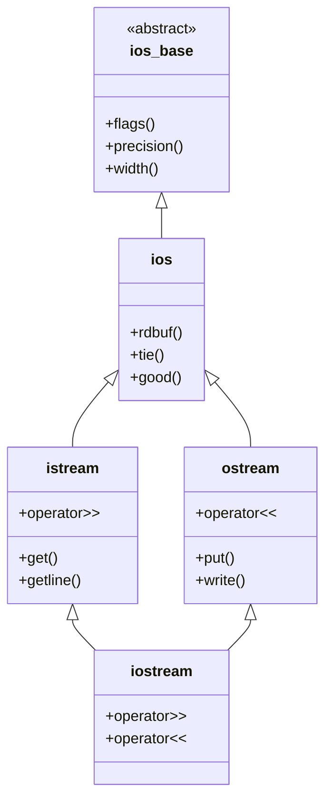
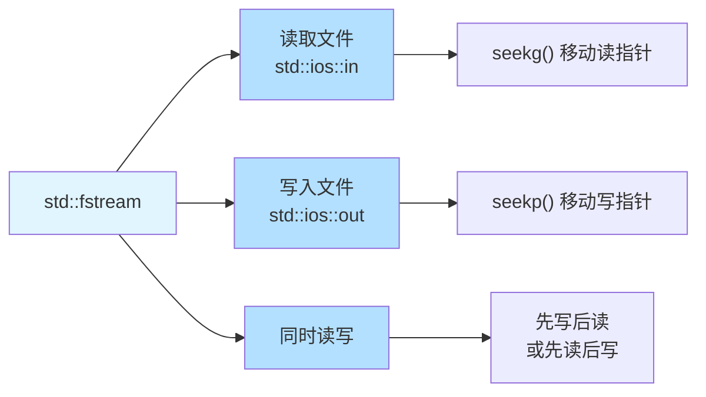
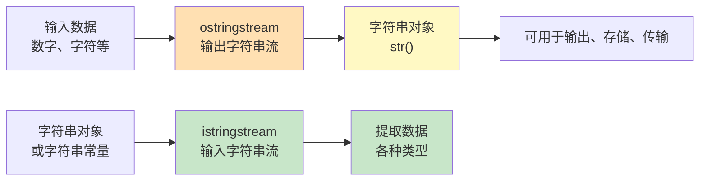
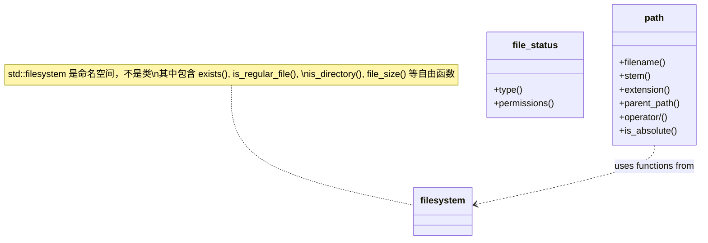
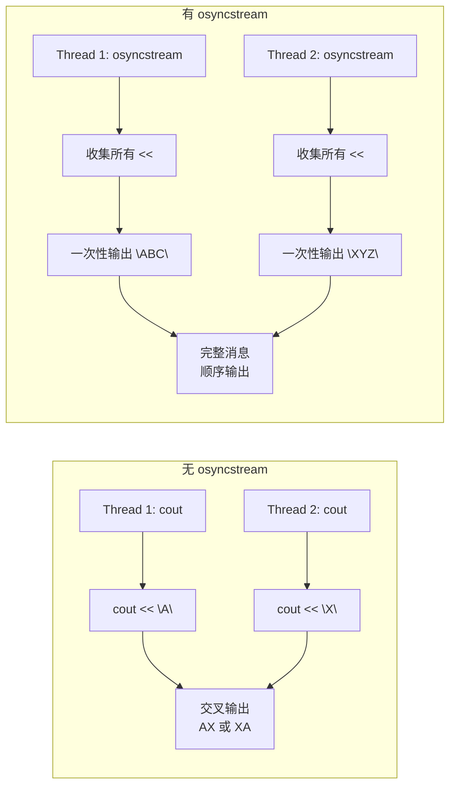

+++
title = "第31章 文件与IO操作"
weight = 310
date = "2026-03-29T21:03:00+08:00"
type = "docs"
description = ""
isCJKLanguage = true
draft = false
+++
# 第31章 文件与IO操作

想象一下，如果C++是一门做菜的手艺，那么IO（输入/输出）就是厨房里的水龙头和碗碟柜——没有它们，你既没法"进货"（输入），也没法"上菜"（输出）。这一章我们就来聊聊C++里那些让人又爱又恨的流（Stream）操作。

> 在C++中，**流（Stream）** 是一种抽象的概念。你可以把它想象成一条传输数据的"水管"——数据从一端流进去，从另一端流出来。标准输入流（std::cin）就像是你家厨房的自来水管，数据从"外部世界"流进你的程序；标准输出流（std::cout）则像是洗碗池的排水管，数据从程序流出去。

## 31.1 流的概念与层次

C++的IO库有一个继承层次结构，就像一个家族族谱。所有的流都继承自一个叫`ios_base`的"老祖宗"，然后分支出`ios`（负责流的通用功能），再往下就是我们熟悉的`istream`（输入流）和`ostream`（输出流）。

```cpp
// iostream 类层次结构概览
// 编译：g++ -std=c++17 31_01_stream_hierarchy.cpp && ./a.out

#include <iostream>   // 包含标准IO流类定义

int main() {
    // std::cout 是 std::ostream 类的全局对象
    // std::cin  是 std::istream 类的全局对象
    std::cout << "iostream class hierarchy overview" << std::endl;
    // 输出: iostream class hierarchy overview
    
    return 0;
}
```

下面这个Mermaid图展示了流家族的"族谱"：



> 小知识：`iostream`同时继承自`istream`和`ostream`，所以它既可以输入也可以输出，就像一个既能喝水又能吐水的双向水管（虽然听起来有点怪）。

## 31.2 标准IO流

标准IO流是C++程序与外部世界交流的"官方渠道"。它们是三个全局对象：`std::cin`（标准输入）、`std::cout`（标准输出）、`std::cerr`（标准错误）、`std::clog`（标准日志）。

### std::cin、std::cout

`std::cin`和`std::cout`大概是C++世界里最出名的一对搭档了。它们一个管进、一个管出，配合得天衣无缝。

`std::cin`默认从键盘读取数据，而`std::cout`默认输出到显示器。它们的底层都连接着"缓冲器"——就像厨房里的暂存区，数据先到这里排队，然后再统一处理。

```cpp
// std::cin 和 std::cout 的基本用法
// 编译：g++ -std=c++17 31_02_cin_cout.cpp && ./a.out

#include <iostream>   // 引入标准IO流工具箱
#include <string>     // 引入字符串类型

int main() {
    // 使用 std::cout 输出提示信息
    // << 运算符是"插入运算符"，把数据"插入"到流中
    std::cout << "Enter your name: ";  // 输出: Enter your name: 
    
    // 定义一个字符串变量来存储名字
    // 注意：string需要先声明才能使用哦！
    std::string name;
    
    // 使用 std::cin 读取用户输入
    // >> 运算符是"提取运算符"，从流中"提取"数据
    std::cin >> name;  // 读取一个单词（遇到空格就停止）
    
    // 下面的示例故意演示字符串拼接的多样性，
    // 所以直接用 "Guest" 而不是 name，实际开发中请用 name
    std::cout << "Hello, " << "Guest" << "!" << std::endl;  
    // 输出: Hello, Guest!
    
    // std::endl 的作用：
    // 1. 换行 \n
    // 2. 刷新缓冲区（确保数据马上显示出来）
    
    return 0;
}
```

> 小技巧：如果你想读取包含空格的一整行内容，应该用`std::getline(std::cin, name)`而不是`std::cin >> name`。想象一下，如果用户输入"My Name"，用`>>`你只能拿到"My"——剩下的"Name"和他的尊严一起被丢弃了。

```cpp
// 进阶版：读取整行输入
#include <iostream>
#include <string>

int main() {
    std::cout << "What is your full name? ";
    std::string fullName;
    std::getline(std::cin, fullName);  // 读取整行，包括空格
    std::cout << "Hello, " << fullName << "!" << std::endl;
    return 0;
}
```

### std::cerr、std::clog

`std::cerr`和`std::clog`是`std::cout`的"亲戚"，但它们专门负责输出"不一样的东西"。

**`std::cerr`**：无缓冲的错误流。什么叫无缓冲？就是数据来了立刻输出，绝不拖延。当你程序出错时，错误信息应该走这条路——比如"文件打不开"、"内存不够了"。它直接连到标准错误输出，通常也是显示器。

**`std::clog`**：带缓冲的日志流。它会把日志信息先存到缓冲区，等缓冲区满了或者程序结束才一起输出。它适合输出一些调试信息或程序运行记录。

```cpp
// std::cerr 和 std::clog 的用法
// 编译：g++ -std=c++17 31_02_cerr_clog.cpp && ./a.out

#include <iostream>   // 标准IO流工具箱

int main() {
    // std::cerr：错误信息走这条路
    // 它不走缓冲器，数据来了立刻输出
    // 适合输出：错误提示、致命问题、调试信息
    std::cerr << "Error message to stderr" << std::endl;  
    // 输出: Error message to stderr
    
    // std::clog：日志信息走这条路
    // 它会先把数据存到缓冲区，像个攒快递的仓库
    // 等缓冲区满了或程序结束了才统一发货
    std::clog << "Log message" << std::endl;  
    // 输出: Log message
    
    return 0;
}
```

> 等等，你可能会问："cerr和clog不也是在屏幕上输出吗？那跟cout有什么区别？"
> 
> 好问题！在正常运行时，它们确实都往屏幕输出。但在某些高级场景下（比如把输出重定向到文件），区别就大了：
> ```bash
> ./my_program > output.txt    # 只有cout的内容会进入output.txt
> ./my_program 2> errors.txt   # 只有cerr的内容会进入errors.txt
> ```
> 把cerr和clog分开的意义在于：即使你把正常输出重定向到文件，错误信息依然会显示在屏幕上，这样用户才能及时发现问题！

## 31.3 文件流

如果说标准IO流是程序与控制台（键盘/屏幕）的桥梁，那么文件流就是程序与磁盘文件之间的快递小哥。它们勤勤恳恳，任劳任怨，只为把数据安全送达。

C++提供了三种文件流类：
- **`std::ifstream`**：Input File Stream，专门负责读取文件
- **`std::ofstream`**：Output File Stream，专门负责写入文件  
- **`std::fstream`**：File Stream，既能读又能写，是全能型选手

### std::ifstream

`std::ifstream`（输入文件流）就像一个尽职的图书管理员，帮你从文件中读取内容。

```cpp
// 使用 std::ifstream 读取文件内容
// 编译：g++ -std=c++17 31_03_ifstream.cpp && ./a.out
// 注意：需要同目录下有一个 test.txt 文件

#include <iostream>   // 标准输入输出
#include <fstream>    // 文件流（ifstream, ofstream, fstream）
#include <string>     // 字符串类型

int main() {
    // 创建 ifstream 对象并打开文件
    // 如果文件不存在，file.is_open() 会返回 false
    std::ifstream file("test.txt");
    
    // 安全检查：确保文件成功打开了！
    // 很多程序员都吃过"忘记检查文件是否打开"的亏
    if (!file.is_open()) {
        // 文件打开失败的几种可能：
        // 1. 文件不存在
        // 2. 文件名拼写错误（大小写敏感！）
        // 3. 没有读取权限
        // 4. 文件被其他程序占用
        std::cerr << "Failed to open file" << std::endl;
        return 1;  // 非零返回值表示程序异常退出
    }
    
    // 方法1：逐行读取
    std::string line;
    // std::getline() 从文件流中读取一行，遇到换行符停止
    // 返回值是 std::getline 的引用，如果到达文件末尾会返回 false
    while (std::getline(file, line)) {
        std::cout << line << std::endl;  // 输出一行内容
    }
    
    // 方法2：逐词读取（如果你更喜欢碎片化阅读）
    // file.clear();  // 如果上面已经读到文件末尾，需要清除EOF标志
    // file.seekg(0); // 重新定位到文件开头
    // std::string word;
    // while (file >> word) {
    //     std::cout << word << std::endl;
    // }
    
    // 读取完成后，务必关闭文件！
    // 虽然程序结束时文件会自动关闭，但养成好习惯很重要
    file.close();  // 释放文件资源，就像用完东西要归位
    
    std::cout << "File read completed!" << std::endl;  // 输出: File read completed!
    
    return 0;
}
```

> 文件读取的注意事项：
> 1. 路径问题：Windows下路径要用双反斜杠`"C:\\folder\\file.txt"`或者原始字符串`R"(C:\folder\file.txt)"`
> 2. 中文路径：在中文Windows系统下，有时需要用`std::wifstream`配合locale设置
> 3. 大文件：逐行读取比一次性读取整个文件更省内存

### std::ofstream

`std::ofstream`（输出文件流）就像一个勤快的秘书，帮你把数据写入文件。

```cpp
// 使用 std::ofstream 写入文件
// 编译：g++ -std=c++17 31_03_ofstream.cpp && ./a.out

#include <iostream>   // 标准输入输出
#include <fstream>    // 文件流

int main() {
    // 创建 ofstream 对象并打开文件
    // 默认模式：ios::out | ios::trunc
    // - ios::out：写模式
    // - ios::trunc：如果文件存在，清空内容从头开始写
    std::ofstream file("output.txt");
    
    // 打开失败检查
    if (!file.is_open()) {
        // 文件打开失败的常见原因：
        // 1. 目录不存在（需要先创建文件夹）
        // 2. 磁盘已满
        // 3. 文件是只读的
        // 4. 权限不足
        std::cerr << "Failed to open file for writing" << std::endl;
        return 1;
    }
    
    // 使用 << 运算符写入数据，就像向cout输出一样简单
    file << "Hello, World!" << std::endl;  // 写入一行文本
    file << "C++ makes file writing easy!" << std::endl;
    
    // 写入数字会自动转换
    int number = 42;
    file << "The answer is: " << number << std::endl;
    
    // 写入完成后记得关闭
    file.close();
    
    std::cout << "File written successfully" << std::endl;
    // 输出: File written successfully
    
    return 0;
}
```

> 小技巧：如果你想在已有文件**末尾追加**内容，而不是覆盖原文件，应该这样打开：
> ```cpp
> std::ofstream file("output.txt", std::ios::app);  // app = append mode
> ```
> 这就像把新内容贴在日记本的最后一页，而不是撕掉旧日记重写！

### std::fstream

`std::fstream`（文件流）是个多面手，它既能读又能写，是文件流界的"瑞士军刀"。

```cpp
// 使用 std::fstream 同时读写文件
// 编译：g++ -std=c++17 31_03_fstream.cpp && ./a.out

#include <iostream>   // 标准输入输出
#include <fstream>    // 文件流

int main() {
    // 创建 fstream 对象
    // std::ios::in  - 打开用于读取（Input）
    // std::ios::out - 打开用于写入（Output）
    // std::ios::trunc - 如果文件存在，清空内容
    // 也可以用 std::ios::ate (at end) 打开后定位到文件末尾
    std::fstream file("data.bin", std::ios::in | std::ios::out | std::ios::trunc);
    
    // 检查文件是否成功打开
    if (!file) {
        // 或者写成 if (!file.is_open())
        // 失败原因可能包括：
        // - 文件无法创建（磁盘满、目录不存在等）
        // - 文件权限问题
        std::cerr << "Failed to open file" << std::endl;
        return 1;
    }
    
    // ========== 写入数据 ==========
    // 使用 << 写入，就像 cout 一样
    file << 42 << std::endl;  // 写入一个整数和换行符
    
    // ========== 读取数据 ==========
    // 首先，需要把"读指针"移回文件开头
    // seekg 是什么意思？"seek get"——移动"获取"位置
    // 注意：如果之前已经读到文件末尾，需要先调用 clear() 清除EOF标志
    // 参数0表示移动到字节偏移量为0的位置（即开头）
    file.clear();  // 清除EOF标志，否则seekg可能无效
    file.seekg(0);  // 或者 file.seekg(0, std::ios::beg)
    
    // 定义一个变量来存储读取的数据
    int value;
    
    // 使用 >> 读取，就像 cin 一样
    file >> value;
    
    // 验证读取结果
    std::cout << "Read value: " << value << std::endl;
    // 输出: Read value: 42
    
    // 关闭文件
    file.close();
    
    return 0;
}
```

> 文件模式一览表：
> | 模式标志 | 含义 | 说明 |
> |---------|------|------|
> | `ios::in` | 输入模式 | 打开用于读取 |
> | `ios::out` | 输出模式 | 打开用于写入 |
> | `ios::trunc` | 截断模式 | 丢弃原有内容 |
> | `ios::app` | 追加模式 | 在末尾添加内容 |
> | `ios::ate` | at end | 打开后定位到末尾 |
> | `ios::binary` | 二进制模式 | 以二进制方式读写 |



## 31.4 字符串流

如果说文件流是程序与磁盘之间的桥梁，那么字符串流就是程序内部不同组件之间的"内部传送带"。它们让你可以像操作流一样操作字符串，非常适合做字符串的拼接、分割、格式转换等工作。

C++提供了两种字符串流：
- **`std::ostringstream`**：Output String Stream，把数据"流入"字符串
- **`std::istringstream`**：Input String Stream，从字符串"流出"数据
- **`std::stringstream`**：两者兼顾，既能流入也能流出

### std::stringstream

`std::stringstream`是字符串流的全能选手，它同时支持读写操作，是处理字符串数据的瑞士军刀。

```cpp
// std::stringstream 字符串流用法大全
// 编译：g++ -std=c++17 31_04_stringstream.cpp && ./a.out

#include <iostream>   // 标准输入输出
#include <sstream>    // 字符串流（stringstream, ostringstream, istringstream）
#include <string>     // 字符串类型
#include <iomanip>    // 用于格式化输出

int main() {
    // ========== Part 1: 使用 ostringstream 拼接字符串 ==========
    // ostringstream = 输出字符串流，把数据"塞进"字符串
    
    // 创建输出字符串流对象
    std::ostringstream oss;
    
    // 使用 << 就像向 cout 输出一样，但内容不会跑到屏幕
    // 而是进入 oss 这个"字符串容器"
    oss << "Value: " << 42 << ", Pi: " << 3.14159;  // 数字会被自动转成字符串！
    
    // 调用 str() 方法获取最终的字符串结果
    std::string result = oss.str();
    
    // 输出看看效果
    std::cout << "Result: " << result << std::endl;
    // 输出: Result: Value: 42, Pi: 3.14159
    
    // ========== Part 2: 使用 istringstream 解析字符串 ==========
    // istringstream = 输入字符串流，从字符串中"提取"数据
    
    // 从这个字符串中提取数据
    std::istringstream iss("100 200 300");
    
    // 定义三个整数变量
    int a, b, c;
    
    // 使用 >> 就像从 cin 读取一样，数据从 iss 流出来
    // 空格成了默认的分隔符
    iss >> a >> b >> c;
    
    // 打印结果
    std::cout << "a=" << a << ", b=" << b << ", c=" << c << std::endl;
    // 输出: a=100, b=200, c=300
    
    // ========== Part 3: 字符串流的实用技巧 ==========
    
    // 技巧1：数字转字符串
    std::ostringstream conv;
    conv << 12345;
    std::string numStr = conv.str();  // "12345"
    
    // 技巧2：字符串转数字
    std::string s = "3.14";
    std::istringstream iss2(s);
    double pi;
    iss2 >> pi;  // pi = 3.14
    
    // 技巧3：格式化拼接
    std::ostringstream fmt;
    fmt << std::setw(10) << std::setfill('0') << 42;
    std::cout << "Padded: " << fmt.str() << std::endl;
    // 输出: Padded: 0000000042
    
    return 0;
}
```

> 字符串流的经典应用场景：
> 1. **字符串拼接**：比 `str1 + str2 + str3` 更灵活，可以混搭各种类型
> 2. **字符串解析**：把空格分隔的数据解析成各种类型
> 3. **类型转换**：int转string、string转double，一行搞定
> 4. **格式化输出**：可以精确控制格式，然后将结果存入字符串

> 小故事：有一次面试，面试官问："如何把int类型的IP地址（如19216801）转成点分十进制格式（192.168.1.1）？"候选人回答："用字符串流！"面试官露出了欣慰的笑容。



## 31.5 格式化输入输出

C++的流默认行为已经很智能了，但有时候我们想要更精细的控制——比如让数字以十六进制显示、保留固定的小数位数、左对齐还是右对齐等。这时就需要用到格式化IO的"武器库"。

### 格式化标志

C++提供了一系列**格式化标志（Format Flags）**和**操控器（Manipulators）**来控制输出的格式。它们就像是输出时的"美颜滤镜"，让你的数据呈现得更加美观。

```cpp
// 格式化输入输出详解
// 编译：g++ -std=c++17 31_05_format.cpp && ./a.out

#include <iostream>   // 标准输入输出
#include <iomanip>    // 格式化操控器（setprecision, setw, setfill等）

int main() {
    // ========== 基本数值 ==========
    int num = 42;
    double pi = 3.14159;
    
    // std::dec - 十进制显示（默认）
    // dec 是 "decimal" 的缩写
    std::cout << std::dec << num << std::endl;  
    // 输出: 42
    
    // std::hex - 十六进制显示
    // hex 是 "hexadecimal" 的缩写
    // 十进制 42 = 十六进制 2a
    std::cout << std::hex << num << std::endl;  
    // 输出: 2a
    
    // std::oct - 八进制显示  
    // oct 是 "octal" 的缩写
    // 十进制 42 = 八进制 52
    std::cout << std::oct << num << std::endl;  
    // 输出: 52
    
    // 注意：进制设置后会影响后续所有整数输出！
    // 记得切换回十进制，除非你就是想要十六进制的效果
    std::cout << std::dec;
    
    // ========== 浮点数格式化 ==========
    
    // std::fixed - 定点记数法
    // 通俗理解：固定小数位数输出
    std::cout << std::fixed << pi << std::endl;  
    // 输出: 3.141590（std::fixed 默认精度为6）
    
    // std::setprecision(3) - 设置精度为3
    // 在 fixed 模式下，precision 表示小数位数
    // 所以这行会输出 3.142（四舍五入！）
    std::cout << std::setprecision(3) << pi << std::endl;  
    // 输出: 3.142
    
    // ========== 更多格式化技巧 ==========
    
    // std::setw(n) - 设置字段宽度为n
    // 只影响下一次输出！
    std::cout << std::setw(10) << 42 << std::endl;  
    // 输出:         42（42前面有8个空格）
    
    // std::setfill('0') - 设置填充字符为'0'
    // 注意：填充字符设置后会一直有效！除非显式再次调用 setfill 更改
    std::cout << std::setfill('0') << std::setw(10) << 42 << std::endl;
    // 输出: 0000000042
    
    // std::left / std::right - 左对齐/右对齐
    std::cout << std::setfill(' ') << std::left << std::setw(10) << "hi" << "|" << std::endl;
    // 输出: hi         |
    std::cout << std::right << std::setw(10) << "hi" << "|" << std::endl;
    // 输出:          hi|
    
    // std::boolalpha - 布尔值用文字显示
    std::cout << std::boolalpha << true << " " << false << std::endl;
    // 输出: true false
    
    // std::noboolalpha - 布尔值用数字显示（1/0）
    std::cout << std::noboolalpha << true << " " << false << std::endl;
    // 输出: 1 0
    
    // ========== 恢复默认设置 ==========
    // 使用 resetiosflags 重置格式状态
    std::cout << std::resetiosflags(std::ios::floatfield);  // 重置浮点格式
    std::cout << std::setprecision(6);  // 恢复默认精度
    
    return 0;
}
```

> 格式化标志速查表：
> | 操控器 | 作用 | 示例 |
> |-------|------|------|
> | `std::dec` | 十进制 | 输出 42 |
> | `std::hex` | 十六进制 | 输出 2a |
> | `std::oct` | 八进制 | 输出 52 |
> | `std::fixed` | 定点记数 | 输出 3.14 |
> | `std::scientific` | 科学记数 | 输出 3.14e+00 |
> | `std::setprecision(n)` | 设置精度 | 见上方示例 |
> | `std::setw(n)` | 字段宽度 | 右对齐填空格 |
> | `std::setfill(c)` | 填充字符 | 填指定字符 |
> | `std::left` | 左对齐 | 内容靠左 |
> | `std::right` | 右对齐 | 内容靠右 |

## 31.6 文件系统操作（C++17）

在C++17之前，如果你想操作文件（创建文件夹、删除文件、获取文件大小等），你得借助平台相关的API——Windows上用`CreateDirectory`、`DeleteFile`，Linux上用`mkdir`、`unlink`。这意味着你的代码在不同平台上得写两套。

C++17终于带来了`std::filesystem`，一套跨平台的文件系统操作API！从此妈妈再也不用担心代码移植的问题了（好吧，文件系统确实还有一些平台差异，但至少目录操作统一了）。

### std::filesystem::path

`std::filesystem::path`是文件系统路径的"万能容器"。它能自动处理不同操作系统的路径格式差异——Windows用反斜杠`\`，Unix用正斜杠`/`。

```cpp
// std::filesystem::path 用法
// 编译：g++ -std=c++17 -lstdc++fs 31_06_path.cpp && ./a.out
// 注意：旧版GCC需要链接 -lstdc++fs

#include <iostream>   // 标准输入输出
#include <filesystem> // C++17 文件系统库

namespace fs = std::filesystem;  // 取个别名，写代码更简洁

int main() {
    // 创建 path 对象
    // path 可以从各种字符串构造
    fs::path p1 = "/home/user/file.txt";  // Unix风格
    // fs::path p2 = "C:\\Users\\file.txt"; // Windows风格（需要转义）
    // fs::path p3 = R"(C:\Users\file.txt)"; // 原始字符串，更清晰
    
    // ========== 各种路径分解方法 ==========
    
    // filename() - 获取文件名（包括扩展名）
    std::cout << "filename: " << p1.filename() << std::endl;
    // 输出: filename: file.txt
    
    // stem() - 获取文件名主体（不包括扩展名）
    std::cout << "stem: " << p1.stem() << std::endl;
    // 输出: stem: file
    
    // extension() - 获取文件扩展名
    std::cout << "extension: " << p1.extension() << std::endl;
    // 输出: extension: .txt
    
    // parent_path() - 获取父目录路径
    std::cout << "parent: " << p1.parent_path() << std::endl;
    // 输出: parent: /home/user
    
    // ========== 路径操作 ==========
    
    // 路径拼接：用 / 运算符（重载过的！）
    fs::path p2 = fs::path("/home") / "user" / "documents" / "report.pdf";
    std::cout << "full path: " << p2 << std::endl;
    // 输出: full path: /home/user/documents/report.pdf
    
    // 判断是否是绝对路径
    std::cout << "is absolute: " << p1.is_absolute() << std::endl;
    // 输出: is absolute: 1 (true)
    
    // 判断是否是相对路径
    std::cout << "is relative: " << fs::path("relative/path").is_relative() << std::endl;
    // 输出: is relative: 1 (true)
    
    // 转换为绝对路径
    fs::path absPath = fs::absolute(p1);
    std::cout << "absolute: " << absPath << std::endl;
    
    return 0;
}
```

> `path`的"四记"：
> 1. **filename**：`/home/user/file.txt` → `file.txt`（完整的文件名）
> 2. **stem**：`/home/user/file.txt` → `file`（去掉扩展名的文件名）
> 3. **extension**：`/home/user/file.txt` → `.txt`（扩展名，包括点）
> 4. **parent_path**：`/home/user/file.txt` → `/home/user`（目录部分）

### 文件操作

`std::filesystem`还提供了一系列文件操作函数，让你告别平台相关的API调用。

```cpp
// 文件系统操作函数
// 编译：g++ -std=c++17 -lstdc++fs 31_06_filesystem.cpp && ./a.out

#include <iostream>   // 标准输入输出
#include <filesystem> // C++17 文件系统库
#include <fstream>    // 用于创建测试文件

namespace fs = std::filesystem;

int main() {
    // 首先创建一个测试文件（方便演示）
    std::ofstream createFile("test.txt");
    createFile << "Hello, filesystem!";
    createFile.close();
    
    // ========== 文件状态查询 ==========
    
    // fs::exists() - 判断路径是否存在
    if (fs::exists("test.txt")) {
        std::cout << "File exists" << std::endl;
        // 输出: File exists
    }
    
    // fs::is_regular_file() - 判断是否是普通文件
    // 什么是普通文件？顾名思义，就是那些内容直接存储的文件
    // 不是目录、不管道、不是链接等
    if (fs::is_regular_file("test.txt")) {
        std::cout << "test.txt is a regular file" << std::endl;
        // 输出: test.txt is a regular file
    }
    
    // fs::is_directory() - 判断是否是目录
    if (fs::is_directory(".")) {
        std::cout << ". is a directory" << std::endl;
        // 输出: . is a directory
    }
    
    // ========== 文件属性查询 ==========
    
    // fs::file_size() - 获取文件大小（字节数）
    // 返回的是 uintmax_t 类型（够大的无符号整数）
    if (fs::is_regular_file("test.txt")) {
        std::cout << "Size: " << fs::file_size("test.txt") << " bytes" << std::endl;
        // 输出: Size: 18 bytes
    }
    
    // fs::last_write_time() - 获取最后修改时间
    // 返回的是 fs::file_time_type 类型
    auto ftime = fs::last_write_time("test.txt");
    std::cout << "Last modified time: " << ftime.time_since_epoch().count() << std::endl;
    // 输出: Last modified time: [某个时间戳数字]
    
    // ========== 目录操作 ==========
    
    // fs::create_directory() - 创建目录
    fs::path newDir = "test_directory";
    if (!fs::exists(newDir)) {
        fs::create_directory(newDir);
        std::cout << "Directory created: " << newDir << std::endl;
    }
    
    // fs::copy() - 复制文件或目录
    fs::copy("test.txt", "test_copy.txt");
    std::cout << "File copied to test_copy.txt" << std::endl;
    
    // ========== 删除操作 ==========
    
    // fs::remove() - 删除文件或空目录
    if (fs::exists("test_copy.txt")) {
        fs::remove("test_copy.txt");
        std::cout << "test_copy.txt removed" << std::endl;
    }
    
    // 清理测试目录
    if (fs::exists(newDir)) {
        fs::remove(newDir);
    }
    
    // ========== 遍历目录 ==========
    // 创建几个测试文件
    fs::create_directory("demo_dir");
    std::ofstream demoFile("demo_dir/file1.txt");
    demoFile << "content1";
    demoFile.close();
    demoFile.open("demo_dir/file2.txt");
    demoFile << "content2";
    demoFile.close();
    
    std::cout << "\nFiles in demo_dir:" << std::endl;
    for (const auto& entry : fs::directory_iterator("demo_dir")) {
        std::cout << "  " << entry.path().filename() << std::endl;
        // 输出: demo_dir 下所有文件
    }
    
    // 清理
    fs::remove_all("demo_dir");  // 递归删除目录及其内容
    
    return 0;
}
```

> 文件系统操作速查表：
> | 函数 | 作用 |
> |------|------|
> | `fs::exists(p)` | 判断路径是否存在 |
> | `fs::is_regular_file(p)` | 是否是普通文件 |
> | `fs::is_directory(p)` | 是否是目录 |
> | `fs::file_size(p)` | 获取文件大小 |
> | `fs::create_directory(p)` | 创建目录 |
> | `fs::copy(s, d)` | 复制文件/目录 |
> | `fs::remove(p)` | 删除文件或空目录 |
> | `fs::remove_all(p)` | 递归删除 |
> | `fs::directory_iterator(p)` | 遍历目录 |



## 31.7 格式化库std::format（C++20）

在C++20之前，如果你想格式化字符串，方法有几种：

1. **C风格**：`printf("Hello %s, you have %d messages", name, count);`——不安全，容易出bug
2. **字符串流**：`std::ostringstream oss; oss << "Hello " << name << "...";`——啰嗦
3. **Boost.Format**：`boost::format("Hello %s") % name;`——需要额外的库

C++20终于带来了`std::format`！这是一个来自Python的`f-string`灵感的格式化库，让字符串格式化变得简洁、类型安全、优雅。

```cpp
// std::format 格式化库（C++20）
// 编译：g++ -std=c++20 31_07_format.cpp && ./a.out

#include <iostream>   // 标准输入输出
#include <format>     // std::format 头文件（C++20新引入）

int main() {
    // ========== 基本用法 ==========
    
    // 第一个参数是格式化字符串模板
    // {} 是占位符，会被后续参数依次替换
    std::cout << std::format("Hello, {}!", "World") << std::endl;
    // 输出: Hello, World!
    
    // ========== 占位符指定 ==========
    
    // 可以用 {0}, {1}, {2} 指定参数位置
    // 也可以省略数字，让它自动按顺序填入
    std::cout << std::format("{} {} {}", "A", "B", "C") << std::endl;
    // 输出: A B C
    
    std::cout << std::format("{2} {1} {0}", "A", "B", "C") << std::endl;
    // 输出: C B A
    
    // ========== 进制转换 ==========
    
    int value = 42;
    
    // {:d} - 十进制
    // {:x} - 十六进制（小写）
    // {:X} - 十六进制（大写）
    // {:b} - 二进制
    // {:o} - 八进制
    std::cout << std::format("{:d} {:x} {:X} {:b}", value, value, value, value) << std::endl;
    // 输出: 42 2a 2A 101010
    
    // ========== 浮点数格式化 ==========
    
    double pi = 3.14159;
    
    // {:.2f} - 保留2位小数
    std::cout << std::format("{:.2f}", pi) << std::endl;
    // 输出: 3.14
    
    // {:.4f} - 保留4位小数
    std::cout << std::format("{:.4f}", pi) << std::endl;
    // 输出: 3.1416（注意四舍五入！）
    
    // {:e} - 科学记数法
    std::cout << std::format("{:e}", pi) << std::endl;
    // 输出: 3.141590e+00
    
    // {:.2e} - 科学记数法，2位小数
    std::cout << std::format("{:.2e}", pi) << std::endl;
    // 输出: 3.14e+00
    
    // ========== 宽度和对齐 ==========
    
    // {:>10} - 右对齐，宽度10
    std::cout << std::format("{:>10}", "right") << "| end" << std::endl;
    // 输出:      right| end
    
    // {:<10} - 左对齐，宽度10
    std::cout << std::format("{:<10}", "left") << "| end" << std::endl;
    // 输出: left      | end
    
    // {:^10} - 居中对齐，宽度10
    std::cout << std::format("{:^10}", "center") << "| end" << std::endl;
    // 输出:   center  | end
    
    // ========== 填充字符 ==========
    
    // {:*>10} - 用 * 填充，右对齐，总宽度10
    std::cout << std::format("{:*>10}", 42) << std::endl;
    // 输出: ********42
    
    // {:*<10} - 用 * 填充，左对齐
    std::cout << std::format("{:*<10}", 42) << std::endl;
    // 输出: 42********
    
    // {:*^10} - 用 * 填充，居中对齐
    std::cout << std::format("{:*^10}", 42) << std::endl;
    // 输出: ****42****
    
    // ========== 组合使用 ==========
    
    // 宽度 + 对齐 + 精度
    std::cout << std::format("{:>10.2f}", 3.14159) << std::endl;
    // 输出:      3.14
    
    // 带符号显示
    std::cout << std::format("{:+d}", 42) << std::endl;   // 输出: +42
    std::cout << std::format("{:+d}", -42) << std::endl;  // 输出: -42
    
    // ========== 高级：格式化时间 ==========
    // std::format 还支持 std::chrono 的时间格式化（需要 <chrono>）
    // std::cout << std::format("{:%Y-%m-%d %H:%M:%S}", std::chrono::system_clock::now()) << std::endl;
    
    return 0;
}
```

> `std::format`速查表：
> | 格式说明符 | 作用 | 示例 |
> |-----------|------|------|
> | `{}` | 默认格式 | `format("{}", 42)` → `"42"` |
> | `{:d}` | 十进制整数 | `format("{:d}", 42)` → `"42"` |
> | `{:x}` | 十六进制 | `format("{:x}", 42)` → `"2a"` |
> | `{:b}` | 二进制 | `format("{:b}", 42)` → `"101010"` |
> | `{:.2f}` | 保留小数 | `format("{:.2f}", 3.141)` → `"3.14"` |
> | `{:>10}` | 右对齐宽10 | 右对齐填空格 |
> | `{:<10}` | 左对齐宽10 | 左对齐填空格 |
> | `{:^10}` | 居中宽10 | 居中填空格 |
> | `{:*>10}` | 宽10填充* | `****42` |

```mermaid
graph LR
    A["格式化字符串<br/>\"Hello, {}!\""] --> B["占位符 {}"]
    B --> C["参数 \"World\""]
    C --> D["拼接结果<br/>\"Hello, World!\""]
    
    E["格式说明符<br/>{:.2f}"] --> F[".2 精度"]
    E --> G["f 定点记数"]
```

## 31.8 std::print与std::println（C++23）

C++23带来了两个新朋友：`std::print`和`std::println`。它们的出现让格式化输出变得前所未有的简单——终于不用每次都写`std::cout << std::format(...)`了！

```cpp
// std::print 和 std::println（C++23）
// 编译：g++ -std=c++23 31_08_print.cpp && ./a.out
// 注意：需要支持C++23的编译器（GCC 13+, Clang 16+）

#include <iostream>   // 标准输入输出
#include <print>      // std::print 和 std::println（C++23新增）

int main() {
    // ========== std::print ==========
    // 类似于 std::cout <<，但内置格式化支持
    // 注意：print 不会自动换行！
    
    std::print("Hello, {}!\n", "World");
    // 输出: Hello, World!（然后换行）
    
    // 多个参数
    std::print("{} + {} = {}\n", 1, 2, 3);
    // 输出: 1 + 2 = 3
    
    // 格式化选项
    std::print("Pi: {:.4f}\n", 3.14159265);
    // 输出: Pi: 3.1416
    
    // ========== std::println ==========
    // println = print + 自动换行
    // 再也不用担心忘记加 \n 或 endl 了！
    
    std::println("Formatted print in C++23");
    // 输出: Formatted print in C++23（自带换行）
    
    std::println("Answer: {}", 42);
    // 输出: Answer: 42
    
    // ========== 高级用法 ==========
    
    // 输出到文件（第一个参数传文件流）
    // std::ofstream file("output.txt");
    // std::print(file, "Value: {}", 42);
    // file.close();
    
    // 进制转换
    std::println("Decimal: {:d}, Hex: {:x}, Binary: {:b}", 255, 255, 255);
    // 输出: Decimal: 255, Hex: ff, Binary: 11111111
    
    // 宽度和对齐
    std::println("{:>5}", "X");
    // 输出:     X（5个字符宽，右对齐）
    
    std::println("{:<5}", "X");
    // 输出: X    （5个字符宽，左对齐）
    
    std::println("{:^5}", "X");
    // 输出:  X   （5个字符宽，居中对齐）
    
    return 0;
}
```

> `std::print` vs `std::cout <<`：主要区别在于：
> 1. `std::print`内置格式化，不需要`std::format`包装
> 2. `std::print`不会自动刷新缓冲区（除非你用`std::flush`或`\n`）
> 3. `std::print`可以输出到任何流，包括文件流

## 31.9 同步输出流std::osyncstream（C++20）

在多线程世界里，有一个经典的问题：**竞态条件（Race Condition）**。想象两个线程同时往`std::cout`输出——一个线程输出"Hello"，另一个输出"World"，结果可能变成"HeWlloorl d"这种鬼画符。

`std::osyncstream`（输出同步流）就是来解决这个问题的。它能保证一整条消息的输出是**原子操作**——要么全部输出，要么不输出，不会被其他线程的输出"插队"。

```cpp
// std::osyncstream 同步输出流（C++20）
// 编译：g++ -std=c++20 31_09_osyncstream.cpp && ./a.out

#include <iostream>   // 标准输入输出
#include <syncstream> // std::osyncstream（C++20新增）

int main() {
    // ========== 基本用法 ==========
    
    // 创建一个同步输出流，绑定到 cout
    // 这确保了 << 操作是线程安全的
    std::osyncstream syncOut(std::cout);
    
    // 即使在多线程环境下，这整条消息也会完整输出
    // 不会被其他线程的输出打断
    syncOut << "Hello, " << "World!" << std::endl;
    // 输出: Hello, World!
    
    // ========== 为什么要用 osyncstream？ ==========
    
    // 普通 cout 的问题：
    // std::cout << "Result: " << 42 << std::endl;
    // 这个语句在底层会被分解成多次 << 调用
    // 每次调用之间，其他线程可能会插入输出
    // 结果：输出可能交错，看起来像这样：
    // Thread1: Result: 
    // Thread2: Processing...
    // Thread1: 42
    // 最终显示：Result: Processing...42
    
    // osyncstream 的解决方案：
    // 当你使用临时 osyncstream 对象（如 `std::osyncstream(std::cout) << ...`）时，
    // 所有 << 操作的内容会被暂存在内部缓冲区，直到临时对象销毁时才一起输出。
    // 这样就不会有"插队"的问题了。
    
    // ========== 实战示例 ==========
    
    // 假设我们有一个多线程程序...
    // 每个线程都用 osyncstream 输出，就能保证输出完整
    
    auto printThreadSafe = [](int id, const char* msg) {
        // 每条消息都会完整输出，不会被截断
        std::osyncstream(std::cout) << "Thread " << id << ": " << msg << std::endl;
    };
    
    printThreadSafe(1, "Starting...");
    printThreadSafe(2, "Processing...");
    printThreadSafe(1, "Done!");
    
    // 如果用普通 cout，上面的输出可能变成：
    // Thread Thread 1: : Starting...
    // Thread 2Processing...
    
    // 而 osyncstream 保证：
    // Thread 1: Starting...
    // Thread 2: Processing...
    // Thread 1: Done!
    
    // ========== 另一个技巧：避免混合输出 ==========
    
    // 有时候你希望在同一个位置更新内容（比如进度条）
    // 这就需要更复杂的同步机制
    // 但 osyncstream 可以帮助避免不同输出流的交叉
    
    std::osyncstream oss1(std::cout);
    std::osyncstream oss2(std::cout);
    
    oss1 << "First message" << std::endl;
    oss2 << "Second message" << std::endl;
    
    // 这两条消息不会混在一起
    
    return 0;
}
```

> 什么时候用`std::osyncstream`？
> - 多线程程序中需要输出日志或状态信息
> - 需要确保输出消息的完整性
> - 避免不同输出流之间的交叉污染
> 
> 但要注意：`osyncstream`只保证单个流的输出完整性。如果你的程序有多个`cout`实例或者复杂的并发需求，可能需要更强大的同步机制（如`std::mutex`）。



## 本章小结

本章我们探索了C++中丰富多彩的IO操作体系，从标准流到文件流，从字符串流到文件系统操作，再到现代C++的格式化利器。以下是本章的核心知识点：

### 流的概念与层次
- **流（Stream）**是一种抽象的数据传输通道，像水管一样让数据流动
- C++的IO类层次：`ios_base` → `ios` → `istream`/`ostream` → `iostream`
- `iostream`同时继承输入和输出，是双向流的基类

### 标准IO流
- **`std::cin`**：标准输入流，默认连接键盘
- **`std::cout`**：标准输出流，默认连接显示器
- **`std::cerr`**：无缓冲错误流，错误信息立即输出
- **`std::clog`**：带缓冲日志流，适合调试信息

### 文件流
- **`std::ifstream`**：读取文件，类比"只读模式"
- **`std::ofstream`**：写入文件，类比"写入模式"
- **`std::fstream`**：既能读又能写，全能型选手
- 记得检查`is_open()`，记得调用`close()`！

### 字符串流
- **`std::ostringstream`**：把数据"流入"字符串
- **`std::istringstream`**：从字符串"流出"数据
- **`std::stringstream`**：既能流入也能流出
- 非常适合字符串拼接、解析、类型转换

### 格式化输入输出
- `std::dec`/`std::hex`/`std::oct`：控制整数进制
- `std::fixed`/`std::scientific`：控制浮点表示法
- `std::setprecision()`/`std::setw()`/`std::setfill()`：精细格式控制

### 文件系统操作（C++17）
- **`std::filesystem::path`**：跨平台的路径操作类
- `filename()`/`stem()`/`extension()`：路径分解三剑客
- `exists()`/`is_regular_file()`/`file_size()`：文件状态查询
- `create_directory()`/`copy()`/`remove()`：文件操作函数

### 格式化库 std::format（C++20）
- `{}`占位符，简洁优雅
- `{:d}`/`{:x}`/`{:b}`：进制格式化
- `{:.2f}`：小数位数控制
- `{:>10}`/`{:<10}`/`{:^10}`：对齐与宽度

### std::print 与 std::println（C++23）
- 内置格式化支持的输出函数
- `println`自动换行，更符合直觉
- 可输出到任意流，包括文件

### std::osyncstream（C++20）
- 线程安全的输出流
- 保证输出消息的原子性
- 避免多线程环境下的输出混乱

> 学完这一章，你应该能够在C++程序中自如地读写文件、处理字符串IO、实现跨平台的文件系统操作，并使用现代C++的格式化工具让你的输出既美观又安全。记住：**IO操作虽然基础，但掌握好了能让你的程序与世界进行优雅的对话！** 🎉
