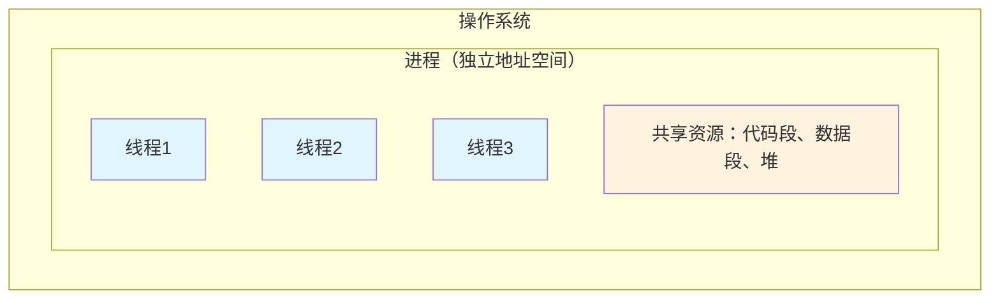
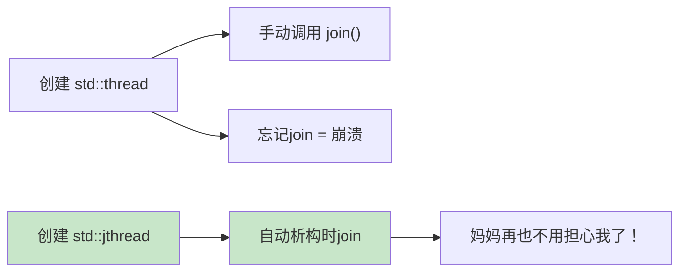
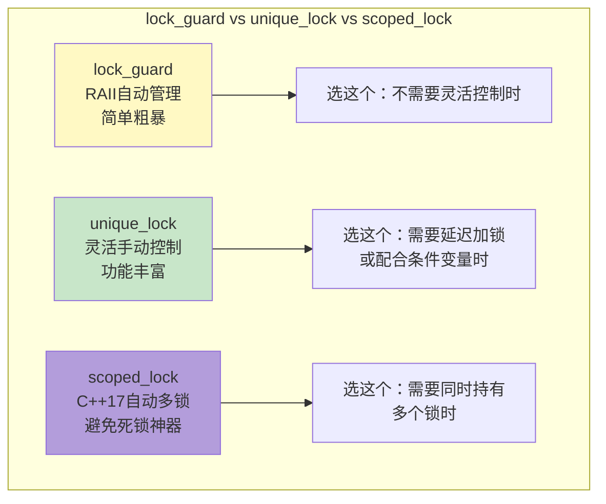
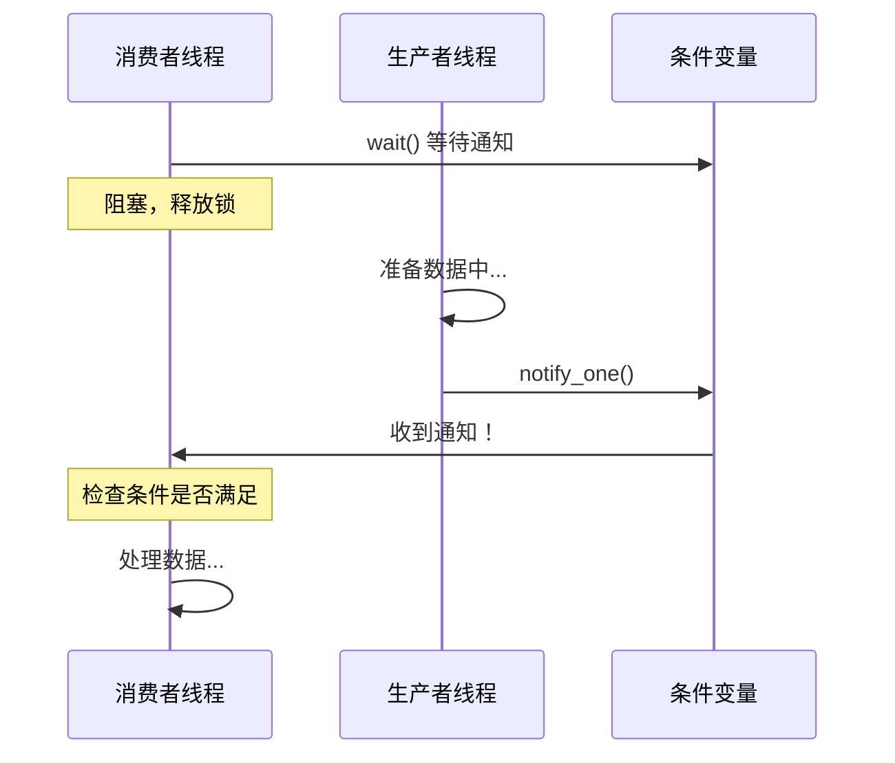
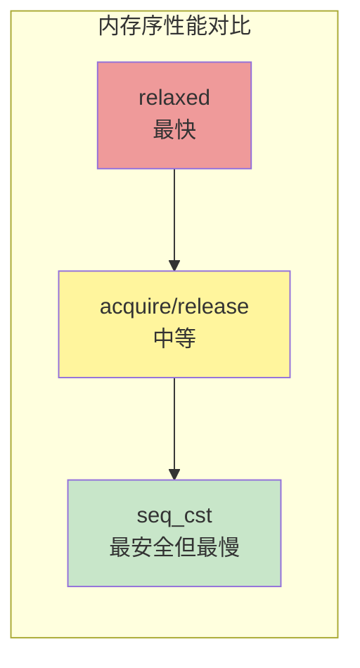
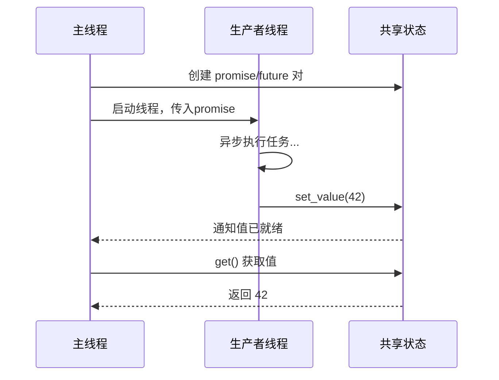
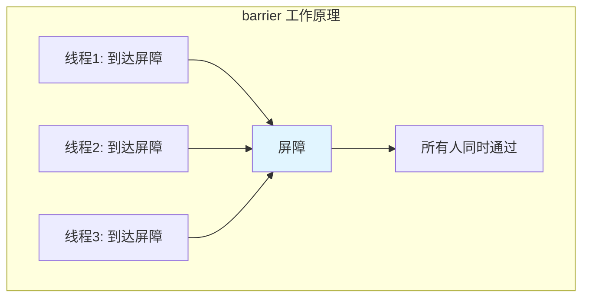
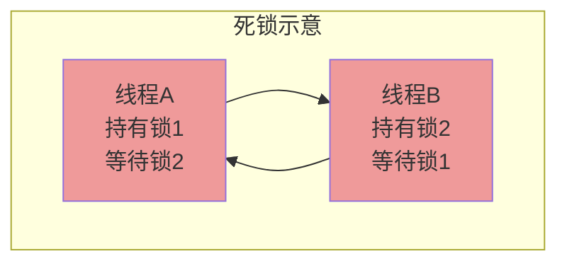

+++
title = "第32章 多线程与并发"
weight = 320
date = "2026-03-29T21:03:00+08:00"
type = "docs"
description = ""
isCJKLanguage = true
draft = false
+++
# 第32章 多线程与并发

想象一下，你是一个超级英雄，拥有"分身术"的超能力。你可以同时左手吃汉堡、右手打游戏、脚还在弹钢琴。这听起来像是白日梦？但在程序员的世界里，这就是**并发编程**（Concurrency）的日常操作！

本章我们将揭开C++多线程与并发编程的神秘面纱。准备好了吗？系好安全带，我们要发车了！

---

## 32.1 并发编程基础概念

在正式进入代码之前，我们先来搞清楚几个容易混淆的概念。毕竟，连概念都分不清，就像去餐厅点菜时说"我要那个好吃的"——服务员会一脸问号。

### 什么是并发（Concurrency）？

**并发**指的是多个任务在重叠的时间段内执行，但不一定同时执行。在单核CPU上，操作系统通过**时间片轮转**（time-slicing）技术，让多个任务交替执行，因为CPU切换速度极快，给人的感觉就像是"同时"在运行。这就好比你同时打开多个浏览器标签页，浏览器在它们之间疯狂切换，你以为它们同时在工作，其实CPU一次只处理一个任务。

### 什么是并行（Parallelism）？

**并行**则是真正的同时执行，需要多核CPU支持。就像你有多个分身，每个分身同时做不同的事情。在四核CPU上，你可以让四个线程真正同时运行，效率直接翻四倍（理论上）！

```cpp
#include <iostream>
#include <chrono>
#include <thread>

/*
 * 本示例演示并发与并行的概念区别
 *
 * 在单核CPU上：线程交替执行，是"并发"
 * 在多核CPU上：线程同时执行，是"并行"
 *
 * 简单记忆：并发是"看起来同时"，并行是"真的同时"
 */

void task(const char* name, int workTime) {
    std::cout << name << " 开始工作了！" << std::endl;
    // 模拟工作时间
    std::this_thread::sleep_for(std::chrono::milliseconds(workTime));
    std::cout << name << " 完成！" << std::endl;
}

int main() {
    std::cout << "=== 并发编程基础概念演示 ===" << std::endl;
    std::cout << std::endl;

    // 启动两个线程
    // 在多核CPU上，它们可能并行执行
    // 在单核CPU上，它们交替执行（并发）
    std::thread t1(task, "线程A", 500);
    std::thread t2(task, "线程B", 300);

    // 等待所有线程完成
    t1.join();
    t2.join();

    std::cout << std::endl;
    std::cout << "所有任务完成！并发让程序更有效率。" << std::endl;
    std::cout << "想象一下没有并发：你得先吃完汉堡，再打游戏，再弹钢琴..." << std::endl;
    std::cout << "有了并发：同时进行！这就是程序员的小确幸！" << std::endl;

    return 0;
}

// 输出: （运行结果可能因系统而异）
// === 并发编程基础概念演示 ===
// 线程A 开始工作了！
// 线程B 开始工作了！  （两者可能同时输出，也可能出现顺序差异）
// 线程B 完成！
// 线程A 完成！
// 所有任务完成！并发让程序更有效率。
```

> **小知识**：并发编程的优势不仅仅是"同时做多件事"，还包括提高程序响应性、充分利用多核处理器资源等。就像你不会只用一把螺丝刀拧所有螺丝一样，聪明的程序员会让程序充分利用所有CPU核心。

### 进程与线程的区别

| 特性 | 进程（Process） | 线程（Thread） |
|------|----------------|----------------|
| 定义 | 程序的独立运行实例 | 程序内的执行单元 |
| 资源占用 | 独立地址空间、资源较多 | 共享地址空间、资源较少 |
| 通信方式 | 管道、消息队列、共享内存等 | 直接读写共享内存 |
| 创建/销毁 | 较慢（需要分配独立资源） | 较快（共享进程资源） |
| 上下文切换 | 较慢 | 较快 |

简单理解：**进程是餐厅，线程是厨师**。一个餐厅（进程）可以有很多厨师（线程），他们共享厨房资源，但如果某个厨师炸了厨房，整个餐厅都得关门（进程崩溃）。



---

## 32.2 线程的创建与管理

终于要写代码了！让我们从最基础的`std::thread`开始。

### std::thread（C++11）

`std::thread`是C++11引入的线程管理类，你可以把它想象成一个"线程工厂"。给它一个函数和参数，它就帮你创建一个新线程去执行那个函数。

**重要词汇解释**：
- **std::thread**：C++标准库中的线程类，用于创建和管理线程
- **join()**：等待线程执行完毕，像等外卖一样，你要一直刷新骑手位置直到送达
- **detach()**：分离线程，让它自由奔跑，但你就管不着它了（不推荐新手使用）

```cpp
#include <iostream>
#include <thread>
#include <chrono>

/*
 * std::thread 示例：创建和管理线程
 *
 * std::thread 是C++11引入的线程管理类
 * 构造函数接受一个可调用对象（函数、lambda、仿函数等）和它的参数
 *
 * join()：主线程等待子线程完成，像等外卖一样必须等到送达
 * 如果不调用join()或detach()，线程对象销毁时程序会崩溃（terminate）
 */

void worker(int id) {
    // std::this_thread::sleep_for 暂停当前线程指定时间
    std::cout << "线程 " << id << " 正在启动..." << std::endl;

    // 模拟工作过程：睡1秒
    std::this_thread::sleep_for(std::chrono::seconds(1));

    std::cout << "线程 " << id << " 完成工作！" << std::endl;
}

int main() {
    std::cout << "=== std::thread 示例 ===" << std::endl;
    std::cout << std::endl;

    std::cout << "主线程：准备创建两个工作线程..." << std::endl;

    // 创建两个线程，分别执行worker函数，传入参数1和2
    std::thread t1(worker, 1);  // 线程1开始执行worker(1)
    std::thread t2(worker, 2);  // 线程2开始执行worker(2)

    // 重要！必须调用join()等待线程完成
    // 否则主线程可能先结束，导致程序崩溃
    t1.join();  // 主线程在这里等待线程1完成
    t2.join();  // 主线程在这里等待线程2完成

    std::cout << std::endl;
    std::cout << "所有线程任务完成！主线程欣慰地笑了。" << std::endl;

    return 0;
}

// 输出: （输出顺序可能略有不同，因为线程执行时机不确定）
// === std::thread 示例 ===
// 主线程：准备创建两个工作线程...
// 线程 1 正在启动...
// 线程 2 正在启动...
// 线程 1 完成工作！
// 线程 2 完成工作！
// 所有线程任务完成！主线程欣慰地笑了。
```

### std::hardware_concurrency()：知己知彼

在创建线程之前，你知道你的CPU有多少个核心吗？`std::thread::hardware_concurrency()`告诉你这个答案。它返回一个建议的并发线程数，通常等于CPU核心数（包含逻辑核心）。

**想象**：你开了一家餐厅，知道了厨房里有多少灶台，你才能决定同时做多少道菜。灶台不够却硬要多线程，就像只有4只手却想同时玩6个呼啦圈——迟早出事！

```cpp
#include <iostream>
#include <thread>

/*
 * std::hardware_concurrency 示例：查询最佳线程数
 *
 * 这个函数返回一个"建议"的并发线程数
 * 通常等于CPU的逻辑核心数
 *
 * 用途：
 * - 决定创建多少个工作线程
 * - 设置线程池大小
 * - 决定并行算法的分块数量
 */

int main() {
    std::cout << "=== std::hardware_concurrency 示例 ===" << std::endl;
    std::cout << std::endl;

    unsigned int cores = std::thread::hardware_concurrency();
    std::cout << "您的CPU建议的并发线程数: " << cores << std::endl;
    std::cout << std::endl;

    if (cores > 1) {
        std::cout << "这意味着你的电脑可以同时运行 " << cores << " 个线程！" << std::endl;
        std::cout << "如果要做并行计算，创建 " << cores << " 个线程是比较合理的选择。" << std::endl;
        std::cout << "（当然，线程数也不是越多越好，太多线程反而会有调度开销）" << std::endl;
    } else {
        std::cout << "你的CPU核心信息获取失败或只有1个核心。" << std::endl;
        std::cout << "（什么年代了还在用单核？快换电脑吧！）" << std::endl;
    }

    std::cout << std::endl;
    std::cout << "小知识：超线程技术让一个物理核心模拟出两个逻辑核心。" << std::endl;
    std::cout << "所以你可能会看到核心数比你想象的要多，但性能不一定能翻倍。" << std::endl;

    return 0;
}

// 输出示例: （取决于你的CPU）
// === std::hardware_concurrency 示例 ===
// 您的CPU建议的并发线程数: 8
//
// 这意味着你的电脑可以同时运行 8 个线程！
// 如果要做并行计算，创建 8 个线程是比较合理的选择。
// （当然，线程数也不是越多越好，太多线程反而会有调度开销）
//
// 小知识：超线程技术让一个物理核心模拟出两个逻辑核心。
// 所以你可能会看到核心数比你想象的要多，但性能不一定能翻倍。
```

> **警告**：`join()`只能调用一次。调用后，线程对象变为"不可连接"状态，此时再调用`join()`会崩溃（`std::terminate`）。就像你等外卖送达后，外卖小哥已经跑了，你不能再催他一次——他也不会再跑一趟。

### std::jthread（C++20）

如果说`std::thread`是一个需要你操心一切的熊孩子，那`std::jthread`就是一个"自动收摊"的好孩子——它在析构时会自动调用`join()`，妈妈再也不用担心你忘记join了！

**j** 代表 **j**oinable（或 **j**oin automatically），名字里的幽默感满满。

```cpp
#include <iostream>
#include <thread>

/*
 * std::jthread 示例：C++20的自动join线程
 *
 * std::jthread 是 C++20 引入的"智能"线程类
 * 核心特性：析构函数自动调用join()，无需手动管理
 *
 * 妈妈再也不用担心我忘记join()了！
 */

void worker() {
    std::cout << "[std::jthread] 工作线程：开工啦！" << std::endl;
    std::cout << "[std::jthread] 工作线程：摸鱼1秒..." << std::endl;
    std::this_thread::sleep_for(std::chrono::seconds(1));
    std::cout << "[std::jthread] 工作线程：完工！" << std::endl;
}

int main() {
    std::cout << "=== std::jthread 示例 ===" << std::endl;
    std::cout << std::endl;

    std::cout << "主线程：创建一个会自动join的jthread..." << std::endl;

    {
        // jthread在作用域结束时自动调用join()
        std::jthread jt(worker);
        std::cout << "主线程：我去做点别的事，等jthread自己收摊..." << std::endl;
    }  // <-- 这里jthread析构，自动调用join()

    std::cout << std::endl;
    std::cout << "jthread已自动完成收尾工作，优雅！" << std::endl;
    std::cout << "对比std::thread：如果忘记手动join()，程序可能会崩溃或产生未定义行为" << std::endl;

    return 0;
}

// 输出:
// === std::jthread 示例 ===
// 主线程：创建一个会自动join的jthread...
// 主线程：我去做点别的事，等jthread自己收摊...
// [std::jthread] 工作线程：开工啦！
// [std::jthread] 工作线程：摸鱼1秒...
// [std::jthread] 工作线程：完工！
// jthread已自动完成收尾工作，优雅！
```

> **推荐**：如果你的编译器支持C++20，请优先使用`std::jthread`。它不仅自动join，还支持停止令牌（stop_token），是线程管理的升级版！



---

## 32.3 线程同步

线程同步是并发编程中最重要（也是最让人头秃）的部分。想象一下：两个线程同时去抢最后一个汉堡，它们都需要修改同一个变量——谁先抢到？结果会是怎样？这就是**线程同步**要解决的问题。

### std::mutex

**mutex** 是 **MUT**ual **EX**clusion（互斥）的缩写。它就像一个房间的钥匙，只有一把，谁拿到谁进。拿到钥匙的线程可以进入"关键区域"（critical section）操作共享资源，其他线程只能在外面排队等候。

**重要词汇解释**：
- **mutex（互斥锁）**：一种同步原语，用于保护共享数据不被多个线程同时访问
- **lock()**：获取锁，如果锁已被占用，则阻塞等待
- **unlock()**：释放锁，允许其他线程获取

```cpp
#include <iostream>
#include <thread>
#include <mutex>

/*
 * std::mutex 示例：保护共享数据
 *
 * mutex就像公共厕所的钥匙，只有一把
 * 有人进去后锁门，出来后才把钥匙放回去
 * 下一个需要上厕所的人只能在外面等
 */

int counter = 0;          // 共享计数器，多个线程都会修改它
std::mutex mtx;           // 互斥锁，保护counter

void increment() {
    // 手动加锁：进入关键区域
    mtx.lock();           // 拿钥匙，如果被别人拿着就等着

    // === 关键区域开始 ===
    // 只有持有锁的线程才能执行这里的代码
    ++counter;            // 安全地增加计数器
    // === 关键区域结束 ===

    mtx.unlock();         // 还钥匙
}

int main() {
    std::cout << "=== std::mutex 示例 ===" << std::endl;
    std::cout << std::endl;

    std::cout << "初始计数器值: " << counter << std::endl;
    std::cout << "创建两个线程，每个线程递增计数器..." << std::endl;
    std::cout << std::endl;

    // 创建两个线程，都执行increment函数
    std::thread t1(increment);
    std::thread t2(increment);

    // 等待两个线程完成
    t1.join();
    t2.join();

    std::cout << std::endl;
    std::cout << "最终计数器值: " << counter << std::endl;
    std::cout << "（应该是2，因为两个线程各递增了1次）" << std::endl;

    // 如果没有mutex保护，可能出现"丢失更新"：
    // 线程A读取counter=0，还没写回，线程B也读取counter=0
    // 线程A写回1，线程B也写回1，结果是1而不是2
    // 有了mutex，就像两个人依次上厕所，不会出现"同时抢"的问题

    return 0;
}

// 输出:
// === std::mutex 示例 ===
// 初始计数器值: 0
// 创建两个线程，每个线程递增计数器...
// 最终计数器值: 2
// （应该是2，因为两个线程各递增了1次）
```

> **温馨提示**：手动调用`lock()`和`unlock()`虽然直观，但容易出错。如果你忘了`unlock()`（比如中间有return或抛出异常），程序就会死锁（deadlock）——所有人都拿着钥匙不还，门永远开着但没人能进。所以，推荐使用RAII包装器`std::lock_guard`和`std::unique_lock`。

### std::lock_guard

`std::lock_guard`是mutex的"智能钥匙扣"。它采用**RAII**（Resource Acquisition Is Initialization，资源获取即初始化）原则——构造函数时自动加锁，析构函数时自动解锁。妈妈式管理，简单省心！

**RAII解释**：简单理解就是"娶进门（构造）就管家（加锁），出门（析构）就放权（解锁）"。资源管理和代码结构完美结合，C++的智慧结晶。

```cpp
#include <iostream>
#include <thread>
#include <mutex>

/*
 * std::lock_guard 示例：RAII风格的互斥锁管理
 *
 * lock_guard 在构造时自动加锁，析构时自动解锁
 * 即使代码抛异常，局部对象也会被销毁，锁会自动释放
 * 再也不用担心忘记unlock()了！
 */

int counter = 0;                  // 共享计数器
std::mutex mtx;                   // 互斥锁

void increment() {
    // 创建lock_guard对象时，自动调用mtx.lock()
    // 这行代码执行完毕后（包括函数结束、抛异常等），lock_guard销毁
    // 析构函数自动调用mtx.unlock()
    std::lock_guard<std::mutex> lock(mtx);

    // 在这个作用域内，锁都是生效的
    ++counter;                    // 安全地增加计数器

    // 函数结束，lock_guard被销毁，锁自动释放
}

int main() {
    std::cout << "=== std::lock_guard 示例 ===" << std::endl;
    std::cout << std::endl;

    std::cout << "使用 lock_guard 自动管理锁..." << std::endl;
    std::cout << "即使代码中间抛异常，锁也会正确释放！" << std::endl;
    std::cout << std::endl;

    std::thread t1(increment);
    std::thread t2(increment);

    t1.join();
    t2.join();

    std::cout << "最终计数器值: " << counter << std::endl;

    return 0;
}

// 输出:
// === std::lock_guard 示例 ===
// 使用 lock_guard 自动管理锁...
// 即使代码中间抛异常，锁也会正确释放！
// 最终计数器值: 2
```

> **lock_guard的局限**：它不支持手动解锁，不支持重复加锁（同一线程不能lock两次，否则会死锁）。如果你需要更灵活的控制，请使用`std::unique_lock`。

### std::unique_lock

`std::unique_lock`是lock_guard的"豪华升级版"。它不仅自动管理锁，还支持：
- 手动加锁/解锁（想锁就锁，想开就开）
- 延迟加锁（先创建对象，稍后再加锁）
- 锁的所有权转移（lock可以move给另一个unique_lock）
- 与条件变量配合使用

**unique_lock的"unique"之处**：一个锁只能被一个unique_lock持有，就像一个厕所坑位一次只能进一个人。

```cpp
#include <iostream>
#include <thread>
#include <mutex>
#include <chrono>

/*
 * std::unique_lock 示例：灵活的锁管理
 *
 * unique_lock 相比 lock_guard 提供了更多的灵活性：
 * 1. 可以手动调用 lock() / unlock()
 * 2. 可以延迟加锁（创建时不加锁）
 * 3. 可以转移所有权（通过std::move）
 * 4. 可以与条件变量配合使用（后面会讲到）
 */

std::mutex mtx;                   // 互斥锁

void work(const char* taskName) {
    // 创建unique_lock，此时还没有加锁（std::defer_lock）
    std::unique_lock<std::mutex> lock(mtx, std::defer_lock);

    std::cout << taskName << "：正在等待锁..." << std::endl;

    // 手动加锁
    lock.lock();

    std::cout << taskName << "：拿到锁了！开始工作..." << std::endl;
    std::this_thread::sleep_for(std::chrono::milliseconds(100));
    std::cout << taskName << "：工作完成，释放锁！" << std::endl;

    // 手动解锁
    lock.unlock();

    // 模拟一些不需要锁的操作
    std::cout << taskName << "：做些不需要锁的事情..." << std::endl;

    // 再次加锁
    lock.lock();
    std::cout << taskName << "：再次需要锁，拿到！" << std::endl;

    // 作用域结束时，unique_lock析构，自动解锁（如果还在锁着）
}

int main() {
    std::cout << "=== std::unique_lock 示例 ===" << std::endl;
    std::cout << std::endl;

    std::thread t1(work, "任务A");
    std::thread t2(work, "任务B");

    t1.join();
    t2.join();

    std::cout << std::endl;
    std::cout << "unique_lock让锁管理变得随心所欲！" << std::endl;

    return 0;
}

// 输出: （顺序可能不同）
// === std::unique_lock 示例 ===
// 任务A：正在等待锁...
// 任务A：拿到锁了！开始工作...
// 任务A：工作完成，释放锁！
// 任务A：做些不需要锁的事情...
// 任务A：再次需要锁，拿到！
// 任务B：正在等待锁...
// 任务B：拿到锁了！开始工作...
// 任务B：工作完成，释放锁！
// 任务B：做些不需要锁的事情...
// 任务B：再次需要锁，拿到！
// unique_lock让锁管理变得随心所欲！
```



### std::scoped_lock（C++17）

当需要同时持有多个锁时，`std::scoped_lock`是你的救星！它采用**锁排序**（lock ordering）算法自动避免死锁，让你从"我该按什么顺序加锁"的焦虑中解脱出来。

**想象**：你和室友都要进同一扇门，但你们俩都带了各自的钥匙——问题是他的钥匙在你的锁里，你的钥匙在他的锁里。scoped_lock就是那个一次性把两把锁都打开的神奇钥匙扣！

```cpp
#include <iostream>
#include <thread>
#include <mutex>
#include <chrono>

/*
 * std::scoped_lock 示例：C++17的多锁管理器
 *
 * 场景：两个账户之间转账
 * 需要同时持有两个账户的锁，否则可能死锁
 *
 * 如果手动按顺序加锁：
 *   lock1.lock();
 *   lock2.lock();  // 假设另一个线程先锁了lock2再锁lock1...
 *   // 死锁！
 *
 * 使用scoped_lock：
 *   std::scoped_lock lock(lock1, lock2);
 *   // 自动按确定顺序加锁，永远不会死锁！
 */

class Account {
public:
    Account(const char* name, int balance) : name(name), balance(balance) {}
    std::mutex mtx;
    const char* name;
    int balance;
};

void transfer(Account& from, Account& to, int amount) {
    // scoped_lock可以接受多个mutex
    // 它内部会自动处理加锁顺序，避免死锁
    // RAII风格，作用域结束后自动解锁
    std::scoped_lock lock(from.mtx, to.mtx);

    std::cout << from.name << " 转账 " << amount << " 给 " << to.name << std::endl;
    from.balance -= amount;
    to.balance += amount;
    std::cout << from.name << " 余额: " << from.balance
              << ", " << to.name << " 余额: " << to.balance << std::endl;
}

int main() {
    std::cout << "=== std::scoped_lock 示例 ===" << std::endl;
    std::cout << std::endl;

    Account alice("Alice", 1000);
    Account bob("Bob", 500);

    std::cout << "初始状态: Alice=" << alice.balance << ", Bob=" << bob.balance << std::endl;
    std::cout << std::endl;

    // 两个线程同时进行转账操作
    // 如果不用scoped_lock，很可能会死锁
    // scoped_lock保证：两个锁总是按确定顺序获取，不会死锁！
    std::thread t1(transfer, std::ref(alice), std::ref(bob), 100);
    std::thread t2(transfer, std::ref(bob), std::ref(alice), 200);  // 反向转账！

    t1.join();
    t2.join();

    std::cout << std::endl;
    std::cout << "最终状态: Alice=" << alice.balance << ", Bob=" << bob.balance << std::endl;
    std::cout << "没有死锁！scoped_lock让多锁管理变得简单又安全！" << std::endl;

    return 0;
}

// 输出: （顺序可能不同，但结果确定）
// === std::scoped_lock 示例 ===
// 初始状态: Alice=1000, Bob=500
//
// Alice 转账 100 给 Bob
// Alice 余额: 900, Bob 余额: 600
// Bob 转账 200 给 Alice
// Bob 余额: 400, Alice 余额: 1100
//
// 最终状态: Alice=1100, Bob=400
// 没有死锁！scoped_lock让多锁管理变得简单又安全！
```

> **scoped_lock的精髓**：它接受可变数量的mutex，自动按照"字典序"（实际上是`std::lock`的确定性算法）对它们进行排序后加锁。妈妈再也不用担心我加锁顺序不对导致死锁了！

## 32.4 条件变量 std::condition_variable

线程间有时候需要"通信"——不仅仅是抢锁，还需要等待某个条件满足才能继续工作。就像等外卖：你不能一直问"到了吗"，而是要等外卖小哥打电话通知你。

**条件变量**就是那个"电话"：当条件不满足时，线程wait（等待）；当条件满足时，另一个线程notify（通知）。

**重要词汇解释**：
- **condition_variable**：条件变量，用于线程间的事件通知
- **wait()**：阻塞当前线程，直到被notify或虚假唤醒
- **notify_one()**：通知一个等待中的线程
- **notify_all()**：通知所有等待中的线程

```cpp
#include <iostream>
#include <thread>
#include <mutex>
#include <condition_variable>

/*
 * std::condition_variable 示例：线程间通信
 *
 * 场景模拟：
 * - 消费者线程：等待数据准备好
 * - 生产者线程：准备好数据后通知消费者
 *
 * 就像点外卖：你（消费者）等骑手（生产者）送餐
 */

std::mutex mtx;                           // 保护共享数据的锁
std::condition_variable cv;               // 条件变量
bool ready = false;                       // 共享标志：数据是否准备好

void consumer() {
    std::cout << "消费者：准备接收数据..." << std::endl;

    // 必须用unique_lock，因为wait需要锁定一个mutex
    std::unique_lock<std::mutex> lock(mtx);

    std::cout << "消费者：我先睡会儿，等数据好了叫我..." << std::endl;

    // wait会释放锁并阻塞，直到其他线程调用notify
    // 第二个参数是可选的谓词，用于防止虚假唤醒
    cv.wait(lock, [] { return ready; });  // 醒来后检查条件，可能需要继续等

    std::cout << "消费者：收到通知！数据已准备好，消费数据！" << std::endl;
}

void producer() {
    std::cout << "生产者：正在准备数据，请稍候..." << std::endl;

    // 模拟准备工作：睡2秒
    std::this_thread::sleep_for(std::chrono::seconds(2));

    // 准备工作完成后，设置标志并通知消费者
    {
        std::lock_guard<std::mutex> lock(mtx);  // 必须先加锁再修改共享数据
        ready = true;                           // 设置数据已准备好
        std::cout << "生产者：数据准备好了！打电话通知消费者..." << std::endl;
    }

    // 通知一个等待中的线程
    cv.notify_one();
}

int main() {
    std::cout << "=== std::condition_variable 示例 ===" << std::endl;
    std::cout << std::endl;

    // 创建消费者和生产者线程
    std::thread c(consumer);
    std::thread p(producer);

    // 等待两个线程完成
    c.join();
    p.join();

    std::cout << std::endl;
    std::cout << "生产者-消费者模式完成！" << std::endl;
    std::cout << "如果没有条件变量，消费者得一直while循环检查，CPU都被浪费了。" << std::endl;

    return 0;
}

// 输出:
// === std::condition_variable 示例 ===
// 消费者：准备接收数据...
// 消费者：我先睡会儿，等数据好了叫我...
// 生产者：正在准备数据，请稍候...
// 生产者：数据准备好了！打电话通知消费者...
// 消费者：收到通知！数据已准备好，消费数据！
// 生产者-消费者模式完成！
```

> **wait的第二个参数**：强烈建议使用带谓词的版本`wait(lock, pred)`，它等价于`while(!pred()) wait(lock)`。因为wait可能被虚假唤醒（spurious wakeup）——操作系统莫名其妙把你叫醒了，但数据其实还没准备好。没有谓词的话，你就可能处理了还没准备好的数据，导致bug。



---

## 32.5 原子操作 std::atomic

mutex虽好，但每次加锁解锁都有性能开销。如果只是简单地读写一个变量，有没有更快的方法？有！**原子操作**！

**原子（Atomic）**：古希腊哲学家认为原子是不可分割的最小粒子。在编程中，"原子操作"指的是不可中断的操作——要么完全执行，要么完全不执行，不存在"执行到一半"的状态。就像ATM取钱，要么钱全出来，要么钱不出来，不会出现"卡在中间"的诡异状态。

**重要词汇解释**：
- **std::atomic**：C++11引入的原子类型模板，提供无锁（lock-free）的原子操作
- **memory_order**：内存序，定义操作的可见性和排序规则

### 内存序

CPU和编译器会对代码进行优化，这可能导致指令重排。**内存序**（Memory Order）定义了操作的可见性和排序规则。C++11定义了六种内存序：
- `memory_order_relaxed`：最自由，只保证原子性，不保证操作顺序
- `memory_order_acquire`：获取，后续操作不能重排到它之前
- `memory_order_release`：释放，之前操作不能重排到它之后
- `memory_order_acq_rel`：获取+释放
- `memory_order_seq_cst`：顺序一致性（默认，最严格）
- `memory_order_consume`：消耗（已被废弃，不推荐使用）

```cpp
#include <iostream>
#include <atomic>
#include <thread>

/*
 * std::atomic 示例：内存序（Memory Order）
 *
 * fetch_add 是原子加法操作
 * 第二个参数指定内存序
 *
 * memory_order_relaxed：
 *   最宽松的内存序，只保证操作的原子性
 *   不保证操作之间的顺序
 *   性能最高，但需要你确定不需要顺序保证
 */

std::atomic<int> counter(0);              // 原子整数，初始值为0

void increment() {
    // 执行1000次原子加1
    // memory_order_relaxed：只保证原子性，不保证顺序
    // 在这个例子中，我们只关心最终值，所以relaxed足够
    for (int i = 0; i < 1000; ++i) {
        counter.fetch_add(1, std::memory_order_relaxed);
    }
}

int main() {
    std::cout << "=== std::atomic 内存序示例 ===" << std::endl;
    std::cout << std::endl;

    std::cout << "初始计数器: " << counter.load() << std::endl;
    std::cout << "创建两个线程，每个线程递增1000次..." << std::endl;

    std::thread t1(increment);
    std::thread t2(increment);

    t1.join();
    t2.join();

    std::cout << std::endl;
    std::cout << "最终计数器: " << counter.load() << std::endl;
    std::cout << "（应该是2000，因为两个线程各加了1000次）" << std::endl;

    std::cout << std::endl;
    std::cout << "如果没有原子操作，两个线程同时++counter可能会导致丢失更新：" << std::endl;
    std::cout << "线程A读counter=0 -> 线程B读counter=0 -> 线程A写1 -> 线程B写1 -> 结果=1（错误！）" << std::endl;
    std::cout << "使用原子操作，++是原子的，不会出现这个问题。" << std::endl;

    return 0;
}

// 输出:
// === std::atomic 内存序示例 ===
// 初始计数器: 0
// 创建两个线程，每个线程递增1000次...
// 最终计数器: 2000
// （应该是2000，因为两个线程各加了1000次）
```

### 顺序一致性

**顺序一致性（Sequential Consistency）**是最严格的内存序模型。在这种模型下，所有线程看到的所有操作顺序都是一样的，就像有一个全局时钟一样。`memory_order_seq_cst`是默认值，也是最安全的选项——代价是可能性能稍低。

```cpp
#include <iostream>
#include <atomic>
#include <thread>

/*
 * std::atomic 顺序一致性示例
 *
 * memory_order_seq_cst（顺序一致性）：
 * - 默认内存序，也是最严格的内存序
 * - 所有线程看到完全一致的操作顺序
 * - 就像有一个全局裁判决定谁先谁后
 *
 * 使用场景：
 * - 不确定该用哪种内存序时，选这个
 * - 需要严格顺序保证时，选这个
 * - 代价是可能比relaxed慢一些
 */

std::atomic<bool> x(false);              // 原子bool，初始false
std::atomic<bool> y(false);               // 原子bool，初始false
std::atomic<int> z(0);                    // 原子int，初始0

void write_x_then_y() {
    x.store(true, std::memory_order_seq_cst);  // 写x
    y.store(true, std::memory_order_seq_cst);  // 写y
}

void read_y_then_x() {
    // 等待y变为true
    while (!y.load(std::memory_order_seq_cst)) {
        std::this_thread::yield();  // 让出CPU时间片，避免busy-waiting
    }
    // 读取x
    if (x.load(std::memory_order_seq_cst)) {
        ++z;
    }
}

int main() {
    std::cout << "=== std::atomic 顺序一致性示例 ===" << std::endl;
    std::cout << std::endl;

    z = 0;

    std::thread t1(write_x_then_y);
    std::thread t2(read_y_then_x);

    t1.join();
    t2.join();

    std::cout << "z的值: " << z.load() << std::endl;
    std::cout << std::endl;

    std::cout << "顺序一致性保证：如果你看到y=true，那么x一定也是true。" << std::endl;
    std::cout << "因为写xhappens-before写y（在同一线程内），" << std::endl;
    std::cout << "而读取y会看到y=true，那么x也一定可见。" << std::endl;
    std::cout << "这看起来理所当然，但在弱内存序模型中就不一定了！" << std::endl;

    return 0;
}

// 输出:
// === std::atomic 顺序一致性示例 ===
// z的值: 1
// 顺序一致性保证：如果你看到y=true，那么x一定也是true。
```

### acquire/release 内存序

**acquire/release**是介于relaxed和seq_cst之间的折中方案。它提供了"happens-before"的顺序保证，但比顺序一致性更宽松、性能更好。

**直观理解**：
- **release**：像一道"发射线"——在此之前的所有读写都不能重排到它之后
- **acquire**：像一道"接收线"——在此之后的所有读写都不能重排到它之前
- 配对使用：线程A的release和线程B的acquire建立happens-before关系

```cpp
#include <iostream>
#include <atomic>
#include <thread>
#include <vector>

/*
 * std::atomic acquire/release 示例
 *
 * memory_order_acquire：获取，后续操作不能重排到它之前
 * memory_order_release：释放，之前操作不能重排到它之后
 *
 * 典型用法：生产者-消费者模式
 * 生产者release，消费者acquire，通过共享的原子变量同步
 */

std::atomic<int> data(0);          // 数据本身不需要是原子的
std::atomic<bool> ready(false);    // 同步标志

void producer() {
    data.store(100, std::memory_order_relaxed);  // 写入数据
    // 关键：release操作建立了与acquire的同步点
    ready.store(true, std::memory_order_release);  // 标记数据已就绪
}

void consumer() {
    // 等待数据就绪
    while (!ready.load(std::memory_order_acquire)) {
        std::this_thread::yield();
    }
    // 此时，data的值一定已经被生产者写入了
    std::cout << "消费者：收到数据=" << data.load(std::memory_order_relaxed) << std::endl;
}

int main() {
    std::cout << "=== std::atomic acquire/release 示例 ===" << std::endl;
    std::cout << std::endl;

    // 故意运行多次，增加竞态条件的"露脸"机会
    int success = 0;
    for (int i = 0; i < 100; ++i) {
        data.store(0, std::memory_order_relaxed);
        ready.store(false, std::memory_order_relaxed);

        std::thread t1(producer);
        std::thread t2(consumer);

        t1.join();
        t2.join();

        if (data.load() == 100) {
            success++;
        }
    }

    std::cout << "100次运行中，数据一致次数: " << success << std::endl;
    std::cout << std::endl;
    std::cout << "使用acquire/release，数据的写入和读取有同步保证。" << std::endl;
    std::cout << "消费者只有在看到ready=true后才会读取data，" << std::endl;
    std::cout << "而ready的release操作保证了在它之前的所有写入（包括data）都对消费者可见。" << std::endl;

    return 0;
}

// 输出:
// === std::atomic acquire/release 示例 ===
// 100次运行中，数据一致次数: 100
// 使用acquire/release，数据的写入和读取有同步保证。
// 消费者只有在看到ready=true后才会读取data，
// 而ready的release操作保证了在它之前的所有写入（包括data）都对消费者可见。
```



### std::atomic::wait / notify（C++20）

C++20为原子类型添加了`wait`和`notify`功能，让你可以高效地等待原子值变化，而不需要忙等待（busy-waiting）或使用条件变量。

**传统方式的问题**：如果你用循环检查原子变量是否改变，CPU会被浪费在无意义的检查上（这叫"忙等待"或"自旋"）。

**wait的好处**：线程可以"睡在"原子变量上，直到另一个线程通知它。这就像你不用一直问"外卖到了吗"，而是让骑手到了后打电话叫你。

```cpp
#include <iostream>
#include <atomic>
#include <thread>
#include <chrono>

/*
 * std::atomic wait/notify 示例：C++20的阻塞等待
 *
 * wait()：原子值没有变化时阻塞，避免CPU空转
 * notify_one() / notify_all()：通知等待的线程
 *
 * 这是一种比忙等待更高效的线程同步方式
 * 比条件变量更轻量（不需要mutex）
 */

std::atomic<int> data(0);          // 原子数据
std::atomic<bool> ready(false);    // 原子标志

void producer() {
    std::cout << "生产者：开始生产数据..." << std::endl;

    // 模拟生产过程
    std::this_thread::sleep_for(std::chrono::milliseconds(500));

    data = 42;                      // 写入数据
    std::cout << "生产者：数据已写入: " << data.load() << std::endl;

    ready = true;                   // 标记数据已就绪
    std::cout << "生产者：通知消费者！" << std::endl;

    ready.notify_one();            // 通知一个等待中的线程
}

void consumer() {
    std::cout << "消费者：等待数据就绪..." << std::endl;

    // wait会阻塞，直到另一个线程调用notify
    // 且只有当原子变量的值确实改变了才返回（防止虚假唤醒）
    ready.wait(false);

    std::cout << "消费者：收到通知！数据是: " << data.load() << std::endl;
}

int main() {
    std::cout << "=== std::atomic wait/notify 示例 ===" << std::endl;
    std::cout << std::endl;

    std::thread c(consumer);
    std::thread p(producer);

    c.join();
    p.join();

    std::cout << std::endl;
    std::cout << "wait/notify比忙等待（while循环）节省大量CPU！" << std::endl;
    std::cout << "想象一下：忙等待就是在门口一直敲门问'到了吗'，" << std::endl;
    std::cout << "wait/notify就是让骑手到了给你打电话。" << std::endl;

    return 0;
}

// 输出:
// === std::atomic wait/notify 示例 ===
// 消费者：等待数据就绪...
// 生产者：开始生产数据...
// 生产者：数据已写入: 42
// 生产者：通知消费者！
// 消费者：收到通知！数据是: 42
```

> **wait的原理**：内部使用操作系统提供的等待机制（如Linux的futex），线程会被移出调度队列，不消耗CPU。直到另一个线程调用`notify`或`notify_all`时，线程才会被唤醒。

## 32.6 异步编程 std::async 与 std::future

有时候，我们不关心线程的管理细节，只想要一个"帮我算这个，我等结果"的简单接口。C++11引入的`std::async`和`std::future`就是为了解决这个问题。

**重要词汇解释**：
- **std::async**：异步执行函数的高级封装，自动管理线程
- **std::future**：一种"期货"——现在还没值，但将来会有
- **std::promise**：承诺者，我可以设置值，配套的future会收到

### std::async

`std::async`是"一键异步"的懒人神器。你告诉它要执行什么，它自动找（或创建）线程执行，你只需要调用`.get()`获取结果。

**launch策略**：
- `std::launch::async`：创建新线程异步执行
- `std::launch::deferred`：延迟调用，主线程调用`.get()`时才执行
- 默认（不指定）：由实现决定，通常是async

```cpp
#include <iostream>
#include <future>
#include <chrono>

/*
 * std::async 示例：简单的异步编程
 *
 * async 是 "异步执行" 的高级封装
 * 你不需要手动创建线程，只需要：
 * 1. 告诉它要执行什么函数
 * 2. 调用 get() 获取结果
 *
 * 就像点外卖：下单（async）后你就可以干别的，等外卖到了再吃（get）
 */

int compute() {
    std::cout << "计算线程：开始计算...这需要1秒钟..." << std::endl;

    // 模拟耗时计算
    std::this_thread::sleep_for(std::chrono::seconds(1));

    std::cout << "计算线程：计算完成！答案是42！" << std::endl;
    return 42;
}

int main() {
    std::cout << "=== std::async 示例 ===" << std::endl;
    std::cout << std::endl;

    std::cout << "主线程：启动异步计算任务..." << std::endl;

    // std::async 启动异步任务，返回future
    // std::launch::async 表示创建新线程执行
    std::future<int> fut = std::async(std::launch::async, compute);

    std::cout << "主线程：任务已启动，我去做其他事情..." << std::endl;
    std::cout << "主线程：等待结果中（会阻塞直到结果可用）..." << std::endl;
    std::cout << std::endl;

    // get() 会阻塞直到异步任务完成并返回结果
    int result = fut.get();

    std::cout << std::endl;
    std::cout << "主线程：收到结果！答案是: " << result << std::endl;
    std::cout << "主线程：异步编程 so easy！" << std::endl;

    return 0;
}

// 输出:
// === std::async 示例 ===
// 主线程：启动异步计算任务...
// 主线程：任务已启动，我去做其他事情...
// 主线程：等待结果中（会阻塞直到结果可用）...
// 计算线程：开始计算...这需要1秒钟...
// 计算线程：计算完成！答案是42！
// 主线程：收到结果！答案是: 42
// 主线程：异步编程 so easy！
```

### std::future 和 std::promise

`std::future`和`std::promise`是"期货-承诺"模式的一对。`promise`负责设置值，`future`负责获取值。它们通过共享状态通信。

```cpp
#include <iostream>
#include <future>
#include <thread>
#include <chrono>

/*
 * std::future 和 std::promise 示例：线程间值传递
 *
 * future-promise模式：
 * - promise 承诺设置一个值
 * - future 等待并获取这个值
 * - 它们通过内部的共享状态通信
 *
 * 场景：主线程让子线程去拿快递，子线程拿到后通知主线程
 */

void producer(std::promise<int>& prom) {
    std::cout << "生产者：收到任务，去拿快递..." << std::endl;

    // 模拟去拿快递的时间
    std::this_thread::sleep_for(std::chrono::seconds(1));

    int value = 42;
    std::cout << "生产者：快递拿到了！单号是 " << value << std::endl;

    // 设置值到promise中
    // 这个值会被对应的future收到
    prom.set_value(value);

    std::cout << "生产者：通知主线程来取！" << std::endl;
}

int main() {
    std::cout << "=== std::future 和 std::promise 示例 ===" << std::endl;
    std::cout << std::endl;

    // 创建promise和对应的future
    std::promise<int> prom;               // promise用来设置值
    std::future<int> fut = prom.get_future();  // future用来获取值

    std::cout << "主线程：派生产者去拿快递..." << std::endl;

    // 创建生产者线程，传入promise的引用
    std::thread t(producer, std::ref(prom));

    std::cout << "主线程：等待生产者通知..." << std::endl;
    std::cout << std::endl;

    // get()会阻塞，直到promise设置了值
    int result = fut.get();

    std::cout << std::endl;
    std::cout << "主线程：收到快递！单号验证: " << result << std::endl;

    // 等待线程结束
    t.join();

    std::cout << "任务完成！" << std::endl;

    return 0;
}

// 输出:
// === std::future 和 std::promise 示例 ===
// 主线程：派生产者去拿快递...
// 主线程：等待生产者通知...
// 生产者：收到任务，去拿快递...
// 生产者：快递拿到了！单号是 42
// 生产者：通知主线程来取！
// 主线程：收到快递！单号验证: 42
// 任务完成！
```



> **async vs promise**：大多数情况下，`std::async`更简单，因为它自动管理线程。但如果你需要在线程间传递多个值，或需要更精细的控制，`future/promise`是更好的选择。

---

## 32.7 线程局部存储 thread_local

每个线程都有自己的一亩三分地——**线程局部存储**（Thread-Local Storage，TLS）。用`thread_local`修饰的变量，每个线程都有自己独立的副本，互不干扰。

**想象**：就像每个员工都有自己的办公桌（thread_local变量），你不能去别人的办公桌拿东西，别人也不能来你的办公桌捣乱。

```cpp
#include <iostream>
#include <thread>

/*
 * thread_local 示例：线程局部存储
 *
 * thread_local 修饰的变量：
 * - 每个线程都有自己独立的副本
 * - 线程之间互不干扰
 * - 就像每个房间都有自己的空调温度
 */

thread_local int threadLocalValue = 0;  // 线程局部变量，初始值为0

void worker(int id) {
    // 设置当前线程的threadLocalValue
    threadLocalValue = id;

    // 读取当前线程的threadLocalValue
    std::cout << "线程 " << id << "：threadLocalValue = " << threadLocalValue << std::endl;

    // 验证：不同线程看到的值不同
    // 如果不是thread_local，两个线程会共享同一个变量
}

int main() {
    std::cout << "=== thread_local 示例 ===" << std::endl;
    std::cout << std::endl;

    std::cout << "主线程的threadLocalValue: " << threadLocalValue << std::endl;
    std::cout << std::endl;

    std::thread t1(worker, 1);  // 线程1会设置自己副本为1
    std::thread t2(worker, 2);  // 线程2会设置自己副本为2

    t1.join();
    t2.join();

    std::cout << std::endl;
    std::cout << "主线程再次查看threadLocalValue: " << threadLocalValue << std::endl;
    std::cout << "主线程的值没被线程1和线程2影响！" << std::endl;
    std::cout << "因为thread_local变量是每个线程独立的副本。" << std::endl;

    return 0;
}

// 输出:
// === thread_local 示例 ===
// 主线程的threadLocalValue: 0
// 线程 1：threadLocalValue = 1
// 线程 2：threadLocalValue = 2
// 主线程再次查看threadLocalValue: 0
// 主线程的值没被线程1和线程2影响！
```

> **常见用途**：
> - 线程相关的配置信息（如线程本地缓存）
> - 随机数生成器（`std::mt19937`用thread_local很合适）
> - 日志记录器的线程上下文
> - 性能分析的时间统计

---

## 32.8 信号量（C++20）

**信号量（Semaphore）**是一种古老的同步原语，由计算机科学家Edsger Dijkstra发明。它维护一个计数器，线程可以"获取"（acquire）信号量来减少计数，或"释放"（release）来增加计数。如果计数为0，获取操作会阻塞。

**想象**：餐厅门口等位子，有n把椅子（信号量初始值）。顾客来了要占用一把椅子，没椅子就得等着。顾客走了就还一把椅子。

**重要词汇解释**：
- **std::counting_semaphore**：计数信号量，可以有多个许可
- **acquire()**：获取许可，计数减1，如果为0则阻塞
- **release()**：释放许可，计数加1

### std::counting_semaphore

C++20引入了`std::counting_semaphore`，终于可以在标准库中使用信号量了！之前你可能需要用mutex和condition_variable自己实现。

```cpp
#include <iostream>
#include <thread>
#include <semaphore>

/*
 * std::counting_semaphore 示例：C++20信号量
 *
 * 场景：3个工人（线程）抢2台机器（许可）
 * 只有拿到机器的工人才能工作
 */

std::counting_semaphore sem(2);  // 信号量，初始许可数为2

void worker(int id) {
    std::cout << "工人 " << id << "：想去使用机器..." << std::endl;

    // 获取许可（acquire）
    // 如果没有可用许可，会阻塞等待
    sem.acquire();

    std::cout << "工人 " << id << "：拿到机器了！开始工作..." << std::endl;
    std::this_thread::sleep_for(std::chrono::milliseconds(100));
    std::cout << "工人 " << id << "：工作完成，释放机器！" << std::endl;

    // 释放许可（release）
    sem.release();
}

int main() {
    std::cout << "=== std::counting_semaphore 示例 ===" << std::endl;
    std::cout << std::endl;
    std::cout << "只有2台机器，但有3个工人..." << std::endl;
    std::cout << std::endl;

    // 创建3个工人线程
    std::thread t1(worker, 1);
    std::thread t2(worker, 2);
    std::thread t3(worker, 3);

    t1.join();
    t2.join();
    t3.join();

    std::cout << std::endl;
    std::cout << "所有工人都用完机器了！" << std::endl;
    std::cout << "注意：工人3是等工人1或2释放机器后才能工作的。" << std::endl;

    return 0;
}

// 输出: （顺序可能不同）
// === std::counting_semaphore 示例 ===
// 只有2台机器，但有3个工人...
// 工人 1：想去使用机器...
// 工人 1：拿到机器了！开始工作...
// 工人 2：想去使用机器...
// 工人 2：拿到机器了！开始工作...
// 工人 3：想去使用机器...
// 工人 1：工作完成，释放机器！
// 工人 3：拿到机器了！开始工作...
// 工人 2：工作完成，释放机器！
// 工人 3：工作完成，释放机器！
// 所有工人都用完机器了！
```

> **二值信号量**：`std::binary_semaphore`是`std::counting_semaphore<1>`的别名，相当于一个互斥锁，但通常不推荐用信号量来实现互斥——mutex更直观、语义更清晰。

---

## 32.9 屏障 std::barrier（C++20）

**屏障（Barrier）**是一种同步点，要求所有线程都到达后才能继续。就像团体接力赛，所有人都得到齐了才能开始跑。

**场景**：几个玩家加载游戏地图，所有人都加载完了才能开始游戏——谁先加载完谁就得等着。

**重要词汇解释**：
- **std::barrier**：屏障同步点
- **arrive_and_wait()**：到达屏障并等待，直到所有线程都到达

```cpp
#include <iostream>
#include <thread>
#include <barrier>
#include <chrono>

/*
 * std::barrier 示例：C++20屏障
 *
 * 场景：游戏加载
 * 所有玩家必须都加载完毕才能开始游戏
 */

int main() {
    std::cout << "=== std::barrier 示例 ===" << std::endl;
    std::cout << std::endl;

    // 创建屏障，需要3个线程同步
    std::barrier barrier(3);

    auto work = [&](int playerId) {
        std::cout << "玩家 " << playerId << "：开始加载地图..." << std::endl;

        // 模拟不同的加载时间
        std::this_thread::sleep_for(std::chrono::milliseconds(100 * playerId));

        std::cout << "玩家 " << playerId << "：加载完成！等待其他人..." << std::endl;

        // 到达屏障，等待所有人
        barrier.arrive_and_wait();

        // 所有线程都到达后，所有人同时开始游戏！
        std::cout << "玩家 " << playerId << "：所有人到齐！开始游戏！" << std::endl;
    };

    std::cout << "创建3个玩家线程..." << std::endl;

    std::thread t1(work, 1);
    std::thread t2(work, 2);
    std::thread t3(work, 3);

    t1.join();
    t2.join();
    t3.join();

    std::cout << std::endl;
    std::cout << "所有人都开始游戏了！公平竞技！" << std::endl;
    std::cout << "如果没有屏障：加载快的玩家早就开始了，慢的玩家还在加载..." << std::endl;

    return 0;
}

// 输出: （顺序可能不同）
// === std::barrier 示例 ===
// 创建3个玩家线程...
// 玩家 1：开始加载地图...
// 玩家 2：开始加载地图...
// 玩家 3：开始加载地图...
// 玩家 1：加载完成！等待其他人...
// 玩家 2：加载完成！等待其他人...
// 玩家 3：加载完成！等待其他人...
// 玩家 1：所有人到齐！开始游戏！
// 玩家 2：所有人到齐！开始游戏！
// 玩家 3：所有人到齐！开始游戏！
// 所有人都开始游戏了！公平竞技！
```



---

## 32.10 停止令牌 std::stop_token（C++20）

想象一下：你启动了一个长时间运行的任务，但用户突然不想等了，想要取消。这时候就需要**停止令牌**——一个让线程优雅退出的机制。

**重要词汇解释**：
- **std::stop_token**：停止令牌，检查是否请求了停止
- **std::stop_source**：停止源，请求停止
- **stop_requested()**：检查是否请求了停止
- **request_stop()**：请求停止

```cpp
#include <iostream>
#include <thread>
#include <stop_token>
#include <chrono>

/*
 * std::stop_token 示例：C++20停止令牌
 *
 * 场景：用户取消长时间运行的任务
 * - std::stop_source 发起停止请求
 * - std::stop_token 检查是否需要停止
 */

void cancellableWork(std::stop_token token) {
    std::cout << "工作线程：开始工作（可以随时取消）..." << std::endl;

    int count = 0;
    // 每次循环检查是否收到了停止请求
    while (!token.stop_requested()) {
        std::cout << "工作线程：正在工作... (" << ++count << ")" << std::endl;
        std::this_thread::sleep_for(std::chrono::milliseconds(100));

        // 模拟工作完成
        if (count >= 5) {
            std::cout << "工作线程：任务自动完成！" << std::endl;
            return;  // 优雅退出
        }
    }

    // 收到停止请求后的清理工作
    std::cout << "工作线程：收到停止请求！正在优雅退出..." << std::endl;
    std::cout << "工作线程：保存进度、释放资源..." << std::endl;
    std::cout << "工作线程：再见！" << std::endl;
}

int main() {
    std::cout << "=== std::stop_token 示例 ===" << std::endl;
    std::cout << std::endl;

    // 创建停止源
    std::stop_source source;

    // 获取与stop_source关联的token
    std::stop_token token = source.get_token();

    std::cout << "主线程：启动工作线程..." << std::endl;

    // 创建工作线程，传入stop_token
    std::thread t(cancellableWork, token);

    std::cout << "主线程：等待300ms后请求取消..." << std::endl;
    std::this_thread::sleep_for(std::chrono::milliseconds(350));

    std::cout << "主线程：用户点击取消！请求停止..." << std::endl;
    source.request_stop();  // 请求停止

    std::cout << "主线程：等待工作线程优雅退出..." << std::endl;
    t.join();

    std::cout << std::endl;
    std::cout << "工作线程已优雅退出！" << std::endl;
    std::cout << "std::jthread 自动支持 stop_token，可以直接使用！" << std::endl;

    return 0;
}

// 输出:
// === std::stop_token 示例 ===
// 主线程：启动工作线程...
// 主线程：等待300ms后请求取消...
// 工作线程：开始工作（可以随时取消）...
// 工作线程：正在工作... (1)
// 工作线程：正在工作... (2)
// 工作线程：正在工作... (3)
// 主线程：用户点击取消！请求停止...
// 主线程：等待工作线程优雅退出...
// 工作线程：收到停止请求！正在优雅退出...
// 工作线程：保存进度、释放资源...
// 工作线程：再见！
// 工作线程已优雅退出！
```

> **std::jthread的秘密**：C++20的`std::jthread`内部就使用了`std::stop_token`！`jthread`的析构函数会自动执行两步：
> 1. **请求停止**：调用内部`stop_source`的`request_stop()`
> 2. **等待线程结束**：调用`join()`
>
> 关键特性：如果传入的函数接受`std::stop_token`参数（作为首个参数），`jthread`会自动传递停止令牌，让你的函数可以优雅响应停止请求！

```cpp
#include <iostream>
#include <thread>
#include <chrono>

/*
 * std::jthread 自动停止令牌示例
 *
 * jthread会自动将stop_token作为第一个参数传递给可调用对象
 * 前提是函数签名接受std::stop_token参数
 */

void workerWithStop(std::stop_token token) {
    std::cout << "[jthread] 工作线程：开工！可以响应停止请求..." << std::endl;

    int count = 0;
    while (!token.stop_requested() && count < 10) {
        std::cout << "[jthread] 工作... (" << ++count << ")" << std::endl;
        std::this_thread::sleep_for(std::chrono::milliseconds(50));
    }

    if (token.stop_requested()) {
        std::cout << "[jthread] 收到停止请求，优雅退出！" << std::endl;
    } else {
        std::cout << "[jthread] 任务完成，自然退出！" << std::endl;
    }
}

int main() {
    std::cout << "=== std::jthread 自动停止令牌 ===" << std::endl;
    std::cout << std::endl;

    std::cout << "主线程：创建jthread（会自动传递stop_token）..." << std::endl;

    std::jthread t(workerWithStop);  // 不需要手动传stop_token，jthread自动传！

    std::cout << "主线程：等200ms后请求停止..." << std::endl;
    std::this_thread::sleep_for(std::chrono::milliseconds(200));

    std::cout << "主线程：jthread即将离开作用域，析构函数自动停止并join..." << std::endl;
    // 注意：不需要手动调用request_stop()或join()！
    // jthread的析构函数会自动：
    // 1. 调用内部stop_source的request_stop()
    // 2. 调用join()等待线程结束

    std::cout << std::endl;
    std::cout << "jthread已自动停止并汇入主线程！" << std::endl;
    std::cout << "这就是传说中的'自动收摊'——妈妈再也不用担心我忘记join了！" << std::endl;

    return 0;
}

// 输出:
// === std::jthread 自动停止令牌 ===
// 主线程：创建jthread（会自动传递stop_token）...
// 主线程：等200ms后请求停止...
// [jthread] 工作线程：开工！可以响应停止请求...
// [jthread] 工作... (1)
// [jthread] 工作... (2)
// [jthread] 工作... (3)
// 主线程：jthread即将离开作用域，析构函数自动停止并join...
// [jthread] 收到停止请求，优雅退出！
//
// jthread已自动停止并汇入主线程！
// 这就是传说中的'自动收摊'——妈妈再也不用担心我忘记join了！
```

---

## 32.11 并发编程陷阱

并发编程虽然强大，但充满了"坑"。一不小心就会踩雷，让你的程序出现奇怪的行为。下面我们来介绍最常见的陷阱和如何避免。

### 数据竞争（Data Race）

**数据竞争**是并发编程中最危险的陷阱之一。当两个或多个线程同时访问同一个内存位置，且至少有一个是写操作时，就会发生数据竞争。结果完全不可预测，取决于操作系统的心情。

**想象**：你和室友同时看到冰箱里最后一个汉堡，你们都冲过去拿，都说"是我的！"——这就是数据竞争。结果可能是：你们打起来（程序崩溃）、汉堡被切成两半（数据损坏）、或者神奇地完好无损（纯属运气）。

```cpp
#include <iostream>
#include <thread>
#include <atomic>

/*
 * 数据竞争 vs 原子操作
 *
 * BAD CASE（危险！）：
 *   int counter = 0;
 *   std::thread t1([&]{ counter++; });
 *   std::thread t2([&]{ counter++; });
 *   // 两个线程同时读写counter，可能导致丢失更新！
 *
 * GOOD CASE（安全！）：
 *   std::atomic<int> counter(0);  // 原子类型
 *   std::thread t1([&]{ counter++; });
 *   std::thread t2([&]{ counter++; });
 *   // 原子操作保证counter++的原子性
 */

// 安全的计数器，使用原子操作
std::atomic<int> safeCounter(0);  // 原子整数，所有操作都是原子的

void safeIncrement() {
    // fetch_add 是原子加法，返回旧值
    // 相当于 ++safeCounter，但保证原子性
    safeCounter.fetch_add(1);
}

int main() {
    std::cout << "=== 数据竞争 vs 原子操作 ===" << std::endl;
    std::cout << std::endl;

    std::cout << "安全的原子计数器演示：" << std::endl;
    std::cout << "初始值: " << safeCounter.load() << std::endl;

    std::thread t1(safeIncrement);
    std::thread t2(safeIncrement);

    t1.join();
    t2.join();

    std::cout << "最终值: " << safeCounter.load() << std::endl;
    std::cout << "（应该是2，因为两个线程各加1）" << std::endl;

    std::cout << std::endl;
    std::cout << "为什么++操作不是原子的？" << std::endl;
    std::cout << "因为 ++counter 实际上分三步：" << std::endl;
    std::cout << "  1. 读取counter的值" << std::endl;
    std::cout << "  2. 值+1" << std::endl;
    std::cout << "  3. 写回counter" << std::endl;
    std::cout << "如果两个线程同时执行，可能都读到旧值，结果错误。" << std::endl;

    return 0;
}

// 输出:
// === 数据竞争 vs 原子操作 ===
// 安全的原子计数器演示：
// 初始值: 0
// 最终值: 2
// （应该是2，因为两个线程各加1）
```

### 死锁（Deadlock）

**死锁**发生在两个或多个线程互相等待对方持有的锁时。每个人都拿着对方需要的钥匙，谁也进不去。

**想象**：你和室友在门口相遇，你让他先过，他让你先过，然后你们就永远卡在那里了。

> **避免死锁的技巧**：
> 1. **固定加锁顺序**：多个锁总是按相同顺序获取
> 2. **使用`std::lock()`**：一次性获取多个锁，避免中间被打断
> 3. **避免嵌套锁**：尽量只用一个锁
> 4. **使用`std::scoped_lock`（C++17）**：自动管理多个锁



---

## 本章小结

恭喜你！终于啃完了C++多线程与并发这一章。让我们来回顾一下学到的知识：

### 核心概念

| 概念 | 说明 |
|------|------|
| **并发（Concurrency）** | 多个任务在重叠时间段执行，单核CPU通过时间片轮转实现 |
| **并行（Parallelism）** | 真正的同时执行，需要多核CPU支持 |
| **进程 vs 线程** | 进程是独立地址空间，线程共享地址空间 |

### 线程管理

| 工具 | C++版本 | 特点 |
|------|---------|------|
| `std::thread` | C++11 | 基础线程类，需要手动join() |
| `std::jthread` | C++20 | 自动join()，支持停止令牌 |
| `std::thread::hardware_concurrency()` | C++11 | 查询推荐并发线程数 |

### 同步原语

| 工具 | C++版本 | 用途 |
|------|---------|------|
| `std::mutex` | C++11 | 互斥锁，保护共享资源 |
| `std::lock_guard` | C++11 | RAII风格的mutex包装，自动解锁 |
| `std::unique_lock` | C++11 | 灵活的锁管理，支持延迟加锁 |
| `std::scoped_lock` | C++17 | 多锁自动管理，避免死锁 |
| `std::condition_variable` | C++11 | 线程间事件通知 |

### 原子操作与内存序

| 工具 | 说明 |
|------|------|
| `std::atomic` | 原子类型，无锁并发 |
| `std::atomic::wait/notify` | C++20 | 原子阻塞等待，更高效 |
| `memory_order_relaxed` | C++11 | 最宽松，只保证原子性 |
| `memory_order_acquire/release` | C++11 | 获取/释放语义，平衡性能 |
| `memory_order_seq_cst` | C++11 | 顺序一致性，最安全 |

### 异步编程

| 工具 | 说明 |
|------|------|
| `std::async` | 异步执行函数，自动管理线程 |
| `std::future` | 获取异步结果 |
| `std::promise` | 设置异步结果 |

### C++20新武器

| 工具 | 说明 |
|------|------|
| `thread_local` | 线程局部存储 |
| `std::counting_semaphore` | 信号量 |
| `std::barrier` | 屏障同步 |
| `std::stop_token` | 停止令牌 |

### 避坑指南

> **数据竞争**：多个线程同时读写共享数据，且至少有一个是写操作。解决方案：使用mutex或原子类型。
>
> **死锁**：多个线程互相等待对方持有的锁。解决方案：固定加锁顺序，使用`std::lock()`或`std::scoped_lock`。
>
> **虚假唤醒**：条件变量的wait被唤醒但条件实际未满足。解决方案：使用带谓词的wait。

---

多线程编程就像武侠小说里的"分神术"——学好了可以一心多用，效率翻倍；学不好则会走火入魔，自爆经脉。但别担心，只要掌握了本章节的知识，你已经具备了成为"并发大师"的基础！

继续加油，未来的多线程大师！下一章再见！

> **预告**：下一章我们将探讨C++的设计模式和实用技巧，让你的代码更加优雅和高效！
