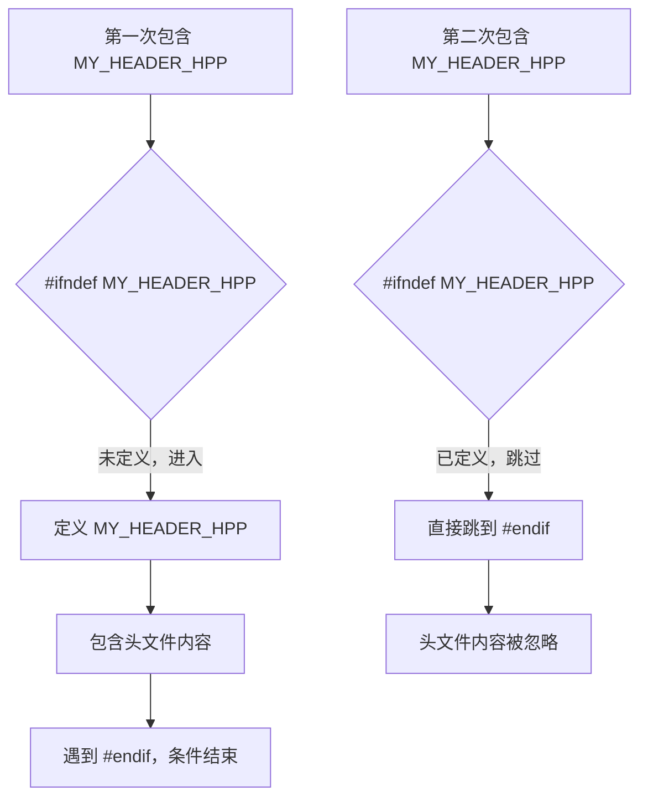
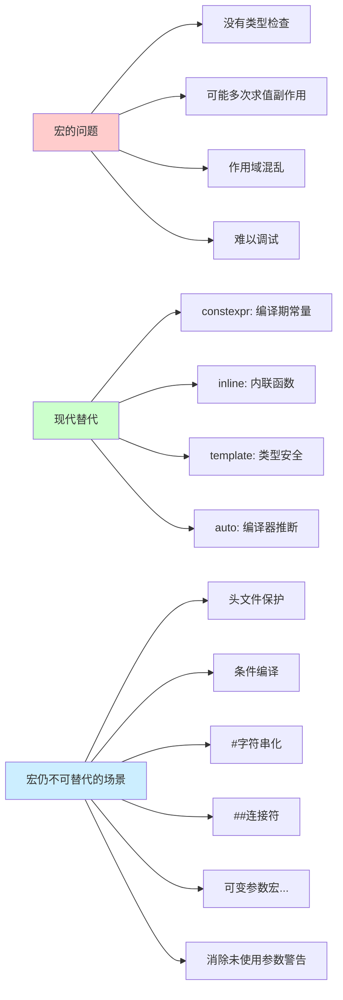

+++
title = "第33章 预处理与宏"
weight = 330
date = "2026-03-29T21:03:00+08:00"
type = "docs"
description = ""
isCJKLanguage = true
draft = false
+++
# 第33章 预处理与宏

想象一下，在代码正式编译之前，有一个神秘的幕后工作者在默默工作。它会在你的代码被送进编译器之前，偷偷地把一些东西改掉、把另一些东西加进来、甚至把某些代码块直接删掉。这位"代码界的大厨"就是我们今天的主角——**预处理器**。

> 如果把C++程序从编写到运行比作做一道菜，那么预处理器就是那个在真正开火之前，负责洗菜、切菜、决定放不放辣椒的帮厨。它不认识你写的函数、不懂什么叫面向对象，它只知道"文本替换"——一种简单粗暴但极其有用的魔法。

## 33.1 预处理器概述

预处理器是C++编译过程中最早运行的阶段，它工作在**翻译阶段**（translation phase），在真正的编译器看到代码之前。预处理器的主要任务包括：

- 头文件包含（把其他文件的内容插进来）
- 宏展开（把代码中的符号替换成指定的内容）
- 条件编译（根据条件决定哪些代码该保留，哪些该扔掉）
- 行号控制（为错误信息标记正确的位置）

预处理器本质上是"文本替换大师"，它操作的是纯文本，不关心C++的语法规则。正是因为这种"不讲道理"的纯文本替换，预处理器既强大又危险——用好了是神器，用砸了是灾难。

下面是一个最简单的预处理器示例：

```cpp
// 预处理器在编译之前悄悄运行，它会在代码中寻找以 # 开头的指令
// #include 就是告诉预处理器："嘿，把这个文件的内容插进来！"

#include <iostream>  // 引入输入输出流头文件，相当于把 iostream 文件的所有内容复制粘贴到这里

int main() {
    // 预处理之后，这行代码会被替换成实际的输出语句
    std::cout << "Preprocessor runs before compilation" << std::endl;  // 输出: Preprocessor runs before compilation
    return 0;
}
```

运行结果：

```
Preprocessor runs before compilation
```

预处理器执行完所有指令后，生成的"纯净"代码才会送入真正的编译器。就像帮厨把菜都备好了，主厨才开始炒菜。

## 33.2 头文件包含#include

`#include` 是预处理器最常用的指令之一，它的作用用一句话概括就是：**把另一个文件的内容整个搬过来**。想象你写小说时，如果每个章节都把"主角名叫小明"这句话重写一遍，那多累啊！`#include` 就是让你把这些公共内容写一次，需要用到的时候直接"引用"过来。

在C++中，头文件包含分为两种风格：

```cpp
// 尖括号风格 < >：用于包含系统提供的头文件
// 编译器会在系统指定的include路径中查找这些文件
#include <iostream>   // 系统头文件，iostream 提供了 std::cout、std::cin 等输入输出功能
#include <vector>     // 动态数组容器
#include <string>     // 字符串处理

// 双引号风格 " "：用于包含你自己写的头文件
// 编译器会先在当前目录查找，找不到再去系统路径找
#include "myheader.h"  // 用户头文件，通常是你自己项目中的 .h 或 .hpp 文件
#include "utils.hpp"   // 也可以是.hpp后缀的头文件
```

`#include` 的工作原理非常直接：预处理器找到指定的文件，读取其全部内容，然后**原封不动地插入到 `#include` 指令所在的位置**。这意味着如果头文件里也有 `#include` 指令，那些指令也会被展开，形成嵌套包含。

> 举一个形象的例子：假设你写了一段代码
> ```cpp
> #include "a.h"
> ```
> 而 `a.h` 的内容是：
> ```cpp
> #include "b.h"
> struct A { int x; };
> ```
> 预处理后，你的代码实际上变成了：
> ```cpp
> // a.h 的内容展开
> // b.h 的内容也展开
> struct A { int x; };
> ```
> 层层嵌套，直到所有文件都被展开完毕。

## 33.3 宏定义#define与#undef

如果说预处理器是文本替换大师，那 `宏（Macro）` 就是它最趁手的工具。**宏**是一种文本替换机制，它分为两种类型：

1. **对象宏（Object-like macro）**：定义一个常量或一段文本，之后代码中所有出现该名称的地方都会被替换
2. **函数宏（Function-like macro）**：定义一个"像函数一样"的替换规则，可以接受参数

`#define` 指令用于定义宏，而 `#undef` 用于取消宏的定义（就像撤销魔法，让这个名字恢复普通）。

```cpp
#include <iostream>

// 定义一个对象宏 PI，以后代码中所有出现的 PI 都会被替换成 3.14159
#define PI 3.14159

// 定义一个函数宏 MAX，它接受两个参数 a 和 b
// 注意宏定义中参数要加括号，否则可能出现运算符优先级问题
#define MAX(a, b) ((a) > (b) ? (a) : (b))

// 定义一个更复杂的宏：计算平方
#define SQUARE(x) ((x) * (x))

// 定义一个带副作用的宏（危险！仅作演示，不推荐这样用）
#define SQUARE_DANGEROUS(x) (x * x)

int main() {
    // 预处理后，PI 会被替换成 3.14159
    std::cout << "PI = " << PI << std::endl;  // 输出: PI = 3.14159

    // MAX(3, 5) 会被展开成：((3) > (5) ? (3) : (5))
    std::cout << "MAX(3, 5) = " << MAX(3, 5) << std::endl;  // 输出: MAX(3, 5) = 5

    // 宏的好处：编译期就能计算结果（如果参数是常量）
    // 而不是像函数一样需要运行时调用开销
    std::cout << "SQUARE(5) = " << SQUARE(5) << std::endl;  // 输出: SQUARE(5) = 25

    // 宏的危险示例：参数有副作用时可能出问题
    int n = 3;
    // SQUARE_DANGEROUS(++n) 会展开成 (++n * ++n)
    // 相当于 ((++n) * (++n))，n 会被增加两次！
    std::cout << "SQUARE_DANGEROUS(++n) with n=3 gives: " << SQUARE_DANGEROUS(++n) << std::endl;  // 输出: 25 (n变成了5)

    // #undef 取消 PI 的定义，之后再使用 PI 会导致编译错误
    // #undef PI
    // std::cout << PI << std::endl;  // 取消注释会报错：PI 未定义

    return 0;
}
```

运行结果：

```
PI = 3.14159
MAX(3, 5) = 5
SQUARE(5) = 25
SQUARE_DANGEROUS(++n) with n=3 gives: 25
```

> 宏的括号很重要！想象你没有加足够的括号：
> ```cpp
> #define SQUARE_BAD(x) x * x
> ```
> 当你写 `SQUARE_BAD(3 + 4)` 时，它会展开成 `3 + 4 * 3 + 4 = 3 + 12 + 4 = 19`，而不是你期望的 `49`！
> 所以聪明的程序员会写成 `#define SQUARE_GOOD(x) ((x) * (x))`

## 33.4 条件编译

条件编译是预处理器最酷的功能之一——它允许代码在预处理阶段就"决定"哪些部分该编译，哪些该丢弃。这就像有个能预知未来的编剧，在电影正式拍摄前就决定好：这段剧情要，这段不要。

### #ifdef、#ifndef

`#ifdef` 表示"如果定义了某个宏"，`#ifndef` 表示"如果没有定义某个宏"。这两个指令常用于**头文件保护**和**调试代码的开关**。

```cpp
#include <iostream>

// 用 #define 定义一个 DEBUG 宏（也可以在编译时通过 -D 选项传入）
#define DEBUG

int main() {
    // #ifdef DEBUG：如果定义了 DEBUG 宏，这段代码才会被编译进去
    #ifdef DEBUG
        std::cout << "Debug mode enabled" << std::endl;  // 输出: Debug mode enabled
    #endif

    // #ifndef MY_MACRO：如果没有定义 MY_MACRO，才会编译这段
    #ifndef MY_MACRO
        std::cout << "MY_MACRO is not defined" << std::endl;  // 输出: MY_MACRO is not defined
    #endif

    // 取消定义 DEBUG
    #undef DEBUG

    // 现在 #ifdef DEBUG 块内的代码就不会编译了
    #ifdef DEBUG
        std::cout << "This won't show" << std::endl;  // 这行不会被编译
    #endif

    return 0;
}
```

运行结果：

```
Debug mode enabled
MY_MACRO is not defined
```

> 实际开发中的妙用：在发布版本中，你可以不定义 `DEBUG` 宏，所有调试输出代码就会被自动丢弃，就像魔法一样干净利落！

### #if、#elif、#else、#endif

`#if` 系列指令比 `#ifdef` 更强大，它可以进行**常量表达式求值**，相当于在预处理阶段运行的 if 语句。

```cpp
#include <iostream>

// 定义版本号为 2
#define VERSION 2

// 还可以用表达式，甚至做一些数学运算
#define FEATURE_LEVEL 3

int main() {
    // #if：最基本的条件编译，支持常量表达式
    #if VERSION == 1
        std::cout << "Version 1 features" << std::endl;
    // #elif：else if 的预处理版本
    #elif VERSION == 2
        std::cout << "Version 2 features" << std::endl;  // 输出: Version 2 features
    // #else：相当于 if 的 else 分支
    #else
        std::cout << "Other version" << std::endl;
    #endif

    // 更复杂的条件：可以用 > < >= <= == != 以及逻辑运算符 && || !
    #if FEATURE_LEVEL >= 2
        std::cout << "Advanced features enabled" << std::endl;  // 输出: Advanced features enabled
    #endif

    // 注意：#if 后面必须是常量表达式，不能是变量！
    // 下面的写法是错误的（假设 some_variable 是运行时变量）：
    // int some_variable = 5;
    // #if some_variable > 3  // 错误！some_variable 是运行时变量，预处理阶段无法求值

    return 0;
}
```

运行结果：

```
Version 2 features
Advanced features enabled
```

> 预处理器的 if 只能看到**宏**和**常量**，因为预处理器运行的时候，变量还不存在！它工作在编译的最早阶段，那时候连类型检查都没开始呢。

### defined运算符

`defined` 是一个特殊的运算符，专门用于在 `#if` 或 `#elif` 指令中检测某个宏是否被定义。它比 `#ifdef` 更灵活，可以组合多个条件。

```cpp
#include <iostream>

// 定义两个特性宏
#define FEATURE_A
#define FEATURE_B

int main() {
    // defined(MACRO_NAME)：检测某个宏是否被定义
    // 如果定义了，返回 true（1）；没定义，返回 false（0）

    // 组合条件：同时定义了 FEATURE_A 和 FEATURE_B
    #if defined(FEATURE_A) && defined(FEATURE_B)
        std::cout << "Feature A and B" << std::endl;  // 输出: Feature A and B
    #endif

    // 或者：定义了 FEATURE_A 但没有定义 FEATURE_C
    #define FEATURE_C
    #if defined(FEATURE_A) && !defined(FEATURE_C)
        std::cout << "A is on, C is off" << std::endl;
    #else
        std::cout << "A or C state different" << std::endl;  // 输出: A or C state different
    #endif

    // 另一种写法：defined 可以简写为一个括号内的名字
    #if defined FEATURE_A  // 不需要括号也可以（但加括号是常见风格）
        std::cout << "FEATURE_A is defined" << std::endl;  // 输出: FEATURE_A is defined
    #endif

    // 还可以用三元运算符在宏值中使用 defined
    #define CONFIG_FEATURES (defined(FEATURE_A) ? 1 : 0) + (defined(FEATURE_B) ? 2 : 0)
    std::cout << "Config value: " << CONFIG_FEATURES << std::endl;  // 输出: Config value: 3

    return 0;
}
```

运行结果：

```
Feature A and B
A or C state different
FEATURE_A is defined
Config value: 3
```

## 33.5 预定义宏

C++标准定义了一系列**预定义宏**，这些宏在程序运行前就已经存在，不需要你手动定义。它们就像是预处理器送给你的"出厂设置"，随时可用。常见的有文件名字符串、当前行号、编译日期时间、以及C++标准版本号。

```cpp
#include <iostream>

int main() {
    // __FILE__：当前源文件的文件名（字符串字面量）
    std::cout << "__FILE__ = " << __FILE__ << std::endl;  // 输出: __FILE__ = (文件名)

    // __LINE__：当前代码所在的行号（整数）
    std::cout << "__LINE__ = " << __LINE__ << std::endl;  // 输出: __LINE__ = 9

    // __DATE__：编译日期，格式为 "Mmm dd yyyy"（如 "Jan 19 2026"）
    std::cout << "__DATE__ = " << __DATE__ << std::endl;  // 输出: __DATE__ = (编译日期)

    // __TIME__：编译时间，格式为 "hh:mm:ss"（如 "14:30:00"）
    std::cout << "__TIME__ = " << __TIME__ << std::endl;  // 输出: __TIME__ = (编译时间)

    // __cplusplus：标识C++标准版本号的整数
    // C++98/C++03: 199711
    // C++11: 201103
    // C++14: 201402
    // C++17: 201703
    // C++20: 202002
    // C++23: 202302
    std::cout << "__cplusplus = " << __cplusplus << std::endl;  // 输出: __cplusplus = (标准版本号)

    // 根据不同标准版本做不同的事情
    #if __cplusplus >= 201703L
        std::cout << "C++17 or later is supported!" << std::endl;
    #elif __cplusplus >= 201402L
        std::cout << "C++14 is supported." << std::endl;
    #else
        std::cout << "Ancient C++ standard." << std::endl;
    #endif

    return 0;
}
```

运行结果（假设使用 C++17 编译）：

```
__FILE__ = C:\...\predefined_macros.cpp
__LINE__ = 9
__DATE__ = Mar 29 2026
__TIME__ = 15:42:00
__cplusplus = 201703
C++17 or later is supported!
```

> 这些宏在调试时特别有用！比如你可以写一个自定义的 `ASSERT` 宏，在断言失败时输出文件名和行号，让你一眼就知道哪里出了问题。

## 33.6 头文件保护

想象一下这个场景：你的项目有 `A.h` 和 `B.h` 两个头文件，`A.h` 包含了 `B.h`，而你的主程序 `main.cpp` 也包含了 `A.h` 和 `B.h`。如果不加保护，`B.h` 的内容会被包含两次，导致重复定义的编译错误。这就是**头文件保护**存在的意义。

> 头文件保护（Header Guard），也叫做 Include Guard，是一种防止头文件内容被重复包含的经典技术。其核心思想是：用宏来标记"这个头文件已经被处理过了"，如果下次再遇到，就假装什么都没发生。

```cpp
// 第一步：用 #ifndef 检查某个宏是否已经定义
// 如果没定义，说明这是第一次包含这个头文件
#ifndef MY_HEADER_HPP
// 第二步：立即定义这个宏，标记"我已经被处理过了"
#define MY_HEADER_HPP

// 然后是头文件的正常内容
class MyClass {
public:
    MyClass();  // 构造函数声明
    void method();  // 成员函数声明
    int data_;  // 成员变量
};

// 可以定义内联函数（inline函数）
inline void MyClass::method() {
    // 这是方法的具体实现
}

// 第三步：在文件末尾用 #endif 结束条件编译
#endif // MY_HEADER_HPP
```

工作原理是这样的：



还有一种更现代的方式是使用 `#pragma once`，它更简洁，但并非所有编译器都支持（现代编译器基本都支持）。

```cpp
// myheader.hpp
#pragma once  // 告诉编译器：这个文件只包含一次

class MyClass {
public:
    void method();
};
```

> **推荐用法**：在实际项目中，`#ifndef` 方式兼容性更好，但 `#pragma once` 更简洁。如果是写给别人用的库，用 `#ifndef` 更保险；如果只是自己项目用，`#pragma once` 是个好选择。

## 33.7 #pragma指令

`#pragma` 是一个特殊的预处理指令，它的作用是**向编译器发送特定的指令**。与 `#define` 不同的是，`#pragma` 的具体行为完全取决于编译器，不同编译器可能识别不同的 `pragma`，同一个 `pragma` 在不同编译器上的效果也可能不同。

> 打个比方：`#pragma` 就像是给编译器写的"小纸条"，不同的编译器打开纸条后可能会做出不同的反应。有的编译器可能照做，有的可能完全忽略，还有的可能报错。

```cpp
#include <iostream>
#include <vector>

// #pragma once：告诉编译器这个文件只编译一次（类似头文件保护）
// 如果编译器支持，就会防止重复包含；如果不支持，编译器会忽略它并使用传统头文件保护
#pragma once

// #pragma comment(...): MSVC特定，用于链接库
// #pragma comment(lib, "winmm.lib")  // 链接Windows多媒体库

// #pragma warning(...): MSVC特定，用于控制警告
// #pragma warning(disable: 4255)  // 禁用特定警告
// #pragma warning(push)         // 保存当前警告状态
// #pragma warning(pop)          // 恢复之前保存的警告状态

// #pragma region: MSVC/Clang特定，用于代码折叠
// #pragma region 这是一个可折叠的代码区域
// ...代码...
// #pragma endregion

// #pragma omp: OpenMP并行编程指令
// #pragma omp parallel for
// for (int i = 0; i < 100; i++) { ... }

int main() {
    std::cout << "C++23 #warning directive" << std::endl;  // 输出: C++23 #warning directive
    return 0;
}
```

运行结果：

```
C++23 #warning directive
```

> 因为 `#pragma` 是编译器相关的，所以如果你的代码需要跨平台，最好避免使用平台特定的 `#pragma`。标准化的 `#pragma once` 和 `#pragma GCC`（GCC特定）是相对安全的选择。

## 33.8 #warning指令（C++23）

`#warning` 是C++23标准引入的新指令，它允许程序员在预处理阶段输出警告信息。当编译器遇到 `#warning` 指令时，会在编译输出中显示指定的警告消息，但不会停止编译。

```cpp
#include <iostream>

// #warning 指令会在编译时输出警告信息
// 下面的代码在C++23中会输出一条警告："This is deprecated"
// 但这只是注释掉了，因为我们现在还没启用C++23
// #warning "This is deprecated"

int main() {
    // 使用条件编译，只有在特定标准下才显示警告
    #if __cplusplus >= 202302L
        #warning "This code uses C++23 features!"
    #endif

    std::cout << "C++23 #warning directive" << std::endl;  // 输出: C++23 #warning directive
    return 0;
}
```

> 编译时的警告输出（如果你使用 C++23 编译）：
> ```
> warning: #warning "This code uses C++23 features!" [-Wcpp]
> ```
> 这对于标记废弃代码、提醒开发者注意特定问题非常有用！

`#warning` 的常见用途：
- 标记已废弃的代码，提示开发者迁移到新 API
- 在使用实验性特性时发出警告
- 在 Debug 模式下输出额外的编译提示信息

## 33.9 __has_include（C++17）

`__has_include` 是C++17引入的预处理运算符，用于检测某个头文件是否**可以被包含**。这在编写可移植代码时非常有用——你可以先检查目标系统是否有某个头文件，再决定是否包含它。

> 想象你要写一个程序，需要使用 `<optional>`（C++17引入），但你也要兼容只支持C++11的老系统。使用 `__has_include`，你就可以优雅地处理这种情况：有就用，没有就提供一个替代方案。

```cpp
#include <iostream>

int main() {
    // __has_include(<header_name>)：检测尖括号头文件是否可用
    // __has_include("header_name")：检测引号头文件是否可用
    // 返回 true（1）如果头文件存在且可以被包含，否则返回 false（0）

    #if __has_include(<optional>)
        #include <optional>
        std::cout << "<optional> is available" << std::endl;  // 输出: <optional> is available
        std::cout << "Using std::optional as a modern alternative to NULL" << std::endl;
    #else
        std::cout << "<optional> is NOT available" << std::endl;
        // 提供一个替代方案，比如使用特殊的标记值
    #endif

    // 另一个例子：检查 <filesystem>（C++17的文件系统支持）
    #if __has_include(<filesystem>)
        #include <filesystem>
        std::cout << "<filesystem> is available" << std::endl;  // 输出: <filesystem> is available
    #else
        std::cout << "<filesystem> is NOT available" << std::endl;
    #endif

    // 还可以组合使用
    #if __has_include(<optional>) && __has_include(<filesystem>)
        std::cout << "Both optional and filesystem are available!" << std::endl;  // 输出: Both optional and filesystem are available!
    #endif

    return 0;
}
```

运行结果：

```
<optional> is available
Using std::optional as a modern alternative to NULL
<filesystem> is available
Both optional and filesystem are available!
```

> 实际应用场景：编写跨平台库时，可以根据系统能力选择使用原生 API 还是纯 C++ 实现。比如 `<format>`（C++20）在一些旧编译器上可能不可用，你可以用 `__has_include` 检查后降级使用 `printf` 或 `iostream`。

## 33.10 宏的优缺点与现代替代方案

宏是C++历史最悠久的功能之一，从C语言继承而来。它功能强大，但也是"坑王"。现代C++提供了许多更安全的替代方案，但宏在某些场景下仍然不可替代。

### 何时使用宏

虽然现代C++一直在努力"消灭"宏，但有些场景下宏仍然是最佳选择：

```cpp
#include <iostream>
#include <cstdio>    // printf/fprintf 需要

// 场景1：消除未使用参数警告
// 当你声明一个函数但暂时不用某个参数时，编译器会警告
// 使用宏可以优雅地"消费"掉这个参数
#define UNUSED(x) (void)x

int main() {
    std::cout << "Appropriate uses of macros" << std::endl;  // 输出: Appropriate uses of macros

    // 示例：回调函数接口要求你必须接收某个参数，但你实际上用不到
    auto callback = [](int event_type, int /*unused_data*/) {
        // 我们只关心 event_type，第二个参数完全是多余的
        std::cout << "Event type: " << event_type << std::endl;
    };

    int unused_var = 42;
    UNUSED(unused_var);  // 消除 unused_var 未使用的警告

    // 场景2：字符串化操作
    // # 运算符可以将宏参数转换成字符串
    #define STRINGIZE(x) #x
    std::cout << STRINGIZE(HelloWorld) << std::endl;  // 输出: HelloWorld
    std::cout << STRINGIZE(123 + 456) << std::endl;  // 输出: 123 + 456

    // 场景3：连接操作
    // ## 运算符可以将两个标记（token）拼接成一个新标记
    // 比如你想生成一个变量名或函数名，却不想直接写死
    #define CONCAT(a, b) a ## b
    int xy = 42;
    std::cout << CONCAT(x, y) << std::endl;  // 输出: 42（展开成 xy，即变量 xy）
    // 更实用的例子：根据宏参数生成不同的函数名
    #define CALL(func) func ## _impl()
    // 想象你有一系列 xxx_impl() 函数，用 CONCAT 就能动态拼接调用

    // 场景4：条件编译开关
    #ifdef DEBUG_MODE
        #define LOG(msg) std::cout << "[DEBUG] " << msg << std::endl;
    #else
        #define LOG(msg)  // 在发布版本中什么都不做
    #endif

    LOG("This is a debug message");

    // 场景5：可变参数宏（Variadic Macro）
    // ... 运算符用于接收可变数量的参数，args 会收集所有多余参数
    // 这在做日志、调试输出时简直不要太爽！
    #define LOGF(fmt, ...) fprintf(stderr, "[LOG] " fmt "\n", ##__VA_ARGS__)
    LOGF("User %s logged in", "Alice");        // 输出: [LOG] User Alice logged in
    LOGF("Value = %d", 42);                     // 输出: [LOG] Value = 42
    LOGF("No args needed!");                    // 输出: [LOG] No args needed!

    // ##__VA_ARGS__ 的 ## 作用很妙：如果没有可变参数，就自动吞掉前面的逗号
    // 否则 LOGF("Only one arg") 会变成 fprintf(stderr, "Only one arg", ) 编译报错！

    return 0;
}
```

运行结果：

```
Appropriate uses of macros
HelloWorld
123 + 456
42
Event type: 0
This is a debug message
[LOG] User Alice logged in
[LOG] Value = 42
[LOG] No args needed!
```

### 何时避免宏

现代C++提供了许多替代宏的方案，它们更安全、更易于调试：

```cpp
#include <iostream>

// ❌ 避免用宏模拟函数，用 inline 或 constexpr 函数替代
// #define MAX_BAD(a, b) ((a) > (b) ? (a) : (b))

// ✅ 现代方案1：inline 函数
// inline 建议编译器内联，可以减少函数调用开销
template<typename T>
inline T max_inline(const T& a, const T& b) {
    return (a > b) ? a : b;
}

// ✅ 现代方案2：constexpr 函数（C++11+）
// constexpr 表示编译期常量计算
template<typename T>
constexpr T max_modern(const T& a, const T& b) {
    return (a > b) ? a : b;
}

// ✅ 现代方案3：C++11 的 std::max
// 直接使用标准库！
#include <algorithm>

int main() {
    std::cout << "Prefer constexpr/inline to macros" << std::endl;  // 输出: Prefer constexpr/inline to macros

    int x = 10, y = 20;

    // 使用 constexpr 函数
    std::cout << "max_modern(3, 5) = " << max_modern(3, 5) << std::endl;  // 输出: max_modern(3, 5) = 5
    std::cout << "max_modern(x, y) = " << max_modern(x, y) << std::endl;  // 输出: max_modern(x, y) = 20

    // 使用 std::max
    std::cout << "std::max(x, y) = " << std::max(x, y) << std::endl;  // 输出: std::max(x, y) = 20

    // ✅ 避免用宏定义常量，用 constexpr 或 enum
    // #define PI_BAD 3.14159
    constexpr double PI = 3.14159;  // C++11+
    std::cout << "PI = " << PI << std::endl;  // 输出: PI = 3.14159

    return 0;
}
```

运行结果：

```
Prefer constexpr/inline to macros
max_modern(3, 5) = 5
max_modern(x, y) = 20
std::max(x, y) = 20
PI = 3.14159
```



## 本章小结

本章我们深入探索了C++预处理器的神奇世界：

| 知识点 | 核心要点 |
|--------|----------|
| **预处理器概述** | 运行在编译之前，负责文本替换和条件选择，是C++编译流程的第一步 |
| **#include** | 头文件包含指令，将指定文件内容插入当前位置，分系统<>和用户""两种风格 |
| **#define与#undef** | 宏定义的核心指令，对象宏用于常量替换，函数宏用于代码生成，#undef可取消宏定义 |
| **条件编译** | #ifdef/#ifndef检查宏是否定义，#if进行常量表达式判断，defined运算符组合多个条件 |
| **预定义宏** | __FILE__、__LINE__、__DATE__、__TIME__、__cplusplus等编译器提供的有用信息 |
| **头文件保护** | #ifndef配合#define防止头文件重复包含，#pragma once是现代替代方案 |
| **#pragma指令** | 向编译器发送特定指令，行为依赖于具体编译器 |
| **#warning指令** | C++23新特性，在预处理阶段输出警告信息 |
| **__has_include** | C++17新特性，检测头文件是否可用，便于编写可移植代码 |
| **宏的优缺点** | 宏适合头文件保护、条件编译、字符串化、连接符、可变参数宏(...)等场景，但现代C++更推荐constexpr、inline、template替代 |

> 预处理器的世界充满了"魔法"——它可以在编译前就改变代码的样子，让同一份代码在不同条件下呈现不同的形态。但正如所有魔法一样，使用时需要谨慎。理解了预处理器的工作原理，你就掌握了C++的第一道"变形术"，为写出更强大、更灵活的代码打下坚实基础！
