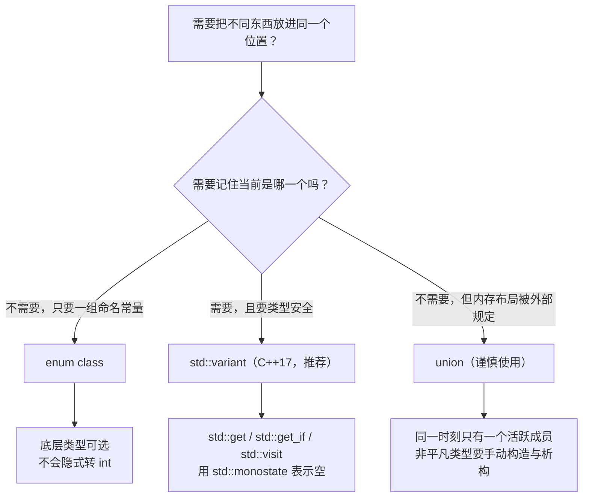

+++
title = "第34章 枚举与联合体"
weight = 340
date = "2026-03-29T21:03:00+08:00"
type = "docs"
description = ""
isCJKLanguage = true
draft = false
+++
# 第34章 枚举与联合体

想象一下，如果你是一位服装设计师，但你的衣柜里只能放一种衣服——今天想穿T恤？对不起，昨天那件西装还在占着位置，你得先把它扔掉。这是不是很荒谬？但是在C++的远古时代（咳咳，我是说C时代），程序员们就经常遇到这种尴尬的情况：一个变量只能存一种类型的值，哪怕你明明知道它有时候是数字，有时候是文字，有时候是其他什么东西。

别担心！C++的枚举（Enum）和联合体（Union）就是为了解决这种"一件衣服占据整个衣柜"的浪费问题而诞生的。它们就像是给程序员配备了一个神奇的衣柜——enum让你能给一堆相关的常量起名字，而union则允许同一个内存位置扮演不同的数据类型角色。

本章我们将深入探讨这两种"变形金刚"级别的数据类型，看看它们如何让我们的代码既优雅又高效。

## 34.1 枚举类型

枚举（Enumeration），听起来像是一种"数数"的行为——没错，它本质上就是给一堆相关的常量赋予人类可读的名字。想象一下，如果你写代码时看到`status = 3`，你可能会问："3是什么鬼？"但如果看到`status = Active`，哇，瞬间就明白了！

### 无作用域枚举（C风格枚举）

**无作用域枚举**（Unscoped Enumeration）是C++从C语言继承来的"老古董"，也是最基础、最直接的枚举类型。它的特点是枚举成员直接暴露在枚举类型所在的作用域里，就像把你的衣服直接扔在房间地板上——想拿就能拿到，但也容易造成混乱。

在C++中，`enum`关键字用于声明无作用域枚举，紧跟在后面的是枚举类型的名称，然后是一对花括号，里面包含了所有的枚举成员。每个枚举成员都对应一个整数值，默认从0开始递增，除非你显式指定。

```cpp
#include <iostream>

// 定义一个Color枚举类型，包含三个颜色成员
// Red默认是0，Green是1，Blue是2
enum Color {
    Red,     // 0 - 红色，就像番茄炒蛋里的番茄
    Green,   // 1 - 绿色，程序员的护眼色（并不是）
    Blue     // 2 - 蓝色，忧郁的蓝色代码...
};

// 再定义一个Status枚举，这次我们给成员指定具体的值
// 使用等号可以自定义值，没指定的会从上一个值继续递增
enum Status {
    Pending = 1,    // 待处理，任务堆积如山的状态
    Active = 2,     // 进行中，疯狂加班的状态
    Completed = 4   // 已完成，终于可以摸鱼的状态
};

int main() {
    // 声明一个Color类型的变量c，初始化为Red
    Color c = Red;
    // 枚举类型可以隐式转换为int，这有时候很方便，有时候很危险
    int val = c;
    std::cout << "Color is now: " << c << std::endl;  // 输出: 0
    // 哦不，我们打印出来的是数字0，而不是"Red"！
    // 这就是无作用域枚举的小缺点——名字空间是扁平的

    // 声明一个Status类型的变量s，初始化为Pending
    Status s = Pending;
    int statusVal = s;
    std::cout << "Status value: " << statusVal << std::endl;  // 输出: 1
    // 完美，这次我们指定了值，所以打印出来的是1而不是默认的0

    return 0;
}
```

> **小明的踩坑日记**：小明兴冲冲地定义了两个枚举，`enum Color { Red, Green, Blue };` 和 `enum Mood { Red, Happy, Blue };`。结果，他在同一个作用域里写了 `Color c = Red;` —— 编译直接报错！因为 `Red` 这个名字被两个枚举共享了，在全局作用域里产生了冲突。小明因此被产品经理催着改了三天代码，把所有枚举成员都加上了前缀（如 `Color_Red`、`Mood_Red`），代码瞬间变丑了三倍。这就是无作用域枚举的"名字空间污染"问题。

无作用域枚举的优缺点：
- ✅ 优点：语法简洁，与C语言兼容，可以隐式转换为整数方便做位运算
- ❌ 缺点：名字空间是扁平的，容易产生命名冲突；可以隐式转换为整数也意味着类型安全级别较低

### 强类型枚举enum class（C++11）

**强类型枚举**（Strongly-typed Enumeration）是C++11引入的"升级版"枚举，它使用`enum class`（或等价的`enum struct`）语法声明。最大的改进就是枚举成员被严格封闭在枚举类型的作用域内，再也不会跟外面的"邻居"打架了！而且不会隐式转换为整数，类型安全性大大提高。

如果说无作用域枚举是"敞开门的宿舍"（随便进出），那么强类型枚举就是"需要门禁卡的公寓"——安全多了！

```cpp
#include <iostream>

// 定义强类型枚举ErrorCode，底层类型是int
// enum class 的特点是：成员不在全局作用域，而是属于这个枚举类型
enum class ErrorCode : int {
    Success = 0,           // 成功，0是个好数字
    FileNotFound = 1,      // 文件找不到，你的代码找不到它的"另一半"
    PermissionDenied = 2  // 权限被拒绝，你不是这座城堡的国王
};

// 再定义一个强类型枚举，底层类型是unsigned char（只占1字节）
// 指定底层类型可以控制枚举占用的空间
enum class Priority : unsigned char {
    Low = 1,    // 低优先级，可以慢慢来
    Medium = 2, // 中优先级，做完再说
    High = 3    // 高优先级，火箭般紧急！
};

int main() {
    // 声明强类型枚举变量，必须使用枚举类型名::成员名的形式
    // 这就像是写信时必须写"北京市朝阳区XX小区"而不是只写"XX小区"
    ErrorCode e = ErrorCode::Success;
    // 想要获取枚举的整数值？必须显式使用static_cast转换！
    // 这是一个重要的安全特性，防止你"不小心"做傻事
    int val = static_cast<int>(e);
    std::cout << "ErrorCode value: " << val << std::endl;  // 输出: 0

    // 试试Priority枚举
    Priority p = Priority::High;
    // 注意：即使底层类型是unsigned char，转换语法也是一样的
    int pVal = static_cast<int>(p);
    std::cout << "Priority value: " << pVal << std::endl;  // 输出: 3

    // 强类型枚举不会隐式转换为int，下面的代码是错误的：
    // int x = Priority::High;  // 编译错误！想转换？乖乖用static_cast
    int x = static_cast<int>(Priority::High);  // 必须显式转换

    return 0;
}
```

> **小红的真香定律**：小红一开始觉得强类型枚举的"::"语法好麻烦，每次写`ErrorCode::Success`都要敲那么多字。但后来她发现，用无作用域枚举写了一个巨大的项目后，光是因为命名冲突而改bug就花了一周时间。从此以后，小红逢人就推荐强类型枚举："真香！"

强类型枚举的特点总结：
- ✅ 成员位于枚举类型的作用域内，不会污染外部名字空间
- ✅ 不会隐式转换为整数，类型安全
- ✅ 可以指定底层类型（char、int、unsigned等）
- ❌ 语法稍微繁琐一点（但这点代价完全值得！）

### 底层类型指定

在定义枚举时，你可以在枚举名后面加一个冒号和类型名，这就是**底层类型指定**（Underlying Type Specification）。它告诉编译器："我用这个枚举来存什么类型的整数"。

为什么要指定底层类型？想象一下，如果你要写一个程序来控制核电站的反应堆堆芯温度传感器，每个传感器有四种状态：Normal（正常）、Warning（警告）、Critical（危险）、Meltdown（融毁）。如果你用默认的int类型，每个状态值占用4个字节。但实际上你只需要0-3这四个值，用1个字节就够了。

在嵌入式开发、游戏开发等对内存极度敏感的场景，底层类型指定可以帮你省下宝贵的内存！

```cpp
#include <iostream>
#include <cstdint>  // 包含uint8_t等固定宽度整数类型的定义

// 定义一个强类型枚举，底层类型是uint8_t（8位无符号整数，范围0-255）
// 占用的内存只有1个字节！超省空间！
enum class SmallEnum : uint8_t {
    A = 0,  // 成员A的值是0
    B = 1   // 成员B的值是1
};

int main() {
    // 打印SmallEnum类型的大小，验证它确实只占1字节
    std::cout << "sizeof(SmallEnum) = " << sizeof(SmallEnum) << std::endl;  // 输出: 1
    // 如果没有指定底层类型，枚举通常会占用4字节（int的大小）

    // 使用枚举值
    SmallEnum flag = SmallEnum::A;
    int flagVal = static_cast<int>(flag);
    std::cout << "Flag value: " << flagVal << std::endl;  // 输出: 0

    // 底层类型的好处：
    // 1. 省内存 - 对于几百万个枚举值，节省的内存很可观
    // 2. 可预测的大小 - 网络协议、文件格式往往要求固定宽度
    // 3. 性能 - 在某些架构上，对齐要求可能影响访问速度

    return 0;
}
```

> **嵌入式工程师老王的肺腑之言**：老王在开发一个只有256KB内存的物联网设备固件时，发现程序占用的内存总是不够用。后来他发现项目中定义了上百个枚举，但每个枚举默认都是4字节——光这一项就浪费了几百KB的内存！后来老王把所有能省的枚举都加上了`: uint8_t`，成功把程序塞进了设备里。他说："底层类型指定这玩意儿，简直是嵌入式开发者的续命丹！"

底层类型指定的使用建议：
- 当你需要枚举值在网络协议或文件格式中占用特定大小时，指定底层类型
- 当你创建大量枚举对象且内存紧张时（如嵌入式、游戏开发），使用较小的底层类型
- 常用选项：`uint8_t`（1字节）、`uint16_t`（2字节）、`uint32_t`（4字节）

## 34.2 联合体union

**联合体**（Union）是一种特殊的数据类型，它的精髓在于"一宫多用"——同一个内存位置可以存储不同类型的值，但同一时刻只能扮演一种角色。

你可以把union想象成一个"变形工坊"：这个工坊的地板上有100平米的空间，你可以放一台洗衣机，但一旦放了洗衣机，这里就只能当洗衣机用，不能同时又当冰箱用——哪怕洗衣机只占了10平米的空间，剩下的90平米也必须空着，不能塞进去别的东西。

union就是这种"霸道"的家伙：一个union变量可以存储int或double或char，但每次只能存一种。当你给它赋一个double值后，之前存的int值就"消失"了——不是真的消失，而是被覆盖了，因为它们共享同一块内存。

### 匿名联合体

**匿名联合体**（Anonymous Union）是union家族中的"隐士"——它没有名字，直接在结构体或类内部声明，它的成员就像是直接属于外层结构体的普通成员一样使用。

```cpp
#include <iostream>

// 定义一个Widget结构体，用于存储不同类型的部件数据
struct Widget {
    int type;  // 类型标识符，1表示intValue有效，2表示doubleValue有效

    // 匿名联合体 - 它没有名字，直接在这里声明
    // 联合体内的成员（intValue和doubleValue）会直接成为Widget的一部分
    union {
        int intValue;    // 整数类型的值
        double doubleValue;  // 浮点数类型的值
    };
    // 注意：intValue和doubleValue共享同一块内存！
    // 就像同一个房间，既可以是卧室，也可以是办公室，但不能同时是两者
};

int main() {
    Widget w;  // 创建一个Widget对象

    // 设置type为1，表示这个widget存的是一个整数
    w.type = 1;
    // 给intValue赋值42
    w.intValue = 42;
    // 打印结果
    std::cout << "intValue = " << w.intValue << std::endl;  // 输出: 42

    // 如果我们现在给doubleValue赋值，会发生什么？
    // 答案：intValue的值会被覆盖，因为它们共享内存！
    w.doubleValue = 3.14;
    std::cout << "After setting doubleValue, intValue looks like: " << w.intValue << std::endl;
    // 打印出来的可能是一个乱七八糟的数，因为intValue的内存被double值覆盖了

    // 这就是使用union时的"陷阱"——你必须自己记住当前存的是什么类型！
    // 如果你忘了type是1而以为还是intValue，读取doubleValue就会得到垃圾数据

    return 0;
}
```

> **小李的惨痛教训**：小李用union写了一个"万能变量"来存储配置值，他觉得这样特别省内存。结果线上出了个bug，用户投诉说自己的分数显示成"1.34523e+19"这样的乱码。调查了半天发现：代码先给union存了一个整数用户分数`score.intValue = 95;`，然后另一个模块以为这是个double，直接读了`score.doubleValue`——两个int位被当成double的尾数部分解释，当然就变成乱码了！小李后来加了type标识，并在每次访问前检查类型，这才平息了这场"union引发的血案"。

匿名联合体的特点：
- ✅ 成员直接属于外层结构体，访问时不需要中间步骤（如`w.intValue`而不是`w.data.intValue`）
- ✅ 语法更简洁
- ❌ 联合体成员对外层结构体"可见"，可能会被意外访问，导致未定义行为
- ❌ 同样需要使用者自己维护"当前有效的是哪个成员"的状态

### 有作用域联合体（C++11）

**有作用域联合体**（Scoped Union）是C++11对匿名联合体的"改进版"。它本质上就是一个有名字的联合体，作为结构体或类的成员存在，访问时需要通过联合体名字作为中间人。

C++11还允许给union定义构造函数和析构函数，这对于管理资源（比如动态内存、文件句柄）非常重要——当union切换存储类型时，之前的值需要被正确地销毁。

```cpp
#include <iostream>

// 定义一个Data结构体，内部包含一个有作用域的联合体
struct Data {
    // 有作用域联合体：联合体有自己的名字"Storage"
    // 访问成员需要通过 Storage::成员名 的形式
    union Storage {
        int i;      // 整数成员
        double d;   // 浮点数成员
    };

    Storage s;  // Data里声明一个Storage联合体对象

    // 构造函数，使用初始化列表给s.i一个默认值0
    // 这个构造函数会在创建Data对象时自动调用
    Data() : s{} {}

    // 析构函数（这里为空，但如果有指针成员可能需要）
    ~Data() {}
};

int main() {
    // 创建Data对象，构造函数会初始化s.i为0
    Data data;

    // 通过联合体名::成员名访问——这就是"有作用域"的意思！
    data.s.d = 3.14;  // 现在联合体存的是double
    std::cout << "d = " << data.s.d << std::endl;  // 输出: 3.14

    // 打印i看看——它现在是什么？
    // 没错，就是一堆乱码，因为double的二进制表示被int解释
    std::cout << "i (after setting d) = " << data.s.i << std::endl;
    // 不要慌，这是union的正常行为！怪就怪你自己没记住当前类型

    // 重新设置i
    data.s.i = 100;
    std::cout << "i (after resetting) = " << data.s.i << std::endl;  // 输出: 100
    // 现在i正常了，但之前存的3.14已经"香消玉殒"了

    return 0;
}
```

> **有作用域vs匿名**：小张纠结了好久到底用哪种联合体。他的老师告诉他："如果你确认联合体的生命周期完全由外层结构体管理，且不会有歧义，用匿名的更简洁；如果你想明确表达'这是一组互斥的数据'，用有作用域的更清晰。"小张后来做游戏开发，他把技能效果存成union，匿名的那种植入了技能结构体内部，有作用域的用在事件系统里。他说："合适的才是最好的！"

## 34.3 std::variant作为类型安全联合体（C++17）

终于！我们来到了联合体的"究极进化形态"——`std::variant`！

**std::variant**是C++17引入的标准库类型，它是一个"类型安全的联合体"。如果说union是个"粗心大意"的数据结构（不记得自己当前存的是什么类型），那么std::variant就是配备了"记忆芯片"的智能保险箱——它永远知道自己存的是什么类型，并且会在你试图访问错误类型时给你一个明确的错误，而不是默默地返回乱码。

std::variant定义在`<variant>`头文件中，它可以存储多种类型中的一种，就像union一样。但关键区别在于：variant会记录当前有效值的类型，并且提供类型检查的访问方式。

```cpp
#include <iostream>
#include <variant>  // std::variant的头文件

int main() {
    // 定义一个variant，它可以存int、double或std::string三种类型之一
    // variant<int, double, std::string> 就像一个"三选一"的保险箱
    std::variant<int, double, std::string> v;

    // 存一个整数进去
    v = 42;
    // 用std::get<T>访问，如果类型不对会抛异常
    std::cout << "int: " << std::get<int>(v) << std::endl;  // 输出: 42

    // 换成存一个double
    v = 3.14;
    std::cout << "double: " << std::get<double>(v) << std::endl;  // 输出: 3.14

    // 换成存一个字符串
    v = "hello";
    // 字符串常量"hello"是const char*类型，
    // 但variant会帮我们转换成std::string（因为我们声明的是std::string）
    std::cout << "string: " << std::get<std::string>(v) << std::endl;  // 输出: hello

    // 安全检查：用std::get_if<T>可以安全地检查当前是否是某种类型
    // 它返回一个指针，如果是那种类型就指向值，否则返回nullptr
    if (auto* val = std::get_if<int>(&v)) {
        // 只有当v当前存的是int时，才会进入这个分支
        std::cout << "Current type is int: " << *val << std::endl;
    } else {
        std::cout << "Current type is NOT int" << std::endl;
    }

    // 现在v存的是string，所以上面会输出"Current type is NOT int"

    // 尝试用错误的类型访问？std::bad_variant_access异常在等着你！
    try {
        int x = std::get<int>(v);  // v当前是string，不是int！
        std::cout << x << std::endl;  // 这行不会执行
    } catch (const std::bad_variant_access& e) {
        std::cout << "Oops! Tried to get int but variant holds string: "
                  << e.what() << std::endl;
        // 输出: Oops! Tried to get int but variant holds string: bad_variant_access
        // （e.what() 就是 "bad_variant_access"，标准只保证它可读，
        //   不同标准库给出的文字可能略有差异）
    }

    return 0;
}
```

> **小明的完美逆袭**：小明之前被普通union坑了三周，这次他学聪明了。接手新项目时，他一看要求"C++17以上"，立刻眼睛发光："太好了！可以用std::variant了！"他用variant重构了之前容易出bug的配置解析代码，加班了两天，结果后来的维护工作几乎为零——variant在编译时就杜绝了类型错误的可能性，产品经理都觉得他代码质量突飞猛进。小明得意地说："不是我变聪明了，是C++17变聪明了！"

std::variant的"超能力"：
- ✅ **类型安全**：始终知道当前存储的类型，访问错误类型会抛异常或返回nullptr
- ✅ **无额外开销**：不占用额外内存（除了可能用于异常处理的少量开销）
- ✅ **支持递归**：可以嵌套，比如`std::variant<int, std::vector<std::variant<int, double>>>`
- ✅ **可替代性**：可以用`std::visit`对不同类型执行不同的操作，类似模式匹配
- ❌ **语法稍复杂**：需要头文件`<variant>`，不支持C++17之前的项目
- ❌ **不能存储void**：variant至少需要一种类型
- ❌ **不能直接存储数组**：但可以存储`std::array`

让我们再看看一个更有趣的例子——用`std::visit`来"访问"variant：

```cpp
#include <iostream>
#include <variant>
#include <string>

// 定义一个打印器仿函数
struct Printer {
    // 重载operator()，对不同类型执行不同的打印操作
    void operator()(int i) const {
        std::cout << "Integer: " << i << std::endl;
    }
    void operator()(double d) const {
        std::cout << "Double: " << d << std::endl;
    }
    void operator()(const std::string& s) const {
        std::cout << "String: " << s << std::endl;
    }
};

int main() {
    std::variant<int, double, std::string> v = 42;

    // std::visit就像一个"万能钥匙"，能根据v当前的实际类型调用对应的operator()
    std::visit(Printer{}, v);  // 输出: Integer: 42

    v = 3.14;
    std::visit(Printer{}, v);  // 输出: Double: 3.14

    v = "Hello, variant!";
    std::visit(Printer{}, v);  // 输出: String: Hello, variant!

    // 更简洁的写法：使用lambda代替仿函数
    std::visit([](const auto& val) {
        std::cout << "Value: " << val << std::endl;
    }, v);  // 输出: Value: Hello, variant!

    return 0;
}
```

这个`std::visit`的技巧在处理"多种类型但要统一操作"的场景时特别有用，比如写一个表达式求值器、状态机、或者JSON解析器。

---

## 34.4 枚举进阶技巧

### 34.4.1 using enum（C++20）

写 `switch` 时反复敲 `Color::Red`、`Color::Green` 很啰嗦。C++20 的 `using enum` 可以把某个枚举的成员一次性"请"进当前作用域：

```cpp
#include <iostream>

enum class Color { Red, Green, Blue };

const char* toString(Color c) {
    switch (c) {
        using enum Color;      // C++20：把这个枚举的成员引入当前作用域
        case Red:   return "Red";
        case Green: return "Green";
        case Blue:  return "Blue";
    }
    return "Unknown";
}

int main() {
    std::cout << toString(Color::Green) << std::endl;  // 输出: Green
    return 0;
}
```

> ⚠️ **版本要求**：`using enum` 是 **C++20** 引入的。用 `-std=c++17` 编译会报
> `error: using enum declarations are a C++20 extension`，请改用 `-std=c++20` 及以上。

### 34.4.2 枚举与字符串互转

C++ 至今没有内置的"枚举 ⇄ 字符串"反射（这是 enum 最经典的痛点），标准做法就是自己写一对转换函数：

```cpp
#include <iostream>
#include <optional>
#include <string_view>

enum class Color { Red, Green, Blue };

// 枚举 -> 字符串
constexpr std::string_view to_string(Color c) {
    switch (c) {
        using enum Color;
        case Red:   return "Red";
        case Green: return "Green";
        case Blue:  return "Blue";
    }
    return "Unknown";
}

// 字符串 -> 枚举：失败时返回 std::nullopt，而不是靠"魔法值"
constexpr std::optional<Color> to_color(std::string_view s) {
    if (s == "Red")   return Color::Red;
    if (s == "Green") return Color::Green;
    if (s == "Blue")  return Color::Blue;
    return std::nullopt;
}

int main() {
    std::cout << to_string(Color::Green) << std::endl;   // 输出: Green

    if (auto c = to_color("Blue")) {
        std::cout << "解析成功，序号 = " << static_cast<int>(*c) << std::endl;  // 输出: 2
    }
    if (!to_color("Purple")) {
        std::cout << "解析失败：没有这个颜色" << std::endl;
    }
    return 0;
}
```

用 `std::optional<Color>` 表示失败，比返回 `static_cast<Color>(-1)` 这种"魔法值"清楚得多——调用方一个 `if` 就能判断，编译器也没法帮你写出漏判。

> 💡 **实战提示**：`constexpr` 版本的 `to_string` 既能在运行期用，也能在编译期用。但要注意 `switch` 覆盖全部成员时不要写 `default`，否则以后新增枚举成员时编译器**就不会再提醒你漏了分支**。

---

## 34.5 union 的陷阱与正确用法

前面说过 union "同一时刻只有一个成员是活跃的"。这句话听起来简单，但踩坑的人特别多。

### 34.5.1 类型双关（type punning）是未定义行为

很多人用 union 来"看浮点数的二进制长什么样"：

```cpp
#include <bit>        // std::bit_cast
#include <cstdint>
#include <iostream>

union Pun {
    std::uint32_t i;
    float f;
};

int main() {
    Pun p;
    p.f = 1.0f;                 // 活跃成员是 f

    // ❌ 读 p.i 是读"非活跃成员"，标准 C++ 里属于未定义行为
    //    编译器完全可以把它优化掉，或者给出一个你以为"对"的旧值
    // std::cout << p.i << std::endl;

    // ✅ C++20 的正解：std::bit_cast
    std::uint32_t bits = std::bit_cast<std::uint32_t>(p.f);
    std::cout << "0x" << std::hex << bits << std::dec << std::endl;  // 输出: 0x3f800000

    return 0;
}
```

`std::bit_cast` 明确告诉编译器"我要按位重解释，而且我知道自己在干什么"，而且能在 `constexpr` 里使用。看到旧的 `memcpy` 或 union 写法，都可以换成它。

### 34.5.2 非平凡类型必须手动构造/析构

如果 union 的成员里有 `std::string` 这类**非平凡类型**，编译器就不再替你生成构造/析构函数了，必须自己写，还要手动控制活跃成员的生死：

```cpp
#include <iostream>
#include <new>        // placement new
#include <string>

struct S { std::string name; int id; };   // 非平凡类型

union U {
    int i;
    S s;
    U() {}          // 成员含非平凡类型时，这两个函数必须显式提供
    ~U() {}         // 否则它们会被定义为 = delete，连声明对象都不行
};

int main() {
    U u;
    new (&u.s) S{"Alice", 1};              // placement new：构造活跃成员
    std::cout << u.s.name << " #" << u.s.id << std::endl;  // 输出: Alice #1
    u.s.~S();                              // 手动析构，千万别漏
    return 0;
}
```

漏掉 `u.s.~S()` 就是内存泄漏；忘记写 `U(){}` / `~U(){}` 则直接编译不过。这也是为什么现代 C++ 代码里裸 union 越来越少见。

### 34.5.3 什么时候真的该用 union？

裸 union 仍然有它的位置，但要认准场景：

- **和 C 代码 / 硬件打交道**：协议报文、寄存器映射、`ioctl` 参数这类"内存布局就是规格"的地方；
- **匿名 union 给同一块内存起多个名字**：例如 `union { uint32_t raw; struct { uint8_t a, b, c, d; } bytes; };`
- **其他所有情况**：请直接用 `std::variant`。

> **一句话原则**：union 省的是内存，付出的是"必须自己保证类型正确"的代价。除非内存布局是被外部规定的，否则用 `std::variant`。

---

## 34.6 std::variant 进阶

### 34.6.1 std::visit + overloaded：像模式匹配一样写代码

`std::visit` 的真正威力，是和"overloaded"惯用法配合——把若干 lambda 打包成一个重载集：

```cpp
#include <iostream>
#include <variant>

// "overloaded" 惯用法：继承所有 lambda 的 operator()
template<class... Ts>
struct overloaded : Ts... { using Ts::operator()...; };
// C++20 起不再需要显式的推导指引

struct Circle { double r; bool operator==(const Circle&) const = default; };
struct Rect   { double w, h; bool operator==(const Rect&) const = default; };

using Shape = std::variant<Circle, Rect, std::monostate>;

double area(const Shape& s) {
    return std::visit(overloaded{
        [](const Circle& c) { return 3.141592653589793 * c.r * c.r; },
        [](const Rect&   r) { return r.w * r.h; },
        [](std::monostate)  { return 0.0; }        // 还没有放入任何图形
    }, s);
}

int main() {
    Shape a = Circle{1.0};
    Shape b = Rect{2.0, 3.0};
    Shape c;                      // 默认构造得到 std::monostate

    std::cout << "圆面积   = " << area(a) << std::endl;   // 输出: 圆面积   = 3.14159
    std::cout << "矩形面积 = " << area(b) << std::endl;   // 输出: 矩形面积 = 6
    std::cout << "空形状   = " << area(c) << std::endl;   // 输出: 空形状   = 0

    // index()：当前是第几个备选类型（从 0 开始）
    std::cout << "b 的索引 = " << b.index() << std::endl;  // 输出: 1

    // C++17 起 variant 支持 == 和 <，先比索引再比值
    std::cout << "a == b ? " << (a == b ? "true" : "false") << std::endl;  // 输出: false

    // 极少数情况：赋值过程中抛异常，variant 会进入"无值"状态
    std::cout << "c 是否无值 = " << c.valueless_by_exception() << std::endl;  // 输出: 0

    return 0;
}
```

> ⚠️ **注意**：`overloaded` 这一招要求**每个 lambda 都覆盖到所有备选类型**，否则 `std::visit` 会因为"找不到匹配的重载"而编译失败。这正是它的价值所在——**漏掉一种类型，编译期就报错**，而不是运行期才发现。

### 34.6.2 std::monostate：让 variant 可以"空着"

`std::variant<Ts...>` 默认构造的是**列表中第一个类型**，不是"空"。如果第一个类型不方便默认构造，或者你确实想要一个"什么都没有"的状态，就用 `std::monostate` 占位：

```cpp
#include <iostream>
#include <string>
#include <variant>

int main() {
    // 把 std::monostate 放在列表第一位，默认构造就是"空"状态
    std::variant<std::monostate, std::string, int> config;
    std::cout << config.index() << std::endl;   // 输出: 0，指向 monostate

    config = "debug";
    std::cout << config.index() << std::endl;   // 输出: 1，现在是 string

    config = 8080;
    std::cout << config.index() << std::endl;   // 输出: 2，现在是 int
    return 0;
}
```

`std::monostate` 只有一个值、大小 1 字节，专门当"空标签"用。

| 类型 | 表达"没有值"的方式 | 能否默认构造 |
|---|---|---|
| 裸 `union` | 没有——必须自己用一个额外字段记类型 | 取决于成员 |
| `std::optional<T>` | `std::nullopt` | 可以（为空） |
| `std::variant<...>` | 把 `std::monostate` 放进类型列表 | 可以（构造第一个类型） |
| `std::variant<...>` | `valueless_by_exception()` | 只会在异常时出现，**不是正常状态** |

### 34.6.3 小结：三者怎么选



> **老程序员的忠告（补）**：裸 union 是"把内存布局的钥匙交给别人"的做法，只有当你必须和 ABI/硬件对齐时才动它；剩下的场景，`std::variant` 在编译期就把大部分错误挡在门外了。

## 本章小结

本章我们深入探索了C++中两种重要的"数据容器"——枚举（Enum）和联合体（Union），它们就像是程序员工具箱里的多功能瑞士军刀，各有各的用途。

**枚举类型**就像是给一堆常量起了个好听的名字：
- **无作用域枚举**（C风格`enum`）简单直接，但名字空间是扁平的，容易产生命名冲突
- **强类型枚举**（`enum class`）是C++11带来的升级版，成员作用域严格封闭，不会隐式转换为整数，类型安全性更高
- **底层类型指定**允许你控制枚举占用的内存大小，省内存的利器

**联合体**则是"一宫多用"的内存共享高手：
- **匿名联合体**没有独立的名字，成员直接属于外层结构体，访问简洁但也容易误用
- **有作用域联合体**有独立的名字，访问需要通过联合体名中转，语义更清晰
- 联合体的核心特点是**同一时刻只能存储一种类型的值**，切换类型会覆盖旧值

**std::variant**（C++17）代表了联合体的"究极进化形态"：
- 它是类型安全的，不会让你读取到错误类型的数据
- 提供`std::get<T>`和`std::get_if<T>`两种访问方式
- 支持`std::visit`进行类型分发的操作
- 是现代C++处理"异构数据"的首选方案

**进阶技巧**：
- `using enum`（C++20）能把枚举成员"请"进当前作用域，`switch` 里不必再写前缀
- 枚举与字符串互转没有标准反射，自己写一对函数、用 `std::optional` 表示失败最稳妥
- 读 union 的"非活跃成员"是未定义行为，按位重解释请用 `std::bit_cast`（C++20）
- union 的成员含非平凡类型时，构造/析构函数必须自己写，还要用 placement new 手动管理成员生命周期
- `std::visit` + "overloaded" 惯用法能让编译器替你检查"漏掉某一种类型"
- `std::variant` 用 `std::monostate` 表达"空"，而不是依赖 `valueless_by_exception()`

> **老程序员的忠告**：能用强类型枚举就别用无作用域枚举，能用std::variant就别用裸union。这些"升级版"工具在编译时就给你更多的保护，省得你在debug时流下没有技术含量的眼泪。

记住，枚举让你的代码更易读，联合体让你的内存更高效，而std::variant让两者兼得！好好掌握它们，你就是办公室里的"类型大师"！
