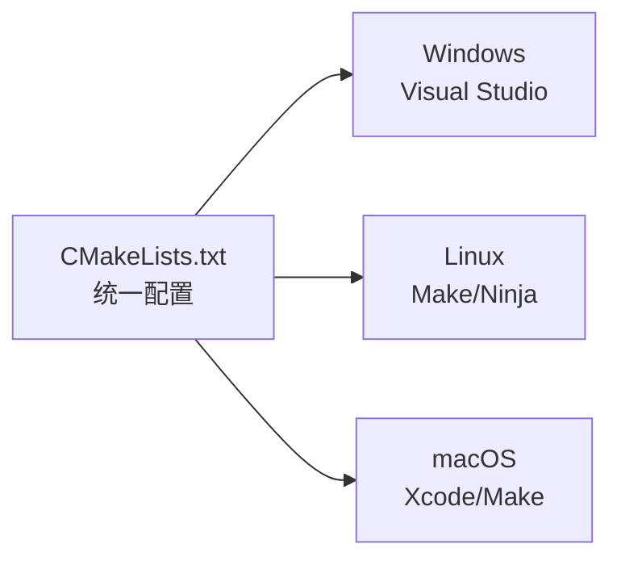

+++
title = "第38章 构建系统"
weight = 380
date = "2026-03-29T21:03:00+08:00"
type = "docs"
description = ""
isCJKLanguage = true
draft = false
+++
# 第38章 构建系统

想象一下：你辛辛苦苦写了三千行C++代码，兴冲冲地点击"运行"，然后...满屏红字。天哪，编译器在跟你玩"你猜我需要什么头文件"的游戏。这就是构建系统的意义所在——它就像一个尽职的管家，帮你把混乱的源代码变成闪闪发光的可执行文件，还顺便记住了编译器的所有怪癖。

C++的构建系统就像三国演义里的谋士——有Makefile这种老派稳健的，有CMake这种灵活多变的，还有vcpkg和Conan这种包罗万象的。本章我们就来一场构建系统大冒险，保证让你从此不再被编译错误折磨到怀疑人生。

## 38.1 Makefile基础

Makefile是构建系统的老祖宗，诞生于1977年，比很多读者的父母年纪还大。它就像一把瑞士军刀——虽然看起来复古，但关键时刻真能救命。

### 基本语法

Makefile的核心是**规则（Rule）**，每条规则长得像这样：

```makefile
目标: 依赖
	命令
```

注意：命令前面必须按Tab键（不是空格！），否则Make会跟你闹脾气。

假设我们有一个简单的C++程序：

```cpp
// main.cpp - 主角登场
#include <iostream>

int main() {
    std::cout << "你好，构建系统！" << std::endl;
    return 0;
}
```

对应的Makefile可以这样写：

```makefile
# Makefile - 你的第一个构建脚本
# 作者：被编译器折磨过的程序员

# 目标：编译一个叫hello的可执行文件
hello: main.cpp
	g++ main.cpp -o hello
```

当你运行 `make hello` 时，Make会：
1. 检查 `hello` 是否存在
2. 检查 `main.cpp` 是否存在
3. 比较两者的修改时间
4. 如果 `main.cpp` 更新，就执行编译命令

这就像一个尽职的图书管理员，只在书有更新时才重新整理书架。

更完整的Makefile长这样：

```makefile
# 完整的Makefile示例
# CXX是编译器变量，默认为g++
CXX = g++
# CXXFLAGS是编译选项，-Wall是显示所有警告
CXXFLAGS = -Wall -Wextra -std=c++17
# TARGET是最终可执行文件的名字
TARGET = hello

# 默认目标：运行make时没有指定目标就会执行这个
all: $(TARGET)

# 编译规则
$(TARGET): main.cpp
	$(CXX) $(CXXFLAGS) main.cpp -o $(TARGET)

# 清理生成的二进制文件
clean:
	rm -f $(TARGET)

# 伪目标，用于声明不是实际文件
.PHONY: all clean
```

运行效果：

```bash
$ make
g++ -Wall -Wextra -std=c++17 main.cpp -o hello

$ ./hello
你好，构建系统！
```

> 如果你看到 `missing separator` 错误，别慌，把命令前的空格全删掉，用一个Tab重新缩进。Make对Tab的执念堪比处女座。

### 变量与函数

Makefile里的变量不需要声明类型，直接赋值就能用（像极了JavaScript）。变量使用 `$(变量名)` 或 `${变量名}` 的形式访问。

```makefile
# 变量定义
CC = g++           # C++编译器
CFLAGS = -Wall     # 编译选项
SRCS = main.cpp utils.cpp config.cpp  # 源文件列表
OBJS = $(SRCS:.cpp=.o)  # 替换后缀：main.cpp utils.cpp config.cpp → main.o utils.o config.o
TARGET = myprogram # 可执行文件名

# 使用变量
all: $(TARGET)

$(TARGET): $(OBJS)
	$(CC) $(OBJS) -o $(TARGET)

# 模式匹配规则：所有.o文件都依赖于同名的.cpp文件
%.o: %.cpp
	$(CC) $(CFLAGS) -c $< -o $@

clean:
	rm -f $(OBJS) $(TARGET)
```

这里冒出来几个神奇的自动化变量：
- `$@` - 目标文件名（target）
- `$<` - 第一个依赖文件（first dependency）
- `$^` - 所有依赖文件（all dependencies）

把它们想象成Makefile的快捷短语：`$@` 就是"那个目标"，`$<` 就是"那个依赖"，非常好记。

函数方面，Makefile提供了一些内置函数：

```makefile
# wildcard函数：获取匹配模式的文件列表
SRCS = $(wildcard *.cpp)

# patsubst函数：替换模式
OBJS = $(patsubst %.cpp, %.o, $(SRCS))

# foreach函数：遍历列表
# 假设有个文件列表想要分别打印
NAMES = apple banana cherry
# $(foreach n,$(NAMES),$(n)) 会展开成 apple banana cherry
```

一个更贴近实战的例子：

```makefile
# 实战版Makefile，支持多文件编译
CC = g++
CXXFLAGS = -Wall -Wextra -std=c++17 -O2
TARGET = myapp
SRCS = $(wildcard *.cpp)
OBJS = $(patsubst %.cpp, %.o, $(SRCS))

all: $(TARGET)

$(TARGET): $(OBJS)
	$(CC) $(OBJS) -o $(TARGET)

%.o: %.cpp
	$(CC) $(CXXFLAGS) -c $< -o $@

clean:
	rm -f $(OBJS) $(TARGET)

.PHONY: all clean
```

> 小技巧：把 `.PHONY` 放在 `clean` 和 `all` 前面是个好习惯，因为这些名字可能恰好有个叫 `clean` 或 `all` 的文件存在，`.PHONY` 就是告诉Make"别犯强迫症去找这个文件，直接执行命令就行"。

## 38.2 CMake入门

如果说Makefile是手动的面条，那么CMake就是全自动面条机——你只需要告诉它你想要什么口味的，它帮你搞定一切。CMake用 `CMakeLists.txt` 替代了Makefile，用更高级的语言描述构建过程。

### 基本CMakeLists.txt

CMakeLists.txt是CMake的配置文件，通常放在项目根目录：

```cmake
# CMakeLists.txt - CMake的入门脚本
# 作者：不想手动写Makefile的程序员

# cmake_minimum_required：声明CMake最低版本要求
# 就像游戏服的最低等级要求，不满足就别想进
cmake_minimum_required(VERSION 3.10)

# project：定义项目名称，顺便设置PROJECT_NAME变量
# 还有PROJECT_SOURCE_DIR等变量自动生成
project(MyAwesomeApp VERSION 1.0.0 LANGUAGES CXX)

# set：设置变量，就像Makefile里的CC = xxx
set(CMAKE_CXX_STANDARD 17)        # C++17标准
set(CMAKE_CXX_STANDARD_REQUIRED ON)  # 强制要求C++17，不支持就报错
set(CMAKE_CXX_EXTENSIONS OFF)     # 不用编译器特定的扩展

# 调试和发布模式
set(CMAKE_BUILD_TYPE Debug)       # 可选：Debug | Release | RelWithDebInfo | MinSizeRel

# 添加可执行文件
# 语法：add_executable(目标名 源文件1 源文件2 ...)
add_executable(myapp main.cpp)

# 给可执行文件添加编译选项
target_compile_options(myapp PRIVATE -Wall -Wextra)
```

CMake的常用命令：

```cmake
# cmake_minimum_required：cmake最低版本
cmake_minimum_required(VERSION 3.10)

# project：项目名称
project(MyApp VERSION 1.0.0 LANGUAGES CXX)

# set：设置变量
set(SOURCES main.cpp utils.cpp)

# add_executable：添加可执行文件目标
add_executable(app ${SOURCES})

# add_library：添加库文件目标
add_library(mylib STATIC utils.cpp)   # STATIC静态库
add_library(mylib SHARED utils.cpp)   # SHARED动态库

# target_include_directories：添加头文件搜索路径
target_include_directories(app PRIVATE ${CMAKE_CURRENT_SOURCE_DIR}/include)

# target_link_libraries：链接库
target_link_libraries(app PRIVATE m)  # 链接数学库
target_link_libraries(app PRIVATE pthread)  # 链接pthread线程库
```

生成构建系统并编译：

```bash
# 创建build目录（推荐）
mkdir build && cd build

# 运行cmake生成Makefile
cmake ..

# 编译
cmake --build .
# 或者简写
make
```

### 包含子目录

大型项目通常像俄罗斯套娃一样，一层套一层。CMake用 `add_subdirectory` 来管理子目录。

```
myproject/
├── CMakeLists.txt
├── src/
│   ├── CMakeLists.txt
│   ├── main.cpp
│   └── utils.cpp
├── lib/
│   ├── CMakeLists.txt
│   └── mylib.cpp
└── include/
    └── utils.h
```

根目录的CMakeLists.txt：

```cmake
cmake_minimum_required(VERSION 3.10)
project(MyProject VERSION 1.0.0 LANGUAGES CXX)

# 设置C++标准
set(CMAKE_CXX_STANDARD 17)
set(CMAKE_CXX_STANDARD_REQUIRED ON)

# 添加子目录
# CMake会去找子目录里的CMakeLists.txt
add_subdirectory(src)    # src目录必须有CMakeLists.txt
add_subdirectory(lib)    # lib目录也必须有

# 编译后的可执行文件叫myapp
add_executable(myapp src/main.cpp)

# 链接lib目录里定义的mylib库
target_link_libraries(myapp PRIVATE mylib)

# 添加头文件目录
target_include_directories(myapp PRIVATE include)
```

src/CMakeLists.txt：

```cmake
# src目录的CMakeLists.txt
# 只负责编译utils.cpp，因为main.cpp在根目录直接加入myapp了

# 列出src目录的源文件
aux_source_directory(. SRCS)  # 收集utils.cpp等

# 另一种写法是直接列出
# set(SRCS utils.cpp)
# add_library(myapp_utils STATIC ${SRCS})
# 然后在根目录link
```

lib/CMakeLists.txt：

```cmake
# lib目录的CMakeLists.txt
# 构建mylib库

# 收集源文件
aux_source_directory(. LIB_SRCS)

# add_library：添加库目标
# 第一个参数是库名，第二个是类型
# STATIC = 静态库 (.a)，SHARED = 动态库 (.so/.dll)
add_library(mylib STATIC ${LIB_SRCS})

# 设置库的属性
set_target_properties(mylib PROPERTIES
    POSITION_INDEPENDENT_CODE ON  # 位置无关代码，动态库必需
)
```

### 条件编译

CMake的条件编译让你可以根据平台、配置或用户选择来决定编译什么。这就像装修房子——预算充足就装地暖，预算紧张就贴暖宝宝。

```cmake
cmake_minimum_required(VERSION 3.10)
project(ConditionalBuildDemo LANGUAGES CXX)

set(CMAKE_CXX_STANDARD 17)

# 定义一个选项，用户可以用cmake-gui或ccmake修改
# 语法：option(变量名 "描述" 默认值)
option(ENABLE_TELEPORT "启用瞬间移动功能" OFF)
option(ENABLE_HOLOGRAM "启用全息投影" ON)

# 设置构建类型
set(default_build_type "Release")
if(NOT CMAKE_BUILD_TYPE AND NOT CMAKE_CONFIGURATION_TYPES)
    message(STATUS "Setting build type to '${default_build_type}' as none was specified.")
    set(CMAKE_BUILD_TYPE "${default_build_type}" CACHE STRING "Choose the type of build." FORCE)
    set_property(CACHE CMAKE_BUILD_TYPE PROPERTY STRINGS "Debug" "Release" "MinSizeRel" "RelWithDebInfo")
endif()

add_executable(coolapp main.cpp)

# 条件1：检查编译器是否为GCC
if(CMAKE_CXX_COMPILER_ID STREQUAL "GNU")
    message(STATUS "检测到GCC编译器，添加额外警告选项")
    target_compile_options(coolapp PRIVATE -Wall -Wextra -pedantic)
endif()

# 条件2：检查操作系统
if(WIN32)
    message(STATUS "检测到Windows系统")
    target_compile_definitions(coolapp PRIVATE USE_WINDOWS_API)
elseif(UNIX AND NOT APPLE)
    message(STATUS "检测到Linux系统")
    target_compile_definitions(coolapp PRIVATE USE_LINUX_API)
elseif(APPLE)
    message(STATUS "检测到macOS系统")
    target_compile_definitions(coolapp PRIVATE USE_MACOS_API)
endif()

# 条件3：根据选项决定是否启用功能
if(ENABLE_TELEPORT)
    message(STATUS "已启用瞬间移动功能（需要消耗查克拉）")
    target_compile_definitions(coolapp PRIVATE ENABLE_TELEPORT)
endif()

if(ENABLE_HOLOGRAM)
    message(STATUS "已启用全息投影（需要神秘能量）")
    target_compile_definitions(coolapp PRIVATE ENABLE_HOLOGRAM)
endif()
```

对应的C++代码：

```cpp
// main.cpp - 条件编译演示
#include <iostream>

int main() {
    std::cout << "欢迎来到条件编译的世界！" << std::endl;

    // 通过CMake传入宏定义来控制代码行为
    #ifdef ENABLE_TELEPORT
        std::cout << "✨ 瞬间移动已就绪" << std::endl;
    #else
        std::cout << "😅 只能靠11路公交了" << std::endl;
    #endif

    #ifdef ENABLE_HOLOGRAM
        std::cout << "🌟 全息投影已就绪" << std::endl;
    #else
        std::cout << "📺 只能用老式显示器" << std::endl;
    #endif

    #ifdef USE_WINDOWS_API
        std::cout << "运行在Windows上（需要关机重启）" << std::endl;
    #elif defined(USE_LINUX_API)
        std::cout << "运行在Linux上（sudo rm -rf /）" << std::endl;
    #elif defined(USE_MACOS_API)
        std::cout << "运行在macOS上（假装很优雅）" << std::endl;
    #endif

    return 0;
}
```

运行效果：

```bash
# 默认配置（关闭TELEPORT，开启HOLOGRAM）
$ cmake -B build
$ cmake --build build
$ ./build/coolapp
欢迎来到条件编译的世界！
😅 只能靠11路公交了
🌟 全息投影已就绪
运行在Linux上（sudo rm -rf /）

# 开启所有功能
$ cmake -B build -DENABLE_TELEPORT=ON
$ cmake --build build
$ ./build/coolapp
欢迎来到条件编译的世界！
✨ 瞬间移动已就绪
🌟 全息投影已就绪
运行在Linux上（sudo rm -rf /）
```

## 38.3 CMake高级特性

学会了基础，你已经是CMake的本科生。现在让我们跳级到研究生课程——生成器表达式和导出安装。

### 生成器表达式

**生成器表达式（Generator Expressions）** 是CMake在生成构建系统时动态计算值的魔法。它在运行时（configure time）定义，但在编译时（build time）才展开。这就像预约的外卖，下单时不确定价格，送餐时才算账。

语法很简单：`$<condition:result>` 或 `$<condition?result_if_true:result_if_false>`

```cmake
cmake_minimum_required(VERSION 3.10)
project(GeneratorExprDemo LANGUAGES CXX)

set(CMAKE_CXX_STANDARD 17)

# 创建两个可执行文件
add_executable(app_debug debug.cpp)
add_executable(app_release release.cpp)

# 生成器表达式：给debug版本加调试符号，release版本优化
# $<CONFIG:Debug> 在Debug配置下返回Debug，Release配置下返回空
target_compile_options(app_debug PRIVATE
    $<$<CONFIG:Debug>:-g>           # Debug时加-g（调试符号）
    $<$<CONFIG:Debug>:-O0>          # Debug时关闭优化
)

target_compile_options(app_release PRIVATE
    $<$<CONFIG:Release>:-O3>        # Release时用-O3优化
)

# 另一个例子：根据构建类型设置输出目录
set_target_properties(app_debug PROPERTIES
    RUNTIME_OUTPUT_DIRECTORY "${CMAKE_BINARY_DIR}/bin/debug"
)
set_target_properties(app_release PROPERTIES
    RUNTIME_OUTPUT_DIRECTORY "${CMAKE_BINARY_DIR}/bin/release"
)

# 通用配置：Debug和Release都需要的选项
target_compile_options(app_debug PRIVATE -Wall)
target_compile_options(app_release PRIVATE -Wall)

# 更复杂的例子：根据语言和平台选择不同的库
add_library(mylib SHARED utils.cpp)

target_link_libraries(mylib PRIVATE
    $<$<PLATFORM_ID:Windows>:winmm>    # Windows链接winmm
    $<$<PLATFORM_ID:Linux>:pthread>     # Linux链接pthread
    $<$<PLATFORM_ID:Darwin>:framework Foundation>  # macOS链接Foundation框架
)

# 根据构建类型决定是否安装
install(TARGETS mylib
    ARCHIVE DESTINATION "lib/$<CONFIG>"
    LIBRARY DESTINATION "lib/$<CONFIG>"
    RUNTIME DESTINATION "bin/$<CONFIG>"
)
```

生成器表达式常见用法：

| 表达式 | 说明 |
|--------|------|
| `$<CONFIG:Debug>` | 当前是Debug配置时返回Debug，否则空 |
| `$<PLATFORM_ID:Windows>` | 平台是Windows时返回1，否则空 |
| `$<LANG_COMPILER_ID:GNU>` | 编译器是GCC时返回1 |
| `$<INSTALL_INTERFACE:path>` | 安装时使用的路径 |
| `$<BUILD_INTERFACE:path>` | 构建时使用的路径 |
| `$<TARGET_FILE:mylib>` | 目标文件的完整路径 |

实战：给库设置头文件目录

```cmake
# 正确的方式：同时处理构建时和安装时的路径
add_library(mylib SHARED include/mylib.cpp)

# 头文件目录需要根据不同情况使用不同路径
target_include_directories(mylib PUBLIC
    $<BUILD_INTERFACE:${CMAKE_CURRENT_SOURCE_DIR}/include>
    $<INSTALL_INTERFACE:include>
)

# 安装目标
install(TARGETS mylib EXPORT MyLibTargets
    ARCHIVE DESTINATION lib
    LIBRARY DESTINATION lib
    RUNTIME DESTINATION bin
)

# 导出目标，生成MyLibTargets.cmake文件
install(EXPORT MyLibTargets FILE MyLibTargets.cmake DESTINATION cmake)
```

### 导出与安装

CMake的**导出（Export）**功能让你构建的库可以被其他项目通过 `find_package()` 找到。这就像把你的代码变成一个可以复用的零件，其他项目只需"订购"就能用。

```cmake
cmake_minimum_required(VERSION 3.10)
project(MyLibrary VERSION 1.2.3 LANGUAGES CXX)

# C++标准
set(CMAKE_CXX_STANDARD 17)
set(CMAKE_CXX_STANDARD_REQUIRED ON)

# 收集src目录的所有源文件
aux_source_directory(src SRCS)

# 创建库（使用收集到的源文件列表）
add_library(mylib SHARED ${SRCS})
set_target_properties(mylib PROPERTIES
    VERSION ${PROJECT_VERSION}
    SOVERSION 1                    # SOVERSION是ABI版本号
    PUBLIC_HEADER "include/mylib.h"  # 公共头文件
)

# 编译选项
target_compile_definitions(mylib PRIVATE MYLIB_EXPORTS)

# 头文件目录
target_include_directories(mylib
    PUBLIC "${CMAKE_CURRENT_SOURCE_DIR}/include"
)

# 安装规则
install(TARGETS mylib
    ARCHIVE DESTINATION lib
    LIBRARY DESTINATION lib
    RUNTIME DESTINATION bin
    PUBLIC_HEADER DESTINATION include
)

# 导出mylibTargets目标，生成mylibTargets.cmake
install(EXPORT mylibTargets
    FILE mylibTargets.cmake
    NAMESPACE mylib::              # 命名空间前缀，使用时变成mylib::mylib
    DESTINATION cmake
)

# 安装配置文件，方便其他项目find_package
include(CMakePackageConfigHelpers)

configure_package_config_file(${CMAKE_CURRENT_SOURCE_DIR}/cmake/mylibConfig.cmake.in
    "${CMAKE_CURRENT_BINARY_DIR}/mylibConfig.cmake"
    INSTALL_DESTINATION cmake
)

write_basic_package_version_file(
    "${CMAKE_CURRENT_BINARY_DIR}/mylibConfigVersion.cmake"
    VERSION ${PROJECT_VERSION}
    COMPATIBILITY SameMajorVersion   # 主版本号相同就兼容
)

install(FILES
    "${CMAKE_CURRENT_BINARY_DIR}/mylibConfig.cmake"
    "${CMAKE_CURRENT_BINARY_DIR}/mylibConfigVersion.cmake"
    DESTINATION cmake
)
```

被其他项目使用时：

```cmake
# 其他项目的CMakeLists.txt
cmake_minimum_required(VERSION 3.10)
project(UseMyLibrary LANGUAGES CXX)

# 找到mylib库
find_package(mylib 1.2 REQUIRED)

# 使用mylib::mylib（带命名空间）
add_executable(myapp main.cpp)
target_link_libraries(myapp PRIVATE mylib::mylib)
```

## 38.4 vcpkg包管理

vcpkg是微软开源的C++包管理器，就像Python的pip或Node的npm，但专门为C++设计。它的slogan是"C++包管理器的不二人选"——虽然有点自卖自夸，但确实挺好用。

vcpkg的核心是一个巨大的**端口（Port）**集合，每个端口描述了如何下载、编译和安装一个库。你可以把它想象成餐厅的点餐系统——你只需要说"来一份fmt"，后厨自动帮你准备好。

安装vcpkg：

```bash
# 克隆vcpkg仓库
git clone https://github.com/Microsoft/vcpkg.git
cd vcpkg

# 运行引导脚本（Windows）
.\bootstrap-vcpkg.bat

# 或者Linux/macOS
./bootstrap-vcpkg.sh

# 可选：添加到PATH或符号链接
# Windows：将 E:\path\to\vcpkg\vcpkg.exe 加入PATH
# Linux：sudo ln -s /path/to/vcpkg/vcpkg /usr/local/bin/vcpkg
```

基本使用：

```bash
# 搜索包
vcpkg search fmt

# 安装包（自动下载、编译、安装）
vcpkg install fmt

# 安装特定版本
vcpkg install fmt:x64-windows        # Windows 64位
vcpkg install boost:x64-linux        # Linux 64位
vcpkg install sfml:x64-osx           # macOS

# 移除包
vcpkg remove fmt

# 列出已安装的包
vcpkg list

# 升级所有包
vcpkg upgrade
```

在CMake项目中使用vcpkg：

```cmake
# CMakeLists.txt
cmake_minimum_required(VERSION 3.10)
project(VcpkgDemo LANGUAGES CXX)

set(CMAKE_CXX_STANDARD 17)

# 方式1：工具链文件方式（推荐）
# 在cmake命令中指定vcpkg工具链
# cmake -B build -DCMAKE_TOOLCHAIN_FILE=E:/path/to/vcpkg/scripts/buildsystems/vcpkg.cmake

# 方式2：在CMakeLists.txt中直接设置
set(CMAKE_TOOLCHAIN_FILE "E:/path/to/vcpkg/scripts/buildsystems/vcpkg.cmake" CACHE STRING "vcpkg toolchain")

find_package(fmt REQUIRED)          # 找到fmt库
add_executable(myapp main.cpp)
target_link_libraries(myapp PRIVATE fmt::fmt)  # 链接fmt
```

一个完整的vcpkg演示：

```cpp
// main.cpp - vcpkg包管理演示
#include <fmt/core.h>               // fmt库的头文件
#include <iostream>
#include <vector>
#include <spdlog/spdlog.h>          // spdlog日志库

int main() {
    // fmt库：比std::format还强大的格式化
    fmt::print("vcpkg包管理演示\n");
    fmt::print("Hello, {}! You have {} unread messages.\n", "Alice", 42);
    fmt::print("PI = {:.6f}\n", 3.1415926535);

    // 使用{fmt}格式化
    std::string s = fmt::format("The answer is {}.", 42);
    std::cout << s << std::endl;

    // spdlog示例
    spdlog::info("这是一条信息日志");
    spdlog::warn("这是一条警告日志");
    spdlog::error("这是一条错误日志");

    return 0;
}
```

对应的CMakeLists.txt：

```cmake
cmake_minimum_required(VERSION 3.10)
project(VcpkgDemo LANGUAGES CXX)

set(CMAKE_CXX_STANDARD 17)

# 启用v语法的包列表特性
set(VCPKG_MANIFEST_FEATURES "core" CACHE STRING "")

# 找到vcpkg安装的包
find_package(fmt CONFIG REQUIRED)
find_package(spdlog CONFIG REQUIRED)

add_executable(myapp main.cpp)

# 链接库（命名空间格式：包名::库名）
target_link_libraries(myapp PRIVATE
    fmt::fmt
    spdlog::spdlog
)
```

manifest模式（推荐）：

vcpkg 2020.04版本引入了manifest模式，你可以把依赖写在 `vcpkg.json` 文件里，而不是手动安装：

```json
{
    "name": "my-awesome-project",
    "version": "1.0.0",
    "dependencies": [
        "fmt",
        "spdlog",
        "nlohmann-json",
        "boost",
        {
            "name": "opencv4",
            "features": ["dnn", "gapi", "video"]
        }
    ],
    "features": {
        "telemetry": {
            "description": "启用遥测功能（别担心，我们不收集数据）",
            "dependencies": ["libcurl"]
        }
    }
}
```

然后在CMakeLists.txt中启用：

```cmake
set(CMAKE_TOOLCHAIN_FILE "path/to/vcpkg/scripts/buildsystems/vcpkg.cmake")
set(VCPKG_MANIFEST_MODE ON)
```

> vcpkg的triplet机制：triplet就是"目标平台+编译器+架构"的组合，比如 `x64-windows`、`x64-linux-static`、`arm-uwp`。vcpkg会为每个triplet单独编译库。你可以用 `vcpkg install pkg:triplet` 来安装指定triplet的包。

## 38.5 Conan包管理

Conan是另一个流行的C++包管理器，由Jfrog出品（就是那个做Artifactory的公司）。如果说vcpkg是麦当劳的套餐，那Conan就是自助餐——选择更多，配置更灵活，但需要更多操作时间。

Conan用Python编写，通过 `conanfile.txt` 或 `conanfile.py` 来管理依赖。它支持**配方（Recipe）**概念，配方定义了如何从源码构建包，包括构建脚本、依赖、选项等。

安装Conan：

```bash
# 通过pip安装
pip install conan

# 或者下载安装脚本
# curl https://getconan.io | sh

# 初始化配置（类似git init）
conan profile detect --name default
```

基本命令：

```bash
# 搜索包
conan search fmt --remote=conancenter

# 安装包到本地缓存
conan install fmt/10.1.0 --build=missing

# 创建新包
conan new cmake_lib -d name=mylib -d version=1.0

# 列出本地缓存的包
conan list

# 列出可用的配置文件
conan profile list
```

conanfile.txt示例：

```ini
# conanfile.txt - Conan依赖声明文件
[requires]
fmt/10.1.0
spdlog/1.12.0
nlohmann_json/3.11.2

[generators]
CMakeToolchain      # 生成CMake工具链
CMakeDeps           # 生成CMake依赖文件

[options]
fmt:shared=True     # fmt作为动态库
spdlog:fPIC=True   # 位置无关代码
```

conanfile.py示例（更灵活）：

```python
# conanfile.py - 用Python声明依赖和构建逻辑
from conan import ConanFile
from conan.tools.cmake import CMake, cmake_layout

class MyProject(ConanFile):
    name = "my-awesome-project"
    version = "1.0.0"
    settings = "os", "compiler", "build_type", "arch"
    generators = "CMakeToolchain", "CMakeDeps"

    # 依赖列表
    requires = [
        "fmt/10.1.0",
        "spdlog/1.12.0",
    ]

    # 编译选项
    options = {
        "shared": [True, False],
        "fPIC": [True, False],
    }
    default_options = {
        "shared": False,
        "fPIC": True,
    }

    # 布局
    def layout(self):
        cmake_layout(self)

    # 生成配置
    def generate(self):
        tc = CMakeToolchain(self)
        tc.generate()
        deps = CMakeDeps(self)
        deps.generate()

    # 构建
    def build(self):
        cmake = CMake(self)
        cmake.configure()
        cmake.build()

    # 测试
    def test(self):
        if not cross_building(self):
            cmake = CMake(self)
            cmake.test()
```

CMakeLists.txt中使用Conan：

```cmake
cmake_minimum_required(VERSION 3.10)
project(ConanDemo LANGUAGES CXX)

set(CMAKE_CXX_STANDARD 17)

# 包含Conan生成的配置文件
# Conan 2.0使用 ConanToolchain.cmake
# Conan 1.x使用 conanbuildinfo.cmake
include(${CMAKE_BINARY_DIR}/conan/conan_toolchain.cmake)

find_package(fmt REQUIRED)
find_package(spdlog REQUIRED)

add_executable(myapp main.cpp)
target_link_libraries(myapp PRIVATE
    fmt::fmt
    spdlog::spdlog
)
```

使用Conan构建项目：

```bash
# 创建build目录
mkdir build && cd build

# 安装依赖并生成构建文件
conan install .. -s build_type=Release -pr:h=default

# 运行CMake
cmake .. -DCMAKE_BUILD_TYPE=Release

# 编译
cmake --build .
```

> Conan vs vcpkg 选择指南：选vcpkg，如果你喜欢简洁、自动集成Visual Studio、主要在Windows开发。选Conan，如果需要更灵活的定制、多语言支持（Conan可以管理C、C++、Go、Rust等的包）、需要企业级支持。

## 38.6 混合构建策略

现实项目往往是**大杂烩**——部分代码用CMake，部分用Make，部分用其他构建系统。就像厨房里同时有电饭煲、微波炉和柴火灶，怎么让它们协同工作？

一个常见的场景：你的项目依赖一个古老的Make项目，同时又用CMake管理新代码。

```
myproject/
├── CMakeLists.txt           # 主构建系统
├── legacy/                  # 古老项目
│   ├── Makefile
│   └── ...
└── modern/                  # 新代码
    ├── CMakeLists.txt
    └── ...
```

解决方案：用 `ExternalProject_Add` 把外部项目"嵌入"进来。

```cmake
cmake_minimum_required(VERSION 3.10)
project(HybridBuildDemo LANGUAGES CXX)

set(CMAKE_CXX_STANDARD 17)

# 引入ExternalProject模块
include(ExternalProject)

# 方式1：通过git仓库
ExternalProject_Add(googletest
    GIT_REPOSITORY    https://github.com/google/googletest.git
    GIT_TAG           release-1.12.1
    SOURCE_DIR        "${CMAKE_BINARY_DIR}/googletest-src"
    BINARY_DIR        "${CMAKE_BINARY_DIR}/googletest-build"
    INSTALL_DIR       "${CMAKE_BINARY_DIR}/install"
    CMAKE_ARGS        -DCMAKE_BUILD_TYPE=Release
    BUILD_COMMAND     make
    INSTALL_COMMAND   make install
    TEST_COMMAND      ""
)

# 方式2：通过已下载的源码目录
ExternalProject_Add(legacy_project
    SOURCE_DIR        "${CMAKE_SOURCE_DIR}/legacy"
    BINARY_DIR        "${CMAKE_BINARY_DIR}/legacy-build"
    INSTALL_COMMAND   ""                    # 不需要安装
    BUILD_COMMAND     ${CMAKE_MAKE_PROGRAM} # 使用当前构建系统的make
)

# 方式3：使用Makefile的子项目
# 在legacy目录直接执行make
ExternalProject_Add(legacy_make
    SOURCE_DIR        "${CMAKE_SOURCE_DIR}/legacy"
    BINARY_DIR        "${CMAKE_BINARY_DIR}/legacy-make-build"
    BUILD_COMMAND     make
    BUILD_IN_SOURCE   1                     # 在源码目录构建（有些老项目需要）
    INSTALL_COMMAND   ""                    # 不安装
)

# 把我们自己的可执行文件链接到外部项目的库
add_executable(myapp main.cpp)

# 等待外部项目构建完成
add_dependencies(myapp googletest legacy_make)

# 添加外部项目的include目录
target_include_directories(myapp PRIVATE
    "${CMAKE_BINARY_DIR}/googletest-src/googletest/include"
    "${CMAKE_BINARY_DIR}/legacy-make-build/include"
)

# 链接外部项目的库
target_link_libraries(myapp PRIVATE
    "${CMAKE_BINARY_DIR}/legacy-make-build/liblegacy.a"
)
```

另一个混合场景：**CMakeLists.txt中直接包含Makefile**：

```cmake
# 混合构建：CMake负责调度，Make负责干活

add_custom_target(legacy_build ALL
    COMMAND ${CMAKE_MAKE_PROGRAM} -C ${CMAKE_SOURCE_DIR}/legacy
    COMMENT "Building legacy project with Make..."
    WORKING_DIRECTORY ${CMAKE_SOURCE_DIR}/legacy
)

add_executable(myapp main.cpp)
add_dependencies(myapp legacy_build)
```

如果你的项目需要同时支持多平台，但某些平台只有特定工具可用：

```cmake
# 检测系统中可用的构建工具
find_program(MAKE_PROGRAM NAMES make gmake mingw32-make)
find_program(NINJA_PROGRAM NAMES ninja ninja-build)

if(NINJA_PROGRAM)
    message(STATUS "使用Ninja构建系统（速度更快）")
    set(CMAKE_MAKE_PROGRAM ${NINJA_PROGRAM})
endif()

# 根据平台选择不同的构建逻辑
if(WIN32)
    add_custom_command(OUTPUT ${CMAKE_BINARY_DIR}/windows_specific.dll
        COMMAND powershell -Command "Write-Host 'Windows specific magic'"
        COMMENT "生成Windows特定文件"
    )
elseif(UNIX)
    add_custom_command(OUTPUT ${CMAKE_BINARY_DIR}/unix_specific.so
        COMMAND bash -c "ldconfig -n ${CMAKE_BINARY_DIR}"
        COMMENT "配置Unix共享库"
    )
endif()
```

## 38.7 构建缓存与分布式编译

编译C++代码是个慢活儿——大型项目编译一次可能需要几十分钟甚至几小时。缓存和分布式编译就是让你的编译"飞起来"的两大法宝。

### ccache

**ccache**（Compiler Cache）是一个编译缓存工具，它的原理很简单：把编译结果缓存起来，下次编译时如果源码没变，直接用缓存的结果。

它的工作流程：

```
源代码 → [哈希计算] → 查找缓存 → 缓存命中？ → 复用目标文件
                              ↓
                          缓存未命中 → 真实编译 → 存入缓存
```

安装ccache：

```bash
# Ubuntu/Debian
sudo apt install ccache

# macOS
brew install ccache

# Windows（通过包管理器）
scoop install ccache
```

基本使用：

```bash
# 直接用ccache调用编译器
ccache g++ main.cpp -o main

# 查看缓存统计
ccache -s

# 清理缓存
ccache -C

# 设置缓存大小（默认5GB）
ccache -M 10G

# 最大化缓存利用率
ccache -M 50G -F 0
```

在CMake中使用ccache：

```cmake
# 方式1：设置CMAKE_CXX_COMPILER
set(CMAKE_CXX_COMPILER "ccache")
set(CMAKE_C_COMPILER "ccache")

# 但这种方式有时候不太可靠，更好的方式是：
```

```cmake
# 方式2：通过环境变量（推荐）
# 在运行cmake前设置
# export CC="ccache gcc"
# export CXX="ccache g++"

# 或者在CMakeLists.txt中
find_program(CCACHE_PROGRAM ccache)
if(CCACHE_PROGRAM)
    message(STATUS "ccache已启用，编译速度飞起！")
    # 让CMake使用ccache包装编译器
    wrapcompiler_add_executable_rules()
endif()
```

```bash
# 方式3：通过CMake工具链
# 在CMakeCache.txt中设置
# CMAKE_CXX_COMPILER_LAUNCHER=ccache
# 或者命令行
cmake -B build -DCMAKE_CXX_COMPILER_LAUNCHER=ccache
```

ccache的效果惊人：

```bash
# 第一次编译（冷缓存）
$ time make
real    2m35s        # 2分35秒

# 第二次编译（热缓存）
$ time make
real    0m12s        # 12秒！

# 命中率达到90%+是正常的
$ ccache -s
cache size                 10.0 GB
max cache size             50.0 GB
number of files           12345
cache hit rate            94.2%
```

> 小技巧：ccache支持多台机器共享缓存，通过NFS、S3或者专门的 `ccache gcc` 服务器实现。团队每人都有本地缓存，公共依赖命中网络缓存，美滋滋。

### distcc

**distcc**（Distributed Compiler）是分布式编译工具，它把编译任务分散到多台机器上执行。就像把一箱砖头分给多个工人搬，速度自然快。

工作原理：

```
本地机器                    远程机器1                    远程机器2
┌──────────┐              ┌──────────┐              ┌──────────┐
│  main.cpp │──分发编译──→│  main.o  │              │          │
│  utils.cpp│──分发编译──→│          │              │  utils.o │
│  foo.cpp  │              │          │──分发编译──→│  foo.o   │
└──────────┘              └──────────┘              └──────────┘
     ↑                                                    │
     └────────────────合并结果 ←──────────────────────────┘
```

安装distcc：

```bash
# Ubuntu/Debian
sudo apt install distcc

# macOS
brew install distcc

# Windows（通过WSL）
# 在WSL里安装和使用distcc
```

配置distcc：

```bash
# 1. 启动distccd守护进程（在每台编译机上）
distccd --daemon --jobs 4 --allow 192.168.1.0/24

# 2. 设置编译器路径（确保所有机器上路径一致）
export DISTCC_HOSTS="localhost 192.168.1.101 192.168.1.102"

# 3. 加速编译（推荐配合ccache）
export CC="ccache distcc gcc"
export CXX="ccache distcc g++"
```

在CMake中使用distcc：

```cmake
# 在CMakeLists.txt中添加编译器启动器
set(CMAKE_CXX_COMPILER_LAUNCHER "ccache;distcc")
# 或者
set(CMAKE_C_COMPILER_LAUNCHER "ccache;distcc")
```

```bash
# 运行编译
# -j8 表示同时运行8个编译任务
make -j8
```

distcc + ccache组合拳效果：

```bash
# 首次编译（冷缓存）
$ cmake --build build -- -j8
[  0%] Building CXX object CMakeFiles/app.dir/main.cpp.o
[ 10%] Building CXX object CMakeFiles/app.dir/utils.cpp.o
[ 20%] Building CXX object CMakeFiles/app.dir/foo.cpp.o
...
real    8m12s

# 代码微调后重新编译（热缓存 + 分布式）
$ cmake --build build -- -j8
[  0%] Building CXX object CMakeFiles/app.dir/main.cpp.o (distcc 192.168.1.101)
[ 10%] Building CXX object CMakeFiles/app.dir/utils.cpp.o (distcc 192.168.1.102)
...
real    1m15s        # 速度提升6倍
```

> 警告：distcc的编译结果需要本地机器最终链接。distcc只负责编译任务，分发的是源代码片段，返回的是目标文件。确保所有机器的编译器版本一致，否则可能出现奇怪的兼容性问题。

## 38.8 跨平台构建

C++的跨平台之路就像《西游记》——目标很美好，路上妖魔鬼怪多。Windows、Linux、macOS三足鼎立，每个平台都有自己的脾气。

**跨平台构建的核心思想**：

1. **抽象平台差异**：用 `#ifdef` 或条件编译把平台相关代码隔离
2. **检测工具链**：CMake能自动检测编译器、平台、架构
3. **配置管理系统**：通过单一配置生成各平台构建文件



```cmake
cmake_minimum_required(VERSION 3.10)
project(CrossPlatformDemo LANGUAGES CXX)

set(CMAKE_CXX_STANDARD 17)
set(CMAKE_CXX_STANDARD_REQUIRED ON)

# ==================== 平台检测 ====================
# CMake自动检测操作系统和编译器
message(STATUS "操作系统: ${CMAKE_SYSTEM_NAME}")
message(STATUS "处理器: ${CMAKE_SYSTEM_PROCESSOR}")
message(STATUS "编译器: ${CMAKE_CXX_COMPILER_ID}")

# ==================== 平台特定源文件 ====================
# 根据平台选择不同的源文件
if(WIN32)
    # Windows特定代码
    set(PLATFORM_SRC "platform_windows.cpp")
    message(STATUS "编译目标: Windows")
elseif(UNIX AND NOT APPLE)
    set(PLATFORM_SRC "platform_linux.cpp")
    message(STATUS "编译目标: Linux")
elseif(APPLE)
    set(PLATFORM_SRC "platform_mac.cpp")
    message(STATUS "编译目标: macOS")
endif()

# ==================== 平台特定定义 ====================
if(WIN32)
    # Windows需要定义宏来使用某些API
    add_definitions(-D_CRT_SECURE_NO_WARNINGS)
    add_definitions(-DWIN32_LEAN_AND_MEAN)
endif()

# ==================== 平台特定库 ====================
# 链接正确的系统库
if(WIN32)
    # Windows: 链接Windows库
    set(SYSTEM_LIBS kernel32 user32 advapi32)
elseif(UNIX)
    if(APPLE)
        # macOS: 链接Cocoa和核心框架
        set(SYSTEM_LIBS "-framework Cocoa" "-framework CoreFoundation")
    else()
        # Linux: 链接标准库和pthread
        set(SYSTEM_LIBS pthread dl)
    endif()
endif()

# ==================== 输出目录 ====================
# 根据平台设置不同的输出目录
if(WIN32)
    set(OUTPUT_DIR "bin/Release")
else()
    set(OUTPUT_DIR "build/bin")
endif()

set_target_properties(${PROJECT_NAME} PROPERTIES
    RUNTIME_OUTPUT_DIRECTORY "${CMAKE_BINARY_DIR}/${OUTPUT_DIR}"
)

# ==================== 主程序 ====================
add_executable(${PROJECT_NAME} main.cpp ${PLATFORM_SRC})
target_link_libraries(${PROJECT_NAME} PRIVATE ${SYSTEM_LIBS})
```

平台差异代码示例：

```cpp
// platform_windows.cpp - Windows平台实现
#include <windows.h>
#include <io.h>

namespace Platform {

void init() {
    // Windows特有的初始化
    // 设置控制台编码
    SetConsoleOutputCP(CP_UTF8);
}

std::string getHomeDirectory() {
    // Windows用环境变量USERPROFILE
    char* path = std::getenv("USERPROFILE");
    return path ? path : "";
}

int createDirectory(const std::string& path) {
    // Windows创建目录用CreateDirectory
    return CreateDirectoryA(path.c_str(), NULL) ? 0 : -1;
}

} // namespace Platform
```

```cpp
// platform_linux.cpp - Linux平台实现
#include <unistd.h>
#include <sys/stat.h>
#include <pwd.h>

namespace Platform {

void init() {
    // Linux特有的初始化
    // 设置locale
    setlocale(LC_ALL, "en_US.UTF-8");
}

std::string getHomeDirectory() {
    // Linux用getpwuid
    struct passwd* pw = getpwuid(getuid());
    return pw ? pw->pw_dir : "";
}

int createDirectory(const std::string& path) {
    // Linux创建目录用mkdir，权限0755
    return mkdir(path.c_str(), 0755);
}

} // namespace Platform
```

```cpp
// platform_mac.cpp - macOS平台实现
#include <mach-o/dyld.h>
#include <unistd.h>
#include <sys/stat.h>
#include <pwd.h>

namespace Platform {

void init() {
    // macOS特有的初始化
    // 启用App Nap功能（可省电）
}

std::string getHomeDirectory() {
    // macOS也用getpwuid
    struct passwd* pw = getpwuid(getuid());
    return pw ? pw->pw_dir : "";
}

int createDirectory(const std::string& path) {
    return mkdir(path.c_str(), 0755);
}

std::string getExecutablePath() {
    // macOS特有的获取可执行文件路径方法
    char path[1024];
    uint32_t size = sizeof(path);
    _NSGetExecutablePath(path, &size);
    return std::string(path);
}

} // namespace Platform
```

统一的头文件接口：

```cpp
// platform.h - 跨平台统一接口
#pragma once

#include <string>

namespace Platform {

// 所有平台都实现这些函数
void init();
std::string getHomeDirectory();
int createDirectory(const std::string& path);

// 特定平台可选实现
#ifdef __APPLE__
std::string getExecutablePath();
#endif

} // namespace Platform
```

CMake的平台选择逻辑：

```cmake
# 根据不同平台生成不同的项目
if(WIN32)
    # Windows: 生成Visual Studio项目
    set(GENERATOR "Visual Studio 17 2022")
    if(CMAKE_BUILD_TYPE STREQUAL "Debug")
        set(GENERATOR "${GENERATOR} - Debug")
    else()
        set(GENERATOR "${GENERATOR} - Release")
    endif()
elseif(APPLE)
    # macOS: 生成Xcode或Unix Makefiles
    if(DEFINED ENV{VIZNGENERATOR})
        set(GENERATOR "$ENV{VIZNGENERATOR}")
    else()
        set(GENERATOR "Xcode")
    endif()
else()
    # Linux: 生成Ninja或Unix Makefiles
    find_program(NINJA_PROGRAM ninja)
    if(NINJA_PROGRAM)
        set(GENERATOR "Ninja")
    else()
        set(GENERATOR "Unix Makefiles")
    endif()
endif()

# 用户也可以通过命令行覆盖
set(GENERATOR "$ENV{CMAKE_GENERATOR}" CACHE STRING "构建系统选择")
message(STATUS "使用的生成器: ${GENERATOR}")
```

跨平台构建实战：

```bash
# Windows: 生成Visual Studio项目
cmake -B build -G "Visual Studio 17 2022" -A x64
cmake --build build --config Release

# Linux: 生成Makefile或Ninja
cmake -B build -G Ninja
cmake --build build

# macOS: 生成Xcode
cmake -B build -G Xcode
cmake --build build
```

> 跨平台黄金法则：
> 1. 把平台相关代码隔离到单独的文件
> 2. 用CMake检测平台，不要硬编码
> 3. 测试每个平台的CI/CD流水线
> 4. 使用 `if(WIN32)` 而不是 `ifdef _WIN32`（更CMake风格）
> 5. 路径分隔符用 `\\/` 或让CMake帮你处理

## 本章小结

本章我们从古老的Makefile出发，一路升级到现代的CMake、vcpkg和Conan。回顾一下重点：

**Makefile基础**：
- Makefile用规则（Rule）描述构建流程：`目标: 依赖` + Tab + 命令
- 变量用 `$(VAR)` 访问，自动化变量 `$@`、`$<`、`$^` 很有用
- `.PHONY` 声明伪目标，避免文件名冲突

**CMake入门**：
- `CMakeLists.txt` 是CMake的配置文件，`cmake_minimum_required`、`project`、`add_executable` 是核心命令
- `add_subdirectory` 管理子目录结构
- `option()` 和条件语句实现条件编译

**CMake高级特性**：
- 生成器表达式 `$<condition:result>` 在生成构建系统时计算值
- `install(EXPORT ...)` 和 `find_package()` 实现库的导出和复用

**vcpkg**：
- 微软开源的C++包管理器，manifest模式用 `vcpkg.json` 声明依赖
- 通过工具链文件集成到CMake

**Conan**：
- JFrog出品的包管理器，支持 `conanfile.txt` 和 `conanfile.py`
- 更灵活的配方（Recipe）系统，适合复杂场景

**混合构建**：
- `ExternalProject_Add` 嵌入外部项目
- CMake可以调用Make或其他构建系统

**构建优化**：
- ccache缓存编译结果，二次编译飞快
- distcc分布式编译，多机并行

**跨平台**：
- 用 `if(WIN32)` / `elseif(UNIX)` / `elseif(APPLE)` 检测平台
- 路径和系统API要隔离处理

> 好的构建系统让C++项目从"单人开发"升级到"团队协作"，从"本地调试"升级到"CI/CD流水线"。选择合适的工具，让编译器为你打工，而不是你为编译器打工。
