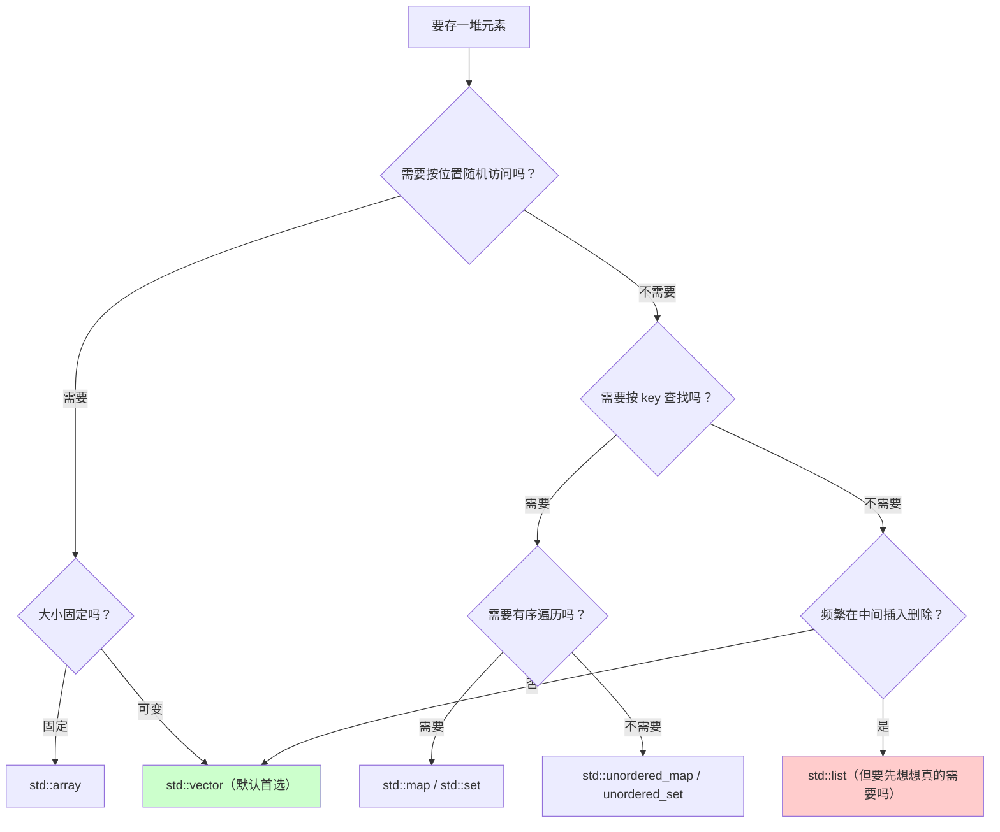

+++
title = "第48章 C++速查手册（Cheat Sheet）"
weight = 480
date = "2026-03-29T21:03:00+08:00"
type = "docs"
description = ""
isCJKLanguage = true
draft = false
+++
# 第48章 C++速查手册（Cheat Sheet）

前面 47 章把该讲的知识点都讲完了。但真正写代码的时候，你不会去翻一章 3000 行的教程——你需要的是**一张表**：类型多大、格式符怎么写、报错是什么意思、这个容器该不该选。

本章就是为此准备的。它不教你新东西，只帮你**快速回忆**和**快速查证**。

> ✅ **本章的可靠性说明**：本章所有"实测"结论都来自 **Apple clang 21（libc++）+ `-std=c++23`/`-std=c++26`**，在 macOS（Apple 芯片）上运行得出。其中类型大小、库可用性这类结论**换了平台就会变**，请注意表头标注。

---

## 48.1 编译与运行速查

```bash
# 最常用的三条命令
clang++ -std=c++23 -Wall -Wextra -O2 -o app main.cpp   # 编译
./app                                                  # 运行
clang++ -std=c++23 -Wall -Wextra -g -fsanitize=address,undefined -o app_dbg main.cpp   # 带检查的调试版
```

| 目的 | clang++ | g++ | 说明 |
|---|---|---|---|
| 指定标准 | `-std=c++23` | `-std=c++23` | C++26 早期实现用 `-std=c++26` 或 `-std=c++2c` |
| 打开警告 | `-Wall -Wextra` | 同 | 再加 `-Wpedantic` 检查语言扩展 |
| 优化 | `-O0` / `-O2` / `-O3` / `-Os` | 同 | 调试用 `-O0 -g`，发布用 `-O2` |
| 调试信息 | `-g` | 同 | 配合 lldb/gdb |
| 地址检查 | `-fsanitize=address` | 同 | 抓越界、悬垂指针、泄漏 |
| 未定义行为检查 | `-fsanitize=undefined` | 同 | 抓整数溢出、空指针解引用 |
| 线程检查 | `-fsanitize=thread` | 同 | 抓数据竞争（**不能**和 address 一起用） |
| 只做语法检查 | `-fsyntax-only` | 同 | 不生成目标文件，检查最快 |
| 只看预处理结果 | `-E` | 同 | 排查宏展开问题 |
| 生成汇编 | `-S` | 同 | 看编译器到底生成了什么 |
| 链接库 | `-lfoo -L/path` | 同 | 顺序敏感：被依赖的库放后面 |
| 显示完整命令 | `-###` | `-v` | 看编译器实际调用了什么 |

> 💡 **一条经验**：**永远先加 `-Wall -Wextra`**。编译器免费帮你看代码，别浪费。

---

## 48.2 类型速查：大小、范围与格式化

### 本机实测大小（macOS / Apple 芯片 / 64 位）

| 类型 | 大小 | 范围（近似） | `printf` | `std::format` |
|---|---|---|---|---|
| `char` | 1 | −128 ~ 127（是否有符号是实现定义） | `%c` | `{:c}` |
| `signed char` / `unsigned char` | 1 | −128~127 / 0~255 | `%hhd` / `%hhu` | — |
| `short` | 2 | −32768 ~ 32767 | `%hd` | — |
| `int` | 4 | ±2.1×10⁹ | `%d` | `{:d}` |
| `unsigned` | 4 | 0 ~ 4.29×10⁹ | `%u` | `{:d}` |
| `long` | 8 | ±9.2×10¹⁸ | `%ld` | — |
| `long long` | 8 | ±9.2×10¹⁸ | `%lld` | — |
| `float` | 4 | 约 7 位有效数字 | `%f` | `{:.2f}` |
| `double` | 8 | 约 15~16 位有效数字 | `%f` | `{}` |
| `long double` | **8**（macOS） | 同 `double`（x86 Linux 上常为 16） | `%Lf` | — |
| `bool` | 1 | true/false | —（用 `%d` 打印） | `{}` |
| `std::size_t` | 8 | 无符号 | `%zu` | — |
| `std::ptrdiff_t` | 8 | 有符号 | `%td` | — |
| 指针 | 8 | — | `%p` | `{}` |

### 格式化要点

```cpp
#include <cstdio>
#include <format>
#include <iostream>

int main() {
    // printf：靠"格式符"对齐类型，写错了是 UB（不会报错，只会出怪结果）
    std::printf("%d %u %zu %lld %.2f %c %s %p\n",
                -1, 1u, sizeof(int), 1LL, 3.14159, 'A', "text", (void*)nullptr);

    // std::format（C++20）：靠"类型"检查，写错了编译期就报错
    std::cout << std::format("{}\n", 42);                     // 42
    std::cout << std::format("{:d} {:x} {:#x}\n", 255, 255, 255);   // 255 ff 0xff
    std::cout << std::format("{:.2f} {:>8} {:08.3f}\n", 3.14159, "hi", 3.14159);
    // 3.14       hi 0003.142
    std::cout << std::format("{:L}\n", 1234567);              // 按 locale 加千位分隔符
}
```

| 想要的效果 | `printf` | `std::format` |
|---|---|---|
| 十进制整数 | `%d` | `{:d}` |
| 十六进制 | `%x` / `%#x` | `{:x}` / `{#x}` |
| 保留两位小数 | `%.2f` | `{:.2f}` |
| 右对齐宽度 8 | `%8d` | `{:>8}` |
| 补零到 8 位 | `%08d` | `{:08d}` |
| 本地化数字 | 无直接支持 | `{:L}` |

> ⚠️ **提醒**：`%zu` 对应 `size_t`，`%lld` 对应 `long long`。类型和格式符不匹配是**未定义行为**——很多"printf 输出乱码"的锅都在这里。写 C++ 时优先用 `std::format` 或 `std::cout`，让类型检查帮你挡枪。

---

## 48.3 声明、初始化与关键字

### 四种初始化形式

```cpp
int a = 3.14;      // ① 拷贝初始化：可能发生隐式窄化（3.14 → 3），不推荐
int b(3.14);       // ② 直接初始化：同样可能窄化
int c{3.14};       // ③ 列表初始化：❌ 编译错误（防止窄化）——推荐
int d{};           // ④ 值初始化：d == 0
```

**结论：优先用 `{}`（列表初始化）。** 它最大的优点是**不允许窄化**，其次能避免"最令人头疼的解析"（`Type x();` 是函数声明，不是变量定义）。

### 常量关键字对照

| 关键字 | 含义 | 何时求值 | 典型用途 |
|---|---|---|---|
| `const` | "我保证不修改" | 运行期（可能是常量） | 参数、成员、局部只读 |
| `constexpr` | "可以在编译期求值" | 尽可能编译期 | 常量、constexpr 函数、数组大小 |
| `consteval` | "**必须**在编译期求值" | 只能编译期 | 编译期检查、生成数据 |
| `constinit` | "必须在编译期完成初始化" | 初始化期 | 避免静态初始化顺序问题 |

```cpp
constexpr int n = 10;              // 编译期常量
const int m = 20;                  // 可能只是运行期常量
consteval int sq(int x) { return x * x; }
static_assert(sq(5) == 25);
```

### 类型推导

| 写法 | 结果 |
|---|---|
| `auto x = expr;` | 按值推导，**会丢掉引用和顶层 const** |
| `auto& y = expr;` | 推导为引用 |
| `const auto& z = expr;` | 万能"只读引用"，不产生拷贝 |
| `decltype(expr)` | 完全保留类型和值类别（`decltype((x))` 得到引用） |
| `decltype(auto)` | 用 `decltype` 的规则推导返回类型（常用于完美转发） |

```cpp
int v = 1;
auto   a = v;        // int
auto&  b = v;        // int&
decltype(v)  c = v;  // int
decltype((v)) d = v; // int&（多了一层括号）
```

### 结构化绑定

```cpp
#include <map>
#include <iostream>
#include <string>
#include <tuple>

int main() {
    std::pair<int, std::string> p{1, "one"};
    auto [id, name] = p;                 // 拷贝
    auto& [id2, name2] = p;              // 引用，改 id2 就是改 p.first

    std::map<std::string, int> m{{"a", 1}};
    for (const auto& [key, value] : m) {   // 最常用的写法
        std::cout << key << " = " << value << '\n';
    }

    std::cout << id << ' ' << name << ' ' << id2 << ' ' << name2 << '\n';
}
```

---

## 48.4 运算符优先级（由高到低）

| 级别 | 运算符 | 结合性 |
|---|---|---|
| 1 | `::` | 左 |
| 2 | `a++` `a--`、`f()`、`a[]`、`a.b`、`a->b` | 左 |
| 3 | `++a` `--a`、`+a` `-a`、`!` `~`、`(T)` 强制转换、`*a`、`&a`、`sizeof`、`new`、`delete`、`co_await` | 右 |
| 4 | `.*` `->*`（成员指针） | 左 |
| 5 | `*` `/` `%` | 左 |
| 6 | `+` `-` | 左 |
| 7 | `<<` `>>` | 左 |
| 8 | `<=>` | 左 |
| 9 | `<` `<=` `>` `>=` | 左 |
| 10 | `==` `!=` | 左 |
| 11 | `&`（按位与） | 左 |
| 12 | `^` | 左 |
| 13 | `|` | 左 |
| 14 | `&&` | 左 |
| 15 | `||` | 左 |
| 16 | `?:`、`=` 及复合赋值、`throw`、`co_yield` | 右 |
| 17 | `,` | 左 |

> 💡 **别背**。记住两条就够了：
> 1. **乘除 > 加减 > 移位 > 比较 > 位运算 > 逻辑运算 > 赋值**；
> 2. 不确定就加括号。`a & 0xF == 0` 会先算 `==`（比较优先级高于按位与），这是个经典陷阱。

---

## 48.5 类型转换

| 转换 | 用途 | 危险度 |
|---|---|---|
| `static_cast<T>(x)` | 数值转换、上行转型、`void*`↔`T*`、调用 `explicit` 构造函数 | 低（编译期检查） |
| `dynamic_cast<T*>(p)` | 多态类型的**下行转型/交叉转型**，失败返回 `nullptr`（引用版抛 `bad_cast`） | 低（需 RTTI） |
| `const_cast<T>(x)` | 去掉/加上 `const` | **高**（改真正常量对象是 UB） |
| `reinterpret_cast<T>(x)` | 重新解释位模式 | **最高**（几乎不保证可移植） |
| C 风格 `(T)x` | 依次尝试上述几种 | 别用，看不出意图 |

```cpp
double d = 3.9;
int i = static_cast<int>(d);          // 3（截断，不是四舍五入）

struct Base { virtual ~Base() = default; };
struct Derived : Base { int v = 1; };

void f(Base* b) {
    if (auto* p = dynamic_cast<Derived*>(b)) {   // 失败返回 nullptr
        (void)p->v;
    }
}
```

**隐式转换的常见顺序**：整型提升 → 整型转换 → 浮点转换 → 浮点-整型互转 → 指针转换 → 布尔转换 → 用户定义转换。

> ⚠️ **两个高频坑**：
> 1. **有符号/无符号混用**：`-1 < 1u` 是 `false`，因为 `-1` 被转成了很大的无符号数；开着 `-Wall` 一般会警告 `-Wsign-compare`。
> 2. **`explicit` 构造函数**：单参数构造函数默认可以隐式转换，容易埋雷，记得加 `explicit`。

---

## 48.6 指针、引用与智能指针

| 你想表达的所有权 | 用什么 |
|---|---|
| 独占所有权 | `std::unique_ptr<T>`（`std::make_unique<T>(...)`） |
| 共享所有权 | `std::shared_ptr<T>`（`std::make_shared<T>(...)`） |
| 观察共享对象、不延长生命周期 | `std::weak_ptr<T>`（用 `lock()` 临时提升） |
| 不拥有，但可能为空 | 裸指针 `T*` |
| 不拥有，且一定不为空 | 引用 `T&`（参数传递首选） |

```cpp
#include <memory>

void use(const Widget& w);                     // 只读借用：const 引用
void maybe(Widget* w) { if (w) use(*w); }      // 可能为空：指针

auto owned = std::make_unique<Widget>();       // 独占
auto shared = std::make_shared<Widget>();      // 共享
std::weak_ptr<Widget> weak = shared;           // 观察
if (auto locked = weak.lock()) { /* 还活着 */ }
```

| 对比项 | 指针 `T*` | 引用 `T&` |
|---|---|---|
| 可以为空 | ✅ | ❌ |
| 可以改指向 | ✅ | ❌ |
| 必须初始化 | ❌ | ✅ |
| 支持指针算术 | ✅ | ❌ |
| 作为参数含义 | "可能没有" | "一定有" |

> 💡 **经验法则**：**函数参数**能用 `const T&` 就用它；**需要表达"可能没有"**才用指针；**需要拥有**就用智能指针。裸的 `new`/`delete` 在现代 C++ 里应该绝迹。

---

## 48.7 标准库头文件索引

| 你想做的事 | 头文件 |
|---|---|
| 输入输出流 | `<iostream>` `<fstream>` `<sstream>` `<iomanip>` |
| 格式化输出 | `<format>`（C++20）、`<print>`（C++23） |
| 字符串 | `<string>` `<string_view>` |
| 容器 | `<vector>` `<array>` `<deque>` `<list>` `<forward_list>` `<map>` `<set>` `<unordered_map>` `<unordered_set>` `<stack>` `<queue>` |
| 算法与数值 | `<algorithm>` `<numeric>` `<ranges>` |
| 智能指针与内存 | `<memory>` `<memory_resource>` `<scoped_allocator>` |
| 可选值/错误 | `<optional>` `<variant>` `<any>` `<expected>`（C++23） |
| 时间与随机 | `<chrono>` `<random>` |
| 文件系统 | `<filesystem>` |
| 并发 | `<thread>` `<mutex>` `<condition_variable>` `<atomic>` `<future>` `<latch>` `<barrier>` `<semaphore>` |
| 协程 | `<coroutine>` `<generator>`（C++23，本机暂无） |
| 位运算 | `<bit>` `<cstdint>` |
| 类型特征 | `<type_traits>` `<concepts>` |
| 编译期辅助 | `<version>` `<source_location>` |

---

## 48.8 容器选择表

| 容器 | 结构 | 随机访问 | 中间插入/删除 | 查找 | 内存连续性 |
|---|---|---|---|---|---|
| `vector` | 动态数组 | ✅ O(1) | ❌ O(n) | 线性 O(n) | ✅ |
| `array` | 定长数组 | ✅ O(1) | ❌ | 线性 | ✅ |
| `deque` | 分段连续 | ✅ O(1) | 两端 O(1) | 线性 | ❌ |
| `list` | 双向链表 | ❌ | ✅ O(1)（已知位置） | 线性 | ❌ |
| `forward_list` | 单向链表 | ❌ | ✅ O(1) | 线性 | ❌ |
| `map` / `set` | 红黑树 | ❌ | O(log n) | ✅ O(log n)，有序 | ❌ |
| `unordered_map` / `unordered_set` | 哈希表 | ❌ | 平均 O(1) | ✅ 平均 O(1)，无序 | ❌ |
| `flat_map` / `flat_set`（C++23） | 排序的连续存储 | ✅ | O(n) | ✅ O(log n)，缓存友好 | ✅ |
| `stack` / `queue` / `priority_queue` | 容器适配器 | ❌ | — | — | 取决于底层容器 |

### 一句话决策



> 💡 **最重要的一条**：**默认用 `std::vector`**。它的连续内存带来的缓存友好性，通常比"理论复杂度更优"重要得多。链表看起来很美好，实际用起来经常更慢。

---

## 48.9 算法与 lambda 速查

### 常用算法（`<algorithm>`）

| 目的 | 算法 |
|---|---|
| 查找 | `find` `find_if` `count` `count_if` `binary_search` `lower_bound` `upper_bound` `equal_range` |
| 排序 | `sort` `stable_sort` `partial_sort` `nth_element` |
| 修改 | `fill` `copy` `copy_if` `transform` `replace` `remove` `remove_if` `unique` |
| 判断 | `all_of` `any_of` `none_of` `equal` `is_sorted` |
| 最值 | `min_element` `max_element` `clamp` |
| 数值（`<numeric>`） | `accumulate` `reduce` `iota` `inner_product` `partial_sum` |

```cpp
#include <algorithm>
#include <iostream>
#include <numeric>
#include <ranges>
#include <vector>

int main() {
    std::vector<int> v{5, 2, 9, 1, 7};
    std::ranges::sort(v);                     // C++20 的 ranges 版，直接传容器

    auto evens = v | std::views::filter([](int x){ return x % 2 == 0; });  // 惰性视图
    for (int x : evens) std::cout << x << ' ';      // 2
    std::cout << '\n';

    std::cout << std::accumulate(v.begin(), v.end(), 0) << '\n';   // 24
}
```

### lambda 语法速查

```cpp
auto f1 = []{ return 1; };                          // 无参数
auto f2 = [](int x){ return x * 2; };               // 有参数
auto f3 = [](int x) -> long { return x; };          // 指定返回类型
int n = 10;
auto f4 = [n](int x){ return x + n; };              // 按值捕获
auto f5 = [&n](int x){ n += x; };                   // 按引用捕获
auto f6 = [=, &n]{ return n; };                     // 其余按值，n 按引用
auto f7 = [p = std::move(ptr)]{ return *p; };       // 初始化捕获（C++14）
auto f8 = [](auto x){ return x; };                  // 泛型 lambda（C++14）
auto f9 = [](this auto&& self, int x){ return x; }; // 显式对象参数（C++23）
```

---

## 48.10 类：特殊成员函数与继承

### Rule of 0 / 3 / 5

| 原则 | 含义 |
|---|---|
| **Rule of 0** | 不写任何特殊成员函数，靠成员自己管理资源——**首选** |
| **Rule of 3** | 如果要写析构函数、拷贝构造、拷贝赋值中的**任意一个**，通常三个都要写 |
| **Rule of 5** | 再加上移动构造、移动赋值（写 = 支持移动语义） |

```cpp
// Rule of 5 的手写签名
class Resource {
public:
    Resource();                                        // 构造
    ~Resource();                                       // 析构
    Resource(const Resource&);                         // 拷贝构造
    Resource& operator=(const Resource&);              // 拷贝赋值
    Resource(Resource&&) noexcept;                     // 移动构造
    Resource& operator=(Resource&&) noexcept;           // 移动赋值
};
```

### 显式声明（= default / = delete）

```cpp
class NonCopyable {
public:
    NonCopyable() = default;
    NonCopyable(const NonCopyable&) = delete;             // 禁止拷贝
    NonCopyable& operator=(const NonCopyable&) = delete;
    void legacy() = delete("请改用 newApi()");             // C++26：删除时给出理由
};
```

### 继承要点

| 要点 | 说明 |
|---|---|
| `virtual` 析构 | 多态基类必须有虚析构，否则 `delete` 基类指针是 UB |
| `override` | 重写虚函数**必须写**，写错了编译器会告诉你 |
| `final` | 禁止继续继承/重写 |
| `dynamic_cast` | 只有当基类**至少有一个虚函数**时才能用（需要 RTTI） |
| 继承构造函数 | `using Base::Base;` —— 注意：**其他基类必须能默认构造**，否则被继承的构造函数会被隐式删除 |

---

## 48.11 模板与 concepts 速查

```cpp
#include <concepts>
#include <iostream>
#include <vector>

// 函数模板 + 约束（C++20）
template <std::integral T>
T twice(T x) { return x * 2; }

// 可变参数模板 + 折叠表达式（C++17）
template <typename... Ts>
auto sum(const Ts&... xs) { return (xs + ... + 0); }

// if constexpr：编译期分支（C++17）
template <typename T>
void describe(const T& v) {
    if constexpr (std::is_integral_v<T>) {
        std::cout << "整数: " << v << '\n';
    } else {
        std::cout << "其他类型\n";
    }
}

// 可简写的约束（C++20）
void only_ints(std::integral auto x) { (void)x; }

int main() {
    std::cout << twice(21) << '\n';      // 42
    std::cout << sum(1, 2, 3) << '\n';   // 6
    describe(7);
}
```

| 术语 | 说明 |
|---|---|
| 模板参数推导 | 从实参推出 `T`；注意**推导时不会发生隐式转换**（`max(1, 2.0)` 推不出来） |
| 显式实例化 | `template class Foo<int>;` |
| 特化 | `template<> struct Foo<int> { ... };` |
| SFINAE | 替换失败不是错误（老式约束手段，现在优先用 concepts） |
| concepts | 给类型加"要求"，错误信息会友好得多 |
| 折叠表达式 | `(args + ...)`、`(... + args)`、`(args + ... + init)`、`(init + ... + args)` |

---

## 48.12 编译错误解码器

下表是你在本书各章最可能撞见的错误，以及它们**真正的意思**：

| 编译器说 | 通常意味着 | 怎么修 |
|---|---|---|
| `use of undeclared identifier 'std'` | 忘了 `#include` 相关头文件 | 加 `#include <iostream>` 等 |
| `no member named 'cout' in namespace 'std'` | 少包含 `<iostream>` | 同上 |
| `expected ';' after ...` | 上一行少了分号（错误位置常指向**下一行**） | 看**上一行**结尾 |
| `expected unqualified-id` | 括号/大括号不配对，或语句写在了函数外面 | 检查配对与位置 |
| `no matching function for call to 'f'` | 参数类型/个数不对 | 看候选函数列出的签名 |
| `function definition is not allowed here` | 在函数里面定义了函数 | 把内层函数移到外面 |
| `undefined reference to 'f'` | **链接错误**：只有声明没有定义，或没链接库 | 补定义 / 加 `-l`；模板定义要放头文件 |
| `multiple definition of 'x'` | 头文件里定义了非 `inline` 的全局对象/函数 | 加 `inline`，或改为声明放头、定义放源 |
| `invalid use of incomplete type` | 只前置声明了类型就用了它（例如 `unique_ptr<T>` 的析构） | 补 `#include`；`unique_ptr` 的析构要在能看到完整类型处 |
| `constexpr variable must be initialized by a constant expression` | 用来初始化的表达式不是编译期常量 | 检查是否用了非 `constexpr` 函数、`goto`、异常等 |
| `consteval if is always true in an immediate context` | 在 `consteval` 函数里用了 `if consteval` | 把函数改成 `constexpr`，或删掉 `if consteval` |
| `'nodiscard' attribute cannot be applied to types` | 把 `[[nodiscard]]` 写在了 lambda 参数表后面 | 改用具名的函数对象（见 27.7） |
| `hex escape sequence out of range` | 十六进制转义超出**一个字节**（如 `"\x{20AC}"`） | 想写"字符"要用 `\u{...}`（见 27.20） |
| `character too large for enclosing character literal type` | 字符字面量装不下该码点（如 `char c = '\u{20AC}'`） | 用字符串或 `char32_t` |
| `cannot form a reference to 'void'` | 把 `void` 当成了类型用 | 检查模板实参 / 函数返回类型 |
| `comparison between two arrays is ill-formed in C++26` | 直接比较了两个数组 | 用 `std::array`/`std::equal`（见 29.18） |
| `warning: unused variable` | 变量声明了没用 | 用 `[[maybe_unused]]`、`(void)x`，或直接删掉 |
| `error: 'x' file not found` | 缺头文件：第三方库或标准库尚未实现 | 装依赖，或用特性测试宏分支 |

> 💡 **读错误的三条法则**：
> 1. **从第一个错误开始修**。后面的错误常常是它引起的连锁反应（"级联错误"）。
> 2. **看列号指向的那个符号**，不要只看行。
> 3. 模板错误先看**最后一行的 "in instantiation of"**，它会告诉你是哪次实例化引爆的。

---

## 48.13 四种"不那么规则"的行为

| 类别 | 含义 | 例子 |
|---|---|---|
| **未定义行为（UB）** | 标准不做任何保证，编译器可以任意处理 | 越界访问、有符号整数溢出、解引用空指针、读取未初始化值 |
| **未指定行为（Unspecified）** | 标准给出多种可能，实现自己选，但不必说明 | 函数实参求值顺序、`a[i] = i++` 里 `i` 的求值顺序 |
| **实现定义行为（Implementation-defined）** | 实现必须选一个并**写进文档** | `sizeof(int)`、`char` 是否有符号、右移负数 |
| **错误行为（Erroneous，C++26）** | C++26 新引入的中间类别：**不要求诊断，但要求"不许乱来"** | 读取未初始化的 `int`（UB 被"降级"为错误行为） |

```cpp
// 1. 有符号溢出 = UB；无符号溢出 = 良好定义（按 2^n 取模）
unsigned u = 0u - 1u;      // ✅ 良好定义：UINT_MAX
// int i = INT_MAX; i += 1;   // ❌ UB

// 2. UB 最可怕的地方：编译器会"假设它不会发生"，从而删掉你的检查
int f(int* p) {
    int x = *p;      // 如果 p 是空的，这里是 UB
    if (p == nullptr) return 0;   // 编译器可能把这一行整个删掉！
    return x;
}
```

> ⚠️ **送你一句话**：**UB 不是"运行时会崩"，而是"编译器可以假设它永远不会发生"。** 所以 UB 的真实表现往往是"你的判空代码被优化掉了"。

---

## 48.14 C++ 版本特性速查

| 版本 | 语言 | 标准库 |
|---|---|---|
| **C++11** | `auto`、`nullptr`、lambda、右值引用/移动语义、`constexpr`、`enum class`、可变参数模板 | `<thread>` `<mutex>` `<unordered_*>` `<array>` `<tuple>` `<chrono>` `<random>` |
| **C++14** | 泛型 lambda、`auto` 返回类型推导、变量模板、`[[deprecated]]` | `<shared_mutex>`（`shared_timed_mutex`；`shared_mutex` 本体是 C++17）、`std::make_unique` |
| **C++17** | 结构化绑定、`if constexpr`、折叠表达式、类模板实参推导（CTAD）、内联变量、`[[nodiscard]]` | `<optional>` `<variant>` `<any>` `<string_view>` `<filesystem>` 并行算法 |
| **C++20** | concepts、ranges、协程、modules、三路比较 `<=>`、`consteval`、指定初始化器 | `<ranges>` `<span>` `<bit>` `<format>` `<numbers>` `<source_location>` `<latch>` `<semaphore>` |
| **C++23** | 显式对象参数（deducing this）、`if consteval`、多维下标、`static operator()`/`[]`、`auto(x)`、`[[assume]]`、`size_t` 的 `z` 后缀、`\N{...}`/`\u{...}` 转义、UTF-8 改进 | `<expected>` `<mdspan>` `<print>` `<flat_map>` `<flat_set>` `<stacktrace>` `<generator>` `<stdfloat>` `<spanstream>` |
| **C++26** | 反射（`^^`）、契约（`contract_assert`/`pre`/`post`）、包索引、`= delete("理由")`、`[[indeterminate]]`、Unicode 标识符、数组比较变错误 | `<meta>` `<hive>` `<inplace_vector>` `<simd>` `<execution>`、`std::optional<T&>`、`std::function_ref` |

> 📌 **注意**：上表是"标准里有什么"，**不等于"你的编译器实现了什么"**。见下一节。

---

## 48.15 本机实测：Apple clang 21 + libc++ 的可用性

**语言特性**（`-std=c++23` / `-std=c++26` 实测）：

| 特性 | 状态 |
|---|---|
| C++11~C++20 语言特性 | ✅ 基本齐全 |
| 显式对象参数、`if consteval`、多维下标、`static operator()`/`[]` | ✅ |
| `\N{...}`、`\u{...}`、`\x{...}` 定界转义 | ✅（需 `-std=c++23`） |
| 包索引、结构化绑定作为条件、`= delete("理由")` | ✅（需 `-std=c++26`） |
| `[[indeterminate]]` | ⚠️ 语法接受但**属性被忽略**（无效果） |
| 契约 `contract_assert`、反射 `^^`、`#embed` | ❌ 未实现 |
| constexpr 异常、constexpr placement new | ❌ 未实现 |

**标准库头文件**（`-std=c++23` 实测）：

| 可用 ✅ | 缺失 ❌ |
|---|---|
| `<expected>` `<mdspan>` `<print>` `<format>` `<flat_map>` `<flat_set>` `<latch>` `<barrier>` `<semaphore>` `<source_location>` `<numbers>` `<bit>` `<span>` | `<stacktrace>` `<generator>` `<stdfloat>` `<spanstream>` `<bytes>` `<simd>` `<hive>` `<inplace_vector>` `<syncstream>`（头文件在，但 `std::osyncstream` 没实现） |

> ⚠️ `<execution>` 的情况比较特殊：头文件存在，但只有基本的执行策略类型名，
> `std::execution::par` 等并行策略**没有实现**，写成 `std::sort(std::execution::par, ...)` 会报
> `no member named 'par' in namespace 'std::execution'`。

> ⚠️ **`<execution>` 是个陷阱**：头文件**存在**，能 `#include` 成功，但里面**没有** `std::execution::par` / `par_unseq` / `unseq`。只检查"头文件在不在"会得出错误结论，必须实际用一下才知道。这说明：**用 `echo '#include <xxx>' | clang++ -fsyntax-only -` 只能验证头文件，验证不了符号。**

**缺失的具体实体**：`std::move_only_function`、`std::function_ref`、`std::execution::par`（及 `seq`/`unseq`/`par_unseq`）、`std::views::as_const` —— 这些在本机 libc++ 里都还没有。

> 💡 **怎么自己验证**：
> - 查头文件在不在：`echo '#include <stacktrace>' | clang++ -std=c++23 -x c++ -fsyntax-only -`
> - 查**符号**在不在（更严格，能抓出 `<execution>` 这种"空壳头文件"）：
>   `echo '#include <execution>
>   int main(){ auto p = std::execution::par; (void)p; }' | clang++ -std=c++23 -x c++ -fsyntax-only -`
> - 查特性宏：`#include <version>` 然后 `#ifdef __cpp_lib_xxx`
>
> 这两种方式比任何教程都可靠——包括本章。

---

## 48.16 交卷前的自检清单

写完一段 C++ 代码，花 30 秒过一遍这张表：

- [ ] 编译时开着 `-Wall -Wextra`，**没有任何警告**？
- [ ] 所有 `#include` 都写了？（不要靠"别的头文件恰好带进来了"）
- [ ] 常量用了 `constexpr` 而不是魔法数字？
- [ ] 参数用了 `const T&`（除非确实需要拷贝或修改）？
- [ ] 资源用 RAII 管理，没有裸 `new`/`delete`？
- [ ] 多态基类有 `virtual ~Base()`？
- [ ] 重写虚函数写了 `override`？
- [ ] 没有"有符号/无符号比较"？
- [ ] 没有返回局部变量的引用/指针？
- [ ] 容器默认选了 `std::vector`（而不是无脑 `list`）？
- [ ] 迭代器失效的风险考虑过了？（`vector` 扩容会让迭代器失效）
- [ ] 用 `-fsanitize=address,undefined` 跑过一遍测试？
- [ ] 代码里的"未初始化变量"都没有（C++26 开始属于错误行为）？

> 🎯 **最后**：速查表能帮你回忆，但**不能替你思考**。真正让代码变好的，是理解每个选择背后的权衡——而这正是前面 47 章在做的事。祝你写代码顺利！

---

*本章完*
