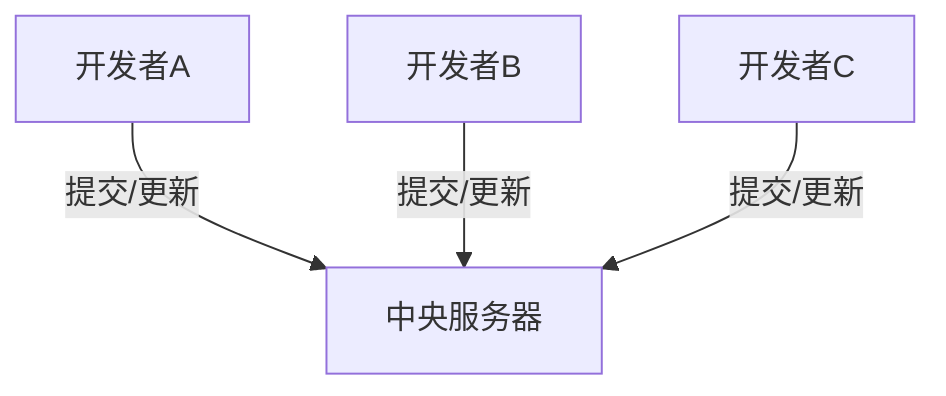
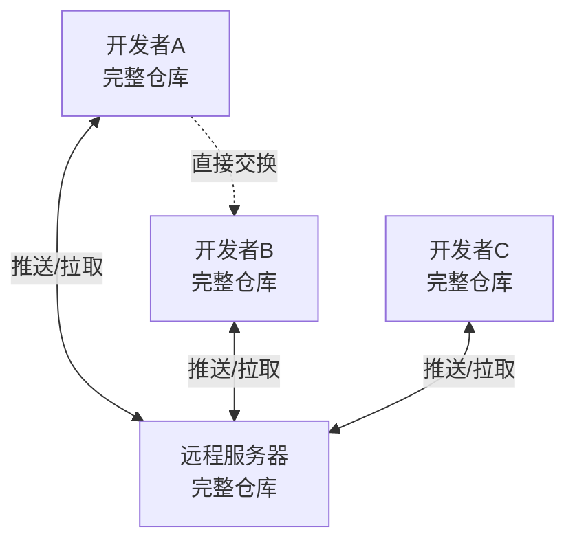
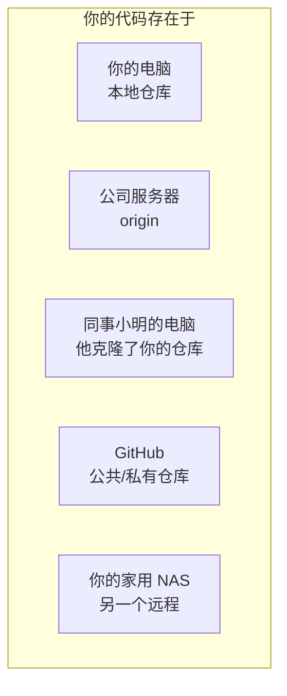
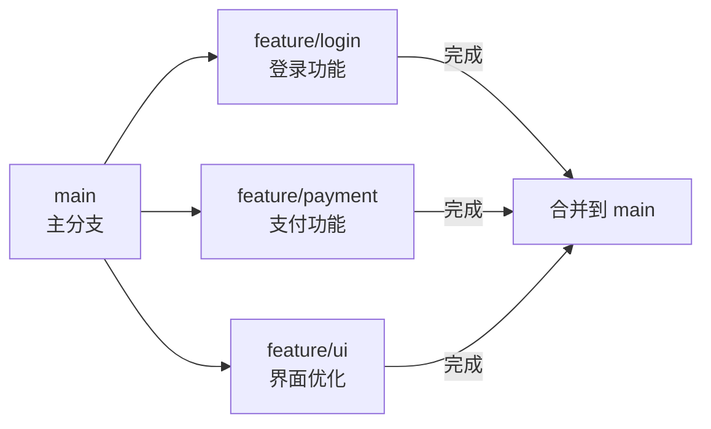
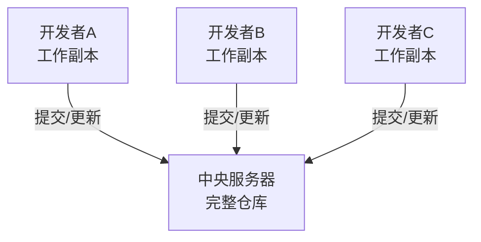
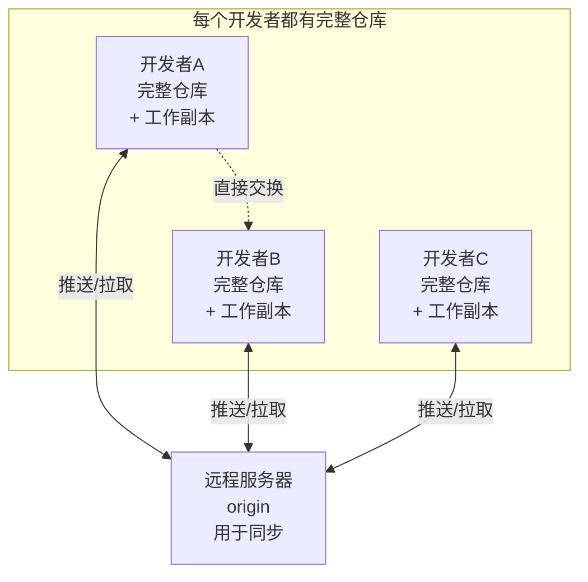
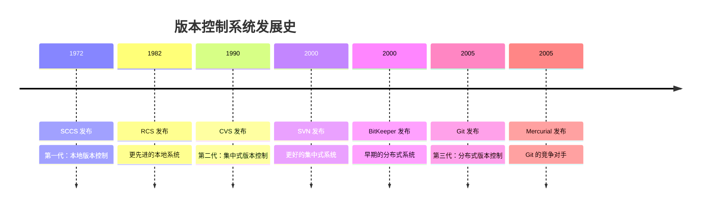
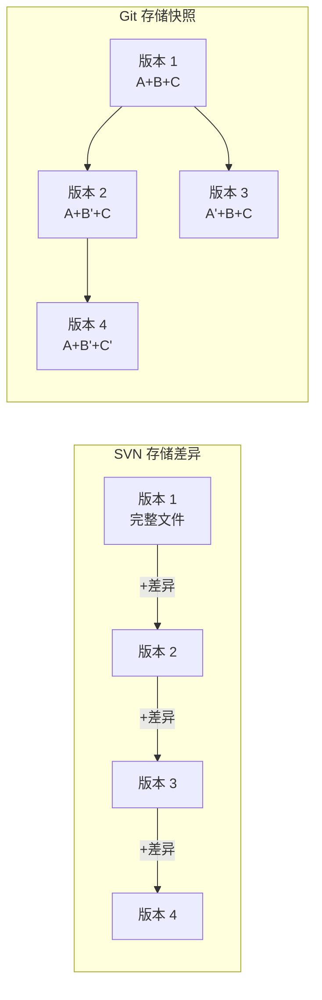
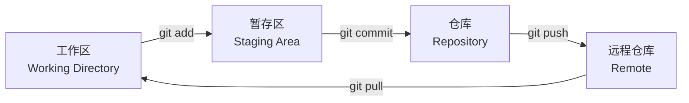

+++
title = "第1章：没有 Git 的世界，是一场灾难片"
weight = 10
date = 2026-04-03T19:36:48+08:00
type = "docs"
description = ""
isCJKLanguage = true
draft = false
+++
# 第1章：没有 Git 的世界，是一场灾难片

> *"在 Git 出现之前，程序员们都是在黑暗中摸索的勇士——只不过他们摸索的是无数个'最终版'文件夹。"*

---

## 1.1 文件命名地狱：论文_最终版_真的最终_打死不改版_被打脸了.docx

如果你曾经用 Word 写过论文，或者和团队一起编辑过文档，你一定见过这样的文件名：

```
论文.docx
论文_最终版.docx
论文_最终版_真的最终.docx
论文_最终版_真的最终_打死不改版.docx
论文_最终版_真的最终_打死不改版_被打脸了.docx
论文_最终版_真的最终_打死不改版_被打脸了_这次是真的.docx
...
```

这不仅仅是一个笑话，这是**版本控制缺失**的真实写照。

### 什么是版本控制？

**版本控制**（Version Control）是一种记录文件变化历史的系统，让你可以：
- 查看文件过去的任何状态
- 知道谁在什么时候改了什么
- 轻松回退到之前的版本
- 多人协作不打架

没有版本控制，我们就只能靠**文件命名艺术**来区分版本。但问题是——

### 文件命名的三大噩梦

**噩梦一：记忆负担**

你能记住 `论文_3月15日_下午_老板看过_改了一半_还没保存_副本.docx` 和 `论文_3月15日_下午_老板看过_改了一半_还没保存_副本_副本.docx` 的区别吗？不能。一周后，你连哪个是"真的最终版"都分不清。

**噩梦二：沟通灾难**

"你用哪个版本？"
"我用的'最终版'。"
"哪个'最终版'？"
"就是...那个'真的最终版'。"
"我有三个'真的最终版'！"

**噩梦三：存储爆炸**

每个"最终版"都是一个完整的文件副本。一篇 10MB 的论文，改了 20 次，就占用了 200MB 空间。而实际上，**真正改变的内容可能只有几百字节**。

### 这不仅仅是论文的问题

程序员的世界更惨：

```
main.c
main_backup.c
main_backup_2024.c
main_backup_2024_working.c
main_backup_2024_working_DONT_DELETE.c
main_backup_2024_working_DONT_DELETE_SERIOUSLY.c
main_backup_2024_working_DONT_DELETE_SERIOUSLY_final.c
...
```

然后某天你删除了一个"旧文件"，结果发现那是生产环境正在用的版本。

### 古老的解决方案：RCS

早在 1982 年，就有人受不了这种混乱了。Walter F. Tichy 开发了 **RCS**（Revision Control System，修订控制系统），它用了一种聪明的办法：

```
原始文件: main.c
RCS 存储: main.c,v  (包含所有历史版本)
```

RCS 把文件的**变化**（diff）存储起来，而不是存完整的副本。这样 20 个版本可能只占 11MB 而不是 200MB。

但 RCS 有个致命缺陷：**只能本地使用**，而且**一次只能一个人编辑**。

想象一下：你和同事都在改代码，RCS 就像一个只能坐一个人的小马桶——谁先坐上去，谁就能用，其他人只能在外面干着急。

### 小结

文件命名地狱的本质是：**人类不擅长记忆，更不擅长预测未来**。我们以为"最终版"就是终点，但现实总是无情地打脸。

你需要一个系统，它能：
- 自动记录每次修改
- 让你随时回到过去
- 清楚地告诉你"这是什么版本"
- 不需要你起那些可笑的文件名

这个系统，就是版本控制系统。而 Git，是目前世界上最流行的那个。

---

## 1.2 代码覆盖惨案：同事把你的杰作一键清零

想象一下这个场景：

你花了整整一周，重构了公司的核心模块。代码优雅得像一首诗，注释详细得像一本小说，测试覆盖率 100%。你满意地保存文件，关上电脑，准备周末好好休息一下。

周一早上，你兴冲冲地打开项目，准备给同事展示你的杰作。

然后你看到了这个：

```
文件已修改：2024-03-18 09:15
修改人：隔壁老王
```

你颤抖着打开文件，发现——

**你的代码没了。**

全部。没了。

取而代之的是老王"临时修复"的 200 行 `if-else` 嵌套，变量名是 `a`、`b`、`c`，注释写着"// 这里好像有问题"，以及一个硬编码的密码 `password123`。

### 为什么会这样？

在没有版本控制的时代，团队协作是这样的：

```
服务器上的共享文件夹
├── project/
│   ├── main.c          ← 大家直接编辑这个文件
│   ├── utils.c         ← 谁最后保存谁赢
│   └── config.h        ← 经常莫名其妙被覆盖
```

**没有锁机制**：任何人都可以随时编辑任何文件。

**没有合并机制**：A 和 B 同时改了一个文件？后保存的人覆盖先保存的人。就是这么简单粗暴。

**没有历史记录**：被覆盖了？恭喜，你的代码进入了数字天堂，永别了。

### 真实案例：NASA 的教训

1999 年，NASA 的火星气候轨道探测器（Mars Climate Orbiter）坠毁，损失 3.27 亿美元。

原因之一？两个团队使用不同的单位（英制 vs 公制），而**没有有效的版本控制和代码审查机制**来发现这个问题。

虽然这不是典型的"代码覆盖"问题，但它说明了同一个道理：**当多人协作缺乏有效管理时，灾难就会发生**。

### 古老的解决方案：加锁

早期的版本控制系统（如 RCS、SCCS）引入了**加锁机制**：

```
你想编辑 main.c？
↓
系统问："有人正在编辑吗？"
↓
如果有人："抱歉，请等待"
↓
如果没人："好的，锁给你，其他人只能看不能改"
```

这就像图书馆的"预约制"——书只有一本，谁预约到谁看。

**优点**：不会有人覆盖你的代码。

**缺点**：
- 效率低下：你想改一行注释，可能要等同事"释放"文件
- 容易死锁：同事休假了，文件还锁着，怎么办？
- 不灵活：你想改文件 A 和 B，但 A 被锁了，B 被另一个人锁了，你们俩都在等对方

### 更好的解决方案：合并

后来的系统（如 CVS、SVN）引入了**合并**（Merge）的概念：

```
A 改了 main.c 的第 10-20 行
B 改了 main.c 的第 50-60 行
↓
系统："你们改的地方不冲突，我帮你们合并"
↓
main.c 同时包含 A 和 B 的修改
```

但如果 A 和 B 改了同一行呢？

```
A: 第 10 行改成 "int x = 10;"
B: 第 10 行改成 "int x = 20;"
↓
系统："？？？你们打一架吧"
↓
产生冲突（Conflict），需要人工解决
```

这已经比"直接覆盖"好太多了，但 SVN 等**集中式版本控制系统**还有一个问题：**你必须联网才能工作**。

### 集中式 vs 分布式

**集中式**（如 SVN、CVS）：
- 有一个中央服务器，所有代码和历史都在那里
- 你每次修改都要和服务器通信
- 服务器挂了？大家放假
- 没网了？你只能看，不能提交



**分布式**（如 Git）：
- 每个开发者电脑上都有完整的代码仓库（包括全部历史）
- 你可以离线提交、查看历史、创建分支
- 服务器只是用来同步的"中转站"



### 小结

代码覆盖惨案的核心问题是：**多人协作时，如何安全地管理代码变更**。

从"谁最后保存谁赢"到"加锁机制"，再到"合并机制"，人类花了二十多年才找到相对完善的解决方案。

但故事还没完——

即使有了版本控制，如果你**改崩了代码，想回到昨天那个能运行的版本**，又该怎么办？

---

## 1.3 改崩了回不去：凌晨三点的绝望时刻

这是每个程序员都经历过的噩梦：

凌晨 3:17，你盯着屏幕，眼睛布满血丝。代码昨天还能跑，现在你改了"一点点"，它就彻底罢工了。

错误信息像天书一样：

```
Segmentation fault (core dumped)
```

或者：

```
undefined is not a function
```

或者最经典的：

```
It works on my machine.
```

**问题是：你到底改了什么？**

### 没有版本控制的绝望

你疯狂按 `Ctrl+Z`，但编辑器告诉你："已经到撤销历史的尽头了。"

你开始翻垃圾桶，看有没有昨天代码的备份。

你打开邮件，看有没有发给过同事旧版本。

你甚至开始考虑：要不要给前女友发消息，问她电脑里还有没有你三个月前发给她的截图？

**这就是没有版本控制的世界。**

### 版本控制的时间机器

版本控制系统最核心的功能，就是**时间机器**。

它记录了你代码的每一个状态，你可以随时：

```bash
# 查看昨天这个时候代码长什么样
git log --oneline --since="yesterday"

# 回到昨天那个能运行的版本
git checkout HEAD~1

# 查看某行代码是谁写的、什么时候写的
git blame main.c
```

想象一下，如果 Word 有这样的功能：

```
"论文_最终版_真的最终_打死不改版.docx"

你想查看 3 月 15 日下午 3 点的版本？
点击这里 → 时光倒流 → 选择时间点 → 完成

你想知道谁把"人工智能"改成了"人工智障"？
点击这里 → 查看历史 → 显示：张三，3月16日 14:23
```

这就是版本控制给程序员的超能力。

### 实际案例：拯救生产环境

假设你在维护一个电商网站，黑五促销期间，你推送了一个"小优化"。

然后网站挂了。订单无法提交。老板在群里疯狂 @你。

**没有 Git 的情况**：
- 你手忙脚乱地改代码，试图找出哪里出了问题
- 每改一次都要重新部署，祈祷这次能好
- 20 分钟后，网站终于恢复，但你已经一身冷汗

**有 Git 的情况**：

```bash
# 立即回滚到上一个稳定版本
git revert HEAD

# 或者切换到上一个提交
git checkout HEAD~1

# 部署，网站恢复，用时 30 秒
```

然后你可以泡杯咖啡，慢慢研究那个"小优化"到底哪里出了问题。

### 不只是回滚

版本控制不只是"后悔药"，它还是"侦探工具"。

**场景：某个功能昨天还能用，今天不行了**

```bash
# 找到从昨天到现在有哪些提交
git log --since="yesterday" --oneline

# 逐个检查，找出罪魁祸首
git bisect start
git bisect bad HEAD
git bisect good HEAD~10
# Git 会自动帮你二分查找，快速定位问题提交
```

**场景：这段代码为什么这么写？**

```bash
# 查看某行代码的历史
git log -p -S "某个函数名"

# 你会看到：
# - 谁写的
# - 什么时候写的
# - 当时为什么要这么写（提交信息里）
```

**场景：我想看看这个文件一个月前的样子**

```bash
# 查看特定时间点的文件
git show HEAD@{1.month.ago}:main.c

# 不需要备份，不需要翻邮件，一行命令搞定
```

### 提交信息的重要性

版本控制再强大，如果你写的是这样的提交信息：

```
commit 1a2b3c4d
Author: 张三 <zhangsan@example.com>
Date:   Mon Mar 15 23:45:00 2024

    改了点东西

commit 5e6f7g8h
Author: 张三 <zhangsan@example.com>
Date:   Mon Mar 15 22:30:00 2024

    修复 bug

commit 9i0j1k2l
Author: 张三 <zhangsan@example.com>
Date:   Mon Mar 15 21:15:00 2024

    update
```

那当你想"回到昨天那个能运行的版本"时，你根本不知道哪个提交是"能运行的"。

好的提交信息应该像这样：

```
commit 1a2b3c4d
Author: 张三 <zhangsan@example.com>
Date:   Mon Mar 15 23:45:00 2024

    修复购物车结算时的空指针异常
    
    当用户未登录时访问购物车，session 中的 userId 为 null，
    导致结算接口抛出 NullPointerException。
    
    修复：在结算前检查用户登录状态，未登录则跳转到登录页。
    
    Fixes: #1234
```

这样当你用 `git log` 查看时，一眼就能找到你要的版本。

### 小结

"改崩了回不去"的恐惧，驱使着程序员们：
- 频繁地手动备份（`main_backup_1.c`、`main_backup_2.c`...）
- 写代码时战战兢兢，生怕改坏
- 加班到深夜，因为不敢在白天"冒险"修改核心代码

版本控制解放了你。它让你可以：
- **大胆尝试**：改坏了？回滚就是
- **快速实验**：开个分支，随便折腾，不行就删
- **安心睡觉**：即使凌晨 3 点改崩了，也能 30 秒恢复

但等等——

如果你的**电脑坏了**呢？硬盘挂了？笔记本被偷了？

你的代码，还在吗？

---

## 1.4 电脑崩溃，一切归零：没有备份的人生

这是比"改崩了回不去"更恐怖的故事。

你花了三个月写的项目，存在笔记本里。你没备份，因为"笔记本很稳定"、"我运气不会那么差"、"明天再备份吧"。

然后某天早上，你按下电源键——

**黑屏。**

硬盘发出"咔哒咔哒"的声音，像垂死之人的最后喘息。

你把它送到维修店，技术员摇摇头："磁头坏了，数据恢复要 8000 块，而且不一定能恢复。"

三个月的工作。无数行代码。那些你熬过的夜、喝过的咖啡、掉过的头发——

**全部归零。**

### 备份的困境

"要备份啊！"所有人都这么说。

但备份是一件**反人性**的事情：

**麻烦**：手动复制文件到 U 盘？每次改完代码都要记得做？谁记得住！

**容易忘**：今天备份了，明天忘了，后天忘了，大后天硬盘挂了——你备份的是三天前的版本。

**容易乱**：U 盘里有 `project_backup_1.zip`、`project_backup_2.zip`、`project_backup_final.zip`，但你不知道哪个是最新的。

**不安全**：U 盘丢了？被洗衣机洗了？被狗啃了？（别笑，真有人经历过）

### 版本控制 = 自动备份

Git 解决了这个问题。

当你使用 Git 时，每次**提交**（Commit）都是一次备份：

```bash
# 改完代码，保存到 Git
git add .
git commit -m "添加了用户登录功能"

# 你的修改已经被安全地记录在本地仓库中
```

但这还不够安全——你的电脑还是可能挂。

所以 Git 有**远程仓库**：

```bash
# 推送到远程服务器（如 GitHub、GitLab、公司服务器）
git push origin main

# 现在你的代码同时存在于：
# 1. 你的本地电脑
# 2. 远程服务器
# 即使你的电脑炸了，代码还在服务器上
```

### 分布式备份的优势

Git 的分布式特性意味着：



**即使三个地方同时挂掉，只要还有一个地方有你的代码，你就不会归零。**

这就像是把鸡蛋放在多个篮子里——而且每个篮子都是自动同步的。

### 实际案例：Linus 的硬盘故事

Linux 内核的创始人 Linus Torvalds 曾经分享过一个故事：

> "有一次我的硬盘挂了。但我一点都不慌，因为我的代码在多台服务器上都有副本。我换了块新硬盘，从任意一台服务器克隆下来，30 分钟后继续工作，就像什么都没发生一样。"

这就是分布式版本控制的威力。**你的代码是分布式的，因此是抗灾的。**

### 备份策略：3-2-1 原则

虽然 Git 很强大，但对于重要项目，还是应该遵循**3-2-1 备份原则**：

- **3** 份数据：原始数据 + 2 份备份
- **2** 种介质：比如硬盘 + 云存储
- **1** 份异地：至少有一份备份在另一个物理位置

Git 帮你实现了大部分：

```
本地仓库（你的电脑）
    ↓
远程仓库（公司服务器/GitHub） ← 异地备份
    ↓
同事的电脑（他们克隆的仓库） ← 另一份异地备份
```

### 不只是代码

版本控制不仅保护你的代码，还保护你的**工作历史**。

想象一下，如果你只是用 U 盘备份：

```
project_backup_2024_03_01.zip
project_backup_2024_03_15.zip
project_backup_2024_03_20.zip
```

你想知道 3 月 10 日某个功能是怎么实现的？抱歉，没有那天的备份。

但用 Git：

```bash
# 查看 3 月 10 日的代码
git log --since="2024-03-10" --until="2024-03-11"
git show <commit-id>:path/to/file

# 你可以看到那一天的任何版本
```

**Git 备份的是历史，而不仅仅是当前状态。**

### 小结

"电脑崩溃，一切归零"的恐惧，驱使人们：
- 买昂贵的 RAID 阵列（但 RAID 不是备份！）
- 手动复制文件到各种 U 盘和移动硬盘
- 发邮件给自己附件（"project_final_真的_final.zip"）
- 把代码上传到网盘（但网盘不会记录你的修改历史）

Git 让备份变得**自动化、分布式、有历史记录**。

但等等——

如果你和同事都在改代码，怎么知道**谁改了什么**？怎么知道**为什么改**？

这就引出了下一个问题：团队协作的混乱。

---

## 1.5 团队协作变猜谜：谁动了我的代码？

想象这样一个周一早晨：

你打开项目，发现某个关键函数的行为变了。它昨天还能正常处理边界情况，今天却崩溃了。

你问同事小明："你改了这个函数吗？"
小明："没有啊，我一直在改前端。"

你问同事小红："是你吗？"
小红："我上周改过一次，但已经测过了，没问题。"

你问同事老王："老王，是不是你？"
老王："我...我不记得了。可能是上周五加班的时候改的？"

**你陷入了侦探模式。**

你开始翻文件的时间戳、对比备份、甚至打开十六进制编辑器试图找出蛛丝马迹。

两小时后，你终于发现：是小明"顺便"修了一个"小 bug"，但他忘了告诉你。

### 没有版本控制的协作

在没有版本控制的世界里，团队协作是这样的：

**场景一：共享文件夹**

```
\\server\projects\our_project\
    main.c ← 大家直接编辑这个
    utils.c ← 谁最后保存谁赢
```

- 不知道谁改了什么
- 不知道什么时候改的
- 不知道为什么改
- 改坏了？大家一起猜

**场景二：邮件传代码**

```
From: 小明
To: 项目组
Subject: 最新代码

附件：project_v3.zip

我改了点东西，大家更新一下。
```

- 三天后，你邮箱里有 `project_v3.zip`、`project_v4.zip`、`project_v4_fixed.zip`、`project_v4_fixed_真的.zip`
- 你不知道哪个是最新的
- 合并代码？手动复制粘贴，祈祷不要漏掉什么

**场景三：即时通讯传文件**

```
[工作群]
小明：@所有人 我更新了代码，大家下载一下
[文件：main.c]

你：好的

（五分钟后）
小明：等等，有个 bug，重新传一下
[文件：main.c]

小红：我用的是哪个版本？
小明：最新的那个
小红：哪个是最新的？
小明：就是...我发的那个
小红：你发了三个！
```

### 版本控制的"审计追踪"

Git 给每次修改都加上了"身份证"：

```bash
$ git log --oneline

a1b2c3d 修复了登录时的空指针异常 (小明, 2小时前)
e4f5g6h 优化了数据库查询性能 (小红, 昨天)
i7j8k9l 添加了用户注册功能 (老王, 3天前)
m0n1o2p 初始化项目 (你, 1周前)
```

每一条记录都包含：
- **谁**改的（作者）
- **什么时候**改的（时间戳）
- **改了什么**（修改内容）
- **为什么**改（提交信息）

### 查看修改详情

想知道某个提交具体改了什么？

```bash
# 查看某次提交的详细修改
git show a1b2c3d

# 输出：
commit a1b2c3d
Author: 小明 <xiaoming@example.com>
Date:   Mon Mar 15 14:30:00 2024

    修复了登录时的空指针异常
    
    当用户未登录时访问购物车，session 中的 userId 为 null，
    导致结算接口抛出 NullPointerException。

diff --git a/src/login.c b/src/login.c
index 1234..5678 100644
--- a/src/login.c
+++ b/src/login.c
@@ -10,7 +10,11 @@ void login() {
-    processUser(session.userId);
+    if (session.userId == NULL) {
+        redirectToLoginPage();
+        return;
+    }
+    processUser(session.userId);
 }
```

一目了然：
- 谁改的：小明
- 什么时候：3月15日 14:30
- 改了什么：加了空值检查
- 为什么改：修复空指针异常

### 代码审查：Pull Request

现代团队协作的核心是**代码审查**（Code Review）。

在 GitHub/GitLab 等平台上，这通过 **Pull Request**（或 Merge Request）实现：


**好处**：
- 任何修改都必须经过至少一个人审查
- 有问题可以在合并前发现
- 团队成员都了解代码的变化
- 知识在团队中传播

### 责任追踪：git blame

如果代码出了问题，想知道是谁写的这行代码？

```bash
$ git blame src/login.c

^a1b2c3d (小明  2024-03-15 14:30:00  1) #include <stdio.h>
^a1b2c3d (小明  2024-03-15 14:30:00  2) 
^a1b2c3d (小明  2024-03-15 14:30:00  3) void login() {
e4f5g6h7 (小红  2024-03-14 10:15:00  4)     if (session.userId == NULL) {
e4f5g6h7 (小红  2024-03-14 10:15:00  5)         redirectToLoginPage();
e4f5g6h7 (小红  2024-03-14 10:15:00  6)         return;
e4f5g6h7 (小红  2024-03-14 10:15:00  7)     }
^a1b2c3d (小明  2024-03-15 14:30:00  8)     processUser(session.userId);
^a1b2c3d (小明  2024-03-15 14:30:00  9) }
```

**注意**：`git blame` 不是真的" blame"（指责），它只是告诉你**每一行代码的最后修改者**。这是为了**理解代码历史**，而不是为了甩锅。

### 并行开发：分支

没有版本控制时，多人同时开发不同功能怎么办？

```
你想改登录功能
小明想改支付功能
小红想改界面

方案一：排队，一个人改完另一个人改（效率极低）
方案二：各自改，最后手动合并（极易出错）
```

Git 的**分支**（Branch）解决了这个问题：



每个人都在自己的分支上工作，互不干扰。完成后合并到主分支。

```bash
# 创建并切换到新分支
git checkout -b feature/login

# 在这个分支上开发登录功能
# ... 写代码 ...

# 提交修改
git add .
git commit -m "添加了登录功能"

# 切换回主分支
git checkout main

# 合并登录分支
git merge feature/login
```

### 小结

"谁动了我的代码"这个问题，在没有版本控制时只能靠：
- 问同事（他们经常不记得）
- 看文件时间戳（不准确）
- 猜（效率极低）

Git 让一切变得透明：
- 每次修改都有记录
- 每行代码都有"作者签名"
- 代码审查确保质量
- 分支让并行开发成为可能

但 Git 并不是凭空出现的。它是版本控制发展几十年的产物。

下一节，让我们穿越时空，看看版本控制是如何一步步进化到 Git 的。

---

## 1.6 版本控制发展史：从本地到集中式到分布式

Git 不是凭空出现的。它是站在巨人肩膀上的产物。

要理解 Git 为什么设计成现在这样，我们需要穿越时空，看看版本控制系统的进化史。

### 第一代：本地版本控制（1980年代）

**代表：SCCS（1972）、RCS（1982）**

最早的版本控制系统是**本地**的，只能在一台电脑上使用。

**RCS**（Revision Control System）的工作方式：

```
工作目录
├── main.c          ← 你编辑的文件
└── RCS/
    └── main.c,v    ← RCS 存储的历史版本
```

**工作原理**：
- 你编辑 `main.c`
- 提交时，RCS 把修改记录到 `main.c,v`
- `main.c,v` 里存储了文件的完整历史（通过差异压缩）

**优点**：
- 比手动备份强多了
- 可以查看历史、回退版本

**缺点**：
- 只能本地使用
- 不支持多人协作
- 没有网络功能

这就像一个人用的日记本——你可以记录自己的历史，但没法和别人共享。

### 第二代：集中式版本控制（1990年代）

**代表：CVS（1990）、SVN（2000）**

随着互联网的发展，人们开始需要**多人协作**。

**CVS**（Concurrent Versions System）是第一个广泛使用的**集中式**版本控制系统：



**工作原理**：
- 有一个中央服务器，存储完整的代码仓库
- 每个开发者从服务器"检出"（Checkout）代码到本地
- 开发者修改代码后，"提交"（Commit）到服务器
- 其他开发者"更新"（Update）获取最新代码

**相比 RCS 的进步**：
- 支持多人协作
- 可以查看谁改了什么
- 有基本的冲突解决机制

**CVS 的问题**：
- 原子性提交：如果提交 10 个文件，第 5 个失败了，前 4 个已经提交了，后 5 个没提交——仓库处于不一致状态
- 分支和标签效率低
- 重命名文件会丢失历史

**SVN**（Subversion）修复了 CVS 的大部分问题：
- 原子性提交：要么全部成功，要么全部失败
- 高效的分支和标签
- 支持文件重命名
- 更好的二进制文件支持

SVN 在 2000 年代非常流行，很多企业至今还在用。

**集中式的根本问题**：

```
中央服务器 = 单点故障

服务器挂了？所有人停工
没网络？只能看代码，不能提交
服务器硬盘坏了？可能丢失数据
```

这就像所有人都依赖一个中央图书馆——图书馆关门了，你就借不到书。

### 第三代：分布式版本控制（2000年代）

**代表：BitKeeper（2000）、Git（2005）、Mercurial（2005）**

分布式版本控制的核心思想：**每个开发者都有完整的仓库**。



**关键区别**：

| 特性 | 集中式（SVN） | 分布式（Git） |
|------|-------------|-------------|
| 开发者本地 | 只有工作副本 | 完整仓库 + 历史 |
| 提交 | 必须联网 | 可以离线 |
| 查看历史 | 必须联网 | 本地即可 |
| 分支 | 服务器上创建 | 本地即可创建 |
| 服务器挂了 | 停工 | 继续工作，稍后同步 |

**分布式的好处**：

1. **离线工作**：在飞机上、山洞里、没有网络的地方，你仍然可以提交代码、查看历史、创建分支。

2. **速度快**：所有操作都在本地，不需要网络延迟。

3. **容错性强**：服务器挂了？没关系，任何一台开发者的电脑都可以恢复整个仓库。

4. **灵活的工作流**：你可以先提交到本地，整理好了再推送到服务器；或者和同事直接交换代码，不经过中央服务器。

### 时间线总结



### 为什么 Git 赢了？

分布式版本控制系统不止 Git 一个，还有 Mercurial、Bazaar、Darcs 等。为什么 Git 成为了主流？

1. **性能**：Git 非常快，即使对于大型项目（如 Linux 内核）也能秒级操作。

2. **数据完整性**：Git 使用 SHA-1 哈希（现在逐步迁移到 SHA-256）确保数据不被篡改。

3. **分支模型**：Git 的分支非常轻量，创建和切换分支几乎是瞬间完成。

4. **社区和生态**：GitHub 的崛起让 Git 成为了开源世界的标准。

5. **Linus 的光环**：Linux 内核的创造者写的工具，自然受到开发者关注。

### 小结

版本控制的进化：
- **本地时代**（RCS）：一个人用，解决个人版本管理
- **集中式时代**（CVS/SVN）：多人协作，但有单点故障
- **分布式时代**（Git）：每个人有完整仓库，离线也能工作，容错性强

Git 是第三代版本控制的代表，也是目前最流行的选择。

但 Git 是怎么诞生的？为什么 Linus 要写 Git？下一节，让我们听听 Git 的诞生故事。

---

## 1.7 Git 的诞生故事：Linus 的两周奇迹

每个伟大的工具背后都有一个故事。Git 的故事，始于一场危机。

### Linux 内核的困境

2002 年，Linux 内核项目遇到了麻烦。

Linux 内核是世界上最大的开源项目之一，有数千名开发者贡献代码。在 2002 年之前，Linus Torvalds 一直用**手工方式**管理代码——通过补丁（patch）和邮件列表。

但随着项目越来越大，这种方式越来越吃力。

### BitKeeper 的短暂蜜月

2002 年，BitMover 公司做出了一个慷慨的决定：**免费让 Linux 内核项目使用他们的版本控制工具 BitKeeper**。

BitKeeper 是一个**分布式版本控制系统**，在当时非常先进。Linus 很喜欢它，Linux 内核社区用了三年 BitKeeper。

但好景不长。

### 导火索：Andrew Tridgell

2005 年，Andrew Tridgell（Samba 项目的作者，也是 Linux 内核开发者）做了一件"坏事"：

他**逆向工程了 BitKeeper 的协议**，写了一个开源的 BitKeeper 客户端。

BitMover 公司很生气。他们认为这违反了 BitKeeper 的使用协议。经过谈判，BitMover 收回了 Linux 内核项目的免费使用权。

**Linux 内核项目失去了版本控制工具。**

### Linus 的决定

Linus 有两个选择：
1. 用现有的开源工具（如 CVS、SVN）
2. 自己写一个

Linus 看了现有的工具，都不满意：
- CVS/SVN 是集中式的，不符合 Linux 内核的分布式开发模式
- 其他分布式工具要么太慢，要么功能不够

于是，Linus 决定：**自己写一个**。

### 两周奇迹

2005 年 4 月 3 日，Linus 开始写 Git。

2005 年 4 月 6 日，Git 可以**自托管**了（用 Git 管理 Git 自己的代码）。

2005 年 4 月 7 日，Linus 用 Git 管理 Linux 内核的代码。

2005 年 4 月 18 日，**第一个 Git 版本发布**。

**从第一行代码到可用产品，只用了两周。**

当然，这两周的代码是"能用"，不是"完美"。Linus 后来花了几年时间完善 Git。但核心架构在两周内就确定了。

### Linus 的设计哲学

Git 的设计深受 Linus 个人风格影响：

**1. 速度第一**

Linus 讨厌慢的工具。Git 从设计之初就追求极致性能。

```
Git 的设计目标：
- 每秒处理 10000 次提交（实际远超这个）
- 分支操作瞬间完成
- 克隆大型项目（如 Linux 内核）在几分钟内完成
```

**2. 数据完整性**

Linus 不信任硬件。Git 使用 SHA-1 哈希（现在逐步迁移到 SHA-256）确保数据不被篡改。

```
每个 Git 对象都有一个唯一的哈希值：
- 文件内容 → SHA-1 → 40 位十六进制字符串
- 如果内容改变 1 个字节，哈希完全改变
- 你可以随时验证数据完整性
```

**3. 分布式**

Linus 认为**中央服务器是邪恶的**。Git 从设计之初就是分布式的：
- 每个开发者有完整仓库
- 可以离线工作
- 不依赖中央服务器

**4. 简单即美**

Git 的核心概念非常简单：
- 文件内容存储为**对象**（blob）
- 目录结构存储为**树**（tree）
- 提交存储为**提交对象**（commit），包含作者、时间、父提交等信息

所有对象都用 SHA-1 哈希命名，存储在 `.git/objects` 目录中。

### Git 的名字

为什么叫 Git？

Linus 开玩笑说：

> "Git 可以是任何东西，取决于你的心情：
> - Global Information Tracker（全球信息追踪器）——当你用它的时候
> - Goddamn Idiotic Truckload of sh*t（该死的愚蠢垃圾堆）——当它出问题的时候
> - 或者 'git'，英式英语里的'混蛋'"

实际上，Linus 只是想要一个**简短的、容易输入的、不会在 Unix 命令里冲突**的名字。

### Git 的快速发展

Git 发布后，迅速获得了关注：

- **2005 年 6 月**：Git 维护者从 Linus 手中交给 Junio Hamano，他至今仍是 Git 的主要维护者
- **2008 年**：GitHub 上线，基于 Git 的代码托管平台
- **2010 年代**：Git 成为事实标准，SVN 逐渐衰落
- **今天**：Git 是世界上最流行的版本控制系统

### 一个有趣的对比

```
Linux 内核开发时间：
- 1991 年第一版
- 至今仍在开发
- 30 多年

Git 开发时间：
- 2005 年第一版
- 两周内可用
- 几个月内成熟

结论：写操作系统比写版本控制工具难多了（开玩笑）
```

### 为什么这个故事重要？

Git 的诞生故事告诉我们：

1. **necessity is the mother of invention**（需求是发明之母）：没有 BitKeeper 的退出，可能就没有 Git

2. **Linus 是天才程序员**：两周写出一个改变世界的工具

3. **开源的力量**：Git 是开源的，所以它能被全世界使用和改进

4. **设计的重要性**：Git 的核心设计非常优雅，所以它能经受住时间的考验

### 小结

- 2005 年，Linux 内核失去了 BitKeeper
- Linus Torvalds 决定自己写一个版本控制工具
- 两周后，Git 诞生
- Git 的设计哲学：快速、分布式、数据完整性
- Git 迅速成为世界上最流行的版本控制系统

Git 的诞生是一个传奇。但更重要的是，Git 解决了我们前面讲的所有问题：
- 文件命名地狱 → Git 的版本管理
- 代码覆盖惨案 → Git 的合并机制
- 改崩了回不去 → Git 的历史回退
- 电脑崩溃归零 → Git 的分布式备份
- 团队协作猜谜 → Git 的审计追踪

下一节，让我们看看 Git 是如何用它的"魔法"结束这些噩梦的。

---

## 1.8 Git 来了，噩梦结束：分布式版本控制的魔法

好了，铺垫了这么多，是时候看看 Git 如何解决那些噩梦了。

### 噩梦一：文件命名地狱

**没有 Git**：
```
论文_最终版.docx
论文_最终版_真的最终.docx
论文_最终版_真的最终_打死不改版.docx
...
```

**有了 Git**：
```bash
# 初始化仓库
git init

# 添加文件
git add 论文.docx

# 提交，Git 自动记录版本
git commit -m "第一版论文"

# 修改后再提交
git commit -am "根据导师意见修改"

# 查看所有版本
git log --oneline
# a1b2c3d 根据导师意见修改
# e4f5g6h 第一版论文
```

**魔法**：你只有一个文件 `论文.docx`，但 Git 在后台保存了所有历史版本。想回到任何版本？一行命令搞定。

### 噩梦二：代码覆盖惨案

**没有 Git**：
- 你改了文件 A
- 同事也改了文件 A
- 他最后保存，你的修改没了

**有了 Git**：

```bash
# 你修改并提交
git add main.c
git commit -m "优化了算法"

# 同事也修改并提交
git add main.c
git commit -m "修复了 bug"

# 当你们推送时，Git 会发现冲突：
git push origin main
# 错误：远程有更新，请先拉取

git pull origin main
# Git 自动合并你们的修改
# 如果修改的是不同部分，自动合并成功
# 如果修改了同一行，Git 会标记冲突，让你手动解决
```

**魔法**：Git 不会丢失任何人的修改。它会尝试自动合并，如果不能自动合并，会明确告诉你哪里冲突，让你决定如何合并。

### 噩梦三：改崩了回不去

**没有 Git**：
- 凌晨 3 点，代码崩了
- 疯狂按 Ctrl+Z，没用
- 绝望

**有了 Git**：

```bash
# 查看提交历史
git log --oneline
# a1b2c3d 尝试新功能（当前，崩了）
# e4f5g6h 昨天能运行的版本

# 回到昨天的版本
git checkout e4f5g6h

# 或者撤销最后一次提交
git revert HEAD

# 代码恢复了，用时 30 秒
```

**魔法**：Git 是你的时间机器。你可以回到任何历史时刻，查看当时的代码，甚至可以基于旧版本开新分支继续开发。

### 噩梦四：电脑崩溃，一切归零

**没有 Git**：
- 硬盘挂了
- 三个月工作没了
- 哭泣

**有了 Git**：

```bash
# 平时定期推送代码到远程仓库
git push origin main

# 硬盘挂了？换台新电脑：
git clone https://github.com/yourname/project.git

# 代码回来了，包括完整的历史
```

**魔法**：Git 是分布式的。你的代码不仅在你电脑上，还在远程服务器上，在同事的电脑上。即使你的电脑炸了，代码也是安全的。

### 噩梦五：团队协作变猜谜

**没有 Git**：
- "谁改了这个函数？"
- "我不知道"
- "猜猜猜"

**有了 Git**：

```bash
# 查看谁改了某行代码
git blame main.c
# ^a1b2c3d (小明 2024-03-15) void login() {
# e4f5g6h7 (小红 2024-03-14)   if (user == NULL) {

# 查看某次提交的详细信息
git show a1b2c3d
# 作者：小明
# 时间：2024-03-15 14:30
# 修改内容：...

# 查看某文件的所有修改历史
git log -p main.c
```

**魔法**：Git 记录了每一次修改的**谁、什么时候、改了什么、为什么改**。没有猜谜，只有事实。

### Git 的核心魔法：快照 vs 差异

Git 和其他版本控制系统有一个关键区别：

**传统系统（如 SVN）存储差异**：
```
版本 1：完整文件
版本 2：版本 1 + 差异 1
版本 3：版本 2 + 差异 2
...
```

**Git 存储快照**：
```
版本 1：文件 A 的快照 + 文件 B 的快照
版本 2：文件 A 的快照（没变，只存指针）+ 文件 B 的新快照
版本 3：文件 A 的新快照 + 文件 B 的快照（没变，只存指针）
```



**为什么快照更好？**
- 切换版本更快（直接加载快照，不需要应用一系列差异）
- 分支更快（只是创建一个指向快照的指针）
- 数据完整性更好（每个快照有唯一哈希）

### Git 的三大区域

理解 Git，关键是理解它的**三个工作区域**：



**工作区（Working Directory）**：
- 你实际编辑文件的地方
- 就是你在文件管理器里看到的文件

**暂存区（Staging Area）**：
- 也叫索引（Index）
- 你准备提交的修改放在这里
- 让你可以挑选哪些修改要提交

**仓库（Repository）**：
- 存储所有历史版本的地方
- 就是 `.git` 目录

**远程仓库（Remote）**：
- 在服务器上的仓库
- 用于团队协作

### 常用 Git 命令速查

```bash
# 初始化仓库
git init

# 克隆远程仓库
git clone <url>

# 查看状态
git status

# 添加文件到暂存区
git add <file>
git add .  # 添加所有修改

# 提交修改
git commit -m "提交信息"
git commit -am "提交信息"  # 跳过 git add，直接提交已跟踪文件

# 查看历史
git log
git log --oneline  # 简洁模式
git log --graph  # 图形化显示分支

# 推送到远程
git push origin <branch>

# 拉取远程更新
git pull origin <branch>

# 创建分支
git branch <branch-name>

# 切换分支
git checkout <branch-name>
git switch <branch-name>  # 新命令，更直观

# 创建并切换分支
git checkout -b <branch-name>
git switch -c <branch-name>  # 新命令

# 合并分支
git merge <branch-name>

# 查看差异
git diff  # 工作区 vs 暂存区
git diff --staged  # 暂存区 vs 仓库
```

### Git 的工作流示例

一个典型的 Git 工作流：

```bash
# 1. 克隆项目
git clone https://github.com/company/project.git
cd project

# 2. 创建功能分支
git checkout -b feature/login

# 3. 开发功能
# ... 写代码 ...

# 4. 提交修改
git add .
git commit -m "添加了用户登录功能"

# 5. 继续开发
# ... 写代码 ...
git commit -am "修复了登录时的 bug"

# 6. 切换到主分支，拉取最新代码
git checkout main
git pull origin main

# 7. 合并功能分支
git merge feature/login

# 8. 推送到远程
git push origin main

# 9. 删除功能分支
git branch -d feature/login
```

### 小结

Git 用它的"魔法"解决了我们前面讲的所有噩梦：

| 噩梦 | Git 的解决方案 |
|------|---------------|
| 文件命名地狱 | 一个文件 + 历史记录 |
| 代码覆盖惨案 | 自动合并 + 冲突标记 |
| 改崩了回不去 | 时间机器，随时回退 |
| 电脑崩溃归零 | 分布式备份，多份副本 |
| 团队协作猜谜 | 完整的审计追踪 |

Git 的魔法基于几个核心设计：
- **分布式**：每人有完整仓库
- **快照存储**：快速、可靠
- **哈希校验**：数据完整性
- **分支轻量**：鼓励频繁分支

但 Git 也不是完美的。它有一些"怪脾气"，学习曲线也比较陡。

不过，既然你已经读到这里了，说明你真的需要 Git。

下一节，让我们总结这一章，然后——去安装 Git 吧！

---

## 1.9 本章小结：为什么你迫切需要 Git（以及为什么你读到这里还没装 Git）

恭喜！你已经读完了第一章。

如果你之前对 Git 一无所知，现在你应该明白了：**Git 不是可选工具，是必需品**。

### 本章回顾

让我们回顾一下本章讲过的内容：

**1.1 文件命名地狱**
- 没有版本控制，只能靠文件名区分版本
- `最终版_真的最终_打死不改版.docx` 是真实存在的悲剧
- 版本控制自动记录历史，不需要可笑的文件名

**1.2 代码覆盖惨案**
- 多人协作时，没有版本控制就是"谁最后保存谁赢"
- 你的杰作可能被同事一键清零
- Git 的合并机制保护每个人的劳动成果

**1.3 改崩了回不去**
- 凌晨 3 点改崩代码的恐惧
- 没有版本控制，只能靠 Ctrl+Z 和祈祷
- Git 是你的时间机器，随时可以回到过去

**1.4 电脑崩溃，一切归零**
- 硬盘挂了，三个月工作没了
- 手动备份容易忘、容易乱、容易丢
- Git 的分布式特性让代码有多份副本，永不丢失

**1.5 团队协作变猜谜**
- "谁改了我的代码？""我不知道"
- 没有版本控制，只能靠猜
- Git 记录每次修改的作者、时间、内容、原因

**1.6 版本控制发展史**
- 本地时代（RCS）：一个人用
- 集中式时代（CVS/SVN）：多人用，但有单点故障
- 分布式时代（Git）：每人有完整仓库，离线也能工作

**1.7 Git 的诞生故事**
- 2005 年，Linux 内核失去 BitKeeper
- Linus Torvalds 两周写出 Git
- Git 的设计哲学：快速、分布式、数据完整性

**1.8 Git 的魔法**
- 快照存储 vs 差异存储
- 三个工作区域：工作区、暂存区、仓库
- Git 解决了所有噩梦

### 为什么你迫切需要 Git

如果你还在犹豫要不要学 Git，问自己几个问题：

1. **你写过代码吗？**
   - 写过 → 你需要 Git

2. **你写过文档吗？**
   - 写过 → 你需要 Git

3. **你和别人协作过吗？**
   - 协作过 → 你需要 Git

4. **你的电脑可能坏吗？**
   - 可能 → 你需要 Git

5. **你犯过错吗？**
   - 犯过 → 你需要 Git

**结论：你需要 Git。**

### Git 能做什么

- ✅ 记录文件的每次修改
- ✅ 随时回到任何历史版本
- ✅ 多人协作不打架
- ✅ 离线工作
- ✅ 分布式备份
- ✅ 代码审查
- ✅ 分支管理
- ✅ 追踪谁改了什么
- ✅ 自动化部署（配合 CI/CD）
- ✅ ... 还有很多

### Git 不能做什么

- ❌ 替你写代码（很遗憾）
- ❌ 保证你的代码没有 bug（那是测试的事）
- ❌ 让产品经理不再改需求（那是魔法）

### 为什么你读到这里还没装 Git

可能的借口：

**借口一："Git 太难了"**

Git 确实有一些复杂的概念。但基础用法很简单：
```bash
git add .
git commit -m "修改了某某"
git push
```

三行命令，解决 80% 的问题。其他的可以慢慢学。

**借口二："我现在用不到"**

等你用到的时候，可能已经晚了。就像保险，最好在需要之前就准备好。

**借口三："我用 SVN/其他工具"**

如果你已经在用版本控制，那很好！但 Git 是现在的行业标准，值得学习。

**借口四："我懒得装"**

这是最诚实的借口。但相信我，花 10 分钟安装 Git，会节省你未来几百小时的麻烦。

### 下一步：安装 Git

下一章，我们将：
1. 在 Windows/Mac/Linux 上安装 Git
2. 配置 Git（用户名、邮箱等）
3. 创建你的第一个仓库
4. 做你的第一次提交

但在那之前，先确保你已经安装了 Git。

### 快速检查

打开终端（Windows 用 Git Bash 或 PowerShell，Mac/Linux 用 Terminal），输入：

```bash
git --version
```

如果显示类似 `git version 2.40.0`，恭喜你，Git 已经安装好了！

如果显示 `command not found` 或 `'git' 不是内部或外部命令`，你需要先安装 Git。

### 安装 Git

**Windows**：
1. 访问 https://git-scm.com/download/win
2. 下载安装程序
3. 一路 Next（默认配置即可）

**Mac**：
```bash
# 用 Homebrew 安装
brew install git

# 或者下载安装程序
# https://git-scm.com/download/mac
```

**Linux**：
```bash
# Ubuntu/Debian
sudo apt-get install git

# Fedora
sudo dnf install git

# Arch
sudo pacman -S git
```

### 本章结束

如果你之前觉得 Git 是"程序员的玩具"，希望现在你能理解：**Git 是每一个现代知识工作者的必备工具**。

不管你是写代码、写文档、做设计、写论文，只要你的工作涉及"文件"和"修改"，Git 都能帮到你。

所以，去安装 Git 吧。我们在下一章见。

---

> **小测验**：
> 1. Git 是哪一年诞生的？
> 2. Git 的创始人是谁？
> 3. Git 是集中式还是分布式版本控制系统？
> 4. 说出三个没有版本控制的噩梦场景
> 
> （答案都在本章内容里，找一找吧！）

---

*已完成"1.9 本章小结：为什么你迫切需要 Git（以及为什么你读到这里还没装 Git）"这一小节的内容展开。*

**第一章全部完成！** 当前时间：2026年3月16日09:42:00。
