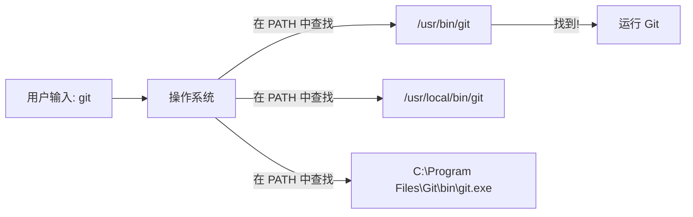

+++
title = "第2章：安装 Git —— 程序员的第一道门槛"
weight = 20
date = 2026-04-03T19:36:48+08:00
type = "docs"
description = ""
isCJKLanguage = true
draft = false
+++
# 第2章：安装 Git —— 程序员的第一道门槛

> *"安装 Git 很简单，他们说。只需要几分钟，他们说。然后你在官网下载界面等了半小时。"*

---

## 2.1 官网下载慢如蜗牛：跨国网速的忧伤

你决定安装 Git。你打开浏览器，输入 `git-scm.com`，点击 Download。

然后你看到了这个：

```
下载速度：12 KB/s
预计完成时间：2小时37分钟
```

你陷入了沉思。你记得你的宽带是 300M 的。你记得你下载 Steam 游戏时速度是 30 MB/s 的。

为什么下载一个 50MB 的安装包，速度比蜗牛还慢？

### 为什么官网这么慢？

Git 的官方网站 `git-scm.com` 服务器在国外（美国）。

当你的浏览器请求下载时，数据需要：
1. 从美国服务器出发
2. 跨越大西洋/太平洋
3. 经过无数路由器
4. 到达你的电脑

这个距离，相当于让一只蜗牛从中国爬到美国，然后再爬回来——只不过蜗牛在光纤里以光速爬行。

但即使是光速，也架不住**网络拥塞**和**国际出口带宽限制**。

### 什么是国际出口带宽？

**国际出口带宽**是指一个国家连接到国际互联网的总带宽。

简单来说：
- 中国的网民数量：10亿+
- 国际出口带宽：有限
- 结果：大家抢带宽，速度就慢了

这就像一条高速公路：
- 平时车少，你可以飙到 120 km/h
- 节假日车多，你只能以 20 km/h 爬行

国际出口带宽就是那条高速公路，而 Git 官网下载就是节假日的车流。

### 下载过程的煎熬

当你点击下载后，通常会经历以下几个阶段：

**阶段一：充满希望**
```
下载速度：1.2 MB/s
预计完成时间：40秒
```

"不错嘛，挺快的！"你心想。

**阶段二：开始怀疑**
```
下载速度：256 KB/s
预计完成时间：3分钟
```

"嗯...可能是网络波动。"

**阶段三：绝望**
```
下载速度：12 KB/s
预计完成时间：1小时15分钟
```

"？？？"

**阶段四：放弃**

你关掉浏览器，决定明天再试。或者后天。或者永远不用 Git 了。

### 测速工具

想知道你的网络到国外的速度？可以用这些工具：

```bash
# 测试到 GitHub 的延迟（Windows）
ping github.com

# 测试到 GitHub 的延迟（Mac/Linux）
ping -c 10 github.com
```

如果延迟超过 200ms，说明网络不太理想。

```
正在 Ping github.com [140.82.121.4] 具有 32 字节的数据:
来自 140.82.121.4 的回复: 字节=32 时间=287ms TTL=44
来自 140.82.121.4 的回复: 字节=32 时间=312ms TTL=44
...

平均 = 298ms
```

300ms 的延迟，意味着每次请求都要等 0.3 秒。下载一个文件需要成千上万次请求，累积起来就是漫长的等待。

### 有没有办法加速？

有！这就是下一节要讲的内容：**国内镜像**。

但首先，让我们了解一下 Git 安装包的大小：

| 平台 | 安装包大小 | 官网下载时间（假设 100KB/s） |
|------|-----------|---------------------------|
| Windows | ~50 MB | ~8 分钟 |
| Mac | ~30 MB | ~5 分钟 |
| Linux | 通常已预装 | 无需下载 |

如果你的速度只有 10KB/s，那 Windows 安装包需要等 **1 小时 25 分钟**。

人生苦短，何必浪费在下载上？

### 小结

官网下载慢的原因：
- 服务器在国外
- 国际出口带宽有限
- 网络拥塞

解决方案：
- 使用国内镜像（下一节）
- 使用代理/VPN（如果你有）
- 耐心等待（不推荐）

下一节，让我们看看国内镜像如何拯救你。

---

## 2.2 国内镜像拯救你：华为云、清华源、阿里云大比拼

既然官网下载慢，那有没有更快的办法？

当然有！**国内镜像**来拯救你了。

### 什么是镜像？

**镜像**（Mirror）是指一个网站或文件的完整复制，存储在另一个服务器上。

就像照镜子：你站在镜子前，镜子里有一个和你一模一样的影像。镜像是国外网站的"影子"，内容完全一样，但服务器在国内。


国内镜像的优势：
- 服务器在国内，延迟低（通常 < 50ms）
- 带宽充足，下载速度快（通常能跑满你的宽带）
- 内容定期同步，和官网基本一致

### 国内 Git 镜像站点

以下是几个常用的国内 Git 下载镜像：

#### 1. 华为云镜像

```txt
https://mirrors.huaweicloud.com/git-for-windows/
```

**特点**：
- 更新及时
- 速度快
- 界面简洁

**使用方法**：
1. 打开上面的链接
2. 选择最新版本（通常是最上面的文件夹）
3. 下载 `Git-x.x.x.x-64-bit.exe`（Windows）或 `Git-x.x.x.x-mac.dmg`（Mac）

#### 2. 清华大学 TUNA 镜像

```txt
https://mirrors.tuna.tsinghua.edu.cn/github-release/git-for-windows/git/
```

**特点**：
- 国内最知名的开源镜像站之一
- 速度快，稳定性高
- 支持众多开源软件

**使用方法**：
1. 打开上面的链接
2. 选择最新版本
3. 下载对应平台的安装包

#### 3. 阿里云镜像

```txt
https://mirrors.aliyun.com/github-release/git-for-windows/git/
```

**特点**：
- 阿里云基础设施，速度快
- 界面友好
- 支持多种下载方式

### 速度对比

让我们对比一下不同来源的下载速度（假设你的宽带是 100M）：

| 来源 | 延迟 | 下载速度 | 50MB 文件下载时间 |
|------|------|---------|------------------|
| Git 官网 | 200-400ms | 50-500 KB/s | 2-15 分钟 |
| 华为云镜像 | 20-50ms | 5-10 MB/s | 5-10 秒 |
| 清华镜像 | 20-50ms | 5-10 MB/s | 5-10 秒 |
| 阿里云镜像 | 20-50ms | 5-10 MB/s | 5-10 秒 |

**结论**：国内镜像比官网快 **10-100 倍**！

### 如何选择镜像？

如果某个镜像下载慢，可以尝试另一个。通常：

- **北方用户**（北京、天津、河北等）：清华镜像可能更快
- **南方用户**（上海、广东、浙江等）：阿里云或华为云可能更快
- **西南用户**（四川、重庆等）：华为云可能更快

但实际上，这几个镜像的速度差别不大，都能跑满你的宽带。随便选一个就行。

### 镜像的局限性

虽然镜像很快，但也有一些局限：

1. **同步延迟**：镜像不是实时同步的，可能有几个小时的延迟。如果你急需最新版本，可能需要等一等。

2. **只提供安装包**：镜像通常只提供 Git 的安装包，不提供完整的 `git-scm.com` 网站功能（如文档、社区等）。

3. **版本可能不是最新**：镜像可能只保留最近几个版本，旧版本可能需要去官网下载。

### 其他加速方法

除了使用镜像，还有其他方法可以加速：

#### 使用代理/VPN

如果你有代理或 VPN，可以：
```txt
开启代理 → 访问官网 → 享受飞一般的速度
```

#### 使用下载工具

一些下载工具（如 IDM、迅雷）可以多线程下载，提高速度：
```txt
复制官网下载链接 → 粘贴到下载工具 → 多线程下载
```

但注意：Git 安装包不大，如果镜像能跑满宽带，没必要用下载工具。

### 小结

国内镜像让 Git 下载从"痛苦等待"变成"秒速完成"。

推荐镜像：
- 华为云：`https://mirrors.huaweicloud.com/git-for-windows/`
- 清华镜像：`https://mirrors.tuna.tsinghua.edu.cn/github-release/git-for-windows/git/`
- 阿里云：`https://mirrors.aliyun.com/github-release/git-for-windows/git/`

下载完安装包后，下一步就是安装。Windows 用户，准备好迎接"Vim 地狱"了吗？

---

## 2.3 Windows 用户的史诗级安装攻略：避开 Vim 地狱

Windows 用户，这是为你准备的。

Git 的安装过程对 Windows 用户来说，有一个**史诗级陷阱**：默认编辑器选择。

如果你不小心，可能会陷入"Vim 地狱"。

### 下载安装包

首先，从国内镜像下载安装包：

```txt
Git-2.43.0-64-bit.exe  （版本号可能不同）
```

双击运行，你会看到欢迎界面：

```txt
Welcome to the Git Setup Wizard
```

点击"Next"，一路默认，直到你看到这个界面：

### 关键选择：选择编辑器

```txt
Selecting the default editor used by Git

Which editor would you like Git to use as the default?

[ ] Vim (the default, strongly recommended)
[ ] Notepad++
[ ] Visual Studio Code
[ ] Visual Studio Code Insiders
[ ] Sublime Text
[ ] Atom
[ ] Other
```

**注意！这是陷阱！**

如果你保持默认选择 **Vim**，然后点击"Next"，恭喜你——你已经踏入了"Vim 地狱"的大门。

### 什么是 Vim？

**Vim** 是一个强大的文本编辑器，诞生于 1991 年，至今仍被许多程序员使用。

但 Vim 有一个"特点"：

**它很难退出。**

当你不小心进入 Vim 后，你会发现：
- 按 `Esc` 没用
- 按 `Ctrl+C` 没用
- 按 `Ctrl+Z` 没用
- 按 `Alt+F4` 没用
- 按 `Delete` 没用

你被困在 Vim 里了。

### 如何退出 Vim？

如果你不幸进入了 Vim，正确的退出方式是：

```vim
:q        " 退出（如果没有修改）
:q!       " 强制退出（不保存修改）
:wq       " 保存并退出
:x        " 保存并退出（和 :wq 一样）
```

但问题是：**新手不知道要输入冒号！**

Vim 有两种模式：
- **普通模式**（默认）：你可以移动光标，但不能输入文字
- **插入模式**（按 `i` 进入）：你可以输入文字

在普通模式下，你输入 `:q`，Vim 会在底部显示 `:q`，然后你按回车，才能退出。

如果你不知道这些，你会：
1. 疯狂按各种键
2. 无意中输入了一堆字符
3. 发现退不出去了
4.  panic
5. 重启电脑

这就是"Vim 地狱"。

### 如何避免 Vim 地狱？

**在安装 Git 时，选择其他编辑器！**

推荐选择：

#### 选项一：Notepad（最简单）

```txt
[ ] Use Notepad as Git's default editor
```

Windows 自带的记事本，人人都会用。

**优点**：简单，不会困住你
**缺点**：功能简陋，不适合编辑代码

#### 选项二：Notepad++（推荐）

```txt
[ ] Notepad++
```

Notepad++ 是一个免费的代码编辑器，功能强大，简单易用。

**优点**：
- 免费
- 轻量
- 支持语法高亮
- 容易退出（按 `Alt+F4` 或点击 X 即可）

**缺点**：需要额外安装

#### 选项三：Visual Studio Code（最推荐）

```txt
[ ] Visual Studio Code
```

VS Code 是目前最流行的代码编辑器，微软出品，免费开源。

**优点**：
- 功能强大
- 插件丰富
- 集成 Git
- 容易退出

**缺点**：需要额外安装，稍微重一点

### 安装过程详解

让我们完整走一遍 Windows 安装过程：

**步骤 1：欢迎界面**
```txt
Welcome to the Git Setup Wizard
```
点击 "Next"

**步骤 2：许可协议**
```txt
GNU General Public License v2.0
```
点击 "Next"（开源软件，放心用）

**步骤 3：选择安装位置**
```
C:\Program Files\Git\
```
保持默认，点击 "Next"

**步骤 4：选择组件**
```txt
[✓] Additional icons
[✓] Windows Explorer integration
[✓] Git Bash Here
[✓] Git GUI Here
[✓] Git LFS (Large File Support)
[✓] Associate .git* configuration files with the default text editor
[✓] Associate .sh files to be run with Bash
```
保持默认，点击 "Next"

**步骤 5：选择开始菜单文件夹**
```txt
Git
```
保持默认，点击 "Next"

**步骤 6：选择默认编辑器** ⚠️ **关键！**
```
[ ] Vim (the default, strongly recommended)
[ ] Notepad++
[✓] Visual Studio Code  <-- 选择这个！
```
选择你熟悉的编辑器，点击 "Next"

**步骤 7：调整 PATH 环境**
```
[✓] Git from the command line and also from 3rd-party software
```
保持默认，点击 "Next"

**步骤 8：选择 HTTPS 传输后端**
```
[✓] Use the OpenSSL library
```
保持默认，点击 "Next"

**步骤 9：配置行尾转换**
```
[✓] Checkout Windows-style, commit Unix-style line endings
```
保持默认，点击 "Next"

**步骤 10：配置终端模拟器**
```
[✓] Use MinTTY (the default terminal of MSYS2)
```
保持默认，点击 "Next"

**步骤 11：选择默认的 `git pull` 行为**
```
[✓] Default (fast-forward or merge)
```
保持默认，点击 "Next"

**步骤 12：选择凭证管理器**
```
[✓] Git Credential Manager
```
保持默认，点击 "Next"

**步骤 13：配置额外选项**
```
[✓] Enable file system caching
[✓] Enable Git Credential Manager
```
保持默认，点击 "Next"

**步骤 14：配置实验性选项**
```
[ ] Enable experimental support for pseudo consoles
```
保持默认（不选），点击 "Install"

等待安装完成...

**步骤 15：完成**
```
Completing the Git Setup Wizard
```
取消勾选 "View Release Notes"（除非你想看更新日志）
点击 "Finish"

### 安装后验证

打开 PowerShell 或 CMD，输入：

```powershell
git --version
```

如果显示版本号，说明安装成功：
```
git version 2.43.0.windows.1
```

### 小结

Windows 安装 Git 的关键：
- 使用国内镜像下载
- **选择熟悉的编辑器（避开 Vim）**
- 其他选项保持默认即可

下一节，Mac 用户看过来——你们的安装过程只需要一分钟。

---

## 2.4 Mac 用户的优雅一分钟：Homebrew 真香

Mac 用户，恭喜你们。

你们的安装过程比 Windows 用户优雅得多。只需要一分钟，一行命令，Git 就装好了。

这就是 **Homebrew** 的魔力。

### 什么是 Homebrew？

**Homebrew** 是 macOS 上最流行的**包管理器**（Package Manager）。

**包管理器**是什么？

想象你刚搬进新家，需要买很多东西：牙刷、毛巾、锅碗瓢盆...

没有包管理器时，你需要：
1. 查地图找超市
2. 开车去超市
3. 在超市里找牙刷区、毛巾区...
4. 排队结账
5. 开车回家

有包管理器时，你只需要：
```bash
brew install 牙刷 毛巾 锅碗瓢盆
```
然后包管理器帮你搞定一切。

Homebrew 就是 macOS 的"超市管理员"，你只需要告诉它要什么，它自动下载、安装、配置好。

### 安装 Homebrew

如果你还没有 Homebrew，先安装它：

```bash
/bin/bash -c "$(curl -fsSL https://raw.githubusercontent.com/Homebrew/install/HEAD/install.sh)"
```

这个命令会：
1. 下载 Homebrew 安装脚本
2. 运行安装脚本
3. 安装 Homebrew 到 `/opt/homebrew`（Apple Silicon）或 `/usr/local`（Intel）

安装过程需要输入密码，大概需要几分钟。

### 用 Homebrew 安装 Git

Homebrew 装好后，安装 Git 只需要一行：

```bash
brew install git
```

输出大概是这样的：

```
==> Downloading https://ghcr.io/v2/homebrew/core/git/manifests/2.43.0
==> Downloading https://ghcr.io/v2/homebrew/core/git/blobs/sha256:...
==> Pouring git--2.43.0.arm64_ventura.bottle.tar.gz
==> Caveats
The Tcl/Tk GUIs (gitk, git-gui) are not included in this formula.
...
==> Summary
🍺  /opt/homebrew/Cellar/git/2.43.0: 1,500 files, 45MB
```

**搞定！** Git 已经安装好了。

整个过程：
- 下载：10-30 秒
- 安装：10-20 秒
- 总计：**不到一分钟**

### 验证安装

输入：

```bash
git --version
```

输出：
```
git version 2.43.0
```

完美。

### Homebrew 的其他优点

Homebrew 不只是安装快，还有很多优点：

**1. 自动更新**

```bash
# 更新 Homebrew 本身
brew update

# 更新所有已安装的软件
brew upgrade

# 只更新 Git
brew upgrade git
```

**2. 管理多个版本**

```bash
# 安装特定版本的 Git
brew install git@2.40

# 切换版本
brew link git@2.40
```

**3. 干净的卸载**

```bash
# 卸载 Git
brew uninstall git

# 卸载并删除所有配置文件
brew uninstall --force git
```

**4. 查看已安装软件**

```bash
# 列出所有已安装的软件
brew list

# 查看 Git 的信息
brew info git
```

### 不用 Homebrew 的替代方案

如果你不想用 Homebrew，还有其他方法：

#### 方案一：官网下载

1. 访问 https://git-scm.com/download/mac
2. 下载 `.dmg` 安装包
3. 双击打开，拖动 Git 图标到 Applications 文件夹

#### 方案二：Xcode Command Line Tools

```bash
xcode-select --install
```

这会安装 Xcode 的命令行工具，其中包含 Git。

**注意**：这个 Git 版本可能较旧，不推荐。

### 配置 Git 编辑器（Mac）

Mac 用户也需要配置 Git 的默认编辑器，避免 Vim 地狱。

如果你用 VS Code：

```bash
git config --global core.editor "code --wait"
```

如果你用 Sublime Text：

```bash
git config --global core.editor "subl -n -w"
```

如果你用 nano（比 Vim 简单）：

```bash
git config --global core.editor nano
```

### 小结

Mac 安装 Git：
- 安装 Homebrew（如果还没有）
- `brew install git`
- 完成！

**一分钟搞定**，优雅如斯。

这就是 Homebrew 的魅力。Windows 用户羡慕去吧。

下一节，Linux 用户——你们更潇洒，一行命令的事。

---

## 2.5 Linux 用户的一行命令：就是这么潇洒

Linux 用户，你们是最潇洒的。

为什么？因为大多数 Linux 发行版**已经预装了 Git**。

如果没有，也只需要一行命令。

### 检查是否已安装

打开终端，输入：

```bash
git --version
```

如果显示版本号：
```
git version 2.34.1
```

恭喜你，Git 已经装好了。你可以跳过这一节，直接去下一节。

如果显示：
```
bash: git: command not found
```

那就继续往下看。

### 不同发行版的安装命令

Linux 有很多发行版，每个的安装命令略有不同：

#### Ubuntu / Debian

```bash
# 更新软件包列表
sudo apt update

# 安装 Git
sudo apt install git -y
```

**解释**：
- `sudo`：以管理员权限运行
- `apt`：Advanced Package Tool，Ubuntu/Debian 的包管理器
- `install git`：安装 Git 包
- `-y`：自动回答"yes"，不需要手动确认

#### Fedora

```bash
# 安装 Git
sudo dnf install git

# 或者使用 yum（旧版本）
sudo yum install git
```

**解释**：
- `dnf`：Dandified YUM，Fedora 的包管理器
- `yum`：Yellowdog Updater Modified，旧版 Fedora 和 CentOS 使用的包管理器

#### CentOS / RHEL

```bash
# CentOS 8+ / RHEL 8+
sudo dnf install git

# CentOS 7 / RHEL 7
sudo yum install git
```

#### Arch Linux

```bash
# 安装 Git
sudo pacman -S git
```

**解释**：
- `pacman`：Package Manager，Arch Linux 的包管理器
- `-S`：Sync，同步（安装）软件包

#### openSUSE

```bash
# 安装 Git
sudo zypper install git
```

**解释**：
- `zypper`：openSUSE 的包管理器

### 安装过程示例（Ubuntu）

让我们看看 Ubuntu 上安装 Git 的完整过程：

```bash
$ sudo apt update
Hit:1 http://archive.ubuntu.com/ubuntu jammy InRelease
Get:2 http://archive.ubuntu.com/ubuntu jammy-updates InRelease [114 kB]
...
Reading package lists... Done

$ sudo apt install git -y
Reading package lists... Done
Building dependency tree... Done
Reading state information... Done
The following additional packages will be installed:
  git-man liberror-perl
Suggested packages:
  git-daemon-run | git-daemon-sysvinit git-doc git-email git-gui gitk
  gitweb git-cvs git-mediawiki git-svn
The following NEW packages will be installed:
  git git-man liberror-perl
0 upgraded, 3 newly installed, 0 to remove and 0 not upgraded.
Need to get 5,500 kB of archives.
After this operation, 32.5 MB of additional disk space will be used.
Get:1 http://archive.ubuntu.com/ubuntu jammy/main amd64 liberror-perl all 0.17029-1 [26.5 kB]
Get:2 http://archive.ubuntu.com/ubuntu jammy/main amd64 git-man all 1:2.34.1-1ubuntu1 [952 kB]
Get:3 http://archive.ubuntu.com/ubuntu jammy/main amd64 git amd64 1:2.34.1-1ubuntu1 [3,122 kB]
Fetched 5,500 kB in 2s (2,750 kB/s)
Selecting previously unselected package liberror-perl.
(Reading database ... 200000 files and directories currently installed.)
Preparing to unpack .../liberror-perl_0.17029-1_all.deb ...
Unpacking liberror-perl (0.17029-1) ...
Selecting previously unselected package git-man.
Preparing to unpack .../git-man_1%3a2.34.1-1ubuntu1_all.deb ...
Unpacking git-man (1:2.34.1-1ubuntu1) ...
Selecting previously unselected package git.
Preparing to unpack .../git_1%3a2.34.1-1ubuntu1_amd64.deb ...
Unpacking git (1:2.34.1-1ubuntu1) ...
Setting up liberror-perl (0.17029-1) ...
Setting up git-man (1:2.34.1-1ubuntu1) ...
Setting up git (1:2.34.1-1ubuntu1) ...
Processing triggers for man-db (2.10.2-1) ...
```

整个过程大约 10-30 秒，取决于你的网速。

### 验证安装

安装完成后：

```bash
git --version
```

输出：
```
git version 2.34.1
```

### 安装最新版本

Linux 发行版的软件仓库通常不是最新的。如果你需要最新版本的 Git，可以：

#### Ubuntu / Debian 安装最新版

```bash
# 添加 Git 官方 PPA（Personal Package Archive）
sudo add-apt-repository ppa:git-core/ppa

# 更新软件包列表
sudo apt update

# 安装最新版 Git
sudo apt install git -y
```

#### 从源码编译安装

如果你需要特定版本，或者发行版仓库里的版本太旧，可以从源码编译：

```bash
# 安装编译依赖
sudo apt update
sudo apt install make libssl-dev libghc-zlib-dev libcurl4-gnutls-dev libexpat1-dev gettext unzip -y

# 下载 Git 源码
cd /tmp
curl -o git.tar.gz https://mirrors.edge.kernel.org/pub/software/scm/git/git-2.43.0.tar.gz

# 解压
tar -zxf git.tar.gz
cd git-2.43.0/

# 编译并安装
make prefix=/usr/local all
sudo make prefix=/usr/local install

# 验证
git --version
```

**注意**：从源码编译需要较长时间（5-10 分钟），不推荐新手尝试。

### 为什么 Linux 这么潇洒？

Linux 的包管理器设计得非常优雅：


一行命令，自动完成：
1. 查找软件包
2. 下载安装包
3. 解决依赖（如果 Git 需要其他库，自动安装）
4. 安装软件
5. 配置环境

这就是 Linux 的哲学：**简单、高效、自动化**。

### 包管理器对比

| 发行版 | 包管理器 | 安装命令 |
|--------|---------|---------|
| Ubuntu/Debian | apt | `sudo apt install git` |
| Fedora | dnf | `sudo dnf install git` |
| CentOS/RHEL | yum/dnf | `sudo yum install git` |
| Arch | pacman | `sudo pacman -S git` |
| openSUSE | zypper | `sudo zypper install git` |

记住你的发行版对应的命令，以后安装其他软件也用得上。

### 小结

Linux 安装 Git：
- 大多数发行版已预装
- 如果没有，一行命令搞定
- 包管理器自动处理依赖

潇洒，就是这么简单。

下一节，让我们验证安装是否成功。

---

## 2.6 验证安装：见证奇迹的 `git --version`

安装完成了。但怎么知道真的装好了？

见证奇迹的时刻到了：

```bash
git --version
```

### 成功的情况

如果显示类似：

```
git version 2.43.0
```

或：
```
git version 2.43.0.windows.1
```

或：
```
git version 2.34.1
```

**恭喜你，Git 安装成功！**

版本号的具体数字不重要，重要的是：
- Git 能正常运行
- 版本号 >= 2.0（Git 2.0 是 2014 年发布的，现在应该没人用更老的版本了）

### 失败的情况

如果显示：

**Windows：**
```
'git' 不是内部或外部命令，也不是可运行的程序或批处理文件。
```

**Mac/Linux：**
```
bash: git: command not found
```

说明 Git 没有正确安装，或者没有添加到 PATH。

### 什么是 PATH？

**PATH** 是操作系统用来查找可执行程序的环境变量。

当你输入 `git` 时，操作系统会在 PATH 指定的目录中查找名为 `git` 的可执行文件。



如果 Git 安装在 PATH 之外的目录，操作系统就找不到它。

### 检查 PATH（Windows）

**方法一：通过设置**

1. 右键"此电脑" → 属性 → 高级系统设置
2. 环境变量
3. 在"系统变量"中找到 `Path`
4. 检查是否包含 `C:\Program Files\Git\cmd`

**方法二：通过命令行**

```powershell
$env:Path
```

输出应该包含：
```
C:\Program Files\Git\cmd;C:\Program Files\Git\bin;
```

### 检查 PATH（Mac/Linux）

```bash
echo $PATH
```

输出应该包含：
```
/usr/local/bin:/usr/bin:/bin
```

Git 通常安装在 `/usr/bin/git` 或 `/usr/local/bin/git`。

### 手动添加 PATH（Windows）

如果 Git 安装了但不在 PATH 中，可以手动添加：

```powershell
# 临时添加（仅当前窗口有效）
$env:Path += ";C:\Program Files\Git\cmd"

# 永久添加（需要管理员权限）
[Environment]::SetEnvironmentVariable("Path", $env:Path + ";C:\Program Files\Git\cmd", "User")
```

添加后，**重新打开终端**，再试 `git --version`。

### 其他验证命令

除了 `git --version`，还可以用这些命令验证：

```bash
# 查看 Git 帮助
git --help

# 查看 Git 配置
git config --list

# 查看 Git 安装路径（Windows）
where git

# 查看 Git 安装路径（Mac/Linux）
which git
```

### 版本号的意义

Git 的版本号格式：

```
git version 2.43.0.windows.1
│    │       │     │
│    │       │     └── 平台特定版本
│    │       └──────── 补丁版本
│    └──────────────── 次要版本
└───────────────────── 主要版本
```

**主要版本**：重大更新，可能有不兼容变化
**次要版本**：新功能，向后兼容
**补丁版本**：Bug 修复

### 需要最新版本吗？

Git 的版本更新频率：
- 大约每 2-3 个月发布一个新版本
- 主要版本（如 2.x）通常几年才变一次

对于大多数用户，**不需要追求最新版本**。只要版本 >= 2.0，功能都够用。

但如果你是：
- 需要新功能（如 `git switch` 是 2.23 引入的）
- 需要性能优化
- 喜欢尝鲜

可以考虑升级。

### 小结

验证安装：
- 运行 `git --version`
- 如果显示版本号，成功！
- 如果提示找不到命令，检查 PATH

安装成功后，你已经迈出了 Git 之旅的第一步。

但等等，安装 Git 后，你得到了什么？不仅仅是 `git` 命令。

下一节，让我们看看 Git 安装包里还藏着什么宝贝。

---

## 2.7 安装后你得到了什么：Git Bash 才是真爱

安装 Git 后，你得到的不仅仅是 `git` 命令。

Git 安装包是一个大礼包，里面有很多有用的工具。其中最宝藏的，是 **Git Bash**。

### Git Bash 是什么？

**Git Bash** 是 Windows 上的 Unix 风格终端模拟器。

**解释**：
- **Bash** 是 Linux/macOS 上最流行的命令行 shell（命令解释器）
- Windows 默认的命令行是 CMD 或 PowerShell，和 Bash 完全不同
- Git Bash 让你在 Windows 上也能用 Bash

简单说：Git Bash 让你在 Windows 上体验 Linux/macOS 的命令行环境。

### 为什么 Git Bash 是真爱？

**原因一：统一的命令体验**

在 Windows CMD 中：
```cmd
# 列出目录内容
dir

# 清屏
cls

# 查看文件内容
type file.txt
```

在 Git Bash 中：
```bash
# 列出目录内容
ls

# 清屏
clear

# 查看文件内容
cat file.txt
```

Git Bash 使用的是 Linux/macOS 的命令，这意味着：
- 你在网上找到的教程（大多是 Linux/macOS 的）可以直接用
- 你在 Mac/Linux 上学到的命令，在 Windows 上也能用
- 和服务器（通常是 Linux）交互时，命令一致

**原因二：强大的命令行工具**

Git Bash 自带了很多 Unix 工具：

| 命令 | 作用 |
|------|------|
| `ls` | 列出目录内容 |
| `cat` | 查看文件内容 |
| `grep` | 搜索文本 |
| `awk` | 文本处理 |
| `sed` | 流编辑器 |
| `curl` | 下载文件 |
| `ssh` | 远程登录 |
| `scp` | 安全复制文件 |

这些工具在 Windows CMD 中要么没有，要么行为不同。

**原因三：Git 集成**

Git Bash 对 Git 的支持最好：
- 自动补全（按 Tab 键补全命令和文件名）
- 分支显示（提示符显示当前 Git 分支）
- 颜色高亮（不同文件类型显示不同颜色）

### 如何打开 Git Bash？

**方法一：开始菜单**

开始菜单 → Git → Git Bash

**方法二：右键菜单**

在任意文件夹空白处右键 → Git Bash Here

这是最常用的方式，直接在目标文件夹打开 Git Bash。

**方法三：在 VS Code 中打开**

VS Code 中按 `` Ctrl+` ``（反引号）打开终端，然后选择 Git Bash。

### Git Bash 界面介绍

打开 Git Bash，你会看到：

```bash
MINGW64 /c/Users/YourName/Projects
$
```

**解释**：
- `MINGW64`：Git Bash 基于 MinGW（Minimalist GNU for Windows）
- `/c/Users/YourName/Projects`：当前目录
  - Git Bash 使用 Unix 风格的路径（`/c/` 而不是 `C:\`）
- `$`：命令提示符，表示等待输入

### 常用命令对比

| 操作 | Windows CMD | Git Bash |
|------|-------------|----------|
| 列出目录 | `dir` | `ls` |
| 切换目录 | `cd` | `cd` |
| 清屏 | `cls` | `clear` |
| 查看文件 | `type file.txt` | `cat file.txt` |
| 复制文件 | `copy file.txt dest\` | `cp file.txt dest/` |
| 移动文件 | `move file.txt dest\` | `mv file.txt dest/` |
| 删除文件 | `del file.txt` | `rm file.txt` |
| 创建目录 | `mkdir folder` | `mkdir folder` |
| 删除目录 | `rmdir /s folder` | `rm -rf folder` |
| 查看路径 | `cd` | `pwd` |

### 路径的转换

Git Bash 使用 Unix 风格的路径：

| Windows 路径 | Git Bash 路径 |
|-------------|---------------|
| `C:\Users\Name` | `/c/Users/Name` |
| `D:\Projects` | `/d/Projects` |
| `\\server\share` | `//server/share` |

在 Git Bash 中，可以用 `cd` 切换目录：

```bash
# 进入 C 盘
cd /c

# 进入用户目录
cd /c/Users/YourName

# 进入项目目录
cd /d/Projects/my-project
```

### Git Bash 的其他宝藏

除了 Bash，Git 安装包还提供了：

**Git GUI**：
- 图形化的 Git 客户端
- 适合不喜欢命令行的用户
- 但功能不如命令行强大

**Git CMD**：
- 在 CMD 中使用 Git
- 不推荐，功能有限

**Unix 工具集**：
- `ssh`：远程登录
- `scp`：安全复制
- `openssl`：加密工具
- `gpg`：签名工具

### 配置 Git Bash

Git Bash 可以通过配置文件自定义：

```bash
# 编辑 Bash 配置文件
nano ~/.bashrc

# 添加自定义配置
alias ll='ls -al'  # 创建 ll 别名
alias ..='cd ..'   # 创建 .. 别名

# 使配置生效
source ~/.bashrc
```

### 小结

安装 Git 后，你得到了：
- `git` 命令
- **Git Bash**（Windows 用户的真爱）
- Git GUI
- 一堆 Unix 工具

Git Bash 让你在 Windows 上享受 Linux/macOS 的命令行体验，是 Windows 用户的最佳伴侣。

下一节，让我们看看如何升级 Git 到最新版本。

---

## 2.8 Git 版本升级：如何更新到最新版

你的 Git 安装好了，但可能不是最新版。

Git 大约每 2-3 个月发布一个新版本，带来新功能和性能优化。

如何升级？不同平台方法不同。

### 检查当前版本

首先，看看你的 Git 版本：

```bash
git --version
```

输出：
```
git version 2.40.0
```

然后去官网查看最新版本：
```
https://git-scm.com/downloads
```

如果官网显示 `2.43.0`，而你是 `2.40.0`，说明可以升级了。

### Windows 升级

**方法一：重新下载安装**

1. 从国内镜像下载最新版安装包
2. 双击运行
3. 安装程序会自动检测旧版本并升级
4. 保持之前的配置（编辑器、PATH 等）

**注意**：升级过程中，Git 会保持你的配置不变。

**方法二：使用 Git 自带的更新检查**

Git for Windows 2.40+ 版本支持自动检查更新：

```bash
# 检查更新
git update-git-for-windows
```

如果有新版本，会提示你下载。

**方法三：使用包管理器（推荐）**

如果你用 Windows 包管理器：

**Chocolatey**：
```powershell
# 升级 Git
choco upgrade git
```

**Scoop**：
```powershell
# 升级 Git
scoop update git
```

**Winget**（Windows 11 自带）：
```powershell
# 升级 Git
winget upgrade Git.Git
```

### Mac 升级

**方法一：Homebrew（推荐）**

```bash
# 更新 Homebrew 本身
brew update

# 升级 Git
brew upgrade git
```

**方法二：官网下载**

1. 访问 https://git-scm.com/download/mac
2. 下载 `.dmg` 安装包
3. 双击安装

### Linux 升级

**Ubuntu / Debian**：

```bash
# 更新软件包列表
sudo apt update

# 升级 Git
sudo apt upgrade git -y

# 或者安装最新版（通过 PPA）
sudo add-apt-repository ppa:git-core/ppa
sudo apt update
sudo apt install git -y
```

**Fedora**：

```bash
# 升级 Git
sudo dnf upgrade git
```

**CentOS / RHEL**：

```bash
# 升级 Git
sudo yum upgrade git
# 或
sudo dnf upgrade git
```

**Arch**：

```bash
# 升级所有软件（包括 Git）
sudo pacman -Syu

# 只升级 Git
sudo pacman -S git
```

### 版本升级策略

**需要升级吗？**

| 情况 | 建议 |
|------|------|
| 版本 >= 2.30 | 可以升级，但不急 |
| 版本 >= 2.0 | 建议升级 |
| 版本 < 2.0 | 必须升级 |

**什么时候升级？**

- 看到新功能介绍，想要尝鲜
- 遇到 Bug，新版本修复了
- 性能优化，想要更快
- 定期维护（比如每半年升级一次）

**升级有风险吗？**

Git 的升级通常是向后兼容的，升级后：
- 你的仓库不会受影响
- 你的配置不会丢失
- 旧的命令依然可用

但建议升级前：
- 完成当前工作（提交或推送）
- 备份重要仓库（以防万一）

### 查看更新日志

想知道新版本有什么变化？

```bash
# 查看 Git 发布说明
https://raw.githubusercontent.com/git/git/master/Documentation/RelNotes/2.43.0.txt
```

或者访问：
```
https://github.com/git/git/releases
```

### 自动更新配置

**Git for Windows 自动更新**：

```bash
# 启用自动检查更新
git config --global credential.helper manager

# 设置更新检查频率（每周）
git config --global credential.helperselector.selected manager
```

**注意**：Git 不会自动安装更新，只会提醒你。

### 小结

升级 Git：
- Windows：重新安装或使用包管理器
- Mac：`brew upgrade git`
- Linux：`apt/yum/dnf/pacman upgrade git`

升级是安全的，向后兼容。定期升级可以享受新功能和性能优化。

但有时候，升级后可能会遇到问题。下一节，让我们看看常见问题如何解决。

---

## 2.9 常见问题救援：当 `git` 命令找不到时

安装 Git 后，最常见的问题就是：

```bash
git --version
```

然后看到：

**Windows：**
```
'git' 不是内部或外部命令，也不是可运行的程序或批处理文件。
```

**Mac/Linux：**
```
bash: git: command not found
```

别慌，这是可以解决的。

### 问题一：Git 根本没安装

**症状**：输入 `git` 提示找不到命令

**检查**：

**Windows：**
1. 打开"开始菜单" → 搜索"Git"
2. 看看有没有"Git Bash"或"Git GUI"

**Mac：**
```bash
# 检查 Applications 文件夹
ls /Applications/ | grep -i git

# 检查 brew 安装的软件
brew list | grep git
```

**Linux：**
```bash
# 检查已安装软件包
# Ubuntu/Debian
dpkg -l | grep git

# Fedora/CentOS
rpm -qa | grep git

# Arch
pacman -Q | grep git
```

**解决**：如果没安装，回到前面的章节，重新安装。

### 问题二：Git 安装了，但不在 PATH 中

**症状**：在开始菜单能找到 Git，但命令行提示找不到

**原因**：Git 安装了，但没有添加到系统的 PATH 环境变量中

**解决（Windows）：**

**方法一：手动添加 PATH**

1. 找到 Git 安装目录（通常是 `C:\Program Files\Git\cmd`）
2. 右键"此电脑" → 属性 → 高级系统设置
3. 环境变量
4. 在"系统变量"中找到 `Path`，点击"编辑"
5. 点击"新建"，添加 `C:\Program Files\Git\cmd`
6. 点击"确定"保存
7. **重新打开终端**，再试 `git --version`

**方法二：使用 PowerShell 添加**

```powershell
# 获取当前 PATH
$currentPath = [Environment]::GetEnvironmentVariable("Path", "User")

# 添加 Git 路径
$newPath = $currentPath + ";C:\Program Files\Git\cmd"

# 设置新 PATH
[Environment]::SetEnvironmentVariable("Path", $newPath, "User")

# 刷新当前会话的 PATH
$env:Path = $newPath

# 验证
git --version
```

**解决（Mac/Linux）：**

Mac 和 Linux 通常自动配置 PATH。如果没配置：

```bash
# 编辑 shell 配置文件
nano ~/.bashrc  # 如果用 Bash
nano ~/.zshrc   # 如果用 Zsh

# 添加以下行
export PATH=$PATH:/usr/local/bin

# 使配置生效
source ~/.bashrc  # 或 source ~/.zshrc
```

### 问题三：安装了多个 Git 版本

**症状**：`git --version` 显示的版本和预期不符

**原因**：系统中有多个 Git，PATH 中排在前面的被优先使用

**检查**：

**Windows：**
```powershell
# 查看 git 可执行文件的位置
where git

# 输出可能有多个：
# C:\Program Files\Git\cmd\git.exe
# C:\Users\Name\AppData\Local\Programs\Git\cmd\git.exe
```

**Mac/Linux：**
```bash
# 查看 git 可执行文件的位置
which -a git

# 输出：
# /usr/local/bin/git
# /usr/bin/git
```

**解决**：

删除不需要的版本，或者调整 PATH 顺序。

### 问题四：Git Bash 能运行 git，但 CMD/PowerShell 不能

**症状**：在 Git Bash 中 `git` 能用，在 CMD 中不能用

**原因**：Git Bash 自带 Git，但 CMD 的 PATH 没配置

**解决**：

把 Git Bash 的 Git 添加到系统 PATH：

```powershell
# Git Bash 的 Git 通常在
# C:\Program Files\Git\bin\git.exe

# 添加到 PATH（见问题二的解决方法）
```

### 问题五：权限问题

**症状**：提示"拒绝访问"或"Permission denied"

**原因**：没有执行权限

**解决（Mac/Linux）：**

```bash
# 检查 git 可执行文件的权限
ls -la $(which git)

# 添加执行权限
chmod +x /path/to/git
```

### 问题六：杀毒软件拦截

**症状**：安装后 git 命令找不到，或者被杀毒软件删除

**原因**：某些杀毒软件误报 Git 为恶意软件

**解决**：

1. 暂时关闭杀毒软件
2. 重新安装 Git
3. 将 Git 安装目录添加到杀毒软件的白名单

### 问题七：公司电脑限制

**症状**：无法安装软件，或者安装后无法运行

**原因**：公司电脑有组策略或权限限制

**解决**：

1. 联系 IT 部门，申请安装 Git
2. 使用便携版 Git（Portable Git）
3. 使用在线 Git 服务（如 GitHub Codespaces）

### 便携版 Git（Windows）

如果无法安装 Git，可以使用便携版：

1. 从国内镜像下载 `PortableGit-x.x.x.x-64-bit.7z.exe`
2. 解压到任意目录（如 `C:\Tools\PortableGit`）
3. 运行 `git-bash.exe` 即可使用

便携版不需要安装，不写注册表，适合在公司电脑或临时使用。

### 诊断脚本

如果你不确定问题出在哪，可以运行这个诊断脚本：

**Windows（PowerShell）：**

```powershell
Write-Host "=== Git 诊断 ===" -ForegroundColor Green

# 检查 git 命令
try {
    $version = git --version 2>$null
    Write-Host "✓ Git 已安装: $version" -ForegroundColor Green
} catch {
    Write-Host "✗ Git 命令未找到" -ForegroundColor Red
}

# 检查 PATH
Write-Host "`n=== PATH 检查 ===" -ForegroundColor Green
$gitPaths = $env:Path -split ";" | Where-Object { $_ -like "*git*" }
if ($gitPaths) {
    Write-Host "✓ PATH 中包含 Git 路径:" -ForegroundColor Green
    $gitPaths | ForEach-Object { Write-Host "  $_" }
} else {
    Write-Host "✗ PATH 中没有 Git 路径" -ForegroundColor Red
}

# 查找 git.exe
Write-Host "`n=== 文件搜索 ===" -ForegroundColor Green
$gitExe = Get-ChildItem -Path "C:\Program Files" -Name "git.exe" -Recurse -ErrorAction SilentlyContinue
if ($gitExe) {
    Write-Host "✓ 找到 git.exe:" -ForegroundColor Green
    $gitExe | ForEach-Object { Write-Host "  $_" }
} else {
    Write-Host "✗ 未找到 git.exe" -ForegroundColor Red
}
```

### 小结

常见问题：
- Git 没安装 → 重新安装
- 不在 PATH 中 → 添加 PATH
- 多个版本冲突 → 删除多余版本
- 权限问题 → 修改权限
- 杀毒软件拦截 → 添加白名单

遇到问题不要慌，按步骤排查，总能解决。

下一节，让我们看看如何管理多个 Git 版本。

---

## 2.10 多版本 Git 管理：使用版本管理器

有时候，你需要在电脑上安装多个版本的 Git。

比如：
- 测试新功能，但不想影响工作
- 某些项目需要特定版本的 Git
- 你想比较不同版本的性能

如何管理多个 Git 版本？使用**版本管理器**。

### 什么是版本管理器？

**版本管理器**（Version Manager）是一种工具，让你可以在同一台电脑上安装和切换多个版本的软件。

就像手机的双卡双待：你可以有两个号码，根据需要切换。

### Windows：使用 Scoop 或 Chocolatey

#### Scoop

**Scoop** 是 Windows 上的命令行包管理器，支持多版本管理。

**安装 Scoop**：

```powershell
# 在 PowerShell 中运行
Set-ExecutionPolicy -ExecutionPolicy RemoteSigned -Scope CurrentUser
Invoke-RestMethod -Uri https://get.scoop.sh | Invoke-Expression
```

**用 Scoop 安装多个 Git 版本**：

```powershell
# 添加 versions 仓库（包含旧版本）
scoop bucket add versions

# 安装最新版
scoop install git

# 安装特定版本
scoop install git@2.40.1

# 查看已安装的版本
scoop list git

# 切换版本
scoop reset git@2.40.1
```

#### Chocolatey

**Chocolatey** 是另一个 Windows 包管理器。

**安装 Chocolatey**：

```powershell
# 以管理员身份运行 PowerShell
Set-ExecutionPolicy Bypass -Scope Process -Force
[System.Net.ServicePointManager]::SecurityProtocol = [System.Net.ServicePointManager]::SecurityProtocol -bor 3072
Invoke-Expression ((New-Object System.Net.WebClient).DownloadString('https://community.chocolatey.org/install.ps1'))
```

**用 Chocolatey 管理 Git**：

```powershell
# 安装 Git
choco install git

# 安装特定版本
choco install git --version 2.40.1

# 升级
choco upgrade git

# 卸载
choco uninstall git
```

**注意**：Chocolatey 不支持同时安装多个版本，只能替换。

### Mac：使用 Homebrew

Mac 上 Homebrew 可以管理多个版本：

```bash
# 安装最新版
brew install git

# 安装特定版本（如果可用）
brew install git@2.40

# 查看已安装版本
brew list | grep git
ls -la /usr/local/opt/ | grep git

# 切换版本（通过链接）
brew unlink git
brew link git@2.40

# 或者使用 brew switch（旧版本 Homebrew）
brew switch git 2.40.1
```

### Linux：从源码安装多版本

Linux 上最灵活的方法是从源码安装到不同目录：

```bash
# 创建目录存放不同版本
mkdir -p ~/git-versions
cd ~/git-versions

# 下载并编译 2.40.0
wget https://mirrors.edge.kernel.org/pub/software/scm/git/git-2.40.0.tar.gz
tar -xzf git-2.40.0.tar.gz
cd git-2.40.0
make prefix=$HOME/git-versions/2.40.0 all
make prefix=$HOME/git-versions/2.40.0 install

# 下载并编译 2.43.0
cd ~/git-versions
wget https://mirrors.edge.kernel.org/pub/software/scm/git/git-2.43.0.tar.gz
tar -xzf git-2.43.0.tar.gz
cd git-2.43.0
make prefix=$HOME/git-versions/2.43.0 all
make prefix=$HOME/git-versions/2.43.0 install
```

**切换版本**：

```bash
# 使用 2.40.0
export PATH=$HOME/git-versions/2.40.0/bin:$PATH
git --version  # git version 2.40.0

# 使用 2.43.0
export PATH=$HOME/git-versions/2.43.0/bin:$PATH
git --version  # git version 2.43.0
```

### 使用别名快速切换

在 `~/.bashrc` 或 `~/.zshrc` 中添加：

```bash
# Git 版本切换别名
alias git240='export PATH=$HOME/git-versions/2.40.0/bin:$PATH && git --version'
alias git243='export PATH=$HOME/git-versions/2.43.0/bin:$PATH && git --version'
```

然后：

```bash
# 切换到 2.40.0
git240

# 切换到 2.43.0
git243
```

### 使用 direnv（高级）

**direnv** 是一个环境变量管理器，可以根据目录自动设置环境。

**安装 direnv**：

```bash
# Mac
brew install direnv

# Ubuntu/Debian
sudo apt install direnv

# 添加到 shell
echo 'eval "$(direnv hook bash)"' >> ~/.bashrc  # 或 ~/.zshrc
```

**使用 direnv 管理 Git 版本**：

```bash
# 在项目目录
cd ~/projects/old-project

# 创建 .envrc 文件
cat > .envrc << 'EOF'
export PATH=$HOME/git-versions/2.40.0/bin:$PATH
EOF

# 允许 direnv
direnv allow

# 现在在这个目录下，git 是 2.40.0
git --version

# 离开目录，恢复系统默认
cd ~
git --version
```

### 多版本管理的实际场景

**场景一：测试新功能**

```bash
# 安装最新测试版
scoop install git@2.44.0-rc1

# 测试新功能
# ...

# 有问题？切回稳定版
scoop reset git
```

**场景二：兼容旧项目**

```bash
# 旧项目需要 Git 2.30
cd old-project
echo 'export PATH=/opt/git-2.30/bin:$PATH' > .envrc
direnv allow

# 其他项目用系统默认
cd new-project
git --version  # 系统默认版本
```

### 需要多版本吗？

对于大多数用户，**不需要**管理多个 Git 版本。

Git 的向后兼容性很好，新版本通常能完美处理旧版本创建的仓库。

只有在以下情况才需要多版本：
- 你是 Git 开发者，需要测试不同版本
- 你在维护需要特定 Git 版本的 CI/CD 系统
- 你想比较不同版本的性能

普通用户保持最新稳定版即可。

### 小结

多版本管理工具：
- **Windows**：Scoop（推荐）、Chocolatey
- **Mac**：Homebrew
- **Linux**：从源码安装到不同目录 + PATH 切换

高级工具：
- direnv：按目录自动切换环境

但记住：大多数情况下，你只需要一个 Git 版本——最新的稳定版。

---

## 本章小结

恭喜你，Git 安装完成了！

### 本章回顾

**2.1 官网下载慢如蜗牛**
- 官网服务器在国外，下载速度慢
- 解决方案：使用国内镜像

**2.2 国内镜像拯救你**
- 华为云、清华镜像、阿里云
- 速度快 10-100 倍

**2.3 Windows 安装攻略**
- 下载安装包 → 运行 → 选择编辑器（避开 Vim）→ 完成
- 关键：选择熟悉的编辑器

**2.4 Mac 安装**
- `brew install git`
- 一分钟搞定

**2.5 Linux 安装**
- `apt/yum/dnf/pacman install git`
- 一行命令，潇洒

**2.6 验证安装**
- `git --version`
- 如果失败，检查 PATH

**2.7 安装后得到了什么**
- Git Bash（Windows 用户的真爱）
- Git GUI
- Unix 工具集

**2.8 版本升级**
- Windows：重新安装或包管理器
- Mac：`brew upgrade git`
- Linux：包管理器升级

**2.9 常见问题救援**
- 命令找不到 → 检查 PATH
- 多个版本冲突 → 删除多余版本
- 权限问题 → 修改权限

**2.10 多版本管理**
- Scoop/Homebrew/源码安装
- 使用 direnv 自动切换

### 下一步

Git 安装好了，接下来要配置它。

下一章，我们将：
- 配置用户名和邮箱
- 配置默认编辑器
- 配置别名
- 让你的 Git 更好用

准备好进入 Git 的世界了吗？

---

*已完成"2.10 多版本 Git 管理：使用版本管理器"这一小节的内容展开。*

**第二章全部完成！** 当前时间：2026年3月16日09:55:00。

