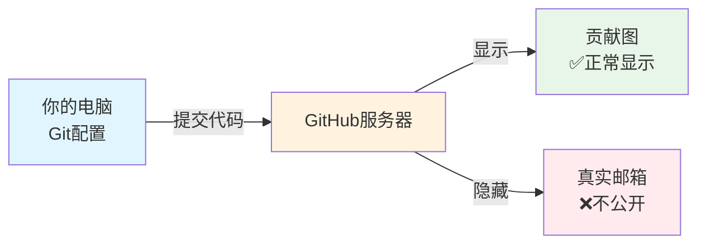
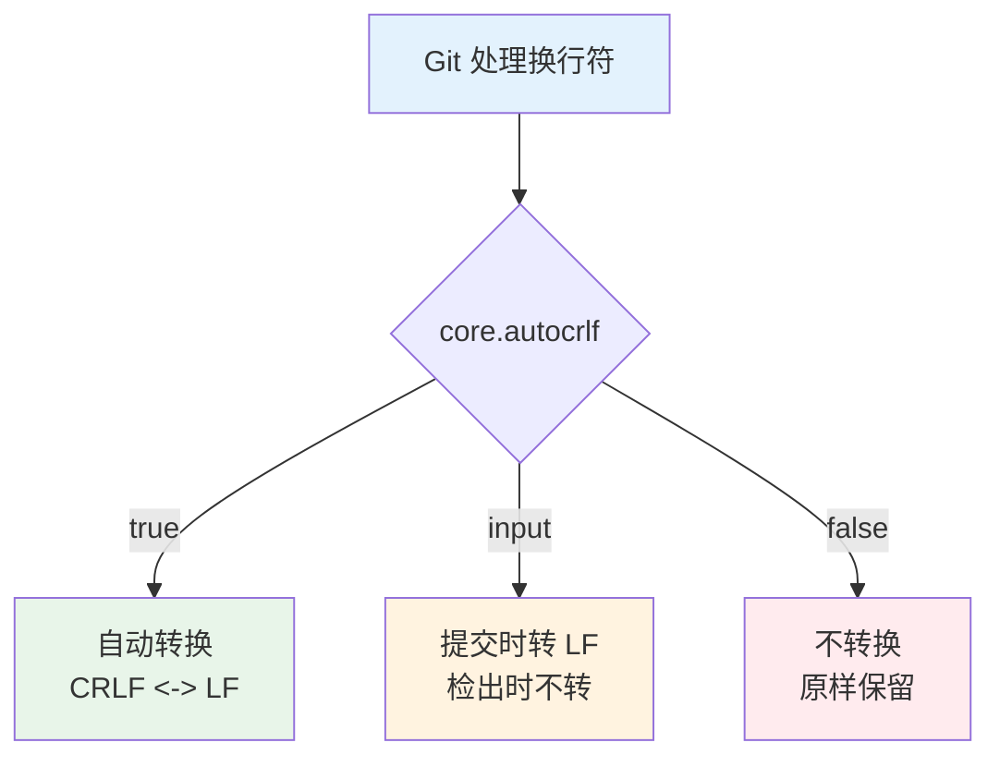

+++
title = "第3章：Git 基础配置 —— 不穿衣服就出门的后果"
weight = 30
date = 2026-04-03T19:36:48+08:00
type = "docs"
description = ""
isCJKLanguage = true
draft = false
+++
# 第3章：Git 基础配置 —— 不穿衣服就出门的后果

> *"配置做得好，提交没烦恼；配置做不好，绿格子全跑。"*

---

## 3.1 一个悲伤的故事：小明的 Git 惨剧（贡献图为零）

小明是个勤奋的程序员，每天加班到深夜，代码写得飞起。三个月后，他信心满满地打开 GitHub，准备欣赏自己那密密麻麻的绿色贡献图（Contribution Graph）——那是程序员的荣誉勋章，是熬夜的见证，是实力的象征！

结果……

**一片空白。**

就像期末考试全勤却忘了写名字，就像辛苦种了一年的地却发现种在了邻居家的田里。小明的代码确实提交了，但 GitHub 根本不认识他是谁！

### 发生了什么？

原来，小明从来没有告诉 Git 自己是谁。每次提交，Git 都一脸懵逼："这人谁啊？匿名侠？" 于是所有的提交都变成了"幽灵提交"——存在，但无人认领。

**贡献图（Contribution Graph）** 是 GitHub 个人主页上那个由绿色小方块组成的日历，每个方块代表一天，颜色越深表示当天贡献越多。它是程序员的"社交货币"，是简历上的隐形加分项。

### 小明的教训

1. **没有配置用户名和邮箱** → Git 不知道你是谁
2. **邮箱和 GitHub 账号不匹配** → GitHub 认不出你的提交
3. **贡献图为零** → 三个月的辛苦付诸东流
4. **简历上少了一个亮点** → HR 以为他在摸鱼

### 本章预告

别慌，看完这一章，你的贡献图将会绿得发亮！我们会手把手教你：
- 如何正确配置 Git 身份
- 如何让 GitHub 认出你的提交
- 如何保护隐私的同时还能有绿格子
- 以及其他一堆能让你少走弯路的小技巧

准备好了吗？让我们开始拯救你的贡献图！

---

## 3.2 告诉 Git 你是谁：user.name 和 user.email

小明的故事告诉我们：匿名提交是程序员的噩梦。现在，让我们给 Git 一个"自我介绍"的机会。

### 为什么要配置身份？

想象一下，你写了一本畅销书，但封面上没有作者名字。或者更惨——封面上写着"佚名"。这就是没有配置 Git 身份的后果：你的代码虽然存在，但没人知道是你写的。

Git 的每次提交（commit）都会记录两个重要信息：
- **作者（Author）**：谁写了这些代码
- **提交者（Committer）**：谁把代码提交到仓库

默认情况下，这两个都是你。但如果 Git 不知道你是谁，它会用系统默认的用户名（通常是你电脑的用户名），这往往不是你想要在 GitHub 上显示的名字。

### 配置你的身份

打开终端（Windows 用户可以用 Git Bash、PowerShell 或 CMD），输入以下命令：

```bash
# 配置用户名（会显示在提交记录中）
git config --global user.name "你的名字"

# 配置邮箱（必须和 GitHub 邮箱一致才能有绿格子）
git config --global user.email "your.email@example.com"
```

**注意**：这里的 `--global` 表示全局配置，也就是说，你电脑上所有的 Git 仓库都会使用这个身份。后面我们会详细讲配置级别。

### 验证配置是否成功

配置完后，你可以用以下命令查看：

```bash
# 查看所有配置
git config --list

# 只看用户名
git config user.name

# 只看邮箱
git config user.email
```

如果输出显示了刚才设置的名字和邮箱，恭喜你！Git 终于知道你是谁了。

### 常见坑点

1. **名字带空格要加引号**：
   ```bash
   # 正确
   git config --global user.name "张三"
   
   # 错误（会只设置"张"）
   git config --global user.name 张三
   ```

2. **邮箱拼写错误**：一个字母错了，GitHub 就认不出来，贡献图就绿了（物理意义上的绿，不是贡献图那种绿）。

3. **用了公司邮箱提交个人项目**：离职后邮箱失效，GitHub 上的头像会变成灰色的小章鱼，看着像幽灵账号。

### 小明的救赎

如果小明当时配置了正确的身份：
```bash
git config --global user.name "小明"
git config --global user.email "xiaoming@example.com"
```

他的贡献图就会是这样的：

```
日 一 二 三 四 五 六
    🟩 🟩 🟩 🟩 🟩
🟩 🟩 🟩 🟩 🟩 🟩 🟩
🟩 🟩 🟩 🟩 🟩 🟩 🟩
🟩 🟩 🟩 🟩 🟩 🟩 🟩
```

而不是：

```
日 一 二 三 四 五 六
    ⬜ ⬜ ⬜ ⬜ ⬜
⬜ ⬜ ⬜ ⬜ ⬜ ⬜ ⬜
⬜ ⬜ ⬜ ⬜ ⬜ ⬜ ⬜
⬜ ⬜ ⬜ ⬜ ⬜ ⬜ ⬜
```

配置身份，就是给你的代码盖上"所有权章"。没有它，你的代码就像流浪猫，没人知道是谁家的。

---

## 3.3 配置级别详解：system、global、local

上一节我们用了 `--global` 来配置 Git 身份。但你可能好奇：为什么不是 `--local`？`--system` 又是什么？难道 Git 还有多重人格？

没错！Git 的配置分为三个级别，就像俄罗斯套娃，一层套一层，越里层的优先级越高。

### 三级配置金字塔

```
        ┌─────────────────┐
        │   --system      │  ← 系统级（所有用户）
        │   优先级：低     │
        └────────┬────────┘
                 ▼
        ┌─────────────────┐
        │   --global      │  ← 用户级（当前用户）
        │   优先级：中     │
        └────────┬────────┘
                 ▼
        ┌─────────────────┐
        │   --local       │  ← 仓库级（当前仓库）
        │   优先级：高     │
        └─────────────────┘
```

### 1. System 级别（系统级）

**影响范围**：整台电脑的所有用户
**配置文件位置**：
- Linux/macOS：`/etc/gitconfig`
- Windows：`C:\Program Files\Git\etc\gitconfig`

```bash
# 系统级配置（需要管理员权限）
git config --system user.name "公司默认名"
```

**使用场景**：公司统一配置，比如统一设置公司邮箱后缀、禁用某些危险操作等。普通用户很少用到这个级别。

### 2. Global 级别（用户级）⭐ 最常用

**影响范围**：当前用户的所有 Git 仓库
**配置文件位置**：
- Linux/macOS：`~/.gitconfig`
- Windows：`C:\Users\你的用户名\.gitconfig`

```bash
# 用户级配置（推荐日常使用）
git config --global user.name "你的名字"
git config --global user.email "你的邮箱"
```

**使用场景**：你的个人身份、常用编辑器、颜色偏好等。这是**最常用的级别**，前面的例子都是这个级别。

### 3. Local 级别（仓库级）

**影响范围**：仅当前 Git 仓库
**配置文件位置**：`.git/config`（在你项目的 `.git` 文件夹里）

```bash
# 仓库级配置（仅对当前仓库生效）
git config --local user.name "工作用名"
git config --local user.email "work@company.com"
```

**使用场景**：
- 你有多个 GitHub 账号（个人 + 工作）
- 某个项目需要特殊的配置
- 你想用不同的身份提交不同的项目

### 优先级规则：后来者居上

Git 配置遵循**就近原则**——越靠近当前仓库的配置，优先级越高。

```
local > global > system
```

举个例子：

```bash
# 系统级设置了公司名
git config --system user.name "CorpDefault"

# 用户级设置了你自己的名字
git config --global user.name "张三"

# 某个仓库设置了项目专用名
git config --local user.name "项目维护者"
```

在这个仓库里，`user.name` 最终是 **"项目维护者"**，因为 local 级别优先级最高。

### 查看配置的来源

想知道某个配置是从哪个级别来的？用 `--show-origin`：

```bash
# 查看 user.name 的配置来源
git config --show-origin user.name

# 输出示例：
# file:C:/Users/张三/.gitconfig 张三
# ↑ 配置文件路径            ↑ 配置值
```

### 查看所有配置（按级别）

```bash
# 查看系统级配置
git config --system --list

# 查看用户级配置
git config --global --list

# 查看仓库级配置
git config --local --list

# 查看所有配置（会显示重复项，高优先级的会覆盖低优先级的）
git config --list
```

### 实际应用场景

**场景1：个人项目 + 公司项目分开身份**

```bash
# 全局配置（个人项目默认用）
git config --global user.name "张三"
git config --global user.email "zhangsan@personal.com"

# 进入公司项目，单独配置
cd ~/work/company-project
git config --local user.name "张三（公司）"
git config --local user.email "zhangsan@company.com"
```

**场景2：临时覆盖某个配置**

```bash
# 临时用一次不同的邮箱提交（仅当前命令生效）
git -c user.email="temp@example.com" commit -m "临时提交"
```

### 总结

| 级别 | 命令 | 影响范围 | 配置文件 | 使用频率 |
|------|------|----------|----------|----------|
| System | `--system` | 所有用户 | `/etc/gitconfig` | ⭐ 很少 |
| Global | `--global` | 当前用户 | `~/.gitconfig` | ⭐⭐⭐ 最常用 |
| Local | `--local` | 当前仓库 | `.git/config` | ⭐⭐ 多账号时用 |

记住：**Global 是日常，Local 是特例，System 是管理员的事。**

---

## 3.4 邮箱必须和 GitHub 一致：否则绿格子永远缺席

好了，现在你知道怎么配置 Git 身份了。但等等——如果你的邮箱和 GitHub 账号不匹配，贡献图依然是白的！

这不是 bug，这是 feature（GitHub 说的）。

### 为什么邮箱要一致？

GitHub 通过**邮箱地址**来识别提交者。当你推送代码到 GitHub 时，GitHub 会检查每次提交的作者邮箱：

- **邮箱匹配 GitHub 账号** → ✅ 计入贡献图，显示你的头像
- **邮箱不匹配** → ❌ 显示灰色章鱼头像，不计入贡献图

这就像去健身房刷卡——你确实锻炼了，但刷的是别人的卡，记录就不会出现在你的账户上。

### 如何查看你的 GitHub 邮箱？

#### 方法1：GitHub 网页查看

1. 登录 GitHub → 点击右上角头像 → Settings
2. 左侧菜单点击 "Emails"
3. 你会看到：
   - **Primary email address**：主邮箱（推荐用这个）
   - **Backup email addresses**：备用邮箱

#### 方法2：Git 命令查看

```bash
# 查看当前 Git 配置的邮箱
git config user.email
```

确保这个邮箱出现在你的 GitHub Emails 页面里。

### 配置正确的邮箱

```bash
# 设置 Git 邮箱（替换为你的 GitHub 邮箱）
git config --global user.email "your-github-email@example.com"
```

### 验证配置

配置完成后，创建一个新提交并推送到 GitHub：

```bash
# 创建测试文件
echo "测试贡献图" > test-contribution.txt

# 添加并提交
git add test-contribution.txt
git commit -m "测试贡献图是否正常显示"

# 推送到 GitHub
git push origin main
```

等待几分钟，刷新你的 GitHub 个人主页，看看今天的格子有没有变绿！

### 如果已经提交了很多代码但邮箱错了...

别慌，有救！但这是一个**危险操作**，建议在执行前备份仓库。

```bash
# 修改历史提交的作者信息（慎用！）
# 这个命令会重写整个历史，如果已经推送到远程，需要强制推送
git filter-branch --env-filter '
OLD_EMAIL="错误的邮箱@example.com"
CORRECT_NAME="你的名字"
CORRECT_EMAIL="正确的邮箱@example.com"

if [ "$GIT_COMMITTER_EMAIL" = "$OLD_EMAIL" ]
then
    export GIT_COMMITTER_NAME="$CORRECT_NAME"
    export GIT_COMMITTER_EMAIL="$CORRECT_EMAIL"
fi
if [ "$GIT_AUTHOR_EMAIL" = "$OLD_EMAIL" ]
then
    export GIT_AUTHOR_NAME="$CORRECT_NAME"
    export GIT_AUTHOR_EMAIL="$CORRECT_EMAIL"
fi
' --tag-name-filter cat -- --branches --tags
```

⚠️ **警告**：这会修改所有历史提交的哈希值，如果团队协作，其他人会崩溃。建议只在个人项目或确定没人基于你的分支工作时使用。

更简单的方法：在 GitHub 添加那个"错误的邮箱"作为备用邮箱，GitHub 会自动关联这些提交。

### 添加备用邮箱到 GitHub

如果你不想重写历史，可以把错误的邮箱添加到 GitHub：

1. GitHub → Settings → Emails
2. 点击 "Add email address"
3. 输入你 Git 配置中的邮箱
4. 验证邮箱（GitHub 会发验证邮件）

这样，即使邮箱和主邮箱不同，GitHub 也能认出这些提交属于你。

### 常见邮箱配置错误

| 错误配置 | 结果 |
|----------|------|
| `user.email="zhangsan"`（没有 @） | 完全无效，GitHub 不认 |
| `user.email="ZhangSan@Example.com"`（大小写不同） | 通常没问题，邮箱不区分大小写 |
| `user.email="zhangsan@gmail.com"` 但 GitHub 用的是 `zhangsan@company.com` | 不匹配，需要添加备用邮箱 |
| 用了公司邮箱提交个人项目，离职后邮箱被删 | 提交变成"幽灵提交"，头像变灰 |

### 最佳实践

1. **个人项目**：用个人邮箱
2. **公司项目**：用公司邮箱（并在 GitHub 添加为备用邮箱）
3. **多账号管理**：用 `--local` 级别分别配置
4. **定期检查**：`git config user.email` 确认配置正确

### 一个真实的悲剧

小李在公司用公司邮箱配置 Git，提交了一年代码。离职后，公司邮箱被注销。一年后他打开 GitHub，发现那一年的提交全都变成了灰色小章鱼——因为邮箱已经不存在了，GitHub 无法验证这些提交属于他。

**教训**：重要的个人项目，用个人邮箱提交；或者确保公司邮箱已添加为 GitHub 备用邮箱。

```
绿格子不会骗人，但邮箱会。
```

---

## 3.5 隐私邮箱设置：保护你的真实邮箱

上一节我们说邮箱要和 GitHub 一致才能有绿格子。但等等——如果你把真实邮箱写在 Git 配置里，然后推送到公开的 GitHub 仓库，你的邮箱就会**完全公开**！

这意味着：
- 垃圾邮件制造者可以爬取你的邮箱
- 你的邮箱可能出现在各种"开发者名单"里被贩卖
- 你可能会收到奇怪的"合作邀请"邮件

别担心，GitHub 提供了一个完美的解决方案：**隐私邮箱（Private Email）**。

### 什么是 GitHub 隐私邮箱？

GitHub 会为每个用户生成一个特殊的**noreply 邮箱**，格式如下：

```
用户名@users.noreply.github.com
```

例如，如果你的 GitHub 用户名是 `zhangsan`，你的隐私邮箱就是：

```
zhangsan@users.noreply.github.com
```

这个邮箱的特点是：
- ✅ 可以正常接收 GitHub 的通知邮件
- ✅ 可以正常显示贡献图
- ✅ 不会暴露你的真实邮箱地址
- ❌ 不能用于接收外部邮件（noreply 嘛，顾名思义）

### 如何开启隐私邮箱？

#### 步骤1：在 GitHub 设置中开启

1. 登录 GitHub → 点击右上角头像 → Settings
2. 左侧菜单点击 "Emails"
3. 找到 "Keep my email addresses private"（保持我的邮箱地址私密）
4. ✅ 勾选这个选项

开启后，GitHub 会显示你的隐私邮箱地址，类似这样：

```
Your private email address:
zhangsan@users.noreply.github.com
```

#### 步骤2：在 Git 中配置隐私邮箱

```bash
# 配置 Git 使用 GitHub 隐私邮箱
git config --global user.email "zhangsan@users.noreply.github.com"
```

**注意**：把 `zhangsan` 换成你的实际 GitHub 用户名。

#### 步骤3：验证配置

```bash
# 确认配置正确
git config user.email
# 输出: zhangsan@users.noreply.github.com
```

### 隐私邮箱的工作原理



当你使用隐私邮箱提交代码时：
1. Git 记录 `zhangsan@users.noreply.github.com` 作为作者
2. 推送到 GitHub 后，GitHub 识别这个邮箱属于 `zhangsan`
3. 贡献图正常显示，但公开页面上只显示隐私邮箱
4. 你的真实邮箱安全地藏在 GitHub 服务器里

### 已有项目如何切换到隐私邮箱？

如果你之前用真实邮箱提交了很多代码，现在想切换到隐私邮箱：

#### 新提交使用隐私邮箱（推荐）

```bash
# 修改全局配置
git config --global user.email "zhangsan@users.noreply.github.com"

# 以后的提交都会使用隐私邮箱
```

#### 修改历史提交（危险操作！）

如果你非常在意历史提交暴露真实邮箱，可以重写历史：

```bash
# 修改所有历史提交的作者邮箱
git filter-branch --env-filter '
OLD_EMAIL="你的真实邮箱@example.com"
NEW_EMAIL="zhangsan@users.noreply.github.com"

if [ "$GIT_COMMITTER_EMAIL" = "$OLD_EMAIL" ] || [ "$GIT_AUTHOR_EMAIL" = "$OLD_EMAIL" ]
then
    export GIT_COMMITTER_EMAIL="$NEW_EMAIL"
    export GIT_AUTHOR_EMAIL="$NEW_EMAIL"
fi
' --tag-name-filter cat -- --branches --tags

# 强制推送到远程（会覆盖历史，团队协作慎用！）
git push --force --all
```

⚠️ **再次警告**：这会改变所有提交的哈希值，如果有人在基于你的分支工作，他们会非常痛苦。个人项目随意，团队项目请三思。

### 隐私邮箱的局限性

1. **只能接收 GitHub 邮件**：noreply 邮箱不能用于注册其他服务
2. **CLI 操作需要真实邮箱**：有些 GitHub CLI 操作可能需要验证真实邮箱
3. **Copilot 等高级功能**：某些 GitHub 功能可能需要验证真实邮箱

### 最佳实践建议

| 场景 | 推荐做法 |
|------|----------|
| 个人开源项目 | 使用隐私邮箱 ✅ |
| 公司内部项目（私有仓库）| 使用公司邮箱 |
| 需要对外联系的维护者 | 在 README 中提供联系邮箱 |
| 非常私密的项目 | 隐私邮箱 + 私有仓库 |

### 检查你的邮箱是否暴露

想知道自己有没有不小心暴露真实邮箱？

```bash
# 查看当前仓库所有提交者的邮箱
git log --format='%ae' | sort -u

# 查看所有提交者的姓名和邮箱
git log --format='%an <%ae>' | sort -u
```

如果输出中包含你的真实邮箱，而你的仓库是公开的，那你的邮箱就已经暴露了。

### 总结

```
真实邮箱 → 隐私风险，但功能完整
隐私邮箱 → 安全无忧，贡献图正常
```

对于大多数开发者，**隐私邮箱是更好的选择**。除非你有特殊需求（比如需要接收外部邮件），否则建议开启隐私邮箱保护。

毕竟，谁想每天清理垃圾邮件呢？

---

## 3.6 编辑器配置：逃离 Vim 地狱，拥抱 VS Code

想象一下这个场景：

你正在愉快地写代码，突然 `git commit` 忘了加 `-m` 参数。Git 弹出一个编辑器让你写提交信息。你眼前一黑——

**是 Vim。**

你慌乱地按 `ESC`，然后 `:q`，然后 `:q!`，然后 `Ctrl+C`，然后 `Ctrl+Z`……最后你不得不关掉终端重新打开。

这就是著名的**"Vim 地狱"**。

### 为什么要配置编辑器？

Git 在某些情况下会调用文本编辑器：
- 执行 `git commit` 不加 `-m` 参数
- 执行 `git rebase -i` 进行交互式变基
- 执行 `git merge` 遇到冲突需要编辑提交信息
- 其他需要多行文本输入的场景

默认情况下，Git 会使用系统的默认编辑器，而在很多 Linux 服务器和 macOS 上，这个默认编辑器就是 Vim。

### 配置 VS Code 作为编辑器

如果你用 VS Code（谁不用呢？），可以这样配置：

```bash
# 配置 VS Code 为 Git 的默认编辑器
git config --global core.editor "code --wait"
```

**参数说明**：
- `code`：VS Code 的命令行启动命令
- `--wait`：等待 VS Code 关闭后才继续（这样 Git 才能读取你输入的内容）

配置完成后，下次 Git 需要编辑器时，会自动打开 VS Code，你可以愉快地写提交信息，保存关闭后 Git 继续执行。

### 配置其他编辑器

不用 VS Code？没问题，以下是其他常用编辑器的配置：

#### Visual Studio Code
```bash
git config --global core.editor "code --wait"
```

#### Visual Studio Code Insiders（预览版）
```bash
git config --global core.editor "code-insiders --wait"
```

#### Sublime Text
```bash
git config --global core.editor "subl -n -w"
```

#### Atom（RIP）
```bash
git config --global core.editor "atom --wait"
```

#### Notepad++（Windows）
```bash
git config --global core.editor "'C:/Program Files/Notepad++/notepad++.exe' -multiInst -nosession"
```

**注意**：Windows 路径要用正斜杠 `/` 或者双反斜杠 `\\`。

#### Vim（如果你喜欢挑战）
```bash
git config --global core.editor "vim"
```

#### Nano（比 Vim 友好一点）
```bash
git config --global core.editor "nano"
```

### 测试配置

配置完成后，测试一下：

```bash
# 创建一个测试提交，不加 -m，应该会打开编辑器
echo "test" > test.txt
git add test.txt
git commit
```

如果弹出了你配置的编辑器，说明配置成功！

### 配置 VS Code 为 Git 的 diff 工具

除了作为编辑器，还可以配置 VS Code 为 diff 工具：

```bash
# 配置 VS Code 为 diff 工具
git config --global diff.tool vscode
git config --global difftool.vscode.cmd "code --wait --diff $LOCAL $REMOTE"

# 配置 VS Code 为 merge 工具
git config --global merge.tool vscode
git config --global mergetool.vscode.cmd "code --wait $MERGED"
```

使用：

```bash
# 使用 VS Code 查看 diff
git difftool 文件名

# 使用 VS Code 解决合并冲突
git mergetool
```

### 配置 Windows 记事本（不推荐但可行）

如果你实在不想装其他编辑器：

```bash
# Windows 记事本（不推荐，因为不支持多行编辑）
git config --global core.editor "notepad"
```

不过说实话，记事本体验很差，还是装个 VS Code 吧，免费的。

### 常见问题

#### 1. 配置后还是打开 Vim

检查配置是否正确：

```bash
git config core.editor
```

如果输出不是你配置的编辑器，可能是：
- 命令拼写错误
- 编辑器没有添加到系统 PATH
- 被 local 级别的配置覆盖了

#### 2. VS Code 打开后立即关闭

确保使用了 `--wait` 参数：

```bash
# 错误（VS Code 打开后立即返回，Git 读不到内容）
git config --global core.editor "code"

# 正确（等待 VS Code 关闭）
git config --global core.editor "code --wait"
```

#### 3. 路径中有空格

Windows 路径如果有空格，需要用引号包裹：

```bash
# 错误
# git config --global core.editor "C:/Program Files/Notepad++/notepad++.exe"

# 正确
git config --global core.editor "'C:/Program Files/Notepad++/notepad++.exe'"
```

### 终极配置：一键设置 VS Code

```bash
# 编辑器
git config --global core.editor "code --wait"

# Diff 工具
git config --global diff.tool vscode
git config --global difftool.vscode.cmd "code --wait --diff $LOCAL $REMOTE"

# Merge 工具
git config --global merge.tool vscode
git config --global mergetool.vscode.cmd "code --wait $MERGED"

# 配置 VS Code 为 Git 的默认工具（Git 2.9+）
git config --global core.autocrlf true
```

### 总结

```
Vim → 强大但陡峭的学习曲线
VS Code → 现代、友好、功能丰富
记事本 → 别闹了
```

配置一个好用的编辑器，你的 Git 体验会提升 1000%。毕竟，人生苦短，何必和 Vim 较劲？

---

## 3.7 默认分支名之争：main 还是 master？

2020 年，GitHub 做了一个大决定：**把默认分支名从 `master` 改为 `main`**。

这个消息一出，程序员圈炸锅了。有人支持，有人反对，有人一脸懵逼："我的 `master` 分支去哪了？"

### 发生了什么？

**背景**：`master` 这个词在历史上与奴隶制有关（master/slave 是计算机领域的传统术语）。为了更加包容和尊重，GitHub 决定改用中性词汇 `main`。

**时间线**：
- 2020 年 10 月：GitHub 宣布新仓库默认使用 `main`
- 2020 年底：新创建的仓库默认分支变为 `main`
- 2021 年：Git 官方也跟进，新版本默认使用 `main`

### 对你有什么影响？

如果你用的是新版 Git（2.28+），默认分支名已经是 `main` 了。但如果你用的是旧版本，或者从旧教程学习，可能会遇到一些问题：

**问题1：教程说的是 `master`，你的是 `main`**

```bash
# 教程让你执行：
git push origin master

# 但你的默认分支是 main，会报错：
# error: src refspec master does not match any
```

**问题2：仓库是 `master`，本地是 `main`**

```bash
# 克隆旧仓库
git clone https://github.com/old/repo.git

# 本地默认分支是 main，但远程是 master
# 推送时一脸懵逼
```

### 如何配置默认分支名？

Git 2.28+ 支持配置默认分支名：

```bash
# 设置默认分支名为 main
git config --global init.defaultBranch main

# 或者坚持使用 master
git config --global init.defaultBranch master

# 甚至可以用其他名字
git config --global init.defaultBranch develop
```

**推荐**：使用 `main`，因为这是现在的行业标准。

### 检查你的默认分支名

```bash
# 查看当前默认分支名配置
git config init.defaultBranch

# 如果没有输出，说明使用 Git 默认（新版本是 main）
```

### 已有仓库如何重命名分支？

如果你有一个旧仓库使用 `master`，想改成 `main`：

#### 本地重命名

```bash
# 切换到 master 分支
git checkout master

# 重命名为 main
git branch -m master main
```

#### 推送到远程

```bash
# 推送新的 main 分支到远程
git push -u origin main
```

#### 修改远程默认分支（GitHub）

1. 打开 GitHub 仓库页面
2. Settings → Branches
3. 修改 Default branch 为 `main`
4. 删除旧的 `master` 分支（可选）

```bash
# 删除远程的 master 分支
git push origin --delete master
```

### main vs master：该用哪个？

| 场景 | 推荐做法 |
|------|----------|
| 新项目 | 使用 `main` ✅ |
| 个人项目 | 使用 `main` ✅ |
| 公司旧项目 | 保持 `master`，或团队决定后统一迁移 |
| 开源项目 | 跟随社区惯例，或主动迁移到 `main` |

### 处理混合情况

如果你同时处理 `main` 和 `master` 的项目，可以：

```bash
# 查看远程分支
git branch -r

# 根据远程分支名推送
git push origin HEAD:main    # 推送到 main
git push origin HEAD:master  # 推送到 master
```

或者更简单的——**使用 `git push -u origin HEAD`**，Git 会自动推送到同名分支：

```bash
# 自动推送到与本地分支同名的远程分支
git push -u origin HEAD
```

### 历史遗留问题

很多旧教程、旧书籍、Stack Overflow 答案都使用 `master`。当你看到 `master` 时，记得在心里自动替换成你的默认分支名（通常是 `main`）。

```
教程说：git checkout master
你心里想：git checkout main
```

### 配置建议

```bash
# 设置默认分支为 main（推荐）
git config --global init.defaultBranch main

# 配置 push 默认行为为 simple（Git 2.0+ 默认）
git config --global push.default simple
```

### 总结

```
master → 传统，旧项目常见
main → 现代，新项目标准
```

不用纠结，用 `main` 就对了。时代在变，我们也要跟着变。

---

## 3.8 中文乱码大作战：Windows 用户的必修课

Windows 用户，举起你们的双手！

如果你用 Git 时遇到过以下情况：
- 提交信息里的中文变成乱码
- `git status` 显示的文件名是乱码
- `git log` 里的中文像天书
- 命令行里中文显示为问号

恭喜你，你遇到了 Windows 的**编码地狱**。

### 为什么会乱码？

这要从历史说起：

**Windows**：我用 GBK（中文 Windows）或 UTF-8（新版 Windows）
**Git**：我用 UTF-8
**终端**：我……我也不知道我用什么

结果就是：三方各说各话，谁也听不懂谁。

### 乱码类型识别

| 乱码表现 | 可能原因 |
|----------|----------|
| 中文显示为 `` | UTF-8 内容被当作 Latin-1 解码 |
| 中文显示为 `æˆ'们` | UTF-8 被当作 GBK 解码 |
| 中文显示为 `浣犲ソ` | GBK 被当作 UTF-8 解码 |
| 文件名显示为 `\\` | 路径分隔符问题 |

### 解决方案：统一 UTF-8

UTF-8 是国际通用的编码标准，支持全世界所有语言。让我们把 Git 配置为全程使用 UTF-8。

#### 1. 配置 Git 使用 UTF-8

```bash
# 设置文件名的编码为 UTF-8
git config --global core.quotepath false

# 设置提交信息的编码
git config --global i18n.commitencoding utf-8

# 设置日志输出的编码
git config --global i18n.logoutputencoding utf-8

# 设置 Git 内部使用的编码
git config --global core.pager "LESSCHARSET=utf-8 less"
```

#### 2. 配置 Windows 终端使用 UTF-8

**Git Bash**（推荐）：
Git Bash 默认使用 UTF-8，通常不需要额外配置。

**CMD/PowerShell**：

```powershell
# 临时设置当前会话为 UTF-8
chcp 65001

# 或者添加到 PowerShell 配置文件
# 打开配置文件
notepad $PROFILE

# 添加以下内容
[Console]::OutputEncoding = [System.Text.Encoding]::UTF8
$OutputEncoding = [System.Text.Encoding]::UTF8
```

**Windows Terminal**（推荐）：
Windows Terminal 默认使用 UTF-8，是 Windows 上最好的终端选择。

#### 3. 配置 VS Code 使用 UTF-8

VS Code 默认使用 UTF-8，但检查一下更保险：

1. 打开 VS Code
2. 右下角查看编码（显示为 "UTF-8" 就对了）
3. 如果不是 UTF-8，点击编码 → "通过编码保存" → 选择 UTF-8

### 完整配置脚本（Windows 用户专用）

```bash
# Git 编码配置
git config --global core.quotepath false
git config --global i18n.commitencoding utf-8
git config --global i18n.logoutputencoding utf-8
git config --global gui.encoding utf-8
git config --global core.pager "LESSCHARSET=utf-8 less"

# 设置 Git Bash 使用 UTF-8（如果是 Git Bash）
git config --global core.editor "'C:/Program Files/Microsoft VS Code/bin/code' --wait"
```

### 验证配置

```bash
# 查看当前编码配置
git config --list | findstr encoding
git config --list | findstr quotepath

# 创建测试文件
echo "中文测试" > test-中文.txt

# 查看状态（文件名应该正常显示中文）
git status

# 提交测试
git add test-中文.txt
git commit -m "测试中文提交信息"

# 查看日志（中文应该正常显示）
git log --oneline -1
```

### 如果还是乱码...

#### 检查文件本身的编码

```bash
# 查看文件编码（需要安装 file 命令）
file -i 文件名

# 或者用 VS Code 打开，看右下角显示的编码
```

如果文件本身是 GBK 编码，需要转换：

```bash
# 使用 iconv 转换编码（Git Bash 中有）
iconv -f GBK -t UTF-8 原文件 > 新文件
```

#### 设置 Git 自动处理换行符

Windows 和 Linux/macOS 的换行符不同，也可能导致问题：

```bash
# 自动处理换行符（推荐 Windows 用户）
git config --global core.autocrlf true

# 或者统一使用 LF（推荐跨平台项目）
git config --global core.autocrlf input
```

### 终极解决方案：使用 WSL
n
如果你受够了 Windows 的编码问题，可以考虑使用 **WSL（Windows Subsystem for Linux）**：

1. 安装 WSL：`wsl --install`
2. 在 WSL 中使用 Git
3. 编码问题基本消失

### 常见错误及解决

| 错误 | 解决 |
|------|------|
| `git status` 文件名乱码 | 设置 `core.quotepath false` |
| `git log` 中文乱码 | 设置 `i18n.logoutputencoding utf-8` |
| 提交信息乱码 | 确保编辑器保存为 UTF-8 |
| 终端显示乱码 | 设置终端编码为 UTF-8 (chcp 65001) |

### 总结

```
Windows + Git + 中文 = 乱码地狱
UTF-8 统一 = 天堂
```

Windows 用户，配置好编码，让乱码成为历史！

---

## 3.9 换行符的秘密：CRLF vs LF 的跨平台战争

上一节讲了编码，这一节讲换行符——另一个让程序员头大的问题。

想象一下：你在 Windows 上写代码，提交到 GitHub，同事在 Mac 上拉下来，结果发现每一行都显示"修改过"，但明明什么都没改！

这就是**换行符战争**。

### 什么是换行符？

换行符（Line Ending）是标记一行结束的字符。但不同操作系统对"换行"的理解不一样：

| 操作系统 | 换行符 | ASCII 码 | 说明 |
|----------|--------|----------|------|
| Windows | CRLF | `\r\n` | 回车 + 换行 |
| Linux/macOS | LF | `\n` | 仅换行 |
| 旧 Mac | CR | `\r` | 仅回车（已淘汰） |

**历史小课堂**：
- **CR（Carriage Return，回车）**：打字机时代，让打印头回到行首
- **LF（Line Feed，换行）**：打字机时代，让纸向上移动一行
- Windows 继承了打字机的传统：先回车，再换行
- Unix/Linux 觉得没必要回车，直接换行就行

### 为什么会出问题？

当你在 Windows 上编辑文件，保存时使用的是 CRLF。提交到 Git 后，Git 忠实地保存了 CRLF。

你的同事在 Mac 上拉取，编辑器看到的是 CRLF，但它期望的是 LF。于是显示"文件被修改"，但内容看起来一模一样。

更糟的是，如果 Git 配置不当，可能会把 CRLF 和 LF 混用，导致文件里既有 `\r\n` 又有 `\n`，简直是一场灾难。

### Git 的换行符处理策略

Git 提供了 `core.autocrlf` 配置来处理换行符：



#### 1. `core.autocrlf true`（推荐 Windows 用户）

```bash
git config --global core.autocrlf true
```

**行为**：
- 提交时：自动将 CRLF 转换为 LF
- 检出时：自动将 LF 转换为 CRLF

**适用场景**：主要在 Windows 上开发，但仓库使用 LF。

#### 2. `core.autocrlf input`（推荐 Linux/macOS 用户）

```bash
git config --global core.autocrlf input
```

**行为**：
- 提交时：自动将 CRLF 转换为 LF
- 检出时：保持 LF 不变

**适用场景**：跨平台项目，统一使用 LF。

#### 3. `core.autocrlf false`

```bash
git config --global core.autocrlf false
```

**行为**：不转换，原样保留。

**适用场景**：需要精确控制换行符的特殊项目。

### 查看文件的换行符

```bash
# 使用 cat 显示换行符
cat -A 文件名

# 输出示例：
# Hello^M$     ← ^M 是 CR，$ 是 LF（Windows 文件）
# Hello$       ← 只有 $（Unix 文件）
```

在 VS Code 中：
- 右下角显示换行符类型（"CRLF" 或 "LF"）
- 点击可以切换

### 统一换行符的最佳实践

#### 方法1：使用 .gitattributes 文件（推荐）

在项目根目录创建 `.gitattributes` 文件：

```gitattributes
# 自动处理换行符
* text=auto

# 特定文件类型使用 LF
*.sh text eol=lf
*.js text eol=lf
*.ts text eol=lf
*.json text eol=lf
*.md text eol=lf
*.yml text eol=lf
*.yaml text eol=lf

# Windows 批处理文件保持 CRLF
*.bat text eol=crlf
*.cmd text eol=crlf

# 二进制文件不处理
*.png binary
*.jpg binary
*.gif binary
*.ico binary
*.pdf binary
```

**`.gitattributes` 的优势**：
- 配置随仓库走，所有人自动生效
- 比 `core.autocrlf` 更精确
- 可以针对不同文件类型设置不同规则

#### 方法2：统一使用 LF

现代编辑器都支持 LF，建议团队统一使用 LF：

1. 在 `.gitattributes` 中设置 `* text=auto eol=lf`
2. 在编辑器中设置默认使用 LF
3. 在 CI/CD 中检查换行符

#### 方法3：VS Code 自动检测

VS Code 可以自动检测换行符：

```json
// settings.json
{
  "files.eol": "\n",           // 默认使用 LF
  "files.trimTrailingWhitespace": true,
  "files.insertFinalNewline": true
}
```

### 修复已有文件的换行符

如果仓库里已经有混合换行符的文件：

```bash
# 1. 配置 Git 处理换行符
git config --global core.autocrlf input

# 2. 创建一个 .gitattributes 文件
echo "* text=auto" > .gitattributes

# 3. 刷新索引（Git 会重新处理换行符）
git add --renormalize .

# 4. 提交更改
git commit -m "统一换行符为 LF"
```

### 常见问题

#### 1. Git 警告 "LF will be replaced by CRLF"

```
warning: LF will be replaced by CRLF in 文件名.
The file will have its original line endings in your working directory.
```

**原因**：`core.autocrlf` 设置为 `true`，Git 会在检出时转换 LF 为 CRLF。

**解决**：这是正常行为，可以忽略。如果不想看到警告，设置为 `core.autocrlf false` 或使用 `.gitattributes`。

#### 2. 整行显示为修改，但内容没变

**原因**：换行符不同（CRLF vs LF）。

**解决**：统一换行符，使用 `.gitattributes`。

#### 3. diff 显示 `^M` 字符

**原因**：文件包含 CR 字符。

**解决**：
```bash
# 删除所有 CR 字符
dos2unix 文件名

# 或者使用 sed
sed -i 's/\r$//' 文件名
```

### 总结

```
Windows: CRLF (\r\n)
Linux/Mac: LF (\n)
Git 仓库: 推荐 LF
```

配置建议：
- **Windows 用户**：`core.autocrlf true` + `.gitattributes`
- **Linux/Mac 用户**：`core.autocrlf input` + `.gitattributes`
- **跨平台团队**：统一使用 LF，配置 `.gitattributes`

换行符虽小，坑却很大。配置好它，让团队协作更顺畅！

---

## 3.10 颜色配置：让输出更美观

默认的 Git 输出是黑白的，就像看黑白电视——能用，但不够爽。

让我们给 Git 加点颜色，让输出更美观、更易读。

### 为什么要颜色？

看看对比：

**黑白版**：
```
On branch main
Your branch is ahead of 'origin/main' by 2 commits.
Changes not staged for commit:
  modified:   README.md
  deleted:    old.txt
  untracked:  new.txt
```

**彩色版**：
```
On branch main
Your branch is ahead of 'origin/main' by 2 commits.
Changes not staged for commit:
  modified:   README.md
  deleted:    old.txt
  untracked:  new.txt
```

（想象一下红色和绿色的高亮）

颜色让你一眼就能看出：
- 当前分支
- 文件状态（新增、修改、删除）
- 差异对比

### 开启颜色支持

Git 默认会自动检测终端是否支持颜色。如果不确定，可以手动开启：

```bash
# 全局开启颜色
git config --global color.ui auto

# 强制开启（即使终端不支持）
git config --global color.ui true

# 关闭颜色
git config --global color.ui false
```

**推荐**：使用 `auto`，Git 会自动检测终端能力。

### 精细控制颜色

Git 允许你对不同命令分别配置颜色：

```bash
# status 命令的颜色
git config --global color.status.enabled true
git config --global color.status.added green      # 新增的文件
git config --global color.status.changed red      # 修改的文件
git config --global color.status.untracked cyan   # 未跟踪的文件

# diff 命令的颜色
git config --global color.diff.enabled true
git config --global color.diff.meta yellow        # 元信息
git config --global color.diff.frag magenta       # 片段信息
git config --global color.diff.old red            # 删除的行
git config --global color.diff.new green          # 新增的行

# branch 命令的颜色
git config --global color.branch.enabled true
git config --global color.branch.current green    # 当前分支
git config --global color.branch.local blue       # 本地分支
git config --global color.branch.remote red       # 远程分支

# log 命令的颜色
git config --global color.log.enabled true
```

### 颜色值选项

Git 支持的颜色：
- `normal`（默认）
- `black`
- `red`
- `green`
- `yellow`
- `blue`
- `magenta`（洋红）
- `cyan`（青色）
- `white`

还可以加属性：
- `bold`（粗体）
- `dim`（暗淡）
- `ul`（下划线）
- `blink`（闪烁，不推荐）
- `reverse`（反色）

示例：

```bash
# 当前分支显示为粗体绿色
git config --global color.branch.current "green bold"

# 删除的行显示为红色粗体
git config --global color.diff.old "red bold"
```

### 我的推荐配置

```bash
# 开启颜色
git config --global color.ui auto

# Status 颜色
git config --global color.status.added "green bold"
git config --global color.status.changed "yellow bold"
git config --global color.status.untracked "cyan"
git config --global color.status.deleted "red bold"

# Diff 颜色
git config --global color.diff.meta "yellow bold"
git config --global color.diff.frag "magenta bold"
git config --global color.diff.old "red bold"
git config --global color.diff.new "green bold"
git config --global color.diff.context "normal"

# Branch 颜色
git config --global color.branch.current "green bold"
git config --global color.branch.local "blue"
git config --global color.branch.remote "red"
git config --global color.branch.plain "white"

# Log 颜色
git config --global color.log.decorate "yellow bold"
```

### 颜色在 Windows 上的配置

Windows 的 CMD 和 PowerShell 对 ANSI 颜色支持不太好，建议使用：

1. **Git Bash**：原生支持颜色
2. **Windows Terminal**：支持颜色
3. **VS Code 终端**：支持颜色

如果在旧版 CMD 中颜色显示不正常，可以安装 `ansicon` 或者使用 Git Bash。

### 查看颜色配置

```bash
# 查看所有颜色配置
git config --global --get-regexp color

# 查看特定配置
git config --global color.status.added
```

### 测试颜色效果

```bash
# 创建一个测试文件
echo "hello" > test-color.txt
git add test-color.txt

# 查看带颜色的 status
git status

# 修改文件
echo "world" >> test-color.txt

# 查看带颜色的 status（应该显示绿色和红色）
git status

# 查看带颜色的 diff
git diff

# 清理
git checkout -- test-color.txt
rm test-color.txt
```

### 高阶技巧：自定义 log 格式颜色

```bash
# 漂亮的单行 log 带颜色
git log --oneline --graph --decorate --all

# 配置别名（后面会讲）
git config --global alias.lg "log --color --graph --pretty=format:'%Cred%h%Creset -%C(yellow)%d%Creset %s %Cgreen(%cr) %C(bold blue)<%an>%Creset' --abbrev-commit"
```

使用 `git lg`，你会得到这样的输出：

```
* a1b2c3d - (HEAD -> main, origin/main) 修复 bug (2 hours ago) <张三>
* e4f5g6h - 添加新功能 (5 hours ago) <李四>
* i7j8k9l - 初始化项目 (1 day ago) <王五>
```

（想象一下各种颜色）

### 总结

```
黑白 Git → 能用
彩色 Git → 好用
自定义颜色 → 个性
```

颜色不只是好看，它能帮你快速识别信息。配置好颜色，让 Git 输出赏心悦目！

---

## 3.11 别名配置：给常用命令起外号

Git 命令很长，打字很累。比如：

```bash
git log --oneline --graph --decorate --all
```

这串命令长得让人绝望。但如果你给它起个外号：

```bash
git lg
```

瞬间清爽！

这就是**别名（Alias）**的魔力。

### 什么是别名？

别名就是给长命令起个短名字。就像：
- 你的大名是"张三"，外号是"三哥"
- Git 命令 `git log --oneline`，别名是 `git lo`

### 配置别名

```bash
# 基本语法
git config --global alias.别名 "命令"

# 示例：给 status 起别名 st
git config --global alias.st "status"

# 现在可以用 git st 代替 git status
```

### 常用别名推荐

#### 基础命令别名

```bash
# status → st
git config --global alias.st "status"

# checkout → co
git config --global alias.co "checkout"

# branch → br
git config --global alias.br "branch"

# commit → ci
git config --global alias.ci "commit"

# log → lg（单行显示）
git config --global alias.lg "log --oneline --graph --decorate"
```

#### 进阶别名

```bash
# 漂亮的 log 显示（带颜色、图形、作者、时间）
git config --global alias.lg "log --color --graph --pretty=format:'%Cred%h%Creset -%C(yellow)%d%Creset %s %Cgreen(%cr) %C(bold blue)<%an>%Creset' --abbrev-commit"

# 查看所有分支的 log
git config --global alias.lga "log --color --graph --pretty=format:'%Cred%h%Creset -%C(yellow)%d%Creset %s %Cgreen(%cr) %C(bold blue)<%an>%Creset' --abbrev-commit --all"

# 查看上次提交
git config --global alias.last "log -1 HEAD --stat"

# 查看未暂存的修改
git config --global alias.diffs "diff --staged"

# 快速提交（添加所有修改并提交）
git config --global alias.cm "commit -m"

# 快速提交所有
git config --global alias.cam "commit -am"
```

#### 实用别名

```bash
# 查看当前分支
git config --global alias.current "rev-parse --abbrev-ref HEAD"

# 查看远程地址
git config --global alias.url "config --get remote.origin.url"

# 撤销上次提交（保留修改）
git config --global alias.uncommit "reset --soft HEAD~1"

# 硬重置（丢弃所有修改，慎用！）
git config --global alias.hard "reset --hard HEAD"

# 查看仓库大小
git config --global alias.size "count-objects -vH"

# 清理已合并的分支
git config --global alias.cleanup "!git branch --merged | grep -v \\* | xargs -n 1 git branch -d"
```

### 使用外部命令的别名

别名可以调用外部命令，用 `!` 开头：

```bash
# 用 VS Code 打开当前仓库
git config --global alias.code "!code ."

# 查看当前目录
git config --global alias.cwd "!pwd"

# 复杂的清理命令
git config --global alias.cleanup "!git branch --merged | grep -v \\* | xargs -n 1 git branch -d"
```

### 查看所有别名

```bash
# 查看所有别名
git config --global --get-regexp alias

# 或者
git config --global -l | grep alias
```

### 删除别名

```bash
# 删除特定别名
git config --global --unset alias.st

# 删除所有别名（慎用！）
git config --global --remove-section alias
```

### 我的完整别名配置

```bash
# 基础别名
git config --global alias.st "status -sb"                    # 简短状态
git config --global alias.co "checkout"                      # 切换分支
git config --global alias.br "branch -vv"                    # 详细分支信息
git config --global alias.ci "commit"                        # 提交
git config --global alias.cm "commit -m"                     # 带消息提交
git config --global alias.cam "commit -am"                   # 添加并提交
git config --global alias.amend "commit --amend"             # 修改上次提交

# Log 别名
git config --global alias.lg "log --color --graph --pretty=format:'%Cred%h%Creset -%C(yellow)%d%Creset %s %Cgreen(%cr) %C(bold blue)<%an>%Creset' --abbrev-commit"
git config --global alias.lga "log --color --graph --pretty=format:'%Cred%h%Creset -%C(yellow)%d%Creset %s %Cgreen(%cr) %C(bold blue)<%an>%Creset' --abbrev-commit --all"
git config --global alias.last "log -1 HEAD --stat"          # 上次提交详情
git config --global alias.who "log --pretty=format:'%C(yellow)%h%Creset %s %Cgreen(%cr) %C(bold blue)<%an>%Creset' --abbrev-commit"  # 简洁格式

# Diff 别名
git config --global alias.d "diff"                           # 查看修改
git config --global alias.ds "diff --staged"                 # 查看暂存区的修改
git config --global alias.dw "diff --word-diff"              # 单词级对比

# 分支别名
git config --global alias.bd "branch -d"                     # 删除分支
git config --global alias.bD "branch -D"                     # 强制删除分支
git config --global alias.current "rev-parse --abbrev-ref HEAD"  # 当前分支名

# 撤销别名
git config --global alias.unstage "reset HEAD --"            # 取消暂存
git config --global alias.uncommit "reset --soft HEAD~1"     # 撤销上次提交
git config --global alias.undo "checkout --"                 # 撤销文件修改

# 其他实用别名
git config --global alias.aliases "config --get-regexp alias"  # 查看所有别名
git config --global alias.count "shortlog -sn"               # 统计提交次数
git config --global alias.size "count-objects -vH"           # 查看仓库大小
```

### 使用示例

配置完这些别名后，你的日常操作会变成：

```bash
# 以前：
git status
git log --oneline --graph --decorate
git commit -m "修复 bug"

# 现在：
git st
git lg
git cm "修复 bug"
```

手指轻松多了！

### 别名 vs Shell 别名

除了在 Git 中配置别名，你也可以在 Shell（Bash/Zsh）中配置：

```bash
# 在 ~/.bashrc 或 ~/.zshrc 中添加
alias gs='git status'
alias gl='git log --oneline'
alias gc='git commit'
```

**区别**：
- Git 别名：`git st`（带 `git` 前缀）
- Shell 别名：`gs`（直接输入）

推荐用 Git 别名，因为：
- 可以和其他 Git 命令组合使用
- 配置随 Git 走，换电脑同步配置即可
- 更符合直觉（毕竟还是 Git 命令）

### 总结

```
长命令 → 累
别名 → 爽
```

配置一套适合自己的别名，你的 Git 操作效率会提升 50%。毕竟，少敲几个字母，就能早点下班！

---

## 3.12 一键配置清单：复制粘贴就能用

好了，前面讲了那么多配置，你可能已经晕了。别担心，这一节提供一个**一键配置脚本**，复制粘贴就能用！

### Windows 用户配置脚本

```bash
#!/bin/bash
# Git 基础配置脚本（Windows 用户）
# 复制以下内容到 Git Bash 中执行

echo "🚀 开始配置 Git..."

# ========== 基础身份配置 ==========
echo "📧 配置身份信息..."

# 替换为你的信息
YOUR_NAME="你的名字"
YOUR_EMAIL="your.email@example.com"

git config --global user.name "$YOUR_NAME"
git config --global user.email "$YOUR_EMAIL"

# ========== 默认分支名 ==========
echo "🌿 配置默认分支名..."
git config --global init.defaultBranch main

# ========== 编辑器配置 ==========
echo "📝 配置编辑器..."
# 使用 VS Code
git config --global core.editor "code --wait"

# ========== 换行符配置 ==========
echo "↩️  配置换行符..."
git config --global core.autocrlf true

# ========== 中文编码配置 ==========
echo "🔤 配置中文编码..."
git config --global core.quotepath false
git config --global i18n.commitencoding utf-8
git config --global i18n.logoutputencoding utf-8
git config --global core.pager "LESSCHARSET=utf-8 less"

# ========== 颜色配置 ==========
echo "🎨 配置颜色..."
git config --global color.ui auto

# Status 颜色
git config --global color.status.added "green bold"
git config --global color.status.changed "yellow bold"
git config --global color.status.untracked "cyan"
git config --global color.status.deleted "red bold"

# Diff 颜色
git config --global color.diff.meta "yellow bold"
git config --global color.diff.frag "magenta bold"
git config --global color.diff.old "red bold"
git config --global color.diff.new "green bold"

# Branch 颜色
git config --global color.branch.current "green bold"
git config --global color.branch.local "blue"
git config --global color.branch.remote "red"

# ========== 别名配置 ==========
echo "🏷️  配置别名..."

# 基础别名
git config --global alias.st "status -sb"
git config --global alias.co "checkout"
git config --global alias.br "branch -vv"
git config --global alias.ci "commit"
git config --global alias.cm "commit -m"
git config --global alias.cam "commit -am"
git config --global alias.amend "commit --amend"

# Log 别名
git config --global alias.lg "log --color --graph --pretty=format:'%Cred%h%Creset -%C(yellow)%d%Creset %s %Cgreen(%cr) %C(bold blue)<%an>%Creset' --abbrev-commit"
git config --global alias.lga "log --color --graph --pretty=format:'%Cred%h%Creset -%C(yellow)%d%Creset %s %Cgreen(%cr) %C(bold blue)<%an>%Creset' --abbrev-commit --all"
git config --global alias.last "log -1 HEAD --stat"

# Diff 别名
git config --global alias.d "diff"
git config --global alias.ds "diff --staged"

# 撤销别名
git config --global alias.unstage "reset HEAD --"
git config --global alias.uncommit "reset --soft HEAD~1"
git config --global alias.undo "checkout --"

# 其他别名
git config --global alias.current "rev-parse --abbrev-ref HEAD"
git config --global alias.aliases "config --get-regexp alias"

# ========== 其他实用配置 ==========
echo "⚙️  配置其他选项..."

# 推送默认行为
git config --global push.default simple

# 拉取时自动变基（推荐）
git config --global pull.rebase true

# 自动设置上游分支
git config --global push.autoSetupRemote true

# 自动纠正拼写错误
git config --global help.autocorrect 1

echo "✅ Git 配置完成！"
echo ""
echo "当前配置："
git config --global user.name
git config --global user.email
echo ""
echo "查看所有配置: git config --list"
```

### macOS/Linux 用户配置脚本

```bash
#!/bin/bash
# Git 基础配置脚本（macOS/Linux 用户）
# 复制以下内容到终端中执行

echo "🚀 开始配置 Git..."

# ========== 基础身份配置 ==========
echo "📧 配置身份信息..."

# 替换为你的信息
YOUR_NAME="你的名字"
YOUR_EMAIL="your.email@example.com"

git config --global user.name "$YOUR_NAME"
git config --global user.email "$YOUR_EMAIL"

# ========== 默认分支名 ==========
echo "🌿 配置默认分支名..."
git config --global init.defaultBranch main

# ========== 编辑器配置 ==========
echo "📝 配置编辑器..."
# 使用 VS Code（如果安装了）
git config --global core.editor "code --wait"
# 或者用 Nano
git config --global core.editor "nano"
# 或者用 Vim
git config --global core.editor "vim"

# ========== 换行符配置 ==========
echo "↩️  配置换行符..."
git config --global core.autocrlf input

# ========== 编码配置 ==========
echo "🔤 配置编码..."
git config --global core.quotepath false
git config --global i18n.commitencoding utf-8
git config --global i18n.logoutputencoding utf-8

# ========== 颜色配置 ==========
echo "🎨 配置颜色..."
git config --global color.ui auto

git config --global color.status.added "green bold"
git config --global color.status.changed "yellow bold"
git config --global color.status.untracked "cyan"
git config --global color.status.deleted "red bold"

git config --global color.diff.meta "yellow bold"
git config --global color.diff.frag "magenta bold"
git config --global color.diff.old "red bold"
git config --global color.diff.new "green bold"

git config --global color.branch.current "green bold"
git config --global color.branch.local "blue"
git config --global color.branch.remote "red"

# ========== 别名配置 ==========
echo "🏷️  配置别名..."

git config --global alias.st "status -sb"
git config --global alias.co "checkout"
git config --global alias.br "branch -vv"
git config --global alias.ci "commit"
git config --global alias.cm "commit -m"
git config --global alias.cam "commit -am"
git config --global alias.amend "commit --amend"

git config --global alias.lg "log --color --graph --pretty=format:'%Cred%h%Creset -%C(yellow)%d%Creset %s %Cgreen(%cr) %C(bold blue)<%an>%Creset' --abbrev-commit"
git config --global alias.lga "log --color --graph --pretty=format:'%Cred%h%Creset -%C(yellow)%d%Creset %s %Cgreen(%cr) %C(bold blue)<%an>%Creset' --abbrev-commit --all"
git config --global alias.last "log -1 HEAD --stat"

git config --global alias.d "diff"
git config --global alias.ds "diff --staged"

git config --global alias.unstage "reset HEAD --"
git config --global alias.uncommit "reset --soft HEAD~1"
git config --global alias.undo "checkout --"

git config --global alias.current "rev-parse --abbrev-ref HEAD"
git config --global alias.aliases "config --get-regexp alias"

# ========== 其他实用配置 ==========
echo "⚙️  配置其他选项..."

git config --global push.default simple
git config --global pull.rebase true
git config --global push.autoSetupRemote true
git config --global help.autocorrect 1

echo "✅ Git 配置完成！"
echo ""
echo "当前配置："
git config --global user.name
git config --global user.email
```

### 配置保存为文件

你也可以把配置保存为文件，方便重复使用：

```bash
# 保存当前配置到文件
git config --global --list > git-config-backup.txt

# 以后可以用这个文件恢复配置（需要手动执行）
# 或者直接用上面的脚本
```

### 查看配置文件

Git 的配置文件就是一个文本文件，你可以直接编辑：

```bash
# 打开配置文件（Windows）
notepad ~/.gitconfig

# 打开配置文件（macOS/Linux）
nano ~/.gitconfig
```

配置文件示例：

```ini
[user]
    name = 你的名字
    email = your.email@example.com
[core]
    editor = code --wait
    autocrlf = true
    quotepath = false
[init]
    defaultBranch = main
[color]
    ui = auto
[alias]
    st = status -sb
    co = checkout
    br = branch -vv
    lg = log --color --graph --pretty=format:'%Cred%h%Creset -%C(yellow)%d%Creset %s %Cgreen(%cr) %C(bold blue)<%an>%Creset' --abbrev-commit
```

### 验证配置

执行完脚本后，验证配置：

```bash
# 查看用户名和邮箱
git config user.name
git config user.email

# 查看所有配置
git config --list

# 测试别名
git st      # 应该显示 git status
git lg      # 应该显示漂亮的 log
```

## 本章总结

恭喜！你已经完成了 Git 基础配置的学习。现在你的 Git 已经：

✅ 知道你是谁（user.name, user.email）
✅ 使用正确的默认分支名（main）
✅ 配置了趁手的编辑器（VS Code）
✅ 处理了中文乱码问题
✅ 统一了换行符
✅ 开启了彩色输出
✅ 配置了实用的别名

下一章，我们将创建你的第一个 Git 仓库，见证奇迹的时刻！

