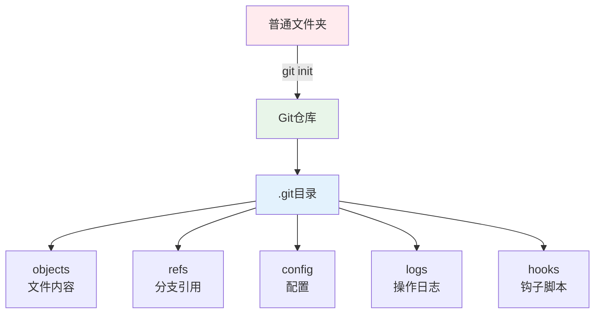
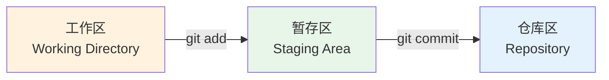
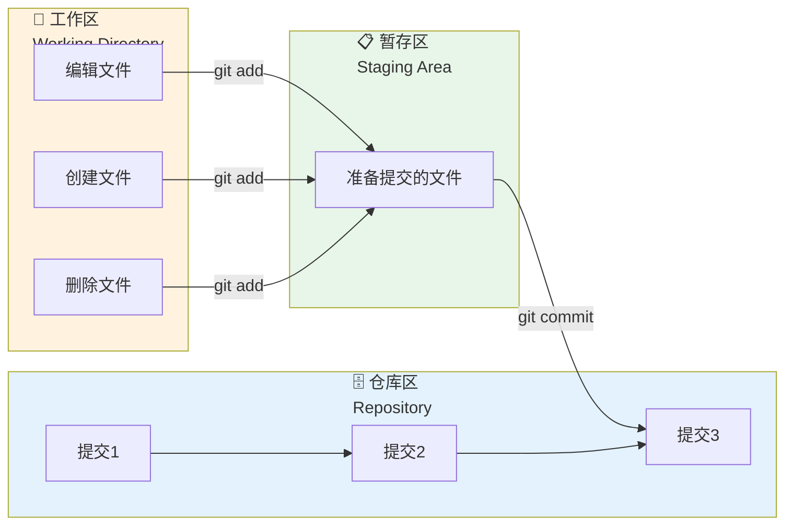
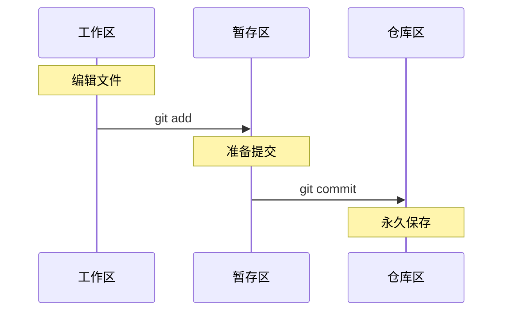
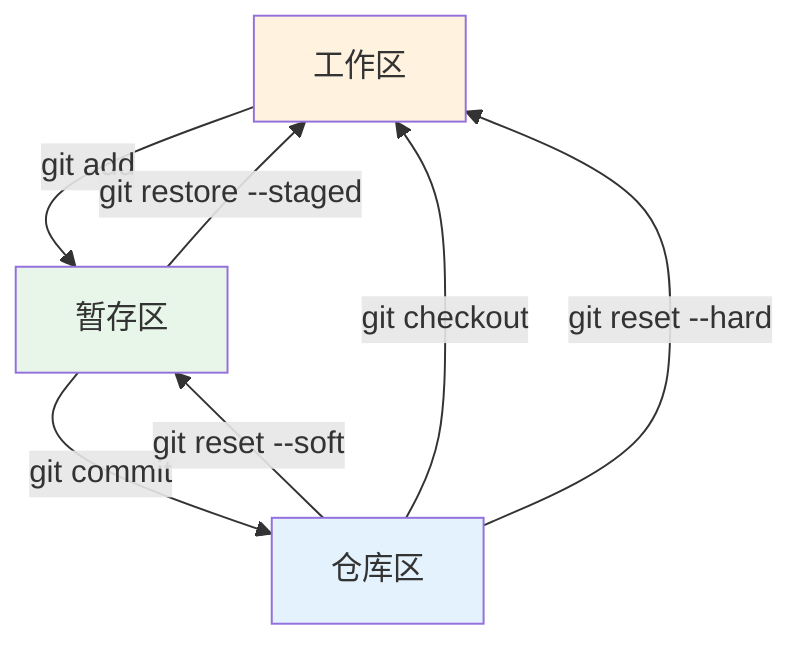
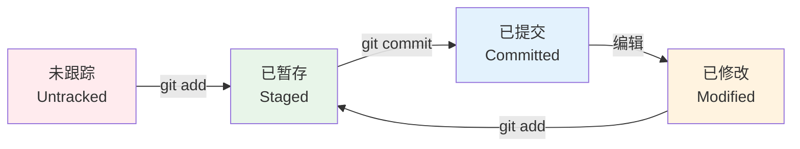
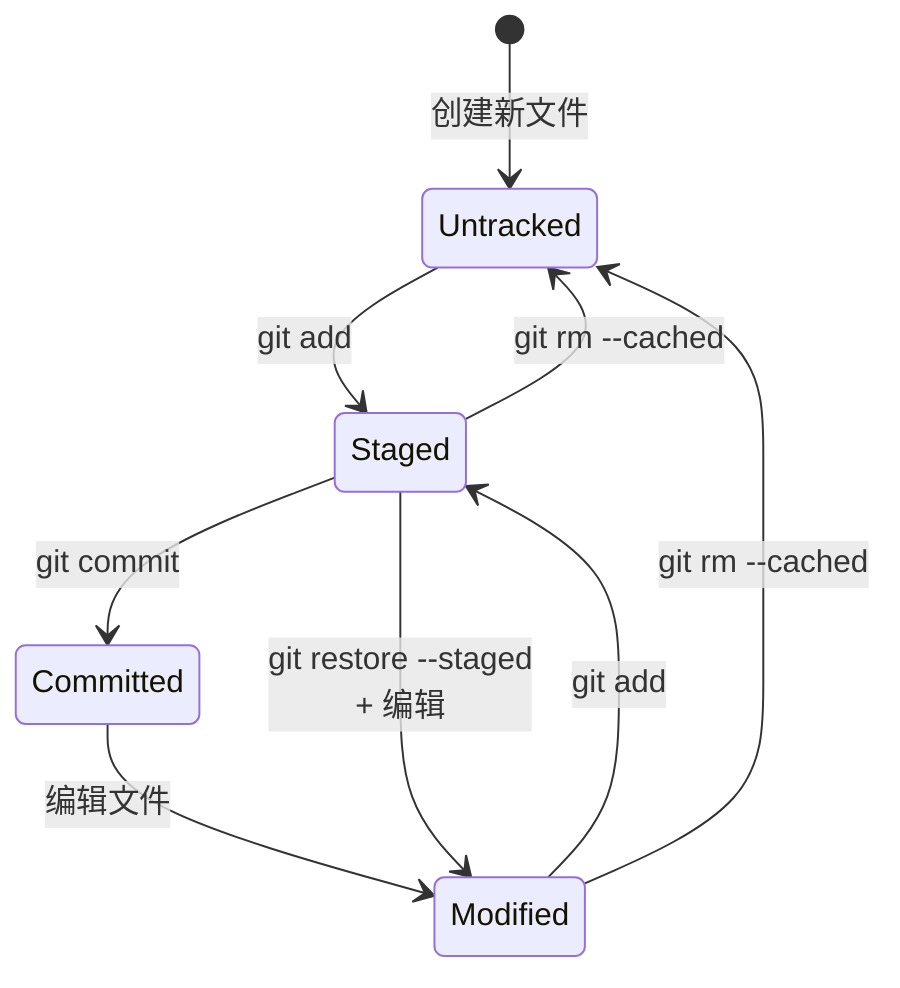
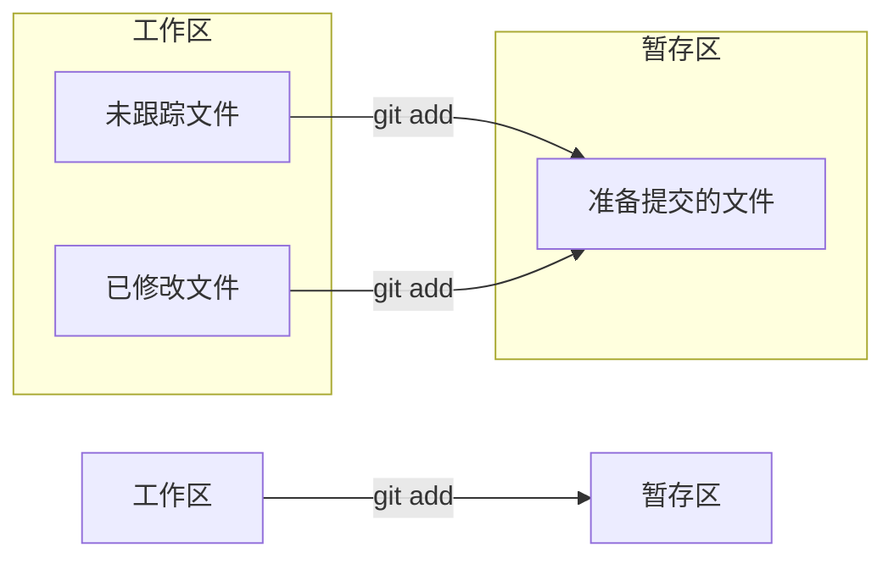
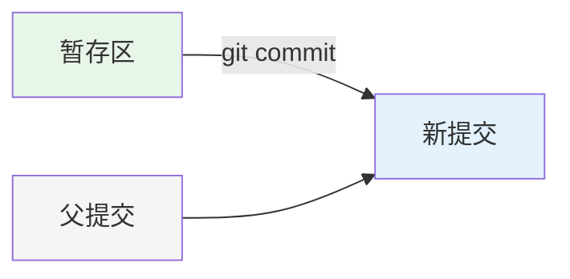

+++
title = "第4章：第一个仓库 —— 见证奇迹的时刻"
weight = 40
date = 2026-04-03T19:36:48+08:00
type = "docs"
description = ""
isCJKLanguage = true
draft = false
+++
# 第4章：第一个仓库 —— 见证奇迹的时刻

> *"普通文件夹是凡人，Git 仓库是超级英雄。"*

---

## 4.1 仓库 vs 普通文件夹：超能力觉醒

在成为 Git 用户之前，我们先要理解一个核心概念：**什么是 Git 仓库？**

### 普通文件夹：凡人

假设你有一个文件夹 `my-project`，里面有一些代码文件：

```
my-project/
├── index.html
├── style.css
└── script.js
```

这是一个**普通文件夹**。你可以：
- ✅ 创建、编辑、删除文件
- ✅ 复制、移动文件夹
- ❌ 无法知道文件的历史修改
- ❌ 无法回滚到之前的版本
- ❌ 无法协作开发
- ❌ 文件丢了就真丢了

### Git 仓库：超级英雄

现在，用 Git 初始化这个文件夹：

```bash
cd my-project
git init
```

瞬间，这个文件夹变成了**Git 仓库**！

```
my-project/
├── .git/          ← Git 的"大脑"，所有历史都在这里
├── index.html
├── style.css
└── script.js
```

多了一个 `.git` 文件夹，这就是 Git 的魔法来源。

现在你可以：
- ✅ 记录每次修改（提交）
- ✅ 查看历史版本
- ✅ 回滚到任意版本
- ✅ 创建分支并行开发
- ✅ 和团队协作
- ✅ 文件丢了也能恢复

### 仓库的本质

**Git 仓库（Repository）** 就是一个被 Git 管理的文件夹。Git 会在 `.git` 目录中记录：

- 所有文件的历史版本
- 谁在什么时候修改了什么
- 分支信息
- 远程仓库地址
- 配置信息



### 仓库的两种来源

1. **本地创建**：`git init`（从无到有）
2. **远程克隆**：`git clone`（从已有仓库复制）

这两种方式我们都会详细讲解。

### 仓库的状态

Git 仓库有三种"区域"：



- **工作区（Working Directory）**：你实际编辑文件的地方
- **暂存区（Staging Area）**：准备提交的文件列表
- **仓库区（Repository）**：永久保存的提交历史

这个概念很重要，后面会反复提到。

### 判断当前目录是否是 Git 仓库

```bash
# 方法1：查看是否有 .git 目录
ls -la | grep .git

# 方法2：使用 Git 命令
git status
# 如果是仓库，显示分支信息
# 如果不是仓库，显示 "fatal: not a git repository"

# 方法3：查看 Git 配置
git rev-parse --git-dir
# 输出 .git 目录的路径
```

### 删除仓库

不想用 Git 了？删除 `.git` 目录即可：

```bash
# 删除 Git 仓库（保留文件）
rm -rf .git

# Windows
del /s /q .git
rmdir /s /q .git
```

⚠️ **警告**：删除 `.git` 后，所有历史记录都会丢失！

### 本章预告

接下来，我们将：
- 用 `git init` 创建第一个仓库
- 用 `git clone` 克隆已有仓库
- 理解工作区、暂存区、仓库区的关系
- 完成第一次提交

准备好了吗？让我们创建你的第一个 Git 仓库！

---

## 4.2 `git init` 的魔法：从无到有

`git init` 是 Git 中最简单的命令之一，却也是最神奇的命令之一。

它能把一个普通文件夹变成 Git 仓库，就像给凡人注入超能力。

### 创建你的第一个仓库

让我们一步步来：

#### 步骤1：创建一个文件夹

```bash
# 创建项目文件夹
mkdir my-first-repo

# 进入文件夹
cd my-first-repo

# 查看当前目录（应该是空的）
ls -la
```

#### 步骤2：初始化 Git 仓库

```bash
# 执行魔法命令
git init
```

你会看到类似这样的输出：

```
Initialized empty Git repository in /path/to/my-first-repo/.git/
```

翻译：**已初始化空的 Git 仓库**

#### 步骤3：查看变化

```bash
# 查看目录内容
ls -la
```

现在你应该看到：

```
my-first-repo/
└── .git/          ← 新出现的！
```

### `.git` 目录里有什么？

让我们偷看一下 Git 的"大脑"：

```bash
# 查看 .git 目录结构
ls -la .git/
```

输出示例：

```
.git/
├── HEAD           # 指向当前分支
├── config         # 仓库级别的配置
├── description    # 仓库描述（供 GitWeb 使用）
├── hooks/         # 钩子脚本目录
├── info/          # 额外信息
├── objects/       # 所有文件内容（压缩存储）
├── refs/          # 分支和标签引用
└── ...
```

**重要**：不要手动修改 `.git` 目录里的内容！除非你知道自己在做什么。

### `git init` 的选项

`git init` 还有一些有用的选项：

```bash
# 指定目录名初始化
git init my-project
# 会在当前目录下创建 my-project 文件夹并初始化

# 初始化裸仓库（用于服务器）
git init --bare my-project.git
# 裸仓库没有工作区，只有 .git 内容

# 指定初始分支名
git init --initial-branch=main
# 或者 -b main

# 安静模式（不输出信息）
git init --quiet
# 或者 -q
```

### 初始化后的状态

执行 `git init` 后，运行 `git status`：

```bash
git status
```

输出：

```
On branch main

No commits yet

nothing to commit (create/copy files and use "git add" to track)
```

翻译：
- 当前在 `main` 分支
- 还没有任何提交
- 没有什么可提交的（创建或复制文件，然后用 "git add" 跟踪它们）

### 实践：创建一个完整的项目

让我们创建一个真实的项目：

```bash
# 1. 创建并进入文件夹
mkdir hello-git
cd hello-git

# 2. 初始化 Git 仓库
git init

# 3. 创建项目文件
echo "# Hello Git" > README.md
echo "console.log('Hello, Git!');" > hello.js

# 4. 查看状态
git status
```

`git status` 会显示：

```
On branch main

No commits yet

Untracked files:
  (use "git add <file>..." to include in what will be committed)
        README.md
        hello.js

nothing added to commit but untracked files present (use "git add" to track)
```

Git 发现了两个**未跟踪的文件**（Untracked files），它们还在工作区，没有被 Git 管理。

### 常见错误

#### 1. 在错误的目录执行 `git init`

```bash
# 错误：在家目录初始化
cd ~
git init

# 结果：整个家目录变成了 Git 仓库！
# 解决：删除 .git 目录
rm -rf ~/.git
```

#### 2. 重复初始化

```bash
# 在一个已经是仓库的目录再次执行
git init

# 结果：Git 会提示 "Reinitialized existing Git repository"
# 这不是错误，只是提醒
```

#### 3. 在 `.git` 目录里执行命令

```bash
cd .git
git status

# 结果：fatal: not a git repository: '.'
# 解决：回到上级目录
cd ..
```

### 最佳实践

1. **在项目根目录初始化**：不要在子目录或父目录初始化
2. **先创建文件夹，再初始化**：不要先初始化再移动
3. **`.git` 要加入 `.gitignore`**：不需要，Git 会自动忽略自己
4. **不要删除 `.git`**：除非你确定不再需要版本控制

### 总结

```bash
# 创建仓库的三部曲
mkdir my-project      # 1. 创建文件夹
cd my-project         # 2. 进入文件夹
git init              # 3. 初始化 Git
```

`git init` 是开始 Git 之旅的第一步。执行它，你就拥有了一个可以记录历史、回溯时光的超能力文件夹！

---

## 4.3 克隆已有仓库：`git clone` 入门

上一节我们学习了如何从零创建仓库。但更多时候，你需要加入一个已有的项目——这时候就需要 `git clone`。

### 什么是克隆？

**克隆（Clone）** 就是把远程仓库的完整副本下载到本地。包括：
- 所有文件
- 所有历史提交
- 所有分支
- 所有标签

就像克隆羊多莉一样，你得到的是一个完整的复制体。

### 克隆的基本语法

```bash
git clone <仓库地址>
```

### 从 GitHub 克隆仓库

#### 步骤1：获取仓库地址

在 GitHub 上打开一个仓库，点击绿色的 "<> Code" 按钮，复制地址：

**HTTPS 地址**（推荐新手）：
```
https://github.com/用户名/仓库名.git
```

**SSH 地址**（需要配置密钥）：
```
git@github.com:用户名/仓库名.git
```

**GitHub CLI**（需要安装 gh）：
```
gh repo clone 用户名/仓库名
```

#### 步骤2：执行克隆

```bash
# 克隆到当前目录下的新文件夹
git clone https://github.com/用户名/仓库名.git

# 克隆到指定文件夹名
git clone https://github.com/用户名/仓库名.git my-folder

# 克隆特定分支
git clone -b 分支名 https://github.com/用户名/仓库名.git
```

#### 步骤3：进入仓库

```bash
# 进入克隆下来的文件夹
cd 仓库名

# 查看状态
git status
```

### 克隆示例

让我们克隆一个真实的开源项目：

```bash
# 克隆 React 项目（示例，会下载很久）
git clone https://github.com/facebook/react.git

# 克隆到指定目录
git clone https://github.com/facebook/react.git my-react

# 克隆后进入目录
cd my-react

# 查看远程地址
git remote -v

# 查看分支列表
git branch -a
```

### 克隆后的目录结构

```
仓库名/
├── .git/              # Git 仓库数据
├── 文件1
├── 文件2
├── 文件夹/
│   └── 更多文件
└── ...
```

和 `git init` 不同，`git clone` 会自动：
- 创建文件夹
- 初始化 Git 仓库
- 下载所有文件
- 设置远程地址
- 检出默认分支

### 克隆选项

```bash
# 只克隆最新提交（浅克隆，节省空间）
git clone --depth 1 https://github.com/用户名/仓库名.git

# 克隆特定分支
git clone -b main https://github.com/用户名/仓库名.git

# 克隆所有分支
git clone --single-branch https://github.com/用户名/仓库名.git
git clone --no-single-branch https://github.com/用户名/仓库名.git

# 递归克隆子模块
git clone --recursive https://github.com/用户名/仓库名.git

# 克隆到当前目录（注意最后的点）
git clone https://github.com/用户名/仓库名.git .

# 安静模式
git clone --quiet https://github.com/用户名/仓库名.git
```

### 克隆后的配置

克隆后，Git 已经自动配置了远程地址：

```bash
# 查看远程地址
git remote -v

# 输出示例：
# origin  https://github.com/用户名/仓库名.git (fetch)
# origin  https://github.com/用户名/仓库名.git (push)
```

`origin` 是远程仓库的默认别名。

### 常见问题

#### 1. 克隆失败：权限 denied

```
fatal: unable to access 'https://github.com/...': The requested URL returned error: 403
```

**原因**：
- 私有仓库，没有权限
- 需要登录

**解决**：
- 检查仓库地址是否正确
- 如果是私有仓库，确保有访问权限
- 使用 SSH 或配置凭据管理器

#### 2. 克隆失败：找不到仓库

```
fatal: repository 'https://github.com/xxx/yyy.git' not found
```

**原因**：
- 仓库地址错误
- 仓库不存在或已删除
- 仓库是私有的

**解决**：
- 检查地址拼写
- 确认仓库是否存在

#### 3. 克隆太慢

**解决**：
- 使用镜像源（国内用户）
- 使用 `--depth 1` 浅克隆
- 使用 SSH（有时更快）

#### 4. 克隆后文件夹为空

**原因**：默认分支可能是空的，或者克隆到了错误的目录。

**解决**：
```bash
# 查看所有分支
git branch -a

# 切换到其他分支
git checkout 分支名
```

### 克隆 vs 下载 ZIP

| 方式 | 优点 | 缺点 |
|------|------|------|
| `git clone` | 有完整历史，可以更新，可以贡献 | 需要 Git，文件更大 |
| 下载 ZIP | 简单快速，不需要 Git | 没有历史，无法更新 |

**推荐**：用 `git clone`，除非你只是临时看一下代码。

### 最佳实践

1. **使用 HTTPS**：新手友好，自动处理凭据
2. **给克隆的文件夹起有意义的名字**：
   ```bash
   git clone https://github.com/公司/项目.git 公司-项目
   ```
3. **先 fork 再克隆**：如果你想贡献代码
4. **定期更新**：`git pull` 获取最新代码

### 总结

```bash
# 克隆仓库
git clone https://github.com/用户名/仓库名.git

# 进入目录
cd 仓库名

# 开始工作！
```

`git clone` 是加入已有项目的门票。有了它，你可以站在巨人的肩膀上开始工作！

---

## 4.4 工作区、暂存区、仓库：Git 的三重境界

这是 Git 最核心的概念之一，理解它，你就掌握了 Git 的精髓。

### 三重境界图解



### 第一重：工作区（Working Directory）

**工作区**就是你实际看到的文件夹，你在这里编辑文件。

```
my-project/          ← 这就是工作区
├── .git/
├── index.html       ← 你在编辑这个
├── style.css
└── script.js
```

在工作区，你可以：
- 创建新文件
- 编辑现有文件
- 删除文件
- 重命名文件

但这些操作**还没有被 Git 记录**。

### 第二重：暂存区（Staging Area）

**暂存区**是一个虚拟的区域，记录了"准备提交的文件列表"。

想象暂存区是一个**购物车**：
- 你在超市（工作区）挑选商品
- 把想买的商品放进购物车（`git add`）
- 还可以从购物车拿出来（`git restore --staged`）
- 最后去收银台结账（`git commit`）

```bash
# 把文件添加到暂存区
git add 文件名

# 把所有修改添加到暂存区
git add .
```

### 第三重：仓库区（Repository）

**仓库区**是 Git 真正存储数据的地方，在 `.git` 目录里。

仓库区包含：
- 所有提交（commit）
- 所有分支
- 所有标签
- 完整的历史记录

一旦文件进入仓库区，它就**永久保存**了（除非删除仓库）。

```bash
# 把暂存区的内容提交到仓库
git commit -m "提交说明"
```

### 三者的关系



### 实际演示

让我们实际操作一遍：

```bash
# 1. 初始化仓库
git init triple-world

# 2. 进入工作区
cd triple-world

# 3. 在工作区创建文件（第一重）
echo "Hello World" > hello.txt

# 4. 查看状态
git status
# 输出：Untracked files: hello.txt
# 说明：文件在工作区，未被跟踪

# 5. 添加到暂存区（第二重）
git add hello.txt

# 6. 查看状态
git status
# 输出：Changes to be committed: hello.txt
# 说明：文件在暂存区，准备提交

# 7. 提交到仓库（第三重）
git commit -m "添加 hello.txt"

# 8. 查看状态
git status
# 输出：nothing to commit, working tree clean
# 说明：所有内容都已提交到仓库
```

### 为什么需要暂存区？

你可能会问：为什么不能直接从工作区提交到仓库？为什么要多一个暂存区？

**好处1：精确控制提交内容**

```bash
# 修改了3个文件，但只想提交其中2个
git add file1.txt
git add file2.txt
# file3.txt 不添加，不会被提交
git commit -m "只提交 file1 和 file2"
```

**好处2：分阶段提交**

```bash
# 先提交一部分
git add part1.txt
git commit -m "完成第一部分"

# 再提交另一部分
git add part2.txt
git commit -m "完成第二部分"
```

**好处3：撤销操作**

```bash
# 添加到暂存区后，发现加错了
git restore --staged 文件名
# 文件回到工作区，不会被提交
```

### 查看三个区域的状态

```bash
# 查看工作区和暂存区的差异
git diff

# 查看暂存区和仓库的差异
git diff --staged

# 查看工作区和仓库的差异
git diff HEAD
```

### 文件在三重境界间的移动



### 常见误区

#### 误区1：`git add` 后文件就安全了

**错误**：以为 `git add` 后文件就保存了。

**正确**：`git add` 只是放到暂存区，只有 `git commit` 才真正保存。

#### 误区2：工作区的文件删除后，仓库里的也没了

**错误**：删除工作区的文件，以为历史也丢了。

**正确**：工作区的删除不影响仓库，可以用 `git checkout` 恢复。

#### 误区3：暂存区的文件会一直在

**错误**：以为暂存区的文件会永久保留。

**正确**：暂存区是临时的，提交后清空，切换分支后也可能变化。

### 总结

```
工作区 → 暂存区 → 仓库
 编辑  →  准备  → 保存
```

记住这个流程，你就掌握了 Git 的基本工作流程！

---

## 4.5 购物车理论：为什么 Git 要有暂存区

上一节我们知道了 Git 有工作区、暂存区、仓库三重境界。但你可能会问：**为什么需要暂存区？直接提交不好吗？**

让我用**购物车理论**来解释。

### 超市购物类比

想象你在超市购物：


| 超市 | Git |
|------|-----|
| 货架上的商品 | 工作区的文件 |
| 购物车 | 暂存区 |
| 收银台结账 | `git commit` |
| 已购买的商品 | 仓库中的提交 |

### 为什么需要购物车？

#### 场景1：挑选商品

你在超市看到一堆想买的：
- 牛奶
- 面包
- 巧克力
- 薯片
- 可乐

但你只有 50 块钱，不能全买。于是你把想买的放进购物车，再慢慢筛选。

**Git 场景**：你修改了 10 个文件，但只想提交其中 5 个。

```bash
# 把想提交的文件放进"购物车"
git add file1.txt
git add file2.txt
git add file3.txt
git add file4.txt
git add file5.txt

# 其他5个文件还在工作区，不会被提交
```

#### 场景2：改变主意

你把巧克力放进了购物车，但突然想起来在减肥，于是又把巧克力放回货架。

**Git 场景**：你把文件添加到暂存区，但发现加错了。

```bash
# 把文件从暂存区拿出来
git restore --staged wrong-file.txt

# 文件回到工作区，不会被提交
```

#### 场景3：分批结账

你的购物车满了，但你想先结账一部分，再继续购物。

**Git 场景**：你想把修改分成多个提交。

```bash
# 第一批结账
git add feature-part1.txt
git commit -m "添加功能第一部分"

# 第二批结账
git add feature-part2.txt
git commit -m "添加功能第二部分"

# 第三批结账
git add feature-part3.txt
git commit -m "添加功能第三部分"
```

#### 场景4：检查购物车

结账前，你想检查一下购物车里的东西，确保没有遗漏或多余。

**Git 场景**：提交前检查暂存区的内容。

```bash
# 查看暂存区的文件
git status

# 查看暂存区和仓库的差异
git diff --staged

# 确认没问题后再提交
git commit -m "确认后的提交"
```

### 没有暂存区会怎样？

假设 Git 没有暂存区，只能直接从工作区提交：

```bash
# 你修改了 10 个文件
git commit -m "修改"

# 结果：10个文件的修改全提交了！
# 无法选择只提交部分文件
```

这会导致：
- 提交粒度太粗，难以追踪具体问题
- 无法把不同功能的修改分开提交
- 不小心把未完成的工作也提交了

### 暂存区的优势

| 优势 | 说明 |
|------|------|
| **精确控制** | 只提交想提交的文件 |
| **分阶段** | 把大修改拆分成小提交 |
| **可撤销** | 添加后可以撤回 |
| **可预览** | 提交前检查内容 |
| **灵活性** | 多种组合方式 |

### 实际案例

假设你在开发一个功能，同时：
- 修复了一个 bug
- 重构了代码
- 添加了新功能
- 更新了文档

**不好的做法**（一次性提交）：

```bash
git add .
git commit -m "各种修改"
```

**好的做法**（分阶段提交）：

```bash
# 先提交 bug 修复
git add bugfix.js
git commit -m "修复登录 bug"

# 再提交重构
git add refactor.js
git commit -m "重构用户模块"

# 再提交新功能
git add feature.js
git commit -m "添加用户搜索功能"

# 最后提交文档
git add README.md
git commit -m "更新 API 文档"
```

这样，每个提交都有清晰的职责，方便回滚和 code review。

### 暂存区的其他用法

#### 1. 部分添加（交互式）

```bash
# 交互式添加，可以选择文件的某些部分
git add -p 文件名
```

#### 2. 查看暂存区内容

```bash
# 查看暂存区的文件列表
git diff --cached --name-only

# 查看暂存区的详细内容
git diff --cached
```

#### 3. 清空暂存区

```bash
# 把所有文件从暂存区拿出来
git reset HEAD

# 或者
git restore --staged .
```

### 总结

暂存区就像购物车：
- 让你**挑选**要提交的内容
- 让你**改变主意**
- 让你**分批处理**
- 让你**检查确认**

没有购物车，超市会乱套；没有暂存区，Git 也会乱套。

```
工作区 = 货架
暂存区 = 购物车
git commit = 结账
```

下次用 `git add` 的时候，想象自己在往购物车里放东西！

---

## 4.6 文件的四种状态：未跟踪、已修改、已暂存、已提交

Git 中的文件有四种状态，理解它们是掌握 Git 的基础。

### 四种状态图解



### 状态1：未跟踪（Untracked）

**定义**：文件存在于工作区，但 Git 不知道它的存在。

**特征**：
- 文件是新的，从未被 Git 管理过
- `git status` 显示为红色
- 不会被包含在提交中

**示例**：

```bash
# 创建新文件
echo "新文件" > new-file.txt

# 查看状态
git status
```

输出：
```
Untracked files:
  (use "git add <file>..." to include in what will be committed)
        new-file.txt
```

**图标**：❓ 未跟踪

### 状态2：已修改（Modified）

**定义**：文件已被 Git 跟踪，但工作区的版本和仓库中的版本不同。

**特征**：
- 文件之前被提交过
- 现在被修改了
- `git status` 显示为红色
- 修改不会被自动提交

**示例**：

```bash
# 修改已跟踪的文件
echo "修改内容" >> tracked-file.txt

# 查看状态
git status
```

输出：
```
Changes not staged for commit:
  (use "git add <file>..." to update what will be committed)
        modified:   tracked-file.txt
```

**图标**：✏️ 已修改

### 状态3：已暂存（Staged）

**定义**：文件已被添加到暂存区，准备提交。

**特征**：
- 文件在暂存区等待
- `git status` 显示为绿色
- 执行 `git commit` 会被提交

**示例**：

```bash
# 添加到暂存区
git add tracked-file.txt

# 查看状态
git status
```

输出：
```
Changes to be committed:
  (use "git restore --staged <file>..." to unstage)
        modified:   tracked-file.txt
```

**图标**：📋 已暂存

### 状态4：已提交（Committed）

**定义**：文件已被保存到仓库，成为历史的一部分。

**特征**：
- 文件安全地保存在 `.git` 目录
- `git status` 不显示（工作区干净）
- 可以随时回滚到这个版本

**示例**：

```bash
# 提交到仓库
git commit -m "修改 tracked-file"

# 查看状态
git status
```

输出：
```
nothing to commit, working tree clean
```

**图标**：✅ 已提交

### 完整状态流转



### 查看文件状态

```bash
# 查看所有文件状态
git status

# 简短格式（推荐）
git status -s
git status --short
```

`git status -s` 的输出格式：

```
 M modified-file.txt      # 已修改，未暂存
M  staged-file.txt       # 已修改，已暂存
MM both-modified.txt     # 已暂存，又被修改
A  new-file.txt          # 新文件，已暂存
?? untracked.txt         # 未跟踪
D  deleted.txt           # 已删除，已暂存
 R renamed.txt           # 重命名，已暂存
```

**两列状态码的含义**：
- **第一列**：暂存区状态
- **第二列**：工作区状态

| 状态码 | 含义 |
|--------|------|
| ` `（空格） | 无变化 |
| `M` | 已修改 |
| `A` | 已添加（新文件） |
| `D` | 已删除 |
| `R` | 已重命名 |
| `C` | 已复制 |
| `U` | 已更新但未合并 |
| `?` | 未跟踪 |
| `!` | 被忽略 |

### 状态转换命令

```bash
# 未跟踪 → 已暂存
git add 文件名

# 已修改 → 已暂存
git add 文件名

# 已暂存 → 已提交
git commit -m "提交信息"

# 已暂存 → 已修改（从暂存区拿出来）
git restore --staged 文件名

# 已修改 → 已提交（跳过暂存区，不推荐）
git commit -am "提交信息"

# 已提交 → 已修改（检出旧版本）
git checkout HEAD~1 -- 文件名
```

### 实际演示

```bash
# 1. 初始化仓库
git init status-demo
cd status-demo

# 2. 创建文件（未跟踪）
echo "第一行" > file.txt
git status -s
# 输出: ?? file.txt

# 3. 添加到暂存区（已暂存）
git add file.txt
git status -s
# 输出: A  file.txt

# 4. 提交（已提交）
git commit -m "初始提交"
git status -s
# 输出: （空）

# 5. 修改文件（已修改）
echo "第二行" >> file.txt
git status -s
# 输出:  M file.txt

# 6. 添加到暂存区（已暂存）
git add file.txt
git status -s
# 输出: M  file.txt

# 7. 再次修改（已暂存 + 已修改）
echo "第三行" >> file.txt
git status -s
# 输出: MM file.txt

# 8. 提交（已提交）
git add file.txt
git commit -m "第二次提交"
git status -s
# 输出: （空）
```

### 总结

| 状态 | 英文 | 位置 | 颜色 | 图标 |
|------|------|------|------|------|
| 未跟踪 | Untracked | 工作区 | 红色 | ❓ |
| 已修改 | Modified | 工作区 | 红色 | ✏️ |
| 已暂存 | Staged | 暂存区 | 绿色 | 📋 |
| 已提交 | Committed | 仓库 | 无 | ✅ |

记住这个表格，你就掌握了 Git 文件状态的核心！

---

## 4.7 `git status`：你最好的朋友（也是你最该多用的命令）

如果你只能记住一个 Git 命令，那应该是 `git status`。

它是你最忠实的朋友，随时告诉你仓库的状态，永远不会对你隐瞒。

### 基本用法

```bash
# 查看仓库状态
git status
```

### 为什么 `git status` 这么重要？

想象一下：
- 你不知道哪些文件被修改了 → `git status` 告诉你
- 你不知道哪些文件在暂存区 → `git status` 告诉你
- 你不知道当前在哪个分支 → `git status` 告诉你
- 你不知道是否可以安全提交 → `git status` 告诉你

**`git status` 是 Git 的"体检报告"**，每次操作前都看一眼，避免踩坑。

### `git status` 的输出解读

#### 场景1：干净的工作区

```bash
$ git status
On branch main
nothing to commit, working tree clean
```

**含义**：
- 当前在 `main` 分支
- 没有可提交的内容
- 工作区是干净的

**可以做什么**：
- 安全地切换分支
- 安全地拉取更新
- 开始新的工作

#### 场景2：有未跟踪的文件

```bash
$ git status
On branch main
Untracked files:
  (use "git add <file>..." to include in what will be committed)
        new-file.txt
        another-file.js

nothing added to commit but untracked files present (use "git add" to track)
```

**含义**：
- 有两个新文件未被 Git 跟踪
- Git 提示可以用 `git add` 来跟踪

**可以做什么**：
- 用 `git add` 添加到暂存区
- 或者加入 `.gitignore` 忽略

#### 场景3：有已修改但未暂存的文件

```bash
$ git status
On branch main
Changes not staged for commit:
  (use "git add <file>..." to update what will be committed)
  (use "git restore <file>..." to discard changes in working directory)
        modified:   README.md
        modified:   src/main.js

no changes added to commit (use "git add" or "git commit -a")
```

**含义**：
- 两个文件被修改了
- 修改还没有添加到暂存区
- Git 提示可以用 `git add` 暂存，或用 `git restore` 撤销

**可以做什么**：
- 用 `git add` 添加到暂存区
- 用 `git restore` 撤销修改
- 用 `git diff` 查看具体修改

#### 场景4：有已暂存的文件

```bash
$ git status
On branch main
Changes to be committed:
  (use "git restore --staged <file>..." to unstage)
        modified:   README.md
        new file:   new-feature.js

```

**含义**：
- 一个文件被修改并暂存
- 一个新文件被添加并暂存
- 准备提交

**可以做什么**：
- 用 `git commit` 提交
- 用 `git restore --staged` 从暂存区拿出
- 用 `git diff --staged` 查看暂存的内容

#### 场景5：混合状态

```bash
$ git status
On branch main
Changes to be committed:
  (use "git restore --staged <file>..." to unstage)
        modified:   README.md

Changes not staged for commit:
  (use "git add <file>..." to update what will be committed)
  (use "git restore <file>..." to discard changes in working directory)
        modified:   README.md
        modified:   src/main.js

Untracked files:
  (use "git add <file>..." to include in what will be committed)
        experiment.txt
```

**含义**：
- `README.md` 已暂存，但又被修改了（两次修改）
- `src/main.js` 被修改但未暂存
- `experiment.txt` 是未跟踪的新文件

**可以做什么**：
- 分别处理每个文件
- 用 `git add` 更新暂存区
- 用 `git commit` 提交已暂存的内容

### `git status` 的选项

```bash
# 简短格式（推荐日常使用）
git status -s
git status --short

# 显示分支信息
git status -b
git status --branch

# 不显示未跟踪的文件
git status -uno

# 显示被忽略的文件
git status --ignored

# 显示 porcelain 格式（脚本友好）
git status --porcelain
```

### 简短格式详解

```bash
$ git status -s
 M modified.txt      # 已修改，未暂存（第二列 M）
M  staged.txt       # 已修改，已暂存（第一列 M）
MM both.txt         # 已暂存，又被修改（两列都是 M）
A  added.txt        # 新文件，已暂存
?? untracked.txt    # 未跟踪
D  deleted.txt       # 已删除，已暂存
 R renamed.txt      # 重命名
```

### 最佳实践

#### 1. 频繁使用

```bash
# 养成习惯：做任何操作前先看状态
git status
git add .
git status  # 再确认一遍
git commit -m "提交"
git status  # 确认提交成功
```

#### 2. 使用简短格式

```bash
# 日常使用 -s 更清爽
$ git status -s
 M file1.txt
A  file2.txt
?? file3.txt
```

#### 3. 结合其他命令

```bash
# 状态 + 差异
git status && git diff

# 状态 + 暂存差异
git status && git diff --staged
```

### 常见错误

#### 错误1：不看状态就提交

```bash
git add .
git commit -m "修改"
# 结果：把不想提交的文件也提交了！
```

**正确做法**：
```bash
git add .
git status  # 检查要提交的内容
git commit -m "修改"
```

#### 错误2：以为提交成功了，其实没有

```bash
git commit -m "修改"
# 没有任何输出？可能是失败了
```

**正确做法**：
```bash
git commit -m "修改"
git status  # 确认工作区是否干净
```

### 总结

```
不知道怎么办？ → git status
不确定状态？ → git status
准备提交？ → git status
提交后？ → git status
```

`git status` 就像 GPS，随时告诉你现在在哪里，该往哪走。

**多用 `git status`，少走弯路！**

---

## 4.8 `git add`：把商品放进购物车

还记得购物车理论吗？`git add` 就是把商品放进购物车的动作。

### 基本用法

```bash
# 添加单个文件
git add 文件名.txt

# 添加多个文件
git add 文件1.txt 文件2.txt 文件3.txt

# 添加所有修改（常用）
git add .

# 添加所有修改（包括删除）
git add -A
git add --all
```

### `git add` 的作用



`git add` 做两件事：
1. **跟踪新文件**：把未跟踪的文件加入 Git 管理
2. **暂存修改**：把已修改的文件快照保存到暂存区

### 各种添加方式

#### 1. 添加单个文件

```bash
# 添加特定文件
git add README.md

# 添加特定类型的文件
git add *.js      # 所有 js 文件
git add src/*.css # src 目录下的所有 css 文件
```

#### 2. 添加多个文件

```bash
# 逐个列出
git add file1.txt file2.txt file3.txt

# 使用通配符
git add *.txt     # 所有 txt 文件
git add src/**    # src 目录下的所有文件（递归）
```

#### 3. 添加所有文件

```bash
# 添加当前目录的所有修改
git add .

# 添加整个仓库的所有修改（包括删除）
git add -A
git add --all

# 添加所有修改（不包括新文件）
git add -u
git add --update
```

**区别**：
- `git add .`：添加当前目录的修改和新文件
- `git add -A`：添加所有修改、新文件和删除
- `git add -u`：只添加已跟踪文件的修改和删除

### 交互式添加（高级）

```bash
# 交互式添加，可以选择文件的某些部分
git add -p
git add --patch

# 交互式添加特定文件
git add -p 文件名.txt
```

交互式添加会逐块询问你是否添加：

```
diff --git a/file.txt b/file.txt
index 1234567..abcdefg 100644
--- a/file.txt
+++ b/file.txt
@@ -1,3 +1,5 @@
 line1
 line2
+new line
 line3

Stage this hunk [y,n,q,a,d,s,e,?]? 
```

选项：
- `y`：添加这一块
- `n`：跳过这一块
- `q`：退出
- `a`：添加这一块和后面的所有块
- `d`：跳过这一块和后面的所有块
- `s`：把这一块拆分成更小的块
- `e`：手动编辑这一块
- `?`：显示帮助

### 常见用法示例

```bash
# 场景1：添加新文件
git add new-feature.js

# 场景2：添加修改的文件
git add modified-file.txt

# 场景3：添加所有修改（最常用）
git add .

# 场景4：添加并查看状态
git add . && git status

# 场景5：交互式添加（精确控制）
git add -p
```

### 撤销添加

如果加错了文件，可以从暂存区拿出来：

```bash
# 从暂存区移除特定文件（保留修改）
git restore --staged 文件名.txt

# 从暂存区移除所有文件（保留修改）
git restore --staged .

# 旧版本 Git 使用
git reset HEAD 文件名.txt
git reset HEAD
```

### 添加后的状态

```bash
# 添加前
git status
# 输出：
# Changes not staged for commit:
#   modified:   file.txt

# 添加后
git add file.txt
git status
# 输出：
# Changes to be committed:
#   modified:   file.txt
```

### 注意事项

#### 1. `git add` 不是保存

```bash
git add file.txt
# 文件只是到了暂存区，还没有真正保存！

# 必须 commit 才真正保存
git commit -m "保存修改"
```

#### 2. 可以多次添加

```bash
git add file.txt
# 继续修改 file.txt
git add file.txt  # 再次添加，暂存区会更新
```

#### 3. 添加后还可以修改

```bash
git add file.txt      # 添加到暂存区
echo "新内容" >> file.txt  # 继续修改
git status            # 显示已暂存 + 已修改
```

### 最佳实践

```bash
# 1. 先查看状态
git status

# 2. 添加特定文件（推荐）
git add 文件1 文件2

# 3. 或者添加所有
git add .

# 4. 再查看状态确认
git status

# 5. 提交
git commit -m "提交信息"
```

### 总结

```
工作区 → git add → 暂存区 → git commit → 仓库
```

`git add` 就像把商品放进购物车：
- 可以挑选特定的商品
- 可以分批放入
- 可以拿出来
- 最后要结账（commit）才真正属于你

下次用 `git add` 的时候，想想购物车的比喻！

---

## 4.9 `git commit`：按下快门，永久保存

`git commit` 是 Git 中最重要的命令之一。它把暂存区的内容永久保存到仓库，就像按下相机的快门，记录下这一刻。

### 什么是提交（Commit）？

**提交**是 Git 中的基本单位，代表一次完整的保存操作。每个提交包含：
- 文件的快照（内容）
- 作者信息（谁提交的）
- 提交时间（什么时候提交的）
- 提交信息（为什么提交）
- 父提交（上一个提交是谁）



### 基本用法

```bash
# 基本提交（推荐）
git commit -m "提交信息"

# 提交并添加所有已跟踪的修改（跳过 git add）
git commit -am "提交信息"

# 提交并打开编辑器写提交信息
git commit
```

### 提交信息的重要性

提交信息就像照片的备注，告诉未来的你（和同事）这次提交做了什么。

**不好的提交信息**：
```
git commit -m "修改"
git commit -m "更新"
git commit -m "fix"
git commit -m "111"
```

**好的提交信息**：
```
git commit -m "修复登录页面的验证码错误"
git commit -m "添加用户搜索功能"
git commit -m "重构订单模块，提高性能"
```

### 提交信息的最佳实践

#### 1. 第一行是标题（50字以内）

```bash
git commit -m "添加用户注册功能"
```

#### 2. 详细描述（可选）

```bash
# 使用多行提交信息
git commit -m "添加用户注册功能

- 实现邮箱验证
- 添加密码强度检查
- 集成验证码服务
- 修复 #123"

# 或者使用编辑器
git commit
```

#### 3. 使用祈使句

```bash
# 推荐（祈使句）
git commit -m "添加功能"
git commit -m "修复 bug"
git commit -m "更新文档"

# 不推荐
# git commit -m "添加了功能"
# git commit -m "修复了 bug"
```

#### 4. 说明为什么，而不是什么

```bash
# 不好的（说了做了什么）
git commit -m "修改 login.js"

# 好的（说了为什么做）
git commit -m "修复登录超时问题，将超时时间从5秒改为10秒"
```

### 提交后的状态

```bash
# 提交前
git status
# 输出：
# Changes to be committed:
#   modified:   file.txt

# 提交
git commit -m "修改 file.txt"

# 提交后
git status
# 输出：
# nothing to commit, working tree clean
```

### 查看提交历史

```bash
# 查看提交历史
git log

# 简洁格式
git log --oneline

# 图形化显示
git log --oneline --graph

# 查看最近3次提交
git log -3

# 查看提交详情
git show HEAD
```

### 提交选项

```bash
# 提交并添加所有已跟踪的修改
git commit -am "提交信息"

# 修改上次提交（如果还没推送）
git commit --amend -m "新的提交信息"

# 提交时跳过钩子检查
git commit -m "提交信息" --no-verify

# 提交时允许空提交
git commit -m "提交信息" --allow-empty
```

### 修改上次提交

如果提交后发现有问题，可以修改：

```bash
# 修改提交信息
git commit --amend -m "新的提交信息"

# 添加遗漏的文件到上次提交
git add 遗漏的文件.txt
git commit --amend --no-edit
```

⚠️ **注意**：如果已经推送到远程，修改提交会改变 commit hash，需要强制推送。

### 提交的本质

每次提交都会生成一个唯一的哈希值（commit hash）：

```bash
$ git log --oneline
a1b2c3d 修复登录bug
e4f5g6h 添加注册功能
i7j8k9l 初始化项目
```

`a1b2c3d` 就是这次提交的哈希值（完整是40位，这里只显示前7位）。

这个哈希值是唯一的，基于提交内容计算得出。只要内容不变，哈希值就不变。

### 提交对象的结构

```
提交对象 (Commit)
├── 树对象 (Tree) - 文件目录结构
│   ├── 文件1 (Blob)
│   ├── 文件2 (Blob)
│   └── 子目录 (Tree)
├── 父提交 (Parent Commit)
├── 作者 (Author)
├── 提交者 (Committer)
└── 提交信息 (Message)
```

### 第一次提交的仪式感

第一次提交总是特别的。建议：

1. **截图留念**
2. **写一个有意义的提交信息**
3. **庆祝一下** 🎉

```bash
# 第一次提交
git commit -m "Initial commit: 项目初始化"

# 或者更有仪式感
git commit -m "🎉 Initial commit"
```

### 常见问题

#### 1. 提交时提示 "nothing to commit"

```bash
$ git commit -m "修改"
nothing to commit, working tree clean
```

**原因**：暂存区是空的，没有内容可以提交。

**解决**：
```bash
git add .
git commit -m "修改"
```

#### 2. 提交时进入 Vim

```bash
$ git commit
# 进入了 Vim 编辑器！
```

**原因**：没有使用 `-m` 参数，Git 打开了默认编辑器。

**解决**：
- 配置编辑器：`git config --global core.editor "code --wait"`
- 或者使用 `-m` 参数

#### 3. 提交后想撤销

```bash
# 撤销上次提交，保留修改
git reset --soft HEAD~1

# 撤销上次提交，丢弃修改（危险！）
git reset --hard HEAD~1
```

### 总结

```
git add → 把商品放进购物车
git commit → 结账，商品真正属于你
```

`git commit` 是 Git 的核心操作。每次提交都是一次快照，让你随时可以回到过去。

**提交前想一想**：这个提交信息，三个月后的你还能看懂吗？

---

## 4.10 第一次提交的仪式感：建议截图留念

第一次提交，就像第一次约会、第一次发工资、第一次买房——值得纪念。

### 为什么要有仪式感？

1. **里程碑**：标志着你正式开始了版本控制之旅
2. **成就感**：从零到一的突破
3. **纪念意义**：多年后回看，会感慨万分
4. **社交货币**：可以发朋友圈炫耀（程序员的朋友圈）

### 第一次提交的标准流程

```bash
# 1. 创建项目文件夹
mkdir my-awesome-project
cd my-awesome-project

# 2. 初始化 Git
git init

# 3. 创建初始文件
echo "# My Awesome Project" > README.md
echo "console.log('Hello, World!');" > index.js

# 4. 查看状态
git status

# 5. 添加到暂存区
git add .

# 6. 查看状态确认
git status

# 7. 第一次提交！
git commit -m "🎉 Initial commit: 项目初始化"

# 8. 查看提交历史
git log --oneline
```

### 第一次提交的提交信息

#### 经典版

```bash
git commit -m "Initial commit"
```

####  emoji 版

```bash
git commit -m "🎉 Initial commit"
git commit -m "🚀 First commit"
git commit -m "✨ Begin the journey"
```

#### 详细版

```bash
git commit -m "Initial commit

- 初始化项目结构
- 添加 README.md
- 添加 .gitignore
- 配置基础开发环境"
```

#### 幽默版

```bash
git commit -m "It begins..."
git commit -m "Hello World, Hello Git"
git commit -m "The journey of a thousand commits begins with a single init"
```

### 截图留念指南

#### 截图1：初始化成功

```bash
git init
```

截图内容：
```
Initialized empty Git repository in /path/to/project/.git/
```

#### 截图2：第一次提交

```bash
git log --oneline
```

截图内容：
```
abc1234 🎉 Initial commit
```

#### 截图3：GitHub 上的第一次提交

推送到 GitHub 后，截图你的贡献图：

```
日 一 二 三 四 五 六
          🟩
```

### 分享到社交媒体

**朋友圈/推特文案**：

```
今天创建了第一个 Git 仓库！
从此代码有备份，修改有记录，回滚有退路。
绿格子，我来了！🟩

#Git #编程 #程序员
```

**微博文案**：

```
纪念我的第一次 git commit 🎉
虽然只是一个 README，但这是成为优秀程序员的第一步！
```

### 第一次提交的 checklist

- [ ] 创建了项目文件夹
- [ ] 执行了 `git init`
- [ ] 创建了至少一个文件（推荐 README.md）
- [ ] 执行了 `git add .`
- [ ] 执行了 `git commit -m "Initial commit"`
- [ ] 看到了绿色的提交记录
- [ ] 截图留念
- [ ] 发朋友圈/推特/微博（可选）

### 第一次提交后该做什么？

#### 1. 推送到远程（如果有 GitHub 账号）

```bash
# 在 GitHub 创建仓库
# 然后关联并推送
git remote add origin https://github.com/用户名/仓库名.git
git branch -M main
git push -u origin main
```

#### 2. 继续开发

```bash
# 添加更多功能
echo "新功能" >> README.md
git add .
git commit -m "添加新功能"
```

#### 3. 庆祝一下

- 喝杯咖啡 ☕
- 吃块蛋糕 🍰
- 休息5分钟 😴

### 第一次提交的哲学

> "千里之行，始于足下。"
> —— 老子

> "The journey of a thousand commits begins with a single init."
> —— 程序员改编版

第一次提交可能只是一个空文件、一行代码，但它标志着你：
- 开始重视代码管理
- 开始为团队协作做准备
- 开始追求专业开发

### 总结

```
第一次提交
├── 初始化 git init
├── 创建文件
├── 添加 git add
├── 提交 git commit
└── 截图留念 🎉
```

完成第一次提交后，你已经正式成为 Git 用户了！

**恭喜你，欢迎来到版本控制的世界！**

---

## 4.11 本章实战：从零创建一个项目并提交

理论学完了，现在来实战！我们将从零创建一个项目，完成第一次提交。

### 实战目标

1. 创建一个项目文件夹
2. 初始化 Git 仓库
3. 创建项目文件
4. 完成第一次提交
5. 再做几次提交
6. 查看提交历史

### 步骤详解

#### 步骤1：创建项目文件夹

```bash
# 创建项目文件夹
mkdir git-practice
cd git-practice

# 查看当前目录
pwd
# 输出：/path/to/git-practice
```

#### 步骤2：初始化 Git 仓库

```bash
# 初始化 Git
git init

# 查看生成的 .git 目录
ls -la
```

输出：
```
Initialized empty Git repository in /path/to/git-practice/.git/
```

#### 步骤3：创建项目文件

```bash
# 创建 README.md
cat > README.md << 'EOF'
# Git Practice Project

这是一个练习 Git 的项目。

## 功能

- 学习 Git 基础
- 练习提交操作
- 熟悉 Git 工作流

## 作者

你的名字
EOF

# 创建主程序文件
cat > main.py << 'EOF'
def hello():
    print("Hello, Git!")

if __name__ == "__main__":
    hello()
EOF

# 创建 .gitignore
cat > .gitignore << 'EOF'
# Python
__pycache__/
*.pyc
*.pyo

# IDE
.vscode/
.idea/

# OS
.DS_Store
Thumbs.db
EOF

# 查看创建的文件
ls -la
```

#### 步骤4：查看状态

```bash
# 查看 Git 状态
git status
```

输出：
```
On branch main

No commits yet

Untracked files:
  (use "git add <file>..." to include in what will be committed)
        .gitignore
        README.md
        main.py

nothing added to commit but untracked files present (use "git add" to track)
```

#### 步骤5：添加到暂存区

```bash
# 添加所有文件
git add .

# 查看状态确认
git status
```

输出：
```
On branch main

No commits yet

Changes to be committed:
  (use "git rm --cached <file>..." to unstage)
        new file:   .gitignore
        new file:   README.md
        new file:   main.py
```

#### 步骤6：第一次提交

```bash
# 提交
git commit -m "🎉 Initial commit: 项目初始化"

# 查看提交历史
git log --oneline
```

输出：
```
abc1234 🎉 Initial commit: 项目初始化
```

#### 步骤7：继续开发 - 添加新功能

```bash
# 修改 main.py，添加新功能
cat > main.py << 'EOF'
def hello():
    print("Hello, Git!")

def goodbye():
    print("Goodbye, Git!")

def main():
    hello()
    goodbye()

if __name__ == "__main__":
    main()
EOF

# 查看状态
git status
```

输出：
```
Changes not staged for commit:
        modified:   main.py
```

#### 步骤8：提交新功能

```bash
# 添加修改
git add main.py

# 提交
git commit -m "添加 goodbye 函数和 main 函数"

# 查看历史
git log --oneline
```

输出：
```
def5678 添加 goodbye 函数和 main 函数
abc1234 🎉 Initial commit: 项目初始化
```

#### 步骤9：更新 README

```bash
# 修改 README.md
cat >> README.md << 'EOF'

## 更新日志

- 2024-01-15: 项目初始化
- 2024-01-15: 添加 goodbye 功能
EOF

# 提交
git add README.md
git commit -m "更新 README，添加更新日志"

# 查看历史
git log --oneline
```

输出：
```
ghi9012 更新 README，添加更新日志
def5678 添加 goodbye 函数和 main 函数
abc1234 🎉 Initial commit: 项目初始化
```

#### 步骤10：查看完整历史

```bash
# 详细历史
git log

# 图形化显示
git log --oneline --graph --decorate
```

### 完整命令总结

```bash
# 1. 创建并进入文件夹
mkdir git-practice && cd git-practice

# 2. 初始化
git init

# 3. 创建文件
echo "# Git Practice" > README.md
echo "print('hello')" > main.py
echo "*.pyc" > .gitignore

# 4. 添加并提交
git add .
git commit -m "🎉 Initial commit"

# 5. 修改并提交
echo "print('world')" >> main.py
git add .
git commit -m "添加 world 输出"

# 6. 查看历史
git log --oneline
```

### 验证你的成果

```bash
# 查看当前状态（应该是干净的）
git status

# 查看提交历史
git log --oneline

# 查看文件内容
cat README.md
cat main.py

# 查看仓库大小
git count-objects -vH
```

### 恭喜你！

你已经完成了：
- ✅ 创建 Git 仓库
- ✅ 创建项目文件
- ✅ 完成多次提交
- ✅ 查看提交历史

这就是 Git 的基本工作流程！

### 下一步

你可以：
1. 继续修改文件并提交
2. 推送到 GitHub
3. 学习分支操作
4. 学习撤销操作

继续加油！

---

**第4章完**

