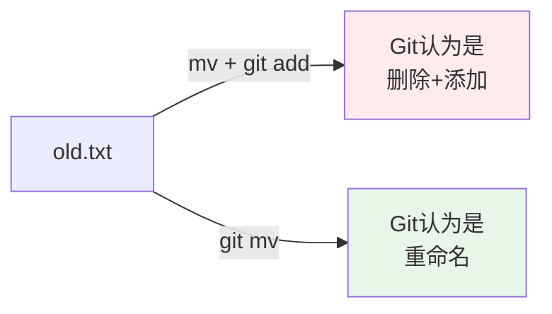
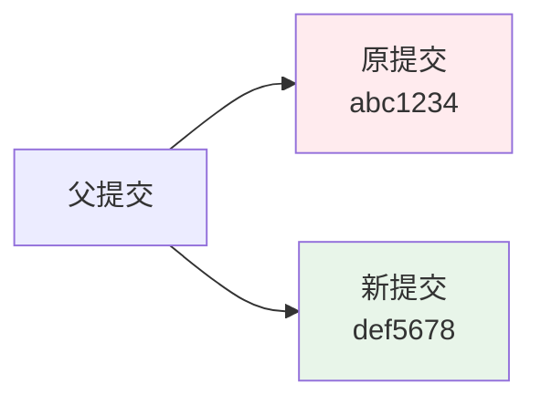

+++
title = "第5章：日常操作基本功 —— Git 世界的'基本功'"
weight = 50
date = 2026-04-03T19:36:48+08:00
type = "docs"
description = ""
isCJKLanguage = true
draft = false
+++
# 第5章：日常操作基本功 —— Git 世界的"基本功"

> *"基本功扎实，才能飞得更高。"*

---

## 5.1 `git add` 不只是添加：交互式添加 `-p` 大法

你以为 `git add` 只是简单地把文件放进暂存区？太天真了！

`git add -p`（或 `--patch`）是 Git 的隐藏大招，让你可以**精确到行**地选择要添加的内容。

### 为什么要用交互式添加？

想象这个场景：

你修改了一个文件，实现了两个功能：
- 修复了一个 bug
- 添加了一个新功能

你想分别提交这两个修改，但它们都在同一个文件里。怎么办？

**普通做法**（不好）：
```bash
git add file.txt
git commit -m "修复bug并添加新功能"
# 一个提交做了两件事，不利于回滚
```

**交互式添加**（好）：
```bash
git add -p file.txt
# 选择只添加 bug 修复部分
git commit -m "修复bug"

git add -p file.txt
# 选择只添加新功能部分
git commit -m "添加新功能"
# 两个独立的提交，清晰明了
```

### 如何使用 `git add -p`

```bash
# 交互式添加所有修改
git add -p

# 交互式添加特定文件
git add -p 文件名.txt

# 交互式添加特定目录
git add -p src/
```

### 交互式添加界面

执行 `git add -p` 后，Git 会逐块显示修改：

```bash
$ git add -p

diff --git a/main.py b/main.py
index 1234567..abcdefg 100644
--- a/main.py
+++ b/main.py
@@ -1,5 +1,10 @@
 def hello():
     print("Hello, Git!")
 
+def fix_bug():
+    print("Bug fixed!")
+
+def new_feature():
+    print("New feature!")
+
 if __name__ == "__main__":
     hello()

Stage this hunk [y,n,q,a,d,s,e,?]? 
```

### 交互式命令选项

| 按键 | 含义 |
|------|------|
| `y` | **添加**这一块（stage this hunk） |
| `n` | **跳过**这一块（do not stage this hunk） |
| `q` | **退出**，不添加当前块和后续块 |
| `a` | **添加**这一块和后续所有块 |
| `d` | **跳过**这一块和后续所有块 |
| `s` | **拆分**这一块为更小的块（split） |
| `e` | **手动编辑**这一块（edit） |
| `?` | 显示帮助 |

### 实战示例

假设 `main.py` 有以下修改：

```python
# 修改前
def hello():
    print("Hello!")

# 修改后
def hello():
    print("Hello!")

def bugfix():
    # 修复了重要bug
    pass

def feature():
    # 添加了新功能
    pass
```

你想分别提交 bug 修复和新功能：

```bash
$ git add -p main.py

diff --git a/main.py b/main.py
--- a/main.py
+++ b/main.py
@@ -2,3 +2,9 @@
 def hello():
     print("Hello!")
 
+def bugfix():
+    # 修复了重要bug
+    pass
+
+def feature():
+    # 添加了新功能
+    pass

Stage this hunk [y,n,q,a,d,s,e,?]? s
# 输入 s，拆分这一块

Split into 2 hunks.
@@ -2,3 +2,6 @@
 def hello():
     print("Hello!")
 
+def bugfix():
+    # 修复了重要bug
+    pass

Stage this hunk [y,n,q,a,d,j,J,g,/,e,?]? y
# 输入 y，添加 bugfix 部分

@@ -5,3 +8,6 @@
 def bugfix():
     # 修复了重要bug
     pass
+
+def feature():
+    # 添加了新功能
+    pass

Stage this hunk [y,n,q,a,d,j,J,g,/,e,?]? n
# 输入 n，跳过 feature 部分（暂时不添加）
```

现在 bugfix 部分已经在暂存区了：

```bash
$ git status
Changes to be committed:
        modified:   main.py

Changes not staged for commit:
        modified:   main.py
```

提交 bugfix：

```bash
$ git commit -m "修复重要bug"
```

然后添加 feature 部分：

```bash
$ git add -p main.py
# 这次选择 feature 部分
$ git commit -m "添加新功能"
```

### 高级技巧

#### 1. 编辑模式（e）

如果对 diff 不满意，可以用 `e` 进入编辑模式：

```
Stage this hunk [y,n,q,a,d,s,e,?]? e
```

会打开编辑器，让你手动编辑要添加的内容。

#### 2. 查看当前块（/）

```
Stage this hunk [y,n,q,a,d,s,e,?]? /
```

可以搜索特定的修改。

#### 3. 跳转到特定块（j/J）

```
Stage this hunk [y,n,q,a,d,s,e,?]? j
# 跳到下一块

Stage this hunk [y,n,q,a,d,s,e,?]? J
# 跳到上一块
```

### 什么时候用 `git add -p`

| 场景 | 是否推荐 |
|------|----------|
| 一个文件包含多个逻辑修改 | ✅ 强烈推荐 |
| 想精确控制提交内容 | ✅ 推荐 |
| 修改很少，一目了然 | ❌ 没必要 |
| 赶时间 | ❌ 用 `git add .` |

### 总结

```
git add .      → 全部添加（粗放式）
git add -p     → 精确添加（精细化）
```

`git add -p` 是 Git 的高级技巧，让你可以：
- 拆分大修改为小提交
- 精确控制提交内容
- 保持提交历史清晰

**下次提交前，试试 `git add -p`！**

---

## 5.2 精确制导：只提交部分文件的修改

有时候你修改了10个文件，但只想提交其中3个。这时候就需要**精确制导**了。

### 场景

```
你修改了以下文件：
├── config.json          # 配置文件（不想提交）
├── debug.log            # 日志文件（不想提交）
├── main.js              # 主程序（想提交）
├── utils.js             # 工具函数（想提交）
├── README.md            # 文档（想提交）
├── temp.txt             # 临时文件（不想提交）
└── .env                 # 环境变量（绝对不能提交！）
```

### 方法1：逐个添加

```bash
# 只添加想提交的文件
git add main.js
git add utils.js
git add README.md

# 提交
git commit -m "更新主程序和文档"
```

### 方法2：使用通配符

```bash
# 添加所有 js 文件
git add *.js

# 添加特定目录
git add src/

# 添加多个类型
git add *.js *.md
```

### 方法3：使用 .gitignore

更好的做法是提前配置 `.gitignore`：

```bash
# 创建 .gitignore
cat > .gitignore << 'EOF'
# 日志文件
*.log

# 临时文件
temp.txt

# 环境变量（敏感信息）
.env

# 配置文件（本地配置）
config.json
EOF

# 添加 .gitignore
git add .gitignore
git commit -m "添加 .gitignore"

# 现在 git add . 会自动忽略这些文件
git add .
```

### 方法4：交互式选择

```bash
# 交互式添加
git add -i

# 或者使用 git add -p（上一节讲的）
```

### 方法5：先添加所有，再移除

```bash
# 添加所有
git add .

# 从暂存区移除不想提交的文件
git restore --staged config.json
git restore --staged debug.log
git restore --staged temp.txt
git restore --staged .env

# 提交
git commit -m "更新主程序和文档"
```

### 方法6：使用 git commit 的选项

```bash
# 只提交特定文件（跳过暂存区）
git commit main.js utils.js README.md -m "更新"

# 不推荐，容易遗漏
```

### 查看要提交的内容

```bash
# 查看暂存区的文件列表
git diff --cached --name-only

# 查看暂存区的详细内容
git diff --cached

# 查看工作区未暂存的文件
git diff --name-only
```

### 实战示例

```bash
# 1. 查看修改了哪些文件
git status

# 2. 选择性添加
git add src/main.js
git add src/utils.js
git add docs/README.md

# 3. 确认添加的内容
git diff --cached --name-only
# 输出：
# docs/README.md
# src/main.js
# src/utils.js

# 4. 提交
git commit -m "feat: 更新主程序和文档"

# 5. 其他文件下次再提交
```

### 常见错误

#### 错误1：不小心提交了敏感文件

```bash
git add .
git commit -m "提交"
# 结果：.env 文件也被提交了！
```

**预防**：使用 `.gitignore`

```bash
echo ".env" >> .gitignore
git add .gitignore
git commit -m "添加 .gitignore"
```

#### 错误2：遗漏了重要文件

```bash
git add main.js
git commit -m "更新"
# 结果：utils.js 忘了提交，程序跑不起来！
```

**预防**：提交前检查

```bash
git add main.js
git status  # 检查是否遗漏
git commit -m "更新"
```

### 最佳实践

1. **使用 .gitignore**：提前配置，避免误提交
2. **小步提交**：每次只提交相关的文件
3. **提交前检查**：`git status` + `git diff --cached`
4. **写清晰的提交信息**：说明提交了哪些文件

### 总结

```
修改了10个文件？
├── 想提交3个 → git add 文件1 文件2 文件3
├── 想提交一类 → git add *.js
└── 不想提交某些 → .gitignore
```

精确控制提交内容，保持提交历史清晰！

---

## 5.3 删除文件：`git rm` 的正确姿势

删除文件看似简单，但在 Git 中有很多细节需要注意。

### 为什么要用 `git rm`？

你可能想：直接 `rm` 删除文件不就行了？

```bash
rm old-file.txt
git status
# 输出：
# Changes not staged for commit:
#   deleted:    old-file.txt
```

这样也可以，但需要两步：
1. `rm` 删除文件
2. `git add` 把删除添加到暂存区

用 `git rm` 可以一步完成：

```bash
git rm old-file.txt
git status
# 输出：
# Changes to be committed:
#   deleted:    old-file.txt
```

### 基本用法

```bash
# 删除文件并添加到暂存区
git rm 文件名.txt

# 删除多个文件
git rm 文件1.txt 文件2.txt

# 使用通配符
git rm *.log

# 删除目录
git rm -r old-directory/
```

### `git rm` 的选项

```bash
# 强制删除（即使修改未提交）
git rm -f 文件名.txt
git rm --force 文件名.txt

# 只从暂存区移除，保留工作区文件
git rm --cached 文件名.txt

# 递归删除目录
git rm -r 目录名/
git rm --recursive 目录名/

# 忽略不存在的文件错误
git rm --ignore-unmatch 文件名.txt
```

### 重要区别

#### 1. `git rm` vs `rm` + `git add`

```bash
# 方法1：git rm（推荐）
git rm file.txt
# 效果：删除文件 + 添加到暂存区

# 方法2：rm + git add
cp file.txt file.txt.bak  # 备份
rm file.txt
git add file.txt
# 效果：同上，但需要两步
```

#### 2. `git rm` vs `git rm --cached`

```bash
# 彻底删除（文件系统和 Git 都删除）
git rm file.txt

# 仅从 Git 移除（文件保留，但不再跟踪）
git rm --cached file.txt
```

**使用场景**：
- `git rm`：真的不需要这个文件了
- `git rm --cached`：不小心把敏感文件/大文件加入了 Git，想移除跟踪但保留文件

### 实战示例

#### 示例1：删除旧文件

```bash
# 删除旧版本文件
git rm old-version.js

# 提交
git commit -m "删除旧版本文件"
```

#### 示例2：从 Git 移除但保留文件

```bash
# 不小心提交了敏感文件 .env
git rm --cached .env

# 添加到 .gitignore
echo ".env" >> .gitignore

# 提交
git add .gitignore
git commit -m "从 Git 移除 .env，添加到 .gitignore"

# .env 文件还在工作区，但不再被 Git 跟踪
```

#### 示例3：批量删除日志文件

```bash
# 删除所有日志文件
git rm *.log

# 提交
git commit -m "清理日志文件"
```

#### 示例4：删除目录

```bash
# 删除旧功能目录
git rm -r old-feature/

# 提交
git commit -m "移除旧功能模块"
```

### 删除后恢复

如果误删了文件，可以恢复：

```bash
# 如果还没提交
git restore --staged 文件名.txt
git restore 文件名.txt

# 如果已经提交
git checkout HEAD~1 -- 文件名.txt
```

### 删除的提交信息

写删除的提交信息时，建议说明为什么删除：

```bash
# 不好的
git commit -m "删除文件"

# 好的
git commit -m "删除废弃的 old-api.js，已迁移到新 API"
git commit -m "清理临时日志文件"
git commit -m "移除未使用的依赖"
```

### 常见问题

#### 1. 删除提示 "error: the following file has changes"

```bash
$ git rm modified-file.txt
error: the following file has changes staged in the index:
    modified-file.txt
```

**解决**：

```bash
# 强制删除
git rm -f modified-file.txt

# 或者先重置
git restore --staged modified-file.txt
git rm modified-file.txt
```

#### 2. 删除提示 "did not match any files"

```bash
$ git rm non-existent.txt
fatal: pathspec 'non-existent.txt' did not match any files
```

**解决**：文件不存在，检查文件名拼写。

#### 3. 只想从 Git 移除，但保留文件

```bash
# 正确做法
git rm --cached file.txt

# 错误做法（会真的删除文件）
git rm file.txt
```

### 删除 vs 忽略

| 操作 | 文件系统 | Git 跟踪 | 使用场景 |
|------|----------|----------|----------|
| `git rm` | 删除 | 删除 | 真的不需要了 |
| `git rm --cached` | 保留 | 删除 | 不小心加入了敏感文件 |
| `.gitignore` | 保留 | 忽略 | 本来就不该跟踪的文件 |

### 总结

```
删除文件：
├── 彻底删除 → git rm 文件
├── 从 Git 移除但保留 → git rm --cached 文件
└── 批量删除 → git rm *.log
```

删除也是一门学问，用对命令，避免误删！

---

## 5.4 移动和重命名：`git mv` 的坑

重命名文件看似简单，但在 Git 中有很多坑。

### 直接重命名的问题

如果你直接用系统命令重命名：

```bash
mv old-name.txt new-name.txt
git status
```

输出：
```
Changes not staged for commit:
  deleted:    old-name.txt
  untracked:  new-name.txt
```

Git 认为这是两个操作：
1. 删除了 old-name.txt
2. 创建了 new-name.txt

**丢失了文件的历史关联！**

### 使用 `git mv`

正确的做法是使用 `git mv`：

```bash
git mv old-name.txt new-name.txt
git status
```

输出：
```
Changes to be committed:
  renamed:    old-name.txt -> new-name.txt
```

Git 知道这是重命名，保留了文件的历史。

### 基本用法

```bash
# 重命名文件
git mv 旧文件名.txt 新文件名.txt

# 移动文件到目录
git mv file.txt directory/

# 移动并重命名
git mv old.txt new-directory/new.txt

# 强制重命名（覆盖已存在的文件）
git mv -f old.txt new.txt
```

### 重命名 vs 删除+添加



### 实战示例

#### 示例1：简单重命名

```bash
# 重命名文件
git mv old-api.js new-api.js

# 提交
git commit -m "重命名 API 文件"
```

#### 示例2：移动文件

```bash
# 移动文件到 src 目录
git mv utils.js src/

# 提交
git commit -m "移动 utils.js 到 src 目录"
```

#### 示例3：移动并重命名

```bash
# 移动并重命名
git mv old-helpers.js src/utils/helpers.js

# 提交
git commit -m "重构：移动并重命名 helpers"
```

#### 示例4：重命名目录

```bash
# Git 没有直接重命名目录的命令
# 需要逐个文件移动

# 创建新目录
mkdir new-name

# 移动所有文件
git mv old-name/* new-name/

# 删除旧目录
rmdir old-name

# 提交
git commit -m "重命名目录 old-name -> new-name"
```

### 如果已经用 `mv` 重命名了怎么办？

如果已经用系统命令重命名了，可以修复：

```bash
# 1. 添加到暂存区（Git 会自动检测为重命名）
git add -A

# 2. 查看状态
git status
# 输出：
# renamed:    old-name.txt -> new-name.txt

# 3. 提交
git commit -m "重命名文件"
```

Git 会自动检测相似度高的删除+添加为重命名。

### 配置重命名检测

Git 可以配置重命名检测的灵敏度：

```bash
# 开启重命名检测
git config --global diff.renames true

# 配置相似度阈值（默认50%）
git config --global merge.renamelimit 1000
```

### 查看重命名的历史

```bash
# 查看文件的历史（包括重命名）
git log --follow 文件名.txt

# 查看重命名的详细信息
git log --stat --summary 文件名.txt
```

### 重命名的提交信息

```bash
# 不好的
git commit -m "修改文件"

# 好的
git commit -m "重命名 user.js -> user-service.js"
git commit -m "移动 config 到 config/ 目录"
git commit -m "重构：重命名 utils -> helpers"
```

### 常见坑

#### 坑1：重命名后文件内容变了

如果重命名同时修改了文件内容，Git 可能无法识别为重命名：

```bash
# 重命名并修改内容
git mv old.txt new.txt
echo "新内容" >> new.txt

git status
# 可能显示为删除+添加，而不是重命名
```

**建议**：先重命名提交，再修改内容提交。

#### 坑2：大小写重命名（Windows）

Windows 文件系统不区分大小写：

```bash
# 在 Windows 上
git mv File.txt file.txt
# 报错：fatal: destination exists
```

**解决**：

```bash
# 两步重命名
git mv File.txt file.txt.tmp
git mv file.txt.tmp file.txt
```

#### 坑3：跨文件系统移动

某些情况下 `git mv` 可能失败，可以用 `mv` + `git add`：

```bash
mv file.txt new-location/
git add -A
git commit -m "移动文件"
```

### 总结

```
重命名文件：
├── 正确 → git mv 旧名 新名
├── 错误 → mv 旧名 新名（丢失历史）
└── 修复 → git add -A（Git 会自动检测）
```

**记住**：重命名用 `git mv`，保留文件历史！

---

## 5.5 `git commit` 的后悔药：`--amend` 拯救手残

手残党福音来了！`git commit --amend` 让你可以修改最后一次提交。

### 什么时候用 `--amend`

1. **提交信息写错了**
2. **漏了文件**
3. **想再改点东西**
4. **提交后发现有个 typo**

### 修改提交信息

```bash
# 修改最后一次提交的提交信息
git commit --amend -m "新的提交信息"

# 或者打开编辑器修改
git commit --amend
```

### 添加遗漏的文件

```bash
# 1. 提交后发现漏了文件
git commit -m "添加功能"
# 哎呀，忘了添加 config.js

# 2. 添加遗漏的文件
git add config.js

# 3. 修改最后一次提交
git commit --amend --no-edit
# --no-edit 表示不修改提交信息
```

### 修改提交内容

```bash
# 1. 提交后发现有个 bug
git commit -m "修复 bug"

# 2. 修复 bug
vim file.js  # 修改文件

# 3. 添加修改
git add file.js

# 4. 修改最后一次提交
git commit --amend --no-edit
```

### 同时修改信息和内容

```bash
# 添加新文件
git add new-file.js

# 修改已有文件
git add modified-file.js

# 修改提交并更新提交信息
git commit --amend -m "修复 bug 并添加新功能"
```

### `--amend` 的本质



`--amend` 实际上是：
1. 撤销最后一次提交
2. 保持暂存区和工作区不变
3. 创建一个新的提交
4. 新的提交有不同的 hash

### 重要警告

⚠️ **如果已经推送到远程，不要使用 `--amend`！**

```bash
# 本地修改提交
git commit --amend -m "修改"

# 推送到远程（会失败！）
git push
# 报错：
# ! [rejected]        main -> main (non-fast-forward)
```

**原因**：修改后的提交有不同的 hash，远程拒绝非快进推送。

**如果一定要修改已推送的提交**：

```bash
# 强制推送（危险！）
git push --force

# 或者
git push --force-with-lease  # 稍微安全一点
```

⚠️ **强制推送会覆盖远程历史，团队协作时慎用！**

### 安全使用 `--amend`

```bash
# 1. 确认没有推送
git log origin/main..HEAD
# 如果有输出，说明有未推送的提交

# 2. 安全地 amend
git commit --amend -m "新的提交信息"

# 3. 推送
git push
```

### 修改多次提交

`--amend` 只能修改最后一次提交。如果要修改更早的提交，需要用 `git rebase`：

```bash
# 交互式变基，修改最近3次提交
git rebase -i HEAD~3

# 在编辑器中把要修改的提交的 pick 改为 edit
# 保存退出

# 修改提交
git commit --amend

# 继续变基
git rebase --continue
```

### 取消 amend

如果 amend 后后悔了：

```bash
# 查看 reflog
git reflog

# 找到 amend 前的提交
git reset --soft HEAD@{1}

# 或者硬重置（丢弃修改）
git reset --hard HEAD@{1}
```

### 实际案例

#### 案例1：提交信息有 typo

```bash
$ git commit -m "fix: 修复登陆 bug"
# 哎呀，"登陆"应该是"登录"

$ git commit --amend -m "fix: 修复登录 bug"
```

#### 案例2：漏了文件

```bash
$ git commit -m "feat: 添加用户模块"
# 哎呀，忘了添加 user.css

$ git add user.css
$ git commit --amend --no-edit
```

#### 案例3：代码有 bug

```bash
$ git commit -m "fix: 修复计算错误"
# 测试发现还有 bug

$ vim calculator.js  # 修复 bug
$ git add calculator.js
$ git commit --amend --no-edit
```

### 总结

```
手残了？→ git commit --amend
├── 改提交信息 → git commit --amend -m "新信息"
├── 加文件 → git add 文件 && git commit --amend --no-edit
├── 改代码 → 修改 && git add . && git commit --amend --no-edit
└── 已推送 → 别用！或者 git push --force-with-lease
```

`--amend` 是救命稻草，但记住：**已推送的提交不要 amend！**

---

## 5.6 提交信息的艺术：让未来的你看得懂

提交信息不是写给自己看的，是写给未来的你、你的同事、以及考古的程序员看的。

### 糟糕的提交信息

```
commit 1
update
fix
bugfix
修改
更新代码
111
asdf
测试
test
...
```

这些提交信息，三个月后你自己都看不懂。

### 好的提交信息

```
修复登录页面的验证码错误

- 验证码图片无法显示
- 原因是路径拼接错误
- 修复 #123
```

```
添加用户搜索功能

- 支持按用户名搜索
- 支持按邮箱搜索
- 添加搜索历史记录
```

### 提交信息的结构

```
<类型>: <标题>

<正文>

<页脚>
```

#### 标题（必填）

- 50 个字符以内
- 使用祈使句（"添加"而不是"添加了"）
- 首字母大写
- 不要以句号结尾

#### 正文（可选）

- 说明为什么做这次修改
- 说明做了什么修改
- 说明有什么影响
- 每行不超过 72 个字符

#### 页脚（可选）

- 关联的 issue：`Fixes #123`
- 破坏性变更说明
- 审核人信息

### 提交信息类型

| 类型 | 含义 | 示例 |
|------|------|------|
| `feat` | 新功能 | `feat: 添加用户搜索` |
| `fix` | 修复 bug | `fix: 修复登录超时` |
| `docs` | 文档 | `docs: 更新 API 文档` |
| `style` | 格式（不影响代码） | `style: 格式化代码` |
| `refactor` | 重构 | `refactor: 重构订单模块` |
| `perf` | 性能优化 | `perf: 优化查询速度` |
| `test` | 测试 | `test: 添加单元测试` |
| `chore` | 构建/工具 | `chore: 更新依赖` |

### 提交信息示例

#### 简单修改

```bash
git commit -m "修复登录页面的样式问题"
```

#### 复杂修改

```bash
git commit -m "添加用户搜索功能

- 实现按用户名搜索
- 实现按邮箱搜索
- 添加搜索历史缓存
- 优化搜索性能

Fixes #456"
```

#### 使用编辑器写提交信息

```bash
git commit
```

会打开编辑器：

```
添加用户搜索功能

# Please enter the commit message for your changes. Lines starting
# with '#' will be ignored, and an empty message aborts the commit.
#
# On branch main
# Changes to be committed:
#   modified:   src/search.js
#   new file:   src/search-cache.js
#
```

### 提交信息的注意事项

#### 1. 说明为什么，不只是什么

```bash
# 不好
git commit -m "修改 login.js"

# 好
git commit -m "修复登录超时问题，将超时时间从5秒改为10秒"
```

#### 2. 使用现在时祈使句

```bash
# 推荐
git commit -m "修复 bug"
git commit -m "添加功能"

# 不推荐
git commit -m "修复了 bug"
git commit -m "添加了功能"
```

#### 3. 引用相关 issue

```bash
git commit -m "修复登录问题

Fixes #123
Closes #456
Related to #789"
```

#### 4. 描述影响范围

```bash
git commit -m "重构用户模块

BREAKING CHANGE: 修改了用户 API 的返回格式
旧格式: { name: 'xxx' }
新格式: { user: { name: 'xxx' } }"
```

### 团队提交信息规范

建议团队统一提交信息规范：

```markdown
## 提交信息规范

### 格式
```
<type>: <subject>

<body>

<footer>
```

### Type
- feat: 新功能
- fix: 修复
- docs: 文档
- style: 格式
- refactor: 重构
- perf: 性能
- test: 测试
- chore: 构建

### Subject
- 不超过50字符
- 使用祈使句
- 首字母大写
- 不加句号

### Body
- 说明为什么和做了什么
- 每行不超过72字符

### Footer
- Fixes #issue
- Closes #issue
```

### 工具辅助

#### Commitizen

```bash
# 安装
npm install -g commitizen

# 使用
git cz
# 会交互式引导你写提交信息
```

#### Git 钩子检查

```bash
# 创建 commit-msg 钩子
vim .git/hooks/commit-msg
```

内容：

```bash
#!/bin/bash
# 检查提交信息长度
if [ $(head -1 "$1" | wc -c) -gt 50 ]; then
    echo "提交信息标题不能超过50字符"
    exit 1
fi
```

### 总结

```
好的提交信息 = 清晰的标题 + 详细的正文 + 相关的引用
```

**写提交信息时想一想**：三个月后的我，能看懂这次提交做了什么吗？

---

## 5.7 Conventional Commits：装 X 必备的提交规范

**Conventional Commits** 是一种提交信息规范，让提交历史像诗一样优美，还能自动生成版本号和 CHANGELOG。

### 什么是 Conventional Commits？

Conventional Commits 是一种约定，规定了提交信息的格式：

```
<type>(<scope>): <subject>

<body>

<footer>
```

### 为什么要用？

1. **自动生成 CHANGELOG**
2. **自动确定版本号**（语义化版本）
3. **清晰的提交历史**
4. **方便团队协作**
5. **看起来很专业**（装 X）

### 格式详解

```
feat(user): 添加用户搜索功能

- 支持按用户名搜索
- 支持按邮箱搜索
- 添加搜索历史

Fixes #123
```

#### Type（必填）

| 类型 | 含义 | 版本变化 |
|------|------|----------|
| `feat` | 新功能 | MINOR |
| `fix` | 修复 bug | PATCH |
| `docs` | 文档 | 无 |
| `style` | 格式 | 无 |
| `refactor` | 重构 | 无 |
| `perf` | 性能优化 | PATCH |
| `test` | 测试 | 无 |
| `chore` | 构建/工具 | 无 |
| `ci` | CI 配置 | 无 |
| `build` | 构建系统 | 无 |
| `revert` | 回滚 | PATCH |

#### Scope（可选）

表示修改的范围：

```
feat(user): 添加用户搜索
fix(auth): 修复登录问题
docs(api): 更新 API 文档
```

#### Subject（必填）

- 使用祈使句
- 首字母小写
- 不加句号
- 不超过50字符

#### Body（可选）

详细描述：
- 为什么做这个修改
- 做了什么修改
- 有什么影响

#### Footer（可选）

- `Fixes #123` - 关闭 issue
- `Closes #456` - 关闭 PR
- `BREAKING CHANGE:` - 破坏性变更

### 示例

#### 新功能

```
feat(search): add user search functionality

- Implement fuzzy search by username
- Add search history cache
- Optimize search performance with debounce

Closes #234
```

#### 修复 bug

```
fix(auth): resolve login timeout issue

Increase timeout from 5s to 10s to handle slow networks.

Fixes #567
```

#### 破坏性变更

```
feat(api): change user response format

BREAKING CHANGE: User API response format changed
from { name: 'xxx' } to { user: { name: 'xxx' } }

Migration guide: docs/migration-v2.md
```

#### 文档

```
docs(readme): update installation instructions

Add Windows-specific installation steps.
```

### 自动生成 CHANGELOG

使用 `standard-version`：

```bash
# 安装
npm install --save-dev standard-version

# 在 package.json 中添加脚本
{
  "scripts": {
    "release": "standard-version"
  }
}

# 生成新版本和 CHANGELOG
npm run release
```

### 自动确定版本号

根据提交类型自动确定版本号：

```
feat: 新功能 → MINOR (1.0.0 -> 1.1.0)
fix: 修复 → PATCH (1.0.0 -> 1.0.1)
BREAKING CHANGE: → MAJOR (1.0.0 -> 2.0.0)
```

### 工具支持

#### Commitizen

```bash
# 安装
npm install -g commitizen cz-conventional-changelog

# 配置
echo '{ "path": "cz-conventional-changelog" }' > ~/.czrc

# 使用
git cz
```

#### Commitlint

```bash
# 安装
npm install --save-dev @commitlint/config-conventional @commitlint/cli

# 配置 commitlint.config.js
echo "module.exports = { extends: ['@commitlint/config-conventional'] };" > commitlint.config.js

# 添加钩子
npx husky add .husky/commit-msg 'npx --no -- commitlint --edit ${1}'
```

### 完整示例

```bash
# 1. 安装工具
npm install --save-dev standard-version @commitlint/config-conventional @commitlint/cli husky

# 2. 配置 package.json
{
  "scripts": {
    "commit": "git-cz",
    "release": "standard-version"
  },
  "husky": {
    "hooks": {
      "commit-msg": "commitlint -E HUSKY_GIT_PARAMS"
    }
  }
}

# 3. 使用
git add .
npm run commit  # 交互式提交
npm run release  # 生成版本和 CHANGELOG
```

### 总结

```
Conventional Commits = 规范 + 自动化 + 专业
```

虽然一开始有点麻烦，但长期来看：
- 提交历史清晰
- 自动生成 CHANGELOG
- 自动版本管理
- 团队协作顺畅

**值得投入！**

---

## 5.8 `git status` 进阶：两列状态码的秘密

还记得 `git status -s` 吗？它显示的两列状态码其实藏着很多信息。

### 两列状态码

```bash
$ git status -s
 M file1.txt      # 第一列空，第二列 M
M  file2.txt      # 第一列 M，第二列空
MM file3.txt      # 两列都是 M
A  file4.txt      # 第一列 A，第二列空
?? file5.txt      # 两列都是 ?
D  file6.txt      # 第一列 D，第二列空
 R file7.txt      # 第一列 R，第二列空
```

### 两列的含义

| 位置 | 含义 |
|------|------|
| **第一列** | 暂存区（Staging Area）状态 |
| **第二列** | 工作区（Working Directory）状态 |

### 状态码详解

| 状态码 | 含义 |
|--------|------|
| ` `（空格） | 无变化 |
| `M` | 已修改（Modified） |
| `A` | 已添加（Added，新文件） |
| `D` | 已删除（Deleted） |
| `R` | 已重命名（Renamed） |
| `C` | 已复制（Copied） |
| `U` | 已更新但未合并（Updated but Unmerged） |
| `?` | 未跟踪（Untracked） |
| `!` | 被忽略（Ignored） |

### 场景分析

#### 场景1：` M`（已修改，未暂存）

```bash
$ git status -s
 M file.txt
```

**含义**：
- 第一列空格：暂存区无变化
- 第二列 M：工作区已修改

**状态**：文件被修改了，但还没添加到暂存区。

#### 场景2：`M `（已暂存）

```bash
$ git status -s
M  file.txt
```

**含义**：
- 第一列 M：暂存区已修改
- 第二列空格：工作区无变化（和暂存区一致）

**状态**：修改已添加到暂存区，准备提交。

#### 场景3：`MM`（已暂存，又被修改）

```bash
$ git status -s
MM file.txt
```

**含义**：
- 第一列 M：暂存区已修改
- 第二列 M：工作区又修改了

**状态**：文件被添加到暂存区后，又被修改了。暂存区和工作区版本不同。

```bash
# 原始内容
original content

# 第一次修改，添加到暂存区
modified content v1
git add file.txt

# 第二次修改，没添加到暂存区
modified content v2

# 状态：MM
git status -s
# MM file.txt
```

#### 场景4：`A `（新文件，已暂存）

```bash
$ git status -s
A  file.txt
```

**含义**：
- 第一列 A：暂存区已添加（新文件）
- 第二列空格：工作区无变化

**状态**：新文件已添加到暂存区，准备提交。

#### 场景5：`??`（未跟踪）

```bash
$ git status -s
?? file.txt
```

**含义**：
- 第一列 ?：暂存区未跟踪
- 第二列 ?：工作区未跟踪

**状态**：新文件，Git 还不知道它的存在。

#### 场景6：`D `（已删除，已暂存）

```bash
$ git status -s
D  file.txt
```

**含义**：
- 第一列 D：暂存区已删除
- 第二列空格：工作区无变化

**状态**：文件已被删除并添加到暂存区，提交后将彻底删除。

#### 场景7：` R`（已重命名，已暂存）

```bash
$ git status -s
 R old.txt -> new.txt
```

**含义**：
- 第一列 R：暂存区已重命名
- 第二列空格：工作区无变化

**状态**：文件已重命名并添加到暂存区。

### 实战示例

```bash
# 1. 创建新文件（未跟踪）
touch new.txt
git status -s
# ?? new.txt

# 2. 添加到暂存区
git add new.txt
git status -s
# A  new.txt

# 3. 修改文件
echo "content" > new.txt
git status -s
# AM new.txt
# 第一列 A：暂存区是新文件
# 第二列 M：工作区已修改

# 4. 再次添加到暂存区
git add new.txt
git status -s
# A  new.txt

# 5. 提交
git commit -m "添加新文件"
git status -s
# （空）

# 6. 修改已跟踪的文件
echo "new content" > new.txt
git status -s
#  M new.txt
# 第一列空：暂存区无变化
# 第二列 M：工作区已修改

# 7. 添加到暂存区
git add new.txt
git status -s
# M  new.txt

# 8. 再次修改
echo "another content" > new.txt
git status -s
# MM new.txt
# 第一列 M：暂存区已修改
# 第二列 M：工作区又修改了
```

### 快速判断

```bash
# 只看工作区的修改（未暂存）
git status -s | grep "^ M"

# 只看暂存区的修改（已暂存）
git status -s | grep "^M"

# 只看新文件
git status -s | grep "^??"

# 只看删除的文件
git status -s | grep "^D"
```

### 总结

```
git status -s
├── 第一列：暂存区状态
└── 第二列：工作区状态

M = Modified（已修改）
A = Added（已添加）
D = Deleted（已删除）
R = Renamed（已重命名）
? = Untracked（未跟踪）
```

看懂两列状态码，Git 状态一目了然！

---

## 5.9 日常操作完美配合：标准工作流示范

学习了这么多命令，现在来看看标准的 Git 工作流是怎样的。

### 标准工作流


### 完整示例

```bash
# ========== 1. 开始工作 ==========
# 查看当前状态
git status
# 确认工作区干净，可以开始工作

# ========== 2. 编辑文件 ==========
# 修改文件
vim main.js
# 添加新功能

# ========== 3. 查看修改 ==========
git status
# 确认修改了哪些文件
# 输出：
# Changes not staged for commit:
#   modified:   main.js

# 查看具体修改内容
git diff
# 确认修改是否正确

# ========== 4. 添加到暂存区 ==========
git add main.js
# 或者添加所有修改
git add .

# ========== 5. 确认暂存 ==========
git status
# 确认文件已在暂存区
# 输出：
# Changes to be committed:
#   modified:   main.js

# 查看暂存区的内容
git diff --staged

# ========== 6. 提交 ==========
git commit -m "feat: 添加新功能"

# ========== 7. 确认提交 ==========
git status
# 确认工作区干净
# 输出：
# nothing to commit, working tree clean

# 查看提交历史
git log --oneline -3

# ========== 8. 推送到远程（如果有远程仓库） ==========
git push
```

### 日常开发循环

```bash
# 每天开始工作
git pull                    # 拉取最新代码
git status                  # 确认状态

# 开发过程中（多次循环）
# 编辑文件...
git status                  # 检查修改
git diff                    # 查看修改内容
git add .                   # 添加修改
git status                  # 确认添加
git commit -m "提交信息"    # 提交

# 每天结束工作
git push                    # 推送代码
```

### 小步提交工作流

推荐小步提交，每次提交只做一件事：

```bash
# 修复 bug
git add bugfix.js
git commit -m "fix: 修复登录 bug"

# 添加功能
git add feature.js
git commit -m "feat: 添加搜索功能"

# 更新文档
git add README.md
git commit -m "docs: 更新 API 文档"

# 格式化代码
git add .
git commit -m "style: 格式化代码"
```

### 提交前检查清单

```bash
# 提交前必做：
# 1. 查看修改了哪些文件
git status

# 2. 查看具体修改内容
git diff

# 3. 确认要提交的文件
git add 文件1 文件2

# 4. 再次确认
git status
git diff --staged

# 5. 提交
git commit -m "提交信息"

# 6. 确认提交成功
git status
git log --oneline -1
```

### 常见工作流对比

| 工作流 | 适用场景 | 特点 |
|--------|----------|------|
| **集中式** | 小团队 | 所有人直接向 main 提交 |
| **功能分支** | 中大型团队 | 每个功能一个分支 |
| **Git Flow** | 复杂项目 | 严格的分支模型 |
| **GitHub Flow** | 开源项目 | 简单，PR 驱动 |
| **Trunk-based** | 持续交付 | 频繁提交到 main |

### 推荐的工作流（GitHub Flow）

```bash
# 1. 从 main 创建功能分支
git checkout -b feature/login

# 2. 开发并提交
git add .
git commit -m "feat: 添加登录功能"

# 3. 推送到远程
git push -u origin feature/login

# 4. 创建 Pull Request（在 GitHub 上）

# 5. Code Review 后合并到 main

# 6. 删除功能分支
git branch -d feature/login
```

### 提交信息模板

```bash
# 创建提交信息模板
cat > ~/.gitmessage.txt << 'EOF'
# 标题：不超过50字符，使用祈使句
#
# 正文：说明做了什么和为什么
# - 做了什么
# - 为什么做
# - 有什么影响
#
# 页脚：关联的 issue
# Fixes #
# Closes #
EOF

# 配置 Git 使用模板
git config --global commit.template ~/.gitmessage.txt

# 提交时会自动打开编辑器，显示模板
```

### 总结

```
标准工作流：
├── git status（开始）
├── 编辑文件
├── git status（检查）
├── git add（添加）
├── git status（确认）
├── git commit（提交）
└── git status（结束）
```

**多用 git status，少走弯路！**

---

## 5.10 常见问题：暂存区加错东西怎么办？

手残是程序员的常态。不小心把不该提交的文件加到了暂存区？别慌，有救！

### 场景1：加错了文件，还没提交

```bash
# 不小心把 config.json 加到了暂存区
git add config.json
git status
# 输出：
# Changes to be committed:
#   new file:   config.json

# 从暂存区移除，但保留文件
git restore --staged config.json

# 查看状态
git status
# 输出：
# Untracked files:
#   config.json
```

### 场景2：加错了文件，已经提交

```bash
# 提交了不该提交的文件
git add config.json
git commit -m "添加配置"

# 撤销最后一次提交，保留修改
git reset --soft HEAD~1

# 从暂存区移除
git restore --staged config.json

# 重新提交
git commit -m "正确的提交"
```

### 场景3：想取消所有暂存的文件

```bash
# 添加了所有文件，但想重新选择
git add .
git status
# 输出：很多文件在暂存区

# 取消所有暂存
git restore --staged .

# 或者旧版本 Git
git reset HEAD

# 查看状态
git status
# 文件回到工作区
```

### 场景4：不小心把敏感文件提交了

```bash
# 提交了 .env 文件（包含密码）
git add .env
git commit -m "添加环境变量"
git push

# 糟糕！密码泄露了！

# 第一步：从 Git 历史中彻底删除
git filter-branch --force --index-filter \
  'git rm --cached --ignore-unmatch .env' \
  --prune-empty --tag-name-filter cat -- --all

# 第二步：强制推送（危险！）
git push origin --force --all

# 第三步：添加到 .gitignore
echo ".env" >> .gitignore
git add .gitignore
git commit -m "添加 .gitignore"
git push

# 第四步：修改密码！
# 因为已经泄露，必须修改
```

### 场景5：想修改暂存区的内容

```bash
# 添加到暂存区后，发现有个 typo
git add file.txt
git diff --staged
# 发现错误

# 方法1：修改文件，再次添加
echo "修正内容" >> file.txt
git add file.txt
# 这会更新暂存区

# 方法2：从暂存区拿出，修改后再添加
git restore --staged file.txt
vim file.txt  # 修改
git add file.txt
```

### 场景6：暂存区和文件都想撤销

```bash
# 添加到暂存区后，想完全撤销（包括工作区的修改）
git add file.txt

# 从暂存区拿出
git restore --staged file.txt

# 撤销工作区的修改
git restore file.txt

# 或者一步完成（危险！）
git checkout -- file.txt
```

### 场景7：用交互式添加选错了

```bash
# 使用 git add -p 时选错了
$ git add -p
Stage this hunk [y,n,q,a,d,s,e,?]? y
# 哎呀，应该选 n 的

# 撤销
git restore --staged file.txt

# 重新添加
git add -p file.txt
```

### 常用撤销命令总结

```bash
# 从暂存区移除，保留工作区文件
git restore --staged 文件名
git restore --staged .  # 所有文件

# 旧版本 Git
git reset HEAD 文件名
git reset HEAD

# 撤销工作区的修改（危险！）
git restore 文件名
git checkout -- 文件名

# 撤销最后一次提交，保留修改
git reset --soft HEAD~1

# 撤销最后一次提交，丢弃修改（危险！）
git reset --hard HEAD~1
```

### 预防措施

#### 1. 使用 .gitignore

```bash
# 提前配置 .gitignore，避免误添加
echo ".env" >> .gitignore
echo "*.log" >> .gitignore
echo "config.local.json" >> .gitignore
```

#### 2. 提交前检查

```bash
# 养成习惯：提交前看 status 和 diff
git status
git diff --staged
```

#### 3. 小步提交

```bash
# 不要一次添加太多文件
git add 文件1 文件2
git commit -m "提交"

git add 文件3 文件4
git commit -m "另一个提交"
```

#### 4. 使用交互式添加

```bash
# 精确控制添加的内容
git add -p
```

### 紧急救援流程

```
加错文件了？
├── 还没提交 → git restore --staged 文件名
├── 已经提交 → git reset --soft HEAD~1
├── 已经推送 → git revert HEAD（创建撤销提交）
└── 敏感信息 → git filter-branch + 强制推送 + 改密码
```

### 总结

```
手残不可怕，可怕的是不会撤销！

记住这几个命令：
├── git restore --staged  # 从暂存区移除
├── git reset --soft      # 撤销提交保留修改
├── git revert            # 创建撤销提交
└── git filter-branch     # 从历史中删除（危险！）
```

**下次手残时，别慌，有救！**

---

**第5章完**

**全书完**

