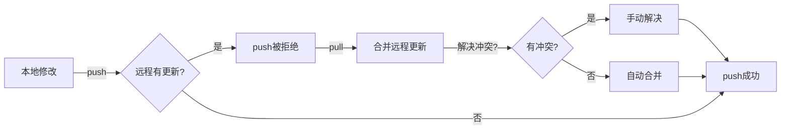

+++
title = "第11章：远程仓库入门 —— 代码的云端家园"
weight = 110
date = 2026-04-03T19:36:48+08:00
type = "docs"
description = ""
isCJKLanguage = true
draft = false
+++
# 第11章：远程仓库入门 —— 代码的云端家园

欢迎来到第11章！如果你之前的Git学习像是在自家后花园里种花，那么这一章我们要把你的花搬到广场上去展示了。远程仓库，就是程序员的"云端豪宅"，让你的代码不再孤单地躺在本地硬盘里吃灰。

---

## 11.1 本地 vs 远程：后花园与公共广场

想象一下这个场景：你辛辛苦苦写了一个月的代码，存在自己电脑里，每天对着它自我陶醉。直到有一天，你的电脑蓝屏了，硬盘挂了，那一刻，你感受到了什么叫"绝望"。

这就是**本地仓库**（Local Repository）的痛点——它就像你家后花园，虽然温馨，但一旦发生火灾（硬盘损坏）、地震（电脑丢失）、洪水（咖啡泼键盘），你的劳动成果就可能化为乌有。

而**远程仓库**（Remote Repository）呢？它是存在云端的代码副本，就像把花搬到了城市广场。即使你家被外星人入侵了，广场上你的花依然安然无恙。更重要的是，其他人也能来广场欣赏（审查）你的花，甚至帮你浇水（贡献代码）。

### 本地仓库的特点

- **速度快**：数据就在硬盘上，读写飞快
- **私密性高**：只有你一个人能看到
- **不依赖网络**：飞机上没有WiFi也能提交代码
- **风险集中**：电脑坏了 = 代码可能没了

### 远程仓库的特点

- **安全可靠**：云服务商的备份机制比你靠谱多了
- **协作友好**：团队成员都能访问
- **需要网络**：没网的时候只能"望云兴叹"
- **历史可追溯**：即使你把本地搞砸了，远程通常还有备份

### 为什么要两者都用？

聪明的程序员都明白一个道理：**不要把鸡蛋放在一个篮子里**。本地仓库让你开发流畅，远程仓库让你高枕无忧。两者配合，才是完整的Git工作流。

```
┌─────────────────────────────────────────────────────────┐
│                      远程仓库 (Remote)                   │
│                    GitHub / GitLab / Gitee              │
│                         ☁️ 云端                          │
└───────────────────────┬─────────────────────────────────┘
                        │ push（推送）
                        │ pull（拉取）
                        ▼
┌─────────────────────────────────────────────────────────┐
│                      本地仓库 (Local)                    │
│                      你的电脑硬盘                        │
│                         💻 本地                          │
└─────────────────────────────────────────────────────────┘
```

### 小结

本地仓库是你的工作台，远程仓库是你的保险箱。两者缺一不可，就像程序员不能没有咖啡一样（开玩笑的，茶也行）。

下一节，我们来看看市面上有哪些流行的"广场"供你选择！

---

## 11.2 GitHub、GitLab、Gitee：选哪个？

现在市面上主流的代码托管平台有三个大佬：GitHub、GitLab、Gitee。它们就像编程界的"三国鼎立"，各有各的地盘和特色。选哪个？且听我慢慢道来。

### GitHub —— 程序员的"联合国"

**GitHub** 是目前全球最大的代码托管平台，被微软收购后更是如虎添翼。

**优点：**
- 🌍 **生态最丰富**：几乎所有开源项目都在这儿，想找什么库？GitHub搜一搜
- 👥 **社区活跃**：Issue讨论、PR贡献，热闹得像菜市场
- 🎁 **免费私有仓库**：以前收费，现在个人用户免费无限私有仓库
- 🤖 **GitHub Actions**：内置CI/CD，自动化神器
- 📱 **移动端App**：随时随地刷代码（虽然程序员都不喜欢移动端写代码）

**缺点：**
- 🐌 **国内访问慢**：不挂代理的话，有时候图片都加载不出来
- 🔒 **偶尔抽风**：2020年还封过一批伊朗开发者的账号（政治因素）

**适合人群：** 开源贡献者、想接触国际社区的开发者、需要GitHub Actions的自动化玩家

### GitLab —— 企业的"自留地"

**GitLab** 分为社区版（免费开源）和企业版（收费）。

**优点：**
- 🏢 **企业友好**：可以私有化部署，数据完全自己掌控
- 🔧 **功能全面**：内置CI/CD、项目管理、代码审查，一站式搞定
- 🆓 **免费版功能强**：私有仓库、CI/CD分钟数都很慷慨
- 📊 **DevOps完整方案**：不只是代码托管，是整个DevOps工具链

**缺点：**
- 🐘 **有点重**：功能太多，小团队可能用不上
- 🌐 **社区生态不如GitHub**：开源项目数量少很多

**适合人群：** 企业团队、需要私有化部署的保守派、需要完整DevOps方案的组织

### Gitee —— 国内的"自家院"

**Gitee**（码云）是国内最大的代码托管平台，由开源中国运营。

**优点：**
- ⚡ **国内访问快**：服务器在国内，速度杠杠的
- 🇨🇳 **中文支持好**：全中文界面，文档也是中文
- 🔄 **GitHub镜像**：可以自动同步GitHub仓库，防失联
- 📱 **微信集成**：能用微信登录，对国内用户友好

**缺点：**
- 🌍 **国际影响力小**：国外开发者基本不用
- 📋 **审核机制**：公有仓库需要审核，有时候会比较慢
- 🎁 **免费版限制**：私有仓库成员数有限制

**适合人群：** 国内开发者、对访问速度有要求、不想折腾代理的用户

### 怎么选？一张表搞定

| 维度 | GitHub | GitLab | Gitee |
|------|--------|--------|-------|
| 访问速度（国内） | ⭐⭐ | ⭐⭐⭐ | ⭐⭐⭐⭐⭐ |
| 开源生态 | ⭐⭐⭐⭐⭐ | ⭐⭐⭐ | ⭐⭐⭐ |
| 企业功能 | ⭐⭐⭐⭐ | ⭐⭐⭐⭐⭐ | ⭐⭐⭐ |
| 私有化部署 | ❌ | ✅ | ✅（企业版） |
| 免费私有仓库 | ✅ | ✅ | ✅（有限制） |
| CI/CD | ⭐⭐⭐⭐⭐ | ⭐⭐⭐⭐⭐ | ⭐⭐⭐ |

### 我的建议

**小孩子才做选择，成年人全都要！**

- **主力开发**：GitHub（生态好，找工作时GitHub主页就是简历）
- **备份镜像**：Gitee（同步GitHub，防失联）
- **企业项目**：GitLab（私有化部署，数据安全）

其实很多人都是这样：代码推送到GitHub，同时用Gitee做镜像，公司项目用自建的GitLab。狡兔三窟，代码安全！

下一节，我们手把手教你注册GitHub，拿到你的程序员名片！

---

## 11.3 注册 GitHub：你的程序员名片

GitHub账号对于程序员来说，就像微信之于社交、支付宝之于支付一样重要。它不仅是你存放代码的地方，更是你的**技术名片**。很多面试官在看你简历之前，会先偷偷瞄一眼你的GitHub主页。所以，花点时间打造一个体面的GitHub账号，绝对值得。

### 第一步：访问官网

打开浏览器，输入 `github.com`。如果你在国内，可能需要一点耐心（或者科学上网工具）。看到那个可爱的章鱼猫（Octocat）logo，你就找对地方了。

### 第二步：点击注册

在首页找到 **"Sign up"** 按钮，点击它。然后你会进入一个注册流程：

1. **输入邮箱**：建议使用常用邮箱，因为GitHub会发很多通知邮件
2. **设置密码**：至少15个字符，或者8个字符以上包含数字和字母。别用"12345678"，求你了
3. **设置用户名**：**这个很重要！** 用户名会成为你的GitHub主页地址（`github.com/你的用户名`），建议：
   - 使用英文、数字、连字符（-）
   - 尽量简洁好记
   - 避免用"user123"这种看起来像是机器人的名字
   - 如果可能，和你的其他社交平台保持一致

### 第三步：验证你是人类

GitHub会让你做一些验证，比如选择所有包含红绿灯的图片（经典的CAPTCHA）。如果你连红绿灯都认不出来...那可能需要配副眼镜了。

### 第四步：选择套餐

GitHub会问你一些问题，比如：
- 你是学生还是老师？
- 团队规模多大？
- 你对什么感兴趣？

这些问题可以随便选，不影响使用。最后选择 **"Continue for free"** 即可。

### 第五步：验证邮箱

GitHub会向你注册的邮箱发送一封验证邮件。去邮箱点击验证链接，就大功告成了！

### 完善你的个人资料

注册完别急着走，花几分钟完善一下个人资料，这可是你的门面：

1. **头像**：上传一张清晰的照片，或者一个酷酷的头像。不要用默认的灰色头像，那样看起来像个僵尸号
2. **Bio（简介）**：用一句话介绍自己，比如 "Frontend developer | React enthusiast | Coffee addict"
3. **Location**：填写你的城市
4. **Company/School**：如果有的话填上
5. **Website**：可以链接到你的博客或个人网站
6. **Twitter/X**：如果你有技术相关的Twitter账号

### 开启双重验证（2FA）

**强烈建议开启！** 你的代码就是资产，安全第一。

设置路径：`Settings` → `Password and authentication` → `Enable two-factor authentication`

可以使用：
- **Authenticator app**：如Google Authenticator、Microsoft Authenticator
- **Security keys**：如YubiKey（土豪选项）
- **SMS**：短信验证（不太推荐，容易被SIM卡攻击）

### 个性化你的GitHub主页

有一个酷炫的技巧：创建一个和你用户名相同的仓库，里面放一个 `README.md`，它会显示在你的GitHub主页上！

比如你的用户名是 `zhangsan`，就创建一个 `zhangsan/zhangsan` 仓库：

```markdown
# Hi there, I'm Zhang San 👋

## About Me
- 🔭 I’m currently working on [某项目]
- 🌱 I’m currently learning Rust
- 👯 I’m looking to collaborate on open source projects
- 💬 Ask me about JavaScript, React, Node.js
- 📫 How to reach me: zhangsan@example.com
- ⚡ Fun fact: I can drink 5 cups of coffee a day

## My GitHub Stats

```

效果会很酷，不信你搜一下别人的GitHub主页看看！

### 小结

注册GitHub只是开始，维护好它才是正经事。记住：
- 保持提交活跃（绿格子越多越好看）
- 参与开源项目
- 写一些优质的项目并开源
- 认真写README

你的GitHub主页，就是你的技术简历。好好经营它！

下一节，我们来聊聊远程仓库的核心概念——origin到底是什么鬼？

---

## 11.4 远程仓库的基本概念：origin 是什么？

当你第一次看到别人输入 `git push origin main` 的时候，是不是一脸懵逼？origin是什么？为什么不能直接 `git push`？别急，这一节我们就来揭开这个神秘面纱。

### 远程仓库（Remote Repository）

**远程仓库**就是托管在服务器上的Git仓库。它和你的本地仓库本质上是一样的，都是Git仓库，只是位置不同。你可以把它理解为你的本地仓库的"云端备份"或者"中央服务器"。

### origin 是什么？

**origin** 是Git给远程仓库起的**默认小名（别名）**。

想象一下：你的远程仓库地址可能是这样的：
```
https://github.com/zhangsan/my-awesome-project.git
```

或者这样：
```
git@github.com:zhangsan/my-awesome-project.git
```

每次推送都要输入这么长一串，程序员是懒的，所以Git允许你给这个地址起个短名字。默认情况下，克隆下来的仓库，Git会自动把来源地址命名为 **origin**。

```
长地址：https://github.com/zhangsan/my-project.git
    ↓
短别名：origin
```

### 为什么要用 origin？

1. **省事**：`git push origin main` 比 `git push https://github.com/... main` 短多了
2. **灵活**：如果远程地址变了，只需要改别名配置，不用改所有命令
3. **多远程**：一个本地仓库可以关联多个远程仓库（后面会讲）

### origin 可以改吗？

当然可以！origin只是默认名字，你可以改成任何你喜欢的：

```bash
# 查看当前远程仓库
$ git remote -v
origin  https://github.com/zhangsan/my-project.git (fetch)
origin  https://github.com/zhangsan/my-project.git (push)

# 把 origin 改成 github
$ git remote rename origin github

# 现在要用新名字推送
$ git push github main
```

不过，除非有特殊需求，建议保留 origin。因为：
- 网上99%的教程都用 origin
- 团队协作时，统一命名减少沟通成本
- 很多工具脚本也默认使用 origin

### 远程分支 vs 本地分支

这里还有一个容易混淆的概念：**远程分支**。

- **本地分支**：`main`、`feature-login` 这些，存在你电脑里
- **远程分支**：`origin/main`、`origin/feature-login` 这些，是远程仓库分支在你本地的"影子"

当你运行 `git fetch` 时，Git会把远程仓库的最新状态同步到这些"影子"分支上。然后你可以决定要不要合并到本地分支。

```
本地仓库                    远程仓库（origin）
├─ main  ◄──────────────────┤
├─ feature-xxx              ├─ main
└─ origin/main (影子分支)    ├─ feature-xxx
    └─ 反映远程main的状态
```

### upstream（上游）是什么？

有时候你还会看到 **upstream** 这个词。它和 origin 类似，也是远程仓库的别名，但通常用于特定场景：

- **origin**：你 fork 出来的仓库（你的副本）
- **upstream**：原始仓库（你 fork 的来源）

比如你给某个开源项目提PR，通常是这样：
```bash
# 从原始仓库拉取最新代码
$ git pull upstream main

# 推送到你自己的仓库
$ git push origin main
```

### 小结

- **origin** = 远程仓库的默认小名
- 它只是个别名，可以改，但没必要
- 远程分支（origin/xxx）是远程分支在本地的"影子"
- upstream通常指原始仓库（fork场景）

理解了origin，你就迈出了远程协作的第一步！

下一节，我们来学习如何把本地仓库和远程仓库关联起来。

---

## 11.5 添加远程仓库：`git remote add`

现在你已经知道 origin 是什么了，那么问题来了：怎么让本地仓库认识远程仓库呢？就像两个人要成为朋友，总得先加个微信吧？`git remote add` 就是Git世界的"加好友"操作。

### 场景一：先有本地仓库，后创建远程仓库

这种情况很常见：你在本地写了个项目，觉得不错，想放到GitHub上秀一秀。

**步骤1：在GitHub上创建空仓库**

登录GitHub，点击右上角 "+" → "New repository"：
- 填写仓库名（Repository name）：建议和本地文件夹同名
- 选择公开（Public）或私有（Private）
- **不要勾选** "Initialize this repository with a README"（因为本地已有项目）
- 点击 "Create repository"

创建后，GitHub会给你一个页面，上面有段提示代码，类似这样：

```bash
# 已有本地仓库？执行这些命令
git remote add origin https://github.com/zhangsan/my-project.git
git branch -M main
git push -u origin main
```

**步骤2：在本地添加远程仓库**

```bash
# 进入你的项目目录
$ cd my-project

# 添加远程仓库，命名为 origin
$ git remote add origin https://github.com/zhangsan/my-project.git
```

**步骤3：推送代码**

```bash
# 把本地 main 分支推送到远程 origin
$ git push -u origin main
```

`-u` 是 `--set-upstream` 的缩写，意思是"设置上游分支"。这样以后在这个分支上直接 `git push` 就行了，不用每次都写 `origin main`。

### 场景二：克隆远程仓库到本地

如果你是从GitHub上克隆下来的仓库，Git会自动帮你添加好 origin：

```bash
$ git clone https://github.com/zhangsan/my-project.git

# 克隆完成后，自动就有 origin 了
$ cd my-project
$ git remote -v
origin  https://github.com/zhangsan/my-project.git (fetch)
origin  https://github.com/zhangsan/my-project.git (push)
```

这就是克隆的便利之处——一步到位。

### git remote add 的完整语法

```bash
git remote add <name> <url>
```

- `<name>`：你给远程仓库起的小名，默认是 origin，也可以是 github、gitlab、gitee 等
- `<url>`：远程仓库的地址，可以是 HTTPS 或 SSH 格式

### 添加多个远程仓库

一个本地仓库可以关联多个远程仓库，就像你可以同时有微信、QQ、钉钉一样。

**典型场景**：GitHub 作为主仓库，Gitee 作为镜像备份

```bash
# 添加 GitHub（已有 origin）
$ git remote add origin https://github.com/zhangsan/my-project.git

# 再添加 Gitee，起名叫 gitee
$ git remote add gitee https://gitee.com/zhangsan/my-project.git

# 查看所有远程仓库
$ git remote -v
origin  https://github.com/zhangsan/my-project.git (fetch)
origin  https://github.com/zhangsan/my-project.git (push)
gitee   https://gitee.com/zhangsan/my-project.git (fetch)
gitee   https://gitee.com/zhangsan/my-project.git (push)

# 推送到 GitHub
$ git push origin main

# 推送到 Gitee
$ git push gitee main
```

### 常用的远程仓库地址格式

**HTTPS 格式：**
```
https://github.com/username/repo.git
https://gitlab.com/username/repo.git
https://gitee.com/username/repo.git
```
- 优点：简单，直接可用
- 缺点：每次推送需要输入用户名密码（或配置凭据管理器）

**SSH 格式：**
```
git@github.com:username/repo.git
git@gitlab.com:username/repo.git
git@gitee.com:username/repo.git
```
- 优点：配置密钥后免密推送，更安全
- 缺点：需要先生成和配置 SSH 密钥（下一节讲）

### 修改远程仓库地址

如果你添加错了，或者远程地址变了，可以修改：

```bash
# 修改 origin 的 URL
$ git remote set-url origin https://github.com/newname/new-repo.git

# 验证修改
$ git remote -v
```

### 删除远程仓库

如果某个远程仓库不用了：

```bash
# 删除名为 gitee 的远程仓库
$ git remote rm gitee

# 或者
$ git remote remove gitee
```

注意：这只是断开关联，不会删除远程仓库本身。

### 重命名远程仓库

```bash
# 把 origin 重命名为 github
$ git remote rename origin github
```

### 小结

| 命令 | 作用 |
|------|------|
| `git remote add <name> <url>` | 添加远程仓库 |
| `git remote -v` | 查看所有远程仓库 |
| `git remote rm <name>` | 删除远程仓库 |
| `git remote rename <old> <new>` | 重命名远程仓库 |
| `git remote set-url <name> <url>` | 修改远程仓库地址 |

记住：`git remote add origin <url>` 是你把本地项目推送到GitHub的第一步！

下一节，我们来详细学习如何查看和管理远程仓库。

---

## 11.6 查看和管理远程仓库：`git remote -v`、`git remote rm`

上一节我们学会了添加远程仓库，但添加完之后怎么查看？怎么管理？万一加错了怎么删？这一节我们就来掌握远程仓库的"户口本管理"技能。

### 查看远程仓库列表

**最常用命令：git remote -v**

```bash
$ git remote -v
origin  https://github.com/zhangsan/my-project.git (fetch)
origin  https://github.com/zhangsan/my-project.git (push)
gitee   https://gitee.com/zhangsan/my-project.git (fetch)
gitee   https://gitee.com/zhangsan/my-project.git (push)
upstream  https://github.com/original-author/original-project.git (fetch)
upstream  https://github.com/original-author/original-project.git (push)
```

`-v` 是 `--verbose`（详细模式）的缩写，会显示每个远程仓库的fetch（拉取）和push（推送）地址。

**只看名字：git remote**

```bash
$ git remote
origin
gitee
upstream
```

如果你只是想知道有哪些远程仓库，这个就够了。

**查看单个远程仓库详情：git remote show**

```bash
$ git remote show origin
* remote origin
  Fetch URL: https://github.com/zhangsan/my-project.git
  Push  URL: https://github.com/zhangsan/my-project.git
  HEAD branch: main
  Remote branches:
    main                 tracked
    feature-login        tracked
    feature-payment      tracked
  Local branches configured for 'git pull':
    main           merges with remote main
  Local refs configured for 'git push':
    main           pushes to main (up to date)
    feature-login  pushes to feature-login (local out of date)
```

这个命令信息量很大：
- 远程仓库的fetch和push地址
- 远程有哪些分支
- 本地哪些分支配置了pull/push
- 分支同步状态（up to date / out of date）

### 管理远程仓库

**1. 重命名远程仓库**

```bash
# 把 origin 重命名为 github
$ git remote rename origin github

# 验证
$ git remote -v
github  https://github.com/zhangsan/my-project.git (fetch)
github  https://github.com/zhangsan/my-project.git (push)
```

注意：重命名后，原来配置的分支上游关系会自动更新，不需要手动改。

**2. 修改远程仓库地址**

场景：远程仓库改名了，或者从HTTPS换成SSH

```bash
# 修改 origin 的 URL
$ git remote set-url origin git@github.com:zhangsan/my-project.git

# 验证
$ git remote -v
origin  git@github.com:zhangsan/my-project.git (fetch)
origin  git@github.com:zhangsan/my-project.git (push)
```

**3. 删除远程仓库**

```bash
# 删除名为 gitee 的远程仓库
$ git remote rm gitee

# 或者
$ git remote remove gitee

# 验证
$ git remote -v
# gitee 已经消失了
```

⚠️ **警告**：这只是断开本地与远程的关联，不会删除远程仓库本身！你的代码在Gitee上依然安全。

**4. 添加远程仓库（复习）**

```bash
$ git remote add gitee https://gitee.com/zhangsan/my-project.git
```

### 实际应用场景

**场景1：从HTTPS切换到SSH**

```bash
# 查看当前是HTTPS
$ git remote -v
origin  https://github.com/zhangsan/my-project.git (fetch)
origin  https://github.com/zhangsan/my-project.git (push)

# 修改为SSH地址
$ git remote set-url origin git@github.com:zhangsan/my-project.git

# 验证
$ git remote -v
origin  git@github.com:zhangsan/my-project.git (fetch)
origin  git@github.com:zhangsan/my-project.git (push)
```

**场景2：添加上游仓库（Fork workflow）**

```bash
# 你fork了别人的项目，origin指向你的fork
$ git remote -v
origin  https://github.com/your-name/forked-project.git (fetch)
origin  https://github.com/your-name/forked-project.git (push)

# 添加原始仓库作为upstream
$ git remote add upstream https://github.com/original-author/original-project.git

# 现在有两个远程仓库
$ git remote -v
origin   https://github.com/your-name/forked-project.git (fetch)
origin   https://github.com/your-name/forked-project.git (push)
upstream https://github.com/original-author/original-project.git (fetch)
upstream https://github.com/original-author/original-project.git (push)

# 从原始仓库拉取更新
$ git pull upstream main

# 推送到你的fork
$ git push origin main
```

**场景3：清理不用的远程仓库**

```bash
# 发现有三个远程仓库，有点乱
$ git remote -v
origin   https://github.com/zhangsan/project.git
gitee    https://gitee.com/zhangsan/project.git
gitlab   https://gitlab.com/zhangsan/project.git  # 这个不用了

# 删除gitlab
$ git remote rm gitlab

# 清爽了
$ git remote -v
origin  https://github.com/zhangsan/project.git
gitee   https://gitee.com/zhangsan/project.git
```

### 命令速查表

| 命令 | 作用 |
|------|------|
| `git remote` | 列出所有远程仓库名 |
| `git remote -v` | 列出远程仓库名和URL |
| `git remote show <name>` | 显示某个远程仓库的详细信息 |
| `git remote add <name> <url>` | 添加远程仓库 |
| `git remote rm <name>` | 删除远程仓库 |
| `git remote rename <old> <new>` | 重命名远程仓库 |
| `git remote set-url <name> <url>` | 修改远程仓库URL |
| `git remote get-url <name>` | 获取远程仓库URL |

### 小结

管理远程仓库就像管理你的社交账号：
- `git remote -v` = 查看你关注了谁
- `git remote add` = 关注新账号
- `git remote rm` = 取关
- `git remote rename` = 改备注名
- `git remote set-url` = 对方换号了，更新一下

熟练掌握这些命令，你的远程仓库管理就游刃有余了！

下一节，我们来解决一个让新手头疼的问题：SSH密钥配置。

---

## 11.7 SSH 密钥配置：免密推送的秘诀

如果你用HTTPS方式推送代码，每次都要输入用户名密码，烦不烦？特别是当你一天推送十几次的时候，简直想砸键盘。SSH密钥就是来解决这个问题的——配置一次，终身免密（好吧，除非你把密钥弄丢了）。

### 什么是 SSH？

**SSH**（Secure Shell）是一种网络协议，用于在不安全的网络上安全地进行远程登录和其他网络服务。简单说，它就是一种"安全的通信方式"。

在Git的语境里，SSH让你可以用"密钥对"（公钥+私钥）来证明"你是你"，而不需要每次输入密码。

### 密钥对是什么？

SSH使用**非对称加密**，会生成一对密钥：

- **私钥（Private Key）**：像你的家门钥匙，必须保管好，不能给别人
- **公钥（Public Key）**：像你的门牌号，可以公开给别人，别人用它来找你

工作原理：
1. 你把公钥放在GitHub上（告诉GitHub：这是我的门牌号）
2. 你本地保留私钥（你的钥匙）
3. 当你推送时，Git用私钥签名，GitHub用公钥验证
4. 验证通过，放行！

```
┌─────────────┐                    ┌─────────────┐
│   你的电脑   │                    │   GitHub    │
│  ┌───────┐  │                    │  ┌───────┐  │
│  │ 私钥  │  │ ────── 签名 ──────▶ │  │ 公钥  │  │
│  │(保密) │  │                    │  │(公开) │  │
│  └───────┘  │ ◀──── 验证通过 ──── │  └───────┘  │
└─────────────┘                    └─────────────┘
```

### 第一步：检查是否已有SSH密钥

```bash
# 查看.ssh目录下的文件
$ ls -la ~/.ssh

# Windows 用
$ dir %userprofile%\.ssh
```

如果你看到类似 `id_rsa`、`id_rsa.pub` 或 `id_ed25519`、`id_ed25519.pub` 的文件，说明你已经有密钥了。可以跳过生成步骤，直接看第三步。

### 第二步：生成新的SSH密钥

如果没有密钥，或者想为GitHub单独生成一个，执行：

```bash
# 使用 Ed25519 算法（推荐，更安全）
$ ssh-keygen -t ed25519 -C "your_email@example.com"

# 如果你的系统不支持 Ed25519，用 RSA
$ ssh-keygen -t rsa -b 4096 -C "your_email@example.com"
```

参数说明：
- `-t`：密钥类型，`ed25519` 或 `rsa`
- `-C`：注释，通常用邮箱，方便识别
- `-b`：密钥位数（RSA需要，Ed25519不需要）

执行后会提示：

```
Generating public/private ed25519 key pair.
Enter file in which to save the key (/Users/you/.ssh/id_ed25519):
```

直接回车，使用默认路径。然后会提示输入密码（passphrase）：

```
Enter passphrase (empty for no passphrase):
```

**建议设置密码**，这样即使私钥被盗，没有密码也用不了。如果不想每次输入密码，可以使用 ssh-agent（后面讲）。

生成成功后，你会看到：

```
Your identification has been saved in /Users/you/.ssh/id_ed25519
Your public key has been saved in /Users/you/.ssh/id_ed25519.pub
```

### 第三步：添加SSH密钥到ssh-agent

ssh-agent 是一个密钥管理工具，可以帮你记住密钥密码，不用每次都输入。

**macOS：**

```bash
# 启动 ssh-agent
$ eval "$(ssh-agent -s)"

# 添加密钥（如果是Apple Silicon Mac，需要额外配置）
$ ssh-add ~/.ssh/id_ed25519

# macOS 12+ 需要创建/修改 config 文件
$ nano ~/.ssh/config
```

在 config 文件中添加：

```
Host github.com
  AddKeysToAgent yes
  UseKeychain yes
  IdentityFile ~/.ssh/id_ed25519
```

**Windows（Git Bash）：**

```bash
# 启动 ssh-agent
$ eval `ssh-agent -s`

# 添加密钥
$ ssh-add ~/.ssh/id_ed25519
```

**Linux：**

```bash
# 启动 ssh-agent
$ eval "$(ssh-agent -s)"

# 添加密钥
$ ssh-add ~/.ssh/id_ed25519
```

### 第四步：复制公钥到GitHub

```bash
# 查看公钥内容
$ cat ~/.ssh/id_ed25519.pub

# Windows
$ type %userprofile%\.ssh\id_ed25519.pub
```

你会看到类似这样的内容：

```
ssh-ed25519 AAAAC3NzaC1lZDI1NTE5AAAAIDIhz2GK/XCUj4i6Q5yQJNL1MXMY0RxzPV2QrBqfHrDq your_email@example.com
```

复制这整行内容，然后：

1. 登录 GitHub
2. 点击右上角头像 → Settings
3. 左侧菜单选择 SSH and GPG keys
4. 点击 New SSH key
5. Title：随便起个名字，比如 "MacBook Pro" 或 "公司电脑"
6. Key：粘贴刚才复制的公钥
7. 点击 Add SSH key

GitHub可能会要求你输入密码确认。添加成功后，你会看到新的密钥出现在列表里。

### 第五步：测试连接

```bash
$ ssh -T git@github.com
```

如果看到：

```
Hi username! You've successfully authenticated, but GitHub does not provide shell access.
```

恭喜你，配置成功！

如果看到：

```
Permission denied (publickey).
```

检查：
1. 公钥是否正确复制到GitHub
2. 私钥路径是否正确
3. ssh-agent 是否运行并添加了密钥

### 第六步：修改远程仓库URL为SSH格式

```bash
# 查看当前URL
$ git remote -v
origin  https://github.com/username/repo.git (fetch)
origin  https://github.com/username/repo.git (push)

# 修改为SSH格式
$ git remote set-url origin git@github.com:username/repo.git

# 验证
$ git remote -v
origin  git@github.com:username/repo.git (fetch)
origin  git@github.com:username/repo.git (push)
```

### 多台电脑的配置

如果你有多台电脑（比如家里一台、公司一台），每台电脑都需要：

1. 生成自己的密钥对（可以在密钥文件名中区分，如 `id_ed25519_home`、`id_ed25519_work`）
2. 把每台电脑的公钥都添加到GitHub
3. 在 `~/.ssh/config` 中配置多个Host（如果需要）

### 常见问题

**Q: 每次重启电脑都要重新 ssh-add，好烦！**

A: 把 ssh-add 命令添加到 shell 的配置文件（如 `.bashrc`、`.zshrc`）中，或者使用操作系统的密钥管理工具（如 macOS 的 Keychain）。

**Q: 我可以把私钥复制到另一台电脑用吗？**

A: 技术上可以，但不推荐。最好每台电脑生成自己的密钥对，这样一台电脑丢了不会影响其他电脑。

**Q: 密钥丢了怎么办？**

A: 在GitHub上删除对应的公钥，然后重新生成新的密钥对。

**Q: HTTPS 和 SSH 哪个更好？**

A: SSH 更适合日常开发（免密），HTTPS 更适合临时克隆（不需要配置）。公司防火墙可能限制SSH端口（22），这时候只能用HTTPS。

### 小结

| 方式 | 优点 | 缺点 |
|------|------|------|
| HTTPS | 简单，无需配置 | 每次推送需要输入密码 |
| SSH | 免密推送，更安全 | 需要配置密钥 |

配置SSH虽然一开始麻烦点，但长远来看绝对值得。想象一下，再也不用输入密码的畅快感！

下一节，我们来学习 `git clone` —— 把远程仓库搬回家的正确姿势。

---

## 11.8 创建仓库与克隆：`git clone` 的正确姿势

`git clone` 是Git中最常用的命令之一，它的作用就是把远程仓库完整地复制到本地。就像你去图书馆借书，clone就是把整本书复印一份带回家，而不是只抄个目录。

### 基础用法

```bash
# 克隆一个远程仓库
$ git clone https://github.com/username/repo.git

# 克隆到指定文件夹
$ git clone https://github.com/username/repo.git my-folder

# 克隆特定分支
$ git clone -b branch-name https://github.com/username/repo.git
```

### clone 到底做了什么？

当你执行 `git clone` 时，Git实际上做了以下几件事：

1. **创建文件夹**：创建一个和仓库同名的文件夹（除非你指定了其他名字）
2. **初始化Git仓库**：在这个文件夹里运行 `git init`
3. **添加远程仓库**：自动添加 origin 指向你克隆的地址
4. **下载所有数据**：把远程仓库的所有提交、分支、标签都下载下来
5. **检出默认分支**：通常是 main 或 master，切换到工作目录

```
远程仓库                                    本地（克隆后）
├─ main  ◄────────────────────────────────┤  ├─ main (检出)
├─ develop                                 │  ├─ develop
├─ feature-xxx                             │  ├─ feature-xxx
├─ 提交历史                                 │  ├─ 完整的提交历史
└─ 标签                                     │  └─ 标签
                                             └─ origin/main (跟踪分支)
```

### 克隆后的目录结构

```
my-project/                    # 项目根目录
├── .git/                      # Git仓库的核心，包含所有历史数据
│   ├── objects/               # 存储所有文件内容和提交对象
│   ├── refs/                  # 分支和标签的引用
│   ├── HEAD                   # 当前分支的指针
│   └── config                 # 本地Git配置
├── .gitignore                 # 忽略规则文件（如果有）
├── README.md                  # 项目说明
├── src/                       # 源代码
└── ...                        # 其他文件
```

### 不同的克隆方式

**1. HTTPS 克隆**

```bash
$ git clone https://github.com/username/repo.git
```

- 最简单，无需配置
- 每次推送可能需要输入密码（除非配置了凭据管理器）

**2. SSH 克隆**

```bash
$ git clone git@github.com:username/repo.git
```

- 需要配置SSH密钥
- 配置好后免密推送
- 推荐日常使用

**3. GitHub CLI 克隆**

```bash
# 先安装 GitHub CLI (gh)
$ gh repo clone username/repo
```

- 需要先登录 `gh auth login`
- 可以配合其他gh命令使用

**4. 克隆到指定目录**

```bash
# 克隆到当前目录下的 my-project 文件夹
$ git clone https://github.com/username/repo.git my-project

# 克隆到当前目录（注意最后的点）
$ git clone https://github.com/username/repo.git .
```

**5. 只克隆特定分支**

```bash
# 只克隆 main 分支
$ git clone -b main --single-branch https://github.com/username/repo.git

# 克隆特定分支并检出
$ git clone -b feature-branch https://github.com/username/repo.git
```

**6. 浅克隆（节省时间和空间）**

```bash
# 只克隆最近1个提交（适合大仓库，快速开始）
$ git clone --depth=1 https://github.com/username/repo.git

# 克隆最近10个提交
$ git clone --depth=10 https://github.com/username/repo.git
```

浅克隆的缺点：
- 看不到完整的历史
- 某些Git操作会受限
- 不能推送回远程（除非使用 `--no-single-branch`）

### 克隆后的第一步

克隆完成后，建议做这几件事：

```bash
# 1. 进入项目目录
$ cd repo

# 2. 查看远程仓库配置
$ git remote -v

# 3. 查看所有分支
$ git branch -a

# 4. 查看提交历史
$ git log --oneline -10
```

### 克隆私有仓库

**HTTPS 方式：**

```bash
# 会提示输入用户名和个人访问令牌（PAT）
$ git clone https://github.com/username/private-repo.git
Username: your-username
Password: your-personal-access-token
```

注意：GitHub在2021年后不再支持密码登录，需要使用 **Personal Access Token (PAT)**。

**SSH 方式：**

```bash
# 配置好SSH密钥后直接克隆
$ git clone git@github.com:username/private-repo.git
```

### 克隆后的远程关系

克隆后，Git自动配置了 origin：

```bash
$ git remote -v
origin  https://github.com/username/repo.git (fetch)
origin  https://github.com/username/repo.git (push)

$ git branch -vv
* main                a1b2c3d [origin/main] Latest commit message
```

`[origin/main]` 表示本地 main 分支跟踪远程 origin/main 分支。

### 克隆的进阶技巧

**1. 克隆裸仓库（用于备份或镜像）**

```bash
$ git clone --bare https://github.com/username/repo.git
```

裸仓库没有工作目录，只有 `.git` 里的内容，适合作为中央仓库。

**2. 克隆并镜像（包含所有远程分支和标签）**

```bash
$ git clone --mirror https://github.com/username/repo.git
```

**3. 递归克隆（包含子模块）**

```bash
$ git clone --recursive https://github.com/username/repo-with-submodules.git
```

**4. 稀疏检出（只克隆部分文件）**

```bash
# 克隆时启用稀疏检出
$ git clone --filter=blob:none --sparse https://github.com/username/repo.git

# 配置要检出的目录
$ cd repo
$ git sparse-checkout set src/docs
```

适合超大仓库，只下载需要的部分。

### 常见问题

**Q: clone 太慢怎么办？**

A: 
- 使用 `--depth=1` 浅克隆
- 使用国内镜像（如Gitee同步GitHub仓库）
- 配置代理

**Q: clone 时提示 "Repository not found"**

A:
- 检查URL是否正确
- 私有仓库需要权限
- 检查网络连接

**Q: clone 后怎么切换到其他分支？**

```bash
# 查看所有远程分支
$ git branch -r

# 检出远程分支到本地
$ git checkout -b feature-branch origin/feature-branch

# 或者简写（Git 2.23+）
$ git switch -c feature-branch origin/feature-branch
```

### 小结

`git clone` 是进入一个新项目的标准姿势。记住：
- 克隆会下载完整的历史记录
- 自动配置 origin
- 默认检出主分支
- 浅克隆可以节省时间和空间

下一节，我们来学习 `git push` —— 把你的代码送上天！

---

## 11.9 `git push`：把你的代码送上天

`git push` 是Git中最激动人心的命令之一——它把你的本地提交上传到远程仓库，让全世界（或者至少你的团队）都能看到你的代码。就像火箭发射，把你的代码送上云端！

### 基础用法

```bash
# 推送当前分支到远程 origin
$ git push origin main

# 推送并设置上游分支（首次推送推荐）
$ git push -u origin main

# 简写（设置了上游后）
$ git push
```

### push 到底做了什么？

当你执行 `git push` 时：

1. Git连接到远程仓库
2. 检查本地提交是否可以安全推送（不会覆盖远程的提交）
3. 打包本地的新提交
4. 上传到远程仓库
5. 更新远程分支的指针

```
推送前：
本地：A---B---C---D (main)
远程：A---B---C (origin/main)

推送后：
本地：A---B---C---D (main)
远程：A---B---C---D (origin/main)
```

### 首次推送：设置上游分支

第一次推送一个新分支时，建议用 `-u` 参数：

```bash
$ git push -u origin main
```

`-u` 是 `--set-upstream` 的缩写，它会：
1. 推送本地 main 分支到远程 origin/main
2. 建立跟踪关系（tracking relationship）
3. 以后在这个分支上直接 `git push` 即可

### 推送不同分支

```bash
# 推送 main 分支
$ git push origin main

# 推送 feature-login 分支
$ git push origin feature-login

# 推送当前分支（Git 2.37+ 默认行为）
$ git push

# 推送所有本地分支
$ git push --all origin
```

### 推送标签

标签默认不会随分支一起推送：

```bash
# 推送单个标签
$ git push origin v1.0.0

# 推送所有本地标签
$ git push origin --tags

# 推送分支和标签
$ git push origin main --tags
```

### 强制推送（危险！）

```bash
# 强制推送（会覆盖远程历史，慎用！）
$ git push origin main --force

# 或者
$ git push origin main -f
```

⚠️ **警告**：强制推送会覆盖远程仓库的历史，可能导致团队成员的代码丢失。只在确定没人会受影响时使用（比如你自己的feature分支）。

**安全的强制推送**：

```bash
# 只在远程是本地分支的子集时强制推送
$ git push origin main --force-with-lease
```

`--force-with-lease` 会在远程有其他人推送的新提交时拒绝推送，比 `--force` 安全得多。

### 删除远程分支

```bash
# 删除远程 feature-old 分支
$ git push origin --delete feature-old

# 或者（老语法，不推荐）
$ git push origin :feature-old
```

### 推送被拒绝的常见原因

**1. 没有权限**

```
fatal: unable to access '...': The requested URL returned error: 403
```

解决：检查是否有推送权限，或者使用正确的认证方式。

**2. 远程有更新，本地没有同步**

```
! [rejected]        main -> main (fetch first)
error: failed to push some refs to '...'
hint: Updates were rejected because the remote contains work that you do
hint: not have locally. This is usually caused by another repository pushing
hint: to the same ref. You may want to first integrate the remote changes
hint: (e.g., 'git pull ...') before pushing again.
```

解决：先 `git pull` 同步远程更新，再推送。

**3. 非快进推送**

```
! [rejected]        main -> main (non-fast-forward)
```

解决：如果确定要覆盖，使用 `--force-with-lease`；否则先合并远程更改。

### 推送的最佳实践

**1. 推送前检查**

```bash
# 查看要推送的提交
$ git log origin/main..main

# 查看文件改动
$ git diff origin/main..main

# 确认无误后推送
$ git push
```

**2. 小步快跑，频繁推送**

不要等到攒了几十个提交再推送，那样风险大、冲突多。完成一个功能点就推送一次。

**3. 推送前跑测试**

```bash
# 推送前运行测试
$ npm test

# 测试通过再推送
$ git push
```

**4. 写清楚提交信息**

推送后别人会看到你的提交历史，清晰的提交信息是基本的职业素养。

**5. 不要推送敏感信息**

密码、API密钥、私钥等永远不要推送到远程。如果不小心推送了，立即撤销并更换密钥。

### 多远程仓库推送

如果你配置了多个远程仓库：

```bash
# 推送到 GitHub
$ git push origin main

# 推送到 Gitee
$ git push gitee main

# 同时推送到多个（需要配置）
```

### 推送进度查看

大仓库推送时，Git会显示进度：

```
Enumerating objects: 150, done.
Counting objects: 100% (150/150), done.
Delta compression using up to 8 threads
Compressing objects: 100% (120/120), done.
Writing objects: 100% (150/150), 1.25 MiB | 2.50 MiB/s, done.
Total 150 (delta 30), reused 0 (delta 0), pack-reused 0
remote: Resolving deltas: 100% (30/30), done.
To github.com:username/repo.git
   a1b2c3d..e4f5g6h  main -> main
```

### 推送后的验证

```bash
# 查看远程分支状态
$ git branch -vv

# 查看提交历史
$ git log --oneline --graph --all

# 在GitHub网页上查看
```

### 小结

| 命令 | 作用 |
|------|------|
| `git push origin main` | 推送 main 分支到 origin |
| `git push -u origin main` | 推送并设置上游分支 |
| `git push` | 推送当前分支（设置了上游后） |
| `git push origin --tags` | 推送所有标签 |
| `git push origin --delete branch` | 删除远程分支 |
| `git push --force-with-lease` | 安全的强制推送 |

记住：`git push` 是把你的劳动成果分享给世界的时刻，确保你推送的是值得骄傲的代码！

下一节，我们来学习 `git pull` —— 把别人的智慧拉下来。

---

## 11.10 `git pull`：把别人的代码拉下来

如果说 `git push` 是"输出"，那 `git pull` 就是"输入"。团队协作中，别人的代码更新、Bug修复、新功能，都需要通过 `git pull` 同步到你的本地。这一节我们就来掌握这个"吸收养分"的技能。

### pull 的本质

**重要概念**：`git pull` = `git fetch` + `git merge`

也就是说，pull 实际上做了两件事：
1. **fetch**：从远程下载最新的提交和分支信息
2. **merge**：把远程分支合并到当前本地分支

```
执行 git pull origin main 前：
本地：A---B---C (main)
远程：A---B---C---D---E (origin/main)

执行 git pull origin main 后：
本地：A---B---C---D---E (main)
              ↑
         自动合并
```

### 基础用法

```bash
# 从 origin 拉取 main 分支并合并到当前分支
$ git pull origin main

# 设置了上游分支后，简写
$ git pull

# 拉取特定分支
$ git pull origin feature-branch
```

### 不同场景下的 pull

**场景1：本地没有修改，远程有更新**

这是最简单的情况，Git会自动快进合并（fast-forward）：

```bash
$ git pull origin main
Updating a1b2c3d..e4f5g6h
Fast-forward
 src/main.js | 5 +++++
 1 file changed, 5 insertions(+)
```

**场景2：本地和远程都有修改，但没有冲突**

Git会自动合并，并创建一个新的合并提交：

```bash
$ git pull origin main
Merge made by the 'ort' strategy.
 src/utils.js | 3 +++
 src/main.js  | 2 ++
 2 files changed, 5 insertions(+)
```

**场景3：本地和远程修改了同一处，产生冲突**

这是最麻烦的情况，需要手动解决冲突：

```bash
$ git pull origin main
Auto-merging src/main.js
CONFLICT (content): Merge conflict in src/main.js
Automatic merge failed; fix conflicts and then commit the result.
```

关于冲突解决，我们会在后面的章节详细讲解。

### pull 的选项

**1. --rebase：变基而不是合并**

```bash
$ git pull --rebase origin main
```

使用 rebase 会让你的本地提交"移到"远程提交之后，形成一条干净的直线历史，而不是分叉的合并历史。

```
普通 pull（merge）：
A---B---C---D---E---F (main)
         ↑       ↑
       远程    本地提交

pull --rebase：
A---B---C---D---E---F' (main)
                 ↑
              本地提交（变基后）
```

**配置默认使用 rebase：**

```bash
# 全局配置
$ git config --global pull.rebase true

# 仅对当前仓库
$ git config pull.rebase true
```

**2. --ff-only：只允许快进合并**

```bash
$ git pull --ff-only origin main
```

如果不能快进合并（即本地有修改），pull 会失败。这可以强制你先处理本地修改。

**3. --no-commit：拉取但不自动提交**

```bash
$ git pull --no-commit origin main
```

拉取后会进入合并状态，但不自动创建合并提交，你可以检查后再手动提交。

**4. --squash：把远程提交压缩成一个**

```bash
$ git pull --squash origin main
```

把所有远程提交压缩成一个提交再合并，适合想要干净历史的情况。

### pull vs fetch

| 命令 | 作用 | 安全性 |
|------|------|--------|
| `git fetch` | 只下载远程更新，不合并 | ⭐⭐⭐ 高，不会改本地 |
| `git pull` | 下载并自动合并 | ⭐⭐ 中，可能产生冲突 |

**建议的工作流程：**

```bash
# 1. 先查看远程有什么更新
$ git fetch origin

# 2. 对比本地和远程的差异
$ git log HEAD..origin/main --oneline

# 3. 确认没问题后再合并
$ git merge origin/main

# 或者直接用 pull
$ git pull origin main
```

### pull 的常见问题

**1. "Your local changes would be overwritten"**

```
error: Your local changes to the following files would be overwritten by merge:
        src/main.js
Please commit your changes or stash them before you merge.
```

解决：先提交或暂存本地修改

```bash
# 方案1：提交本地修改
$ git add .
$ git commit -m "WIP: local changes"
$ git pull

# 方案2：暂存本地修改
$ git stash
$ git pull
$ git stash pop
```

**2. "fatal: refusing to merge unrelated histories"**

```
fatal: refusing to merge unrelated histories
```

解决：添加 `--allow-unrelated-histories` 参数

```bash
$ git pull origin main --allow-unrelated-histories
```

这通常发生在本地初始化的仓库和远程仓库没有共同祖先时。

**3. 拉取后历史变得混乱**

如果团队成员频繁在 main 分支上直接提交，历史会变得像意大利面条。

解决：使用 rebase 或制定分支策略（如 GitFlow）。

### pull 的最佳实践

**1. 开始工作前先 pull**

```bash
# 每天早上开始工作
$ git pull origin main

# 开始开发新功能
$ git checkout -b feature-xxx
```

**2. 提交前 pull**

```bash
# 准备推送前
$ git pull origin main
# 解决可能的冲突
$ git push origin feature-xxx
```

**3. 使用 rebase 保持历史整洁**

```bash
# 个人分支推荐使用 rebase
$ git pull --rebase origin main
```

**4. 冲突时冷静处理**

如果 pull 产生冲突：
1. 不要慌，冲突是正常的
2. 仔细阅读冲突标记
3. 和冲突文件的作者沟通
4. 解决后测试代码
5. 提交解决后的代码

### 图形化理解 pull


### 小结

| 命令 | 作用 |
|------|------|
| `git pull origin main` | 拉取并合并远程 main 分支 |
| `git pull` | 拉取上游分支（设置了上游后） |
| `git pull --rebase` | 拉取并使用变基 |
| `git pull --ff-only` | 只允许快进合并 |
| `git fetch` | 只下载，不合并 |

记住：`git pull` 是保持你和团队同步的关键。频繁 pull，减少冲突，快乐协作！

下一节，我们来聊聊推送被拒绝时该怎么办。

---

## 11.11 推送被拒绝？先 pull 再 push

如果你刚入坑Git，大概率遇到过这种情况：兴冲冲地写完代码，`git push`，然后——啪！一个红色的错误信息砸在你脸上：

```
! [rejected]        main -> main (fetch first)
error: failed to push some refs to 'https://github.com/...'
```

别慌，这不是世界末日，只是Git在告诉你："兄弟，你out了，远程仓库有新东西，你先同步一下再推。"

### 为什么会推送被拒绝？

Git拒绝推送的根本原因是：**远程分支比你的本地分支"新"**。

```
你的本地：A---B---C (main)
远程仓库：A---B---C---D (origin/main)
                          ↑
                    远程有D，你没有
```

如果你强行推送，会覆盖远程的D提交，可能导致别人的工作丢失。Git出于安全考虑，拒绝了这个危险操作。

### 常见场景

**场景1：队友推送了代码**

你正在改 `login.js`，队友也在改，他先推送了。等你改完推送时，Git发现远程有你没见过的提交，拒绝。

**场景2：你在GitHub网页上改了文件**

有时候你在GitHub上直接编辑了README，或者合并了一个PR。这些操作也会在远程产生新提交。

**场景3：你从其他设备推送了**

你在公司电脑推送了代码，回家后在个人电脑上继续工作，忘记先 pull 了。

### 解决方案：先 pull 再 push

```bash
# 1. 先拉取远程更新
$ git pull origin main

# 2. 如果有冲突，解决冲突（后面章节详细讲）

# 3. 推送
$ git push origin main
```

完整流程：

```
本地：A---B---C (main)
远程：A---B---C---D (origin/main)

执行 git pull origin main 后：
本地：A---B---C---D---E (main)
              ↑       ↑
            远程    合并提交（包含你的C和远程的D）

执行 git push origin main 后：
远程：A---B---C---D---E (origin/main)
```

### 实际案例演示

**案例1：顺利合并**

```bash
# 尝试推送，被拒绝
$ git push origin main
To https://github.com/username/repo.git
 ! [rejected]        main -> main (fetch first)
error: failed to push some refs to '...'
hint: Updates were rejected because the remote contains work that you do
hint: not have locally.

# 拉取远程更新
$ git pull origin main
remote: Enumerating objects: 5, done.
remote: Counting objects: 100% (5/5), done.
remote: Total 3 (delta 2), reused 3 (delta 2)
Unpacking objects: 100% (3/3), done.
From https://github.com/username/repo
 * branch            main       -> FETCH_HEAD
   a1b2c3d..e4f5g6h  main       -> origin/main
Merge made by the 'ort' strategy.
 README.md | 2 ++
 1 file changed, 2 insertions(+)

# 推送成功
$ git push origin main
Enumerating objects: 10, done.
Counting objects: 100% (10/10), done.
Delta compression using up to 8 threads
Compressing objects: 100% (6/6), done.
Writing objects: 100% (6/6), 1.20 KiB/s, done.
Total 6 (delta 4), reused 0 (delta 0)
To https://github.com/username/repo.git
   e4f5g6h..h7i8j9k  main -> main
```

**案例2：产生冲突**

```bash
# 尝试推送，被拒绝
$ git push origin main
! [rejected] ...

# 拉取，产生冲突
$ git pull origin main
Auto-merging src/main.js
CONFLICT (content): Merge conflict in src/main.js
Automatic merge failed; fix conflicts and then commit the result.

# 查看冲突文件
$ git status
On branch main
You have unmerged paths.
  (fix conflicts and run "git commit")
  (use "git merge --abort" to abort the merge)

Unmerged paths:
  (use "git add <file>..." to mark resolution)
        both modified:   src/main.js

# 编辑冲突文件，解决冲突
$ code src/main.js  # 用你喜欢的编辑器

# 标记冲突已解决
$ git add src/main.js

# 完成合并提交
$ git commit -m "Merge branch 'main' of github.com:username/repo"

# 推送
$ git push origin main
```

### 使用 rebase 保持历史整洁

如果你不喜欢 pull 产生的分叉历史，可以用 rebase：

```bash
# 拉取并使用变基
$ git pull --rebase origin main

# 如果有冲突，解决后继续变基
$ git add <conflicted-file>
$ git rebase --continue

# 推送
$ git push origin main
```

rebase 会让你的提交"移到"远程提交之后，形成一条直线历史：

```
pull（merge）：
A---B---C---D---E (main)
         ↑   ↑
       远程 合并提交

pull --rebase：
A---B---D---C' (main)
         ↑
       你的提交（变基后）
```

### 预防措施

**1. 推送前习惯性 pull**

```bash
# 养成这个习惯
$ git pull origin main && git push origin main
```

**2. 工作前先 pull**

```bash
# 开始工作前
$ git pull origin main

# 创建功能分支
$ git checkout -b feature-xxx
```

**3. 使用分支开发**

不要在 main 分支上直接开发，创建自己的功能分支：

```bash
$ git checkout -b feature-login
# 开发...
$ git push origin feature-login
# 提PR合并，而不是直接push到main
```

**4. 配置自动设置上游**

```bash
$ git config --global push.autoSetupRemote true
```

这样推送新分支时会自动设置上游。

### 特殊情况：强制推送

如果你确定要覆盖远程（比如刚提交发现有个拼写错误，想修改后重新推送）：

```bash
# 修改最后一次提交
$ git commit --amend -m "修正后的提交信息"

# 强制推送（慎用！）
$ git push origin main --force-with-lease
```

`--force-with-lease` 比 `--force` 安全，它会在远程有新提交时拒绝推送。

⚠️ **警告**：如果你已经和别人共享了这个分支，绝对不要使用强制推送！

### 图形化理解



### 小结

| 情况 | 解决方案 |
|------|----------|
| push被拒绝 | `git pull` 后再 `git push` |
| pull产生冲突 | 手动解决冲突后提交 |
| 想要干净历史 | `git pull --rebase` |
| 确定要覆盖远程 | `git push --force-with-lease`（慎用） |

记住Git的黄金法则：**先 pull，再 push**。这能帮你避免90%的推送问题！

下一节，我们来深入了解上游分支的设置。

---

## 11.12 上游分支设置：`git push -u` 的作用

如果你用过 `git push -u origin main`，可能会好奇：这个 `-u` 到底是干嘛的？为什么第一次推送要加它，以后就不用加了？这一节我们就来揭开上游分支（upstream branch）的神秘面纱。

### 什么是上游分支？

**上游分支**（upstream branch），也叫**跟踪分支**（tracking branch），是本地分支和远程分支之间的"对应关系"。

简单来说，就是告诉Git："我的本地main分支，对应远程的origin/main分支。以后我push/pull的时候，默认就是和它对齐。"

```
本地分支 main  ──────跟踪──────  远程分支 origin/main
     ↑                              ↑
   你在本地工作                  远程仓库上的副本
```

### 为什么要设置上游分支？

**场景1：没有设置上游**

```bash
$ git push
fatal: The current branch feature-login has no upstream branch.
To push the current branch and set the remote as upstream, use

    git push --set-upstream origin feature-login
```

Git不知道你要推送到哪个远程分支，需要你明确告诉它。

**场景2：设置了上游**

```bash
$ git push
Everything up-to-date
```

一行搞定！Git知道你默认要推送到 origin/feature-login。

### 如何设置上游分支

**方法1：第一次推送时设置（推荐）**

```bash
$ git push -u origin feature-login
```

`-u` 是 `--set-upstream` 的简写，推送的同时建立跟踪关系。

**方法2：单独设置上游**

```bash
# 本地分支已存在，关联远程分支
$ git branch --set-upstream-to=origin/feature-login feature-login

# 或者简写
$ git branch -u origin/feature-login
```

**方法3：切换分支时设置**

```bash
$ git checkout -b feature-login origin/feature-login
```

这会创建本地分支并自动设置上游。

### 验证上游分支设置

```bash
# 查看分支信息（-vv 显示上游）
$ git branch -vv
  develop                a1b2c3d [origin/develop] Update docs
* feature-login          d4e5f6g [origin/feature-login: ahead 2] Add login
  main                   h7i8j9k [origin/main] Merge PR #42
  test-branch            l0m1n2o  Commit message
```

方括号里的内容就是上游分支：
- `[origin/develop]`：正常跟踪
- `[origin/feature-login: ahead 2]`：本地比远程领先2个提交
- 没有方括号：没有设置上游

### 查看当前分支的上游

```bash
$ git rev-parse --abbrev-ref --symbolic-full-name @{upstream}
origin/feature-login

# 或者简写
$ git rev-parse --abbrev-ref @{u}
origin/feature-login
```

### 上游分支的好处

**1. 简化命令**

```bash
# 设置了上游后
$ git push           # 等价于 git push origin feature-login
$ git pull           # 等价于 git pull origin feature-login
$ git status         # 会显示与上游的差异
```

**2. 状态提示**

```bash
$ git status
On branch feature-login
Your branch is ahead of 'origin/feature-login' by 3 commits.
  (use "git push" to publish your local commits)

Changes not staged for commit:
  (use "git add <file>..." to update what will be committed)
  (use "git restore <file>..." to discard changes in working directory)
        modified:   src/login.js
```

Git会告诉你本地领先远程几个提交，或者落后几个提交。

**3. 自动补全**

很多Git工具和IDE会根据上游分支提供智能提示。

### 修改上游分支

如果你需要改变本地分支跟踪的远程分支：

```bash
# 修改 feature-login 的上游为 origin/feature-login-v2
$ git branch -u origin/feature-login-v2 feature-login

# 或者先取消跟踪，再设置新的
$ git branch --unset-upstream feature-login
$ git branch -u origin/new-branch feature-login
```

### 取消上游分支

```bash
$ git branch --unset-upstream feature-login
```

取消后，`git push` 和 `git pull` 就需要指定远程和分支了。

### 配置默认推送行为

Git 2.37+ 版本有一个方便的配置：

```bash
# 推送时自动设置上游
$ git config --global push.autoSetupRemote true
```

设置后，第一次推送新分支时不需要加 `-u`，Git会自动设置：

```bash
$ git checkout -b new-feature
$ git push
# 自动设置上游为 origin/new-feature
```

### 上游分支的工作原理

Git在 `.git/config` 文件中存储上游分支信息：

```ini
[branch "main"]
    remote = origin
    merge = refs/heads/main

[branch "feature-login"]
    remote = origin
    merge = refs/heads/feature-login
```

这就是Git知道"main分支对应origin/main"的配置来源。

### 常见误区

**误区1：上游分支会同步代码**

上游分支只是个"指针"，不会自动同步代码。你需要手动 `git pull` 或 `git push`。

**误区2：设置了上游就不能推送到其他分支**

设置了上游只是有默认值，你仍然可以推送到其他分支：

```bash
$ git push origin other-branch
```

**误区3：删除远程分支会影响上游设置**

如果远程分支被删除了，本地分支的上游设置还在，但会显示为"gone"：

```bash
$ git branch -vv
* feature-login  a1b2c3d [origin/feature-login: gone] Commit message
```

这时候需要重新设置上游或删除本地分支。

### 最佳实践

**1. 新分支第一次推送用 -u**

```bash
$ git checkout -b feature-xxx
# 开发...
$ git push -u origin feature-xxx
```

**2. 配置自动设置上游（Git 2.37+）**

```bash
$ git config --global push.autoSetupRemote true
```

**3. 定期查看分支状态**

```bash
$ git branch -vv
```

检查哪些分支有上游，哪些分支已经合并可以删除。

**4. 清理无用的上游设置**

如果远程分支已删除，本地分支的上游应该清理：

```bash
$ git fetch --prune  # 清理远程已删除的分支引用
$ git branch -vv     # 查看哪些显示 [gone]
$ git branch -d feature-old  # 删除本地分支
```

### 小结

| 命令 | 作用 |
|------|------|
| `git push -u origin branch` | 推送并设置上游 |
| `git branch -u origin/branch` | 设置上游分支 |
| `git branch --unset-upstream` | 取消上游设置 |
| `git branch -vv` | 查看分支及上游信息 |

上游分支就像是给你的本地分支在远程找了个"家"，以后回家（push）和出门（pull）都知道该去哪了。

---

## 本章小结

恭喜！你已经完成了远程仓库入门的全部内容。让我们来回顾一下：

### 核心概念

- **本地仓库**：你电脑上的代码
- **远程仓库**：云端托管的代码副本
- **origin**：远程仓库的默认别名
- **上游分支**：本地分支和远程分支的对应关系

### 核心命令

| 命令 | 作用 |
|------|------|
| `git remote add origin <url>` | 添加远程仓库 |
| `git remote -v` | 查看远程仓库 |
| `git clone <url>` | 克隆远程仓库 |
| `git push origin main` | 推送到远程 |
| `git pull origin main` | 从远程拉取 |
| `git push -u origin main` | 推送并设置上游 |

### 工作流程

```
克隆仓库 → 修改代码 → 提交 → 拉取更新 → 推送
   ↑                                      │
   └──────────────────────────────────────┘
           协作循环
```

### 重要原则

1. **先 pull，再 push** —— 避免推送被拒绝
2. **设置上游** —— 简化后续操作
3. **使用SSH** —— 免密推送更安全
4. **小步快跑** —— 频繁提交和推送

掌握了这些，你就可以愉快地和团队协作了！下一章，我们将进入GitHub的世界，学习更高级的协作技巧。


