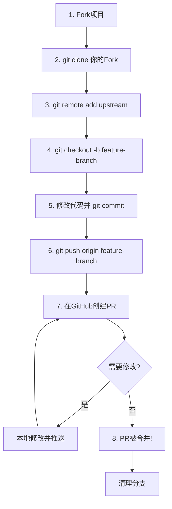

+++
title = "第12章：GitHub 协作 —— 开源世界的入场券"
weight = 120
date = 2026-04-03T19:36:48+08:00
type = "docs"
description = ""
isCJKLanguage = true
draft = false
+++
# 第12章：GitHub 协作 —— 开源世界的入场券

欢迎来到GitHub的世界！如果说Git是程序员的内功心法，那GitHub就是你的江湖名片。这一章，我们将从"会用GitHub"进阶到"玩转GitHub"，让你真正融入开源社区，成为一名合格的"GitHub居民"。

---

## 12.1 GitHub 不只是代码仓库：程序员的社交网络

很多人以为GitHub就是个存代码的地方，那就大错特错了！GitHub是全球最大的程序员社交平台，这里不只是代码，更是思想碰撞、技术交流、人脉拓展的圣地。

### GitHub = 代码仓库 + 社交平台

**代码仓库功能：**
- 托管代码
- 版本控制
- 代码审查
- 项目管理

**社交功能：**
- Follow（关注）其他开发者
- Star（点赞）喜欢的项目
- Fork（复制）项目参与贡献
- Issue（讨论）提出问题
- Pull Request（协作）贡献代码

想象一下：你在GitHub上关注了大神Linus Torvalds，Star了Vue.js项目，给React提了一个PR被合并，还在某个Issue里和作者激烈讨论技术方案...这就是程序员的社交网络！

### GitHub 的个人名片

你的GitHub主页就是你的技术简历：

```
┌─────────────────────────────────────────┐
│  [头像]  你的名字                        │
│  @username                              │
│  Bio: 一句话介绍自己                     │
│  📍 位置 | 🏢 公司 | 🔗 博客链接         │
├─────────────────────────────────────────┤
│  热门仓库                                │
│  ├─ awesome-project ⭐ 1.2k              │
│  ├─ cool-tool        ⭐ 856              │
│  └─ my-framework     ⭐ 423              │
├─────────────────────────────────────────┤
│  贡献统计                                │
│  [绿格子图] - 过去一年贡献               │
│  1,234 contributions in the last year   │
└─────────────────────────────────────────┘
```

### 为什么GitHub如此重要？

**1. 找工作时的敲门砖**

很多技术面试官在面试前会先看你的GitHub：
- 有没有持续提交？（绿格子多不多）
- 参与了什么开源项目？
- 代码质量如何？
- 文档写得怎么样？

一个活跃的GitHub账号，胜过千言万语。

**2. 学习和成长**

GitHub上有全世界最优秀开源项目的源代码：
- 想学习React？看Facebook的源码
- 想了解操作系统？看Linux内核
- 想学设计模式？看Spring框架

这是最好的学习资料，而且免费！

**3. 建立技术影响力**

- 开源自己的项目，获得Star和Fork
- 给知名项目贡献代码，被合并进主线
- 写技术博客，分享到GitHub
- 参与技术讨论，建立个人品牌

**4. 找到志同道合的人**

- 关注领域内的专家
- 参与开源社区
- 在Issue和PR中交流
- 参加GitHub上的活动

### GitHub 的核心社交功能

**Follow（关注）**

关注你欣赏的开发者，他们的动态会出现在你的时间线：
- Star了哪些项目
- 创建了哪些仓库
- 贡献了哪些代码

**Star（点赞）**

给喜欢的项目点赞，相当于收藏：
- 方便以后找到
- 给作者鼓励
- 你的Star列表就是你的技术品味

**Fork（复制）**

复制别人的项目到自己的账号下：
- 可以自由修改
- 可以给原项目提PR
- 是参与开源的第一步

**Watch（关注仓库）**

关注项目动态：
- 有新版本时通知
- Issue有新回复时通知
- PR有更新时通知

可以选择通知级别：
- **Not watching**：不通知
- **Releases only**：只通知发布新版本
- **Watching**：所有活动都通知
- **Ignoring**：忽略所有通知

**Sponsor（赞助）**

GitHub的打赏功能，可以赞助你喜欢的开源作者：
- 支持开源生态
- 获得作者的感谢和回报

### 如何玩转GitHub社交

**1. 完善个人资料**

- 真实的头像（不要卡通或默认图）
- 清晰的Bio（一句话介绍）
- 填写位置和公司
- 链接到个人博客或Twitter

**2. 保持活跃**

- 每天提交代码（保持绿格子）
- Star感兴趣的项目
- 参与Issue讨论
- 写README和Wiki

**3. 建立优质项目**

- 选择有价值的项目开源
- 写好README
- 添加LICENSE
- 维护好Issue和PR

**4. 参与开源**

- 从文档改进开始
- 修复简单的Bug
- 参与Code Review
- 逐步深入核心代码

**5. 关注大牛**

- 找到你领域内的专家
- 学习他们的代码风格
- 了解他们的技术选型
- 参与他们的项目

### GitHub 的隐藏功能

**1. GitHub Pages**

免费搭建个人网站或项目文档站点：
- 个人博客
- 项目文档
- 在线演示

**2. GitHub Gist**

分享代码片段：
- 快速分享一段代码
- 嵌入到博客
- 作为代码笔记本

**3. GitHub Actions**

自动化工作流：
- 持续集成/持续部署
- 自动化测试
- 自动发布

**4. GitHub Discussions**

项目讨论区：
- 问答
- 想法分享
- 公告发布

**5. GitHub Projects**

项目管理看板：
- Kanban风格
- 自动化工作流
- 与Issue/PR关联

### 小结

GitHub不只是代码仓库，它是：
- 🎓 学习平台 —— 阅读优秀源码
- 💼 求职名片 —— 展示技术能力
- 🤝 社交平台 —— 结识技术同好
- 🚀 影响力平台 —— 建立个人品牌

如果你只是把GitHub当成"网盘"来存代码，那就太浪费了！

下一节，我们来学习如何打造亮眼的GitHub个人主页。

---

## 12.2 GitHub 个人主页打造：你的程序员名片

你的GitHub主页就是你的技术名片。一个精心打造的主页，能让面试官眼前一亮，让同行对你刮目相看。这一节，我们就来学习如何把你的GitHub主页从"路人甲"升级为"技术大神"。

### 基础设置

**1. 头像（Profile Picture）**

- 使用清晰的真人照片或专业头像
- 不要用默认的灰色头像（看起来像僵尸号）
- 不要用过于随意的表情包
- 保持专业但友好

**2. 个人简介（Bio）**

一句话介绍自己，要精炼但有信息量：

```
❌ 不好的例子：
- "程序员"
- "喜欢编程"
- "Hello World"

✅ 好的例子：
- "Frontend Developer | React & Vue enthusiast | Open source contributor"
- "Backend engineer building scalable systems with Go and Kubernetes"
- "Full-stack developer | AI/ML researcher | Speaker at tech conferences"
```

**3. 位置和公司（Location & Company）**

- 填写你所在的城市
- 填写你的公司或学校
- 这能增加可信度和地域连接

**4. 网站链接（Website）**

链接到你的：
- 个人博客
- 技术作品集
- LinkedIn
- Twitter/X（如果是技术相关）

### 打造个人资料仓库（Profile README）

GitHub有一个酷炫功能：创建一个和你用户名相同的仓库，里面的README会显示在你的主页上！

**创建步骤：**

1. 新建仓库，名字必须和你的用户名完全一致
2. 选择 "Public"（私有仓库不会显示在主页）
3. 勾选 "Initialize this repository with a README"
4. 点击 "Create repository"

**README内容模板：**

```markdown
# Hi there, I'm [你的名字] 👋

## About Me
- 🔭 I'm currently working on [项目名]
- 🌱 I'm currently learning [技术]
- 👯 I'm looking to collaborate on [领域]
- 💬 Ask me about [你擅长的技术]
- 📫 How to reach me: [邮箱]
- ⚡ Fun fact: [有趣的事实]

## Tech Stack


## GitHub Stats


## Top Languages


## Recent Activity
<!--START_SECTION:activity-->
1. 🎉 Merged PR [#123](link) in [repo]
2. 💪 Opened PR [#124](link) in [repo]
3. 🗣 Commented on [#125](link) in [repo]
<!--END_SECTION:activity-->
```

**效果展示：**

一个精心设计的Profile README可以包含：
- 个人介绍
- 技术栈徽章
- GitHub统计图表
- 最近活动
- 项目展示
- 博客文章列表

### 保持绿格子（Contribution Graph）

GitHub主页那个绿色的贡献图，是展示你活跃度的最佳方式。

**如何保持绿格子：**

1. **每天提交代码**
   - 即使是小改动
   - 文档更新也算
   - Issue评论不算

2. **多样化贡献**
   - 代码提交
   - PR合并
   - Code Review
   - 创建Issue

3. **合理安排**
   - 工作日保持活跃
   - 周末可以休息（但大神都是全绿的）
   - 提前准备，不要临时抱佛脚

**注意：** 不要为了绿格子而提交无意义的代码（比如改个空格），那样反而显得不专业。

### 置顶仓库（Pinned Repositories）

GitHub允许你置顶6个仓库，这是展示你最佳作品的机会。

**选择置顶仓库的原则：**

1. **质量 > 数量**
   - 选择代码质量高的
   - 有完整文档的
   - 有实际价值的

2. **多样性**
   - 展示不同技术栈
   - 展示不同能力（前端、后端、工具等）

3. **活跃度**
   - 优先选择最近维护的
   - 有持续更新的

**优化置顶仓库：**

- 写好README
- 添加截图或演示
- 完善LICENSE
- 添加标签（topics）

### 参与开源项目

**1. 给知名项目贡献代码**

- 找到你使用的开源项目
- 从简单的Issue开始
- 逐步深入核心代码
- 被合并的PR会显示在你的主页

**2. 创建有价值的开源项目**

- 解决实际问题
- 写好文档
- 积极维护
- 推广你的项目

**3. 参与Code Review**

- Review别人的PR
- 提出建设性意见
- 帮助项目改进

### GitHub Achievements

GitHub会颁发一些成就徽章，展示在你的主页：

- **Pull Request Shark**：合并很多PR
- **YOLO**：不经过review直接合并（不推荐）
- **Galaxy Brain**：回答被标记为答案的Discussion
- **Heart on Your Sleeve**：经常给别人的内容点赞
- **Open Sourcerer**：维护流行开源项目

### 专业建议

**1. 保持一致性**

- 头像和简介在各平台保持一致
- 使用相同的用户名（如果可能）
- 统一的品牌形象

**2. 定期更新**

- 保持项目活跃
- 更新过时的信息
- 添加新的成就

**3. 注重质量**

- 代码要整洁
- 文档要完整
- 提交信息要规范

**4. 建立个人品牌**

- 专注特定领域
- 持续输出内容
- 参与社区讨论

### 小结

一个优秀的GitHub主页应该包含：

| 元素 | 重要性 | 建议 |
|------|--------|------|
| 专业头像 | ⭐⭐⭐⭐⭐ | 清晰、专业 |
| 精炼简介 | ⭐⭐⭐⭐⭐ | 一句话展示价值 |
| Profile README | ⭐⭐⭐⭐⭐ | 展示个性和技能 |
| 绿格子 | ⭐⭐⭐⭐ | 保持活跃 |
| 置顶仓库 | ⭐⭐⭐⭐⭐ | 展示最佳作品 |
| 开源贡献 | ⭐⭐⭐⭐ | 参与知名项目 |

记住：你的GitHub主页是24小时在线的简历，投资时间打造它是值得的！

下一节，我们来学习GitHub Actions——自动化工作流的神器。

---

## 12.3 GitHub Actions：自动化工作流入门

想象一下：每次你推送代码，GitHub自动帮你运行测试、检查代码格式、构建项目、部署到服务器...这就是GitHub Actions的魔力！它是GitHub提供的CI/CD（持续集成/持续部署）服务，而且对个人用户免费！

### 什么是CI/CD？

**CI（Continuous Integration，持续集成）**：
- 代码提交后自动运行测试
- 检查代码质量
- 确保代码能正常构建

**CD（Continuous Deployment，持续部署）**：
- 测试通过后自动部署
- 发布新版本
- 更新文档

```
推送代码
   ↓
触发 Actions
   ↓
├─ 运行测试
├─ 检查代码格式
├─ 构建项目
└─ 部署到服务器
   ↓
完成！☕
```

### GitHub Actions的核心概念

**1. Workflow（工作流）**

一个完整的自动化流程，定义在 `.github/workflows/` 目录下的YAML文件中。

**2. Event（事件）**

触发工作流的时机：
- `push`：推送代码时
- `pull_request`：创建PR时
- `schedule`：定时触发
- `workflow_dispatch`：手动触发
- 等等...

**3. Job（任务）**

工作流中的一个执行单元，可以串行或并行运行。

**4. Step（步骤）**

任务中的一个执行步骤，运行命令或Action。

**5. Action（动作）**

可复用的自动化单元，可以是：
- GitHub官方提供的
- 社区提供的
- 自己写的

### 创建第一个Workflow

**步骤1：创建目录和文件**

```
你的项目/
├── .github/
│   └── workflows/
│       └── ci.yml    # 工作流定义文件
├── src/
└── ...
```

**步骤2：编写Workflow**

```yaml
# .github/workflows/ci.yml
name: CI  # 工作流名称

# 触发条件
on:
  push:
    branches: [main, develop]
  pull_request:
    branches: [main]

# 任务定义
jobs:
  build:
    runs-on: ubuntu-latest  # 运行环境
    
    steps:
    # 检出代码
    - uses: actions/checkout@v4
    
    # 设置Node.js环境
    - name: Setup Node.js
      uses: actions/setup-node@v4
      with:
        node-version: '18'
        cache: 'npm'
    
    # 安装依赖
    - name: Install dependencies
      run: npm ci
    
    # 运行测试
    - name: Run tests
      run: npm test
    
    # 构建项目
    - name: Build
      run: npm run build
```

**步骤3：推送代码**

```bash
$ git add .
$ git commit -m "Add GitHub Actions workflow"
$ git push origin main
```

推送后，打开GitHub仓库页面，点击 "Actions" 标签，你就能看到工作流在运行了！

### 常用Actions

**检出代码：**
```yaml
- uses: actions/checkout@v4
```

**设置Node.js：**
```yaml
- uses: actions/setup-node@v4
  with:
    node-version: '18'
    cache: 'npm'
```

**设置Python：**
```yaml
- uses: actions/setup-python@v4
  with:
    python-version: '3.11'
```

**缓存依赖：**
```yaml
- uses: actions/cache@v3
  with:
    path: ~/.npm
    key: ${{ runner.os }}-node-${{ hashFiles('**/package-lock.json') }}
```

### 实际案例

**案例1：Node.js项目的CI**

```yaml
name: Node.js CI

on:
  push:
    branches: [main]
  pull_request:
    branches: [main]

jobs:
  test:
    runs-on: ubuntu-latest
    
    strategy:
      matrix:
        node-version: [16.x, 18.x, 20.x]  # 测试多个Node版本
    
    steps:
    - uses: actions/checkout@v4
    
    - name: Use Node.js ${{ matrix.node-version }}
      uses: actions/setup-node@v4
      with:
        node-version: ${{ matrix.node-version }}
    
    - run: npm ci
    - run: npm run lint      # 代码检查
    - run: npm test          # 运行测试
    - run: npm run build     # 构建
```

**案例2：自动部署到GitHub Pages**

```yaml
name: Deploy to GitHub Pages

on:
  push:
    branches: [main]

jobs:
  deploy:
    runs-on: ubuntu-latest
    
    steps:
    - uses: actions/checkout@v4
    
    - name: Setup Node
      uses: actions/setup-node@v4
      with:
        node-version: '18'
    
    - run: npm ci
    - run: npm run build
    
    - name: Deploy
      uses: peaceiris/actions-gh-pages@v3
      with:
        github_token: ${{ secrets.GITHUB_TOKEN }}
        publish_dir: ./dist
```

**案例3：发布Release**

```yaml
name: Release

on:
  push:
    tags:
      - 'v*'

jobs:
  release:
    runs-on: ubuntu-latest
    
    steps:
    - uses: actions/checkout@v4
    
    - name: Create Release
      uses: actions/create-release@v1
      env:
        GITHUB_TOKEN: ${{ secrets.GITHUB_TOKEN }}
      with:
        tag_name: ${{ github.ref }}
        release_name: Release ${{ github.ref }}
        draft: false
        prerelease: false
```

### 查看Workflow运行结果

1. 打开GitHub仓库页面
2. 点击 "Actions" 标签
3. 查看工作流列表和运行状态
4. 点击具体运行查看详细日志

状态说明：
- ✅ 绿色：成功
- ❌ 红色：失败
- 🟡 黄色：进行中
- ⚪ 灰色：跳过

### 小结

GitHub Actions让自动化变得简单：

| 功能 | 用途 |
|------|------|
| 自动测试 | 保证代码质量 |
| 自动构建 | 确保项目可编译 |
| 自动部署 | 快速发布 |
| 自动发布 | 创建Release |

最重要的是：**免费！** 个人用户有充足的免费额度。

下一节，我们来学习Fork——参与开源的第一步。

---

## 12.4 Fork：复制别人的项目，开始你的表演

想给开源项目做贡献？第一步就是Fork！Fork就像是"复制"别人的项目到你的账号下，让你可以自由修改，然后再把你的改动"申请"合并回原始项目。

### 什么是Fork？

**Fork**是GitHub上的一个功能，它会把别人的仓库完整复制一份到你的账号下。

```
原始仓库（别人的）
    ↓ Fork
你的仓库（复制到你账号下）
    ↓ 修改
提交改动
    ↓ Pull Request
申请合并回原始仓库
```

**Fork vs Clone：**

| 操作 | 作用 | 位置 |
|------|------|------|
| Fork | 复制仓库到GitHub上你的账号 | GitHub服务器 |
| Clone | 下载仓库到本地电脑 | 本地硬盘 |

Fork是"在云端复制"，Clone是"下载到本地"。通常两者配合使用。

### 为什么要Fork？

**1. 你没有原始仓库的写权限**

开源项目通常不允许陌生人直接推送代码。Fork后，你有了自己的副本，可以随意修改。

**2. 安全隔离**

你的修改不会直接影响原始项目，只有经过审核（PR）才能合并。

**3. 自由实验**

可以在Fork的仓库里随意尝试，不用担心搞坏原项目。

**4. 贡献代码**

这是参与开源的标准流程：Fork → 修改 → PR → 合并。

### 如何Fork一个项目

**步骤1：找到想Fork的项目**

比如你想给React做贡献，访问 https://github.com/facebook/react

**步骤2：点击Fork按钮**

在页面右上角，点击 "Fork" 按钮。

**步骤3：选择目标**

- 通常选择你的个人账号
- 如果你有组织，也可以选择组织

**步骤4：等待Fork完成**

GitHub会复制整个仓库到你的账号下，地址变成：
```
https://github.com/你的用户名/react
```

### Fork后的工作流

**1. 克隆你的Fork到本地**

```bash
# 克隆你Fork的仓库
$ git clone https://github.com/你的用户名/react.git

$ cd react
```

**2. 添加原始仓库作为upstream**

```bash
# 查看当前远程
$ git remote -v
origin  https://github.com/你的用户名/react.git (fetch)
origin  https://github.com/你的用户名/react.git (push)

# 添加原始仓库作为upstream
$ git remote add upstream https://github.com/facebook/react.git

# 验证
$ git remote -v
origin   https://github.com/你的用户名/react.git (fetch)
origin   https://github.com/你的用户名/react.git (push)
upstream https://github.com/facebook/react.git (fetch)
upstream https://github.com/facebook/react.git (push)
```

**3. 创建分支进行修改**

```bash
# 从upstream拉取最新代码
$ git pull upstream main

# 创建功能分支
$ git checkout -b fix-typo-in-readme

# 进行修改
$ code README.md

# 提交
$ git add README.md
$ git commit -m "Fix typo in README"
```

**4. 推送到你的Fork**

```bash
$ git push origin fix-typo-in-readme
```

**5. 创建Pull Request**

推送后，GitHub会提示你创建PR，点击按钮即可。

### 保持Fork同步

原始项目会不断更新，你的Fork需要定期同步：

```bash
# 1. 拉取原始仓库的更新
$ git fetch upstream

# 2. 切换到主分支
$ git checkout main

# 3. 合并upstream的更新
$ git merge upstream/main

# 4. 推送到你的Fork
$ git push origin main
```

或者使用GitHub网页上的 "Sync fork" 按钮，一键同步。

### Fork的注意事项

**1. Fork是完整的复制**

包括所有代码、提交历史、分支、标签。但不会自动同步后续的更新。

**2. Fork的数量有限制**

GitHub对Fork数量有限制（通常足够用），不要滥用。

**3. 删除Fork**

如果不再需要：
- 进入你的Fork仓库
- Settings → Delete this repository
- 确认删除

**4. 贡献前先看Contributing指南**

大多数开源项目有CONTRIBUTING.md文件，告诉你如何贡献代码。

### 小结

Fork是参与开源的标准姿势：

| 步骤 | 命令/操作 |
|------|-----------|
| Fork | 点击GitHub上的Fork按钮 |
| Clone | `git clone 你的Fork地址` |
| 添加upstream | `git remote add upstream 原始地址` |
| 修改 | 创建分支，修改代码 |
| 推送 | `git push origin 分支名` |
| PR | 在GitHub上创建Pull Request |

记住：Fork不是"偷"代码，而是开源协作的基础！

下一节，我们来学习Pull Request——贡献代码的核心流程。

---

## 12.5 Pull Request："我改了点东西，你看看？"

Pull Request（简称PR）是GitHub协作的核心机制。它是你向项目维护者说："我改了点东西，你看看要不要合并？"的方式。无论是修复Bug、添加功能还是改进文档，PR都是必经之路。

### 什么是Pull Request？

**Pull Request**是GitHub上的一种协作机制，让你可以：
- 告诉项目维护者你做了改动
- 展示你的修改内容
- 接受Code Review
- 讨论修改方案
- 最终合并到主分支

```
你的Fork仓库                    原始仓库
├─ main                         ├─ main
└─ feature-branch ─────────────▶│  (PR)
        你的改动                   审核后合并
```

### PR的工作流程

**1. Fork并克隆项目**

```bash
# Fork项目（在GitHub网页上操作）
# 然后克隆
$ git clone https://github.com/你的用户名/项目.git
$ cd 项目
$ git remote add upstream https://github.com/原作者/项目.git
```

**2. 创建分支**

```bash
# 从upstream拉取最新代码
$ git pull upstream main

# 创建功能分支
$ git checkout -b feature-awesome-feature
```

**3. 进行修改**

```bash
# 修改代码
$ code .

# 提交
$ git add .
$ git commit -m "Add awesome feature"
```

**4. 推送到你的Fork**

```bash
$ git push origin feature-awesome-feature
```

**5. 创建PR**

推送后，GitHub会显示 "Compare & pull request" 按钮，点击它：
- 填写PR标题
- 写清楚改了什么、为什么改
- 关联相关Issue（如果有）
- 点击 "Create pull request"

### PR的状态流转

```
创建PR
   ↓
Open（开放状态，等待审核）
   ↓
├─ Review（维护者审核代码）
│   ↓
├─ Changes requested（需要修改）
│   ↓ 修改后
├─ Approved（审核通过）
│   ↓
└─ Merged（合并完成）
   ↓
Closed（关闭，可能是拒绝或合并后关闭）
```

### PR的最佳实践

**1. PR要小**

一个PR只做一件事，控制在300行以内。小PR更容易审核，更容易合并。

**2. 写清楚的标题**

```
❌ 不好的标题：
- Update
- Fix bug
- Changes

✅ 好的标题：
- Fix memory leak in user authentication
- Add dark mode support for settings page
- Refactor API client to use async/await
```

**3. 写详细的描述**

```markdown
## 改动内容
- 修复了登录时的内存泄漏问题
- 添加了用户头像上传功能

## 为什么需要这个改动
- 解决 #123 报告的问题
- 提升用户体验

## 测试方法
1. 登录账号
2. 上传头像
3. 确认头像显示正常

## 截图
[如果有UI改动，附上截图]
```

**4. 关联Issue**

```
Fixes #123
Closes #456
Related to #789
```

GitHub会自动关联PR和Issue，合并PR时会自动关闭Issue。

**5. 及时响应Review意见**

收到Review意见后：
- 虚心接受建议
- 及时修改
- 修改后回复 "Done" 或解释为什么不改

### 处理Review意见

**1. 查看Review**

在PR页面可以看到Review意见，通常有三种：
- **Comment**：普通评论
- **Approve**：审核通过
- **Request changes**：需要修改

**2. 修改代码**

```bash
# 在本地修改
$ code .

# 提交修改
$ git add .
$ git commit -m "Address review comments"

# 推送
$ git push origin feature-branch
```

修改会自动更新到PR中。

**3. 回复Review**

在PR页面回复每条Review意见，说明已修改或解释原因。

**4. 请求重新审核**

修改完成后，点击 "Re-request review" 按钮。

### Draft PR（草稿PR）

如果你还在开发中，想先占个坑，可以创建Draft PR：

```bash
# 推送分支
$ git push origin feature-wip
```

然后在创建PR时选择 "Create draft pull request"。Draft PR表示"还在开发中，先别合并"。

完成后，点击 "Ready for review" 转为正式PR。

### 小结

PR是开源协作的核心：

| 阶段 | 要点 |
|------|------|
| 创建 | 小改动、清楚标题、详细描述 |
| 审核 | 虚心接受、及时修改 |
| 合并 | 审核通过后即可合并 |

记住：PR不是终点，是沟通的开始！

下一节，我们来梳理PR的完整流程。

---

## 12.6 PR 完整流程：从 Fork 到合并的八步曲

前面我们学习了Fork和PR的概念，这一节我们把整个流程串起来，走一遍从Fork项目到PR被合并的完整八步曲。跟着做一遍，你就真正成为开源贡献者了！

### 八步曲概览

```
1. Fork项目 ──▶ 2. 克隆到本地 ──▶ 3. 添加upstream ──▶ 4. 创建分支
                                                    ↓
8. 合并完成 ◀── 7. 处理Review ◀── 6. 创建PR ◀── 5. 修改代码并推送
```

### 第一步：Fork项目

在GitHub上找到你想贡献的项目，点击右上角的 "Fork" 按钮。

**结果**：项目被复制到你的账号下，地址变成 `github.com/你的用户名/项目名`

### 第二步：克隆你的Fork到本地

```bash
# 克隆你Fork的仓库
$ git clone https://github.com/你的用户名/项目名.git

# 进入项目目录
$ cd 项目名
```

### 第三步：添加原始仓库作为upstream

```bash
# 查看当前远程配置
$ git remote -v
origin  https://github.com/你的用户名/项目名.git (fetch)
origin  https://github.com/你的用户名/项目名.git (push)

# 添加原始仓库作为upstream
$ git remote add upstream https://github.com/原作者/项目名.git

# 验证配置
$ git remote -v
origin   https://github.com/你的用户名/项目名.git (fetch)
origin   https://github.com/你的用户名/项目名.git (push)
upstream https://github.com/原作者/项目名.git (fetch)
upstream https://github.com/原作者/项目名.git (push)
```

### 第四步：创建功能分支

```bash
# 从upstream拉取最新代码（保持同步）
$ git pull upstream main

# 创建并切换到功能分支
$ git checkout -b fix-typo-in-docs

# 分支命名建议：
# - feature/xxx：新功能
# - fix/xxx：修复Bug
# - docs/xxx：文档改进
# - refactor/xxx：重构
```

### 第五步：修改代码并提交

```bash
# 进行修改
$ code README.md  # 用你喜欢的编辑器

# 查看改动
$ git status
$ git diff

# 添加到暂存区
$ git add README.md

# 提交（写清楚的提交信息）
$ git commit -m "Fix typo in README: 'recieve' -> 'receive'"

# 如果有多个提交，可以rebase合并（可选）
$ git rebase -i HEAD~3  # 合并最近3个提交
```

### 第六步：推送到你的Fork

```bash
# 推送到你的Fork
$ git push origin fix-typo-in-docs

# 如果是首次推送这个分支
$ git push -u origin fix-typo-in-docs
```

推送后，GitHub会显示提示：
```
Create a pull request for 'fix-typo-in-docs' on GitHub by visiting:
    https://github.com/你的用户名/项目名/pull/new/fix-typo-in-docs
```

### 第七步：创建Pull Request

点击GitHub上的提示链接，或者去你的Fork页面点击 "Compare & pull request"。

**填写PR信息：**

```markdown
## 描述
修复了README中的一个拼写错误

## 改动
- 'recieve' 改为 'receive'

## 相关Issue
Fixes #123

## 检查清单
- [x] 我已阅读贡献指南
- [x] 我的改动不会破坏现有功能
- [x] 我已测试我的改动
```

点击 "Create pull request" 提交。

### 第八步：处理Review并等待合并

**情况A：直接合并**

维护者觉得改动没问题，直接点击 "Merge pull request"。恭喜你，贡献成功！

**情况B：需要修改**

维护者提出修改意见：

1. **在本地修改**
   ```bash
   $ code .
   $ git add .
   $ git commit -m "Address review comments"
   $ git push origin fix-typo-in-docs
   ```

2. **在PR页面回复**
   - "已修改，请查看"
   - 或者解释为什么保持原样

3. **请求重新审核**
   - 点击 "Re-request review"

4. **等待合并**

### 合并后的清理工作

PR被合并后，你可以清理本地分支：

```bash
# 切换回主分支
$ git checkout main

# 拉取upstream的最新代码（包含你的PR）
$ git pull upstream main

# 推送到你的Fork
$ git push origin main

# 删除本地功能分支
$ git branch -d fix-typo-in-docs

# 删除远程功能分支
$ git push origin --delete fix-typo-in-docs
```

### 完整流程图



### 常见问题

**Q: 我的PR有冲突怎么办？**

```bash
# 拉取upstream最新代码
$ git fetch upstream

# 合并到你的分支
$ git checkout feature-branch
$ git rebase upstream/main

# 解决冲突后强制推送
$ git push origin feature-branch --force-with-lease
```

**Q: 如何更新我的Fork？**

```bash
$ git checkout main
$ git pull upstream main
$ git push origin main
```

**Q: 一个PR被拒绝了怎么办？**

别灰心！阅读拒绝原因，学习经验，下次改进。开源社区是友好的，拒绝的是代码不是人。

### 小结

| 步骤 | 命令/操作 | 说明 |
|------|-----------|------|
| 1 | Fork | GitHub网页操作 |
| 2 | `git clone` | 克隆你的Fork |
| 3 | `git remote add upstream` | 添加原始仓库 |
| 4 | `git checkout -b` | 创建功能分支 |
| 5 | 修改并 `git commit` | 提交改动 |
| 6 | `git push origin` | 推送到Fork |
| 7 | 创建PR | GitHub网页操作 |
| 8 | 处理Review | 沟通修改 |

走完这八步，你就完成了人生中第一个开源贡献！

下一节，我们来学习如何写好PR标题和描述。

---

## 12.7 写好 PR 标题和描述：让维护者爱上你

一个好的PR标题和描述，能让维护者一眼看懂你的改动，大大提高被合并的概率。这一节我们来学习如何写出让人眼前一亮的PR。

### PR标题的黄金法则

**1. 用祈使句，像命令一样**

Git的提交信息规范建议用祈使句（动词开头，不加主语）：

```
❌ 不好的标题：
- I fixed the bug
- Fixed bug
- Fixing bug

✅ 好的标题：
- Fix memory leak in user service
- Add dark mode toggle
- Update API documentation
```

**2. 具体，不要笼统**

```
❌ 太笼统：
- Fix bug
- Update code
- Changes

✅ 具体明确：
- Fix null pointer exception when user logs out
- Refactor authentication to use JWT tokens
- Add input validation for email field
```

**3. 控制长度**

标题不要超过72个字符，太长会被截断。

```
❌ 太长：
- Fix the issue where the application crashes when the user tries to upload a file larger than 10MB

✅ 简洁：
- Fix crash on large file upload (>10MB)
```

### PR描述模板

一个完整的PR描述应该包含：

```markdown
## 改动内容
<!-- 做了什么改动，技术细节 -->
- 重构了用户认证模块
- 添加了Redis缓存
- 更新了API文档

## 为什么需要这个改动
<!-- 解决了什么问题，有什么好处 -->
- 解决 #123 报告的性能问题
- 减少数据库查询次数，提升响应速度50%

## 如何测试
<!-- 测试步骤 -->
1. 启动Redis服务
2. 运行 `npm test`
3. 访问 `/api/users` 验证缓存生效

## 截图/GIF
<!-- UI改动需要 -->


## 检查清单
- [x] 代码通过所有测试
- [x] 添加了必要的文档
- [x] 更新了CHANGELOG
- [x] 代码符合项目规范
```

### 关联Issue

如果PR解决了某个Issue，一定要在描述中关联：

```markdown
Fixes #123          # 合并PR时自动关闭Issue
Closes #456         # 同上
Related to #789     # 关联但不关闭
Refs #101           # 引用
```

### 不同类型PR的写法

**Bug修复：**

```markdown
## 问题
用户登出时应用崩溃（#123）

## 原因
logout()方法中未检查user对象是否为null

## 解决方案
添加null检查

## 测试
- [x] 手动测试登出流程
- [x] 添加单元测试
```

**新功能：**

```markdown
## 功能描述
添加深色模式支持

## 实现方式
- 使用CSS变量定义颜色
- 添加主题切换按钮
- 保存用户偏好到localStorage

## 截图
[截图]

## 兼容性
- [x] Chrome
- [x] Firefox
- [x] Safari
```

**文档更新：**

```markdown
## 改动
- 修复了README中的拼写错误
- 更新了API文档中的示例代码
- 添加了部署指南

## 检查
- [x] 所有链接有效
- [x] 代码示例可运行
```

### 避免的雷区

❌ **不要写的：**
- "我改了点东西"
- "修复了一些问题"
- "更新了代码"
- "求合并"

✅ **应该写的：**
- 具体改了什么
- 为什么改
- 怎么测试的
- 有什么影响

### 小结

写好PR描述的好处：
- 维护者审核更快
- 减少来回沟通
- 提高合并概率
- 留下良好的协作记录

记住：**PR描述是写给别人的，不是写给自己的。**

下一节，我们来聊聊Code Review。

---

## 12.8 Code Review：别人审你的代码，别玻璃心

Code Review（代码审查）是团队协作中最重要的环节之一。你的代码会被同事或开源维护者仔细审视，提出各种意见。这时候，千万别玻璃心！Code Review不是为了挑刺，是为了让代码更好。

### 什么是Code Review？

Code Review是指在代码合并之前，由其他人检查代码的过程。目的是：
- 发现潜在的Bug
- 确保代码质量
- 分享知识和经验
- 保持代码风格一致
- 防止恶意代码

### 作为作者：如何面对Review

**1. 别把它当成批评**

Review意见是针对代码，不是针对你。即使有人说"这段代码写得很烂"，也不要理解为"你很烂"。

**2. 虚心接受**

```
❌ 不要这样回复：
- "我觉得我的写法没问题"
- "你不懂"
- "以前都是这么写的"

✅ 应该这样回复：
- "好的，我改一下"
- "谢谢建议，已修改"
- "有道理，我重新设计一下"
```

**3. 不懂就问**

如果不明白Review意见，可以问：
- "能详细解释一下吗？"
- "这样做的原因是什么？"
- "有没有更好的实现方式？"

**4. 及时修改**

收到Review意见后，尽快修改并回复：

```bash
# 本地修改
$ code .

# 提交修改
$ git add .
$ git commit -m "Address review comments"
$ git push origin feature-branch
```

然后在PR页面回复每条意见："Done" 或 "Fixed"。

**5. 有道理的坚持**

如果确实有不同的看法，可以礼貌地解释：
- "我这样做是因为..."
- "考虑到性能，我觉得..."
- "能否保留这种方式，因为..."

### 常见的Review意见类型

**1. 代码风格问题**

```
Comment: 变量名应该用camelCase

Reply: 已修改，谢谢指出！
```

**2. 逻辑问题**

```
Comment: 这里可能会有null pointer异常

Reply: 确实，我添加了null检查，请查看。
```

**3. 性能问题**

```
Comment: 这个循环时间复杂度是O(n²)，可以优化

Reply: 有道理，我改用Map来优化到O(n)。
```

**4. 设计问题**

```
Comment: 这个功能应该放在utils里，而不是组件里

Reply: 明白了，我重构一下代码结构。
```

**5. 测试问题**

```
Comment: 需要添加单元测试

Reply: 已添加测试用例，覆盖率100%。
```

### 作为Reviewer：如何给出好的Review

**1. 友善的语气**

```
❌ 不好的评论：
- "这代码太烂了"
- "完全看不懂"
- "谁教你这么写的"

✅ 好的评论：
- "这里可以考虑用更简洁的方式"
- "能否解释一下这段逻辑？"
- "建议参考XX的实现方式"
```

**2. 具体，不要笼统**

```
❌ 笼统：
- "代码质量不行"

✅ 具体：
- "第45行的循环可以优化，建议使用forEach"
- "缺少错误处理，建议添加try-catch"
```

**3. 解释为什么**

```
Comment: 建议使用const而不是let

Reason: 因为变量不会被重新赋值，用const更安全
```

**4. 区分严重程度**

- **Blocker**：必须修改（如安全问题）
- **Major**：建议修改（如性能问题）
- **Minor**：可选修改（如命名风格）
- **Nit**：小问题（如拼写错误）

**5. 给建议，不只是指问题**

```
❌ 只说问题：
- "这段代码重复了"

✅ 给建议：
- "这段代码和第30行重复，建议提取成公共函数：
   ```js
   function validateInput(input) { ... }
   ```"
```

### Review的检查清单

**代码质量：**
- [ ] 代码是否清晰易懂
- [ ] 是否有重复代码
- [ ] 是否有潜在的Bug
- [ ] 错误处理是否完善

**性能：**
- [ ] 是否有性能瓶颈
- [ ] 是否有不必要的计算
- [ ] 内存使用是否合理

**安全：**
- [ ] 是否有安全漏洞
- [ ] 敏感信息是否泄露
- [ ] 输入是否验证

**测试：**
- [ ] 是否有单元测试
- [ ] 测试是否覆盖边界情况
- [ ] 测试是否通过

**文档：**
- [ ] 是否有必要的注释
- [ ] 复杂逻辑是否解释清楚
- [ ] 公共API是否有文档

### 处理冲突的Review意见

如果多个Reviewer意见冲突：

1. **优先听项目维护者的**
2. **在PR中讨论，达成共识**
3. **解释你的选择，说明理由**

### 小结

Code Review是团队协作的润滑剂：

| 角色 | 要点 |
|------|------|
| 作者 | 虚心接受、及时修改、不懂就问 |
| Reviewer | 友善具体、解释原因、给建议 |

记住：**Code Review是为了更好的代码，不是为了证明谁对谁错。**

下一节，我们来学习Issue的使用。

---

## 12.9 Issue：报告 Bug 的正确姿势

发现Bug了？别急着发邮件或在群里喊，用GitHub Issue来报告！这是程序员之间最专业、最高效的沟通方式。

### 什么是Issue？

**Issue**是GitHub上的"问题追踪系统"，用于：
- 报告Bug
- 提出新功能建议
- 询问问题
- 讨论技术方案

### 报告Bug的正确姿势

**1. 先搜索，别重复**

创建Issue前先搜索一下，可能别人已经报告过了。

**2. 使用Bug报告模板**

大多数项目有Issue模板，按模板填写：

```markdown
## 问题描述
登录时应用崩溃

## 复现步骤
1. 打开登录页面
2. 输入用户名和密码
3. 点击登录按钮
4. 应用崩溃

## 期望结果
正常登录，跳转到首页

## 实际结果
应用崩溃，白屏

## 环境信息
- 操作系统：Windows 11
- 浏览器：Chrome 120
- 版本：v2.3.1

## 截图/日志
[错误截图]
```

**3. 提供最小复现**

如果可能，提供一个最小的代码示例来复现问题。

**4. 检查清单**

```markdown
- [x] 我已搜索现有Issue
- [x] 我使用的是最新版本
- [x] 我提供了复现步骤
- [x] 我提供了环境信息
```

### 提功能建议

```markdown
## 功能描述
添加深色模式支持

## 为什么需要这个功能
- 减少眼睛疲劳
- 符合现代UI趋势
- 用户反馈需求

## 可能的实现方式
- 使用CSS变量
- 添加主题切换按钮
- 保存用户偏好

## 参考
- [Material Design Dark Theme](https://...)
```

### Issue的标签

GitHub Issue可以用标签分类：

| 标签 | 含义 |
|------|------|
| `bug` | Bug报告 |
| `feature` | 功能请求 |
| `enhancement` | 改进建议 |
| `documentation` | 文档相关 |
| `good first issue` | 适合新手 |
| `help wanted` | 需要帮助 |
| `question` | 问题询问 |

### 处理Issue

**作为维护者：**
- 及时回复
- 打标签分类
- 分配给相关人员
- 关闭已解决的Issue

**作为用户：**
- 清晰描述
- 及时补充信息
- 问题解决后关闭
- 感谢帮助你的人

### 小结

好的Issue报告：
- 清晰的标题
- 详细的描述
- 复现步骤
- 环境信息
- 相关截图

记住：**好的Issue报告能让开发者快速定位和解决问题。**

下一节，我们来了解GitHub Projects。

---

## 12.10 GitHub Projects：项目管理工具

GitHub Projects是GitHub提供的项目管理工具，类似于Trello或Jira，但和代码仓库深度集成。适合用来规划开发任务、跟踪进度。

### 创建Project

1. 进入仓库或组织页面
2. 点击 "Projects" 标签
3. 点击 "New project"
4. 选择模板（Kanban、Team planning等）

### 基本功能

**看板视图：**
- **Backlog**：待办事项
- **Todo**：准备开始
- **In Progress**：进行中
- **Done**：已完成

**任务卡片：**
- 标题和描述
- 负责人（Assignee）
- 标签（Label）
- 截止日期（Due date）
- 关联的Issue/PR

### 和Issue/PR联动

```
Issue ──▶ 添加到Project ──▶ 分配负责人 ──▶ 开始开发
                                          ↓
                                    创建分支
                                          ↓
                                    提交PR ──▶ PR关联Project
                                                  ↓
                                            合并后自动完成
```

### 自动化

GitHub Projects支持自动化：
- PR合并时自动移动卡片到Done
- Issue关闭时自动更新状态
- 根据标签自动分配

### 小结

GitHub Projects让项目管理变得简单：
- 和代码仓库集成
- 可视化进度
- 自动化工作流
- 免费使用

下一节，我们来了解GitHub Wiki。

---

## 12.11 GitHub Wiki：文档管理

GitHub Wiki是每个仓库附带的文档空间，适合存放项目的详细文档、使用指南、API文档等。

### 启用Wiki

1. 进入仓库Settings
2. 找到Features部分
3. 勾选 "Wikis"

### Wiki的特点

- **独立Git仓库**：Wiki本身是一个Git仓库
- **Markdown支持**：使用Markdown编写
- **版本控制**：可以查看历史、回滚
- **权限控制**：可以限制编辑权限

### 使用场景

- 详细的使用文档
- API文档
- 开发指南
- FAQ
- 架构设计文档

### 编辑Wiki

**网页编辑：**
直接点击 "Edit" 按钮在线编辑。

**本地编辑：**

```bash
# 克隆Wiki
$ git clone https://github.com/用户名/项目名.wiki.git

# 编辑
$ code .

# 提交
$ git add .
$ git commit -m "Update docs"
$ git push
```

### Wiki vs README

| | README | Wiki |
|--|--------|------|
| 位置 | 仓库根目录 | 独立空间 |
| 内容 | 简介、快速开始 | 详细文档 |
| 长度 | 简洁 | 详细 |
| 结构 | 单文件 | 多页面 |

### 小结

GitHub Wiki是文档的好归宿：
- 详细文档放Wiki
- 简介放README
- 两者配合，文档完整

下一节，我们来学习如何保持Fork同步。

---

## 12.12 保持 Fork 同步：别让代码过时

Fork了项目后，原始项目会不断更新，你的Fork如果不同步，就会越来越落后。这一节我们学习如何保持Fork同步。

### 为什么要同步？

- 获取最新的Bug修复
- 使用最新的功能
- 避免PR时有冲突
- 保持代码新鲜

### 同步方法

**方法1：GitHub网页一键同步**

1. 进入你的Fork页面
2. 点击 "Sync fork" 按钮
3. 点击 "Update branch"

**方法2：命令行同步**

```bash
# 1. 添加upstream（如果还没添加）
$ git remote add upstream https://github.com/原作者/项目.git

# 2. 拉取upstream更新
$ git fetch upstream

# 3. 切换到你的主分支
$ git checkout main

# 4. 合并upstream的更新
$ git merge upstream/main

# 5. 推送到你的Fork
$ git push origin main
```

**方法3：使用rebase（更干净的历史）**

```bash
$ git fetch upstream
$ git checkout main
$ git rebase upstream/main
$ git push origin main
```

### 同步最佳实践

**1. 定期同步**

- 每天开始工作前同步一次
- 创建新功能分支前同步
- 提交PR前同步

**2. 功能分支也要同步**

```bash
$ git checkout feature-branch
$ git rebase main  # 先把main同步到最新
```

**3. 处理冲突**

如果同步时有冲突：

```bash
$ git merge upstream/main
# 解决冲突
$ git add .
$ git commit
$ git push origin main
```

### 小结

保持Fork同步的好处：
- 代码最新
- 冲突减少
- PR顺利

记住：**Fork不是一次性的，需要定期维护！**

---

## 本章小结

恭喜！你已经掌握了GitHub协作的核心技能：

### 核心概念

- **Fork**：复制项目到你的账号
- **PR**：申请合并代码
- **Code Review**：代码审查
- **Issue**：问题追踪
- **Projects**：项目管理
- **Wiki**：文档管理

### 核心流程

```
Fork → Clone → 修改 → Push → PR → Review → Merge
```

### 重要原则

1. **小步快跑**：PR要小，容易审核
2. **清晰沟通**：写好PR描述，及时回复Review
3. **虚心学习**：Code Review是成长的机会
4. **保持同步**：定期同步Fork
5. **尊重他人**：友善交流，建设性反馈

掌握了这些，你就可以自信地参与开源项目，成为GitHub社区的一员了！

---

*本章完 | Chapter 12 Complete*


