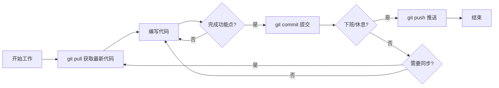
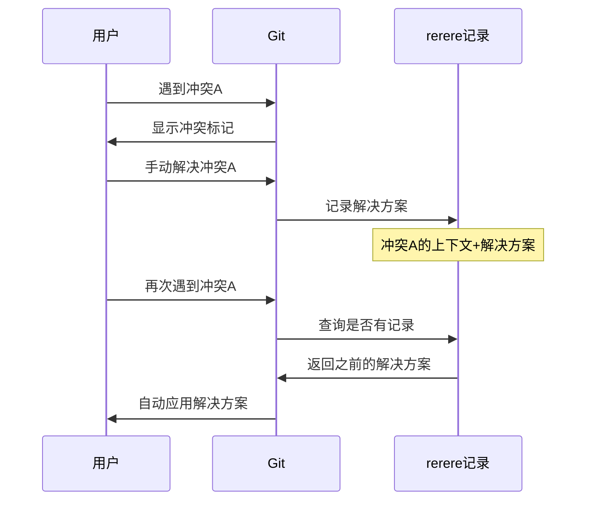
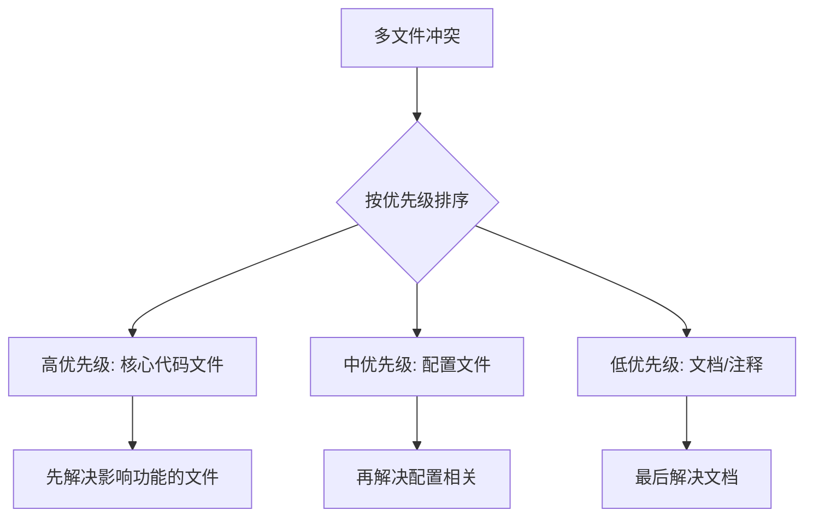
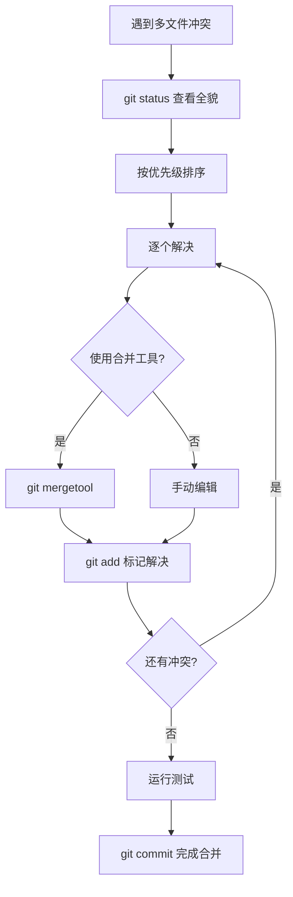
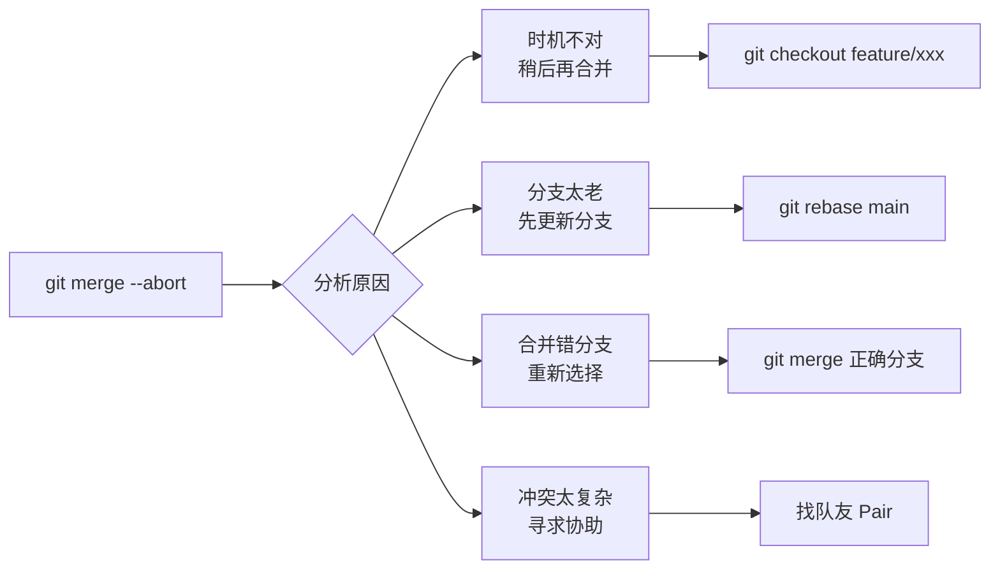
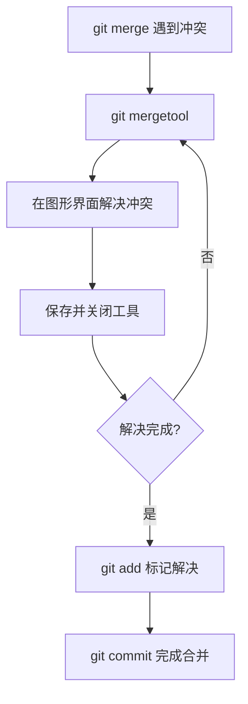
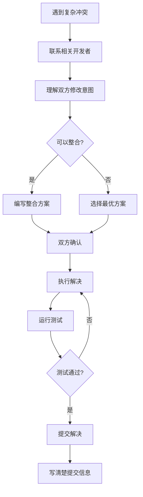

+++
title = "第15章：冲突解决进阶 —— 化干戈为玉帛"
weight = 150
date = 2026-04-03T19:36:48+08:00
type = "docs"
description = ""
isCJKLanguage = true
draft = false
+++
# 第15章：冲突解决进阶 —— 化干戈为玉帛

> 想象一下：你辛辛苦苦写了一天的代码，正准备提交，突然 Git 冷冷地告诉你："Merge conflict"。那一刻，是不是感觉心脏骤停？别慌，这一章就是来拯救你的！

---

## 15.1 冲突的本质：两个人改了同一个地方

冲突（Conflict），听起来像是两个人在吵架，对吧？其实在 Git 的世界里，冲突就是这么回事——**两个人（或者两个分支）同时修改了同一个文件的同一个地方，Git 不知道该听谁的，于是就摊手说："你们自己解决吧！"**

### 为什么会发生冲突？

让我们用一个生活中的例子来理解：

假设你和你室友共用一本笔记本。周一，你在第 10 页写上了"今晚吃披萨"。周二，你室友也在第 10 页写上了"今晚吃面条"。周三，你们俩同时翻开笔记本——懵了，到底吃什么？

Git 遇到这种情况也是一脸懵，它只能把两个版本都标出来，让你来决定。

### 冲突长什么样？

当冲突发生时，Git 会在文件中插入特殊的标记：

```
<<<<<<< HEAD
这里是当前分支的内容
=======
这里是合并进来的内容
>>>>>>> feature-branch
```

让我解释一下这些符号：

- `<<<<<<< HEAD`：表示当前分支（HEAD 指向的分支）的内容开始
- `=======`：分隔线，上面是当前分支的，下面是合并进来的
- `>>>>>>> feature-branch`：表示被合并分支的内容结束

### 实战演示

假设你正在开发一个电商网站，`main` 分支上的商品价格是：

```javascript
// product.js
const price = 100;  // 原价
```

同时，你的同事在 `discount` 分支上修改了价格：

```javascript
// product.js
const price = 80;  // 打八折
```

而你在 `main` 分支上改成了：

```javascript
// product.js
const price = 90;  // 打九折
```

当你尝试合并时，Git 会这样显示：

```javascript
// product.js
<<<<<<< HEAD
const price = 90;  // 打九折
=======
const price = 80;  // 打八折
>>>>>>> discount
```

### 解决冲突的思路

1. **理解双方的修改意图**：为什么你改成 90？为什么同事改成 80？
2. **选择保留哪一个**，或者**合并两者的逻辑**
3. **删除冲突标记**，只保留最终内容

比如，你们决定采用折中方案——85元：

```javascript
// product.js
const price = 85;  // 最终定价：折中方案
```

### 冲突不是敌人

很多人看到冲突就头大，其实冲突是 Git 在保护你。如果没有冲突机制，Git 可能会默默地用一方的修改覆盖另一方，那才是真正的灾难！

所以，下次看到冲突，深呼吸，告诉自己："Git 在帮我避免数据丢失，这是个好事！"

---

## 15.2 预防冲突：频繁同步、小步提交

俗话说得好："预防胜于治疗"。在 Git 世界里，这句话同样适用。与其等到冲突爆发再手忙脚乱地解决，不如从一开始就做好预防措施。

### 冲突预防的两大法宝

#### 法宝一：频繁同步（Pull Often）

想象你正在写一部长篇小说，而你的合著者也在写。如果你们一周不同步，最后合并时可能会发现：你把主角写死了，而你的合著者让主角去火星度了蜜月。这冲突可就大了！

**频繁同步**就像是每天和你的合著者通个电话："嘿，我写到第三章了，主角还活着吗？"

```bash
# 每天早上来杯咖啡，然后...
git pull origin main

# 或者更保险一点，先 fetch 看看有什么变化
git fetch origin
git log HEAD..origin/main --oneline  # 看看远程有什么新提交
```

#### 法宝二：小步提交（Commit Early, Commit Often）

**小步提交**就像是把大象切成小块再吃，而不是试图一口吞下整头大象。

```bash
# ❌ 不要这样做：写了一天的代码，一次性提交
git add .
git commit -m "完成整个功能"

# ✅ 应该这样做：完成一个小功能就提交
git add src/utils/validator.js
git commit -m "feat: 添加表单验证工具函数"

git add src/components/LoginForm.jsx
git commit -m "feat: 实现登录表单组件"

git add tests/login.test.js
git commit -m "test: 添加登录功能单元测试"
```

### 为什么小步提交能减少冲突？

1. **修改范围小**：每次修改的文件少，和别人冲突的概率就低
2. **提交频率高**：你的修改能更快进入主分支，别人基于你的最新代码工作
3. **回滚容易**：如果出问题，可以精确回滚到某个小提交，而不是丢掉一整天的工作

### 实战建议：设定同步闹钟

给自己定个规矩：

```bash
# 每完成一个功能点
git commit -m "feat: xxx"

# 每天开始工作前
git pull origin main

# 每天下班前
git push origin feature/my-feature
```

### 团队协作中的预防策略



### 冲突预防的黄金法则

1. **早拉（Pull Early）**：开始工作前先拉取最新代码
2. **勤提（Commit Often）**：小步快跑，频繁提交
3. **快推（Push Quickly）**：功能完成尽快推送，减少并行修改时间
4. **多沟通（Communicate）**：和队友说一声"我在改这个文件"

记住：**冲突就像牙疼，预防比治疗便宜多了！**

---

## 15.3 使用 `git rerere`：自动记录冲突解决

等等，`git rerere`？你是不是打错了？应该是 `git rerere` 吗？

哈哈，开个玩笑！其实 Git 并没有 `rerere` 这个命令。但是 Git 确实有一个非常强大的功能可以**自动记录和重用冲突解决方案**——它就是 **`git rerere`** 的"远房亲戚"们组合起来的技巧，以及 Git 2.0+ 引入的 `rerere` 相关功能。

不过，让我先澄清一下：**Git 官方并没有一个叫 `git rerere` 的命令**。这可能是对 `git rerere`（reuse recorded resolution，重用记录的解决方案）的误传。

### 真正的神器：`git rerere`

Git 确实有一个 `rerere`（Reuse Recorded Resolution）功能，但它是通过 `git rebase` 和 `git am` 的 `--rerere-autoupdate` 选项来使用的。

```bash
# 启用 rerere 自动更新
git rebase --rerere-autoupdate main

# 或者在应用补丁时
git am --rerere-autoupdate patch-file.patch
```

### rerere 的工作原理

`rerere` 会**记录你解决冲突的方式**，当同样的冲突再次出现时，自动应用之前的解决方案。



### 实际使用场景

想象你在做一个长期的功能分支，需要频繁地从 `main` 分支 rebase。每次 rebase 都会遇到同样的冲突（比如某个配置文件），是不是很烦？

```bash
# 第一次 rebase，手动解决冲突
git rebase main
# ... 解决冲突 ...
git add .
git rebase --continue

# 之后再次 rebase，Git 会自动应用之前的解决方案
git rebase main
# 如果冲突相同，Git 会自动解决！
```

### 手动管理 rerere 记录

```bash
# 查看 rerere 记录
git rerere status

# 清除 rerere 记录
git rerere forget

# 查看 rerere 的详细状态
git rerere diff

# 在特定路径上启用 rerere
git config rerere.enabled true
```

### 配置 rerere

```bash
# 全局启用 rerere
git config --global rerere.enabled true

# 或者只在当前仓库启用
git config rerere.enabled true
```

### rerere 的局限性

虽然 rerere 很强大，但它也有局限：

1. **上下文必须完全匹配**：如果冲突的上下文稍有变化，rerere 就无法自动应用
2. **不适用于所有冲突**：复杂的逻辑冲突还是需要人工判断
3. **需要 Git 2.0+**：老版本 Git 不支持

### 小贴士

```bash
# 在 rebase 时自动启用 rerere
git config --global rebase.autoStash true
git config --global rebase.autosquash true

# 结合使用效果更佳
git pull --rebase --autostash
```

记住：**rerere 不是万能的，但它能帮你省去重复解决相同冲突的烦恼！**

---

## 15.4 复杂冲突处理：多文件冲突怎么办？

当你兴高采烈地执行 `git merge` 或 `git pull`，然后看到下面这一幕时，心脏可能会漏跳一拍：

```
Auto-merging src/components/Header.jsx
CONFLICT (content): Merge conflict in src/components/Header.jsx
Auto-merging src/components/Footer.jsx
CONFLICT (content): Merge conflict in src/components/Footer.jsx
Auto-merging src/utils/api.js
CONFLICT (content): Merge conflict in src/utils/api.js
Auto-merging src/styles/main.css
CONFLICT (content): Merge conflict in src/styles/main.css
...还有10个文件...
```

**多文件冲突**，就像是同时有十几个闹钟在响，而你不知道先关哪个。别慌，让我们系统性地解决这个问题！

### 第一步：冷静，先看清局势

```bash
# 查看哪些文件有冲突
git status

# 只看冲突文件
git diff --name-only --diff-filter=U

# 查看冲突的统计信息
git diff --stat
```

输出可能是这样的：

```
On branch feature/new-ui
You have unmerged paths.
  (fix conflicts and run "git commit")

Unmerged paths:
  (use "git add <file>..." to mark resolution)

	both modified:   src/components/Header.jsx
	both modified:   src/components/Footer.jsx
	both modified:   src/utils/api.js
	both modified:   src/styles/main.css
	both modified:   package.json
	both modified:   README.md
```

### 第二步：优先级排序

不是所有文件都同等重要，按优先级处理：



**优先级建议：**

1. **高优先级**：核心业务逻辑、API 接口、数据库模型
2. **中优先级**：配置文件、构建脚本
3. **低优先级**：文档、注释、README

### 第三步：逐个击破

```bash
# 1. 先解决最重要的文件
# 打开 src/components/Header.jsx，手动解决冲突

# 2. 标记为已解决
git add src/components/Header.jsx

# 3. 继续下一个
git add src/components/Footer.jsx

# 4. 批量添加所有已解决的文件
git add -A
```

### 第四步：使用工具提高效率

当冲突文件很多时，手动一个个打开太痛苦了。使用合并工具：

```bash
# 使用 VS Code 作为合并工具
git config --global merge.tool vscode
git config --global mergetool.vscode.cmd "code --wait $MERGED"

# 启动合并工具
git mergetool

# 这会逐个打开有冲突的文件
```

### 第五步：验证解决方案

```bash
# 检查是否还有未解决的冲突
git diff --check

# 搜索残留的冲突标记
grep -r "<<<<<<< HEAD" src/

# 运行测试确保没有破坏功能
npm test

# 或者构建项目
npm run build
```

### 实战脚本：批量检查冲突

创建一个脚本 `check-conflicts.sh`：

```bash
#!/bin/bash
# check-conflicts.sh - 检查项目中是否还有未解决的冲突

echo "🔍 检查冲突标记..."

# 查找所有冲突标记
conflicts=$(grep -r "<<<<<<< HEAD" --include="*.js" --include="*.jsx" --include="*.ts" --include="*.tsx" --include="*.css" --include="*.scss" --include="*.html" --include="*.md" .)

if [ -z "$conflicts" ]; then
    echo "✅ 没有发现冲突标记！"
else
    echo "❌ 发现未解决的冲突："
    echo "$conflicts"
    exit 1
fi
```

### 复杂冲突的策略



### 心态调整

多文件冲突确实让人头大，但请记住：

- **冲突是信息，不是错误**：Git 在告诉你需要人工决策
- **分而治之**：一次解决一个文件，不要试图一口吃成胖子
- **寻求帮助**：如果不确定某个文件的解决方案，找原作者讨论

**多文件冲突就像是一场马拉松，不是百米冲刺。保持节奏，你一定能跑完！**

---

## 15.5 放弃合并：`git merge --abort`

有时候，生活给了你柠檬，你可以选择做柠檬水，也可以选择...把柠檬扔回去。

在 Git 中，当你陷入合并冲突的泥潭，发现自己越陷越深时，Git 给了你一条退路——**放弃合并，回到合并前的状态**。

### 什么时候需要放弃合并？

1. **冲突太多，理不清头绪**：当你发现冲突文件有几十个，而且你根本不知道为什么会有这些冲突
2. **合并错了分支**："哎呀，我本来想合并 `feature/login`，结果合并了 `feature/payment`！"
3. **代码冲突太复杂**：涉及到核心逻辑，你不确定该怎么解决
4. **需要重新规划**：发现现在的合并时机不对，需要等某些功能完成后再合并

### 如何使用 `git merge --abort`

```bash
# 当你处于合并冲突状态，想要放弃合并
git merge --abort

# 或者使用老版本的语法（Git 1.7.4 之前）
git reset --merge
```

执行后，你的工作区会**完全恢复到合并前的状态**，就像什么都没发生过一样。

### 实战演示

```bash
# 1. 尝试合并 feature/new-ui
git merge feature/new-ui
# Auto-merging src/App.jsx
# CONFLICT (content): Merge conflict in src/App.jsx
# Auto-merging src/components/Header.jsx
# CONFLICT (content): Merge conflict in src/components/Header.jsx
# ... 更多冲突 ...

# 2. 查看状态，发现一团糟
git status
# On branch main
# You have unmerged paths.
# Unmerged paths:
#   both modified:   src/App.jsx
#   both modified:   src/components/Header.jsx

# 3. 决定放弃，重新开始
git merge --abort

# 4. 世界清净了
git status
# On branch main
# nothing to commit, working tree clean
```

### 注意事项

```bash
# ⚠️ 警告：如果你已经解决了部分冲突并 git add 了
# git merge --abort 会放弃所有已解决的冲突！

# 如果你只想放弃某个文件的合并，保留其他已解决的
git checkout --ours src/App.jsx    # 保留当前分支的版本
git checkout --theirs src/App.jsx  # 保留合并分支的版本
git add src/App.jsx
```

### `--ours` vs `--theirs`

这两个选项在合并时非常有用：

```bash
# 保留当前分支的版本（放弃合并分支的修改）
git checkout --ours src/conflicted-file.js
git add src/conflicted-file.js

# 保留合并分支的版本（完全接受对方的修改）
git checkout --theirs src/conflicted-file.js
git add src/conflicted-file.js
```

**注意**：在 rebase 时，`--ours` 和 `--theirs` 的含义是相反的！

### 放弃合并后的策略



### 放弃合并 ≠ 失败

很多新手觉得放弃合并是"认输"，其实不然。在软件开发中，**知道什么时候该撤退，是一种智慧**。

```bash
# 放弃合并后，你可以选择：

# 方案1：先更新你的分支，减少冲突
git checkout feature/my-feature
git rebase main
git checkout main
git merge feature/my-feature  # 冲突应该变少了

# 方案2：分步合并，一次合并一部分
git merge feature/my-feature-part1
git merge feature/my-feature-part2

# 方案3：使用 squash 合并，简化历史
git merge --squash feature/my-feature
```

### 小贴士

```bash
# 在合并前创建备份分支（好习惯！）
git branch backup-before-merge

# 这样即使放弃合并，你也有退路
git merge --abort
# 如果后悔了，可以恢复
git reset --hard backup-before-merge
```

记住：**放弃合并不是失败，而是为了更好地重新出发！**

---

## 15.6 合并工具推荐：Beyond Compare、KDiff3

手动解决冲突就像是用手工锯木头——能完成任务，但效率低下还容易伤到自己。而使用专业的合并工具，就像是换成了电锯，事半功倍！

### 什么是合并工具？

**合并工具（Merge Tool）**是专门用来可视化和解决代码冲突的软件。它们通常提供三栏视图：

- **左侧**：当前分支的版本（ours）
- **右侧**：合并分支的版本（theirs）
- **中间**：合并后的结果

```
┌─────────────┬─────────────┬─────────────┐
│   当前分支   │   合并结果   │   合并分支   │
│   (HEAD)    │  (Result)   │  (Branch)   │
├─────────────┼─────────────┼─────────────┤
│ const x = 1 │ const x = ? │ const x = 2 │
│             │             │             │
│             │ [选择左边]  │             │
│             │ [选择右边]  │             │
│             │ [手动编辑]  │             │
└─────────────┴─────────────┴─────────────┘
```

### 推荐工具一：Beyond Compare

**Beyond Compare**是业界公认的合并工具之王，功能强大但价格不菲。

#### 特点

- ✅ 界面美观，操作直观
- ✅ 支持文件夹对比（不只是文件）
- ✅ 支持多种文件格式（代码、图片、二进制）
- ✅ 强大的规则系统，可自定义对比逻辑
- ❌ 收费软件（约 $60，但有 30 天试用）

#### 配置方法

```bash
# 配置 Beyond Compare 为 Git 合并工具
git config --global merge.tool bc4
git config --global mergetool.bc4.cmd '"C:\Program Files\Beyond Compare 4\BComp.exe" "$LOCAL" "$REMOTE" "$BASE" "$MERGED"'
git config --global mergetool.bc4.trustExitCode true

# 配置为差异对比工具
git config --global diff.tool bc4
git config --global difftool.bc4.cmd '"C:\Program Files\Beyond Compare 4\BComp.exe" "$LOCAL" "$REMOTE"'
```

#### 使用方法

```bash
# 当遇到冲突时，启动 Beyond Compare
git mergetool

# 或者对比两个提交
git difftool HEAD~1 HEAD
```

### 推荐工具二：KDiff3

**KDiff3**是一款开源免费的合并工具，功能齐全，是预算有限时的最佳选择。

#### 特点

- ✅ 完全免费开源
- ✅ 跨平台（Windows、Mac、Linux）
- ✅ 自动合并能力（能自动解决的自动解决）
- ✅ 支持三栏对比
- ❌ 界面相对朴素

#### 配置方法

```bash
# Windows 配置
git config --global merge.tool kdiff3
git config --global mergetool.kdiff3.cmd '"C:\Program Files\KDiff3\kdiff3.exe" "$BASE" "$LOCAL" "$REMOTE" -o "$MERGED"'

# Mac 配置（使用 Homebrew 安装）
# brew install kdiff3
git config --global mergetool.kdiff3.cmd '/Applications/kdiff3.app/Contents/MacOS/kdiff3 "$BASE" "$LOCAL" "$REMOTE" -o "$MERGED"'

# Linux 配置
git config --global mergetool.kdiff3.cmd 'kdiff3 "$BASE" "$LOCAL" "$REMOTE" -o "$MERGED"'
```

### 推荐工具三：VS Code 内置合并工具

如果你已经在使用 VS Code，它的内置合并工具已经非常强大了！

#### 配置方法

```bash
# 配置 VS Code 为默认合并工具
git config --global merge.tool vscode
git config --global mergetool.vscode.cmd 'code --wait $MERGED'
git config --global mergetool.vscode.trustExitCode true

# 配置 VS Code 为差异工具
git config --global diff.tool vscode
git config --global difftool.vscode.cmd 'code --wait --diff $LOCAL $REMOTE'
```

#### VS Code 合并界面

VS Code 的合并编辑器提供了直观的界面：

1. 打开冲突文件时，VS Code 会自动识别冲突标记
2. 提供 "Accept Current"、"Accept Incoming"、"Accept Both" 按钮
3. 可以直接在编辑器中修改合并结果

### 推荐工具四：Meld（Linux 用户首选）

**Meld**是 Linux 平台上最受欢迎的合并工具之一。

```bash
# Ubuntu/Debian
sudo apt-get install meld

# 配置 Git
git config --global merge.tool meld
git config --global mergetool.meld.cmd 'meld "$LOCAL" "$MERGED" "$REMOTE"'
```

### 工具对比表

| 工具 | 价格 | 跨平台 | 自动合并 | 推荐指数 |
|------|------|--------|----------|----------|
| Beyond Compare | $60 | Win/Mac/Linux | ⭐⭐⭐ | ⭐⭐⭐⭐⭐ |
| KDiff3 | 免费 | Win/Mac/Linux | ⭐⭐⭐⭐ | ⭐⭐⭐⭐ |
| VS Code | 免费 | Win/Mac/Linux | ⭐⭐ | ⭐⭐⭐⭐ |
| Meld | 免费 | Linux/Mac | ⭐⭐ | ⭐⭐⭐ |
| vimdiff | 免费 | 命令行 | ⭐ | ⭐⭐ |

### 配置 Git 使用合并工具的最佳实践

```bash
# 1. 配置合并工具
git config --global merge.tool <tool-name>

# 2. 配置合并工具后不自动提交（推荐）
git config --global mergetool.keepBackup false
git config --global mergetool.keepTemporaries false

# 3. 配置在提示前不自动打开工具
git config --global mergetool.prompt false

# 4. 查看当前配置
git config --global --get merge.tool
git config --global --get mergetool.<tool>.cmd
```

### 使用合并工具的工作流



### 小贴士

```bash
# 查看所有支持的合并工具
git mergetool --tool-help

# 临时使用特定工具（不修改配置）
git mergetool --tool=kdiff3

# 查看合并工具生成的备份文件
git config --global mergetool.keepBackup true
# 解决后手动删除 *.orig 文件
```

记住：**好工具能让你事半功倍，选择适合自己的合并工具，让解决冲突不再痛苦！**

---

## 15.7 团队冲突解决规范：别各显神通

想象一下：你们团队有 5 个人，每次遇到冲突，每个人都用自己的方式解决——有人直接覆盖，有人手动合并，有人用工具 A，有人用工具 B... 结果是什么？**代码库变成了一锅粥，历史记录乱七八糟，bug 层出不穷。**

这就是没有规范的代价。

### 为什么需要冲突解决规范？

1. **保持一致性**：所有人都用同样的方式解决冲突
2. **可追溯性**：出现问题时能快速定位原因
3. **减少错误**：规范化的流程能减少人为失误
4. **提高效率**：新人入职不用猜测"该怎么弄"

### 规范一：冲突解决前的检查清单

在解决冲突前，先问自己几个问题：

```markdown
## 冲突解决检查清单

- [ ] 我理解了冲突双方的修改意图吗？
- [ ] 我和冲突的另一方沟通过吗？
- [ ] 我运行了测试确保没有破坏功能吗？
- [ ] 我检查了是否还有残留的冲突标记吗？
- [ ] 我提交了清晰的解决说明吗？
```

### 规范二：冲突解决的命名规范

```bash
# ❌ 不好的提交信息
git commit -m "解决冲突"
git commit -m "fix conflict"
git commit -m "merge"

# ✅ 好的提交信息
git commit -m "resolve: 合并 feature/login 时解决 API 接口冲突"
git commit -m "resolve: 统一用户认证模块的冲突（选择 JWT 方案）"
git commit -m "resolve: 解决 config.js 中的环境变量配置冲突"
```

### 规范三：复杂冲突必须沟通

```mermaid
flowchart TD
    A[遇到冲突] --> B{冲突复杂度}
    B -->|简单| C[自行解决]
    B -->|复杂| D[联系另一方]
    D --> E[讨论解决方案]
    E --> F[达成共识]
    F --> G[执行解决]
    C --> H[提交解决]
    G --> H
    H --> I[在提交信息中@对方]
```

**复杂冲突的定义：**

- 涉及核心业务逻辑
- 修改超过 50 行
- 涉及数据库结构变更
- 涉及 API 接口变更

### 规范四：冲突解决后的验证流程

```bash
# 1. 检查是否还有冲突标记
grep -r "<<<<<<< HEAD" src/

# 2. 运行代码检查
npm run lint

# 3. 运行测试
npm test

# 4. 构建项目
npm run build

# 5. 代码审查（如果是复杂冲突）
# 创建 PR，让队友 review
```

### 规范五：冲突解决的分工原则

| 场景 | 谁来解决 | 原因 |
|------|----------|------|
| 功能分支 vs main | 功能分支开发者 | 最了解新功能 |
| 两个功能分支 | 后合并的一方 | 需要整合双方代码 |
| 配置文件冲突 | 团队负责人/DevOps | 了解整体配置 |
| 第三方依赖冲突 | 引入依赖的一方 | 了解依赖用途 |

### 规范六：冲突解决的禁止事项

```markdown
## 🚫 冲突解决禁止清单

1. **禁止**在不了解双方修改的情况下随意选择一方
2. **禁止**使用 `git checkout --ours .` 或 `--theirs .` 批量解决
3. **禁止**在解决冲突后不运行测试
4. **禁止**提交带有冲突标记的文件
5. **禁止**在提交信息中不写清楚解决了什么冲突
6. **禁止**在冲突涉及核心业务时不通知相关开发者
```

### 规范七：团队冲突解决文档

每个团队都应该有一份《冲突解决指南》：

```markdown
# 团队冲突解决指南

## 快速开始

1. 发现冲突 → 不要慌
2. 评估复杂度 → 简单自行解决，复杂找队友
3. 使用工具 → 推荐 VS Code 或 Beyond Compare
4. 验证 → 必须运行测试
5. 提交 → 写清楚解决了什么

## 联系方式

- 前端冲突：@张三
- 后端冲突：@李四
- 配置冲突：@王五

## 常用命令

```bash
# 查看冲突文件
git diff --name-only --diff-filter=U

# 使用合并工具
git mergetool

# 检查残留标记
grep -r "<<<<<<<" src/
```
```

### 规范八：冲突解决的代码审查

对于复杂冲突，强制要求代码审查：

```bash
# 解决冲突后，不要直接推送到 main
# 而是创建 PR，让队友 review

git checkout -b resolve/login-conflict
git add .
git commit -m "resolve: 解决登录模块的合并冲突"
git push origin resolve/login-conflict

# 然后在 GitHub/GitLab 上创建 PR
# 要求至少 1 人 review 后才能合并
```

### 规范九：冲突统计与复盘

定期统计团队的冲突情况：

```bash
# 查看最近一个月的合并记录
git log --merges --since="1 month ago" --oneline

# 统计冲突解决次数
# 可以在 CI 中添加统计脚本
```

每月团队会议时讨论：

- 本月冲突最多的文件/模块是哪些？
- 为什么这些文件经常冲突？
- 如何减少冲突？

### 小贴士

```bash
# 设置 Git 别名，快速检查冲突

# 查看冲突文件
git config --global alias.conflicts 'diff --name-only --diff-filter=U'

# 使用方式
git conflicts

# 检查残留标记
git config --global alias.check-conflicts '!grep -r "<<<<<<<" . --include="*.js" --include="*.jsx"'
```

记住：**规范不是束缚，而是让团队协作更顺畅的润滑剂！**

---

## 15.8 实战：一个棘手的冲突案例

好了，理论讲了一堆，让我们来点实战的。下面是一个真实（但稍作改编）的冲突案例，看看如果是你，会怎么解决。

### 场景设定

**背景**：你们团队正在开发一个电商平台。

**主角**：
- **小明**：负责用户认证模块（`feature/auth-refactor` 分支）
- **小红**：负责支付模块（`feature/payment` 分支）

**冲突发生**：两个分支都修改了 `src/api/user.js` 文件，现在要把它们合并到 `main` 分支。

### 冲突文件内容

#### 小明的版本（feature/auth-refactor）

```javascript
// src/api/user.js
import axios from 'axios';
import { jwtDecode } from 'jwt-decode';

const API_BASE = process.env.REACT_APP_API_URL;

// 新的认证方式：使用 JWT
export const login = async (credentials) => {
  const response = await axios.post(`${API_BASE}/auth/login`, credentials);
  const { token } = response.data;
  localStorage.setItem('token', token);
  return jwtDecode(token);
};

export const getUserProfile = async () => {
  const token = localStorage.getItem('token');
  const response = await axios.get(`${API_BASE}/user/profile`, {
    headers: { Authorization: `Bearer ${token}` }
  });
  return response.data;
};

// 新增：刷新 Token
export const refreshToken = async () => {
  const token = localStorage.getItem('token');
  const response = await axios.post(`${API_BASE}/auth/refresh`, { token });
  localStorage.setItem('token', response.data.token);
  return response.data.token;
};
```

#### 小红的版本（feature/payment）

```javascript
// src/api/user.js
import axios from 'axios';

const API_BASE = process.env.REACT_APP_API_URL;

// 用户认证
export const login = async (credentials) => {
  const response = await axios.post(`${API_BASE}/auth/login`, credentials);
  const { token, user } = response.data;
  localStorage.setItem('token', token);
  localStorage.setItem('user', JSON.stringify(user));
  return user;
};

export const getUserProfile = async () => {
  const token = localStorage.getItem('token');
  const response = await axios.get(`${API_BASE}/user/profile`, {
    headers: { Authorization: `Bearer ${token}` }
  });
  return response.data;
};

// 新增：获取用户支付方式
export const getUserPaymentMethods = async () => {
  const token = localStorage.getItem('token');
  const response = await axios.get(`${API_BASE}/user/payment-methods`, {
    headers: { Authorization: `Bearer ${token}` }
  });
  return response.data;
};
```

### 合并时的冲突

```bash
git checkout main
git merge feature/auth-refactor  # 成功
git merge feature/payment        # 冲突！
```

冲突标记：

```javascript
// src/api/user.js
import axios from 'axios';
<<<<<<< HEAD
import { jwtDecode } from 'jwt-decode';
=======
>>>>>>> feature/payment

const API_BASE = process.env.REACT_APP_API_URL;

// 用户认证
export const login = async (credentials) => {
  const response = await axios.post(`${API_BASE}/auth/login`, credentials);
<<<<<<< HEAD
  const { token } = response.data;
  localStorage.setItem('token', token);
  return jwtDecode(token);
=======
  const { token, user } = response.data;
  localStorage.setItem('token', token);
  localStorage.setItem('user', JSON.stringify(user));
  return user;
>>>>>>> feature/payment
};

export const getUserProfile = async () => {
  const response = await axios.get(`${API_BASE}/user/profile`);
  return response.data;
};

<<<<<<< HEAD
// 新增：刷新 Token
export const refreshToken = async () => {
  const token = localStorage.getItem('token');
  const response = await axios.post(`${API_BASE}/auth/refresh`, { token });
  localStorage.setItem('token', response.data.token);
  return response.data.token;
};
=======
// 新增：获取用户支付方式
export const getUserPaymentMethods = async () => {
  const token = localStorage.getItem('token');
  const response = await axios.get(`${API_BASE}/user/payment-methods`, {
    headers: { Authorization: `Bearer ${token}` }
  });
  return response.data;
};
>>>>>>> feature/payment
```

### 分析冲突

让我们看看冲突点在哪里：

1. **导入语句**：小明添加了 `jwtDecode` 导入
2. **login 函数**：
   - 小明：返回解码后的 JWT
   - 小红：返回 user 对象，并存储到 localStorage
3. **新增函数**：
   - 小明：添加了 `refreshToken`
   - 小红：添加了 `getUserPaymentMethods`

### 解决思路

这是一个典型的**功能整合**冲突，不是简单的选择一方，而是需要合并双方的功能。

#### 步骤 1：联系双方开发者

```bash
# 在 Slack/钉钉/飞书上
@小明 @小红
你们俩的代码冲突了，都在改 user.js。
小明需要 JWT 解码，小红需要用户信息存储。
咱们商量一下怎么整合？
```

#### 步骤 2：讨论解决方案

**讨论结果**：

1. 保留 JWT 认证（小明的方案更安全）
2. 同时存储 user 信息（小红的需求合理）
3. 两个新增函数都保留（都有用）

#### 步骤 3：编写解决方案

```javascript
// src/api/user.js
import axios from 'axios';
import { jwtDecode } from 'jwt-decode';  // 保留：JWT 解码

const API_BASE = process.env.REACT_APP_API_URL;

// 用户认证 - 整合双方需求
export const login = async (credentials) => {
  const response = await axios.post(`${API_BASE}/auth/login`, credentials);
  const { token, user } = response.data;  // 保留：获取 token 和 user
  
  // 存储 token 和用户信息
  localStorage.setItem('token', token);
  localStorage.setItem('user', JSON.stringify(user));
  
  // 返回解码后的 token 和用户信息
  return {
    ...jwtDecode(token),  // 小明的需求：JWT 信息
    ...user              // 小红的需求：用户信息
  };
};

export const getUserProfile = async () => {
  const token = localStorage.getItem('token');
  const response = await axios.get(`${API_BASE}/user/profile`, {
    headers: { Authorization: `Bearer ${token}` }  // 保留：认证头
  });
  return response.data;
};

// 新增：刷新 Token（来自 feature/auth-refactor）
export const refreshToken = async () => {
  const token = localStorage.getItem('token');
  const response = await axios.post(`${API_BASE}/auth/refresh`, { token });
  localStorage.setItem('token', response.data.token);
  return response.data.token;
};

// 新增：获取用户支付方式（来自 feature/payment）
export const getUserPaymentMethods = async () => {
  const token = localStorage.getItem('token');
  const response = await axios.get(`${API_BASE}/user/payment-methods`, {
    headers: { Authorization: `Bearer ${token}` }
  });
  return response.data;
};
```

#### 步骤 4：验证解决方案

```bash
# 1. 标记冲突已解决
git add src/api/user.js

# 2. 检查是否还有冲突
git status

# 3. 运行测试
npm test -- user.test.js

# 4. 检查代码风格
npm run lint

# 5. 提交解决
git commit -m "resolve: 整合 auth-refactor 和 payment 分支的 user.js 冲突

- 保留 JWT 认证方案（更安全）
- 同时存储 user 信息到 localStorage
- 整合 refreshToken 和 getUserPaymentMethods 功能
- 经 @小明 @小红 确认"
```

### 经验总结

从这个案例中学到了什么？

1. **沟通是关键**：复杂冲突必须和相关开发者沟通
2. **理解意图**：不要只看代码，要理解为什么要这么改
3. **整合而非选择**：很多时候不是非此即彼，而是可以整合
4. **验证不能少**：解决后一定要测试
5. **写清楚提交信息**：说明为什么这样解决

### 流程图



记住：**棘手的冲突不可怕，可怕的是不沟通、不理解、不验证！**

---

**第15章完**

