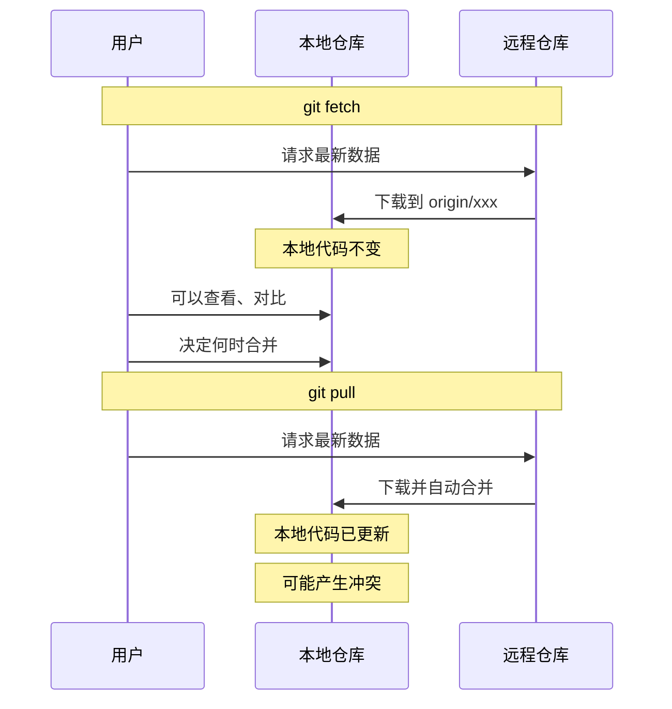
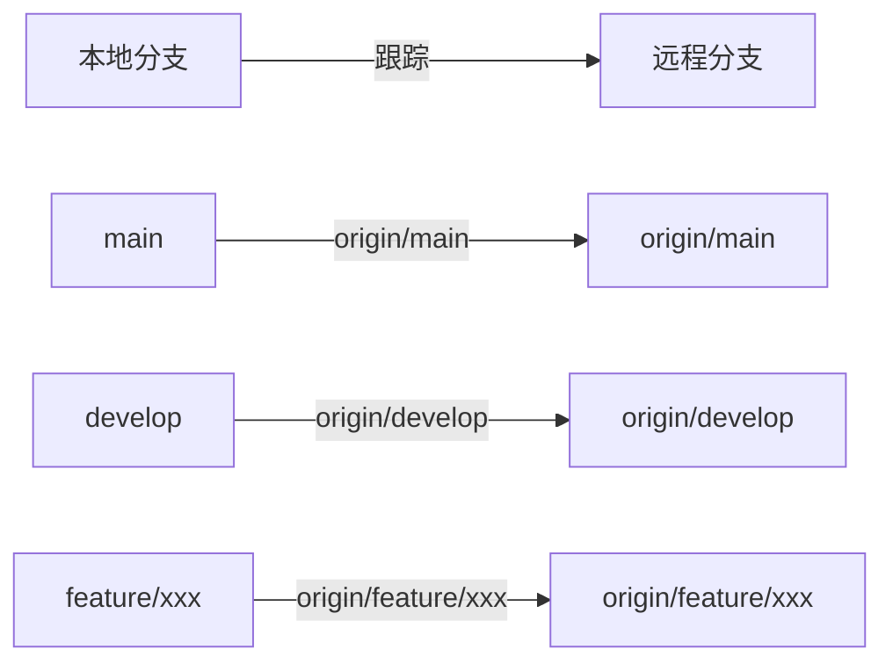
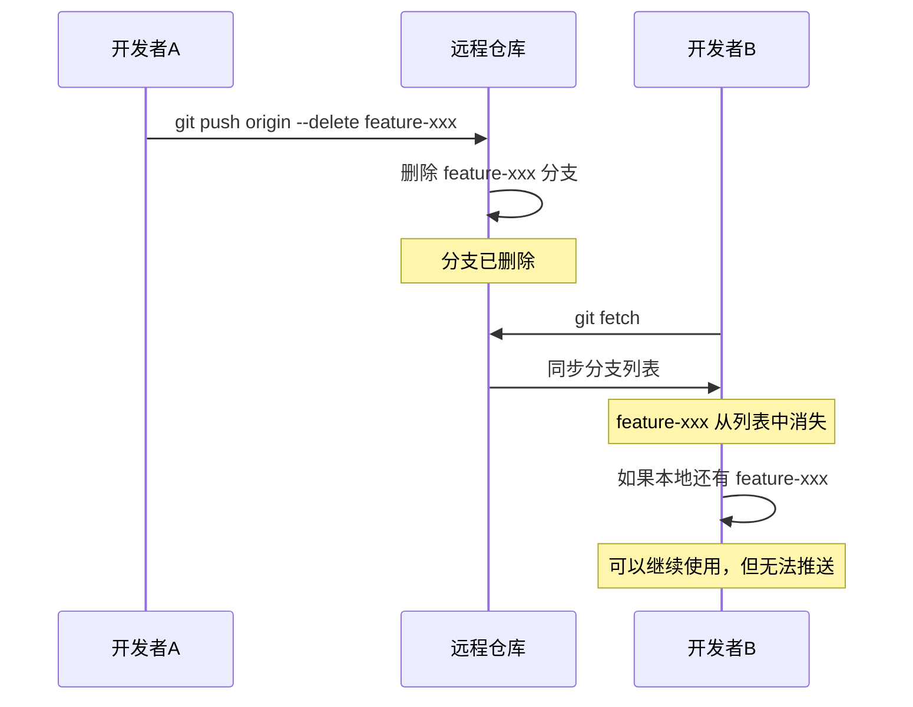
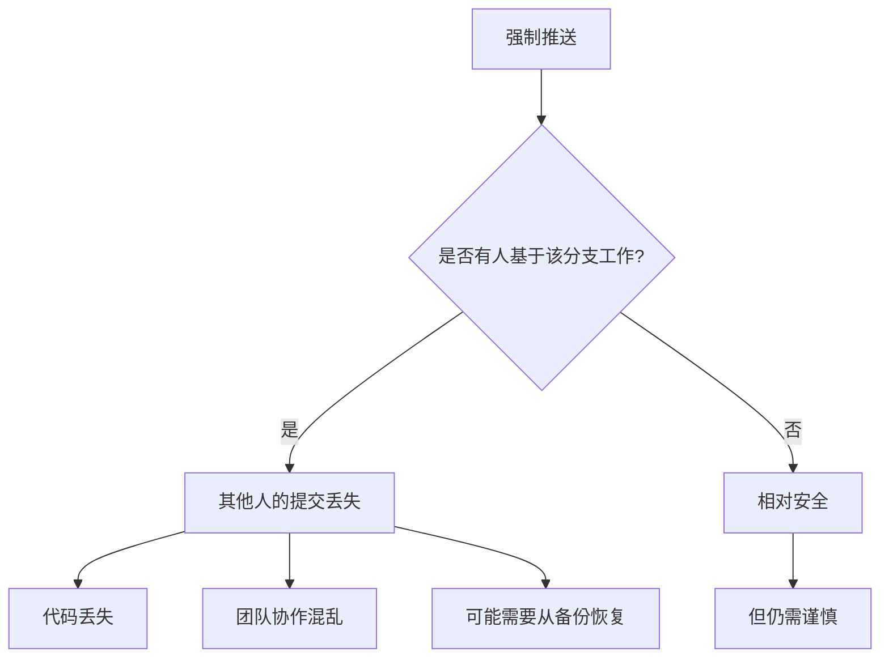
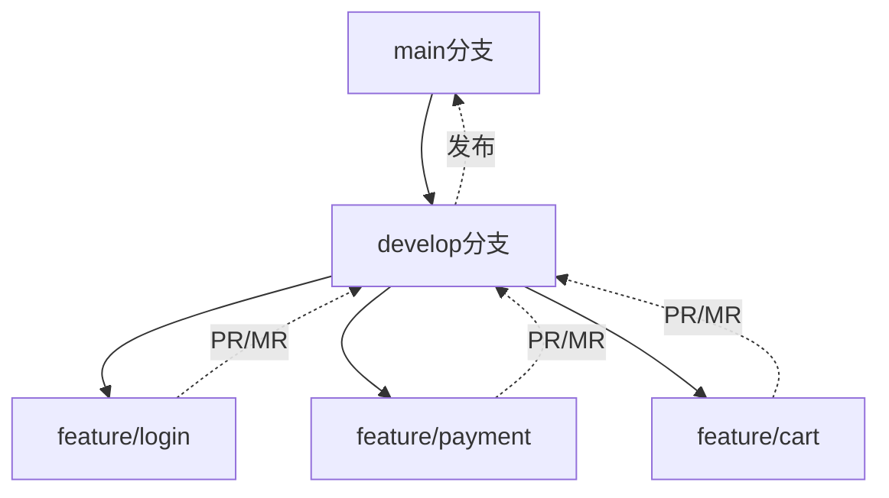
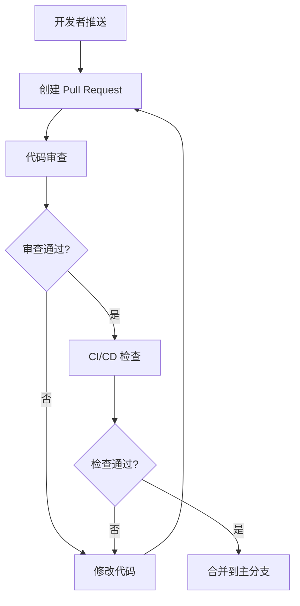
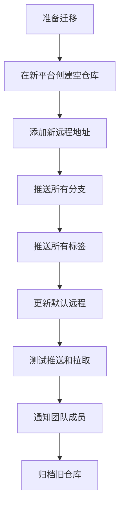

+++
title = "第16章：推送与拉取进阶 —— 与远程仓库的舞蹈"
weight = 160
date = 2026-04-03T19:36:48+08:00
type = "docs"
description = ""
isCJKLanguage = true
draft = false
+++
# 第16章：推送与拉取进阶 —— 与远程仓库的舞蹈

> 想象一下，Git 是一场双人舞，你的本地仓库和远程仓库就是舞伴。`push` 和 `pull` 就是你的舞步——踩准节奏，舞姿优美；节奏乱了，就可能踩到对方的脚。这一章，让我们学会优雅地与远程仓库共舞！

---

## 16.1 `git fetch` vs `git pull`：先看不取 vs 直接合并

很多 Git 新手都有一个困惑：`git fetch` 和 `git pull` 到底有什么区别？不都是"从远程获取代码"吗？

**错！** 这两个命令的区别，就像是"先看看菜单"和"直接点菜上菜"的区别。

### `git fetch`：先看看有什么

**`git fetch`** 的作用是：从远程仓库下载最新的数据，但不会自动合并到当前分支。

```bash
# 从默认远程（origin）获取最新数据
git fetch

# 从指定远程获取
git fetch origin

# 获取所有远程的所有分支
git fetch --all
```

fetch 之后，你的本地代码**不会发生变化**，但你可以查看远程有什么新东西：

```bash
# 查看远程 main 分支的最新提交
git log HEAD..origin/main --oneline

# 查看远程分支列表
git branch -r

# 对比本地和远程的差异
git diff HEAD origin/main
```

### `git pull`：直接获取并合并

**`git pull`** 的作用是：从远程仓库获取最新数据，**并立即合并到当前分支**。

```bash
# 从 origin 拉取当前分支对应的远程分支
git pull

# 等价于
git fetch && git merge origin/main

# 使用 rebase 而不是 merge
git pull --rebase

# 从指定远程和分支拉取
git pull origin feature-branch
```

### 两者的区别



### 什么时候用 fetch？

```bash
# 场景1：上班第一件事，先看看远程有什么变化
git fetch

# 查看 main 分支有什么新提交
git log HEAD..origin/main --oneline

# 决定：先完成手头工作，再合并
git stash
git merge origin/main
git stash pop
```

```bash
# 场景2：查看同事的提交，但不合并
git fetch

# 查看 feature/xxx 分支的提交
git log main..origin/feature/xxx --oneline

# 甚至可以直接查看文件内容
git show origin/feature/xxx:src/app.js
```

```bash
# 场景3：多远程仓库时
git fetch origin      # 获取 origin
git fetch upstream    # 获取 upstream（上游仓库）

# 对比两个远程
git log origin/main..upstream/main --oneline
```

### 什么时候用 pull？

```bash
# 场景1：快速同步（确定没有冲突）
git pull

# 场景2：使用 rebase 保持线性历史
git pull --rebase

# 场景3：明确指定远程和分支
git pull origin main
```

### fetch 的安全优势

```bash
# fetch 是安全的，不会破坏你的工作
git fetch

# 你可以随时查看、对比，不用担心

# pull 可能有风险
git pull
# 如果远程有冲突的修改，你会立即陷入合并冲突
```

### 最佳实践：fetch + merge/rebase

```bash
# 推荐的工作流

# 1. 先获取最新数据（安全）
git fetch

# 2. 查看有什么变化
git log HEAD..origin/main --oneline

# 3. 决定合并策略

# 策略A：使用 merge（保留分支历史）
git merge origin/main

# 策略B：使用 rebase（保持线性历史）
git rebase origin/main

# 策略C：先 stash，再更新，再恢复
git stash
git merge origin/main
git stash pop
```

### 配置 pull 的默认行为

```bash
# 设置 pull 默认使用 rebase
git config --global pull.rebase true

# 或者使用 merge
git config --global pull.rebase false

# 查看当前配置
git config --global pull.rebase
```

### 小贴士

```bash
# 快速查看远程分支的最新提交
git fetch && git log HEAD..origin/main --oneline

# 配置别名，方便使用
git config --global alias.flog '!git fetch && git log HEAD..origin/main --oneline'

# 使用
git flog
```

记住：**fetch 是"先看看"，pull 是"直接干"。不确定的时候，先用 fetch！**

---

## 16.2 查看远程分支：`git branch -r` 和 `git remote -v`

在 Git 的舞蹈中，了解你的舞伴（远程仓库）是谁、在哪里、有什么动作，是非常重要的。这一节，我们来学习如何查看远程仓库的信息。

### `git remote -v`：查看远程仓库地址

**`git remote -v`**（verbose，详细模式）显示你配置了哪些远程仓库，以及它们的 URL。

```bash
# 查看远程仓库
git remote -v
```

输出示例：

```
origin  https://github.com/username/repo.git (fetch)
origin  https://github.com/username/repo.git (push)
upstream        https://github.com/original-author/repo.git (fetch)
upstream        https://github.com/original-author/repo.git (push)
```

#### 输出解读

| 字段 | 含义 |
|------|------|
| `origin` | 远程仓库的简称（别名） |
| `upstream` | 另一个远程仓库的简称 |
| URL | 远程仓库的地址 |
| `(fetch)` | 用于拉取数据的 URL |
| `(push)` | 用于推送数据的 URL |

**注意**：fetch 和 push 的 URL 可以是不同的！虽然大多数情况下它们是一样的。

### `git remote` 的其他用法

```bash
# 查看所有远程仓库名称（简洁版）
git remote
# 输出：
# origin
# upstream

# 查看某个远程的详细信息
git remote show origin
```

`git remote show origin` 的输出：

```
* remote origin
  Fetch URL: https://github.com/username/repo.git
  Push  URL: https://github.com/username/repo.git
  HEAD branch: main
  Remote branches:
    main                 tracked
    develop              tracked
    feature/new-login    tracked
    feature/payment      tracked
  Local branches configured for 'git pull':
    main    merges with remote main
    develop merges with remote develop
  Local refs configured for 'git push':
    main    pushes to main    (up to date)
    develop pushes to develop (local out of date)
```

### `git branch -r`：查看远程分支

**`git branch -r`**（remote）显示所有远程分支的列表。

```bash
# 查看远程分支
git branch -r
```

输出示例：

```
  origin/HEAD -> origin/main
  origin/develop
  origin/feature/auth-refactor
  origin/feature/payment
  origin/hotfix/security-patch
  origin/main
  origin/release/v1.2.0
```

#### 输出解读

- `origin/HEAD -> origin/main`：远程的默认分支是 main
- `origin/develop`：远程的 develop 分支
- `origin/feature/xxx`：远程的功能分支

### `git branch -a`：查看所有分支

**`git branch -a`**（all）同时显示本地分支和远程分支。

```bash
# 查看所有分支
git branch -a
```

输出示例：

```
* main                          # 当前所在分支（带 *）
  develop                       # 本地 develop 分支
  feature/my-feature            # 本地功能分支
  remotes/origin/HEAD -> origin/main
  remotes/origin/develop
  remotes/origin/feature/auth-refactor
  remotes/origin/main
```

### 查看远程分支的最新提交

```bash
# 查看远程 main 分支的最新提交
git log origin/main --oneline -5

# 对比本地和远程的差异
git log HEAD..origin/main --oneline
# 显示：远程有但本地没有的提交

git log origin/main..HEAD --oneline
# 显示：本地有但远程没有的提交
```

### 查看远程分支的详细信息

```bash
# 查看远程分支的最后一次提交
git log origin/feature/xxx --oneline -1

# 查看远程分支的创建时间
git log --reverse origin/feature/xxx --oneline | head -1

# 查看远程分支的提交统计
git rev-list --count origin/feature/xxx
```

### 可视化远程分支

```bash
# 图形化显示分支关系（包括远程分支）
git log --oneline --graph --all --decorate

# 或者使用更简洁的别名
git config --global alias.lga 'log --oneline --graph --all --decorate'
git lga
```

输出示例：

```
* 3a2b1c0 (HEAD -> main, origin/main) 修复登录 bug
| * 7d8e9f0 (origin/feature/payment) 添加支付方式
| * 4a5b6c7 支付接口对接
|/
* 1a2b3c4 (origin/develop) 合并用户模块
```

### 远程分支的本地映射



当你执行 `git fetch` 时，Git 会更新这些远程分支的指针，但不会改变你的本地分支。

### 小贴士

```bash
# 配置别名，快速查看远程信息

# 查看远程分支和最新提交
git config --global alias.branches '!git branch -a -vv'

# 使用
git branches

# 输出示例：
# * main                3a2b1c0 [origin/main] 修复登录 bug
#   develop             7d8e9f0 [origin/develop: ahead 2] 添加新功能
#   remotes/origin/main 3a2b1c0 修复登录 bug
```

记住：**了解你的远程仓库，就像是了解你的舞伴——知道对方在哪里、在做什么，才能配合默契！**

---

## 16.3 推送指定分支：`git push origin feature-xxx`

完成了一个功能，兴冲冲地准备推送到远程，结果 Git 告诉你："当前分支没有上游分支"... 一脸懵逼？这一节教你正确地推送分支！

### 基础推送命令

```bash
# 推送当前分支到远程的同名分支
git push origin feature-xxx

# 完整语法
git push <远程名> <本地分支名>:<远程分支名>

# 示例：推送本地 feature/login 到远程 feature/login
git push origin feature-login:feature-login
```

### 首次推送新分支

当你创建了一个新分支，第一次推送时需要建立关联：

```bash
# 创建并切换到新分支
git checkout -b feature/new-feature

# 做了一些提交...
git commit -m "feat: 添加新功能"

# 首次推送（使用 -u 或 --set-upstream 建立关联）
git push -u origin feature/new-feature

# 输出：
# Enumerating objects: 5, done.
# Counting objects: 100% (5/5), done.
# ...
# * [new branch]      feature/new-feature -> feature/new-feature
# Branch 'feature/new-feature' set up to track remote branch 'feature/new-feature' from 'origin'.
```

**`-u`**（或 `--set-upstream`）的作用：建立本地分支和远程分支的跟踪关系。这样以后在这个分支上直接 `git push` 就可以了。

### 推送后的简化操作

建立了上游分支后：

```bash
# 以后直接 push，不需要指定远程和分支名
git push

# 同样，pull 也可以简化
git pull
```

### 推送本地分支到不同的远程分支名

有时候你想把本地分支推送到远程，但用不同的名字：

```bash
# 本地分支叫 feature-login
# 推送到远程叫 feature/authentication/login

git push origin feature-login:feature/authentication/login

# 同时建立跟踪关系
git push -u origin feature-login:feature/authentication/login
```

### 查看分支的跟踪关系

```bash
# 查看本地分支和远程分支的对应关系
git branch -vv

# 输出示例：
# * main                3a2b1c0 [origin/main] 修复登录 bug
#   develop             7d8e9f0 [origin/develop] 添加新功能
#   feature/login       4a5b6c7 [origin/feature/login] 实现登录表单
#   feature/payment     8d9e0f1 支付接口开发中（没有上游分支）
```

**`[origin/xxx]`** 表示该本地分支跟踪远程的 xxx 分支。

### 修改分支的跟踪关系

```bash
# 如果跟踪关系错了，可以修改

# 方法1：使用 --set-upstream-to
git branch --set-upstream-to=origin/feature/new-name feature/old-name

# 方法2：先删除远程分支，再重新推送
git push origin --delete feature/old-name
git push -u origin feature/new-name
```

### 推送所有本地分支

```bash
# 推送所有本地分支到远程（不推荐，容易混乱）
git push --all origin

# 通常建议逐个推送，并确保每个分支都是有意义的
```

### 推送标签

分支和标签是分开的：

```bash
# 推送指定标签
git push origin v1.0.0

# 推送所有标签
git push origin --tags

# 推送时同时推送分支和标签
git push origin feature-xxx --tags
```

### 推送的工作流程

```mermaid
flowchart TD
    A[完成功能开发] --> B[git add .]
    B --> C[git commit -m "xxx"]
    C --> D{首次推送?}
    D -->|是| E[git push -u origin feature-xxx]
    D -->|否| F[git push]
    E --> G[远程创建分支]
    F --> G
    G --> H[继续开发或创建 PR]
```

### 常见问题

#### 问题1：提示 "fatal: The current branch feature-xxx has no upstream branch"

**原因**：本地分支没有关联远程分支

**解决**：

```bash
# 使用 -u 参数建立关联
git push -u origin feature-xxx
```

#### 问题2：提示 "rejected: non-fast-forward"

**原因**：远程分支有本地没有的提交，直接推送会丢失远程的提交

**解决**：

```bash
# 先拉取远程的更新
git pull origin feature-xxx

# 解决可能的冲突
git add .
git commit -m "merge: 同步远程更新"

# 再推送
git push origin feature-xxx
```

#### 问题3：推送到了错误的远程分支

**解决**：

```bash
# 如果推送错了，可以强制推送到正确的分支（谨慎使用）
git push origin feature-xxx:feature-correct --force

# 或者删除错误的远程分支
git push origin --delete feature-wrong
```

### 小贴士

```bash
# 配置别名，快速推送
git config --global alias.p 'push'
git config --global alias.pu 'push -u'

# 使用
git p origin feature-xxx
git pu origin feature-xxx

# 查看推送状态
git status
# 会显示：Your branch is ahead of 'origin/feature-xxx' by 3 commits.
```

记住：**推送前先确认你在正确的分支上，推送到正确的远程分支！**

---

## 16.4 删除远程分支：`git push origin --delete`

功能开发完了，PR 也合并了，那个远程分支还躺在那里占地方？是时候清理一下了！

### 为什么要删除远程分支？

1. **保持仓库整洁**：避免分支列表过长，难以找到需要的分支
2. **减少混淆**：防止有人基于过时的分支继续开发
3. **提高效率**：`git branch -r` 输出更简洁

### 删除远程分支的命令

```bash
# 删除远程分支
git push origin --delete feature-xxx

# 简写形式（注意冒号）
git push origin :feature-xxx

# 删除标签
git push origin --delete tag v1.0.0-beta
```

### 完整示例

```bash
# 1. 确认分支已经合并到 main
git checkout main
git merge feature/new-feature

# 2. 推送合并后的 main
git push origin main

# 3. 删除远程的功能分支
git push origin --delete feature/new-feature

# 输出：
# To https://github.com/username/repo.git
#  - [deleted]         feature/new-feature
```

### 删除本地和远程分支

```bash
# 删除远程分支
git push origin --delete feature-xxx

# 删除本地分支（如果已经合并）
git branch -d feature-xxx

# 强制删除本地分支（即使没有合并）
git branch -D feature-xxx
```

### 批量删除已合并的远程分支

```bash
# 查看已合并到 main 的远程分支
git branch -r --merged origin/main

# 删除已合并的远程分支（需要逐个确认）
for branch in $(git branch -r --merged origin/main | grep -v 'HEAD\|main\|develop' | sed 's/origin\///'); do
    echo "删除远程分支: $branch"
    git push origin --delete $branch
done
```

**⚠️ 警告**：批量删除前务必确认这些分支确实不再需要！

### 删除远程分支后的清理

```bash
# 删除远程分支后，本地仍能看到（因为只是本地缓存）
git branch -r

# 清理本地的远程分支缓存
git remote prune origin

# 或者 fetch 时自动清理
git fetch --prune

# 配置自动清理（推荐）
git config --global fetch.prune true
```

### 删除远程分支的影响



### 恢复误删的远程分支

如果不小心删错了，还有机会恢复：

```bash
# 1. 找到分支的最后一次提交的 hash
git reflog show origin/feature-xxx

# 或者查看远程的 reflog（如果有的话）
git log --walk-reflogs origin/feature-xxx

# 2. 如果知道 commit hash，可以重新推送
git push origin abc1234:feature-xxx

# abc1234 是分支最后一次提交的 hash
```

**⚠️ 注意**：如果其他开发者已经 fetch 过这个分支，他们的本地还有记录，可以请他们帮忙恢复。

### 删除远程分支的最佳实践

```markdown
## 分支删除检查清单

- [ ] 分支的代码已经合并到主分支（main/develop）
- [ ] 相关的 PR/MR 已经关闭
- [ ] 没有其他人正在基于这个分支开发
- [ ] 分支的提交已经备份（如果需要）
- [ ] 通知团队成员分支已删除
```

### 自动删除已合并分支

GitHub/GitLab 提供了自动删除功能：

**GitHub**：
- 进入仓库 Settings → General
- 找到 "Pull Requests" 部分
- 勾选 "Automatically delete head branches"

**GitLab**：
- 进入项目 Settings → General
- 找到 "Merge requests"
- 勾选 "Delete source branch when merge request is accepted"

### 清理过期分支的脚本

创建一个定期清理脚本 `cleanup-branches.sh`：

```bash
#!/bin/bash
# cleanup-branches.sh - 清理已合并的远程分支

echo "🧹 开始清理已合并的远程分支..."

# 获取主分支
default_branch="main"

# 获取已合并的远程分支（排除 main, develop, release/*）
merged_branches=$(git branch -r --merged origin/$default_branch | \
    grep -v 'HEAD' | \
    grep -v "$default_branch" | \
    grep -v 'develop' | \
    grep -v 'release/' | \
    sed 's/origin\///' | \
    sed 's/^[[:space:]]*//')

if [ -z "$merged_branches" ]; then
    echo "✅ 没有需要清理的分支"
    exit 0
fi

echo "发现以下已合并的分支："
echo "$merged_branches"
echo ""

# 逐个删除
for branch in $merged_branches; do
    echo "删除远程分支: $branch"
    git push origin --delete "$branch"
done

echo ""
echo "✅ 清理完成！"
```

### 小贴士

```bash
# 查看远程分支的最后提交时间
git for-each-ref --sort=committerdate refs/remotes/origin --format='%(committerdate:short) %(refname:short)'

# 删除30天未更新的远程分支（谨慎使用）
# 建议先手动检查
```

记住：**定期清理分支就像定期打扫房间——保持整洁，提高效率！**

---

## 16.5 强制推送的危险与正确姿势

**强制推送（Force Push）**，就像是 Git 世界里的核武器——威力巨大，但用不好会炸到自己。

### 什么是强制推送？

正常情况下，Git 只允许"快进"推送（fast-forward），即远程分支必须是本地分支的祖先。如果远程有新的提交，推送会被拒绝。

**强制推送**使用 `--force` 或 `-f` 参数，**强行覆盖远程分支**，无视远程的提交历史。

```bash
# 强制推送
git push origin feature-xxx --force

# 简写
git push origin feature-xxx -f
```

### 强制推送的危险



#### 危险场景演示

假设你和同事都在 `feature/login` 分支上工作：

```
远程分支：A --- B --- C (同事的新提交)
                 \
                  D (你的新提交)

你执行：git push --force
结果：远程分支变成 A --- B --- D
同事的提交 C 消失了！
```

### 什么时候可以用强制推送？

虽然危险，但在某些场景下，强制推送是必要的：

1. **个人分支**：只有你一个人在用的分支
2. **修正提交信息**：刚刚推送发现提交信息写错了
3. **整理提交历史**：在合并前使用 rebase 整理历史
4. **删除敏感信息**：不小心提交了密码、密钥等

### 安全的强制推送：`--force-with-lease`

Git 2.0+ 引入了 `--force-with-lease`，这是**更安全的强制推送**方式。

```bash
# 安全的强制推送
git push origin feature-xxx --force-with-lease
```

**原理**：`--force-with-lease` 会先检查远程分支是否和你上次 fetch 时一致。如果远程有其他人推送的新提交，强制推送会失败，保护了他人的工作。

```bash
# 如果远程有更新，会报错
git push origin feature-xxx --force-with-lease
# 输出：
# ! [rejected]        feature-xxx -> feature-xxx (stale info)
# error: failed to push some refs to '...'
```

### 强制推送的正确姿势

```bash
# 1. 确认你在正确的分支上
git branch
# * feature-xxx

# 2. 确认这是个人分支，没有其他人工作
# 询问团队成员或查看仓库的 contributors

# 3. 先 fetch 远程最新状态
git fetch origin

# 4. 使用 --force-with-lease 而不是 --force
git push origin feature-xxx --force-with-lease

# 5. 通知团队成员（如果相关）
# "我强制推送了 feature-xxx，请重新 pull"
```

### 强制推送后的补救

如果不小心强制推送覆盖了别人的提交：

```bash
# 1. 立即停止操作，不要 panic

# 2. 从 reflog 找到丢失的提交
git reflog

# 3. 找到丢失的 commit hash（比如 abc1234）

# 4. 创建临时分支保存
git checkout -b recovery-branch abc1234

# 5. 推送恢复的分支
git push origin recovery-branch

# 6. 通知同事从 recovery-branch 恢复他们的工作
```

### 团队中的强制推送规范

```markdown
## 强制推送规范

### 🚫 禁止强制推送的分支
- main / master
- develop
- release/*
- hotfix/*

### ⚠️ 允许强制推送的场景
- 个人 feature 分支（确认无人使用）
- 刚刚推送发现错误，立即修正
- 删除敏感信息（密码、密钥等）

### ✅ 必须使用 --force-with-lease
禁止使用 git push --force
必须使用 git push --force-with-lease

### 📢 强制推送后必须通知团队
在群里 @所有人，说明强制推送的分支和原因
```

### 配置保护规则

在 GitHub/GitLab 中配置分支保护：

**GitHub**：
- Settings → Branches → Add rule
- 选择要保护的分支（如 `main`）
- 勾选 "Require pull request reviews before merging"
- 勾选 "Require status checks to pass"
- 勾选 "Restrict pushes that create files larger than"

**GitLab**：
- Settings → Repository → Protected branches
- 添加保护分支
- 设置 "Allowed to push" 为 "Maintainers" 或 "No one"

### 小贴士

```bash
# 配置别名，强制使用 --force-with-lease
git config --global alias.pushf 'push --force-with-lease'

# 使用
git pushf origin feature-xxx

# 禁用 --force，强制使用 --force-with-lease
# 在 .gitconfig 中添加：
[alias]
    push = push --force-with-lease
```

记住：**强制推送是最后的手段，不是常规操作。用之前三思，用之后通知！**

---

## 16.6 多人协作时的推送策略

一个人开发时，推送随心所欲；多人协作时，推送需要策略。否则，你可能会成为团队里的"那个搞乱代码库的人"。

### 为什么需要推送策略？

想象一个场景：

```
时间线：
09:00 小明推送了 feature/login
09:05 小红推送了 feature/payment
09:10 小明推送 feature/login（覆盖了小红的修改）
09:15 小红发现代码丢了，一脸懵逼
```

没有策略的推送，就像是没有人指挥的交通——迟早会撞车。

### 策略一：分支隔离



**原则**：
- 每个开发者在自己的 feature 分支上工作
- 不直接推送到 main/develop
- 通过 Pull Request 合并代码

```bash
# 小明的 workflow
git checkout -b feature/login
git commit -m "feat: 实现登录功能"
git push -u origin feature/login
# 在 GitHub/GitLab 上创建 PR

# 小红的 workflow
git checkout -b feature/payment
git commit -m "feat: 实现支付功能"
git push -u origin feature/payment
# 在 GitHub/GitLab 上创建 PR
```

### 策略二：先拉后推

```bash
# 推送前，先拉取远程更新
git pull origin main

# 如果有冲突，先解决
git add .
git commit -m "merge: 同步远程更新"

# 再推送
git push origin feature-xxx
```

**自动化脚本**：

```bash
#!/bin/bash
# safe-push.sh - 安全的推送脚本

branch=$(git branch --show-current)
echo "准备推送分支: $branch"

# 先拉取更新
echo "拉取远程更新..."
git pull origin $branch

if [ $? -ne 0 ]; then
    echo "❌ 拉取失败，请解决冲突后再推送"
    exit 1
fi

# 推送
echo "推送中..."
git push origin $branch

echo "✅ 推送成功！"
```

### 策略三：使用 rebase 保持线性历史

```bash
# 在 feature 分支上
git checkout feature/my-feature

# 从 main 拉取最新代码
git fetch origin

# rebase 到最新的 main
git rebase origin/main

# 如果有冲突，解决后继续
git add .
git rebase --continue

# 推送（需要强制推送，因为是 rebase 后的历史）
git push origin feature/my-feature --force-with-lease
```

### 策略四：约定推送时间

```markdown
## 团队推送约定

### 推送时间窗口
- 早上 9:00-9:30：同步时间，可以推送
- 中午 12:00-13:00：午休时间，避免推送
- 下午 18:00 后：下班前推送，确保代码备份

### 紧急推送
- 如果必须在工作时间推送，在群里说一声
- 格式："我要推送 feature/xxx，请大家注意"

### 禁止推送时间
- 代码评审期间（PR 已创建但未合并）
- 自动化测试运行期间
- 发布/部署期间
```

### 策略五：使用 CI/CD 保护

配置 CI/CD 在推送时自动检查：

```yaml
# .github/workflows/ci.yml
name: CI

on:
  push:
    branches: [main, develop]
  pull_request:
    branches: [main, develop]

jobs:
  test:
    runs-on: ubuntu-latest
    steps:
      - uses: actions/checkout@v3
      - name: Run tests
        run: npm test
      - name: Lint
        run: npm run lint
```

这样，推送前必须通过测试，不合格的代码无法进入主分支。

### 策略六：代码审查（Code Review）



**审查要点**：
- 代码逻辑是否正确
- 是否有测试
- 是否符合代码规范
- 是否引入了安全漏洞

### 策略七：保护分支规则

```bash
# 在 GitHub/GitLab 中配置

# 保护 main 分支
- 禁止直接推送
- 必须通过 PR/MR 合并
- 至少 1 人审查通过
- CI/CD 检查通过

# 保护 develop 分支
- 禁止直接推送
- 必须通过 PR/MR 合并
- 可选审查
```

### 多人协作推送检查清单

```markdown
## 推送前检查清单

- [ ] 我在正确的分支上吗？（git branch）
- [ ] 我拉取了最新的远程代码吗？（git pull）
- [ ] 代码通过本地测试了吗？（npm test）
- [ ] 代码符合规范吗？（npm run lint）
- [ ] 提交信息写清楚了吗？
- [ ] 有敏感信息泄露吗？（密码、密钥等）
- [ ] 在群里通知了吗？（如果是工作时间推送）
```

### 处理推送冲突

```bash
# 场景：推送被拒绝，因为远程有更新

# 1. 拉取远程更新
git pull origin feature/my-feature

# 2. 如果提示 "Merge made by the 'ort' strategy"
# 说明自动合并成功，直接推送
git push origin feature/my-feature

# 3. 如果有冲突，解决后提交再推送
git add .
git commit -m "merge: 同步远程更新"
git push origin feature/my-feature
```

### 小贴士

```bash
# 配置推送前自动检查
git config --global alias.push-safe '!git pull && git push'

# 使用
git push-safe origin feature-xxx
```

记住：**多人协作时，推送不是个人行为，而是团队行为。考虑他人，才能协作愉快！**

---

## 16.7 远程仓库迁移：换地址怎么办？

公司换了代码托管平台？项目从 GitHub 迁移到 GitLab？或者仓库地址变了？别慌，Git 让你轻松更换远程地址！

### 查看当前远程地址

```bash
# 查看远程仓库地址
git remote -v

# 输出：
# origin  https://github.com/old-username/old-repo.git (fetch)
# origin  https://github.com/old-username/old-repo.git (push)
```

### 修改远程地址

```bash
# 修改 origin 的 URL
git remote set-url origin https://github.com/new-username/new-repo.git

# 验证修改
git remote -v

# 输出：
# origin  https://github.com/new-username/new-repo.git (fetch)
# origin  https://github.com/new-username/new-repo.git (push)
```

### 添加新的远程仓库

```bash
# 添加新的远程仓库（比如从 GitHub 迁移到 GitLab）
git remote add gitlab https://gitlab.com/username/repo.git

# 查看所有远程
git remote -v

# 输出：
# origin   https://github.com/username/repo.git (fetch)
# origin   https://github.com/username/repo.git (push)
# gitlab   https://gitlab.com/username/repo.git (fetch)
# gitlab   https://gitlab.com/username/repo.git (push)
```

### 推送到新的远程仓库

```bash
# 推送到新的远程仓库
git push gitlab main

# 推送所有分支
git push gitlab --all

# 推送所有标签
git push gitlab --tags
```

### 更换默认远程仓库

```bash
# 删除旧的远程仓库
git remote remove origin

# 重命名新的为 origin
git remote rename gitlab origin

# 验证
git remote -v
```

### 完整迁移流程



### 迁移示例：GitHub 到 GitLab

```bash
# 1. 在 GitLab 创建新仓库（不要初始化）

# 2. 添加 GitLab 远程
git remote add gitlab https://gitlab.com/username/new-repo.git

# 3. 推送所有分支
git push gitlab --all

# 4. 推送所有标签
git push gitlab --tags

# 5. 设置 GitLab 为默认推送目标
git remote rename origin github
git remote rename gitlab origin

# 6. 验证
git remote -v

# 7. 测试
git pull origin main
```

### 迁移时保留所有历史

```bash
# 使用 --mirror 克隆完整仓库（包括所有分支和标签）
git clone --mirror https://github.com/old/repo.git
cd repo.git

# 推送到新地址
git push --mirror https://gitlab.com/new/repo.git
```

**`--mirror`** 会克隆所有引用（refs），包括分支、标签、PR 等。

### 处理子模块

如果仓库包含子模块：

```bash
# 更新子模块的远程地址
# 编辑 .gitmodules 文件

[submodule "lib/xxx"]
    path = lib/xxx
    url = https://github.com/new-org/xxx.git  # 更新为新地址

# 同步子模块配置
git submodule sync

# 更新子模块
git submodule update --init --recursive
```

### 迁移后的验证

```bash
# 1. 验证远程地址
git remote -v

# 2. 验证分支
git branch -a

# 3. 验证标签
git tag -l

# 4. 验证提交历史
git log --oneline -10

# 5. 测试推送
git push origin main

# 6. 测试拉取
git pull origin main
```

### 团队迁移通知模板

```markdown
## 📢 仓库迁移通知

各位团队成员：

我们的代码仓库已从 [旧平台] 迁移到 [新平台]。

### 新仓库地址
https://gitlab.com/team/project.git

### 需要执行的操作

1. 更新本地仓库的远程地址：
   ```bash
   git remote set-url origin https://gitlab.com/team/project.git
   ```

2. 验证更新：
   ```bash
   git remote -v
   ```

3. 测试推送和拉取：
   ```bash
   git pull origin main
   ```

### 注意事项
- 旧仓库将设置为只读，请勿继续推送
- 所有 PR/MR 请在新仓库创建
- 如有问题，请联系 @管理员

谢谢配合！
```

### 常见问题

#### 问题1：推送时提示权限错误

**原因**：新仓库需要重新认证

**解决**：

```bash
# 清除旧的凭据缓存
git credential-cache exit

# 或者更新凭据管理器中的密码
# Windows: 控制面板 -> 凭据管理器 -> Windows 凭据
# Mac: Keychain Access
```

#### 问题2：子模块地址未更新

**解决**：

```bash
# 更新子模块 URL
git submodule set-url lib/xxx https://new-url/xxx.git

# 同步并更新
git submodule sync --recursive
git submodule update --init --recursive
```

#### 问题3：迁移后提交历史丢失

**解决**：

```bash
# 使用 --mirror 重新迁移
git clone --mirror old-url
cd repo.git
git push --mirror new-url
```

### 小贴士

```bash
# 配置多个远程，方便同时推送到多个平台
git remote add github https://github.com/user/repo.git
git remote add gitlab https://gitlab.com/user/repo.git

# 同时推送到两个平台
git push github main
git push gitlab main

# 或者使用 git push --all 推送所有远程（不推荐，容易混乱）
```

记住：**迁移仓库就像搬家——打包要完整，通知要及时，验证不能少！**

---

## 16.8 本章小结：推拉之间，团队协作的艺术

这一章，我们学习了与远程仓库共舞的各种技巧：

| 命令/概念 | 作用 | 使用场景 |
|-----------|------|----------|
| `git fetch` | 获取远程数据但不合并 | 先看看有什么变化 |
| `git pull` | 获取并合并 | 快速同步 |
| `git push` | 推送到远程 | 分享代码 |
| `git push --force-with-lease` | 安全强制推送 | 整理历史后推送 |
| `git remote` | 管理远程仓库 | 查看、添加、修改远程 |
| `git branch -r` | 查看远程分支 | 了解远程分支列表 |

### 核心原则

1. **先 fetch，后 merge**：了解变化再行动
2. **个人分支随意推，主分支谨慎推**：保护核心代码
3. **强制推送要三思**：`--force-with-lease` 更安全
4. **迁移要完整**：历史、分支、标签都要保留

**推送和拉取，不只是命令，更是团队协作的艺术！**

---

**第16章完**

