+++
title = "第17章：Pull Request 进阶 —— 成为开源贡献者"
weight = 170
date = 2026-04-03T19:36:48+08:00
type = "docs"
description = ""
isCJKLanguage = true
draft = false
+++
# 第17章：Pull Request 进阶 —— 成为开源贡献者

> Pull Request（PR），有人叫它"拉取请求"，有人叫它"合并请求"（MR）。不管叫什么，它都是现代软件开发中最重要的协作工具之一。这一章，让我们从"会发 PR"进化到"精通 PR"！

---

## 17.1 PR 不是终点，是沟通的开始

很多新手以为，创建 PR 就是开发工作的终点——"我代码写完了，PR 一发，任务完成！"

**大错特错！**

PR 不是终点，而是**沟通的开始**。它是你向团队说"嘿，我写了一些代码，大家来看看"的方式。

### PR 的真正作用

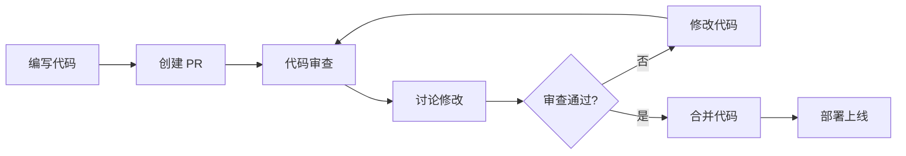

### PR 是沟通工具

**好的 PR 描述**：

```markdown
## 功能描述
实现了用户登录功能，支持邮箱和密码登录。

## 改动内容
- 添加了 LoginForm 组件
- 实现了 /api/login 接口对接
- 添加了表单验证

## 测试方法
1. 访问 /login 页面
2. 输入邮箱和密码
3. 点击登录按钮
4. 验证是否跳转到首页

## 截图
[登录页面截图]

## 关联 Issue
Closes #123
```

**差的 PR 描述**：

```markdown
实现登录功能
```

### PR 的生命周期

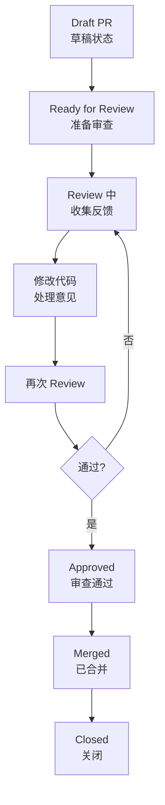

### PR 中的沟通技巧

#### 作为 PR 作者

```markdown
## ✅ 要做的

- [ ] 写清楚的 PR 描述
- [ ] 说明改动的原因
- [ ] 提供测试方法
- [ ] 及时响应 review 意见
- [ ] 感谢 reviewer 的时间

## ❌ 不要做的

- [ ] 提交巨大的 PR（>500 行）
- [ ] 不说明改动原因
- [ ] 对 review 意见不耐烦
- [ ] 不测试就提交
```

#### 作为 Reviewer

```markdown
## ✅ 要做的

- [ ] 及时 review（24 小时内）
- [ ] 提出建设性意见
- [ ] 解释为什么需要修改
- [ ] 赞美好的代码

## ❌ 不要做的

- [ ] 只评论 "LGTM"（Looks Good To Me）
- [ ] 用命令语气
- [ ] 拖延 review
- [ ] 过于苛刻
```

### PR 评论的礼仪

**好的评论**：

```
这个实现很巧妙！不过我在想，如果用户输入特殊字符，
会不会有问题？建议加个输入清理。
```

**差的评论**：

```
这里有问题，改一下。
```

### PR 是学习的场所

```markdown
## Review 对话示例

**Reviewer**: 这里为什么要用递归而不是迭代？

**Author**: 因为树的深度不确定，递归更直观。

**Reviewer**: 但是如果树很深，可能会导致栈溢出。
考虑用队列实现迭代版本？

**Author**: 好主意！我改一下。

---

**结果**：双方都学到了东西，代码质量提高了。
```

### PR 的社交属性

PR 不只是代码审查，还是：

- **知识分享**：展示你的解决方案
- **团队建设**：通过代码了解同事
- **文档留存**：PR 历史可以追溯决策过程

### 小贴士

```markdown
## PR 模板（保存为 .github/pull_request_template.md）

## 改动描述
<!-- 描述这个 PR 做了什么 -->

## 改动原因
<!-- 为什么要做这个改动 -->

## 测试方法
<!-- 如何验证这个改动 -->

## 截图/GIF
<!-- 如果有 UI 改动 -->

## 关联 Issue
<!-- 关联的 Issue 编号 -->

## 检查清单
- [ ] 代码通过测试
- [ ] 没有引入新的 lint 错误
- [ ] 文档已更新（如果需要）
```

记住：**PR 是沟通的开始，不是开发的终点。好好写 PR，让协作更顺畅！**

---

## 17.2 小步提交：PR 控制在 300 行以内

想象一下：你打开一个 PR，发现它修改了 50 个文件，新增了 3000 行代码。你的第一反应是什么？

**"卧槽，这怎么看？"**

巨大的 PR 是 reviewer 的噩梦，也是 bug 的温床。

### 为什么大 PR 不好？

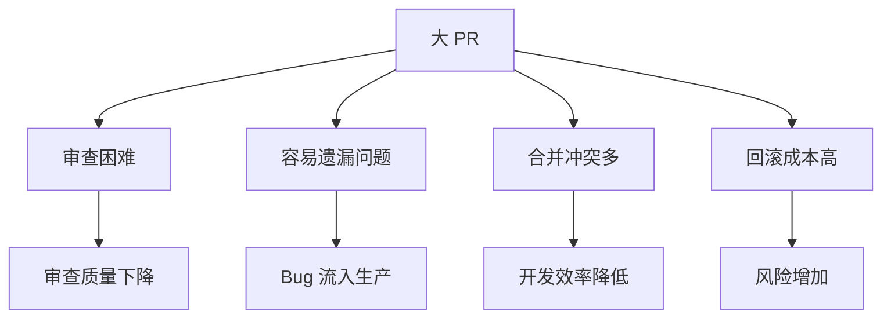

**数据说话**：
- PR 小于 200 行：审查时间平均 1 小时
- PR 大于 500 行：审查时间平均 4 小时，且容易遗漏问题
- PR 大于 1000 行：几乎不可能被彻底审查

### 小步提交的好处

1. **审查更快**：Reviewer 能在短时间内完成审查
2. **反馈更快**：问题能及时发现，及时修复
3. **冲突更少**：代码合并更频繁，冲突更少
4. **回滚更容易**：出问题只回滚一小部分

### 如何控制 PR 大小？

#### 策略一：按功能拆分

```bash
# ❌ 不要这样做：一个 PR 包含多个功能
git checkout -b feature/big-feature
git commit -m "feat: 实现登录、注册、找回密码、用户管理"
# 修改了 20 个文件，1000+ 行代码

# ✅ 应该这样做：拆分成多个小 PR
# PR 1: 登录功能
git checkout -b feature/login
git commit -m "feat: 实现用户登录"
# 5 个文件，150 行代码

# PR 2: 注册功能
git checkout -b feature/register
git commit -m "feat: 实现用户注册"
# 5 个文件，180 行代码

# PR 3: 找回密码
git checkout -b feature/forgot-password
git commit -m "feat: 实现找回密码"
# 4 个文件，120 行代码
```

#### 策略二：按层次拆分

```bash
# 一个功能可以拆分成多个层次

# PR 1: 数据层（Model/Repository）
git checkout -b feature/user-model
git commit -m "feat: 添加用户数据模型"

# PR 2: 业务层（Service）
git checkout -b feature/user-service
git commit -m "feat: 添加用户业务逻辑"

# PR 3: 接口层（API）
git checkout -b feature/user-api
git commit -m "feat: 添加用户接口"

# PR 4: 前端层（UI）
git checkout -b feature/user-ui
git commit -m "feat: 添加用户界面"
```

#### 策略三：按文件类型拆分

```bash
# PR 1: 只改后端代码
git commit -m "feat: 实现用户 API"

# PR 2: 只改前端代码
git commit -m "feat: 实现用户界面"

# PR 3: 只改测试代码
git commit -m "test: 添加用户模块测试"

# PR 4: 只改文档
git commit -m "docs: 更新用户模块文档"
```

### PR 大小的黄金法则

```markdown
## PR 大小检查清单

- [ ] 修改文件数 < 10 个
- [ ] 新增/删除代码行数 < 300 行
- [ ] 只做一件事（Single Responsibility）
- [ ] 可以在 30 分钟内审查完
- [ ] 标题能概括所有改动
```

### 特殊情况：大改动怎么办？

有时候确实需要大改动，比如重构。这时候怎么办？

#### 方案一：分阶段 PR

```markdown
## 重构计划（分 5 个 PR）

### PR 1: 准备工作
- 添加新的工具函数
- 不影响现有代码

### PR 2: 迁移模块 A
- 只改模块 A
- 其他模块保持不变

### PR 3: 迁移模块 B
- 只改模块 B

### PR 4: 迁移模块 C
- 只改模块 C

### PR 5: 清理旧代码
- 删除已迁移的旧代码
- 更新文档
```

#### 方案二：使用 Feature Flag

```javascript
// 使用 feature flag 控制新功能
const useNewFeature = process.env.ENABLE_NEW_FEATURE === 'true';

function userLogin(credentials) {
  if (useNewFeature) {
    return newLoginImplementation(credentials);
  } else {
    return oldLoginImplementation(credentials);
  }
}
```

这样可以把新功能逐步合并到主分支，而不影响现有功能。

### 如何拆分已有的巨大 PR？

如果你已经写了一个大 PR，怎么拆分？

```bash
# 1. 创建备份分支
git checkout -b backup/big-pr

# 2. 回到原分支
git checkout feature/big-pr

# 3. 交互式 rebase，拆分提交
git rebase -i main

# 4. 在交互式编辑器中，把大的提交拆分成多个小提交
# 把 "pick" 改成 "edit"，然后拆分

# 5. 或者手动拆分
git reset HEAD~5  # 回到 5 个提交前
git add file1.js file2.js
git commit -m "feat: 功能 A"
git add file3.js
git commit -m "feat: 功能 B"
# ...
```

### PR 大小的统计工具

```bash
# 查看 PR 的统计信息
git diff --stat main...feature-branch

# 输出示例：
#  src/components/Login.jsx    |  50 ++++++++
#  src/components/Register.jsx |  60 ++++++++
#  src/api/auth.js             |  80 +++++++++++
#  src/utils/validation.js     |  30 +++++
#  tests/auth.test.js          | 100 +++++++++++++
#  5 files changed, 320 insertions(+)

# 如果超过 300 行，考虑拆分
```

### 小步提交的工作流

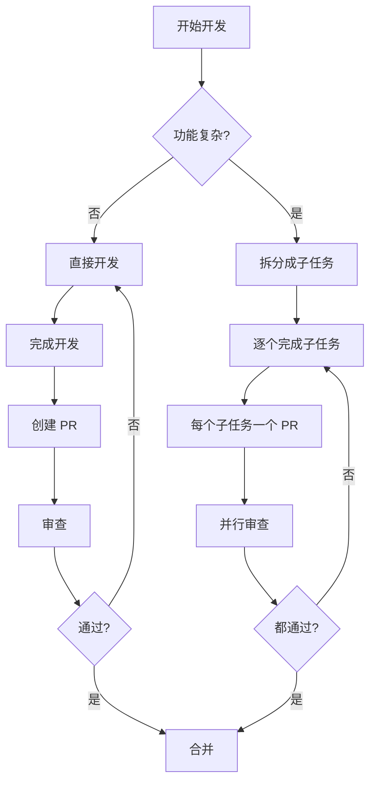

### 团队约定

```markdown
## PR 大小团队约定

### 硬性限制
- 单个 PR 不超过 400 行代码
- 单个 PR 不超过 15 个文件
- 单个 PR 只做一件事

### 软性建议
- 理想大小：100-200 行
- 审查时间：不超过 30 分钟
- 响应时间：24 小时内

### 例外情况
- 配置文件更新（如 package.json）
- 自动生成的代码
- 文档更新
- 需要提前说明
```

### 小贴士

```bash
# 配置 Git 别名，快速查看 PR 大小
git config --global alias.pr-size 'diff --stat main...HEAD'

# 使用
git pr-size

# 输出修改统计，判断是否过大
```

记住：**小步快跑，胜过大步摔跤。控制 PR 大小，让审查更高效！**

---

## 17.3 关联 Issue：`Closes #123` 的魔法

你有没有遇到过这种情况：PR 合并了，但对应的 Issue 还开着，需要手动去关闭？

**`Closes #123`** 就是来解决这个问题的魔法咒语！

### 什么是 Issue 关联？

**Issue 关联**是指在 PR 描述中引用相关的 Issue，让 GitHub/GitLab 自动建立关联，并在 PR 合并时自动关闭 Issue。

### 魔法关键词

GitHub/GitLab 支持以下关键词来自动关闭 Issue：

| 关键词 | 示例 | 作用 |
|--------|------|------|
| `Close` | `Close #123` | 关闭 Issue |
| `Closes` | `Closes #123` | 关闭 Issue |
| `Closed` | `Closed #123` | 关闭 Issue |
| `Fix` | `Fix #123` | 修复并关闭 Issue |
| `Fixes` | `Fixes #123` | 修复并关闭 Issue |
| `Fixed` | `Fixed #123` | 修复并关闭 Issue |
| `Resolve` | `Resolve #123` | 解决并关闭 Issue |
| `Resolves` | `Resolves #123` | 解决并关闭 Issue |
| `Resolved` | `Resolved #123` | 解决并关闭 Issue |

### 基础用法

```markdown
## PR 描述示例

实现了用户登录功能。

Closes #123
```

当这个 PR 被合并后，Issue #123 会自动关闭。

### 高级用法

#### 关闭多个 Issue

```markdown
## PR 描述示例

实现了用户认证系统。

Closes #123
Closes #124
Closes #125

# 或者简写
Closes #123, closes #124, closes #125
```

#### 关闭其他仓库的 Issue

```markdown
## PR 描述示例

修复了跨仓库依赖的问题。

Closes organization/other-repo#456
```

#### 部分关闭（不自动关闭）

```markdown
## PR 描述示例

实现了登录功能的第一部分。

Related to #123
Refs #123
See #123

# 这些不会自动关闭 Issue，只是建立关联
```

### 在提交信息中使用

除了在 PR 描述中使用，也可以在提交信息中使用：

```bash
# 提交时关联 Issue
git commit -m "feat: 实现用户登录

Closes #123"

# 或者多行提交
git commit -m "feat: 实现用户登录" -m "Closes #123"
```

### Issue 关联的工作流

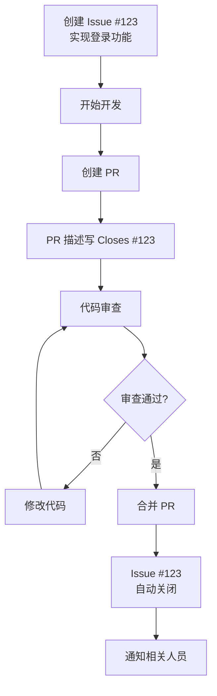

### 完整的 PR 描述模板

```markdown
## 功能描述
实现了用户登录功能，支持邮箱和密码登录。

## 改动内容
- 添加了 LoginForm 组件
- 实现了 /api/login 接口对接
- 添加了表单验证

## 测试方法
1. 访问 /login 页面
2. 输入测试账号：test@example.com / password
3. 点击登录按钮
4. 验证是否跳转到首页

## 截图


## 关联 Issue
Closes #123

## 检查清单
- [x] 代码通过测试
- [x] 没有引入新的 lint 错误
- [x] 文档已更新
```

### 在 GitHub 上的效果

当你在 PR 中写了 `Closes #123`：

1. PR 页面会显示 "Linked issues" 区域
2. Issue #123 页面会显示 "Linked pull requests"
3. PR 合并后，Issue 自动关闭
4. 关闭的 Issue 会显示 "closed by #456"（PR 编号）

### 在 GitLab 上的效果

GitLab 类似，但有一些额外功能：

```markdown
## MR 描述示例

实现了用户登录功能。

Closes #123

/label ~feature ~authentication
/milestone "Sprint 3"
/assign @username
```

GitLab 还支持 **Quick Actions**，可以在 MR 描述中执行命令。

### 关联但不关闭

有时候你想关联 Issue，但不想自动关闭（比如这个 PR 只是部分解决了 Issue）：

```markdown
## PR 描述示例

实现了登录功能的前端部分。

Related to #123
Progress on #123

# 这些不会关闭 Issue，只是建立关联
```

### 最佳实践

```markdown
## Issue 关联最佳实践

### ✅ 要做的
- [ ] 每个 PR 都关联相关的 Issue
- [ ] 使用 Closes/Fixes/Resolves 自动关闭已完成的 Issue
- [ ] 如果 PR 只是部分解决，使用 Related to/Refs
- [ ] 在提交信息中也使用关键词（可选）

### ❌ 不要做的
- [ ] 忘记关联 Issue
- [ ] 使用错误的关键词（比如用 Close 但实际上只是相关）
- [ ] 一个 PR 关闭太多 Issue（超过 5 个）
- [ ] 在无关的 PR 中引用 Issue
```

### 自动化工具

```bash
# 使用 commitlint 检查提交信息格式
# 配置 commitlint.config.js

module.exports = {
  extends: ['@commitlint/config-conventional'],
  rules: {
    'references-empty': [2, 'never'],  // 要求必须有 Issue 引用
  },
  parserPreset: {
    parserOpts: {
      issuePrefixes: ['#', 'JIRA-'],  // 支持的 Issue 前缀
    },
  },
};
```

### 小贴士

```bash
# 查看提交是否关联了 Issue
git log --oneline --grep="#123"

# 查看所有关联了 Issue 的提交
git log --oneline --all --grep="#"
```

记住：**`Closes #123` 不只是文字，它是连接 PR 和 Issue 的魔法桥梁！**

---

## 17.4 Draft PR：先占坑，慢慢完善

想象一下：你正在开发一个大功能，需要几天时间。你想让同事知道你在做什么，避免重复工作，但代码还没写完，不想被审查。

这时候，**Draft PR** 就派上用场了！

### 什么是 Draft PR？

**Draft PR**（草稿 PR）是一种特殊的 PR 状态，表示"我还在开发中，不要审查，但可以先看看"。

### 创建 Draft PR

#### 在 GitHub 上

```markdown
## 方法1：创建 PR 时选择

1. 点击 "New Pull Request"
2. 选择分支后，点击下拉箭头
3. 选择 "Create draft pull request"

## 方法2：在 PR 标题前加 "[WIP]" 或 "[DRAFT]"

标题："[WIP] 实现用户登录功能"

# WIP = Work In Progress（进行中）
```

#### 在 GitLab 上

```markdown
## 方法1：创建 MR 时选择

1. 点击 "New merge request"
2. 勾选 "Mark as draft"

## 方法2：在 MR 标题前加 "Draft:" 或 "WIP:"

标题："Draft: 实现用户登录功能"
```

### Draft PR 的特点

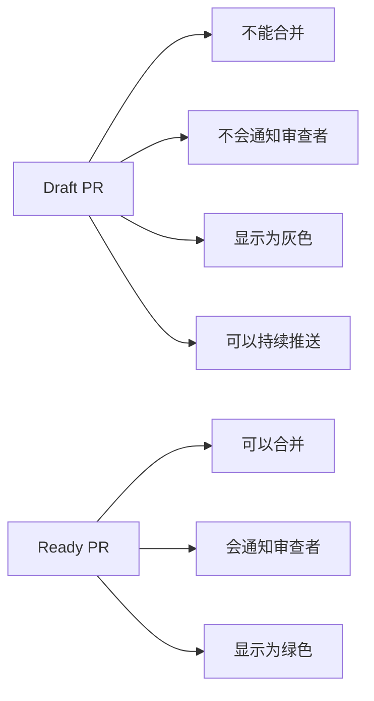

### Draft PR 的使用场景

#### 场景一：早期分享

```markdown
## Draft PR 描述示例

🚧 Work In Progress 🚧

正在实现用户登录功能，目前完成了：
- [x] 登录表单 UI
- [ ] API 对接
- [ ] 表单验证
- [ ] 错误处理

欢迎大家提前看看，给点建议！

/cc @前端组长
```

#### 场景二：避免重复工作

```markdown
## Draft PR 描述示例

🚧 进行中

正在重构用户模块，预计本周完成。

@小红 你之前说要做用户相关的功能，
可以先看看这个 PR，避免冲突。

相关 Issue: #123
```

#### 场景三：寻求帮助

```markdown
## Draft PR 描述示例

🚧 需要帮助

实现登录功能时遇到了一个问题：

在 `src/api/auth.js` 第 45 行，
我不知道怎么处理 JWT 过期的情况。

有人能帮忙看看吗？

@后端大神
```

### Draft PR 的工作流

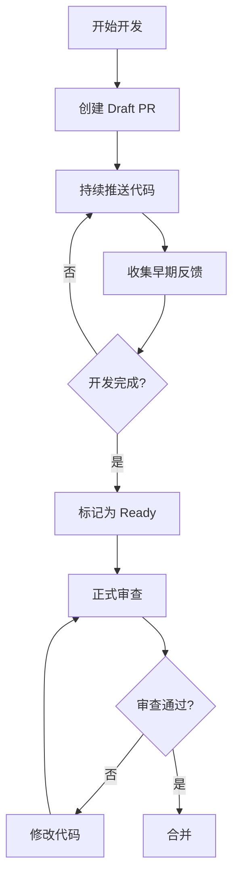

### 标记为 Ready

当代码完成后，将 Draft PR 转为正式 PR：

#### GitHub

```markdown
## 方法1：点击 "Ready for review"

在 PR 页面点击 "Ready for review" 按钮

## 方法2：修改标题

去掉 "[WIP]" 或 "[DRAFT]" 前缀
```

#### GitLab

```markdown
## 方法1：点击 "Mark as ready"

在 MR 页面点击 "Mark as ready" 按钮

## 方法2：修改标题

去掉 "Draft:" 或 "WIP:" 前缀
```

### Draft PR 的自动化

#### GitHub Actions

```yaml
# .github/workflows/draft-check.yml
name: Draft PR Check

on:
  pull_request:
    types: [opened, edited]

jobs:
  check:
    runs-on: ubuntu-latest
    steps:
      - name: Check if PR is draft
        run: |
          if [ "${{ github.event.pull_request.draft }}" == "true" ]; then
            echo "This is a draft PR, skipping CI"
            exit 0
          fi
```

#### 自动标记 Draft

```bash
# 使用 GitHub CLI 创建 Draft PR
gh pr create --draft --title "WIP: 新功能" --body "开发中..."

# 标记为 Ready
gh pr ready
```

### Draft PR 的最佳实践

```markdown
## Draft PR 检查清单

### 创建 Draft PR 时
- [ ] 在描述中说明当前进度
- [ ] 列出待办事项（TODO）
- [ ] 说明预计完成时间
- [ ] @ 相关的人（如果需要）

### Draft PR 期间
- [ ] 持续推送代码
- [ ] 更新进度
- [ ] 回应早期反馈
- [ ] 完成后标记为 Ready

### 标记为 Ready 时
- [ ] 确保代码通过测试
- [ ] 更新 PR 描述
- [ ] 添加审查者
- [ ] 移除 TODO 列表
```

### Draft PR vs 普通分支

| 特性 | Draft PR | 普通分支 |
|------|----------|----------|
| 可见性 | 所有人可见 | 只有知道链接的人可见 |
| CI/CD | 可选运行 | 通常不运行 |
| 讨论 | 可以评论 | 不能评论 |
| 进度追踪 | 方便 | 不方便 |
| 透明度 | 高 | 低 |

### 小贴士

```bash
# 使用 GitHub CLI 快速创建 Draft PR
gh pr create --draft --fill

# --fill 会自动使用提交信息填充标题和描述
```

记住：**Draft PR 是"先占坑"的艺术——让大家知道你在做什么，同时给自己完善的时间！**

---

## 17.5 处理 Review 意见：虚心接受，及时修改

PR 发出去，Review 意见随之而来。这时候，你的态度决定了协作的效率和团队的氛围。

### Review 意见的几种类型

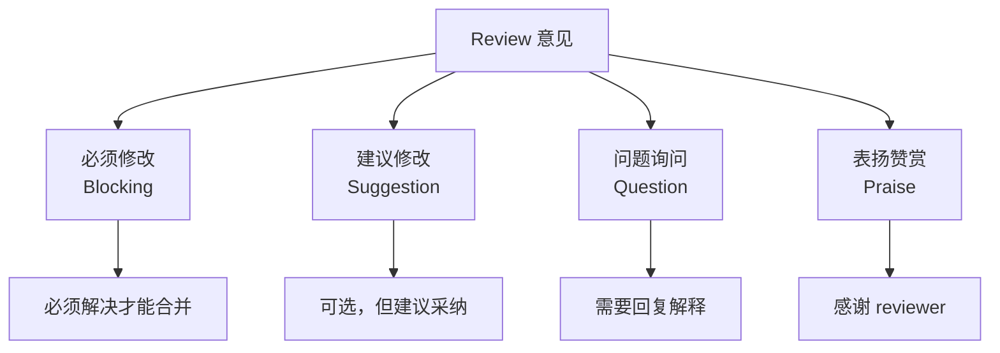

### 如何回复 Review 意见

#### 类型一：必须修改（Blocking）

**Reviewer 评论**：
```
这里有一个安全漏洞，用户输入没有验证，
可能导致 XSS 攻击。必须修复。
```

**你的回复**：
```
感谢指出！确实是个严重问题。

已修复：在 `src/utils/validation.js` 中添加了输入清理函数，
所有用户输入都经过 HTML 转义。

修改提交：abc1234

请再次 review。
```

#### 类型二：建议修改（Suggestion）

**Reviewer 评论**：
```
建议这里使用解构赋值，代码会更简洁：

const { name, email } = user;

而不是：
const name = user.name;
const email = user.email;
```

**你的回复（同意）**：
```
好建议！确实更简洁。

已修改，请查看。
```

**你的回复（不同意）**：
```
感谢建议！

不过这里我故意没有使用解构，因为后面还需要用到 user 的其他属性，
解构后反而需要重新组装。保持原样可能更清晰。

你觉得呢？
```

#### 类型三：问题询问（Question）

**Reviewer 评论**：
```
这里为什么要用递归而不是迭代？
```

**你的回复**：
```
好问题！

因为树的深度不确定，递归实现更直观。
不过你说得对，如果树太深可能导致栈溢出。

我改成了迭代版本，使用队列实现。
请查看新的实现。
```

#### 类型四：表扬赞赏（Praise）

**Reviewer 评论**：
```
这个错误处理写得很好，考虑得很全面！👍
```

**你的回复**：
```
谢谢！是从之前的项目踩过的坑里学到的 😄
```

### 修改代码的流程

```bash
# 1. 查看 Review 意见
# 在 GitHub/GitLab PR 页面查看

# 2. 切换到 PR 分支
git checkout feature/my-feature

# 3. 修改代码
# 根据 Review 意见修改

# 4. 提交修改
git add .
git commit -m "fix: 根据 review 意见修改

- 修复 XSS 漏洞
- 添加输入验证
- 优化错误处理

Refs: PR #456"

# 5. 推送
git push origin feature/my-feature

# 6. 在 PR 页面回复 Review 意见
# 说明修改了哪些地方
```

### 处理 Review 的心态

```markdown
## ✅ 正确的心态

- [ ] Review 是帮助，不是批评
- [ ] 每个人都有盲点，别人能看到你看不到的问题
- [ ] 感谢 reviewer 花时间帮你检查
- [ ] 有不同意见可以讨论，但不要情绪化
- [ ] 及时响应，不要让 reviewer 等太久

## ❌ 错误的心态

- [ ] "Reviewer 在挑刺"
- [ ] "我的代码没问题，是你不懂"
- [ ] "这点小问题也要改？"
- [ ] 不回复，直接修改
- [ ] 拖延不处理
```

### 常见错误回复

**错误示例 1：不解释直接改**
```
（没有回复，直接修改）

# Reviewer 不知道你是否理解了问题
```

**错误示例 2：情绪化回复**
```
你不懂，这里必须这样写！

# 即使你是正确的，这种态度也不好
```

**错误示例 3：拖延**
```
（3 天后才回复）

# Reviewer 可能已经忘记上下文了
```

### 修改后的标记

在 GitHub/GitLab 上，修改后的代码会显示 "Outdated"：

```
 reviewer-name 3 days ago
 这里需要添加错误处理

 作者 2 days ago
 已添加，请查看

 [Outdated]  # 表示这段代码已经被修改
```

Reviewer 可以点击 "Resolve conversation" 标记为已解决。

### 不同意 Review 意见怎么办？

```markdown
## 如何礼貌地表达不同意见

### 1. 先感谢
"感谢你的建议！"

### 2. 解释你的考虑
"这里我考虑的是..."
"之所以这样写是因为..."

### 3. 提出你的方案
"我觉得可以改成..."
"或者我们可以..."

### 4. 征求对方意见
"你觉得呢？"
"这样是否可行？"

### 示例
"感谢建议！这里我故意没有提取成函数，
是因为这个逻辑只在当前组件使用，提取后反而增加跳转成本。
不过如果后面其他组件也需要，我会提取到 utils。
你觉得当前这样 OK 吗？"
```

### Review 响应时间

```markdown
## 响应时间约定

### 紧急修复
- Review 意见：2 小时内响应
- 修改完成：当天完成

### 普通功能
- Review 意见：24 小时内响应
- 修改完成：2 天内完成

### 大型重构
- Review 意见：24 小时内响应
- 修改完成：按约定时间

### 如果无法按时完成
- 在 PR 中说明原因
- 给出预计完成时间
- 保持沟通
```

### 自动化工具

```bash
# 使用 GitHub CLI 查看 PR review 状态
gh pr view --repo owner/repo

# 查看 review 意见
gh pr review --repo owner/repo --comments
```

### 小贴士

```markdown
## Review 处理技巧

1. **批量处理**：如果有多个小建议，可以批量修改后统一回复
2. **分优先级**：先处理 blocking 问题，再处理 suggestions
3. **保持沟通**：如果不确定怎么改，先问清楚
4. **记录学习**：把常见的 review 意见记录下来，下次避免
```

记住：**Review 是团队协作的润滑剂，虚心接受，及时修改，共同进步！**

---

## 17.6 合并前的 Rebase：让历史更干净

你的 feature 分支上有一堆提交："fix typo"、"fix again"、"fix fix"... 合并到 main 分支时，这些乱七八糟的提交历史会污染主分支。

这时候，**Rebase** 就是你的救星！

### 什么是 Rebase？

**Rebase**（变基）是将一个分支的提交"移动"到另一个分支的最新提交之后，同时可以整理提交历史。

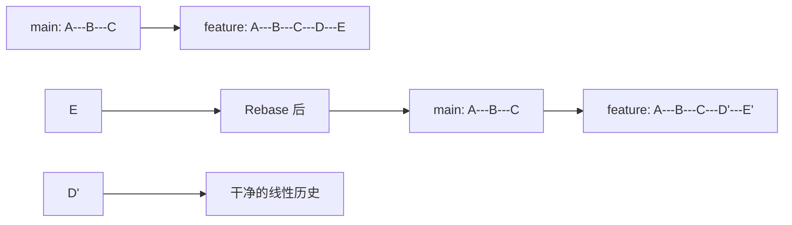

### 为什么要 Rebase？

#### 原因一：保持线性历史

```bash
# 不使用 Rebase：分叉历史
git log --oneline --graph
* abc1234 (HEAD -> main) Merge pull request #123
|\
| * def5678 (feature/login) 实现登录
| * 9ab9012 添加登录表单
* | 0123456 修复 bug
|/
* 7890abc 初始提交

# 使用 Rebase：线性历史
git log --oneline --graph
* def5678 (HEAD -> main) 实现登录
* 9ab9012 添加登录表单
* 0123456 修复 bug
* 7890abc 初始提交
```

#### 原因二：整理提交

```bash
# Rebase 前：乱七八糟的提交
git log --oneline
abc1234 fix typo
def5678 fix again
9ab9012 fix fix
0123456 实现登录功能

# Rebase 后：整洁的提交
git log --oneline
def5678 feat: 实现登录功能
9ab9012 feat: 添加登录表单
```

### 合并前 Rebase 的步骤

```bash
# 1. 切换到 feature 分支
git checkout feature/my-feature

# 2. 获取远程最新代码
git fetch origin

# 3. Rebase 到最新的 main
git rebase origin/main

# 4. 如果有冲突，解决后继续
git add .
git rebase --continue

# 5. 推送（需要强制推送）
git push origin feature/my-feature --force-with-lease
```

### 交互式 Rebase

交互式 Rebase 可以编辑、合并、删除提交：

```bash
# 交互式 Rebase 最近 5 个提交
git rebase -i HEAD~5

# 或者 Rebase 到某个提交
git rebase -i abc1234
```

会打开编辑器，显示：

```
pick abc1234 feat: 实现登录功能
pick def5678 fix: 修复 typo
pick 9ab9012 fix: 再次修复
pick 0123456 fix: 修复修复

# Rebase abc1234..0123456 onto def5678
#
# Commands:
# p, pick <commit> = use commit
# r, reword <commit> = use commit, but edit the commit message
# e, edit <commit> = use commit, but stop for amending
# s, squash <commit> = use commit, but meld into previous commit
# f, fixup <commit> = like "squash", but discard this commit's log message
# x, exec <command> = run command (the rest of the line) using shell
# d, drop <commit> = remove commit
```

### 常用操作

#### 合并提交（Squash）

```
# 修改前
pick abc1234 feat: 实现登录功能
pick def5678 fix: 修复 typo
pick 9ab9012 fix: 再次修复
pick 0123456 fix: 修复修复

# 修改后
pick abc1234 feat: 实现登录功能
fixup def5678 fix: 修复 typo
fixup 9ab9012 fix: 再次修复
fixup 0123456 fix: 修复修复

# 结果：4 个提交合并成 1 个
```

#### 修改提交信息

```
# 修改前
pick abc1234 feat: 实现登录功能

# 修改后
reword abc1234 feat: 实现用户登录功能

# 会弹出编辑器让你修改提交信息
```

#### 删除提交

```
# 修改前
pick abc1234 feat: 实现登录功能
pick def5678 fix: 修复 typo
pick 9ab9012 temp: 临时调试

# 修改后
pick abc1234 feat: 实现登录功能
pick def5678 fix: 修复 typo
# 删除 9ab9012 这一行
```

#### 调整提交顺序

```
# 修改前
pick abc1234 feat: 实现登录功能
pick def5678 feat: 添加表单验证
pick 9ab9012 feat: 添加错误提示

# 修改后
pick abc1234 feat: 实现登录功能
pick 9ab9012 feat: 添加错误提示
pick def5678 feat: 添加表单验证

# 提交顺序改变了
```

### Rebase 的工作流程

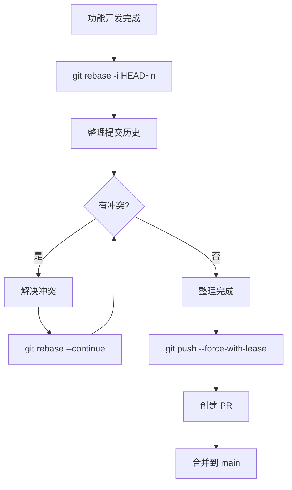

### Rebase vs Merge

| 特性 | Rebase | Merge |
|------|--------|-------|
| 历史 | 线性 | 分叉 |
| 可读性 | 高 | 低 |
| 冲突处理 | 逐个提交处理 | 一次性处理 |
| 安全性 | 修改历史 | 保留历史 |
| 适用场景 | feature 分支 | main 分支 |

### Rebase 的黄金法则

```markdown
## 🚨 Rebase 黄金法则

**永远不要对已经推送到远程的提交使用 Rebase！**

### 为什么？

Rebase 会修改提交历史，生成新的 commit hash。
如果其他人基于旧的提交工作，会造成混乱。

### 正确做法

- ✅ 在本地 feature 分支上 Rebase
- ✅ 推送前 Rebase
- ✅ 使用 --force-with-lease 推送
- ❌ 不要在 main/develop 分支上 Rebase
- ❌ 不要对已经合并的提交 Rebase
```

### 常见问题

#### 问题1：Rebase 后冲突太多

**解决**：

```bash
# 如果冲突太多，可以放弃 Rebase
git rebase --abort

# 改用普通的 merge
git merge origin/main
```

#### 问题2：误删了提交

**解决**：

```bash
# 从 reflog 恢复
git reflog

# 找到误删前的状态
git reset --hard abc1234
```

#### 问题3：Rebase 后推送被拒绝

**解决**：

```bash
# 使用 --force-with-lease
git push origin feature/my-feature --force-with-lease

# 不要用 --force！
```

### 小贴士

```bash
# 配置别名，方便 Rebase
git config --global alias.rb 'rebase'
git config --global alias.rbi 'rebase -i'
git config --global alias.rbc 'rebase --continue'
git config --global alias.rba 'rebase --abort'

# 使用
git rbi HEAD~5
git rbc
git rba
```

记住：**Rebase 是整理历史的艺术，让提交历史像诗一样优美！**

---

## 17.7 squash 合并：把多个提交变成一个

一个功能开发了 20 个提交，合并到 main 分支时，这 20 个提交都会出现在主分支历史中。

**Squash 合并**可以把这 20 个提交压缩成 1 个，让主分支历史更简洁。

### 什么是 Squash 合并？

**Squash 合并**是将一个分支的所有提交压缩成一个提交，然后合并到目标分支。

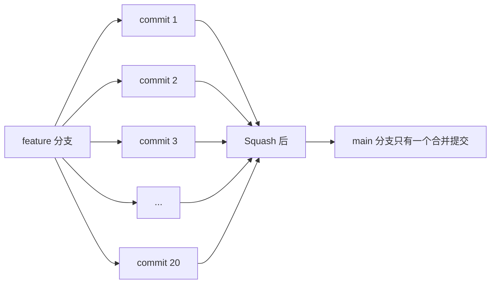

### 在 GitHub 上使用 Squash 合并

```markdown
## 操作步骤

1. 打开 PR 页面
2. 点击 "Merge pull request" 按钮旁边的下拉箭头
3. 选择 "Squash and merge"
4. 编辑合并提交信息
5. 点击 "Squash and merge"

## 合并后的效果

feature 分支的 20 个提交变成 main 分支的 1 个提交
```

### 在 GitLab 上使用 Squash 合并

```markdown
## 操作步骤

1. 打开 MR 页面
2. 勾选 "Squash commits"
3. 编辑提交信息
4. 点击 "Merge"

## 或者让作者 Squash

作者可以在本地执行：
git rebase -i HEAD~20
# 把 pick 改成 squash/fixup
```

### Squash 合并的提交信息

Squash 合并时，可以编辑提交信息：

```markdown
## 默认提交信息

feat: 实现用户登录功能 (#123)

* feat: 添加登录表单
* feat: 实现登录 API
* feat: 添加错误处理
* fix: 修复表单验证
* fix: 修复登录状态保持
...

## 建议的提交信息

feat: 实现用户登录功能 (#123)

- 添加登录表单 UI
- 实现 /api/login 接口对接
- 添加表单验证和错误处理
- 保持登录状态

Closes #100
```

### Squash 合并 vs 普通合并

```bash
# 普通合并（Merge commit）
git log --oneline --graph
*   abc1234 (HEAD -> main) Merge pull request #123
|\
| * def5678 (feature/login) fix: 修复登录状态
| * 9ab9012 fix: 修复表单验证
| * 0123456 feat: 添加错误处理
| * 7890abc feat: 实现登录 API
| * fedcba9 feat: 添加登录表单
* | 1111111 (origin/main) 其他提交
|/

# Squash 合并
git log --oneline --graph
* abc1234 (HEAD -> main) feat: 实现用户登录功能 (#123)
* 1111111 (origin/main) 其他提交
```

### 什么时候用 Squash 合并？

#### ✅ 适合 Squash 的场景

```markdown
1. 功能分支有很多小提交
   - "fix typo"
   - "fix again"
   - "debug"
   - "wip"

2. 提交历史比较乱
   - 多次合并 main 分支
   - 多次 revert

3. 不需要保留详细历史
   - 小功能
   - 实验性代码
```

#### ❌ 不适合 Squash 的场景

```markdown
1. 需要保留详细历史
   - 大型重构
   - 需要追溯每个改动

2. 多个独立功能
   - 一个分支做了多个不相关的功能
   - 应该拆分成多个 PR

3. 需要 cherry-pick 部分提交
   - Squash 后无法单独 cherry-pick
```

### 在本地手动 Squash

```bash
# 1. 切换到 feature 分支
git checkout feature/my-feature

# 2. 交互式 rebase
git rebase -i HEAD~5

# 3. 修改提交列表
pick abc1234 feat: 添加登录表单
squash def5678 feat: 实现登录 API
squash 9ab9012 feat: 添加错误处理
squash 0123456 fix: 修复表单验证
squash 7890abc fix: 修复登录状态

# 4. 编辑合并后的提交信息

# 5. 推送到远程
git push origin feature/my-feature --force-with-lease
```

### Squash 合并的工作流程

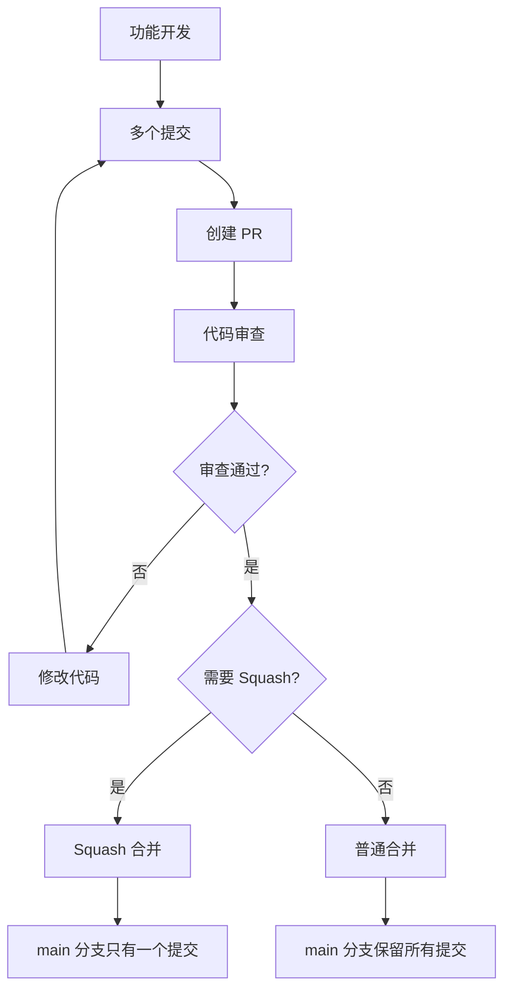

### 团队约定

```markdown
## Squash 合并团队约定

### 默认使用 Squash 合并
- 所有 feature 分支 PR 默认 Squash 合并
- 保持 main 分支历史简洁

### 例外情况
- 大型重构需要保留详细历史
- 多个独立功能（应该拆分成多个 PR）

### 提交信息规范
- 标题：简明扼要描述功能
- 正文：列出主要改动点
- 关联 Issue：Closes #xxx
```

### 小贴士

```bash
# 配置 GitHub 默认 Squash 合并
# 在仓库设置中：
# Settings -> General -> Pull Requests
# 勾选 "Allow squash merging"
# 取消勾选 "Allow merge commits"（可选）

# 配置 Git 别名
git config --global alias.squash '!f() { git reset --soft HEAD~$1 && git commit -m "$(git log --format=%B --reverse HEAD..HEAD@{1})"; }; f'

# 使用：合并最近 5 个提交
git squash 5
```

记住：**Squash 合并是主分支的"美颜相机"——去掉瑕疵，留下精华！**

---

## 17.8 实战：向知名开源项目提交 PR 的完整经历

终于，我们要实战了！这次的目标是一个知名开源项目（以 React 为例），让我们完整走一遍从发现 bug 到 PR 合并的流程。

### 故事背景

**你**：一个前端开发者，在使用 React 时发现了一个文档错误。

**问题**：React 官方文档中某个示例代码有 bug，会导致初学者困惑。

**目标**：修复这个文档错误，并向 React 提交 PR。

### 第一步：发现问题

```markdown
## 发现问题的过程

1. 在阅读 React 文档时，发现 "Context" 章节的示例代码有问题
2. 示例代码中使用了废弃的 API
3. 复制代码到本地运行，确实报错
4. 确认是文档问题，不是自己的问题

## 确认是文档问题

- 在 GitHub 上搜索相关 Issue
- 发现没有人报告这个问题
- 决定自己修复并提交 PR
```

### 第二步：Fork 仓库

```bash
# 1. 在 GitHub 上访问 https://github.com/facebook/react

# 2. 点击右上角的 "Fork" 按钮

# 3. 等待 Fork 完成，现在你有了 https://github.com/your-username/react
```

### 第三步：克隆仓库

```bash
# 1. 克隆你 Fork 的仓库
git clone https://github.com/your-username/react.git
cd react

# 2. 添加上游仓库
git remote add upstream https://github.com/facebook/react.git

# 3. 验证远程仓库
git remote -v
# origin  https://github.com/your-username/react.git (fetch)
# origin  https://github.com/your-username/react.git (push)
# upstream  https://github.com/facebook/react.git (fetch)
# upstream  https://github.com/facebook/react.git (push)
```

### 第四步：创建分支

```bash
# 1. 获取上游最新代码
git fetch upstream

# 2. 基于上游 main 分支创建新分支
git checkout -b fix-context-docs upstream/main

# 3. 确认分支
git branch
# * fix-context-docs
```

### 第五步：修改代码

```bash
# 1. 找到需要修改的文件
# 假设是 documentation/docs/context.md

# 2. 打开文件并修改
vim documentation/docs/context.md

# 3. 修改内容示例：
# 把旧代码：
# const value = useContext(MyContext);
#
# 改成新代码：
# const value = useContext(MyContext);
# if (value === undefined) {
#   throw new Error('useContext must be used within a Provider');
# }

# 4. 本地验证修改
# 运行文档网站的本地服务器
npm run dev
# 访问 http://localhost:3000 查看修改效果
```

### 第六步：提交修改

```bash
# 1. 查看修改
git status
# modified: documentation/docs/context.md

# 2. 添加修改
git add documentation/docs/context.md

# 3. 提交
git commit -m "docs: 修复 Context 文档中的示例代码

- 添加了 useContext 的错误处理示例
- 帮助初学者理解 Provider 的必要性

Closes #xxxxx"

# 4. 推送到你的 Fork
git push origin fix-context-docs
```

### 第七步：创建 PR

```markdown
## 在 GitHub 上创建 PR

1. 访问 https://github.com/your-username/react
2. 点击 "Compare & pull request"
3. 填写 PR 信息：

## PR 标题
docs: 修复 Context 文档中的示例代码

## PR 描述
```markdown
## 问题描述
Context 文档中的示例代码缺少错误处理，
导致初学者在 Provider 外部使用 useContext 时感到困惑。

## 改动内容
- 在示例代码中添加了 useContext 的错误处理
- 添加了注释说明 Provider 的必要性

## 截图
[修改前后的对比截图]

## 测试
- [x] 本地运行文档网站验证
- [x] 代码语法正确

## 关联 Issue
Fixes #xxxxx
```

4. 点击 "Create pull request"
```

### 第八步：等待 Review

```markdown
## 等待 Review 的过程

### 第 1 天
- PR 创建成功
- CI 自动运行检查
- 等待维护者 review

### 第 3 天
- 收到维护者的评论：
  "感谢贡献！建议把错误处理改成警告而不是抛出异常，
   这样更符合 React 的风格。"

### 第 4 天
- 根据意见修改代码
- 提交新的 commit
- 回复评论："已修改，请再次 review"

### 第 7 天
- 维护者批准 PR
- CI 检查通过
- 等待合并
```

### 第九步：根据 Review 修改

```bash
# 1. 本地修改
git checkout fix-context-docs

# 2. 编辑文件
vim documentation/docs/context.md
# 把 throw new Error 改成 console.warn

# 3. 提交修改
git add documentation/docs/context.md
git commit -m "docs: 根据 review 意见修改

- 将错误处理改为警告
- 更符合 React 风格"

# 4. 推送
git push origin fix-context-docs
```

### 第十步：PR 被合并

```markdown
## 合并通知

"你的 PR 已被合并到 main 分支！
感谢你对 React 的贡献！"

## 后续

- PR 页面显示 "Merged"
- 你的 GitHub 个人资料上多了一个贡献记录
- React 的下一个版本会包含你的修改
```

### 完整流程图

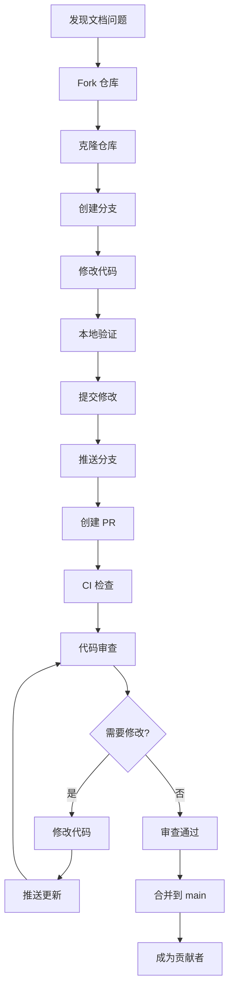

### 开源贡献的注意事项

```markdown
## ✅ 要做的

- [ ] 阅读项目的 CONTRIBUTING.md
- [ ] 遵循项目的代码规范
- [ ] 写清楚的 PR 描述
- [ ] 耐心等待 review
- [ ] 虚心接受反馈
- [ ] 感谢维护者的时间

## ❌ 不要做的

- [ ] 不读贡献指南就提交 PR
- [ ] PR 描述写 "修复 bug"
- [ ] 催促维护者 review
- [ ] 对 review 意见不耐烦
- [ ] 提交巨大的 PR
```

### 贡献后的维护

```bash
# 1. 更新本地仓库
git checkout main
git pull upstream main

# 2. 删除已合并的分支
git branch -d fix-context-docs
git push origin --delete fix-context-docs

# 3. 同步到你的 Fork
git push origin main

# 4. 继续贡献其他功能
```

### 经验总结

```markdown
## 向开源项目贡献的经验

1. **从小处着手**
   - 先修复文档错误
   - 再修复小 bug
   - 最后添加新功能

2. **耐心很重要**
   - 维护者可能很忙
   - review 可能需要几天甚至几周
   - 不要催促

3. **沟通是关键**
   - 写清楚的 PR 描述
   - 及时回复 review 意见
   - 不懂就问

4. **持续贡献**
   - 一次贡献只是开始
   - 持续贡献才能建立信任
   - 最终可能成为维护者
```

### 小贴士

```bash
# 配置 Git 别名，方便开源贡献
git config --global alias.fork '!f() { git remote add upstream $1; }; f'
git config --global alias.sync '!git fetch upstream && git checkout main && git rebase upstream/main'

# 使用
git fork https://github.com/facebook/react.git
git sync
```

记住：**向开源项目贡献不只是修复 bug，更是融入社区、学习成长的过程！**

---

**第17章完**

