+++
title = "第18章：进阶技能 —— 高手的工具箱"
weight = 180
date = 2026-04-03T19:36:48+08:00
type = "docs"
description = ""
isCJKLanguage = true
draft = false
+++
# 第18章：进阶技能 —— 高手的工具箱

> 恭喜你！如果你已经读到这里，说明你已经掌握了 Git 的基础。现在，让我们打开高手的工具箱，学习那些能让你效率翻倍的进阶技能！

---

## 18.1 `git stash`：临时保存，切换自如

想象一下这个场景：你正在开发一个新功能，代码写到一半，突然产品经理说："线上有个紧急 bug，需要你马上修复！"

你怎么办？提交未完成的代码？不行，太乱了。新建分支？也不行，代码还没准备好。

这时候，**`git stash`** 就是你的救命稻草！

### 什么是 Stash？

**Stash**（藏匿）是 Git 的"临时存储区"，可以把当前未提交的修改保存起来，让工作区恢复干净状态。


### 基础用法

```bash
# 保存当前修改
git stash

# 或者带消息保存（推荐）
git stash push -m "登录功能开发中"

# 查看 stash 列表
git stash list

# 恢复最近的 stash
git stash pop

# 恢复指定的 stash
git stash pop stash@{2}
```

### 实战场景

#### 场景一：紧急修复 bug

```bash
# 你正在 feature/login 分支开发登录功能
git branch
# * feature/login

# 写了一半的代码
git status
# modified: src/components/LoginForm.jsx
# modified: src/api/auth.js

# 突然需要修复 main 分支的 bug

# 1. 保存当前修改
git stash push -m "登录功能：添加表单验证"

# 2. 切换到 main 分支
git checkout main

# 3. 创建 hotfix 分支
git checkout -b hotfix/critical-bug

# 4. 修复 bug
git commit -m "fix: 修复致命 bug"
git push origin hotfix/critical-bug

# 5. 合并到 main
git checkout main
git merge hotfix/critical-bug

# 6. 回到 feature/login 继续开发
git checkout feature/login

# 7. 恢复之前的修改
git stash pop

# 8. 继续开发...
```

#### 场景二：代码 review

```bash
# 同事让你 review 他的 PR
# 但你当前有未提交的修改

# 1. 保存当前修改
git stash push -m "支付功能开发中"

# 2. 切换到同事的 branch
git checkout colleague/feature

# 3. review 代码...

# 4. 回到自己的分支
git checkout feature/payment

# 5. 恢复修改
git stash pop
```

### Stash 的高级用法

#### 只 stash 部分文件

```bash
# 只 stash 指定的文件
git stash push -m "部分修改" src/components/LoginForm.jsx

# 或者 stash 除了某个文件外的所有修改
git stash push -m "除了配置外的修改" -- src/ tests/
```

#### 查看 stash 内容

```bash
# 查看 stash 的统计信息
git stash show

# 查看 stash 的详细 diff
git stash show -p

# 查看指定 stash
git stash show stash@{1}
```

#### 应用 stash 但不删除

```bash
# 应用 stash 但保留在 stash 列表中
git stash apply

# 应用指定的 stash
git stash apply stash@{2}

# 之后可以手动删除
git stash drop stash@{2}
```

#### 删除 stash

```bash
# 删除最近的 stash
git stash drop

# 删除指定的 stash
git stash drop stash@{1}

# 清空所有 stash（慎用！）
git stash clear
```

### Stash 的工作流程

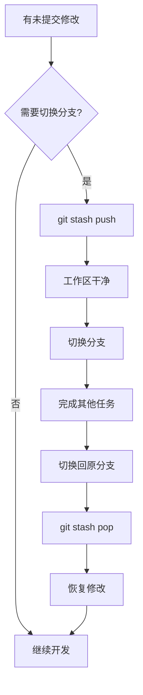

### Stash 的注意事项

```markdown
## ⚠️ 注意事项

1. **Stash 不会保存未跟踪的文件**
   - 新创建的文件（Untracked）不会被 stash
   - 需要先 `git add` 或者使用 `-u` 参数

2. **Stash 是本地的**
   - 不会推送到远程
   - 换电脑后看不到

3. **Stash 是栈结构**
   - 后进先出（LIFO）
   - stash@{0} 是最新的

4. **Stash 可能冲突**
   - pop 时如果当前分支有冲突，会失败
   - 需要手动解决
```

### 保存未跟踪的文件

```bash
# 默认不会 stash 未跟踪的文件
git stash push -m "保存"

# 保存包括未跟踪的文件
git stash push -u -m "保存包括新文件"

# 或者
git stash push --include-untracked -m "保存包括新文件"
```

### 从 stash 创建分支

```bash
# 从 stash 创建新分支
git stash branch new-branch-name stash@{0}

# 这会：
# 1. 创建新分支
# 2. 应用 stash
# 3. 删除 stash
```

### 配置别名

```bash
# 配置常用别名
git config --global alias.st 'stash'
git config --global alias.stp 'stash pop'
git config --global alias.stl 'stash list'

# 使用
git st push -m "保存"
git stp
git stl
```

### 小贴士

```bash
# 快速保存和恢复
git stash push -m "$(date '+%Y-%m-%d %H:%M') 自动保存"

# 使用脚本自动保存
git config --global alias.save '!git add -A && git stash push -m "WIP: $(date)"'

# 使用
git save
```

记住：**Stash 是你的"代码暂停键"，让你随时可以切换任务，游刃有余！**

---

## 18.2 `git stash pop` vs `git stash apply`：用哪个？

`git stash pop` 和 `git stash apply` 都能恢复 stash 的修改，但它们有什么区别？什么时候用哪个？

### 核心区别

| 命令 | 恢复修改 | 删除 stash | 适用场景 |
|------|----------|------------|----------|
| `git stash pop` | ✅ | ✅ | 确定要恢复并删除 |
| `git stash apply` | ✅ | ❌ | 需要保留 stash |

### `git stash pop`：恢复并删除

```bash
# 恢复最近的 stash，并从 stash 列表中删除
git stash pop

# 等同于
git stash apply && git stash drop
```

#### 使用场景

```bash
# 场景：你 stash 了登录功能的代码，现在要继续开发

git stash list
# stash@{0}: On feature/login: 登录功能：添加表单验证

git stash pop
# 恢复修改，并从 stash 列表删除

git stash list
# （空，stash 已删除）
```

### `git stash apply`：恢复但保留

```bash
# 恢复最近的 stash，但保留在 stash 列表中
git stash apply

# stash 还在列表中
git stash list
# stash@{0}: On feature/login: 登录功能：添加表单验证
```

#### 使用场景

```bash
# 场景：你想试试 stash 的代码，但不确定是否能正常工作

git stash list
# stash@{0}: On feature/login: 登录功能开发中

# 1. 先 apply，不删除
git stash apply

# 2. 测试代码...
npm test

# 3. 如果测试通过，手动删除 stash
git stash drop

# 4. 如果测试失败，可以放弃修改，stash 还在
git checkout -- .
git stash list
# stash@{0}: On feature/login: 登录功能开发中
```

### 对比演示

```bash
# 初始状态
git stash list
# stash@{0}: WIP on feature/login
# stash@{1}: WIP on feature/payment

# ========== 使用 pop ==========
git stash pop
# 恢复 stash@{0}
# 删除 stash@{0}

git stash list
# stash@{0}: WIP on feature/payment  （原来的 stash@{1}）

# ========== 使用 apply ==========
git stash apply
# 恢复 stash@{0}
# stash 还在

git stash list
# stash@{0}: WIP on feature/payment
```

### 什么时候用 pop？

```markdown
## ✅ 使用 pop 的场景

1. **确定要恢复并继续开发**
   - 你 stash 就是为了临时切换分支
   - 现在回来了，确定要继续

2. **stash 列表太长**
   - 清理不需要的 stash
   - 保持列表整洁

3. **简单的临时保存**
   - 保存几分钟就恢复
   - 不需要保留
```

### 什么时候用 apply？

```markdown
## ✅ 使用 apply 的场景

1. **不确定是否能成功应用**
   - 可能有冲突
   - 想先试试

2. **需要在多个分支应用同一个 stash**
   - 把同样的修改应用到 feature/A
   - 再应用到 feature/B

3. **需要保留备份**
   - 重要的修改，先保留一份
   - 成功后再删除

4. **需要多次尝试**
   - 应用后测试
   - 失败可以重来
```

### 实战：多分支应用同一个 stash

```bash
# 场景：你有一个通用的工具函数修改，想应用到多个分支

# 1. 在 feature/A 分支 stash
git checkout feature/A
git stash push -m "添加通用工具函数"

# 2. 应用到 feature/B
git checkout feature/B
git stash apply

# 3. 提交
git add .
git commit -m "feat: 添加通用工具函数"

# 4. 应用到 feature/C
git checkout feature/C
git stash apply

# 5. 提交
git add .
git commit -m "feat: 添加通用工具函数"

# 6. 最后删除 stash
git stash drop
```

### 实战：安全恢复（先 apply 再 drop）

```bash
# 安全的恢复流程

# 1. 查看 stash
git stash list
# stash@{0}: WIP on feature/login

# 2. 先 apply，不删除
git stash apply stash@{0}

# 3. 检查是否有冲突
git status

# 4. 如果有冲突，解决冲突
git add .

# 5. 运行测试
npm test

# 6. 如果一切正常，删除 stash
git stash drop stash@{0}

# 7. 如果出问题，可以放弃并保留 stash
git reset --hard HEAD
git stash list
# stash@{0}: WIP on feature/login  （还在！）
```

### 处理冲突

```bash
# pop 时如果有冲突，不会删除 stash

git stash pop
# Auto-merging src/app.js
# CONFLICT (content): Merge conflict in src/app.js

# 此时 stash 还在！
git stash list
# stash@{0}: WIP on feature/login

# 解决冲突...
git add src/app.js
git commit -m "解决 stash 冲突"

# 然后手动删除 stash
git stash drop stash@{0}
```

### 小贴士

```bash
# 配置别名，快速 apply 并删除（如果成功）
git config --global alias.stp 'stash pop'
git config --global alias.sta 'stash apply'
git config --global alias.std 'stash drop'

# 使用
git sta        # apply，保留
git stp        # pop，删除
git std        # drop，删除
```

记住：**pop 是"恢复并删除"，apply 是"恢复并保留"。不确定时用 apply，确定时用 pop！**

---

## 18.3 stash 的高级用法：暂存部分文件、命名 stash

Stash 不只是"全部保存"那么简单，它还有很多高级用法，让你更精细地控制要保存的内容。

### 暂存部分文件

有时候你修改了 10 个文件，但只想 stash 其中 5 个，怎么办？

```bash
# 只 stash 指定的文件
git stash push -m "保存登录相关" src/components/Login.jsx src/api/auth.js

# 只 stash 某个目录
git stash push -m "保存组件" src/components/

# stash 除了某个文件外的所有修改
git stash push -m "保存除了配置" -- . ':!src/config.js'
```

### 交互式 stash

```bash
# 交互式选择要 stash 的文件
git stash push -p

# 或者
git stash push --patch
```

这会逐个文件询问你是否要 stash：

```
diff --git a/src/app.js b/src/app.js
index 1234567..abcdefg 100644
--- a/src/app.js
+++ b/src/app.js
@@ -1,5 +1,5 @@
 function app() {
-  console.log('old');
+  console.log('new');
 }

Stash this hunk [y,n,q,a,d,e,?]? 
# y - yes，stash 这个修改
# n - no，不 stash
# q - quit，退出
# a - all，stash 所有剩余修改
# d - delete，不 stash 所有剩余修改
# e - edit，手动编辑
# ? - help，显示帮助
```

### 命名 stash

给 stash 起个好名字，方便以后识别：

```bash
# 使用 -m 参数命名
git stash push -m "登录功能：表单验证完成"

# 查看时更容易识别
git stash list
# stash@{0}: On feature/login: 登录功能：表单验证完成
# stash@{1}: On feature/payment: 支付功能：接口对接中
# stash@{2}: On develop: 重构：提取公共组件
```

### 按路径 stash

```bash
# 只 stash 前端代码
git stash push -m "前端修改" src/ public/

# 只 stash 测试代码
git stash push -m "测试修改" tests/ cypress/

# 只 stash 文档
git stash push -m "文档更新" docs/ README.md
```

### 保存未跟踪的文件

默认情况下，stash 不会保存未跟踪的文件（新创建的文件）：

```bash
# 创建一个新文件
echo "new content" > src/new-file.js

# 默认 stash 不会保存
git stash push -m "保存"
# src/new-file.js 还是未跟踪状态

# 保存包括未跟踪的文件
git stash push -u -m "保存包括新文件"

# 或者
git stash push --include-untracked -m "保存包括新文件"
```

### 保存忽略的文件

有时候你想连 `.gitignore` 忽略的文件也 stash：

```bash
# 保存所有文件，包括忽略的
git stash push -a -m "保存所有文件"

# 或者
git stash push --all -m "保存所有文件"

# ⚠️ 警告：这会包括 node_modules、build 目录等！
# 慎用！
```

### 查看 stash 的详细信息

```bash
# 查看 stash 的统计
git stash show
# src/components/Login.jsx | 50 +++++
# src/api/auth.js          | 30 +++++
# 2 files changed, 80 insertions(+)

# 查看 stash 的详细 diff
git stash show -p

# 查看指定 stash
git stash show stash@{2}
git stash show -p stash@{2}
```

### 从 stash 创建分支

```bash
# 从 stash 创建新分支
git stash branch new-feature stash@{0}

# 这会：
# 1. 创建新分支 new-feature
# 2. 应用 stash@{0}
# 3. 如果成功，删除 stash@{0}
```

### 实战：复杂场景

#### 场景一：部分 stash + 部分提交

```bash
# 你修改了 5 个文件

# 1. stash 2 个文件
git stash push -m "WIP: 功能A" file1.js file2.js

# 2. 提交另外 3 个文件
git add file3.js file4.js file5.js
git commit -m "feat: 完成功能B"

# 3. 切换到 main 修复 bug
git checkout main
# ... 修复 bug ...

# 4. 回到 feature 分支
git checkout feature/my-feature

# 5. 恢复 stash
git stash pop
```

#### 场景二：多版本 stash

```bash
# 保存多个版本的修改

git stash push -m "v1: 基础实现"
# 继续修改...

git stash push -m "v2: 添加验证"
# 继续修改...

git stash push -m "v3: 优化性能"

# 查看所有版本
git stash list
# stash@{0}: v3: 优化性能
# stash@{1}: v2: 添加验证
# stash@{2}: v1: 基础实现

# 恢复特定版本
git stash apply stash@{2}  # 恢复 v1
```

### 清理 stash

```bash
# 删除最近的 stash
git stash drop

# 删除指定的 stash
git stash drop stash@{2}

# 清空所有 stash（慎用！）
git stash clear

# 清理已合并的 stash（没有直接命令，需要手动）
```

### 小贴士

```bash
# 配置别名，快速 stash 当前文件
git config --global alias.stash-this '!git stash push -m "$(date +%Y-%m-%d-%H:%M) $(git branch --show-current)"'

# 使用
git stash-this

# 查看 stash 时显示时间
git stash list --date=local
```

记住：**Stash 的高级用法让你像外科医生一样精确——只保存你想保存的，不多不少！**

---

## 18.4 `git rebase`：重写历史，让提交更优雅

**`git rebase`** 是 Git 中最强大也最危险的命令之一。它可以让你重写提交历史，让代码演进的过程像一本精心编排的小说，而不是一团乱麻。

### 什么是 Rebase？

**Rebase**（变基）字面意思是"更换基底"，即将当前分支的提交"移动"到另一个基底分支的最新提交之后。

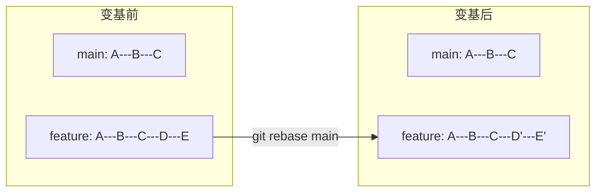

### Rebase vs Merge

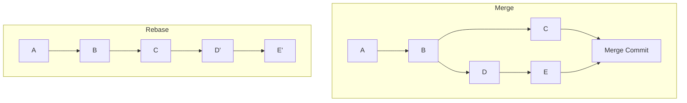

**区别**：
- **Merge**：保留分支历史，创建合并提交
- **Rebase**：重写提交历史，形成线性历史

### 基础用法

```bash
# 将当前分支变基到 main 分支
git rebase main

# 交互式 rebase
git rebase -i main

# 继续 rebase（解决冲突后）
git rebase --continue

# 跳过当前提交
git rebase --skip

# 放弃 rebase
git rebase --abort
```

### 为什么要 Rebase？

#### 原因一：保持线性历史

```bash
# Merge 历史（分叉）
git log --oneline --graph
*   abc1234 Merge branch 'feature'
|\
| * def5678 功能提交 2
| * 9ab9012 功能提交 1
* | 0123456 main 提交
|/
* 7890abc 初始提交

# Rebase 历史（线性）
git log --oneline --graph
* def5678 功能提交 2
* 9ab9012 功能提交 1
* 0123456 main 提交
* 7890abc 初始提交
```

#### 原因二：清理提交

```bash
# Rebase 前：乱七八糟的提交
git log --oneline
abc1234 fix typo
def5678 fix again
9ab9012 wip
0123456 feat: 实现功能

# Rebase 后：整洁的提交
git log --oneline
def5678 feat: 实现功能
9ab9012 feat: 添加测试
```

### 交互式 Rebase

交互式 Rebase 是最强大的功能，可以编辑、删除、合并、拆分提交。

```bash
# 交互式 rebase 最近 5 个提交
git rebase -i HEAD~5

# 交互式 rebase 到某个提交
git rebase -i abc1234
```

会打开编辑器：

```
pick abc1234 feat: 实现登录
pick def5678 fix: 修复 typo
pick 9ab9012 wip: 临时保存
pick 0123456 fix: 再次修复
pick 7890abc feat: 添加测试

# Commands:
# p, pick <commit> = use commit
# r, reword <commit> = use commit, but edit the commit message
# e, edit <commit> = use commit, but stop for amending
# s, squash <commit> = use commit, but meld into previous commit
# f, fixup <commit> = like "squash", but discard this commit's log message
# d, drop <commit> = remove commit
```

### 常用操作

#### 修改提交信息

```
# 修改前
pick abc1234 feat: 实现登录

# 修改后
reword abc1234 feat: 实现登录

# 保存后会弹出编辑器，让你修改提交信息
```

#### 合并提交（Squash）

```
# 合并前
pick abc1234 feat: 实现登录
pick def5678 fix: 修复 typo
pick 9ab9012 fix: 再次修复

# 合并后
pick abc1234 feat: 实现登录
fixup def5678 fix: 修复 typo
fixup 9ab9012 fix: 再次修复

# 结果：3 个提交合并成 1 个
```

#### 删除提交

```
# 删除前
pick abc1234 feat: 实现登录
pick def5678 wip: 临时调试
pick 9ab9012 feat: 添加测试

# 删除后
pick abc1234 feat: 实现登录
# 删除 def5678 这一行
pick 9ab9012 feat: 添加测试
```

#### 调整提交顺序

```
# 调整前
pick abc1234 feat: 实现登录
pick def5678 feat: 添加测试
pick 9ab9012 docs: 更新文档

# 调整后
pick abc1234 feat: 实现登录
pick 9ab9012 docs: 更新文档
pick def5678 feat: 添加测试
```

#### 拆分提交

```
# 拆分时，把 pick 改成 edit
pick abc1234 feat: 实现登录
edit def5678 feat: 添加测试和文档

# 保存后，rebase 会停在 def5678
# 你可以：
git reset HEAD^
git add src/
git commit -m "feat: 添加测试"
git add docs/
git commit -m "docs: 更新文档"
git rebase --continue
```

### Rebase 的黄金法则

```markdown
## 🚨 Rebase 黄金法则

**永远不要对已经推送到远程的提交使用 Rebase！**

### 为什么？

Rebase 会修改提交历史，生成新的 commit hash。
如果其他人基于旧的提交工作，会造成严重混乱。

### 正确做法

- ✅ 在本地 feature 分支上 Rebase
- ✅ 推送前 Rebase
- ✅ 使用 --force-with-lease 推送
- ❌ 不要在 main/develop 分支上 Rebase
- ❌ 不要对已经合并的提交 Rebase
```

### Rebase 的工作流程

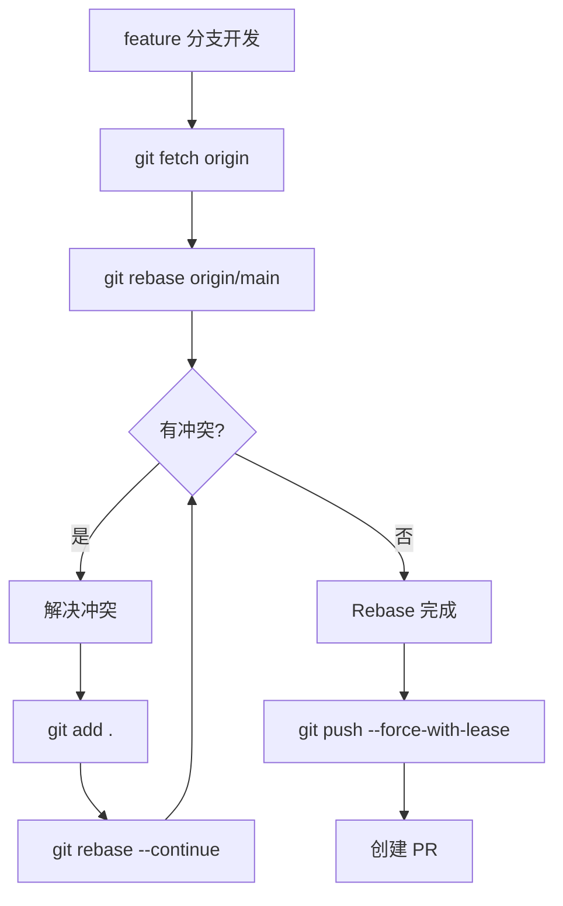

### 处理 Rebase 冲突

```bash
# 1. Rebase 时遇到冲突
git rebase origin/main
# Auto-merging src/app.js
# CONFLICT (content): Merge conflict in src/app.js

# 2. 解决冲突
vim src/app.js
# 编辑文件，解决冲突

# 3. 标记为已解决
git add src/app.js

# 4. 继续 Rebase
git rebase --continue

# 5. 如果放弃 Rebase
git rebase --abort
```

### Rebase 的注意事项

```markdown
## ⚠️ 注意事项

1. **不要在公共分支上 Rebase**
   - main、develop 等公共分支不要用 Rebase
   - 只在自己的 feature 分支上用

2. **Rebase 会修改历史**
   - commit hash 会改变
   - 推送时需要 --force-with-lease

3. **Rebase 可能多次冲突**
   - 如果有 10 个提交，可能要解决 10 次冲突
   - 比 merge 更繁琐

4. **保留备份**
   - Rebase 前创建备份分支
   - 出问题可以恢复
```

### 备份分支

```bash
# Rebase 前创建备份
git checkout feature/my-feature
git branch backup/my-feature-before-rebase

# 如果 Rebase 出问题
git checkout feature/my-feature
git reset --hard backup/my-feature-before-rebase
```

### 小贴士

```bash
# 配置别名
git config --global alias.rb 'rebase'
git config --global alias.rbi 'rebase -i'
git config --global alias.rbc 'rebase --continue'
git config --global alias.rba 'rebase --abort'

# 使用
git rbi HEAD~5
git rbc
git rba
```

记住：**Rebase 是重写历史的艺术，用得好是神器，用不好是灾难。记住黄金法则！**

---

## 18.5 交互式 Rebase：合并、拆分、删除提交

交互式 Rebase（`git rebase -i`）是 Git 中最强大的功能之一，让你可以像编辑文档一样编辑提交历史。

### 启动交互式 Rebase

```bash
# 交互式 rebase 最近 5 个提交
git rebase -i HEAD~5

# 交互式 rebase 到某个提交
git rebase -i abc1234

# 交互式 rebase 到某个分支
git rebase -i main
```

### 交互式编辑器

执行命令后会打开编辑器，显示：

```
pick abc1234 feat: 实现登录功能
pick def5678 fix: 修复 typo
pick 9ab9012 wip: 临时保存
pick 0123456 fix: 再次修复
pick 7890abc feat: 添加测试

# Rebase abc1234..7890abc onto def5678
#
# Commands:
# p, pick <commit> = use commit
# r, reword <commit> = use commit, but edit the commit message
# e, edit <commit> = use commit, but stop for amending
# s, squash <commit> = use commit, but meld into previous commit
# f, fixup <commit> = like "squash", but discard this commit's log message
# x, exec <command> = run command (the rest of the line) using shell
# d, drop <commit> = remove commit
```

### 操作一：合并提交（Squash）

把多个提交合并成一个。

```
# 合并前
pick abc1234 feat: 实现登录功能
pick def5678 fix: 修复 typo
pick 9ab9012 fix: 再次修复
pick 0123456 docs: 更新文档

# 合并后
pick abc1234 feat: 实现登录功能
fixup def5678 fix: 修复 typo
fixup 9ab9012 fix: 再次修复
pick 0123456 docs: 更新文档

# 结果：
# - 3 个提交合并成 1 个
# - 保留第一个提交的信息
# - 后面的提交信息被丢弃
```

使用 `squash` 可以编辑合并后的提交信息：

```
pick abc1234 feat: 实现登录功能
squash def5678 fix: 修复 typo
squash 9ab9012 fix: 再次修复

# 保存后会弹出编辑器，让你编辑合并后的提交信息
```

### 操作二：修改提交信息（Reword）

修改某个提交的信息。

```
# 修改前
pick abc1234 feat: 实现登录功能
pick def5678 fix: 修复 typo

# 修改后
reword abc1234 feat: 实现用户登录功能
pick def5678 fix: 修复 typo

# 保存后会弹出编辑器，让你修改 abc1234 的提交信息
```

### 操作三：删除提交（Drop）

删除不需要的提交。

```
# 删除前
pick abc1234 feat: 实现登录功能
pick def5678 wip: 临时调试
pick 9ab9012 feat: 添加测试

# 删除后
pick abc1234 feat: 实现登录功能
# 删除 def5678 这一行
pick 9ab9012 feat: 添加测试

# 或者使用 drop
drop def5678 wip: 临时调试
```

### 操作四：调整提交顺序

改变提交的顺序。

```
# 调整前
pick abc1234 feat: 实现登录功能
pick def5678 feat: 添加测试
pick 9ab9012 docs: 更新文档

# 调整后
pick abc1234 feat: 实现登录功能
pick 9ab9012 docs: 更新文档
pick def5678 feat: 添加测试
```

### 操作五：拆分提交（Edit）

把一个提交拆分成多个。

```
# 拆分前
pick abc1234 feat: 实现登录功能
edit def5678 feat: 添加测试和文档

# 保存后，rebase 会停在 def5678
```

然后执行：

```bash
# 1. 重置到上一个提交（保留修改）
git reset HEAD^

# 2. 查看状态
git status
# modified: src/test.js
# modified: docs/README.md

# 3. 先提交测试
git add src/test.js
git commit -m "test: 添加登录测试"

# 4. 再提交文档
git add docs/README.md
git commit -m "docs: 更新登录文档"

# 5. 继续 rebase
git rebase --continue
```

### 操作六：执行命令（Exec）

在每个提交后执行命令。

```
pick abc1234 feat: 实现登录功能
exec npm test
pick def5678 feat: 添加测试
exec npm test
```

这会在每个提交后运行 `npm test`，如果测试失败，rebase 会停止。

### 实战：整理提交历史

假设你有以下提交：

```bash
git log --oneline
7890abc feat: 添加测试
0123456 fix: 再次修复
9ab9012 wip: 临时保存
def5678 fix: 修复 typo
abc1234 feat: 实现登录功能
```

目标：
1. 合并 typo 修复到功能提交
2. 删除临时保存
3. 修改功能提交的描述

```bash
# 1. 启动交互式 rebase
git rebase -i HEAD~5

# 2. 编辑提交列表
reword abc1234 feat: 实现用户登录功能
fixup def5678 fix: 修复 typo
drop 9ab9012 wip: 临时保存
fixup 0123456 fix: 再次修复
pick 7890abc feat: 添加测试

# 3. 保存

# 4. 修改提交信息
# 弹出编辑器，修改 abc1234 的信息
# feat: 实现用户登录功能
#
# - 添加登录表单
# - 实现登录 API
# - 添加错误处理

# 5. 完成
git log --oneline
7890abc feat: 添加测试
abc1234 feat: 实现用户登录功能
```

### 交互式 Rebase 的工作流程

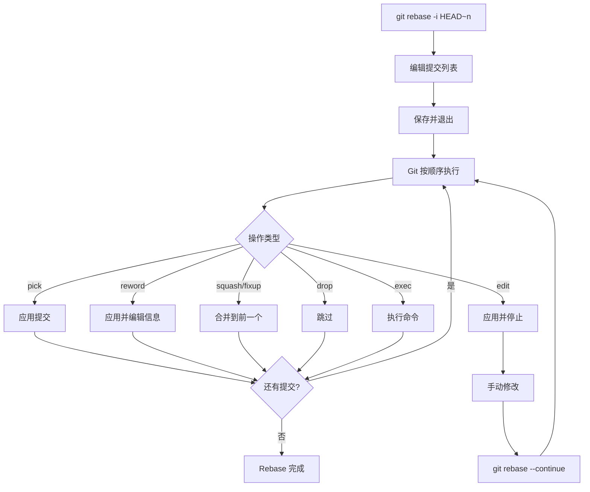

### 处理冲突

```bash
# 交互式 rebase 时遇到冲突
git rebase -i HEAD~5
# Auto-merging src/app.js
# CONFLICT (content): Merge conflict in src/app.js

# 解决冲突
vim src/app.js
git add src/app.js

# 继续
git rebase --continue

# 或者跳过这个提交
git rebase --skip

# 或者放弃
git rebase --abort
```

### 最佳实践

```markdown
## 交互式 Rebase 最佳实践

### ✅ 要做的
- [ ] Rebase 前创建备份分支
- [ ] 一次只处理少量提交（5-10 个）
- [ ] 写好提交信息
- [ ] 测试后再推送

### ❌ 不要做的
- [ ] 对已经推送的提交 Rebase
- [ ] 一次处理太多提交
- [ ] 在公共分支上 Rebase
- [ ] 不测试就推送
```

### 小贴士

```bash
# 配置别名
git config --global alias.ri 'rebase -i'

# 使用
git ri HEAD~5

# 查看 rebase 进度
git status
# rebase in progress; onto abc1234
```

记住：**交互式 Rebase 是提交历史的"编辑器"，让你可以精雕细琢每一个提交！**

---

## 18.6 Rebase 的黄金法则：不要对已推送的提交使用

Rebase 很强大，但也很危险。这一节，我们要反复强调一个**黄金法则**。

### 黄金法则

```markdown
## 🚨 Rebase 黄金法则

**永远不要对已经推送到远程的提交使用 Rebase！**

Never rebase commits that have been pushed to a remote repository!
```

### 为什么这是黄金法则？

#### 场景演示

```bash
# 你和同事都在 feature/login 分支上工作

# 你的本地分支
git log --oneline
abc1234 feat: 实现登录
def5678 fix: 修复 bug

# 同事的本地分支（基于同样的提交）
git log --oneline
abc1234 feat: 实现登录
def5678 fix: 修复 bug
7890abc feat: 添加测试
```

现在你对本地分支做了 Rebase：

```bash
git rebase -i HEAD~2
# 合并了两个提交

git log --oneline
xyz9999 feat: 实现登录（包含 bug 修复）
```

然后你强制推送：

```bash
git push --force origin feature/login
```

**结果**：

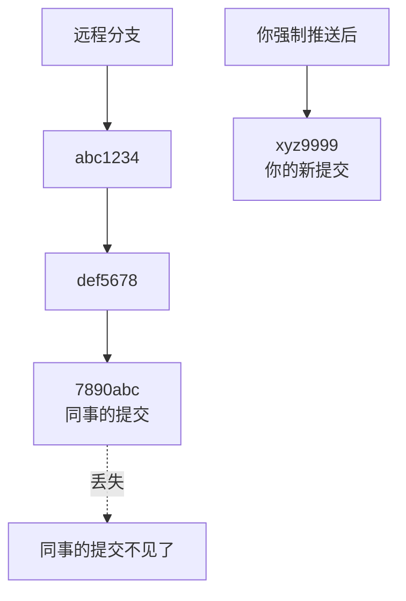

同事的 `7890abc` 提交在远程消失了！因为他的提交是基于 `def5678`，而 `def5678` 已经被 Rebase 成了 `xyz9999`。

### 会发生什么？

```bash
# 同事尝试推送他的提交
git push origin feature/login
# ! [rejected]        feature/login -> feature/login (non-fast-forward)
# error: failed to push some refs to '...'

# 同事尝试拉取
git pull origin feature/login
# CONFLICT (content): Merge conflict in src/login.js
# 大量的冲突！
```

**这就是传说中的"地狱般的合并"！**

### 什么时候可以 Rebase？

```markdown
## ✅ 可以 Rebase 的情况

1. **本地分支，从未推送**
   - 你一个人在开发
   - 代码还在本地

2. **个人分支，确认无人使用**
   - feature/xxx 分支只有你一个人
   - 在群里确认过

3. **推送前整理历史**
   - 准备创建 PR
   - 整理提交历史

## ❌ 绝对不能 Rebase 的情况

1. **main / master 分支**
   - 公共分支，多人使用

2. **develop 分支**
   - 团队共享的开发分支

3. **release 分支**
   - 发布分支，稳定性要求高

4. **已经合并到 main 的分支**
   - 历史已经确定

5. **其他人正在使用的分支**
   - 即使是你创建的
```

### 安全的 Rebase 流程

```bash
# 1. 确认分支状态
git branch -vv
# feature/login    abc1234 [origin/feature/login: ahead 3] 实现登录

# 2. 确认只有你一个人在使用
# 在群里问一声："有人在 feature/login 分支上工作吗？"

# 3. 创建备份分支（保险起见）
git branch backup/feature-login

# 4. 执行 Rebase
git rebase -i HEAD~3

# 5. 使用 --force-with-lease 推送
git push origin feature/login --force-with-lease

# 6. 通知团队成员
# "feature/login 分支历史已整理，请重新 pull"
```

### 如果已经 Rebase 了已推送的提交

```bash
# 情况：你不小心 Rebase 了已推送的提交

# 1. 不要 panic！

# 2. 从 reflog 找到原来的提交
git reflog
# abc1234 HEAD@{0}: rebase -i (finish): ...
# def5678 HEAD@{1}: rebase -i (start): ...
# 7890abc HEAD@{2}: commit: feat: 添加测试

# 3. 重置到 Rebase 前的状态
git reset --hard 7890abc

# 4. 正常推送
git push origin feature/login

# 世界恢复正常！
```

### 团队约定

```markdown
## Rebase 团队约定

### 个人分支
- 可以自由 Rebase
- 推送前必须 Rebase
- 使用 --force-with-lease

### 公共分支
- main、develop、release/* 禁止 Rebase
- 使用 Merge 而不是 Rebase

### 通知义务
- Rebase 后必须在群里通知
- 说明 Rebase 的分支和原因

### 恢复流程
- 如果 Rebase 出问题
- 从 reflog 恢复
- 通知团队
```

### 使用 `--force-with-lease`

```bash
# 安全的强制推送
git push origin feature/login --force-with-lease

# 这比 --force 安全，因为：
# 1. 检查远程是否有新提交
# 2. 如果有，拒绝推送
# 3. 防止覆盖他人的工作
```

### 可视化理解


### 记住这个口诀

```
Rebase 很强大，使用需谨慎
本地随便玩，推送要小心
公共分支禁，个人分支行
force 太危险，with-lease 更稳
```

### 小贴士

```bash
# 配置别名，强制使用 --force-with-lease
git config --global alias.pushf 'push --force-with-lease'

# 禁用 --force
git config --global alias.push-force 'push --force-with-lease'
```

记住：**Rebase 黄金法则是 Git 世界的"不要玩火"警告——遵守它，团队和谐；违反它，地狱合并！**

---

## 18.7 `git cherry-pick`：摘樱桃，精确选取提交

想象一下：你在 `feature/payment` 分支写了一个很棒的工具函数，现在 `feature/login` 分支也需要这个函数。怎么办？

**`git cherry-pick`** 让你可以像摘樱桃一样，精确地选取某个提交，应用到当前分支。

### 什么是 Cherry-pick？

**Cherry-pick**（摘樱桃）是将指定的提交应用到当前分支，而不需要合并整个分支。

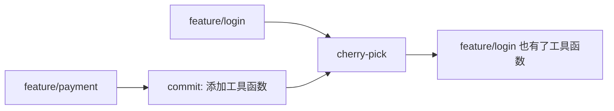

### 基础用法

```bash
# cherry-pick 一个提交
git cherry-pick abc1234

# cherry-pick 多个提交
git cherry-pick abc1234 def5678 7890abc

# cherry-pick 一个范围的提交
git cherry-pick abc1234^..7890abc
```

### 实战场景

#### 场景一：共享工具函数

```bash
# 你在 feature/payment 分支写了一个工具函数
# commit: def5678 feat: 添加日期格式化工具

# 现在 feature/login 也需要这个工具

# 1. 切换到 feature/login
git checkout feature/login

# 2. cherry-pick 这个提交
git cherry-pick def5678

# 3. 完成！feature/login 现在也有这个工具函数了
```

#### 场景二：修复 bug 到多个分支

```bash
# 你在 main 分支修复了一个 bug
# commit: abc1234 fix: 修复安全漏洞

# 需要把这个修复应用到 release/v1.0 和 release/v2.0

# 应用到 release/v1.0
git checkout release/v1.0
git cherry-pick abc1234

# 应用到 release/v2.0
git checkout release/v2.0
git cherry-pick abc1234

# 完成！两个发布分支都有了 bug 修复
```

#### 场景三：撤销错误的 cherry-pick

```bash
# 如果你 cherry-pick 错了提交

# 方法1：撤销
git cherry-pick --abort

# 方法2：重置
git reset --hard HEAD^
```

### Cherry-pick 的选项

#### 不自动提交

```bash
# cherry-pick 但不自动提交
git cherry-pick -n abc1234
# 或者
git cherry-pick --no-commit abc1234

# 这样你可以修改后再提交
git add .
git commit -m "feat: 添加工具函数（从 payment 分支）"
```

#### 保留提交信息

```bash
# 默认会保留原提交信息

git cherry-pick abc1234
# 提交信息：feat: 添加工具函数

# 添加签名
git cherry-pick -s abc1234
# 提交信息会添加 Signed-off-by
```

#### 编辑提交信息

```bash
# cherry-pick 并编辑提交信息
git cherry-pick -e abc1234
# 或者
git cherry-pick --edit abc1234
```

### 处理冲突

```bash
# cherry-pick 时遇到冲突
git cherry-pick abc1234
# Auto-merging src/utils.js
# CONFLICT (content): Merge conflict in src/utils.js

# 解决冲突
vim src/utils.js
git add src/utils.js

# 继续 cherry-pick
git cherry-pick --continue

# 或者跳过这个提交
git cherry-pick --skip

# 或者放弃
git cherry-pick --abort
```

### Cherry-pick 范围

```bash
# cherry-pick 一个范围的提交（不包括起始提交）
git cherry-pick abc1234..7890abc

# cherry-pick 一个范围的提交（包括起始提交）
git cherry-pick abc1234^..7890abc
```

### 实战：完整流程

```bash
# 场景：把 feature/payment 的 3 个提交 cherry-pick 到 feature/login

# 1. 查看 feature/payment 的提交
git log feature/payment --oneline -5
# 7890abc feat: 添加支付确认
# def5678 feat: 添加日期工具
# 9ab9012 feat: 添加验证
# abc1234 feat: 初始化支付模块

# 2. 切换到 feature/login
git checkout feature/login

# 3. cherry-pick 中间 3 个提交
git cherry-pick abc1234..7890abc

# 4. 如果有冲突，解决后继续
# ... 解决冲突 ...
git cherry-pick --continue

# 5. 完成
git log --oneline -5
# xyz9999 feat: 添加支付确认
# xyz8888 feat: 添加日期工具
# xyz7777 feat: 添加验证
# ... feature/login 原有的提交
```

### Cherry-pick vs Merge

| 特性 | Cherry-pick | Merge |
|------|-------------|-------|
| 范围 | 单个/多个提交 | 整个分支 |
| 历史 | 线性 | 可能分叉 |
| 使用场景 | 选取特定提交 | 合并功能 |
| 冲突 | 逐个处理 | 一次性处理 |

### 注意事项

```markdown
## ⚠️ Cherry-pick 注意事项

1. **提交 hash 会改变**
   - cherry-pick 后的提交是新提交
   - hash 和原提交不同

2. **可能有冲突**
   - 如果当前分支和 cherry-pick 的修改有冲突
   - 需要手动解决

3. **不要滥用**
   - 如果 cherry-pick 太多提交
   - 考虑直接 merge 分支

4. **记录来源**
   - 在提交信息中注明 cherry-pick 来源
   - 方便追溯
```

### 最佳实践

```bash
# cherry-pick 时添加来源信息
git cherry-pick -x abc1234

# 提交信息会自动添加：
# (cherry picked from commit abc1234)
```

### 小贴士

```bash
# 配置别名
git config --global alias.cp 'cherry-pick'
git config --global alias.cpc 'cherry-pick --continue'
git config --global alias.cpa 'cherry-pick --abort'

# 使用
git cp abc1234
git cpc
git cpa
```

记住：**Cherry-pick 是 Git 的"精确手术刀"——只取你需要的，不多不少！**

---

## 18.8 `git tag`：给版本打标签，告别版本号混乱

你的项目发布了 v1.0.0，过了一个月，有人报告了一个 bug，说是在"上个月的版本"出现的。你一脸懵逼："上个月的版本是哪个提交？"

这时候，**`git tag`** 就是你的救星！

### 什么是 Tag？

**Tag**（标签）是给特定的提交打上的标记，通常用于标记版本发布点（如 v1.0.0、v2.0.0）。

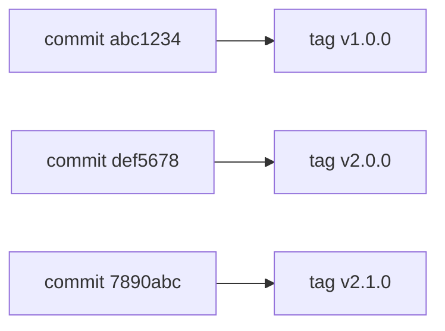

### 两种类型的 Tag

Git 支持两种类型的标签：

#### 1. 轻量标签（Lightweight）

```bash
# 轻量标签只是一个指针，指向某个提交
git tag v1.0.0

# 相当于一个永不移动的分支
```

#### 2. 附注标签（Annotated）

```bash
# 附注标签是一个完整的 Git 对象
# 包含标签名、标签信息、签名等
git tag -a v1.0.0 -m "版本 1.0.0 发布"
```

### 创建标签

#### 轻量标签

```bash
# 在当前提交创建轻量标签
git tag v1.0.0

# 在指定提交创建标签
git tag v1.0.0 abc1234
```

#### 附注标签

```bash
# 创建附注标签
git tag -a v1.0.0 -m "版本 1.0.0 发布"

# 创建附注标签（交互式编辑信息）
git tag -a v1.0.0

# 在指定提交创建标签
git tag -a v2.0.0 -m "版本 2.0.0 发布" def5678
```

### 查看标签

```bash
# 列出所有标签
git tag

# 列出所有标签（按版本排序）
git tag -l

# 搜索标签
git tag -l "v1.*"

# 查看标签信息
git show v1.0.0

# 查看轻量标签
git show v1.0.0
# commit abc1234...

# 查看附注标签
git show v1.0.0
# tag v1.0.0
# Tagger: Your Name <email@example.com>
# Date:   Mon Jan 1 00:00:00 2024 +0800
#
# 版本 1.0.0 发布
#
# commit abc1234...
```

### 推送标签到远程

```bash
# 推送指定标签到远程
git push origin v1.0.0

# 推送所有标签到远程
git push origin --tags

# 推送所有标签（另一种写法）
git push origin --follow-tags
```

### 删除标签

```bash
# 删除本地标签
git tag -d v1.0.0

# 删除远程标签
git push origin --delete v1.0.0

# 或者
git push origin :refs/tags/v1.0.0
```

### 检出标签

```bash
# 检出标签（会进入 detached HEAD 状态）
git checkout v1.0.0

# 从标签创建分支
git checkout -b version-1.0 v1.0.0
```

### 版本号规范（Semantic Versioning）

推荐使用语义化版本规范：

```
版本格式：主版本号.次版本号.修订号

MAJOR.MINOR.PATCH

例如：v1.2.3

- MAJOR（主版本号）：不兼容的 API 修改
- MINOR（次版本号）：向下兼容的功能新增
- PATCH（修订号）：向下兼容的问题修复
```

### 实战：发布版本

```bash
# 1. 确保代码已经合并到 main
git checkout main
git pull origin main

# 2. 运行测试
npm test

# 3. 更新版本号（在 package.json 中）
vim package.json
# "version": "1.0.0"

git add package.json
git commit -m "chore: 更新版本号到 1.0.0"

# 4. 创建标签
git tag -a v1.0.0 -m "版本 1.0.0 发布

- 实现用户登录功能
- 实现支付功能
- 添加管理后台

Full Changelog: https://..."

# 5. 推送代码和标签
git push origin main
git push origin v1.0.0

# 6. 在 GitHub/GitLab 上创建 Release
# 添加 Release Notes
```

### 标签的工作流程

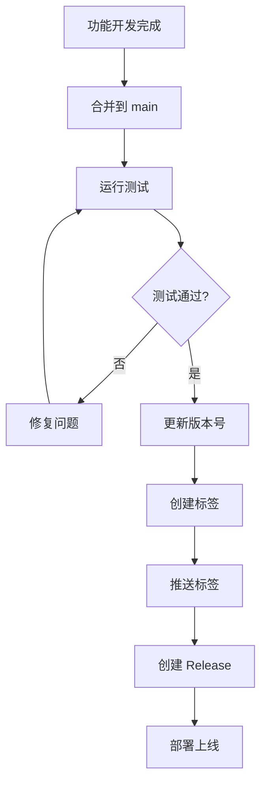

### 轻量标签 vs 附注标签

| 特性 | 轻量标签 | 附注标签 |
|------|----------|----------|
| 创建 | `git tag v1.0.0` | `git tag -a v1.0.0` |
| 包含信息 | 无 | 有（标签信息、签名等） |
| 推荐场景 | 临时标记 | 正式发布 |
| 对象类型 | 引用 | Git 对象 |

**建议**：正式发布使用附注标签，临时标记使用轻量标签。

### 签名标签（GPG）

```bash
# 创建 GPG 签名的标签
git tag -s v1.0.0 -m "版本 1.0.0 发布"

# 验证签名标签
git tag -v v1.0.0
```

### 小贴士

```bash
# 配置别名
git config --global alias.tag-list 'tag -l'
git config --global alias.tag-push 'push --tags'

# 使用
git tag-list
git tag-push

# 查看最新标签
git describe --tags --abbrev=0
```

记住：**Tag 是版本的"里程碑"，让你随时可以找到重要的历史节点！**

---

## 18.9 轻量标签 vs 附注标签：什么时候用哪个？

上一节我们知道了 Git 有两种标签，但它们到底有什么区别？什么时候用轻量标签，什么时候用附注标签？

### 本质区别

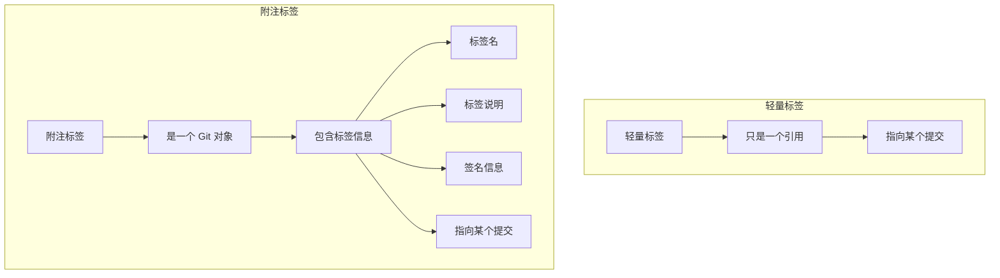

### 对比表

| 特性 | 轻量标签 | 附注标签 |
|------|----------|----------|
| 创建命令 | `git tag v1.0.0` | `git tag -a v1.0.0` |
| Git 对象 | 否 | 是 |
| 包含信息 | 无 | 有（名称、说明、签名等） |
| 可以签名 | 否 | 是（GPG） |
| 存储空间 | 极小 | 较小 |
| 推荐用途 | 临时标记 | 正式发布 |

### 轻量标签详解

```bash
# 创建轻量标签
git tag v1.0.0

# 查看轻量标签
git show v1.0.0
# commit abc1234def5678901234567890abcdef12345678
# Author: Your Name <email@example.com>
# Date:   Mon Jan 1 00:00:00 2024 +0800
#
#     feat: 实现登录功能
```

**轻量标签**本质上就是一个指向提交的引用，和分支类似，只是不会移动。

### 附注标签详解

```bash
# 创建附注标签
git tag -a v1.0.0 -m "版本 1.0.0 发布"

# 查看附注标签
git show v1.0.0
# tag v1.0.0
# Tagger: Your Name <email@example.com>
# Date:   Mon Jan 1 00:00:00 2024 +0800
#
# 版本 1.0.0 发布
#
# commit abc1234def5678901234567890abcdef12345678
# Author: Your Name <email@example.com>
# Date:   Mon Jan 1 00:00:00 2024 +0800
#
#     feat: 实现登录功能
```

**附注标签**是一个完整的 Git 对象，包含：
- 标签名
- 标签说明（-m 的内容）
- 打标签的人（Tagger）
- 打标签的时间
- 指向的提交

### 什么时候用轻量标签？

```markdown
## ✅ 使用轻量标签的场景

1. **临时标记**
   - 测试某个版本
   - 临时保存某个状态

2. **个人项目**
   - 不需要详细记录
   - 快速标记

3. **内部测试版本**
   - v0.1.0-alpha
   - v0.1.0-beta
   - 不需要正式记录

4. **快速回滚点**
   - 部署前标记
   - 方便快速回滚
```

```bash
# 临时标记当前状态
git tag temp-before-refactor

# 测试后删除
git tag -d temp-before-refactor
```

### 什么时候用附注标签？

```markdown
## ✅ 使用附注标签的场景

1. **正式发布版本**
   - v1.0.0
   - v2.0.0
   - 需要详细记录

2. **需要签名**
   - 安全敏感项目
   - 需要验证标签来源

3. **团队协作**
   - 需要知道谁打的标签
   - 需要知道标签说明

4. **开源项目**
   - 对外发布的版本
   - 需要专业的版本管理
```

```bash
# 正式发布版本
git tag -a v1.0.0 -m "版本 1.0.0 发布

- 实现用户登录
- 实现支付功能
- 添加管理后台"
```

### 转换标签类型

```bash
# 轻量标签转附注标签

# 1. 删除轻量标签
git tag -d v1.0.0

# 2. 创建附注标签（指向同一个提交）
git tag -a v1.0.0 -m "版本 1.0.0 发布"

# 注意：这会改变标签的 hash，如果已经推送，需要强制推送
```

### 团队约定

```markdown
## 标签使用团队约定

### 附注标签（默认）
- 所有正式发布版本使用附注标签
- 必须包含版本说明
- 必须推送到远程

### 轻量标签（例外）
- 内部测试版本可以使用轻量标签
- 临时标记可以使用轻量标签
- 不需要推送到远程

### 标签命名
- 正式版本：v1.0.0, v2.0.0
- 测试版本：v1.0.0-beta, v1.0.0-rc1
- 临时标记：temp-xxx, backup-xxx
```

### 查看标签类型

```bash
# 查看标签类型
git cat-file -t v1.0.0
# commit（轻量标签）
# tag（附注标签）

# 查看附注标签的详细信息
git cat-file -p v1.0.0
# object abc1234def5678901234567890abcdef12345678
# type commit
# tag v1.0.0
# tagger Your Name <email@example.com> 1704067200 +0800
#
# 版本 1.0.0 发布
```

### 小贴士

```bash
# 默认创建附注标签
git config --global tag.forceSignAnnotated true

# 或者配置别名
git config --global alias.tag-release 'tag -a'

# 使用
git tag-release v1.0.0 -m "版本 1.0.0 发布"
```

记住：**轻量标签是"便签"，附注标签是"证书"——正式场合用证书，临时场合用便签！**

---

## 18.10 推送标签到远程：`git push --tags`

创建了标签，但队友看不到？那是因为标签默认不会自动推送到远程！

### 标签的本地性

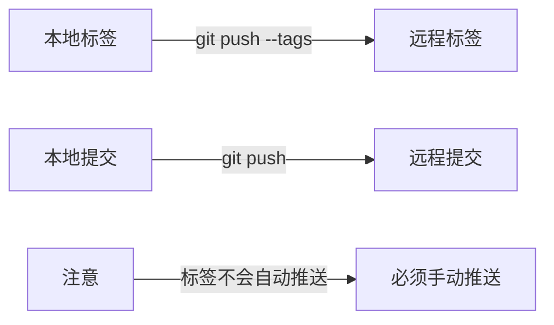

**重要**：标签是本地的，不会随 `git push` 自动推送到远程。

### 推送标签的命令

```bash
# 推送指定标签到远程
git push origin v1.0.0

# 推送所有标签到远程
git push origin --tags

# 推送所有标签（另一种写法）
git push origin --follow-tags

# 推送时同时推送标签
git push origin main --tags
```

### 推送单个标签

```bash
# 创建标签
git tag -a v1.0.0 -m "版本 1.0.0 发布"

# 推送标签到远程
git push origin v1.0.0

# 输出：
# * [new tag]         v1.0.0 -> v1.0.0
```

### 推送所有标签

```bash
# 推送所有本地标签到远程
git push origin --tags

# 输出：
# * [new tag]         v1.0.0 -> v1.0.0
# * [new tag]         v1.1.0 -> v1.1.0
# * [new tag]         v2.0.0 -> v2.0.0
```

### 删除远程标签

```bash
# 删除本地标签
git tag -d v1.0.0

# 删除远程标签
git push origin --delete v1.0.0

# 或者
git push origin :refs/tags/v1.0.0
```

### 获取远程标签

```bash
# 获取远程标签（不自动获取）
git fetch origin --tags

# 或者
git fetch origin tag v1.0.0

# 获取所有远程标签
git fetch --tags
```

### 推送标签的工作流程

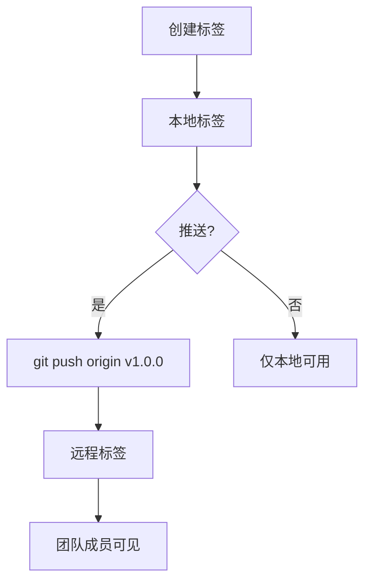

### 常见问题

#### 问题1：推送标签被拒绝

```bash
git push origin v1.0.0
# ! [rejected]        v1.0.0 -> v1.0.0 (already exists)

# 原因：远程已经有同名标签

# 解决：先删除远程标签，再推送
git push origin --delete v1.0.0
git push origin v1.0.0

# 或者强制推送（谨慎使用）
git push origin v1.0.0 --force
```

#### 问题2：队友看不到标签

```bash
# 队友执行
git fetch --tags

# 或者
git fetch origin --tags

# 然后查看
git tag -l
```

#### 问题3：标签和提交一起推送

```bash
# 推送提交时同时推送标签
git push origin main --tags

# 或者配置自动推送标签
git config --global push.followTags true
```

### 自动推送标签

```bash
# 配置推送时自动推送附注标签
git config --global push.followTags true

# 这样 git push 会自动推送附注标签
# 轻量标签不会自动推送
```

### 标签同步脚本

```bash
#!/bin/bash
# sync-tags.sh - 同步标签

echo "🔄 同步标签..."

# 获取远程标签
git fetch --tags

# 推送本地标签
git push --tags

echo "✅ 标签同步完成！"
```

### 小贴士

```bash
# 配置别名
git config --global alias.push-tags 'push --tags'
git config --global alias.fetch-tags 'fetch --tags'

# 使用
git push-tags
git fetch-tags
```

记住：**标签是"本地特产"，想让别人看到，必须主动"快递"过去！**

---

## 18.11 `git notes`：给提交添加备注

提交信息写得太简洁，后来想补充说明？或者想给某个提交添加审查记录？

**`git notes`** 让你可以给提交添加额外的备注，而不修改提交本身。

### 什么是 Git Notes？

**Git Notes** 是给提交添加额外信息的机制，信息存储在独立的引用中，不会修改原提交。

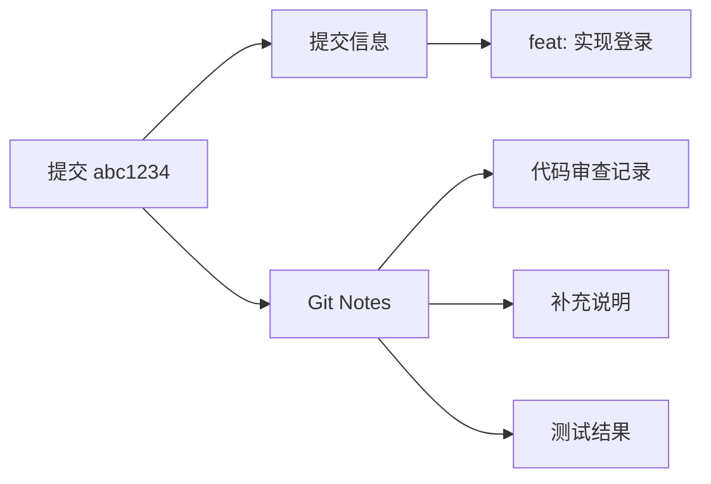

### 基础用法

```bash
# 给当前提交添加备注
git notes add -m "代码审查通过"

# 给指定提交添加备注
git notes add -m "需要优化性能" abc1234

# 查看备注
git notes show

# 查看指定提交的备注
git notes show abc1234

# 编辑备注
git notes edit

# 删除备注
git notes remove
```

### 实战场景

#### 场景一：代码审查记录

```bash
# 审查完代码后，添加审查记录
git notes add -m "Reviewed by 张三
- 代码逻辑正确
- 建议添加更多测试
- 总体通过" abc1234

# 查看备注
git notes show abc1234
# 代码审查记录...
```

#### 场景二：补充提交说明

```bash
# 提交信息写得太简单
git commit -m "fix bug"

# 事后添加详细说明
git notes add -m "修复了登录时的空指针异常
原因：用户未输入密码时，后端返回 null
解决：添加空值检查"

# 查看
git log --notes
```

#### 场景三：标记重要提交

```bash
# 标记性能优化提交
git notes add -m "⚡ 性能优化
优化前：加载时间 5s
优化后：加载时间 1s
优化方法：使用虚拟列表" abc1234
```

### 查看带备注的日志

```bash
# 查看日志时显示备注
git log --notes

# 显示格式
git log --notes --format='%h %s%n%N'

# 输出：
# abc1234 feat: 实现登录
# 代码审查通过
#
# def5678 fix: 修复 bug
# 修复了登录时的空指针异常
```

### Notes 的工作原理

```bash
# Notes 存储在 refs/notes/commits
git ls-remote origin refs/notes/commits

# Notes 是独立的 Git 对象
# 不会修改原提交的 hash
```

### 推送和获取 Notes

```bash
# 推送 Notes 到远程
git push origin refs/notes/commits

# 获取远程 Notes
git fetch origin refs/notes/commits:refs/notes/commits

# 配置自动获取 Notes
git config --global remote.origin.fetch "+refs/notes/*:refs/notes/*"
```

### 注意事项

```markdown
## ⚠️ 注意事项

1. **Notes 是独立的**
   - 不会修改提交的 hash
   - 不会影响提交历史

2. **Notes 需要单独推送**
   - 不会随 git push 自动推送
   - 需要推送到 refs/notes/commits

3. **不是所有工具都支持**
   - GitHub/GitLab 不显示 Notes
   - 主要在命令行使用

4. **Notes 可以有多条**
   - 可以给一个提交添加多条 Notes
   - 会追加而不是覆盖
```

### 使用场景总结

```markdown
## ✅ 适合使用 Notes 的场景

1. **代码审查记录**
   - 记录审查意见
   - 记录审查结果

2. **补充说明**
   - 提交信息不够详细
   - 事后补充背景

3. **内部标记**
   - 标记重要提交
   - 记录测试结果

## ❌ 不适合使用 Notes 的场景

1. **对外发布的项目**
   - GitHub/GitLab 不显示
   - 用户看不到

2. **重要的项目信息**
   - 应该用提交信息
   - 或者文档

3. **团队协作**
   - 不是所有人都用 Notes
   - 沟通成本高
```

### 小贴士

```bash
# 配置别名
git config --global alias.notes-add 'notes add'
git config --global alias.notes-show 'notes show'

# 使用
git notes-add -m "审查通过"
git notes-show

# 查看带 notes 的 log
git config --global alias.ln 'log --notes'
git ln
```

记住：**Git Notes 是提交的"便签纸"——可以补充信息，但别依赖它做重要记录！**

---

## 18.12 进阶命令组合：高手都在用的技巧

掌握了单个命令，现在让我们看看高手是如何组合这些命令，解决复杂问题的。

### 技巧一：快速找到引入 bug 的提交

```bash
# 二分查找，快速定位问题提交
git bisect start
git bisect bad HEAD          # 当前版本有问题
git bisect good v1.0.0       # v1.0.0 版本没问题

# Git 会自动检出中间版本
# 测试后标记
git bisect good   # 这个版本没问题
git bisect bad    # 这个版本有问题

# 重复直到找到问题提交
# 完成后重置
git bisect reset
```

### 技巧二：批量修改历史提交

```bash
# 修改最近 5 个提交的作者信息
git rebase -i HEAD~5

# 在编辑器中把 pick 改成 edit
# 然后逐个修改

git commit --amend --author="New Name <new@email.com>"
git rebase --continue
```

### 技巧三：清理仓库大文件

```bash
# 找出仓库中的大文件
git rev-list --objects --all | \
  git cat-file --batch-check='%(objecttype) %(objectname) %(objectsize) %(rest)' | \
  awk '/^blob/ {print $3, $4}' | \
  sort -rn | head -20

# 使用 filter-branch 或 filter-repo 清理
# 安装 git-filter-repo
pip install git-filter-repo

# 删除大文件
git filter-repo --strip-blobs-bigger-than 10M
```

### 技巧四：快速切换工作目录

```bash
# 使用 worktree，同时处理多个分支

# 添加新的 worktree
git worktree add ../project-feature feature-branch

# 切换到新的 worktree
cd ../project-feature

# 现在你可以同时在两个目录处理不同分支

# 列出所有 worktree
git worktree list

# 删除 worktree
git worktree remove ../project-feature
```

### 技巧五：生成变更日志

```bash
# 根据提交信息生成变更日志
git log --pretty=format:"- %s" v1.0.0..v2.0.0

# 按类型分组
echo "## Features"
git log --pretty=format:"- %s" v1.0.0..v2.0.0 --grep="^feat"

echo "## Bug Fixes"
git log --pretty=format:"- %s" v1.0.0..v2.0.0 --grep="^fix"

echo "## Documentation"
git log --pretty=format:"- %s" v1.0.0..v2.0.0 --grep="^docs"
```

### 技巧六：快速回滚到指定版本

```bash
# 方法1：使用 revert（推荐，保留历史）
git revert abc1234..HEAD

# 方法2：使用 reset（丢弃历史，谨慎使用）
git reset --hard abc1234

# 方法3：使用 checkout（临时查看）
git checkout abc1234
```

### 技巧七：批量重命名文件并保留历史

```bash
# 使用 git mv 重命名，保留历史
git mv old-name.js new-name.js
git commit -m "refactor: 重命名文件"

# 批量重命名
for file in *.js; do
    git mv "$file" "${file%.js}.ts"
done
git commit -m "refactor: 迁移到 TypeScript"
```

### 技巧八：快速创建补丁

```bash
# 创建补丁文件
git diff > fix.patch

# 或者包含提交信息
git format-patch HEAD~3

# 应用补丁
git apply fix.patch

# 或者使用 am（保留提交信息）
git am 0001-fix-bug.patch
```

### 技巧九：统计代码贡献

```bash
# 统计每个人的提交数
git shortlog -sn

# 统计每个人的增删行数
git log --format='%aN' | sort -u | while read name; do
    echo -en "$name\t"
    git log --author="$name" --pretty=tformat: --numstat | \
        awk '{ add += $1; subs += $2; loc += $1 - $2 } END { printf "added: %s, removed: %s, total: %s\n", add, subs, loc }'
done

# 统计每天/每周的提交
git log --pretty=format:"%ad" --date=short | sort | uniq -c
```

### 技巧十：快速备份和恢复

```bash
# 创建备份分支
git branch backup-$(date +%Y%m%d-%H%M%S)

# 或者使用 bundle（包含所有分支和标签）
git bundle create backup.bundle --all

# 恢复 bundle
git clone backup.bundle
```

### 高手配置

```bash
# 在 .gitconfig 中添加这些别名

[alias]
    # 快速查看状态
    st = status -sb
    
    # 漂亮的日志
    lg = log --oneline --graph --decorate --all
    
    # 查看最近提交
    last = log -1 HEAD --stat
    
    # 快速提交
    cm = commit -m
    
    # 快速切换
    co = checkout
    
    # 快速分支
    br = branch
    
    # 快速 diff
    df = diff
    
    # 快速添加
    aa = add -A
    
    # 撤销修改
    undo = reset HEAD~1 --mixed
    
    # 查看远程
    rv = remote -v
    
    # 快速 stash
    ss = stash save
    sp = stash pop
    sl = stash list
    
    # 快速 rebase
    rb = rebase
    rbi = rebase -i
    rbc = rebase --continue
    rba = rebase --abort
    
    # 快速 cherry-pick
    cp = cherry-pick
    cpc = cherry-pick --continue
    cpa = cherry-pick --abort
```

### 小贴士

```bash
# 使用 git reflog 找回丢失的提交
git reflog

# 使用 git fsck 检查仓库完整性
git fsck

# 使用 git gc 清理和优化仓库
git gc

# 使用 git count-objects 查看仓库大小
git count-objects -vH
```

记住：**命令的组合使用是 Git 高手的标志——单个命令是基础，组合使用才是艺术！**

---

**第18章完**

